# System Design: Instagram

> **Interview Level:** Senior SDE (Google / Microsoft / Meta bar)  
> **Estimated Time:** 45–60 minutes  
> **Framework:** Hello Interview Delivery Framework

---

## Table of Contents

1. [Problem Statement & Scope](#1-problem-statement--scope)
2. [Requirements](#2-requirements)
3. [Capacity Estimation](#3-capacity-estimation)
4. [Core Entities](#4-core-entities)
5. [API Design](#5-api-design)
6. [Data Model / Schema](#6-data-model--schema)
7. [High-Level Architecture](#7-high-level-architecture)
8. [Deep Dives](#8-deep-dives)
9. [Trade-offs & Alternatives](#9-trade-offs--alternatives)
10. [Failure Modes & Reliability](#10-failure-modes--reliability)
11. [Interview Cheat Sheet](#11-interview-cheat-sheet)

---

## 1. Problem Statement & Scope

### 1.1 Problem Statement

Design a photo-sharing social network similar to Instagram that allows users to:

- Upload and share photos/videos
- Follow other users and view a personalized home feed
- Post ephemeral **Stories** (24-hour content)
- Like, comment on, and save posts
- Discover content via search and explore

### 1.2 What Instagram Is (Context for Interviewer)

Instagram is a **media-heavy, read-heavy** social graph product. The dominant engineering challenges are:

| Challenge | Why It Matters |
|-----------|----------------|
| Feed generation at scale | Every user expects a fresh, ranked feed on open |
| Media delivery latency | Photos/videos must load in <200ms globally |
| Write amplification | One post → fan-out to millions of followers |
| Ephemeral stories | Separate TTL lifecycle from permanent posts |
| Consistency vs availability | Likes/comments can be eventually consistent; payments cannot |

### 1.3 In Scope (Must Design)

- User registration, authentication, profiles
- Photo/video upload pipeline (original + transcoded variants)
- Follow/unfollow graph
- Home feed (chronological + ranked hybrid)
- Stories (create, view, expire)
- Likes and comments
- CDN-based media delivery
- Notifications (push for likes, follows, comments)

### 1.4 Out of Scope (Explicitly State in Interview)

- Direct messaging (DMs) — separate system
- Reels / short-form video recommendation engine (TikTok-like; mention as extension)
- Ads / monetization / billing
- Content moderation / ML classification (mention as async pipeline)
- Instagram Shopping / checkout
- Live streaming

### 1.5 Assumptions

- 500M DAU, 1B MAU
- Average user follows 200 accounts, has 150 followers
- 80% mobile clients (iOS/Android), 20% web
- Global deployment (multi-region)
- Photos dominate (70%), short videos (30%)

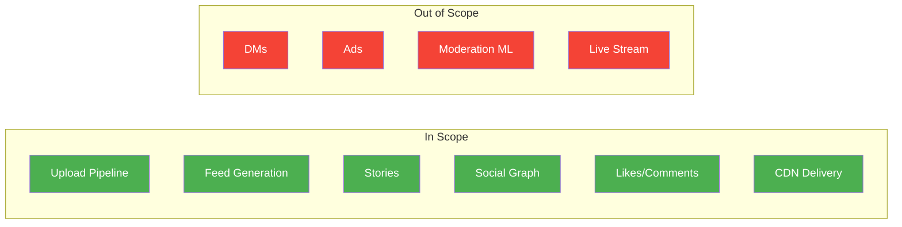

---

## 2. Requirements

### 2.1 Functional Requirements

#### Must-Have (P0)

| ID | Requirement | Notes |
|----|-------------|-------|
| F1 | Users can register, login, manage profile | OAuth2 / JWT |
| F2 | Upload photos (JPEG, PNG, HEIC) up to 30MB | Async processing |
| F3 | Upload videos up to 60s, up to 100MB | Transcoding required |
| F4 | Follow / unfollow users | Directed graph |
| F5 | View home feed of followed users' posts | Paginated, cursor-based |
| F6 | Create stories visible 24 hours | Separate TTL store |
| F7 | Like / unlike posts | Idempotent |
| F8 | Comment on posts | Threaded optional |
| F9 | View user profile with grid of posts | Cursor pagination |
| F10 | Push notifications for engagement | At-least-once delivery |

#### Nice-to-Have (P1)

| ID | Requirement | Notes |
|----|-------------|-------|
| F11 | Ranked / personalized feed | ML ranking layer |
| F12 | Explore / discover page | Separate recommendation |
| F13 | Save posts to collections | User-curated |
| F14 | Hashtag search | Inverted index |
| F15 | Tag users in photos | Graph + notification |
| F16 | Story reactions (emoji) | Lightweight engagement |

### 2.2 Non-Functional Requirements

#### Must-Have

| ID | Requirement | Target |
|----|-------------|--------|
| NF1 | Feed load latency (p99) | < 300ms |
| NF2 | Photo display latency (CDN hit) | < 100ms |
| NF3 | Upload acknowledgment | < 500ms (async processing OK) |
| NF4 | Availability | 99.99% |
| NF5 | Durability of media | 99.999999999% (11 nines) |
| NF6 | Feed freshness | New posts visible within 5s for regular users |
| NF7 | Horizontal scalability | Linear scale to 1B users |

#### Nice-to-Have

| ID | Requirement | Target |
|----|-------------|--------|
| NF8 | Story view count accuracy | Approximate (HyperLogLog) |
| NF9 | Global write consistency | Eventual for likes; strong for account |
| NF10 | Multi-region active-active | RPO < 1 min |

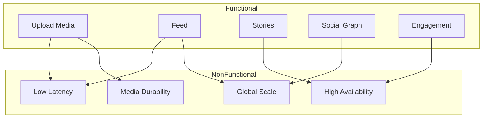

---

## 3. Capacity Estimation

### 3.1 Traffic Assumptions

| Metric | Value |
|--------|-------|
| DAU | 500M |
| MAU | 1B |
| Posts per user per day | 0.5 (250M posts/day) |
| Stories per user per day | 1 (500M stories/day) |
| Feed reads per user per day | 20 (10B feed reads/day) |
| Likes per user per day | 10 (5B likes/day) |
| Comments per user per day | 2 (1B comments/day) |
| Average photo size (original) | 2 MB |
| Average video size (original) | 15 MB |
| Average followers per user | 150 |
| Average following per user | 200 |

### 3.2 QPS Calculations

```
Posts/day     = 500M × 0.5        = 250M/day
Posts/sec     = 250M / 86400      ≈ 2,900 write QPS

Stories/day   = 500M × 1          = 500M/day
Stories/sec   = 500M / 86400      ≈ 5,800 write QPS

Feed reads/day = 500M × 20        = 10B/day
Feed read QPS  = 10B / 86400      ≈ 115,000 read QPS

Likes/sec     = 5B / 86400        ≈ 58,000 QPS

Peak multiplier (3×)              ≈ 350K feed QPS peak
```

### 3.3 Storage Estimation

**Photos (70% of posts):**
```
250M posts/day × 70% × 2 MB original     = 350 TB/day raw
Transcoded variants (3 sizes × 500 KB avg) = ~260 TB/day
Total media/day                          ≈ 610 TB/day
Annual (with 30% dedup/compression)      ≈ 150 PB/year
```

**Stories (ephemeral — 24h retention):**
```
500M stories/day × 1 MB avg × 1 day retention = 500 PB/day peak
(Actually stored ~24h rolling: 500M × 1MB = 500 TB steady state)
```

**Metadata (posts, users, follows):**
```
Posts metadata: 250M/day × 500 bytes × 365 × 5 years ≈ 230 TB
User records: 1B × 2 KB = 2 TB
Follow edges: 1B × 200 × 50 bytes = 10 TB
Likes: 5B/day × 30 bytes × 90 days retention ≈ 13.5 TB
```

### 3.4 Bandwidth

```
CDN egress (feed reads):
  10B reads/day × 500 KB avg media = 5 EB/day → unrealistic without cache
  
Realistic with 95% CDN hit rate:
  10B × 500 KB × 5% origin = 250 TB/day origin
  CDN serves: 4.75 EB/day (handled by edge)

Upload ingress:
  250M × 1.4 MB avg = 350 TB/day upload
```

### 3.5 Memory (Feed Cache)

```
Celebrity threshold: > 1M followers → pull model
Regular user fan-out cache:

Average user feed cache:
  200 following × 500 bytes/post_ref × 500 posts cached = 50 MB/user (too high)

Optimized (post IDs only, 1000 entries):
  200 × 8 bytes × 1000 = 1.6 MB/user × 500M active = 800 PB (infeasible)

→ Use hybrid: cache only hot users' outboxes in Redis
  Top 10M users generate 80% of content
  10M × 1.6 MB = 16 TB Redis cluster (feasible)
```

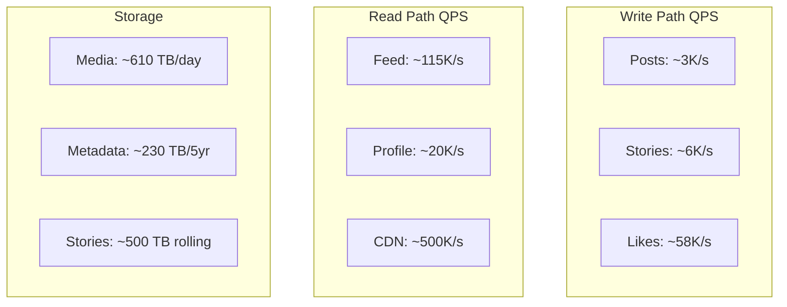

---

## 4. Core Entities

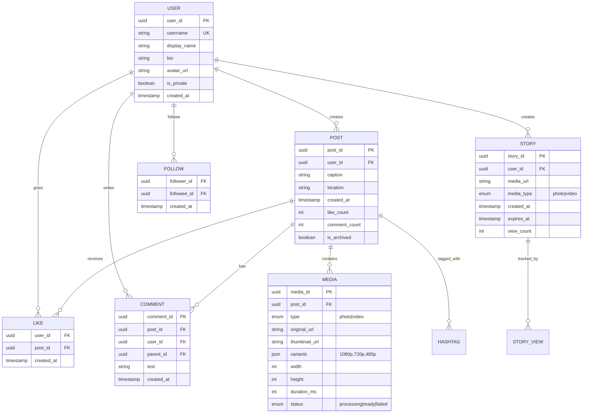

### Entity Summary

| Entity | Purpose | Storage |
|--------|---------|---------|
| User | Identity, profile | PostgreSQL / Cassandra |
| Post | Permanent content unit | Cassandra (time-series friendly) |
| Media | Binary assets + metadata | S3 + CDN |
| Story | Ephemeral 24h content | Redis + S3 (TTL) |
| Follow | Directed social edge | Graph store / adjacency lists |
| Like | Engagement signal | Cassandra / Redis counter |
| Comment | Text engagement | PostgreSQL / Cassandra |

---

## 5. API Design

### 5.1 REST API Conventions

- Base URL: `https://api.instagram.com/v1`
- Auth: Bearer JWT in `Authorization` header
- Pagination: Cursor-based (`?cursor=xxx&limit=20`)
- Idempotency: `Idempotency-Key` header for writes
- Rate limiting: 1000 req/min per user (reads), 100/min (writes)

### 5.2 Core Endpoints

#### Authentication

```
POST /v1/auth/register
POST /v1/auth/login
POST /v1/auth/refresh
POST /v1/auth/logout
```

#### Users & Profiles

```
GET    /v1/users/{user_id}
PATCH  /v1/users/{user_id}
GET    /v1/users/{user_id}/posts?cursor=&limit=20
GET    /v1/users/me
```

**GET /v1/users/{user_id}**

Request:
```http
GET /v1/users/abc123 HTTP/1.1
Authorization: Bearer <token>
```

Response `200 OK`:
```json
{
  "user_id": "abc123",
  "username": "jane_doe",
  "display_name": "Jane Doe",
  "bio": "Photographer 📸",
  "avatar_url": "https://cdn.instagram.com/avatars/abc123.jpg",
  "follower_count": 1520,
  "following_count": 340,
  "post_count": 87,
  "is_private": false,
  "is_following": true,
  "created_at": "2019-03-15T10:00:00Z"
}
```

#### Follow Graph

```
POST   /v1/users/{user_id}/follow
DELETE /v1/users/{user_id}/follow
GET    /v1/users/{user_id}/followers?cursor=&limit=50
GET    /v1/users/{user_id}/following?cursor=&limit=50
```

**POST /v1/users/{user_id}/follow**

Request:
```http
POST /v1/users/xyz789/follow HTTP/1.1
Authorization: Bearer <token>
Idempotency-Key: follow-abc123-xyz789
```

Response `201 Created`:
```json
{
  "follower_id": "abc123",
  "followee_id": "xyz789",
  "created_at": "2026-07-08T14:30:00Z"
}
```

#### Media Upload (Presigned URL Pattern)

```
POST   /v1/media/upload/init
POST   /v1/media/upload/complete
GET    /v1/media/{media_id}/status
```

**POST /v1/media/upload/init**

Request:
```json
{
  "media_type": "photo",
  "content_type": "image/jpeg",
  "file_size_bytes": 2048000,
  "width": 4032,
  "height": 3024
}
```

Response `200 OK`:
```json
{
  "media_id": "media_001",
  "upload_url": "https://s3.amazonaws.com/instagram-uploads/...",
  "upload_fields": {
    "key": "uploads/media_001",
    "policy": "...",
    "signature": "..."
  },
  "expires_at": "2026-07-08T14:35:00Z"
}
```

**POST /v1/media/upload/complete**

Request:
```json
{
  "media_id": "media_001"
}
```

Response `202 Accepted`:
```json
{
  "media_id": "media_001",
  "status": "processing",
  "estimated_ready_at": "2026-07-08T14:32:00Z"
}
```

#### Posts

```
POST   /v1/posts
GET    /v1/posts/{post_id}
DELETE /v1/posts/{post_id}
GET    /v1/feed/home?cursor=&limit=20
```

**POST /v1/posts**

Request:
```json
{
  "caption": "Sunset in Santorini 🌅 #travel #sunset",
  "media_ids": ["media_001", "media_002"],
  "location": "Santorini, Greece",
  "tagged_users": ["user_456"]
}
```

Response `201 Created`:
```json
{
  "post_id": "post_789",
  "user_id": "abc123",
  "caption": "Sunset in Santorini 🌅 #travel #sunset",
  "media": [
    {
      "media_id": "media_001",
      "type": "photo",
      "url": "https://cdn.instagram.com/photos/media_001_1080.jpg",
      "thumbnail_url": "https://cdn.instagram.com/photos/media_001_thumb.jpg",
      "width": 4032,
      "height": 3024
    }
  ],
  "like_count": 0,
  "comment_count": 0,
  "created_at": "2026-07-08T14:30:00Z"
}
```

**GET /v1/feed/home**

Response `200 OK`:
```json
{
  "posts": [
    {
      "post_id": "post_789",
      "user": {
        "user_id": "abc123",
        "username": "jane_doe",
        "avatar_url": "https://cdn.instagram.com/avatars/abc123.jpg"
      },
      "caption": "Sunset in Santorini 🌅",
      "media": [{ "media_id": "media_001", "type": "photo", "url": "..." }],
      "like_count": 42,
      "comment_count": 5,
      "is_liked": true,
      "created_at": "2026-07-08T14:30:00Z"
    }
  ],
  "next_cursor": "eyJvZmZzZXQiOjIwfQ==",
  "has_more": true
}
```

#### Stories

```
POST   /v1/stories
GET    /v1/stories/feed
GET    /v1/stories/{user_id}
DELETE /v1/stories/{story_id}
POST   /v1/stories/{story_id}/view
```

**GET /v1/stories/feed**

Response `200 OK`:
```json
{
  "story_rings": [
    {
      "user": {
        "user_id": "abc123",
        "username": "jane_doe",
        "avatar_url": "..."
      },
      "has_unseen": true,
      "latest_story_at": "2026-07-08T12:00:00Z",
      "story_count": 3
    }
  ]
}
```

#### Engagement

```
POST   /v1/posts/{post_id}/like
DELETE /v1/posts/{post_id}/like
POST   /v1/posts/{post_id}/comments
GET    /v1/posts/{post_id}/comments?cursor=&limit=20
DELETE /v1/comments/{comment_id}
```

**POST /v1/posts/{post_id}/comments**

Request:
```json
{
  "text": "Beautiful shot!",
  "parent_id": null
}
```

Response `201 Created`:
```json
{
  "comment_id": "comment_001",
  "post_id": "post_789",
  "user_id": "abc123",
  "text": "Beautiful shot!",
  "created_at": "2026-07-08T14:31:00Z"
}
```

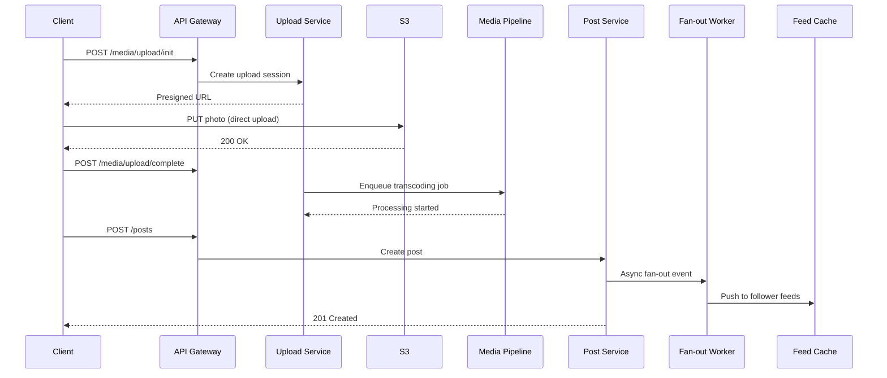

---

## 6. Data Model / Schema

### 6.1 User Table (PostgreSQL)

```sql
CREATE TABLE users (
    user_id         UUID PRIMARY KEY DEFAULT gen_random_uuid(),
    username        VARCHAR(30) UNIQUE NOT NULL,
    email           VARCHAR(255) UNIQUE NOT NULL,
    password_hash   VARCHAR(255) NOT NULL,
    display_name    VARCHAR(100),
    bio             TEXT,
    avatar_media_id UUID,
    is_private      BOOLEAN DEFAULT FALSE,
    follower_count  INT DEFAULT 0,
    following_count INT DEFAULT 0,
    post_count      INT DEFAULT 0,
    created_at      TIMESTAMPTZ DEFAULT NOW(),
    updated_at      TIMESTAMPTZ DEFAULT NOW()
);

CREATE INDEX idx_users_username ON users(username);
```

### 6.2 Posts (Cassandra — partition by user_id)

```sql
CREATE TABLE posts_by_user (
    user_id     UUID,
    post_id     UUID,
    caption     TEXT,
    location    TEXT,
    media_ids   LIST<UUID>,
    like_count  COUNTER,
    comment_count COUNTER,
    created_at  TIMESTAMP,
    PRIMARY KEY (user_id, created_at, post_id)
) WITH CLUSTERING ORDER BY (created_at DESC);

CREATE TABLE posts_by_id (
    post_id     UUID PRIMARY KEY,
    user_id     UUID,
    caption     TEXT,
    location    TEXT,
    media_ids   LIST<UUID>,
    like_count  INT,
    comment_count INT,
    created_at  TIMESTAMP
);
```

### 6.3 Follow Graph (Cassandra adjacency lists)

```sql
-- Who does user X follow?
CREATE TABLE following (
    user_id       UUID,
    followee_id   UUID,
    created_at    TIMESTAMP,
    PRIMARY KEY (user_id, followee_id)
);

-- Who follows user X?
CREATE TABLE followers (
    user_id       UUID,
    follower_id   UUID,
    created_at    TIMESTAMP,
    PRIMARY KEY (user_id, follower_id)
);
```

### 6.4 Feed Cache (Redis Sorted Sets)

```
Key:   feed:{user_id}
Score: post_created_at (unix timestamp ms)
Member: post_id

Operations:
  ZADD feed:abc123 1720440600000 post_789
  ZREVRANGE feed:abc123 0 19 WITHSCORES  → top 20 posts
  ZREMRANGEBYRANK feed:abc123 0 -1001     → trim to 1000 entries
```

### 6.5 Likes (Cassandra + Redis counter)

```sql
CREATE TABLE likes (
    post_id    UUID,
    user_id    UUID,
    created_at TIMESTAMP,
    PRIMARY KEY (post_id, user_id)
);

-- Redis: INCR post:{post_id}:like_count (sync to Cassandra periodically)
```

### 6.6 Stories (Redis with TTL)

```
Key:   stories:{user_id}
Type:  Sorted Set (score = created_at)
TTL:   Key expires 24h after last story

Key:   story:{story_id}
Type:  Hash { media_url, media_type, created_at, expires_at }
TTL:   86400 seconds
```

### 6.7 Media Metadata (PostgreSQL)

```sql
CREATE TABLE media (
    media_id        UUID PRIMARY KEY,
    user_id         UUID NOT NULL,
    media_type      VARCHAR(10) NOT NULL, -- photo, video
    original_s3_key VARCHAR(512) NOT NULL,
    status          VARCHAR(20) DEFAULT 'processing',
    width           INT,
    height          INT,
    duration_ms     INT,
    variants        JSONB,  -- {"1080p": "...", "720p": "...", "thumb": "..."}
    created_at      TIMESTAMPTZ DEFAULT NOW()
);
```

---

## 7. High-Level Architecture

### 7.1 System Architecture Overview

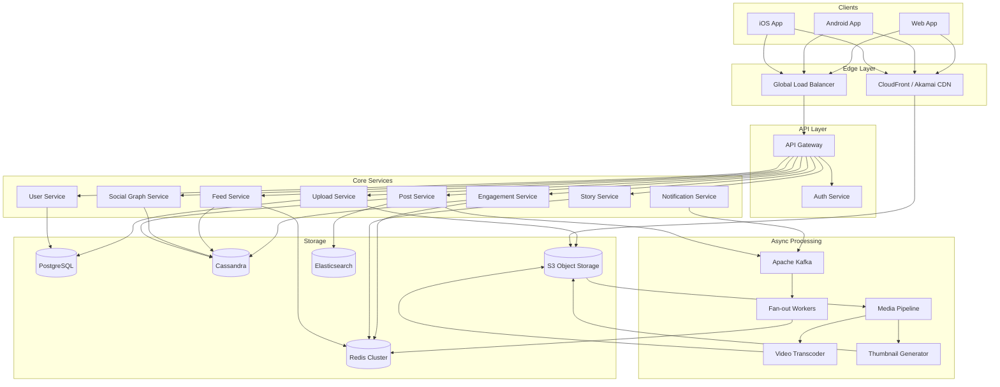

### 7.2 Feed Generation — Hybrid Push/Pull Model

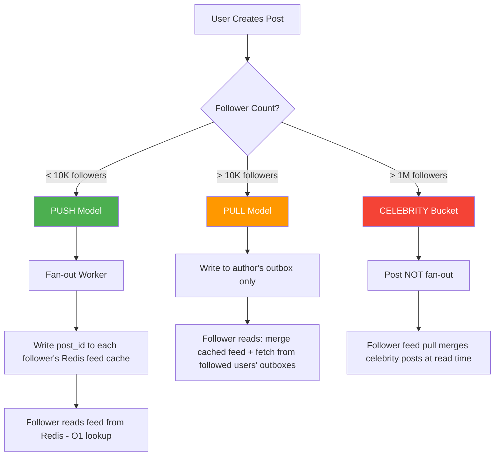

### 7.3 Media Upload & Processing Pipeline

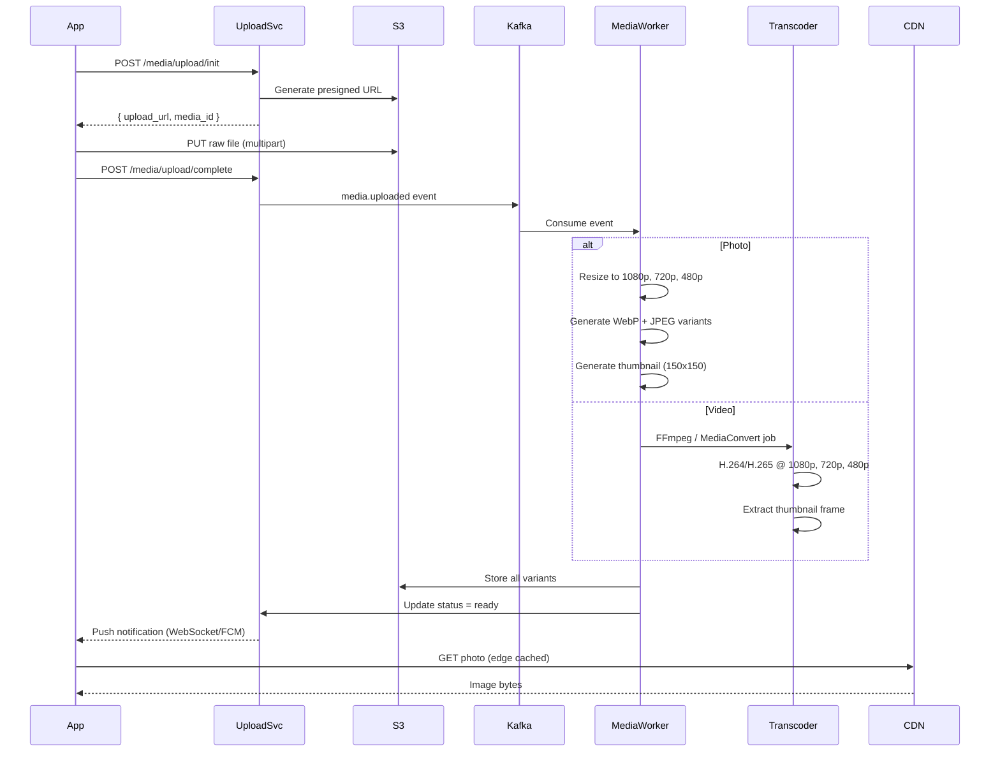

### 7.4 Home Feed Read Path

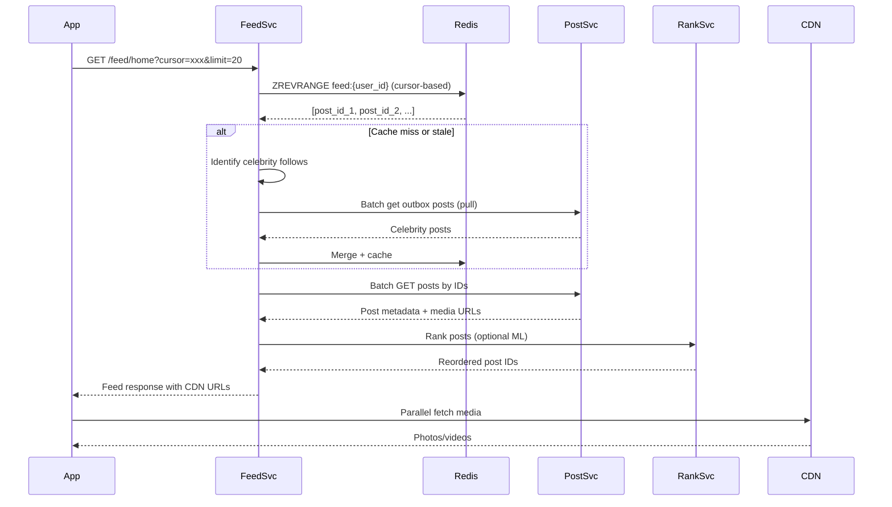

### 7.5 Data Flow Diagram

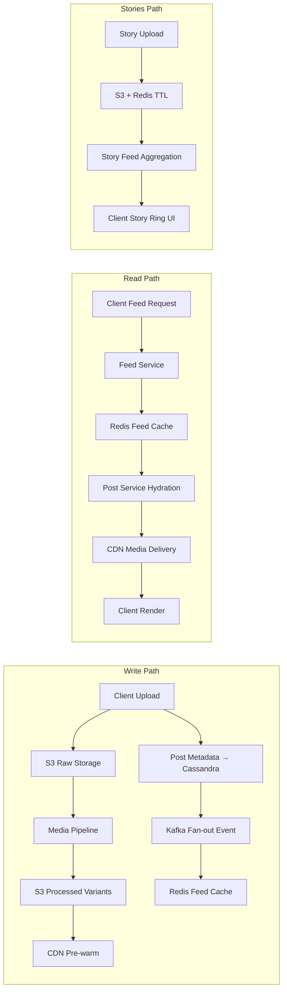

---

## 8. Deep Dives

### 8.1 Deep Dive #1: Hybrid Fan-out Feed (Push vs Pull)

#### The Problem

When `@cristiano` (600M followers) posts, pushing to 600M Redis keys synchronously is impossible:
- 600M writes × 1ms = 600,000 seconds = 7 days
- Single post would never complete fan-out

#### Solution: Three-Tier Model

| Tier | Follower Threshold | Strategy | Rationale |
|------|-------------------|----------|-----------|
| Regular | < 10K | **Push (fan-out on write)** | Low cost, fast reads |
| Popular | 10K – 1M | **Push with async batching** | Batch writes in chunks of 1000 |
| Celebrity | > 1M | **Pull (fan-out on read)** | Avoid write amplification |

#### Push Implementation

```
On post created (user with 5K followers):
1. Post Service writes post to Cassandra
2. Publishes PostCreated event to Kafka
3. Fan-out Worker consumes event:
   a. Query followers list from Cassandra (paginated)
   b. For each follower: ZADD feed:{follower_id} {timestamp} {post_id}
   c. Trim feed to max 1000 entries
4. Complete in ~5 seconds for 5K followers
```

#### Pull Implementation (Celebrity)

```
On feed read for user U:
1. Fetch pre-computed feed from Redis (500 posts)
2. Identify celebrity follows: SELECT followee_id FROM following 
   WHERE user_id = U AND followee_id IN (celebrity_set)
3. For each celebrity C: fetch latest N posts from posts_by_user(C)
4. Merge-sort by timestamp
5. Return top 20 by cursor
```

#### Merge Strategy

```python
def get_home_feed(user_id, cursor, limit=20):
    # Step 1: Get pushed feed from cache
    cached = redis.zrevrangebyscore(f"feed:{user_id}", cursor, "-inf", 
                                     start=0, num=limit * 3)
    
    # Step 2: Pull celebrity posts
    celeb_follows = get_celebrity_follows(user_id)
    celeb_posts = []
    for celeb_id in celeb_follows:
        celeb_posts.extend(get_recent_posts(celeb_id, limit=5))
    
    # Step 3: Merge-sort by timestamp
    all_posts = merge_by_timestamp(cached, celeb_posts)
    
    # Step 4: Optional ranking
    ranked = ranker.rank(user_id, all_posts)
    
    return ranked[:limit]
```

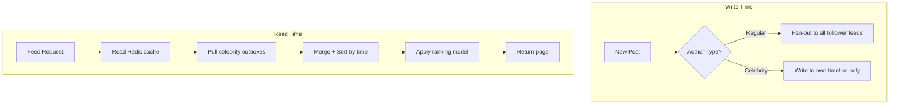

---

### 8.2 Deep Dive #2: Media Pipeline & CDN Strategy

#### Upload Flow (Presigned URL)

Direct client-to-S3 upload avoids proxying bytes through API servers:

1. Client requests upload slot → receives presigned PUT URL
2. Client uploads directly to S3 (multipart for >5MB)
3. S3 event triggers Lambda / Kafka producer
4. Media worker processes asynchronously

#### Transcoding Ladder (Videos)

| Variant | Resolution | Bitrate | Codec | Use Case |
|---------|-----------|---------|-------|----------|
| 1080p | 1920×1080 | 5 Mbps | H.265 | WiFi, high quality |
| 720p | 1280×720 | 2.5 Mbps | H.264 | Default mobile |
| 480p | 854×480 | 1 Mbps | H.264 | Slow connections |
| 360p | 640×360 | 500 Kbps | H.264 | 2G/3G fallback |
| thumb | 150×150 | — | JPEG | Feed placeholder |

#### Photo Processing

```
Original (HEIC/JPEG, up to 30MB)
  → Strip EXIF (privacy: remove GPS)
  → Resize: 1080px max edge (maintain aspect ratio)
  → Generate WebP (30% smaller) + JPEG fallback
  → Thumbnail: 150×150 center crop
  → Store all variants in S3 with CDN prefix
```

#### CDN Architecture

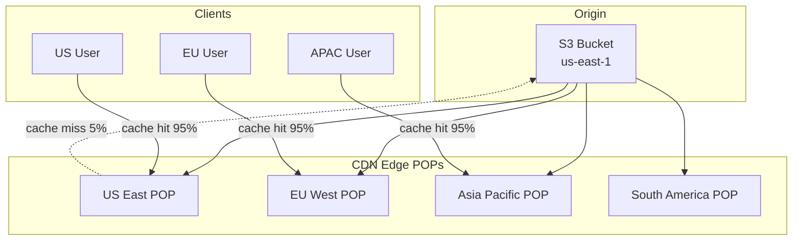

**CDN Cache Strategy:**
- Photos: `Cache-Control: public, max-age=31536000, immutable` (content-addressed URLs)
- Profile avatars: `max-age=3600` (may change)
- API responses: No CDN caching (dynamic)

**URL Structure:**
```
https://cdn.instagram.com/v/t51.2885-15/{media_hash}/{variant}.jpg
                                     ↑ version hash changes on re-process
```

---

### 8.3 Deep Dive #3: Stories System (Ephemeral Content)

#### Requirements Unique to Stories

- 24-hour TTL (auto-expire)
- Grouped by user (story ring UI)
- View tracking (who viewed)
- Separate from permanent post storage
- Real-time: new story → immediate visibility in followers' story feed

#### Architecture

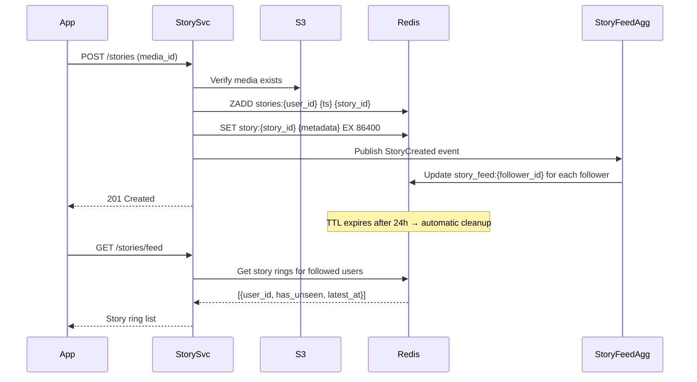

#### Story Feed Data Structure

```
# Per-user story inbox (pre-computed for fast read)
Key: story_feed:{viewer_id}
Type: Hash
Fields: { user_id: latest_story_timestamp, ... }
Updated: On StoryCreated event (fan-out, lightweight)

# Per-author story list
Key: stories:{author_id}  
Type: Sorted Set (score = created_at, member = story_id)
TTL: Refreshed on each new story, expires 24h after last

# Story metadata
Key: story:{story_id}
Type: Hash { media_url, type, created_at, view_count }
TTL: 86400 seconds
```

#### View Tracking

- Use HyperLogLog for approximate unique view counts (memory efficient)
- Separate `story_views:{story_id}` SET for "seen by" list (shown to author)
- Batch persist view events via Kafka (not synchronous on view)

---

### 8.4 Deep Dive #4: Likes & Engagement Counters

#### Challenge

- 58K likes/sec peak
- Must display accurate-ish counts (eventual consistency OK)
- Must prevent double-like (idempotent)
- Hot posts (celebrity) get millions of likes → hot key problem

#### Architecture

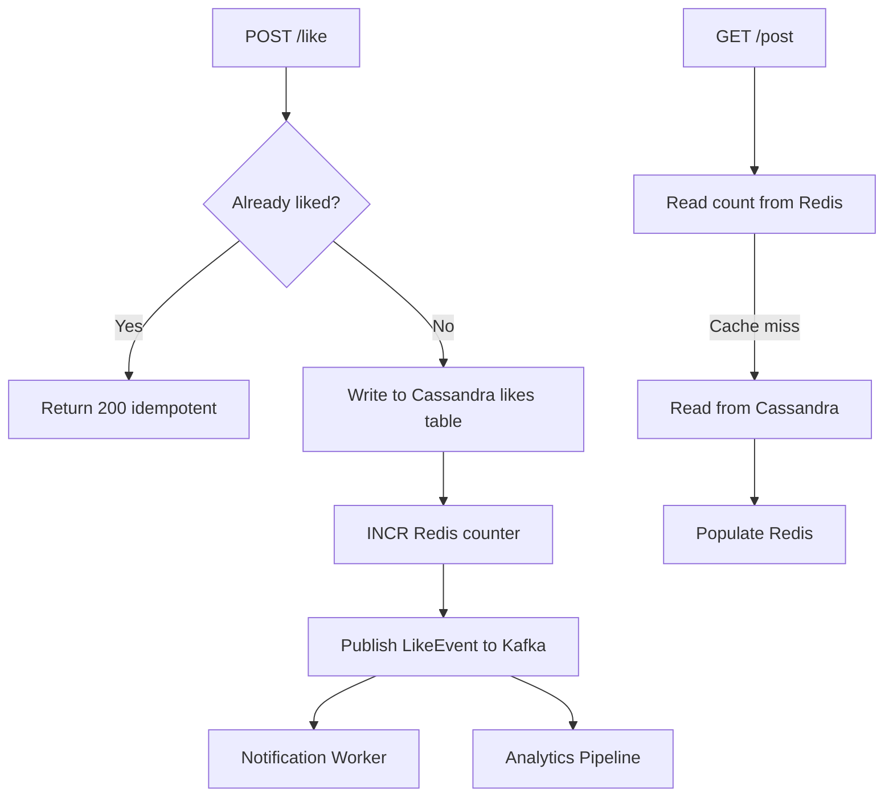

#### Hot Key Mitigation (Celebrity Posts)

```
Problem: post:xyz:like_count in single Redis key → 100K INCR/sec

Solution: Sharded counters
  post:xyz:like_count:shard_0  → random shard 0-99
  post:xyz:like_count:shard_1
  ...
  Total = SUM(all shards)

Read: Aggregate 100 shards (parallel MGET)
Write: INCR random shard (distributes load)
Sync: Periodic flush to Cassandra (every 10s)
```

#### Idempotency

```sql
-- Primary key (post_id, user_id) prevents duplicate likes
INSERT INTO likes (post_id, user_id, created_at) 
VALUES (?, ?, NOW()) 
IF NOT EXISTS;
```

---

### 8.5 Deep Dive #5: Feed Ranking (ML Layer)

#### Why Rank?

Pure chronological feed misses engagement optimization. Instagram's feed ranking considers:

| Signal | Weight | Source |
|--------|--------|--------|
| Interest | High | Past engagement with similar content |
| Recency | High | Time decay function |
| Relationship | Medium | DM history, profile visits, closeness |
| Frequency | Medium | How often user opens app |
| Following | Low | Total follow count (diversity) |
| Usage | Low | Session time patterns |

#### Ranking Pipeline

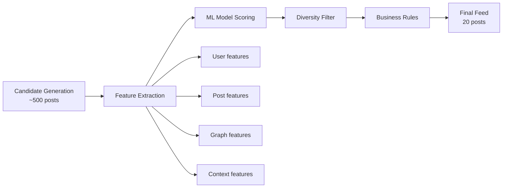

#### Implementation (Interview-Level)

```
Phase 1 (MVP): Chronological — ship first
Phase 2: Weighted score = recency_decay × relationship_score
Phase 3: ML model (Gradient Boosted Trees / Deep Learning)
         - Offline training on engagement labels (like, comment, dwell time)
         - Online serving via TFServing / internal ML platform
         - A/B test ranking changes
```

#### Candidate Generation Sources

1. **Follow graph feed** (Redis cache) — primary source
2. **Explore candidates** (optional injection) — discovery
3. **Suggested posts** — ML-discovered relevant content

---

## 9. Trade-offs & Alternatives

### 9.1 Feed Model Comparison

| Approach | Pros | Cons | Best For |
|----------|------|------|----------|
| **Push (fan-out on write)** | O(1) read, fast feed load | Write amplification for celebrities | Regular users (<10K followers) |
| **Pull (fan-out on read)** | O(1) write, no amplification | Slow reads, complex merge | Celebrity accounts |
| **Hybrid** | Best of both | Implementation complexity | Instagram's actual approach |
| **Timeline (no fan-out)** | Simplest | O(following) read per request | Small scale / Twitter early |

### 9.2 SQL vs NoSQL for Posts

| Store | Pros | Cons | Verdict |
|-------|------|------|---------|
| PostgreSQL | ACID, joins, familiar | Hard to shard at scale | User profiles, comments |
| Cassandra | Write-optimized, partition by user | No joins, eventual consistency | Posts, likes, follows |
| DynamoDB | Managed, auto-scale | Cost at scale, query limits | Alternative to Cassandra |

### 9.3 Consistency Models

| Data | Consistency | Rationale |
|------|-------------|-----------|
| User profile | Strong | Must not lose account data |
| Post creation | Strong (author), Eventual (feed) | Author sees post immediately; followers within 5s |
| Like count | Eventual (±1%) | Users tolerate slight delay |
| Follower count | Eventual | Approximate OK |
| Stories | Eventual | 24h TTL, low stakes |

### 9.4 Media Storage Alternatives

| Option | Pros | Cons |
|--------|------|------|
| S3 + CDN | Industry standard, 11 nines durability | Egress costs |
| Self-hosted (Ceph) | Cost control | Operational burden |
| Cloudflare R2 | Zero egress fees | Smaller ecosystem |

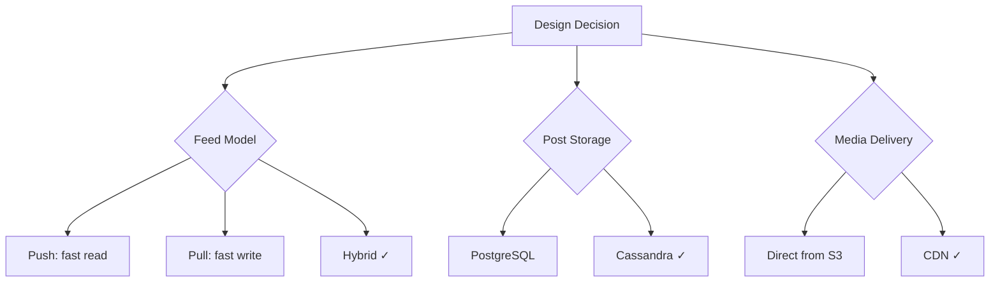

---

## 10. Failure Modes & Reliability

### 10.1 Failure Mode Analysis

| Component | Failure | Impact | Mitigation |
|-----------|---------|--------|------------|
| Redis feed cache | Node crash | Stale/missing feed | Rebuild from Cassandra outboxes; fallback to pull |
| Fan-out worker | Kafka lag | Delayed feed updates | Scale workers horizontally; monitor lag |
| S3 | Regional outage | Upload/read failure | Multi-region replication; failover region |
| CDN | POP failure | Slow media load | Automatic POP failover; multiple CDN providers |
| Cassandra | Node failure | Read/write degradation | RF=3, LOCAL_QUORUM; auto-repair |
| Media pipeline | Transcode failure | Post stuck in "processing" | Retry 3× with exponential backoff; DLQ + alert |
| Celebrity fan-out | N/A (pull model) | — | Designed to avoid this failure |

### 10.2 Degradation Strategy

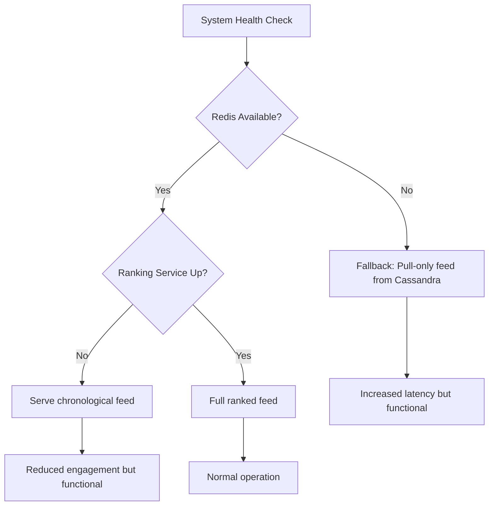

**Graceful Degradation Priority:**
1. Feed must load (even if chronological, even if slow)
2. Media must display (CDN highly available)
3. Likes/comments can queue (async processing)
4. Stories can tolerate 30s delay
5. Notifications can be delayed

### 10.3 Observability

| Metric | Alert Threshold | Action |
|--------|----------------|--------|
| Feed p99 latency | > 500ms | Scale Feed Service |
| Fan-out Kafka lag | > 60s | Scale fan-out workers |
| CDN cache hit rate | < 90% | Review cache headers |
| Media processing queue depth | > 10K | Scale media workers |
| Redis memory usage | > 80% | Expand cluster / evict cold feeds |
| Error rate (5xx) | > 0.1% | Page on-call |

### 10.4 Disaster Recovery

- **RPO:** 1 minute (Kafka + Cassandra replication)
- **RTO:** 15 minutes (automated failover to secondary region)
- **Multi-region:** Active-active for reads; primary region for writes with async replication
- **Backup:** S3 cross-region replication; Cassandra snapshots daily

---

## 11. Interview Cheat Sheet

### 11.1 Key Talking Points (Memorize These)

1. **Start with scope** — "I'll focus on upload, feed, stories, and engagement. I'll defer DMs and ads."
2. **Hybrid fan-out** — Push for regular users, pull for celebrities. This is THE Instagram insight.
3. **Presigned URL upload** — Client uploads directly to S3, not through API servers.
4. **CDN is non-negotiable** — 95%+ cache hit rate; immutable content-addressed URLs.
5. **Redis sorted sets for feeds** — Score = timestamp, member = post_id. Trim to 1000.
6. **Cassandra for posts** — Partition by user_id for efficient timeline queries.
7. **Eventual consistency for likes** — Sharded counters for hot posts.
8. **Stories = separate system** — Redis TTL, lightweight fan-out, HyperLogLog views.

### 11.2 Order of Presentation (Hello Interview Framework)

```
1. Clarify requirements (5 min)
2. Capacity estimation (5 min) — show math
3. Core entities + API (5 min)
4. High-level architecture diagram (5 min)
5. Deep dive: Feed fan-out (10 min) ← spend most time here
6. Deep dive: Media pipeline OR Stories (5 min)
7. Trade-offs + failure modes (5 min)
```

### 11.3 Expected Follow-Up Questions

**Q: How do you handle a celebrity post going viral?**
> A: Celebrities use pull model — no fan-out. On read, we merge their recent posts from their outbox. For sudden viral regular users crossing 10K threshold, we'd async-promote them to pull model.

**Q: How do you ensure feed freshness?**
> A: Fan-out worker SLA is <5s for push users. For pull users, we fetch latest posts at read time. WebSocket push notification prompts client to refresh feed.

**Q: How do you handle deleted posts in cached feeds?**
> A: Lazy deletion — on feed read, filter out posts marked `is_deleted=true`. Periodic cache cleanup job. Tombstone in Cassandra.

**Q: How do you scale the social graph?**
> A: Cassandra adjacency lists (following/followers tables). For "people you may know," offline graph computation with pre-computed suggestions in Redis.

**Q: What about private accounts?**
> A: Fan-out only to approved followers. On follow request accepted, backfill recent posts into requester's feed cache.

**Q: How do you prevent duplicate likes?**
> A: Cassandra primary key (post_id, user_id) with IF NOT EXISTS. Idempotency key at API layer.

**Q: Photo vs video processing differences?**
> A: Photos: synchronous resize (< 2s). Videos: async transcoding pipeline (30s–2min). Client polls or receives push when ready.

### 11.4 Numbers to Remember

| Metric | Value |
|--------|-------|
| DAU | 500M |
| Posts/sec | ~3K |
| Feed reads/sec | ~115K |
| Likes/sec | ~58K |
| Media storage/day | ~610 TB |
| Celebrity threshold | 1M followers |
| Push threshold | 10K followers |
| Feed cache size per user | ~1000 posts |
| CDN cache hit rate | 95%+ |
| Feed p99 target | 300ms |

### 11.5 Common Mistakes to Avoid

| Mistake | Why It's Wrong | Correct Approach |
|---------|---------------|------------------|
| Push fan-out for all users | Cristiano post = 600M writes | Hybrid push/pull |
| Upload through API server | Bottleneck, expensive | Presigned URL to S3 |
| Single Redis key for like count | Hot key problem | Sharded counters |
| Strong consistency everywhere | Kills availability + latency | Eventual for engagement |
| Skip CDN | 500ms+ global latency | CDN with immutable URLs |
| SQL for feed storage | Doesn't scale horizontally | Redis sorted sets |

### 11.6 Architecture Evolution Path

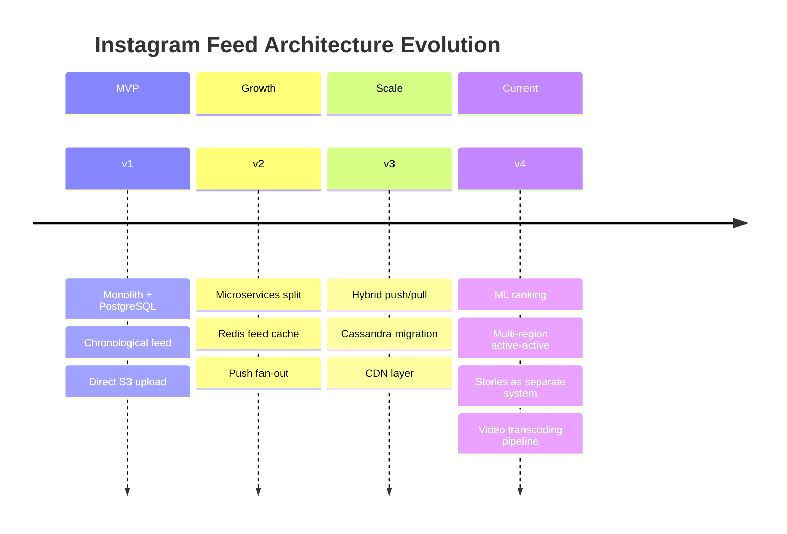

---

*End of Instagram System Design Guide*
