# System Design: TikTok

> **Interview Level:** Senior SDE (Google / Microsoft / ByteDance)  
> **Estimated Time:** 45–60 minutes  
> **Framework:** Hello Interview Delivery Structure

---

## Table of Contents

1. [Problem Statement & Scope](#1-problem-statement--scope)
2. [Requirements](#2-requirements)
3. [Capacity Estimation](#3-capacity-estimation)
4. [Core Entities](#4-core-entities)
5. [API Design](#5-api-design)
6. [Data Model / Schema](#6-data-model--schema)
7. [High-Level Architecture](#7-high-level-architecture)
8. [Deep Dives](#8-deep-dives)
9. [Trade-offs & Alternatives](#9-trade-offs--alternatives)
10. [Failure Modes & Reliability](#10-failure-modes--reliability)
11. [Interview Cheat Sheet](#11-interview-cheat-sheet)

---

## 1. Problem Statement & Scope

### 1.1 The Prompt

> *"Design TikTok — a short-form video platform where users upload vertical videos, discover content through a personalized For You Page (FYP), follow creators, and engage via likes, comments, shares, and watch-time signals."*

### 1.2 What TikTok Is

TikTok is a **recommendation-first media platform**. Unlike Instagram's social-graph feed, TikTok's primary surface is the **For You Page (FYP)** — an algorithmically curated infinite scroll of short videos (15s–3min) from creators the user may not follow.

Core pillars:
- **For You Page (FYP)** — ML-driven personalized recommendation
- **Following Feed** — chronological/ranked videos from followed creators
- **Video upload & transcoding** — multi-bitrate adaptive streaming
- **Engagement signals** — watch time, replays, shares, likes (fuel for ranking)
- **Creator tools** — effects, sounds, duets, stitches
- **Search & discovery** — hashtag trends, sound pages

### 1.3 Scope Boundaries

| In Scope | Out of Scope (Unless Asked) |
|----------|----------------------------|
| FYP recommendation pipeline | ML model training internals |
| Video upload & transcoding | Live streaming |
| Engagement signal collection | Ads auction / monetization |
| Following feed | E-commerce checkout |
| User profiles & follows | Content moderation ML details |
| CDN video delivery | Regional compliance / censorship |
| Comments, likes, shares | Creator fund / payments |

### 1.4 Assumptions

- **1B MAU**, **700M DAU**
- Average session: **45 minutes**, **100 videos/session**
- Average video: **30 seconds**, **15 MB** raw upload
- **5% of DAU** upload daily (~35M videos/day)
- Read:write ratio ≈ **500:1** (extreme read-heavy)
- Global deployment, edge CDN for video

### 1.5 Clarifying Questions

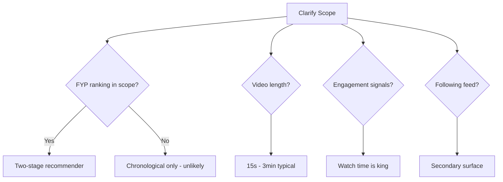

1. Is **FYP recommendation** the primary focus? (Almost always yes)
2. What video lengths? (15s–3min)
3. How important is **upload latency** vs playback?
4. Do we need **duets/stitches**?
5. **Cold start** for new users — how to bootstrap FYP?
6. Geographic scope — China (Douyin) vs global (TikTok) differences?

---

## 2. Requirements

### 2.1 Functional Requirements

#### Must-Have (P0)

| ID | Requirement | Notes |
|----|-------------|-------|
| F1 | Upload short videos with caption, hashtags, sounds | Async transcoding |
| F2 | Personalized For You Page (infinite scroll) | ML recommendation |
| F3 | Video playback with adaptive bitrate | HLS/DASH via CDN |
| F4 | Like, comment, share videos | Engagement signals |
| F5 | Follow / unfollow creators | Social graph |
| F6 | Following feed (videos from followed creators) | Simpler than FYP |
| F7 | User profiles with video grid | Paginated |
| F8 | Collect watch-time & engagement signals | Real-time pipeline |
| F9 | Search videos, users, sounds, hashtags | Inverted index |

#### Nice-to-Have (P1)

| ID | Requirement | Notes |
|----|-------------|-------|
| F10 | Duets and Stitches | Video composition |
| F11 | AR effects and filters | Client-side + server templates |
| F12 | Sound/music library | Licensed audio catalog |
| F13 | Notifications | Push for viral moments |
| F14 | Video analytics for creators | View count, demographics |
| F15 | Draft saves | Pre-publish storage |

### 2.2 Non-Functional Requirements

#### Must-Have

| ID | Requirement | Target |
|----|-------------|--------|
| NF1 | FYP latency (first video) | < 300 ms p99 |
| NF2 | Video start time (TTFF) | < 1 s on 4G |
| NF3 | Upload acknowledgment | < 3 s (transcoding async) |
| NF4 | Availability | 99.99% (FYP + playback) |
| NF5 | Scalability | 700M DAU, 70B video views/day |
| NF6 | Recommendation freshness | New viral content within 30 min |

#### Nice-to-Have

| ID | Requirement | Target |
|----|-------------|--------|
| NF7 | View count accuracy | ±5% (approximate OK) |
| NF8 | Transcoding time | < 2 min for 60s video |
| NF9 | FYP diversity | No creator > 2 videos in 10-scroll window |
| NF10 | Cold start FYP quality | Engaging within 5 videos for new user |

### 2.3 Requirements Mind Map

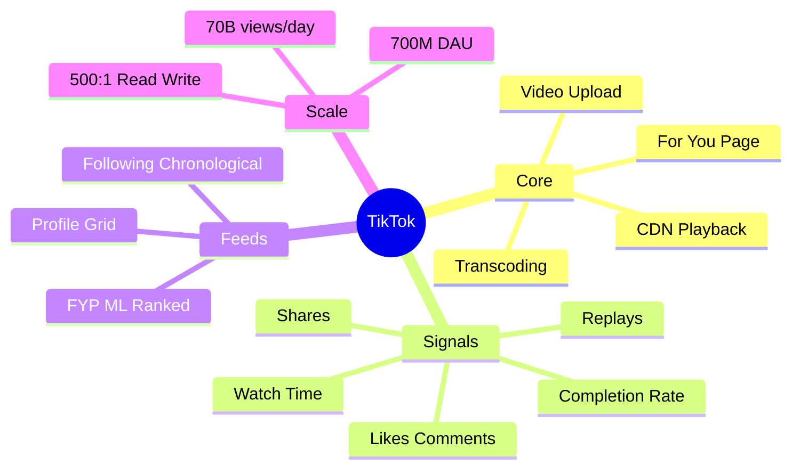

---

## 3. Capacity Estimation

### 3.1 Traffic Estimates

```
DAU             = 700,000,000
Videos viewed   = 700M × 100 videos/session × 1.5 sessions/day = 105B/day
                ≈ 1.2M video views/sec average, ~3.6M peak

Uploads         = 700M × 5% = 35M videos/day
                ≈ 405 uploads/sec average, ~1,200 peak

FYP loads       = 700M × 3 FYP opens/day = 2.1B/day
                ≈ 24,000 QPS average, ~72,000 QPS peak

Engagement events (likes, shares, watch signals):
                105B views × 3 events/view = 315B events/day
                ≈ 3.6M events/sec (async, batched)
```

### 3.2 Storage Estimates

**Raw video uploads:**

```
35M videos/day × 15 MB = 525 TB/day raw
```

**Transcoded variants (4 bitrates × 3 codecs):**

```
525 TB × 2.5 (transcoded overhead) ≈ 1.3 PB/day
3-year retention: 1.3 PB × 365 × 3 ≈ 1.4 EB (theoretical max)

Realistic with tiering (hot 30 days, warm 1 year, cold archive):
Hot:  1.3 PB × 30 = 39 PB
Warm: compressed archive ≈ 200 PB
```

**Metadata:**

```
Video row ≈ 1 KB
35M/day × 1 KB × 365 × 3 ≈ 38 TB
Engagement events: 315B/day × 50 bytes = 15.75 PB/day (→ Kafka, not all persisted)
Long-term analytics store: ~50 PB/year (columnar, compressed)
```

### 3.3 Bandwidth

```
Video playback (CDN):
3.6M views/sec × 2 Mbps avg bitrate = 7.2 Tbps global CDN

Origin egress (5% CDN miss):
7.2 Tbps × 5% = 360 Gbps origin

Upload ingress:
1,200 uploads/sec × 15 MB = 18 GB/s
```

### 3.4 Compute Estimates

```
Transcoding:
1,200 videos/sec × 30s avg × 4 variants = 144,000 transcode-seconds/sec
→ ~144,000 vCPU at real-time speed (with GPU: ~14,400 GPU instances)

FYP serving:
72K QPS × 50ms = 3,600 concurrent ranker instances

Feature store reads:
72K QPS × 200 features = 14.4M feature lookups/sec
```

### 3.5 Summary Table

| Resource | Estimate |
|----------|----------|
| Video views/day | 105B |
| Uploads/day | 35M |
| FYP QPS (peak) | 72K |
| CDN bandwidth | ~7 Tbps |
| Engagement events/sec | 3.6M |
| Transcoding vCPU | ~144K (or 14K GPU) |

---

## 4. Core Entities

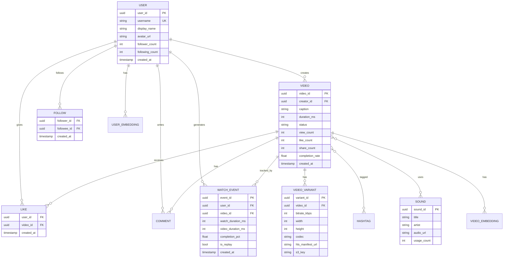

### Entity Storage Mapping

| Entity | Primary Store | Why |
|--------|--------------|-----|
| User | Cassandra | High write, global |
| Video | Cassandra + S3 | Metadata + blob |
| VideoVariant | Cassandra | Multiple per video |
| WatchEvent | Kafka → Flink → Feature Store | Streaming, high volume |
| UserEmbedding | Redis / Vector DB | Low-latency FYP lookup |
| VideoEmbedding | Redis / Vector DB | Candidate retrieval |
| Sound | PostgreSQL | Relational catalog |
| Hashtag | Elasticsearch | Trending search |

---

## 5. API Design

### 5.1 Video Upload (Multipart + Presigned)

#### Step 1: Initiate Upload

```
POST /v1/videos/upload
Content-Type: application/json

{
  "file_size_bytes": 15728640,
  "duration_ms": 30000,
  "mime_type": "video/mp4",
  "width": 1080,
  "height": 1920
}
```

**Response 201:**
```json
{
  "upload_id": "vu_abc123",
  "presigned_urls": [
    { "part_number": 1, "url": "https://s3.../part1?sig=..." },
    { "part_number": 2, "url": "https://s3.../part2?sig=..." }
  ],
  "chunk_size_bytes": 8388608,
  "expires_at": "2026-07-08T10:10:00Z"
}
```

#### Step 2: Client uploads parts directly to S3

#### Step 3: Complete Upload

```
POST /v1/videos/upload/{upload_id}/complete
Content-Type: application/json

{
  "parts": [
    { "part_number": 1, "etag": "abc" },
    { "part_number": 2, "etag": "def" }
  ],
  "caption": "POV: you found this at 3am #fyp #viral",
  "hashtags": ["fyp", "viral"],
  "sound_id": "snd_456",
  "visibility": "public"
}
```

**Response 202:**
```json
{
  "video_id": "vid_xyz789",
  "status": "processing",
  "estimated_ready_at": "2026-07-08T10:12:00Z"
}
```

### 5.2 For You Page

```
GET /v1/feed/fyp?cursor=&limit=10
```

**Response 200:**
```json
{
  "videos": [
    {
      "video_id": "vid_xyz789",
      "creator": {
        "user_id": "u_abc",
        "username": "dancequeen",
        "avatar_url": "https://cdn.tiktok.com/avatars/u_abc.jpg",
        "is_following": false
      },
      "caption": "POV: you found this at 3am #fyp",
      "duration_ms": 30000,
      "playback": {
        "hls_url": "https://cdn.tiktok.com/vid_xyz789/master.m3u8",
        "cover_url": "https://cdn.tiktok.com/vid_xyz789/cover.jpg",
        "width": 1080,
        "height": 1920
      },
      "stats": {
        "like_count": 125000,
        "comment_count": 3400,
        "share_count": 8900
      },
      "sound": {
        "sound_id": "snd_456",
        "title": "Original Sound - dancequeen"
      },
      "is_liked": false
    }
  ],
  "next_cursor": "eyJzY29yZSI6MC45ODd9",
  "has_more": true
}
```

### 5.3 Engagement & Watch Signals

```
POST /v1/videos/{video_id}/like
DELETE /v1/videos/{video_id}/like
POST /v1/videos/{video_id}/share
POST /v1/videos/{video_id}/comments
GET  /v1/videos/{video_id}/comments?cursor=&limit=20
```

#### Watch Event (Batch, Fire-and-Forget)

```
POST /v1/events/watch
Content-Type: application/json

{
  "events": [
    {
      "video_id": "vid_xyz789",
      "watch_duration_ms": 28000,
      "video_duration_ms": 30000,
      "completion_pct": 0.93,
      "is_replay": false,
      "session_id": "sess_001",
      "timestamp": "2026-07-08T10:05:00Z"
    },
    {
      "video_id": "vid_prev001",
      "watch_duration_ms": 3000,
      "video_duration_ms": 45000,
      "completion_pct": 0.07,
      "is_replay": false,
      "session_id": "sess_001",
      "timestamp": "2026-07-08T10:04:30Z"
    }
  ]
}
```

**Response 202:** Accepted (async processing)

### 5.4 Following Feed

```
GET /v1/feed/following?cursor=&limit=10
```

### 5.5 User Profile & Videos

```
GET /v1/users/{user_id}
GET /v1/users/{user_id}/videos?cursor=&limit=20
POST /v1/users/{user_id}/follow
DELETE /v1/users/{user_id}/follow
```

### 5.6 Search

```
GET /v1/search?q=dance+tutorial&type=video&cursor=&limit=20
GET /v1/search/trending/hashtags
GET /v1/sounds/{sound_id}/videos?cursor=&limit=20
```

### 5.7 API Sequence: FYP Session

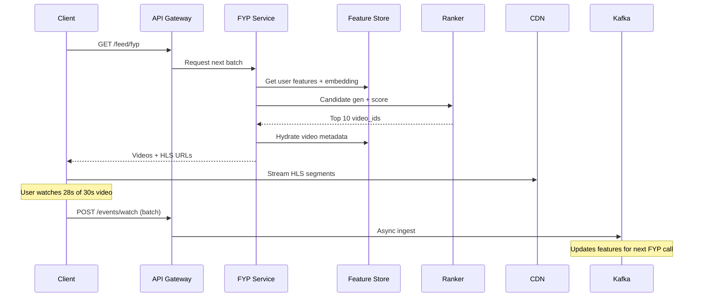

---

## 6. Data Model / Schema

### 6.1 Videos Table (Cassandra)

```sql
CREATE TABLE videos (
    video_id        UUID PRIMARY KEY,
    creator_id      UUID,
    caption         TEXT,
    duration_ms     INT,
    status          TEXT,    -- processing, ready, failed, removed
    sound_id        UUID,
    view_count      BIGINT,
    like_count      INT,
    share_count     INT,
    completion_rate FLOAT,
    created_at      TIMESTAMP
);

CREATE TABLE videos_by_creator (
    creator_id  UUID,
    created_at  TIMESTAMP,
    video_id    UUID,
    caption     TEXT,
    cover_url   TEXT,
    status      TEXT,
    PRIMARY KEY (creator_id, created_at, video_id)
) WITH CLUSTERING ORDER BY (created_at DESC);
```

### 6.2 Video Variants

```sql
CREATE TABLE video_variants (
    video_id        UUID,
    variant_id      UUID,
    bitrate_kbps    INT,
    width           INT,
    height          INT,
    codec           TEXT,
    hls_manifest    TEXT,
    s3_key          TEXT,
    PRIMARY KEY (video_id, bitrate_kbps)
);
```

### 6.3 Watch Events (Kafka → Data Lake)

```json
{
  "event_id": "evt_uuid",
  "user_id": "u_abc",
  "video_id": "vid_xyz",
  "watch_duration_ms": 28000,
  "video_duration_ms": 30000,
  "completion_pct": 0.93,
  "is_replay": false,
  "session_id": "sess_001",
  "device_type": "ios",
  "region": "us-east",
  "timestamp": "2026-07-08T10:05:00Z"
}
```

**Kafka topic:** `watch-events` (1000 partitions, 3x replication)

### 6.4 Feature Store Schema

```sql
-- User features (Redis hash + offline Parquet)
CREATE TABLE user_features (
    user_id             UUID PRIMARY KEY,
    embedding           BLOB,          -- 128-dim vector
    avg_watch_time_ms   INT,
    preferred_categories ARRAY<TEXT>,
    active_hours        ARRAY<INT>,
    follower_count      INT,
    account_age_days    INT,
    last_updated        TIMESTAMP
);

-- Video features
CREATE TABLE video_features (
    video_id            UUID PRIMARY KEY,
    embedding           BLOB,
    category            TEXT,
    trending_score      FLOAT,
    completion_rate     FLOAT,
    like_rate           FLOAT,
    share_rate          FLOAT,
    creator_id          UUID,
    age_hours           FLOAT,
    last_updated        TIMESTAMP
);
```

### 6.5 FYP Impression Log (for ML training)

```sql
CREATE TABLE fyp_impressions (
    user_id     UUID,
    session_id  UUID,
    video_id    UUID,
    position    INT,
    score       FLOAT,
    served_at   TIMESTAMP,
    PRIMARY KEY (user_id, served_at, video_id)
) WITH TTL = 2592000;  -- 30 days
```

### 6.6 Social Graph

```sql
CREATE TABLE follows (
    follower_id  UUID,
    followee_id  UUID,
    created_at   TIMESTAMP,
    PRIMARY KEY (follower_id, followee_id)
);

CREATE TABLE followers (
    user_id      UUID,
    follower_id  UUID,
    created_at   TIMESTAMP,
    PRIMARY KEY (user_id, follower_id)
);
```

---

## 7. High-Level Architecture

### 7.1 System Architecture

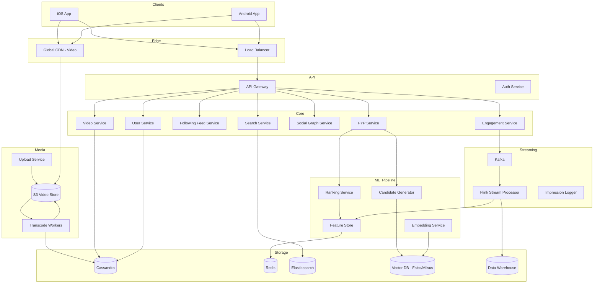

### 7.2 Video Upload & Transcoding Sequence

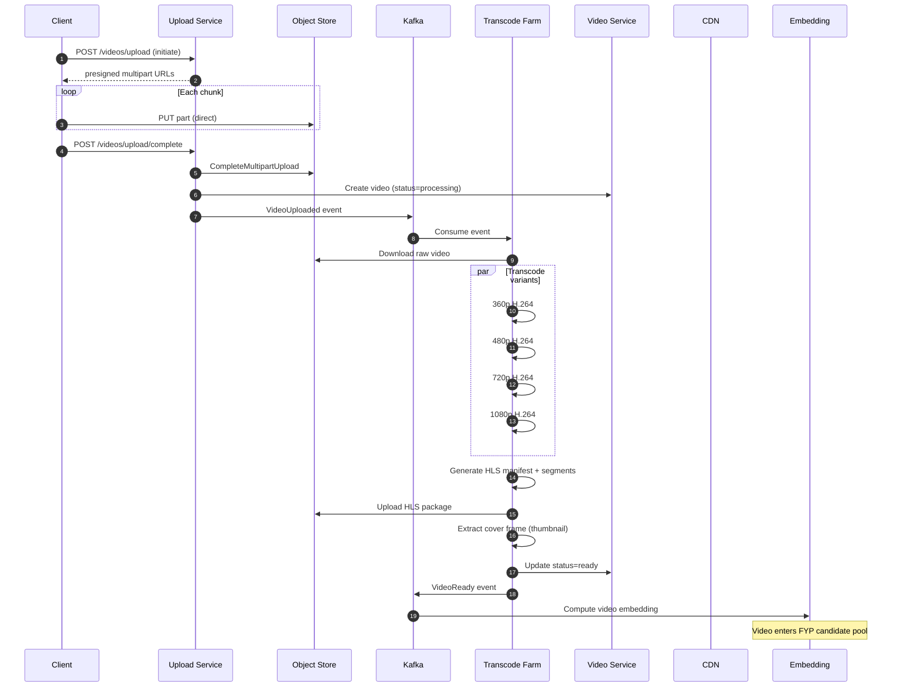

### 7.3 FYP Recommendation Data Flow

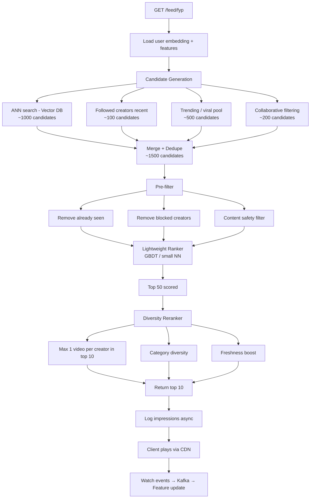

### 7.4 Engagement Signal Pipeline

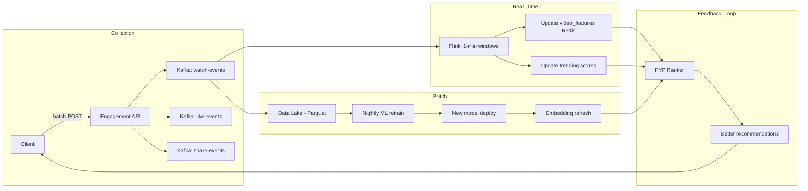

### 7.5 CDN Video Delivery Architecture

```mermaid
graph TB
    subgraph Origin
        S3[S3 HLS Segments]
        OS[Origin Shield]
    end

    subgraph CDN_Tiers
        R[Regional PoPs - 100+]
        E[Edge PoPs - 1000+]
    end

    subgraph Client
        P[Video Player]
        AB[ABR Logic]
    end

    P --> AB
    AB -->|Request manifest| E
    E -->|miss| R
    R -->|miss| OS
    OS --> S3

    AB -->|Select bitrate| E
    Note over AB: 360p on 3G, 1080p on WiFi
```

---

## 8. Deep Dives

### 8.1 Deep Dive #1: For You Page Recommendation System

This is the **heart of the TikTok interview**. Expect 15–20 minutes here.

#### Architecture: Two-Stage Recommender

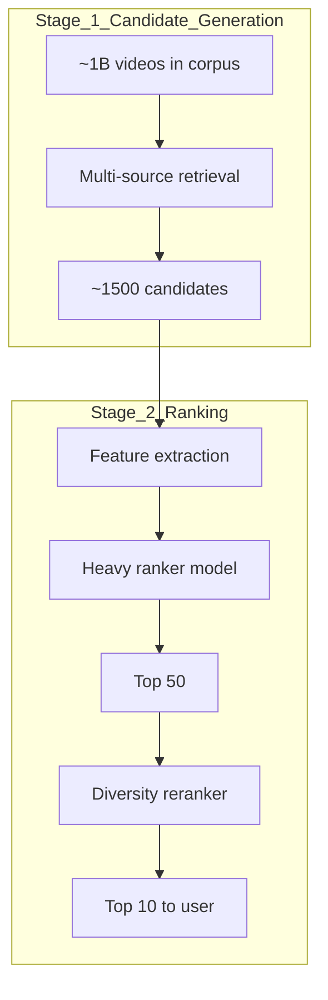

**Why two stages?** Scoring 1B videos per request is impossible. Candidate generation narrows to ~1500 in <50ms, then the ranker scores those in <100ms.

#### Candidate Generation Sources

| Source | Method | Candidates | Purpose |
|--------|--------|------------|---------|
| **Embedding ANN** | User vec × Video vec (Faiss/Milvus) | ~1000 | Personalized content |
| **Followed creators** | Recent posts from graph | ~100 | Social signal |
| **Trending pool** | Precomputed hourly top 10K | ~500 | Viral discovery |
| **Collaborative filtering** | Users like you watched X | ~200 | Serendipity |
| **Cold start** | Popular in region + category | ~200 | New users |

#### Approximate Nearest Neighbor (ANN) Search

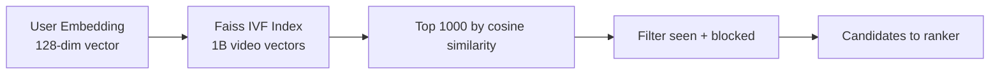

**Index type:** IVF (Inverted File) with Product Quantization
- 1B vectors × 128 dim × 4 bytes = 512 GB (fits in GPU memory cluster)
- Query latency: <10ms for top-1000

#### Ranking Features

| Category | Features | Real-time? |
|----------|----------|------------|
| **User** | Embedding, watch history, demographics, device | Semi |
| **Video** | Embedding, completion_rate, like_rate, age_hours | Yes |
| **Cross** | User-video dot product, category match | Yes |
| **Context** | Time of day, session depth, network type | Yes |

**Most important signal:** `completion_rate` (watch time / video duration)
- 93% completion >> 7% completion
- Rewatch (replay) = strong positive signal
- Skip in <2s = strong negative signal

#### Diversity Reranking

Without diversity, FYP shows 10 videos from the same creator.

```python
def diversity_rerank(scored_videos, limit=10):
    result = []
    creator_count = {}
    category_count = {}

    for video, score in scored_videos:
        creator = video.creator_id
        category = video.category

        # Penalize repeat creators
        if creator_count.get(creator, 0) >= 1 and len(result) < 5:
            score *= 0.5

        # Penalize same category streak
        if category_count.get(category, 0) >= 3:
            score *= 0.7

        result.append((video, score))
        creator_count[creator] = creator_count.get(creator, 0) + 1
        category_count[category] = category_count.get(category, 0) + 1

        if len(result) == limit:
            break

    return result
```

#### Cold Start Problem

**New user (no watch history):**
1. Ask 3 interest categories on signup (optional)
2. Serve popular videos in selected categories
3. After 5 videos watched → embedding initialized from watch history
4. Full personalization by video 20

**New video (no engagement data):**
1. Content-based features: visual embedding, audio, hashtags
2. Creator's historical performance as prior
3. "Exploration bucket" — show to 200 random users, measure completion rate
4. If completion_rate > threshold → promote to trending pool

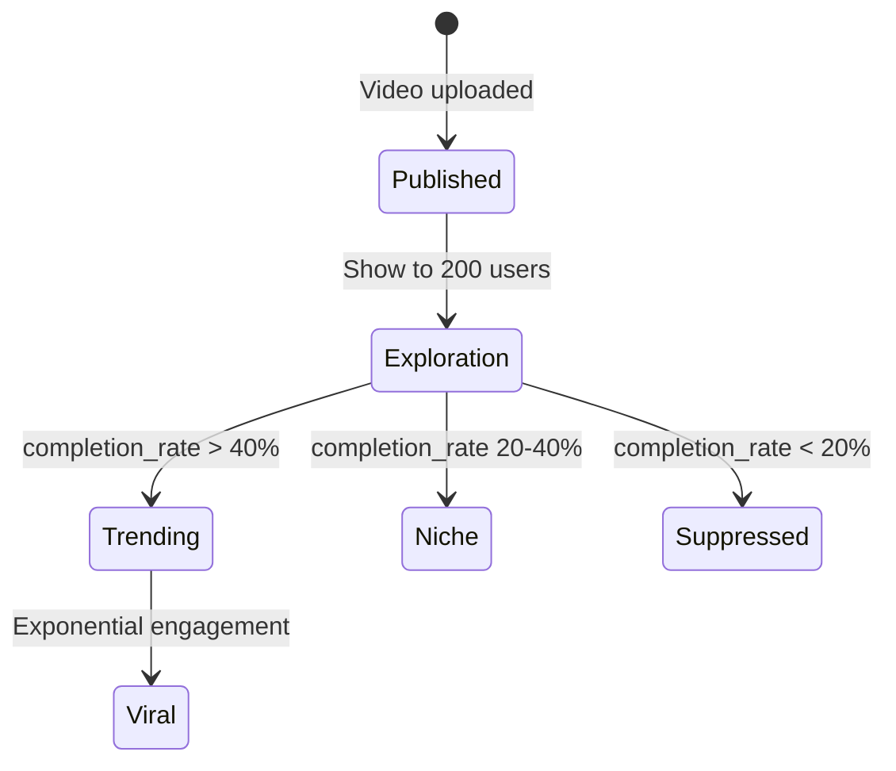

### 8.2 Deep Dive #2: Video Upload & Transcoding Pipeline

#### Why Multipart Upload?

- Videos up to 287 MB (3 min × high bitrate)
- Resume on network failure
- Parallel chunk upload (4 chunks simultaneously)
- Direct-to-S3 bypasses API servers

#### Transcoding Architecture

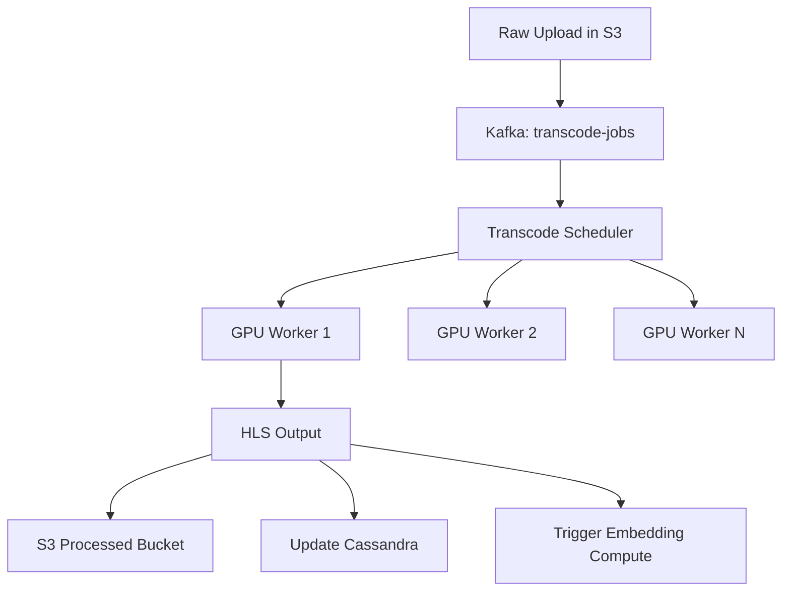

**Transcode specs:**

| Variant | Resolution | Bitrate | Codec |
|---------|-----------|---------|-------|
| Low | 360×640 | 400 Kbps | H.264 |
| Medium | 480×854 | 800 Kbps | H.264 |
| High | 720×1280 | 1.5 Mbps | H.264 |
| HD | 1080×1920 | 3 Mbps | H.265/HEVC |

**HLS segment size:** 2 seconds (fast startup, smooth ABR switching)

#### Adaptive Bitrate (ABR) Playback

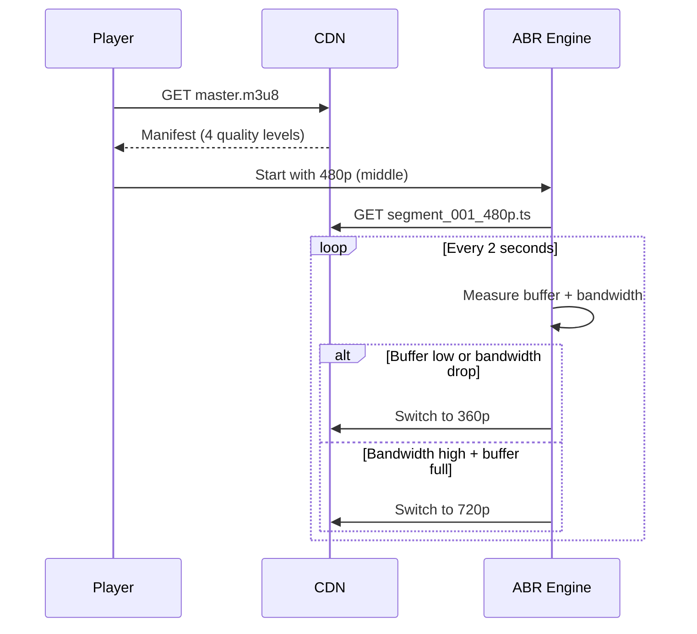

**Time to First Frame (TTFF) target:** <1s
- CDN edge serves first segment
- Start at medium quality, upgrade quickly
- Preload cover image as placeholder

#### Transcode Priority Queue

| Priority | Source | SLA |
|----------|--------|-----|
| P0 | VIP creators, trending | < 30s |
| P1 | Normal uploads | < 2 min |
| P2 | Re-transcode (new codec) | < 1 hour |
| P3 | Archive re-processing | Best effort |

### 8.3 Deep Dive #3: Engagement Signals & Real-Time Feature Pipeline

#### Signal Hierarchy (Most → Least Important)

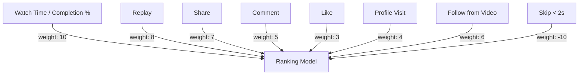

#### Real-Time Aggregation with Flink

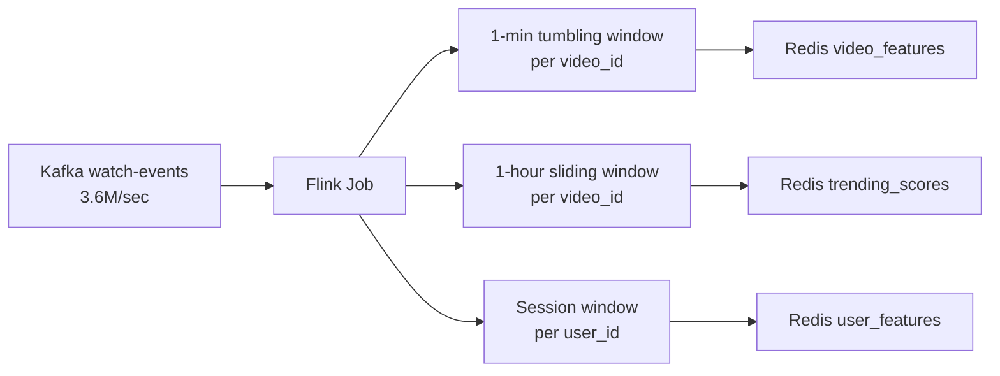

**Example Flink window output:**

```json
{
  "video_id": "vid_xyz",
  "window": "1min",
  "views": 15234,
  "avg_completion_pct": 0.72,
  "like_rate": 0.08,
  "share_rate": 0.02,
  "skip_rate": 0.15
}
```

#### Negative Signals

| Signal | Detection | Impact |
|--------|-----------|--------|
| Skip < 2s | `watch_duration_ms < 2000` | Strong negative |
| "Not interested" | Explicit button | Remove similar content |
| Report | Moderation flag | Suppress immediately |
| Unfollow from video | Follow DELETE event | Reduce creator content |

### 8.4 Deep Dive #4: View Counting at Scale

**Challenge:** 3.6M views/sec — can't write to a single counter row.

#### Solution: Probabilistic + Sharded Counters

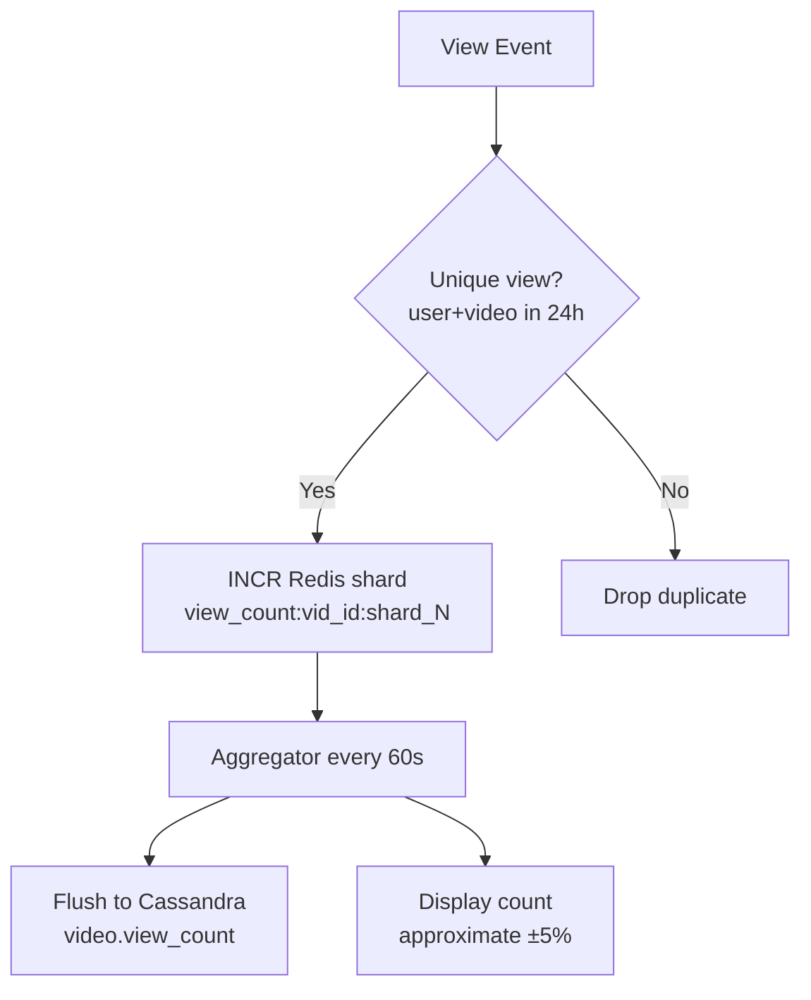

**For display:** Use HyperLogLog for approximate unique views (celebrity videos with 100M+ views).

**Creator analytics:** Exact counts in data warehouse (batch), approximate in real-time dashboard.

### 8.5 Deep Dive #5: Following Feed vs FYP

| Aspect | FYP | Following Feed |
|--------|-----|----------------|
| **Source** | All videos (ML curated) | Followed creators only |
| **Algorithm** | Two-stage recommender | Reverse chronological |
| **Cache** | Per-user scored list (Redis) | Per-user timeline (Redis) |
| **Update** | Real-time feature refresh | Fan-out on upload (like Instagram) |
| **Latency** | <300ms (ML inference) | <100ms (simple cache read) |
| **Personalization** | Extreme | Mild (chronological) |

**Following feed fan-out:** Same hybrid approach as Instagram — push to follower feeds for normal creators, pull for celebrities.

---

## 9. Trade-offs & Alternatives

### 9.1 Recommendation Approaches

| Approach | Pros | Cons | TikTok Choice |
|----------|------|------|---------------|
| **Social graph only** | Simple | No discovery | ❌ Too limited |
| **Collaborative filtering** | Serendipity | Cold start | ✅ One candidate source |
| **Content-based (embeddings)** | Cold start OK | Filter bubble | ✅ Primary source |
| **Multi-armed bandit** | Exploration/exploit | Complex | ✅ For new videos |
| **Full two-stage** | Best quality | Infrastructure heavy | ✅ Core architecture |

### 9.2 Video Storage Formats

| Format | Pros | Cons | Choice |
|--------|------|------|--------|
| **MP4 progressive** | Simple | No ABR | ❌ |
| **HLS (MPEG-TS)** | Wide support, ABR | Larger segments | ✅ Primary |
| **DASH (fMP4)** | Modern, efficient | Less mobile support | ✅ Secondary |
| **WebM/VP9** | Open codec | Limited iOS | ❌ |

### 9.3 Transcoding: CPU vs GPU

| | CPU (x264) | GPU (NVENC) |
|--|-----------|-------------|
| Speed | 1x real-time | 10-20x real-time |
| Cost | Lower per hour | Higher per hour but 10x throughput |
| Quality | Slightly better | Good enough |
| **Choice** | | ✅ GPU at scale |

### 9.4 Seen Video Deduplication

**Problem:** User shouldn't see same video twice in FYP.

**Approach:**
- Redis Bloom filter per user: `seen:{user_id}` (100M bits ≈ 12 MB)
- Exact SET for last 24h (smaller, precise)
- Check before ranking, filter candidates

### 9.5 Consistency vs Freshness for FYP

| Data | Staleness Tolerance | Strategy |
|------|---------------------|----------|
| User embedding | 1 hour | Batch update nightly + incremental |
| Video features | 1 minute | Flink real-time |
| Trending pool | 5 minutes | Periodic recompute |
| Seen set | 0 (exact) | Redis SET |

---

## 10. Failure Modes & Reliability

### 10.1 Failure Mode Matrix

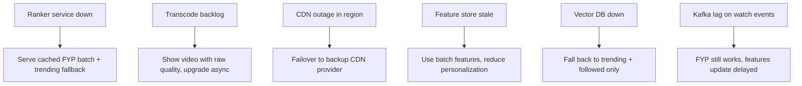

### 10.2 FYP Degradation Ladder

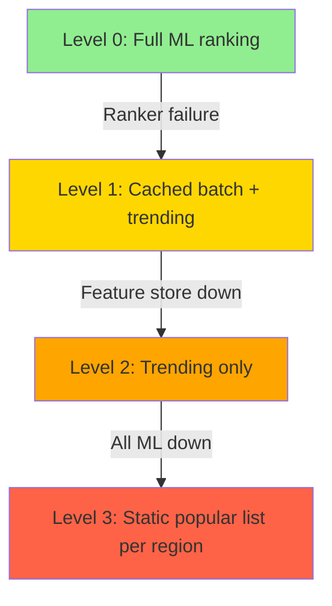

### 10.3 Transcoding Failure

- **Retry:** 3 attempts with exponential backoff
- **Partial success:** Serve available variants (360p ready, 1080p still processing)
- **Dead letter:** After 3 failures → manual review queue
- **Client UX:** Show cover image + "Processing..." → auto-refresh when ready (WebSocket or poll)

### 10.4 Data Pipeline Reliability

| Component | Replication | Recovery |
|-----------|-------------|----------|
| Kafka | RF=3, min ISR=2 | Auto leader election |
| Flink | Checkpoint every 60s to S3 | Restart from checkpoint |
| Feature Store | Redis Cluster 3x | Rebuild from Kafka replay |
| Vector DB | Sharded replicas | Rebuild from embedding pipeline |

### 10.5 Multi-Region Strategy

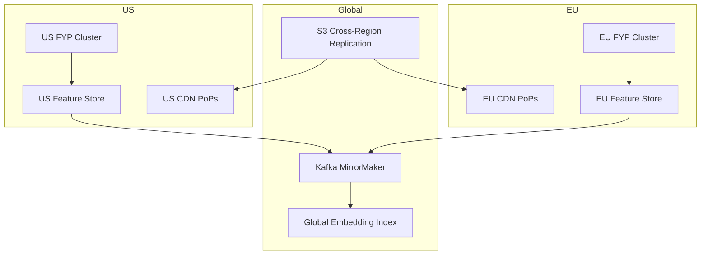

---

## 11. Interview Cheat Sheet

### 11.1 Key Talking Points

1. **FYP is the product** — recommendation system is 80% of the interview
2. **Two-stage recommender** — candidate gen (1500) → rank → diversity rerank (10)
3. **Watch time is king** — completion % is the #1 ranking signal
4. **Engagement pipeline** — Kafka → Flink → Feature Store → Ranker (feedback loop)
5. **Video pipeline** — multipart upload → GPU transcode → HLS → CDN
6. **ABR playback** — 4 quality levels, <1s TTFF
7. **Cold start** — exploration bucket (200 users) → measure → promote/suppress
8. **Seen dedup** — Bloom filter per user
9. **Degradation ladder** — ML → cached → trending → static
10. **Capacity** — 105B views/day, 7 Tbps CDN, 3.6M engagement events/sec

### 11.2 Drawing Order

```mermaid
flowchart LR
    D1[1. Client + CDN] --> D2[2. Upload → S3 → Transcode]
    D2 --> D3[3. FYP service box]
    D3 --> D4[4. Candidate gen sources]
    D4 --> D5[5. Ranker + diversity]
    D5 --> D6[6. Engagement feedback loop]
```

### 11.3 Follow-Up Q&A

**Q: How does TikTok detect viral content so fast?**
> Flink 1-minute windows track completion_rate spikes. When a video's completion_rate jumps above 2 standard deviations of its category mean, it's promoted to the trending candidate pool within 60 seconds. Exploration bucket shows new videos to 200 random users immediately on publish.

**Q: How do you prevent filter bubbles?**
> Diversity reranker enforces category spread. 10% of FYP slots reserved for exploration (random high-quality candidates). Periodic injection of trending content outside user's typical categories.

**Q: How to handle inappropriate content?**
> Pre-publish: ML classifier on frames + audio. Post-publish: user reports → human review queue. Real-time: content safety filter in candidate generation removes flagged videos. Shadow-ban for borderline creators.

**Q: Difference between TikTok and Instagram Reels?**
> TikTok is recommendation-first (FYP for all content). Instagram is social-graph-first (followed accounts). TikTok's ML infrastructure is more mature for cold-start discovery. Reels piggybacks on Instagram's social graph.

**Q: How to scale transcoding?**
> GPU fleet with Kubernetes autoscaling. Kafka consumer lag triggers scale-up. Priority queue ensures VIP creators transcoded first. Pre-warm GPU fleet before peak hours (evenings).

**Q: How do duets/stitches work?**
> Duet: client-side composition of two videos side-by-side. Server stores reference to original video_id. Stitch: server-side FFmpeg concatenation of clip + original. Both inherit original's sound attribution.

### 11.4 Numbers to Memorize

| Metric | Value |
|--------|-------|
| DAU | 700M |
| Videos/session | 100 |
| Views/day | 105B |
| Uploads/day | 35M |
| FYP QPS (peak) | 72K |
| CDN bandwidth | ~7 Tbps |
| Engagement events/sec | 3.6M |
| Candidates to ranker | ~1,500 |
| Videos returned per FYP call | 10 |
| Transcode SLA | < 2 min |
| TTFF target | < 1s |
| Exploration bucket size | 200 users |

### 11.5 What NOT to Say

- ❌ "Just use collaborative filtering" — ignores content-based cold start
- ❌ "Store all watch events in Cassandra" — 315B events/day needs streaming
- ❌ "Transcode on API servers" — CPU bottleneck, use GPU farm
- ❌ "Show all videos to all users" — candidate generation is essential
- ❌ "Like count is the top signal" — watch time/completion dominates

---

## Appendix A: ML Infrastructure Overview

```mermaid
graph TB
    subgraph Training_Offline
        DL[Data Lake] --> FE[Feature Engineering]
        FE --> TR[Model Training - GPU cluster]
        TR --> MV[Model Validation]
        MV --> REG[Model Registry]
    end

    subgraph Serving_Online
        REG --> DEP[Model Server - Triton/TorchServe]
        DEP --> RANK[Ranking Service]
        RANK --> FYP[FYP API]
    end

    subgraph Feedback
        FYP --> IMP[Impression Logs]
        IMP --> DL
        WATCH[Watch Events] --> DL
    end
```

## Appendix B: Content Safety Pipeline

1. **Upload time:** Frame sampling → NSFW classifier → block before publish
2. **Publish time:** Audio transcription → keyword filter
3. **Serving time:** Safety score in candidate pre-filter
4. **Post-publish:** User reports → escalation queue
5. **Creator level:** Trust score based on history → stricter filters for low-trust

## Appendix C: Cost Optimization

| Strategy | Savings |
|----------|---------|
| GPU transcoding (vs CPU) | 10x throughput per dollar |
| CDN tiered caching (hot/warm/cold) | 60% storage cost reduction |
| Video lifecycle (delete unused variants after 1yr) | 30% storage |
| Feature store compression (quantized embeddings) | 75% memory |
| Batch engagement processing (vs per-event) | 50% Kafka cost |

---

*End of TikTok System Design Guide*
