# System Design: LinkedIn

> **Interview Level:** Senior SDE (Google / Microsoft / LinkedIn)  
> **Estimated Time:** 45–60 minutes  
> **Framework:** Hello Interview Delivery Structure

---

## Table of Contents

1. [Problem Statement & Scope](#1-problem-statement--scope)
2. [Requirements](#2-requirements)
3. [Capacity Estimation](#3-capacity-estimation)
4. [Core Entities](#4-core-entities)
5. [API Design](#5-api-design)
6. [Data Model / Schema](#6-data-model--schema)
7. [High-Level Architecture](#7-high-level-architecture)
8. [Deep Dives](#8-deep-dives)
9. [Trade-offs & Alternatives](#9-trade-offs--alternatives)
10. [Failure Modes & Reliability](#10-failure-modes--reliability)
11. [Interview Cheat Sheet](#11-interview-cheat-sheet)

---

## 1. Problem Statement & Scope

### 1.1 The Prompt

> *"Design LinkedIn — a professional networking platform where users create profiles, connect with other professionals, view a personalized feed, search for people and jobs, post and apply to job listings, and send messages."*

### 1.2 What LinkedIn Is

LinkedIn is a **professional identity + economic graph** platform. Unlike Instagram/TikTok (media-first) or Facebook (social-first), LinkedIn optimizes for:

- **Professional identity** — structured profile (experience, education, skills)
- **Connection graph** — 1st/2nd/3rd degree network (NOT follow-based)
- **Feed** — professional content (posts, articles, job updates, connection activity)
- **Job marketplace** — two-sided: recruiters post, candidates apply
- **Search** — people, companies, jobs (heavily filtered)
- **Messaging** — 1:1 and InMail (paid outreach)

### 1.3 Scope Boundaries

| In Scope | Out of Scope (Unless Asked) |
|----------|----------------------------|
| User profiles (structured) | LinkedIn Learning platform |
| Connection graph (1st/2nd/3rd) | Ads auction / Campaign Manager |
| Professional feed | Sales Navigator CRM |
| Job postings & applications | Premium subscription billing |
| People & job search | Video conferencing (LinkedIn Live) |
| Messaging (1:1) | Full email client |
| Company pages (basic) | Recruiter pipeline ATS internals |
| Notifications | Content moderation ML details |

### 1.4 Assumptions

- **900M members**, **300M MAU**, **100M DAU**
- Average connections per user: **500** (much denser than Instagram follows)
- Average **0.5 posts/week** per active user
- Average **2 feed loads/day** per DAU
- **10M job postings** active at any time
- **50M job applications/month**
- Read:write ratio ≈ **50:1**

### 1.5 Clarifying Questions

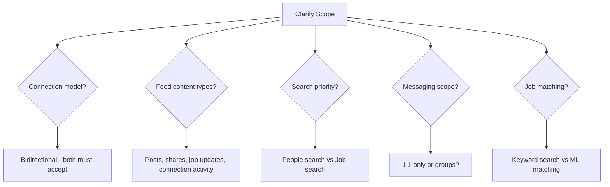

1. **Connection model** — bidirectional (both accept) or unidirectional follow?
2. **Feed** — chronological or ranked? Activity types?
3. **Search** — people search, job search, or both?
4. **Messaging** — 1:1 only? InMail for non-connections?
5. **Job matching** — simple keyword or ML-based recommendations?
6. **2nd/3rd degree** — show in search results? Mutual connections?

---

## 2. Requirements

### 2.1 Functional Requirements

#### Must-Have (P0)

| ID | Requirement | Notes |
|----|-------------|-------|
| F1 | Create/edit professional profile (experience, education, skills) | Structured data |
| F2 | Send/accept/decline connection requests | Bidirectional graph |
| F3 | View connection degree (1st/2nd/3rd) | Graph traversal |
| F4 | Personalized professional feed | Hybrid fan-out + ranking |
| F5 | Create posts (text, images, articles, polls) | Activity publishing |
| F6 | Search people by name, title, company, skills | Filtered search |
| F7 | Post and browse job listings | Two-sided marketplace |
| F8 | Apply to jobs (resume upload) | Application pipeline |
| F9 | Send/receive messages (1:1) | Real-time messaging |
| F10 | Company pages (basic) | Org entity |
| F11 | Notifications (connections, messages, job alerts) | Push + email + in-app |

#### Nice-to-Have (P1)

| ID | Requirement | Notes |
|----|-------------|-------|
| F12 | Job recommendations (ML-matched) | Candidate-job matching |
| F13 | Endorsements & recommendations | Social proof on profile |
| F14 | InMail (message non-connections) | Premium feature |
| F15 | "People You May Know" suggestions | Graph ML |
| F16 | Analytics for job posters | Views, applications |
| F17 | Groups / communities | Sub-graph |
| F18 | News articles (LinkedIn News) | Editorial content |

### 2.2 Non-Functional Requirements

#### Must-Have

| ID | Requirement | Target |
|----|-------------|--------|
| NF1 | Feed latency (p99) | < 800 ms |
| NF2 | People search latency (p99) | < 500 ms |
| NF3 | Job search latency (p99) | < 500 ms |
| NF4 | Message delivery | < 200 ms |
| NF5 | Availability | 99.95% |
| NF6 | Profile page load | < 1 s |
| NF7 | Scalability | 900M members, 100M DAU |

#### Nice-to-Have

| ID | Requirement | Target |
|----|-------------|--------|
| NF8 | Connection suggestion relevance | Click-through > 5% |
| NF9 | Job match quality | Apply rate > 2% on recommendations |
| NF10 | Feed ranking freshness | New connections' posts within 5 min |
| NF11 | Search index freshness | Profile updates indexed within 1 min |

### 2.3 Requirements Mind Map

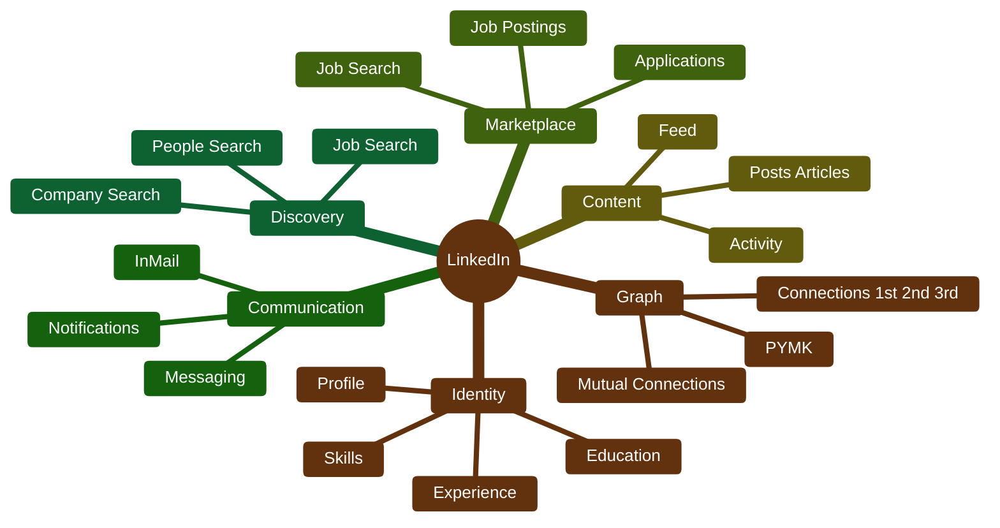

---

## 3. Capacity Estimation

### 3.1 Traffic Estimates

```
Members        = 900,000,000
DAU            = 100,000,000
MAU            = 300,000,000

Feed loads     = 100M DAU × 2 = 200M/day ≈ 2,300 QPS avg, ~7,000 peak
Profile views  = 100M × 3 = 300M/day ≈ 3,500 QPS
People search  = 100M × 2 = 200M/day ≈ 2,300 QPS
Job search     = 100M × 0.5 = 50M/day ≈ 580 QPS
Job applications = 50M/month ≈ 19 QPS avg, ~60 peak

Posts          = 300M MAU × 0.5/week ÷ 7 ≈ 21M/week ≈ 3M/day ≈ 35 QPS
Connections    = 100M DAU × 0.1 connect/day = 10M/day ≈ 116 QPS
Messages       = 100M DAU × 2 messages/day = 200M/day ≈ 2,300 QPS
```

### 3.2 Storage Estimates

**Profiles:**

```
900M members × 5 KB avg profile = 4.5 TB
Experience + education + skills: 900M × 3 KB = 2.7 TB
Total profile data: ~7.2 TB
```

**Connection graph:**

```
900M members × 500 connections × 16 bytes = 7.2 TB (adjacency lists)
With metadata (timestamp, note): ~15 TB
```

**Posts / Feed activities:**

```
3M posts/day × 1 KB = 3 GB/day
3-year retention: 3 GB × 365 × 3 ≈ 3.3 TB
```

**Job postings:**

```
10M active jobs × 2 KB = 20 GB
Historical (3 years, 100M total): ~200 GB
```

**Job applications:**

```
50M/month × 12 months × 3 years × 1 KB = 1.8 TB
Resumes: 50M/month × 500 KB = 25 TB/month (object store)
```

**Messages:**

```
200M messages/day × 500 bytes = 100 GB/day
1-year retention: 100 GB × 365 ≈ 36 TB
```

### 3.3 Search Index Size

```
People index: 900M docs × 2 KB = 1.8 TB (Elasticsearch)
Job index: 10M active × 3 KB = 30 GB
Company index: 60M companies × 1 KB = 60 GB
```

### 3.4 Summary Table

| Resource | Estimate |
|----------|----------|
| Members | 900M |
| DAU | 100M |
| Feed QPS (peak) | 7K |
| Search QPS (peak) | 3.5K |
| Messages/day | 200M |
| Connection graph | ~15 TB |
| Job applications/month | 50M |
| Posts/day | 3M |

---

## 4. Core Entities

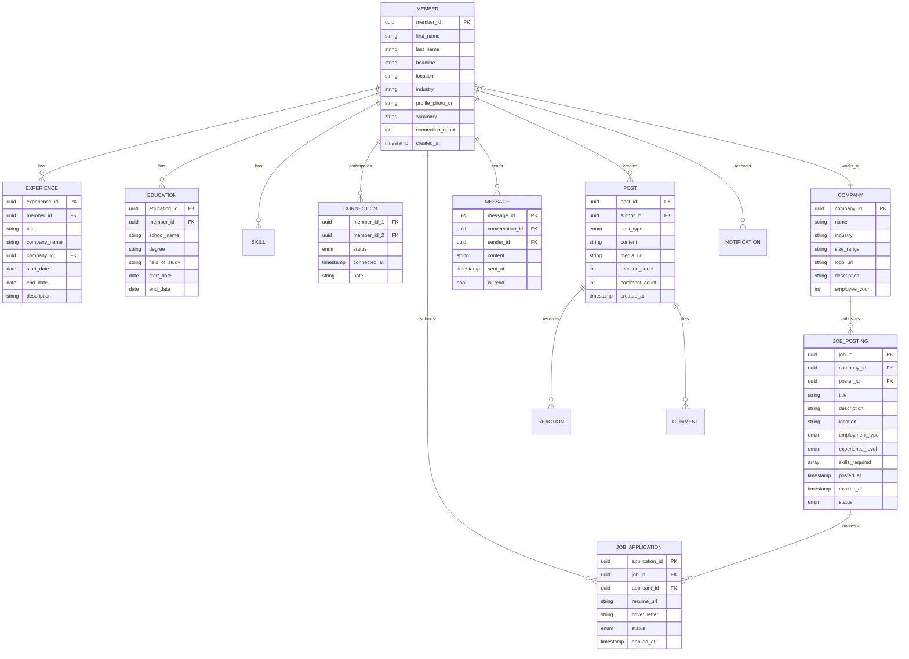

### Entity Storage Mapping

| Entity | Store | Rationale |
|--------|-------|-----------|
| Member / Profile | Espresso (LinkedIn's KV) / Cassandra | High read, structured |
| Experience, Education | Same partition as member | Co-located |
| Connection | Graph store (custom) | Multi-hop traversal |
| Post / Activity | Kafka + Espresso | Event sourcing |
| Job Posting | PostgreSQL + Elasticsearch | ACID + search |
| Job Application | PostgreSQL | Transactional |
| Message | Dedicated message store | High write, real-time |
| Company | PostgreSQL + ES | Relational + search |
| Notification | Redis + Kafka | Real-time delivery |

---

## 5. API Design

### 5.1 Profile APIs

#### Get Profile

```
GET /v1/members/{member_id}
```

**Response 200:**
```json
{
  "member_id": "m_abc123",
  "first_name": "Sarah",
  "last_name": "Chen",
  "headline": "Senior Software Engineer at Google",
  "location": "San Francisco Bay Area",
  "industry": "Technology",
  "profile_photo_url": "https://media.linkedin.com/photos/m_abc123.jpg",
  "summary": "Passionate about distributed systems...",
  "connection_count": 842,
  "connection_degree": 1,
  "mutual_connections": 23,
  "experiences": [
    {
      "experience_id": "exp_001",
      "title": "Senior Software Engineer",
      "company_name": "Google",
      "company_id": "c_google",
      "start_date": "2022-03",
      "end_date": null,
      "description": "Leading feed infrastructure team..."
    }
  ],
  "education": [
    {
      "education_id": "edu_001",
      "school_name": "Stanford University",
      "degree": "MS",
      "field_of_study": "Computer Science",
      "start_date": "2016",
      "end_date": "2018"
    }
  ],
  "skills": ["Distributed Systems", "Java", "Kubernetes", "System Design"]
}
```

#### Update Profile

```
PATCH /v1/members/me
Content-Type: application/json

{
  "headline": "Staff Engineer at Google",
  "summary": "Updated summary..."
}
```

### 5.2 Connection APIs

#### Send Connection Request

```
POST /v1/connections/request
Content-Type: application/json

{
  "recipient_id": "m_xyz789",
  "note": "Hi, I'd love to connect! We worked together at..."
}
```

**Response 201:**
```json
{
  "request_id": "req_001",
  "sender_id": "m_abc123",
  "recipient_id": "m_xyz789",
  "status": "pending",
  "created_at": "2026-07-08T10:00:00Z"
}
```

#### Accept / Decline

```
POST /v1/connections/request/{request_id}/accept
POST /v1/connections/request/{request_id}/decline
DELETE /v1/connections/{member_id}
```

#### List Connections

```
GET /v1/members/{member_id}/connections?degree=1&cursor=&limit=50
GET /v1/members/{member_id}/connections?degree=2&cursor=&limit=50
```

**Response 200:**
```json
{
  "connections": [
    {
      "member_id": "m_def456",
      "first_name": "John",
      "last_name": "Smith",
      "headline": "VP Engineering at Meta",
      "profile_photo_url": "...",
      "connection_degree": 1,
      "mutual_connections": 45,
      "connected_at": "2024-06-15T00:00:00Z"
    }
  ],
  "total_count": 842,
  "next_cursor": "eyJvZmZzZXQiOjUwfQ=="
}
```

### 5.3 Feed APIs

```
GET /v1/feed?cursor=&limit=20
POST /v1/posts
GET /v1/posts/{post_id}
POST /v1/posts/{post_id}/reactions
POST /v1/posts/{post_id}/comments
```

#### Create Post

```
POST /v1/posts
Content-Type: application/json

{
  "content": "Excited to share that our team just shipped a new feature that reduced feed latency by 40%! #engineering #distributed",
  "post_type": "text",
  "visibility": "connections"
}
```

#### Feed Response

```json
{
  "activities": [
    {
      "activity_id": "act_001",
      "type": "post",
      "actor": {
        "member_id": "m_abc",
        "name": "Sarah Chen",
        "headline": "Senior SWE at Google",
        "photo_url": "..."
      },
      "content": "Excited to share that our team...",
      "reaction_count": 142,
      "comment_count": 18,
      "user_reaction": "like",
      "created_at": "2026-07-08T09:00:00Z"
    },
    {
      "activity_id": "act_002",
      "type": "connection_made",
      "actor": { "member_id": "m_def", "name": "John Smith" },
      "target": { "member_id": "m_ghi", "name": "Alice Wong" },
      "created_at": "2026-07-08T08:30:00Z"
    }
  ],
  "next_cursor": "eyJzY29yZSI6MC45NX0=",
  "has_more": true
}
```

### 5.4 Search APIs

#### People Search

```
GET /v1/search/people?q=software+engineer&location=sf&company=google&cursor=&limit=20
```

**Response 200:**
```json
{
  "results": [
    {
      "member_id": "m_abc123",
      "first_name": "Sarah",
      "last_name": "Chen",
      "headline": "Senior Software Engineer at Google",
      "location": "San Francisco, CA",
      "profile_photo_url": "...",
      "connection_degree": 2,
      "mutual_connections": 12,
      "shared_connections": ["m_def", "m_ghi"]
    }
  ],
  "total_count": 45230,
  "facets": {
    "locations": [{ "name": "San Francisco", "count": 12400 }],
    "companies": [{ "name": "Google", "count": 8900 }],
    "industries": [{ "name": "Technology", "count": 35000 }]
  },
  "next_cursor": "..."
}
```

#### Job Search

```
GET /v1/search/jobs?q=backend+engineer&location=remote&experience=senior&cursor=&limit=20
```

**Response 200:**
```json
{
  "results": [
    {
      "job_id": "job_001",
      "title": "Senior Backend Engineer",
      "company": {
        "company_id": "c_stripe",
        "name": "Stripe",
        "logo_url": "..."
      },
      "location": "Remote (US)",
      "employment_type": "full_time",
      "experience_level": "senior",
      "posted_at": "2026-07-01T00:00:00Z",
      "applicant_count": 234,
      "skills_match": ["Java", "Distributed Systems", "Kubernetes"],
      "connection_works_here": true,
      "connection_name": "John Smith"
    }
  ],
  "total_count": 1240,
  "next_cursor": "..."
}
```

### 5.5 Job Posting & Application APIs

```
POST   /v1/jobs
GET    /v1/jobs/{job_id}
PATCH  /v1/jobs/{job_id}
DELETE /v1/jobs/{job_id}
POST   /v1/jobs/{job_id}/apply
GET    /v1/jobs/{job_id}/applications  (recruiter only)
GET    /v1/members/me/applications
```

#### Apply to Job

```
POST /v1/jobs/{job_id}/apply
Content-Type: application/json

{
  "resume_url": "https://media.linkedin.com/resumes/m_abc_resume.pdf",
  "cover_letter": "I'm excited to apply for this role because...",
  "use_profile_as_resume": false
}
```

**Response 201:**
```json
{
  "application_id": "app_001",
  "job_id": "job_001",
  "applicant_id": "m_abc123",
  "status": "submitted",
  "applied_at": "2026-07-08T10:30:00Z"
}
```

### 5.6 Messaging APIs

```
GET    /v1/conversations?cursor=&limit=20
GET    /v1/conversations/{conversation_id}/messages?cursor=&limit=50
POST   /v1/conversations/{conversation_id}/messages
POST   /v1/conversations  (start new conversation)
PUT    /v1/conversations/{conversation_id}/read
```

#### Send Message

```
POST /v1/conversations/{conversation_id}/messages
Content-Type: application/json

{
  "content": "Hi Sarah, I saw your post about feed latency. Would love to chat about your approach.",
  "content_type": "text"
}
```

**Response 201:**
```json
{
  "message_id": "msg_001",
  "conversation_id": "conv_abc",
  "sender_id": "m_def456",
  "content": "Hi Sarah, I saw your post...",
  "sent_at": "2026-07-08T10:35:00Z",
  "is_read": false
}
```

### 5.7 API Flow: Connection Request

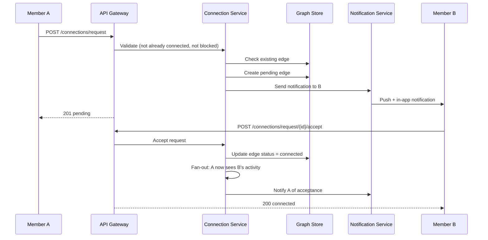

---

## 6. Data Model / Schema

### 6.1 Member Profile (Partitioned KV Store)

```sql
-- Partition key: member_id
CREATE TABLE members (
    member_id       UUID PRIMARY KEY,
    first_name      TEXT,
    last_name       TEXT,
    headline        TEXT,
    location        TEXT,
    industry        TEXT,
    summary         TEXT,
    profile_photo   TEXT,
    connection_count INT,
    created_at      TIMESTAMP,
    updated_at      TIMESTAMP
);
```

### 6.2 Experience & Education (Co-located with Member)

```sql
CREATE TABLE experiences (
    member_id       UUID,
    experience_id   UUID,
    title           TEXT,
    company_id      UUID,
    company_name    TEXT,
    start_date      DATE,
    end_date        DATE,
    description     TEXT,
    PRIMARY KEY (member_id, experience_id)
);

CREATE TABLE education (
    member_id       UUID,
    education_id    UUID,
    school_name     TEXT,
    degree          TEXT,
    field_of_study  TEXT,
    start_date      DATE,
    end_date        DATE,
    PRIMARY KEY (member_id, education_id)
);

CREATE TABLE member_skills (
    member_id       UUID,
    skill_name      TEXT,
    endorsement_count INT,
    PRIMARY KEY (member_id, skill_name)
);
```

### 6.3 Connection Graph

LinkedIn's graph is **bidirectional** and **undirected** (unlike Twitter's directed follow).

```sql
-- Adjacency list: who is member X connected to?
CREATE TABLE connections (
    member_id       UUID,
    connected_to    UUID,
    connected_at    TIMESTAMP,
    PRIMARY KEY (member_id, connected_to)
);

-- Pending requests
CREATE TABLE connection_requests (
    request_id      UUID PRIMARY KEY,
    sender_id       UUID,
    recipient_id    UUID,
    note            TEXT,
    status          TEXT,  -- pending, accepted, declined
    created_at      TIMESTAMP
);
```

**Graph Store (for 2nd/3rd degree):**

LinkedIn built a custom graph database (not Neo4j at scale) optimized for:
- 2-hop BFS with early termination
- Mutual connection computation
- "People You May Know" graph features

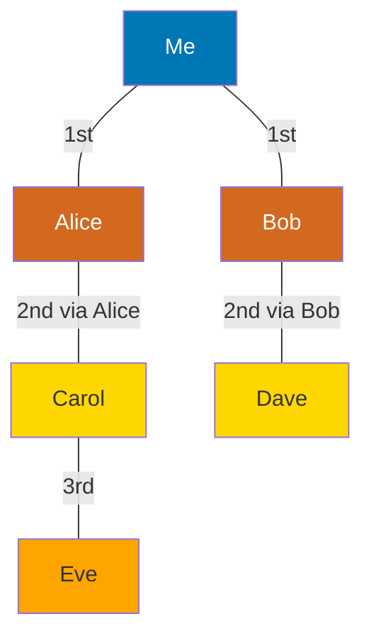

### 6.4 Posts / Activities

```sql
CREATE TABLE posts (
    post_id         UUID PRIMARY KEY,
    author_id       UUID,
    post_type       TEXT,
    content         TEXT,
    media_url       TEXT,
    visibility      TEXT,
    reaction_count  INT,
    comment_count   INT,
    created_at      TIMESTAMP
);

CREATE TABLE posts_by_author (
    author_id       UUID,
    created_at      TIMESTAMP,
    post_id         UUID,
    content_preview TEXT,
    PRIMARY KEY (author_id, created_at, post_id)
) WITH CLUSTERING ORDER BY (created_at DESC);
```

### 6.5 Feed (Materialized)

```
Redis Key: feed:{member_id}
Type: Sorted Set (score = activity_timestamp)
Max entries: 1000

Redis Key: feed_seen:{member_id}
Type: Bloom Filter (dedup activities)
```

### 6.6 Job Postings

```sql
CREATE TABLE job_postings (
    job_id              UUID PRIMARY KEY,
    company_id          UUID,
    poster_id           UUID,
    title               TEXT,
    description         TEXT,
    location            TEXT,
    employment_type     TEXT,
    experience_level    TEXT,
    skills_required     TEXT[],
    salary_min          INT,
    salary_max          INT,
    status              TEXT,  -- active, closed, draft
    posted_at           TIMESTAMP,
    expires_at          TIMESTAMP,
    applicant_count     INT
);

CREATE TABLE job_applications (
    application_id  UUID PRIMARY KEY,
    job_id          UUID,
    applicant_id    UUID,
    resume_url      TEXT,
    cover_letter    TEXT,
    status          TEXT,  -- submitted, reviewed, interviewed, rejected, offered
    applied_at      TIMESTAMP,
    UNIQUE (job_id, applicant_id)
);
```

### 6.7 Messages

```sql
CREATE TABLE conversations (
    conversation_id UUID PRIMARY KEY,
    participant_ids UUID[],
    last_message_at TIMESTAMP,
    created_at      TIMESTAMP
);

CREATE TABLE messages (
    conversation_id UUID,
    message_id      UUID,
    sender_id       UUID,
    content         TEXT,
    content_type    TEXT,
    sent_at         TIMESTAMP,
    is_read         BOOLEAN,
    PRIMARY KEY (conversation_id, sent_at, message_id)
) WITH CLUSTERING ORDER BY (sent_at DESC);
```

### 6.8 Search Indexes (Elasticsearch)

```json
{
  "people_index": {
    "mappings": {
      "properties": {
        "member_id": { "type": "keyword" },
        "full_name": { "type": "text", "analyzer": "name_analyzer" },
        "headline": { "type": "text" },
        "location": { "type": "keyword" },
        "industry": { "type": "keyword" },
        "skills": { "type": "keyword" },
        "current_company": { "type": "keyword" },
        "current_title": { "type": "text" },
        "connection_count": { "type": "integer" }
      }
    }
  },
  "jobs_index": {
    "mappings": {
      "properties": {
        "job_id": { "type": "keyword" },
        "title": { "type": "text", "boost": 3.0 },
        "description": { "type": "text" },
        "company_name": { "type": "keyword" },
        "location": { "type": "keyword" },
        "skills_required": { "type": "keyword" },
        "experience_level": { "type": "keyword" },
        "posted_at": { "type": "date" }
      }
    }
  }
}
```

---

## 7. High-Level Architecture

### 7.1 System Architecture Overview

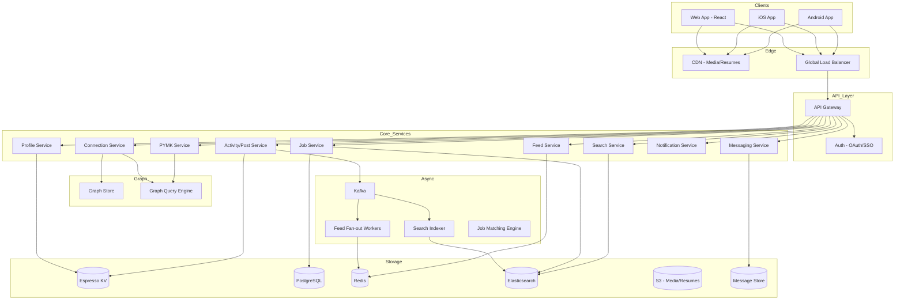

### 7.2 Feed Generation Architecture

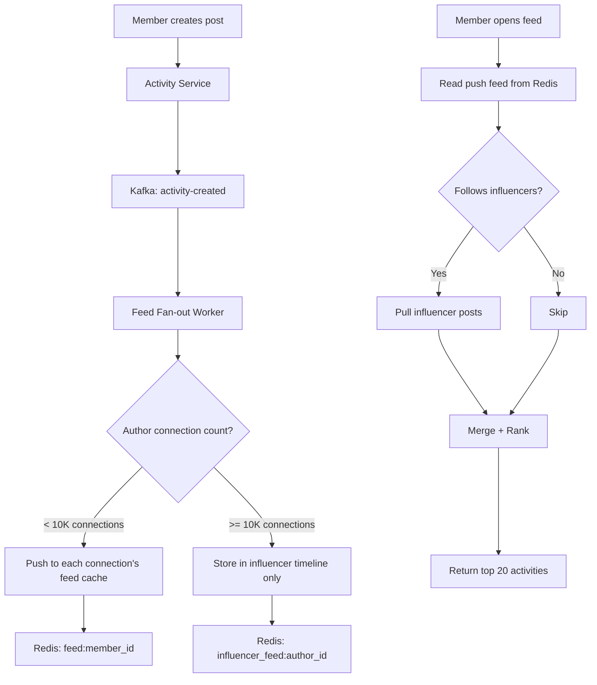

### 7.3 People Search with Connection Degree

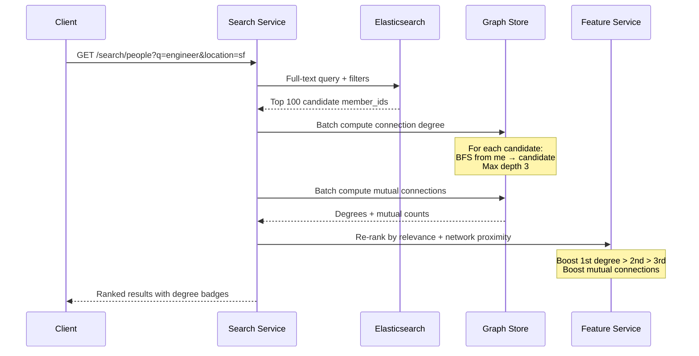

### 7.4 Job Application Pipeline

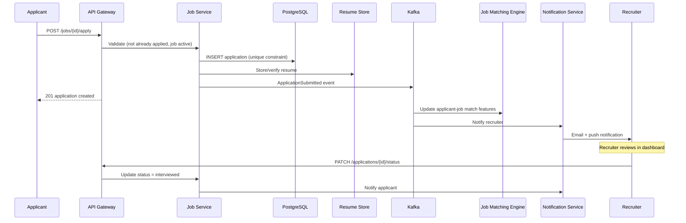

### 7.5 Messaging Architecture

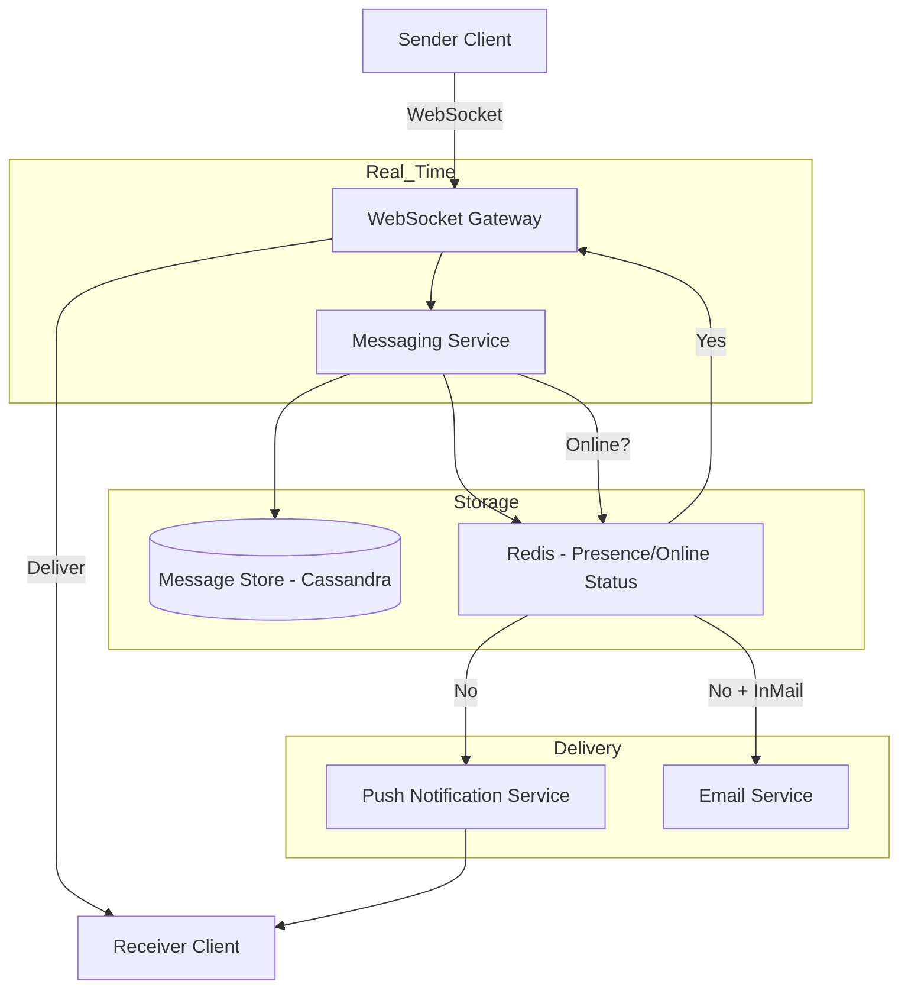

### 7.6 Notification System

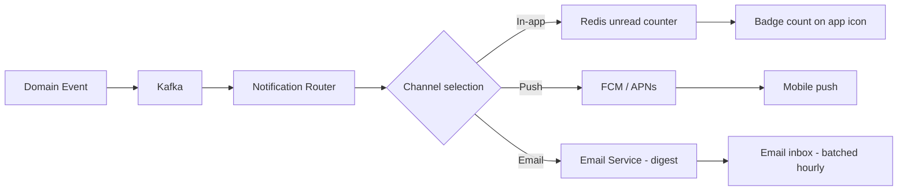

---

## 8. Deep Dives

### 8.1 Deep Dive #1: Connection Graph (1st/2nd/3rd Degree)

This is the **defining feature** of LinkedIn vs other social networks.

#### Connection Model

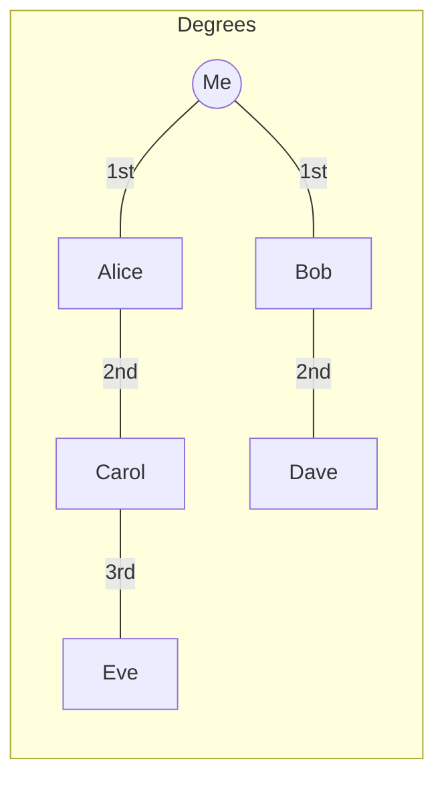

**Key differences from Instagram/Twitter:**
- **Bidirectional:** Both parties must accept
- **Undirected:** If A connects to B, B connects to A
- **Capped:** LinkedIn limits to 30,000 connections (was 500, then 30K)
- **Meaningful:** 1st degree = trusted professional network

#### Graph Storage at Scale

**900M members × 500 avg connections = 450B edges**

Cannot use a single graph DB. LinkedIn's approach:

| Component | Purpose | Tech |
|-----------|---------|------|
| **Adjacency lists** | 1st degree lookup O(1) | Custom KV (Espresso) |
| **Graph query engine** | 2nd/3rd degree BFS | Custom in-memory + disk |
| **Precomputed features** | Mutual connections, PYMK | Offline batch + online serving |

#### 2nd Degree Query Algorithm

```python
def get_second_degree(member_id, limit=100):
    # Step 1: Get all 1st degree connections (O(1) lookup)
    first_degree = graph.get_connections(member_id)  # ~500 IDs

    # Step 2: For each 1st degree, get their connections
    second_degree_candidates = {}
    for connection in first_degree:
        their_connections = graph.get_connections(connection)
        for candidate in their_connections:
            if candidate == member_id:
                continue
            if candidate in first_degree:
                continue  # Already 1st degree
            if candidate not in second_degree_candidates:
                second_degree_candidates[candidate] = []
            second_degree_candidates[candidate].append(connection)

    # Step 3: Rank by number of mutual connections
    ranked = sorted(
        second_degree_candidates.items(),
        key=lambda x: len(x[1]),
        reverse=True
    )

    return ranked[:limit]
```

**Optimization:** Don't expand all 500 × 500 = 250K nodes. Use:
- **Sampling:** Expand top 100 most active connections
- **Precomputed 2nd degree:** Nightly batch job computes and caches
- **Early termination:** Stop when limit reached

#### Mutual Connection Computation

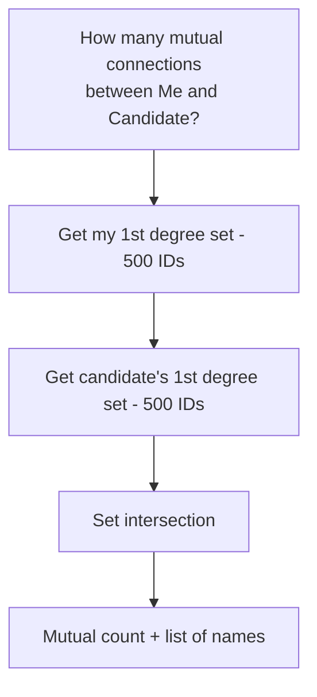

**At scale:** Use **MinHash** or **Bitmap intersection** for fast approximate intersection of large sets.

#### People You May Know (PYMK)

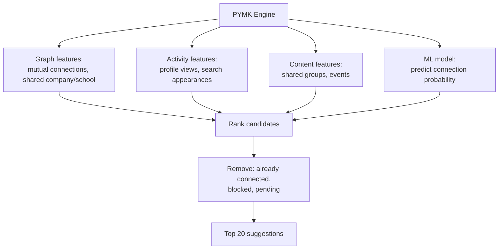

**Scoring features:**
- `mutual_connection_count` — strongest signal
- `shared_employer` — current or past
- `shared_education` — same school + overlapping years
- `shared_location` — same city
- `profile_view_recency` — viewed each other's profiles

### 8.2 Deep Dive #2: Professional Feed

#### Activity Types in Feed

| Type | Source | Frequency |
|------|--------|-----------|
| **Post** | Connection creates post | Common |
| **Share** | Connection shares article/post | Common |
| **Connection made** | Connection connects with someone | Frequent |
| **Job change** | Connection updates experience | Occasional |
| **Work anniversary** | System-generated | Periodic |
| **Recommendation** | Connection endorses someone | Rare |
| **Company update** | Followed company posts | Occasional |

#### Feed Generation: Hybrid Fan-Out

Same pattern as Instagram but with LinkedIn-specific twists:

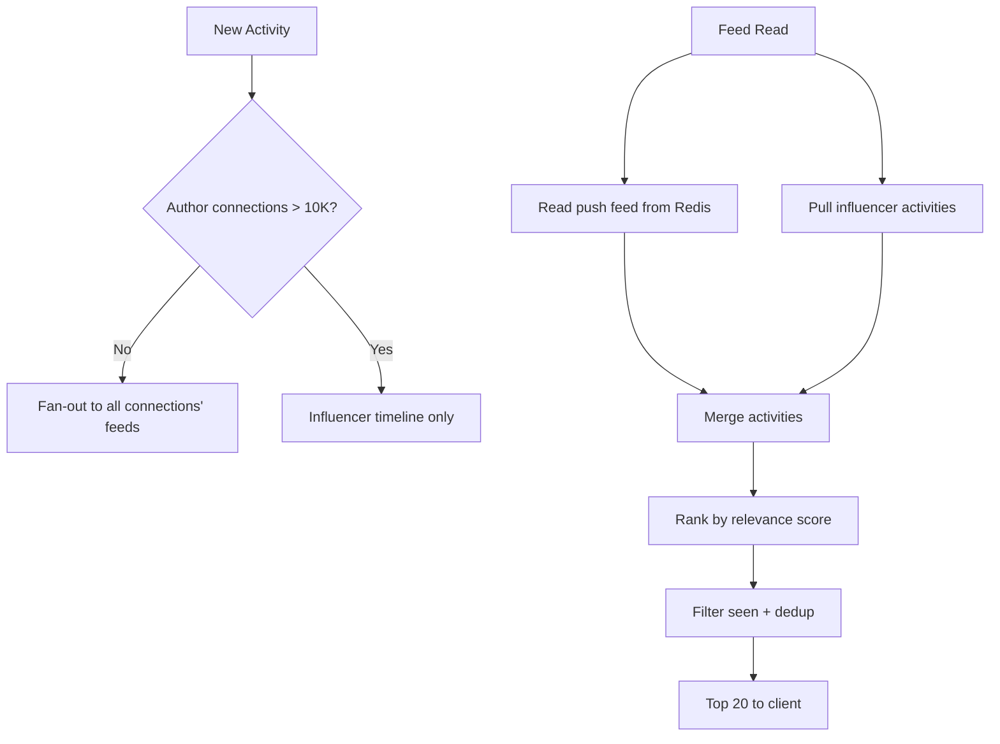

#### Feed Ranking Signals

| Signal | Weight | Description |
|--------|--------|-------------|
| **Connection strength** | High | Frequent interaction, messages, profile views |
| **Engagement velocity** | High | Likes/comments in first hour |
| **Content relevance** | Medium | Matches user's industry/skills |
| **Recency** | Medium | Newer posts boosted |
| **Author seniority** | Low | VP posts slightly boosted |
| **Diversity** | Low | Don't show 5 posts from same person |

**LinkedIn-specific:** Feed shows **professional relevance** over pure engagement. A post about "Kubernetes best practices" ranks higher for a backend engineer than a viral meme.

#### Feed vs Activity Log

- **Feed** — ranked, personalized, limited to connections + influencers
- **Profile activity** — all posts by a member (chronological, paginated)
- **Notifications** — direct interactions (likes on your post, connection requests)

### 8.3 Deep Dive #3: People & Job Search

#### People Search Architecture

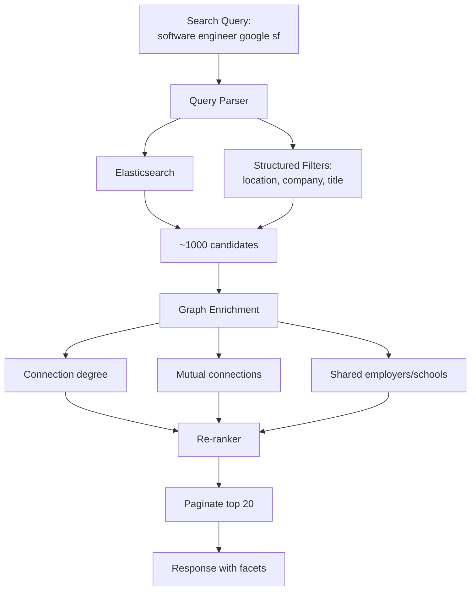

**Search ranking formula (simplified):**

```
score = text_relevance × 0.4
      + connection_proximity × 0.3
      + profile_completeness × 0.1
      + activity_recency × 0.1
      + mutual_connection_boost × 0.1

connection_proximity:
  1st degree = 1.0
  2nd degree = 0.6
  3rd degree = 0.3
  out of network = 0.1
```

#### Job Search & Matching

**Two discovery modes:**

1. **Active search** — user queries with filters
2. **Passive recommendations** — "Jobs you may be interested in"

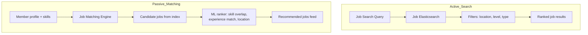

**Job matching features:**

| Feature | Source |
|---------|--------|
| Skill overlap | Profile skills ∩ job required skills |
| Experience level match | Years of experience vs job level |
| Location match | Remote preference, geo proximity |
| Company connection | 1st degree works at company |
| Application history | Similar jobs applied to |
| Salary range fit | If available |

#### Search Index Freshness

```
Profile update → Kafka → Search Indexer → Elasticsearch (within 60s)
Job posting → Kafka → Job Indexer → Elasticsearch (within 30s)
```

**Challenge:** 900M member profiles. Full reindex takes hours.

**Solution:** Incremental indexing via Kafka CDC (Change Data Capture). Only changed fields reindexed.

### 8.4 Deep Dive #4: Messaging System

#### Requirements

- **Real-time delivery** for online users (< 200ms)
- **Offline delivery** via push notification
- **InMail** — message non-connections (premium, rate-limited)
- **Read receipts** — optional
- **Message persistence** — searchable history
- **200M messages/day** throughput

#### Architecture

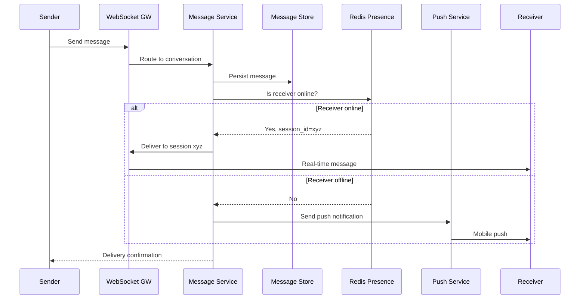

#### Conversation Model

```
Conversation = sorted set of 2+ participant IDs (canonical ordering)
Message = (conversation_id, sent_at, message_id, sender, content)

For 1:1: conversation_id = hash(sorted([user_a, user_b]))
```

#### InMail (Premium Messaging)

- Allows messaging non-connections
- Rate limited: 5–150 InMails/month based on premium tier
- Separate inbox tab
- Recruiter InMail has higher limits (paid product)

#### Message Storage & Pagination

```sql
-- Partition by conversation_id, cluster by sent_at DESC
-- Efficient: "give me last 50 messages in conversation X"
-- Inefficient: "give me all messages sent by user Y" (requires secondary index)
```

### 8.5 Deep Dive #5: Job Posting & Application System

#### Two-Sided Marketplace

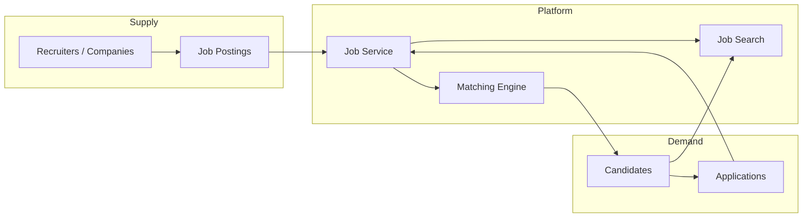

#### Application Pipeline States

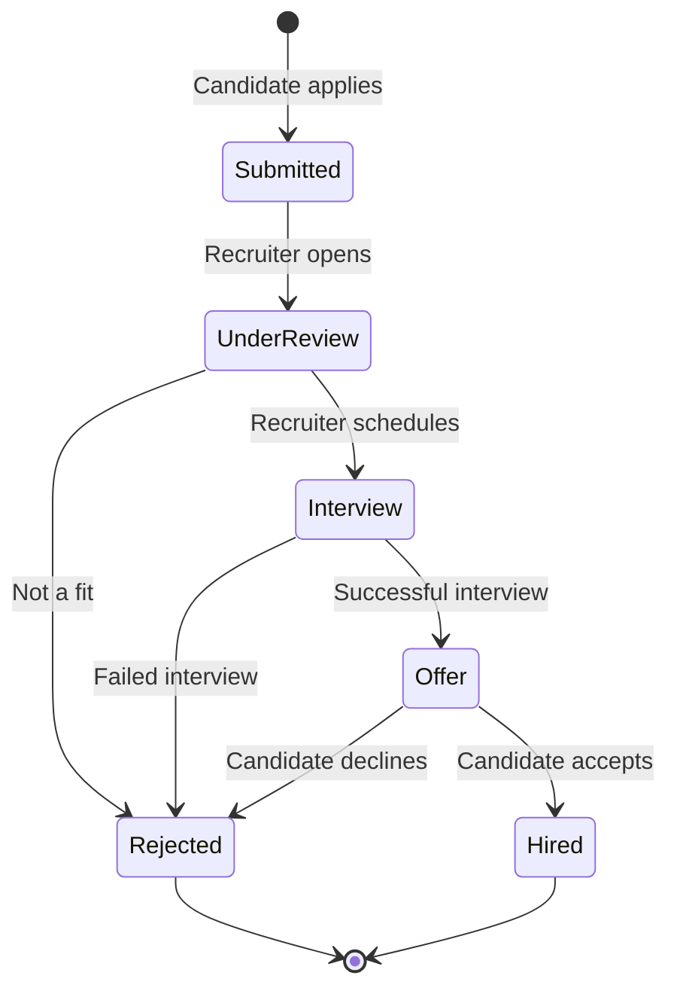

#### Duplicate Application Prevention

```sql
UNIQUE (job_id, applicant_id)  -- one application per job per person
```

#### Resume Handling

1. Upload resume to S3 (presigned URL)
2. Parse resume (PDF → structured data via ML)
3. Extract skills, experience → enrich application
4. Match score computed against job requirements
5. Recruiter sees ranked applicant list

#### Job Posting Lifecycle

| State | Duration | Action |
|-------|----------|--------|
| Draft | Unlimited | Recruiter editing |
| Active | 30 days default | Visible in search |
| Extended | +30 days | Auto-renew or manual |
| Closed | Permanent | No new applications |
| Archived | 1 year | Removed from search, data retained |

---

## 9. Trade-offs & Alternatives

### 9.1 Connection Model: Bidirectional vs Unidirectional

| | Bidirectional (LinkedIn) | Unidirectional (Twitter) |
|--|------------------------|--------------------------|
| **Meaning** | Mutual trust | Interest/following |
| **Graph density** | Lower (both must accept) | Higher (one-click follow) |
| **Feed quality** | Higher trust, less noise | More content, more noise |
| **PYMK value** | Very high | Lower |
| **LinkedIn choice** | Yes Bidirectional | |

### 9.2 Graph Storage Approaches

| Approach | Pros | Cons | LinkedIn Choice |
|----------|------|------|-----------------|
| **Adjacency lists (KV)** | Fast 1st degree | Slow multi-hop | Yes Primary |
| **Neo4j** | Rich graph queries | Doesn't scale to 450B edges | No |
| **GraphFrame (Spark)** | Batch analytics | Not real-time | Yes Offline PYMK |
| **Precomputed 2nd degree** | Fast reads | Stale, storage heavy | Yes Cached |

### 9.3 Feed: Push vs Pull vs Hybrid

| | Push | Pull | Hybrid |
|--|------|------|--------|
| Read latency | Fast | Slow | Fast |
| Write cost | High for influencers | Low | Moderate |
| Freshness | Seconds | On-demand | Seconds |
| **LinkedIn** | | | Yes Hybrid (10K threshold) |

### 9.4 Search: Elasticsearch vs Custom

| | Elasticsearch | Custom (LinkedIn Galene) |
|--|--------------|--------------------------|
| People search | Good enough | Yes Tuned for professional |
| Job search | Good | Yes Skills matching |
| Setup complexity | Low | Very high |
| **Interview answer** | ES for MVP, custom at scale | |

### 9.5 Messaging: Build vs Buy

| | Custom | Twilio/Sendbird |
|--|--------|-----------------|
| Control | Full | Limited |
| Cost at scale | Lower | Higher per message |
| Time to market | Slower | Faster |
| **LinkedIn** | Yes Custom (core feature) | |

### 9.6 SQL vs NoSQL for Jobs

| Data | Store | Why |
|------|-------|-----|
| Job postings | PostgreSQL | ACID, complex queries, low volume |
| Applications | PostgreSQL | Transactional, status transitions |
| Profiles | Espresso/Cassandra | 900M rows, high read |
| Connections | Custom graph KV | 450B edges |
| Feed cache | Redis | Sub-ms reads |
| Search indexes | Elasticsearch | Full-text, facets |

---

## 10. Failure Modes & Reliability

### 10.1 Failure Mode Matrix

```mermaid
flowchart TD
    F1[Graph store slow] --> M1[Serve search without degree badges]
    F2[Feed cache miss] --> M2[Rebuild from pull model - slower]
    F3[Search index stale] --> M3[Serve cached results + async refresh]
    F4[Message delivery fail] --> M4[Retry 3x → persist for later delivery]
    F5[Job application duplicate] --> M5[UNIQUE constraint → 409 Conflict]
    F6[Notification flood] --> M6[Rate limit + digest batching]
```

### 10.2 Graph Store Degradation

**Impact:** Connection degree badges missing from search results

**Mitigation:**
- Precomputed degree cache (nightly batch, TTL 24h)
- Serve search results without degree if graph store timeout > 200ms
- Circuit breaker: skip degree computation, show results ranked by text relevance only

### 10.3 Feed Staleness

**Detection:** Kafka consumer lag > 5,000 for feed fan-out topic

**Mitigation:**
- Auto-scale fan-out workers
- "New posts available" banner (client-side refresh trigger)
- Pull-model fallback for stale feeds

### 10.4 Search Index Lag

**Impact:** Recently updated profile not findable

**Mitigation:**
- Dual-write: update ES synchronously for headline/title changes
- Async indexer for bulk fields (skills, experience)
- "Index freshness" SLI: 95% of updates indexed within 60s

### 10.5 Message Delivery Guarantees

```mermaid
graph LR
    SEND[Send Message] --> PERSIST[Persist to DB first]
    PERSIST --> AT_LEAST_ONCE[At-least-once delivery]
    AT_LEAST_ONCE --> DEDUPE[Client dedup by message_id]
```

- **At-least-once delivery** (not exactly-once)
- Client deduplicates by `message_id`
- Offline messages queued in Redis, delivered on reconnect
- Push notification as fallback within 30s

### 10.6 Data Consistency

| Data | Consistency | Rationale |
|------|-------------|-----------|
| Connection accept | Strong | Both parties must see immediately |
| Profile update | Eventual (search: 60s) | Acceptable lag |
| Feed | Eventual (seconds) | Fan-out async |
| Message delivery | Strong (per conversation) | Ordering matters |
| Job application count | Eventual | Display metric |
| Notification count | Eventual (±1) | Badge count approximate OK |

### 10.7 Observability

```
SLIs:
  - feed_p99_latency < 800ms
  - people_search_p99 < 500ms
  - message_delivery_p99 < 200ms
  - search_index_freshness < 60s
  - connection_request_success_rate > 99.9%

Alerts:
  - graph_query_p99 > 500ms
  - feed_fanout_lag > 30s
  - es_cluster_red
  - message_delivery_failure_rate > 0.1%
```

---

## 11. Interview Cheat Sheet

### 11.1 Key Talking Points

1. **Professional graph** — bidirectional connections, 1st/2nd/3rd degree
2. **900M members, 500 avg connections** — custom graph store, not Neo4j
3. **Feed** — hybrid fan-out (push <10K connections, pull for influencers)
4. **Search** — ES for people + jobs, enriched with graph features (degree, mutual)
5. **Job marketplace** — two-sided, PostgreSQL for transactional integrity
6. **Messaging** — WebSocket real-time + push fallback, 200M messages/day
7. **PYMK** — graph features (mutual connections, shared employer/school) + ML
8. **Profile** — structured data (experience, education, skills) in KV store
9. **Notifications** — multi-channel (in-app, push, email digest)
10. **Capacity** — lower QPS than Instagram/TikTok but heavier graph queries

### 11.2 Drawing Order

```mermaid
flowchart LR
    D1[1. Profile + Graph] --> D2[2. Connection flow]
    D2 --> D3[3. Feed fan-out]
    D3 --> D4[4. Search with degree]
    D4 --> D5[5. Job marketplace]
    D5 --> D6[6. Messaging]
```

### 11.3 Follow-Up Q&A

**Q: How do you compute 2nd degree connections efficiently?**
> BFS with early termination. Get my 500 1st-degree IDs. For each, fetch their connections. Intersect and exclude 1st degree + self. Rank by mutual connection count. Precompute nightly for PYMK; compute on-demand for search (with 200ms timeout).

**Q: Why bidirectional connections instead of follow?**
> Professional context requires mutual trust. "Connecting" implies relationship. Enables meaningful PYMK, warm introductions, and recruiter trust signals. Follow model would dilute network quality.

**Q: How does LinkedIn prevent spam connection requests?**
> Rate limit: 100 requests/week. IP-based detection. ML classifier on request note content. "I don't know this person" feedback loop. Restricted accounts after reports.

**Q: How to handle a member with 30K connections posting?**
> Same influencer pattern as Instagram: skip fan-out, store in influencer timeline, pull at read time. Shared cache for influencer posts.

**Q: Job search vs Google Jobs — what's different?**
> LinkedIn enriches results with network context: "3 connections work here", connection degree to hiring manager, skills match from profile. Professional graph is the differentiator.

**Q: How do you index 900M profiles for search?**
> Elasticsearch with 20+ shards. Incremental indexing via Kafka CDC. Profile changes batched every 5s. Full reindex monthly for schema changes. Hot-warm-cold tiering for inactive profiles.

**Q: Messaging vs Email — why build custom?**
> Real-time presence, read receipts, conversation threading, InMail monetization, integration with connection graph (can only message 1st degree for free). Core product feature worth custom investment.

**Q: How to scale from 10M to 900M members?**
> 10M: Monolith + PostgreSQL + ES. 100M: Extract graph service, Espresso KV. 500M: Custom graph engine, hybrid feed. 900M: Multi-region, precomputed graph features, Galene search.

### 11.4 Numbers to Memorize

| Metric | Value |
|--------|-------|
| Members | 900M |
| DAU | 100M |
| Avg connections | 500 |
| Max connections | 30,000 |
| Feed QPS (peak) | 7K |
| Messages/day | 200M |
| Job applications/month | 50M |
| Active job postings | 10M |
| Posts/day | 3M |
| Search QPS (peak) | 3.5K |
| Influencer threshold | 10K connections |
| Search index freshness | < 60s |

### 11.5 What NOT to Say

- **Avoid:** "Use Neo4j for the connection graph" — 450B edges won't fit
- **Avoid:** "Follow model like Twitter" — LinkedIn is bidirectional connect
- **Avoid:** "Store messages in PostgreSQL" — 200M/day needs dedicated message store
- **Avoid:** "Real-time 2nd degree for all 900M members" — precompute + on-demand with timeout
- **Avoid:** "Skip job matching" — it's a core differentiator

### 11.6 LinkedIn vs Instagram vs TikTok

| Dimension | Instagram | TikTok | LinkedIn |
|-----------|-----------|--------|----------|
| **Primary graph** | Follow (directed) | Follow (directed) | Connect (bidirectional) |
| **Feed driver** | Social graph | ML recommendation | Social graph + professional relevance |
| **Content type** | Photos/video | Short video | Text, articles, professional updates |
| **Key metric** | Engagement (likes) | Watch time | Professional actions (connect, apply, message) |
| **Search** | Hashtags, users | Videos, sounds | People, jobs, companies |
| **Monetization** | Ads | Ads | Jobs, Recruiter, Premium, InMail |
| **Graph complexity** | 1-hop (follows) | 1-hop (follows) | 3-hop (connections) |

---

## Appendix A: Component Responsibility Matrix

| Service | Responsibility | Key Tech |
|---------|---------------|----------|
| Profile Service | CRUD profiles, experience, education, skills | Espresso KV |
| Connection Service | Request, accept, graph mutations | Graph Store |
| Graph Query Engine | 2nd/3rd degree, mutual connections, PYMK features | Custom C++ |
| Feed Service | Feed read, fan-out orchestration | Redis + Kafka |
| Activity Service | Post creation, activity publishing | Espresso + Kafka |
| Search Service | People, job, company search | Elasticsearch |
| Job Service | Posting CRUD, applications, matching | PostgreSQL + ES |
| Messaging Service | Real-time 1:1 messaging, InMail | WebSocket + Cassandra |
| Notification Service | Multi-channel notification routing | Kafka + Redis + FCM |
| PYMK Service | Connection suggestions | Graph features + ML |
| Media Service | Profile photos, resume storage | S3 + CDN |

## Appendix B: Privacy & Visibility

| Setting | Effect on Search | Effect on Feed |
|---------|-----------------|----------------|
| Public profile | Appears in search | Posts visible to connections |
| Private profile | Limited search visibility | Posts only to connections |
| Open to work | Badge visible, boosted in recruiter search | Not in feed |
| Blocked member | Invisible to blocker | No interaction possible |

## Appendix C: Multi-Region Architecture

```mermaid
graph TB
    subgraph US_West
        US_GW[API Gateway]
        US_Graph[Graph Partition - US members]
        US_ES[ES Shard - US profiles]
    end

    subgraph EU
        EU_GW[API Gateway]
        EU_Graph[Graph Partition - EU members]
        EU_ES[ES Shard - EU profiles]
    end

    subgraph Cross_Region
        REPL[Graph Edge Replication<br/>for cross-region connections]
        KAFKA_M[Kafka MirrorMaker]
    end

    US_Graph <-->|cross-region edges| REPL
    REPL <--> EU_Graph
```

**Challenge:** Member in US connects with member in EU. Edge stored in both partitions. Graph queries that cross regions are slower (50ms vs 5ms).

**Solution:** Store cross-region edges in both partitions. Accept slightly higher latency for international network queries.

---

*End of LinkedIn System Design Guide*
