# System Design: WhatsApp

> **Interview level:** Big Tech (L5–L7)  
> **Category:** Messaging & Real-Time  
> **Framework:** Hello Interview delivery structure  
> **Estimated interview time:** 45–60 minutes

---

## Table of Contents

1. [Problem Statement & Scope](#1-problem-statement--scope)
2. [Requirements](#2-requirements)
3. [Capacity Estimation](#3-capacity-estimation)
4. [Core Entities](#4-core-entities)
5. [API Design](#5-api-design)
6. [Data Model](#6-data-model)
7. [High-Level Architecture](#7-high-level-architecture)
8. [Deep Dives](#8-deep-dives)
9. [Trade-offs](#9-trade-offs)
10. [Failure Modes](#10-failure-modes)
11. [Interview Cheat Sheet](#11-interview-cheat-sheet)

---

## 1. Problem Statement & Scope

### 1.1 The Prompt

> "Design a messaging system like WhatsApp that supports one-to-one and group chat, end-to-end encryption, delivery/read receipts, media sharing, and reliable message delivery for users who are online, offline, or intermittently connected."

### 1.2 What WhatsApp Actually Is (Context)

WhatsApp is a **mobile-first, E2E-encrypted messaging platform** with:

- ~2B+ monthly active users globally
- Dominant in emerging markets with unreliable networks
- Minimal server-side message plaintext (Signal Protocol)
- Strong focus on **delivery guarantees**, **battery efficiency**, and **low bandwidth**

In an interview, you are **not** rebuilding WhatsApp's full product (Status, Channels, Payments, Business API). You are designing the **core messaging backbone**.

### 1.3 In Scope

| Feature | Details |
|---------|---------|
| 1:1 messaging | Text, images, video, documents, voice notes |
| Group messaging | Up to 256 members (WhatsApp limit); admin controls |
| E2E encryption | Signal Protocol; server stores ciphertext only |
| Online delivery | Real-time push via persistent connection |
| Offline delivery | Store-and-forward; sync on reconnect |
| Read receipts | Delivered (checkmarks), Read (checkmarks) (blue) |
| Message ordering | Per-conversation causal ordering |
| Multi-device | Phone + linked devices (desktop/web) |
| Presence | Online / last seen (optional privacy) |

### 1.4 Out of Scope (State Explicitly)

- Voice/video calling (separate real-time media stack)
- WhatsApp Business / catalog / payments
- Status/stories (ephemeral broadcast — different fan-out model)
- Full contact discovery via phone-number upload (mention briefly, don't deep-dive)
- Content moderation at scale (E2E limits server-side scanning)
- AI features, chatbots, channels

### 1.5 Clarifying Questions to Ask the Interviewer

```text
1. Do we need E2E encryption? (Almost always yes for WhatsApp-like)
2. Max group size? (256 is canonical)
3. Multi-device support required?
4. Do we need message history sync for new devices?
5. Target scale: DAU, messages/day?
6. Read receipts on by default?
7. Are we designing for mobile-only or web/desktop too?
8. Media size limits? (16 MB images, 100 MB docs typical)
```

---

## 2. Requirements

### 2.1 Functional Requirements

| ID | Requirement | Priority |
|----|-------------|----------|
| FR-1 | User registers with phone number + OTP | P0 |
| FR-2 | Send/receive 1:1 encrypted messages | P0 |
| FR-3 | Create/manage groups (add/remove, admin) | P0 |
| FR-4 | Deliver messages to online users in real time | P0 |
| FR-5 | Queue messages for offline users; deliver on reconnect | P0 |
| FR-6 | Support delivery receipts (sent → server → delivered) | P0 |
| FR-7 | Support read receipts (per message or per conversation) | P1 |
| FR-8 | Upload/download encrypted media blobs | P0 |
| FR-9 | Message ordering within a chat | P0 |
| FR-10 | Typing indicators | P2 |
| FR-11 | Last seen / online presence (privacy-aware) | P1 |
| FR-12 | Multi-device: message sync across linked devices | P1 |
| FR-13 | Delete-for-me / delete-for-everyone | P2 |

### 2.2 Non-Functional Requirements

| ID | Requirement | Target |
|----|-------------|--------|
| NFR-1 | Availability | 99.99% for message delivery path |
| NFR-2 | Delivery latency (online) | p99 < 500 ms globally |
| NFR-3 | Offline sync | All pending messages within 30 s of reconnect |
| NFR-4 | Durability | Zero message loss once ACK'd by server |
| NFR-5 | Scalability | 100M DAU, 50B messages/day |
| NFR-6 | Security | E2E encryption; forward secrecy |
| NFR-7 | Privacy | Server cannot read message content |
| NFR-8 | Bandwidth efficiency | Binary protocol; delta sync |
| NFR-9 | Battery efficiency | Long-lived connection with backoff |
| NFR-10 | Ordering | Per-chat total order (or acceptable eventual order) |

### 2.3 Constraints Unique to WhatsApp

1. **Server is untrusted for content** — design APIs around ciphertext + metadata minimization.
2. **Mobile networks are flaky** — assume disconnects every few minutes.
3. **Global user base** — multi-region with data residency considerations.
4. **Groups amplify fan-out** — 256 × message rate is a hot path.

---

## 3. Capacity Estimation

### 3.1 Assumptions

| Metric | Value |
|--------|-------|
| Total users | 2B registered |
| DAU | 100M (5% of registered — conservative interview number) |
| Peak concurrent online | 20M (20% of DAU) |
| Avg messages/user/day | 50 |
| Peak factor | 3× average |
| Avg text message (ciphertext) | 500 bytes |
| Media messages | 20% of total |
| Avg group size | 8 members |
| Group messages | 30% of total |

### 3.2 Message Throughput

```text
Daily messages = 100M × 50 = 5B/day
Average QPS = 5B / 86400 ≈ 58,000 msg/s
Peak QPS ≈ 58,000 × 3 ≈ 175,000 msg/s
```

For group messages (30%): each message may fan out to ~8 recipients → additional delivery events.

```text
Group fan-out delivery events ≈ 175,000 × 0.30 × 8 ≈ 420,000 delivery events/s (peak)
```

### 3.3 Storage (Message Queue + History)

**Offline queue (hot):**

```text
Assume 10% of DAU offline with pending messages at any moment = 10M users
Avg pending messages per offline user = 5
Avg size per queued message (ciphertext + metadata) = 1 KB

Hot queue storage = 10M × 5 × 1 KB = 50 GB (active working set)
With replication (3×) = 150 GB — fits in Redis/SSD clusters
```

**Long-term message storage (encrypted blobs on client; server-side backup optional):**

WhatsApp historically minimized server retention. For interview, assume **optional encrypted backup**:

```text
If 50% users enable backup, 30 days retention:
Daily new ciphertext = 5B × 500 bytes × 50% = 1.25 TB/day
30-day retention ≈ 37.5 PB (too large — use client-primary storage)

Better model: Server stores only undelivered messages (TTL 30 days)
Undelivered rate ~0.1% → 5M messages/day × 1 KB × 30 ≈ 150 GB/month
```

### 3.4 Connection Count

```text
Peak persistent connections = 20M online users
If multi-device avg 1.3 devices → 26M WebSocket/long-poll connections

Memory per connection ≈ 10 KB → 260 GB connection state (distributed across edge)
```

### 3.5 Media Storage

```text
Media messages/day = 5B × 20% = 1B/day
Avg media size = 2 MB (compressed)
Daily media ingress = 2 PB/day

Use object storage (S3/GCS) with CDN; TTL after all recipients download (e.g., 30 days)
```

### 3.6 Bandwidth

```text
Text egress peak ≈ 175,000 × 500 B × 2 (bidirectional overhead) ≈ 175 MB/s
Media dominates — CDN edge caching essential
```

---

## 4. Core Entities

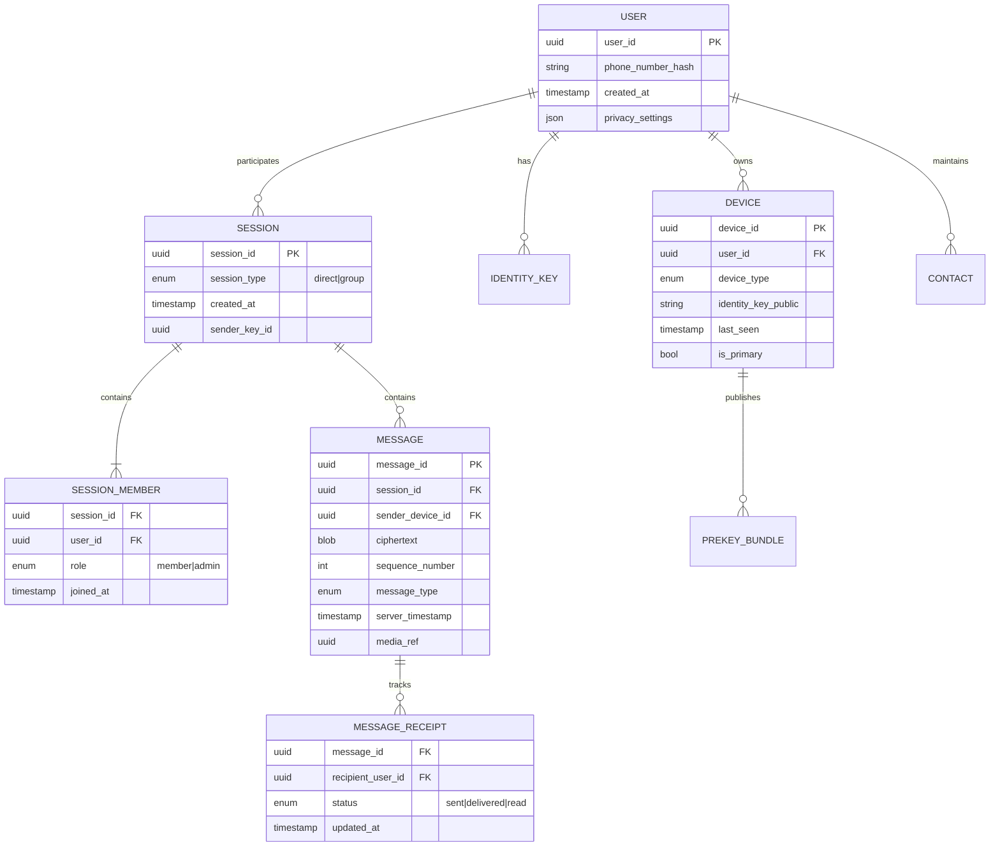

### 4.1 Entity Descriptions

| Entity | Purpose |
|--------|---------|
| **User** | Account identified by phone; privacy settings |
| **Device** | Physical client with own Signal keys; multi-device |
| **Identity Key** | Long-term Curve25519 public key per device |
| **Prekey Bundle** | One-time prekeys for X3DH session establishment |
| **Session** | 1:1 chat or group chat container |
| **Message** | Ciphertext + metadata; server never sees plaintext |
| **Message Receipt** | Per-recipient delivery/read state |
| **Media Ref** | Pointer to encrypted blob in object storage |

---

## 5. API Design

### 5.1 Design Principles

- **Metadata-minimal REST/gRPC** for registration, key upload, media
- **Binary protocol over WebSocket** (or HTTP/2 stream) for message flow — like WhatsApp's custom XMPP-inspired protocol
- **Idempotency keys** on every message send (client-generated `message_id`)

### 5.2 REST/gRPC APIs

#### Registration & Auth

```http
POST /v1/auth/register
Body: { phone_number, device_info }
Response: { user_id, otp_sent: true }

POST /v1/auth/verify
Body: { phone_number, otp, device_id }
Response: { access_token, refresh_token, user_id }
```

#### Key Management (Signal Protocol)

```http
POST /v1/keys/bundle
Body: {
  device_id,
  identity_key,
  signed_prekey,
  one_time_prekeys: [...]
}

GET /v1/keys/bundle/{user_id}/{device_id}
Response: { identity_key, signed_prekey, one_time_prekey }

POST /v1/keys/replenish
Body: { device_id, one_time_prekeys: [...] }
```

#### Session Management

```http
POST /v1/sessions
Body: { type: "direct", participant_ids: [user_a, user_b] }
Response: { session_id }

POST /v1/sessions/{session_id}/members
Body: { user_ids: [...], action: "add" | "remove" }
```

#### Media Upload (Encrypted)

```http
POST /v1/media/upload
Headers: { Authorization, Content-Type: application/octet-stream }
Body: <encrypted blob>
Response: { media_id, upload_url, encryption_key_ref }

GET /v1/media/{media_id}
Response: 302 redirect to CDN signed URL
```

### 5.3 Real-Time Message Protocol (WebSocket)

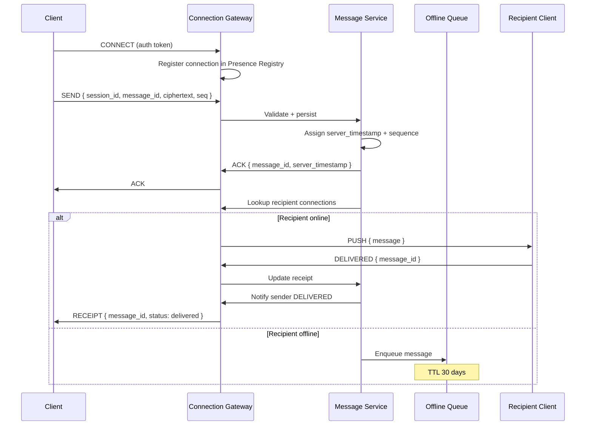

#### WebSocket Message Types

| Type | Direction | Payload |
|------|-----------|---------|
| `SEND` | Client → Server | `{ message_id, session_id, ciphertext, type }` |
| `ACK` | Server → Client | `{ message_id, server_timestamp, seq }` |
| `PUSH` | Server → Client | `{ message envelope }` |
| `DELIVERED` | Client → Server | `{ message_id }` |
| `READ` | Client → Server | `{ message_id \| last_read_seq }` |
| `RECEIPT` | Server → Client | `{ message_id, user_id, status }` |
| `SYNC` | Client → Server | `{ last_seq_by_session }` |
| `SYNC_RESP` | Server → Client | `{ missing messages[] }` |
| `PING/PONG` | Bidirectional | Keepalive |

### 5.4 Long Polling Fallback

For restrictive networks or older clients:

```http
GET /v1/messages/poll?timeout=30&last_seq={cursor}
Response: { messages: [...], next_cursor }
```

Long polling is **less efficient** but necessary for corporate firewalls blocking WebSockets.

---

## 6. Data Model

### 6.1 Message Table (Sharded by session_id)

```sql
CREATE TABLE messages (
    message_id        UUID PRIMARY KEY,
    session_id        UUID NOT NULL,
    sender_user_id    UUID NOT NULL,
    sender_device_id  UUID NOT NULL,
    ciphertext        BYTEA NOT NULL,
    message_type      SMALLINT NOT NULL,  -- text, image, video, etc.
    client_timestamp  TIMESTAMP NOT NULL,
    server_timestamp  TIMESTAMP NOT NULL DEFAULT NOW(),
    sequence_number   BIGINT NOT NULL,
    media_id          UUID,
    is_deleted        BOOLEAN DEFAULT FALSE,

    UNIQUE (session_id, sequence_number)
) PARTITION BY HASH (session_id);
```

**Sharding key:** `session_id` — all messages in a conversation co-locate.

### 6.2 Offline Message Queue

```sql
CREATE TABLE offline_queue (
    recipient_user_id UUID NOT NULL,
    message_id        UUID NOT NULL,
    session_id        UUID NOT NULL,
    envelope          BYTEA NOT NULL,  -- pre-encrypted for recipient device
    created_at        TIMESTAMP NOT NULL,
    expires_at        TIMESTAMP NOT NULL,
    retry_count       INT DEFAULT 0,

    PRIMARY KEY (recipient_user_id, message_id)
) PARTITION BY HASH (recipient_user_id);
```

### 6.3 Receipts

```sql
CREATE TABLE message_receipts (
    message_id   UUID NOT NULL,
    user_id      UUID NOT NULL,
    status       SMALLINT NOT NULL,  -- 1=sent, 2=delivered, 3=read
    updated_at   TIMESTAMP NOT NULL,

    PRIMARY KEY (message_id, user_id)
);
```

For groups, **one receipt row per (message, member)** — 256 rows max per message.

### 6.4 Sequence Number Generation

Per-session monotonic counter stored in Redis or DB:

```text
INCR session:{session_id}:seq → atomic sequence_number
```

Alternative: Hybrid Logical Clocks (HLC) or server timestamp + device ID tiebreaker for ordering without central counter bottleneck.

### 6.5 Index Strategy

| Query Pattern | Index |
|---------------|-------|
| Fetch chat history | `(session_id, sequence_number DESC)` |
| Pending offline messages | `(recipient_user_id, created_at)` |
| Unread count | `(user_id, session_id, last_read_seq)` materialized |

---

## 7. High-Level Architecture

### 7.1 System Context Diagram

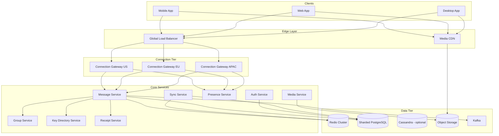

### 7.2 Message Send Flow (1:1)

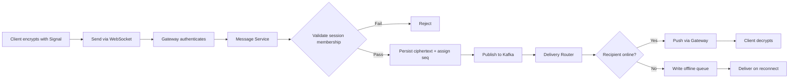

### 7.3 Group Message Fan-Out

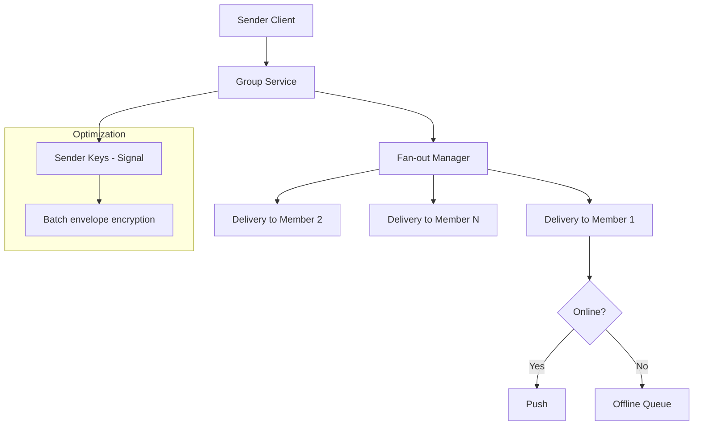

**Sender Keys (Signal):** In groups, client encrypts once with a sender key; server fan-out distributes same ciphertext. Avoids N encryptions on client for N members.

### 7.4 Multi-Device Sync

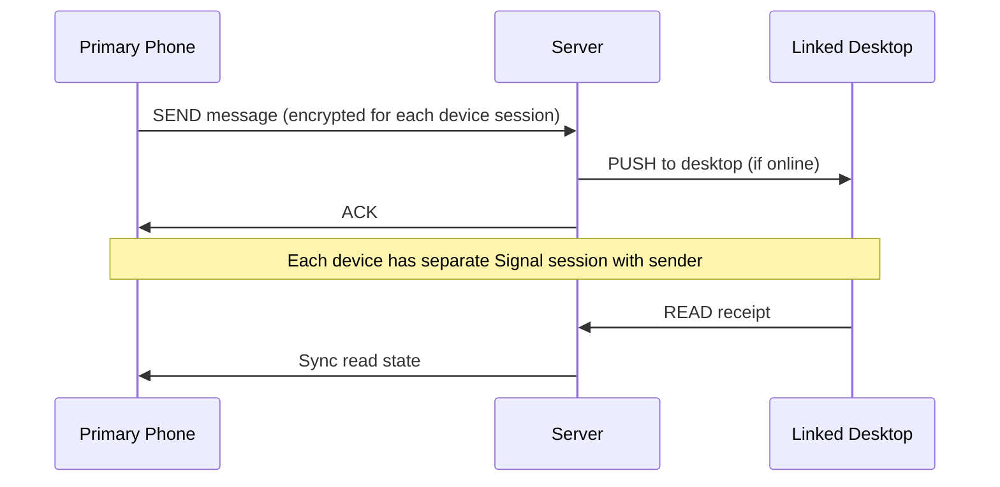

### 7.5 Regional Architecture

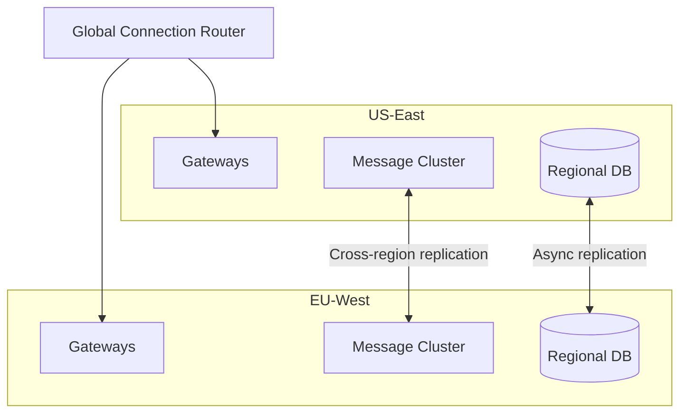

**Routing rule:** User's home region determined at registration (phone country code + latency probe). Connection router directs WebSocket to nearest edge, which forwards to home region for persistence.

### 7.6 Component Responsibilities

| Component | Responsibility |
|-----------|----------------|
| **Connection Gateway** | WebSocket termination, auth, heartbeat, push |
| **Message Service** | Persist, sequence, route messages |
| **Group Service** | Membership, admin ops, fan-out orchestration |
| **Key Directory** | Prekey bundles, identity keys (Signal) |
| **Presence Service** | Online/offline, last seen |
| **Receipt Service** | Delivery/read state aggregation |
| **Media Service** | Encrypted blob upload, CDN URLs |
| **Sync Service** | Catch-up on reconnect, gap fill |
| **Kafka** | Async fan-out, analytics, backup pipeline |

---

## 8. Deep Dives

### 8.1 End-to-End Encryption (Signal Protocol)

WhatsApp uses the **Signal Protocol** — interview gold standard.

#### Key Components

| Mechanism | Purpose |
|-----------|---------|
| **X3DH** | Initial key agreement using identity + prekeys |
| **Double Ratchet** | Per-message forward secrecy + break-in recovery |
| **Sender Keys** | Efficient group encryption |

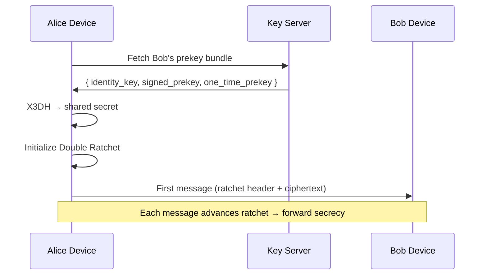

#### What the Server Stores

| Data | Encrypted? |
|------|------------|
| Message body | Yes (client ciphertext) |
| Sender/recipient IDs | No (routing metadata) |
| Timestamps | No |
| Group membership | No |
| Profile name/photo | Optional E2E (WhatsApp added) |

#### Interview Talking Points

1. **Server cannot decrypt** — compromise limits exposure to metadata
2. **Key verification** — safety numbers / QR scan
3. **Multi-device** — each device is separate Signal session; sender encrypts per device
4. **Group admin adds member** — new member cannot read history (Sender Key rotation)
5. **Backup trade-off** — cloud backup may use password-derived keys (weaker than pure E2E)

### 8.2 Message Delivery: Online vs Offline

#### Online Path

1. Client maintains WebSocket with heartbeat (30–60 s)
2. Gateway registers `(user_id, device_id) → connection_id` in Redis
3. Message Service looks up connection, pushes envelope
4. Client ACKs `DELIVERED` → server updates receipt → notifies sender

#### Offline Path

1. No active connection in Presence Registry
2. Message written to `offline_queue` partitioned by `recipient_user_id`
3. Optional push notification (APNs/FCM) with **no content** — "You have a new message"
4. On reconnect: client sends `SYNC { last_seq_by_session }`, server streams backlog

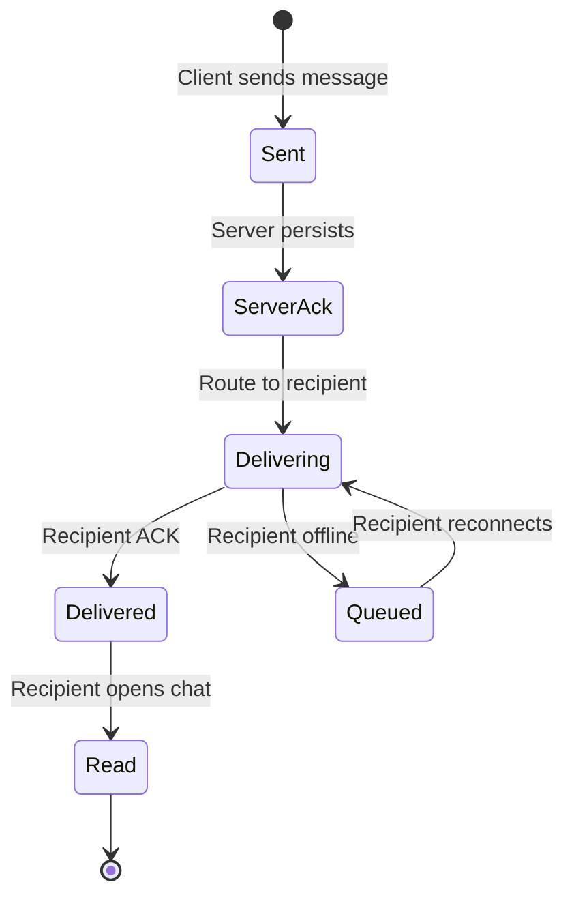

#### Push Notification Integration

```text
FCM/APNs payload (privacy-preserving):
{
  "type": "new_message",
  "session_id": "hash(session_id)",  // opaque
  "silent": true  // wake app to fetch via WebSocket
}
```

Never put plaintext or sender name in push if E2E is strict (WhatsApp shows sender — uses metadata exception).

### 8.3 WebSocket vs Long Polling

| Aspect | WebSocket | Long Polling |
|--------|-----------|--------------|
| Latency | Low (~ms) | Higher (up to poll interval) |
| Battery | Efficient (single conn) | More HTTP overhead |
| Firewall | Sometimes blocked | Works everywhere |
| Server cost | Stateful connections | Stateless per poll |
| Scale | 20M+ conn needs dedicated tier | Higher CPU per user |

**WhatsApp approach:** WebSocket primary; fallback to long poll / HTTP/2 stream.

**Connection Gateway scaling:**

```text
20M connections / 100K per gateway instance = 200 gateway nodes
Sticky sessions via consistent hashing on user_id
```

### 8.4 Message Ordering

#### Requirements

- Messages within a **single chat** appear in consistent order for all participants
- Cross-chat ordering irrelevant

#### Implementation Options

| Approach | Pros | Cons |
|----------|------|------|
| **Central sequence per session** | Total order, simple | Hot key for active chats |
| **Server timestamp ordering** | Easy | Clock skew issues |
| **Hybrid Logical Clock** | No single bottleneck | Complex merge |
| **Client sequence + server reconcile** | Low latency | Temporary disorder on sync |

**Recommended:** Per-session monotonic `sequence_number` assigned at Message Service (single writer per session partition).

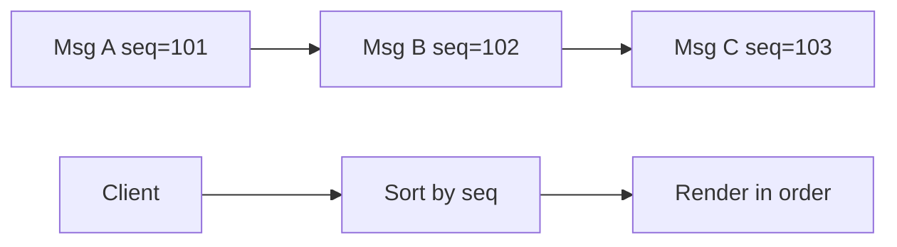

**Out-of-order arrival:** Client buffers messages with gap detection; requests `SYNC` for missing sequences.

### 8.5 Group Messaging at Scale

#### Fan-Out Strategies

| Strategy | Description | WhatsApp-like? |
|----------|-------------|----------------|
| **Write fan-out** | N writes per message | Simple, read cheap |
| **Read fan-out** | 1 write, N reads at delivery | Write cheap, read expensive |
| **Hybrid** | Small groups write fan-out; large use read fan-out | Common |

For 256-member groups with high activity, **Sender Keys** reduce client encryption cost; server still does N deliveries.

#### Group Membership Changes

```text
Add member:
  1. Admin sends GROUP_ADD (encrypted group metadata)
  2. Rotate Sender Key (new member can't decrypt old messages)
  3. Distribute new Sender Key to all members (pairwise Signal)

Remove member:
  1. Rotate Sender Key immediately (removed member can't decrypt future)
  2. Re-encrypt group state
```

### 8.6 Read Receipts

#### Per-Message vs Per-Session Cursor

| Model | Storage | Best for |
|-------|---------|----------|
| Per-message receipt | O(messages × members) | Small groups |
| Last-read sequence cursor | O(members) | Large groups |

**WhatsApp:** Blue checkmarks per message in 1:1; in groups shows delivered/read counts.

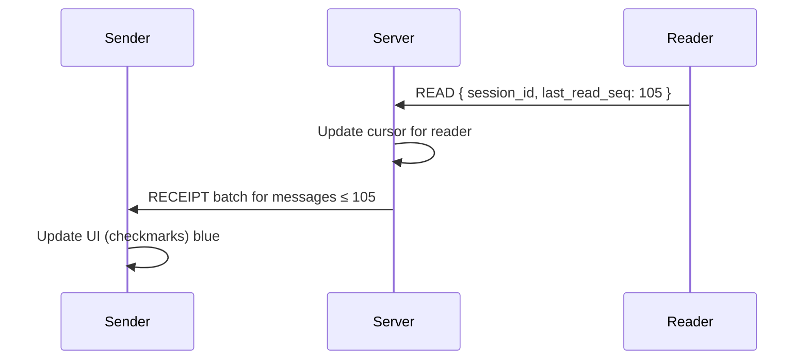

Privacy: Users can disable read receipts (but then can't see others' either — reciprocity).

### 8.7 Media Pipeline

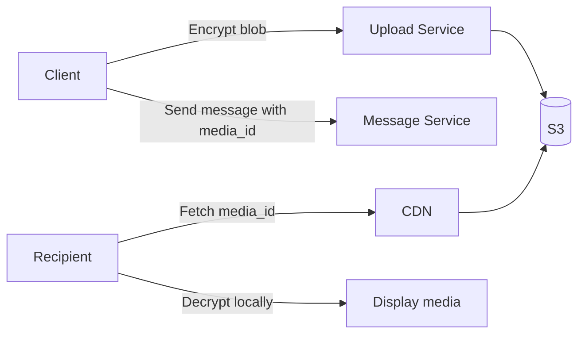

- Client encrypts with random AES-256 key
- Key embedded in message ciphertext (Signal protects it)
- Server/CDN sees only opaque bytes
- Delete blob when all recipients ACK download + TTL expires

---

## 9. Trade-offs

### 9.1 E2E Encryption vs Features

| Feature | Without E2E | With E2E |
|---------|-------------|----------|
| Server-side search | Easy | Impossible on content |
| Spam detection | ML on content | Metadata-only heuristics |
| Cloud backup | Trivial | Password-based key escrow |
| Moderation | Automated | User reports + metadata |

### 9.2 WebSocket vs Long Polling

Choose WebSocket for production; offer long poll as fallback. Cost is connection state vs CPU.

### 9.3 Write Fan-Out vs Read Fan-Out (Groups)

- **Write fan-out:** Better for small groups, offline delivery pre-computed
- **Read fan-out:** Better for broadcast-like groups (not WhatsApp's model)

WhatsApp groups (≤256) → **write fan-out to offline queues** + **online push**.

### 9.4 Strong Ordering vs Availability (CAP)

During partition, prefer **availability + eventual order** over blocking sends. Client reconciles with sequence numbers.

### 9.5 Multi-Region Consistency

- Messages persisted in user's home region (strong consistency within region)
- Cross-region: async replication for disaster recovery, not synchronous (latency)

### 9.6 Push vs Pull for Offline

- **Push (FCM):** Better UX, battery cost
- **Pull on open:** Simpler, worse notification latency

Use push with silent wake → WebSocket sync.

---

## 10. Failure Modes

### 10.1 Gateway Crash

| Impact | Mitigation |
|--------|------------|
| Active connections dropped | Client exponential backoff reconnect |
| In-flight messages lost | Client retries with same `message_id` (idempotent) |

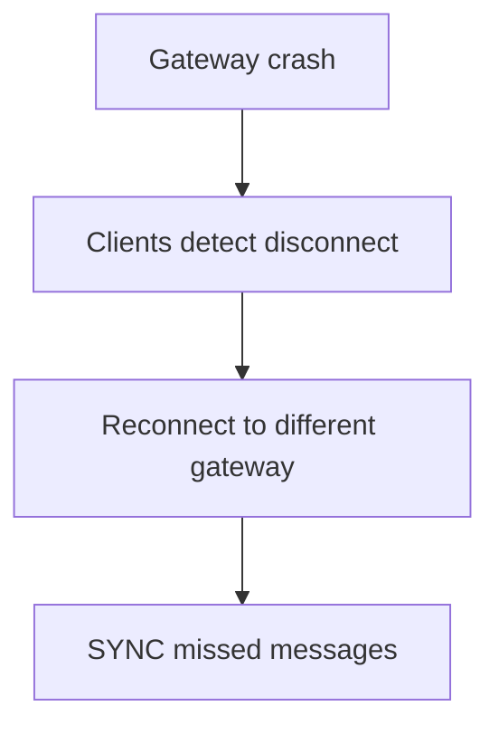

### 10.2 Message Service Overload

- Kafka absorbs write spikes
- Backpressure: return 503 + retry-after
- Rate limit per user (anti-spam)

### 10.3 Hot Session Partition

Celebrity chat or massive group → single partition hotspot.

**Mitigations:**
- Sub-partition by time range
- Dedicated hot-session routing
- Rate limits on group message frequency

### 10.4 Offline Queue Growth

User offline for 30 days → queue fills.

- TTL expiration with "message unavailable" to sender
- Cap queue depth per user (e.g., 10K messages)
- Sender sees "delivered to server" but not "delivered to device"

### 10.5 Key Directory Exhaustion

One-time prekeys run out → X3DH falls back to signed prekey (weaker forward secrecy for first message).

**Mitigation:** Monitor prekey count; alert client to replenish at < 20 keys.

### 10.6 Split Brain on Presence

User appears offline on one gateway but online on another.

- Centralized Presence Registry in Redis with TTL
- Heartbeat refresh every 30 s
- Grace period before marking offline

### 10.7 Ordering Violations on Failover

Primary Message Service fails mid-write.

- Use DB transactions for persist + seq assignment
- Kafka exactly-once semantics for downstream delivery

### 10.8 Disaster Recovery

| Scenario | RPO | RTO |
|----------|-----|-----|
| Region failure | < 1 min (async repl) | < 15 min failover |
| Total data loss | Client holds plaintext history | Restore from encrypted backup |

---

## 11. Interview Cheat Sheet

### 11.1 45-Minute Timeline

| Minutes | Section |
|---------|---------|
| 0–5 | Clarify scope, requirements |
| 5–10 | Capacity estimation |
| 10–15 | Core entities + API sketch |
| 15–25 | Architecture diagram + message flow |
| 25–35 | Deep dive: E2E + delivery + ordering |
| 35–42 | Trade-offs + failure modes |
| 42–45 | Summary |

### 11.2 Must-Mention Buzzwords

- Signal Protocol (X3DH, Double Ratchet, Sender Keys)
- Store-and-forward offline queue
- WebSocket with long-poll fallback
- Per-session sequence numbers
- Write fan-out for groups
- Idempotent message IDs
- Presence registry (Redis)
- Kafka for async delivery
- Zero plaintext on server

### 11.3 Common Follow-Up Questions

| Question | Answer Sketch |
|----------|---------------|
| How do groups work with E2E? | Sender Keys; rotate on membership change |
| How handle new device? | QR link; transfer key material securely |
| Message ordering across devices? | Server seq is source of truth |
| How notify offline users? | FCM silent push → reconnect → sync |
| Can server read messages? | No — only ciphertext + routing metadata |
| Scale to 1M member group? | Out of scope — use Channels (broadcast, no E2E group) |
| Delete for everyone? | Tombstone message; best-effort revoke if unread |

### 11.4 Diagrams to Draw on Whiteboard

1. Client → Gateway → Message Service → DB + Kafka
2. Online push vs offline queue branch
3. Signal X3DH key exchange
4. Group fan-out with Sender Keys
5. Sequence number ordering

### 11.5 Red Flags to Avoid

- Storing plaintext messages
- No offline delivery strategy
- Ignoring E2E key rotation on group changes
- Using only timestamps for ordering
- Single global DB without sharding
- Forgetting idempotency on retry

### 11.6 Sample Opening Statement

> "I'll design the core messaging infrastructure for a WhatsApp-like app supporting E2E encrypted 1:1 and group chat. The server is a routing and storage layer for ciphertext — it never sees plaintext. I'll use WebSockets for real-time delivery with an offline queue for store-and-forward, per-session sequence numbers for ordering, and the Signal Protocol for encryption. Let me start by clarifying scope and doing capacity estimates."

---

## Appendix A: Protocol Buffer Schema (Illustrative)

```protobuf
message Envelope {
  string message_id = 1;
  string session_id = 2;
  bytes ciphertext = 3;
  int64 sequence_number = 4;
  int64 server_timestamp = 5;
  MessageType type = 6;
  optional string media_id = 7;
}

enum MessageType {
  TEXT = 0;
  IMAGE = 1;
  VIDEO = 2;
  DOCUMENT = 3;
  AUDIO = 4;
  SYSTEM = 5;
}

message Receipt {
  string message_id = 1;
  string user_id = 2;
  ReceiptStatus status = 3;
  int64 timestamp = 4;
}
```

## Appendix B: Comparison with Similar Systems

| Aspect | WhatsApp | Telegram | iMessage |
|--------|----------|----------|----------|
| Default E2E | Yes (Signal) | No (Secret Chats only) | Yes (Apple) |
| Group limit | 256 | 200,000 | 32 |
| Protocol | Custom/WebSocket | MTProto | APNs + Apple infra |
| Multi-platform | Yes | Yes | Apple only |

## Appendix C: Monitoring & SLOs

| Metric | SLO |
|--------|-----|
| Message delivery success rate | 99.99% |
| Online delivery p99 latency | < 500 ms |
| Offline sync completion | < 30 s after connect |
| Gateway connection success | 99.9% |
| Prekey availability | > 100 keys per device |

---

*Last updated: 2026-07-08*
