# Design Discord

> **Framework:** [Hello Interview Delivery Framework](https://www.hellointerview.com/learn/system-design/in-a-hurry/delivery)  
> **Difficulty:** Hard (guild sharding + voice)  
> **Time budget:** 45 minutes  
> **Primary topics:** Guild sharding, voice SFU, presence, Gateway fan-out

---

## Table of Contents

1. [How to Use This Guide](#how-to-use-this-guide)
2. [Requirements (~5 min)](#requirements-5-min)
3. [Core Entities (~2 min)](#core-entities-2-min)
4. [API / System Interface (~5 min)](#api--system-interface-5-min)
5. [Data Flow (~5 min)](#data-flow-5-min)
6. [High-Level Design (~10–15 min)](#high-level-design-1015-min)
7. [Deep Dives (~10 min)](#deep-dives-10-min)
8. [Capacity & Sizing](#capacity--sizing)
9. [Failure Modes & Resilience](#failure-modes--resilience)
10. [Trade-offs Summary](#trade-offs-summary)
11. [Interview Walkthrough Script](#interview-walkthrough-script)
12. [Follow-Up Questions](#follow-up-questions)
13. [Real-World References](#real-world-references)
14. [Interview Cheat Sheet](#interview-cheat-sheet)

---

## How to Use This Guide

This guide walks through designing a **community chat and voice platform** at Big Tech interview depth. Follow the Hello Interview pacing: clarify scope early, draw boxes before optimizing, and spend deep-dive time on the **hardest** parts, not on generic CRUD.

**What interviewers optimize for:**

| Rubric pillar | What to demonstrate |
|---|---|
| Problem navigation | Scope guilds vs DMs vs voice channels |
| Solution design | Gateway → shard routing → channel delivery |
| Technical excellence | Guild sharding, SFU vs MCU, presence |
| Communication | Hot guild vs cold guild scaling | |

**Suggested opening script:**

> "I'll design Discord's text + voice for large guilds. I'll defer bots marketplace and Stage channels unless in scope. My focus is gateway fan-out and voice SFU architecture."

**Pacing guide:**

| Phase | Time | What to Cover |
|-------|------|---------------|
| Requirements | ~5 min | Functional + non-functional, scope, clarifying questions |
| Core Entities | ~2 min | Primary data objects and relationships |
| API Design | ~5 min | REST/RPC endpoints, request/response contracts |
| Data Flow | ~5 min | End-to-end sequence for happy path |
| High-Level Design | ~10–15 min | Architecture boxes-and-arrows |
| Deep Dives | ~10 min | Bottlenecks, scaling, edge cases, trade-offs |
| Capacity | woven in | Back-of-envelope QPS, storage, bandwidth |

---

## Requirements (~5 min)
### 1.1 The Prompt

> "Design a real-time communication platform like Discord that supports servers (guilds), text channels, voice rooms, presence, and messaging at scale for communities with millions of members."

### 1.2 What Discord Actually Is (Context)

Discord is a **community-centric real-time platform** combining:

- **Guilds (servers):** Top-level communities with roles, permissions, channels
- **Text channels:** Persistent chat with rich embeds, reactions, threads
- **Voice channels:** Always-on audio rooms (WebRTC-based, not traditional "calls")
- **Presence:** Online/idle/DND/invisible + activity status
- **Low latency messaging:** Sub-second delivery in active channels
- **Sharding:** Guild ID is the fundamental partition key at scale

Unlike WhatsApp (E2E, mobile-first), Discord is **server-authoritative**, **desktop/gamer-first**, and optimized for **large communities** with complex permission models.

### 1.3 In Scope

| Feature | Details |
|---------|---------|
| Guilds & channels | Text, voice, categories, permissions |
| Real-time messaging | Send/receive, edit, delete, reactions |
| Presence | User status across guilds |
| Voice rooms | Join/leave, mute/deafen, spatial audio optional |
| Threads | Branch conversations from messages |
| Roles & permissions | RBAC bitfield model |
| Notifications | Mentions, @everyone, push |
| Guild sharding | Route guild traffic to dedicated shards |
| Rate limiting | Anti-spam, API abuse prevention |

### 1.4 Out of Scope (State Explicitly)

- Video calls / Go Live streaming (mention architecture overlap only)
- Nitro subscriptions / billing
- Bot ecosystem / OAuth application framework (brief mention)
- Stage channels / events scheduling
- Full moderation ML pipeline
- CDN for user-uploaded media (cover at high level)
- Forums / discovery / server storefront

### 1.5 Clarifying Questions to Ask the Interviewer

```text
1. Max guild size? (Millions of members in largest guilds)
2. Max concurrent voice in one channel? (99 default, higher for events)
3. Message persistence — forever or TTL?
4. Do we need threads?
5. Global or single-region initially?
6. Latency target for message delivery?
7. Voice quality tier (64 kbps opus default)?
8. Mobile clients required at launch?
```

---


### 2.1 Functional Requirements

| ID | Requirement | Priority |
|----|-------------|----------|
| FR-1 | Create/join/leave guilds | P0 |
| FR-2 | Create text/voice channels with categories | P0 |
| FR-3 | Send/receive messages in text channels | P0 |
| FR-4 | Real-time message updates (edit, delete, reactions) | P0 |
| FR-5 | Role-based permissions per channel | P0 |
| FR-6 | Voice channel join/leave with audio | P0 |
| FR-7 | Mute, deafen, push-to-talk | P0 |
| FR-8 | Presence broadcasting (online/idle/DND) | P0 |
| FR-9 | @mentions and notifications | P1 |
| FR-10 | Typing indicators | P1 |
| FR-11 | Threads on messages | P1 |
| FR-12 | Message history pagination | P0 |
| FR-13 | Direct messages (1:1 and group DMs) | P1 |
| FR-14 | Invite links | P1 |
| FR-15 | Audit log for admin actions | P2 |

### 2.2 Non-Functional Requirements

| ID | Requirement | Target |
|----|-------------|--------|
| NFR-1 | Message delivery latency | p99 < 200 ms in active channels |
| NFR-2 | Voice latency (mouth-to-ear) | < 150 ms |
| NFR-3 | Availability | 99.95% (messaging), 99.9% (voice) |
| NFR-4 | Concurrent users | 10M peak online |
| NFR-5 | Guilds | 50M total; largest guild 1M+ members |
| NFR-6 | Messages/day | 1B+ |
| NFR-7 | Horizontal scalability | Linear scale via guild sharding |
| NFR-8 | Permission check latency | < 5 ms cached |
| NFR-9 | Presence fan-out efficiency | Sub-linear per guild member |
| NFR-10 | Consistency | Eventual for presence; strong for messages |

### 2.3 Discord-Specific Constraints

1. **Guild is the blast radius** — all hot data keyed by `guild_id`
2. **Voice is UDP/WebRTC** — separate from REST/WebSocket messaging path
3. **Permission checks on every action** — cached bitfield computation
4. **Massive guilds exist** — member list cannot be fully fanned out on every event
5. **Gateway (WebSocket) is session-heavy** — each client holds one long-lived connection

---

## Capacity & Sizing
### 3.1 Assumptions

| Metric | Value |
|--------|-------|
| Registered users | 200M |
| Peak concurrent (online) | 10M |
| Avg guilds per user | 5 |
| Total guilds | 20M active |
| Avg text channel message rate (active guild) | 10 msg/min |
| Active guilds simultaneously | 500K |
| Voice users peak | 2M (20% of online) |
| Avg voice channel size | 5 users |
| Avg message size | 300 bytes JSON |
| Presence updates | 1 per 30 s per user (with coalescing) |

### 3.2 Message Throughput

```text
Conservative global estimate:
500K active guilds × 10 msg/min = 5M msg/min ≈ 83,000 msg/s average
Peak factor 3× → ~250,000 msg/s write throughput

Hot guild (e.g., 100K members, event day):
  Spike: 10,000 msg/s in single channel → needs dedicated hot-path handling
```

### 3.3 WebSocket Gateway Connections

```text
Peak connections = 10M (one Gateway per client session)
Memory per session ≈ 20–50 KB (subscriptions, buffers)
Total memory ≈ 200–500 GB distributed across gateway fleet

Gateway instances at 50K conn each → 200 instances minimum
With redundancy → ~300 gateway nodes
```

### 3.4 Presence Fan-Out

Naive: 10M users × 5 guilds × broadcast to all members = catastrophic.

Discord approach: **incremental presence updates scoped to guild**, lazy member loading.

```text
Presence update rate (coalesced):
  10M users / 30 s ≈ 333,000 presence events/s globally

Per guild average members online: 50
If only notify visible/interested subscribers: ~100–500 recipients per event
Effective fan-out: 333K × 200 avg ≈ 66M events/s → requires aggressive batching
```

**Mitigation:** Presence "lives" in guild-scoped pub/sub; clients request member lists lazily; only push deltas to users with overlapping guild membership on same gateway shard.

### 3.5 Storage

```text
Messages/day ≈ 83K × 86400 ≈ 7.2B (using avg) — use 1B/day conservative = 1B/day
Message row ~500 bytes → 500 GB/day
1 year retention ≈ 180 TB (compressed ~60 TB with columnar + text compression)

Index overhead ~30% → ~80 TB/year compressed
```

Voice: **no persistent storage** for audio streams (ephemeral UDP relay).

### 3.6 Voice Infrastructure

```text
2M concurrent voice users
Opus 64 kbps bidirectional ≈ 128 kbps per user (SFU forwarding overhead ~2×)

Total bandwidth through SFU fleet:
  2M × 128 kbps ≈ 256 Tbps aggregate (heavily regionalized)

Realistic: distributed SFU nodes; ~500 users per SFU core → 4000 SFU instances
```

---

## Core Entities (~2 min)
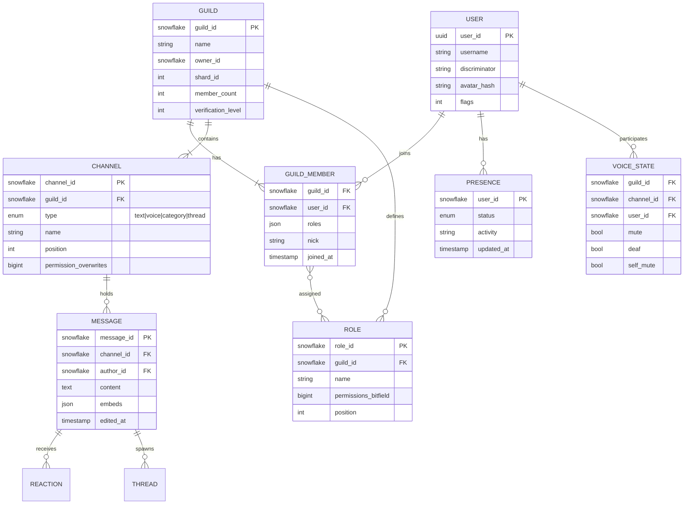

### 4.1 Snowflake IDs

Discord uses **snowflake IDs** (64-bit):

```text
| 42 bits timestamp | 5 bits worker ID | 5 bits process ID | 12 bits sequence |
```

- Time-sortable — great for message pagination (`before`, `after` cursors)
- Generated at application layer — no DB auto-increment hotspot

### 4.2 Entity Summary

| Entity | Partition Key | Notes |
|--------|---------------|-------|
| Guild | guild_id | Primary sharding unit |
| Channel | guild_id | Colocated with guild |
| Message | channel_id → guild_id | Huge tables, time-partitioned |
| Member | guild_id | Can be millions per guild |
| Presence | user_id + guild context | Ephemeral, Redis |
| Voice State | guild_id | Ephemeral, voice server |

---

## API / System Interface (~5 min)
### 5.1 API Surfaces

| Surface | Protocol | Purpose |
|---------|----------|---------|
| **REST API** | HTTPS | CRUD, admin, history fetch |
| **Gateway** | WebSocket | Real-time events (messages, presence) |
| **Voice Server** | WebRTC + UDP | Audio transport |
| **CDN** | HTTPS | Static assets, attachments |

### 5.2 REST Endpoints (Representative)

#### Guild & Channel Management

```http
POST /guilds
Body: { name, region, icon }
Response: { guild object }

GET /guilds/{guild_id}/channels
Response: { channels: [...] }

POST /guilds/{guild_id}/channels
Body: { name, type: 0|2, parent_id, permission_overwrites }
```

#### Messaging

```http
POST /channels/{channel_id}/messages
Body: { content, embeds, attachments, message_reference }
Headers: { Authorization, X-RateLimit-Bucket }
Response: { message object }

GET /channels/{channel_id}/messages?limit=50&before={message_id}
Response: { messages: [...] }  # newest first

PATCH /channels/{channel_id}/messages/{message_id}
Body: { content }

DELETE /channels/{channel_id}/messages/{message_id}
```

#### Members & Roles

```http
GET /guilds/{guild_id}/members?limit=1000&after={user_id}
PUT /guilds/{guild_id}/members/{user_id}/roles/{role_id}
GET /guilds/{guild_id}/roles
```

### 5.3 Gateway WebSocket Protocol

Client connects once; receives **dispatched events** for all subscribed guilds/channels.

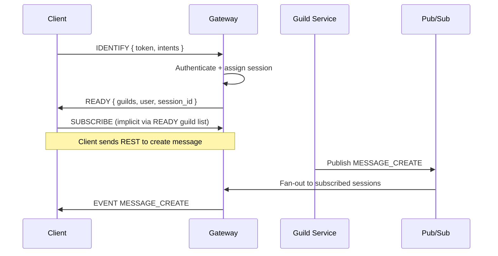

#### Gateway Opcodes (Simplified)

| Opcode | Name | Direction |
|--------|------|-----------|
| 0 | DISPATCH | Server → Client (events) |
| 1 | HEARTBEAT | Client → Server |
| 7 | RECONNECT | Server → Client |
| 9 | INVALID_SESSION | Server → Client |
| 10 | HELLO | Server → Client (heartbeat interval) |
| 11 | HEARTBEAT_ACK | Server → Client |

#### Event Types (Key)

| Event | Trigger |
|-------|---------|
| `MESSAGE_CREATE` | New message |
| `MESSAGE_UPDATE` | Edit |
| `MESSAGE_DELETE` | Delete |
| `PRESENCE_UPDATE` | Status change |
| `VOICE_STATE_UPDATE` | Join/leave/mute |
| `TYPING_START` | Typing indicator |
| `GUILD_MEMBER_ADD` | New member |
| `THREAD_CREATE` | Thread spawned |

### 5.4 Gateway Intents (Scoping Subscriptions)

Clients declare **intents** bitfield to reduce unnecessary fan-out:

| Intent | Data |
|--------|------|
| `GUILDS` | Guild create/update/delete |
| `GUILD_MESSAGES` | Message events |
| `GUILD_PRESENCES` | Presence (privileged) |
| `GUILD_VOICE_STATES` | Voice join/leave |
| `DIRECT_MESSAGES` | DM events |

Bots without privileged intents receive limited presence — reduces gateway load.

### 5.5 Voice Connection Flow

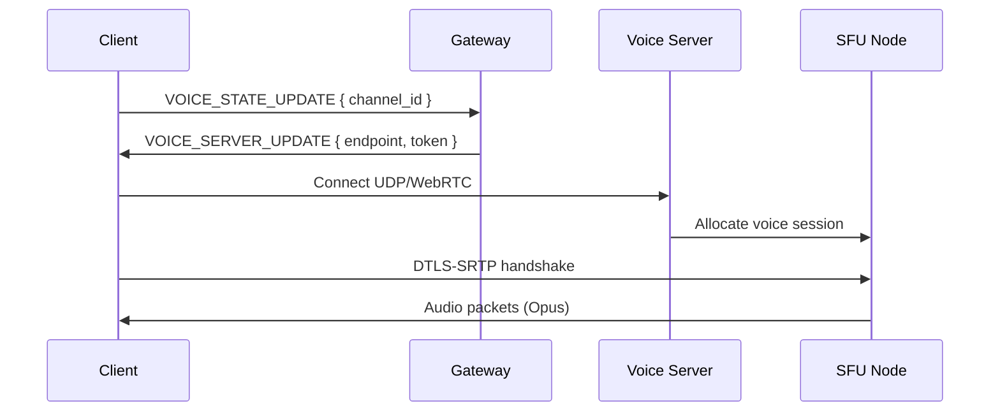

Voice signaling separate from message Gateway after initial state update.

---

## Data Model / Schema
### 6.1 Guild Shard Mapping

```sql
CREATE TABLE guild_shard_map (
    guild_id    BIGINT PRIMARY KEY,
    shard_id    INT NOT NULL,
    region      VARCHAR(16) NOT NULL,
    created_at  TIMESTAMP NOT NULL
);

-- shard_id = (guild_id >> 22) % NUM_SHARDS  (simplified)
```

### 6.2 Messages (Partitioned)

```sql
CREATE TABLE messages (
    message_id    BIGINT PRIMARY KEY,
    channel_id    BIGINT NOT NULL,
    guild_id      BIGINT NOT NULL,
    author_id     BIGINT NOT NULL,
    content       TEXT,
    embeds        JSONB,
    attachments   JSONB,
    flags         INT DEFAULT 0,
    created_at    TIMESTAMP NOT NULL,
    edited_at     TIMESTAMP,

    INDEX idx_channel_created (channel_id, message_id DESC)
) PARTITION BY HASH (guild_id);

-- Sub-partition by time for archival
-- messages_2026_07 PARTITION OF messages ...
```

**Pagination:** `message_id` snowflakes are time-ordered; `before={id}` uses index scan.

### 6.3 Guild Members (Wide Table Challenge)

```sql
CREATE TABLE guild_members (
    guild_id    BIGINT NOT NULL,
    user_id     BIGINT NOT NULL,
    roles       BIGINT[] NOT NULL,
    nick        VARCHAR(32),
    joined_at   TIMESTAMP NOT NULL,

    PRIMARY KEY (guild_id, user_id)
) PARTITION BY HASH (guild_id);
```

For 1M member guilds: lazy load — never send full member list on READY; use `GUILD_MEMBERS_CHUNK` events.

### 6.4 Permissions Model

Permissions as **64-bit bitfield**:

```text
VIEW_CHANNEL       = 1 << 10
SEND_MESSAGES      = 1 << 11
MANAGE_MESSAGES    = 1 << 13
CONNECT            = 1 << 20  (voice)
SPEAK              = 1 << 21
ADMINISTRATOR      = 1 << 3   (implies all)
```

Effective permission:

```text
base = @everyone role permissions
for each overwrite targeting user/role:
    apply deny, then allow
if ADMINISTRATOR → all bits set
```

Cached in Redis: `perm:{guild_id}:{channel_id}:{user_id}` → TTL 60 s.

### 6.5 Presence Store (Ephemeral)

```redis
HSET presence:{user_id} status "online" activity "Playing Valorant" ts 1720430000
EXPIRE presence:{user_id} 300

PUBLISH guild:{guild_id}:presence { user_id, status, ... }
```

### 6.6 Voice State (Ephemeral)

```redis
HSET voice:{guild_id}:{channel_id} {user_id} { session_id, mute, deaf, ... }
```

---

## Data Flow (~5 min)

Walk the **happy path** end-to-end before drawing boxes. Use sequence diagrams in [High-Level Design](#high-level-design-1015-min) on the whiteboard.

1. Client / producer initiates the primary action
2. API validates auth and schema
3. Core service persists state and enqueues async work
4. Workers / cache / CDN serve scale paths
5. Webhooks or polls confirm completion

---

## High-Level Design (~10–15 min)
### 7.1 Macro Architecture

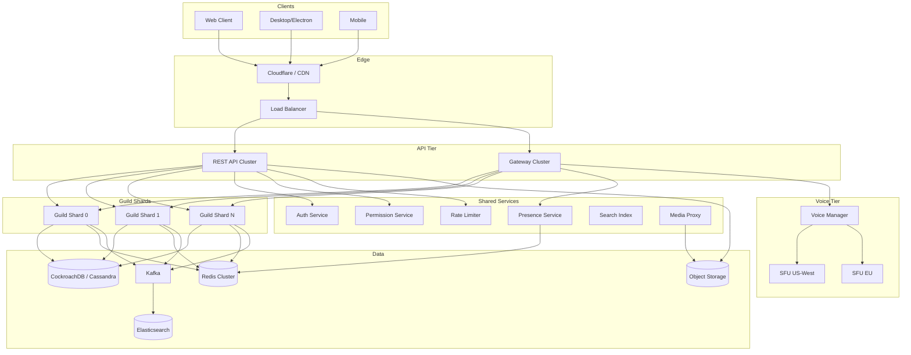

### 7.2 Guild Sharding Model

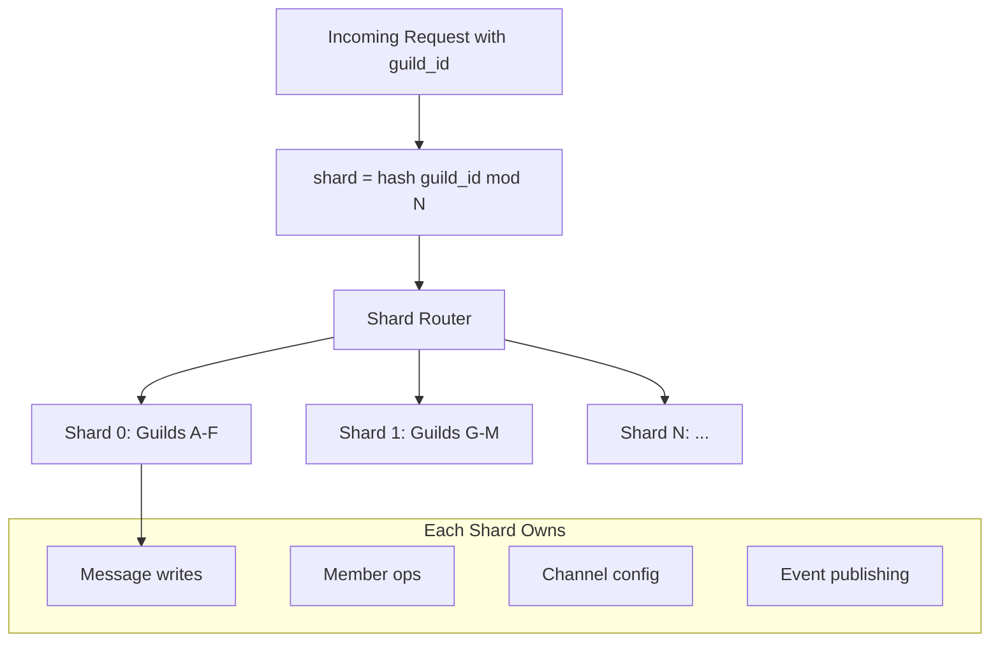

**Key insight:** Entire guild lifecycle (messages, members, channels) routes to **one logical shard** — avoids distributed transactions.

### 7.3 Gateway Architecture

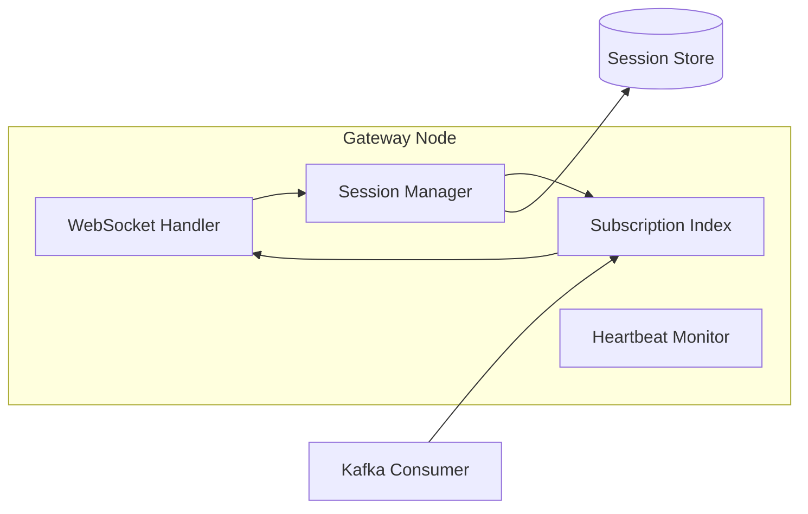

**Subscription index:** In-memory map `{ guild_id → [session_ids] }` on each gateway node.

When Kafka event arrives for `guild_id`, only gateways with subscribed sessions process it.

### 7.4 Message Write Path

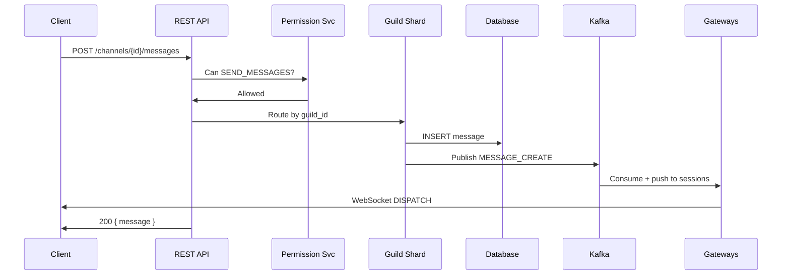

### 7.5 Presence System

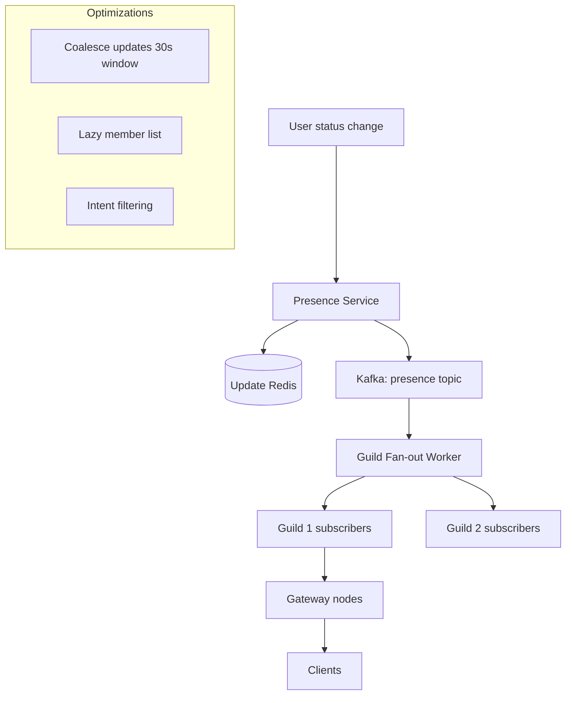

### 7.6 Voice Room Architecture

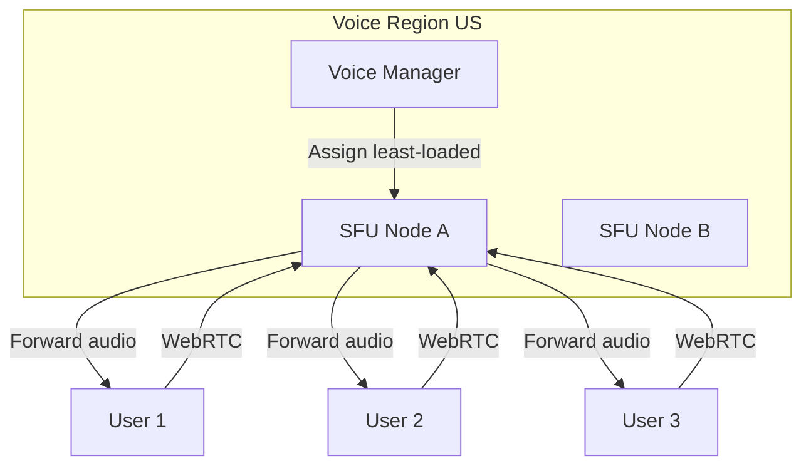

Discord uses **Selective Forwarding Unit (SFU)** — server forwards audio packets without transcoding (unlike MCU).

### 7.7 Cross-Shard DMs

DMs are **not guild-scoped** — separate service:

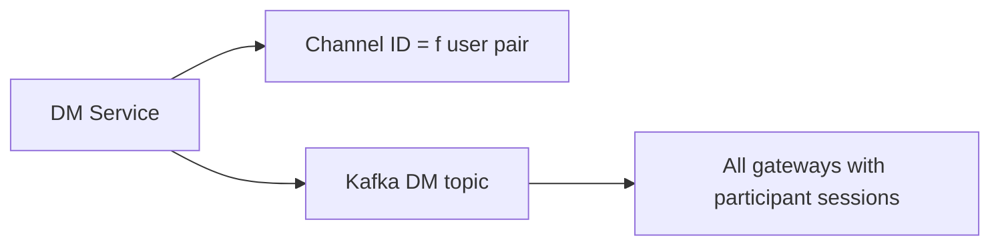

Group DMs (≤10 users): small fan-out, not sharded by guild.

---

## Deep Dives (~10 min)
### 8.1 Guild Sharding Deep Dive

#### Why Shard by Guild?

| Alternative | Problem |
|-------------|---------|
| Shard by user | Guild events touch all members — cross-shard joins |
| Shard by channel | Too granular; guild ops span channels |
| Shard by geography | Guild is global; members worldwide |

**Guild sharding** colocates all guild data → single-shard transactions, localized hot spots.

#### Shard Count Formula

```text
Discord public: num_shards = ceil(total_guilds / 1000) — simplified interview model

Production: dynamic resharding when shard exceeds:
  - 1M messages/min throughput
  - Storage threshold
  - CPU on guild worker
```

#### Resharding

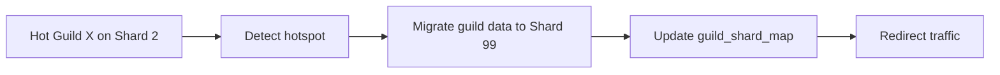

Live migration: dual-write period, Kafka consumer group rebalance, gateway resubscribe.

### 8.2 Real-Time Messaging at Scale

#### Hot Channel Problem

Official game server during launch: 100K members, 10K msg/s in `#general`.

**Strategies:**

1. **Rate limiting:** 5 msg/5s per user in hot channels
2. **Slowmode:** Configurable delay between messages
3. **Read fan-out optimization:** Kafka partition per hot channel
4. **Message batching to Gateway:** Coalesce 50 ms window of events
5. **Dedicated hot channel workers**

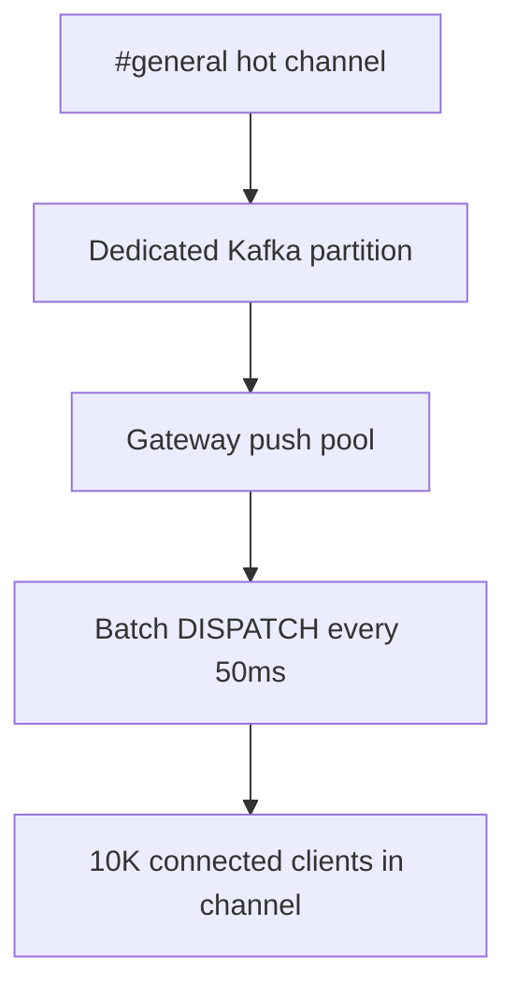

#### Message Ordering

Snowflake IDs provide **rough time order**; not strict linearizability across concurrent writers.

Acceptable for chat: two messages sent simultaneously may appear either order, but each client sees consistent order via sorted `message_id`.

#### Edits and Deletes

Updates publish `MESSAGE_UPDATE` / `MESSAGE_DELETE` events — same fan-out path as creates. Idempotent handling on client (`message_id` key).

### 8.3 Presence at Scale

#### Naive Approach (Don't Do This)

Broadcast every presence change to all guild members → O(members × events).

#### Discord's Layered Approach

1. **Presence stored globally per user** (one record)
2. **On change:** publish to each guild user is in — but...
3. **Clients only receive presence for members they "care about"** (cached subset)
4. **Large guilds:** disable full presence; show only online count
5. **Privileged intent gating** for bots

```text
Large guild threshold (e.g., > 75K members):
  - Replace member list with lazy loading
  - Presence: only friends + mentioned users + voice channel co-members
  - Reduce READY payload from MB to KB
```

#### Presence Update Coalescing

```python
# Pseudocode: debounce presence writes
pending = {}
def on_presence_change(user_id, status):
    pending[user_id] = status
    schedule_flush(in=5_seconds)

def flush():
    for user_id, status in pending.items():
        publish_to_guilds(user_id, status)
    pending.clear()
```

### 8.4 Voice Rooms Deep Dive

#### SFU vs MCU vs P2P

| Model | CPU | Latency | Scale | Discord uses |
|-------|-----|---------|-------|--------------|
| **P2P mesh** | Low server | Low | ≤4 users | No |
| **MCU (mixing)** | Very high | Higher | Many | No |
| **SFU (forward)** | Medium | Low | Hundreds per room | **Yes** |

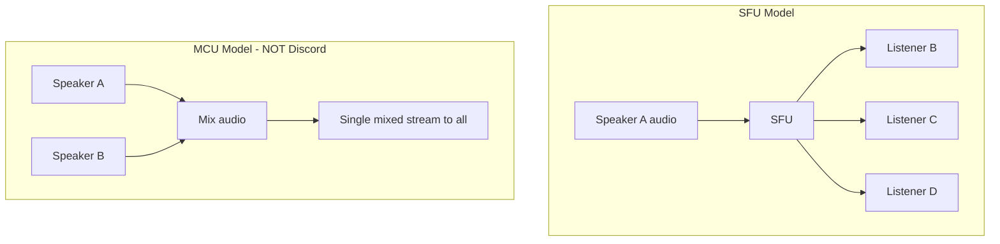

#### Voice Channel Lifecycle

1. User clicks voice channel → `VOICE_STATE_UPDATE` via Gateway
2. Voice Manager selects region-closest SFU with capacity
3. Client receives `VOICE_SERVER_UPDATE` with endpoint + token
4. WebRTC: ICE, DTLS-SRTP, Opus codec
5. SFU subscribes to each participant's upstream; forwards to others
6. User disconnects → `VOICE_STATE_UPDATE` channel_id=null

#### Voice Quality Adaptation

- **Bitrate scaling:** 8–128 kbps Opus based on packet loss
- **FEC (Forward Error Correction):** Opus in-band FEC
- **Jitter buffer:** Client-side 20–60 ms adaptive

#### Server Mute / Deafen

Server-side flags in voice state; SFU stops forwarding audio from muted users.

### 8.5 Permission System Performance

Every `POST /messages` requires permission check.

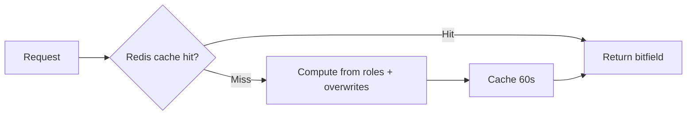

**Administrator bypass:** Single bit check.

**Channel overwrites:** Max ~100 overwrites per channel — compute in memory < 1 ms.

### 8.6 Threads

Thread = sub-channel spawned from message:

```text
thread_id snowflake linked to parent_message_id
Inherits parent channel permissions (with optional override)
Archived threads: read-only, hidden from active list
```

Kafka events include `thread_id` for routing; gateway subscriptions include thread channels when client is viewing.

### 8.7 Rate Limiting

```http
HTTP/1.1 429 Too Many Requests
X-RateLimit-Limit: 5
X-RateLimit-Remaining: 0
X-RateLimit-Reset: 1720430060
X-RateLimit-Bucket: abc123
Retry-After: 1.5
```

**Global rate limit:** 50 req/s per bot token  
**Per-route buckets:** Hash(route + major parameters)  
**Gateway:** 120 events/minute per session (identify limits)

Implementation: token bucket in Redis cluster.

---

## Trade-offs Summary
### 9.1 Guild Sharding vs User Sharding

| Guild sharding | User sharding |
|----------------|---------------|
| Simple guild ops | Better for DM-heavy |
| Hot guild isolated | Guild spans shards |
| **Discord choice** | Slack-like alternative |

### 9.2 REST Send + Gateway Receive vs Gateway-Only Send

Discord uses **REST for message create** (reliable, cacheable, rate-limited) + **Gateway for fan-out** (efficient push).

Alternative: send via WebSocket only — harder to rate limit and retry.

### 9.3 Strong vs Eventual Consistency for Presence

**Eventual** — stale presence for few seconds acceptable; prioritizes availability.

Messages: **strong per channel** once ACK'd from REST.

### 9.4 Full Member List vs Lazy Loading

| Full list | Lazy loading |
|-----------|--------------|
| Simple client | Complex pagination |
| FAILS at 1M members | **Required at scale** |
| Large READY payload | Fast startup |

### 9.5 Cassandra vs CockroachDB vs PostgreSQL

Discord historically moved toward **Cassandra/Scylla** for messages (write-heavy, partition key = channel/guild).

Interview answer: partitioned SQL (CockroachDB) or wide-column store; optimize for write throughput + time-range reads.

### 9.6 Voice: Regional SFU vs Global

**Regional** — lower latency, harder cross-region voice (rare — pick one region per guild voice).

### 9.7 Kafka vs Redis Pub/Sub for Events

| Kafka | Redis Pub/Sub |
|-------|---------------|
| Durable, replay | Ephemeral, fast |
| Consumer groups | Simple broadcast |
| **Discord-scale choice** | Good for presence only |

---

## Failure Modes & Resilience
### 10.1 Gateway Outage

| Impact | Mitigation |
|--------|------------|
| Clients disconnected | Auto-reconnect with exponential backoff |
| Missed events | Resume with `seq` counter + gap fill (`GET /gateway/bot` session resume) |

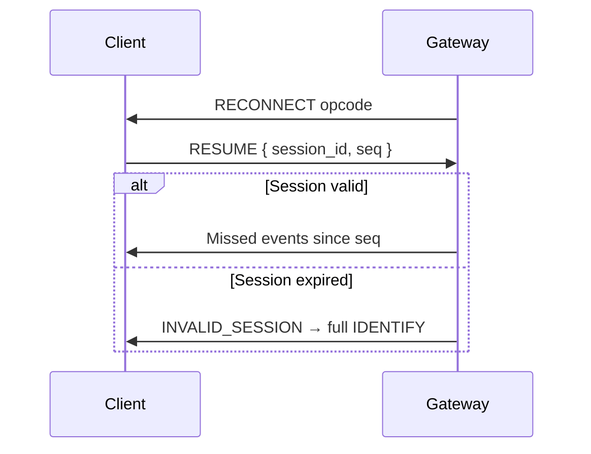

### 10.2 Guild Shard Failure

- Health checks + automatic failover to standby
- Kafka consumers rebalance
- In-flight REST → 503 retry to healthy replica
- RPO: 0 with sync replication within shard; RTO: < 30 s

### 10.3 Hot Guild Meltdown

Symptoms: Single guild saturates shard Kafka partition.

**Mitigations:**
- Emergency slowmode
- Migrate guild to dedicated shard
- Shed load: disable non-critical events (typing, presence)

### 10.4 Voice SFU Node Crash

- Users auto-reconnect to new SFU via Voice Manager
- `< 2 s` audio gap acceptable
- State reconstructed from Gateway voice states

### 10.5 Permission Cache Poisoning

Stale cache grants unauthorized access.

**Mitigation:** Invalidate cache on role/overwrite change; TTL max 60 s; version stamp on guild permission epoch.

### 10.6 Kafka Lag

Gateway delivery delayed seconds behind REST response.

- Client already has message from REST 200 — WebSocket is for **others**
- Monitor consumer lag per partition; auto-scale consumers

### 10.7 Split Brain on Voice

Two users think they're in channel but on different SFUs.

**Mitigation:** Voice Manager is source of truth; token binds user to specific SFU; periodic reconciliation with Gateway state.

### 10.8 Message Loss

Unacceptable for persisted chat.

- DB write before Kafka publish (outbox pattern)
- At-least-once Kafka → idempotent event processing on Gateway

```text
Outbox pattern:
  BEGIN TX
    INSERT message
    INSERT outbox_event
  COMMIT
  Worker polls outbox → publishes to Kafka → marks sent
```

---

## Interview Walkthrough Script

### Minutes 0–5: Requirements

> Clarify functional scope, non-functional targets (latency, scale, consistency), and what's explicitly out of scope.

### Minutes 5–7: Core Entities + API

> Name the 4–6 core entities and primary API endpoints. Keep contracts concise.

### Minutes 7–12: Data Flow + Architecture

> Draw the happy-path sequence, then boxes-and-arrows architecture. Call out sync vs async boundaries.

### Minutes 12–22: High-Level Design

> Expand each box: technology choices, sharding keys, cache placement.

### Minutes 22–35: Deep Dives

> Spend time on the 2–3 hardest problems specific to Design Discord — the differentiators.

### Minutes 35–45: Capacity + Wrap-Up

> Back-of-envelope QPS/storage, failure modes, trade-offs, and monitoring.

---

## Follow-Up Questions

1. **How would you handle a 10× traffic spike?** — Auto-scale workers, queue buffering, degrade non-critical features.
2. **Multi-region deployment?** — Data residency, replication lag, conflict resolution.
3. **How do you test this at scale?** — Load tests, chaos engineering, shadow traffic.
4. **Security concerns?** — AuthZ, encryption in transit/at rest, audit logging.
5. **Cost optimization?** — Tiered storage, cache hit ratio, right-sizing clusters.

---

## Real-World References

| System | Notable Design |
|--------|----------------|
| Industry blogs | High Scalability, engineering blogs from Meta/Google/Netflix |
| Papers | Original papers cited in deep-dive sections |
| Open source | Relevant Apache/Kafka/Redis/Envoy documentation |

See deep-dive sections and the original guide content for system-specific references to Design Discord.

---

## Interview Cheat Sheet
### 11.1 45-Minute Timeline

| Minutes | Section |
|---------|---------|
| 0–5 | Scope + requirements |
| 5–10 | Capacity + sharding rationale |
| 10–15 | Entities + snowflakes |
| 15–25 | Architecture: REST + Gateway + Guild shards |
| 25–35 | Deep dive: presence + voice SFU + hot channels |
| 35–42 | Trade-offs + failures |
| 42–45 | Wrap-up |

### 11.2 Must-Mention Concepts

- **Guild as partition key / shard unit**
- **Snowflake IDs** for time-ordered messages
- **Gateway WebSocket** for push; REST for writes
- **Kafka** for event bus between services and gateways
- **SFU for voice** (not MCU, not mesh)
- **Permission bitfields** with Redis cache
- **Lazy member loading** for large guilds
- **Presence coalescing** and intent scoping
- **Rate limiting** per route bucket

### 11.3 Common Follow-Up Questions

| Question | Answer Sketch |
|----------|---------------|
| Why not shard by user? | Guild ops need colocation; cross-shard joins expensive |
| How handle 1M member guild? | Lazy members, limited presence, chunked loading |
| Message ordering guarantees? | Snowflake time order; concurrent sends may reorder slightly |
| How does voice scale? | Regional SFU fleet; Opus; adaptive bitrate |
| Gateway vs REST for sending? | REST for reliability + rate limits; GW for fan-out |
| How prevent spam? | Rate limits, slowmode, permission gates, automod hooks |
| DM architecture? | Separate service; channel ID from user pair hash |

### 11.4 Diagrams to Draw

1. Client → REST (write) + Gateway (read events)
2. Guild shard router
3. Kafka fan-out to gateway subscription index
4. SFU voice topology
5. Presence coalescing pipeline

### 11.5 Red Flags to Avoid

- No sharding strategy for guilds
- Broadcasting presence to entire 1M member list
- P2P mesh for voice rooms with 25+ users
- Storing messages without partition key
- Single Gateway node for all users
- Ignoring permission checks on hot path
- Full member list in READY payload

### 11.6 Sample Opening Statement

> "Discord is a guild-centric real-time platform — the guild ID is our primary partition key. I'll design REST for reliable writes and a WebSocket Gateway for event fan-out, with guild-level sharding backed by Kafka. Voice uses regional SFU nodes separate from the messaging path. Let me clarify requirements and estimate scale."

### 11.7 Discord vs Slack vs WhatsApp (Quick Compare)

| Aspect | Discord | Slack | WhatsApp |
|--------|---------|-------|----------|
| Unit | Guild | Workspace | Conversation |
| Encryption | Transport (TLS) | Transport | E2E Signal |
| Voice | Always-on channels | Huddles | Calls |
| Scale model | Guild sharding | Enterprise grid | Session sharding |
| Client push | Gateway WS | Slack RTM/WS | Custom WS |

---

## Appendix A: Snowflake Generation (Pseudocode)

```python
import time

EPOCH = 1420070400000  # Discord epoch ms
worker_id = 1
process_id = 1
sequence = 0
last_timestamp = -1

def next_id():
    global sequence, last_timestamp
    now = int(time.time() * 1000)
    if now == last_timestamp:
        sequence = (sequence + 1) & 0xFFF
        if sequence == 0:
            while now <= last_timestamp:
                now = int(time.time() * 1000)
    else:
        sequence = 0
    last_timestamp = now
    return ((now - EPOCH) << 22) | (worker_id << 17) | (process_id << 12) | sequence
```

## Appendix B: Permission Bitfield Reference (Subset)

| Permission | Bit | Value |
|------------|-----|-------|
| CREATE_INSTANT_INVITE | 0 | 1 |
| ADMINISTRATOR | 3 | 8 |
| VIEW_CHANNEL | 10 | 1024 |
| SEND_MESSAGES | 11 | 2048 |
| MANAGE_MESSAGES | 13 | 8192 |
| EMBED_LINKS | 14 | 16384 |
| CONNECT | 20 | 1048576 |
| SPEAK | 21 | 2097152 |
| MUTE_MEMBERS | 22 | 4194304 |
| DEAFEN_MEMBERS | 23 | 8388608 |
| MOVE_MEMBERS | 24 | 16777216 |

## Appendix C: Monitoring & SLOs

| Metric | Target |
|--------|--------|
| Gateway connection success | 99.9% |
| Message create p99 | < 100 ms |
| Event delivery p99 (GW) | < 200 ms |
| Voice packet loss | < 1% |
| Kafka consumer lag | < 500 ms |
| Permission cache hit rate | > 95% |

## Appendix D: Event Payload Example

```json
{
  "t": "MESSAGE_CREATE",
  "s": 42,
  "op": 0,
  "d": {
    "id": "1234567890123456789",
    "channel_id": "9876543210987654321",
    "guild_id": "1111111111111111111",
    "author": { "id": "...", "username": "player1" },
    "content": "gg wp",
    "timestamp": "2026-07-08T12:00:00.000Z"
  }
}
```

---

*Last updated: 2026-07-08*
