# System Design: Zoom

> **Interview level:** Big Tech (L5–L7)  
> **Category:** Messaging & Real-Time / Video Conferencing  
> **Framework:** Hello Interview delivery structure  
> **Estimated interview time:** 45–60 minutes

---

## Table of Contents

1. [Problem Statement & Scope](#1-problem-statement--scope)
2. [Requirements](#2-requirements)
3. [Capacity Estimation](#3-capacity-estimation)
4. [Core Entities](#4-core-entities)
5. [API Design](#5-api-design)
6. [Data Model](#6-data-model)
7. [High-Level Architecture](#7-high-level-architecture)
8. [Deep Dives](#8-deep-dives)
9. [Trade-offs](#9-trade-offs)
10. [Failure Modes](#10-failure-modes)
11. [Interview Cheat Sheet](#11-interview-cheat-sheet)

---

## 1. Problem Statement & Scope

### 1.1 The Prompt

> "Design a video conferencing platform like Zoom that supports multi-party video/audio calls, screen sharing, breakout rooms, cloud recording, and meetings with 1000+ participants."

### 1.2 What Zoom Actually Is (Context)

Zoom is an **enterprise-grade real-time video communications platform** featuring:

- **Meetings:** Scheduled or instant; host controls; waiting room
- **Webinar mode:** Few presenters, many view-only attendees (10K+)
- **SFU-based media routing** at massive scale (not peer-to-peer mesh)
- **Simulcast + adaptive bitrate** for heterogeneous clients
- **Screen share** as separate video track (high resolution)
- **Breakout rooms** — sub-meetings spawned from parent
- **Cloud recording** — composited or per-stream archive to object storage
- **1000+ participant meetings** via webinar architecture + selective subscription

Unlike Discord voice (always-on casual rooms), Zoom optimizes for **scheduled meetings**, **video quality**, **corporate reliability**, and **massive broadcast-style sessions**.

### 1.3 In Scope

| Feature | Details |
|---------|---------|
| Create/join meetings | Meeting ID, password, waiting room |
| Multi-party video/audio | Up to 1000 in meeting mode; 10K+ webinar |
| Screen sharing | Full screen, window, with audio |
| Host controls | Mute all, remove, lock meeting |
| Breakout rooms | Create, assign, timer, recall |
| Chat | In-meeting text (sidebar) |
| Reactions / raise hand | Signaling-only |
| Cloud recording | Host-initiated; MP4 + audio |
| Virtual backgrounds | Client-side ML (mention) |
| Active speaker detection | Server or client heuristic |
| Gallery vs speaker view | Client layout; SFU sends relevant streams |

### 1.4 Out of Scope (State Explicitly)

- Zoom Phone / SMS / Contact Center
- Zoom Rooms hardware integration
- Full calendar/scheduling (Outlook/Google sync — mention API)
- End-to-end encryption for all meetings (E2E is optional mode)
- Live streaming to YouTube/Facebook (RTMP egress — brief mention)
- AI transcription / summary (post-meeting pipeline)
- Billing / licensing tiers
- Whiteboard collaboration product

### 1.5 Clarifying Questions to Ask the Interviewer

```text
1. Max participants? (100, 1000, or 10,000 webinar?)
2. Is cloud recording required?
3. Breakout rooms required?
4. Latency target? (150 ms mouth-to-ear ideal)
5. Geographic distribution?
6. Client platforms? (Web WebRTC, native desktop/mobile)
7. Screen share priority over camera?
8. Must support dial-in PSTN?
9. Meeting duration limits?
10. E2E encryption required?
```

---

## 2. Requirements

### 2.1 Functional Requirements

| ID | Requirement | Priority |
|----|-------------|----------|
| FR-1 | Schedule/create instant meetings | P0 |
| FR-2 | Join via link, ID, or calendar | P0 |
| FR-3 | Multi-party audio/video | P0 |
| FR-4 | Screen share (video + optional audio) | P0 |
| FR-5 | Mute/unmute; video on/off | P0 |
| FR-6 | Host privileges (mute all, kick, lock) | P0 |
| FR-7 | Waiting room / lobby | P1 |
| FR-8 | In-meeting chat | P1 |
| FR-9 | Breakout rooms | P1 |
| FR-10 | Cloud recording | P1 |
| FR-11 | Raise hand, reactions | P2 |
| FR-12 | Active speaker / gallery view | P1 |
| FR-13 | Participant list | P0 |
| FR-14 | Co-host assignment | P1 |
| FR-15 | 1000+ participants (webinar mode) | P1 |

### 2.2 Non-Functional Requirements

| ID | Requirement | Target |
|----|-------------|--------|
| NFR-1 | Mouth-to-ear latency | < 150 ms (p95) |
| NFR-2 | Video startup time | < 3 s to first frame |
| NFR-3 | Availability | 99.99% during business hours |
| NFR-4 | Concurrent meetings | 500K globally |
| NFR-5 | Peak participants | 5M simultaneous |
| NFR-6 | Max meeting size | 1000 interactive; 10K view-only |
| NFR-7 | Recording start latency | < 5 s |
| NFR-8 | Packet loss tolerance | Usable at 5% loss (FEC + ABR) |
| NFR-9 | Bandwidth adaptation | 150 kbps – 3 Mbps per video |
| NFR-10 | Security | TLS + SRTP; optional E2E |

### 2.3 Video-Specific Constraints

1. **Media dominates bandwidth** — 1000 × 1 Mbps = 1 Gbps ingress to SFU cluster per meeting (mitigated by simulcast + selective subscription)
2. **CPU on SFU** — forwarding is cheaper than MCU transcoding, but still scales with stream count
3. **WebRTC is the standard** for browser; native apps use optimized SDKs
4. **NAT traversal** — STUN/TURN required for ~15–20% of clients
5. **Screen share is high resolution** — separate simulcast layer (1080p @ 15fps)

---

## 3. Capacity Estimation

### 3.1 Assumptions

| Metric | Value |
|--------|-------|
| Registered users | 300M |
| Daily meeting participants | 300M (participant-minutes basis) |
| Peak concurrent participants | 5M |
| Peak concurrent meetings | 500K |
| Avg meeting size | 10 participants |
| Large meetings (500+) | 0.1% of meetings |
| 1000-person meetings | 50 concurrent at peak |
| Screen share rate | 20% of meetings active at any moment |
| Recording rate | 10% of meetings |
| Avg video bitrate (active speaker HD) | 1.5 Mbps |
| Avg video bitrate (thumbnail) | 150 kbps |
| Audio bitrate | 48 kbps (Opus) |

### 3.2 Bandwidth Per Meeting (Interactive 100 participants)

**Naive (everyone receives everyone):** O(N²) — impossible.

**SFU with selective subscription (Zoom model):**

```text
Each participant publishes:
  1 audio stream (48 kbps)
  1 camera video simulcast (low 150k + mid 500k + high 1.5M bps)
  Optional: 1 screen share (2 Mbps)

Each participant subscribes:
  Active speaker HD: 1.5 Mbps
  Gallery thumbnails (49 others): 49 × 150 kbps ≈ 7.4 Mbps
  Audio from all: 100 × 48 kbps ≈ 4.8 Mbps

Per participant downstream ≈ 9 Mbps (worst case gallery)
SFU upstream from each client ≈ 2 Mbps average

SFU meeting aggregate ≈ 100 × 2 Mbps ingress + forwarding overhead
  ≈ 200 Mbps ingress + 900 Mbps egress fan-out (SFU internal)
```

**Optimizations reduce this 5–10×:** max 49 video tiles, speaker view only sends 1 HD + N low, simulcast layer selection.

### 3.3 1000+ Participant Meeting

Webinar architecture:

```text
10 presenters publish video
990 attendees view-only (recv-only WebRTC or HLS fallback)
Attendees receive: 1–3 video streams (active speakers) + composited layout
Egress to attendees: 990 × 500 kbps ≈ 495 Mbps (managed via CDN edge for HLS)

Interactive 1000 (rare): Zoom uses optimized SFU mesh + no full gallery
  → Subscribe only to active speaker + 5 recent speakers
  → Downstream per user capped ~3 Mbps
```

### 3.4 SFU Fleet Sizing

```text
Peak 5M participants
Avg 10 per meeting → 500K meetings (but uneven distribution)

SFU capacity: ~500 participants per SFU node (media forwarding)
Nodes needed: 5M / 500 = 10,000 SFU instances peak

With regional distribution (5 regions):
  2,000 SFU nodes per region

CPU: ~30–50% per 200 participants (depends on simulcast layers)
```

### 3.5 TURN Relay

```text
15% of 5M participants need TURN relay ≈ 750K relayed streams
TURN bandwidth ≈ 750K × 2 Mbps × 2 (in+out) ≈ 3 Tbps TURN fleet
Dedicated TURN clusters per region; prefer UDP
```

### 3.6 Recording Storage

```text
10% of 500K peak meetings recorded = 50K concurrent recordings
Avg recording bitrate (composited 720p) = 2 Mbps
Duration avg 45 min

Per recording size = 2 Mbps × 45 × 60 / 8 ≈ 675 MB
Daily recordings (assume 2M/day) = 2M × 675 MB ≈ 1.35 PB/day
With lifecycle to cold storage (Glacier) after 30 days
```

### 3.7 Signaling QPS

```text
Join rate peak: 5M participants / 3600 s (assume 1 hr churn window) ≈ 1,400 joins/s
Signaling is lightweight vs media — 10K QPS cluster sufficient
```

---

## 4. Core Entities

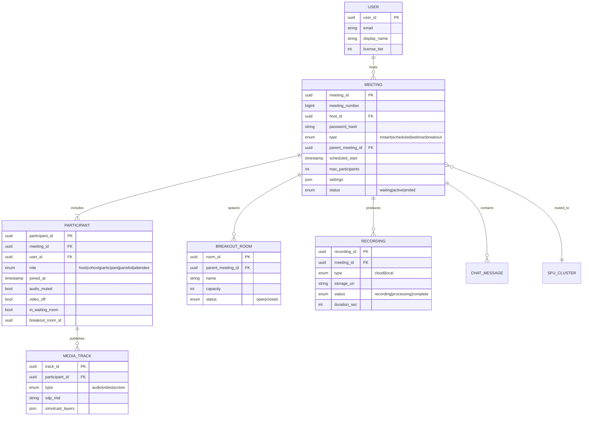

### 4.1 Entity Notes

| Entity | Description |
|--------|-------------|
| **Meeting** | Session container; has unique numeric ID for dial-in |
| **Participant** | User instance in a meeting; role determines permissions |
| **Media Track** | Audio, camera, or screen — each maps to WebRTC SSRC |
| **Breakout Room** | Child meeting linked to parent; participants reassigned |
| **Recording** | Metadata + pointer to S3 object |
| **SFU Cluster** | Ephemeral assignment; not persisted long-term |

---

## 5. API Design

### 5.1 API Layers

| Layer | Protocol | Purpose |
|-------|----------|---------|
| **REST API** | HTTPS | Meeting CRUD, user management |
| **Signaling** | WebSocket / WSS | SDP exchange, ICE, session control |
| **Media** | WebRTC (SRTP/DTLS) | Audio/video transport |
| **TURN** | UDP/TCP | NAT traversal relay |

### 5.2 REST Endpoints

#### Meeting Management

```http
POST /v2/meetings
Body: {
  topic, type: 2, start_time, duration,
  settings: { host_video, participant_video, waiting_room, auto_recording }
}
Response: { id, join_url, start_url, password }

GET /v2/meetings/{meetingId}
DELETE /v2/meetings/{meetingId}
```

#### Join Token

```http
POST /v2/meetings/{meetingId}/jointoken
Body: { user_name, role: 0|1, password }
Response: { token, signature, sdk_key, meeting_number }
```

JWT-based join signatures prevent unauthorized joins.

### 5.3 Signaling Protocol (WebSocket)

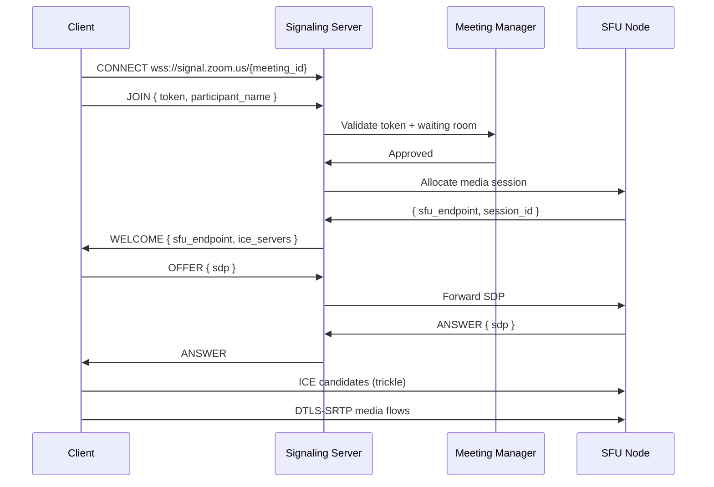

#### Signaling Message Types

| Type | Direction | Purpose |
|------|-----------|---------|
| `JOIN` | C → S | Enter meeting |
| `WELCOME` | S → C | SFU assignment + ICE servers |
| `OFFER/ANSWER` | Bidirectional | SDP negotiation |
| `ICE_CANDIDATE` | Bidirectional | Trickle ICE |
| `MUTE` | S → C | Force mute |
| `PARTICIPANT_JOIN/LEAVE` | S → All | Roster updates |
| `ACTIVE_SPEAKER` | S → All | Speaker changed |
| `SCREEN_SHARE_START/STOP` | C → S | Track notification |
| `BREAKOUT_ASSIGN` | S → C | Move to breakout room |
| `RECORDING_START/STOP` | S → C | Recording state |
| `CHAT` | C → S → All | Text message |
| `LEAVE` | C → S | Disconnect |

### 5.4 Host Control APIs

```http
POST /v2/livemeetings/{meetingId}/events
Body: { method: "mute_all", params: { mute: true } }

PUT /v2/livemeetings/{meetingId}/participants/{id}
Body: { adhoc: { mute: true, remove: false } }
```

Real-time controls also sent via signaling for sub-100 ms latency.

### 5.5 Breakout Room APIs

```http
POST /v2/meetings/{meetingId}/breakout_rooms
Body: {
  rooms: [{ name: "Room 1" }, { name: "Room 2" }],
  assignment: "manual|automatic",
  duration_minutes: 15
}

POST /v2/meetings/{meetingId}/breakout_rooms/start
POST /v2/meetings/{meetingId}/breakout_rooms/stop
```

---

## 6. Data Model

### 6.1 Meetings Table

```sql
CREATE TABLE meetings (
    meeting_id        UUID PRIMARY KEY,
    meeting_number    BIGINT UNIQUE NOT NULL,
    host_id           UUID NOT NULL,
    topic             VARCHAR(256),
    meeting_type      SMALLINT NOT NULL,
    parent_meeting_id UUID REFERENCES meetings(meeting_id),
    password_hash     VARCHAR(128),
    scheduled_start   TIMESTAMP,
    duration_minutes  INT,
    max_participants  INT DEFAULT 100,
    settings          JSONB NOT NULL,
    status            SMALLINT NOT NULL,
    sfu_region        VARCHAR(16),
    created_at        TIMESTAMP NOT NULL DEFAULT NOW()
);

CREATE INDEX idx_meetings_host ON meetings(host_id);
CREATE INDEX idx_meetings_number ON meetings(meeting_number);
```

### 6.2 Participants (Ephemeral + Audit)

```sql
-- Hot state in Redis; cold audit in DB
CREATE TABLE participant_sessions (
    session_id        UUID PRIMARY KEY,
    meeting_id        UUID NOT NULL,
    user_id           UUID,
    display_name      VARCHAR(64),
    role              SMALLINT NOT NULL,
    joined_at         TIMESTAMP NOT NULL,
    left_at           TIMESTAMP,
    breakout_room_id  UUID,
    client_ip         INET,
    client_type       VARCHAR(32)
) PARTITION BY RANGE (joined_at);
```

### 6.3 Redis Live Meeting State

```redis
# Meeting roster
HSET meeting:{id}:participants {participant_id} {json_metadata}

# Active speaker
SET meeting:{id}:active_speaker {participant_id}

# SFU assignment
SET meeting:{id}:sfu {sfu_node_id, region, capacity}

# Waiting room queue
LPUSH meeting:{id}:waiting_room {participant_id}

# Breakout mapping
HSET meeting:{id}:breakouts {room_id} {name, status}
HSET breakout:{room_id}:participants {participant_id} 1

# Recording state
SET meeting:{id}:recording {recording_id, started_at, recorder_node}
```

### 6.4 Recordings

```sql
CREATE TABLE recordings (
    recording_id    UUID PRIMARY KEY,
    meeting_id      UUID NOT NULL,
    host_id         UUID NOT NULL,
    storage_bucket  VARCHAR(64),
    storage_key     VARCHAR(512),
    file_size_bytes BIGINT,
    duration_sec    INT,
    status          SMALLINT NOT NULL,
    started_at      TIMESTAMP,
    completed_at    TIMESTAMP
);
```

### 6.5 Chat Messages

```sql
CREATE TABLE meeting_chat (
    message_id      UUID PRIMARY KEY,
    meeting_id      UUID NOT NULL,
    sender_id       UUID NOT NULL,
    content         TEXT NOT NULL,
    recipient_type  SMALLINT DEFAULT 0,  -- 0=all, 1=host, 2=private
    created_at      TIMESTAMP NOT NULL
) PARTITION BY HASH (meeting_id);
```

---

## 7. High-Level Architecture

### 7.1 System Overview

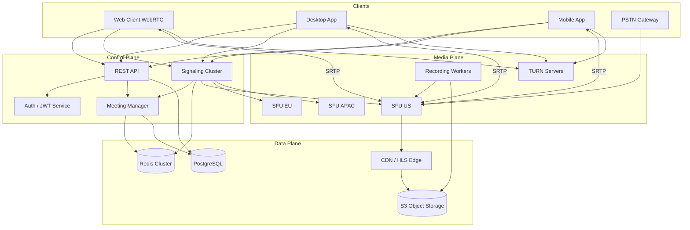

### 7.2 Control Plane vs Media Plane Separation

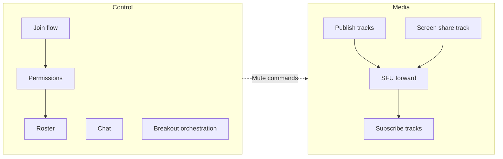

**Critical design:** Signaling and media are decoupled — signaling scales on CPU-light WebSockets; media scales on bandwidth-heavy SFU nodes.

### 7.3 Meeting Join Flow

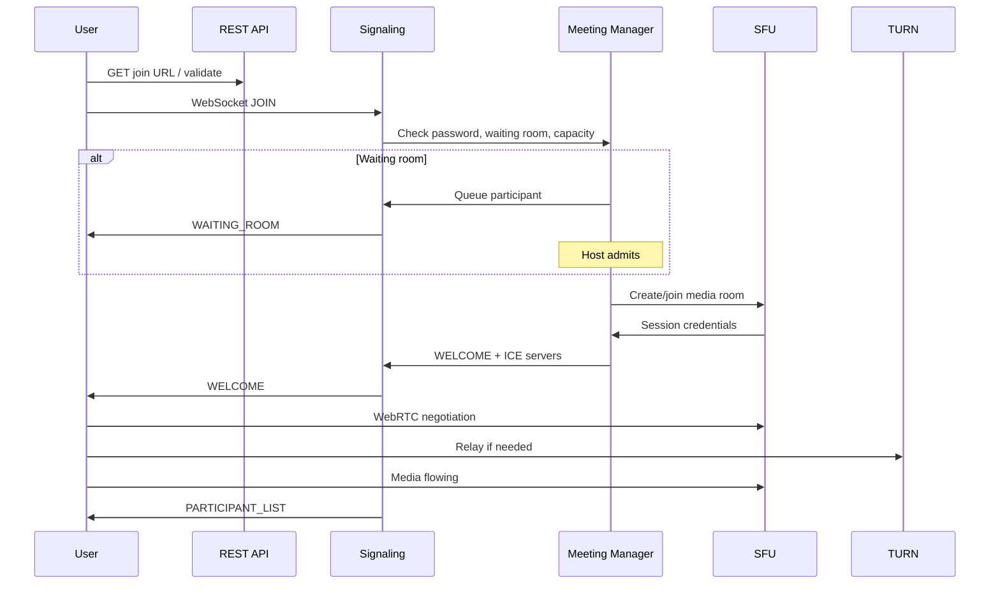

### 7.4 SFU Media Topology

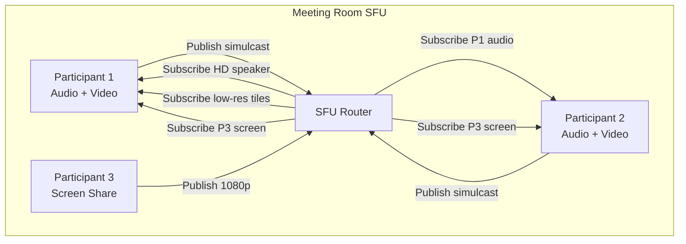

### 7.5 Simulcast Architecture

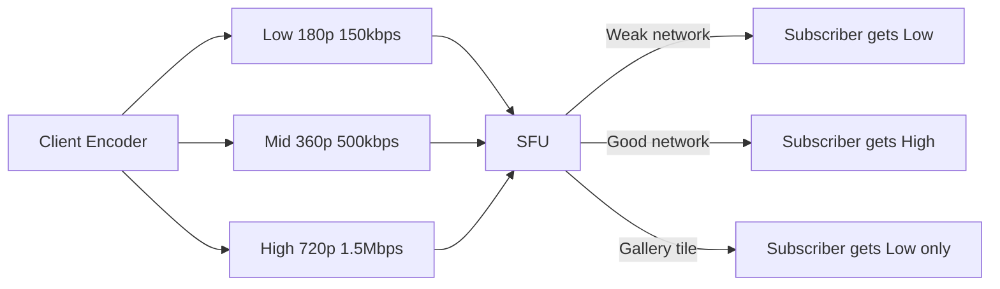

Each publisher sends **3 temporal layers**; SFU selects per-subscriber without transcoding.

### 7.6 1000+ Participant Architecture

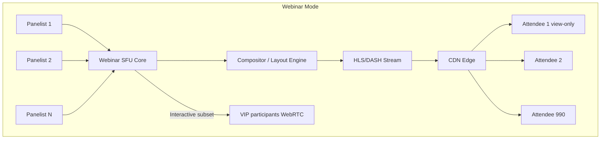

**Two tiers:**
1. **Panelists/presenters:** Full WebRTC publish to SFU (≤100)
2. **Attendees:** Receive CDN-delivered HLS or single composite WebRTC stream

For **1000 interactive** (all can unmute): capped subscriptions — only 1 HD + audio-dominated; video off by default above 500.

### 7.7 Regional SFU Selection

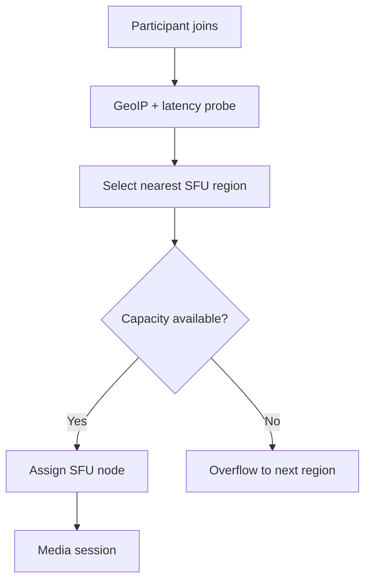

Meeting **home region** = host's region at creation; all participants route to same SFU cluster (cross-region adds latency — acceptable up to ~200 ms).

### 7.8 Recording Pipeline

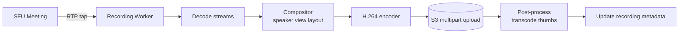

Alternative: **Individual stream recording** (no compositing) — cheaper, host selects active speaker in post.

---

## 8. Deep Dives

### 8.1 SFU vs MCU vs Mesh

| Architecture | How it works | CPU | Latency | Max scale |
|--------------|--------------|-----|---------|-----------|
| **Mesh (P2P)** | Each peer connects to all | Low server | Low | ~4 users |
| **MCU** | Server mixes all streams into one | Very high | Higher | 50+ but expensive |
| **SFU** | Server forwards selected streams | Medium | Low | **1000+** |

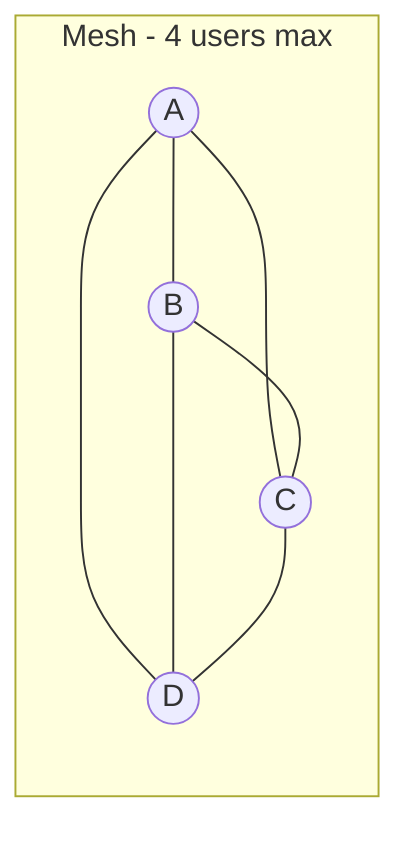

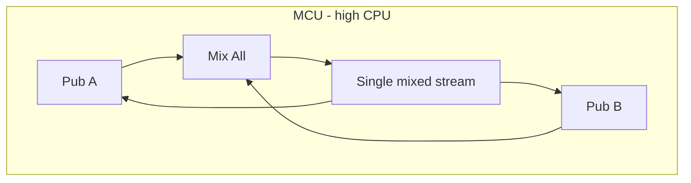

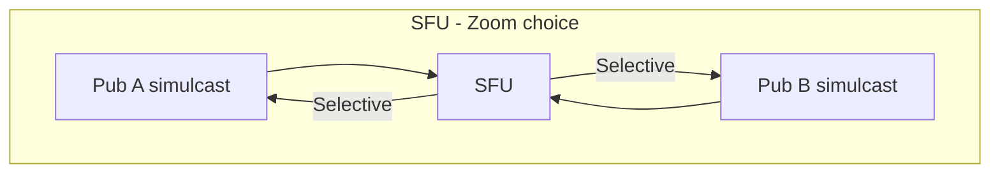

**Interview answer:** Zoom uses **SFU with simulcast** — forwards without transcoding on hot path; recording/compositing uses MCU-like processing off hot path.

### 8.2 Screen Sharing

Screen share is a **separate video track** with distinct properties:

| Property | Camera | Screen |
|----------|--------|--------|
| Resolution | 720p typical | 1080p–4K |
| Frame rate | 30 fps | 15 fps (content) |
| Bitrate | 1.5 Mbps | 2–4 Mbps |
| Priority | Lower | **Higher** (content legibility) |
| Codec | H.264/VP8 | H.264 preferred (text clarity) |

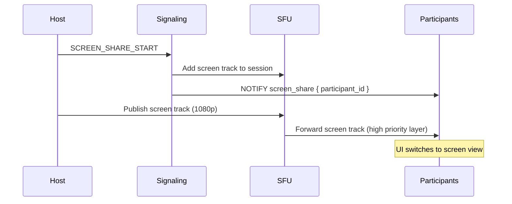

**Content hint:** Encoder uses `contentType: "detail"` (WebRTC) for sharp text.

**Dual stream:** Host publishes both camera + screen simultaneously; SFU forwards both; client UI prioritizes screen.

**Screen share audio:** Separate audio track (system audio) muxed at SFU.

### 8.3 Breakout Rooms

Breakout rooms are **child meetings** with parent reference.

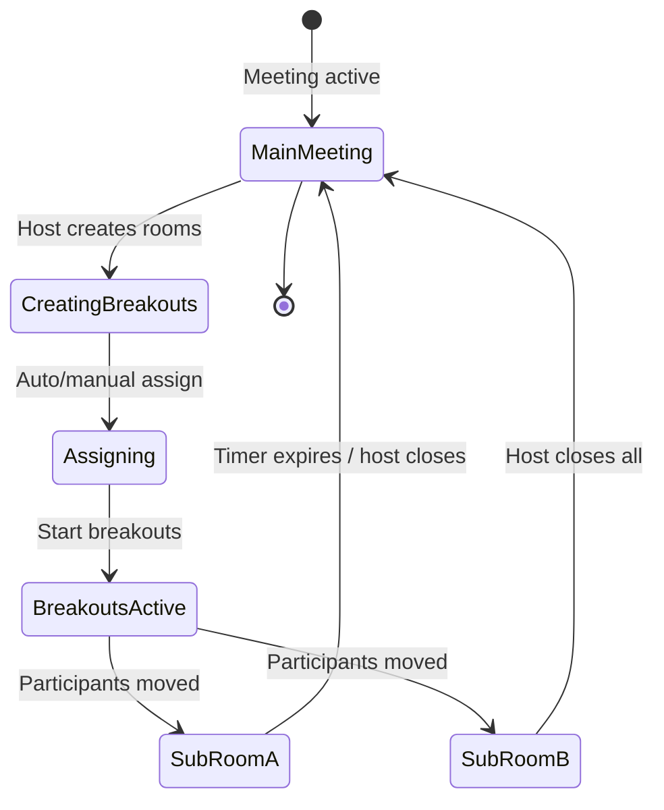

#### Implementation Steps

1. Host creates N breakout room objects (child `meeting_id`s)
2. Assignment map: `{ participant_id → breakout_room_id }`
3. On start:
   - Signal each participant `BREAKOUT_ASSIGN { new_meeting_id, sfu_endpoint }`
   - Client leaves main SFU session; joins breakout SFU session
   - Main meeting SFU holds placeholder for host (who can visit rooms)
4. Host "broadcast message to all rooms" → signaling fan-out to each breakout
5. On close: reverse migration; merge roster back to main

```text
Redis during breakouts:
  meeting:main:breakouts → { room_1: [p1, p2], room_2: [p3, p4] }
  participant:p1:location → room_1
```

**SFU allocation:** Breakout rooms can share SFU node (different media rooms) or scale to separate nodes for large events.

### 8.4 Cloud Recording

#### Recording Modes

| Mode | Description | Use case |
|------|-------------|----------|
| **Composite** | Single video grid/speaker layout | Default cloud recording |
| **Individual** | Separate file per participant | Post-production |
| **Audio only** | Mixed audio M4A | Podcast / compliance |

#### Architecture

```mermaid
flowchart TB
    subgraph SFU Meeting
        S1[Stream 1]
        S2[Stream 2]
        SN[Stream N]
    end

    S1 & S2 & SN -->|RTP mirror| RW[Recording Worker]

    RW --> BUF[ jitter buffer + sync ]
    BUF --> LAYOUT[ Layout engine ]
    LAYOUT --> ENC[ FFmpeg / NVENC ]
    ENC --> UP[S3 multipart upload]

    SIG2[Signaling] --> RW: START/STOP
    RW --> PG2[(Recording metadata)]
```

**Sync challenge:** Align streams with different latencies — use RTP timestamps + NTP offset from RTCP sender reports.

**Scale:** Recording workers are **separate fleet** from SFU — GPU instances for compositing.

**Auto recording:** Host setting triggers worker spawn at meeting start.

### 8.5 Active Speaker Detection

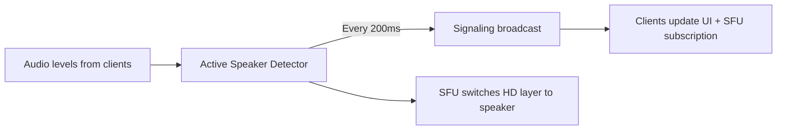

**Approaches:**
1. **Client-side:** Each client measures received audio energy → reports to server
2. **Server-side:** SFU analyzes audio packet energy (no decode needed for Opus volume)
3. **Hybrid:** Client reports + server validation

Active speaker drives **bandwidth optimization** — only speaker gets HD upstream preference in gallery.

### 8.6 Large Meeting Strategies (1000+)

| Challenge | Solution |
|-----------|----------|
| N² streams | SFU + selective subscription |
| Gallery 1000 tiles | Impossible — cap at 49 visible; speaker view default |
| CPU on clients | Receive max 6 video + all audio (muted by default) |
| SFU overload | Hierarchical SFU (cascade) or CDN for view-only |
| Join storm | Pre-warm SFU capacity; queue joins at 500/s |

#### Hierarchical SFU (Cascade)

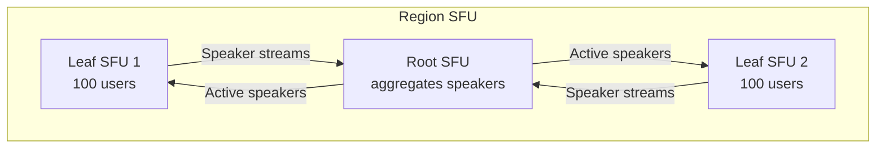

Used for **5000+ webinars** — uncommon in standard meetings.

### 8.7 Webinar vs Meeting Mode

| Feature | Meeting | Webinar |
|---------|---------|---------|
| Max interactive | 1000 (with limits) | 100 panelists |
| Attendees | All interactive | View-only up to 10K+ |
| Default video | On | Off for attendees |
| Q&A / raise hand | Yes | Yes |
| Delivery | WebRTC SFU | HLS + WebRTC hybrid |

### 8.8 NAT Traversal (ICE)

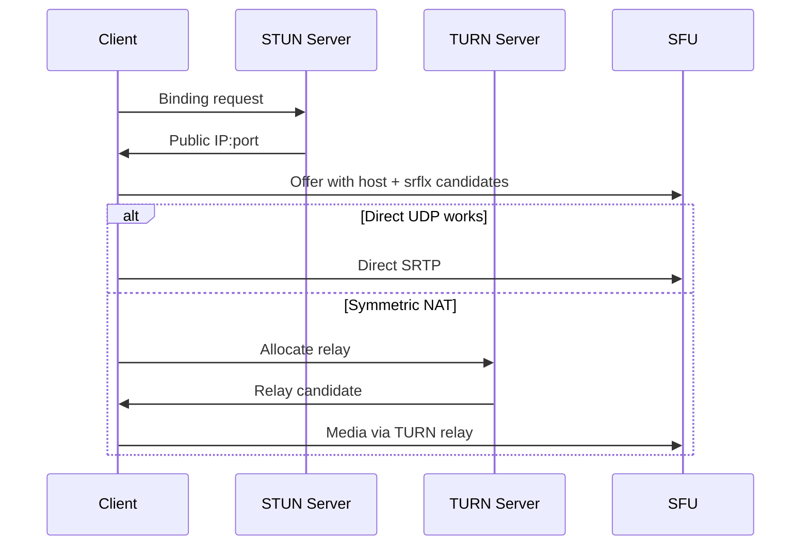

~80% connect directly; TURN is fallback — must over-provision TURN bandwidth.

### 8.9 Security

| Layer | Mechanism |
|-------|-----------|
| Signaling | WSS + JWT meeting tokens |
| Media | DTLS-SRTP (encrypted in transit) |
| Waiting room | Pre-admission gate |
| Lock meeting | Reject new joins |
| E2E (optional) | Client encrypt before SFU — limits cloud recording |

**Interview note:** Standard Zoom meetings are **not E2E** — SFU must access media for routing/recording. E2E mode disables cloud recording.

---

## 9. Trade-offs

### 9.1 SFU vs MCU

| SFU (Zoom hot path) | MCU |
|---------------------|-----|
| Low CPU, high bandwidth | High CPU, lower downstream bandwidth |
| Per-client layer selection | Single mixed output |
| Recording needs separate compositor | Recording = output of mixer |
| **Scales to 1000+** | Expensive at scale |

### 9.2 Simulcast vs SVC

| Simulcast | SVC (Scalable Video Coding) |
|-----------|----------------------------|
| 3 independent encodings | Single layered bitstream |
| More upstream bandwidth | More efficient upstream |
| Simpler SFU | Harder implementation |
| **Zoom/WebRTC default** | AV1 SVC emerging |

### 9.3 WebRTC vs HLS for Attendees

| WebRTC | HLS |
|--------|-----|
| < 500 ms latency | 5–30 s latency |
| Interactive | View-only |
| Expensive at scale | CDN-cheap |
| 1000 interactive | **10K webinar attendees** |

**Hybrid:** WebRTC for panelists; HLS for mass attendees.

### 9.4 Composite vs Individual Recording

| Composite | Individual |
|-----------|------------|
| Ready-to-share MP4 | Post-processing needed |
| GPU-heavy | Storage-heavy |
| Single layout choice | Flexible editing |

### 9.5 Central vs Cascaded SFU

| Central (single SFU per meeting) | Cascaded |
|----------------------------------|----------|
| Simple | Complex |
| Up to ~500 interactive | 5000+ |
| Lower latency | Extra hop latency |

### 9.6 Quality vs Scale

Default **video off** for 500+ meetings; **audio only** mode toggle; **breakout** to reduce main room SFU load.

---

## 10. Failure Modes

### 10.1 SFU Node Crash Mid-Meeting

| Impact | Mitigation |
|--------|------------|
| All media drops | Clients detect ICE failure |
| Automatic reconnection | Signaling reassigns new SFU |
| `< 5 s` recovery target | State rebuilt from signaling roster |

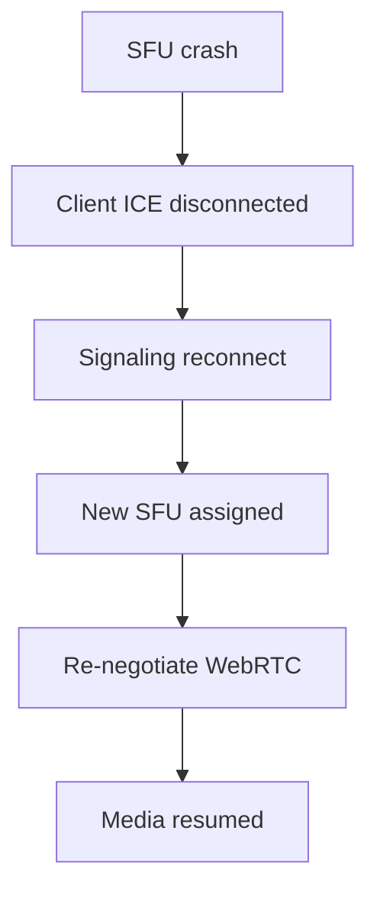

### 10.2 Signaling Server Failure

WebSocket reconnect to different signaling node; meeting state in Redis — session resumes with `session_token`.

### 10.3 TURN Overload

Symptom: 15% users can't connect media.

**Mitigation:** Auto-scale TURN pool; regional TURN; alert on allocation failures; fallback TCP-TURN.

### 10.4 Recording Worker Failure

- Partial recording uploaded to S3 (multipart)
- Resume from last keyframe if worker restarted
- Mark recording status `processing` / `failed` with partial recovery

### 10.5 Breakout Room Orphan

Participant stuck in breakout after host crash.

**Mitigation:** Parent meeting host co-host can close; TTL auto-return after timer; heartbeat detects abandoned breakouts.

### 10.6 Join Storm / Thundering Herd

10K users join webinar at `:00`.

- **Queue joins** at signaling layer (500/s)
- **Pre-warm** SFU + CDN before start
- **Staggered HLS segment generation** on CDN edge

### 10.7 Packet Loss / Congestion

```text
Client ABR logic:
  packet loss > 2% → downgrade simulcast layer
  RTT > 300ms → reduce resolution
  bandwidth estimate < 500kbps → video off, audio only
```

SFU supports **REMB** / **transport-cc** feedback for congestion control.

### 10.8 Split-Brain Host

Two hosts think they have host privileges.

**Mitigation:** Single host_id in meeting record; co-host is explicit role; host transfer requires signaling round-trip ACK.

### 10.9 Region Failover

Entire AWS region down.

- DNS failover to secondary region
- Meetings in progress **lost** (acceptable RTO) — users rejoin
- Recordings in S3 cross-region replicated — no loss

| Scenario | RPO | RTO |
|----------|-----|-----|
| SFU node | 0 (reconnect) | 5 s |
| Region | Recording: 0 (S3 CRR) | 15 min new meetings |
| Recording worker | Partial upload | Resume or fail gracefully |

---

## 11. Interview Cheat Sheet

### 11.1 45-Minute Timeline

| Minutes | Section |
|---------|---------|
| 0–5 | Clarify scale (100 vs 1000 vs 10K) |
| 5–10 | Capacity — bandwidth not QPS |
| 10–15 | Entities + join flow API |
| 15–25 | SFU architecture + simulcast diagrams |
| 25–35 | Screen share + breakout + recording deep dives |
| 35–42 | 1000+ webinar strategy + failures |
| 42–45 | Summary |

### 11.2 Must-Mention Concepts

- **SFU** (not mesh, not MCU on hot path)
- **Simulcast** — low/mid/high layers
- **Separate signaling and media planes**
- **WebRTC** — ICE, STUN, TURN, DTLS-SRTP
- **Active speaker detection** for bandwidth
- **Breakout rooms = child meetings**
- **Recording = off-path compositor + S3**
- **Webinar = HLS/CDN for view-only mass**
- **Selective subscription** — not everyone receives all streams

### 11.3 Common Follow-Up Questions

| Question | Answer Sketch |
|----------|---------------|
| SFU vs MCU? | SFU forwards; MCU mixes — SFU scales, MCU CPU-heavy |
| How screen share works? | Separate high-res track; priority over camera |
| 1000 participants how? | Cap subscriptions; webinar mode; HLS for attendees |
| Breakout rooms? | Child meeting IDs; resignaling; shared Redis state |
| Recording without MCU on hot path? | Tap RTP to GPU worker; composite offline from SFU |
| Latency budget? | 50 ms encode + 50 ms network + 30 ms decode + jitter buffer |
| E2E encryption? | Conflicts with cloud recording and active speaker server detection |
| Bandwidth per user? | 150 kbps–3 Mbps adaptive via simulcast layer pick |

### 11.4 Diagrams to Draw

1. Control plane (signaling) vs media plane (SFU)
2. SFU simulcast publish/subscribe
3. Screen share as second track
4. Breakout room state machine
5. Recording pipeline (RTP tap → compositor → S3)
6. Webinar: WebRTC panelists → HLS attendees

### 11.5 Red Flags to Avoid

- P2P mesh for 100 users
- MCU for all participants at scale
- Sending 1000 video streams to every client
- No TURN fallback strategy
- Recording inside SFU hot path (blocks media)
- Ignoring simulcast / adaptive bitrate
- Same architecture for 10-person and 10K-person meetings

### 11.6 Sample Opening Statement

> "I'll design a Zoom-like video conferencing system separating control plane (REST + WebSocket signaling) from media plane (SFU clusters). Clients publish simulcast video layers; the SFU selectively forwards based on active speaker and gallery layout — avoiding O(N²) mesh. For 1000+ participants, I'll use webinar mode with CDN-delivered HLS for view-only attendees. Let me clarify scale requirements and estimate bandwidth."

### 11.7 Zoom vs Teams vs Google Meet (Quick Compare)

| Aspect | Zoom | Teams | Meet |
|--------|------|-------|------|
| Media arch | SFU + simulcast | SFU | SFU (Google infra) |
| Large meeting | Webinar + HLS | Live events | Live stream |
| Breakout | Native | Native | Native |
| Recording | Cloud composite | Stream + SharePoint | Google Drive |
| Scale focus | 1000 interactive / 10K view | Enterprise | Workspace integration |

### 11.8 Latency Budget Breakdown

```text
Component                    Target
─────────────────────────────────────
Audio capture + encode       20 ms
Network uplink               30 ms
SFU forwarding               5 ms
Network downlink             30 ms
Jitter buffer                40 ms
Decode + render              25 ms
─────────────────────────────────────
Total mouth-to-ear           ~150 ms
```

---

## Appendix A: WebRTC SDP Offer Snippet (Illustrative)

```sdp
v=0
o=- 123456 2 IN IP4 0.0.0.0
s=Zoom Meeting
t=0 0
a=group:BUNDLE 0 1
m=audio 9 UDP/TLS/RTP/SAVPF 111
a=rtpmap:111 opus/48000/2
a=fmtp:111 minptime=10;useinbandfec=1
m=video 9 UDP/TLS/RTP/SAVPF 96 97 98
a=rtpmap:96 VP8/90000
a=rtpmap:97 rtx/90000
a=rtpmap:98 H264/90000
a=simulcast:send rid=h;m;l
a=rid:h recv max-width=1280;max-height=720;max-fps=30
a=rid:m recv max-width=640;max-height=360;max-fps=30
a=rid:l recv max-width=320;max-height=180;max-fps=15
```

## Appendix B: Meeting Settings Schema (JSON)

```json
{
  "waiting_room": true,
  "join_before_host": false,
  "mute_upon_entry": true,
  "participant_video": true,
  "host_video": true,
  "auto_recording": "cloud",
  "breakout_room": {
    "enable": true,
    "rooms": 10,
    "countdown": 60
  },
  "max_participants": 1000,
  "webinar_mode": false
}
```

## Appendix C: Monitoring & SLOs

| Metric | Target |
|--------|--------|
| Meeting join success rate | 99.9% |
| Media connect rate (incl. TURN) | 99.5% |
| Mouth-to-ear p95 latency | < 150 ms |
| Video freeze rate | < 0.5% of minutes |
| SFU CPU utilization alert | > 70% |
| Recording success rate | 99.5% |
| TURN allocation failure | < 0.1% |

## Appendix D: Cost Drivers (Interview Bonus Points)

| Resource | Cost driver |
|----------|-------------|
| SFU bandwidth | #1 — egress dominates |
| TURN relay | #2 — 15% of users × 2× media |
| Recording GPU | Compositing hours |
| S3 storage | Recording retention policy |
| CDN | Webinar HLS delivery |
| Signaling | Minor vs media |

---

*Last updated: 2026-07-08*
