# Design Uber — System Design Interview Guide

> **Framework:** [Hello Interview Delivery Framework](https://www.hellointerview.com/learn/system-design/in-a-hurry/delivery)  
> **Difficulty:** Hard (Staff-level depth on geospatial + real-time matching)  
> **Time budget:** 45 minutes  
> **Primary topics:** Ride matching, geospatial indexing (H3/S2/Geohash), surge pricing, ETA, driver location tracking

---

## Table of Contents

1. [How to Use This Guide](#how-to-use-this-guide)
2. [Requirements (~5 min)](#requirements-5-min)
3. [Core Entities (~2 min)](#core-entities-2-min)
4. [API / System Interface (~5 min)](#api--system-interface-5-min)
5. [Data Flow (~5 min)](#data-flow-5-min)
6. [High-Level Design (~10–15 min)](#high-level-design-1015-min)
7. [Deep Dives (~10 min)](#deep-dives-10-min)
8. [Capacity & Sizing](#capacity--sizing)
9. [Failure Modes & Resilience](#failure-modes--resilience)
10. [Trade-offs Summary](#trade-offs-summary)
11. [Common Follow-Up Questions](#common-follow-up-questions)
12. [Interview Cheat Sheet](#interview-cheat-sheet)

---

## How to Use This Guide

This guide walks through designing a **ride-hailing platform** comparable to Uber at Big Tech interview depth. Follow the Hello Interview pacing: clarify scope early, draw boxes before optimizing, and spend deep-dive time on the **hardest** parts (matching + location), not on generic CRUD.

**What interviewers optimize for:**

| Rubric pillar | What to demonstrate |
|---|---|
| Problem navigation | Scope Uber vs Uber Eats vs Freight explicitly |
| Solution design | End-to-end ride lifecycle with clear service boundaries |
| Technical excellence | Geospatial indexing trade-offs, ETA math, surge algorithms |
| Communication | Narrate trade-offs; invite interviewer into decisions |

**Suggested opening script:**

> "I'll design the core ride-hailing flow: request → match → trip → payment. I'll defer food delivery, freight, and driver onboarding KYC unless you want those in scope. My non-functional focus is sub-second matching in dense cities and reliable location freshness."

---

## Requirements (~5 min)

### Functional Requirements

Prioritize **Must Have (M)** vs **Nice to Have (N)** explicitly.

| ID | Requirement | Priority |
|---|---|---|
| FR-1 | Riders request a ride (pickup, dropoff, vehicle type) | M |
| FR-2 | System matches rider to nearby available driver | M |
| FR-3 | Real-time driver location shown to rider during match + trip | M |
| FR-4 | ETA displayed before and during trip (pickup + trip duration) | M |
| FR-5 | Dynamic pricing (surge) based on supply/demand | M |
| FR-6 | Trip lifecycle: requested → matched → en route → in progress → completed | M |
| FR-7 | Payment capture at trip end | M |
| FR-8 | Driver accepts/declines match offers | M |
| FR-9 | Cancellation with policy (rider/driver, fees) | N |
| FR-10 | Ride history, receipts, ratings | N |
| FR-11 | Scheduled rides | N |
| FR-12 | Multi-stop / pool / shared rides | N |

**Clarifying questions to ask:**

- Single city or global? (Impacts geospatial partitioning)
- Do we support cash trips? (Payment architecture differs)
- Is matching first-accept-wins or batch optimal assignment?
- What's the SLA for match time? (Typically 3–15 seconds p99)

### Non-Functional Requirements

| ID | Requirement | Target | Notes |
|---|---|---|---|
| NFR-1 | Match latency | p99 < 5s in dense urban | Hard problem |
| NFR-2 | Location freshness | Driver position ≤ 3s stale | Push every 1–4s |
| NFR-3 | ETA accuracy | MAE < 2 min at pickup | ML + traffic |
| NFR-4 | Availability | 99.99% for trip-critical path | Multi-region |
| NFR-5 | Consistency | Strong for trip state; eventual for location | CAP trade-off |
| NFR-6 | Scale | 100M DAU, 20M concurrent drivers | Order-of-magnitude |
| NFR-7 | Geospatial queries | Nearest drivers in < 50ms | Index-dependent |
| NFR-8 | Surge update frequency | 1–5 min per cell | Balance UX vs fairness |
| NFR-9 | Fraud / abuse | Rate limits, GPS spoof detection | N |
| NFR-10 | Privacy | Location retention policies | GDPR |

### Capacity Estimation

Walk through **back-of-envelope** math aloud — interviewers care about reasoning, not exact numbers.

**Assumptions:**

- 100M DAU, 20% request a ride daily → **20M rides/day**
- Peak factor 3× → **~700 rides/sec global peak** (roughly)
- Active drivers at peak: **~5M concurrent**
- Location updates: 1 update / 3 sec / driver → **~1.7M writes/sec** (dominant write load)

**Location storage (hot):**

```
5M drivers × 100 bytes/update × (1 update/3 sec) ≈ 167 MB/sec ingress
Retention in hot store: last position only → 5M × 200B ≈ 1 GB (fits Redis cluster per region)
```

**Match queries:**

```
700 req/sec × ~10 geospatial lookups each × 50 nearby drivers ≈ manageable with sharded index
```

**Trip state DB:**

```
20M rides/day × ~2 KB/ride ≈ 40 GB/day → partition by city + time
```

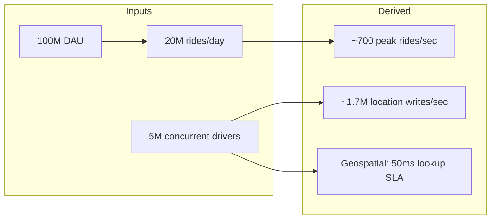

---

## Core Entities (~2 min)

| Entity | Key fields | Notes |
|---|---|---|
| **User** | user_id, role (rider/driver), payment_methods | Separate profiles possible |
| **Driver** | driver_id, vehicle, status (offline/available/busy), rating | Status drives matching |
| **Ride** | ride_id, rider_id, driver_id, status, pickup/dropoff, fare | State machine |
| **LocationUpdate** | driver_id, lat, lng, heading, speed, timestamp | High-volume, ephemeral |
| **SurgeCell** | cell_id (H3/S2), multiplier, demand, supply | Updated periodically |
| **FareQuote** | quote_id, base, surge, estimated_total, TTL | Shown before confirm |
| **MatchOffer** | offer_id, ride_id, driver_id, expires_at | Short TTL (~15s) |

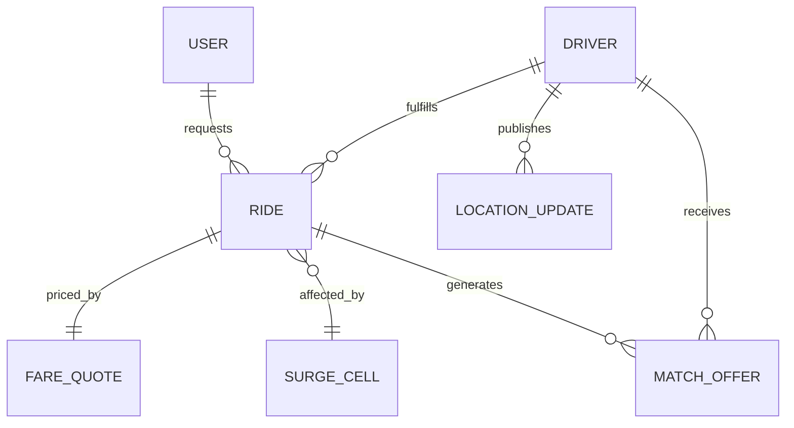

---

## API / System Interface (~5 min)

Use **REST + WebSocket** — REST for commands, WebSocket for real-time streams.

### Rider APIs

| Method | Endpoint | Description |
|---|---|---|
| POST | `/v1/rides/quote` | Get fare + ETA estimate |
| POST | `/v1/rides` | Create ride request |
| GET | `/v1/rides/{ride_id}` | Trip status |
| DELETE | `/v1/rides/{ride_id}` | Cancel |
| GET | `/v1/rides/{ride_id}/driver-location` | Poll fallback |
| WS | `/v1/rides/{ride_id}/stream` | Live driver position + status |

### Driver APIs

| Method | Endpoint | Description |
|---|---|---|
| PUT | `/v1/drivers/me/status` | online / offline / available |
| POST | `/v1/drivers/me/location` | Batch location updates (mobile) |
| WS | `/v1/drivers/me/offers` | Incoming match offers |
| POST | `/v1/offers/{offer_id}/accept` | Accept match |
| POST | `/v1/offers/{offer_id}/decline` | Decline match |

### Internal / Admin

| Method | Endpoint | Description |
|---|---|---|
| GET | `/internal/surge/{cell_id}` | Current multiplier |
| POST | `/internal/match/dispatch` | Trigger re-match |

**Sample: Create ride**

```json
POST /v1/rides
{
  "rider_id": "r_123",
  "pickup": { "lat": 37.7749, "lng": -122.4194 },
  "dropoff": { "lat": 37.7849, "lng": -122.4094 },
  "vehicle_type": "uberX",
  "payment_method_id": "pm_456"
}
```

**Sample: Location batch (driver)**

```json
POST /v1/drivers/me/location
{
  "updates": [
    { "lat": 37.77, "lng": -122.42, "heading": 90, "speed_mps": 8.3, "ts": 1710000000000 }
  ]
}
```

---

## Data Flow (~5 min)

### Happy path: Request → Match → Trip

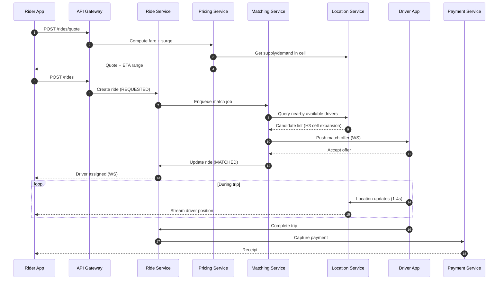

### Location update pipeline

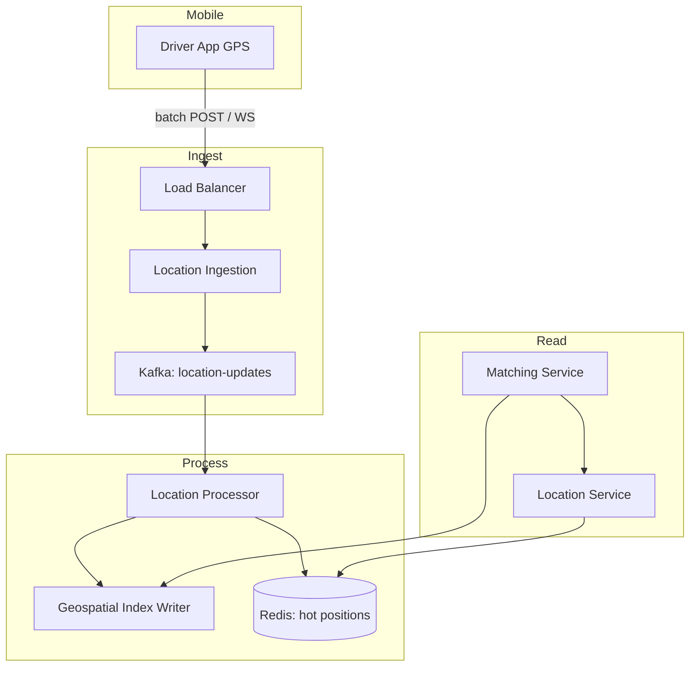

---

## High-Level Design (~10–15 min)

### Architecture overview

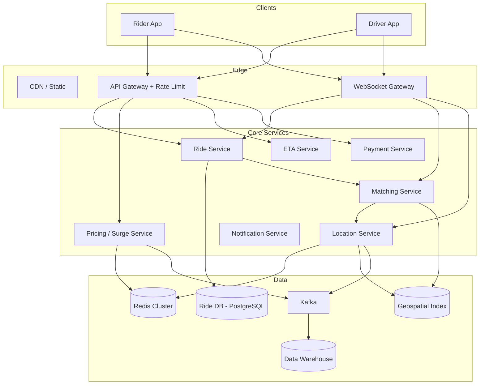

### Service responsibilities

| Service | Responsibility | Critical datastore |
|---|---|---|
| **Ride Service** | Trip state machine, source of truth for ride status | PostgreSQL |
| **Matching Service** | Driver selection, offer dispatch, re-match | Geospatial index + Redis |
| **Location Service** | Ingest, cache latest position, serve reads | Redis + Kafka |
| **Pricing Service** | Base fare, surge multiplier, quote TTL | Redis (surge cells) |
| **ETA Service** | Pickup ETA, trip duration | ML models + traffic graph |
| **Payment Service** | Auth hold, capture, split payouts | Payment DB |

### Ride state machine

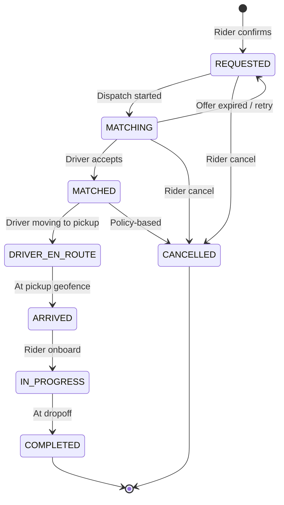

### Regional partitioning

Uber-scale systems **shard by geography** (city/metro/region):

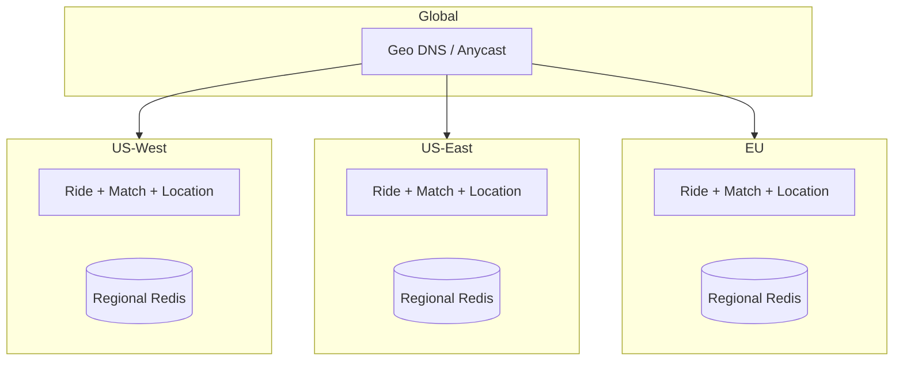

**Why:** Location queries are local; cross-region matching is meaningless. Ride data stays in region for latency + compliance.

---

## Deep Dives (~10 min)

Pick **2–3** based on interviewer interest. This guide covers all five requested topics in depth.

---

### Deep Dive 1: Geospatial Indexing (H3 / S2 / Geohash)

**Problem:** Given a rider at `(lat, lng)`, find **available drivers within R km** in **< 50ms** at millions of QPS.

#### Option comparison

| Index | Shape | Hierarchy | Distance accuracy | Best for |
|---|---|---|---|---|
| **Geohash** | Rectangles (distorted at poles) | Base32 string prefix | Approximate | Simple prototypes, Elasticsearch |
| **S2** | Spherical cells (Hilbert curve) | 30 levels, cell IDs | Excellent on sphere | Google-scale, irregular regions |
| **H3** | Hexagonal cells | 16 resolutions | Good uniform coverage | Uber's actual choice, equal-area-ish |

#### Why Uber uses H3 (public talks)

- **Hexagons** have uniform neighbor distance (6 neighbors vs geohash 4–8)
- **Multi-resolution**: zoom from city → block
- **Cell aggregation** for surge (count drivers/riders per cell)
- Open source, language bindings

#### H3 matching algorithm (conceptual)

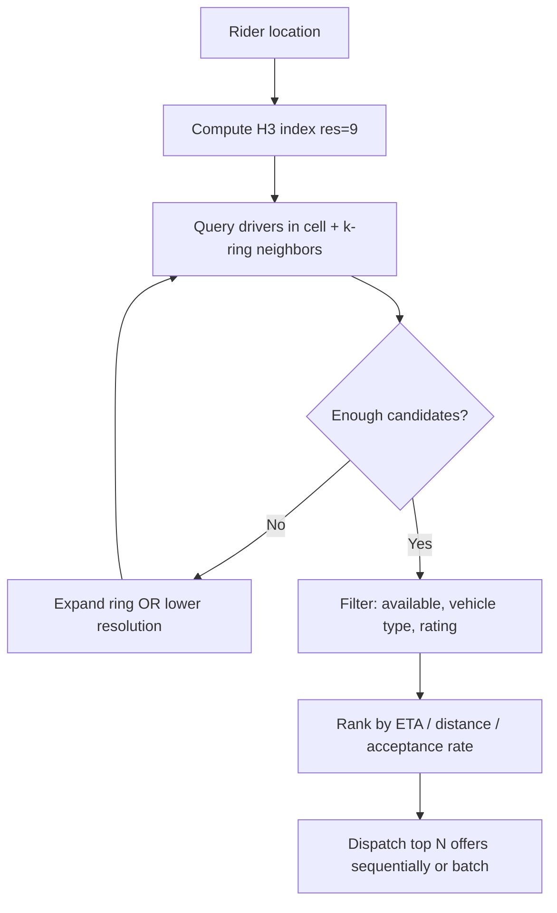

**k-ring expansion:** Start at rider's cell; if < K drivers, expand to ring 1, 2, 3… until enough candidates or max radius.

**Storage pattern:**

```
Redis GEO / custom H3 inverted index:
  h3:8928308280fffff -> Set{driver_id_1, driver_id_2, ...}
  driver:{id}:meta -> {status, vehicle_type, last_h3, heartbeat}
```

#### Geohash prefix trap (mention in interview)

Geohash cells are **not always contiguous** neighbors — prefix search can miss nearby drivers across cell boundaries. Mitigation: query **8 neighboring geohashes** or use H3/S2.

#### S2 when to mention

S2 excels for **complex polygon queries** (airport geofences, city boundaries). Uber uses H3 for grid aggregation; S2 is common at Google (Maps, Pokémon GO).

#### Dual-layer architecture

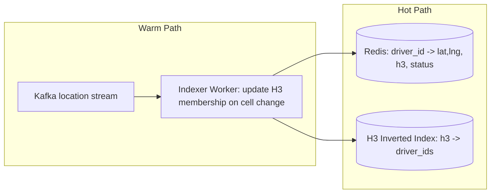

**Cell change detection:** When driver's H3 cell changes (crossed boundary), remove from old cell set, add to new — avoid full re-index every update.

---

### Deep Dive 2: Ride Matching

**Problem:** Assign the **best** driver fast enough that riders don't churn.

#### Matching strategies

| Strategy | Pros | Cons |
|---|---|---|
| **Greedy nearest** | Simple, fast | Suboptimal globally, starves edge riders |
| **Batch assignment** (every 2–5s) | Global optimization (min total ETA) | Adds latency |
| **Sequential offers** | Fair to drivers, simple | Slower if many declines |
| **Hungarian / min-cost flow** | Optimal for batch | Compute-heavy; used in dense peaks |

**Production hybrid:** Batch during surge peaks; greedy sequential off-peak.

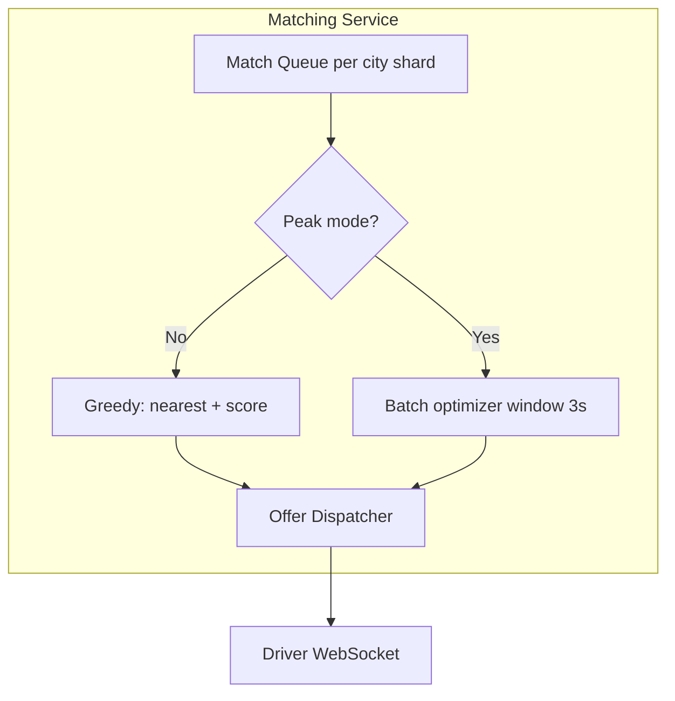

#### Scoring function (example)

```
score(driver, ride) =
    w1 * (-pickup_eta_seconds)
  + w2 * driver_acceptance_rate
  + w3 * driver_rating
  + w4 * (-idle_time_minutes)      // fairness for drivers waiting
  - w5 * recent_declines
```

#### Offer lifecycle

- Offer TTL: **10–15 seconds**
- If declined/expired → next candidate or re-queue
- Max attempts before expanding radius / raising surge suggestion

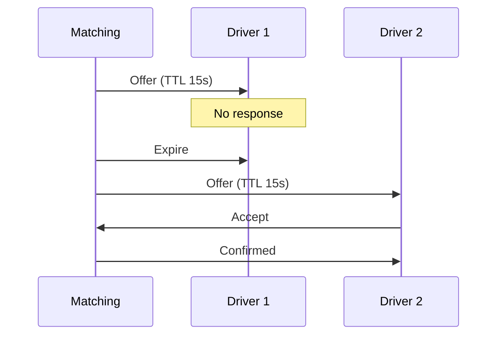

#### Avoiding double assignment

Use **distributed lock or conditional update**:

```sql
UPDATE drivers SET status = 'BUSY', current_ride_id = ?
WHERE driver_id = ? AND status = 'AVAILABLE';
-- rows affected = 1 → success; 0 → race lost
```

Or Redis: `SET driver:{id}:lock ride_id NX EX 15`

---

### Deep Dive 3: Driver Location Tracking

**Problem:** **~1.7M writes/sec** globally; riders need fresh positions; matching needs accurate supply.

#### Ingestion design

| Layer | Choice | Rationale |
|---|---|---|
| Transport | gRPC / HTTP2 batch or persistent WebSocket | Reduce connection overhead |
| Buffer | Kafka partitioned by `driver_id` | Ordering per driver |
| Hot store | Redis with TTL | Sub-ms reads |
| Cold store | S3 + warehouse | Analytics, dispute resolution |

#### Update frequency trade-off

| Mode | Frequency | Battery | Use case |
|---|---|---|---|
| Active trip | 1–2 sec | Higher | Rider map |
| Available | 3–5 sec | Medium | Matching |
| Idle / background | 15–30 sec | Low | Supply presence |

Mobile uses **adaptive** frequency based on ride state.

#### Stale driver handling

- No heartbeat for **30–60s** → mark **offline**, remove from geospatial index
- Prevents matching "ghost" drivers

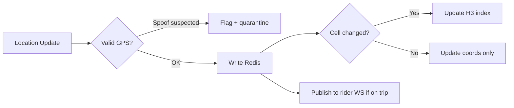

#### Rider-facing stream

- **WebSocket** from WS gateway subscribed to `ride:{id}:location`
- Location processor fans out from Kafka — don't read Redis on every rider poll
- Interpolate on client between updates for smooth UX

#### Privacy

- Precision reduction when not on active trip
- Retention: hot minutes, warm days, aggregate only in warehouse

---

### Deep Dive 4: ETA (Estimated Time of Arrival)

**Two ETAs matter:**

1. **Pickup ETA** — driver → rider (matching + pre-pickup)
2. **Trip ETA** — pickup → dropoff (fare estimate + rider UX)

#### Architecture

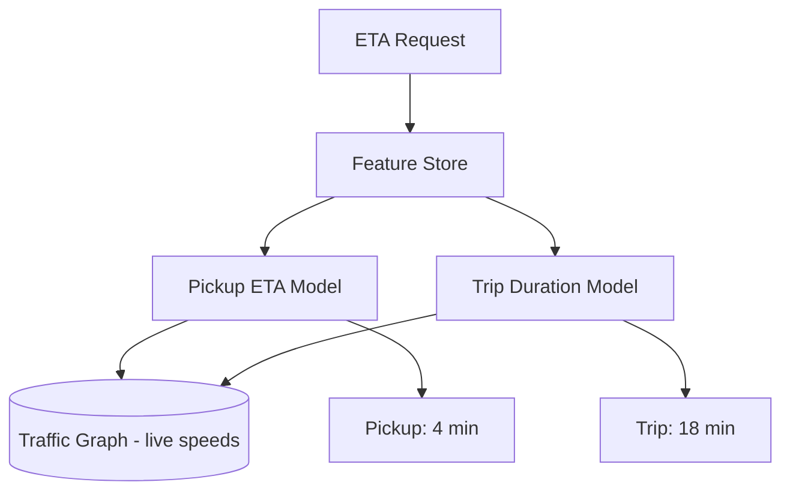

#### Inputs (features)

- Haversine distance (baseline)
- **Route distance** via road network (OSRM / Google Roads)
- Live traffic speeds on route segments
- Time of day, day of week
- Historical speeds for segment
- Weather, events (concerts)

#### Model approach

| Stage | Technique |
|---|---|
| Baseline | Route Dijkstra / contraction hierarchies on static graph |
| Live adjustment | Multiply segment weights by live speed / historical ratio |
| ML correction | Gradient boosted trees on residual error (XGBoost / LightGBM) |
| Online learning | Retrain daily; shadow mode for new models |

**Key metric:** MAE at pickup arrival — optimize p50 and p90 differently (riders hate late > early).

#### Caching

- Cache `(origin_cell, dest_cell, time_bucket) → duration` with short TTL (1–5 min)
- Invalidate on major traffic incidents

#### ETA during matching

Pickup ETA **is** the matching objective — precompute pairwise for top-K candidates only, not all drivers in city.

---

### Deep Dive 5: Surge Pricing

**Problem:** Balance **supply and demand** when demand exceeds available drivers; prevent unbounded wait times.

#### Surge cell model

Reuse **H3 cells** (resolution 7–8 for neighborhood scale):

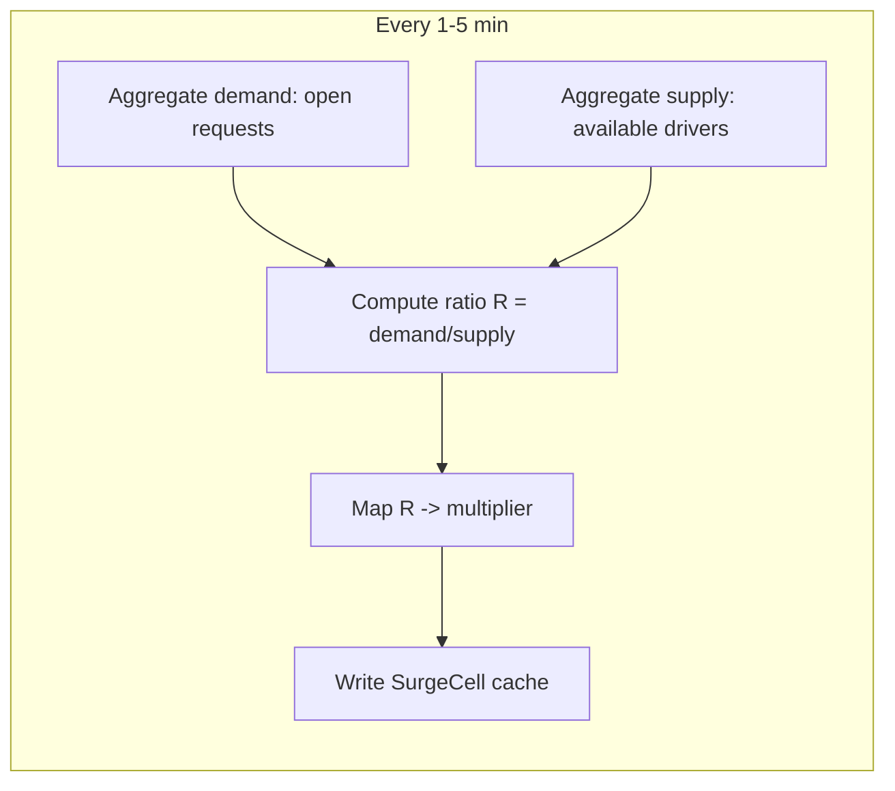

#### Multiplier function (illustrative)

```
if R < 1.2: multiplier = 1.0
elif R < 2.0: multiplier = 1.0 + 0.5 * (R - 1.2)
else: multiplier = min(cap, 1.4 + 0.3 * (R - 2.0))

cap = 3.0 (or 5.0 in extreme events)
```

#### Smoothing (avoid flicker)

- **EWMA** on multiplier across windows
- Hysteresis: raise fast, lower slow
- Cap rate-of-change per minute

#### Rider UX

- Show surge **before** confirm: "1.8× — high demand"
- **Fare lock** on quote TTL (60–120s) — surge changes don't mid-quote

#### Driver incentives

- Surge splits: platform takes standard fee; driver gets multiplier on base
- Optional **boost zones** independent of rider surge

#### Ethical / product considerations (strong senior signal)

- Transparency vs sticker shock
- Geofence caps during emergencies (PR/disaster policy)
- Anti-gouging regulations in some jurisdictions

#### Surge feedback loop

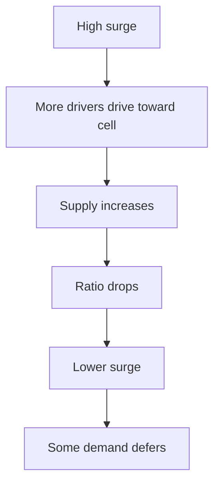

---

## Capacity & Sizing

### Location path

| Component | Sizing |
|---|---|
| Kafka | 256+ partitions per region, 3× replication |
| Redis | 5M keys × 200B ≈ 1 GB + overhead → cluster with replicas |
| Ingestion servers | ~1.7M/sec ÷ 10K/sec per node ≈ 170 nodes (with headroom) |

### Matching path

| Component | Sizing |
|---|---|
| H3 index shards | Shard by metro; 1 Redis cluster per large city |
| Match workers | 700 req/sec peak — horizontally scaled stateless workers |

### Ride DB

- **Shard key:** `city_id` + `ride_id`
- PostgreSQL with read replicas for history
- Active rides in Redis cache for fast lookup

---

## Failure Modes & Resilience

| Failure | Impact | Mitigation |
|---|---|---|
| Redis location down | Matching blind | Fallback to last-known from replica; degrade to wider radius |
| Matching slow | Rider wait | Auto-expand radius; suggest alternate products |
| Kafka lag | Stale positions | Monitor lag; shed non-critical consumers |
| Surge service stale | Wrong prices | Default 1.0× with monitoring alert |
| Payment capture fail | Revenue loss | Retry queue; manual reconciliation |
| Split-brain driver assign | Double booking | Conditional DB update + idempotent ride_id |

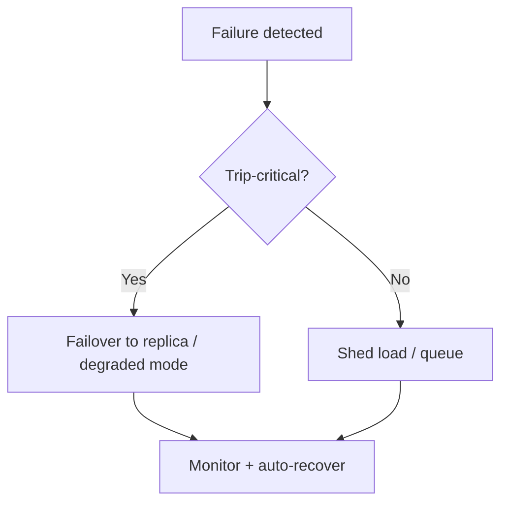

---

## Trade-offs Summary

| Decision | Choice A | Choice B | When to pick |
|---|---|---|---|
| Geospatial index | H3 | S2 / Geohash | H3 for grid analytics; S2 for complex polygons |
| Matching | Greedy sequential | Batch optimal | Batch at peak; greedy off-peak |
| Location store | Redis only | Redis + DB | Redis hot; DB for audit if required |
| Surge granularity | Fine H3 res | Coarse cells | Finer = accurate; coarser = stable UX |
| ETA | ML-heavy | Route-only | ML at scale; route-only for MVP |
| Consistency | Strong ride state | Eventual location | Always strong for money + assignment |

---

## Common Follow-Up Questions

1. **How would you handle a driver going offline mid-match?**  
   Offer TTL + heartbeat; immediate re-match; penalize flaky drivers in scoring.

2. **Design scheduled rides.**  
   Time-indexed demand forecast; pre-position drivers; separate match queue T-15 min.

3. **Pool / shared rides?**  
   Batch matching with route deviation constraints; NP-hard — heuristics + time windows.

4. **Global trip (airport)?**  
   Still regional matching; map matching for pickup zones; static ETA graphs per venue.

5. **How detect GPS spoofing?**  
   Acceleration plausibility, cell tower/WiFi corroboration, historical path consistency.

6. **Exactly-once payment?**  
   Idempotency keys on capture; outbox pattern to payment provider.

7. **Compare to Lyft architecture publicly known?**  
   Similar H3 usage; differences in batch vs greedy — discuss generically.

---

## Interview Cheat Sheet

### 45-minute timeline

| Minute | Section |
|---|---|
| 0–5 | Requirements + capacity |
| 5–7 | Entities + API |
| 7–12 | Data flow + HLD diagram |
| 12–22 | Location + H3 deep dive |
| 22–32 | Matching + surge |
| 32–40 | ETA + failures |
| 40–45 | Trade-offs + questions |

### Must-draw diagrams

1. Architecture boxes (services + data stores)
2. Ride state machine
3. Location ingest pipeline
4. H3 k-ring expansion
5. Match offer sequence

### Phrases that signal seniority

- "Location writes dominate — design ingest first."
- "Strong consistency on assignment; eventual on position is acceptable."
- "Surge is a control loop, not just a price multiplier."
- "H3 gives us one grid for matching, surge, and analytics."

### Red flags to avoid

- Storing every GPS point in PostgreSQL on hot path
- Single global Redis for all cities
- No offer TTL / double-assign protection
- Ignoring surge quote locking
- Matching without driver availability filter in index

---

## Summary

Uber's core systems design tension is **massive write-heavy location ingestion** paired with **low-latency geospatial reads** for matching. **H3** (or S2) provides a unified spatial index for driver lookup and surge cells. **Matching** balances greedy speed vs batch optimality with scored offers and atomic driver locking. **ETA** combines road graphs, live traffic, and ML residuals. **Surge** closes the supply-demand loop with smoothed multipliers per cell. Partition **by region**, cache **hot state in Redis**, and treat the trip state machine as the **consistency anchor** for everything downstream.
