# Design Airbnb — System Design Interview Guide

> **Framework:** [Hello Interview Delivery Framework](https://www.hellointerview.com/learn/system-design/in-a-hurry/delivery)  
> **Difficulty:** Hard (Search at scale + booking concurrency)  
> **Time budget:** 45 minutes  
> **Primary topics:** Search/filter, booking concurrency (double-booking prevention), payments, reviews, calendar availability

---

## Table of Contents

1. [How to Use This Guide](#how-to-use-this-guide)
2. [Requirements (~5 min)](#requirements-5-min)
3. [Core Entities (~2 min)](#core-entities-2-min)
4. [API / System Interface (~5 min)](#api--system-interface-5-min)
5. [Data Flow (~5 min)](#data-flow-5-min)
6. [High-Level Design (~10–15 min)](#high-level-design-1015-min)
7. [Deep Dives (~10 min)](#deep-dives-10-min)
8. [Capacity & Sizing](#capacity--sizing)
9. [Failure Modes & Resilience](#failure-modes--resilience)
10. [Trade-offs Summary](#trade-offs-summary)
11. [Common Follow-Up Questions](#common-follow-up-questions)
12. [Interview Cheat Sheet](#interview-cheat-sheet)

---

## How to Use This Guide

Design a **vacation rental marketplace** where guests discover listings, verify availability, book dates, pay, and leave reviews. Airbnb interviews stress **search relevance at scale** and **correctness under concurrent bookings** — the classic double-booking problem.

**Suggested opening script:**

> "I'll focus on guest search → listing detail → book → pay → review, plus host calendar management. I'll treat experiences and long-term stays as out of scope unless you'd like them. My top non-functionals are search latency and zero double-bookings."

---

## Requirements (~5 min)

### Functional Requirements

| ID | Requirement | Priority |
|---|---|---|
| FR-1 | Hosts create/manage listings (photos, amenities, pricing, rules) | M |
| FR-2 | Hosts manage availability calendar (block dates, min stay) | M |
| FR-3 | Guests search listings by location, dates, filters | M |
| FR-4 | Guests view listing details + live availability for dates | M |
| FR-5 | Guests book listing for date range | M |
| FR-6 | Payment processing (charge guest, payout host) | M |
| FR-7 | Booking lifecycle: pending → confirmed → completed / cancelled | M |
| FR-8 | Reviews after stay (guest ↔ host) | M |
| FR-9 | Instant Book vs Request to Book | N |
| FR-10 | Messaging host ↔ guest | N |
| FR-11 | Dynamic pricing / smart pricing | N |
| FR-12 | Multi-currency, taxes, fees | N |

**Clarifying questions:**

- Instant Book only or also host approval flow?
- Cancellation policies (flexible / moderate / strict)?
- Do we need price breakdown (cleaning fee, service fee, taxes)?
- Geographic scope — global from day one?

### Non-Functional Requirements

| ID | Requirement | Target |
|---|---|---|
| NFR-1 | Search latency | p99 < 300ms |
| NFR-2 | Double-booking rate | **0** (financial + trust critical) |
| NFR-3 | Availability read accuracy | Strong for booking path |
| NFR-4 | Scale | 150M users, 7M listings, 1M bookings/day |
| NFR-5 | Search freshness | Index lag < 5 min acceptable |
| NFR-6 | Payment reliability | At-least-once with idempotency |
| NFR-7 | Review integrity | One review per completed booking |
| NFR-8 | Availability | 99.9% for search + booking |
| NFR-9 | Compliance | PCI DSS for payments; GDPR for PII |

### Capacity Estimation

**Assumptions:**

- 7M active listings
- 100M searches/day → **~1,200 searches/sec avg**, ~5K/sec peak
- 1M bookings/day → **~12 bookings/sec avg**, ~50/sec peak
- 50 photos/listing avg → object storage heavy (CDN)

**Search index size (rough):**

```
7M listings × ~5 KB doc (metadata + geo + facets) ≈ 35 GB
+ replicas → fits Elasticsearch cluster with sharding
```

**Calendar writes:**

```
Hosts editing calendars: low vs reads
Booking path: 50 peak writes/sec — small but must be strongly consistent per listing
```

**Reviews:**

```
~500K reviews/day (half of bookings leave review) — append-heavy, moderate QPS
```

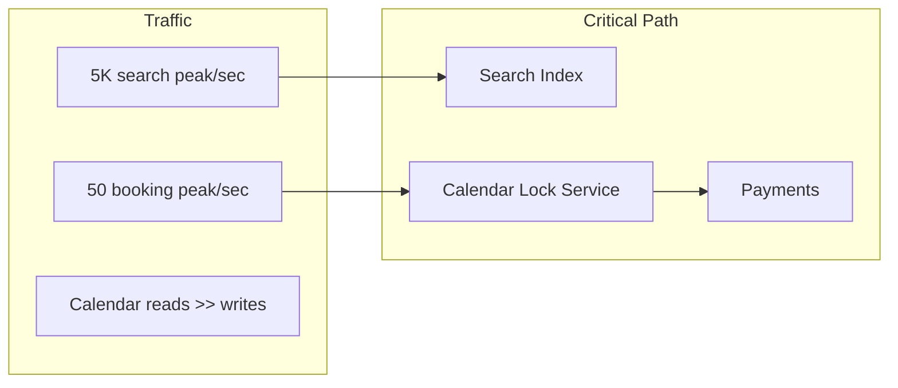

---

## Core Entities (~2 min)

| Entity | Key fields | Notes |
|---|---|---|
| **User** | user_id, role, verification_status | Guest and/or host |
| **Listing** | listing_id, host_id, geo, amenities, base_price, rules | Search document source |
| **Calendar** | listing_id, date, status (available/blocked/booked) | Per-night granularity |
| **Booking** | booking_id, listing_id, guest_id, check_in, check_out, status | Spans date range |
| **Payment** | payment_id, booking_id, amount, status, idempotency_key | PCI-isolated |
| **Review** | review_id, booking_id, reviewer_id, rating, text | Post-completion |
| **Payout** | payout_id, host_id, amount, schedule | Marketplace split |

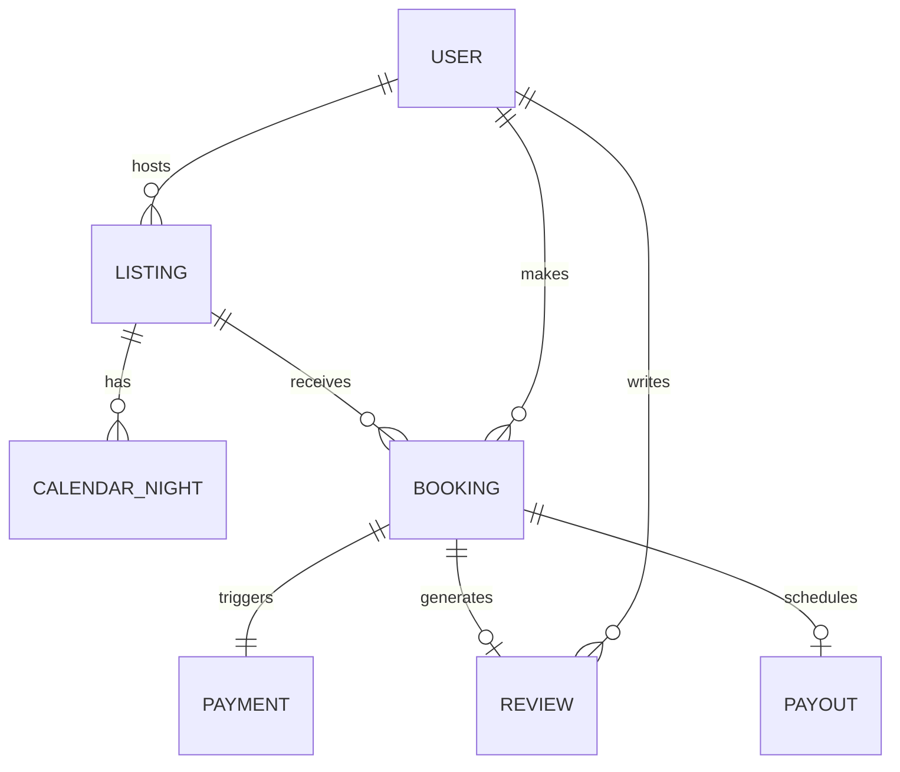

---

## API / System Interface (~5 min)

### Guest APIs

| Method | Endpoint | Description |
|---|---|---|
| GET | `/v1/search` | Search with query params |
| GET | `/v1/listings/{id}` | Listing detail |
| GET | `/v1/listings/{id}/availability` | Calendar for date range |
| POST | `/v1/bookings/quote` | Price breakdown + hold preview |
| POST | `/v1/bookings` | Create booking |
| GET | `/v1/bookings/{id}` | Booking status |
| POST | `/v1/bookings/{id}/cancel` | Cancel per policy |
| POST | `/v1/reviews` | Submit review |

### Host APIs

| Method | Endpoint | Description |
|---|---|---|
| POST | `/v1/listings` | Create listing |
| PUT | `/v1/listings/{id}/calendar` | Block/unblock dates |
| PUT | `/v1/listings/{id}/pricing` | Nightly rates |
| GET | `/v1/host/bookings` | Incoming reservations |

### Search query example

```
GET /v1/search?
  location=San+Francisco&
  check_in=2026-08-01&
  check_out=2026-08-05&
  guests=2&
  min_price=100&
  max_price=400&
  amenities=wifi,kitchen&
  instant_book=true&
  page=1&limit=20
```

### Booking request

```json
POST /v1/bookings
{
  "listing_id": "lst_789",
  "guest_id": "usr_123",
  "check_in": "2026-08-01",
  "check_out": "2026-08-05",
  "guests": 2,
  "payment_method_id": "pm_456",
  "idempotency_key": "bk-req-uuid-001"
}
```

---

## Data Flow (~5 min)

### Search → Book happy path

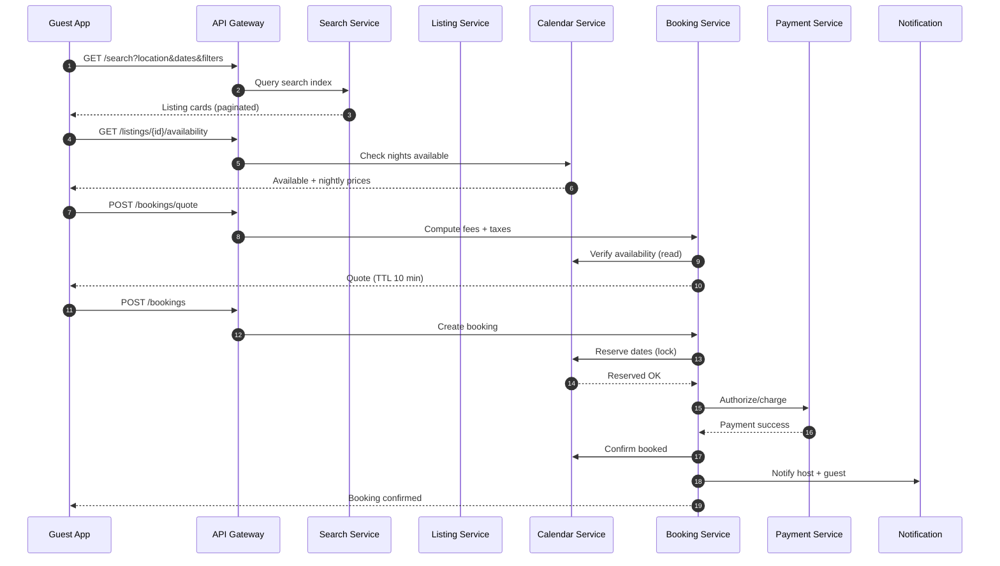

### Host calendar update flow

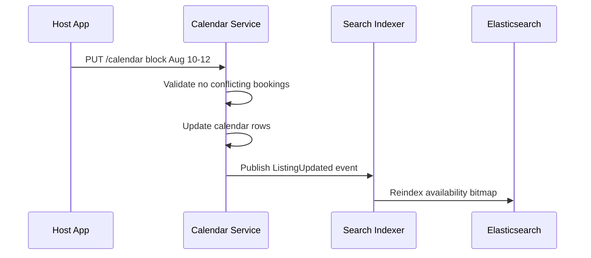

---

## High-Level Design (~10–15 min)

### Architecture overview

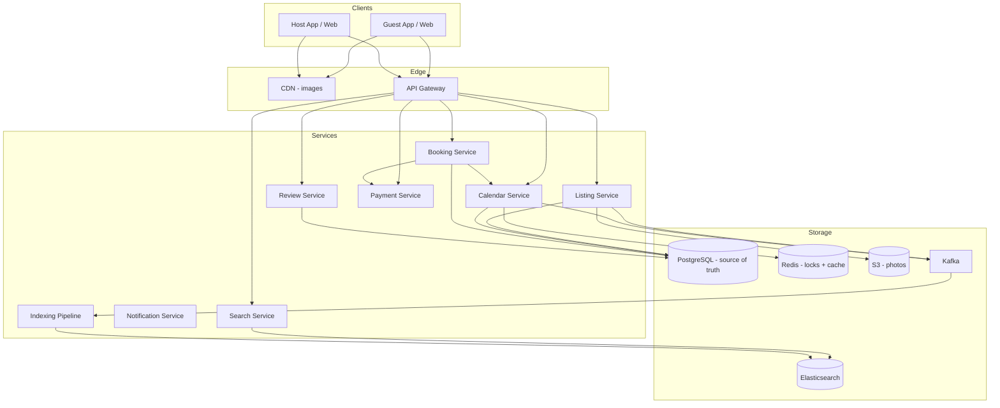

### Service boundaries

| Service | Owns | Does NOT own |
|---|---|---|
| **Search** | Query parsing, ranking, pagination | Booking, payments |
| **Listing** | CRUD, media, amenities metadata | Night-level availability |
| **Calendar** | Per-date availability, reservations | Payment capture |
| **Booking** | Orchestration, state machine, policies | Search ranking |
| **Payment** | Charge, refund, payout, PCI scope | Calendar logic |
| **Review** | Review CRUD, eligibility rules | Booking state |

### Booking state machine

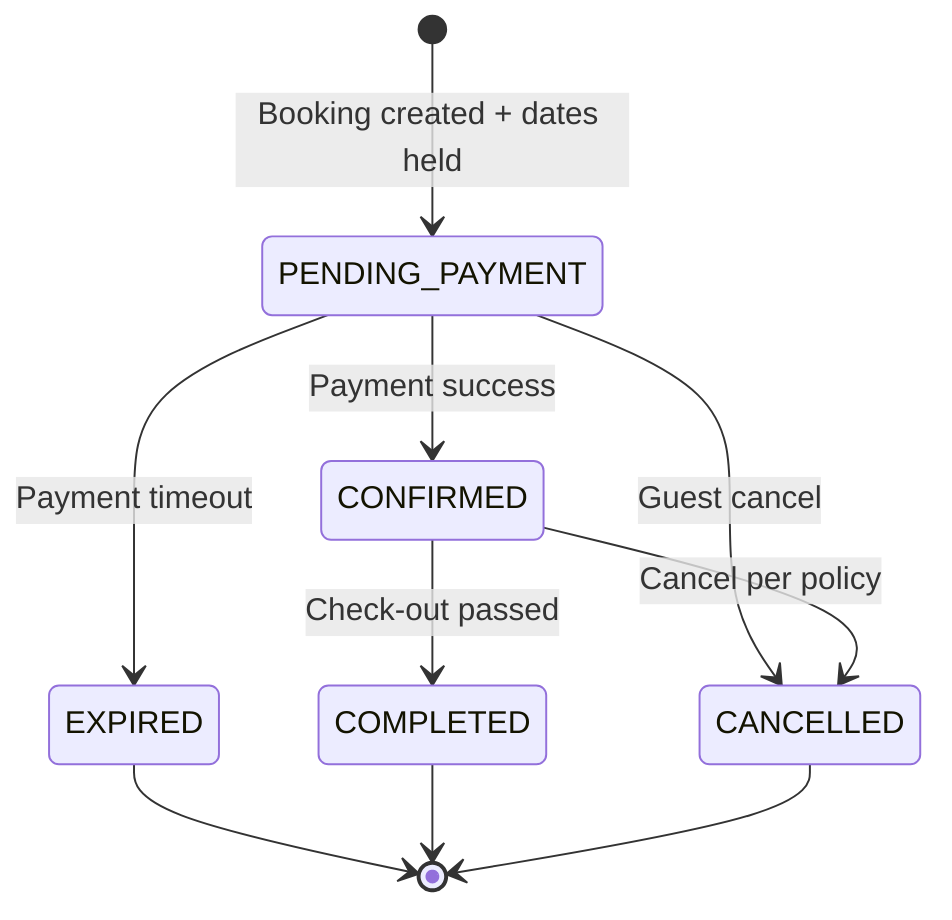

For **Request to Book**:

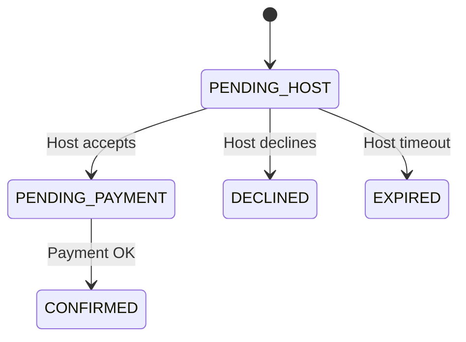

---

## Deep Dives (~10 min)

---

### Deep Dive 1: Search & Filter

**Problem:** Return relevant listings for **location + dates + 20+ filters** in **< 300ms** across millions of documents.

#### Search architecture

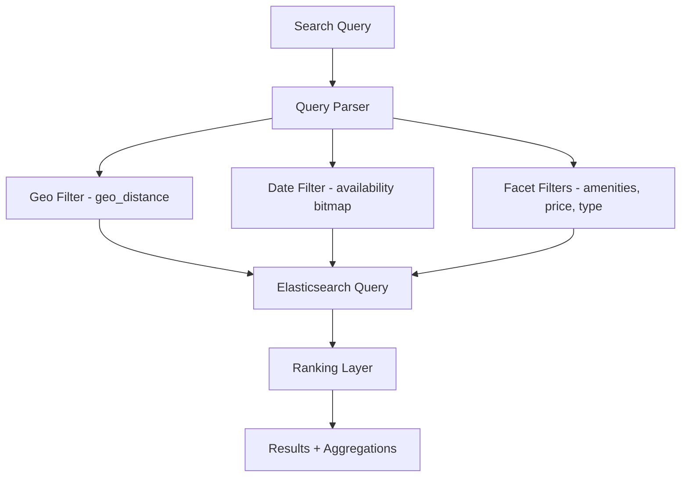

#### Index document shape (conceptual)

```json
{
  "listing_id": "lst_789",
  "title": "Cozy loft",
  "location": { "lat": 37.77, "lon": -122.42 },
  "geo_hash": "9q8yy",
  "base_price": 150,
  "amenities": ["wifi", "kitchen", "ac"],
  "room_type": "entire_home",
  "instant_book": true,
  "max_guests": 4,
  "availability_bitmap": "base64-encoded-bitmap",
  "rating_avg": 4.92,
  "review_count": 128,
  "boost_score": 0.87
}
```

#### Date availability in search index

**Challenge:** Guest searches `Aug 1–5` — listing must have **all 4 nights available**.

**Approaches:**

| Approach | Pros | Cons |
|---|---|---|
| **Bitmask in ES doc** | Fast filter in single query | Reindex on every booking |
| **Side index (listing_id → available ranges)** | Compact | Complex queries |
| **Post-filter from Calendar service** | Always accurate | Slow at scale |
| **Hybrid** | Best production fit | More moving parts |

**Hybrid (recommended):**

1. ES stores **approximate** availability bitmap (updated async, lag OK for search)
2. Top-N results **verified** against Calendar service (strong consistency)
3. On booking path, **always** hit Calendar service — never trust search index alone

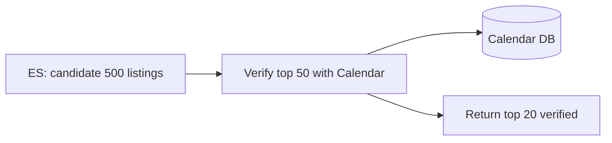

#### Geo search

- **Elasticsearch `geo_distance`** or **`geo_bounding_box`** + distance sort
- Geohash grid aggregation for map UI ("clusters at zoom level")
- H3/S2 for consistent spatial bucketing at scale

#### Ranking signals

```
final_score =
    w1 * relevance_text
  + w2 * (-distance_km)
  + w3 * rating_avg
  + w4 * log(review_count)
  + w5 * price_match_score
  + w6 * host_response_rate
  + w7 * boost_score (paid / quality program)
  - w8 * cancellation_rate
```

**Personalization (N):** ML reranker on top-100 — session history, click models.

#### Faceted navigation

ES aggregations for:

- Price histogram buckets
- Room type counts
- Amenity counts
- Instant book count

Return facets **with** results in one round trip.

#### Indexing pipeline

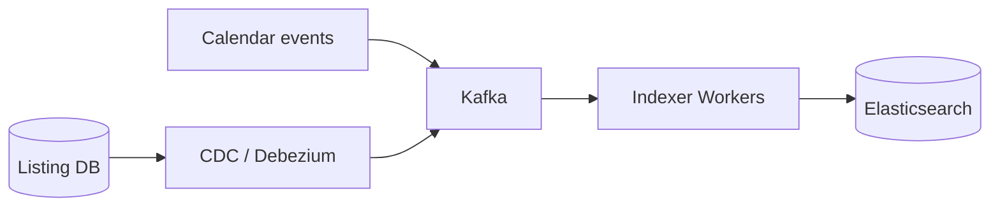

**Partial updates:** On booking, emit `AvailabilityChanged` → indexer updates bitmap field only (not full reindex).

---

### Deep Dive 2: Calendar Availability

**Problem:** Represent host availability; serve fast reads; support min-stay, advance notice, turnover days.

#### Data model: per-night rows vs range

| Model | Schema | Best for |
|---|---|---|
| **Per-night table** | `(listing_id, date, status, price)` | Flexible pricing, easy locks |
| **Range table** | `(listing_id, start, end, status)` | Compact storage |
| **Bitmap** | 365-day bitfield per year | Fast search index sync |

**Production pattern:** Per-night rows in PostgreSQL (source of truth) + derived bitmap for search.

```sql
-- calendar_nights
listing_id | date       | status    | price_cents | booking_id
lst_789    | 2026-08-01 | available | 15000       | NULL
lst_789    | 2026-08-02 | booked    | 15000       | bk_111
```

#### Rules engine

| Rule | Implementation |
|---|---|
| Min stay 3 nights | Validate on book: all nights in range available + count ≥ 3 |
| Advance notice 24h | Reject check_in < now + 24h |
| Turnover buffer | Auto-block night after checkout |
| Host blocked | status = blocked, not selectable |

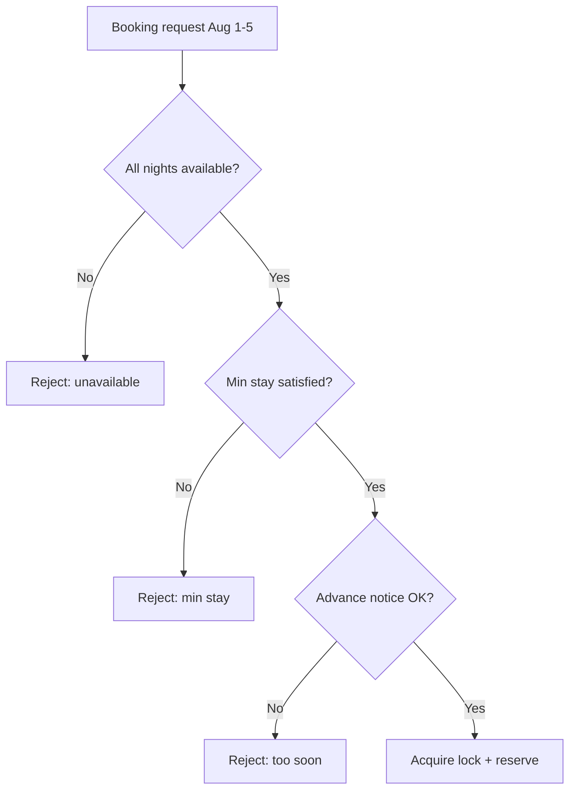

---

### Deep Dive 3: Booking Concurrency (Double-Booking Prevention)

**Problem:** Two guests book the **same listing, overlapping dates** at the same instant. This must **never** happen.

This is the **#1 correctness** requirement in the interview.

#### Why it's hard

- Search index is **eventually consistent**
- Read-modify-write race:

```
Guest A: read Aug 1-5 available yes
Guest B: read Aug 1-5 available yes
Guest A: write booked
Guest B: write booked  ← DOUBLE BOOKING
```

#### Solution 1: Pessimistic locking (listing-level)

```sql
BEGIN;
SELECT * FROM listings WHERE listing_id = ? FOR UPDATE;
-- check all nights available
UPDATE calendar_nights SET status='held', booking_id=? 
  WHERE listing_id=? AND date IN (...) AND status='available';
-- if row count != expected nights → ROLLBACK
COMMIT;
```

**Pros:** Simple, strong consistency  
**Cons:** Contention on popular listings (hotspot)

#### Solution 2: Optimistic concurrency

```sql
UPDATE calendar_nights 
SET status='held', version=version+1, booking_id=?
WHERE listing_id=? AND date=? AND status='available' AND version=?;
-- check rows affected
```

Retry on conflict with exponential backoff.

#### Solution 3: Distributed lock (Redis Redlock)

```
lock_key = "calendar:{listing_id}"
TTL = 30 seconds
```

Hold lock for entire reserve + payment flow; release on confirm or expiry.

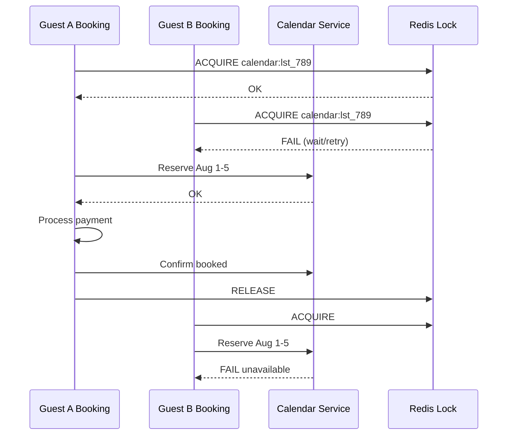

#### Solution 4: Hold / soft reservation TTL

Two-phase booking:

1. **HOLD** nights for 10–15 min (status = `held`)
2. Payment succeeds → **BOOKED**
3. Payment fails / timeout → release hold (async sweeper)

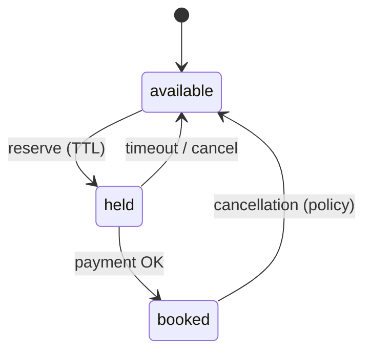

**Sweeper job:** Every minute, release holds where `held_until < now`.

#### Database constraint (belt and suspenders)

```sql
UNIQUE (listing_id, date) WHERE status IN ('held', 'booked');
-- or exclusion constraint on daterange in PostgreSQL
```

PostgreSQL **exclusion constraint** with `daterange` prevents overlapping bookings at DB level — excellent senior signal.

```sql
ALTER TABLE bookings ADD EXCLUDE USING gist (
  listing_id WITH =,
  daterange(check_in, check_out) WITH &&
) WHERE (status NOT IN ('cancelled', 'expired'));
```

#### Comparison table

| Method | Consistency | Hotspot handling | Complexity |
|---|---|---|---|
| Row lock FOR UPDATE | Strong | Poor on viral listings | Low |
| Optimistic versioning | Strong | Good with retries | Medium |
| Redis distributed lock | Strong | Serializes per listing | Medium |
| Hold TTL + constraint | Strong | Good UX (payment time) | Medium-High |

**Interview recommendation:** Hold TTL + PostgreSQL exclusion constraint + idempotent booking API.

#### Idempotency

```
POST /bookings with Idempotency-Key
→ same key returns same booking (safe retries from mobile)
```

Store `(guest_id, idempotency_key) → booking_id` in Redis or DB.

---

### Deep Dive 4: Payments

**Problem:** Marketplace payments — charge guest, take platform fee, pay host, handle refunds/currencies.

#### Payment flow

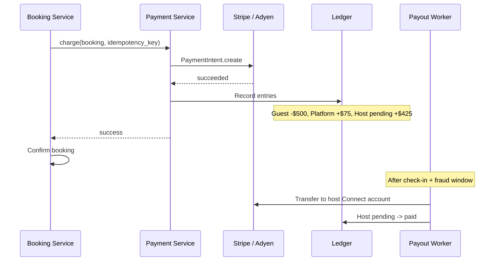

#### Money flow breakdown

| Line item | Example |
|---|---|
| Nightly rate × nights | $400 |
| Cleaning fee | $80 |
| Guest service fee (14%) | $67 |
| Taxes (occupancy) | $45 |
| **Guest total** | **$592** |
| Host payout (rate + cleaning - host fee) | ~$460 |
| Platform revenue | service fees |

#### Architecture principles

| Principle | Implementation |
|---|---|
| PCI scope minimization | Tokenize cards via Stripe.js — never store PAN |
| Idempotency | Keys on all charge/refund APIs |
| Ledger | Double-entry for reconciliation |
| Async payouts | Host paid T+1 after check-in (chargeback window) |
| Refunds | Policy engine → partial/full refund → reverse ledger |

#### Split payments (Stripe Connect model)

- **Platform account** collects from guest
- **Connected account** (host) receives transfer minus fees
- Handles KYC for hosts

#### Failure handling

| Scenario | Action |
|---|---|
| Payment declined | Release calendar hold; return clear error |
| Payment timeout | Hold expires via sweeper |
| Charge after host cancel | Refund + compensation workflow |
| Currency mismatch | FX at quote time; lock rate in booking record |

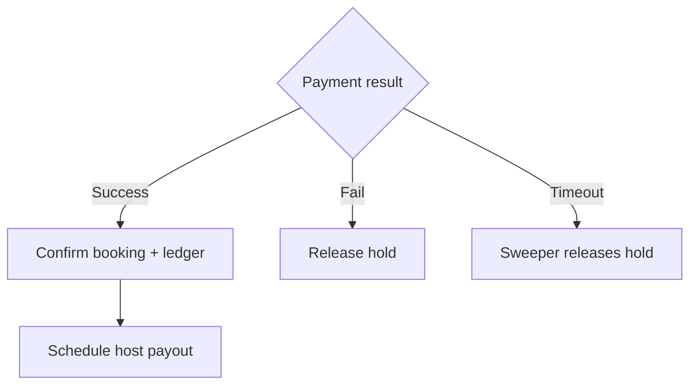

---

### Deep Dive 5: Reviews

**Problem:** Trust marketplace via authentic reviews; prevent spam, retaliation, and duplicate reviews.

#### Review eligibility rules

| Rule | Enforcement |
|---|---|
| One review per booking per side | Unique `(booking_id, reviewer_id)` |
| Only after checkout | `check_out < now` |
| Window (e.g., 14 days) | Reject after deadline |
| Both parties can review | Guest reviews listing; host reviews guest |
| Blind / simultaneous reveal | Optional — reduces bias |

#### Review state machine

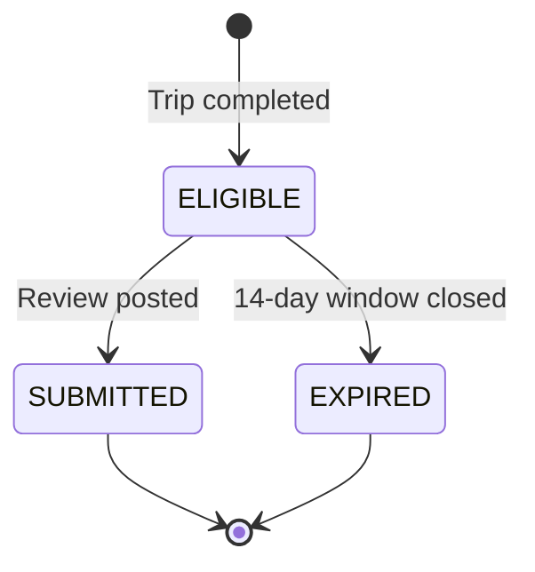

#### Aggregates denormalization

On new review:

```
UPDATE listings SET 
  rating_avg = recompute(...),
  review_count = review_count + 1
WHERE listing_id = ?;
```

Also update **search index** async for ranking signals.

#### Moderation pipeline

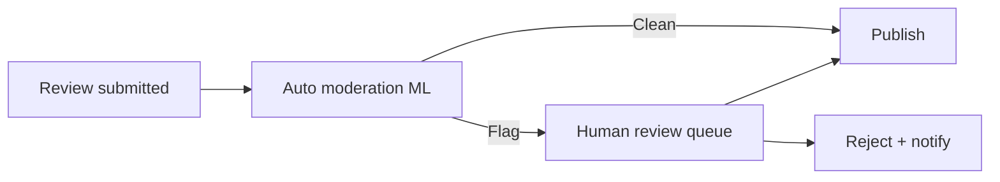

**Signals:** profanity, PII (phone/email), external links, review bombing patterns.

#### Anti-gaming

- Verified stay only (booking_id required)
- Rate limit new accounts
- Detect reciprocal 5-star rings (graph analysis)
- Weight recent reviews in display; show distribution histogram

#### Display vs search

- **Listing page:** paginated reviews, photos, host response
- **Search ranking:** uses `rating_avg`, `review_count`, recency-weighted score — not full text search on reviews for latency

---

## Capacity & Sizing

### Search tier

| Component | Sizing |
|---|---|
| Elasticsearch | 7M docs, 3 shards × multi-node; replicas for read |
| Search service | Stateless; 5K QPS ÷ 500 per pod ≈ 10+ pods |
| CDN | All listing photos; origin S3 |

### Calendar / booking tier

| Component | Sizing |
|---|---|
| PostgreSQL | Shard by `listing_id` hash; hot listings may need queue |
| Redis locks | ~50 booking/sec × few ms hold — small cluster |
| Booking service | Stateless orchestrator |

### Event pipeline

- Kafka: listing updates, availability changes, booking events
- Indexer lag SLA: < 5 min (acceptable for search)

---

## Failure Modes & Resilience

| Failure | Impact | Mitigation |
|---|---|---|
| ES cluster down | Search unavailable | Degraded: geo-only cache of top cities |
| Calendar DB slow | Booking timeouts | Circuit breaker; show "try again" |
| Lock service fail | Cannot book | Fail closed — don't double-book |
| Payment provider outage | Revenue loss | Queue retries; extend hold TTL |
| Index lag | Stale search results | Verify-on-book path; post-filter top results |
| Viral listing hotspot | Lock contention | Queue booking requests per listing |

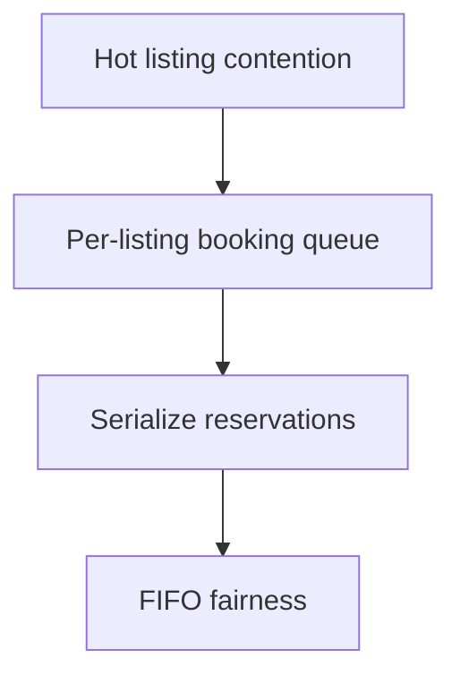

---

## Trade-offs Summary

| Decision | Option A | Option B | Recommendation |
|---|---|---|---|
| Availability in search | Bitmap in ES | Real-time calendar join | Hybrid: bitmap + verify |
| Double-book prevention | Optimistic only | Hold + DB constraint | Hold + exclusion constraint |
| Instant Book | Immediate charge | Request flow | Product choice; design both states |
| Reviews | Public immediately | Blind bilateral | Bilateral reduces retaliation |
| Payout timing | Instant | Delayed T+1 | Delayed for chargeback protection |
| Listing photos | S3 + CDN | Self-hosted | Always CDN |

---

## Common Follow-Up Questions

1. **How handle partial cancellation mid-stay?**  
   Pro-rate policy; release remaining nights to calendar; partial refund via ledger.

2. **Smart pricing / dynamic rates?**  
   ML demand forecast per listing-night; host opt-in; calendar stores nightly price override.

3. **Multi-room property (hotel-style)?**  
   Inventory count per room type; decrement units not binary availability.

4. **Cross-listing duplicate photos (fraud)?**  
   Image hashing + ML duplicate detection at upload.

5. **Global tax (VAT, occupancy tax)?**  
   Tax service by geo; snapshot tax lines on booking record.

6. **How would you A/B test ranking?**  
   Experiment layer in Search service; log impressions/clicks/bookings for offline eval.

7. **Compare to Booking.com architecture patterns?**  
   Similar search + inventory; discuss attribute-based vs OTA model generically.

---

## Interview Cheat Sheet

### 45-minute timeline

| Minute | Section |
|---|---|
| 0–5 | Requirements + capacity |
| 5–7 | Entities + API |
| 7–15 | HLD + search architecture |
| 15–25 | Calendar + double-booking deep dive |
| 25–35 | Payments + reviews |
| 35–42 | Failures + trade-offs |
| 42–45 | Questions |

### Must-draw diagrams

1. Service architecture (search, calendar, booking, payment)
2. Search hybrid verify flow
3. Booking hold TTL state machine
4. Redis lock sequence for concurrent bookings
5. Payment + ledger flow

### Senior signals

- "Search index is eventually consistent — booking path never trusts it alone."
- "Exclusion constraint is the last line of defense against double-booking."
- "Hold TTL decouples payment latency from availability correctness."
- "Reviews tied to booking_id — not listing_id — for verified stays."

### Red flags

- No concurrency story beyond "use a transaction" without listing-level strategy
- Charging before availability confirmed
- Full calendar join on every search request
- Reviews without eligibility enforcement

---

## Summary

Airbnb's design centers on **search at scale** (Elasticsearch + geo + availability bitmaps + ranking) and **booking correctness** (hold TTL, distributed locks, PostgreSQL exclusion constraints, idempotent APIs). **Calendar** is the source of truth for night-level state; **search** is a derived, lag-tolerant view. **Payments** use marketplace split with ledger + delayed payouts. **Reviews** anchor trust via booking-verified eligibility and moderated UGC feeding back into search ranking. The interview winner narrates the **read vs write path split** explicitly.
