# Design Ticketmaster — System Design Interview Guide

> **Framework:** [Hello Interview Delivery Framework](https://www.hellointerview.com/learn/system-design/in-a-hurry/delivery)  
> **Difficulty:** Hard (Extreme burst traffic + inventory correctness)  
> **Time budget:** 45 minutes  
> **Primary topics:** High-concurrency ticket sales, inventory locking, queue/waiting room, preventing bots, seat selection

---

## Table of Contents

1. [How to Use This Guide](#how-to-use-this-guide)
2. [Requirements (~5 min)](#requirements-5-min)
3. [Core Entities (~2 min)](#core-entities-2-min)
4. [API / System Interface (~5 min)](#api--system-interface-5-min)
5. [Data Flow (~5 min)](#data-flow-5-min)
6. [High-Level Design (~10–15 min)](#high-level-design-1015-min)
7. [Deep Dives (~10 min)](#deep-dives-10-min)
8. [Capacity & Sizing](#capacity--sizing)
9. [Failure Modes & Resilience](#failure-modes--resilience)
10. [Trade-offs Summary](#trade-offs-summary)
11. [Common Follow-Up Questions](#common-follow-up-questions)
12. [Interview Cheat Sheet](#interview-cheat-sheet)

---

## How to Use This Guide

Design a **primary ticket sales platform** for high-demand concerts and sports — think Taylor Swift onsale: millions of fans, thousands of tickets, **seconds** to sell out. Interviewers test **burst traffic engineering**, **inventory correctness** (no overselling), **virtual waiting rooms**, **anti-bot**, and **interactive seat maps**.

**Suggested opening script:**

> "I'll design onsale flow for assigned-seat events: queue → enter → select seats → hold → pay. I'll defer resale marketplace and season packages unless you want them. My focus is zero overselling under 10M concurrent queue users and fair human access."

---

## Requirements (~5 min)

### Functional Requirements

| ID | Requirement | Priority |
|---|---|---|
| FR-1 | Event catalog (venues, dates, sections, pricing tiers) | M |
| FR-2 | Interactive seat map — view available seats | M |
| FR-3 | Select specific seats (or best-available fallback) | M |
| FR-4 | Temporary seat hold during checkout (TTL) | M |
| FR-5 | Purchase tickets with payment | M |
| FR-6 | Virtual waiting room / queue before onsale | M |
| FR-7 | Ticket delivery (mobile QR / PDF) | M |
| FR-8 | Inventory management — no overselling | M |
| FR-9 | General Admission (GA) bucket inventory | M |
| FR-10 | Presale codes / fan verification | N |
| FR-11 | Transfer / resale integration | N |
| FR-12 | Dynamic pricing / platinum seats | N |

**Clarifying questions:**

- Assigned seating vs GA vs mixed venue?
- Onsale model: fixed start time for all, or rolling queue admission?
- Hold duration during checkout? (Typically 5–10 min)
- Max tickets per customer / per transaction?
- Primary sale only, or include resale?

### Non-Functional Requirements

| ID | Requirement | Target |
|---|---|---|
| NFR-1 | Queue capacity | 10M+ waiting users per hot event |
| NFR-2 | Onsale burst | 500K–1M checkout attempts in first minute |
| NFR-3 | Oversell rate | **0** — legal and brand critical |
| NFR-4 | Seat map load | p99 < 500ms for section overview |
| NFR-5 | Hold correctness | Exactly one owner per seat at a time |
| NFR-6 | Bot traffic | Block >95% automated abuse (aspirational) |
| NFR-7 | Fairness | FIFO queue ordering; randomize within shard |
| NFR-8 | Availability | 99.95% during onsale window |
| NFR-9 | Idempotency | Safe payment retries |
| NFR-10 | Audit | Full inventory audit trail |

### Capacity Estimation

**Hot onsale scenario (Taylor Swift scale):**

- 10M users hit site at 10:00 AM
- Venue: 60,000 seats
- Sellout in **~2–5 minutes** → **~200–500 tickets/sec** sustained
- Seat map polls: 1M active in queue × 1 req/5 sec → **200K req/sec** (worst case — must push via WS)

**Conservative planning numbers:**

```
Queue signups:     10M users (mostly static + token refresh)
Admitted/minute:   ~100K users (throttled entry)
Active seat selection: 50K concurrent
Hold writes:       500/sec peak
Payment:           200/sec peak
Inventory reads:   100K/sec (cached seat maps)
```

**Storage:**

```
60K seats × 200 bytes state ≈ 12 MB per event (fits memory)
10M queue tokens × 500 B ≈ 5 GB (Redis cluster)
```

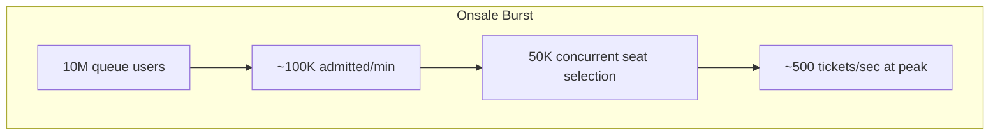

---

## Core Entities (~2 min)

| Entity | Key fields | Notes |
|---|---|---|
| **Event** | event_id, venue_id, onsale_time, status | Parent aggregate |
| **Venue** | venue_id, seat_map_schema | SVG/coordinates |
| **Seat** | seat_id, section, row, number, price_tier | Atomic inventory unit |
| **InventorySlot** | seat_id, event_id, status, version | available/held/sold |
| **Hold** | hold_id, user_id, seat_ids[], expires_at | Short TTL |
| **Order** | order_id, user_id, line_items, payment_status | Post-purchase |
| **QueueToken** | token_id, event_id, position, admitted_at | Waiting room |
| **Ticket** | ticket_id, order_id, seat_id, barcode | Fulfillment |

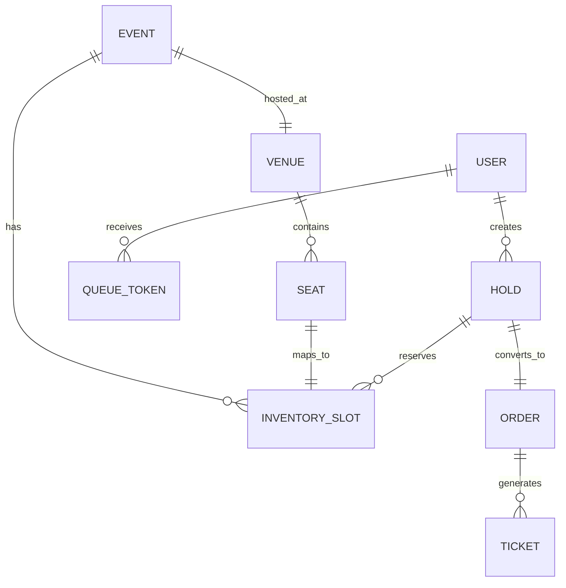

---

## API / System Interface (~5 min)

### Public APIs

| Method | Endpoint | Description |
|---|---|---|
| GET | `/v1/events/{id}` | Event metadata |
| POST | `/v1/events/{id}/queue/join` | Enter waiting room |
| GET | `/v1/events/{id}/queue/status` | Queue position / admission |
| GET | `/v1/events/{id}/seats` | Seat map + availability |
| POST | `/v1/events/{id}/holds` | Hold selected seats |
| DELETE | `/v1/holds/{hold_id}` | Release hold |
| POST | `/v1/orders` | Complete purchase |
| GET | `/v1/orders/{id}/tickets` | Retrieve tickets |

### Queue join response

```json
{
  "queue_token": "qt_abc123",
  "event_id": "evt_456",
  "status": "waiting",
  "users_ahead": 842000,
  "estimated_wait_minutes": 45,
  "refresh_interval_seconds": 30
}
```

### Hold request

```json
POST /v1/events/evt_456/holds
{
  "seat_ids": ["A-12-4", "A-12-5"],
  "idempotency_key": "hold-uuid-789"
}
```

### WebSocket channels

| Channel | Purpose |
|---|---|
| `queue:{token}` | Admission notification, position updates |
| `event:{id}:inventory` | Section-level availability deltas |
| `hold:{id}` | Hold expiry countdown |

---

## Data Flow (~5 min)

### Onsale end-to-end

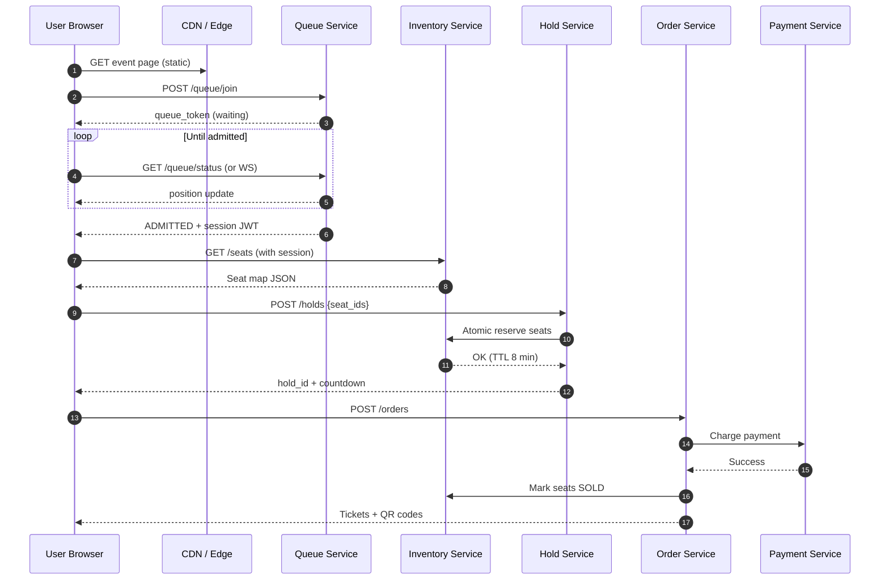

### Queue admission flow

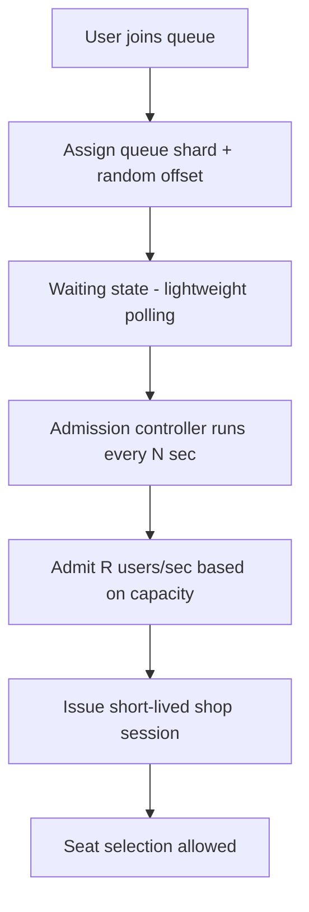

---

## High-Level Design (~10–15 min)

### Architecture overview

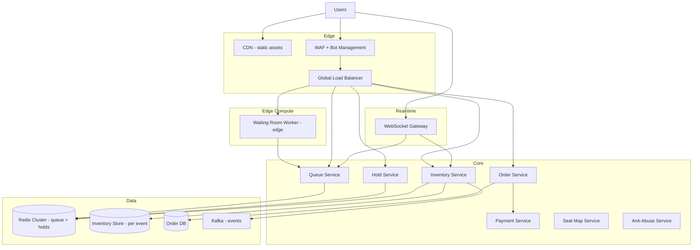

### Layered defense (traffic shaping)

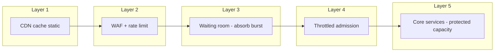

### Per-event inventory isolation

**Critical:** Hot event traffic must not degrade unrelated events.

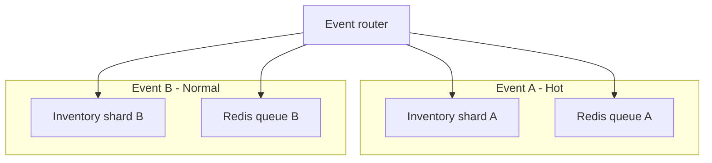

Each mega-event gets:

- Dedicated Redis cluster (or keyspace)
- In-memory inventory partition
- Pre-warmed compute pool

---

## Deep Dives (~10 min)

---

### Deep Dive 1: High-Concurrency Ticket Sales

**Problem:** 10M users arrive in **one second**; only **~500 purchases/sec** capacity needed — but wrong architecture melts down.

#### Traffic profile

| Phase | Duration | Dominant load |
|---|---|---|
| Pre-onsale | Hours | Queue join, static pages |
| Queue waiting | 30–90 min | Lightweight status polls |
| Admission wave | Minutes | Seat map + selection |
| Sellout | 2–5 min | Hold + payment writes |
| Post-sellout | Ongoing | Read-only, resale traffic |

#### Core insight

> **Separate the queue path (millions of reads) from the purchase path (hundreds of writes/sec).**

Most users never purchase — optimize their experience for **cheap reads**, not seat map complexity.

#### Write path bottleneck analysis

```
500 tickets/sec × 2 seats avg = 1000 seat state changes/sec
→ trivial for Redis or in-memory store with proper sharding
```

The hard part is **protecting** the write path from 10M concurrent attackers, not the write volume itself.

#### Admission rate control

```
admission_rate = min(
  max_checkout_capacity,
  target_seat_selection_concurrency / avg_session_duration
)
```

Example:

- Target 50K concurrent shoppers
- Avg shop session 8 min
- Admission ≈ 50K / 8min ≈ **100/sec** (adjust dynamically)

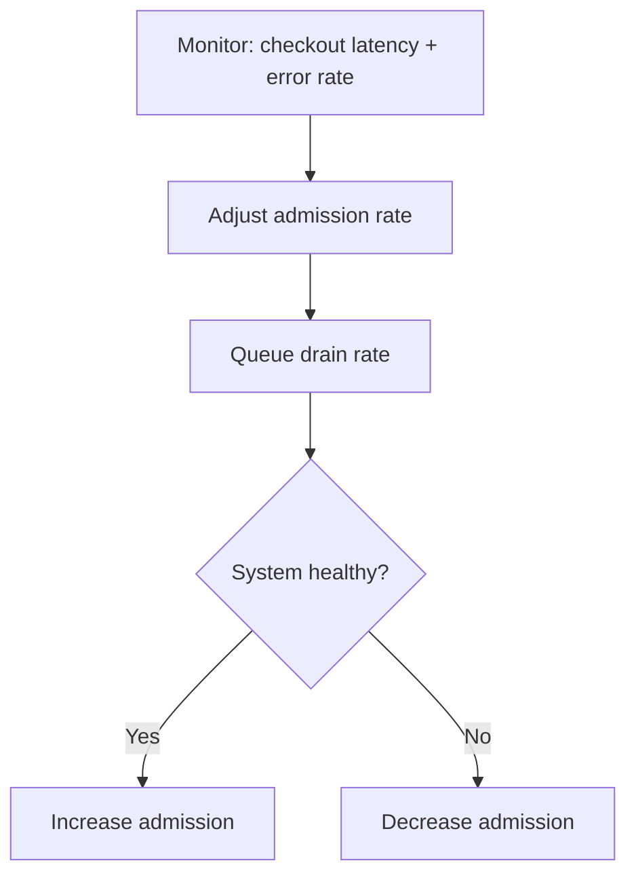

#### General Admission (GA) vs assigned seats

| Model | Inventory unit | Concurrency pattern |
|---|---|---|
| **GA** | Integer counter per tier | Atomic decrement — simpler |
| **Assigned** | Individual seat_id | Per-seat locking — harder |
| **Best available** | Algorithm picks seats | Batch lock N adjacent seats |

**GA inventory:**

```
DECR ga:event123:floor 2  → if result >= 0 success else sold out
```

**Assigned:** see Seat Selection deep dive.

#### Sellout cascade

When last tickets sell:

1. Inventory service publishes `SOLD_OUT` event
2. WebSocket broadcast to all connected clients
3. Queue service stops admission
4. CDN serves sold-out page (cacheable)

---

### Deep Dive 2: Inventory Locking

**Problem:** Guarantee **at most one** customer holds or owns a seat; **zero overselling**.

#### Seat state machine

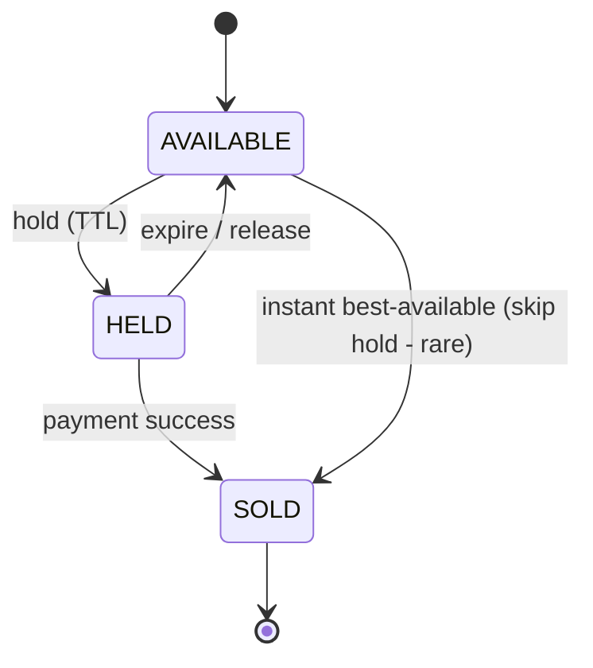

#### Locking strategies

| Strategy | Mechanism | Use case |
|---|---|---|
| **Redis SET NX per seat** | `SET seat:evt:A-12-4 hold_id NX EX 480` | Fast, per-event |
| **Lua script atomic multi-seat** | All-or-nothing hold | Adjacent seat pairs |
| **Optimistic versioning** | `UPDATE ... WHERE version=N` | DB-backed inventory |
| **In-memory actor per event** | Single-threaded event processor | Ultra-hot events |

#### Multi-seat atomic hold (Lua pseudocode)

```lua
-- KEYS: seat keys; ARGV: hold_id, ttl
for i, key in ipairs(KEYS) do
  if redis.call('GET', key) ~= false then
    -- rollback any partial
    return 0
  end
end
for i, key in ipairs(KEYS) do
  redis.call('SET', key, ARGV[1], 'EX', ARGV[2])
end
return 1
```

**All-or-nothing:** Prevent orphan single seat from pair request.

#### Hold TTL sweeper

- Redis EX handles expiry automatically
- On key expiry → publish `seat_available` to WS fanout
- Backup sweeper cron for DB-backed inventory

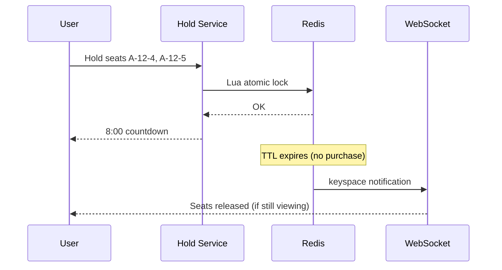

#### Prevent oversell at payment

**Two-phase commit pattern:**

1. Hold seats (HELD)
2. Payment succeeds → transition HELD → SOLD (conditional)
3. Payment fails → release hold

```sql
UPDATE inventory 
SET status='sold', order_id=?, version=version+1
WHERE seat_id=? AND event_id=? AND status='held' AND hold_id=?;
-- rows=1 success; rows=0 → abort order + refund if charged
```

**Order of operations (critical):**

```
WRONG: charge first, then try to mark sold  ← oversell risk
RIGHT: hold → charge → conditional mark sold → release hold on failure
```

#### Inventory audit

Append-only event log:

```
{event_id, seat_id, from_status, to_status, hold_id, ts, user_id}
```

Reconcile nightly: `count(SOLD) <= venue_capacity`.

---

### Deep Dive 3: Queue / Virtual Waiting Room

**Problem:** Absorb **10M concurrent** users without crushing origin; provide **fair ordering**.

#### Why a waiting room exists

Without it:

- DDoS-like self-inflicted load
- Bots race to checkout at T+0
- Humans see errors, bots win

#### Queue token design

```json
{
  "queue_token": "signed JWT or opaque ID",
  "event_id": "evt_456",
  "enqueue_ts": 1710000000,
  "shard_id": 42,
  "random_rank": 0.7312
}
```

**Ordering key:**

```
priority = (enqueue_ts, random_rank)
```

Random rank **within same millisecond** prevents bot advantage from faster clocks.

#### Data structures

| Structure | Purpose |
|---|---|
| Redis Sorted Set | `ZADD queue:evt456 priority token` |
| Hash | token → metadata (user agent hash, ip bucket) |
| Counter | admitted_count |

**Lightweight status poll:**

```
ZRANK queue:evt456 token → position
```

O(log N) — acceptable at 10M with sharding.

#### Queue sharding

```
shard_id = hash(user_id) % NUM_SHARDS
```

10 shards × 1M users each — parallel admission controllers.

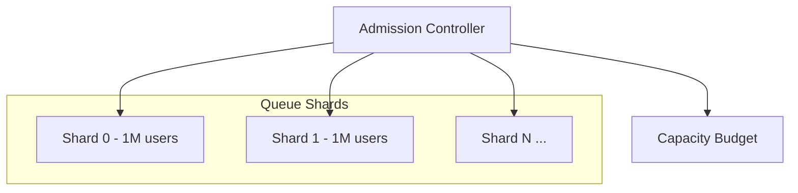

#### Admission controller

Runs every 1–5 seconds:

```
while capacity_available and queue_not_empty:
  token = pop_lowest_rank()
  issue_shop_session(token, ttl=30min)
  increment_admitted
```

Shop session JWT scopes API access:

- Can call `/seats`, `/holds`, `/orders`
- Without token → 403

#### Edge waiting room (Cloudflare / Akamai pattern)

- Serve **static waiting room HTML** from edge
- Only refresh queue position via lightweight API
- Origin never serves 10M full page loads

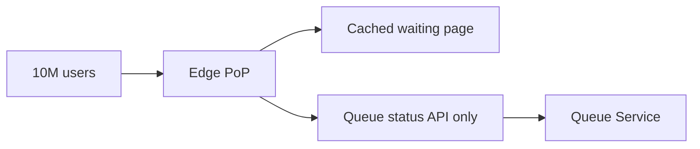

#### UX considerations

- Show **honest** wait estimates (even if long)
- Jitter refresh intervals (avoid thundering herd on status poll)
- WebSocket upgrade when admitted (instant redirect)

#### Post-admission idle timeout

Shop session expires in 30 min if no hold created — return seat at admission slot to queue.

---

### Deep Dive 4: Preventing Bots

**Problem:** Scalpers deploy farms of bots to hoard inventory; destroys fan trust and may violate law (BOTS Act in US).

#### Defense layers

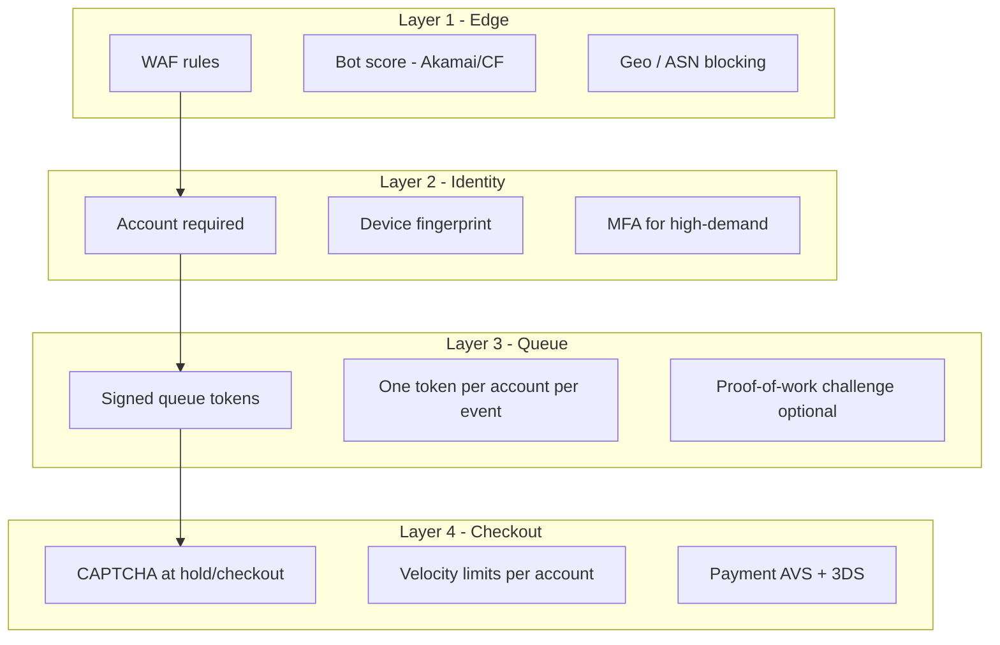

#### Techniques detail

| Technique | Description | Effectiveness |
|---|---|---|
| **Queue token binding** | Token tied to account + device hash | High |
| **Signed URLs** | HMAC on API requests with session | Medium |
| **Proof-of-work** | Client computes hash puzzle before join | Medium (UX cost) |
| **CAPTCHA** | hCaptcha/reCAPTCHA at admission or checkout | Medium |
| **Rate limiting** | Per IP / account / fingerprint | Medium |
| **Honeypot fields** | Hidden form fields bots fill | Low-Medium |
| **Behavioral biometrics** | Mouse/keyboard patterns | Medium |
| **Purchase limits** | Max 4–8 tickets per account | High for scalping |
| **Delayed barcode** | QR visible 24h before event | Reduces resale value |
| **Non-transferable tickets** | Identity at door | Policy, not tech alone |

#### Fan verification (Verified Fan model)

Pre-onsale registration:

1. Register phone/email weeks ahead
2. ML + manual filter bot patterns
3. Approved fans get **unique presale code**
4. Smaller queue on onsale day

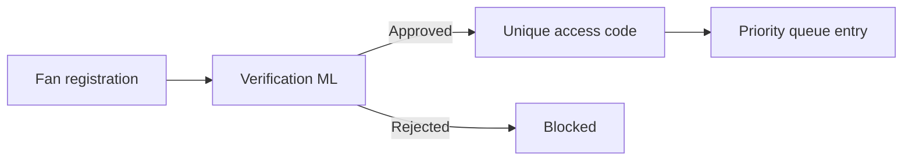

#### Bot detection signals

- Same payment card across 100 accounts
- Identical hold patterns (always same section)
- Inhuman request timing (exact ms intervals)
- Datacenter IP ranges
- Headless browser fingerprints

#### Legal / product note

- BOTS Act prohibits circumventing access controls on ticket events
- Transparency with fans about anti-bot measures builds trust

---

### Deep Dive 5: Seat Selection

**Problem:** Serve interactive **seat map** with live availability for 60K seats; support zoom, section pick, individual seats, accessibility filters.

#### Seat map data model

```json
{
  "venue_id": "msg_nyc",
  "sections": [
    {
      "section_id": "A",
      "name": "Floor A",
      "bounds": { "x": 0, "y": 0, "w": 400, "h": 300 },
      "rows": [
        {
          "row_id": "12",
          "seats": [
            { "seat_id": "A-12-4", "x": 120, "y": 85, "tier": "VIP", "price": 35000,
              "attrs": ["aisle", "wheelchair"] }
          ]
        }
      ]
    }
  ]
}
```

**Static geometry** (SVG paths) cached on CDN; **dynamic availability** overlaid.

#### Availability overlay strategies

| Strategy | Bandwidth | Freshness |
|---|---|---|
| **Full map poll** | High | Simple |
| **Section bitmap** | Medium | Good |
| **Delta push via WS** | Low | Best UX |
| **Section-level cache** | Low | Good enough |

**Recommended:** CDN cache static map + WebSocket delta updates per section.

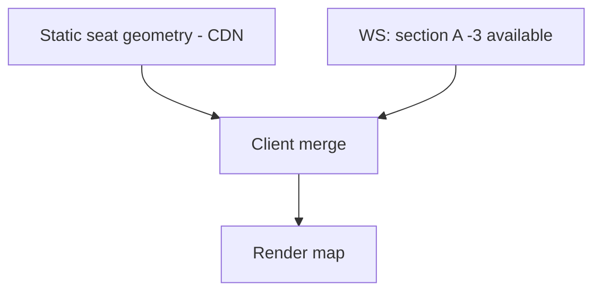

#### Availability encoding

Compact bitmap per section:

```
section:A:availability = base64( bit per seat: 1=available, 0=held/sold )
60K bits ≈ 7.5 KB raw — gzip tiny
```

Or **run-length encoding** for sparse sold sections.

#### Seat selection interaction flow

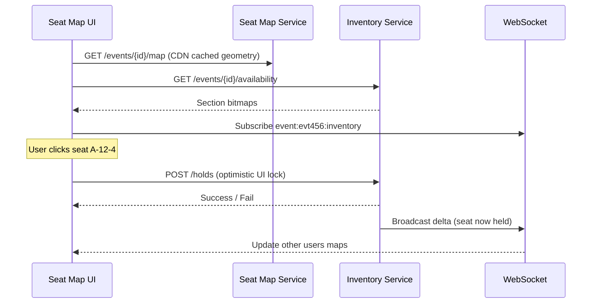

#### Best Available (BA) mode

When user skips map:

```
findBestSeats(event_id, quantity, tier_preference):
  1. Query available contiguous runs (graph adjacency)
  2. Score by view quality + price
  3. Atomic hold top result
```

**Contiguous seat algorithm:**

- Precompute adjacency graph at venue ingest
- Index available runs in section-row sorted order
- Lock N adjacent in one Lua script

#### Accessibility & filters

- Seat attributes indexed: wheelchair, aisle, obstructed view
- Filter before display — don't show unavailable ADA seats to wrong queries

#### Client-side performance

- Canvas/WebGL for 60K seats (not 60K DOM nodes)
- Level-of-detail: section overview → zoom to row → seat pins
- Optimistic UI with server confirmation rollback

---

## Capacity & Sizing

### Queue tier

| Resource | Sizing |
|---|---|
| Redis sorted sets | 10M × 500B ≈ 5 GB + overhead; cluster with 10 shards |
| Queue API | 10M × 1 poll/30s ≈ 333K QPS — edge-cache + WS reduces |
| Admission controller | Stateless; few workers per event |

### Inventory tier

| Resource | Sizing |
|---|---|
| Per-event memory | 60K seats × 100B ≈ 6 MB — single Redis instance OK |
| Hold writes | 500/sec — trivial |
| Seat map CDN | Static JSON/SVG; global edge |

### Pre-warming checklist

- [ ] Scale Redis cluster for event
- [ ] Pre-load inventory into memory at T-15 min
- [ ] Warm seat map CDN cache
- [ ] Load test admission rate controller
- [ ] Runbook for sellout + queue drain

```mermaid
gantt
    title Onsale Day Timeline
    dateFormat HH:mm
    section Prep
    Pre-warm inventory     :a1, 09:30, 15m
    CDN cache warm         :a2, 09:45, 15m
    section Onsale
    Queue open             :b1, 10:00, 60m
    Admission waves        :b2, 10:00, 45m
    Sellout                :milestone, 10:05, 0m
    section Post
    Queue drain            :c1, 10:05, 30m
```

---

## Failure Modes & Resilience

| Failure | Impact | Mitigation |
|---|---|---|
| Redis inventory down | Cannot sell | Fail closed; extend queue wait message |
| Partial hold failure | UX confusion | All-or-nothing Lua; clear error |
| Payment success, mark sold fails | Oversell risk | Conditional update + reconciliation + refund |
| Queue service overload | Join failures | Edge queue + retry with backoff |
| WS fanout lag | Stale map | Version numbers; client reconciles on action |
| Admission too aggressive | Checkout errors | Closed-loop rate control |
| Bot bypass | Fans locked out | Layered defense; verified fan presale |

### Reconciliation job

```
foreach event:
  assert count(SOLD) <= capacity
  assert no seat in both HELD and SOLD
  assert sum(GA counters) + count(assigned SOLD) == sold_total
  alert on mismatch
```

### Chaos scenarios to mention

- **Split brain:** use single primary per event inventory partition
- **Duplicate payment:** idempotency keys on order creation
- **Hold expiry during payment:** extend hold on payment submit in-flight

---

## Trade-offs Summary

| Decision | Option A | Option B | When |
|---|---|---|---|
| Queue ordering | Strict FIFO | Randomized lottery | FIFO + random tie-break for fairness |
| Inventory store | Redis in-memory | PostgreSQL | Redis for hot onsale; DB for audit |
| Seat map updates | Poll | WebSocket push | Push at scale |
| Bot defense | CAPTCHA everywhere | Verified fan presale | Presale reduces onsale CAPTCHA friction |
| Hold duration | 5 min | 10 min | Shorter = faster turnover; longer = better UX |
| Best available | Skip map | Full map | BA reduces seat map load 80%+ |
| Oversell protection | Optimistic | Hold + conditional sold | Always hold first |

---

## Common Follow-Up Questions

1. **Design resale marketplace integration.**  
   Separate inventory pool; transfer ticket token; price caps per jurisdiction.

2. **Multiple events same venue same night?**  
   Shared seat cannot overlap — inventory keyed by `(venue, seat, datetime)`.

3. **How to handle payment provider degradation?**  
   Extend holds; queue orders for async capture; communicate clearly.

4. **Platinum / dynamic pricing seats?**  
   Price tier attribute on seat; recalculate on hold (lock price in hold record).

5. **Waitlist after sellout?**  
   Canceled orders release seats → notify waitlist via priority queue.

6. **Mobile app vs web parity?**  
   Same queue token; deep link on admission; native seat map renderer.

7. **How is this different from e-commerce flash sales?**  
   Unique perishable SKUs (seats), strict anti-bot legal context, assigned inventory graph.

8. **Compare to Queue-it / virtual waiting room SaaS.**  
   Edge-hosted static room + origin admission API — discuss build vs buy.

---

## Interview Cheat Sheet

### 45-minute timeline

| Minute | Section |
|---|---|
| 0–5 | Requirements + onsale capacity math |
| 5–7 | Entities + API |
| 7–12 | HLD + traffic layering |
| 12–20 | Queue / waiting room deep dive |
| 20–28 | Inventory locking + oversell prevention |
| 28–36 | Seat map + bot prevention |
| 36–42 | Failures + pre-warming |
| 42–45 | Trade-offs + questions |

### Must-draw diagrams

1. Layered traffic defense (CDN → WAF → queue → core)
2. Onsale sequence diagram
3. Seat state machine
4. Queue admission controller loop
5. Multi-seat atomic hold flow

### Senior signals

- "10M users ≠ 10M checkout writes — queue absorbs the burst."
- "Oversell prevention is hold → pay → conditional sold, never charge-first."
- "Per-event inventory isolation prevents noisy neighbor on sellouts."
- "Random tie-break in queue ordering defeats millisecond bot racing."

### Red flags

- No waiting room for stated 10M concurrency
- Seat map full poll every second from all users
- Charging payment before inventory lock confirmed
- Global single Redis without event isolation
- Ignoring bot/abuse layer entirely

---

## Summary

Ticketmaster-scale design is a **traffic shaping** problem first and an **inventory** problem second. The **virtual waiting room** absorbs onsale bursts and enforces **fair admission** at a controlled rate. **Inventory locking** uses short TTL holds with atomic multi-seat operations and conditional SOLD transitions to guarantee **zero overselling**. **Seat maps** split static geometry (CDN) from dynamic availability (bitmaps + WebSocket deltas). **Anti-bot** layers span edge scoring, verified fan programs, queue token binding, and checkout velocity limits. Pre-warm per-event resources and run **closed-loop admission control** to keep the purchase path healthy while millions wait.
