# Design Dropbox — System Design Interview Guide

> **Level:** Senior/Staff SDE (Google, Microsoft, Meta, Dropbox)  
> **Framework:** Hello Interview Delivery Framework  
> **Estimated Interview Time:** 45–55 minutes  
> **Difficulty:** Hard (sync semantics, consistency, storage efficiency)

---

## Table of Contents

1. [Problem Statement & Scope](#1-problem-statement--scope)
2. [Requirements](#2-requirements)
3. [Capacity Estimation](#3-capacity-estimation)
4. [Core Entities](#4-core-entities)
5. [API Design](#5-api-design)
6. [Data Model / Schema](#6-data-model--schema)
7. [High-Level Architecture](#7-high-level-architecture)
8. [Deep Dives](#8-deep-dives)
9. [Trade-offs & Alternatives](#9-trade-offs--alternatives)
10. [Failure Modes & Reliability](#10-failure-modes--reliability)
11. [Interview Cheat Sheet](#11-interview-cheat-sheet)

---

## 1. Problem Statement & Scope

### The Prompt

> "Design a cloud file storage and synchronization service like Dropbox. Users can upload files, access them from multiple devices, share folders with others, and changes should sync automatically across devices."

### What Dropbox Actually Does

Dropbox is a **personal cloud storage + sync** product. The core technical challenge is not "store files in S3" — it is **keeping a distributed filesystem consistent** across laptops, phones, and the cloud while minimizing bandwidth, storage cost, and user-visible conflicts.

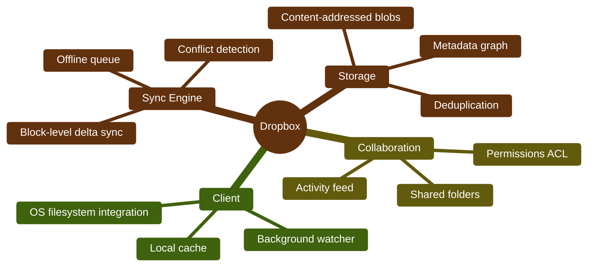
```mermaid
%%{init: {'theme': 'base', 'themeVariables': {'primaryColor': '#D2691E', 'primaryTextColor': '#ffffff', 'primaryBorderColor': '#5D2E0C', 'secondaryColor': '#D2691E', 'tertiaryColor': '#D2691E', 'lineColor': '#5D2E0C'}}}%%
mindmap
  root((Dropbox))
    Sync Engine
      Block-level delta sync
      Conflict detection
      Offline queue
    Storage
      Content-addressed blobs
      Metadata graph
      Deduplication
    Collaboration
      Shared folders
      Permissions ACL
      Activity feed
    Client
      OS filesystem integration
      Local cache
      Background watcher
```

### In Scope (Must Design)

| Area | Details |
|------|---------|
| File upload/download | Multi-GB files, resumable, delta sync |
| Cross-device sync | Laptop ↔ phone ↔ cloud within seconds |
| Folder hierarchy | Nested directories, renames, moves |
| Sharing | Read/write permissions on folders |
| Conflict resolution | Two devices edit same file offline |
| Storage efficiency | Chunking, deduplication, compression |
| Metadata vs blob | Separate hot metadata from cold blobs |

### Out of Scope (State Explicitly)

- Real-time collaborative editing (Google Docs style) — mention as extension
- Full-text search across file contents — nice-to-have only
- Version history beyond last N versions — discuss as premium feature
- End-to-end encryption for enterprise — mention trade-off
- Desktop OS kernel driver details — high-level sync agent only

### Assumptions

- 700M registered users, 100M DAU
- Average user: 50 GB stored, 2 devices
- Sync latency target: **< 5 seconds** for small file changes on good network
- Durability: **11 nines** for blob storage (S3/GCS equivalent)
- Availability: **99.95%** for metadata operations

---

## 2. Requirements

### 2.1 Functional Requirements

#### Must-Have (P0)

| ID | Requirement | Notes |
|----|-------------|-------|
| F1 | Upload files and create folder hierarchy | Unlimited nesting |
| F2 | Download files on any linked device | Full file or block range |
| F3 | Automatic sync when file changes locally | inotify/FSEvents watcher |
| F4 | Delta sync — only changed blocks uploaded | Critical for bandwidth |
| F5 | Share folders with other users | Viewer / Editor roles |
| F6 | Detect and surface sync conflicts | Never silently lose data |
| F7 | Offline edits queue and sync on reconnect | Mobile + laptop |
| F8 | File rename/move without re-uploading content | Metadata-only operation |

#### Nice-to-Have (P1)

| ID | Requirement |
|----|-------------|
| F9 | File version history (last 30 days) |
| F10 | Selective sync (exclude folders on device) |
| F11 | Smart sync (cloud-only placeholders) |
| F12 | Photo/video dedup across users (optional) |
| F13 | Link-based sharing with expiration |

### 2.2 Non-Functional Requirements

| Category | Target | Rationale |
|----------|--------|-----------|
| **Sync latency** | p95 < 5s for < 10 MB changes | User expects "instant" sync |
| **Upload throughput** | Support 100 MB/s per client | Large video files |
| **Durability** | 99.999999999% blob durability | Trust in cloud storage |
| **Availability** | 99.95% metadata API | Sync blocked if metadata down |
| **Consistency** | Per-file linearizable writes | No torn writes |
| **Storage efficiency** | 40%+ dedup savings cross-user | Block-level content addressing |
| **Bandwidth efficiency** | 90%+ reduction vs full re-upload | rsync/block diff |
| **Security** | TLS in transit, AES-256 at rest | Baseline expectation |

### 2.3 Requirements Summary Diagram

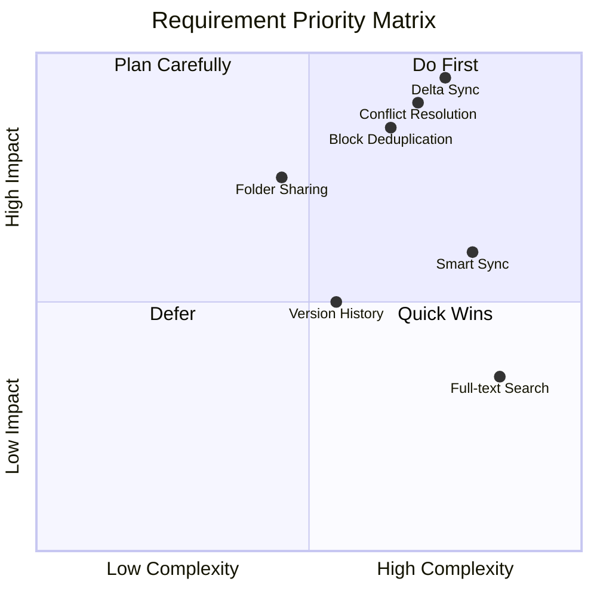
```mermaid
quadrantChart
    title Requirement Priority Matrix
    x-axis Low Complexity --> High Complexity
    y-axis Low Impact --> High Impact
    quadrant-1 Do First
    quadrant-2 Plan Carefully
    quadrant-3 Defer
    quadrant-4 Quick Wins
    Delta Sync: [0.75, 0.95]
    Conflict Resolution: [0.70, 0.90]
    Block Deduplication: [0.65, 0.85]
    Folder Sharing: [0.45, 0.75]
    Version History: [0.55, 0.50]
    Smart Sync: [0.80, 0.60]
    Full-text Search: [0.85, 0.35]
```

---

## 3. Capacity Estimation

### 3.1 User & Traffic Assumptions

```
Registered users:     700M
DAU:                  100M  (14%)
Devices per user:     2.3 average
Files per user:       ~8,000
Average file size:    6 MB
Total stored/user:    50 GB
```

### 3.2 Storage

```
Total user data:      700M × 50 GB = 35 EB logical
Deduplication ratio:  1.4× (cross-user block dedup)
Physical storage:     35 / 1.4 ≈ 25 EB

Metadata per file:    ~2 KB (path, ACL, block list, timestamps)
Total metadata:       700M × 8000 × 2KB = 11 PB metadata

Block size:           4 MB (configurable 1–8 MB)
Blocks per file:      avg 1.5 blocks (many small files)
Total unique blocks:  ~4 × 10^12 blocks
```

### 3.3 Bandwidth & QPS

```
Sync events/DAU/day:  50 (file save, rename, etc.)
Sync write QPS:       100M × 50 / 86400 ≈ 58,000 QPS
                      Peak (3×): ~175,000 QPS

Block upload QPS:     58K × 0.3 (30% involve new blocks) ≈ 17,500 QPS
Block download QPS:   58K × 0.5 ≈ 29,000 QPS

Upload bandwidth:     17.5K × 4MB = 70 GB/s peak ingress
Download bandwidth:   29K × 4MB = 116 GB/s peak egress
CDN/cache hit rate:   60% → 46 GB/s origin egress
```

### 3.4 Metadata Database

```
Metadata writes/sec:  175K peak (every sync touches metadata)
Metadata reads/sec:   350K peak (list dir + poll for changes)
Metadata storage:     11 PB → sharded SQL + NoSQL hybrid
```

### 3.5 Back-of-Envelope Summary

| Resource | Estimate |
|----------|----------|
| Physical blob storage | ~25 EB |
| Metadata storage | ~11 PB |
| Peak metadata QPS | ~350K read, ~175K write |
| Peak blob ingress | ~70 GB/s |
| Peak blob egress (origin) | ~46 GB/s |
| Block index entries | ~4 trillion |

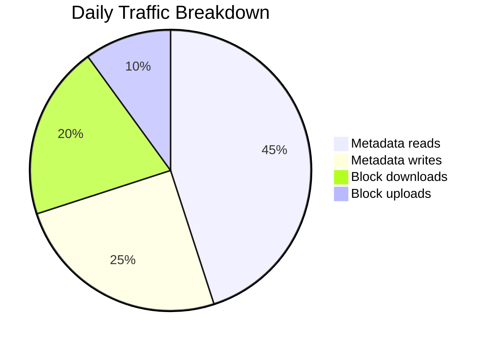
```mermaid
pie title Daily Traffic Breakdown
    "Metadata reads" : 45
    "Metadata writes" : 25
    "Block downloads" : 20
    "Block uploads" : 10
```

---

## 4. Core Entities

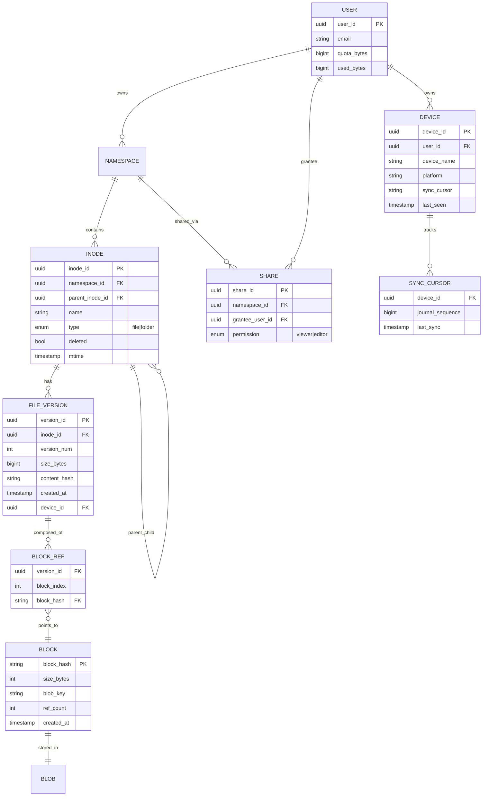
```mermaid
erDiagram
    USER ||--o{ DEVICE : owns
    USER ||--o{ NAMESPACE : owns
    NAMESPACE ||--o{ INODE : contains
    INODE ||--o{ INODE : parent_child
    INODE ||--o{ FILE_VERSION : has
    FILE_VERSION ||--o{ BLOCK_REF : composed_of
    BLOCK_REF }o--|| BLOCK : points_to
    BLOCK ||--|| BLOB : stored_in
    NAMESPACE ||--o{ SHARE : shared_via
    SHARE }o--|| USER : grantee
    DEVICE ||--o{ SYNC_CURSOR : tracks

    USER {
        uuid user_id PK
        string email
        bigint quota_bytes
        bigint used_bytes
    }

    DEVICE {
        uuid device_id PK
        uuid user_id FK
        string device_name
        string platform
        string sync_cursor
        timestamp last_seen
    }

    INODE {
        uuid inode_id PK
        uuid namespace_id FK
        uuid parent_inode_id FK
        string name
        enum type "file|folder"
        bool deleted
        timestamp mtime
    }

    FILE_VERSION {
        uuid version_id PK
        uuid inode_id FK
        int version_num
        bigint size_bytes
        string content_hash
        timestamp created_at
        uuid device_id FK
    }

    BLOCK {
        string block_hash PK
        int size_bytes
        string blob_key
        int ref_count
        timestamp created_at
    }

    BLOCK_REF {
        uuid version_id FK
        int block_index
        string block_hash FK
    }

    SHARE {
        uuid share_id PK
        uuid namespace_id FK
        uuid grantee_user_id FK
        enum permission "viewer|editor"
    }

    SYNC_CURSOR {
        uuid device_id FK
        bigint journal_sequence
        timestamp last_sync
    }
```

### Entity Descriptions

| Entity | Purpose |
|--------|---------|
| **Namespace** | Root container per user (or team); isolates file trees |
| **Inode** | File or folder node in hierarchy; rename = update inode metadata |
| **File Version** | Immutable snapshot of file content at a point in time |
| **Block** | Content-addressed chunk (hash = identity); enables dedup |
| **Block Ref** | Ordered list linking a version to its blocks |
| **Sync Cursor** | Per-device pointer into the sync journal (what device has seen) |
| **Share** | ACL entry granting another user access to a namespace/subtree |

---

## 5. API Design

### 5.1 Client Sync Protocol (Core)

Dropbox's real power is the **sync protocol**, not REST CRUD. Design a **journal-based delta API**.

#### `POST /v2/sync/poll` — Long-polling for changes

**Request:**
```json
{
  "device_id": "d_abc123",
  "namespace_id": "ns_user456",
  "cursor": "journal_seq_9283746",
  "timeout_ms": 30000
}
```

**Response:**
```json
{
  "cursor": "journal_seq_9283799",
  "changes": [
    {
      "type": "FILE_MODIFIED",
      "inode_id": "ino_789",
      "path": "/Documents/report.docx",
      "version_id": "ver_102",
      "content_hash": "sha256:abc...",
      "size_bytes": 2457600,
      "mtime": "2026-07-08T09:15:00Z",
      "block_hashes": ["blk_hash_1", "blk_hash_2"]
    },
    {
      "type": "FILE_DELETED",
      "inode_id": "ino_456",
      "path": "/tmp/old.txt"
    }
  ],
  "has_more": false
}
```

#### `POST /v2/blocks/upload` — Upload content-addressed block

**Request:** Binary body with headers:
```
X-Block-Hash: sha256:7f3a9b...
X-Block-Size: 4194304
Content-Encoding: zstd
```

**Response:**
```json
{
  "block_hash": "sha256:7f3a9b...",
  "status": "stored",
  "deduplicated": false
}
```

If block already exists (dedup hit):
```json
{
  "block_hash": "sha256:7f3a9b...",
  "status": "already_exists",
  "deduplicated": true
}
```

#### `POST /v2/files/commit` — Commit file version (metadata only)

**Request:**
```json
{
  "device_id": "d_abc123",
  "namespace_id": "ns_user456",
  "inode_id": "ino_789",
  "parent_inode_id": "ino_100",
  "name": "report.docx",
  "content_hash": "sha256:composite...",
  "size_bytes": 2457600,
  "block_hashes": ["sha256:blk1", "sha256:blk2"],
  "base_version_id": "ver_101",
  "mtime": "2026-07-08T09:15:00Z"
}
```

**Response (success):**
```json
{
  "version_id": "ver_102",
  "status": "committed"
}
```

**Response (conflict):**
```json
{
  "status": "conflict",
  "server_version_id": "ver_103",
  "server_content_hash": "sha256:server...",
  "conflict_strategy": "both_files_kept"
}
```

### 5.2 Standard REST Endpoints

| Method | Endpoint | Description |
|--------|----------|-------------|
| `GET` | `/v2/files/list` | List directory children |
| `GET` | `/v2/files/download` | Download full file (redirect to blob CDN) |
| `GET` | `/v2/blocks/download/{hash}` | Download single block |
| `POST` | `/v2/shares/create` | Share folder with user |
| `DELETE` | `/v2/shares/revoke` | Revoke share |
| `GET` | `/v2/account/usage` | Quota and usage stats |
| `POST` | `/v2/files/move` | Move/rename (metadata only) |

### 5.3 API Flow Overview

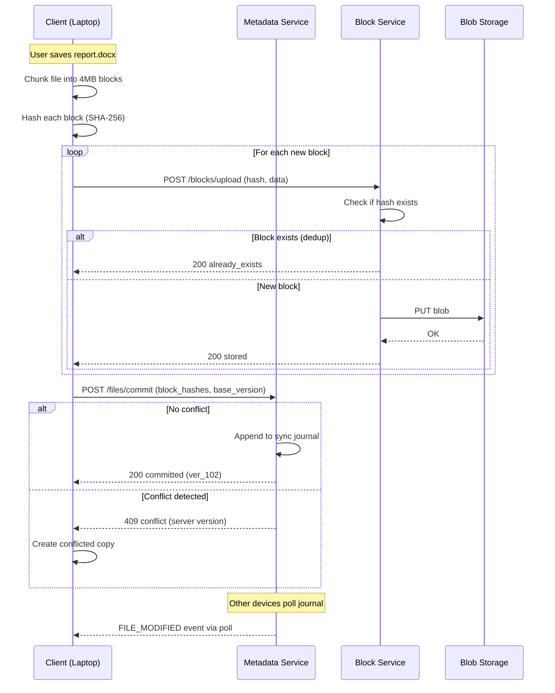
```mermaid
sequenceDiagram
    participant C as Client (Laptop)
    participant M as Metadata Service
    participant B as Block Service
    participant S as Blob Storage

    Note over C: User saves report.docx
    C->>C: Chunk file into 4MB blocks
    C->>C: Hash each block (SHA-256)

    loop For each new block
        C->>B: POST /blocks/upload (hash, data)
        B->>B: Check if hash exists
        alt Block exists (dedup)
            B-->>C: 200 already_exists
        else New block
            B->>S: PUT blob
            S-->>B: OK
            B-->>C: 200 stored
        end
    end

    C->>M: POST /files/commit (block_hashes, base_version)
    alt No conflict
        M->>M: Append to sync journal
        M-->>C: 200 committed (ver_102)
    else Conflict detected
        M-->>C: 409 conflict (server version)
        C->>C: Create conflicted copy
    end

    Note over M: Other devices poll journal
    M-->>C: FILE_MODIFIED event via poll
```

---

## 6. Data Model / Schema

### 6.1 Metadata Store (Hot Path)

Use a **sharded transactional store** (Spanner/CockroachDB or sharded MySQL) for inodes and versions.

```sql
-- Sharded by namespace_id
CREATE TABLE inodes (
    inode_id        UUID PRIMARY KEY,
    namespace_id    UUID NOT NULL,
    parent_inode_id UUID,
    name            VARCHAR(255) NOT NULL,
    type            ENUM('file', 'folder'),
    is_deleted      BOOLEAN DEFAULT FALSE,
    mtime           TIMESTAMP,
    INDEX idx_parent (namespace_id, parent_inode_id, name)
);

CREATE TABLE file_versions (
    version_id      UUID PRIMARY KEY,
    inode_id        UUID NOT NULL,
    version_num     INT NOT NULL,
    size_bytes      BIGINT,
    content_hash    CHAR(64) NOT NULL,
    device_id       UUID,
    created_at      TIMESTAMP DEFAULT NOW(),
    is_head         BOOLEAN DEFAULT TRUE,
    UNIQUE (inode_id, version_num)
);

CREATE TABLE block_refs (
    version_id      UUID NOT NULL,
    block_index     INT NOT NULL,
    block_hash      CHAR(64) NOT NULL,
    PRIMARY KEY (version_id, block_index)
);
```

### 6.2 Sync Journal (Change Log)

Append-only log per namespace — the backbone of sync.

```sql
CREATE TABLE sync_journal (
    sequence_id     BIGINT AUTO_INCREMENT,
    namespace_id    UUID NOT NULL,
    event_type      VARCHAR(32),
    inode_id        UUID,
    payload         JSON,
    created_at      TIMESTAMP DEFAULT NOW(),
    PRIMARY KEY (namespace_id, sequence_id)
);
```

### 6.3 Block Index (Deduplication Catalog)

```sql
CREATE TABLE blocks (
    block_hash      CHAR(64) PRIMARY KEY,
    size_bytes      INT NOT NULL,
    blob_key        VARCHAR(256) NOT NULL,
    ref_count       BIGINT DEFAULT 1,
    storage_tier    ENUM('hot', 'warm', 'cold'),
    created_at      TIMESTAMP DEFAULT NOW()
);
```

### 6.4 Blob Storage Layout

```
s3://dropbox-blobs/
  ab/
    cd/
      abcd1234...5678   # Full SHA-256 hash as key
```

Content-addressed: the hash **is** the identity. Immutable blobs never updated in place.

### 6.5 Metadata vs Blob Separation

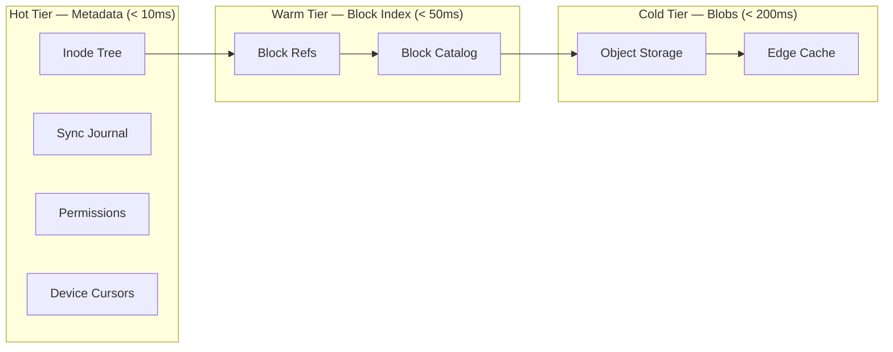
```mermaid
flowchart LR
    subgraph Hot["Hot Tier — Metadata (< 10ms)"]
        INODES[Inode Tree]
        JOURNAL[Sync Journal]
        ACL[Permissions]
        CURSORS[Device Cursors]
    end

    subgraph Warm["Warm Tier — Block Index (< 50ms)"]
        BLOCKS[Block Catalog]
        REFS[Block Refs]
    end

    subgraph Cold["Cold Tier — Blobs (< 200ms)"]
        S3[Object Storage]
        CDN[Edge Cache]
    end

    INODES --> REFS
    REFS --> BLOCKS
    BLOCKS --> S3
    S3 --> CDN
```

**Why separate?**
- Metadata is small, latency-sensitive, transactional, frequently updated
- Blobs are huge, immutable, content-addressed, served via CDN
- Different scaling profiles: metadata = OLTP; blobs = throughput

---

## 7. High-Level Architecture

### 7.1 System Architecture

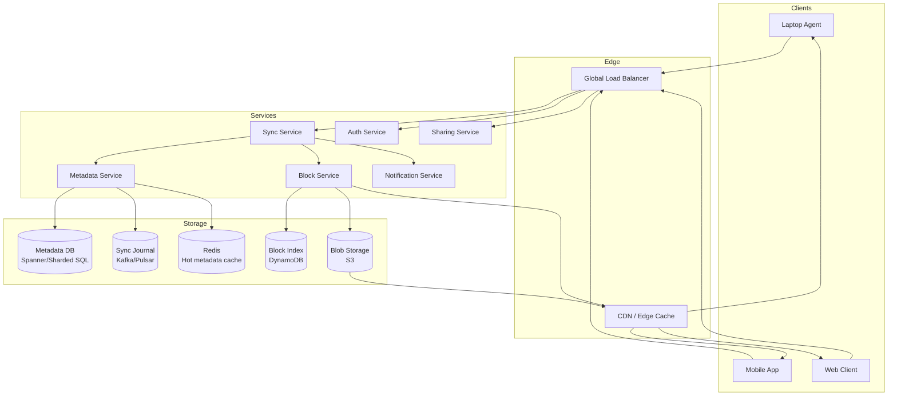
```mermaid
flowchart TB
    subgraph Clients
        LAPTOP[Laptop Agent]
        PHONE[Mobile App]
        WEB[Web Client]
    end

    subgraph Edge
        LB[Global Load Balancer]
        CDN[CDN / Edge Cache]
    end

    subgraph Services
        SYNC[Sync Service]
        META[Metadata Service]
        BLOCK[Block Service]
        AUTH[Auth Service]
        SHARE[Sharing Service]
        NOTIF[Notification Service]
    end

    subgraph Storage
        METADB[(Metadata DB<br/>Spanner/Sharded SQL)]
        JOURNAL[(Sync Journal<br/>Kafka/Pulsar)]
        BLOCKIDX[(Block Index<br/>DynamoDB)]
        BLOB[(Blob Storage<br/>S3)]
        CACHE[(Redis<br/>Hot metadata cache)]
    end

    LAPTOP & PHONE & WEB --> LB
    LB --> SYNC & AUTH & SHARE
    SYNC --> META & BLOCK & NOTIF
    META --> METADB & JOURNAL & CACHE
    BLOCK --> BLOCKIDX & BLOB
    BLOB --> CDN
    CDN --> LAPTOP & PHONE & WEB
    BLOCK --> CDN
```

### 7.2 Sync Data Flow

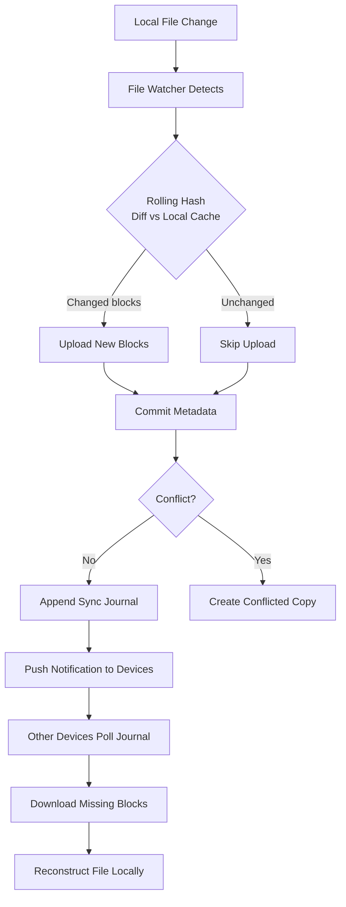
```mermaid
flowchart TD
    A[Local File Change] --> B[File Watcher Detects]
    B --> C{Rolling Hash<br/>Diff vs Local Cache}
    C -->|Changed blocks| D[Upload New Blocks]
    C -->|Unchanged| E[Skip Upload]
    D --> F[Commit Metadata]
    E --> F
    F --> G{Conflict?}
    G -->|No| H[Append Sync Journal]
    G -->|Yes| I[Create Conflicted Copy]
    H --> J[Push Notification to Devices]
    J --> K[Other Devices Poll Journal]
    K --> L[Download Missing Blocks]
    L --> M[Reconstruct File Locally]
```

### 7.3 Block Upload Pipeline

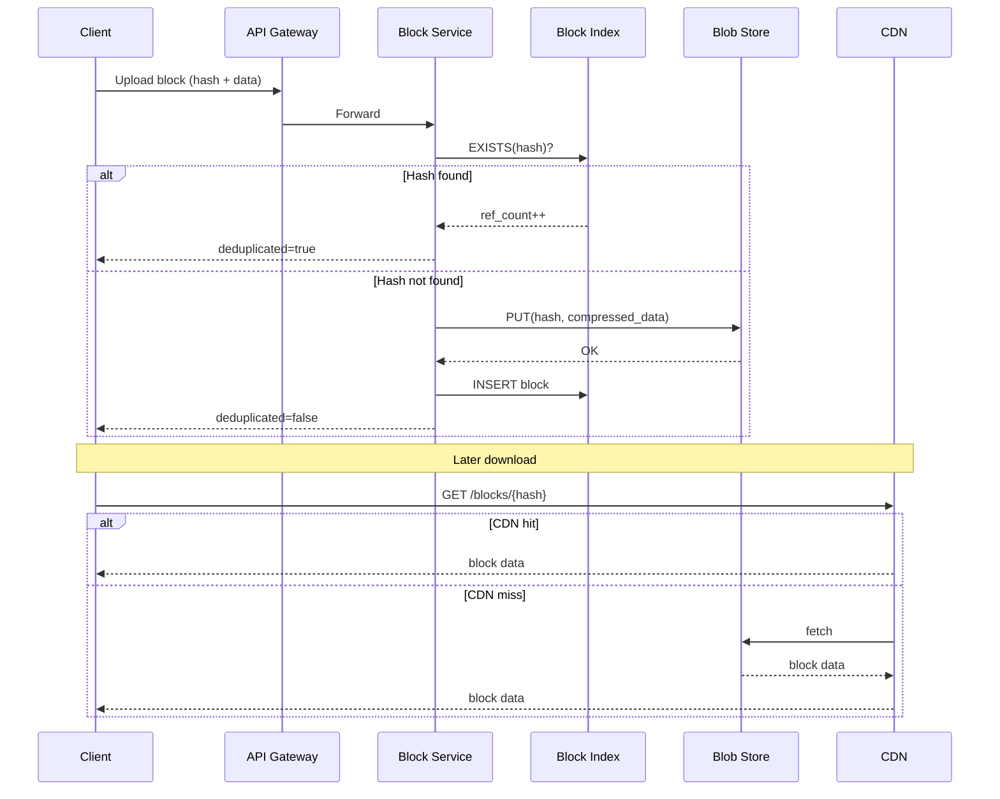
```mermaid
sequenceDiagram
    participant Client
    participant API Gateway
    participant Block Service
    participant Block Index
    participant Blob Store
    participant CDN

    Client->>API Gateway: Upload block (hash + data)
    API Gateway->>Block Service: Forward
    Block Service->>Block Index: EXISTS(hash)?

    alt Hash found
        Block Index-->>Block Service: ref_count++
        Block Service-->>Client: deduplicated=true
    else Hash not found
        Block Service->>Blob Store: PUT(hash, compressed_data)
        Blob Store-->>Block Service: OK
        Block Service->>Block Index: INSERT block
        Block Service-->>Client: deduplicated=false
    end

    Note over Client,CDN: Later download
    Client->>CDN: GET /blocks/{hash}
    alt CDN hit
        CDN-->>Client: block data
    else CDN miss
        CDN->>Blob Store: fetch
        Blob Store-->>CDN: block data
        CDN-->>Client: block data
    end
```

### 7.4 Multi-Device Sync Topology

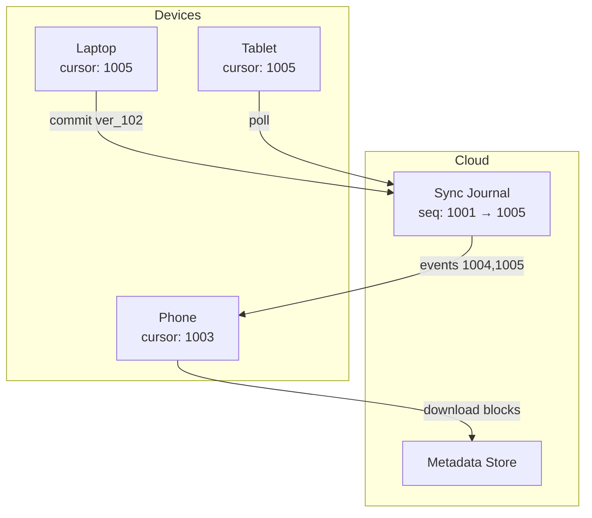
```mermaid
graph TB
    subgraph Cloud
        JOURNAL[Sync Journal<br/>seq: 1001 → 1005]
        META[Metadata Store]
    end

    subgraph Devices
        D1[Laptop<br/>cursor: 1005]
        D2[Phone<br/>cursor: 1003]
        D3[Tablet<br/>cursor: 1005]
    end

    D1 -->|commit ver_102| JOURNAL
    JOURNAL -->|events 1004,1005| D2
    D2 -->|download blocks| META
    D3 -->|poll| JOURNAL
```

---

## 8. Deep Dives

### 8.1 Deep Dive #1: Block-Level Chunking & Delta Sync

#### Why Block-Level (Not File-Level)?

| Approach | 1 KB change in 1 GB file | Dedup | Complexity |
|----------|--------------------------|-------|------------|
| File-level | Re-upload 1 GB | None | Low |
| Fixed 4 MB blocks | Upload 4 MB | Per-block | Medium |
| rsync rolling hash | Upload ~1 KB | Per-block | High (client CPU) |

**Dropbox approach:** Fixed-size blocks (4 MB) with SHA-256 content addressing + rsync-style rolling hash for diff detection on client.

#### Chunking Algorithm

```
1. Split file into 4 MB fixed blocks (last block may be smaller)
2. Compute SHA-256 of each block → block_hash
3. Compute composite content_hash = SHA-256(block_hash_1 || block_hash_2 || ...)
4. Compare block_hashes with last known version
5. Upload only blocks whose hash is not on server
```

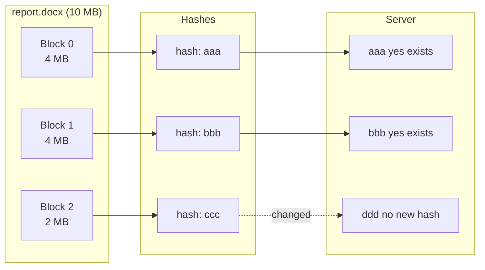
```mermaid
flowchart LR
    subgraph File["report.docx (10 MB)"]
        B0[Block 0<br/>4 MB]
        B1[Block 1<br/>4 MB]
        B2[Block 2<br/>2 MB]
    end

    subgraph Hashes
        H0["hash: aaa"]
        H1["hash: bbb"]
        H2["hash: ccc"]
    end

    B0 --> H0
    B1 --> H1
    B2 --> H2

    subgraph Server
        S0["aaa yes exists"]
        S1["bbb yes exists"]
        S2["ddd no new hash"]
    end

    H0 --> S0
    H1 --> S1
    H2 -.->|changed| S2
```

#### Rolling Hash for Local Diff (rsync-style)

Before chunking, client uses **Rabin fingerprinting** or **rsync rolling checksum** to find byte ranges that changed within a block, avoiding re-hashing entire 4 MB blocks for small edits.

```
Adler-32 rolling window (size=48 bytes):
  - Slide window byte-by-byte across file
  - O(1) update per byte shift
  - Detect changed regions without full re-read
```

**Interview talking point:** "We use a two-level diff: rolling hash finds changed regions cheaply, then we re-chunk only affected blocks for upload."

### 8.2 Deep Dive #2: Content-Addressed Deduplication

#### Intra-User Dedup

User uploads same photo on laptop and phone → same block hashes → upload skipped on second device.

#### Cross-User Dedup

Two users upload the same popular PDF → stored once, `ref_count = 2`.

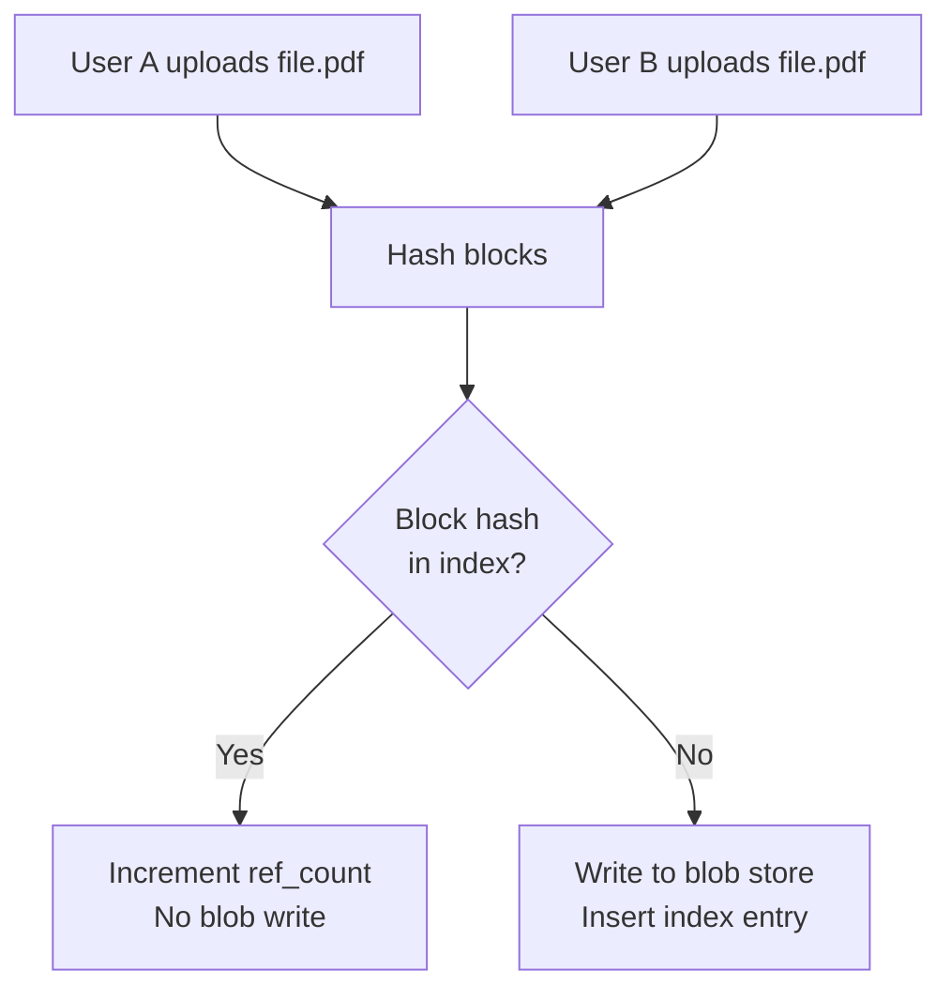
```mermaid
flowchart TD
    U1[User A uploads file.pdf] --> H[Hash blocks]
    U2[User B uploads file.pdf] --> H
    H --> CHECK{Block hash<br/>in index?}
    CHECK -->|Yes| INC[Increment ref_count<br/>No blob write]
    CHECK -->|No| STORE[Write to blob store<br/>Insert index entry]
```

#### Security Consideration: Side-Channel Leakage

Cross-user dedup reveals "this file exists on Dropbox" if attacker can probe hash existence.

**Mitigations:**
- **Per-user encryption keys** break cross-user dedup (enterprise mode)
- **Convergent encryption** (hash key derived from content) — dedup within security boundary
- **Rate-limit hash existence checks**
- Interview answer: "We dedup within a trust zone; E2E encryption trades dedup for privacy"

#### Garbage Collection

```
When file deleted:
  1. Remove block_refs for that version
  2. Decrement ref_count for each block
  3. If ref_count == 0 → mark for GC
  4. Async GC job deletes blob after 7-day grace period
```

### 8.3 Deep Dive #3: Conflict Resolution

#### The Problem

```
T=0:  Both devices have report.docx (version 5)
T=1:  Laptop goes offline, edits file → local version 6
T=2:  Phone edits same file online → commits version 6 to server
T=3:  Laptop comes online, tries to commit version 6
      → CONFLICT: base_version 5 ≠ server head version 6
```

#### Strategy: Last-Writer-Wins + Conflicted Copy (Dropbox Default)

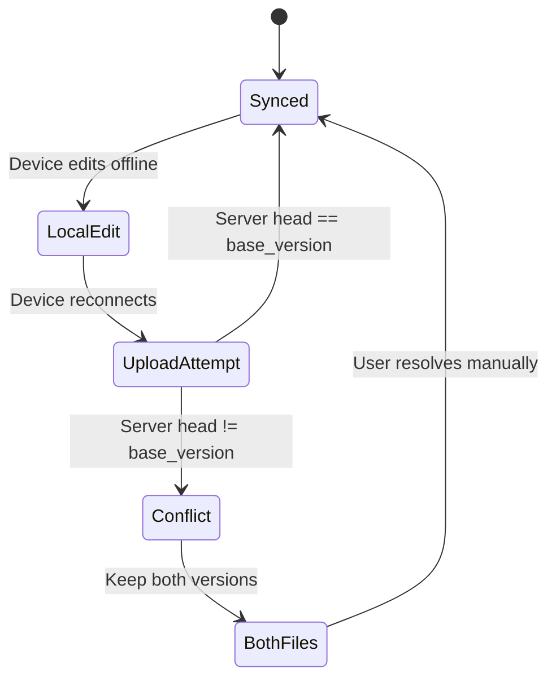
```mermaid
stateDiagram-v2
    [*] --> Synced
    Synced --> LocalEdit: Device edits offline
    LocalEdit --> UploadAttempt: Device reconnects
    UploadAttempt --> Synced: Server head == base_version
    UploadAttempt --> Conflict: Server head != base_version
    Conflict --> BothFiles: Keep both versions
    BothFiles --> Synced: User resolves manually
```

**On conflict:**
1. Server rejects commit with `409 conflict`
2. Client uploads its version as `report (conflicted copy 2026-07-08).docx`
3. Server version remains `report.docx`
4. User manually merges

#### Alternative Strategies (Discuss in Interview)

| Strategy | Pros | Cons |
|----------|------|------|
| Last-writer-wins (silent) | Simple | Data loss |
| Conflicted copy (Dropbox) | No data loss | User cleanup burden |
| Operational Transform | Real-time merge | Extreme complexity |
| Lock file | Prevents conflict | Blocks parallel edits |
| Vector clocks | Causal ordering | Hard for users to understand |

#### Optimistic Concurrency Control

```sql
-- Commit only if head version matches
UPDATE file_versions SET is_head = FALSE WHERE inode_id = ? AND is_head = TRUE;
INSERT INTO file_versions (...) VALUES (...);
-- If affected_rows for UPDATE != 1 → conflict
```

### 8.4 Deep Dive #4: Metadata vs Blob Storage Architecture

#### Why Not Store Everything in One Database?

| Concern | Metadata | Blobs |
|---------|----------|-------|
| Size per object | ~2 KB | 4 MB – 50 GB |
| Access pattern | Random, transactional | Sequential, streaming |
| Update frequency | Every sync event | Write-once, never update |
| Query needs | Path lookup, ACL, listing | None (hash lookup only) |
| Scaling | Vertical + shard | Horizontal object store |

#### Metadata Service Responsibilities

- Maintain inode tree per namespace
- Enforce ACL on every operation
- Append events to sync journal
- Track per-device sync cursors
- Resolve path → inode_id

#### Block Service Responsibilities

- Accept block uploads (idempotent by hash)
- Manage block index and ref counts
- Serve block downloads (via CDN)
- Run garbage collection

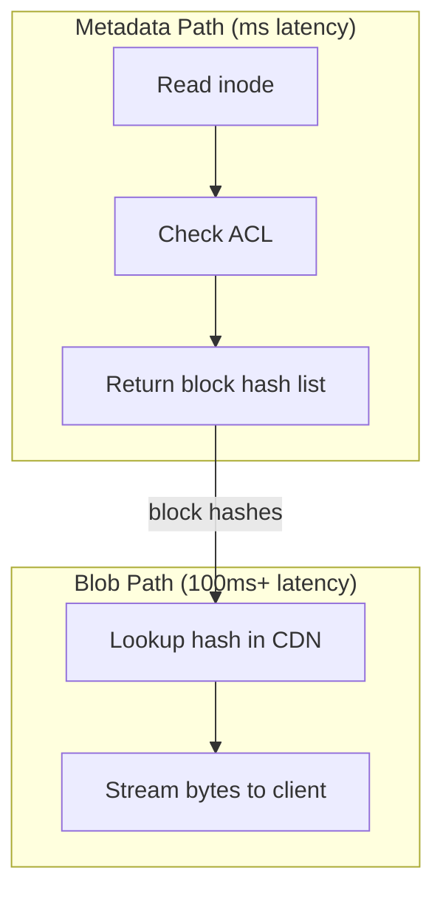
```mermaid
flowchart TB
    subgraph Metadata Path["Metadata Path (ms latency)"]
        direction LR
        R1[Read inode] --> R2[Check ACL]
        R2 --> R3[Return block hash list]
    end

    subgraph Blob Path["Blob Path (100ms+ latency)"]
        direction LR
        B1[Lookup hash in CDN] --> B2[Stream bytes to client]
    end

    R3 -->|block hashes| B1
```

### 8.5 Deep Dive #5: Sync Journal & Long Polling

#### Journal as Source of Truth

Every mutation appends an event:

```json
{
  "sequence_id": 9283799,
  "namespace_id": "ns_user456",
  "event_type": "FILE_MODIFIED",
  "inode_id": "ino_789",
  "version_id": "ver_102",
  "actor_device_id": "d_abc123",
  "timestamp": "2026-07-08T09:15:01Z"
}
```

#### Device Sync Loop

```
while true:
    changes = poll(cursor, timeout=30s)
    for change in changes:
        if change.inode not in selective_sync_exclude:
            download_missing_blocks(change.block_hashes)
            reconstruct_file(change)
    cursor = changes.new_cursor
```

#### Why Long Polling (Not Pure Push)?

| Mechanism | Pros | Cons |
|-----------|------|------|
| WebSocket push | Instant | Connection state per device (100M × 2.3 = 230M connections) |
| Short polling | Simple | Wasteful (99% empty responses) |
| Long polling | Near-instant, stateless | 30s held connections |
| Kafka + push notification | Scalable hybrid | Two delivery paths |

**Production approach:** Long polling for desktop + mobile push notification (APNs/FCM) to wake app → then poll.

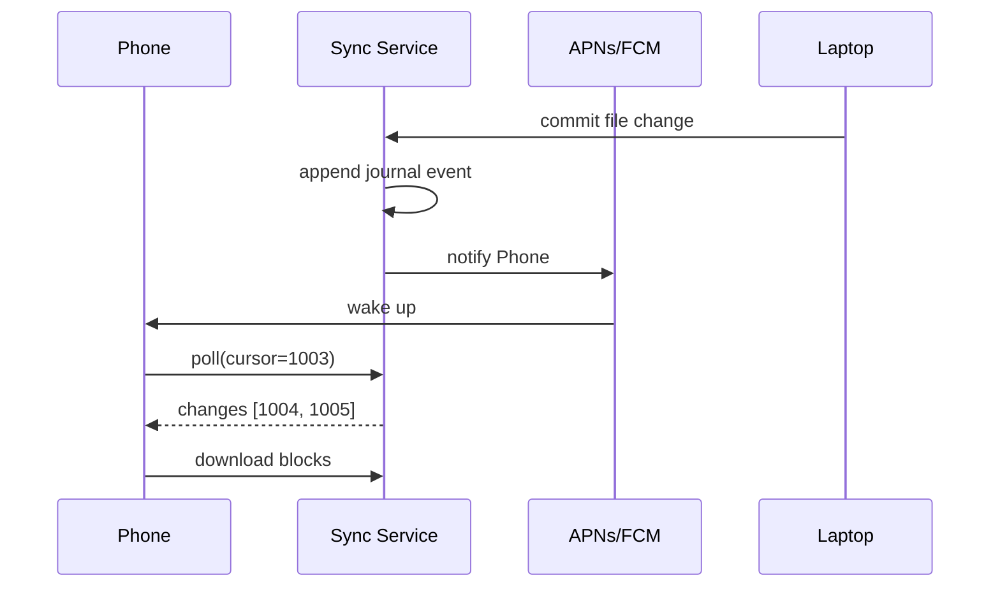
```mermaid
sequenceDiagram
    participant Phone
    participant Sync Service
    participant Push as APNs/FCM
    participant Laptop

    Laptop->>Sync Service: commit file change
    Sync Service->>Sync Service: append journal event
    Sync Service->>Push: notify Phone
    Push->>Phone: wake up
    Phone->>Sync Service: poll(cursor=1003)
    Sync Service-->>Phone: changes [1004, 1005]
    Phone->>Sync Service: download blocks
```

---

## 9. Trade-offs & Alternatives

### 9.1 Block Size Selection

| Block Size | Dedup Granularity | Metadata Overhead | Small File Waste |
|------------|-------------------|-------------------|------------------|
| 1 MB | Fine | High | Low |
| 4 MB | Balanced yes | Medium | Medium |
| 64 MB | Coarse | Low | High |

**Choice:** 4 MB — industry standard (Dropbox, Bittorrent, S3 multipart).

### 9.2 Strong vs Eventual Consistency

| Model | User Experience | Implementation |
|-------|-----------------|----------------|
| Strong per file | No torn reads | Harder cross-device |
| Eventual | Simpler | Brief inconsistency window |

**Choice:** Linearizable per inode (compare-and-swap on version) + eventual journal propagation to devices (seconds).

### 9.3 Push vs Pull Sync Model

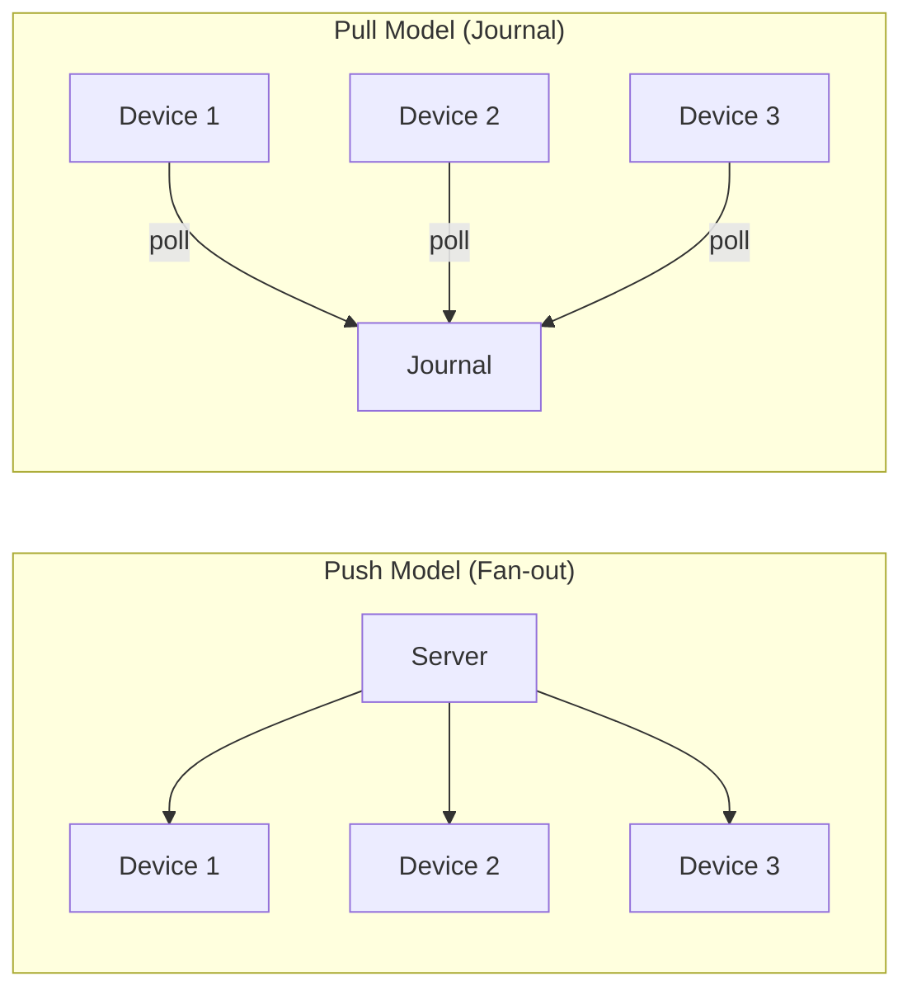
```mermaid
flowchart LR
    subgraph Push["Push Model (Fan-out)"]
        S[Server] --> D1[Device 1]
        S --> D2[Device 2]
        S --> D3[Device 3]
    end

    subgraph Pull["Pull Model (Journal)"]
        D1P[Device 1] -->|poll| J[Journal]
        D2P[Device 2] -->|poll| J
        D3P[Device 3] -->|poll| J
    end
```

**Choice:** Pull (journal) — scales better; server doesn't track per-device delivery state.

### 9.4 Architecture Alternatives

| Alternative | When to Mention |
|-------------|-----------------|
| **NFS/iSCSI cloud mount** | Lower latency but no offline |
| **Git-style object store** | Good for text, bad for binary |
| **CRDTs for metadata** | Research frontier, high complexity |
| **IPFS/content routing** | Decentralized variant |

---

## 10. Failure Modes & Reliability

### 10.1 Failure Mode Matrix

| Failure | Impact | Detection | Mitigation |
|---------|--------|-----------|------------|
| Metadata DB primary down | Sync halted | Health check | Auto-failover to replica (< 30s) |
| Partial block upload | Corrupt file | Hash verification | Client retries; server rejects hash mismatch |
| Journal write lost | Devices miss update | Sequence gap detection | Devices detect gap → full resync of namespace |
| Blob store unavailable | Download fails | 5xx errors | CDN cache serves stale; retry with backoff |
| Split brain on commit | Duplicate versions | Version uniqueness constraint | Conflict resolution flow |
| GC deletes live block | Data loss | ref_count audit | 7-day grace period; double-check refs |
| Client clock skew | Wrong mtime | NTP enforcement | Server timestamp authoritative |

### 10.2 Idempotency Guarantees

```
Block upload:  PUT by hash → idempotent (same hash = same blob)
File commit:   Include client_commit_id UUID → dedup retries
Journal:       Sequence IDs monotonic per namespace → gap detection
```

### 10.3 Disaster Recovery

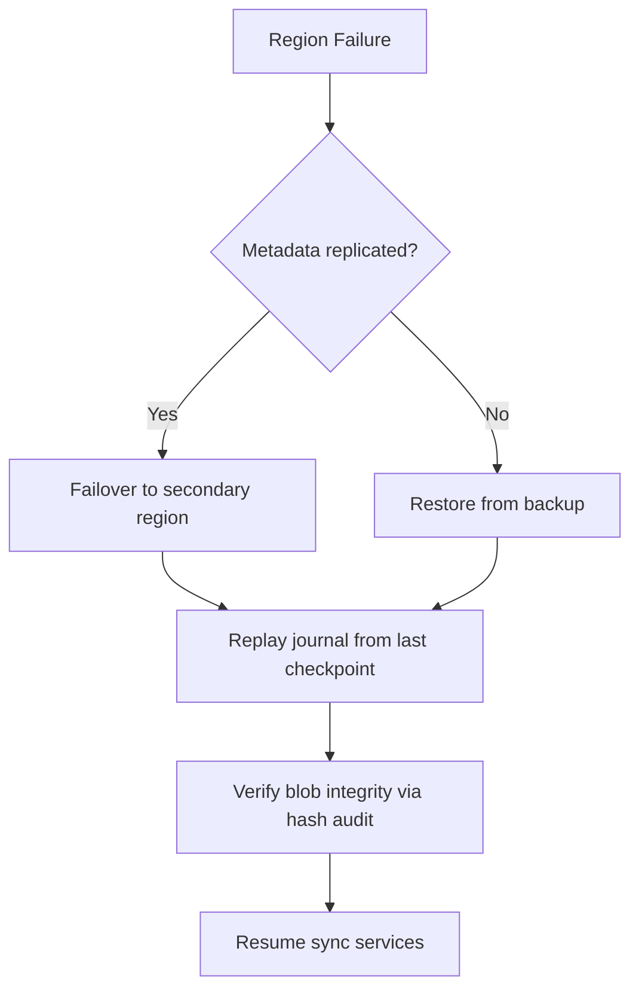
```mermaid
flowchart TD
    A[Region Failure] --> B{Metadata replicated?}
    B -->|Yes| C[Failover to secondary region]
    B -->|No| D[Restore from backup]
    C --> E[Replay journal from last checkpoint]
    D --> E
    E --> F[Verify blob integrity via hash audit]
    F --> G[Resume sync services]
```

- **RPO:** < 1 minute (sync journal replicated cross-region)
- **RTO:** < 5 minutes (automated failover)
- **Blob durability:** Cross-region replication (3 copies minimum)

### 10.4 Monitoring & Alerting

| Metric | Alert Threshold |
|--------|-----------------|
| Sync latency p99 | > 30 seconds |
| Block upload error rate | > 0.1% |
| Journal lag (consumer behind) | > 10,000 events |
| Dedup ratio | Drops below 1.1× (indicates index corruption) |
| GC backlog | > 1 PB pending deletion |

---

## 11. Interview Cheat Sheet

### 11.1 45-Minute Interview Flow

```mermaid
gantt
    title Dropbox Interview Timeline
    dateFormat X
    axisFormat %M min

    section Phases
    Clarify requirements     :0, 5
    Capacity estimation      :5, 8
    High-level architecture  :8, 15
    Deep dive: sync/chunking :15, 25
    Deep dive: conflicts     :25, 32
    Deep dive: dedup         :32, 38
    Trade-offs & wrap-up     :38, 45
```

### 11.2 Key Talking Points (Memorize These)

1. **"Sync is a distributed systems problem, not a storage problem"** — lead with journal + cursor model
2. **Block-level content addressing** enables both delta sync and deduplication
3. **Metadata/blob separation** — different storage engines, different scaling
4. **Optimistic concurrency** with conflicted copies — never silently lose user data
5. **Cross-user dedup has security implications** — acknowledge the trade-off
6. **Long polling + push notifications** — hybrid for mobile and desktop
7. **Idempotent block upload by hash** — retries are free

### 11.3 Expected Follow-Up Questions

| Question | Strong Answer |
|----------|---------------|
| "How do you handle a 50 GB file?" | Chunk into 4 MB blocks; resumable upload; parallel upload 10 blocks at a time; composite hash for integrity |
| "What happens if two users rename the same file?" | Rename is metadata-only on inode; last-writer-wins on name; both renames may coexist if different names |
| "How do you avoid uploading a 1 GB file that changed by 1 byte?" | Rolling hash finds changed region → only affected 4 MB block re-uploaded |
| "How do you share a 10 GB folder?" | Share grants ACL on namespace subtree; no data duplication; recipient's sync journal includes shared namespace |
| "How would you add real-time collaboration?" | Operational Transform or CRDT on top of block model; separate from sync path; mention Google Docs / Dropbox Paper |
| "How do you calculate storage quota with dedup?" | Per-user logical size (sum of file sizes); physical size tracked separately for ops |
| "What about encryption?" | TLS in transit; AES-256 at rest; optional E2E with per-user keys (breaks cross-user dedup) |

### 11.4 Common Mistakes to Avoid

| Mistake | Why It's Wrong |
|---------|----------------|
| Designing file-level sync only | 1 byte change = full re-upload; fails bandwidth NFR |
| Storing blobs in SQL | Doesn't scale past TBs; wrong access pattern |
| Silent last-writer-wins | Interviewer will flag data loss risk |
| Ignoring offline mode | Mobile/laptop offline is core use case |
| No conflict strategy | Guaranteed follow-up question |
| Forgetting garbage collection | Dedup requires ref counting and GC |

### 11.5 Diagrams to Draw on Whiteboard

1. **Client → Block Service → Blob Store** upload pipeline
2. **Sync journal with device cursors** (pull model)
3. **Inode tree** with file version → block refs → blocks
4. **Conflict timeline** (two devices, offline edit, conflicted copy)
5. **Metadata vs blob separation** (two-tier storage)

### 11.6 Quick Reference Numbers

| Metric | Value |
|--------|-------|
| DAU | 100M |
| Block size | 4 MB |
| Sync latency target | < 5s p95 |
| Dedup savings | ~40% |
| Peak metadata QPS | ~350K |
| Blob durability | 11 nines |

---

## References & Further Reading

- [Dropbox Engineering Blog — Streaming Sync](https://dropbox.tech/)
- [Linux rsync algorithm](https://rsync.samba.org/tech_report/)
- [Spanner: Google's Globally-Distributed Database](https://research.google/pubs/pub39966/)
- [Hello Interview — Design Dropbox](https://www.hellointerview.com/)
- [CAP Theorem applied to file sync](https://en.wikipedia.org/wiki/CAP_theorem)

---

*Last updated: July 2026 | Hello Interview Framework | Big Tech System Design Series*
