# Design YouTube

> **Framework:** [Hello Interview Delivery Framework](https://www.hellointerview.com/learn/system-design/in-a-hurry/delivery)  
> **Difficulty:** Hard (upload + transcode + CDN)  
> **Time budget:** 45 minutes  
> **Primary topics:** Upload pipeline, transcoding DAG, CDN, view counts

---

## Table of Contents

1. [How to Use This Guide](#how-to-use-this-guide)
2. [Requirements (~5 min)](#requirements-5-min)
3. [Core Entities (~2 min)](#core-entities-2-min)
4. [API / System Interface (~5 min)](#api--system-interface-5-min)
5. [Data Flow (~5 min)](#data-flow-5-min)
6. [High-Level Design (~10–15 min)](#high-level-design-1015-min)
7. [Deep Dives (~10 min)](#deep-dives-10-min)
8. [Capacity & Sizing](#capacity--sizing)
9. [Failure Modes & Resilience](#failure-modes--resilience)
10. [Trade-offs Summary](#trade-offs-summary)
11. [Interview Walkthrough Script](#interview-walkthrough-script)
12. [Follow-Up Questions](#follow-up-questions)
13. [Real-World References](#real-world-references)
14. [Interview Cheat Sheet](#interview-cheat-sheet)

---

## How to Use This Guide

This guide walks through designing a **video sharing and streaming platform** at Big Tech interview depth. Follow the Hello Interview pacing: clarify scope early, draw boxes before optimizing, and spend deep-dive time on the **hardest** parts, not on generic CRUD.

**What interviewers optimize for:**

| Rubric pillar | What to demonstrate |
|---|---|
| Problem navigation | Scope upload vs playback vs comments |
| Solution design | Upload → transcode DAG → CDN → player |
| Technical excellence | Transcoding workflow, view count aggregation |
| Communication | Async processing and idempotent uploads | |

**Suggested opening script:**

> "I'll design YouTube: upload, transcode, serve via CDN, and view counts. I'll defer live streaming and Shorts feed unless in scope. My focus is the upload/transcode pipeline and read-heavy delivery."

**Pacing guide:**

| Phase | Time | What to Cover |
|-------|------|---------------|
| Requirements | ~5 min | Functional + non-functional, scope, clarifying questions |
| Core Entities | ~2 min | Primary data objects and relationships |
| API Design | ~5 min | REST/RPC endpoints, request/response contracts |
| Data Flow | ~5 min | End-to-end sequence for happy path |
| High-Level Design | ~10–15 min | Architecture boxes-and-arrows |
| Deep Dives | ~10 min | Bottlenecks, scaling, edge cases, trade-offs |
| Capacity | woven in | Back-of-envelope QPS, storage, bandwidth |

---

## Requirements (~5 min)
### The Prompt

> "Design a video sharing platform like YouTube. Users can upload videos, watch videos, like/comment, and receive personalized recommendations."

### What YouTube Actually Is

YouTube is a **read-heavy media platform** with an **asynchronous write pipeline**. The core challenges are:

1. **Ingest** — accept multi-GB uploads reliably
2. **Transcode** — convert to multiple formats/resolutions
3. **Distribute** — serve video via global CDN at scale
4. **Recommend** — personalize content for 2B+ users
5. **Engage** — comments, likes, view counts at billions of events/day

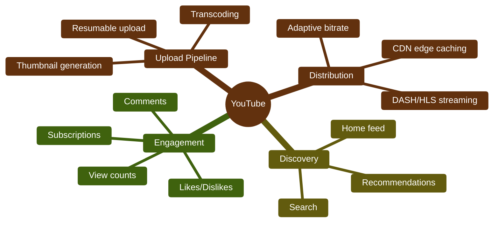
```mermaid
%%{init: {'theme': 'base', 'themeVariables': {'primaryColor': '#D2691E', 'primaryTextColor': '#ffffff', 'primaryBorderColor': '#5D2E0C', 'secondaryColor': '#D2691E', 'tertiaryColor': '#D2691E', 'lineColor': '#5D2E0C'}}}%%
mindmap
  root((YouTube))
    Upload Pipeline
      Resumable upload
      Transcoding
      Thumbnail generation
    Distribution
      CDN edge caching
      Adaptive bitrate
      DASH/HLS streaming
    Discovery
      Home feed
      Search
      Recommendations
    Engagement
      View counts
      Comments
      Likes/Dislikes
      Subscriptions
```

### In Scope

| Area | Details |
|------|---------|
| Video upload | Resumable, up to 12 hours / 256 GB |
| Transcoding | Multiple resolutions (144p–4K), codecs (H.264, VP9, AV1) |
| Video playback | Adaptive bitrate streaming via CDN |
| Metadata | Title, description, tags, thumbnails |
| View counts | Accurate-ish counts at scale |
| Comments | Threaded comments with moderation |
| Recommendations | Home page + related videos |
| Subscriptions | Creator → subscriber feed |

### Out of Scope

- Live streaming (YouTube Live) — mention as extension
- YouTube Shorts algorithm specifics — cover as variant
- Content ID / copyright detection — brief mention
- Monetization / ad serving — separate system
- Creator analytics dashboard — read replica of metrics

### Assumptions

- 2.5B monthly active users, 800M DAU
- 500 hours of video uploaded per minute
- 1B hours watched per day
- Average video length: 12 minutes
- Average watch: 40% of video length

---


### 2.1 Functional Requirements

#### Must-Have (P0)

| ID | Requirement | Notes |
|----|-------------|-------|
| F1 | Upload videos (resumable) | Handle network interruptions |
| F2 | Transcode to multiple formats | HLS/DASH adaptive streaming |
| F3 | Stream video with adaptive bitrate | Switch quality based on bandwidth |
| F4 | Search videos by title/tags | Full-text + metadata |
| F5 | Home feed with recommendations | Personalized per user |
| F6 | View count per video | Display on video page |
| F7 | Comments on videos | Threaded, paginated |
| F8 | Like/dislike videos | Toggle, aggregate count |
| F9 | Subscribe to channels | Subscription feed |
| F10 | Video metadata CRUD | Title, description, thumbnail |

#### Nice-to-Have (P1)

| ID | Requirement |
|----|-------------|
| F11 | Watch history & resume playback |
| F12 | Playlists |
| F13 | Video chapters |
| F14 | Auto-generated captions |
| F15 | Related videos sidebar |
| F16 | Trending page |

### 2.2 Non-Functional Requirements

| Category | Target | Rationale |
|----------|--------|-----------|
| **Upload success rate** | 99.9% | Creators must trust the platform |
| **Transcode latency** | < 2× video duration | 10 min video → < 20 min processing |
| **Playback start time** | < 2 seconds | Industry standard TTFF |
| **Rebuffering ratio** | < 0.5% | Smooth viewing experience |
| **Availability** | 99.99% for playback | Downtime = lost ad revenue |
| **View count accuracy** | ±5% acceptable | Exact counts impractical at scale |
| **Comment latency** | < 500ms to appear | Real-time feel |
| **Recommendation freshness** | New uploads surface within 1 hour | Creator satisfaction |

### 2.3 Requirements Priority

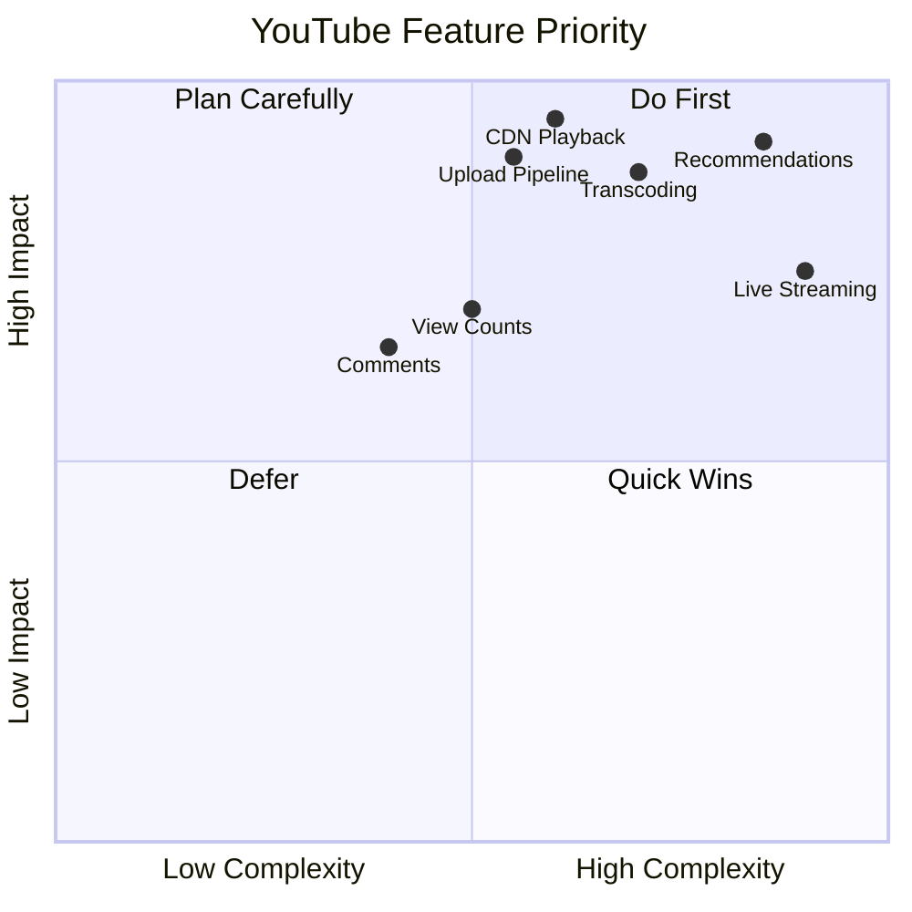
```mermaid
quadrantChart
    title YouTube Feature Priority
    x-axis Low Complexity --> High Complexity
    y-axis Low Impact --> High Impact
    quadrant-1 Do First
    quadrant-2 Plan Carefully
    quadrant-3 Defer
    quadrant-4 Quick Wins
    CDN Playback: [0.60, 0.95]
    Upload Pipeline: [0.55, 0.90]
    Transcoding: [0.70, 0.88]
    Recommendations: [0.85, 0.92]
    View Counts: [0.50, 0.70]
    Comments: [0.40, 0.65]
    Live Streaming: [0.90, 0.75]
```

---

## Capacity & Sizing
### 3.1 Upload Volume

```
Upload rate:          500 hours/min = 30,000 hours/hour
Average bitrate:      8 Mbps (source upload)
Upload bandwidth:     30,000 hr × 3600s × 8 Mbps / 8 = 108 TB/hour ingress
                      ≈ 30 GB/s peak upload ingress

Videos per minute:    500 hr / 12 min avg = ~2,500 videos/min
Videos per day:       2,500 × 1440 = 3.6M new videos/day
Storage per video:    12 min × 8 Mbps / 8 ≈ 720 MB raw
Daily raw storage:    3.6M × 720 MB ≈ 2.5 PB/day (raw uploads)
Transcoded variants:  5 renditions × avg 200 MB = 1 GB per video
Daily transcoded:     3.6M × 1 GB ≈ 3.6 PB/day
With dedup/CDN:       Long-tail → tiered storage reduces active set
```

### 3.2 Playback (Read) Volume

```
Watch time:           1B hours/day
Average watch:        12 min × 40% = 4.8 min = 288 seconds
Views per day:        1B hr × 3600 / 288 ≈ 12.5B views/day
View QPS:             12.5B / 86400 ≈ 145,000 views/sec
                      Peak (3×): ~435,000 views/sec

Streaming bitrate:    2 Mbps average (adaptive)
Egress bandwidth:     435K × 2 Mbps / 8 = ~109 GB/s peak
CDN cache hit:        95% → origin egress ~5.5 GB/s
```

### 3.3 Engagement

```
Comments per view:      0.5% → 62.5M comments/day
Comment write QPS:      62.5M / 86400 ≈ 720 QPS
Likes per view:         4% → 500M likes/day
Like write QPS:         500M / 86400 ≈ 5,800 QPS
View count writes:      145K/sec (aggregated in practice)
```

### 3.4 Storage Summary

| Tier | Size | Access Pattern |
|------|------|----------------|
| Hot (CDN) | ~500 PB | Last 30 days popular |
| Warm (origin) | ~5 EB | Last 1 year |
| Cold (archive) | ~50 EB+ | Full catalog, Glacier tier |
| Metadata DB | ~50 TB | Video metadata, user data |
| Metrics/Analytics | ~10 PB | View events, engagement |

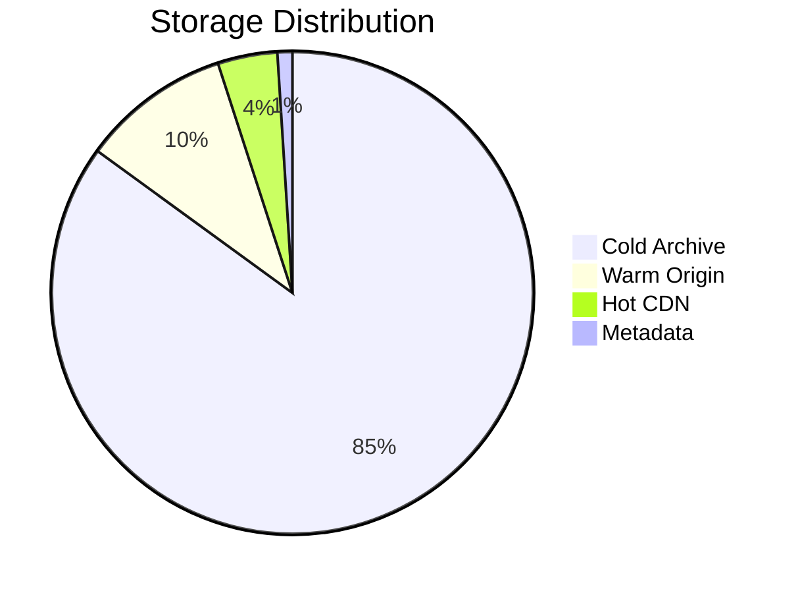
```mermaid
pie title Storage Distribution
    "Cold Archive" : 85
    "Warm Origin" : 10
    "Hot CDN" : 4
    "Metadata" : 1
```

### 3.5 Summary Table

| Metric | Value |
|--------|-------|
| DAU | 800M |
| Upload ingress | ~30 GB/s peak |
| Playback egress (CDN) | ~109 GB/s peak |
| Views/day | ~12.5B |
| New videos/day | ~3.6M |
| View count write QPS | ~145K (raw), ~1K (aggregated) |
| Comment write QPS | ~720 |

---

## Core Entities (~2 min)
```mermaid
erDiagram
    USER ||--o{ CHANNEL : owns
    CHANNEL ||--o{ VIDEO : publishes
    VIDEO ||--o{ VIDEO_RENDITION : has
    VIDEO ||--o{ COMMENT : has
    VIDEO ||--o{ VIEW_EVENT : tracked_by
    USER ||--o{ SUBSCRIPTION : subscribes
    SUBSCRIPTION }o--|| CHANNEL : to
    USER ||--o{ LIKE : gives
    LIKE }o--|| VIDEO : on
    USER ||--o{ WATCH_HISTORY : has
    VIDEO ||--o{ VIDEO_TAG : tagged_with

    USER {
        uuid user_id PK
        string username
        string email
        timestamp created_at
    }

    CHANNEL {
        uuid channel_id PK
        uuid owner_user_id FK
        string name
        bigint subscriber_count
        text description
    }

    VIDEO {
        uuid video_id PK
        uuid channel_id FK
        string title
        text description
        enum status "uploading|processing|ready|failed"
        int duration_seconds
        bigint view_count
        bigint like_count
        timestamp published_at
        string thumbnail_url
    }

    VIDEO_RENDITION {
        uuid rendition_id PK
        uuid video_id FK
        enum resolution "144p|360p|720p|1080p|4k"
        enum codec "h264|vp9|av1"
        string manifest_url
        bigint file_size_bytes
    }

    COMMENT {
        uuid comment_id PK
        uuid video_id FK
        uuid user_id FK
        uuid parent_comment_id FK
        text content
        bigint like_count
        timestamp created_at
    }

    VIEW_EVENT {
        uuid event_id PK
        uuid video_id FK
        uuid user_id FK
        int watch_duration_sec
        timestamp viewed_at
    }

    SUBSCRIPTION {
        uuid user_id FK
        uuid channel_id FK
        timestamp subscribed_at
    }
```

---

## API / System Interface (~5 min)
### 5.1 Upload APIs

#### `POST /v1/uploads/initiate` — Start resumable upload

**Request:**
```json
{
  "title": "My Tutorial",
  "description": "How to design systems",
  "channel_id": "ch_abc123",
  "file_size_bytes": 2147483648,
  "content_type": "video/mp4",
  "duration_seconds": 600
}
```

**Response:**
```json
{
  "video_id": "vid_xyz789",
  "upload_url": "https://upload.youtube.com/v1/uploads/vid_xyz789",
  "upload_token": "tok_secure_abc",
  "chunk_size_bytes": 8388608
}
```

#### `PUT /v1/uploads/{video_id}` — Upload chunk (resumable)

**Headers:**
```
Content-Range: bytes 0-8388607/2147483648
Upload-Token: tok_secure_abc
Content-Type: video/mp4
```

**Response:**
```json
{
  "video_id": "vid_xyz789",
  "bytes_received": 8388608,
  "status": "in_progress"
}
```

#### `POST /v1/uploads/{video_id}/complete` — Finalize upload

**Response:**
```json
{
  "video_id": "vid_xyz789",
  "status": "processing",
  "estimated_ready_at": "2026-07-08T10:30:00Z"
}
```

### 5.2 Playback APIs

#### `GET /v1/videos/{video_id}/playback` — Get streaming manifest

**Response:**
```json
{
  "video_id": "vid_xyz789",
  "title": "My Tutorial",
  "duration_seconds": 600,
  "view_count": 1523847,
  "manifest": {
    "type": "DASH",
    "url": "https://cdn.youtube.com/manifest/vid_xyz789.mpd"
  },
  "renditions": [
    {"resolution": "1080p", "bitrate_kbps": 5000, "codec": "vp9"},
    {"resolution": "720p", "bitrate_kbps": 2500, "codec": "vp9"},
    {"resolution": "360p", "bitrate_kbps": 800, "codec": "h264"}
  ],
  "thumbnail_url": "https://cdn.youtube.com/thumb/vid_xyz789.jpg"
}
```

### 5.3 Engagement APIs

#### `POST /v1/videos/{video_id}/view` — Record view event

**Request:**
```json
{
  "watch_duration_seconds": 245,
  "quality": "720p",
  "session_id": "sess_abc"
}
```

**Response:** `204 No Content` (fire-and-forget, async processing)

#### `POST /v1/videos/{video_id}/comments` — Add comment

**Request:**
```json
{
  "content": "Great explanation!",
  "parent_comment_id": null
}
```

**Response:**
```json
{
  "comment_id": "cmt_456",
  "content": "Great explanation!",
  "user": {"username": "viewer123"},
  "like_count": 0,
  "created_at": "2026-07-08T09:20:00Z"
}
```

#### `POST /v1/videos/{video_id}/like` — Toggle like

**Request:**
```json
{
  "action": "like"
}
```

### 5.4 Feed & Discovery APIs

#### `GET /v1/feed/home` — Personalized home feed

**Request:** `?cursor=page_token_abc&limit=20`

**Response:**
```json
{
  "videos": [
    {
      "video_id": "vid_111",
      "title": "System Design Tips",
      "channel_name": "TechChannel",
      "thumbnail_url": "...",
      "view_count": 500000,
      "duration_seconds": 720,
      "published_at": "2026-07-07T14:00:00Z"
    }
  ],
  "next_cursor": "page_token_def"
}
```

### 5.5 Upload-to-Playback Sequence

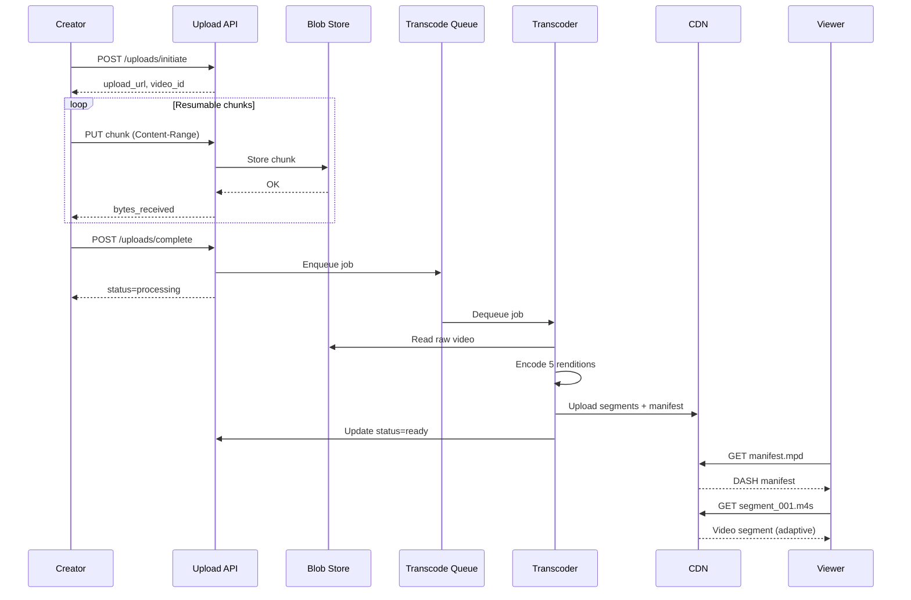
```mermaid
sequenceDiagram
    participant Creator
    participant Upload API
    participant Blob Store
    participant Transcode Queue
    participant Transcoder
    participant CDN
    participant Viewer

    Creator->>Upload API: POST /uploads/initiate
    Upload API-->>Creator: upload_url, video_id

    loop Resumable chunks
        Creator->>Upload API: PUT chunk (Content-Range)
        Upload API->>Blob Store: Store chunk
        Blob Store-->>Upload API: OK
        Upload API-->>Creator: bytes_received
    end

    Creator->>Upload API: POST /uploads/complete
    Upload API->>Transcode Queue: Enqueue job
    Upload API-->>Creator: status=processing

    Transcode Queue->>Transcoder: Dequeue job
    Transcoder->>Blob Store: Read raw video
    Transcoder->>Transcoder: Encode 5 renditions
    Transcoder->>CDN: Upload segments + manifest
    Transcoder->>Upload API: Update status=ready

    Viewer->>CDN: GET manifest.mpd
    CDN-->>Viewer: DASH manifest
    Viewer->>CDN: GET segment_001.m4s
    CDN-->>Viewer: Video segment (adaptive)
```

---

## Data Model / Schema
### 6.1 Video Metadata (SQL — Sharded by channel_id)

```sql
CREATE TABLE videos (
    video_id        UUID PRIMARY KEY,
    channel_id      UUID NOT NULL,
    title           VARCHAR(500) NOT NULL,
    description     TEXT,
    status          ENUM('uploading','processing','ready','failed','deleted'),
    duration_sec    INT,
    view_count      BIGINT DEFAULT 0,
    like_count      BIGINT DEFAULT 0,
    dislike_count   BIGINT DEFAULT 0,
    comment_count   BIGINT DEFAULT 0,
    published_at    TIMESTAMP,
    created_at      TIMESTAMP DEFAULT NOW(),
    INDEX idx_channel (channel_id, published_at DESC),
    INDEX idx_status (status, created_at)
);

CREATE TABLE video_renditions (
    rendition_id    UUID PRIMARY KEY,
    video_id        UUID NOT NULL,
    resolution      VARCHAR(10),
    codec           VARCHAR(10),
    bitrate_kbps    INT,
    manifest_path   VARCHAR(512),
    file_size_bytes BIGINT,
    INDEX idx_video (video_id)
);
```

### 6.2 Comments (Sharded by video_id)

```sql
CREATE TABLE comments (
    comment_id          UUID PRIMARY KEY,
    video_id            UUID NOT NULL,
    user_id             UUID NOT NULL,
    parent_comment_id   UUID,
    content             TEXT NOT NULL,
    like_count          BIGINT DEFAULT 0,
    is_deleted          BOOLEAN DEFAULT FALSE,
    created_at          TIMESTAMP DEFAULT NOW(),
    INDEX idx_video_time (video_id, created_at DESC),
    INDEX idx_parent (parent_comment_id)
);
```

### 6.3 View Counts (Eventually Consistent)

```
# Redis (hot counter — real-time display)
INCR view_count:{video_id}
HINCRBY daily_views:{video_id} {date} 1

# Periodic flush to SQL (every 60 seconds)
UPDATE videos SET view_count = view_count + :delta WHERE video_id = :id

# Cassandra (raw events for analytics)
INSERT INTO view_events (video_id, user_id, timestamp, watch_duration)
```

### 6.4 Upload State Machine

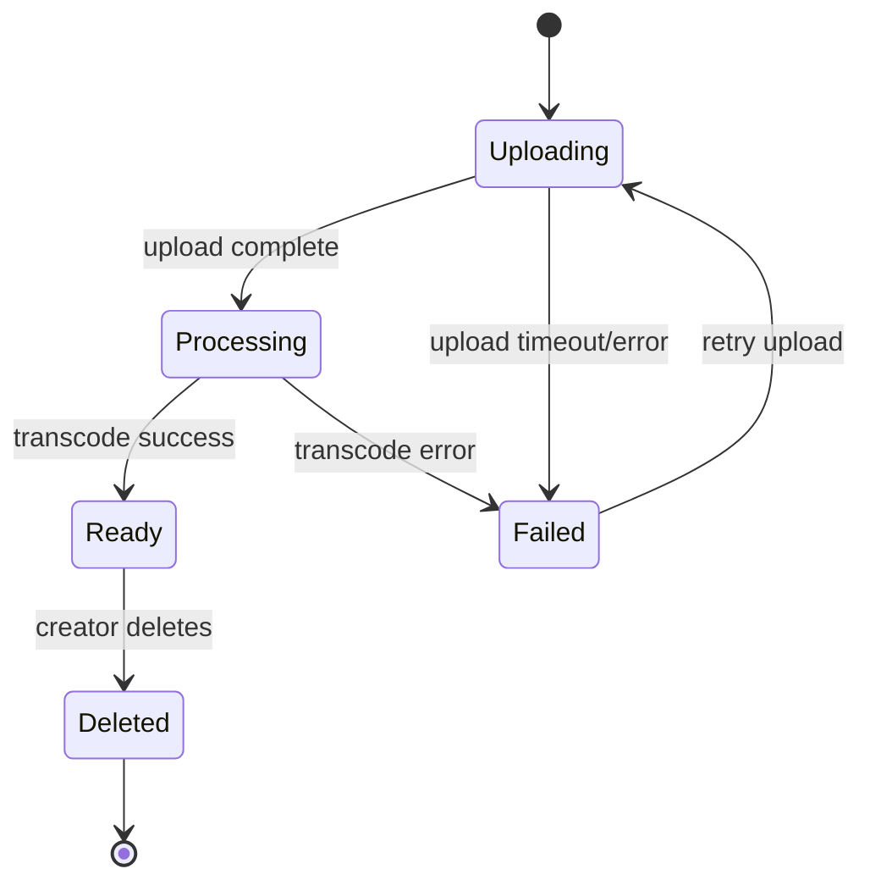
```mermaid
stateDiagram-v2
    [*] --> Uploading
    Uploading --> Processing: upload complete
    Uploading --> Failed: upload timeout/error
    Processing --> Ready: transcode success
    Processing --> Failed: transcode error
    Ready --> Deleted: creator deletes
    Failed --> Uploading: retry upload
    Deleted --> [*]
```

---

## Data Flow (~5 min)

Walk the **happy path** end-to-end before drawing boxes. Use sequence diagrams in [High-Level Design](#high-level-design-1015-min) on the whiteboard.

1. Client / producer initiates the primary action
2. API validates auth and schema
3. Core service persists state and enqueues async work
4. Workers / cache / CDN serve scale paths
5. Webhooks or polls confirm completion

---

## High-Level Design (~10–15 min)
### 7.1 System Architecture

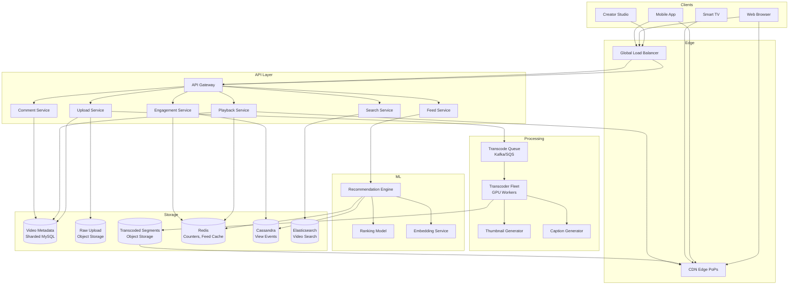
```mermaid
flowchart TB
    subgraph Clients
        WEB[Web Browser]
        MOBILE[Mobile App]
        TV[Smart TV]
        CREATOR[Creator Studio]
    end

    subgraph Edge
        GSLB[Global Load Balancer]
        CDN[CDN Edge PoPs]
    end

    subgraph API Layer
        GW[API Gateway]
        UPLOAD[Upload Service]
        PLAYBACK[Playback Service]
        ENGAGE[Engagement Service]
        FEED[Feed Service]
        SEARCH[Search Service]
        COMMENT[Comment Service]
    end

    subgraph Processing
        TRANSQ[Transcode Queue<br/>Kafka/SQS]
        TRANS[Transcoder Fleet<br/>GPU Workers]
        THUMB[Thumbnail Generator]
        CAPTION[Caption Generator]
    end

    subgraph ML
        RECSYS[Recommendation Engine]
        RANK[Ranking Model]
        EMBED[Embedding Service]
    end

    subgraph Storage
        META[(Video Metadata<br/>Sharded MySQL)]
        BLOB[(Raw Upload<br/>Object Storage)]
        TRANSSTORE[(Transcoded Segments<br/>Object Storage)]
        CACHE[(Redis<br/>Counters, Feed Cache)]
        ANALYTICS[(Cassandra<br/>View Events)]
        SEARCHIDX[(Elasticsearch<br/>Video Search)]
    end

    CREATOR --> GSLB --> GW
    WEB & MOBILE & TV --> CDN
    WEB & MOBILE --> GSLB --> GW

    GW --> UPLOAD & PLAYBACK & ENGAGE & FEED & SEARCH & COMMENT
    UPLOAD --> BLOB & TRANSQ & META
    TRANSQ --> TRANS --> TRANSSTORE --> CDN
    TRANS --> THUMB & CAPTION
    PLAYBACK --> META & CDN & CACHE
    ENGAGE --> CACHE & ANALYTICS
    COMMENT --> META
    FEED --> RECSYS --> RANK & EMBED
    RECSYS --> CACHE & ANALYTICS
    SEARCH --> SEARCHIDX
```

### 7.2 Video Processing Pipeline

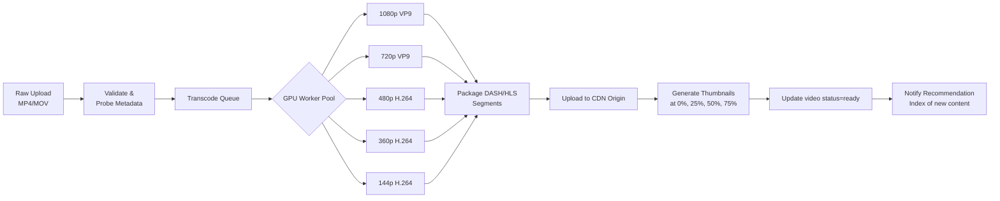
```mermaid
flowchart LR
    A[Raw Upload<br/>MP4/MOV] --> B[Validate &<br/>Probe Metadata]
    B --> C[Transcode Queue]
    C --> D{GPU Worker Pool}
    D --> E1[1080p VP9]
    D --> E2[720p VP9]
    D --> E3[480p H.264]
    D --> E4[360p H.264]
    D --> E5[144p H.264]
    E1 & E2 & E3 & E4 & E5 --> F[Package DASH/HLS<br/>Segments]
    F --> G[Upload to CDN Origin]
    G --> H[Generate Thumbnails<br/>at 0%, 25%, 50%, 75%]
    H --> I[Update video status=ready]
    I --> J[Notify Recommendation<br/>Index of new content]
```

### 7.3 CDN Distribution Architecture

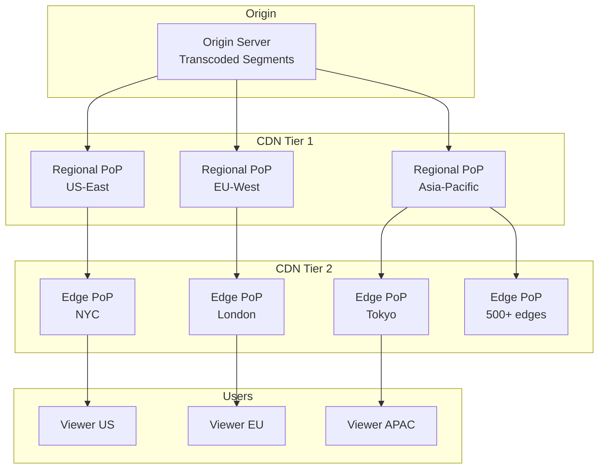
```mermaid
flowchart TB
    subgraph Origin
        OS[Origin Server<br/>Transcoded Segments]
    end

    subgraph CDN Tier 1
        RP1[Regional PoP<br/>US-East]
        RP2[Regional PoP<br/>EU-West]
        RP3[Regional PoP<br/>Asia-Pacific]
    end

    subgraph CDN Tier 2
        EP1[Edge PoP<br/>NYC]
        EP2[Edge PoP<br/>London]
        EP3[Edge PoP<br/>Tokyo]
        EP4[Edge PoP<br/>500+ edges]
    end

    subgraph Users
        U1[Viewer US]
        U2[Viewer EU]
        U3[Viewer APAC]
    end

    OS --> RP1 & RP2 & RP3
    RP1 --> EP1
    RP2 --> EP2
    RP3 --> EP3 & EP4
    EP1 --> U1
    EP2 --> U2
    EP3 --> U3
```

### 7.4 Recommendation Pipeline

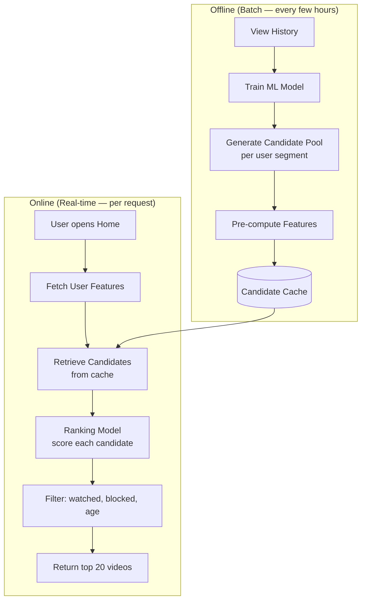
```mermaid
flowchart TD
    subgraph Offline["Offline (Batch — every few hours)"]
        VIEWS[View History] --> TRAIN[Train ML Model]
        TRAIN --> CAND[Generate Candidate Pool<br/>per user segment]
        CAND --> FEAT[Pre-compute Features]
        FEAT --> CACHE_OFF[(Candidate Cache)]
    end

    subgraph Online["Online (Real-time — per request)"]
        REQ[User opens Home] --> FEAT_ON[Fetch User Features]
        FEAT_ON --> CAND_ON[Retrieve Candidates<br/>from cache]
        CAND_ON --> RANK[Ranking Model<br/>score each candidate]
        RANK --> FILTER[Filter: watched, blocked, age]
        FILTER --> RESP[Return top 20 videos]
    end

    CACHE_OFF --> CAND_ON
```

---

## Deep Dives (~10 min)
### 8.1 Deep Dive #1: Resumable Upload Pipeline

#### Protocol: Chunked Resumable Upload

```
1. Client calls /uploads/initiate → receives upload_url + video_id
2. Client uploads 8 MB chunks with Content-Range headers
3. Server stores chunks in blob store, tracks offset per video_id
4. On network failure, client queries bytes_received and resumes
5. On /uploads/complete, server assembles chunks (or streams to transcode)
```

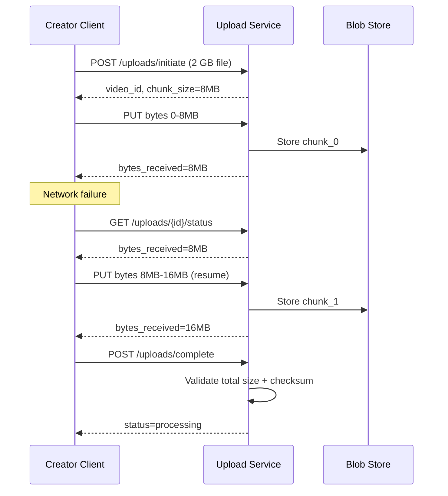
```mermaid
sequenceDiagram
    participant C as Creator Client
    participant U as Upload Service
    participant B as Blob Store

    C->>U: POST /uploads/initiate (2 GB file)
    U-->>C: video_id, chunk_size=8MB

    C->>U: PUT bytes 0-8MB
    U->>B: Store chunk_0
    U-->>C: bytes_received=8MB

    Note over C: Network failure

    C->>U: GET /uploads/{id}/status
    U-->>C: bytes_received=8MB

    C->>U: PUT bytes 8MB-16MB (resume)
    U->>B: Store chunk_1
    U-->>C: bytes_received=16MB

    C->>U: POST /uploads/complete
    U->>U: Validate total size + checksum
    U-->>C: status=processing
```

#### Large File Handling

| Challenge | Solution |
|-----------|----------|
| 256 GB upload | 8 MB chunks; ~32K chunks; stateless upload servers |
| Upload server crash | Chunks in blob store; new server resumes from offset |
| Duplicate complete call | Idempotent via video_id status check |
| Malicious upload | Virus scan + format validation before transcode |
| Upload bandwidth | Direct-to-S3 signed URLs; bypass API servers |

### 8.2 Deep Dive #2: Transcoding Pipeline

#### Why Transcode?

Raw uploads vary in codec, resolution, bitrate. Viewers need:
- **Multiple resolutions** for adaptive bitrate
- **Multiple codecs** for device compatibility (VP9 for modern, H.264 for legacy)
- **Segmented format** (DASH/HLS) for seeking and adaptive switching

#### Transcoding Architecture

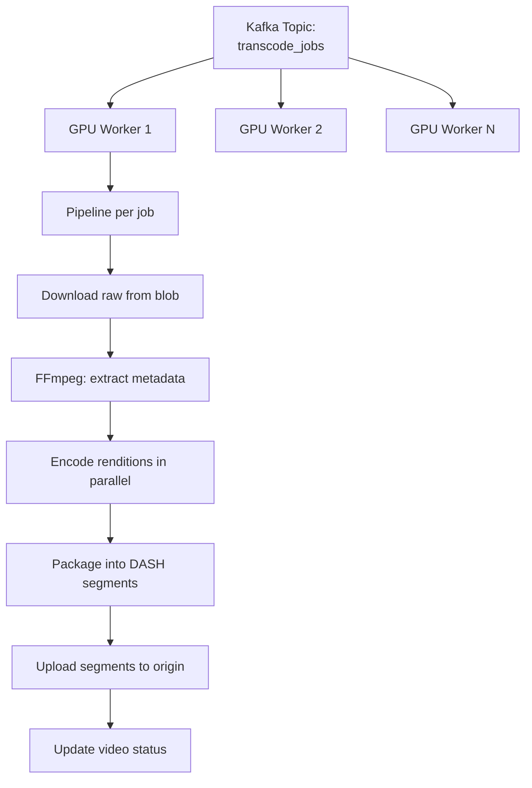
```mermaid
flowchart TD
    Q[Kafka Topic:<br/>transcode_jobs] --> W1[GPU Worker 1]
    Q --> W2[GPU Worker 2]
    Q --> W3[GPU Worker N]

    W1 --> P[Pipeline per job]
    P --> S1[Download raw from blob]
    S1 --> S2[FFmpeg: extract metadata]
    S2 --> S3[Encode renditions in parallel]
    S3 --> S4[Package into DASH segments]
    S4 --> S5[Upload segments to origin]
    S5 --> S6[Update video status]
```

#### Adaptive Bitrate Ladder

| Rendition | Resolution | Bitrate | Codec |
|-----------|------------|---------|-------|
| 4K | 3840×2160 | 16 Mbps | VP9 |
| 1080p | 1920×1080 | 5 Mbps | VP9 |
| 720p | 1280×720 | 2.5 Mbps | VP9 |
| 480p | 854×480 | 1 Mbps | H.264 |
| 360p | 640×360 | 800 Kbps | H.264 |
| 144p | 256×144 | 200 Kbps | H.264 |

#### Priority Queue

```
Priority levels:
  P0: Re-transcode failed jobs (retry)
  P1: Premium creators / high-subscriber channels
  P2: Standard uploads (FIFO)
  P3: Bulk backfill / migrations

Estimated wait at 500 hr/min upload with 10K GPU workers:
  Each worker: ~2× realtime → 30 min video in 60 min
  Throughput: 10K workers × 1 video/60min = ~167 videos/min
  Queue depth: 2500 upload/min - 167 process/min → backlog grows
  Solution: Auto-scale GPU fleet based on queue depth
```

### 8.3 Deep Dive #3: CDN & Adaptive Streaming

#### DASH/HLS Streaming

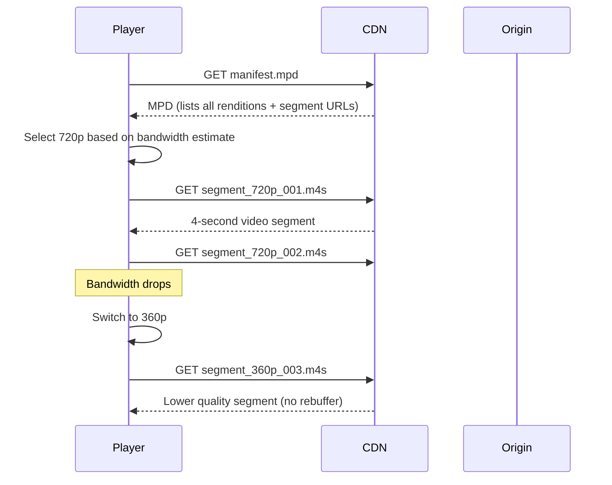
```mermaid
sequenceDiagram
    participant Player
    participant CDN
    participant Origin

    Player->>CDN: GET manifest.mpd
    CDN-->>Player: MPD (lists all renditions + segment URLs)

    Player->>Player: Select 720p based on bandwidth estimate
    Player->>CDN: GET segment_720p_001.m4s
    CDN-->>Player: 4-second video segment

    Player->>CDN: GET segment_720p_002.m4s
    Note over Player: Bandwidth drops
    Player->>Player: Switch to 360p
    Player->>CDN: GET segment_360p_003.m4s
    CDN-->>Player: Lower quality segment (no rebuffer)
```

#### CDN Caching Strategy

| Content Type | TTL | Cache Key |
|-------------|-----|-----------|
| Video segments (.m4s) | Immutable, 1 year | URL path (content-addressed) |
| Manifest (.mpd) | 1 hour | video_id + rendition set |
| Thumbnails | 24 hours | video_id + timestamp |
| API responses | No cache | — |

**Long-tail optimization:** 80% of views → 20% of videos (Pareto). CDN caches hot content; cold content fetched from origin on first request then cached.

#### Bandwidth Estimation (ABR Algorithm)

```
Player monitors:
  - Download throughput per segment
  - Buffer occupancy
  - Rebuffer events

Algorithm (simplified):
  if buffer > 30 seconds and throughput > current_bitrate × 1.5:
    upgrade rendition
  if buffer < 10 seconds or throughput < current_bitrate × 0.8:
    downgrade rendition
```

### 8.4 Deep Dive #4: View Counts at Scale

#### The Challenge

12.5B views/day = 145K raw events/sec. Storing every view as a DB row is expensive and unnecessary for display.

#### Architecture: Aggregate with Periodic Flush

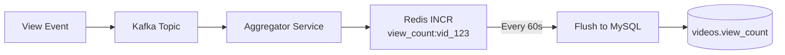
```mermaid
flowchart LR
    VIEW[View Event] --> KAFKA[Kafka Topic]
    KAFKA --> AGG[Aggregator Service]
    AGG --> REDIS[Redis INCR<br/>view_count:vid_123]
    REDIS -->|Every 60s| FLUSH[Flush to MySQL]
    FLUSH --> MYSQL[(videos.view_count)]
```

#### View Counting Rules (YouTube-specific)

| Rule | Implementation |
|------|----------------|
| Minimum watch time | 30 seconds (or full video if shorter) |
| Deduplicate same user | 1 view per user per video per 24 hours |
| Bot filtering | Rate limit + ML bot detection |
| Display lag | ±30 seconds acceptable |

#### Approximate Counting (HyperLogLog)

For very popular videos (100M+ views), even Redis INCR becomes hot-key:

```
Solution: HyperLogLog for approximate counts
  - Error rate: ±2%
  - Memory: 12 KB per video (vs unbounded counter)
  - Mergeable across regions

Display: "1.2B views" — users don't need exact count
```

#### Hot Key Mitigation

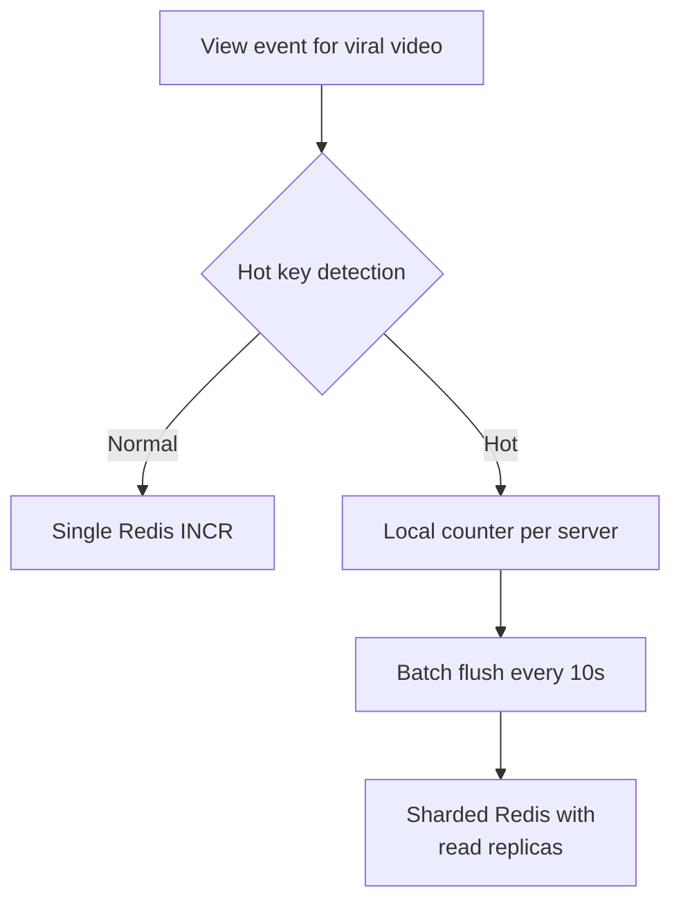
```mermaid
flowchart TD
    A[View event for viral video] --> B{Hot key detection}
    B -->|Normal| C[Single Redis INCR]
    B -->|Hot| D[Local counter per server]
    D --> E[Batch flush every 10s]
    E --> F[Sharded Redis with<br/>read replicas]
```

### 8.5 Deep Dive #5: Comments System

#### Architecture

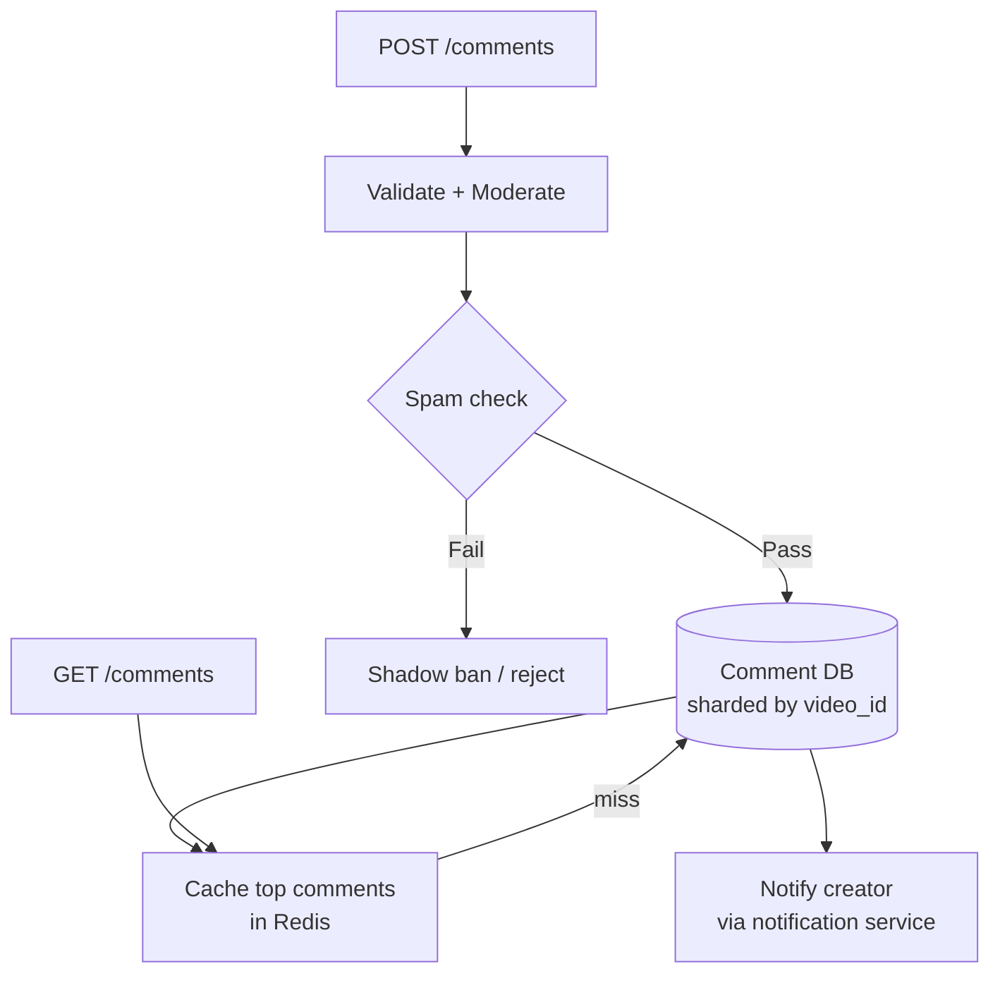
```mermaid
flowchart TB
    WRITE[POST /comments] --> VAL[Validate + Moderate]
    VAL --> SPAM{Spam check}
    SPAM -->|Pass| DB[(Comment DB<br/>sharded by video_id)]
    SPAM -->|Fail| REJECT[Shadow ban / reject]
    DB --> CACHE[Cache top comments<br/>in Redis]
    DB --> NOTIFY[Notify creator<br/>via notification service]

    READ[GET /comments] --> CACHE
    CACHE -->|miss| DB
```

#### Threading Model

```
Top-level comments: parent_comment_id = NULL
Replies: parent_comment_id = top-level comment_id
Max depth: 1 (YouTube style — flat replies, not nested threads)

Sort options:
  - Top comments (ML-ranked by engagement + relevance)
  - Newest first (timestamp DESC)
```

#### Scale Considerations

| Challenge | Solution |
|-----------|----------|
| Popular video (1M comments) | Paginate; cache top 100 ranked comments |
| Comment spam | ML classifier + rate limit (5 comments/min/user) |
| Real-time feel | Write to DB → async cache update → < 500ms |
| Creator moderation | Hold for review queue; auto-filter profanity |

### 8.6 Deep Dive #6: Recommendation System (Overview)

Covered in depth in the AI Recommendation guide; summarize for YouTube context:

```
Candidate Generation (offline):
  - Collaborative filtering: users who watched X also watched Y
  - Content-based: same category, tags, channel
  - Trending: high velocity view growth
  → Pool of ~500 candidates per user

Ranking (online):
  - Features: user watch history, video metadata, engagement rate
  - Model: deep neural network (Wide & Deep, Two-Tower)
  - Output: score 0-1 per candidate → sort → top 20

Feedback loop:
  - Click → positive signal
  - Skip within 5s → negative signal
  - Watch > 50% → strong positive
```

---

## Trade-offs Summary
### 9.1 Upload: Direct-to-Storage vs Proxy

| Approach | Pros | Cons |
|----------|------|------|
| Proxy through API | Full control, validation | Bottleneck at 30 GB/s |
| Direct-to-S3 signed URL yes | Scales infinitely | Less inline validation |
| Peer-to-peer upload | Zero server bandwidth | Unreliable, complex |

### 9.2 Transcoding: Real-time vs Batch

| Approach | Latency | Cost | Quality |
|----------|---------|------|---------|
| Real-time (live) | Seconds | Very high GPU | Lower quality |
| Near-line batch yes | Minutes | Optimized GPU fleet | Best quality |
| Pre-transcode all codecs | Hours ahead | Wasteful for unwatched | Over-provisioned |

### 9.3 View Counts: Exact vs Approximate

| Approach | Accuracy | Scale | Cost |
|----------|----------|-------|------|
| Exact per-event SQL | 100% | Doesn't scale | Very high |
| Redis counter + flush yes | 99.9% | 145K/sec | Medium |
| HyperLogLog | ±2% | Unlimited | Very low |
| No count (display estimate) | N/A | Infinite | Zero |

### 9.4 Comment Storage: SQL vs NoSQL

| Store | Best For |
|-------|----------|
| Sharded MySQL yes | Threaded queries, ACID, moderate scale |
| Cassandra | Write-heavy, time-series, eventual consistency |
| DynamoDB | Fully managed, key-value access |

---

## Failure Modes & Resilience
### 10.1 Failure Matrix

| Failure | Impact | Mitigation |
|---------|--------|------------|
| Upload server crash | Upload paused | Resume from last chunk offset |
| Transcode worker failure | Video stuck in processing | Retry job; dead-letter queue after 3 attempts |
| CDN PoP failure | Playback degraded | Anycast routing to next PoP |
| Origin unavailable | CDN serves cached only | Multi-region origin replicas |
| Redis counter lost | View count regression | Periodic MySQL snapshot as source of truth |
| Hot video overload | Slow playback | Pre-warm CDN; dedicated origin capacity |
| Recommendation model stale | Poor suggestions | Fallback to trending + subscriptions |
| Comment DB shard down | Comments unavailable | Read from cache; queue writes |

### 10.2 Data Durability

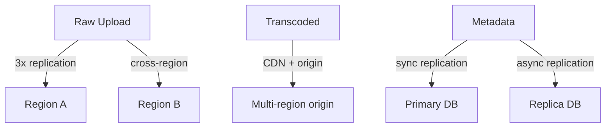
```mermaid
flowchart TD
    RAW[Raw Upload] -->|3x replication| S3A[Region A]
    RAW -->|cross-region| S3B[Region B]
    TRANS[Transcoded] -->|CDN + origin| MULTI[Multi-region origin]
    META[Metadata] -->|sync replication| DBA[Primary DB]
    META -->|async replication| DBB[Replica DB]
```

- **Raw uploads:** 11 nines durability (S3 standard + cross-region)
- **Transcoded segments:** Immutable, content-addressed, CDN-cached
- **Metadata:** Synchronous replication, RPO = 0
- **View events:** Kafka retention 7 days, replay on failure

### 10.3 Monitoring

| Metric | Alert |
|--------|-------|
| Upload success rate | < 99.5% |
| Transcode queue depth | > 10K jobs for > 30 min |
| Playback TTFF p95 | > 3 seconds |
| Rebuffering ratio | > 1% |
| CDN cache hit rate | < 90% |
| View count flush lag | > 5 minutes |

---

## Interview Walkthrough Script

### Minutes 0–5: Requirements

> Clarify functional scope, non-functional targets (latency, scale, consistency), and what's explicitly out of scope.

### Minutes 5–7: Core Entities + API

> Name the 4–6 core entities and primary API endpoints. Keep contracts concise.

### Minutes 7–12: Data Flow + Architecture

> Draw the happy-path sequence, then boxes-and-arrows architecture. Call out sync vs async boundaries.

### Minutes 12–22: High-Level Design

> Expand each box: technology choices, sharding keys, cache placement.

### Minutes 22–35: Deep Dives

> Spend time on the 2–3 hardest problems specific to Design YouTube — the differentiators.

### Minutes 35–45: Capacity + Wrap-Up

> Back-of-envelope QPS/storage, failure modes, trade-offs, and monitoring.

---

## Follow-Up Questions

1. **How would you handle a 10× traffic spike?** — Auto-scale workers, queue buffering, degrade non-critical features.
2. **Multi-region deployment?** — Data residency, replication lag, conflict resolution.
3. **How do you test this at scale?** — Load tests, chaos engineering, shadow traffic.
4. **Security concerns?** — AuthZ, encryption in transit/at rest, audit logging.
5. **Cost optimization?** — Tiered storage, cache hit ratio, right-sizing clusters.

---

## Real-World References

| System | Notable Design |
|--------|----------------|
| Industry blogs | High Scalability, engineering blogs from Meta/Google/Netflix |
| Papers | Original papers cited in deep-dive sections |
| Open source | Relevant Apache/Kafka/Redis/Envoy documentation |

See deep-dive sections and the original guide content for system-specific references to Design YouTube.

---

## Interview Cheat Sheet
### 11.1 Interview Timeline


```mermaid
gantt
    title YouTube Interview Timeline
    dateFormat X
    axisFormat %M min

    section Phases
    Requirements & scope      :0, 5
    Capacity estimation       :5, 10
    High-level architecture   :10, 18
    Upload + transcode dive   :18, 28
    CDN + playback dive       :28, 35
    View counts + comments    :35, 40
    Recommendations + wrap    :40, 45
```

### 11.2 Key Talking Points

1. **"YouTube is read-heavy (1000:1) — optimize for playback, not upload"**
2. **Resumable chunked upload** — never lose a 2 GB upload to network blip
3. **Async transcode pipeline** — upload ≠ instant playback; status machine
4. **CDN is the real database** — 95% cache hit; origin is backup
5. **Adaptive bitrate (DASH/HLS)** — segments, not monolithic files
6. **View counts are approximate** — aggregate in Redis, flush periodically
7. **Recommendations = candidate generation + ranking** — two-stage funnel

### 11.3 Follow-Up Questions

| Question | Strong Answer |
|----------|---------------|
| "How long until uploaded video is watchable?" | Transcode time ≈ 2× video duration; 10 min video ready in ~20 min; priority queue for premium |
| "How do you handle a viral video?" | CDN auto-scales; pre-warm popular content; hot-key mitigation for view counts |
| "Why not serve raw uploads?" | Codec/resolution mismatch; no adaptive bitrate; 10× bandwidth waste |
| "How do view counts avoid double-counting?" | 1 view per user per video per 24h; minimum 30s watch time |
| "How do comments scale on viral videos?" | Shard by video_id; paginate; cache top-K; don't load 1M comments |
| "How do recommendations handle new videos (cold start)?" | Content-based features (title, tags, category); trending velocity signal |
| "What about live streaming?" | Separate pipeline: RTMP ingest → chunked transcode → low-latency CDN (2-5s delay) |

### 11.4 Common Mistakes

| Mistake | Correct Approach |
|---------|------------------|
| Storing video in database | Object storage + CDN |
| Synchronous transcode | Async job queue with status polling |
| Exact view counts in SQL | Aggregate counters with periodic flush |
| Single video file per quality | Segmented DASH/HLS with adaptive switching |
| No upload resume | Chunked resumable upload protocol |
| Serving video from API servers | CDN edge distribution |

### 11.5 Quick Numbers

| Metric | Value |
|--------|-------|
| DAU | 800M |
| Upload rate | 500 hours/min |
| Views/day | 12.5B |
| Peak view QPS | 435K |
| CDN egress | ~109 GB/s |
| Transcode variants | 5-6 per video |
| View count accuracy | ±5% acceptable |

---

*Last updated: July 2026 | Hello Interview Framework | Big Tech System Design Series*
