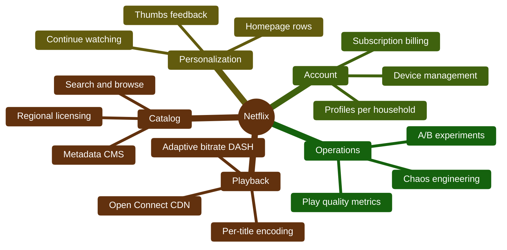
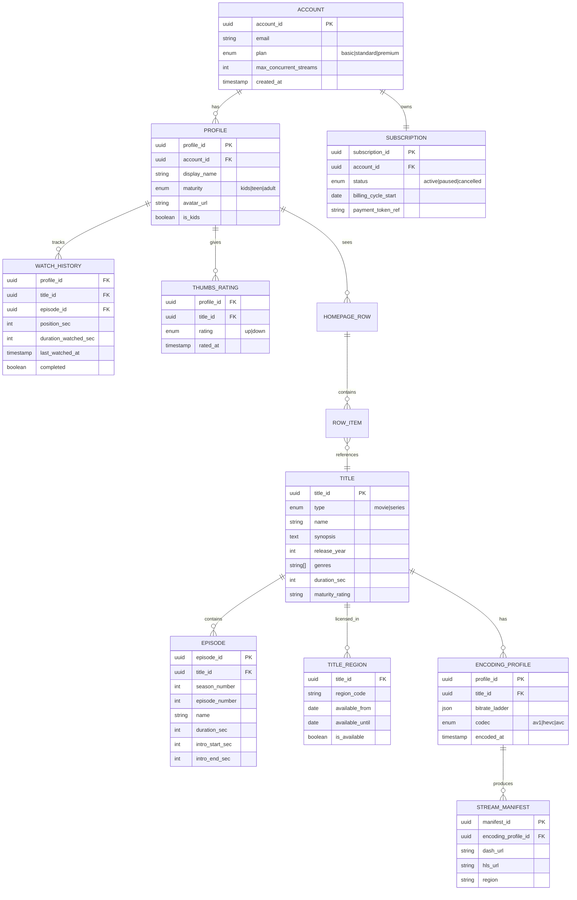
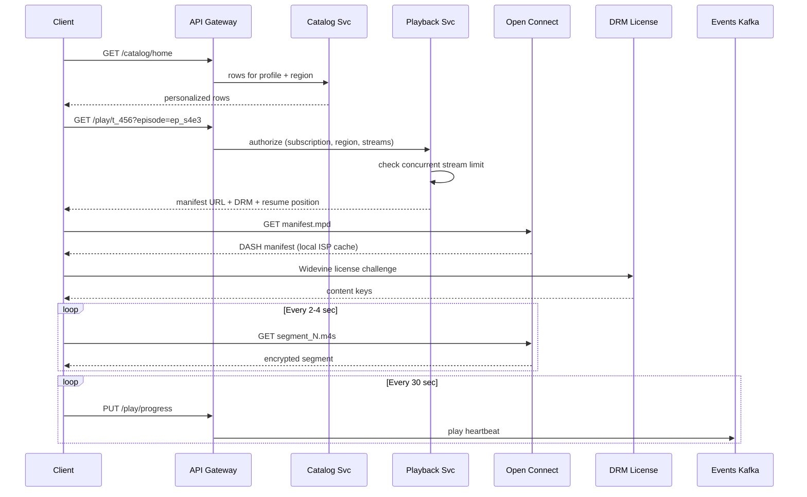
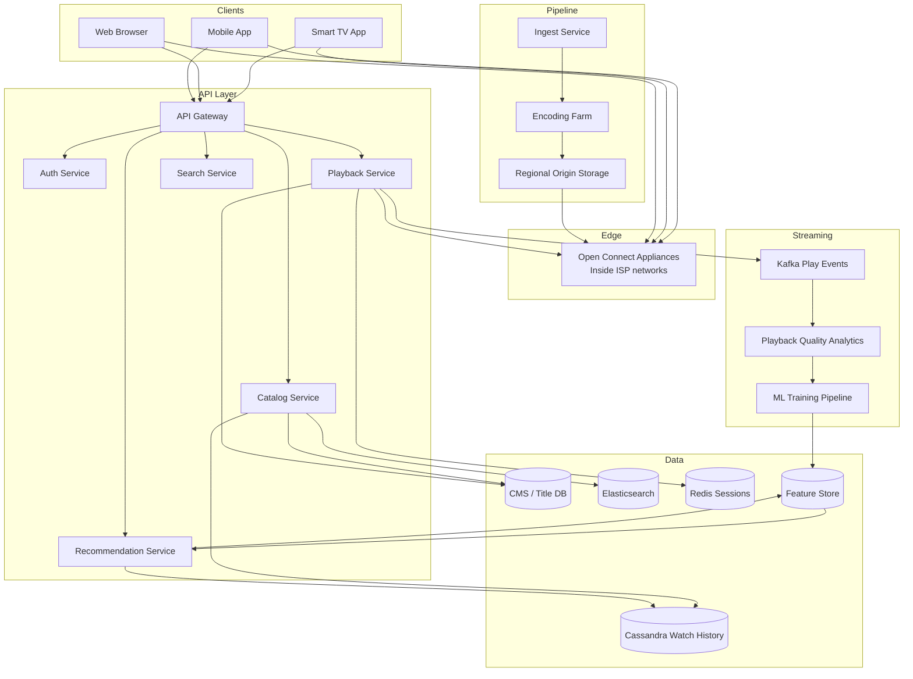
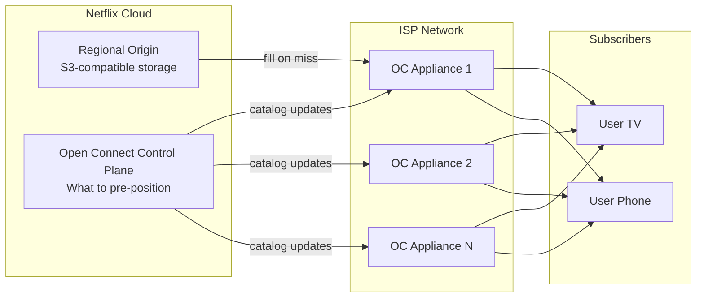
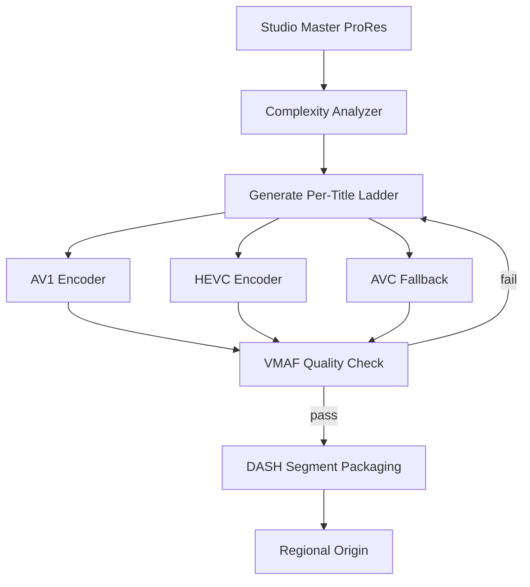
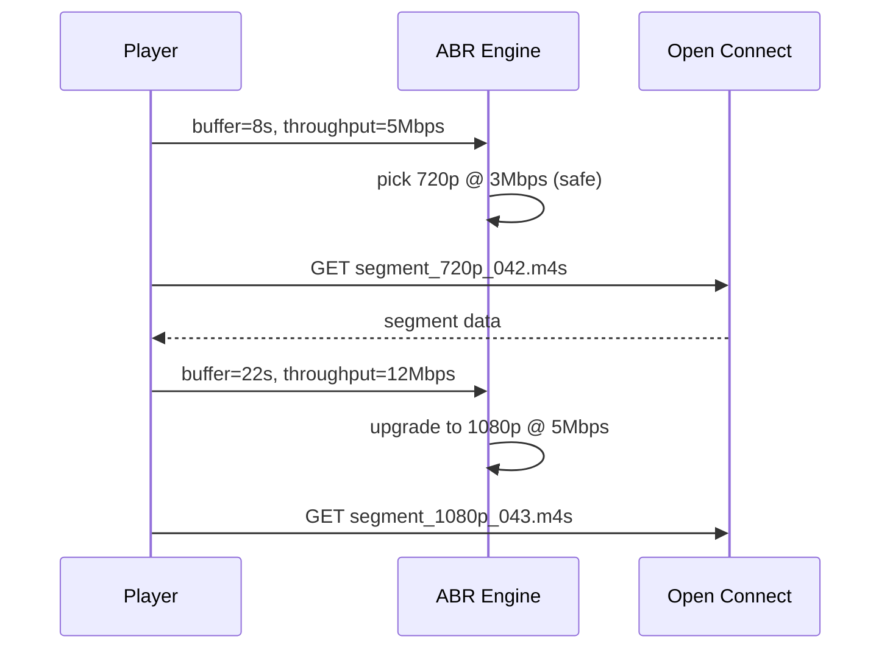
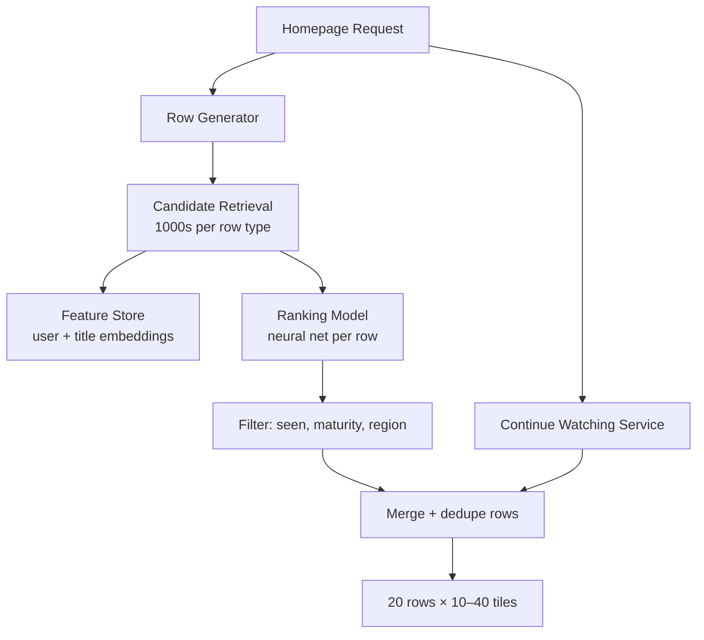
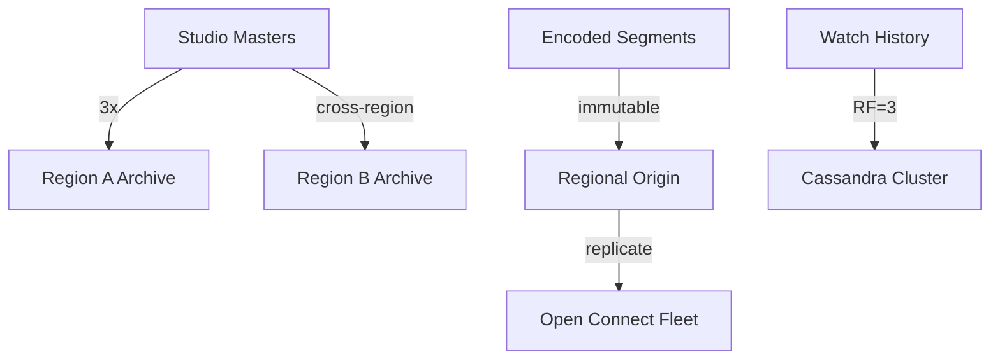

# Design Netflix

> **Framework:** [Hello Interview Delivery Framework](https://www.hellointerview.com/learn/system-design/in-a-hurry/delivery)  
> **Difficulty:** Hard (Open Connect + ABR)  
> **Time budget:** 45 minutes  
> **Primary topics:** Open Connect CDN, per-title encoding, ABR, regional catalogs

---

## Table of Contents

1. [How to Use This Guide](#how-to-use-this-guide)
2. [Requirements (~5 min)](#requirements-5-min)
3. [Core Entities (~2 min)](#core-entities-2-min)
4. [API / System Interface (~5 min)](#api--system-interface-5-min)
5. [Data Flow (~5 min)](#data-flow-5-min)
6. [High-Level Design (~10–15 min)](#high-level-design-1015-min)
7. [Deep Dives (~10 min)](#deep-dives-10-min)
8. [Capacity & Sizing](#capacity--sizing)
9. [Failure Modes & Resilience](#failure-modes--resilience)
10. [Trade-offs Summary](#trade-offs-summary)
11. [Interview Walkthrough Script](#interview-walkthrough-script)
12. [Follow-Up Questions](#follow-up-questions)
13. [Real-World References](#real-world-references)
14. [Interview Cheat Sheet](#interview-cheat-sheet)

---

## How to Use This Guide

This guide walks through designing a **video streaming platform** at Big Tech interview depth. Follow the Hello Interview pacing: clarify scope early, draw boxes before optimizing, and spend deep-dive time on the **hardest** parts, not on generic CRUD.

**What interviewers optimize for:**

| Rubric pillar | What to demonstrate |
|---|---|
| Problem navigation | Scope streaming vs recommendation vs encoding |
| Solution design | Encode → origin → CDN edge → client ABR |
| Technical excellence | Per-title encoding, Open Connect, cache fill |
| Communication | Regional catalog and failover | |

**Suggested opening script:**

> "I'll design Netflix streaming: encoding, Open Connect CDN, and playback. I'll defer billing and studio tools unless in scope. My focus is ABR streaming and CDN placement."

**Pacing guide:**

| Phase | Time | What to Cover |
|-------|------|---------------|
| Requirements | ~5 min | Functional + non-functional, scope, clarifying questions |
| Core Entities | ~2 min | Primary data objects and relationships |
| API Design | ~5 min | REST/RPC endpoints, request/response contracts |
| Data Flow | ~5 min | End-to-end sequence for happy path |
| High-Level Design | ~10–15 min | Architecture boxes-and-arrows |
| Deep Dives | ~10 min | Bottlenecks, scaling, edge cases, trade-offs |
| Capacity | woven in | Back-of-envelope QPS, storage, bandwidth |

---

## Requirements (~5 min)
### The Prompt

> "Design a subscription video streaming platform like Netflix. Users pay monthly, browse a catalog of movies and series, watch with adaptive quality, and receive personalized recommendations across TV, web, and mobile."

### What Netflix Actually Is

Netflix is a **subscription VOD (SVOD)** platform — not a user-upload site like YouTube. The dominant engineering challenges are:

1. **Deliver** — stream HD/4K globally with minimal buffering via **Open Connect** (Netflix-owned CDN inside ISPs)
2. **Encode** — **per-title optimization** (custom bitrate ladder per asset, not one-size-fits-all)
3. **Personalize** — homepage **rows** ("Continue Watching", "Because you watched X") for 200M+ subscribers
4. **License** — **regional catalogs** (title available in US but not UK until date X)
5. **Measure** — playback quality metrics (rebuffer ratio, startup time) at billions of play events/day



### Netflix vs YouTube (Interview Clarifier)

| Dimension | Netflix | YouTube |
|-----------|---------|---------|
| Content source | Studio ingestion, originals | User uploads |
| Business model | Subscription | Ads + Premium |
| Social | No public comments on titles | Comments, likes, channels |
| CDN | Open Connect (inside ISPs) | Google CDN + third party |
| Upload scale | Thousands of titles/month | 500+ hours/minute |
| Geo | Strict catalog by region | Mostly global (with blocks) |
| Key metric | Watch time, completion rate | Views, engagement |

State this early in the interview — it shows you understand the product.

### In Scope

| Area | Details |
|------|---------|
| Catalog browsing | Search, genres, title detail pages |
| Video playback | DASH adaptive streaming, 480p–4K |
| Personalization | Homepage rows, continue watching |
| Profiles | Multiple profiles per account (Kids, etc.) |
| Watch history | Resume position across devices |
| Regional catalog | Geo-filtered title availability |
| Encoding pipeline | Ingest master → per-title transcode → CDN publish |
| Playback telemetry | Startup time, rebuffer events, bitrate switches |
| Offline downloads | Mobile-only cached titles (P1) |

### Out of Scope

- Content production / filming — upstream of platform
- Full billing / payment gateway — reference Payment Gateway guide
- Ad-supported tier mechanics — mention as extension
- Live sports streaming — separate low-latency pipeline
- Studio CMS for creators — internal tooling only

### Assumptions

- 280M paid subscribers worldwide
- ~1.5 profiles watched per account → ~400M active profiles
- 200M DAU (evening-heavy traffic)
- Average session: 90 minutes, 2 titles
- Average encoded bitrate: 3 Mbps (mix of SD/HD/4K)
- ~15,000 titles globally (union of all regions); ~5,000 per region avg
- Peak hour = 4× average (local prime time 7–11 PM)

---


### 2.1 Functional Requirements

#### Must-Have (P0)

| ID | Requirement | Notes |
|----|-------------|-------|
| F1 | User signup, login, subscription status | OAuth, JWT session |
| F2 | Multiple profiles per account | Avatar, maturity rating, isolated history |
| F3 | Browse catalog by genre, search by title | Full-text + filters |
| F4 | Title detail page | Synopsis, cast, episodes (series), ratings |
| F5 | Stream video with adaptive bitrate | DASH/HLS, quality auto-switch |
| F6 | Continue watching row | Resume from last position |
| F7 | Personalized homepage rows | Per-profile recommendations |
| F8 | Regional catalog enforcement | Block playback if not licensed in region |
| F9 | Record watch progress | Sync across devices within 30 seconds |
| F10 | Thumbs up / thumbs down feedback | Implicit signal for recommendations |

#### Nice-to-Have (P1)

| ID | Requirement |
|----|-------------|
| F11 | Offline download (mobile) |
| F12 | "Skip intro" / "Skip recap" |
| F13 | Audio / subtitle track selection |
| F14 | Top 10 lists by country |
| F15 | Autoplay next episode |
| F16 | Parental controls per profile |

### 2.2 Non-Functional Requirements

| Category | Target | Rationale |
|----------|--------|-----------|
| **Playback startup (TTFF)** | p95 < 2 seconds | Industry benchmark; churn on slow start |
| **Rebuffering ratio** | < 0.5% of watch time | Smooth experience |
| **Availability (playback)** | 99.99% | Subscription trust |
| **Catalog search latency** | p95 < 200 ms | Browse must feel instant |
| **Recommendation row latency** | p95 < 300 ms | Homepage load critical path |
| **Watch progress sync** | < 30 seconds cross-device | "Continue on TV" expectation |
| **Encoding SLA** | New title ready < 24 hours | Studio delivery windows |
| **Concurrent streams** | Enforce plan limit (1–4 screens) | Fraud / account sharing |

### 2.3 Requirements Priority

```mermaid
quadrantChart
    title Netflix Feature Priority
    x-axis Low Complexity --> High Complexity
    y-axis Low Impact --> High Impact
    quadrant-1 Do First
    quadrant-2 Plan Carefully
    quadrant-3 Defer
    quadrant-4 Quick Wins
    Open Connect Playback: [0.75, 0.98]
    Per-title Encoding: [0.80, 0.92]
    Regional Catalog: [0.55, 0.88]
    Homepage Rows: [0.85, 0.90]
    Continue Watching: [0.45, 0.85]
    Offline Download: [0.70, 0.60]
    Skip Intro: [0.35, 0.55]
```

---

## Capacity & Sizing
### 3.1 Viewership (Read Path)

```
DAU:                    200M
Avg watch time/user:    90 min/day
Total watch hours/day:  200M × 1.5 hr = 300M hours/day

Play sessions/day:      200M users × 2 titles = 400M sessions/day
Session start QPS:      400M / 86,400 ≈ 4,600 QPS average
Peak (4× prime time):   ~18,500 session starts/sec

Segment requests:       ~1 segment every 2–4 seconds during playback
Active streams peak:    200M DAU × 30% concurrent evening ≈ 60M concurrent
Segment QPS peak:       60M / 3 sec ≈ 20M segment requests/sec (CDN edge)
```

Most segment traffic terminates at **Open Connect appliances** inside ISP networks — not at a central origin.

### 3.2 Bandwidth (Egress)

```
Concurrent streams (peak):   60M
Average bitrate:             3 Mbps
Raw egress:                  60M × 3 Mbps = 180 Tbps theoretical peak

Reality: Open Connect pre-positions popular content; ISP-local delivery
         reduces backbone transit dramatically

Origin egress (cache miss):  ~5% of edge traffic
Origin peak:                 ~9 Tbps (still massive — multi-region origins)
```

Interview tip: Say **"majority of bytes never leave the ISP network"** — that is the Open Connect insight.

### 3.3 Catalog & Ingest (Write Path)

```
New titles/month:         ~500 (movies + seasons)
Avg movie length:         100 min
Avg series:               10 episodes × 45 min

Ingest volume/month:      ~500 movies × 100 min + series ≈ 50,000 hours/month
                          ≈ 28 hours/hour continuous (studio-grade masters)

Master file size:         ProRes/DCP ~50–200 GB per feature
Monthly raw ingest:       ~25 PB/month (masters, before transcode)

Transcoded output:        Per-title ladder → 5–15 renditions per title
                          ~500 GB–2 TB per title all renditions
Published catalog storage: ~15K titles × 1 TB avg ≈ 15 EB (cold + warm tiers)
```

Netflix is **read-heavy** (~10,000:1 bytes read vs written after catalog is built).

### 3.4 Personalization & Events

```
Play events (heartbeat):  Every 30 sec during watch
Event rate:               60M streams × (1/30) ≈ 2M events/sec peak

Thumbs / browse events:   ~50M events/day → ~580 QPS
Search queries:           200M DAU × 2 searches → 400M/day → ~4,600 QPS
Homepage loads:           200M/day → ~2,300 QPS (peak ~9,000)
```

### 3.5 Storage Summary

| Tier | Size | Access Pattern |
|------|------|----------------|
| Open Connect edge | ~2–5 PB per large ISP appliance | Popular titles, last 30 days |
| Regional origin | ~500 PB per region | Full regional catalog |
| Cold archive | ~10+ EB global | Masters, long-tail, backups |
| Metadata / CMS | ~20 TB | Titles, episodes, rights |
| User / profile DB | ~50 TB | Accounts, watch history, prefs |
| ML features | ~5 PB | Embeddings, training snapshots |

### 3.6 Summary Table

| Metric | Value |
|--------|-------|
| Paid subscribers | 280M |
| DAU | 200M |
| Peak concurrent streams | ~60M |
| Segment request QPS (peak) | ~20M |
| Session start QPS (peak) | ~18,500 |
| Play heartbeat events/sec | ~2M |
| Avg streaming bitrate | 3 Mbps |
| New titles/month | ~500 |

---

## Core Entities (~2 min)


---

## API / System Interface (~5 min)
### 5.1 Account & Profile APIs

#### `POST /v1/auth/login`

**Request:**
```json
{
  "email": "user@example.com",
  "password": "..."
}
```

**Response:**
```json
{
  "access_token": "jwt_...",
  "account_id": "acc_123",
  "subscription_status": "active",
  "profiles": [
    {"profile_id": "prof_a", "name": "Alex", "is_kids": false},
    {"profile_id": "prof_b", "name": "Kids", "is_kids": true}
  ]
}
```

#### `POST /v1/profiles/{profile_id}/select`

Sets active profile for session; all subsequent calls scoped to profile.

### 5.2 Catalog APIs

#### `GET /v1/catalog/home`

**Headers:** `X-Profile-Id`, `X-Region: US`

**Response:**
```json
{
  "rows": [
    {
      "row_id": "continue_watching",
      "title": "Continue Watching for Alex",
      "items": [
        {
          "title_id": "t_456",
          "name": "Stranger Things",
          "episode_id": "ep_s4e3",
          "progress_percent": 62,
          "thumbnail_url": "https://oc.netflix.com/thumb/t_456.jpg"
        }
      ]
    },
    {
      "row_id": "because_you_watched",
      "title": "Because you watched The Crown",
      "items": [ "...title cards..." ]
    },
    {
      "row_id": "top10_us",
      "title": "Top 10 in the US Today",
      "items": [ "...title cards..." ]
    }
  ]
}
```

#### `GET /v1/titles/{title_id}`

Returns metadata, episode list (if series), availability in current region.

#### `GET /v1/search?q=thriller`

Full-text search scoped to regional catalog + profile maturity filter.

### 5.3 Playback APIs

#### `GET /v1/play/{title_id}` — Start playback session

**Query:** `episode_id=ep_s4e3` (for series)

**Response:**
```json
{
  "playback_session_id": "ps_789",
  "title_id": "t_456",
  "episode_id": "ep_s4e3",
  "resume_position_sec": 1420,
  "manifest": {
    "type": "DASH",
    "url": "https://oc.netflix.com/manifest/t_456/ep_s4e3.mpd?token=..."
  },
  "audio_tracks": [{"id": "en", "label": "English"}, {"id": "es", "label": "Spanish"}],
  "subtitle_tracks": [{"id": "en-cc", "label": "English CC"}],
  "max_bitrate_kbps": 15000,
  "drm": {
    "type": "Widevine",
    "license_url": "https://license.netflix.com/wv"
  }
}
```

#### `PUT /v1/play/{playback_session_id}/progress` — Heartbeat (every 30s)

**Request:**
```json
{
  "position_sec": 1480,
  "bitrate_kbps": 4500,
  "buffer_health_sec": 12,
  "rebuffer_count": 0
}
```

**Response:** `204 No Content`

#### `POST /v1/titles/{title_id}/rate` — Thumbs up/down

**Request:** `{"rating": "up"}`

### 5.4 Playback Sequence



---

## Data Model / Schema
### 6.1 Title & Regional Rights (CMS DB)

```sql
CREATE TABLE titles (
    title_id        UUID PRIMARY KEY,
    type            VARCHAR(10) NOT NULL,  -- movie | series
    name            VARCHAR(500) NOT NULL,
    synopsis        TEXT,
    release_year    INT,
    maturity_rating VARCHAR(10),
    duration_sec    INT,
    created_at      TIMESTAMP DEFAULT NOW()
);

CREATE TABLE title_regions (
    title_id        UUID REFERENCES titles(title_id),
    region_code     CHAR(2) NOT NULL,
    available_from  DATE NOT NULL,
    available_until DATE,
    is_available    BOOLEAN DEFAULT TRUE,
    PRIMARY KEY (title_id, region_code)
);

CREATE INDEX idx_region_available ON title_regions (region_code, is_available, available_from);
```

Regional check at playback time:

```sql
SELECT 1 FROM title_regions
WHERE title_id = $1 AND region_code = $2
  AND is_available = TRUE
  AND available_from <= CURRENT_DATE
  AND (available_until IS NULL OR available_until >= CURRENT_DATE);
```

### 6.2 Watch History (Cassandra — partition by profile_id)

```
Primary key: (profile_id, last_watched_at DESC, title_id)
Columns: episode_id, position_sec, duration_watched_sec, completed

Why Cassandra:
  - Write-heavy (millions of progress updates/sec)
  - Time-ordered reads for "Continue Watching"
  - Tunable consistency (eventual OK for progress)
```

### 6.3 Playback Sessions (Redis)

```
Key: session:{account_id} → Set of active playback_session_ids
TTL: heartbeat extends 60 seconds
Concurrent stream enforcement: SCARD session:{account_id} <= plan_limit
```

### 6.4 Search Index (Elasticsearch)

```json
{
  "title_id": "t_456",
  "name": "Stranger Things",
  "genres": ["sci-fi", "horror", "drama"],
  "cast": ["Millie Bobby Brown"],
  "regions_available": ["US", "CA", "GB"],
  "maturity_rating": "TV-14"
}
```

Filtered at query time: `regions_available CONTAINS user_region AND maturity <= profile_maturity`.

---

## Data Flow (~5 min)

Walk the **happy path** end-to-end before drawing boxes. Use sequence diagrams in [High-Level Design](#high-level-design-1015-min) on the whiteboard.

1. Client / producer initiates the primary action
2. API validates auth and schema
3. Core service persists state and enqueues async work
4. Workers / cache / CDN serve scale paths
5. Webhooks or polls confirm completion

---

## High-Level Design (~10–15 min)


### 7.1 Service Responsibilities

| Service | Role | Latency Target |
|---------|------|----------------|
| **Auth** | Login, JWT, profile selection | < 100 ms |
| **Catalog** | Homepage rows, title metadata | < 200 ms |
| **Playback** | Authorize, manifest URL, DRM | < 150 ms |
| **Recommendation** | Row generation, ranking | < 300 ms |
| **Search** | Full-text catalog search | < 200 ms |
| **Open Connect** | Segment + manifest delivery | < 20 ms (edge) |
| **Encoding** | Offline batch — not in playback path | Hours |

---

## Deep Dives (~10 min)
### 8.1 Deep Dive #1: Open Connect CDN

Netflix's differentiator vs YouTube/CloudFront: **they ship physical appliances to ISPs** that cache the entire regional catalog close to subscribers.



**How pre-positioning works:**

1. **Popularity prediction** — ML forecasts which titles will be watched in each ISP region tonight
2. **Off-peak replication** — push new releases + trending content to appliances overnight (low ISP cost)
3. **Local serving** — client DNS resolves to nearest OC appliance; 95%+ segment hits are ISP-local
4. **Cache miss** — appliance fetches from regional origin; never from a single global origin

**Interview talking points:**

| Point | Detail |
|-------|--------|
| Why own CDN? | At 15%+ of global internet traffic, commercial CDN egress cost is prohibitive |
| Appliance sizing | Large ISP = hundreds of TB SSD; stores full regional catalog |
| Updates | New episode release → control plane signals appliances to pull overnight |
| Security | Signed manifest URLs; Widevine DRM; token-bound segment access |

### 8.2 Deep Dive #2: Per-Title Encoding

Unlike fixed ladders (360p/720p/1080p at fixed bitrates), Netflix **analyzes each title** and picks optimal bitrates per shot complexity.

```
Simple animation (BoJack):     1080p at 2 Mbps may suffice
Action film (Extraction):      1080p at 8 Mbps needed
4K HDR nature doc:             AV1 at 12 Mbps

Pipeline:
  Master ingest → scene complexity analysis → custom bitrate ladder
               → encode AV1/HEVC/AVC → QA (VMAF score) → publish to origin
```



**VMAF** (Video Multimethod Assessment Fusion) — Netflix-open-sourced metric; target VMAF > 93 per rendition.

Benefit: **same quality at 30–50% lower bitrate** vs fixed ladder → less CDN storage and egress.

### 8.3 Deep Dive #3: Adaptive Bitrate (ABR) Playback

Client player (custom Netflix player) runs **buffer-based ABR algorithm**:

```
Every segment download:
  1. Measure throughput (Mbps) over last N segments
  2. Estimate buffer health (seconds remaining)
  3. Pick highest rung on ladder that:
     - Won't deplete buffer below 10 sec
     - Matches device max resolution (4K plan + 4K TV)
  4. Switch up/down without rebuffer if possible
```



**Startup optimization:**

- **Manifest near player** — OC appliance serves manifest from same rack as segments
- **Low initial rung** — start at 480p, ramp up in 5–10 seconds (trade startup speed vs quality)
- **Pre-fetch** — download segment N+1 while playing N

### 8.4 Deep Dive #4: Homepage Personalization (Rows)

Netflix homepage is **rows of titles**, not an infinite TikTok-style feed.

```
Row types:
  1. Continue Watching     — deterministic (watch history)
  2. Because you watched X — item-to-item CF
  3. Top 10 in [Country]   — aggregate popularity (daily batch)
  4. New on Netflix        — editorial + release date
  5. Genre rows            — personalized genre affinity
```



**Two-stage funnel** (same pattern as AI Rec System guide):

| Stage | Input | Output |
|-------|-------|--------|
| Candidate generation | Millions of titles | ~500 per row type |
| Ranking | User features + title features | Top 40 per row |
| Business rules | Remove duplicates, enforce diversity | Final homepage |

Signals: thumbs up/down, completion rate (>70% watched = strong positive), skip within 2 min = negative.

### 8.5 Deep Dive #5: Regional Catalog & Geo-Enforcement

Licensing contracts require **hard geo boundaries**:

```
Title "Friends" in US:  available 2020-01-01 → 2025-12-31
Title "Friends" in UK:  NOT licensed (different distributor)
```

**Enforcement layers:**

1. **Catalog API** — only return titles licensed in `X-Region` header
2. **Search index** — region filter in Elasticsearch query
3. **Playback authorize** — re-check rights at play time (contract may expire mid-session)
4. **CDN manifest** — signed URL bound to region + account + expiry

**VPN detection (P1):** DNS + IP geolocation + anomaly scoring; block or warn.

### 8.6 Deep Dive #6: Continue Watching & Cross-Device Sync

```
Write path:
  Client heartbeat (30s) → Kafka → Watch History Writer → Cassandra

Read path:
  Homepage load → Cassandra: SELECT * FROM watch_history
                  WHERE profile_id = ? ORDER BY last_watched_at DESC LIMIT 20

Cross-device:
  Phone writes position 1420s → Cassandra (eventual ~2s)
  TV loads continue row → reads 1420s → resumes seamlessly
```

Conflict resolution: **last-write-wins** by timestamp (good enough for progress).

Completed threshold: `position_sec / duration_sec > 0.9` → mark completed, remove from continue row.

### 8.7 Deep Dive #7: Concurrent Stream Limits

```
Plan limits:
  Basic:    1 stream
  Standard: 2 streams
  Premium:  4 streams

Enforcement:
  1. POST /play → Redis SADD session:{account_id} {playback_session_id}
  2. If SCARD > limit → 429 Too Many Streams
  3. Heartbeat extends TTL; missing heartbeat 60s → SREM session
  4. User-facing: "Stop playing on other device" message
```

### 8.8 Deep Dive #8: Playback Quality Metrics (PlayOps)

Netflix famously runs on **playback quality SLOs**, not just server uptime.

| Metric | Definition | Target |
|--------|------------|--------|
| **TTFF** | Time to first frame | p95 < 2s |
| **Rebuffer ratio** | Rebuffer time / watch time | < 0.5% |
| **Bitrate switches** | Quality changes per hour | Low (stable) |
| **Error rate** | Failed play starts | < 0.1% |

Events flow: Client → Kafka → Spark/Flink aggregation → Grafana dashboards → auto-ticket on ISP/region regression.

This enables: **"Playback degraded for Comcast users in Chicago"** alerts — ISP-specific, not generic server down.

---

## Trade-offs Summary
### 9.1 CDN: Open Connect vs Commercial CDN

| Approach | Pros | Cons |
|----------|------|------|
| CloudFront/Akamai | No hardware ops | Egress cost at Netflix scale |
| Open Connect yes | ISP-local, lowest cost at scale | Capital expense, ISP partnerships |
| Hybrid | Flexibility | Complexity |

### 9.2 Encoding: Fixed Ladder vs Per-Title

| Approach | Quality | Storage | Compute |
|----------|---------|---------|---------|
| Fixed 720p/1080p ladder | Wastes bits on simple content | Higher | Lower |
| Per-title yes | Optimal VMAF per bitrate | 30–50% less | Higher analysis cost |

### 9.3 Watch History: SQL vs Cassandra

| Store | Fit |
|-------|-----|
| Sharded MySQL | Moderate scale, strong consistency |
| Cassandra yes | Millions of writes/sec, time-ordered |
| DynamoDB | Managed alternative |

### 9.4 Recommendations: Real-time vs Batch Rows

| Approach | Freshness | Cost |
|----------|-----------|------|
| Full real-time ranking | Instant thumbs feedback | Very expensive |
| Batch rows + real-time continue yes | Good enough | Pre-compute rows hourly; continue is live |

### 9.5 Offline Downloads

| Approach | DRM | Storage |
|----------|-----|---------|
| Full title encrypted on device | Widevine offline license | 1–3 GB per title |
| Stream-only | Simpler | No offline |

---

## Failure Modes & Resilience
### 10.1 Failure Matrix

| Failure | Impact | Mitigation |
|---------|--------|------------|
| OC appliance down | Local playback degraded | Anycast to neighbor appliance or origin |
| Regional origin unavailable | Cache miss failures | Multi-AZ origin; cross-region replica |
| DRM license server down | Cannot decrypt | Multi-region license cluster; cached licenses |
| Encoding pipeline backlog | New title delayed | Priority queue; scale GPU workers |
| Cassandra partition hot | Slow continue row | Profile_id partitioning; cache hot profiles |
| Recommendation model stale | Generic rows | Fallback to popularity + new releases |
| Rights DB wrong | Legal exposure | Authoritative CMS; playback double-check |
| Concurrent stream Redis lost | Over-limit streams | Rebuild from active heartbeats; fail closed |

### 10.2 Chaos Engineering

Netflix pioneered **Chaos Monkey** — randomly terminate production instances to prove resilience.

For streaming interviews, mention:

- Kill catalog service pod → homepage serves cached rows
- Kill single OC appliance → traffic shifts within ISP
- Simulate ISP packet loss → ABR downgrades gracefully

### 10.3 Data Durability



### 10.4 Monitoring

| Metric | Alert |
|--------|-------|
| TTFF p95 by ISP | > 3s for 5 min |
| Rebuffer ratio by region | > 1% |
| Play start error rate | > 0.2% |
| OC fill rate (catalog completeness) | < 98% |
| Encoding queue depth | > 48 hours backlog |
| Concurrent stream enforcement failures | Spike in 429s |

---

## Interview Walkthrough Script

### Minutes 0–5: Requirements

> Clarify functional scope, non-functional targets (latency, scale, consistency), and what's explicitly out of scope.

### Minutes 5–7: Core Entities + API

> Name the 4–6 core entities and primary API endpoints. Keep contracts concise.

### Minutes 7–12: Data Flow + Architecture

> Draw the happy-path sequence, then boxes-and-arrows architecture. Call out sync vs async boundaries.

### Minutes 12–22: High-Level Design

> Expand each box: technology choices, sharding keys, cache placement.

### Minutes 22–35: Deep Dives

> Spend time on the 2–3 hardest problems specific to Design Netflix — the differentiators.

### Minutes 35–45: Capacity + Wrap-Up

> Back-of-envelope QPS/storage, failure modes, trade-offs, and monitoring.

---

## Follow-Up Questions

1. **How would you handle a 10× traffic spike?** — Auto-scale workers, queue buffering, degrade non-critical features.
2. **Multi-region deployment?** — Data residency, replication lag, conflict resolution.
3. **How do you test this at scale?** — Load tests, chaos engineering, shadow traffic.
4. **Security concerns?** — AuthZ, encryption in transit/at rest, audit logging.
5. **Cost optimization?** — Tiered storage, cache hit ratio, right-sizing clusters.

---

## Real-World References

| System | Notable Design |
|--------|----------------|
| Industry blogs | High Scalability, engineering blogs from Meta/Google/Netflix |
| Papers | Original papers cited in deep-dive sections |
| Open source | Relevant Apache/Kafka/Redis/Envoy documentation |

See deep-dive sections and the original guide content for system-specific references to Design Netflix.

---

## Interview Cheat Sheet
### 11.1 Interview Timeline

```mermaid
gantt
    title Netflix Interview Timeline
    dateFormat X
    axisFormat %M min

    section Phases
    Requirements and scope        :0, 5
    Capacity estimation           :5, 10
    High-level architecture       :10, 18
    Open Connect plus ABR dive    :18, 28
    Personalization rows dive     :28, 35
    Regional catalog plus wrap    :35, 42
    Failure modes and trade-offs  :42, 45
```



### 11.2 Key Talking Points

1. **"Netflix is SVOD, not UGC — optimize playback and personalization, not upload"**
2. **Open Connect** — CDN appliances inside ISPs; majority of traffic never crosses the public internet backbone
3. **Per-title encoding** — custom bitrate ladder saves 30–50% bandwidth vs fixed rungs
4. **ABR DASH** — segments + manifest; player buffer-based quality switching
5. **Homepage = rows** — continue watching (deterministic) + ranked rows (ML two-stage funnel)
6. **Regional licensing** — filter at catalog, search, and playback; signed manifest URLs
7. **Watch history in Cassandra** — write-heavy heartbeats; eventual consistency OK for progress
8. **Playback SLOs** — TTFF and rebuffer ratio matter as much as API uptime

### 11.3 Follow-Up Questions

| Question | Strong Answer |
|----------|---------------|
| "How is Netflix different from YouTube?" | Subscription catalog vs user uploads; Open Connect vs Google CDN; no public comments; regional licensing |
| "Why build your own CDN?" | At ~180 Tbps peak, commercial egress cost dominates; ISP-local caching reduces backbone load |
| "How does per-title encoding work?" | Analyze scene complexity; generate custom ladder; VMAF QA; AV1/HEVC for efficiency |
| "How do recommendations handle new releases?" | Editorial row + popularity velocity; content-based features until enough watch data |
| "How enforce concurrent stream limits?" | Redis set per account; heartbeat TTL; reject 429 when SCARD > plan limit |
| "What happens when a license expires mid-watch?" | Grace period for current session; block new play starts; CMS drives authoritative dates |
| "How handle 4K vs Basic plan?" | Manifest includes rungs up to plan max; playback service caps max_bitrate in response |
| "Offline downloads?" | Widevine offline license; encrypted files on device; expiry matches license window |

### 11.4 Common Mistakes

| Mistake | Correct Approach |
|---------|------------------|
| Designing user upload pipeline | Studio ingest batch pipeline |
| Single global CDN origin | Open Connect edge + regional origins |
| Fixed 720p/1080p bitrates for all titles | Per-title optimized ladder |
| Storing video in database | Object storage + OC appliances |
| Exact global catalog | Regional rights table; geo-filter everywhere |
| Public likes and comments | Thumbs up/down as private ML signals |
| SQL for watch progress at scale | Cassandra / wide-column time-series writes |
| Ignoring DRM | Widevine/FairPlay license server in playback path |

### 11.5 Netflix vs YouTube Quick Compare

| Dimension | Netflix | YouTube |
|-----------|---------|---------|
| Content | Licensed + originals | User-generated |
| CDN | Open Connect (ISP-local) | Google CDN |
| Encoding | Per-title optimization | Standard multi-rung |
| Discovery | Homepage rows | Search + rec feed + subs |
| Social | None on titles | Comments, likes, channels |
| Geo | Strict per-title rights | Mostly global |
| Key write path | Studio ingest | Resumable upload |
| Key read metric | Rebuffer ratio, TTFF | View count, watch time |

### 11.6 Quick Numbers

| Metric | Value |
|--------|-------|
| Paid subscribers | 280M |
| DAU | 200M |
| Peak concurrent streams | ~60M |
| Avg bitrate | 3 Mbps |
| Peak segment QPS | ~20M |
| Session start QPS (peak) | ~18,500 |
| TTFF target p95 | < 2 sec |
| Rebuffer ratio target | < 0.5% |
| New titles/month | ~500 |

### 11.7 Technology References (Real Netflix Stack)

| Component | Netflix Technology | Interview Mention |
|-----------|-------------------|-------------------|
| Microservices | 700+ services on AWS | Service decomposition by domain |
| Data | Cassandra, EVCache, S3 | Watch history, caching, origin |
| Streaming | Open Connect, DASH | Core differentiator |
| ML | Meson, feature store | Row ranking |
| Resilience | Chaos Monkey, Hystrix | Failure injection, circuit breakers |
| Encoding | VMAF, AV1 | Per-title optimization |

---

*Last updated: July 2026 | Hello Interview Framework | Big Tech System Design Series*

*Cross-reference: [Design YouTube](./11-design-youtube.md) · [Design AI Recommendation System](../05-search-discovery/13-design-ai-recommendation-system.md) · [Object Storage, CDN & Edge](../09-infrastructure/35-object-storage-cdn-edge-infrastructure.md) · [Networking Fundamentals](../08-fundamentals/27-networking-for-system-design.md) · [API Gateway & Service Mesh](../09-infrastructure/34-api-gateway-service-mesh.md)*
