# System Design: Google Search

> **Interview Level:** Senior/Staff SDE (Google, Microsoft, Amazon)  
> **Estimated Time:** 45–60 minutes  
> **Framework:** Hello Interview Delivery Structure  
> **Difficulty:** Hard (distributed crawling, inverted index, ranking, sub-100ms latency)

---

## Table of Contents

1. [Problem Statement & Scope](#1-problem-statement--scope)
2. [Requirements](#2-requirements)
3. [Capacity Estimation](#3-capacity-estimation)
4. [Core Entities](#4-core-entities)
5. [API Design](#5-api-design)
6. [Data Model / Schema](#6-data-model--schema)
7. [High-Level Architecture](#7-high-level-architecture)
8. [Deep Dives](#8-deep-dives)
9. [Trade-offs & Alternatives](#9-trade-offs--alternatives)
10. [Failure Modes & Reliability](#10-failure-modes--reliability)
11. [Interview Cheat Sheet](#11-interview-cheat-sheet)

---

## 1. Problem Statement & Scope

### 1.1 The Prompt

> *"Design a web search engine like Google that crawls the internet, indexes billions of pages, ranks results by relevance, and serves queries with autocomplete in under 100 milliseconds."*

### 1.2 What Google Search Is

A web search engine is a **read-optimized information retrieval system** with four major subsystems:

- **Crawling** — discover and fetch web pages at planetary scale
- **Indexing** — build an inverted index mapping terms → documents
- **Ranking** — score documents by relevance, authority (PageRank), and hundreds of signals
- **Query Serving** — retrieve, rank, and return results in < 200 ms
- **Autocomplete** — prefix lookup over billions of past queries

The core tension: **massive offline batch computation** (crawl + index + PageRank) vs **tiny online latency budget** (every millisecond matters at query time).

### 1.3 Scope Boundaries

| In Scope | Out of Scope (Unless Asked) |
|----------|----------------------------|
| Web crawler (URL frontier, politeness) | Display ads / auction system |
| Document parsing & indexing | Image / video vertical search |
| Inverted index (posting lists) | Knowledge Graph entity resolution |
| PageRank (offline link analysis) | Full ML ranking model (RankBrain internals) |
| Query serving & result snippets | Gmail / Maps integration |
| Autocomplete / typeahead | Personalization across Google account |
| Spell correction | Multi-language translation at query time |
| Freshness (recent content) | Legal takedown / DMCA pipeline |

### 1.4 Assumptions

- **Index size:** 100 billion web pages (100B documents)
- **Queries:** 8 billion searches/day (~92K QPS avg, ~500K QPS peak)
- **Crawl rate:** Re-crawl entire index every ~2 weeks; fresh tier for news hourly
- **Average page size:** 50 KB HTML (after boilerplate removal)
- **Average query:** 3 words, 20 characters
- **Results per query:** Top 10 organic results + snippets
- **Global deployment:** Multi-region query serving

### 1.5 Clarifying Questions to Ask the Interviewer

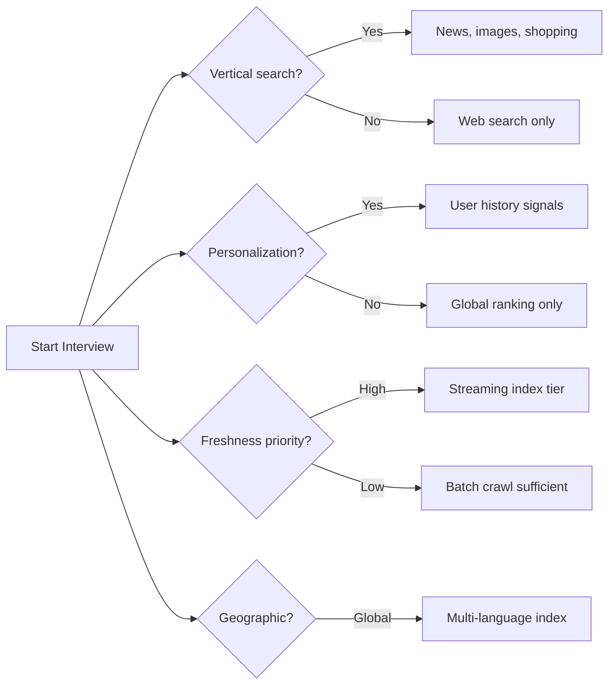

1. **Web only** or verticals (news, images)?
2. **Personalization** — same results for all users or personalized?
3. **Freshness** — how quickly should breaking news appear?
4. **Scale** — billions of pages or millions (startup vs Google)?
5. **Autocomplete** in scope?
6. **Spam / SEO manipulation** defenses?

---

## 2. Requirements

### 2.1 Functional Requirements

#### Must-Have (P0)

| ID | Requirement | Notes |
|----|-------------|-------|
| F1 | Crawl and discover web pages | Respect robots.txt |
| F2 | Parse HTML, extract text, links, metadata | Boilerplate removal |
| F3 | Build inverted index (term → doc IDs) | Offline batch + incremental |
| F4 | Rank pages by relevance and authority | PageRank + text signals |
| F5 | Serve search queries with top-K results | p99 < 200 ms |
| F6 | Display title, URL, snippet per result | Snippet generation |
| F7 | Autocomplete as user types | Prefix trie / FST |
| F8 | Spell correction ("Did you mean...") | Edit distance |
| F9 | Handle multi-word queries (AND/OR) | Boolean retrieval |
| F10 | Deduplicate near-duplicate pages | SimHash / shingling |

#### Nice-to-Have (P1)

| ID | Requirement | Notes |
|----|-------------|-------|
| F11 | Fresh index tier for recent pages | Streaming pipeline |
| F12 | Safe search filtering | Classifier on index |
| F13 | Query suggestions ("People also ask") | Query log mining |
| F14 | Image thumbnails in results | Separate image index |
| F15 | Geographic relevance (local results) | Geo signals |
| F16 | Site-restricted search (`site:example.com`) | Filter on crawl domain |
| F17 | Synonym expansion | "car" ≈ "automobile" |
| F18 | Knowledge panel for entities | Structured data extraction |

### 2.2 Non-Functional Requirements

#### Must-Have

| ID | Requirement | Target |
|----|-------------|--------|
| NF1 | Query latency (p99) | < 200 ms end-to-end |
| NF2 | Availability | 99.99% |
| NF3 | Index freshness | Full re-index every 2 weeks; news < 1 hour |
| NF4 | Crawl politeness | ≤ 1 req/sec per domain |
| NF5 | Scale | 100B pages, 500K QPS peak |
| NF6 | Index durability | No document loss on shard failure |
| NF7 | Autocomplete latency | < 50 ms |

#### Nice-to-Have

| ID | Requirement | Target |
|----|-------------|--------|
| NF8 | Recall | > 95% of relevant pages in top-100 candidates |
| NF9 | Index compression | < 20% of raw corpus size |
| NF10 | Crawl budget efficiency | Prioritize high-PageRank, fresh pages |

### 2.3 Requirements Summary Diagram

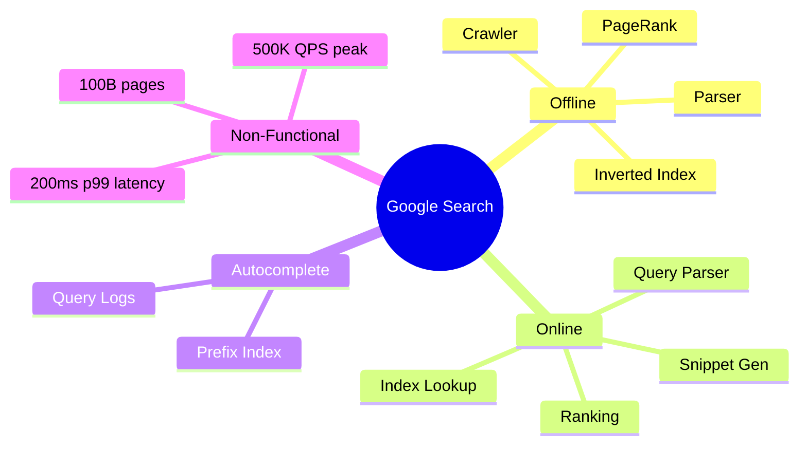

---

## 3. Capacity Estimation

### 3.1 Query Traffic

```
Searches/day:           8B
QPS (avg):              8B / 86,400 ≈ 92,600
QPS (peak 5×):          ~500,000
Autocomplete QPS:       ~5× search (keystrokes) ≈ 2.5M peak
```

### 3.2 Crawl & Storage

```
Pages indexed:          100B
Avg page (parsed text): 20 KB (after boilerplate removal)
Raw corpus text:        100B × 20 KB = 2 PB

HTML storage (debug):   100B × 50 KB = 5 PB
Link graph edges:       100B pages × 50 links × 8 B = 40 TB

Crawl rate (2-week cycle):
  100B / 14 days ≈ 83K pages/sec continuous crawl
```

### 3.3 Inverted Index Size

```
Vocabulary (unique terms): ~50M terms (after stemming)
Avg posting list:         100B / 50M ≈ 2000 doc IDs per term (avg)
Posting list entry:       4 bytes (doc ID delta encoding)
Index size (raw):         50M × 2000 × 4 B ≈ 400 GB (uncompressed)
With compression (PForDelta + variable byte): ~80-120 GB
With replicas (3×) across shards: ~500 GB - 2 TB total (varies by term distribution)
```

**Power law:** "the" appears in 80% of pages; rare terms have tiny lists. Index is heavily skewed.

### 3.4 PageRank Compute

```
Link graph: 100B nodes, ~1T edges
PageRank iterations: ~50 until convergence
Distributed matrix multiply (MapReduce / Spark): hours on 10K+ machines
Recompute: weekly or on major crawl completion
```

### 3.5 Query Serving Memory

```
Hot index shard in memory: ~20 GB per shard
Shards needed: 100B docs / 10M per shard = 10,000 shards
Each query hits 1-3 shards (term-based routing)
```

### 3.6 Capacity Summary

| Resource | Scale | Peak Rate |
|----------|-------|-----------|
| Indexed pages | 100B | — |
| Search QPS | 92K avg | 500K |
| Autocomplete QPS | 460K avg | 2.5M |
| Crawl throughput | 83K pages/sec | — |
| Corpus size | 2 PB text | — |
| Index size | ~1-2 TB compressed | — |
| Link graph | ~40 TB | — |

---

## 4. Core Entities

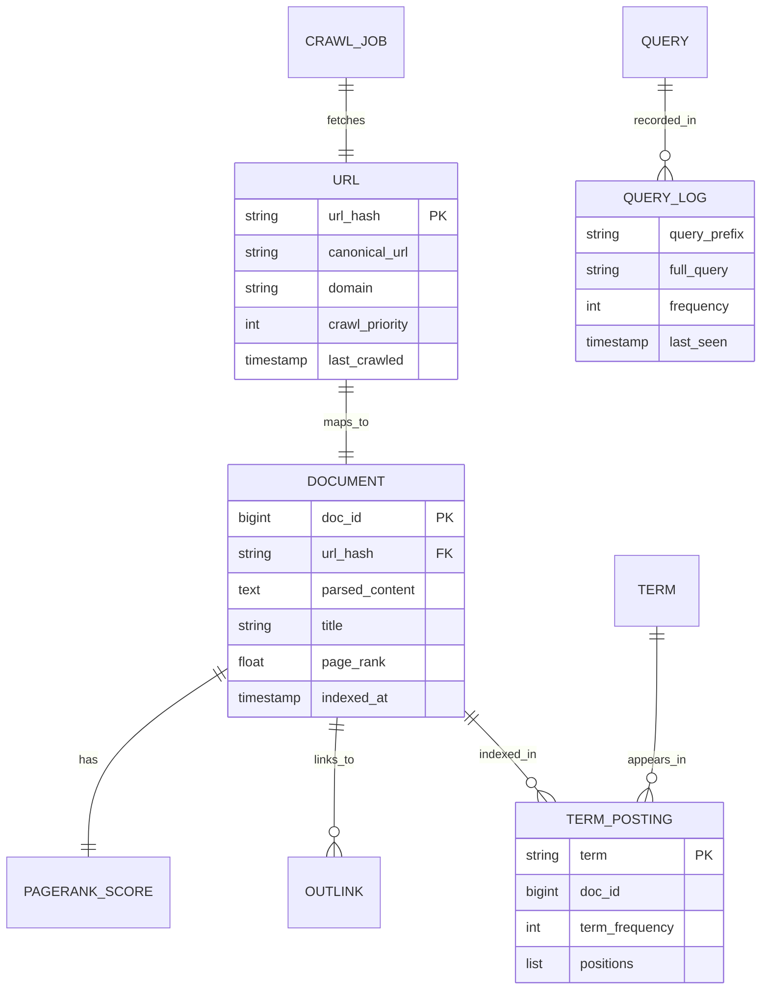

### Entity Glossary

| Entity | Description |
|--------|-------------|
| **URL** | Canonical web address in crawl frontier |
| **Document** | Parsed, deduplicated page with assigned doc_id |
| **Term** | Stemmed, normalized word or phrase |
| **Posting** | Single (term, doc_id, tf, positions) entry |
| **Outlink** | Hyperlink from one document to another |
| **PageRank Score** | Precomputed authority score per document |
| **Query Log** | Aggregated user query for autocomplete |

---

## 5. API Design

### 5.1 Search API

```
GET /v1/search?q=system+design+interview&page=1&num=10
```

**Response:**
```json
{
  "query": "system design interview",
  "corrected_query": null,
  "total_results": 45000000,
  "latency_ms": 87,
  "results": [
    {
      "doc_id": 12345678,
      "title": "System Design Interview Guide",
      "url": "https://example.com/guide",
      "snippet": "...system design <b>interview</b> preparation...",
      "page_rank": 0.0042
    }
  ],
  "related_queries": ["system design interview questions", "hello interview"]
}
```

### 5.2 Autocomplete API

```
GET /v1/autocomplete?q=system+des&limit=8
```

**Response:**
```json
{
  "suggestions": [
    { "query": "system design interview", "score": 0.95 },
    { "query": "system design primer", "score": 0.82 },
    { "query": "system design netflix", "score": 0.71 }
  ],
  "latency_ms": 12
}
```

### 5.3 Internal Crawl API

| Method | Endpoint | Description |
|--------|----------|-------------|
| `POST` | `/internal/crawl/schedule` | Add URLs to frontier |
| `GET` | `/internal/crawl/status/{url_hash}` | Last crawl metadata |
| `POST` | `/internal/index/ingest` | Push parsed document to indexer |

### 5.4 End-to-End Query Flow

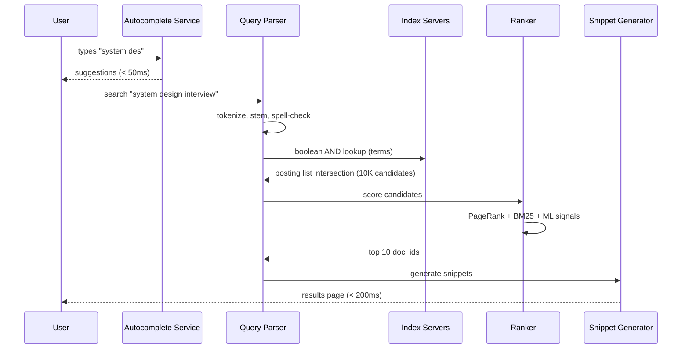

---

## 6. Data Model / Schema

### 6.1 URL Frontier (Crawl Scheduler)

```sql
CREATE TABLE url_frontier (
    url_hash        CHAR(64) PRIMARY KEY,
    url             TEXT NOT NULL,
    domain          VARCHAR(255) NOT NULL,
    priority        FLOAT DEFAULT 0.5,
    last_crawled    TIMESTAMP,
    next_crawl      TIMESTAMP,
    crawl_delay_ms  INT DEFAULT 1000,
    status          ENUM('pending', 'crawling', 'done', 'failed', 'blocked'),
    INDEX idx_domain_next (domain, next_crawl)
);
```

### 6.2 Document Store

```sql
CREATE TABLE documents (
    doc_id          BIGINT PRIMARY KEY,
    url_hash        CHAR(64) UNIQUE,
    title           VARCHAR(500),
    content_hash    CHAR(64),
    page_rank       FLOAT,
    indexed_at      TIMESTAMP,
    shard_id        INT
);
```

### 6.3 Inverted Index (Logical)

```
term "system" → [doc_id: 42, tf: 3, pos: [0, 45, 120]],
                 [doc_id: 99, tf: 1, pos: [7]],
                 [doc_id: 201, tf: 5, pos: [2, 15, 88, 200, 340]]]

Stored as compressed posting lists per (term, shard_id)
```

### 6.4 Autocomplete Index (Prefix → Queries)

```
Prefix trie or Finite State Transducer (FST):
  "sys" → ["system design interview" (freq: 500K),
            "system design primer" (freq: 120K),
            "system of a down" (freq: 80K)]
```

---

## 7. High-Level Architecture

### 7.1 System Architecture

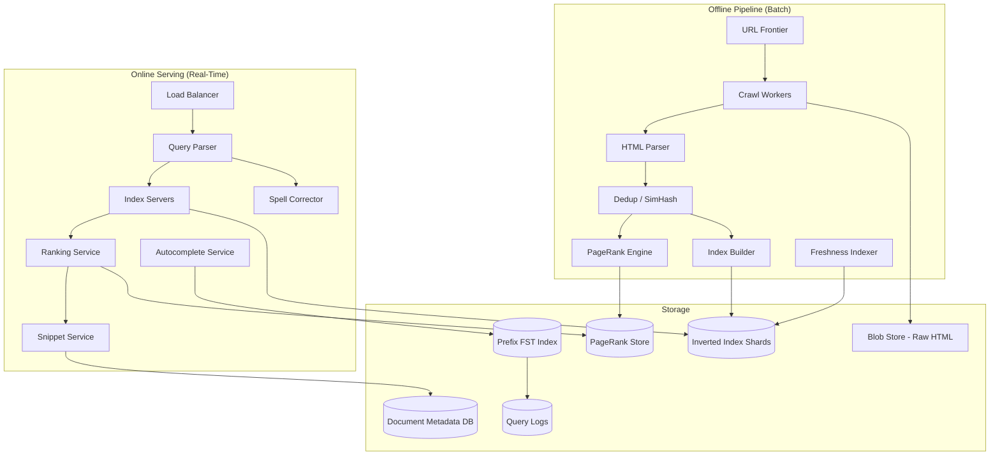

### 7.2 Offline vs Online Separation

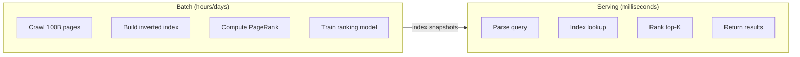

**Key insight:** Query serving NEVER crawls or indexes. It reads pre-computed structures.

### 7.3 Index Sharding Strategy

```mermaid
flowchart TB
    Q[Query: "system design interview"] --> R[Router]
    R -->|term "system"| S1[Shard 1]
    R -->|term "design"| S3[Shard 3]
    R -->|term "interview"| S7[Shard 7]
    S1 & S3 & S7 --> INT[Intersection]
    INT --> RANK[Ranker]
```

**Document-based sharding** (each shard holds all terms for a subset of docs) vs **term-based sharding** (each shard holds all docs for a subset of terms).

**Google approach:** Hybrid — term-based for index lookup, with replication for hot terms.

---

## 8. Deep Dives

### 8.1 Deep Dive #1: Web Crawler

#### Crawler Components

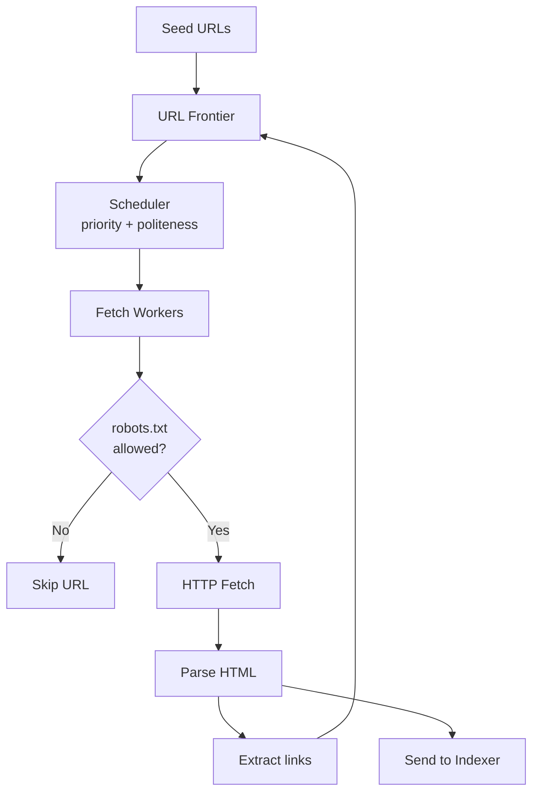

#### URL Frontier Design

| Component | Purpose |
|-----------|---------|
| **Priority queue** | High PageRank, frequently updated domains first |
| **Politeness manager** | Max 1 req/sec per domain; respect `Crawl-delay` |
| **Duplicate filter** | Bloom filter for seen URLs (100B bits ≈ 12 GB) |
| **Per-domain queue** | Prevents one domain from starving others |

#### Politeness & Ethics

```
robots.txt rules:
  User-agent: Googlebot
  Disallow: /private/
  Crawl-delay: 2

DNS resolution cache: avoid hammering DNS
Exponential backoff on 429/503
Honor rel="canonical" to avoid duplicate crawl
```

#### Crawl Priority Formula

```
priority(url) = α × page_rank(url)
              + β × freshness_score(last_modified)
              + γ × url_depth_penalty
              + δ × domain_trust_score
```

#### Scale Challenges

| Challenge | Solution |
|-----------|----------|
| 100B URL frontier | Distributed priority queues (per-domain shards) |
| Network bandwidth | 83K pages/sec × 50 KB = 4 GB/sec crawl bandwidth |
| JavaScript-rendered pages | Headless Chrome render farm (expensive; selective) |
| Crawl traps (infinite URLs) | Max depth limit; URL pattern dedup |
| Dynamic content | Re-crawl based on change detection (SimHash diff) |

### 8.2 Deep Dive #2: Inverted Index

#### What Is an Inverted Index?

Forward index: `doc → [terms]` (natural for storage)  
Inverted index: `term → [docs]` (required for search)

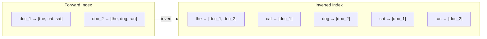

#### Building the Index (MapReduce)

```
Map phase:
  Input: (doc_id, parsed_text)
  Output: (term, doc_id, tf, positions) for each term in doc

Shuffle:
  Group by term

Reduce phase:
  Input: (term, [(doc_id, tf, pos), ...])
  Output: (term, compressed_posting_list)
```

#### Posting List Compression

| Technique | Description |
|-----------|-------------|
| **Delta encoding** | Store doc_id differences (sorted list) |
| **PForDelta** | Frame-of-reference encoding for deltas |
| **Variable-byte** | Variable-length integer encoding |
| **Impact:** 4-byte doc_id → ~1 byte average |

#### Query Processing (Boolean Retrieval)

```
Query: "system design interview"

1. Tokenize → ["system", "design", "interview"]
2. Stem → ["system", "design", "interview"] (Porter stemmer)
3. Lookup posting lists for each term
4. Intersect posting lists (merge-join on sorted doc_ids)
5. Result: candidate doc_ids (potentially millions)
6. Pass to ranker for top-K selection
```

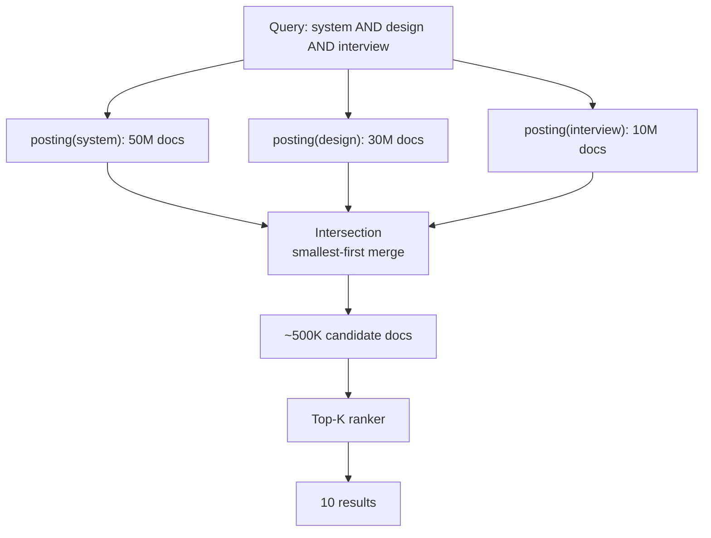

**Optimization:** Process shortest posting list first; skip doc_ids not in smallest set.

#### Stop Words & Rare Terms

```
Stop words ("the", "a", "is"): removed from index OR kept with aggressive compression
Rare terms (appear in < 5 docs): inline in posting list
Very common terms: secondary index or "the" bucket (every doc)
```

### 8.3 Deep Dive #3: PageRank

#### Intuition

A page is important if **important pages link to it**. PageRank models a random surfer clicking links.

#### Formula

```
PR(A) = (1-d)/N + d × Σ(PR(T_i) / C(T_i))

Where:
  d = damping factor (0.85)
  N = total pages
  T_i = pages linking to A
  C(T_i) = outlinks from T_i
```

#### Power Iteration (Offline)

```
Initialize: PR(doc) = 1/N for all docs
Repeat until convergence (~50 iterations):
  For each doc:
    PR_new(doc) = (1-d)/N + d × Σ(PR(linker) / outlinks(linker))
```

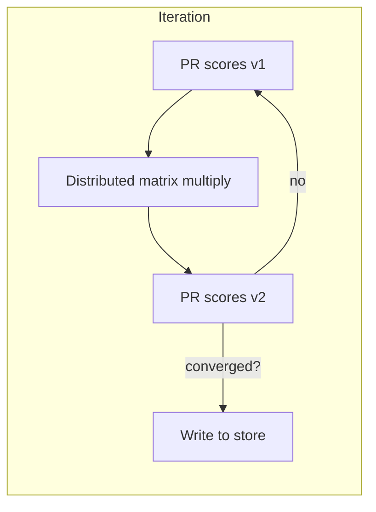

#### Distributed PageRank (MapReduce)

```
Map: (linker, target) → emit (target, PR(linker)/outlinks)
Reduce: (target, [contributions]) → sum → new PR

Storage: 100B × 4 bytes = 400 GB per iteration
Iterations: 50 × 400 GB = 20 TB total shuffle (over hours)
```

#### PageRank in Query Ranking

```
final_score(doc, query) = α × text_relevance(doc, query)
                        + β × page_rank(doc)
                        + γ × freshness(doc)
                        + δ × ml_signals(doc, query, user)

PageRank is ONE signal — text relevance (BM25) often dominates for specific queries
```

### 8.4 Deep Dive #4: Query Serving

#### Latency Budget Breakdown

```
Total budget: 200 ms (p99)

  Query parsing + spell check:    5 ms
  Index lookup (network + disk):  30 ms
  Posting list intersection:      10 ms
  Ranking (top 1000 → top 10):   50 ms
  Snippet generation:            20 ms
  Network + serialization:       15 ms
  Buffer:                        70 ms
```

#### Two-Phase Retrieval

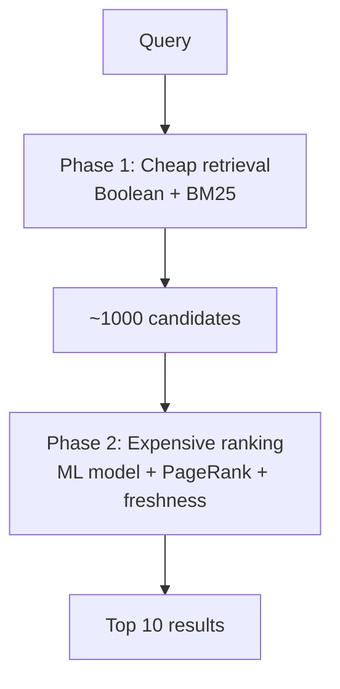

**Why two phases?** Cannot run ML ranker on 500K intersection results in 50 ms.

#### BM25 Text Relevance

```
BM25(doc, query) = Σ IDF(term) × (tf × (k1+1)) / (tf + k1 × (1 - b + b × |doc|/avgdl))

IDF(term) = log((N - df + 0.5) / (df + 0.5))
  N = total docs, df = docs containing term

k1 = 1.2, b = 0.75 (tuning parameters)
```

Precompute IDF at index time; compute BM25 at query time on candidates only.

#### Index Server Architecture

```
Each index server:
  - Loads shard of inverted index into memory (~20 GB)
  - SSD backup for cold terms
  - Replicated 3× for availability
  - Colocated with ranker for minimal network hop

Query router:
  - Hashes query terms → shard mapping
  - Fan-out to relevant shards in parallel
  - Merges posting list results
```

### 8.5 Deep Dive #5: Autocomplete

#### Requirements

- **Prefix match:** "sys" → "system design interview"
- **Popularity ranking:** Most frequent queries first
- **Latency:** < 50 ms
- **Scale:** Billions of unique queries in history

#### Data Structure: Finite State Transducer (FST)

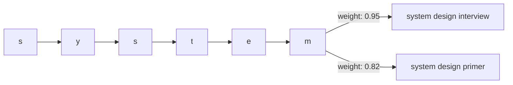

**FST advantages over trie:**
- Compressed (shared prefixes and suffixes)
- O(prefix length) lookup
- Entire autocomplete index fits in ~10-50 GB RAM

#### Autocomplete Pipeline

```
1. Aggregate query logs daily: (query, frequency)
2. Filter: remove spam, PII, offensive content
3. Build FST from top 500M queries
4. Deploy to autocomplete servers (replicated globally)
5. On keystroke: lookup prefix → return top-8 by frequency
```

#### Personalization (Optional)

```
score(query, user) = global_freq(query) + λ × user_history_match(query)
```

#### Caching Layer

```
Redis cache: prefix → suggestions (TTL 1 hour)
Cache hit rate: ~60% (popular prefixes repeat)
Fallback: FST lookup on cache miss
```

### 8.6 Deep Dive #6: Spell Correction

#### "Did You Mean?" Pipeline

```
Query: "systm design interveiw"

1. Tokenize → ["systm", "design", "interveiw"]
2. For each token:
   a. Check if term exists in dictionary (index vocabulary)
   b. If not: find candidates within edit distance 2
   c. Rank candidates by: edit_distance + keyboard_distance + query_log_frequency
3. Suggest: "system design interview"
```

| Algorithm | Complexity | Use |
|-----------|------------|-----|
| Levenshtein DP | O(m×n) per pair | Offline candidate gen |
| BK-tree | O(log n) lookup | Fast nearest-neighbor |
| Symmetric delete | O(1) index lookup | Production (SymSpell) |

### 8.7 Deep Dive #7: Freshness & Incremental Indexing

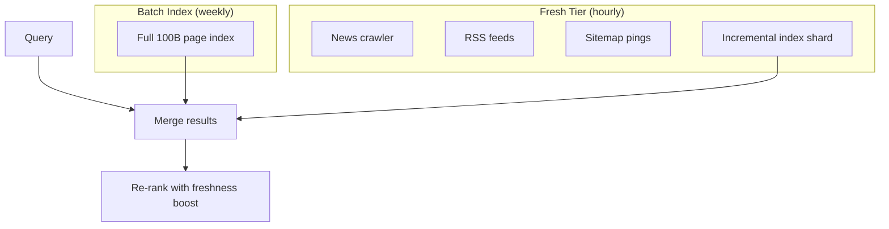

**Interview talking point:** "Separate fresh index for news; merge at query time with freshness-weighted ranking."

---

## 9. Trade-offs & Alternatives

### 9.1 Index Sharding Strategies

| Strategy | Pros | Cons |
|----------|------|------|
| Document-based | Local intersection | Must query ALL shards for every term |
| Term-based | Query only relevant shards | Hot terms create hotspots |
| Hybrid | Balanced | Complex routing |

### 9.2 Real-Time vs Batch Indexing

| Model | Freshness | Complexity | Cost |
|-------|-----------|------------|------|
| Batch only | Days/weeks | Low | Low |
| Incremental | Hours | Medium | Medium |
| Streaming (Kafka) | Minutes | High | High ✓ for news |

### 9.3 Crawl Politeness vs Freshness

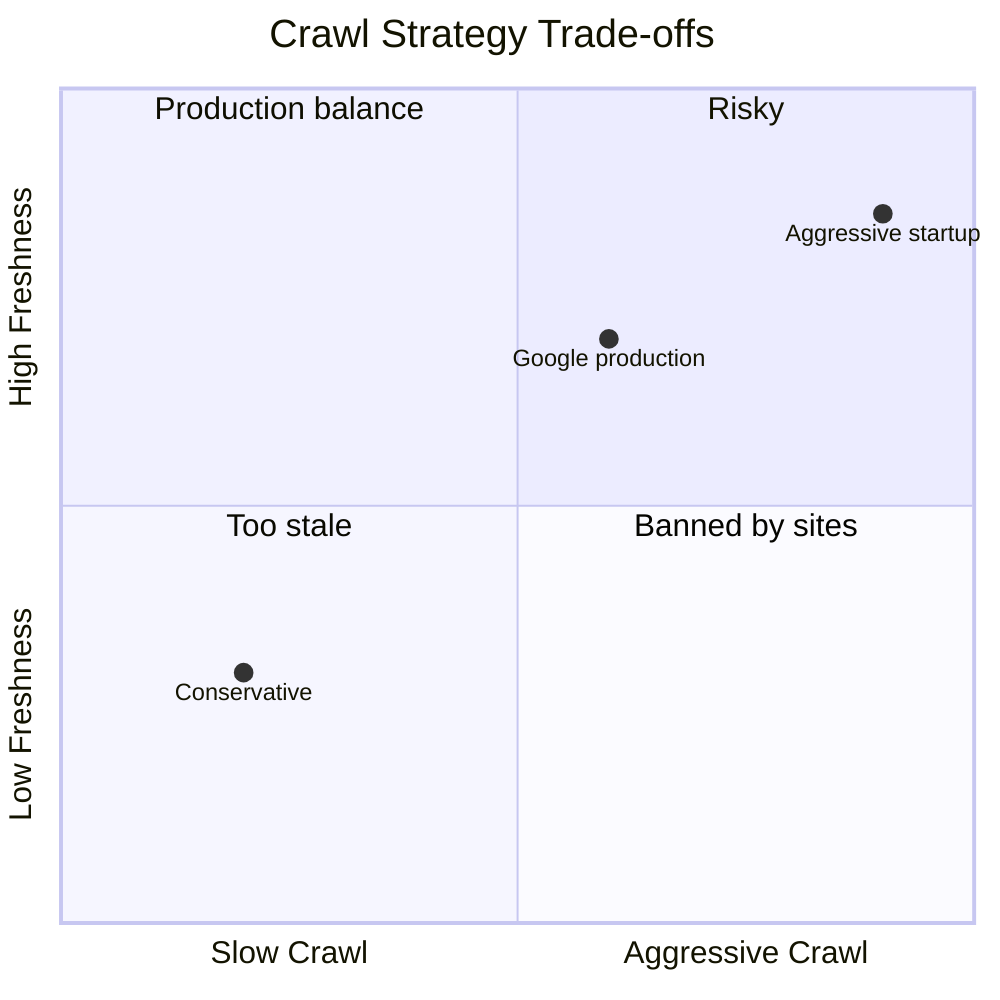

### 9.4 PageRank Alternatives

| Algorithm | Description |
|-----------|-------------|
| PageRank | Global authority (Google classic) |
| HITS (Hubs/Authorities) | Query-dependent; two-pass |
| TrustRank | Anti-spam; seed from trusted sites |
| ML Learned Authority | Neural link features |

### 9.5 Storage Engines for Index

| Engine | Fit |
|--------|-----|
| Custom in-memory | Google production (proprietary) |
| Elasticsearch / Lucene | Interview-friendly; inverted index built-in |
| RocksDB | Persistent posting list storage |

---

## 10. Failure Modes & Reliability

### 10.1 Failure Mode Matrix

| Failure | Impact | Detection | Mitigation |
|---------|--------|-----------|------------|
| Index shard down | Partial results missing | Health check | Replica failover; degrade gracefully |
| Crawler IP blocked | Domain goes stale | 403 rate spike | Rotate IPs; reduce crawl rate |
| PageRank job fails | Stale authority scores | Job monitor | Use previous scores; retry nightly |
| Hot term shard overload | Latency spike on common term | p99 alert | Replicate hot shards; cache posting lists |
| Autocomplete FST corrupt | No suggestions | Validation on deploy | Rollback; serve from replica |
| Bloom filter false positive | URL skipped | Coverage audit | Rebuild filter; secondary exact check |
| Query spike (news event) | 10× QPS | Auto-scaling trigger | Pre-warm caches; scale index servers |

### 10.2 Index Replication

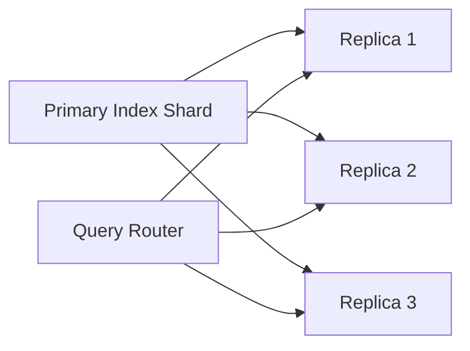

### 10.3 Crawler Failure Recovery

```
- Failed fetch → retry 3× with exponential backoff
- Persistent failure → mark URL as failed, re-queue in 24h
- Domain-wide block → pause domain queue, alert ops
- Checkpoint frontier state every 60s → resume on restart
```

### 10.4 Disaster Recovery

- **RPO:** Index snapshots daily; fresh tier minutes
- **RTO:** < 5 min for query serving (replica failover); hours for full re-index
- **Geographic:** Index shards replicated across regions

### 10.5 Monitoring

| Metric | Alert Threshold |
|--------|-----------------|
| Query p99 latency | > 200 ms |
| Index coverage | < 95% of last crawl |
| Crawl rate | < 50% of target |
| Autocomplete p99 | > 50 ms |
| Zero-result rate | > 15% of queries |
| PageRank iteration delta | Not converging after 100 iterations |

---

## 11. Interview Cheat Sheet

### 11.1 45-Minute Interview Flow

```mermaid
gantt
    title Google Search Interview Timeline
    dateFormat X
    axisFormat %M min

    section Phases
    Clarify requirements     :0, 5
    Capacity estimation      :5, 10
    High-level architecture  :10, 18
    Deep dive: crawl + index :18, 28
    Deep dive: PageRank + serving :28, 36
    Deep dive: autocomplete  :36, 40
    Trade-offs & wrap-up     :40, 45
```

### 11.2 Key Talking Points

1. **Offline/online separation** — crawl and index are batch; serving reads pre-computed structures
2. **Inverted index** is the core data structure — term → compressed posting lists
3. **Boolean retrieval first, rank second** — intersect posting lists, then ML/BM25 top-K
4. **PageRank is offline** — precomputed via power iteration on link graph; one signal among many
5. **Two-phase retrieval** — cheap Boolean on 500K candidates → expensive ranker on top 1000
6. **Crawl politeness** — per-domain rate limit, robots.txt, priority queue
7. **Autocomplete = prefix index** — FST over query logs, < 50 ms
8. **Freshness tier** — separate incremental index for news, merged at query time

### 11.3 Expected Follow-Up Questions

| Question | Strong Answer |
|----------|---------------|
| "How do you handle 100B pages?" | Distributed crawl frontier; term-based index sharding; MapReduce index build; compression |
| "Why inverted index, not scan all docs?" | O(posting_list_size) vs O(100B); intersection of 3 terms might be 500K, not 100B |
| "How does PageRank handle dangling pages?" | Distribute PR uniformly (teleport probability d=0.85) |
| "How do you detect duplicate pages?" | SimHash on content; canonical URL; near-duplicate clustering |
| "What about JavaScript-heavy SPAs?" | Selective headless rendering; expensive; prioritize by PageRank |
| "How do you prevent SEO spam?" | TrustRank, link farm detection, content quality classifiers, manual actions |
| "Index a page in 1 hour for breaking news?" | Fresh tier: RSS/sitemap ping → fast-track crawl → incremental index → merge at query |
| "Storage cost for 100B pages?" | 2 PB text; index compressed to ~1-2 TB; tiered blob storage for raw HTML |

### 11.4 Common Mistakes to Avoid

| Mistake | Why It's Wrong |
|---------|----------------|
| Crawling at query time | Absurd latency; crawl is offline |
| Scanning all 100B docs per query | O(N) — inverted index exists to avoid this |
| Computing PageRank at query time | 50 iterations × 100B nodes — must be offline |
| Ignoring crawl politeness | Gets IP banned; legal/ethical issue |
| No spell correction | 10-15% of queries have typos |
| Single monolithic index | Cannot fit 100B docs in one machine's RAM |
| Treating PageRank as the only signal | Text relevance (BM25) dominates for specific queries |

### 11.5 Diagrams to Draw on Whiteboard

1. **Crawl frontier loop** (fetch → parse → extract links → re-queue)
2. **Inverted index** (term → posting list)
3. **Posting list intersection** for multi-term query
4. **PageRank power iteration** on link graph
5. **Two-phase retrieval** (Boolean → ML ranker)
6. **Autocomplete FST** prefix lookup

### 11.6 Quick Reference Numbers

| Metric | Value |
|--------|-------|
| Indexed pages | 100B |
| Search QPS (peak) | 500K |
| Query latency p99 | 200 ms |
| Autocomplete latency | 50 ms |
| Crawl rate | 83K pages/sec |
| PageRank damping | 0.85 |
| Index compression | ~5:1 ratio |
| Freshness (news) | < 1 hour |

---

## References & Further Reading

- [Brin & Page — The Anatomy of a Large-Scale Hypertextual Web Search Engine (1998)](http://infolab.stanford.edu/~backrub/google.html)
- [Introduction to Information Retrieval (Manning, Raghavan, Schütze)](https://nlp.stanford.edu/IR-book/)
- [Google Caffeine — Incremental Indexing](https://googleblog.blogspot.com/)
- [Finite State Transducers in Lucene](https://lucene.apache.org/)
- [Hello Interview — Design Google Search](https://www.hellointerview.com/)
- [BM25 Ranking Function](https://en.wikipedia.org/wiki/Okapi_BM25)

---

*Guide version 1.0 — Big Tech system design interview preparation.*
