# System Design: AI Recommendation System

> **Interview Level:** Senior/Staff SDE (Google, Meta, Netflix, TikTok, Amazon)  
> **Estimated Time:** 45–60 minutes  
> **Framework:** Hello Interview Delivery Structure  
> **Difficulty:** Hard (ML serving, feature stores, cold start, online/offline duality)

---

## Table of Contents

1. [Problem Statement & Scope](#1-problem-statement--scope)
2. [Requirements](#2-requirements)
3. [Capacity Estimation](#3-capacity-estimation)
4. [Core Entities](#4-core-entities)
5. [API Design](#5-api-design)
6. [Data Model / Schema](#6-data-model--schema)
7. [High-Level Architecture](#7-high-level-architecture)
8. [Deep Dives](#8-deep-dives)
9. [Trade-offs & Alternatives](#9-trade-offs--alternatives)
10. [Failure Modes & Reliability](#10-failure-modes--reliability)
11. [Interview Cheat Sheet](#11-interview-cheat-sheet)

---

## 1. Problem Statement & Scope

### 1.1 The Prompt

> *"Design an AI-powered recommendation system for a content platform (e.g., YouTube, Netflix, TikTok) that personalizes feeds based on user behavior, content features, and real-time context. Handle cold start for new users and new content."*

### 1.2 What an AI Recommendation System Is

A recommendation system is a **machine-learning-driven ranking pipeline** that selects the most relevant items from a massive catalog for each user. Modern systems combine:

- **Collaborative filtering** — "users like you liked X"
- **Content-based filtering** — "you liked action movies; here's another action movie"
- **Two-tower neural models** — learned embeddings for users and items
- **Feature store** — centralized, versioned features for training and serving
- **Online serving** — sub-100ms inference at request time
- **Offline training** — batch pipelines that retrain models daily/hourly
- **Cold start** — fallback strategies for new users and new items

The core tension: **rich ML models need rich features** vs **serving latency budget of < 100 ms** vs **cold start with zero interaction history**.

### 1.3 Scope Boundaries

| In Scope | Out of Scope (Unless Asked) |
|----------|----------------------------|
| Multi-stage ranking funnel | Full ads auction / monetization |
| Collaborative + content-based filtering | Real-time model training (online learning) |
| Two-tower embedding model | Deep neural ranker internals (transformers) |
| Feature store (online + offline) | A/B testing platform internals |
| Online inference serving | Content moderation in recommendations |
| Offline batch training pipeline | Cross-platform identity resolution |
| Cold start strategies | Explainability / "why this recommendation" |
| Exploration vs exploitation | Federated learning / privacy-preserving ML |

### 1.4 Assumptions

- **Platform:** Video/content feed (YouTube-style)
- **Users:** 500M DAU
- **Catalog:** 500M items (videos)
- **Feed requests:** 2B feed loads/day (~23K QPS avg, ~120K QPS peak)
- **Avg feed size:** 20 items per response
- **User interaction history:** Avg 500 viewed items per user
- **Feature dimensionality:** ~500 features per (user, item) pair
- **Model refresh:** Daily offline retrain; hourly embedding refresh

### 1.5 Clarifying Questions to Ask the Interviewer

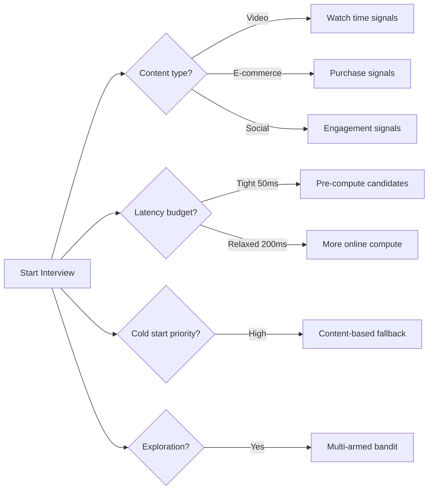
```mermaid
flowchart LR
    A[Start Interview] --> B{Content type?}
    B -->|Video| C[Watch time signals]
    B -->|E-commerce| D[Purchase signals]
    B -->|Social| E[Engagement signals]
    A --> F{Latency budget?}
    F -->|Tight 50ms| G[Pre-compute candidates]
    F -->|Relaxed 200ms| H[More online compute]
    A --> I{Cold start priority?}
    I -->|High| J[Content-based fallback]
    A --> K{Exploration?}
    K -->|Yes| L[Multi-armed bandit]
```

1. **Content type** — video, products, articles, music?
2. **Primary engagement signal** — clicks, watch time, purchases?
3. **Latency budget** for feed generation?
4. **Cold start** — how important for new users vs new content?
5. **Real-time personalization** — same session re-ranking?
6. **Diversity** — avoid filter bubbles?

---

## 2. Requirements

### 2.1 Functional Requirements

#### Must-Have (P0)

| ID | Requirement | Notes |
|----|-------------|-------|
| F1 | Generate personalized feed per user | 20 items per request |
| F2 | Rank by predicted engagement (CTR, watch time) | ML model |
| F3 | Candidate generation from 500M catalog | Reduce to ~1000 |
| F4 | Filter already-seen / blocked content | User history check |
| F5 | Handle new users (cold start) | Popularity + onboarding prefs |
| F6 | Handle new content (cold start) | Content-based features |
| F7 | Incorporate real-time context (device, time, session) | Context features |
| F8 | Exploration of new content | ε-greedy or Thompson sampling |
| F9 | Diversity in feed (not all same creator/topic) | Re-ranking rules |
| F10 | Feature logging for model training | Implicit feedback loop |

#### Nice-to-Have (P1)

| ID | Requirement | Notes |
|----|-------------|-------|
| F11 | "Not interested" negative feedback | Downrank similar |
| F12 | Multi-objective ranking (engagement + retention) | Weighted loss |
| F13 | Geographic / language filtering | Locale features |
| F14 | Freshness boost for recent uploads | Time-decay feature |
| F15 | Social signals (friends watched) | Graph features |
| F16 | Session-based re-ranking (next 5 items) | Sequential model |
| F17 | Notification-triggered recommendations | Push personalization |
| F18 | Creator diversity quotas | Fairness constraint |

### 2.2 Non-Functional Requirements

#### Must-Have

| ID | Requirement | Target |
|----|-------------|--------|
| NF1 | Feed latency (p99) | < 100 ms |
| NF2 | Availability | 99.99% |
| NF3 | Model freshness | Daily retrain; embeddings refreshed hourly |
| NF4 | Scale | 120K QPS peak, 500M item catalog |
| NF5 | Feature freshness (online) | < 5 min for real-time features |
| NF6 | Training data volume | 10B interactions/day |
| NF7 | Candidate recall | > 80% of relevant items in top-1000 candidates |

#### Nice-to-Have

| ID | Requirement | Target |
|----|-------------|--------|
| NF8 | Exploration rate | 10-15% non-personalized slots |
| NF9 | Feature store latency | < 10 ms for online feature lookup |
| NF10 | Model rollback | < 5 min to previous version |
| NF11 | A/B test isolation | Per-experiment model variants |

### 2.3 Requirements Summary Diagram

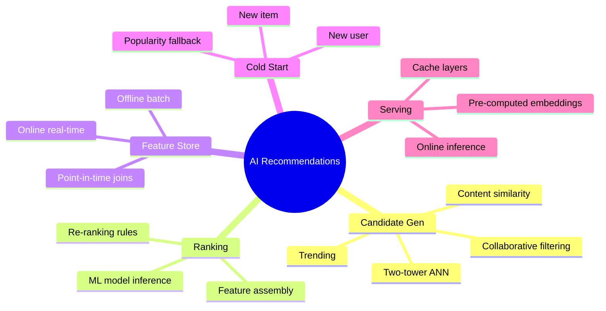
```mermaid
mindmap
  root((AI Recommendations))
    Candidate Gen
      Collaborative filtering
      Two-tower ANN
      Content similarity
      Trending
    Ranking
      Feature assembly
      ML model inference
      Re-ranking rules
    Feature Store
      Offline batch
      Online real-time
      Point-in-time joins
    Cold Start
      New user
      New item
      Popularity fallback
    Serving
      Online inference
      Pre-computed embeddings
      Cache layers
```

---

## 3. Capacity Estimation

### 3.1 Traffic

```
DAU:                    500M
Feed loads/day:         2B (4 loads/user/day)
Feed QPS (avg):         2B / 86,400 ≈ 23,150
Feed QPS (peak 5×):     ~120,000

Interactions/day:       10B (clicks, views, likes)
Interaction QPS:        ~115,000 avg
```

### 3.2 Candidate Generation

```
Catalog size:           500M items
Candidates per request: 1000
ANN lookups/sec:        120K QPS
Embedding dimension:    128 floats × 4 B = 512 B per vector

User embedding cache:   500M users × 512 B = 256 GB
Item embedding index:   500M items × 512 B = 256 GB (ANN index overhead ~3× = 768 GB)
```

### 3.3 Feature Store

```
Features per user:      ~200 (profile, history aggregates, embeddings)
Features per item:      ~150 (metadata, engagement stats, embeddings)
Cross features:         ~150 (computed at serving time)

Online feature store:   500M users × 200 features × 8 B ≈ 800 GB
Offline training set:   10B interactions/day × 500 features × 4 B ≈ 20 TB/day
```

### 3.4 Model Serving

```
Ranking model inference:
  Input: 1000 candidates × 500 features
  Batch inference: 1000 × 500 × 4 B = 2 MB per request
  Inference time: ~20 ms on GPU / ~50 ms on CPU (batched)
  Throughput: 120K QPS → need ~2400 GPU inference instances (batched)
```

### 3.5 Training Pipeline

```
Training data: 10B interactions/day × 30 days = 300B samples/month
Model size: ~500M parameters × 4 B = 2 GB
Training time: ~4 hours on 64 GPU cluster (daily retrain)
Embedding refresh: hourly incremental update on new interactions
```

### 3.6 Capacity Summary

| Resource | Scale | Peak Rate |
|----------|-------|-----------|
| Feed requests | 2B/day | 120K QPS |
| Interactions | 10B/day | 115K QPS |
| Catalog items | 500M | — |
| Candidates/request | 1000 | — |
| User embeddings | 256 GB | — |
| Item ANN index | ~768 GB | — |
| Training data/day | 20 TB | — |

---

## 4. Core Entities

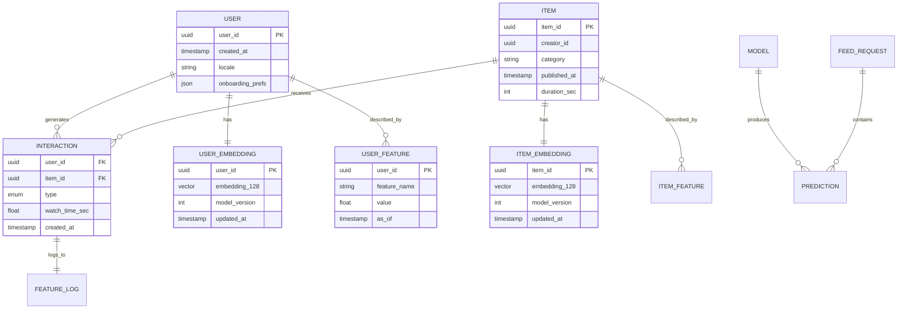
```mermaid
erDiagram
    USER ||--o{ INTERACTION : generates
    USER ||--|| USER_EMBEDDING : has
    USER ||--o{ USER_FEATURE : described_by
    ITEM ||--o{ INTERACTION : receives
    ITEM ||--|| ITEM_EMBEDDING : has
    ITEM ||--o{ ITEM_FEATURE : described_by
    MODEL ||--o{ PREDICTION : produces
    INTERACTION ||--|| FEATURE_LOG : logs_to
    FEED_REQUEST ||--o{ PREDICTION : contains

    USER {
        uuid user_id PK
        timestamp created_at
        string locale
        json onboarding_prefs
    }
    ITEM {
        uuid item_id PK
        uuid creator_id
        string category
        timestamp published_at
        int duration_sec
    }
    INTERACTION {
        uuid user_id FK
        uuid item_id FK
        enum type
        float watch_time_sec
        timestamp created_at
    }
    USER_EMBEDDING {
        uuid user_id PK
        vector embedding_128
        int model_version
        timestamp updated_at
    }
    ITEM_EMBEDDING {
        uuid item_id PK
        vector embedding_128
        int model_version
        timestamp updated_at
    }
    USER_FEATURE {
        uuid user_id PK
        string feature_name
        float value
        timestamp as_of
    }
```

### Entity Glossary

| Entity | Description |
|--------|-------------|
| **User** | Consumer requesting personalized feed |
| **Item** | Content unit (video, product, article) |
| **Interaction** | Implicit/explicit feedback (view, click, like, skip) |
| **User Embedding** | Dense vector from two-tower user encoder |
| **Item Embedding** | Dense vector from two-tower item encoder |
| **Feature** | Named scalar/vector attribute for ML model |
| **Prediction** | Model score for (user, item) pair |
| **Feature Log** | Training example with features + label |

---

## 5. API Design

### 5.1 Feed API

```
GET /v1/feed?user_id={id}&limit=20&context={device, locale, session_id}
```

**Response:**
```json
{
  "feed_id": "feed_abc123",
  "items": [
    {
      "item_id": "vid_001",
      "score": 0.92,
      "source": "two_tower_ann",
      "position": 1
    },
    {
      "item_id": "vid_042",
      "score": 0.87,
      "source": "trending",
      "position": 2
    }
  ],
  "model_version": "ranker_v47",
  "latency_ms": 78,
  "exploration_slots": 3
}
```

### 5.2 Interaction Logging API

```
POST /v1/interactions
{
  "user_id": "u_123",
  "item_id": "vid_001",
  "type": "view",
  "watch_time_sec": 245,
  "feed_id": "feed_abc123",
  "position": 1,
  "timestamp": "2026-07-08T14:30:00Z"
}
```

### 5.3 Internal Model Serving API

| Method | Endpoint | Description |
|--------|----------|-------------|
| `POST` | `/internal/rank` | Score candidate list for user |
| `POST` | `/internal/ann/search` | ANN lookup for user embedding |
| `GET` | `/internal/features/user/{id}` | Online feature lookup |
| `GET` | `/internal/features/item/{id}` | Item feature lookup |
| `POST` | `/internal/embeddings/user` | Compute user embedding |

### 5.3 Feed Generation Sequence

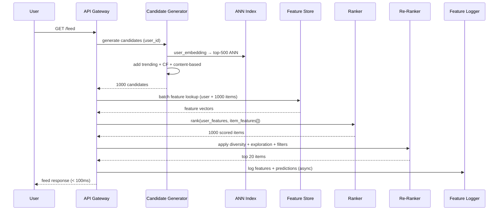
```mermaid
sequenceDiagram
    participant U as User
    participant GW as API Gateway
    participant CG as Candidate Generator
    participant ANN as ANN Index
    participant FS as Feature Store
    participant RK as Ranker
    participant RR as Re-Ranker
    participant FL as Feature Logger

    U->>GW: GET /feed
    GW->>CG: generate candidates (user_id)
    CG->>ANN: user_embedding → top-500 ANN
    CG->>CG: add trending + CF + content-based
    CG-->>GW: 1000 candidates

    GW->>FS: batch feature lookup (user + 1000 items)
    FS-->>GW: feature vectors

    GW->>RK: rank(user_features, item_features[])
    RK-->>GW: 1000 scored items

    GW->>RR: apply diversity + exploration + filters
    RR-->>GW: top 20 items

    GW->>FL: log features + predictions (async)
    GW-->>U: feed response (< 100ms)
```

---

## 6. Data Model / Schema

### 6.1 Interaction Log (Training Data Source)

```sql
CREATE TABLE interactions (
    user_id         UUID,
    item_id         UUID,
    interaction_type ENUM('view', 'click', 'like', 'share', 'skip', 'not_interested'),
    watch_time_sec  FLOAT,
    feed_id         UUID,
    position        INT,
    created_at      TIMESTAMP,
    PRIMARY KEY ((user_id), created_at, item_id)
) WITH CLUSTERING ORDER BY (created_at DESC);
```

### 6.2 Feature Store (Offline — Parquet in Data Lake)

```
/features/offline/
  user_features/dt=2026-07-08/
    user_id, avg_watch_time_7d, categories_watched, embedding_v47, ...
  item_features/dt=2026-07-08/
    item_id, view_count_7d, ctr_7d, category, embedding_v47, ...
  cross_features/dt=2026-07-08/
    user_id, item_id, days_since_last_category_watch, ...
```

### 6.3 Feature Store (Online — Redis / DynamoDB)

```
Key: user_features:{user_id}
Value: {
  "avg_watch_time_7d": 342.5,
  "top_categories": ["tech", "gaming"],
  "embedding_v47": [0.12, -0.34, ...],
  "last_interaction_at": "2026-07-08T14:25:00Z",
  "interactions_today": 15
}
TTL: 24 hours (refreshed on interaction)
```

### 6.4 Embedding Index (ANN)

```
Index: item_embeddings_v47
  Type: HNSW (Hierarchical Navigable Small World)
  Vectors: 500M × 128-dim
  Memory: ~768 GB (with HNSW graph overhead)
  Query: top-500 nearest neighbors in < 5 ms
  Refresh: hourly incremental insert for new items
```

---

## 7. High-Level Architecture

### 7.1 System Architecture

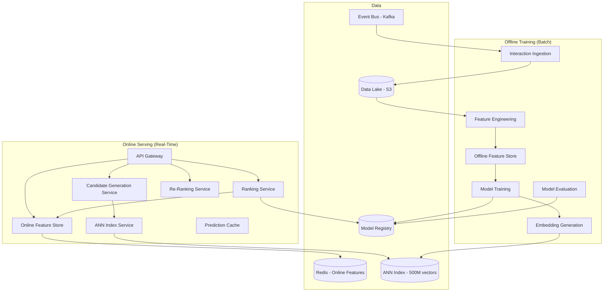
```mermaid
flowchart TB
    subgraph Online["Online Serving (Real-Time)"]
        GW[API Gateway]
        CG[Candidate Generation Service]
        FS_ON[Online Feature Store]
        RK[Ranking Service]
        RR[Re-Ranking Service]
        ANN[ANN Index Service]
        CACHE[Prediction Cache]
    end

    subgraph Offline["Offline Training (Batch)"]
        INGEST[Interaction Ingestion]
        FE[Feature Engineering]
        FS_OFF[Offline Feature Store]
        TRAIN[Model Training]
        EMB[Embedding Generation]
        EVAL[Model Evaluation]
    end

    subgraph Data
        KAFKA[Event Bus - Kafka]
        LAKE[(Data Lake - S3)]
        REDIS[(Redis - Online Features)]
        ANN_IDX[(ANN Index - 500M vectors)]
        MODEL_STORE[(Model Registry)]
    end

    GW --> CG & FS_ON & RK & RR
    CG --> ANN
    ANN --> ANN_IDX
    RK --> FS_ON
    RK --> MODEL_STORE
    FS_ON --> REDIS

    KAFKA --> INGEST
    INGEST --> LAKE
    LAKE --> FE
    FE --> FS_OFF
    FS_OFF --> TRAIN
    TRAIN --> MODEL_STORE
    TRAIN --> EMB
    EMB --> ANN_IDX
    EVAL --> MODEL_STORE
```

### 7.2 Multi-Stage Ranking Funnel

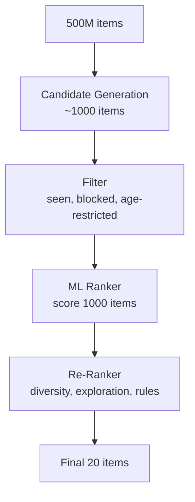
```mermaid
flowchart TD
    CATALOG["500M items"] --> CG["Candidate Generation<br/>~1000 items"]
    CG --> FILTER["Filter<br/>seen, blocked, age-restricted"]
    FILTER --> RANK["ML Ranker<br/>score 1000 items"]
    RANK --> RERANK["Re-Ranker<br/>diversity, exploration, rules"]
    RERANK --> FEED["Final 20 items"]
```

### 7.3 Online/Offline Duality

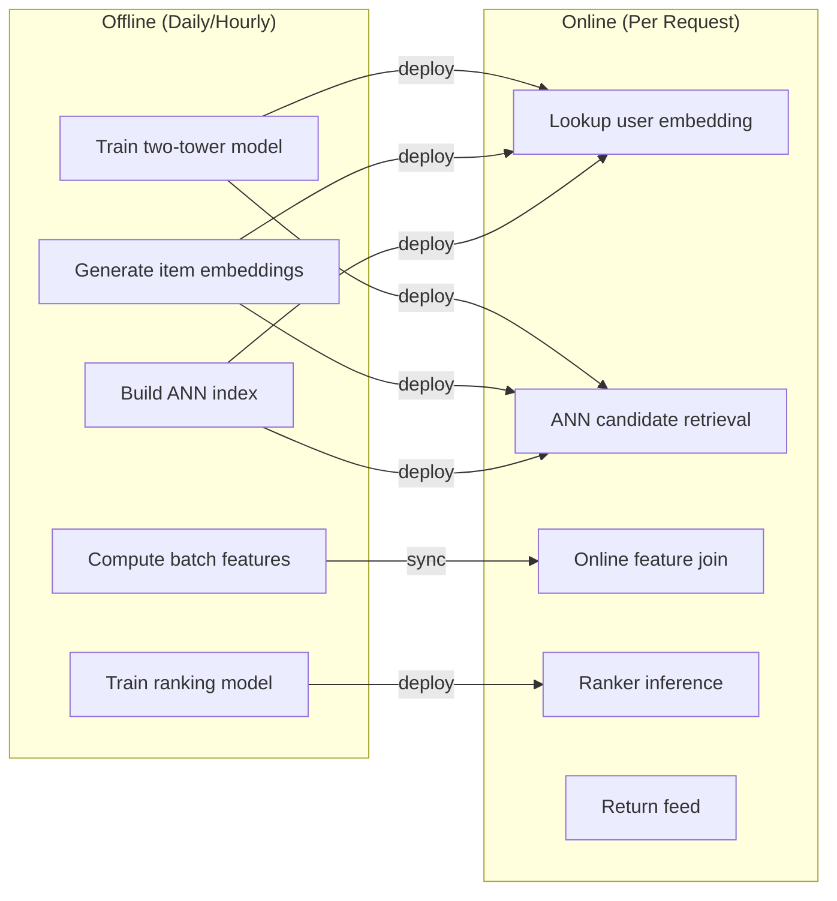
```mermaid
flowchart LR
    subgraph Offline["Offline (Daily/Hourly)"]
        O1[Train two-tower model]
        O2[Generate item embeddings]
        O3[Build ANN index]
        O4[Train ranking model]
        O5[Compute batch features]
    end

    subgraph Online["Online (Per Request)"]
        N1[Lookup user embedding]
        N2[ANN candidate retrieval]
        N3[Online feature join]
        N4[Ranker inference]
        N5[Return feed]
    end

    O1 & O2 & O3 -->|deploy| N1 & N2
    O4 -->|deploy| N4
    O5 -->|sync| N3
```

---

## 8. Deep Dives

### 8.1 Deep Dive #1: Collaborative Filtering

#### Intuition

Find users with similar taste; recommend items they liked that you haven't seen.

#### User-Based CF

```
1. Build user-item interaction matrix (sparse)
2. Compute user-user similarity (cosine, Pearson)
3. For target user U: find top-K similar users
4. Recommend items liked by similar users but not yet seen by U
```

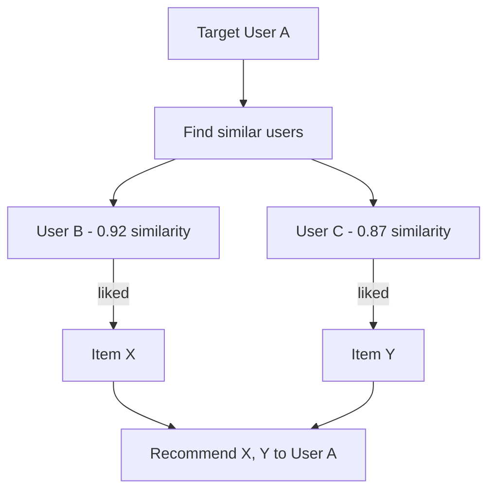
```mermaid
flowchart TD
    U[Target User A] --> SIM[Find similar users]
    SIM --> U2[User B - 0.92 similarity]
    SIM --> U3[User C - 0.87 similarity]
    U2 -->|liked| I1[Item X]
    U3 -->|liked| I2[Item Y]
    I1 & I2 --> REC[Recommend X, Y to User A]
```

#### Item-Based CF

```
1. Compute item-item similarity from co-interaction
2. For each item user liked: find similar items
3. Aggregate scores → top recommendations

Advantage: more stable (items change less than user tastes)
Netflix uses item-based CF for "because you watched X"
```

#### Matrix Factorization

```
R (user × item matrix) ≈ U × V^T

R: sparse interaction matrix (500M users × 500M items — infeasible dense)
U: user latent factors (500M × 50)
V: item latent factors (500M × 50)

Train via SGD on observed interactions:
  loss = Σ (r_ui - u_u · v_i)² + λ(||u_u||² + ||v_i||²)
```

| Method | Pros | Cons |
|--------|------|------|
| User-based CF | Intuitive | Doesn't scale to 500M users |
| Item-based CF | Stable, scalable | Sparse for new items |
| Matrix factorization | Scalable, latent taste | Cold start |
| Neural CF | Non-linear patterns | Needs more data |

### 8.2 Deep Dive #2: Content-Based Filtering

#### Intuition

Recommend items similar to what the user previously liked, based on item attributes — no interaction data from other users needed.

#### Item Features

```
Item features:
  - Category/tags: ["system-design", "interview", "tech"]
  - Creator ID
  - Duration: 1800 sec
  - Title embedding (BERT): [0.12, -0.34, ...]
  - Thumbnail features (CNN): [0.56, 0.78, ...]
  - Language: "en"
  - Upload recency: 3 days ago
```

#### User Profile Construction

```
User profile = weighted average of item features from liked/viewed content

profile_category_affinity["tech"] = 0.7
profile_category_affinity["gaming"] = 0.2
profile_avg_duration = 1200 sec
profile_title_embedding = avg(liked_title_embeddings)
```

#### Content Similarity

```
score(user, item) = cosine(user_profile_embedding, item_embedding)

Or per-feature:
  score = Σ w_i × similarity(user_pref_i, item_feature_i)
```

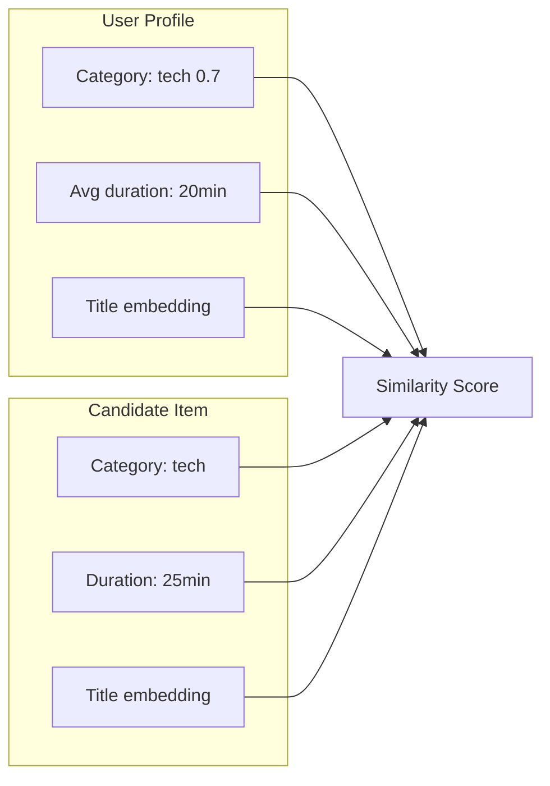
```mermaid
flowchart LR
    subgraph User Profile
        UP[Category: tech 0.7]
        UP2[Avg duration: 20min]
        UP3[Title embedding]
    end

    subgraph Candidate Item
        IT[Category: tech]
        IT2[Duration: 25min]
        IT3[Title embedding]
    end

    UP --> SCORE[Similarity Score]
    UP2 --> SCORE
    UP3 --> SCORE
    IT --> SCORE
    IT2 --> SCORE
    IT3 --> SCORE
```

**Key advantage:** Solves **item cold start** — new item with metadata can be recommended immediately.

### 8.3 Deep Dive #3: Two-Tower Model

#### Architecture

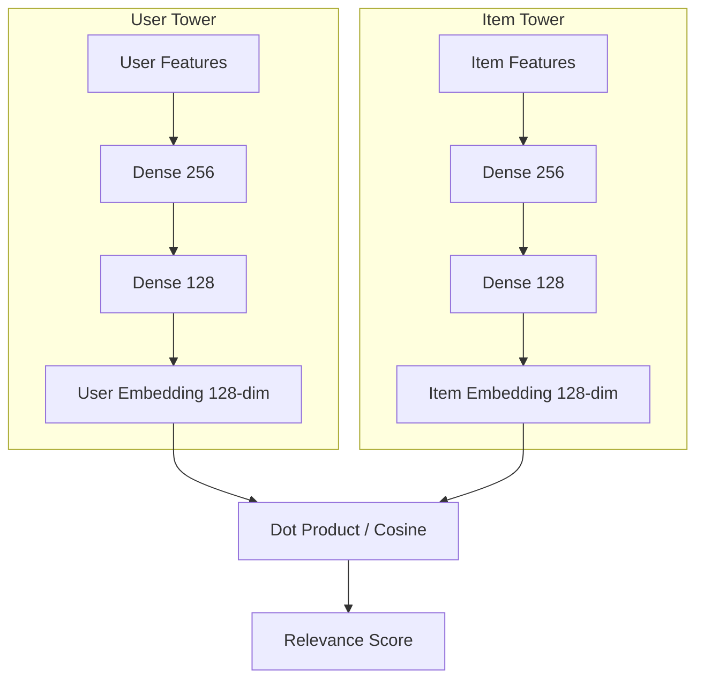
```mermaid
flowchart TB
    subgraph User Tower
        UF[User Features] --> UH1[Dense 256]
        UH1 --> UH2[Dense 128]
        UH2 --> UE[User Embedding 128-dim]
    end

    subgraph Item Tower
        IF[Item Features] --> IH1[Dense 256]
        IH1 --> IH2[Dense 128]
        IH2 --> IE[Item Embedding 128-dim]
    end

    UE --> DOT[Dot Product / Cosine]
    IE --> DOT
    DOT --> SCORE[Relevance Score]
```

#### User Tower Features

```
Categorical (embedded):
  - user_id (hashed bucket 1M)
  - country, language, device_type
  - signup_age_bucket

Numerical:
  - avg_watch_time_7d
  - interactions_per_day
  - days_since_last_visit

Sequence (averaged or attention-pooled):
  - last_50_viewed_item_embeddings
```

#### Item Tower Features

```
Categorical:
  - item_id (hashed bucket 5M)
  - creator_id, category, language

Numerical:
  - view_count_7d, ctr_7d, avg_watch_pct
  - duration_sec, hours_since_publish

Pre-trained:
  - title_bert_embedding (frozen)
```

#### Training

```
Loss: sampled softmax (in-batch negatives)

For batch of 1024 (user, item) positive pairs:
  1. Forward user tower → user_embeddings [1024, 128]
  2. Forward item tower → item_embeddings [1024, 128]
  3. Compute similarity matrix [1024, 1024]
  4. Diagonal = positive pairs; off-diagonal = negatives
  5. Cross-entropy loss: correct item for each user

Why in-batch negatives: 1023 free negatives per positive — efficient
```

#### Serving: ANN Retrieval

```
Offline:
  1. Run item tower on all 500M items → item embeddings
  2. Build HNSW index on item embeddings
  3. Refresh hourly for new items

Online:
  1. Run user tower on user features → user embedding (or cache)
  2. ANN search: top-500 nearest item embeddings
  3. Pass 500 candidates to ranking model for fine-grained scoring
```

| Component | Latency |
|-----------|---------|
| User embedding (cached) | < 1 ms |
| User embedding (computed) | ~5 ms |
| ANN search (top-500 from 500M) | ~5 ms |
| Total candidate generation | ~10 ms |

### 8.4 Deep Dive #4: Feature Store

#### Why a Feature Store?

```
Without feature store:
  - Training uses batch features from data lake (stale paths)
  - Serving uses ad-hoc Redis lookups (different code paths)
  - Training-serving skew → model degradation

With feature store:
  - Same feature definitions for training and serving
  - Point-in-time correct joins (no data leakage)
  - Versioned features for reproducibility
```

#### Architecture

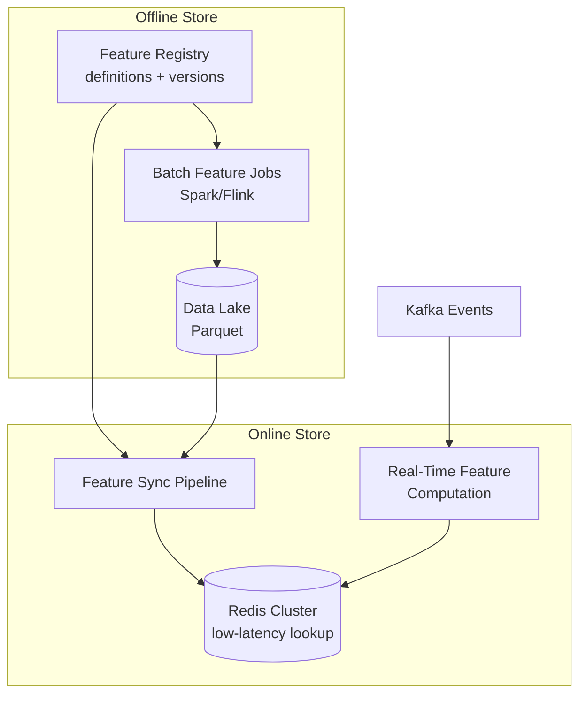
```mermaid
flowchart TB
    subgraph Offline Store
        BATCH[Batch Feature Jobs<br/>Spark/Flink]
        LAKE[(Data Lake<br/>Parquet)]
        REGISTRY[Feature Registry<br/>definitions + versions]
    end

    subgraph Online Store
        SYNC[Feature Sync Pipeline]
        REDIS[(Redis Cluster<br/>low-latency lookup)]
        COMPUTE[Real-Time Feature<br/>Computation]
    end

    BATCH --> LAKE
    REGISTRY --> BATCH
    REGISTRY --> SYNC
    LAKE --> SYNC
    SYNC --> REDIS
    KAFKA[Kafka Events] --> COMPUTE
    COMPUTE --> REDIS
```

#### Feature Categories

| Type | Examples | Compute | Freshness |
|------|----------|---------|-----------|
| Static | country, signup_date | Once | Immutable |
| Batch | avg_watch_time_7d, ctr_30d | Daily Spark job | 24 hours |
| Real-time | interactions_today, session_depth | Kafka stream | < 5 min |
| Embedding | user/item 128-dim vector | Hourly model | 1 hour |

#### Point-in-Time Correctness

```
Training example: user U clicked item I at time T

Features must use ONLY data available before T:
  - avg_watch_time_7d computed from [T-7d, T) — NOT including T
  - Prevents data leakage (using future info to predict past)

Implementation:
  Feature store stores (entity_id, feature, value, timestamp)
  Training join: ASOF JOIN on timestamp ≤ interaction_time
```

#### Online Feature Lookup

```
Request: rank(user_123, [item_1, item_2, ..., item_1000])

1. Batch GET user_features:123 from Redis (1 round-trip)
2. Batch MGET item_features:{item_1..item_1000} (pipelined)
3. Compute cross features: user_category_affinity × item_category
4. Assemble feature tensor [1000, 500] for ranker

Target latency: < 10 ms for feature assembly
```

### 8.5 Deep Dive #5: Online vs Offline Serving

#### Offline Serving Components

| Component | Frequency | Output |
|-----------|-----------|--------|
| Two-tower training | Daily | Updated user/item towers |
| Item embedding generation | Hourly | 500M item vectors |
| ANN index rebuild | Hourly | HNSW index |
| Ranking model training | Daily | Updated ranker weights |
| Batch feature computation | Daily | User/item aggregate features |
| Model evaluation | Daily | AUC, NDCG metrics |

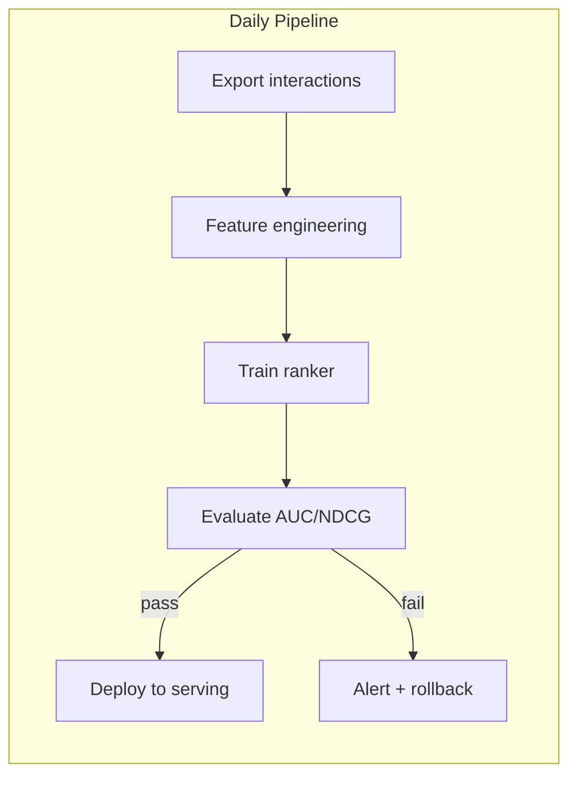
```mermaid
flowchart LR
    subgraph Daily Pipeline
        D1[Export interactions] --> D2[Feature engineering]
        D2 --> D3[Train ranker]
        D3 --> D4[Evaluate AUC/NDCG]
        D4 -->|pass| D5[Deploy to serving]
        D4 -->|fail| D6[Alert + rollback]
    end
```

#### Online Serving Components

| Component | Per-Request | Latency Budget |
|-----------|---------------|----------------|
| Candidate generation | ANN + CF + trending | 15 ms |
| Feature assembly | Online store lookup | 10 ms |
| Ranking inference | 1000 candidates batch | 30 ms |
| Re-ranking rules | Diversity, exploration | 5 ms |
| Feature logging | Async Kafka write | 0 ms (async) |
| **Total** | | **~60 ms** |

#### Model Serving Infrastructure

```
Triton Inference Server / TorchServe:
  - Load ranker model in GPU memory
  - Batch requests (max wait 5ms for batching)
  - 1000 candidates × 500 features per request
  - Dynamic batching: combine 32 requests → 32K inference

Fallback chain:
  1. GPU ranker (primary)
  2. CPU ranker (degraded)
  3. Pre-computed popularity feed (emergency)
```

### 8.6 Deep Dive #6: Cold Start

#### New User Cold Start

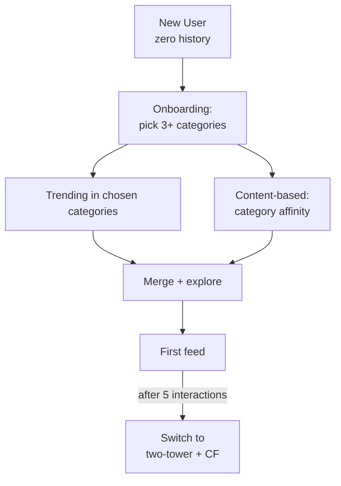
```mermaid
flowchart TD
    NU[New User<br/>zero history] --> ONBOARD[Onboarding:<br/>pick 3+ categories]
    ONBOARD --> POP[Trending in chosen categories]
    ONBOARD --> CB[Content-based:<br/>category affinity]
    POP --> MERGE[Merge + explore]
    CB --> MERGE
    MERGE --> FEED[First feed]

    FEED -->|after 5 interactions| TW[Switch to<br/>two-tower + CF]
```

| Stage | Strategy | Signal Available |
|-------|----------|-----------------|
| Minute 0 | Global trending + onboarding prefs | Demographics, locale |
| Hour 1 | Content-based (category affinity) | 5-10 interactions |
| Day 1 | Two-tower (sparse user embedding) | 50+ interactions |
| Week 1 | Full personalized ranking | Rich history |

#### New Item Cold Start

```
Problem: new video uploaded 5 min ago, zero interactions
  - Collaborative filtering: no co-interaction data → invisible
  - Two-tower ANN: item embedding from metadata features → visible
  - Content-based: category/tag similarity → recommendable

Strategy:
  1. Item tower generates embedding from metadata (title, category, creator)
  2. Insert into ANN index within 1 hour
  3. Exploration slot: 10% of feeds include new items
  4. Bandit algorithm: boost new items with high uncertainty
  5. Creator follow graph: notify subscribers (guaranteed initial views)
```

#### Exploration vs Exploitation

```
ε-greedy:
  With probability ε=0.1: show random/new item (explore)
  With probability 1-ε: show top-ranked item (exploit)

Thompson sampling:
  Model uncertainty as Beta distribution
  Sample from distribution → naturally balances explore/exploit

Multi-armed bandit per category:
  Allocate 10% of feed slots to under-explored categories
```

### 8.7 Deep Dive #7: Re-Ranking & Business Rules

#### Diversity Constraints

```
After ML ranking, apply rules:
  1. Max 2 items from same creator in top 20
  2. Max 3 items from same category in top 10
  3. Inject 1 fresh item (< 24h old) in top 5
  4. Inject 2 exploration items from under-viewed categories
  5. Demote items user marked "not interested"
  6. Boost subscribed creators by 1.2×
```

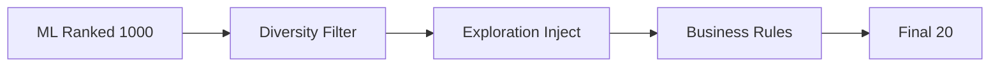
```mermaid
flowchart LR
    RANKED[ML Ranked 1000] --> DIV[Diversity Filter]
    DIV --> EXPL[Exploration Inject]
    EXPL --> BIZ[Business Rules]
    BIZ --> FINAL[Final 20]
```

#### Multi-Objective Optimization

```
score_final = w1 × P(click)
            + w2 × P(watch_time > 60s)
            + w3 × P(share)
            + w4 × freshness_boost
            - w5 × creator_overexposure_penalty
```

---

## 9. Trade-offs & Alternatives

### 9.1 Candidate Generation Strategies

| Source | Recall | Latency | Cold Start |
|--------|--------|---------|------------|
| Two-tower ANN | High | 5 ms | Item ✓, User ✗ |
| Item-based CF | Medium | 10 ms | Item ✗ |
| Content-based | Medium | 5 ms | Item ✓, User ✓ |
| Trending/popular | Low | 1 ms | Both ✓ |
| Social graph | Medium | 15 ms | User ✓ |

**Production:** Combine all sources → union → deduplicate → 1000 candidates.

### 9.2 Model Complexity vs Latency

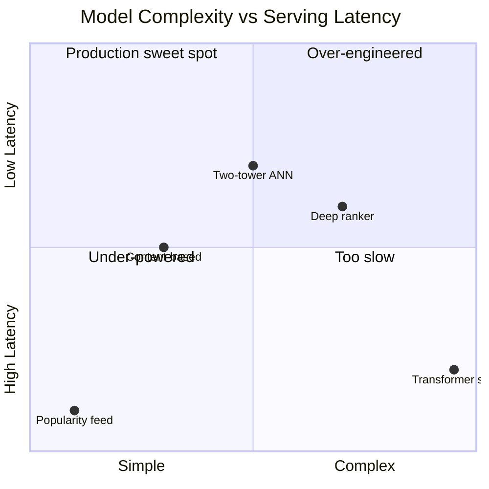
```mermaid
quadrantChart
    title Model Complexity vs Serving Latency
    x-axis Simple --> Complex
    y-axis High Latency --> Low Latency
    quadrant-1 Over-engineered
    quadrant-2 Production sweet spot
    quadrant-3 Under-powered
    quadrant-4 Too slow
    Popularity feed: [0.1, 0.1]
    Content-based: [0.3, 0.5]
    Two-tower ANN: [0.5, 0.7]
    Deep ranker: [0.7, 0.6]
    Transformer seq: [0.95, 0.2]
```

### 9.3 Pre-Compute vs Online Compute

| Approach | Latency | Freshness | Storage |
|----------|---------|-----------|---------|
| Pre-compute full feed | 5 ms | Stale (hours) | 500M × 20 items × 8B = 80 TB |
| Online ranking | 60 ms | Fresh | Minimal |
| Hybrid: pre-compute candidates, online rank | 30 ms | Good ✓ | 500M × 1000 × 8B = 4 TB |

### 9.4 Feature Store Build vs Buy

| Option | Pros | Cons |
|--------|------|------|
| Feast (open source) | Free, community | Ops burden |
| Tecton (managed) | Production-ready | Cost |
| Custom (Redis + Spark) | Full control | Engineering time ✓ (most common) |

### 9.5 Filtering vs Ranking for Diversity

| Approach | Mechanism | Quality Impact |
|----------|-----------|----------------|
| Post-rank rules | Hard constraints on final list | Safe, predictable ✓ |
| Diversity in loss | Penalize similar items during training | Better but harder |
| MMR (Maximal Marginal Relevance) | Greedy: pick highest score minus similarity to already-picked | Good balance |

---

## 10. Failure Modes & Reliability

### 10.1 Failure Mode Matrix

| Failure | Impact | Detection | Mitigation |
|---------|--------|-----------|------------|
| ANN index stale | New items not recommended | Index age metric | Hourly rebuild; fallback to content-based |
| Feature store down | Ranking degraded | Redis health check | Serve with cached features; popularity fallback |
| Ranker model crash | No ML scoring | Inference error rate | Fallback to two-tower scores only |
| Training data skew | Model quality drop | AUC monitoring | Auto-rollback to previous model version |
| Embedding dimension mismatch | Inference failure | Schema validation | Version pinning in model registry |
| Hot user QPS | Feature store overload | p99 latency alert | Local feature cache per API server |
| Kafka lag (interactions) | Stale real-time features | Consumer lag alert | Use batch features as fallback |

### 10.2 Fallback Chain

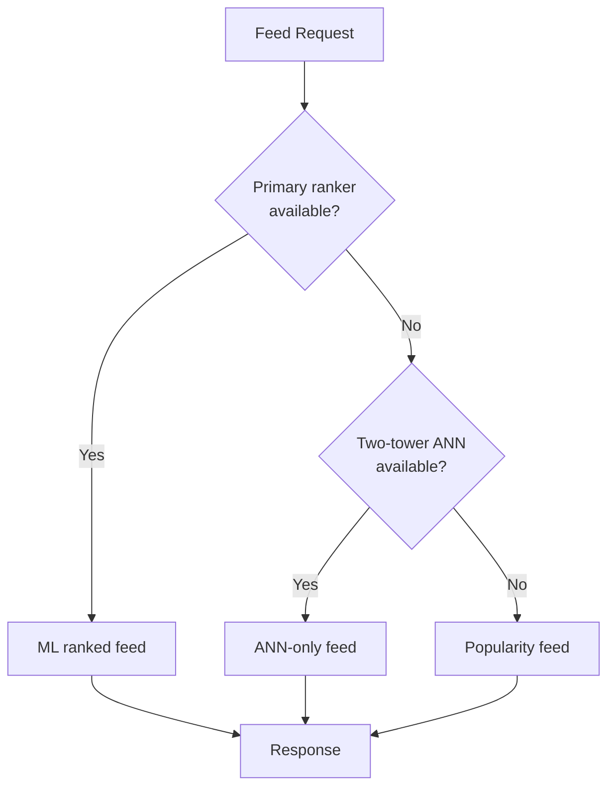
```mermaid
flowchart TD
    REQ[Feed Request] --> P{Primary ranker<br/>available?}
    P -->|Yes| RANK[ML ranked feed]
    P -->|No| T2{Two-tower ANN<br/>available?}
    T2 -->|Yes| ANN[ANN-only feed]
    T2 -->|No| POP[Popularity feed]
    RANK --> RESP[Response]
    ANN --> RESP
    POP --> RESP
```

### 10.3 Model Deployment Safety

```
1. Train new model on yesterday's data
2. Evaluate offline: AUC, NDCG@20, coverage
3. Shadow deploy: run new model alongside production, compare
4. A/B test: 5% traffic to new model for 24 hours
5. If metrics improve: ramp to 100%
6. If metrics degrade: instant rollback (< 5 min)
```

### 10.4 Monitoring

| Metric | Alert Threshold |
|--------|-----------------|
| Feed p99 latency | > 100 ms |
| Ranker inference p99 | > 50 ms |
| ANN recall@1000 | < 75% |
| Model AUC (daily) | Drops > 2% vs baseline |
| Feature store p99 | > 15 ms |
| Exploration rate | < 5% or > 25% |
| Zero-result feeds | > 0.1% |

---

## 11. Interview Cheat Sheet

### 11.1 45-Minute Interview Flow

```mermaid
gantt
    title AI Recommendation Interview Timeline
    dateFormat X
    axisFormat %M min

    section Phases
    Clarify requirements     :0, 5
    Capacity estimation      :5, 8
    High-level funnel        :8, 15
    Deep dive: two-tower     :15, 25
    Deep dive: feature store :25, 32
    Deep dive: cold start    :32, 38
    Trade-offs & wrap-up     :38, 45
```

### 11.2 Key Talking Points

1. **Multi-stage funnel** — 500M → 1000 candidates → 20 final (never rank 500M)
2. **Two-tower model** — separate user/item encoders; dot product for similarity; ANN for serving
3. **Collaborative filtering** — user-based, item-based, matrix factorization; suffers cold start
4. **Content-based** — item metadata similarity; solves item cold start
5. **Feature store** — same features for training and serving; point-in-time correctness
6. **Online/offline duality** — batch trains models; online serves with pre-computed embeddings
7. **Cold start** — new user: onboarding + trending; new item: content features + exploration slots
8. **Exploration/exploitation** — ε-greedy or Thompson sampling; 10-15% exploration slots

### 11.3 Expected Follow-Up Questions

| Question | Strong Answer |
|----------|---------------|
| "Why not rank all 500M items?" | 500M × 500 features × 50ms = impossible; candidate generation reduces to 1000 |
| "How does two-tower handle new items?" | Item tower uses metadata features (title, category) → embedding without interactions |
| "Training-serving skew?" | Feature store ensures same definitions; point-in-time joins prevent leakage |
| "How do you measure recommendation quality?" | Offline: AUC, NDCG@20; Online: CTR, watch time, retention lift in A/B tests |
| "Filter bubble problem?" | Diversity re-ranking; exploration slots; category caps |
| "Real-time session re-ranking?" | Session features in Kafka stream; re-rank next 5 items with updated context |
| "How often do you retrain?" | Ranker daily; embeddings hourly; ANN index hourly; real-time features continuous |
| "What about negative feedback?" | 'Not interested' → downrank similar items; update user negative embedding |

### 11.4 Common Mistakes to Avoid

| Mistake | Why It's Wrong |
|---------|----------------|
| Ranking entire catalog online | 500M items × inference = impossible in 100ms |
| No candidate generation stage | Interviewer expects multi-stage funnel |
| Ignoring cold start | Guaranteed follow-up for new users/items |
| Training features ≠ serving features | Training-serving skew degrades model |
| No exploration | System never discovers new content; creator churn |
| Collaborative filtering only | Fails on new items with zero interactions |
| No fallback chain | Model failure = empty feed = bad UX |

### 11.5 Diagrams to Draw on Whiteboard

1. **Multi-stage funnel** (500M → 1000 → 20)
2. **Two-tower architecture** (user tower + item tower → dot product)
3. **Feature store** (offline batch + online real-time)
4. **ANN retrieval** (user embedding → nearest item embeddings)
5. **Cold start decision tree** (new user → onboarding → trending → personalized)
6. **Online/offline pipeline** (train daily → deploy → serve)

### 11.6 Quick Reference Numbers

| Metric | Value |
|--------|-------|
| DAU | 500M |
| Catalog | 500M items |
| Feed QPS (peak) | 120K |
| Candidates/request | 1000 |
| Final feed size | 20 |
| Embedding dim | 128 |
| Feature count | ~500 |
| Feed latency p99 | 100 ms |
| Exploration rate | 10-15% |
| Model retrain | Daily |

---

## References & Further Reading

- [Two-Tower Models for Recommendations (Google)](https://research.google/pubs/pub48840/)
- [Feature Stores: ML Data Infrastructure (Tecton)](https://www.tecton.ai/)
- [Netflix Recommendation System (ACM)](https://netflixtechblog.com/)
- [YouTube DNN for Recommendations (RecSys 2016)](https://static.googleusercontent.com/media/research.google.com/en//pubs/archive/45530.pdf)
- [Collaborative Filtering at Scale (Amazon)](https://www.amazon.science/)
- [Hello Interview — Design Recommendation System](https://www.hellointerview.com/)
- [Feast: Open Source Feature Store](https://feast.dev/)

---

*Guide version 1.0 — Big Tech system design interview preparation.*
