# Design a URL Shortener

> **Framework:** [Hello Interview Delivery Framework](https://www.hellointerview.com/learn/system-design/in-a-hurry/delivery)  
> **Difficulty:** Medium (read-heavy + ID generation)  
> **Time budget:** 45 minutes  
> **Primary topics:** Base62 encoding, redirect latency, analytics, custom domains

---

## Table of Contents

1. [How to Use This Guide](#how-to-use-this-guide)
2. [Requirements (~5 min)](#requirements-5-min)
3. [Core Entities (~2 min)](#core-entities-2-min)
4. [API / System Interface (~5 min)](#api--system-interface-5-min)
5. [Data Flow (~5 min)](#data-flow-5-min)
6. [High-Level Design (~10–15 min)](#high-level-design-1015-min)
7. [Deep Dives (~10 min)](#deep-dives-10-min)
8. [Capacity & Sizing](#capacity--sizing)
9. [Failure Modes & Resilience](#failure-modes--resilience)
10. [Trade-offs Summary](#trade-offs-summary)
11. [Interview Walkthrough Script](#interview-walkthrough-script)
12. [Follow-Up Questions](#follow-up-questions)
13. [Real-World References](#real-world-references)
14. [Interview Cheat Sheet](#interview-cheat-sheet)

---

## How to Use This Guide

This guide walks through designing a **URL shortening service like Bitly** at Big Tech interview depth. Follow the Hello Interview pacing: clarify scope early, draw boxes before optimizing, and spend deep-dive time on the **hardest** parts, not on generic CRUD.

**What interviewers optimize for:**

| Rubric pillar | What to demonstrate |
|---|---|
| Problem navigation | Scope redirect vs analytics vs custom domains |
| Solution design | Create → store → cache → redirect |
| Technical excellence | ID generation, cache-aside, 302 vs 301 |
| Communication | Read:write ratio and hot key handling | |

**Suggested opening script:**

> "I'll design a URL shortener: create short links, sub-10ms redirects, and async analytics. I'll defer enterprise SSO unless in scope. My focus is read path optimization and ID generation."

**Pacing guide:**

| Phase | Time | What to Cover |
|-------|------|---------------|
| Requirements | ~5 min | Functional + non-functional, scope, clarifying questions |
| Core Entities | ~2 min | Primary data objects and relationships |
| API Design | ~5 min | REST/RPC endpoints, request/response contracts |
| Data Flow | ~5 min | End-to-end sequence for happy path |
| High-Level Design | ~10–15 min | Architecture boxes-and-arrows |
| Deep Dives | ~10 min | Bottlenecks, scaling, edge cases, trade-offs |
| Capacity | woven in | Back-of-envelope QPS, storage, bandwidth |

---

## Requirements (~5 min)
Design a URL shortening service that converts long URLs into short, shareable links. When a user visits the short link, they are redirected to the original URL. The service should support analytics (click tracking), optional custom short codes, and custom branded domains for enterprise customers.

**What the interviewer is really testing:**

- ID generation at massive scale without collisions
- Read-heavy workload optimization (redirects >> creates)
- Sub-10ms redirect latency at the edge
- Async analytics without blocking the critical path
- Multi-tenant custom domain routing

---


### Clarifying Questions to Ask

| Question | Why It Matters |
|----------|----------------|
| Are short codes user-defined or auto-generated? | Affects collision handling and validation |
| Do we need analytics? Real-time or batch? | Drives async pipeline complexity |
| Custom domains per tenant? | Requires DNS + TLS + routing layer |
| Expiration / TTL on links? | Affects storage and cache eviction |
| Private vs public links? | Auth layer on redirect |
| Geographic distribution? | CDN and regional DB replicas |

### Functional Requirements

**Must Have (P0):**

- Shorten a long URL → return a unique short link
- Redirect short link → original URL (HTTP 301 or 302)
- Short codes are unique globally (or per custom domain)
- Links do not expire by default

**Should Have (P1):**

- Optional custom alias (e.g., `bit.ly/my-launch`)
- Click analytics: timestamp, referrer, geo, device
- Link management: update destination, deactivate link
- API for programmatic creation (developer tier)

**Nice to Have (P2):**

- Custom branded domains (`go.acme.com/xyz`)
- QR code generation
- A/B redirect (split traffic)
- Link preview / OG metadata

### Non-Functional Requirements

| Dimension | Target | Rationale |
|-----------|--------|-----------|
| **Redirect latency (p99)** | < 50 ms end-to-end | Users abandon slow redirects |
| **Create latency (p99)** | < 200 ms | Acceptable for write path |
| **Availability** | 99.99% for redirects | Redirect is revenue-critical |
| **Durability** | No lost mappings | Broken links destroy trust |
| **Scale** | 100M DAU, 10:1 read:write | Read-heavy |
| **Consistency** | Strong for creates; eventual OK for analytics | Redirect must never 404 for valid link |

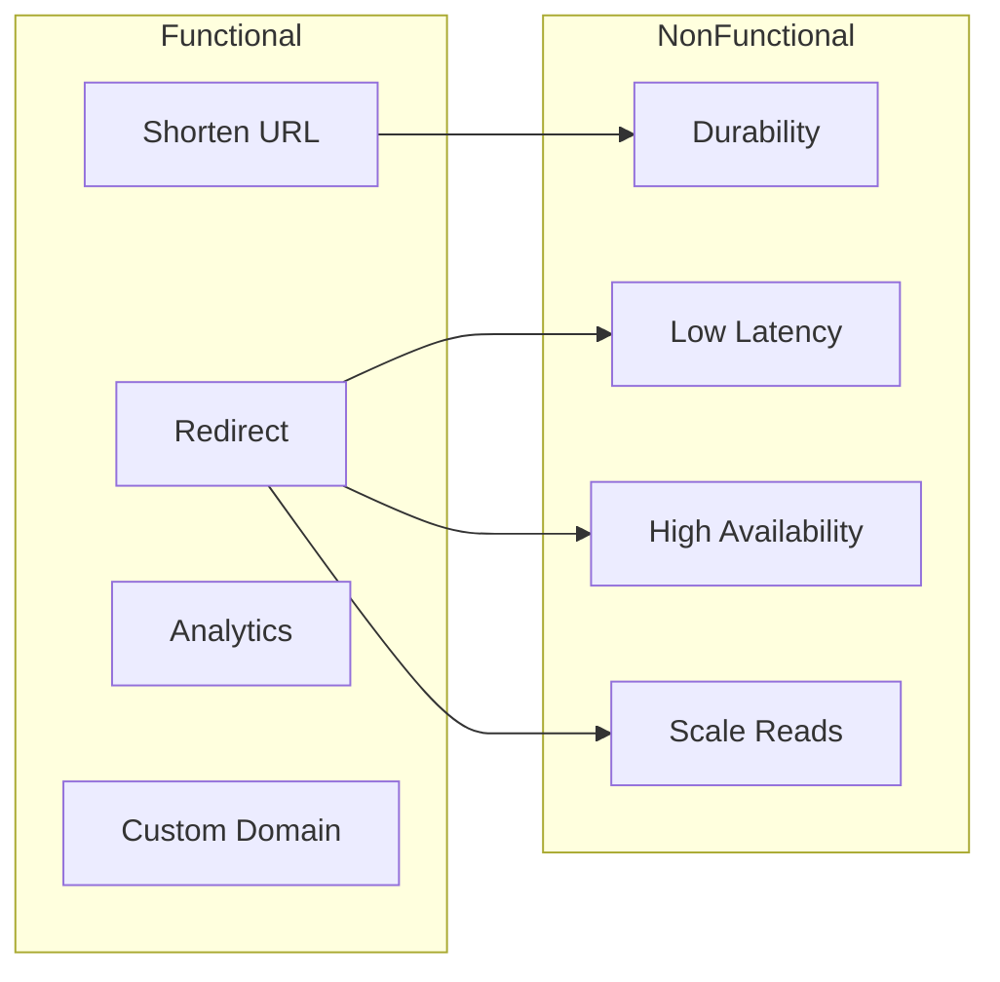

---

## Capacity & Sizing
Assume **500M shortened URLs/month**, **5B redirects/month**, 100M DAU.

### Storage

```
URLs stored per month:     500M
Average long URL size:     ~2 KB (with metadata)
New storage/month:         500M × 2 KB ≈ 1 TB/month
5-year retention:          ~60 TB (before compression/dedup)
Short code index:          7 chars base62 ≈ 8 bytes + 8 byte pointer ≈ negligible vs URL blob
```

### Traffic (QPS)

```
Creates:  500M / (30 × 86400) ≈ 200 writes/sec (peak ×5 → ~1,000 WPS)
Reads:    5B / (30 × 86400) ≈ 2,000 reads/sec (peak ×10 → ~20,000 RPS)
Read:Write ratio ≈ 10:1 (typical; viral links push higher)
```

### Bandwidth

```
Redirect response: ~300 bytes (302 + Location header)
20,000 RPS × 300 B ≈ 6 MB/s egress (modest; CDN absorbs bulk)
Analytics events: 20,000 events/sec × 500 B ≈ 10 MB/s to Kafka
```

### Cache Sizing

```
Hot URL rule: 20% of links generate 80% of traffic
Unique URLs/day in hot set: ~20% × 5B/30 ≈ 33M hot mappings
Cache entry: ~100 bytes (short_code → long_url)
Redis memory: 33M × 100 B ≈ 3.3 GB per region (very manageable)
```

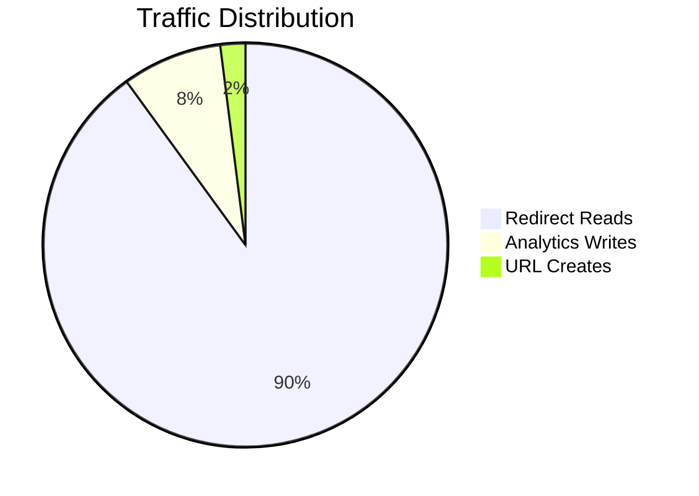

---

## API / System Interface (~5 min)
### REST Endpoints

```
POST   /v1/urls
GET    /v1/urls/{short_code}
PATCH  /v1/urls/{short_code}
DELETE /v1/urls/{short_code}
GET    /v1/urls/{short_code}/stats
GET    /{short_code}                    → redirect (public, no auth)
```

### Create URL

```http
POST /v1/urls
Authorization: Bearer {api_key}
Content-Type: application/json

{
  "long_url": "https://example.com/very/long/path?query=1",
  "custom_code": "my-launch",        // optional
  "domain": "bit.ly",                // or "go.acme.com"
  "expires_at": "2027-01-01T00:00:00Z"  // optional
}

Response 201:
{
  "short_code": "my-launch",
  "short_url": "https://bit.ly/my-launch",
  "long_url": "https://example.com/very/long/path?query=1",
  "created_at": "2026-07-08T12:00:00Z"
}
```

### Redirect (Critical Path)

```http
GET /abc123
Host: bit.ly

Response 302 Found
Location: https://example.com/original
Cache-Control: public, max-age=300
```

**301 vs 302:**

| Code | Semantics | Use When |
|------|-----------|----------|
| **301** | Permanent; browsers cache aggressively | Destination never changes |
| **302** | Temporary; allows analytics on every click | Default for Bitly-like services |

Most production shorteners use **302** (or 307) so they can change destinations and count every click.

---

## Core Entities (~2 min)
### Core Entities

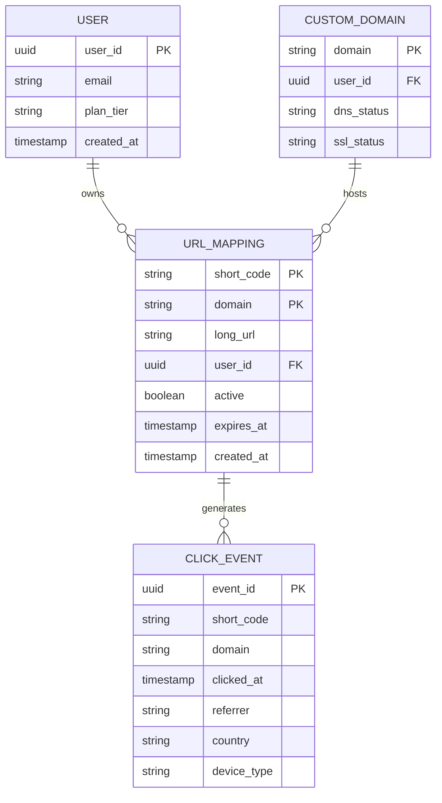

### URL Mapping Table (Primary Store)

```sql
CREATE TABLE url_mappings (
    domain       VARCHAR(255) NOT NULL,
    short_code   VARCHAR(20)  NOT NULL,
    long_url     TEXT         NOT NULL,
    user_id      UUID,
    active       BOOLEAN      DEFAULT TRUE,
    expires_at   TIMESTAMP,
    created_at   TIMESTAMP    DEFAULT NOW(),
    PRIMARY KEY (domain, short_code)
);

CREATE INDEX idx_user_urls ON url_mappings (user_id, created_at DESC);
```

**Why composite PK `(domain, short_code)`:** Same short code can exist on different custom domains.

### Caching Key Schema

```
Key:   url:{domain}:{short_code}
Value: { long_url, active, expires_at }
TTL:   min(link_expires_at, 24h) or LRU eviction
```

---

## Data Flow (~5 min)

Walk the **happy path** end-to-end before drawing boxes. Use sequence diagrams in [High-Level Design](#high-level-design-1015-min) on the whiteboard.

1. Client / producer initiates the primary action
2. API validates auth and schema
3. Core service persists state and enqueues async work
4. Workers / cache / CDN serve scale paths
5. Webhooks or polls confirm completion

---

## High-Level Design (~10–15 min)
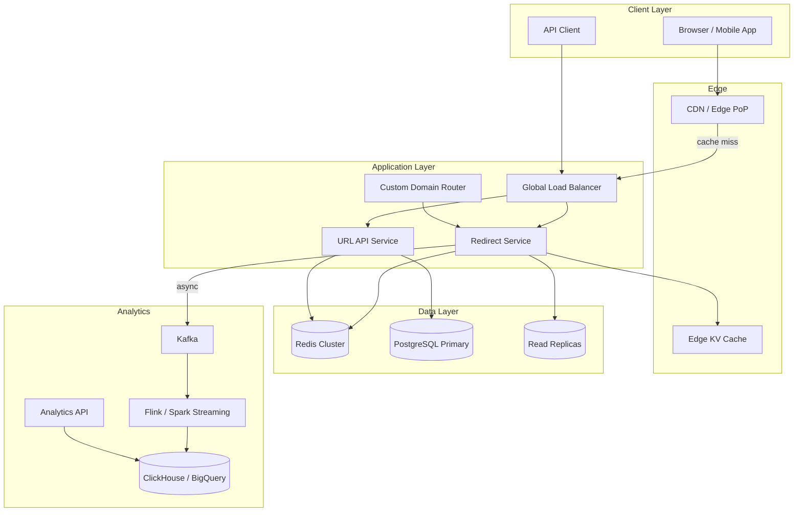

### Request Flow Overview

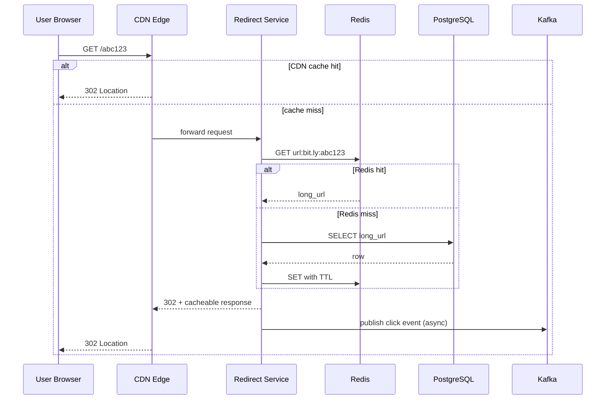

---

## Deep Dives (~10 min)

### 7.1 Base62 Encoding & ID Generation

### Why Base62?

Use characters `[0-9A-Za-z]` → 62 symbols. A 7-character code gives **62^7 ≈ 3.5 trillion** unique codes — sufficient for decades at 500M/month.

```
Code length vs capacity:
  6 chars → 56 billion
  7 chars → 3.5 trillion  ← sweet spot
  8 chars → 218 trillion
```

### ID Generation Strategies

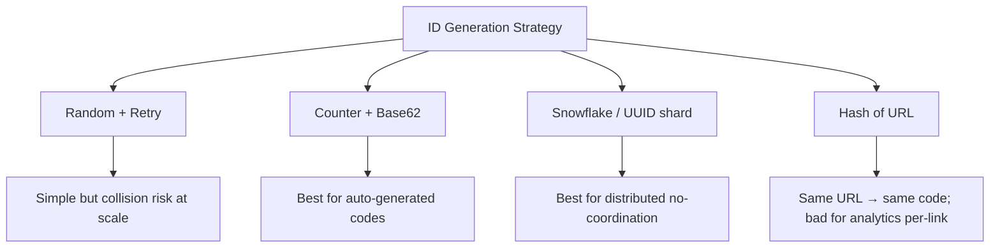

#### Approach 1: Central Counter (Recommended for Interview)

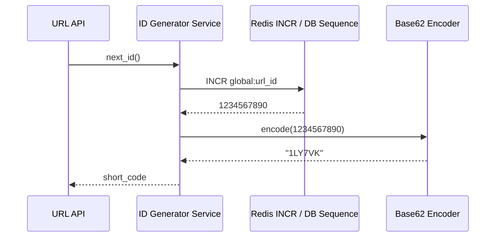

**Pros:** Guaranteed unique, sequential, compact codes  
**Cons:** Single counter is a bottleneck → shard counters by range

#### Sharded Counter (Production Scale)

```
Shard 0: IDs 0         – 999,999,999
Shard 1: IDs 1,000,000,000 – 1,999,999,999
...
Each shard: dedicated Redis INCR or PostgreSQL sequence
Merge shard_id into high bits of counter before base62 encode
```

#### Approach 2: Random Base62 + DB Unique Constraint

```python
import secrets, string
BASE62 = string.digits + string.ascii_uppercase + string.ascii_lowercase

def generate_code(length=7):
    return ''.join(secrets.choice(BASE62) for _ in range(length))
```

On collision (INSERT conflict), retry up to 3 times. At 7 chars and 500M URLs, birthday paradox collision probability stays negligible.

#### Custom Alias Handling

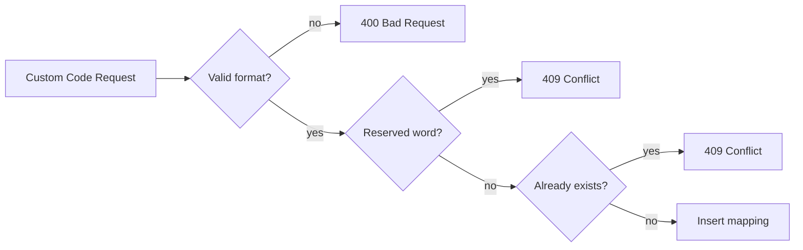

Reserve blocklist: `admin`, `api`, `login`, profanity, brand names.

---

### 7.2 Redirect Path & Latency

The redirect path is the **money path** — optimize ruthlessly.

### Latency Budget (p99 target: 50 ms)

| Stage | Budget | Technique |
|-------|--------|-----------|
| DNS | 5 ms | Anycast DNS, low TTL |
| CDN edge | 10 ms | Edge cache hit |
| Origin redirect svc | 15 ms | Connection pooling, no auth |
| Redis lookup | 3 ms | Local cluster, pipelining |
| DB fallback | 20 ms | Read replica, indexed PK lookup |
| Analytics | 0 ms (async) | Fire-and-forget to Kafka |

```mermaid
gantt
    title Redirect Latency Budget (p99)
    dateFormat X
    axisFormat %L ms

    section Edge
    DNS           :0, 5
    CDN Lookup    :5, 15

    section Origin
    Redirect Svc  :15, 30
    Redis GET     :30, 33
    DB Fallback   :33, 53
```

### Multi-Layer Cache Strategy

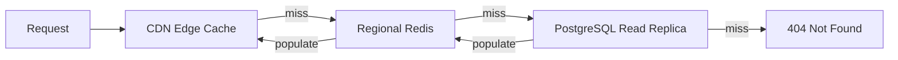

**Cache-Control headers for CDN:**

```
Cache-Control: public, max-age=300, stale-while-revalidate=60
```

Use shorter TTL for links that change frequently; longer for stable enterprise links.

### Redirect Service Design

- **Stateless** — horizontal scale behind LB
- **No authentication** on redirect path
- **Minimal middleware** — skip logging to disk synchronously
- **Precomputed redirect response** — avoid JSON serialization
- **Connection keep-alive** to Redis and DB

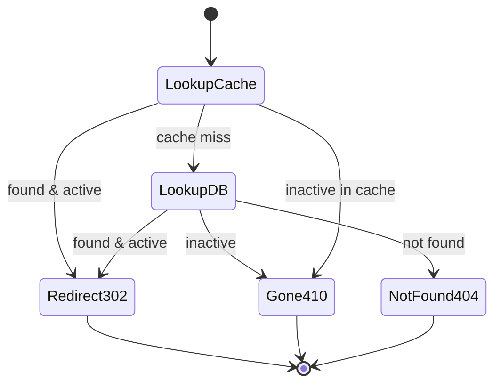

---

### 7.3 Analytics Pipeline

Analytics must **never block redirects**. Use async event streaming.

### Event Schema

```json
{
  "event_id": "uuid",
  "short_code": "abc123",
  "domain": "bit.ly",
  "timestamp": "2026-07-08T12:00:00.001Z",
  "referrer": "https://twitter.com",
  "user_agent": "Mozilla/5.0...",
  "ip_hash": "sha256(...)",
  "country": "US",
  "device": "mobile"
}
```

### Pipeline Architecture

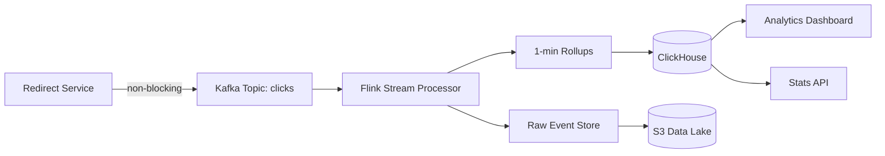

### Aggregation Layers

| Layer | Granularity | Storage | Query Latency |
|-------|-------------|---------|---------------|
| Real-time | 1-minute windows | Redis / ClickHouse | < 1 sec |
| Hourly | Pre-aggregated | ClickHouse | < 100 ms |
| Daily | Batch job | BigQuery / S3 | Minutes |

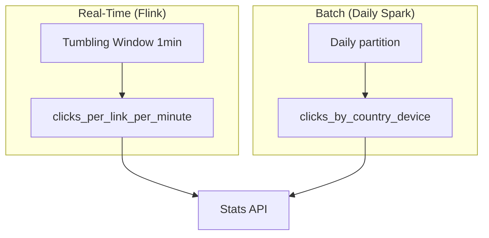

### Privacy & Compliance

- Hash IPs at ingestion; never store raw IP in analytics store
- GDPR: support deletion cascades (user deletes → purge click events)
- Bot filtering: exclude known crawler user-agents from billing metrics

---

### 7.4 Custom Domains & Multi-Tenancy

Enterprise customers want `go.acme.com/promo` instead of `bit.ly/x7Kp2m`.

### Onboarding Flow

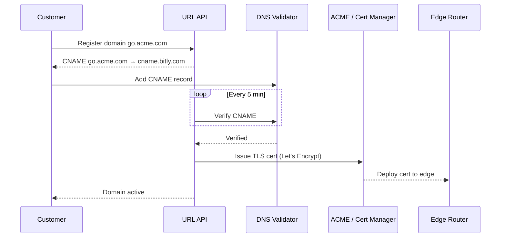

### Host-Based Routing

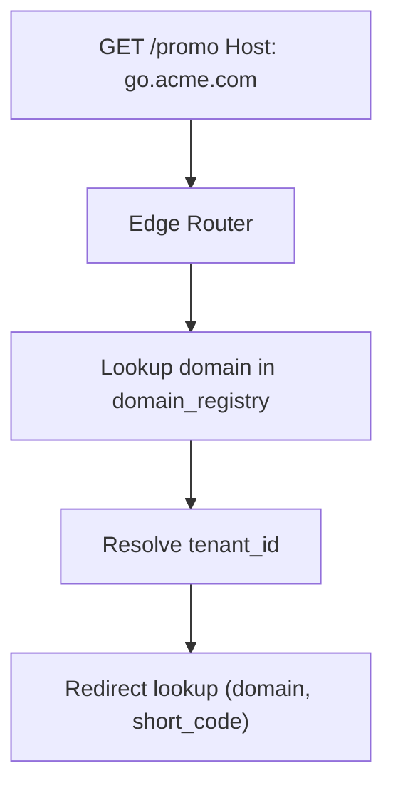

**Domain registry cache:** Hot cache at edge — domain → tenant mapping rarely changes.

### TLS at Scale

- Automate cert provisioning via ACME (Let's Encrypt)
- Cert storage in edge secret manager (Cloudflare, AWS ACM)
- SNI-based routing for millions of custom domains
- Cert renewal 30 days before expiry with alerting

---

### Scaling & Reliability
### Database Scaling

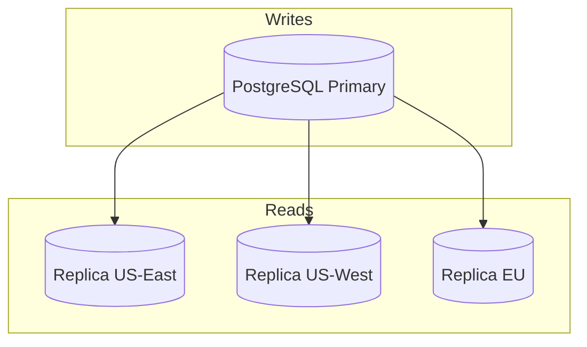

- **Writes:** Single primary sufficient at ~1K WPS; shard by `hash(domain, short_code)` if needed
- **Reads:** Read replicas + Redis absorb 20K RPS easily
- **Future sharding:** Vitess or Citus when storage > few TB per node

### Redis Cluster

```
Hash slot: CRC16(domain:short_code) mod 16384
3 masters × 2 replicas per region
Eviction: allkeys-lru (redirect cache is pure cache — DB is source of truth)
```

### Multi-Region Active-Active

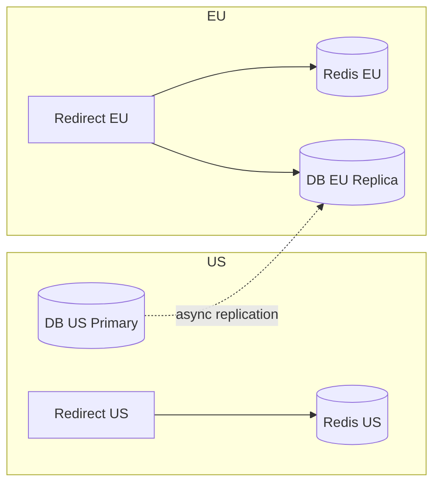

**Challenge:** Custom domain DNS may point to single region — use GeoDNS or global anycast.

### SLA Targets

| Component | SLA | Failover |
|-----------|-----|----------|
| CDN | 99.99% | Multi-CDN fallback |
| Redirect Service | 99.99% | Auto-scaling, health checks |
| Redis | 99.9% | Fallback to DB (higher latency) |
| PostgreSQL | 99.95% | Automatic failover (Patroni) |

---

## Failure Modes & Resilience
| Failure | Impact | Mitigation |
|---------|--------|------------|
| Redis down | Redirects slow (DB fallback) | Circuit breaker; auto-scale DB replicas |
| DB primary down | Creates fail; reads OK on replicas | Failover < 30s; queue creates |
| Kafka lag | Analytics delayed | Redirect unaffected; scale consumers |
| Hot key viral link | Single Redis node overload | Local in-process cache on redirect pod |
| Malicious URL | Phishing via shortener | URL blocklist, Safe Browsing API scan |
| Link expiration race | 302 after expiry | Check `expires_at` in redirect path |
| Counter shard exhaustion | ID generation stall | Pre-allocate ID ranges; alert at 80% |

### Abuse Prevention

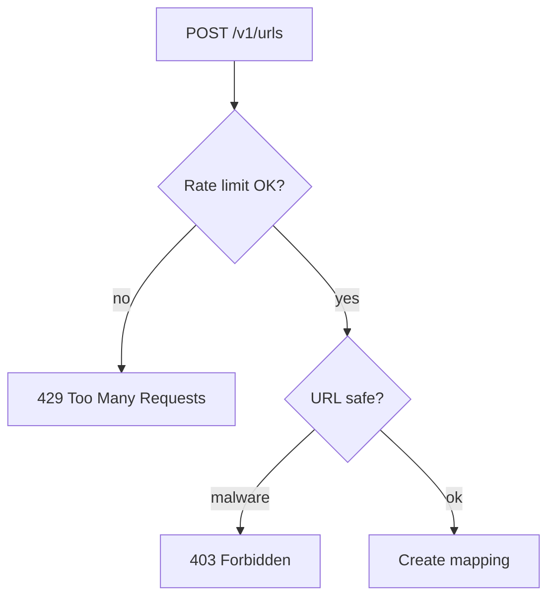

- Rate limit by API key: 100 creates/min free tier
- Scan long URLs against Google Safe Browsing
- CAPTCHA on anonymous web UI creates

---

## Trade-offs Summary
| Decision | Option A | Option B | Recommendation |
|----------|----------|----------|----------------|
| Redirect code | 301 permanent | 302 temporary | **302** — analytics + editable destinations |
| ID generation | Random | Counter + base62 | **Counter** — predictable, no collision retries |
| Analytics | Sync DB increment | Async Kafka | **Async** — never block redirect |
| Cache | CDN only | CDN + Redis + DB | **All three layers** |
| DB | SQL | NoSQL | **PostgreSQL** — strong uniqueness constraints |
| Custom codes | Always allow | Premium feature | **Premium** — reduces squatting |

---

## Interview Walkthrough Script
### Minutes 0–5: Requirements

> "I'll design a URL shortener like Bitly. Let me confirm scope: auto-generated 7-char codes, optional custom aliases, click analytics async, and custom domains as a stretch goal. Redirect latency is the critical metric — sub-50ms p99."

### Minutes 5–10: Estimation

> "500M creates/month, 5B redirects — roughly 1K writes/sec and 20K reads/sec peak. 10:1 read ratio tells me to optimize the redirect path with CDN and Redis. Storage is ~1 TB/month — PostgreSQL with read replicas is fine for years."

### Minutes 10–20: High-Level Design

Draw the architecture diagram. Emphasize:

1. Separate redirect service from API service (different scaling profiles)
2. CDN in front for redirect caching
3. Redis for origin cache
4. Kafka for async analytics

### Minutes 20–35: Deep Dives

Interviewer picks 2–3:

- **Base62 counter sharding** — draw sequence diagram
- **Redirect latency budget** — CDN → Redis → DB fallback
- **Analytics pipeline** — fire-and-forget, Flink rollups
- **Custom domains** — CNAME verification, TLS automation

### Minutes 35–45: Wrap-Up

> "Bottleneck is viral hot keys — I'd add local pod cache and consider pre-warming CDN on trending links. For multi-region, GeoDNS with regional Redis clusters. I'd monitor redirect p99, cache hit rate, and Kafka consumer lag."

---

## Follow-Up Questions
1. **How would you support link preview (unfurling)?** — HEAD endpoint returning OG tags; separate crawler service.
2. **How to detect and block phishing?** — Safe Browsing API at create time + periodic re-scan.
3. **Design a bulk import API for 10M URLs.** — Async job queue, batch ID pre-allocation, progress webhook.
4. **Same long URL → same short code?** — Dedup hash index; trade-off: can't track per-campaign analytics separately.
5. **How would you migrate from 6-char to 7-char codes?** — Dual-read; new codes at 7 chars; old codes remain valid.

---

## Real-World References
| Company | Notable Design Choice |
|---------|----------------------|
| **Bitly** | Custom domains, enterprise analytics, 302 redirects |
| **TinyURL** | Simple counter-based IDs early on |
| **Twitter (t.co)** | Mandatory wrapper for link safety scanning |
| **Google (goo.gl)** | Discontinued consumer product — operational cost of abuse |

**Key papers & concepts:**

- Base62 encoding for URL-safe compact IDs
- Anycast DNS for global low-latency routing
- Edge caching with stale-while-revalidate for resilience

---

---

## Interview Cheat Sheet

**Lead with:** Always separate the **redirect hot path** (sync, cached, minimal) from the **create path** (consistent, validated) and the **analytics path** (async, loss-tolerant within bounds). Interviewers reward this separation more than any single algorithm choice.

See [Interview Walkthrough Script](#interview-walkthrough-script) for timed delivery.
