# Design a Distributed Cache

> **Framework:** [Hello Interview Delivery Framework](https://www.hellointerview.com/learn/system-design/in-a-hurry/delivery)  
> **Difficulty:** Hard (consistent hashing + eviction)  
> **Time budget:** 45 minutes  
> **Primary topics:** Consistent hashing, eviction policies, cache-aside vs write-through

---

## Table of Contents

1. [How to Use This Guide](#how-to-use-this-guide)
2. [Requirements (~5 min)](#requirements-5-min)
3. [Core Entities (~2 min)](#core-entities-2-min)
4. [API / System Interface (~5 min)](#api--system-interface-5-min)
5. [Data Flow (~5 min)](#data-flow-5-min)
6. [High-Level Design (~10–15 min)](#high-level-design-1015-min)
7. [Deep Dives (~10 min)](#deep-dives-10-min)
8. [Capacity & Sizing](#capacity--sizing)
9. [Failure Modes & Resilience](#failure-modes--resilience)
10. [Trade-offs Summary](#trade-offs-summary)
11. [Interview Walkthrough Script](#interview-walkthrough-script)
12. [Follow-Up Questions](#follow-up-questions)
13. [Real-World References](#real-world-references)
14. [Interview Cheat Sheet](#interview-cheat-sheet)

---

## How to Use This Guide

This guide walks through designing a **Redis-like distributed cache** at Big Tech interview depth. Follow the Hello Interview pacing: clarify scope early, draw boxes before optimizing, and spend deep-dive time on the **hardest** parts, not on generic CRUD.

**What interviewers optimize for:**

| Rubric pillar | What to demonstrate |
|---|---|
| Problem navigation | Scope L1 vs L2 vs CDN edge |
| Solution design | Client → proxy → shard → replica |
| Technical excellence | Consistent hashing, eviction, thundering herd |
| Communication | Cache-aside vs write-through trade-offs | |

**Suggested opening script:**

> "I'll design a distributed cache: sharding, replication, and eviction. My focus is consistent hashing and cache invalidation patterns."

**Pacing guide:**

| Phase | Time | What to Cover |
|-------|------|---------------|
| Requirements | ~5 min | Functional + non-functional, scope, clarifying questions |
| Core Entities | ~2 min | Primary data objects and relationships |
| API Design | ~5 min | REST/RPC endpoints, request/response contracts |
| Data Flow | ~5 min | End-to-end sequence for happy path |
| High-Level Design | ~10–15 min | Architecture boxes-and-arrows |
| Deep Dives | ~10 min | Bottlenecks, scaling, edge cases, trade-offs |
| Capacity | woven in | Back-of-envelope QPS, storage, bandwidth |

---

## Requirements (~5 min)
Design a distributed in-memory cache that sits between application servers and a persistent database. The cache reduces read latency, offloads database load, and improves system throughput. The design must handle node failures, data partitioning across a cluster, memory limits with eviction, and consistency with the backing store.

**What the interviewer is really testing:**

- Partitioning strategy (consistent hashing vs hash slots)
- Cache invalidation and consistency patterns
- Replication topology and failover semantics
- Eviction under memory pressure
- Hot key handling and thundering herd mitigation

---


### Clarifying Questions to Ask

| Question | Why It Matters |
|----------|----------------|
| Read-heavy or write-heavy workload? | Drives cache-aside vs write-through choice |
| Acceptable staleness (TTL)? | Strong vs eventual consistency |
| Max memory per node / cluster? | Eviction policy selection |
| Durability required? | RDB/AOF persistence vs pure cache |
| Multi-region replication? | Cross-DC latency and conflict resolution |
| Data types beyond KV? | Lists, sets, sorted sets expand scope |

### Functional Requirements

**Must Have (P0):**

- `GET key` → value (or miss)
- `SET key value` with optional TTL
- `DELETE key`
- Horizontal scale: add/remove nodes without full cluster restart
- Automatic data redistribution on topology change

**Should Have (P1):**

- Replication for high availability (primary-replica)
- Automatic failover when primary dies
- Batch operations (`MGET`, `MSET`)
- Namespace / key prefix isolation per tenant

**Nice to Have (P2):**

- Pub/sub for cache invalidation broadcasts
- Atomic compare-and-set (CAS)
- Geo-replicated read replicas
- Cache warming on cold start

### Non-Functional Requirements

| Dimension | Target | Rationale |
|-----------|--------|-----------|
| **Read latency (p99)** | < 1 ms intra-DC | Cache must beat DB by 10–100× |
| **Write latency (p99)** | < 2 ms | Writes may involve replication |
| **Availability** | 99.99% | Cache miss fallback must work |
| **Hit ratio** | > 90% for hot data | Below this, reconsider caching strategy |
| **Scale** | 10 TB cluster, 10M ops/sec aggregate | Large e-commerce / social scale |
| **Durability** | Best-effort (cache) | DB is source of truth |

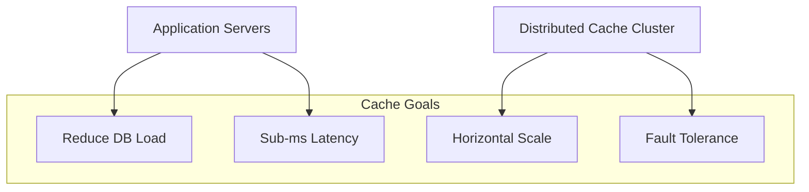

---

## Capacity & Sizing
Assume **e-commerce catalog** backing store: 500M products, 100K QPS reads, 5K QPS writes.

### Memory Sizing

```
Total catalog size in DB:     500M products × 2 KB ≈ 1 TB
Cacheable hot set (20%):      100M products × 2 KB ≈ 200 GB
Metadata overhead (Redis):    ~30% (dict, expiry, fragmentation)
Effective memory needed:      200 GB × 1.3 ≈ 260 GB
With replication (1 replica): 260 GB × 2 ≈ 520 GB cluster
```

### QPS & Bandwidth

```
Read QPS:           100,000
Write QPS:          5,000
Target hit ratio:   95%
DB reads avoided:   95,000/sec
Avg value size:     2 KB
Read bandwidth:     100K × 2 KB ≈ 200 MB/s
```

### Node Count

```
Per node (AWS r6g.2xlarge): 64 GB RAM, ~200K ops/sec
Memory nodes needed: 520 GB / 64 GB ≈ 9 nodes (with headroom → 12)
Ops capacity: 12 × 200K = 2.4M ops/sec >> 105K required yes
```

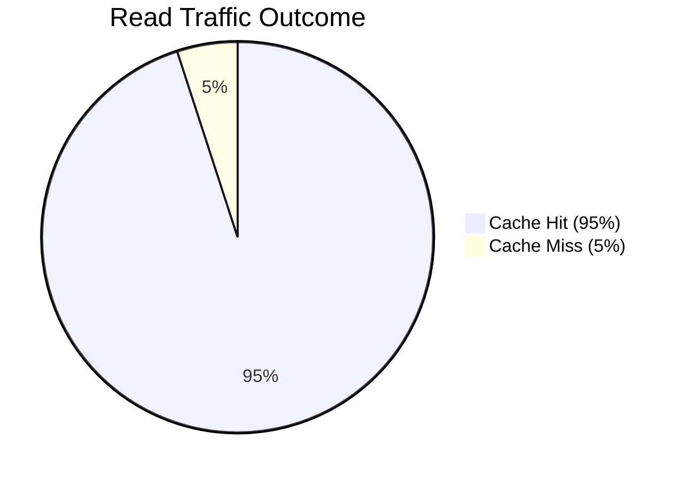

---

## API / System Interface (~5 min)
### Client-Facing Operations

```
GET     key                    → value | nil
SET     key value [EX ttl]     → OK
DEL     key                    → count deleted
MGET    key [key ...]          → array of values
MSET    key value [key value]  → OK
EXISTS  key                    → 0 | 1
TTL     key                    → seconds remaining
INCR    key                    → new integer value
```

### Cluster-Aware Client Protocol

Clients must route keys to correct shard. Two approaches:

| Approach | Who Routes | Example |
|----------|------------|---------|
| **Smart client** | Client library | Redis Cluster client, Lettuce |
| **Proxy layer** | Middleware proxy | Twemproxy, Envoy Redis filter |

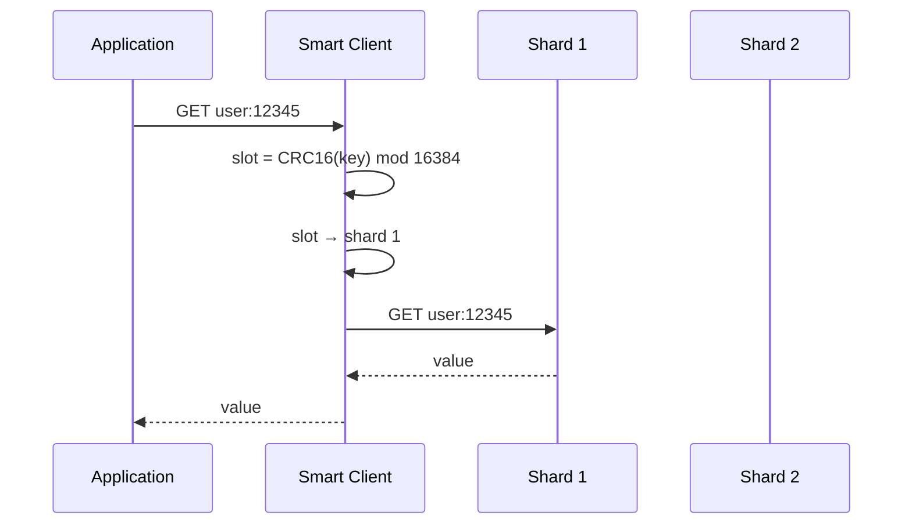

### MOVED / ASK Redirects

When cluster topology changes, shards return:

```
MOVED 3999 192.168.1.5:6379   → permanent slot migration complete
ASK  3999 192.168.1.6:6379   → temporary redirect during migration
```

Smart clients cache slot maps and refresh on redirect.

---

## 5. Data Model & Key Design

### Key Naming Conventions

```
{entity}:{id}                    → user:12345
{entity}:{id}:{field}            → user:12345:profile
{tenant}:{entity}:{id}           → acme:product:98765
{version}:{entity}:{id}          → v2:product:98765
```

**Rules:**

- Consistent delimiter (`:`)
- Include tenant prefix for multi-tenancy
- Avoid huge keys (> 512 MB Redis limit per key)
- Embed version for cache busting on schema change

### Value Serialization

| Format | Pros | Cons |
|--------|------|------|
| JSON string | Human-readable, debuggable | Larger, slower parse |
| Protocol Buffers | Compact, typed | Requires schema |
| Hash type (Redis HSET) | Partial field updates | More complex client code |

### TTL Strategy

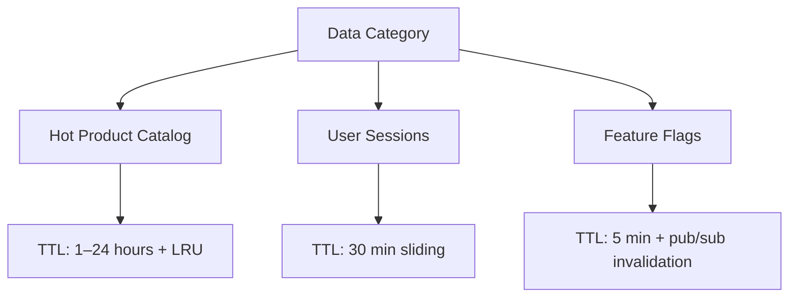

---

## Data Flow (~5 min)

Walk the **happy path** end-to-end before drawing boxes. Use sequence diagrams in [High-Level Design](#high-level-design-1015-min) on the whiteboard.

1. Client / producer initiates the primary action
2. API validates auth and schema
3. Core service persists state and enqueues async work
4. Workers / cache / CDN serve scale paths
5. Webhooks or polls confirm completion

---

## High-Level Design (~10–15 min)
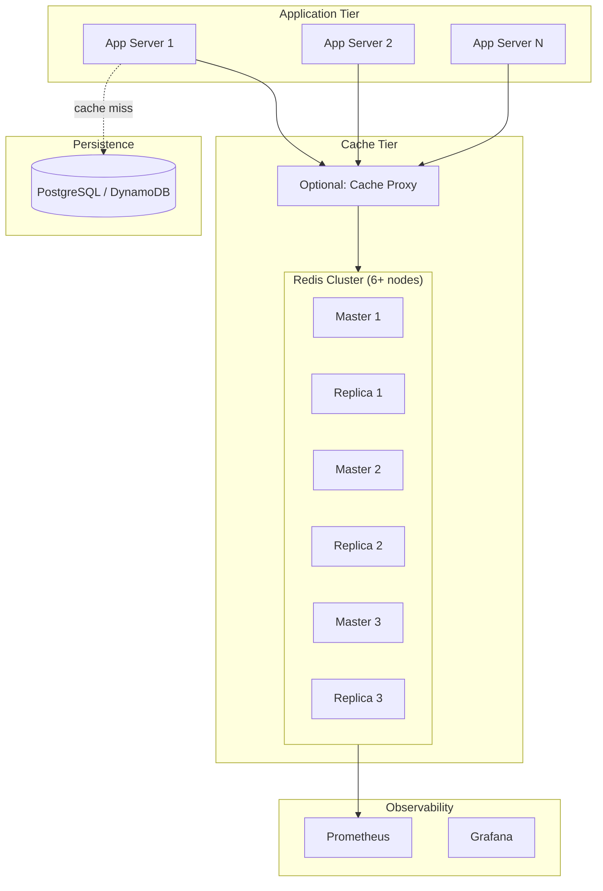

### Cache Interaction Patterns Overview

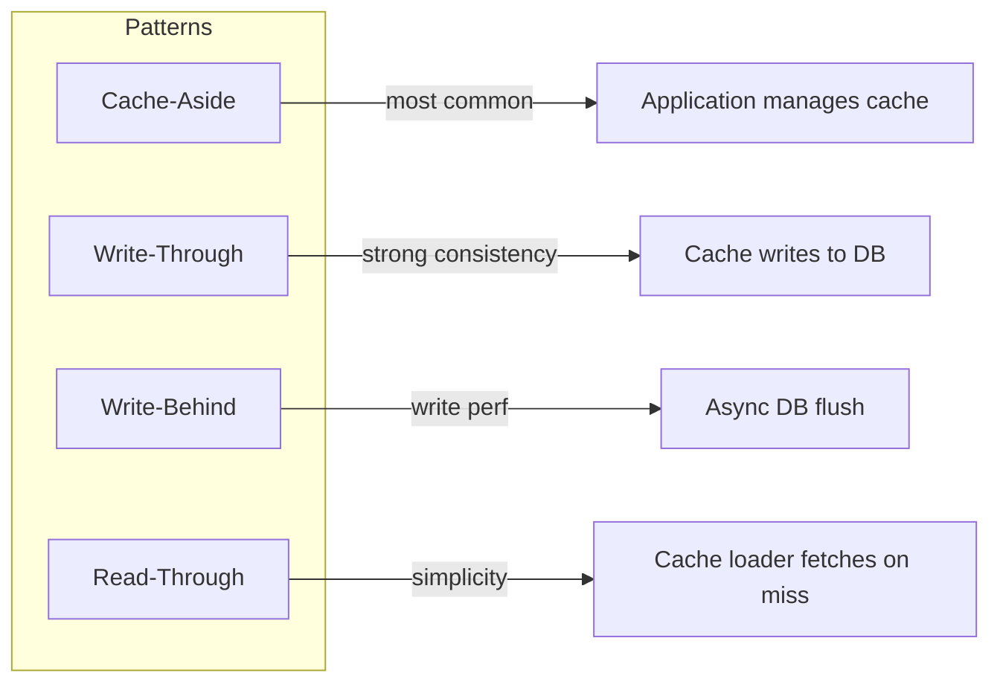

---

## Deep Dives (~10 min)

### 7.1 Consistent Hashing

### The Problem with `hash(key) mod N`

When node count changes from N to N+1, **nearly all keys remap** → cache stampede on DB.

```
N=4, add node → ~75% of keys move
N=100, add node → ~99% of keys move
```

### Consistent Hashing Solution

Hash keys and nodes onto a ring (0 to 2^32-1). Key belongs to first node clockwise on ring.

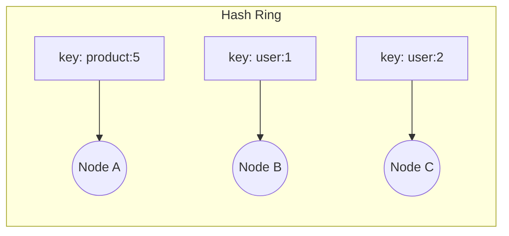

### Virtual Nodes (VNodes)

Each physical node owns **multiple points** on the ring (typically 100–200 vnodes).

```
Physical Node A → vnode A-0, A-1, ... A-149
Physical Node B → vnode B-0, B-1, ... B-149
```

**Benefits:**

- Even load distribution
- Adding one node moves only ~1/N of keys (not ~75%)
- Heterogeneous hardware: assign more vnodes to larger machines

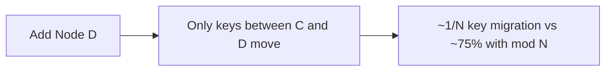

### Redis Cluster: Hash Slots (16384)

Redis uses fixed **16,384 hash slots** — a practical consistent hashing variant:

```
slot = CRC16(key) mod 16384
Each master owns a range of slots (e.g., 0–5460)
Resharding moves slots, not individual keys
```

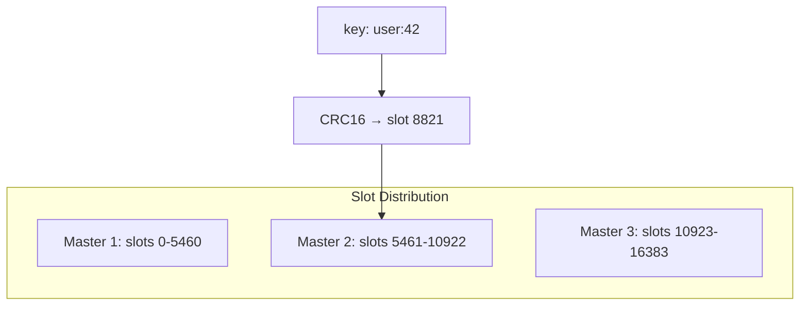

### Resharding Process

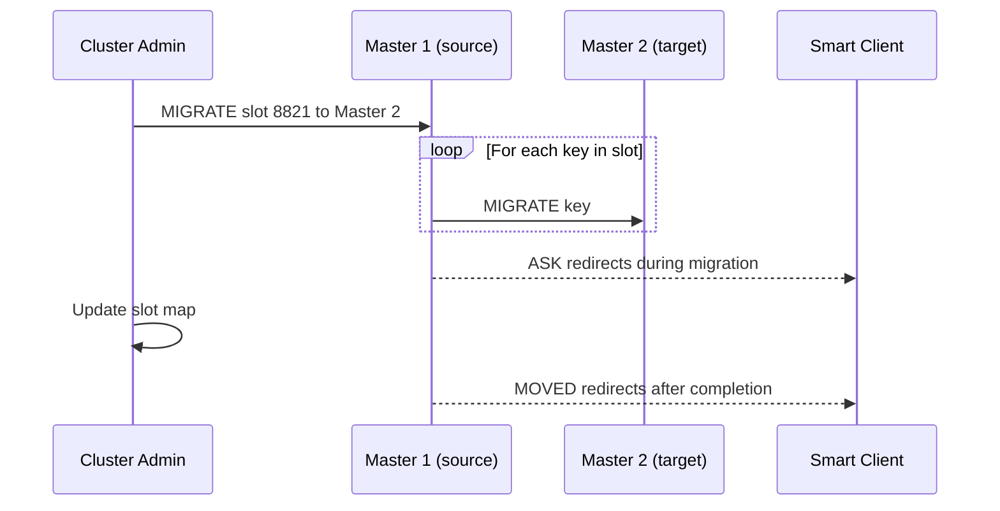

---

### 7.2 Eviction Policies

When memory is full, the cache must evict keys. Wrong policy → hit ratio collapse.

### Redis Eviction Policies

| Policy | Behavior | Best For |
|--------|----------|----------|
| **noeviction** | Return errors on write | Cache-aside where miss is OK |
| **allkeys-lru** | Evict any key by LRU | General purpose cache |
| **volatile-lru** | Evict keys with TTL by LRU | Mixed TTL workloads |
| **allkeys-lfu** | Evict by least frequently used | Hot key stability (Redis 4.0+) |
| **volatile-ttl** | Evict keys closest to expiry | Time-sensitive data |
| **allkeys-random** | Random eviction | Uniform access patterns |

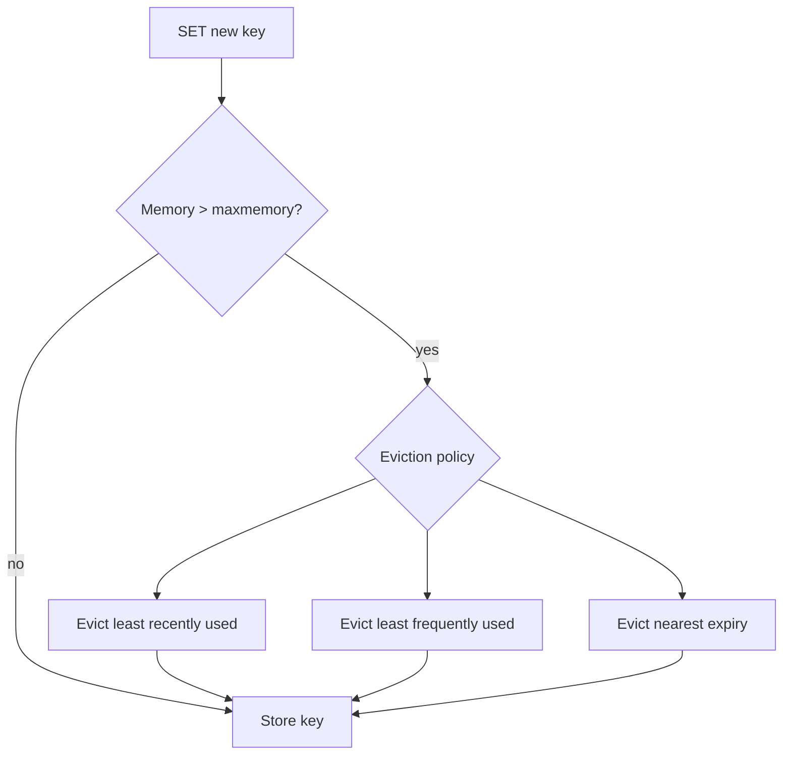

### LRU vs LFU in Production

```
Scenario: Product catalog flash sale
  LRU: evicts recently unsold products → good
  LFU: keeps historically popular items → resists one-day spikes evicting steady sellers

Recommendation: allkeys-lfu for skewed access (social, e-commerce)
                allkeys-lru for uniform or session data
```

### Approximate LRU (Redis Implementation)

Redis samples **5 random keys** and evicts the LRU among them — O(1) amortized vs true O(log N) LRU.

### TTL + Eviction Interaction

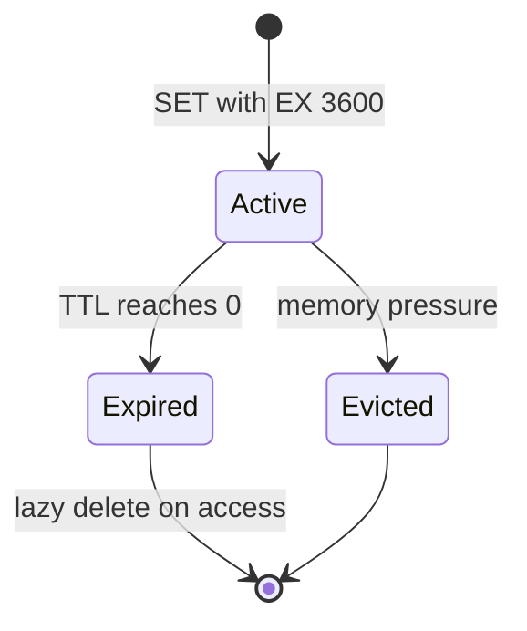

- **Lazy expiration:** Check TTL on read; delete if expired
- **Active expiration:** Background task samples keys with TTL (10×/sec default)

### Preventing Eviction Surprises

```
Monitor: evicted_keys/sec, used_memory, hit_ratio
Alert: hit_ratio drops below 85%
Mitigation: increase memory, tighten TTLs, reduce cached payload size
```

---

### 7.3 Replication & Failover

### Primary-Replica Topology

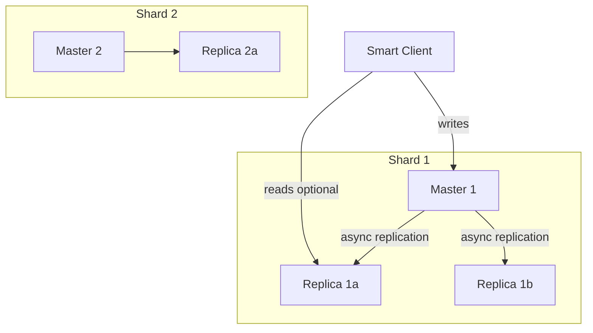

### Replication Modes

| Mode | Durability | Latency | Use Case |
|------|------------|---------|----------|
| **Async (default)** | May lose last writes on failover | Lowest | Pure cache |
| **Wait N replicas** | `WAIT 1 1000` — 1 replica ack in 1s | Medium | Semi-durable cache |
| **AOF fsync always** | Strongest | Highest | Session store |

### Failover with Redis Sentinel / Cluster

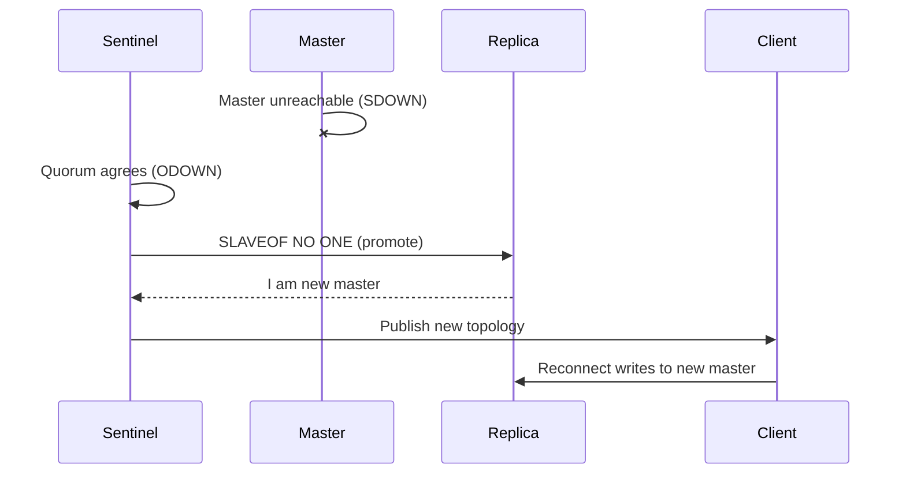

**Split-brain prevention:** Require majority sentinel quorum before promotion.

### Replication Lag Handling

```
Problem: Read from replica → stale data (lag 100ms–1s)
Solutions:
  1. Read-your-writes: route reads to master after write (sticky session)
  2. Monotonic reads: same replica for session
  3. Track replication offset: don't read replica until offset caught up
```

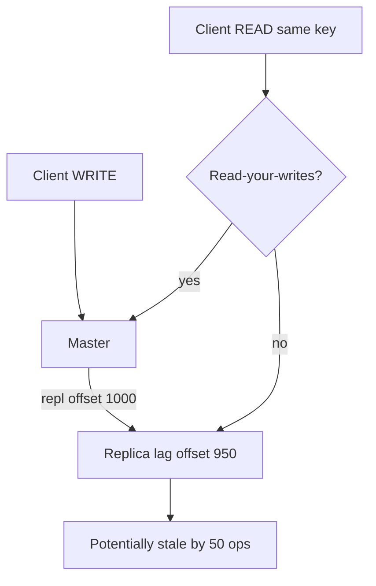

---

### 7.4 Cache-Aside vs Write-Through

### Pattern 1: Cache-Aside (Lazy Loading)

Application manages cache explicitly.

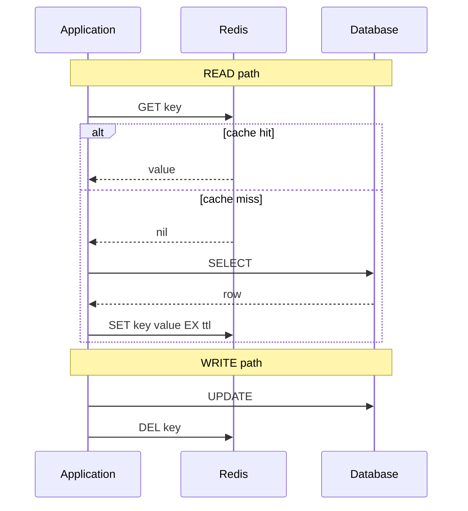

**Pros:** Simple, cache only stores what's read, DB is always authoritative  
**Cons:** Cache miss penalty, possible stale window if DEL fails, thundering herd on expiry

### Pattern 2: Write-Through

Cache sits in front; every write goes through cache to DB synchronously.

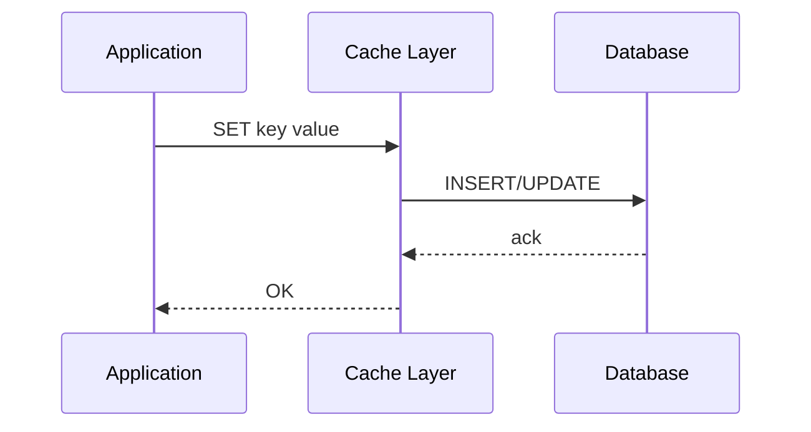

**Pros:** Cache always consistent with DB on write completion  
**Cons:** Write latency = cache + DB; cache polluted with cold writes

### Pattern 3: Write-Behind (Write-Back)

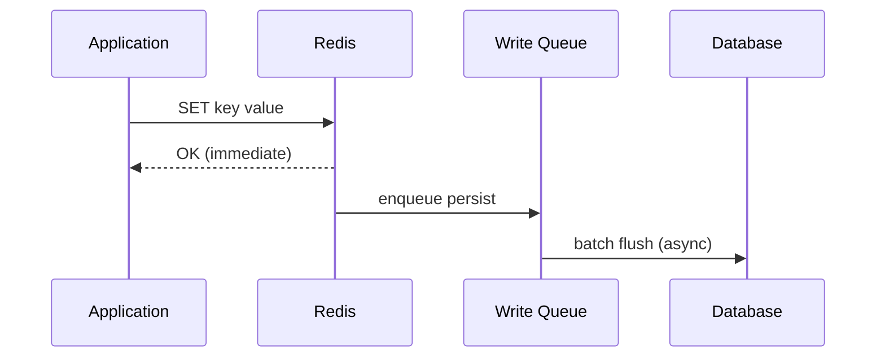

**Pros:** Fastest writes, absorbs write spikes  
**Cons:** Data loss risk on crash, conflict resolution complexity

### Pattern 4: Read-Through

Cache library fetches from DB on miss — application only talks to cache.

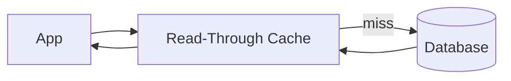

### Comparison Matrix

| Pattern | Read Latency | Write Latency | Consistency | Complexity |
|---------|-------------|---------------|-------------|------------|
| Cache-Aside | Miss: high | Low | Eventual | Low 1/5 |
| Write-Through | Low | High | Strong | Medium |
| Write-Behind | Low | Lowest | Weakest | High |
| Read-Through | Low | N/A | Eventual | Medium |

**Interview default:** Start with **cache-aside + TTL + explicit invalidation on write**. Mention write-through for financial or inventory data requiring strong consistency.

### Thundering Herd Mitigation

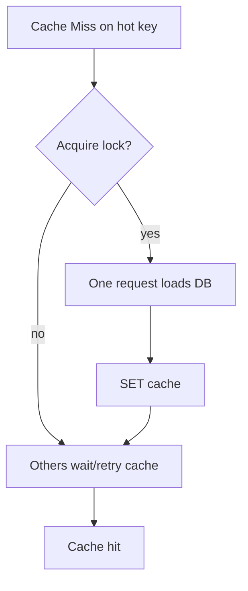

Techniques:

1. **Distributed lock** (Redis SETNX) — only one loader per key
2. **Request coalescing** — singleflight pattern in app
3. **Stale-while-revalidate** — return stale value, async refresh
4. **Jittered TTL** — prevent simultaneous expiry

---

### Scaling & Reliability
### Horizontal Scaling Checklist

```mermaid
flowchart TB
    Scale[Need More Capacity] --> Q{QPS or Memory?}
    Q -->|Memory| AddShards[Add shards + reshard slots]
    Q -->|QPS| AddReplicas[Add read replicas]
    Q -->|Both| Both[Add shards with replicas each]
```

### Hot Key Detection & Mitigation

```
Detection: Redis `--hotkeys`, client-side key frequency sampling
Mitigation:
  - Local in-process cache (Caffeine) for top 100 keys
  - Key replication: store hot key on multiple nodes (Redis Enterprise)
  - Split key: product:123 → product:123:slot0..slot9 (application merge)
```

### Multi-Region Caching

```mermaid
flowchart LR
    subgraph US
        USApp[App US] --> USCache[(Redis US)]
        USCache --> USDB[(DB US Primary)]
    end
    subgraph EU
        EUApp[App EU] --> EUCache[(Redis EU)]
        EUCache --> EUDB[(DB EU Replica)]
    end
    USDB -.->|async| EUDB
```

**Cache invalidation across regions:** Pub/sub fan-out or Kafka invalidation topic.

### Monitoring Dashboard

| Metric | Alert Threshold |
|--------|-----------------|
| `hit_ratio` | < 85% for 5 min |
| `used_memory / maxmemory` | > 80% |
| `evicted_keys/sec` | > 100 sustained |
| `connected_clients` | > 80% max |
| `replication_lag_bytes` | > 10 MB |
| `slowlog` entries | > 10/min |

---

## Failure Modes & Resilience
| Failure | Impact | Mitigation |
|---------|--------|------------|
| Master crash | Writes fail for shard | Sentinel auto-failover (< 30s) |
| Full cluster partition | Split brain | Quorum-based promotion; minority partition read-only |
| Cache stampede | DB overload | Singleflight, circuit breaker |
| Big key (> 1 MB) | Blocks event loop | Split into hash fields; compress |
| KEYS * in production | O(N) block | Use SCAN; ban KEYS |
| Invalidation race | Stale cache | Version stamps; delete-not-update |
| Cold start after deploy | 100% miss rate | Cache warming job; gradual rollout |

### Cache Penetration (Non-Existent Keys)

```mermaid
flowchart TD
    Req[GET nonexistent user:999] --> Cache{In cache?}
    Cache -->|no| DB{In DB?}
    DB -->|no| Null[Cache NULL with short TTL]
    Null --> Return[Return 404 without hammering DB]
```

**Bloom filter** in front of cache for known-valid ID space.

### Cache Avalanche

Many keys expire simultaneously → mass DB load.

**Fix:** Random TTL jitter `TTL = base + random(0, 300)`.

---

## Trade-offs Summary
| Decision | Option A | Option B | Recommendation |
|----------|----------|----------|----------------|
| Partitioning | Consistent hash ring | Fixed hash slots | **Hash slots** (Redis Cluster standard) |
| Eviction | LRU | LFU | **LFU** for skewed access |
| Consistency | Cache-aside | Write-through | **Cache-aside** default; write-through for inventory |
| Replication reads | Master only | Replica reads | **Replica reads** for read-heavy, tolerate staleness |
| Persistence | None | AOF | **None** for pure cache; AOF for session store |
| Client | Smart client | Proxy | **Smart client** (lower latency) |

---

## Interview Walkthrough Script
### Minutes 0–5: Requirements

> "I'll design a distributed cache like Redis Cluster for a read-heavy e-commerce catalog. 95% hit ratio target, sub-ms latency, 10 TB scale. DB remains source of truth — cache is best-effort durable."

### Minutes 5–10: Estimation

> "200 GB hot set, 100K read QPS. Twelve 64 GB nodes with one replica each gives 520 GB and 2.4M ops headroom."

### Minutes 10–20: Architecture

Draw app → smart client → Redis Cluster (3 masters, 3 replicas) → DB on miss.

Explain hash slots, MOVED redirects, cache-aside read/write paths.

### Minutes 20–35: Deep Dives

Pick 2–3:

- Consistent hashing + vnodes + slot migration
- Eviction: LFU vs LRU with flash sale example
- Cache-aside vs write-through with sequence diagrams
- Failover with Sentinel quorum

### Minutes 35–45: Wrap-Up

> "Biggest risks: hot keys and thundering herd. I'd add local L1 cache, singleflight on miss, and monitor hit ratio + evictions. For cross-region, regional caches with Kafka invalidation."

---

## Follow-Up Questions
1. **How would you cache a leaderboard?** — Redis sorted sets (ZADD/ZRANGE); periodic snapshot to DB.
2. **Design cache for search results.** — Cache query hash → result IDs; short TTL (60s); invalidate on index update.
3. **Compare Redis vs Memcached.** — Redis: data structures, persistence, cluster; Memcached: simpler, multithreaded, pure KV.
4. **How to handle cache consistency with database transactions?** — Transactional outbox → invalidation consumer; or write-through within same transaction boundary.
5. **Design a distributed lock using this cache.** — SET key token NX EX 30; see dedicated lock service guide.

---

## Real-World References
| System | Approach |
|--------|----------|
| **Redis Cluster** | 16K hash slots, async replication, Sentinel failover |
| **Amazon ElastiCache** | Managed Redis/Memcached, cluster mode enabled |
| **Facebook TAO** | Multi-layer cache (memcached) with DB backing |
| **Twitter** | Manhattan + Redis for timeline caching |
| **Twemproxy** | Proxy-based consistent hashing (pre-Redis Cluster) |

**Key concepts:**

- Consistent hashing (Karger et al., 1997)
- Cache-aside pattern (Microsoft patterns & practices)
- Singleflight (Go `golang.org/x/sync/singleflight`)

---

---

## Interview Cheat Sheet

**Lead with:** Always state that **cache is not a database**. Design for miss tolerance, monitor hit ratio, and explain invalidation strategy before the interviewer asks "what happens when data changes?"

See [Interview Walkthrough Script](#interview-walkthrough-script) for timed delivery.
