# Design a Notification System

> **Framework:** [Hello Interview Delivery Framework](https://www.hellointerview.com/learn/system-design/in-a-hurry/delivery)  
> **Difficulty:** Hard (multi-channel async pipeline + fan-out at scale)  
> **Time budget:** 45 minutes  
> **Primary topics:** Multi-channel delivery, priority queues, fan-out, idempotency, templates

---

## Table of Contents

1. [How to Use This Guide](#how-to-use-this-guide)
2. [Requirements (~5 min)](#requirements-5-min)
3. [Core Entities (~2 min)](#core-entities-2-min)
4. [API / System Interface (~5 min)](#api--system-interface-5-min)
5. [Data Flow (~5 min)](#data-flow-5-min)
6. [High-Level Design (~10–15 min)](#high-level-design-1015-min)
7. [Deep Dives (~10 min)](#deep-dives-10-min)
8. [Capacity & Sizing](#capacity--sizing)
9. [Failure Modes & Resilience](#failure-modes--resilience)
10. [Trade-offs Summary](#trade-offs-summary)
11. [Interview Walkthrough Script](#interview-walkthrough-script)
12. [Follow-Up Questions](#follow-up-questions)
13. [Real-World References](#real-world-references)
14. [Interview Cheat Sheet](#interview-cheat-sheet)

---

## How to Use This Guide

This guide walks through designing a **multi-channel notification platform** at Big Tech interview depth. Follow the Hello Interview pacing: clarify scope early, draw boxes before optimizing, and spend deep-dive time on the **hardest** parts, not on generic CRUD.

**What interviewers optimize for:**

| Rubric pillar | What to demonstrate |
|---|---|
| Problem navigation | Scope transactional vs marketing; channels in/out |
| Solution design | Async pipeline with priority queues and channel workers |
| Technical excellence | Fan-out hybrid, idempotency layers, template rendering |
| Communication | Never drop P0; degrade P3 first | |

**Suggested opening script:**

> "I'll design a multi-channel notification platform: push, email, SMS, and in-app. Transactional P0 with 5-second SLA; marketing async with rate limiting. My focus is async 202 pattern and fan-out at scale."

**Pacing guide:**

| Phase | Time | What to Cover |
|-------|------|---------------|
| Requirements | ~5 min | Functional + non-functional, scope, clarifying questions |
| Core Entities | ~2 min | Primary data objects and relationships |
| API Design | ~5 min | REST/RPC endpoints, request/response contracts |
| Data Flow | ~5 min | End-to-end sequence for happy path |
| High-Level Design | ~10–15 min | Architecture boxes-and-arrows |
| Deep Dives | ~10 min | Bottlenecks, scaling, edge cases, trade-offs |
| Capacity | woven in | Back-of-envelope QPS, storage, bandwidth |

---

## Requirements (~5 min)
Design a notification system that delivers messages to users across multiple channels (push, email, SMS, in-app). The system supports transactional notifications (password reset, order confirmation) and marketing campaigns (promotions, digests). It must handle template rendering, user preferences, delivery guarantees, and massive fan-out when a single event triggers millions of notifications.

**What the interviewer is really testing:**

- Async pipeline design with priority queues
- Fan-out at scale (1 event → N users)
- Channel abstraction and provider failover
- Idempotency and exactly-once delivery semantics
- User preference and compliance (opt-out, quiet hours)

---


### Clarifying Questions to Ask

| Question | Why It Matters |
|----------|----------------|
| Transactional vs marketing? | Different SLAs, throttling, compliance |
| Which channels? Push, email, SMS, in-app? | Provider integration complexity |
| Real-time or batched digests? | Fan-out and scheduling design |
| User preference controls? | Per-channel opt-in/out, quiet hours |
| Delivery guarantee level? | At-least-once vs exactly-once cost |
| Global or single region? | Multi-region provider routing |

### Functional Requirements

**Must Have (P0):**

- Send notification to a user on one or more channels
- Template-based messages with variable substitution
- User notification preferences (channel enable/disable)
- Delivery status tracking (queued, sent, delivered, failed)
- Retry failed deliveries with exponential backoff

**Should Have (P1):**

- Priority levels (critical transactional > marketing)
- Scheduled / delayed notifications
- Batch campaign send to user segments
- In-app notification inbox with read/unread state
- Rate limiting per user (anti-spam)

**Nice to Have (P2):**

- A/B test message variants
- Rich push (images, actions)
- Webhook callbacks to sender on delivery events
- Analytics dashboard (open rate, click rate)

### Non-Functional Requirements

| Dimension | Target | Rationale |
|-----------|--------|-----------|
| **Transactional latency** | < 5 sec end-to-end | OTP and fraud alerts are time-critical |
| **Marketing throughput** | 10M notifications/min | Black Friday campaigns |
| **Availability** | 99.99% | Missed OTP = user lockout |
| **Durability** | No lost transactional messages | Persist before ack to sender |
| **Compliance** | CAN-SPAM, GDPR, TCPA | Legal requirement for email/SMS |

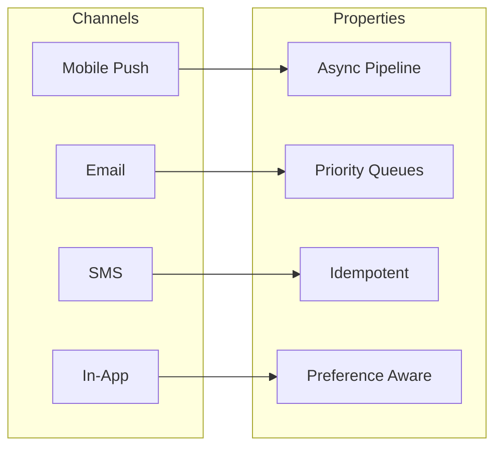
```mermaid
graph LR
    subgraph Channels
        Push[Mobile Push]
        Email[Email]
        SMS[SMS]
        InApp[In-App]
    end
    subgraph Properties
        P1[Async Pipeline]
        P2[Priority Queues]
        P3[Idempotent]
        P4[Preference Aware]
    end
    Push --> P1
    Email --> P2
    SMS --> P3
    InApp --> P4
```

---

## Capacity & Sizing
Assume **500M DAU**, average **5 notifications/user/day**, mix: 60% push, 25% email, 10% in-app, 5% SMS.

### Volume

```
Daily notifications:     500M × 5 = 2.5B/day
Average QPS:             2.5B / 86400 ≈ 29,000/sec
Peak (3× average):       ~87,000/sec
Campaign spike:          10M in 5 min ≈ 33,000/sec additional
Combined peak:           ~120,000 notifications/sec
```

### Storage

```
Notification record: ~500 bytes (metadata, status, template ref)
Daily storage: 2.5B × 500 B ≈ 1.25 TB/day
30-day retention: ~37 TB (partition by date, archive to S3)
User preferences: 500M × 200 B ≈ 100 GB
Device tokens: 500M × 2 devices × 300 B ≈ 300 GB
```

### Provider Rate Limits

| Channel | Provider | Typical Limit |
|---------|----------|---------------|
| Push (APNs/FCM) | Apple/Google | ~500K/sec aggregate |
| Email | SendGrid/SES | 10K–50K/sec per account |
| SMS | Twilio | 100–500/sec per number |
| In-app | Internal | Limited by DB write capacity |

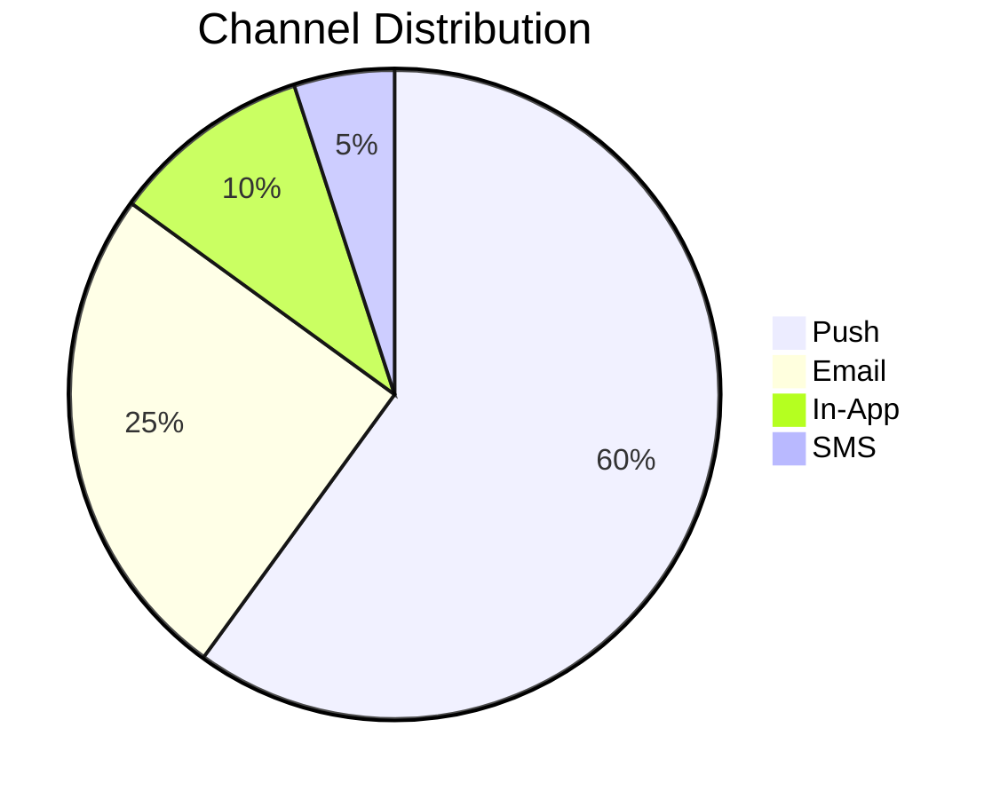
```mermaid
pie title Channel Distribution
    "Push" : 60
    "Email" : 25
    "In-App" : 10
    "SMS" : 5
```

---

## API / System Interface (~5 min)
### Send Notification (Single User)

```http
POST /v1/notifications
Authorization: Bearer {service_token}
Content-Type: application/json
Idempotency-Key: order-12345-shipped

{
  "user_id": "u_abc123",
  "template_id": "order_shipped",
  "channels": ["push", "email"],
  "priority": "high",
  "variables": {
    "order_id": "12345",
    "tracking_url": "https://track.example.com/12345",
    "customer_name": "Alice"
  },
  "metadata": {
    "source": "order-service",
    "correlation_id": "corr-789"
  }
}

Response 202 Accepted:
{
  "notification_id": "ntf_xyz789",
  "status": "queued"
}
```

### Batch / Campaign Send

```http
POST /v1/campaigns
{
  "segment_id": "premium_users_us",
  "template_id": "summer_sale",
  "channels": ["push", "email"],
  "scheduled_at": "2026-07-10T14:00:00Z",
  "rate_limit": 50000
}
```

### User Preferences

```http
GET  /v1/users/{user_id}/preferences
PUT  /v1/users/{user_id}/preferences

{
  "push": { "enabled": true, "categories": ["orders", "security"] },
  "email": { "enabled": true, "digest": "daily" },
  "sms": { "enabled": false },
  "quiet_hours": { "start": "22:00", "end": "08:00", "timezone": "America/New_York" }
}
```

### Delivery Status Webhook (Callback)

```http
POST {sender_callback_url}
{
  "notification_id": "ntf_xyz789",
  "channel": "push",
  "status": "delivered",
  "timestamp": "2026-07-08T12:00:05Z"
}
```

---

## Core Entities (~2 min)
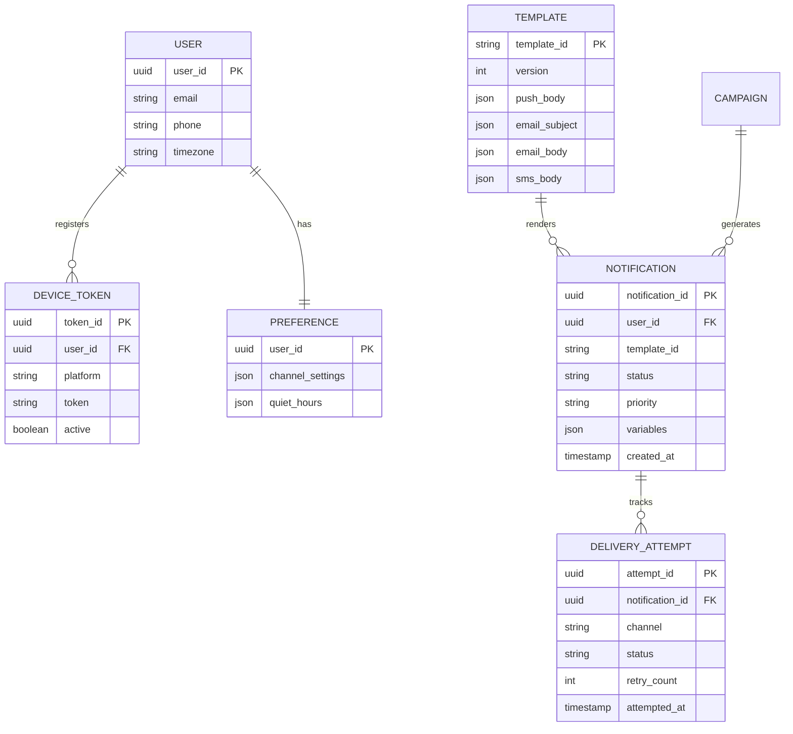
```mermaid
erDiagram
    USER ||--o{ DEVICE_TOKEN : registers
    USER ||--|| PREFERENCE : has
    TEMPLATE ||--o{ NOTIFICATION : renders
    NOTIFICATION ||--o{ DELIVERY_ATTEMPT : tracks
    CAMPAIGN ||--o{ NOTIFICATION : generates

    USER {
        uuid user_id PK
        string email
        string phone
        string timezone
    }
    DEVICE_TOKEN {
        uuid token_id PK
        uuid user_id FK
        string platform
        string token
        boolean active
    }
    PREFERENCE {
        uuid user_id PK
        json channel_settings
        json quiet_hours
    }
    TEMPLATE {
        string template_id PK
        int version
        json push_body
        json email_subject
        json email_body
        json sms_body
    }
    NOTIFICATION {
        uuid notification_id PK
        uuid user_id FK
        string template_id
        string status
        string priority
        json variables
        timestamp created_at
    }
    DELIVERY_ATTEMPT {
        uuid attempt_id PK
        uuid notification_id FK
        string channel
        string status
        int retry_count
        timestamp attempted_at
    }
```

### Notification State Machine

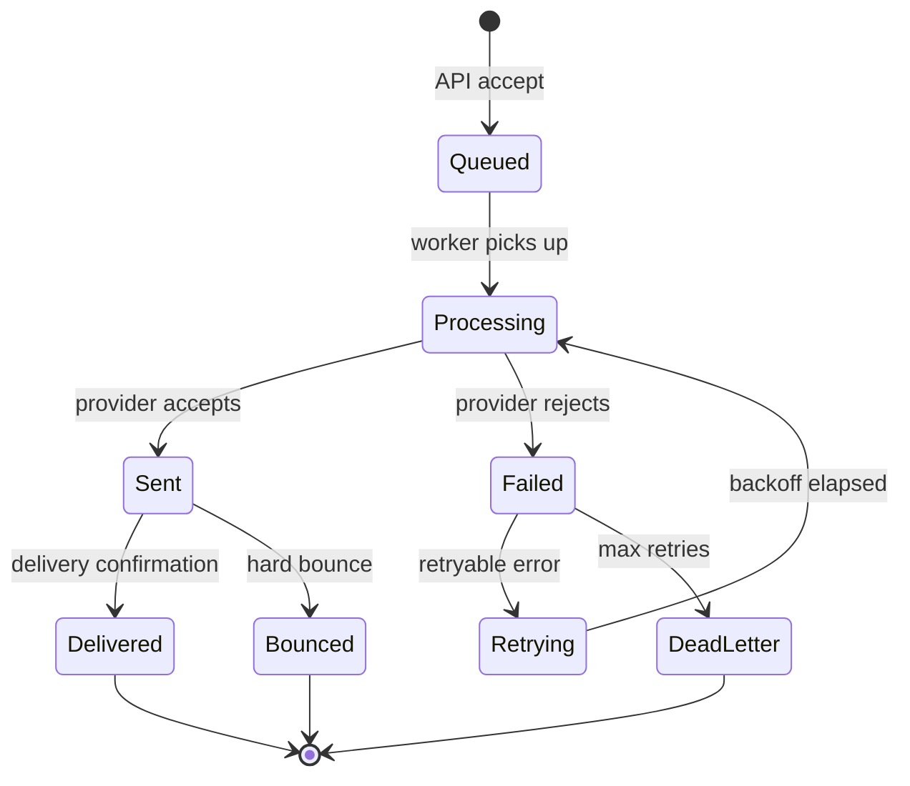
```mermaid
stateDiagram-v2
    [*] --> Queued: API accept
    Queued --> Processing: worker picks up
    Processing --> Sent: provider accepts
    Processing --> Failed: provider rejects
    Sent --> Delivered: delivery confirmation
    Sent --> Bounced: hard bounce
    Failed --> Retrying: retryable error
    Retrying --> Processing: backoff elapsed
    Failed --> DeadLetter: max retries
    Delivered --> [*]
    DeadLetter --> [*]
    Bounced --> [*]
```

---

## Data Flow (~5 min)

Walk the **happy path** end-to-end before drawing boxes. Use sequence diagrams in [High-Level Design](#high-level-design-1015-min) on the whiteboard.

1. Client / producer initiates the primary action
2. API validates auth and schema
3. Core service persists state and enqueues async work
4. Workers / cache / CDN serve scale paths
5. Webhooks or polls confirm completion

---

## High-Level Design (~10–15 min)
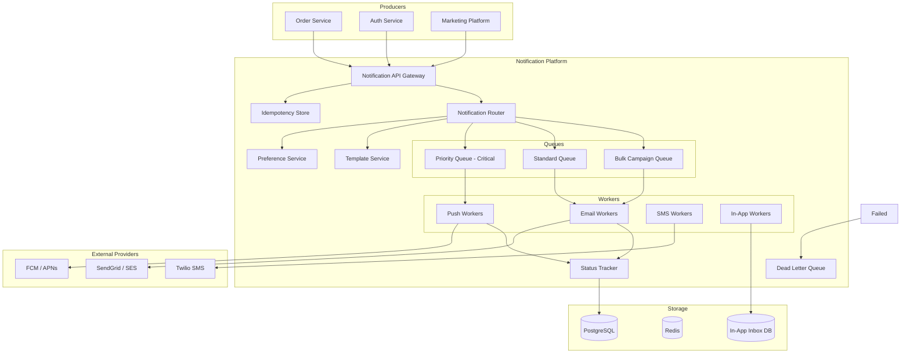
```mermaid
flowchart TB
    subgraph Producers
        OrderSvc[Order Service]
        AuthSvc[Auth Service]
        Marketing[Marketing Platform]
    end

    subgraph Notification Platform
        API[Notification API Gateway]
        Idem[Idempotency Store]
        Router[Notification Router]
        Pref[Preference Service]
        Template[Template Service]

        subgraph Queues
            PQ[Priority Queue - Critical]
            SQ[Standard Queue]
            BQ[Bulk Campaign Queue]
        end

        subgraph Workers
            PushWorker[Push Workers]
            EmailWorker[Email Workers]
            SMSWorker[SMS Workers]
            InAppWorker[In-App Workers]
        end

        Status[Status Tracker]
        DLQ[Dead Letter Queue]
    end

    subgraph External Providers
        FCM[FCM / APNs]
        SES[SendGrid / SES]
        Twilio[Twilio SMS]
    end

    subgraph Storage
        PG[(PostgreSQL)]
        Redis[(Redis)]
        Inbox[(In-App Inbox DB)]
    end

    OrderSvc --> API
    AuthSvc --> API
    Marketing --> API
    API --> Idem
    API --> Router
    Router --> Pref
    Router --> Template
    Router --> PQ
    Router --> SQ
    Router --> BQ
    PQ --> PushWorker
    SQ --> EmailWorker
    BQ --> EmailWorker
    PushWorker --> FCM
    EmailWorker --> SES
    SMSWorker --> Twilio
    InAppWorker --> Inbox
    PushWorker --> Status
    EmailWorker --> Status
    Status --> PG
    Failed --> DLQ
```

### End-to-End Flow

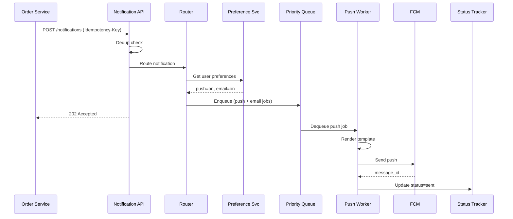
```mermaid
sequenceDiagram
    participant S as Order Service
    participant API as Notification API
    participant R as Router
    participant P as Preference Svc
    participant Q as Priority Queue
    participant W as Push Worker
    participant FCM as FCM
    participant ST as Status Tracker

    S->>API: POST /notifications (Idempotency-Key)
    API->>API: Dedup check
    API->>R: Route notification
    R->>P: Get user preferences
    P-->>R: push=on, email=on
    R->>Q: Enqueue (push + email jobs)
    API-->>S: 202 Accepted

    Q->>W: Dequeue push job
    W->>W: Render template
    W->>FCM: Send push
    FCM-->>W: message_id
    W->>ST: Update status=sent
```

---

## Deep Dives (~10 min)

### 7.1 Multi-Channel Delivery

### Channel Abstraction Layer

Each channel implements a common interface:

```
interface ChannelProvider {
  send(recipient, rendered_message) → DeliveryResult
  validate_recipient(recipient) → bool
  get_rate_limit() → RateLimit
}
```

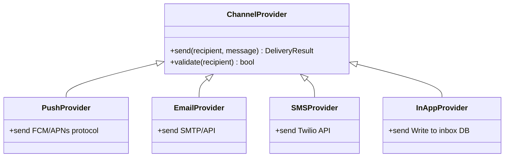
```mermaid
classDiagram
    class ChannelProvider {
        +send(recipient, message) DeliveryResult
        +validate(recipient) bool
    }
    class PushProvider {
        +send FCM/APNs protocol
    }
    class EmailProvider {
        +send SMTP/API
    }
    class SMSProvider {
        +send Twilio API
    }
    class InAppProvider {
        +send Write to inbox DB
    }
    ChannelProvider <|-- PushProvider
    ChannelProvider <|-- EmailProvider
    ChannelProvider <|-- SMSProvider
    ChannelProvider <|-- InAppProvider
```

### Push Notification Flow

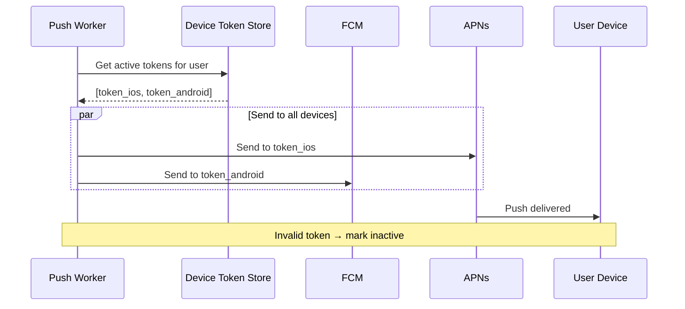
```mermaid
sequenceDiagram
    participant W as Push Worker
    participant DT as Device Token Store
    participant FCM as FCM
    participant APNs as APNs
    participant Device as User Device

    W->>DT: Get active tokens for user
    DT-->>W: [token_ios, token_android]
    par Send to all devices
        W->>APNs: Send to token_ios
        W->>FCM: Send to token_android
    end
    APNs->>Device: Push delivered
    Note over W,Device: Invalid token → mark inactive
```

**Platform specifics:**

| Platform | Protocol | Token lifecycle |
|----------|----------|-----------------|
| iOS | APNs (HTTP/2) | Token refresh on reinstall |
| Android | FCM | Token refresh on app update |
| Web | FCM Web Push | Subscription object |

### Email Delivery

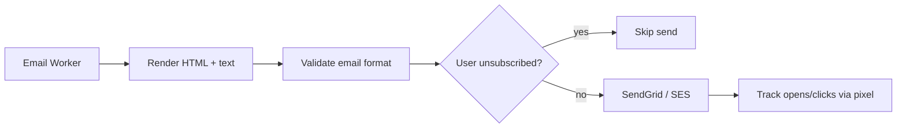
```mermaid
flowchart LR
    Worker[Email Worker] --> Render[Render HTML + text]
    Render --> Validate[Validate email format]
    Validate --> Unsub{User unsubscribed?}
    Unsub -->|yes| Skip[Skip send]
    Unsub -->|no| Provider[SendGrid / SES]
    Provider --> Track[Track opens/clicks via pixel]
```

- **Dedicated IP vs shared pool:** Transactional on dedicated IP; marketing on shared with warmup
- **Bounce handling:** Hard bounce → disable email channel for user
- **Compliance:** List-Unsubscribe header, physical address in footer (CAN-SPAM)

### SMS Constraints

```
TCPA (US): require explicit opt-in for marketing SMS
Rate: Twilio ~1 msg/sec per number → number pool for scale
Cost: $0.01–0.05/msg → SMS reserved for critical alerts only
Length: 160 chars GSM-7; longer splits into segments
```

### Channel Selection Logic

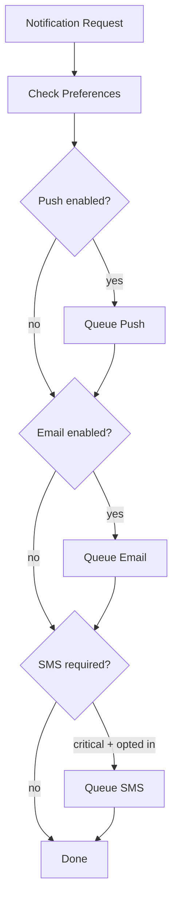
```mermaid
flowchart TD
    N[Notification Request] --> P[Check Preferences]
    P --> C1{Push enabled?}
    C1 -->|yes| Push[Queue Push]
    C1 -->|no| C2
    Push --> C2{Email enabled?}
    C2 -->|yes| Email[Queue Email]
    C2 -->|no| C3
    Email --> C3{SMS required?}
    C3 -->|critical + opted in| SMS[Queue SMS]
    C3 -->|no| Done[Done]
    SMS --> Done
```

---

### 7.2 Fan-Out Strategies

### Scenario A: Single User, Multi-Channel (Fan-Out = 2–4)

One order event → push + email + in-app. Low fan-out, high priority.

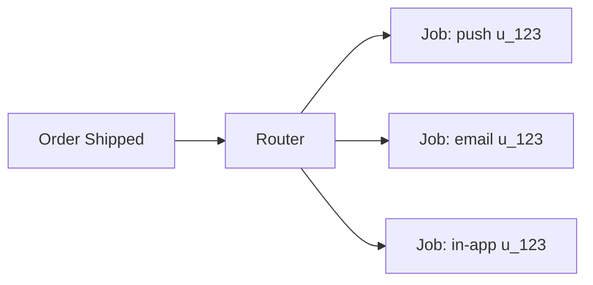
```mermaid
flowchart LR
    Event[Order Shipped] --> Router
    Router --> J1[Job: push u_123]
    Router --> J2[Job: email u_123]
    Router --> J3[Job: in-app u_123]
```

### Scenario B: Social Event (Fan-Out = 1 → Millions)

"Celebrity posted" → notify 10M followers.

**Naive approach (bad):** Synchronous loop over 10M followers → timeout, OOM.

#### Approach 1: Pre-Computed Fan-Out (Pull Model — Twitter Style)

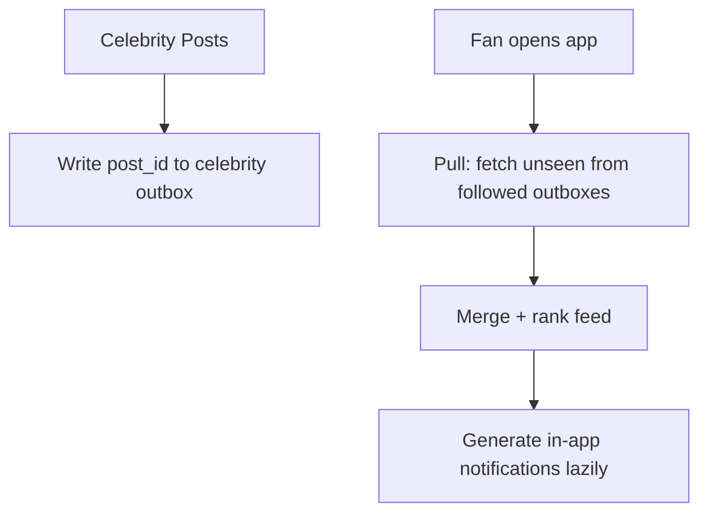
```mermaid
flowchart TB
    Post[Celebrity Posts] --> Write[Write post_id to celebrity outbox]
    Fan[Fan opens app] --> Pull[Pull: fetch unseen from followed outboxes]
    Pull --> Merge[Merge + rank feed]
    Merge --> Notify[Generate in-app notifications lazily]
```

**Pros:** Write path O(1); no fan-out storm  
**Cons:** Read path expensive; not suitable for push/email alerts

#### Approach 2: Async Fan-Out with Kafka (Push Model)

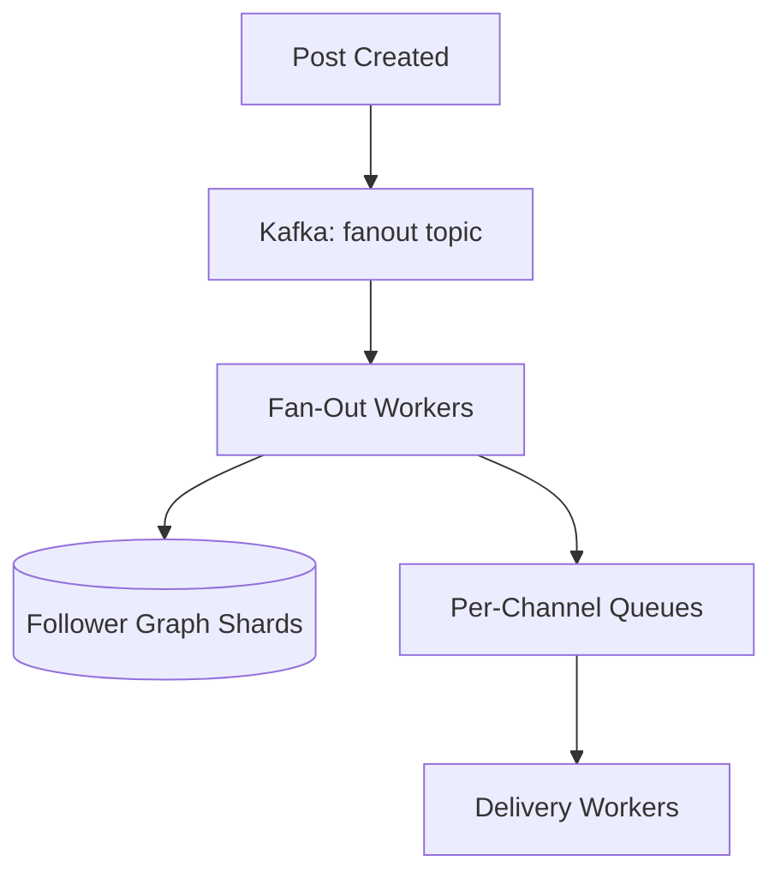
```mermaid
flowchart TB
    Event[Post Created] --> Kafka[Kafka: fanout topic]
    Kafka --> FanoutWorker[Fan-Out Workers]
    FanoutWorker --> FollowerDB[(Follower Graph Shards)]
    FanoutWorker --> Q[Per-Channel Queues]
    Q --> Workers[Delivery Workers]
```

```
Fan-out worker:
  1. Query follower shard for celebrity_id → paginated follower IDs
  2. Batch 1000 follower IDs per sub-task
  3. Enqueue notification jobs to priority queue
  4. Rate limit: 50K/sec to avoid provider throttling
```

#### Approach 3: Hybrid (Hot/Cold Fan-Out)

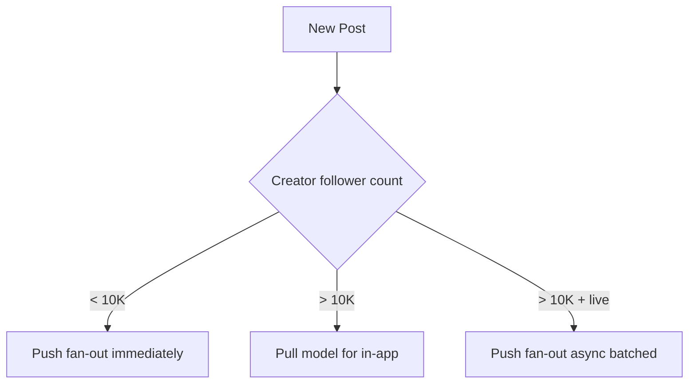
```mermaid
flowchart TD
    Post[New Post] --> Check{Creator follower count}
    Check -->|< 10K| PushFanout[Push fan-out immediately]
    Check -->|> 10K| PullFanout[Pull model for in-app]
    Check -->|> 10K + live| PushFanout2[Push fan-out async batched]
```

| Creator Tier | Followers | Strategy |
|--------------|-----------|----------|
| Normal user | < 10K | Push fan-out |
| Influencer | 10K–1M | Async batched fan-out |
| Celebrity | > 1M | Pull for in-app; push only for "live" events |

### Fan-Out Worker Scaling

```
10M followers, batch size 1000 → 10,000 sub-tasks
Each sub-task: enqueue 1000 jobs (~50ms)
10 workers × 200 sub-tasks/min → ~50 min full fan-out
Acceptable for non-critical social; use rate_limit param for campaigns
```

---

### 7.3 Templates & Personalization

### Template Structure

```json
{
  "template_id": "order_shipped",
  "version": 3,
  "channels": {
    "push": {
      "title": "Your order {{order_id}} shipped!",
      "body": "Track it here: {{tracking_url}}",
      "deep_link": "myapp://orders/{{order_id}}"
    },
    "email": {
      "subject": "Order {{order_id}} is on its way",
      "html": "<html>...{{customer_name}}...</html>",
      "text": "Hi {{customer_name}}, your order shipped."
    },
    "sms": {
      "body": "Order {{order_id}} shipped. Track: {{tracking_url}}"
    }
  },
  "required_variables": ["order_id", "tracking_url", "customer_name"]
}
```

### Rendering Pipeline

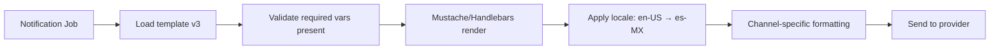
```mermaid
flowchart LR
    Job[Notification Job] --> Load[Load template v3]
    Load --> Validate[Validate required vars present]
    Validate --> Render[Mustache/Handlebars render]
    Render --> Localize[Apply locale: en-US → es-MX]
    Localize --> Channel[Channel-specific formatting]
    Channel --> Send[Send to provider]
```

### Template Versioning

```
Active version pointer: template_id → current_version
In-flight jobs pin to version at enqueue time
Rollback: flip pointer; old version cached in Redis
A/B test: route 5% to template v4, 95% to v3
```

### Personalization at Scale

| Technique | When | Example |
|-----------|------|---------|
| Simple substitution | Always | `{{name}}` |
| Conditional blocks | Medium | `{{#if premium}}...{{/if}}` |
| Dynamic content fetch | Expensive | Product image URL from catalog service |
| ML ranking | Advanced | Notification content variant selection |

**Rule:** Fetch external data **before** enqueue, store resolved variables in job payload — workers stay stateless.

### Locale & Timezone

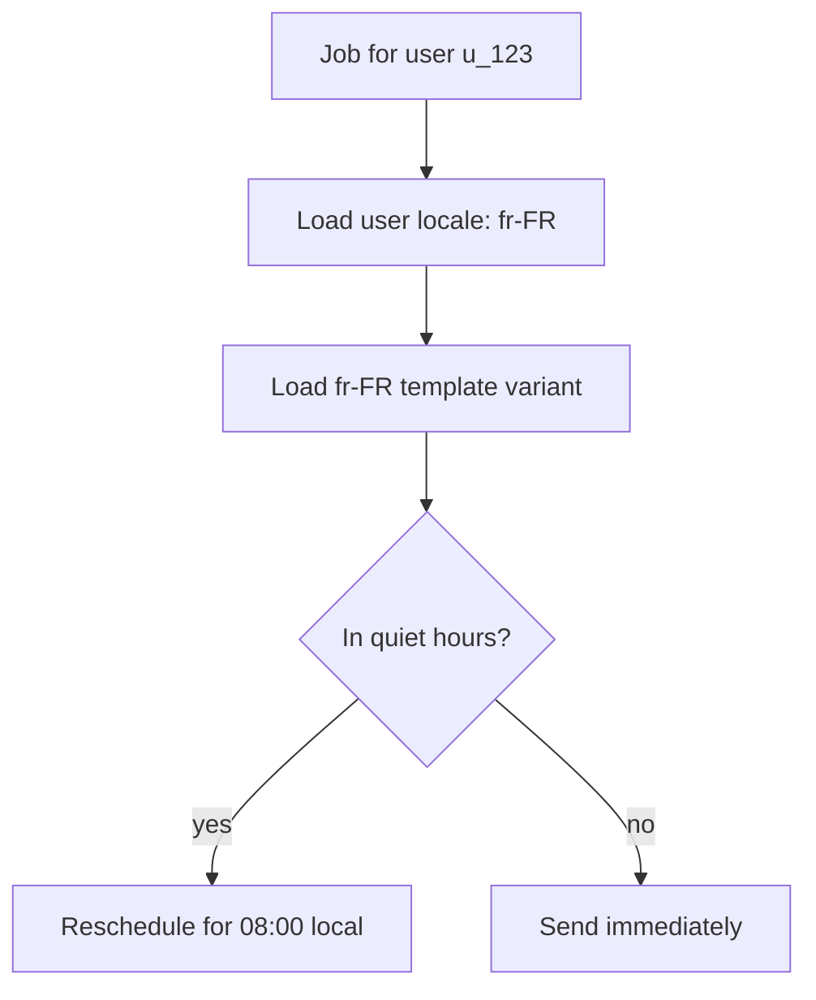
```mermaid
flowchart TD
    Job[Job for user u_123] --> Locale[Load user locale: fr-FR]
    Locale --> Template[Load fr-FR template variant]
    Template --> Quiet{In quiet hours?}
    Quiet -->|yes| Schedule[Reschedule for 08:00 local]
    Quiet -->|no| Send[Send immediately]
```

---

### 7.4 Delivery Guarantees

### Semantics Comparison

| Guarantee | Meaning | Implementation Cost |
|-----------|---------|---------------------|
| **At-most-once** | May lose, never duplicate | Fire-and-forget |
| **At-least-once** | Never lose, may duplicate | Retry + idempotency |
| **Exactly-once** | Never lose, never duplicate | Expensive; usually per-channel dedup |

**Production default: at-least-once + idempotent consumers.**

### Idempotency Design

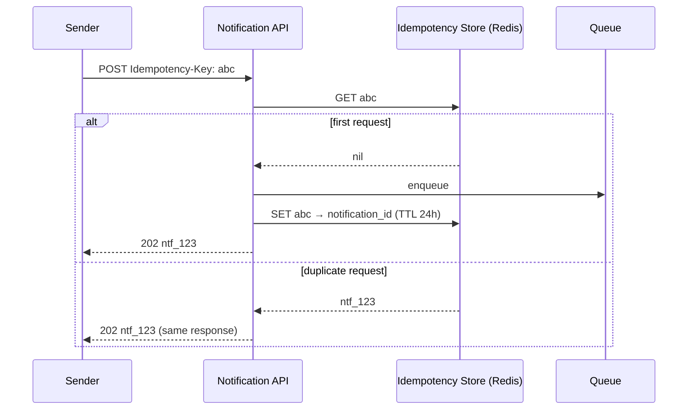
```mermaid
sequenceDiagram
    participant S as Sender
    participant API as Notification API
    participant Idem as Idempotency Store (Redis)
    participant Q as Queue

    S->>API: POST Idempotency-Key: abc
    API->>Idem: GET abc
    alt first request
        Idem-->>API: nil
        API->>Q: enqueue
        API->>Idem: SET abc → notification_id (TTL 24h)
        API-->>S: 202 ntf_123
    else duplicate request
        Idem-->>API: ntf_123
        API-->>S: 202 ntf_123 (same response)
    end
```

### Retry Policy

```
Retryable errors: 429 rate limit, 500 provider error, timeout
Non-retryable: 400 bad request, invalid token, hard bounce

Backoff: exponential 1s, 2s, 4s, 8s, 16s (max 5 retries)
Jitter: ±20% to prevent thundering herd
Dead letter: after max retries → DLQ + alert
```

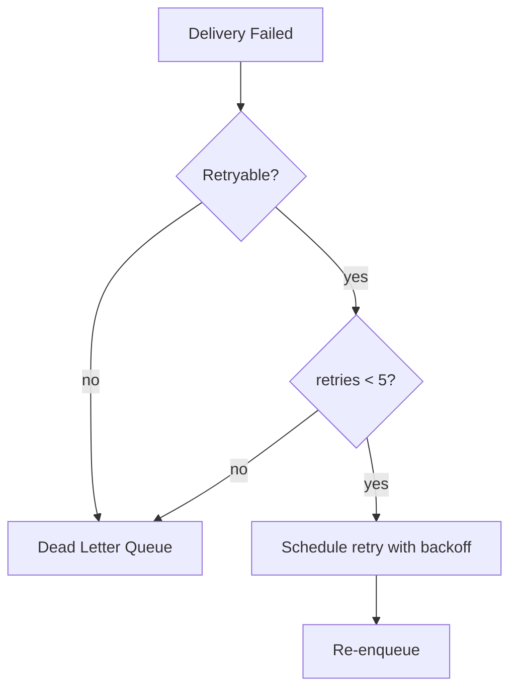
```mermaid
flowchart TD
    Fail[Delivery Failed] --> Type{Retryable?}
    Type -->|no| DLQ[Dead Letter Queue]
    Type -->|yes| Count{retries < 5?}
    Count -->|no| DLQ
    Count -->|yes| Backoff[Schedule retry with backoff]
    Backoff --> Queue[Re-enqueue]
```

### Priority Queue Architecture

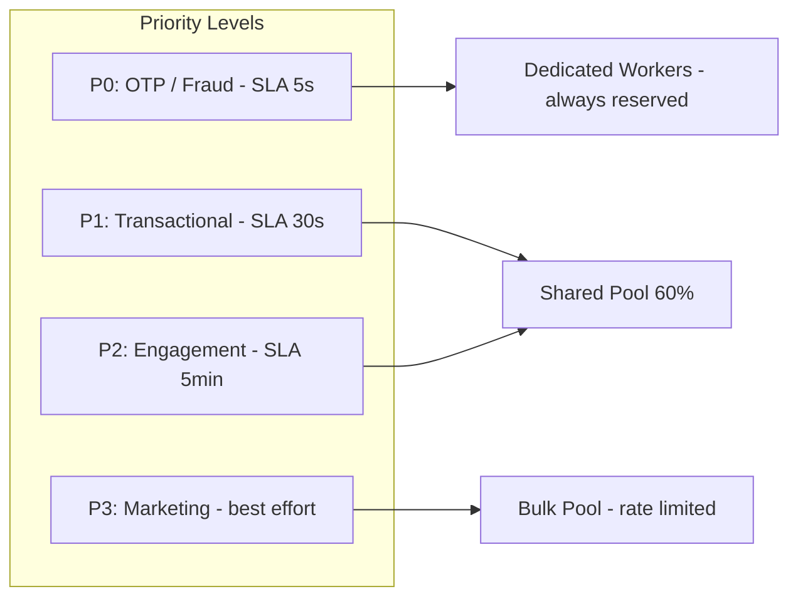
```mermaid
flowchart LR
    subgraph Priority Levels
        P0[P0: OTP / Fraud - SLA 5s]
        P1[P1: Transactional - SLA 30s]
        P2[P2: Engagement - SLA 5min]
        P3[P3: Marketing - best effort]
    end

    P0 --> W0[Dedicated Workers - always reserved]
    P1 --> W1[Shared Pool 60%]
    P2 --> W1
    P3 --> W2[Bulk Pool - rate limited]
```

**Starvation prevention:** P3 workers yield when P0/P1 queue depth > threshold.

### Delivery Confirmation

| Channel | Confirmation Mechanism |
|---------|------------------------|
| Push | FCM/APNs delivery receipt callback |
| Email | Webhook: delivered, opened, bounced |
| SMS | Twilio status callback |
| In-app | Client ack on display (optional) |

---

### Scaling & Reliability
### Queue Technology Choice

| System | Throughput | Ordering | Use Case |
|--------|------------|----------|----------|
| **Kafka** | Millions/sec | Per-partition | Fan-out events, audit log |
| **SQS** | Unlimited | Best-effort FIFO | Per-channel job queues |
| **Redis Streams** | 100K/sec | Consumer groups | Priority queues |
| **RabbitMQ** | 50K/sec | Per-queue | Complex routing |

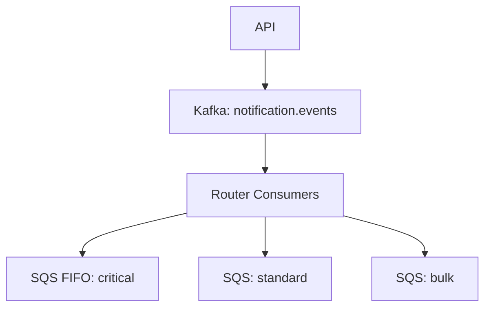
```mermaid
flowchart TB
    API --> Kafka[Kafka: notification.events]
    Kafka --> RouterWorkers[Router Consumers]
    RouterWorkers --> SQS_P0[SQS FIFO: critical]
    RouterWorkers --> SQS_P1[SQS: standard]
    RouterWorkers --> SQS_P3[SQS: bulk]
```

### Database Sharding

```
Shard key: user_id
Each shard: notifications, preferences, device tokens for user range
Cross-shard: campaigns iterate segment service (pre-computed user lists)
```

### Multi-Region

```mermaid
flowchart LR
    subgraph US
        USAPI[API US] --> USQueue[Queues US]
        USQueue --> USProviders[FCM/APNs US]
    end
    subgraph EU
        EUAPI[API EU] --> EUQueue[Queues EU]
        EUQueue --> EUProviders[Providers EU]
    end
    GlobalConfig[Global Template Store] -.-> USAPI
    GlobalConfig -.-> EUAPI
```

**GDPR:** EU user data processed in EU region; device tokens never cross border.

### Observability

| Metric | Alert |
|--------|-------|
| Queue depth (P0) | > 1000 for 1 min |
| Delivery latency p99 (P0) | > 10 sec |
| Provider error rate | > 5% |
| DLQ rate | > 0.1% of volume |
| Idempotency collision rate | Informational |

---

## Failure Modes & Resilience
| Failure | Impact | Mitigation |
|---------|--------|------------|
| Provider outage (FCM down) | Push fails | Failover provider; queue and retry |
| Invalid device token | Wasted API call | Mark inactive on 410 Gone |
| Fan-out storm | Queue backlog | Rate limit; hybrid pull model |
| Duplicate send | User annoyance | Idempotency key + dedup window |
| Template render error | Missing variables | Validate at API; reject 400 |
| Quiet hours edge | OTP delayed | P0 bypasses quiet hours |
| Email marked spam | Low deliverability | Dedicated IP, DKIM/SPF/DMARC |

### Duplicate Notification Prevention

```
Layer 1: Idempotency-Key at API (24h window)
Layer 2: Dedup key at worker: hash(user_id + template + correlation_id)
Layer 3: Provider-level dedup (FCM collapse_key for Android)
```

### Graceful Degradation

```mermaid
flowchart TD
    Overload[System Overloaded] --> DropP3[Drop P3 marketing]
    DropP3 --> StillHigh{Still overloaded?}
    StillHigh -->|yes| DelayP2[Delay P2 by 5 min]
    StillHigh -->|no| OK[Stable]
    DelayP2 --> Never[Never drop P0/P1]
```

---

## Trade-offs Summary
| Decision | Option A | Option B | Recommendation |
|----------|----------|----------|----------------|
| Fan-out | Push (write) | Pull (read) | **Hybrid** by follower count |
| Delivery | At-least-once | Exactly-once | **At-least-once + idempotency** |
| Queue | Kafka only | SQS per channel | **Kafka events + SQS jobs** |
| Templates | Inline strings | Template service | **Template service with versioning** |
| SMS | Always send | Push-first fallback | **Push-first; SMS for critical only** |

---

## Interview Walkthrough Script
### Minutes 0–5: Requirements

> "Multi-channel notification platform: push, email, SMS, in-app. Transactional P0 with 5-second SLA, marketing campaigns at 10M/min. User preferences and idempotency required."

### Minutes 5–10: Estimation

> "2.5B notifications/day ≈ 29K/sec average, 120K peak. 1.25 TB/day metadata — partition by date, archive to S3. Device tokens ~300 GB."

### Minutes 10–20: Architecture

Draw producers → API → router → priority queues → channel workers → providers. Emphasize async 202 Accepted pattern.

### Minutes 20–35: Deep Dives

- Multi-channel abstraction with preference filtering
- Fan-out: hybrid push/pull for celebrity problem
- Idempotency + retry + DLQ for delivery guarantees
- Template rendering pipeline

### Minutes 35–45: Wrap-Up

> "Monitor P0 queue depth and provider error rates. Never drop transactional. For campaigns, pre-compute segments and rate-limit to protect provider quotas."

---

## Follow-Up Questions
1. **Design a notification digest (daily email summary).** — Aggregation window in Flink; single email per user per day.
2. **How to handle notification grouping on mobile?** — `collapse_key` (Android), `thread-id` (iOS), summary notification pattern.
3. **Design real-time typing indicators vs notifications.** — Typing = WebSocket ephemeral; notifications = async queue (different system).
4. **How to test notification system?** — Shadow mode queue; device lab; provider sandbox APIs.
5. **Rate limit notifications per user?** — Token bucket in Redis: max 10 marketing/user/day.

---

## Real-World References
| System | Notable Design |
|--------|----------------|
| **LinkedIn** | Kafka + Samza for fan-out; priority tiers |
| **Twitter** | Hybrid fan-out (push for normal, pull for celebrities) |
| **Uber** | Priority queues for ride vs marketing |
| **Firebase FCM** | Collapse keys, topic subscriptions for broadcast |
| **Amazon SNS** | Multi-channel pub/sub with fan-out |

---

---

## Interview Cheat Sheet

**Lead with:** Lead with the **async 202 pattern** — notification systems are never synchronous. Separate routing (what to send) from delivery (how to send) from tracking (did it arrive).

See [Interview Walkthrough Script](#interview-walkthrough-script) for timed delivery.
