# Design a Distributed Rate Limiter

> **Hello Interview Framework** — A Big Tech–level system design guide for building a production rate limiting service used at API gateways, microservice edges, and platform infrastructure layers.

---

## Table of Contents

1. [Problem Statement](#1-problem-statement)
2. [Requirements Clarification](#2-requirements-clarification)
3. [Capacity Estimation](#3-capacity-estimation)
4. [API Design](#4-api-design)
5. [Data Model](#5-data-model)
6. [High-Level Architecture](#6-high-level-architecture)
7. [Deep Dive: Token Bucket Algorithm](#7-deep-dive-token-bucket-algorithm)
8. [Deep Dive: Sliding Window Log & Counter](#8-deep-dive-sliding-window-log--counter)
9. [Deep Dive: Redis vs Local Rate Limiting](#9-deep-dive-redis-vs-local-rate-limiting)
10. [Deep Dive: Per-User vs Global Limits](#10-deep-dive-per-user-vs-global-limits)
11. [Scaling & Reliability](#11-scaling--reliability)
12. [Failure Modes & Edge Cases](#12-failure-modes--edge-cases)
13. [Trade-offs Summary](#13-trade-offs-summary)
14. [Interview Walkthrough Script](#14-interview-walkthrough-script)
15. [Follow-Up Questions](#15-follow-up-questions)
16. [Real-World References](#16-real-world-references)

---

## 1. Problem Statement

Design a distributed rate limiter that controls the number of requests a client (user, API key, IP address) or the entire system can make within a time window. The limiter must work correctly across multiple server instances, support different rate limit tiers, and return clear feedback (HTTP 429, Retry-After header) when limits are exceeded.

**What the interviewer is really testing:**

- Algorithm choice: token bucket vs fixed/sliding window
- Distributed state synchronization (Redis, gossip)
- Accuracy vs performance trade-offs
- Per-entity vs global limit hierarchy
- Fail-open vs fail-closed behavior

---

## 2. Requirements Clarification

### Clarifying Questions to Ask

| Question | Why It Matters |
|----------|----------------|
| Per-user, per-IP, or per-API-key? | Key design and cardinality |
| Global system cap too? | Two-tier limit hierarchy |
| Hard reject or queue/throttle? | 429 vs delayed processing |
| Burst allowance needed? | Token bucket vs fixed window |
| Accuracy requirement? | Sliding window log vs counter |
| Fail-open or fail-closed if Redis down? | Availability vs abuse protection |

### Functional Requirements

**Must Have (P0):**

- Allow/deny decision per request in < 5 ms
- Configurable limits: N requests per T seconds
- Works across N stateless server instances
- Return remaining quota and reset time in headers

**Should Have (P1):**

- Multiple limit tiers (free: 100/min, pro: 10K/min)
- Different limits per endpoint (`/search` vs `/upload`)
- Burst allowance (token bucket)
- Global system-wide cap (protect downstream)

**Nice to Have (P2):**

- Dynamic limit adjustment (auto-scale during incidents)
- Allowlist / blocklist bypass
- Rate limit analytics dashboard
- Distributed quota sharing across services

### Non-Functional Requirements

| Dimension | Target | Rationale |
|-----------|--------|-----------|
| **Decision latency (p99)** | < 5 ms | On critical path for every request |
| **Accuracy** | Within 1% of configured limit | Avoid over/under limiting |
| **Availability** | 99.99% | Limiter failure shouldn't take down API |
| **Scale** | 1M unique keys, 500K RPS checks | Large public API |
| **Consistency** | Eventually consistent OK | Slight over-limit better than under-limit |

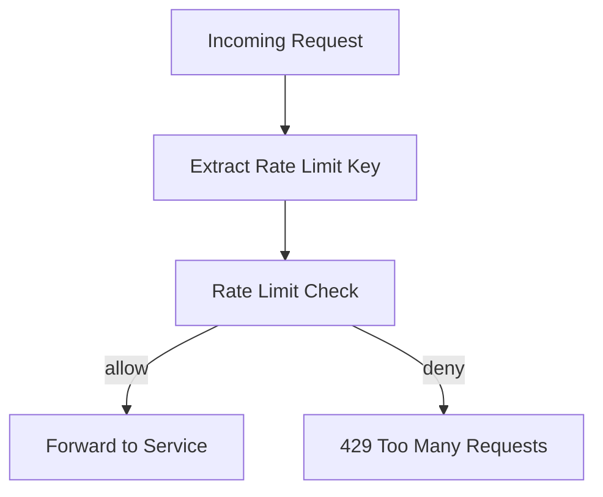
```mermaid
graph TB
    Request[Incoming Request] --> Extract[Extract Rate Limit Key]
    Extract --> Check[Rate Limit Check]
    Check -->|allow| Forward[Forward to Service]
    Check -->|deny| Reject[429 Too Many Requests]
```

---

## 3. Capacity Estimation

Assume **public API**: 500K RPS aggregate, 1M unique API keys, average 3 rate limit checks per request (global + user + endpoint).

### Rate Limit Checks

```
Checks/sec: 500K × 3 = 1.5M rate limit decisions/sec
Redis ops per check: 1 (INCR or Lua script) → 1.5M Redis ops/sec
With pipelining/batching: ~500K Redis round-trips/sec
```

### Memory (Redis)

```
Keys: 1M active API keys × 3 limit types = 3M keys
Bytes per key (counter + TTL metadata): ~100 bytes
Memory: 3M × 100 B ≈ 300 MB (very manageable)
Sliding window log (if used): 100 timestamps × 8 B × 3M = 2.4 GB
→ Prefer sliding window counter over full log at this scale
```

### Network

```
Redis request: ~100 bytes
Redis response: ~50 bytes
1.5M × 150 B ≈ 225 MB/s Redis bandwidth → Redis Cluster with 6 nodes
```

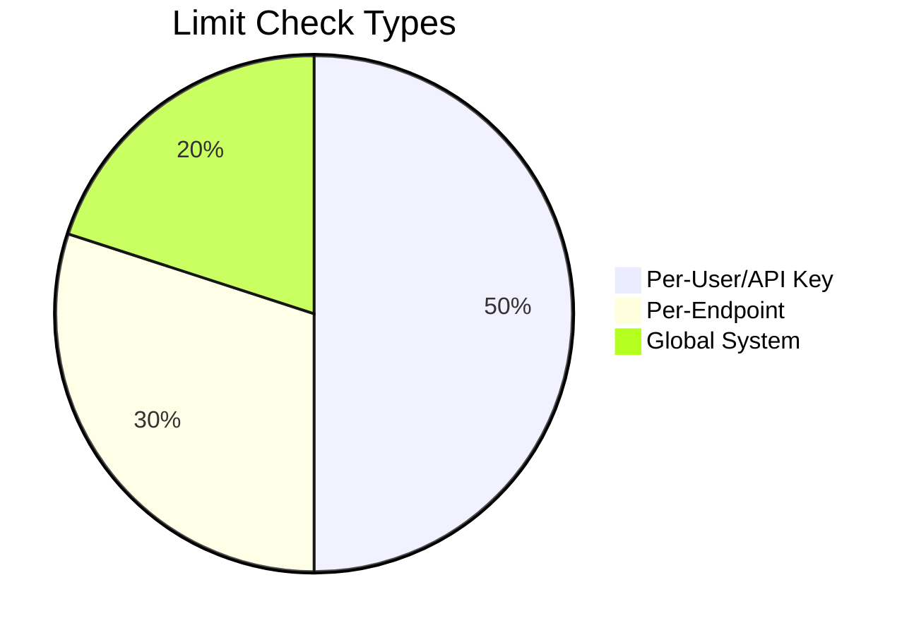
```mermaid
pie title Limit Check Types
    "Per-User/API Key" : 50
    "Per-Endpoint" : 30
    "Global System" : 20
```

---

## 4. API Design

### Internal Rate Limit Check (Sidecar / Middleware)

```http
POST /internal/ratelimit/check
Content-Type: application/json

{
  "key": "user:abc123:/v1/search",
  "limit": 100,
  "window_seconds": 60,
  "cost": 1
}

Response 200:
{
  "allowed": true,
  "remaining": 73,
  "reset_at": "2026-07-08T12:01:00Z",
  "retry_after": null
}

Response 200 (denied):
{
  "allowed": false,
  "remaining": 0,
  "reset_at": "2026-07-08T12:01:00Z",
  "retry_after": 23
}
```

### Client-Facing HTTP Headers (Standard)

```http
HTTP/1.1 200 OK
X-RateLimit-Limit: 100
X-RateLimit-Remaining: 73
X-RateLimit-Reset: 1720430460

HTTP/1.1 429 Too Many Requests
Retry-After: 23
X-RateLimit-Limit: 100
X-RateLimit-Remaining: 0
X-RateLimit-Reset: 1720430460
```

### Configuration API

```http
PUT /v1/ratelimit/rules
{
  "rule_id": "free_tier_search",
  "match": { "tier": "free", "path": "/v1/search" },
  "algorithm": "sliding_window_counter",
  "limit": 100,
  "window_seconds": 60,
  "burst": 20
}
```

---

## 5. Data Model

### Rate Limit Key Schema

```
Key format: rl:{scope}:{identifier}:{resource}

Examples:
  rl:user:abc123:global          → 1000 req/min per user
  rl:ip:203.0.113.5:global       → 100 req/min per IP
  rl:apikey:sk_live_xyz:/search  → 50 req/min per endpoint
  rl:global:system:downstream    → 500K req/sec system cap
```

### Redis Data Structures by Algorithm

| Algorithm | Redis Structure | Key Example |
|-----------|-----------------|-------------|
| Fixed window | String counter + EXPIRE | `rl:user:123:1704067200` |
| Sliding window log | Sorted set (timestamp score) | `rl:swl:user:123` |
| Sliding window counter | Two counters (current + previous window) | `rl:swc:user:123` |
| Token bucket | Hash (tokens, last_refill) | `rl:tb:user:123` |

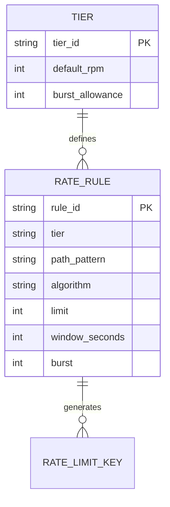
```mermaid
erDiagram
    RATE_RULE ||--o{ RATE_LIMIT_KEY : generates
    TIER ||--o{ RATE_RULE : defines
    RATE_RULE {
        string rule_id PK
        string tier
        string path_pattern
        string algorithm
        int limit
        int window_seconds
        int burst
    }
    TIER {
        string tier_id PK
        int default_rpm
        int burst_allowance
    }
```

---

## 6. High-Level Architecture

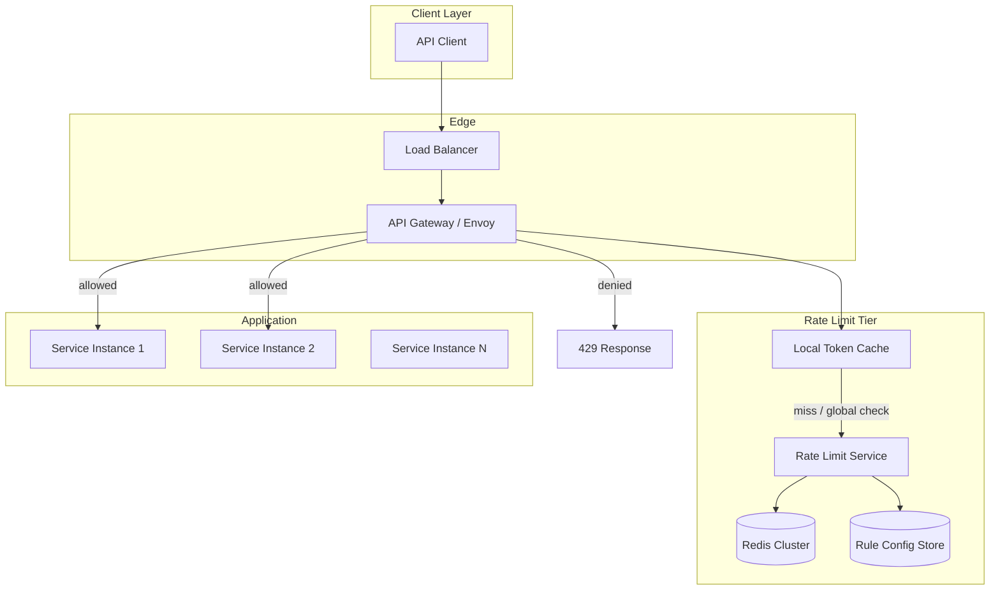
```mermaid
flowchart TB
    subgraph Client Layer
        Client[API Client]
    end

    subgraph Edge
        LB[Load Balancer]
        GW[API Gateway / Envoy]
    end

    subgraph Rate Limit Tier
        LocalCache[Local Token Cache]
        RLService[Rate Limit Service]
        Redis[(Redis Cluster)]
        Config[(Rule Config Store)]
    end

    subgraph Application
        Svc1[Service Instance 1]
        Svc2[Service Instance 2]
        SvcN[Service Instance N]
    end

    Client --> LB --> GW
    GW --> LocalCache
    LocalCache -->|miss / global check| RLService
    RLService --> Redis
    RLService --> Config
    GW -->|allowed| Svc1
    GW -->|allowed| Svc2
    GW -->|denied| Reject429[429 Response]
```

### Request Flow

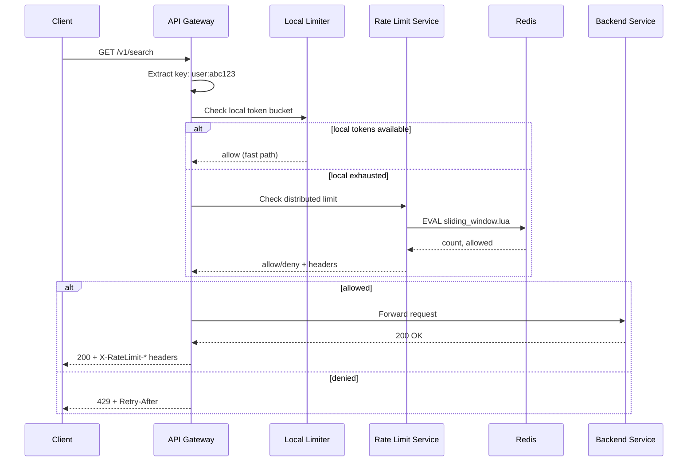
```mermaid
sequenceDiagram
    participant C as Client
    participant GW as API Gateway
    participant L as Local Limiter
    participant R as Rate Limit Service
    participant Redis as Redis
    participant S as Backend Service

    C->>GW: GET /v1/search
    GW->>GW: Extract key: user:abc123
    GW->>L: Check local token bucket
    alt local tokens available
        L-->>GW: allow (fast path)
    else local exhausted
        GW->>R: Check distributed limit
        R->>Redis: EVAL sliding_window.lua
        Redis-->>R: count, allowed
        R-->>GW: allow/deny + headers
    end
    alt allowed
        GW->>S: Forward request
        S-->>GW: 200 OK
        GW-->>C: 200 + X-RateLimit-* headers
    else denied
        GW-->>C: 429 + Retry-After
    end
```

---

## 7. Deep Dive: Token Bucket Algorithm

### Concept

Bucket holds tokens.refill at steady rate. Each request consumes 1 token. Allows bursts up to bucket capacity.

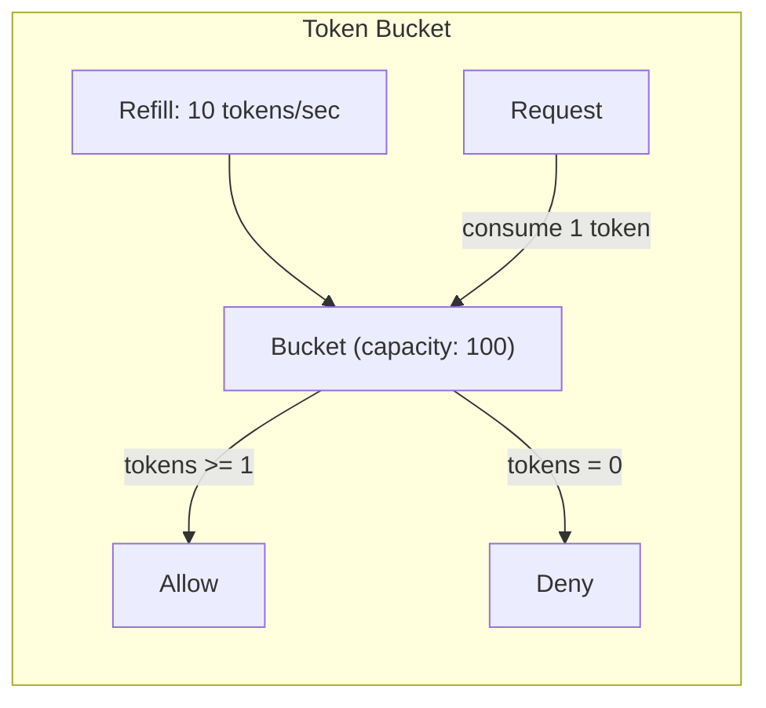
```mermaid
flowchart LR
    subgraph Token Bucket
        Bucket["Bucket (capacity: 100)"]
        Refill["Refill: 10 tokens/sec"]
        Refill --> Bucket
        Request[Request] -->|consume 1 token| Bucket
        Bucket -->|tokens >= 1| Allow[Allow]
        Bucket -->|tokens = 0| Deny[Deny]
    end
```

### Parameters

```
capacity (burst):     100 tokens  → max burst size
refill_rate:          10/sec      → sustained rate
current_tokens:       73
last_refill_timestamp: 1720430400.500
```

### Refill Logic

```python
def allow_request(bucket):
    now = time.time()
    elapsed = now - bucket.last_refill
    bucket.tokens = min(
        bucket.capacity,
        bucket.tokens + elapsed * bucket.refill_rate
    )
    bucket.last_refill = now
    if bucket.tokens >= 1:
        bucket.tokens -= 1
        return True
    return False
```

### Token Bucket in Distributed Redis (Lua Script)

```lua
-- KEYS[1] = bucket key
-- ARGV[1] = capacity, ARGV[2] = refill_rate, ARGV[3] = now, ARGV[4] = cost
local data = redis.call('HMGET', KEYS[1], 'tokens', 'last_refill')
local tokens = tonumber(data[1]) or tonumber(ARGV[1])
local last = tonumber(data[2]) or tonumber(ARGV[3])
local elapsed = tonumber(ARGV[3]) - last
tokens = math.min(tonumber(ARGV[1]), tokens + elapsed * tonumber(ARGV[2]))
if tokens >= tonumber(ARGV[4]) then
  tokens = tokens - tonumber(ARGV[4])
  redis.call('HMSET', KEYS[1], 'tokens', tokens, 'last_refill', ARGV[3])
  redis.call('EXPIRE', KEYS[1], 3600)
  return {1, math.floor(tokens)}
end
return {0, 0}
```

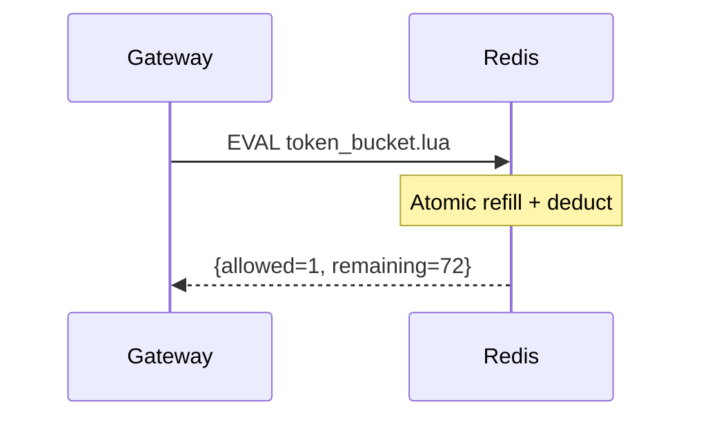
```mermaid
sequenceDiagram
    participant GW as Gateway
    participant Redis as Redis

    GW->>Redis: EVAL token_bucket.lua
    Note over Redis: Atomic refill + deduct
    Redis-->>GW: {allowed=1, remaining=72}
```

### Token Bucket Pros & Cons

| Pros | Cons |
|------|------|
| Allows controlled bursts | Harder to reason about "requests per minute" |
| Smooth traffic shaping | Distributed state requires atomic Lua |
| Industry standard (Stripe, AWS) | Memory per key (hash vs simple counter) |

**Best for:** APIs needing burst tolerance (upload spikes, search bursts).

---

## 8. Deep Dive: Sliding Window Log & Counter

### Fixed Window Problem

```
Limit: 100 req/min
Window: 12:00:00 - 12:00:59 → 100 requests at 12:00:59
Window: 12:01:00 - 12:01:59 → 100 requests at 12:01:00
→ 200 requests in 2 seconds (2× burst at boundary)
```

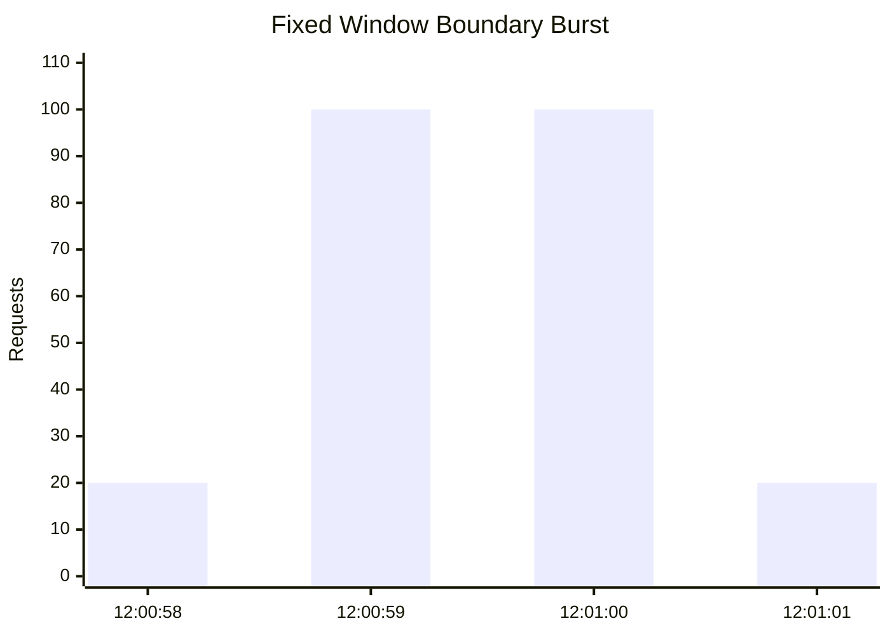
```mermaid
xychart-beta
    title "Fixed Window Boundary Burst"
    x-axis ["12:00:58", "12:00:59", "12:01:00", "12:01:01"]
    y-axis "Requests" 0 --> 110
    bar [20, 100, 100, 20]
```

### Sliding Window Log

Store timestamp of each request in sorted set. Count entries within window.

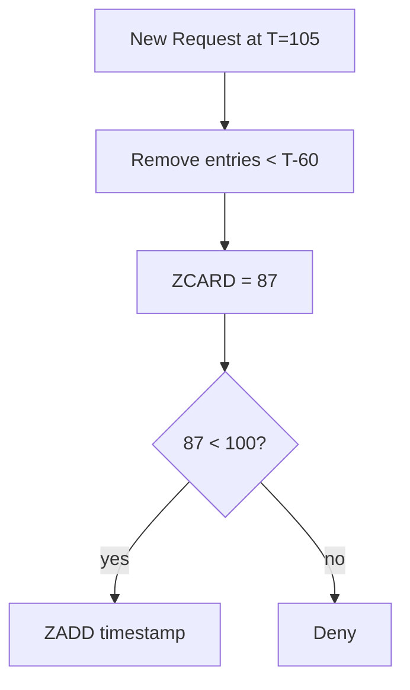
```mermaid
flowchart TD
    Req[New Request at T=105] --> Clean[Remove entries < T-60]
    Clean --> Count[ZCARD = 87]
    Count --> Check{87 < 100?}
    Check -->|yes| Add[ZADD timestamp]
    Check -->|no| Deny[Deny]
```

```lua
-- Sliding window log
redis.call('ZREMRANGEBYSCORE', KEYS[1], 0, ARGV[1] - ARGV[2])
local count = redis.call('ZCARD', KEYS[1])
if count < tonumber(ARGV[3]) then
  redis.call('ZADD', KEYS[1], ARGV[1], ARGV[1] .. '-' .. ARGV[4])
  redis.call('EXPIRE', KEYS[1], ARGV[2])
  return {1, ARGV[3] - count - 1}
end
return {0, 0}
```

**Pros:** Exact accuracy  
**Cons:** O(n) memory per key (store every request timestamp) — expensive at high RPS

### Sliding Window Counter (Recommended Hybrid)

Weighted combination of previous and current fixed windows:

```
previous_window_count = count in window [T-120, T-60)
current_window_count  = count in window [T-60, T]
weighted_count = previous × (1 - elapsed/window) + current

Allow if weighted_count < limit
```


```mermaid
gantt
    title Sliding Window Counter
    dateFormat X
    axisFormat %S

    section Previous Window
    Count 40 reqs     :0, 60

    section Current Window
    Count 30 reqs so far :60, 105
    Overlap weight at T=105 :milestone, 105, 0
```

**At T=105 (45 sec into current window):**

```
weighted = 40 × (1 - 45/60) + 30 = 40 × 0.25 + 30 = 40
limit = 100 → ALLOW (remaining: 60)
```

**Memory:** 2 counters per key — O(1)  
**Accuracy:** ~0.003% error (Stripe blog) — excellent trade-off

### Algorithm Comparison

| Algorithm | Burst Handling | Memory | Accuracy | Complexity |
|-----------|-----------------|--------|----------|------------|
| Fixed window | Poor (boundary) | O(1) | Low | Simple |
| Sliding window log | Perfect | O(n) | Exact | Medium |
| Sliding window counter | Good | O(1) | ~99.99% | Medium ★ |
| Token bucket | Configurable burst | O(1) | Good | Medium |

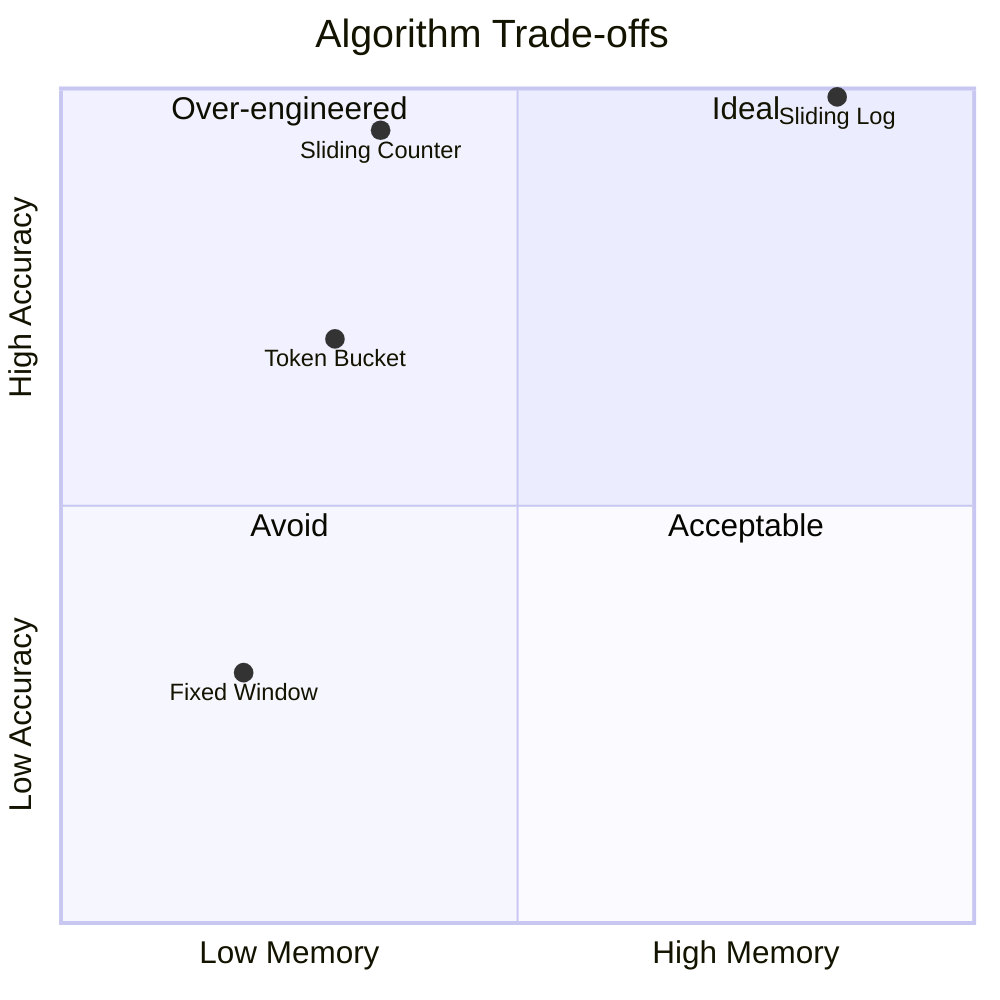
```mermaid
quadrantChart
    title Algorithm Trade-offs
    x-axis Low Memory --> High Memory
    y-axis Low Accuracy --> High Accuracy
    quadrant-1 Ideal
    quadrant-2 Over-engineered
    quadrant-3 Avoid
    quadrant-4 Acceptable
    Fixed Window: [0.2, 0.3]
    Token Bucket: [0.3, 0.7]
    Sliding Counter: [0.35, 0.95]
    Sliding Log: [0.85, 0.99]
```

---

## 9. Deep Dive: Redis vs Local Rate Limiting

### Local (In-Process) Limiter

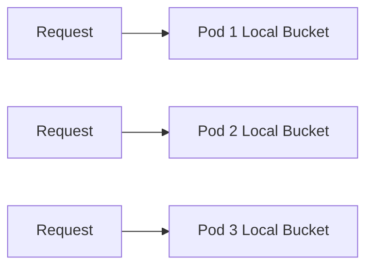
```mermaid
flowchart LR
    Req1[Request] --> Pod1[Pod 1 Local Bucket]
    Req2[Request] --> Pod2[Pod 2 Local Bucket]
    Req3[Request] --> Pod3[Pod 3 Local Bucket]
```

**Problem:** 3 pods × 100 req/min limit = **300 req/min actual** (3× over limit)

**Fix:** Divide limit by pod count → each pod gets `limit/N` (imprecise with dynamic scaling)

### Distributed (Redis) Limiter

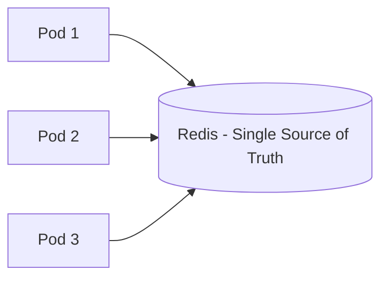
```mermaid
flowchart LR
    Pod1[Pod 1] --> Redis[(Redis - Single Source of Truth)]
    Pod2[Pod 2] --> Redis
    Pod3[Pod 3] --> Redis
```

**Pros:** Accurate global count  
**Cons:** Network hop on every request (~1-3 ms); Redis SPOF

### Hybrid: Local + Global (Production Pattern)

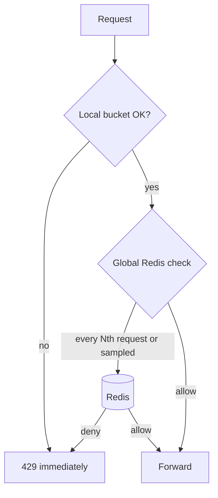
```mermaid
flowchart TD
    Request --> Local{Local bucket OK?}
    Local -->|no| Reject[429 immediately]
    Local -->|yes| Global{Global Redis check}
    Global -->|every Nth request or sampled| Redis[(Redis)]
    Global -->|allow| Forward[Forward]
    Redis -->|deny| Reject
    Redis -->|allow| Forward
```

**Strategy:**

```
Tier 1: Local token bucket at 110% of fair share → catch obvious abuse, 0 latency
Tier 2: Redis check on every request for strict limits
Tier 3: Async reconciliation for analytics
```

### Comparison Table

| Aspect | Local | Redis | Hybrid |
|--------|-------|-------|--------|
| Accuracy | Poor (N× pods) | Exact | Near-exact |
| Latency | < 0.1 ms | 1-3 ms | 0.1 ms amortized |
| Redis load | None | 1 op/request | 0.1-0.3 ops/request |
| Failover | Always works | Depends on policy | Local fallback |

### Fail-Open vs Fail-Closed

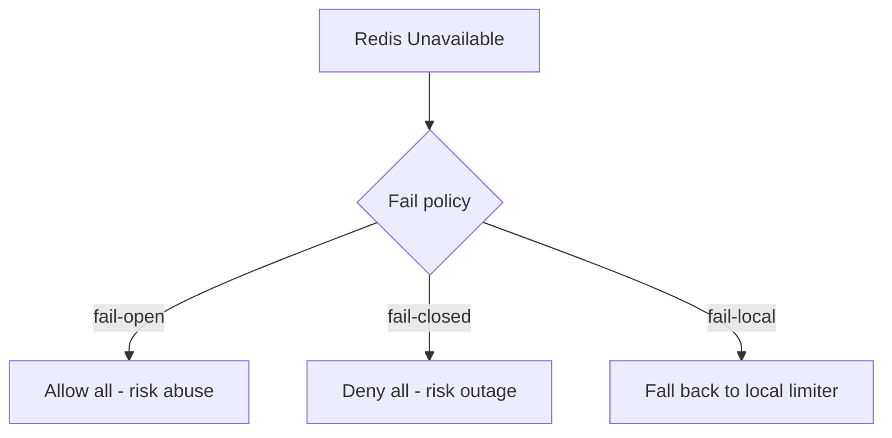
```mermaid
flowchart TD
    RedisDown[Redis Unavailable] --> Policy{Fail policy}
    Policy -->|fail-open| Allow[Allow all - risk abuse]
    Policy -->|fail-closed| Deny[Deny all - risk outage]
    Policy -->|fail-local| Local[Fall back to local limiter]
```

| Policy | When to Use |
|--------|-------------|
| **Fail-open** | Internal services; availability > abuse protection |
| **Fail-closed** | Payment APIs; abuse > availability |
| **Fail-local** | Best compromise for public APIs ★ |

---

## 10. Deep Dive: Per-User vs Global Limits

### Two-Tier Hierarchy

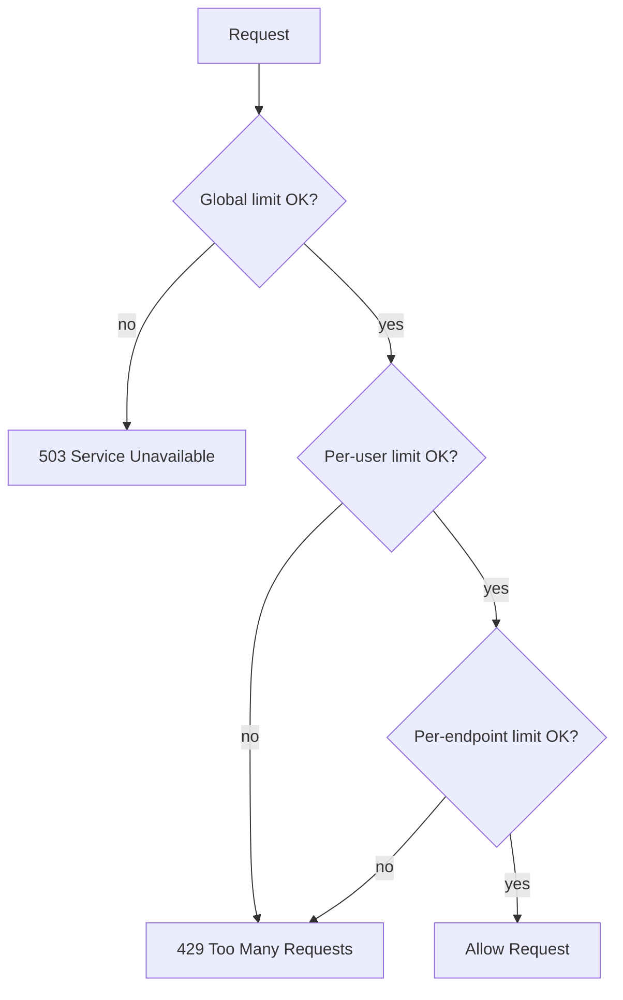
```mermaid
flowchart TD
    Request --> GlobalCheck{Global limit OK?}
    GlobalCheck -->|no| Reject503[503 Service Unavailable]
    GlobalCheck -->|yes| UserCheck{Per-user limit OK?}
    UserCheck -->|no| Reject429[429 Too Many Requests]
    UserCheck -->|yes| EndpointCheck{Per-endpoint limit OK?}
    EndpointCheck -->|no| Reject429
    EndpointCheck -->|yes| Allow[Allow Request]
```

### Limit Types

| Scope | Key | Example Limit | Purpose |
|-------|-----|---------------|---------|
| **Global** | `rl:global:system` | 500K RPS | Protect infrastructure |
| **Per-tenant** | `rl:tenant:acme` | 10K RPS | Fair multi-tenancy |
| **Per-user** | `rl:user:abc123` | 100 req/min | Abuse prevention |
| **Per-IP** | `rl:ip:203.0.113.5` | 60 req/min | Unauthenticated endpoints |
| **Per-endpoint** | `rl:user:abc:/upload` | 10 req/min | Expensive operations |
| **Per-API-key tier** | `rl:key:sk_free` | 1000 req/day | Monetization |

### Global Limit Implementation

```
Token bucket at gateway edge (single choke point)
OR
Redis INCR with 1-second windows:
  key: rl:global:2026-07-08T12:00:01
  if count > 500000 → reject with 503
```

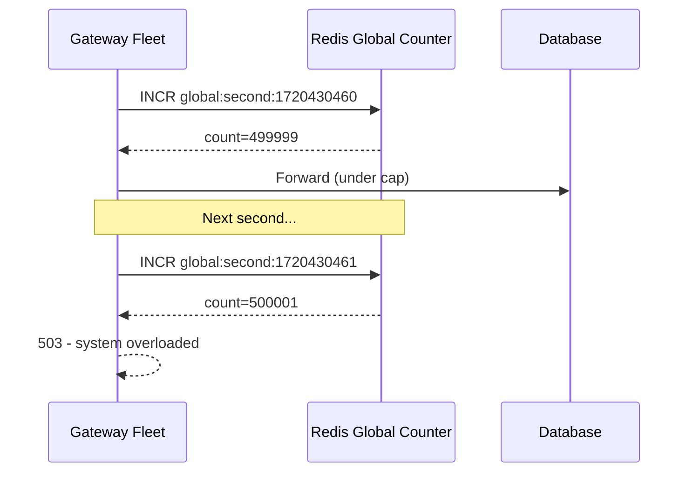
```mermaid
sequenceDiagram
    participant GW as Gateway Fleet
    participant Redis as Redis Global Counter
    participant DB as Database

    GW->>Redis: INCR global:second:1720430460
    Redis-->>GW: count=499999
    GW->>DB: Forward (under cap)
    
    Note over GW,Redis: Next second...
    GW->>Redis: INCR global:second:1720430461
    Redis-->>GW: count=500001
    GW-->>GW: 503 - system overloaded
```

### Hierarchical Token Allocation

```
Global pool: 500K tokens/sec
├── Tenant A (40% SLA): 200K tokens/sec allocated
├── Tenant B (30% SLA): 150K tokens/sec
└── Best-effort pool: 150K tokens/sec shared
```

**Weighted fair queuing** at gateway — enterprise tenants get guaranteed minimum bandwidth.

### Cost-Based Rate Limiting

Not all requests cost equally:

```
GET /profile     → cost 1
POST /search     → cost 5  (expensive backend)
POST /upload     → cost 20 (storage + processing)
POST /ml/infer   → cost 100

Deduct `cost` tokens instead of 1 per request
```

---

## 11. Scaling & Reliability

### Redis Cluster for Rate Limiting

```
Hash tag for co-location: rl:{user:abc123}:global, rl:{user:abc123}:search
→ same slot, single round-trip with Lua pipeline
16384 slots, 6 nodes → 250K ops/sec per node
```

### Reducing Redis Load

| Technique | Reduction |
|-----------|-----------|
| Local pre-filter | 50-80% fewer Redis calls |
| Batch checks (every 10 requests) | 90% fewer calls (less accurate) |
| Probabilistic counting (Count-Min Sketch) | Approximate, very low memory |
| Edge rate limiting (Cloudflare) | Offload IP-based limits |

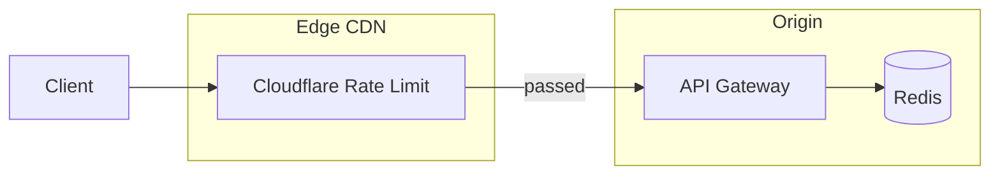
```mermaid
flowchart LR
    subgraph Edge CDN
        CF[Cloudflare Rate Limit]
    end
    subgraph Origin
        GW[API Gateway]
        Redis[(Redis)]
    end
    Client --> CF
    CF -->|passed| GW --> Redis
```

### Multi-Region

```
Problem: Redis is regional; global limit needs cross-region coordination
Solutions:
  1. Regional limits (500K/regional) — simpler
  2. CRDT counters (Riak, custom) — complex
  3. Central global coordinator in primary region — latency
Recommendation: Regional limits + global cap at CDN edge
```

### Configuration Hot Reload

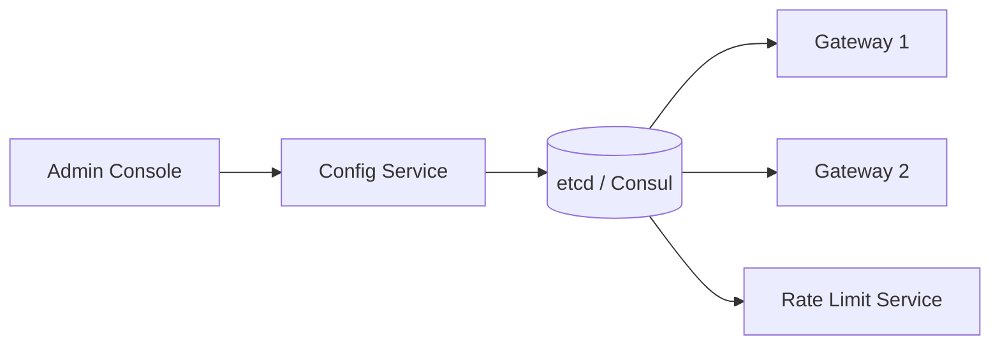
```mermaid
flowchart LR
    Admin[Admin Console] --> ConfigSvc[Config Service]
    ConfigSvc --> Etcd[(etcd / Consul)]
    Etcd --> GW1[Gateway 1]
    Etcd --> GW2[Gateway 2]
    Etcd --> RL[Rate Limit Service]
```

Rules propagate in < 5 seconds via watch mechanism.

---

## 12. Failure Modes & Edge Cases

| Failure | Impact | Mitigation |
|---------|--------|------------|
| Redis latency spike | Slow API responses | Local fallback; circuit breaker |
| Redis down | No distributed limits | Fail-local with conservative limits |
| Clock skew | Window boundary errors | Use Redis TIME; monotonic clocks |
| Hot key (single user spam) | Single Redis shard overload | Local reject first; key sharding |
| Limit config bug (limit=0) | All requests blocked | Config validation; canary rollout |
| DDoS bypassing user limits | Global cap hit | CDN + IP blocklist |

### Race Conditions

```
Two pods check simultaneously, both see count=99, both allow → count=101
Fix: Redis Lua script (atomic read-modify-write)
NEVER: GET count → if ok → INCR (non-atomic)
```

### Stale Local Cache

```
Pod cached "100 remaining" but Redis says 0
Mitigation: Short local TTL (100ms); sync every N requests
```

---

## 13. Trade-offs Summary

| Decision | Option A | Option B | Recommendation |
|----------|----------|----------|----------------|
| Algorithm | Token bucket | Sliding window counter | **SWC** for RPM limits; **TB** for burst |
| Storage | Redis | Local only | **Hybrid** |
| Fail policy | Fail-open | Fail-local | **Fail-local** for public APIs |
| Scope | Per-user only | Global + per-user | **Both tiers** |
| Placement | App middleware | API gateway | **Gateway** (central enforcement) |

---

## 14. Interview Walkthrough Script

### Minutes 0–5: Requirements

> "Distributed rate limiter for a public API: 500K RPS, per-API-key limits with burst, global system cap, sub-5ms decision latency, 429 with Retry-After."

### Minutes 5–10: Estimation

> "1.5M checks/sec with 3 limit types. Redis sliding window counter: 300 MB for 3M keys. Redis Cluster with 6 nodes handles 1.5M ops/sec."

### Minutes 10–20: Architecture

Draw gateway → local bucket → Redis Lua script → allow/deny. Explain standard X-RateLimit headers.

### Minutes 20–35: Deep Dives

- Fixed window boundary problem → sliding window counter math
- Token bucket for burst with Lua script
- Redis vs local hybrid with fail-local policy
- Per-user + global two-tier hierarchy

### Minutes 35–45: Wrap-Up

> "Atomic Lua scripts prevent race conditions. Monitor Redis p99 and 429 rate. CDN handles IP-level DDoS; Redis handles authenticated user limits."

---

## 15. Follow-Up Questions

1. **Rate limit WebSocket connections?** — Connection count limit per IP; message rate limit per connection.
2. **Design rate limiter without Redis.** — Gossip protocol (Envoy global rate limit); CRDT counters.
3. **How does Stripe implement rate limiting?** — Sliding window counter blog post; leaky bucket variant.
4. **Rate limit across microservices for one user action?** — Shared cost budget key; central quota service.
5. **Adaptive rate limiting?** — Reduce limits when downstream error rate > 5% (backpressure).

---

## 16. Real-World References

| System | Approach |
|--------|----------|
| **Stripe** | Sliding window counter (Redis) |
| **AWS API Gateway** | Token bucket per stage/key |
| **Envoy** | Global rate limit service (gRPC) |
| **Cloudflare** | Edge rate limiting (IP-based) |
| **GitHub API** | Fixed window with X-RateLimit headers |
| **NGINX** | leaky bucket (ngx_http_limit_req_module) |

**Key resources:**

- Stripe: "Rate limiting with sliding window" engineering blog
- Google SRE: Load shedding and graceful degradation
- RFC 6585: HTTP 429 Too Many Requests

---

> **Interview Tip:** Always draw the **fixed window boundary burst** problem first — it motivates sliding window and shows algorithm depth. Then recommend sliding window counter as the production sweet spot.
