# Design a Distributed Lock Service

> **Hello Interview Framework** — A Big Tech–level system design guide for building a production distributed locking service using Redis, ZooKeeper, or etcd — the coordination primitive behind inventory systems, job schedulers, and leader election.

---

## Table of Contents

1. [Problem Statement](#1-problem-statement)
2. [Requirements Clarification](#2-requirements-clarification)
3. [Capacity Estimation](#3-capacity-estimation)
4. [API Design](#4-api-design)
5. [Data Model](#5-data-model)
6. [High-Level Architecture](#6-high-level-architecture)
7. [Deep Dive: Redis-Based Locks](#7-deep-dive-redis-based-locks)
8. [Deep Dive: ZooKeeper & etcd Locks](#8-deep-dive-zookeeper--etcd-locks)
9. [Deep Dive: Fencing Tokens](#9-deep-dive-fencing-tokens)
10. [Deep Dive: Lease Expiration & Safety](#10-deep-dive-lease-expiration--safety)
11. [Scaling & Reliability](#11-scaling--reliability)
12. [Failure Modes & Edge Cases](#12-failure-modes--edge-cases)
13. [Trade-offs Summary](#13-trade-offs-summary)
14. [Interview Walkthrough Script](#14-interview-walkthrough-script)
15. [Follow-Up Questions](#15-follow-up-questions)
16. [Real-World References](#16-real-world-references)

---

## 1. Problem Statement

Design a distributed lock service that allows multiple processes across different machines to coordinate exclusive access to a shared resource. The lock must be mutually exclusive (only one holder at a time), fault-tolerant (survive process crashes via lease expiration), and safe (prevent split-brain and stale lock holders from corrupting data).

**What the interviewer is really testing:**

- Lock acquisition and release semantics
- Lease-based expiration vs indefinite locks
- Fencing tokens to prevent stale writes
- Comparison of Redis vs ZooKeeper vs etcd
- CAP trade-offs in coordination services

---

## 2. Requirements Clarification

### Clarifying Questions to Ask

| Question | Why It Matters |
|----------|----------------|
| Reentrant locks needed? | Same process re-acquires |
| Read vs write locks? | Shared/exclusive modes |
| Max lock hold duration? | Lease TTL design |
| Fair ordering (FIFO)? | Queue vs try-lock |
| Throughput vs strong consistency? | Redis vs ZooKeeper |
| What resource is protected? | Determines fencing need |

### Functional Requirements

**Must Have (P0):**

- `acquire(lock_name)` → token or failure
- `release(lock_name, token)` → only holder can release
- Automatic expiration if holder crashes (lease TTL)
- Mutual exclusion: at most one holder per lock name

**Should Have (P1):**

- Blocking acquire with timeout
- Lock renewal (extend lease while alive)
- Fencing token monotonically increasing per lock
- Try-lock (non-blocking acquire)

**Nice to Have (P2):**

- Read/write lock modes
- Lock queue with FIFO fairness
- Watch/notify when lock becomes available
- Multi-region lock coordination

### Non-Functional Requirements

| Dimension | Target | Rationale |
|-----------|--------|-----------|
| **Acquire latency (p99)** | < 10 ms | Not on every request — batch jobs OK |
| **Availability** | 99.9% | Lock failure blocks critical operations |
| **Safety** | No split-brain writes | Data corruption prevention |
| **Scale** | 10K lock ops/sec | Scheduler + inventory scale |
| **Lease granularity** | 10–60 sec TTL | Balance crash detection vs renewal overhead |

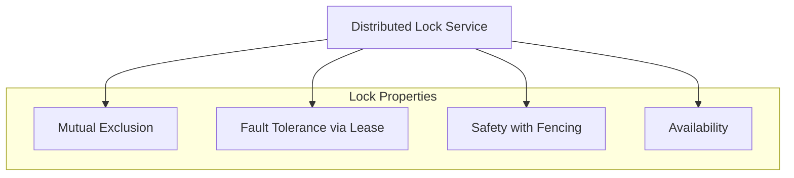
```mermaid
graph TB
    subgraph Lock Properties
        ME[Mutual Exclusion]
        FE[Fault Tolerance via Lease]
        SF[Safety with Fencing]
        AV[Availability]
    end
    LockService[Distributed Lock Service] --> ME
    LockService --> FE
    LockService --> SF
    LockService --> AV
```

---

## 3. Capacity Estimation

Assume **job scheduler** with 500 microservices, 50K concurrent jobs, 10K lock operations/sec peak.

### Lock Operations

```
Acquire + release per job: 2 ops
Job churn: 5K jobs/sec starting/stopping
Lock ops/sec: 5K × 2 = 10K/sec peak
Renewal (every 10s, 50K held locks): 50K/10 = 5K/sec
Total: ~15K ops/sec
```

### Storage

```
Active locks: 50K concurrent
Lock metadata: ~200 bytes (name, token, owner, expiry)
Memory: 50K × 200 B = 10 MB (trivial for Redis/ZK)
Lock wait queue (ZK ephemeral sequential): ~100 bytes × waiters
```

### ZooKeeper Specifics

```
ZNodes: 50K locks + 50K ephemeral children = 100K znodes
ZK comfortable up to ~1M znodes per ensemble
Watch count: 1 watch per waiting client → 10K watches typical
```

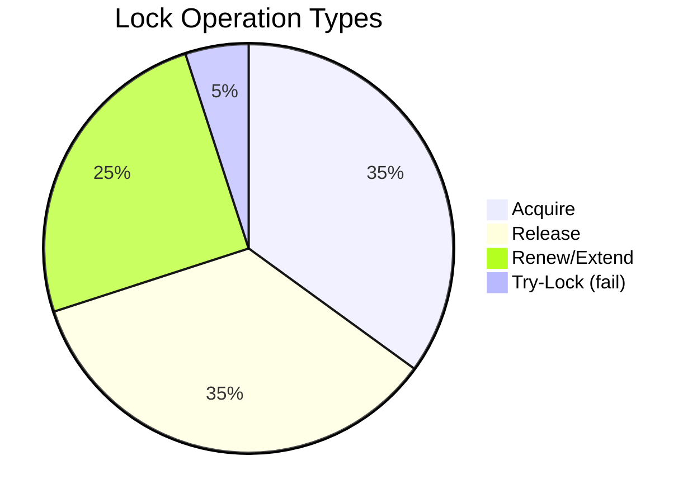
```mermaid
pie title Lock Operation Types
    "Acquire" : 35
    "Release" : 35
    "Renew/Extend" : 25
    "Try-Lock (fail)" : 5
```

---

## 4. API Design

### Acquire Lock

```http
POST /v1/locks/{lock_name}/acquire
Content-Type: application/json

{
  "ttl_seconds": 30,
  "wait_timeout_seconds": 10,
  "owner_id": "worker-pod-abc-123"
}

Response 200:
{
  "acquired": true,
  "token": "fenc_42_a8f3c2",
  "fencing_token": 42,
  "expires_at": "2026-07-08T12:00:30Z",
  "lock_name": "inventory:sku-98765"
}

Response 408 (timeout):
{
  "acquired": false,
  "reason": "wait_timeout_exceeded"
}
```

### Release Lock

```http
DELETE /v1/locks/{lock_name}
Content-Type: application/json

{
  "token": "fenc_42_a8f3c2"
}

Response 200: { "released": true }
Response 403: { "released": false, "reason": "not_lock_holder" }
```

### Renew Lease

```http
POST /v1/locks/{lock_name}/renew
{
  "token": "fenc_42_a8f3c2",
  "extend_seconds": 30
}

Response 200:
{
  "expires_at": "2026-07-08T12:01:00Z",
  "fencing_token": 42
}
```

### Client Library Interface

```python
with lock_service.acquire("inventory:sku-98765", ttl=30) as lock:
    # fencing_token available as lock.fencing_token
    storage.write(key, value, min_fencing_token=lock.fencing_token)
# auto-release on context exit
```

---

## 5. Data Model

### Lock Record

```json
{
  "lock_name": "inventory:sku-98765",
  "token": "fenc_42_a8f3c2",
  "fencing_token": 42,
  "owner_id": "worker-pod-abc-123",
  "acquired_at": "2026-07-08T12:00:00Z",
  "expires_at": "2026-07-08T12:00:30Z",
  "renewal_count": 3
}
```

### Redis Key Schema

```
lock:{name}           → token value (String)
lock:{name}:fencing   → monotonic counter (String/INCR)
lock:{name}:meta      → Hash {owner, acquired_at}
```

### ZooKeeper ZNode Layout

```
/locks/
  inventory-sku-98765/
    lock-0000000001  (ephemeral sequential)
    lock-0000000002  (ephemeral sequential)
```

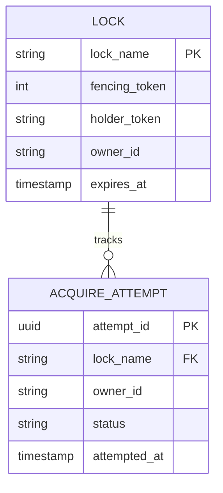
```mermaid
erDiagram
    LOCK ||--o{ ACQUIRE_ATTEMPT : tracks
    LOCK {
        string lock_name PK
        int fencing_token
        string holder_token
        string owner_id
        timestamp expires_at
    }
    ACQUIRE_ATTEMPT {
        uuid attempt_id PK
        string lock_name FK
        string owner_id
        string status
        timestamp attempted_at
    }
```

---

## 6. High-Level Architecture

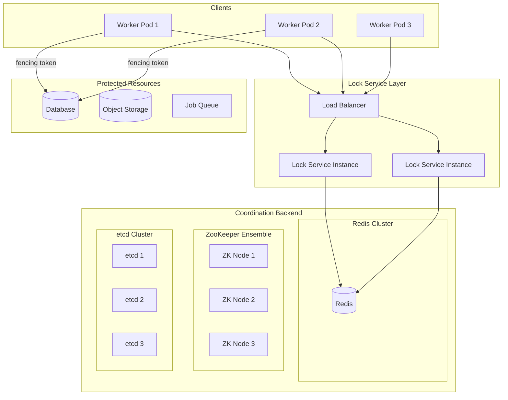
```mermaid
flowchart TB
    subgraph Clients
        W1[Worker Pod 1]
        W2[Worker Pod 2]
        W3[Worker Pod 3]
    end

    subgraph Lock Service Layer
        LB[Load Balancer]
        LS1[Lock Service Instance]
        LS2[Lock Service Instance]
    end

    subgraph Coordination Backend
        subgraph Option_A [Redis Cluster]
            Redis[(Redis)]
        end
        subgraph Option_B [ZooKeeper Ensemble]
            ZK1[ZK Node 1]
            ZK2[ZK Node 2]
            ZK3[ZK Node 3]
        end
        subgraph Option_C [etcd Cluster]
            ETCD1[etcd 1]
            ETCD2[etcd 2]
            ETCD3[etcd 3]
        end
    end

    subgraph Protected Resources
        DB[(Database)]
        S3[(Object Storage)]
        Queue[Job Queue]
    end

    W1 --> LB
    W2 --> LB
    W3 --> LB
    LB --> LS1
    LB --> LS2
    LS1 --> Redis
    LS2 --> Redis
    W1 -->|fencing token| DB
    W2 -->|fencing token| DB
```

### Lock Lifecycle

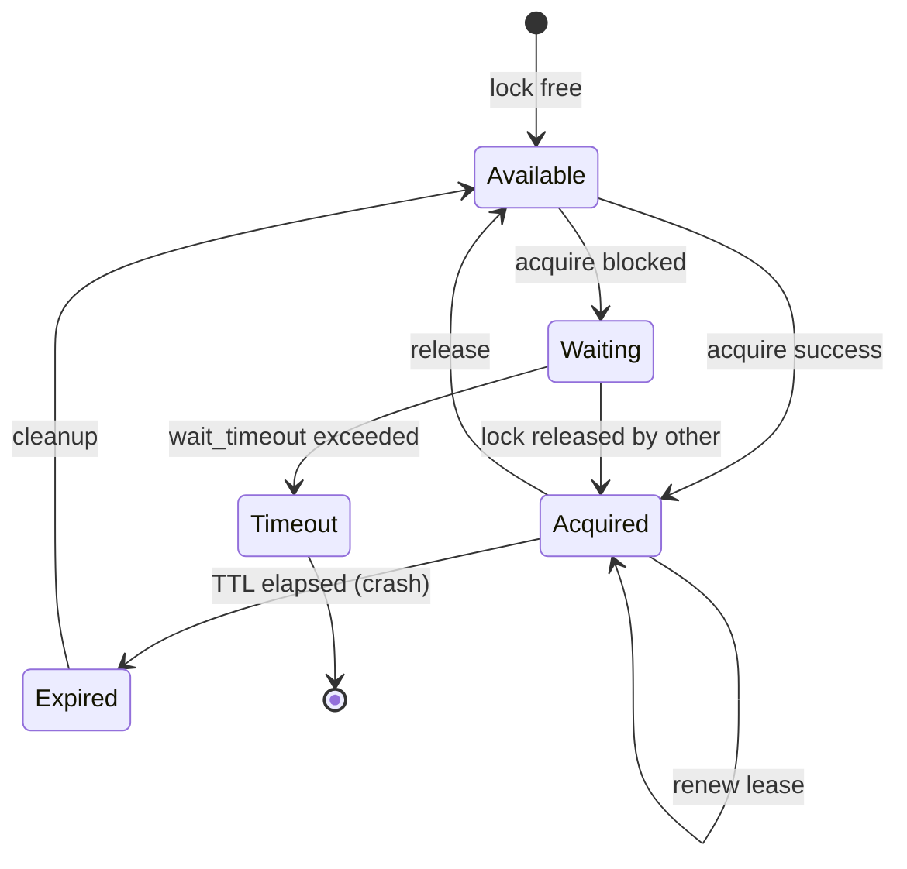
```mermaid
stateDiagram-v2
    [*] --> Available: lock free
    Available --> Acquired: acquire success
    Acquired --> Acquired: renew lease
    Acquired --> Available: release
    Acquired --> Expired: TTL elapsed (crash)
    Expired --> Available: cleanup
    Available --> Waiting: acquire blocked
    Waiting --> Acquired: lock released by other
    Waiting --> Timeout: wait_timeout exceeded
    Timeout --> [*]
```

---

## 7. Deep Dive: Redis-Based Locks

### Naive Approach (WRONG)

```python
# DANGEROUS — do not use in production
redis.set("lock:resource", "1")
# ... do work ...
redis.delete("lock:resource")
```

**Problems:**

1. No ownership — any client can delete the lock
2. No TTL — crash leaves lock forever
3. SET + DELETE not atomic with work

### Correct: SET NX EX (Basic Safe Lock)

```lua
-- Acquire
SET lock:resource unique_token NX EX 30

-- Release (must verify ownership)
if redis.call("GET", KEYS[1]) == ARGV[1] then
  return redis.call("DEL", KEYS[1])
else
  return 0
end
```

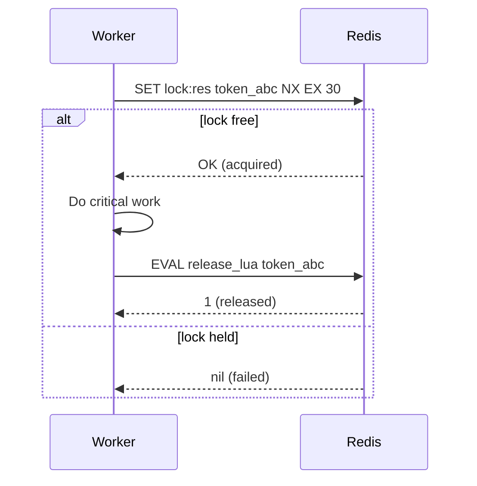
```mermaid
sequenceDiagram
    participant W as Worker
    participant Redis as Redis

    W->>Redis: SET lock:res token_abc NX EX 30
    alt lock free
        Redis-->>W: OK (acquired)
        W->>W: Do critical work
        W->>Redis: EVAL release_lua token_abc
        Redis-->>W: 1 (released)
    else lock held
        Redis-->>W: nil (failed)
    end
```

### Redlock Algorithm (Multi-Instance)

For Redis Cluster / multi-master scenarios, Martin Kleppmann's critique applies — but Redlock is still widely discussed in interviews.

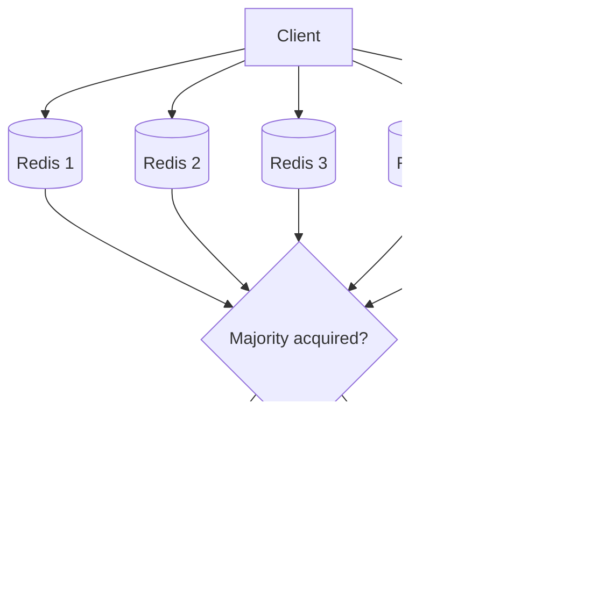
```mermaid
flowchart TD
    Client[Client] --> R1[(Redis 1)]
    Client --> R2[(Redis 2)]
    Client --> R3[(Redis 3)]
    Client --> R4[(Redis 4)]
    Client --> R5[(Redis 5)]
    R1 --> Quorum{Majority acquired?}
    R2 --> Quorum
    R3 --> Quorum
    R4 --> Quorum
    R5 --> Quorum
    Quorum -->|3/5 yes| Acquired[Lock Acquired]
    Quorum -->|no| Failed[Lock Failed]
```

```
Redlock steps:
  1. Get current time T1
  2. Try SET NX EX on N independent Redis instances (sequential or parallel)
  3. Acquired if majority (N/2+1) succeed AND elapsed < TTL
  4. Effective TTL = original TTL - (T2 - T1)
  5. Release on all instances (best effort)
```

**Kleppmann's critique:** Process pause can outlast TTL → two holders. **Fix: fencing tokens** (see Section 9).

### Redis Lock with Renewal (Redisson Pattern)

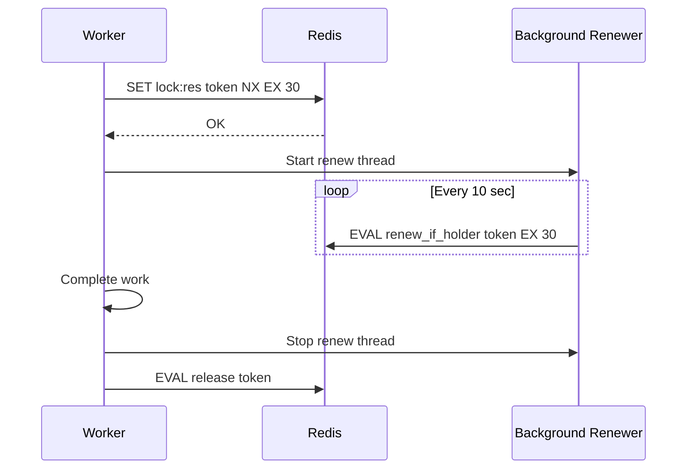
```mermaid
sequenceDiagram
    participant W as Worker
    participant Redis as Redis
    participant BG as Background Renewer

    W->>Redis: SET lock:res token NX EX 30
    Redis-->>W: OK
    W->>BG: Start renew thread
    loop Every 10 sec
        BG->>Redis: EVAL renew_if_holder token EX 30
    end
    W->>W: Complete work
    W->>BG: Stop renew thread
    W->>Redis: EVAL release token
```

**Renewal rule:** Renew at TTL/3 intervals. Stop renewing if work completes or process shuts down.

### Redis vs Redlock Summary

| Aspect | Single Redis SET NX | Redlock (N nodes) |
|--------|---------------------|-------------------|
| Safety | Good with fencing | Debated without fencing |
| Complexity | Low 1/5 | High |
| Latency | ~1 ms | N × 1 ms |
| Failover | Redis Sentinel risk | Quorum mitigates |
| Interview | Recommend SET NX + fencing | Mention Redlock, cite critique |

---

## 8. Deep Dive: ZooKeeper & etcd Locks

### Why Coordination Services Are Safer

ZooKeeper and etcd provide:

- **Sequential ephemeral nodes** — automatic cleanup on session death
- **Strong consistency** (CP in CAP) — linearizable writes
- **Watch mechanism** — efficient waiting (no polling)

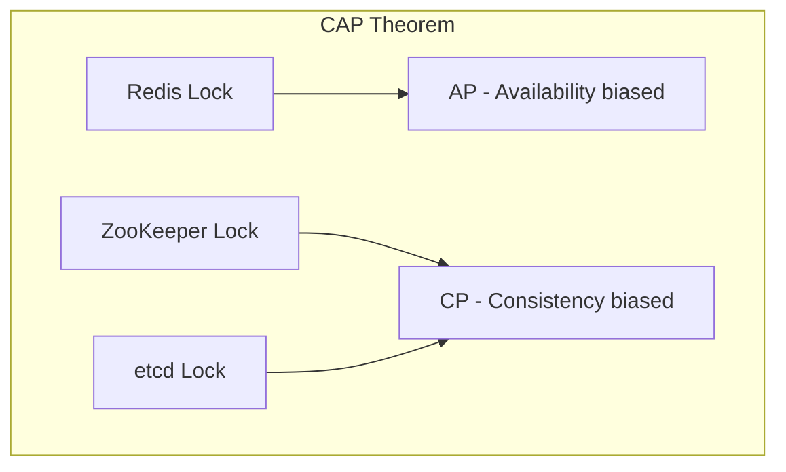
```mermaid
flowchart TB
    subgraph CAP Theorem
        RedisLock[Redis Lock] --> AP[AP - Availability biased]
        ZKLock[ZooKeeper Lock] --> CP[CP - Consistency biased]
        EtcdLock[etcd Lock] --> CP
    end
```

### ZooKeeper Lock Algorithm

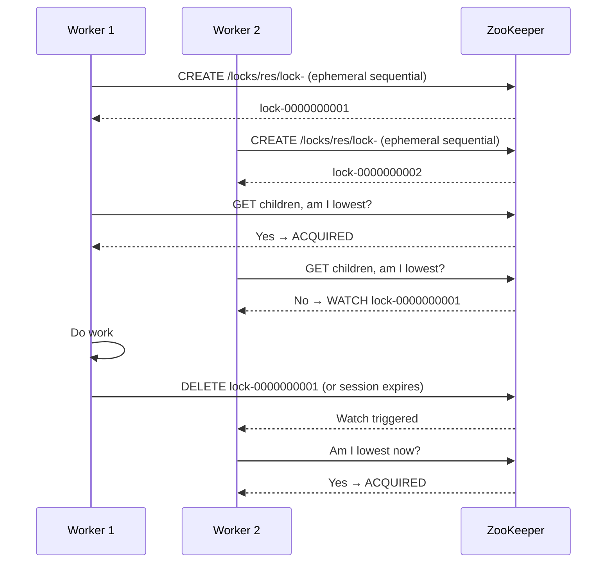
```mermaid
sequenceDiagram
    participant W1 as Worker 1
    participant W2 as Worker 2
    participant ZK as ZooKeeper

    W1->>ZK: CREATE /locks/res/lock- (ephemeral sequential)
    ZK-->>W1: lock-0000000001
    W2->>ZK: CREATE /locks/res/lock- (ephemeral sequential)
    ZK-->>W2: lock-0000000002

    W1->>ZK: GET children, am I lowest?
    ZK-->>W1: Yes → ACQUIRED

    W2->>ZK: GET children, am I lowest?
    ZK-->>W2: No → WATCH lock-0000000001

    W1->>W1: Do work
    W1->>ZK: DELETE lock-0000000001 (or session expires)
    ZK-->>W2: Watch triggered
    W2->>ZK: Am I lowest now?
    ZK-->>W2: Yes → ACQUIRED
```

**Properties:**

- **Fair:** FIFO ordering by sequence number
- **Safe:** Ephemeral node deleted on session death (no TTL clock dependency)
- **Watch-efficient:** Waiters sleep until predecessor releases

### etcd Lock (v3 API)

```
Lease API:
  1. grant(ttl=30) → lease_id
  2. txn: if lock/key version=0 then put(lock/key, owner, lease=lease_id)
  3. keepalive(lease_id) → renew while alive
  4. revoke(lease_id) → release

Concurrency package: clientv3/concurrency.Mutex
```

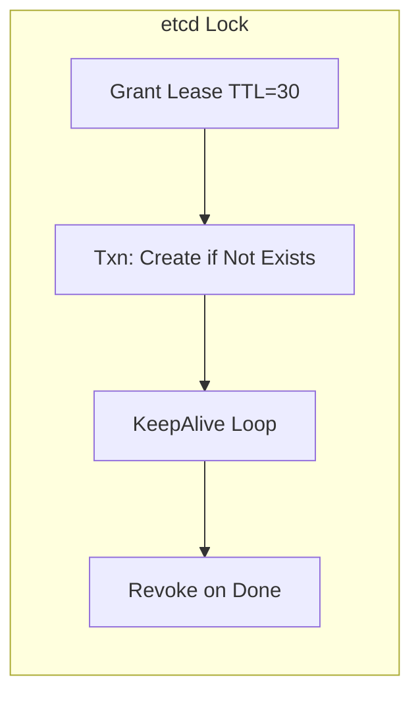
```mermaid
flowchart LR
    subgraph etcd Lock
        Grant[Grant Lease TTL=30]
        Txn[Txn: Create if Not Exists]
        Keep[KeepAlive Loop]
        Revoke[Revoke on Done]
    end
    Grant --> Txn --> Keep --> Revoke
```

### Comparison: Redis vs ZooKeeper vs etcd

| Feature | Redis | ZooKeeper | etcd |
|---------|-------|-----------|------|
| Consistency | Eventual (async repl) | Linearizable | Linearizable (Raft) |
| Lock primitive | SET NX EX | Ephemeral sequential | Lease + txn |
| Fairness | No (retry loop) | Yes (FIFO queue) | Yes (with queue recipe) |
| Session death detection | TTL expiry | Ephemeral znode delete | Lease expiry |
| Latency | ~1 ms | ~5-10 ms | ~5-10 ms |
| Throughput | 100K+ ops/sec | ~10K ops/sec | ~10K ops/sec |
| Complexity | Low | Medium | Medium |
| Best for | High throughput, fencing | Strong ordering, Hadoop | Kubernetes, cloud-native |

**Interview recommendation:**

- **Redis:** High-throughput, short-lived locks with fencing tokens
- **ZooKeeper/etcd:** Strong consistency, fair queuing, leader election

---

## 9. Deep Dive: Fencing Tokens

### The Stale Lock Problem

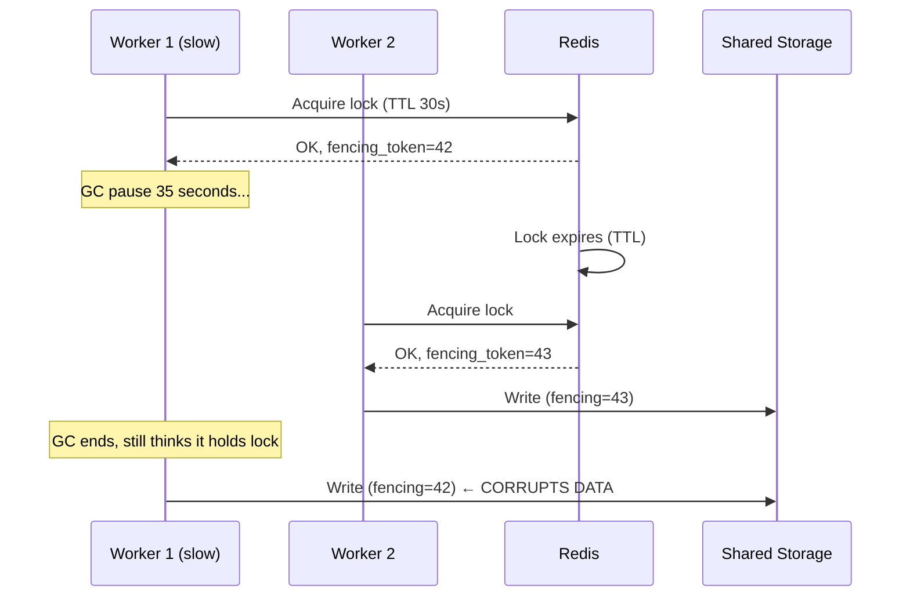
```mermaid
sequenceDiagram
    participant W1 as Worker 1 (slow)
    participant W2 as Worker 2
    participant Redis as Redis
    participant Storage as Shared Storage

    W1->>Redis: Acquire lock (TTL 30s)
    Redis-->>W1: OK, fencing_token=42
    Note over W1: GC pause 35 seconds...
    Redis->>Redis: Lock expires (TTL)
    W2->>Redis: Acquire lock
    Redis-->>W2: OK, fencing_token=43
    W2->>Storage: Write (fencing=43)
    Note over W1: GC ends, still thinks it holds lock
    W1->>Storage: Write (fencing=42) ← CORRUPTS DATA
```

### Fencing Token Solution

Monotonically increasing token issued with each lock acquisition. Storage rejects writes with stale tokens.

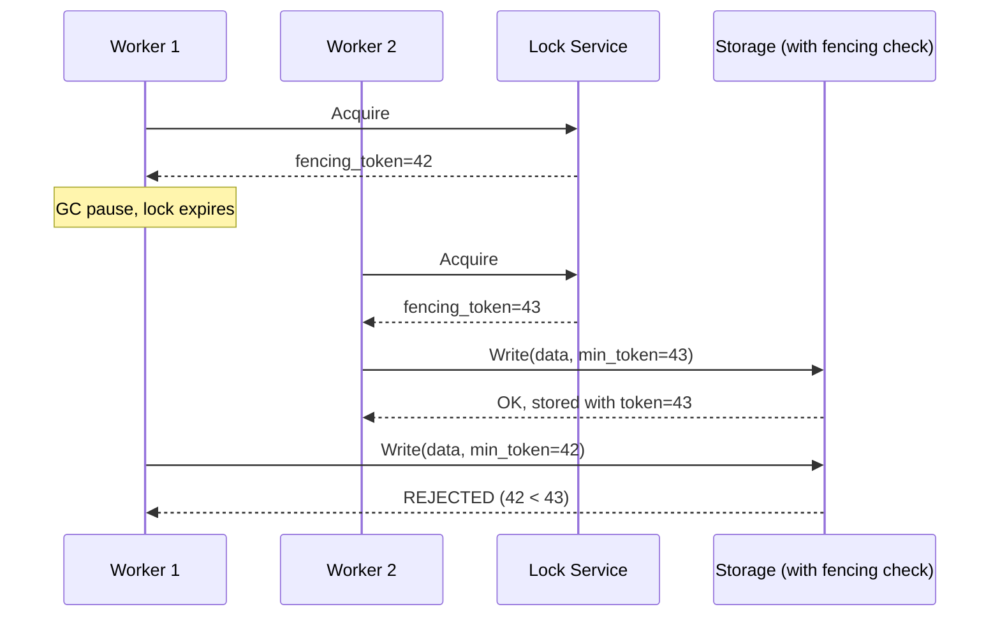
```mermaid
sequenceDiagram
    participant W1 as Worker 1
    participant W2 as Worker 2
    participant Lock as Lock Service
    participant Storage as Storage (with fencing check)

    W1->>Lock: Acquire
    Lock-->>W1: fencing_token=42
    Note over W1: GC pause, lock expires
    W2->>Lock: Acquire
    Lock-->>W2: fencing_token=43
    W2->>Storage: Write(data, min_token=43)
    Storage-->>W2: OK, stored with token=43
    W1->>Storage: Write(data, min_token=42)
    Storage-->>W1: REJECTED (42 < 43)
```

### Implementation

**Lock service:**

```
INCR lock:{name}:fencing  → returns monotonically increasing integer
Return fencing_token with every successful acquire
Token never decreases, even after release
```

**Storage layer:**

```sql
-- Option 1: Column check
UPDATE resources
SET value = $1, fencing_token = $2
WHERE resource_id = $3 AND fencing_token < $2;

-- Option 2: Dedicated fencing store
INSERT INTO writes (resource_id, fencing_token, value)
WHERE fencing_token > (SELECT MAX(fencing_token) FROM writes WHERE resource_id = $1);
```

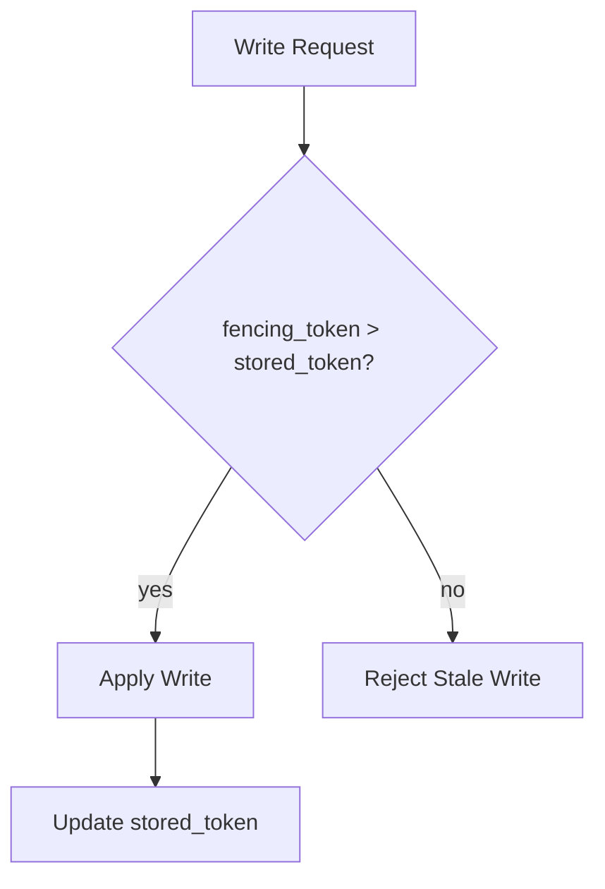
```mermaid
flowchart TD
    Write[Write Request] --> Check{fencing_token > stored_token?}
    Check -->|yes| Accept[Apply Write]
    Check -->|no| Reject[Reject Stale Write]
    Accept --> Update[Update stored_token]
```

### When Fencing Is Required

| Scenario | Fencing Needed? |
|----------|-----------------|
| Inventory decrement | **Yes** — prevent oversell |
| Leader election (one writer) | **Yes** |
| Idempotent job dedup | Maybe |
| Cache rebuild | No — stale write harmless |
| Logging | No |

**Rule:** If stale lock holder can cause **incorrect state**, use fencing tokens.

---

## 10. Deep Dive: Lease Expiration & Safety

### Lease vs Lock

```
Lock: held until explicitly released (dangerous if holder crashes)
Lease: held for TTL, auto-expires (safer default)
Production: all locks are leases with TTL
```

### TTL Selection

```
Too short (5s):  frequent renewal overhead; false expiration under GC pause
Too long (300s): slow crash detection; resource blocked for minutes

Sweet spot: 30s TTL, renew every 10s
GC pause tolerance: TTL > max expected pause + network partition time
```


```mermaid
gantt
    title Lock Lease Timeline
    dateFormat X
    axisFormat %S s

    section Lock
    Acquired           :0, 30
    Renew at 10s       :milestone, 10, 0
    Renew at 20s       :milestone, 20, 0
    Expires if no renew :milestone, 30, 0
```

### Renewal Safety

```lua
-- Renew only if still the holder
if redis.call("GET", KEYS[1]) == ARGV[1] then
  return redis.call("EXPIRE", KEYS[1], ARGV[2])
else
  return 0  -- lost lock, stop working!
end
```

**Critical client behavior:** If renewal fails → **stop all work immediately** — you may have lost the lock.

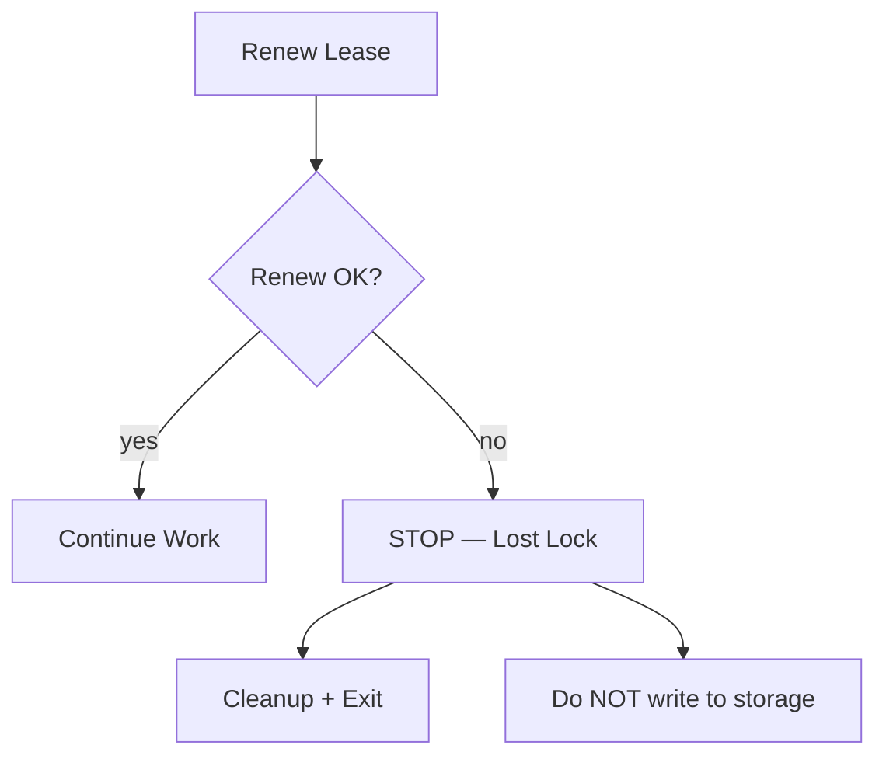
```mermaid
flowchart TD
    Renew[Renew Lease] --> Success{Renew OK?}
    Success -->|yes| Continue[Continue Work]
    Success -->|no| Stop[STOP — Lost Lock]
    Stop --> Cleanup[Cleanup + Exit]
    Stop --> NoWrite[Do NOT write to storage]
```

### Split-Brain Prevention Checklist

| Mechanism | Prevents |
|-----------|----------|
| Lease TTL | Infinite hold after crash |
| Token-verified release | Wrong client releasing |
| Fencing tokens | Stale holder writing |
| Ephemeral ZK nodes | Session-death auto-release |
| Renewal failure detection | Silent lock loss during GC pause |

---

## 11. Scaling & Reliability

### Redis Cluster for Locks

```
Problem: Redlock needs independent nodes; Redis Cluster shards data
Solution: Hash tag {lock}:resource → same slot, single master
Use SET NX EX on single master + fencing (not Redlock) for most cases
```

### ZooKeeper Ensemble Sizing

```
Production: 3 or 5 nodes (odd quorum)
  3 nodes: tolerate 1 failure
  5 nodes: tolerate 2 failures
Do NOT scale ZK horizontally for throughput — scale clients, not servers
```

### Lock Granularity

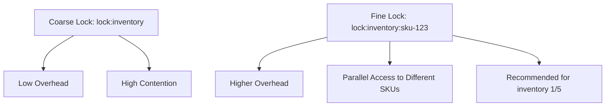
```mermaid
flowchart TD
    Coarse[Coarse Lock: lock:inventory] --> Low[Low Overhead]
    Coarse --> Contention[High Contention]

    Fine[Fine Lock: lock:inventory:sku-123] --> High2[Higher Overhead]
    Fine --> Parallel[Parallel Access to Different SKUs]

    Fine --> Recommend[Recommended for inventory 1/5]
```

**Rule:** Lock at the **smallest scope** that maintains correctness.

### Multi-Region Locks

```
Strongly consistent cross-region locks are expensive (WAN latency)
Patterns:
  1. Single-region lock (most common)
  2. Region-local locks with async reconciliation
  3. Global lock in primary region only (accept cross-region latency)
Avoid: Redlock across regions (clock skew + partition issues)
```

---

## 12. Failure Modes & Edge Cases

| Failure | Impact | Mitigation |
|---------|--------|------------|
| Holder crashes | Lock held until TTL | Lease with 30s TTL |
| GC pause > TTL | Two holders briefly | Fencing tokens |
| Redis master failover | Lock may be lost | Fencing + short TTL; or use ZK |
| Network partition | Split brain | CP system (ZK) or fencing |
| Forgotten release | Resource blocked | Always use TTL leases |
| Clock skew | Premature expiry | ZK session-based (no clock dependency) |
| Thundering herd on release | All waiters acquire at once | ZK fair queue; jittered retry |

### Lock-Free Alternative (When Possible)

```
Before reaching for locks, consider:
  - Optimistic concurrency: CAS with version column
  - CRDTs: merge without coordination
  - Idempotent operations: safe to retry
  - Partition by key: no shared state
```

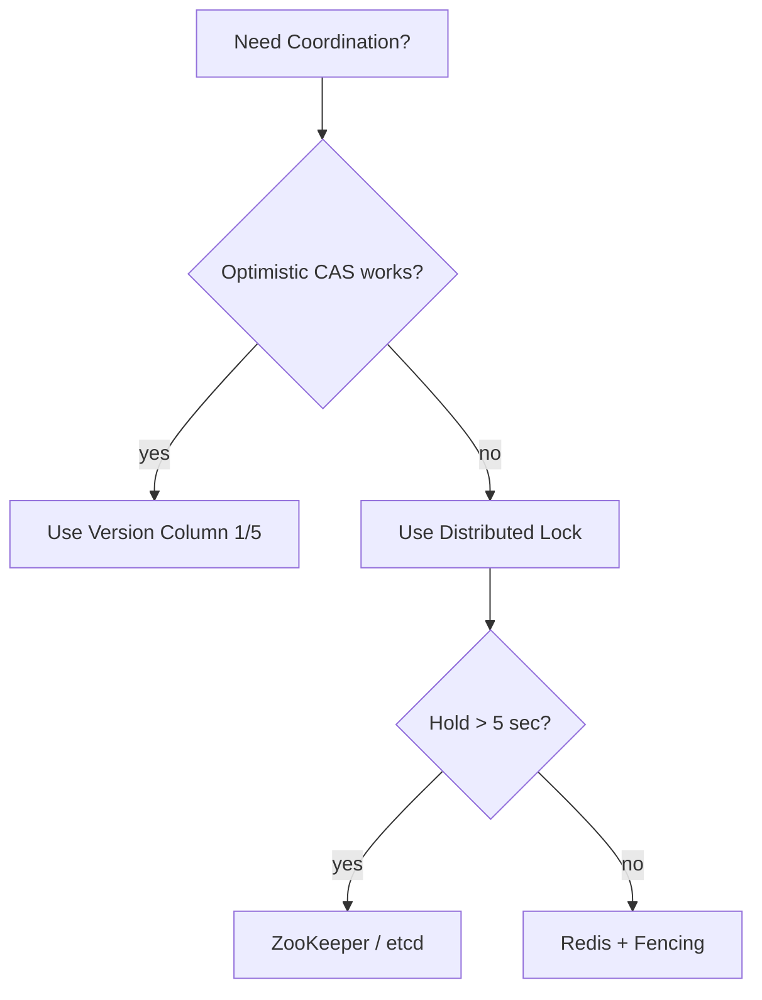
```mermaid
flowchart TD
    Need[Need Coordination?] --> CanCAS{Optimistic CAS works?}
    CanCAS -->|yes| CAS[Use Version Column 1/5]
    CanCAS -->|no| NeedLock[Use Distributed Lock]
    NeedLock --> Duration{Hold > 5 sec?}
    Duration -->|yes| ZK[ZooKeeper / etcd]
    Duration -->|no| Redis[Redis + Fencing]
```

---

## 13. Trade-offs Summary

| Decision | Option A | Option B | Recommendation |
|----------|----------|----------|----------------|
| Backend | Redis | ZooKeeper | **Redis** for speed; **ZK** for fairness/consistency |
| Expiration | TTL lease | Ephemeral session | **Both work**; ZK session is clock-independent |
| Stale write protection | None | Fencing tokens | **Always fence** when protecting state |
| Algorithm | Redlock | SET NX + fencing | **SET NX + fencing** (simpler, safer with fence) |
| Granularity | Coarse | Fine-grained | **Fine-grained** to reduce contention |

---

## 14. Interview Walkthrough Script

### Minutes 0–5: Requirements

> "Distributed lock for inventory updates: mutual exclusion, auto-release on crash via 30s lease, fencing tokens to prevent stale writes, 10K ops/sec."

### Minutes 5–10: Estimation

> "50K concurrent locks, 15K ops/sec including renewals. 10 MB state — coordination service is not storage-bound."

### Minutes 10–20: Architecture

Draw workers → lock service → Redis/ZK. Show acquire/renew/release lifecycle. Mention fencing token passed to storage layer.

### Minutes 20–35: Deep Dives

- Redis SET NX EX + Lua release script
- ZooKeeper ephemeral sequential for fair queuing
- Fencing token stale write problem (GC pause diagram)
- Lease renewal failure → stop work immediately

### Minutes 35–45: Wrap-Up

> "Prefer optimistic CAS when possible. If locks needed, always use leases never indefinite locks. Fencing tokens are non-optional for state mutation. Cite Kleppmann's Redlock critique if Redis comes up."

---

## 15. Follow-Up Questions

1. **Design leader election using the same infrastructure.** — ZK ephemeral sequential; smallest node wins; watch predecessor.
2. **Implement reentrant locks.** — Thread ID in lock value; increment hold count.
3. **Read/write lock.** — ZK: separate lock paths for readers/writers; writers wait for all readers.
4. **Compare to database SELECT FOR UPDATE.** — DB locks simpler but don't work cross-service; poor for microservices.
5. **Design lock service without single point of failure.** — ZK/etcd quorum; Redlock debate; accept CP trade-off.

---

## 16. Real-World References

| System | Lock Mechanism |
|--------|----------------|
| **Redis (Redisson)** | SET NX EX + watchdog renewal |
| **Apache ZooKeeper** | Ephemeral sequential nodes (Curator recipes) |
| **etcd** | Lease + txn (used by Kubernetes) |
| **Google Chubby** | Paxos-based lock service (GFS, Bigtable predecessor) |
| **Amazon DynamoDB** | Conditional writes as lightweight locks |
| **PostgreSQL** | Advisory locks (`pg_advisory_lock`) |

**Key papers:**

- Martin Kleppmann: "How to do distributed locking" (fencing tokens, Redlock critique)
- Leslie Lamport: Paxos (foundation for ZK/etcd)
- Diego Ongaro: Raft (etcd consensus)

---

> **Interview Tip:** When discussing Redis locks, **proactively mention fencing tokens and Kleppmann's critique** — it demonstrates depth beyond tutorial-level SET NX and shows you understand production safety.
