# Design a Metrics & Monitoring System (Datadog)

> **Hello Interview Framework** — A Big Tech–level system design guide for building a production metrics and monitoring platform like Datadog, Prometheus + Grafana, CloudWatch, or SignalFx.

---

## Table of Contents

1. [Problem Statement](#1-problem-statement)
2. [Requirements Clarification](#2-requirements-clarification)
3. [Capacity Estimation](#3-capacity-estimation)
4. [API Design](#4-api-design)
5. [Data Model](#5-data-model)
6. [High-Level Architecture](#6-high-level-architecture)
7. [Deep Dive: Time-Series Database](#7-deep-dive-time-series-database)
8. [Deep Dive: Aggregation Pipeline](#8-deep-dive-aggregation-pipeline)
9. [Deep Dive: Alerting Engine](#9-deep-dive-alerting-engine)
10. [Deep Dive: Cardinality Management](#10-deep-dive-cardinality-management)
11. [Scaling & Reliability](#11-scaling--reliability)
12. [Failure Modes & Edge Cases](#12-failure-modes--edge-cases)
13. [Trade-offs Summary](#13-trade-offs-summary)
14. [Interview Walkthrough Script](#14-interview-walkthrough-script)
15. [Follow-Up Questions](#15-follow-up-questions)
16. [Real-World References](#16-real-world-references)

---

## 1. Problem Statement

Design a metrics and monitoring system that collects time-series data from thousands of services, stores it efficiently, enables querying and dashboard visualization, and triggers alerts when metrics cross thresholds. The system must handle high ingestion throughput, support dimensional tagging, manage cardinality explosion, and provide sub-second query response for operational dashboards.

**What the interviewer is really testing:**

- Time-series database design (compression, retention tiers)
- Metrics ingestion pipeline (push vs pull)
- Aggregation: rollups, downsampling, pre-computation
- Alerting: evaluation frequency, state management, notification routing
- Cardinality: the silent killer of metrics systems

---

## 2. Requirements Clarification

### Clarifying Questions to Ask

| Question | Why It Matters |
|----------|----------------|
| Metrics only or logs/traces too? | Observability pillars scope |
| Push or pull ingestion? | Agent architecture |
| Query latency for dashboards? | Pre-aggregation needs |
| Retention periods? | Storage tier design |
| Alert SLA? | Evaluation engine frequency |
| Multi-tenancy? | Isolation and cardinality per tenant |

### Functional Requirements

**Must Have (P0):**

- Ingest metrics: name, value, timestamp, tags (dimensions)
- Query metrics by time range, aggregation function, tag filters
- Dashboard visualization (time-series graphs)
- Alert rules: threshold, duration, notification channels
- Retention: raw 15 days, aggregated 13 months

**Should Have (P1):**

- Auto-discovery of services and hosts
- Custom metrics from application code (DogStatsD)
- Anomaly detection alerts (baseline deviation)
- Metric metadata and tagging conventions
- RBAC for dashboards and alerts

**Nice to Have (P2):**

- Correlation with logs and traces (APM)
- SLO/SLI tracking with error budgets
- Metric forecasting
- Cost attribution per team/service

### Non-Functional Requirements

| Dimension | Target | Rationale |
|-----------|--------|-----------|
| **Ingest throughput** | 10M data points/sec | Large cloud-native fleet |
| **Query latency (p99)** | < 1 sec dashboard | Ops needs fast incident response |
| **Ingest latency** | < 10 sec visible in UI | Near real-time monitoring |
| **Availability** | 99.9% | Monitoring down during outage is worst-case |
| **Durability** | 99.99% for 15-day raw | Accept minor loss for pure metrics |
| **Cardinality limit** | 10M unique series per tenant | Prevent explosion |

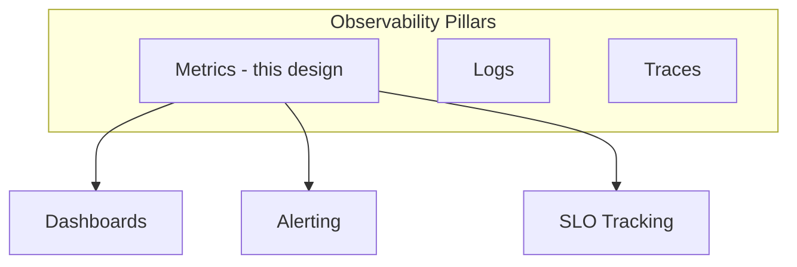

---

## 3. Capacity Estimation

Assume **10,000 hosts**, **500 custom metrics/host**, **15-sec scrape interval**, **10 tag dimensions** average.

### Ingest Volume

```
Data points/sec:
  10,000 hosts × 500 metrics / 15 sec = 333,333/sec per metric type
  With ~200 standard + 500 custom = 700 metrics/host
  10,000 × 700 / 15 ≈ 467,000 points/sec

With tag cardinality (avg 5 unique series per metric):
  467K × 5 ≈ 2.3M data points/sec

Platform scale (Datadog-class): 10M+ points/sec
```

### Storage

```
Per data point: ~16 bytes compressed (Gorilla/Delta encoding)
Daily raw storage: 2.3M × 86400 × 16 B ≈ 3.2 TB/day
15-day raw retention: ~48 TB
Downsampled (1-min avg, 13 months): ~1/15 rate → ~4 TB
Total per tenant at scale: ~50-100 TB
```

### Unique Time Series (Cardinality)

```
10,000 hosts × 700 metrics × 5 tag combos = 35M unique series
Each series index: ~200 bytes metadata
Index memory: 35M × 200 B ≈ 7 GB (manageable with indexing)
Danger: user_id tag → 500M series → system collapse
```

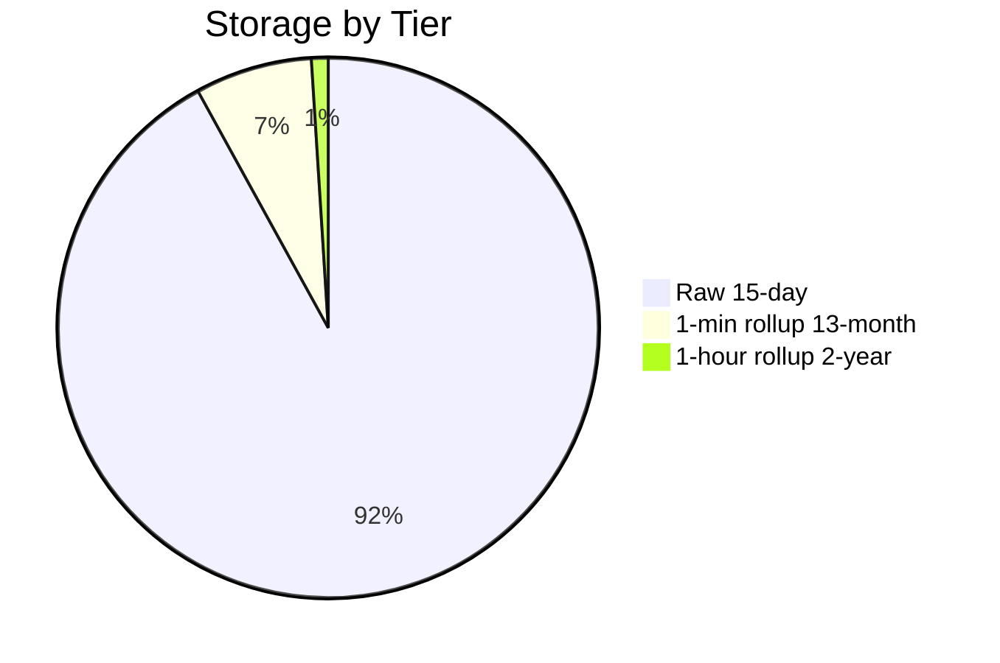

---

## 4. API Design

### Ingest Metrics (Push — DogStatsD / HTTP)

```http
POST /api/v1/series
Content-Type: application/json
DD-API-KEY: {api_key}

{
  "series": [
    {
      "metric": "api.request.duration",
      "points": [[1720430400, 0.045]],
      "type": "gauge",
      "tags": ["env:prod", "service:checkout", "host:web-01"],
      "unit": "second"
    },
    {
      "metric": "api.request.count",
      "points": [[1720430400, 1]],
      "type": "count",
      "tags": ["env:prod", "service:checkout", "status:200"]
    }
  ]
}
```

### Query Metrics

```http
GET /api/v1/query?from=1720426800&to=1720430400&query=avg:api.request.duration{env:prod,service:checkout}

Response:
{
  "series": [
    {
      "metric": "api.request.duration",
      "tags": ["env:prod", "service:checkout"],
      "points": [[1720426800, 0.042], [1720426860, 0.038], ...]
    }
  ]
}
```

### Query Language Examples

```
# Average request duration by service
avg:api.request.duration{env:prod} by {service}

# Error rate percentage
sum:api.request.count{status:5*}.as_rate() /
sum:api.request.count{*}.as_rate() * 100

# p99 latency from histogram
p99:api.request.duration.histogram{service:checkout}

# Alert query
avg(last_5m):avg:system.cpu.user{env:prod} by {host} > 85
```

### Alert Rule API

```http
POST /api/v1/monitor
{
  "name": "High CPU on production hosts",
  "type": "metric alert",
  "query": "avg(last_5m):avg:system.cpu.user{env:prod} by {host} > 85",
  "message": "CPU above 85% on {{host.name}} @slack-oncall",
  "tags": ["team:platform"],
  "options": {
    "thresholds": { "critical": 85, "warning": 75 },
    "notify_no_data": true,
    "no_data_timeframe": 10,
    "evaluation_delay": 60
  }
}
```

---

## 5. Data Model

### Metric Types

| Type | Description | Example | Aggregation |
|------|-------------|---------|-------------|
| **Gauge** | Point-in-time value | CPU %, memory used | avg, min, max, last |
| **Count** | Monotonic counter | requests total | sum, rate |
| **Rate** | Per-second count | requests/sec | avg |
| **Histogram** | Distribution | latency buckets | p50, p95, p99 |
| **Set** | Unique count | unique users | count |

### Time Series Identity

```
Series Key = metric_name + sorted(tags)

Example:
  metric: api.request.duration
  tags: {env: prod, service: checkout, host: web-01}
  → series_id: hash("api.request.duration|env=prod|host=web-01|service=checkout")
```

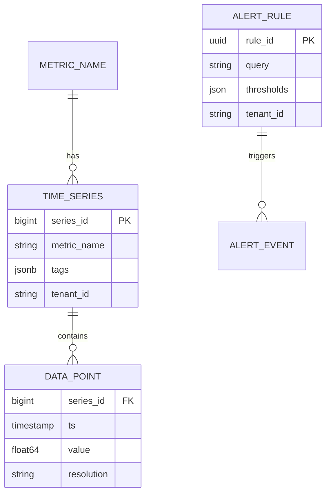

### Tag Model

```
Tags: key:value pairs
  env:prod
  service:checkout
  host:web-01
  region:us-east-1
  version:2.3.1

Indexed: (tenant_id, tag_key, tag_value) → [series_ids]
Enables: fast lookup of all series matching {env:prod, service:checkout}
```

---

## 6. High-Level Architecture

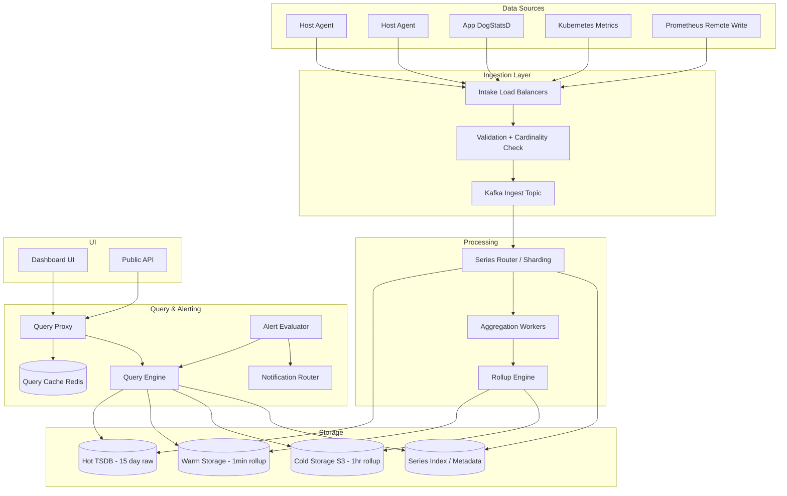

### Data Flow

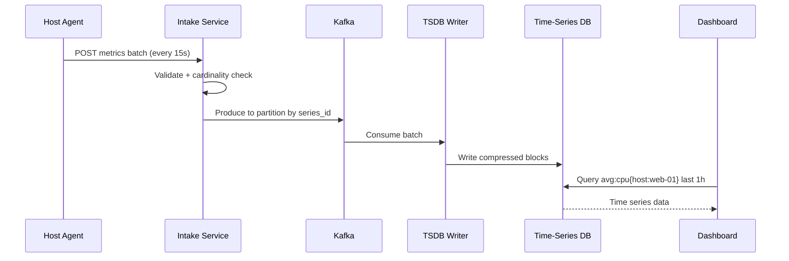

---

## 7. Deep Dive: Time-Series Database

### Why Not PostgreSQL?

```
Relational DB: row-oriented, poor compression, slow range scans
Time-series DB: column-oriented, delta compression, time-range optimized

1 billion data points query (1 hour, 1 metric, 10K hosts):
  PostgreSQL: minutes
  TSDB (VictoriaMetrics/Cortex): milliseconds to seconds
```

### Storage Engine Design

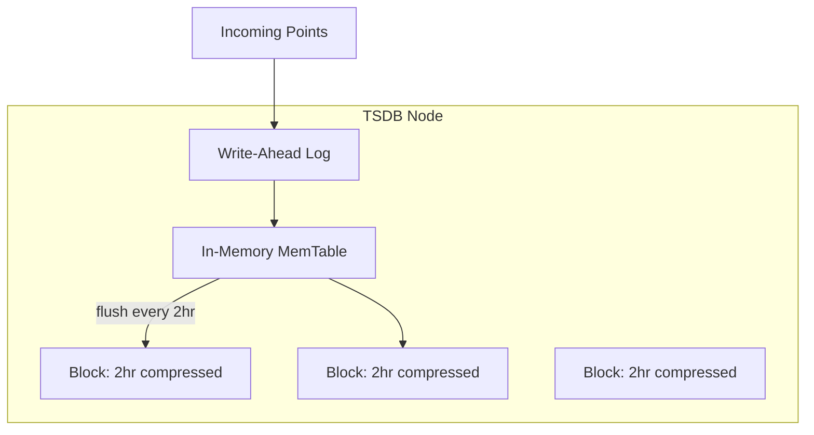

### Compression: Gorilla Algorithm (Facebook)

```
Timestamps: delta-of-delta encoding
  t1=1000, t2=1015, t3=1030
  delta1=15, delta2=15, delta-of-delta=0 → 1 bit

Values: XOR with previous value, leading/trailing zero bits
  v1=0.042, v2=0.043 → XOR ≈ small number → few bits

Result: ~1.3 bytes/point vs 16 bytes raw (12× compression)
```

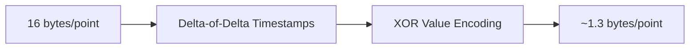

### Retention Tiers

| Tier | Resolution | Retention | Storage | Query Use |
|------|------------|-----------|---------|-------------|
| **Hot (raw)** | 15 sec | 15 days | SSD TSDB | Recent debugging |
| **Warm (rollup)** | 1 min | 13 months | SSD/HDD | Monthly trends |
| **Cold (rollup)** | 1 hour | 2+ years | S3/object | Long-term capacity planning |

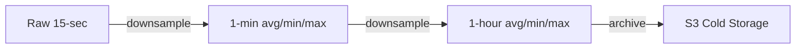

### Sharding Strategy

```
Shard key: hash(series_id) mod N_shards
Each shard: independent TSDB node
Query: scatter to all relevant shards → merge results

Optimization: shard by tenant_id for multi-tenancy isolation
  tenant A → shards 0-99
  tenant B → shards 100-199
```

---

## 8. Deep Dive: Aggregation Pipeline

### Ingest-Time Aggregation (Pre-Computation)

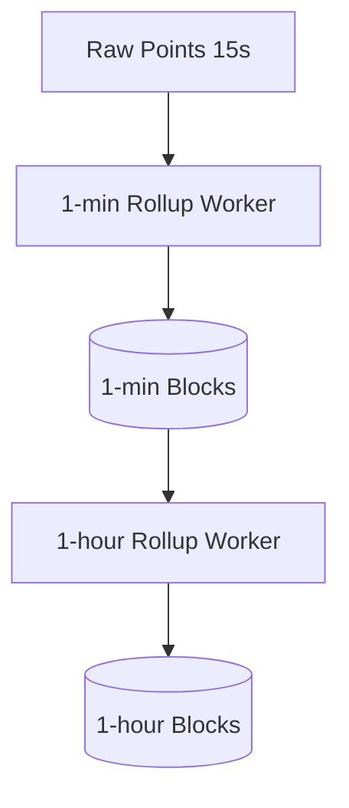

**Rollup functions per metric type:**

```
Gauge:  avg, min, max, sum, count
Counter: sum, rate (derivative)
Histogram: p50, p95, p99 (from buckets)
```

### Query-Time Aggregation

```
Query: avg:api.latency{service:checkout} by {region}

Steps:
  1. Resolve tag filter → matching series IDs (index lookup)
  2. Fetch raw/rollup blocks for time range
  3. Align timestamps to query resolution
  4. Apply aggregation function per group
  5. Return merged series
```

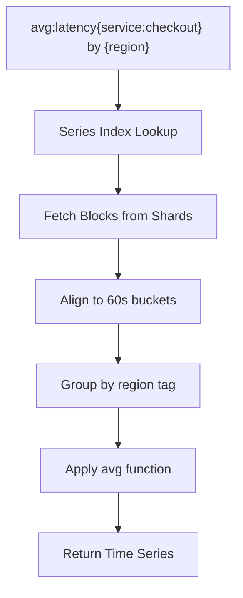

### Downsampling Example

```
Raw (15s intervals):
  t=0:  42ms
  t=15: 38ms
  t=30: 55ms
  t=45: 41ms

1-min rollup stored:
  t=0: avg=44ms, min=38ms, max=55ms, count=4
```

### Streaming Aggregation (Flink)

For real-time dashboards and alerting:

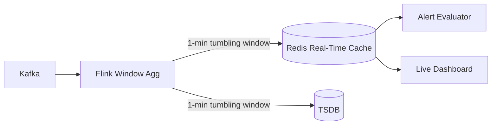

**Tumbling window:** `[12:00:00, 12:01:00)` → single aggregate  
**Sliding window:** `[12:00:00, 12:05:00)` every 1 min → smoother but more compute

### Histogram Aggregation

```
Client sends:
  api.latency.histogram: buckets {le=10: 500, le=50: 800, le=100: 950, le=inf: 1000}

Server merges buckets across hosts:
  sum bucket counts per le value
  compute p99 from merged histogram (not avg of p99s!)
```

**Critical:** Never average percentiles — merge histograms then compute percentile.

---

## 9. Deep Dive: Alerting Engine

### Alert Evaluation Loop

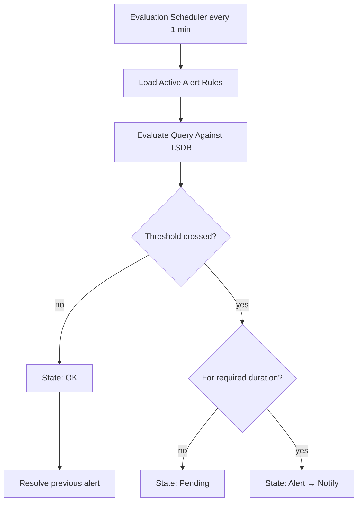

### Alert State Machine

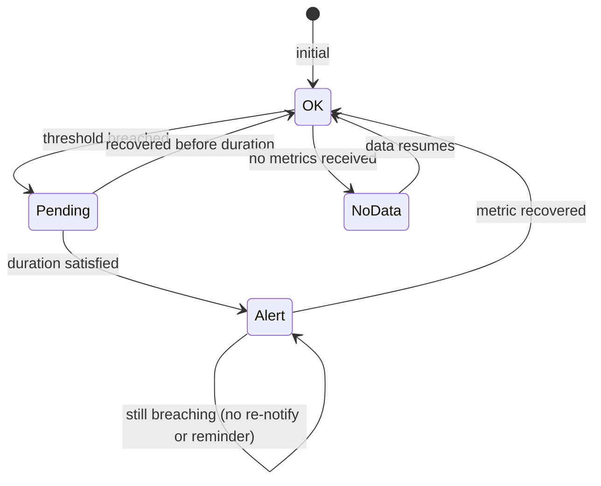

### Alert Rule Components

```
Query:     avg(last_5m):avg:system.cpu.user{env:prod} by {host} > 85
Duration:  5 minutes (must breach for 5 consecutive eval cycles)
Threshold: critical=85, warning=75
No-data:   alert if no metrics for 10 min
Delay:     evaluation_delay=60s (wait for late-arriving data)
Recovery:  notify on recovery (optional)
```

### Notification Routing

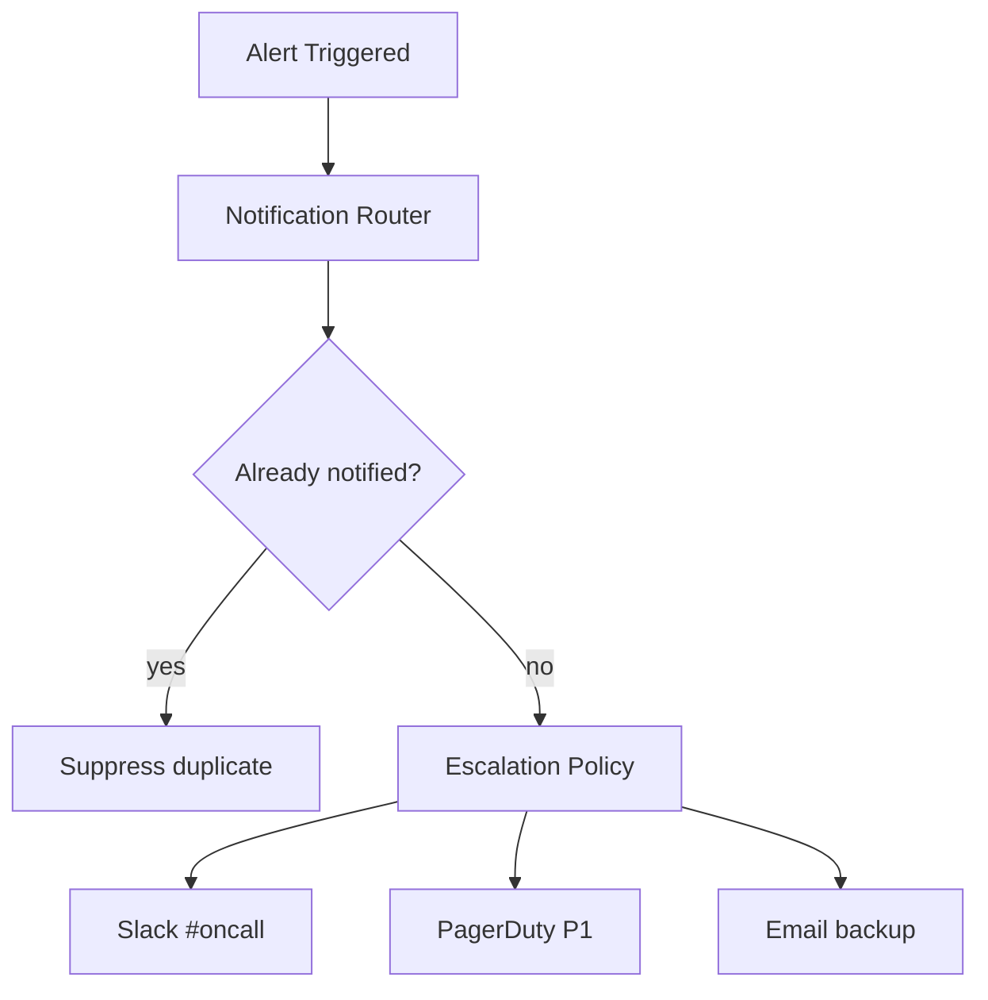

### Deduplication & Grouping

```
Group by: host, service → one alert per group, not per series
  "CPU high on 3 hosts" vs 3 separate alerts

Deduplication window: 4 hours (same alert won't re-notify)
Recovery notification: "CPU back to normal on web-01"
```

### Anomaly Detection Alerts

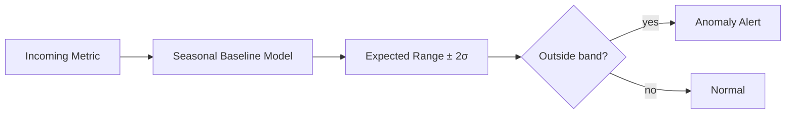

**Techniques:** Seasonal decomposition, Holt-Winters, ML baseline (Datadog Anomaly Detection).

---

## 10. Deep Dive: Cardinality Management

### What Is Cardinality?

```
Cardinality = number of unique time series
  = unique combinations of (metric_name, tag_set)

Example:
  api.requests{host:web-01, status:200}  → series 1
  api.requests{host:web-01, status:500}  → series 2
  api.requests{host:web-02, status:200}  → series 3
  → 3 series for one metric name
```

### Cardinality Explosion

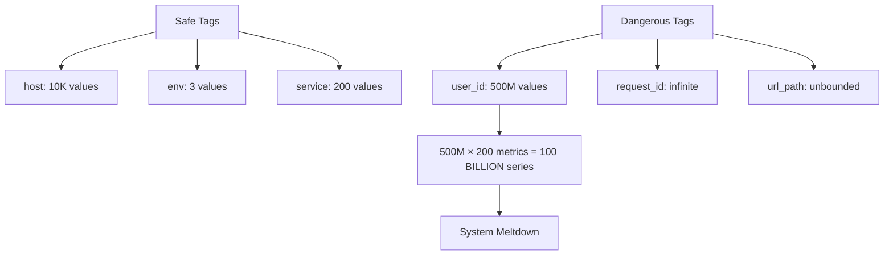

### Impact of High Cardinality

| Component | Impact |
|-----------|--------|
| Series index | Memory explosion |
| Ingest pipeline | Slower routing, more shards |
| Query engine | Slow index scans |
| Storage | More blocks, poor compression |
| Cost | Linear with series count |

### Mitigation Strategies

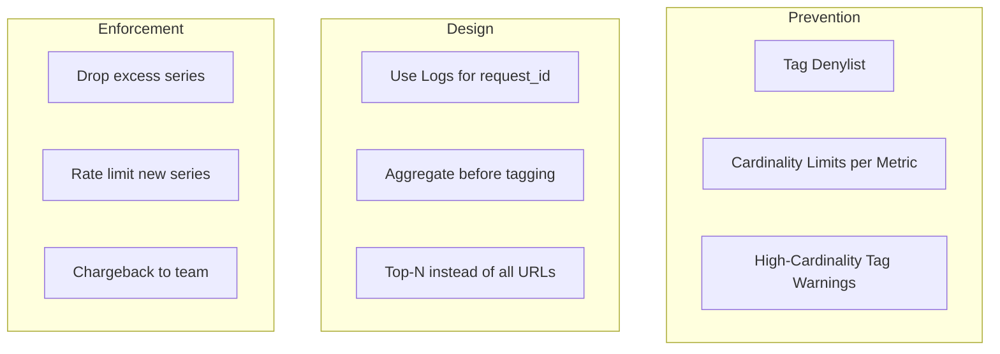

**Rules of thumb:**

| Tag | Safe? | Alternative |
|-----|-------|-------------|
| `host`, `service`, `env` | Yes | — |
| `status_code` | Yes | — |
| `user_id` | No | Sample 1%; use logs |
| `request_id` | No | Traces |
| `url_path` | Warning: | Normalize to route template `/users/:id` |
| `pod_name` | Warning: | Use `deployment` instead |

### Cardinality Limit Enforcement

```
Per metric limit: max 10,000 unique series
On exceed:
  1. Drop new tag combinations (with metric: dropped_series_count)
  2. Alert tenant admin
  3. Dashboard shows "cardinality limit reached"

Per tenant limit: 10M series
Hard stop on ingest for new series
```

### Metrics for Metrics (Meta-Monitoring)

```
datadog.metrics.ingest_rate
datadog.metrics.active_series_count{tenant}
datadog.metrics.dropped_series{reason:cardinality_limit}
datadog.query.latency_p99
datadog.alert.evaluation_lag
```

---

## 11. Scaling & Reliability

### Ingestion Scaling

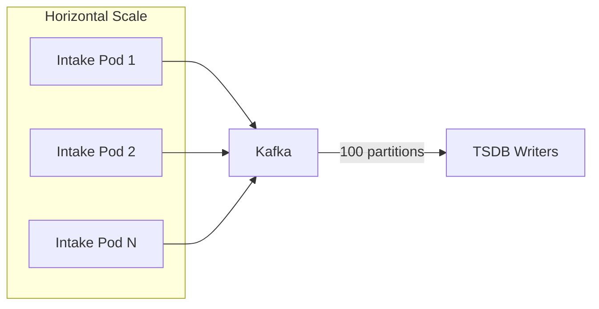

```
Kafka partitions: hash(series_id) → ordered per series
Consumer groups: parallel TSDB writers
Backpressure: Kafka retention absorbs ingest spikes (24h buffer)
```

### Query Scaling

```
Query cache (Redis):
  Key: hash(query + time_range)
  TTL: 60 sec for recent dashboards
  Hit rate target: 80% for dashboard refreshes

Query fan-out limit: max 1000 series per query
Timeout: 30 sec → return partial results
Pre-computed aggregates for popular dashboards
```

### Multi-Tenancy Isolation

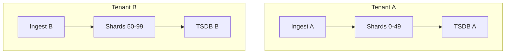

**Noisy neighbor prevention:** Per-tenant ingest rate limits, query concurrency limits.

### High Availability

| Component | Strategy |
|-----------|----------|
| Intake | Multi-AZ load balanced, stateless |
| Kafka | 3+ brokers, replication factor 3 |
| TSDB | Replication factor 2, quorum reads |
| Query engine | Stateless, auto-scaling |
| Alert evaluator | Leader election, checkpoint state |

---

## 12. Failure Modes & Edge Cases

| Failure | Impact | Mitigation |
|---------|--------|------------|
| Cardinality explosion | Cluster OOM | Limits + denylist |
| Ingest flood | Kafka lag | Rate limit per tenant; auto-scale writers |
| TSDB node down | Partial data unavailable | Replication; reroute queries |
| Late-arriving data | Alert flapping | evaluation_delay parameter |
| Query timeout | Empty dashboard | Cache last good result; partial response |
| Clock skew on agents | Misaligned points | Reject points > 5 min in future/past |
| Metric name typo | Broken dashboard | Metric metadata + naming linter |

### Data Loss vs Delay Trade-off

```
At-least-once ingest (Kafka): possible duplicate points
  → Dedup by (series_id, timestamp) on write

Acceptable loss: 0.1% of points during AZ failure
  → Replicated Kafka + TSDB RF=2
  → Not financial data — slight loss OK for metrics
```

### Alert Storm Prevention

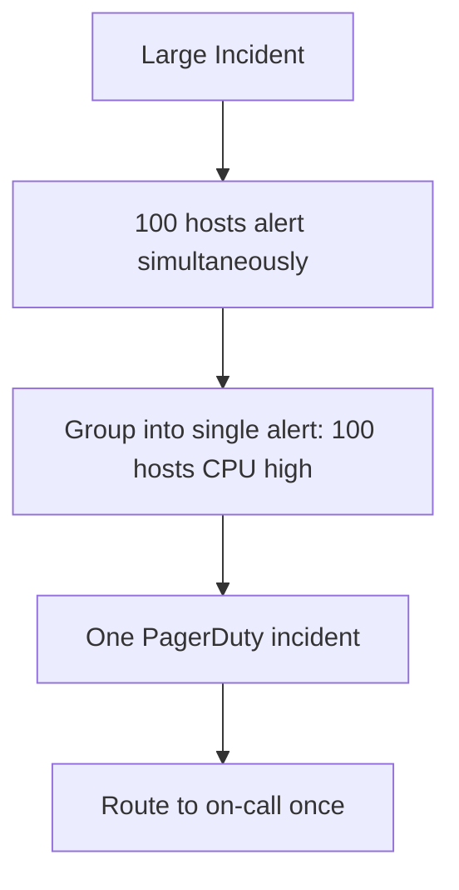

---

## 13. Trade-offs Summary

| Decision | Option A | Option B | Recommendation |
|----------|----------|----------|----------------|
| Ingest | Push (Datadog agent) | Pull (Prometheus scrape) | **Both** — agent for hosts, pull for K8s |
| Storage | Custom TSDB | Prometheus + Cortex | **Custom TSDB** at Datadog scale |
| Retention | Uniform | Tiered (hot/warm/cold) | **Tiered** with rollups |
| Alert eval | Stream (Flink) | Batch (1-min poll) | **Batch** for most; stream for critical SLO |
| Cardinality | Unlimited | Hard limits | **Hard limits** with warnings |
| Query | Always raw | Pre-aggregated rollups | **Rollups** for ranges > 1 day |

---

## 14. Interview Walkthrough Script

### Minutes 0–5: Requirements

> "Metrics platform like Datadog: 10M points/sec ingest, 15-day raw + 13-month rollup retention, sub-second dashboard queries, threshold and anomaly alerts, multi-tenant."

### Minutes 5–10: Estimation

> "10K hosts, 700 metrics each, 15-sec interval → ~2.3M points/sec. Gorilla compression → ~3 TB/day raw. 35M series with safe tags — 7 GB index. user_id tag would kill us."

### Minutes 10–20: Architecture

Draw agents → intake → Kafka → TSDB writers → hot/warm/cold storage. Query engine with cache. Separate alert evaluator.

### Minutes 20–35: Deep Dives

- TSDB: Gorilla compression, block structure, retention tiers
- Aggregation: ingest-time rollups vs query-time; never avg percentiles
- Alerting: state machine, duration, dedup, notification routing
- Cardinality: explosion example, limits, tag design guidelines

### Minutes 35–45: Wrap-Up

> "Cardinality is the #1 production killer — enforce limits from day one. Monitor meta-metrics: active series, ingest lag, query p99. Tiered retention keeps costs manageable."

---

## 15. Follow-Up Questions

1. **Design log aggregation (ELK/Datadog Logs).** — Inverted index vs columnar; different from metrics TSDB.
2. **Design distributed tracing (Jaeger/Tempo).** — Trace ID propagation; span storage; correlation with metrics.
3. **Prometheus vs Datadog architecture.** — Pull vs push; PromQL vs query language; federation vs SaaS multi-tenant.
4. **Design SLO tracking with error budgets.** — SLI metrics + burn rate alerts (Google SRE workbook).
5. **How to handle 1M+ series per query?** — Pre-aggregation, recording rules, query limits, top-K.

---

## 16. Real-World References

| System | Architecture Highlight |
|--------|----------------------|
| **Datadog** | Multi-tenant SaaS, DogStatsD push, proprietary TSDB |
| **Prometheus** | Pull-based, TSDB with 2-hour blocks, PromQL |
| **Cortex / Mimir** | Horizontally scalable Prometheus (microservices TSDB) |
| **VictoriaMetrics** | High-performance TSDB, merge with Prometheus |
| **InfluxDB** | TSM engine, tag-based series, Flux query language |
| **Facebook Gorilla** | Delta compression paper (2015) |
| **Google Monarch** | Planet-scale in-memory TSDB for Google internal |
| **Amazon CloudWatch** | Per-namespace isolation, metric math |

**Key papers:**

- Pelkonen et al.: "Gorilla: A Fast, Scalable, In-Memory Time Series Database" (Facebook, 2015)
- Google SRE Book: Monitoring distributed systems, SLI/SLO/SLA
- Prometheus documentation: Data model and federation

---

> **Interview Tip:** When discussing metrics systems, **bring up cardinality unprompted** — it's the distinguishing senior-level insight that separates a generic "store time-series in a DB" answer from a production-ready Datadog-class design.
