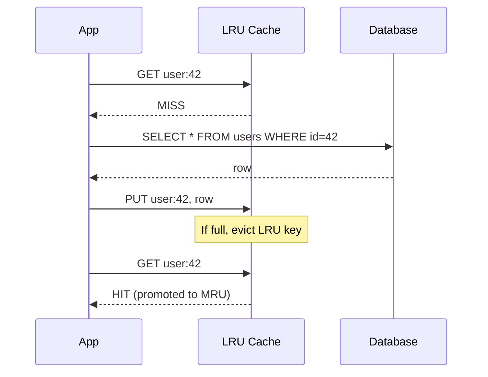
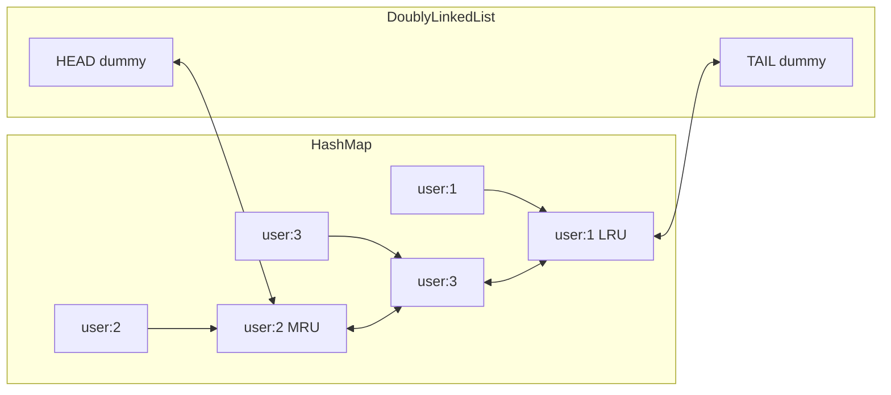
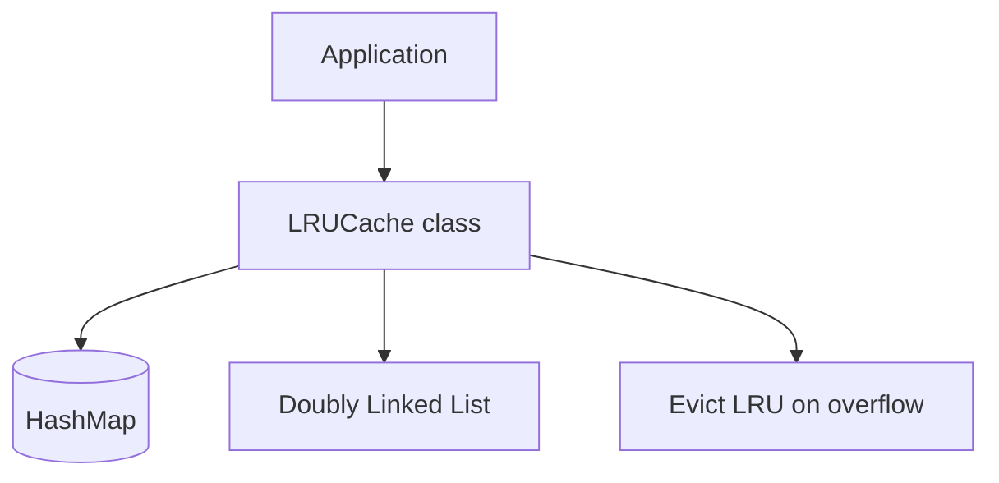
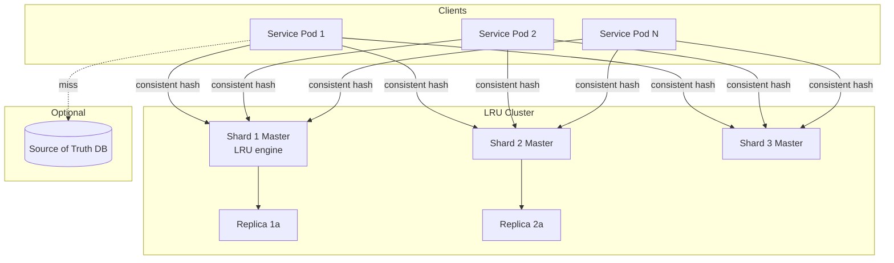
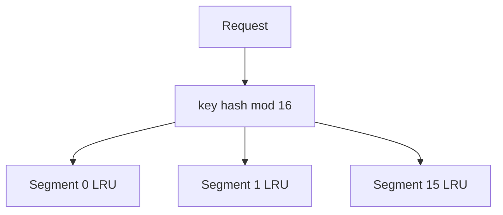
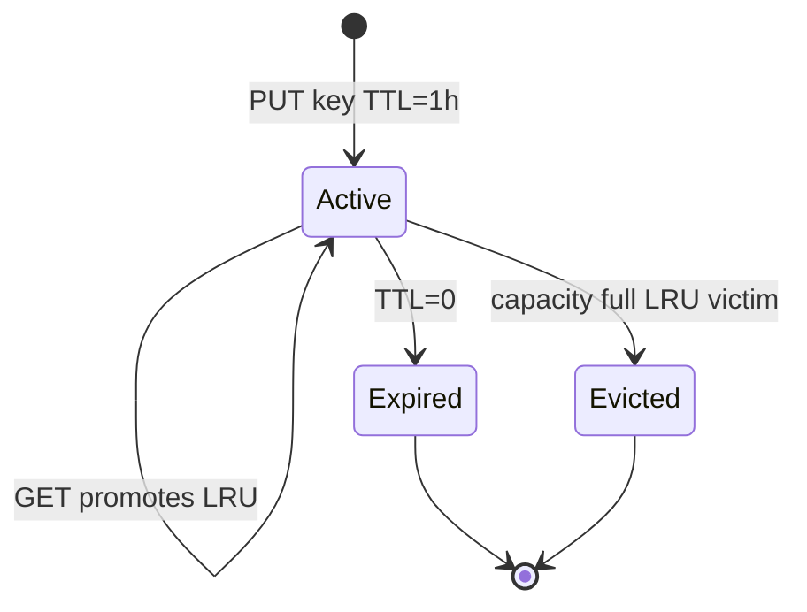
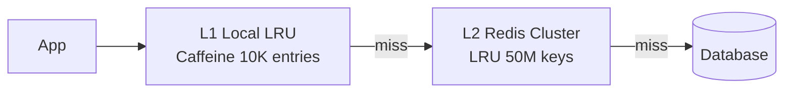

# Design an LRU Cache

> **Hello Interview Framework** — A Big Tech–level guide for the classic **LRU Cache** interview question at two levels: in-memory O(1) data structure design (LeetCode / OOD) and production **distributed LRU cache** service design (Redis, Memcached, application caches).

---

## Table of Contents

1. [Problem Statement](#1-problem-statement)
2. [Requirements Clarification](#2-requirements-clarification)
3. [Capacity Estimation](#3-capacity-estimation)
4. [API Design](#4-api-design)
5. [Data Model & Core Algorithm](#5-data-model--core-algorithm)
6. [High-Level Architecture](#6-high-level-architecture)
7. [Deep Dive: O(1) In-Memory LRU](#7-deep-dive-o1-in-memory-lru)
8. [Deep Dive: Thread Safety & Concurrency](#8-deep-dive-thread-safety--concurrency)
9. [Deep Dive: Distributed LRU Cache](#9-deep-dive-distributed-lru-cache)
10. [Deep Dive: LRU vs Other Eviction Policies](#10-deep-dive-lru-vs-other-eviction-policies)
11. [Deep Dive: Multi-Level Cache (L1 + L2)](#11-deep-dive-multi-level-cache-l1--l2)
12. [Scaling & Reliability](#12-scaling--reliability)
13. [Failure Modes & Edge Cases](#13-failure-modes--edge-cases)
14. [Trade-offs Summary](#14-trade-offs-summary)
15. [Interview Walkthrough Script](#15-interview-walkthrough-script)
16. [Follow-Up Questions](#16-follow-up-questions)
17. [Real-World References](#17-real-world-references)

---

## 1. Problem Statement

Design a cache that stores key-value pairs with a **fixed capacity**. When the cache is full and a new entry is inserted, evict the **Least Recently Used** item. Both `get` and `put` must run in **O(1)** average time.

**Two interview flavors — clarify which one:**

| Flavor | Scope | Bar |
|--------|-------|-----|
| **A. Data structure / OOD** | Single-process in-memory cache | HashMap + doubly linked list; LeetCode 146 |
| **B. System design** | Distributed cache cluster with LRU eviction | Sharding, replication, TTL, hit ratio SLOs |

Most **system design** interviews start at flavor B but expect you to explain flavor A as the per-node engine.

**What the interviewer is really testing:**

- Can you achieve O(1) get/put with correct LRU ordering?
- Do you understand why a doubly linked list + hash map works?
- How LRU behaves under skewed access (hot keys, scans)?
- How to scale LRU across nodes without breaking semantics
- LRU vs LFU vs TTL — when LRU is wrong

---

## 2. Requirements Clarification

### Clarifying Questions to Ask

| Question | Why It Matters |
|----------|----------------|
| In-memory only or distributed? | Single class vs cluster architecture |
| Max capacity — entries or bytes? | Count-based vs memory-weighted LRU |
| TTL on keys in addition to LRU? | volatile-lru vs pure capacity eviction |
| Thread-safe? | Lock striping vs concurrent hash map |
| get() updates recency? | Standard LRU — yes; some variants no |
| Eviction callback needed? | Resource cleanup (file handles, connections) |
| Persistence on eviction? | Cache-aside vs write-through |

### Functional Requirements

**Must Have (P0) — In-Memory LRU:**

- `get(key)` → value or miss; **promote key to most-recently-used**
- `put(key, value)` → insert or update; evict LRU if over capacity
- `O(1)` time for get and put
- Fixed capacity `N`

**Must Have (P0) — Distributed LRU Service:**

- Same GET/PUT semantics cluster-wide
- Horizontal scale across nodes
- Memory limit per node with LRU eviction
- Sub-millisecond p99 GET on cache hit (same DC)

**Should Have (P1):**

- Optional TTL per key (max lifetime regardless of use)
- `delete(key)` explicit removal
- Batch `mget` / `mput`
- Statistics: hit ratio, evictions/sec, size

**Nice to Have (P2):**

- Weighted LRU (evict by byte size, not entry count)
- Near-LRU approximation for speed (Redis-style sampling)
- Pub/sub invalidation from origin DB

### Non-Functional Requirements

| Dimension | In-Memory | Distributed |
|-----------|-----------|-------------|
| **get/put latency** | O(1), nanoseconds | p99 < 1 ms hit |
| **Capacity** | MB–GB per JVM | TB cluster |
| **Throughput** | Millions ops/sec/thread | 1M+ ops/sec cluster |
| **Hit ratio target** | N/A (local) | > 90% for hot set |
| **Consistency** | Strong (single process) | Eventual with DB (cache-aside) |

```mermaid
%%{init: {'theme': 'base', 'themeVariables': {'primaryColor': '#D2691E', 'primaryTextColor': '#ffffff', 'primaryBorderColor': '#5D2E0C', 'secondaryColor': '#D2691E', 'tertiaryColor': '#D2691E', 'lineColor': '#5D2E0C'}}}%%
mindmap
  root((LRU Cache))
    Core DS
      HashMap key to node
      Doubly linked list order
      O(1) get put evict
    Single Node
      Thread safety
      TTL plus LRU
      Byte weighted
    Distributed
      Consistent hashing
      Per shard LRU
      Replication
    Policies
      LRU vs LFU
      Approximate LRU
      ARC adaptive
```

---

## 3. Capacity Estimation

Assume **API response cache** for a social feed service: 50M DAU, 200K QPS read, 80% cacheable.

### Memory Sizing

```
Working set (hot keys):     20% of unique keys accessed per hour
Unique feed keys/hour:      50M users × 5 refreshes = 250M keys
Hot set:                    50M keys
Avg cached response:        4 KB JSON
Memory per node:            50M × 4 KB = 200 GB hot set

With 4 shards:              50 GB per shard + 30% overhead ≈ 65 GB/shard
With 1 replica:             130 GB RAM per shard pair
```

### QPS per Shard

```
Read QPS:                   200K × 80% = 160K cache lookups/sec
Hit ratio target:           92% → 147K hits/sec, 13K misses to DB
4 shards:                   ~40K ops/sec/shard (trivial for Redis)
```

### Eviction Rate

```
If hot set > cache size:
  Steady-state evictions ≈ insert rate for cold keys
  New unique keys/sec:      ~5K (long-tail exploration)
  Evictions/sec:              ~5K at equilibrium (one in, one out)
```

### Summary Table

| Metric | Value |
|--------|-------|
| Cluster memory | ~520 GB (with replication) |
| Aggregate QPS | 160K reads + 20K writes |
| Keys (hot set) | ~50M |
| Target hit ratio | 92% |
| Evictions/sec (steady) | ~5K |

---

## 4. API Design

### 4.1 Core Operations

#### `GET /cache/{key}`

**Response (hit):**
```json
{
  "key": "feed:user:12345",
  "value": { "...": "..." },
  "hit": true,
  "ttl_remaining_sec": 3420
}
```

**Response (miss):** `404 Not Found` or `{ "hit": false }`

Side effect: key moved to **MRU** position (LRU recency update).

#### `PUT /cache/{key}`

**Request:**
```json
{
  "value": { "...": "..." },
  "ttl_sec": 3600
}
```

**Response:**
```json
{
  "key": "feed:user:12345",
  "evicted_key": "feed:user:99999",
  "size": 5000000
}
```

`evicted_key` present when capacity forced eviction.

#### `DELETE /cache/{key}`

Removes key without affecting LRU order of others.

#### `GET /cache/stats`

```json
{
  "size": 4999980,
  "capacity": 5000000,
  "hits": 984729100,
  "misses": 8729100,
  "hit_ratio": 0.991,
  "evictions_total": 12847562,
  "evictions_per_sec": 512
}
```

### 4.2 Sequence: Cache-Aside with LRU



---

## 5. Data Model & Core Algorithm

### 5.1 The Classic Structure

LRU requires **O(1) lookup** and **O(1) reorder on access**. The standard solution:

| Structure | Purpose |
|-----------|---------|
| **HashMap** `key → Node` | O(1) find node by key |
| **Doubly linked list** | O(1) insert/remove/move with prev/next pointers |
| **Dummy head + tail** | Avoid null edge cases |



**Invariant:** List order = recency. **Head side = MRU**, **tail side = LRU** (convention varies — stay consistent in interview).

### 5.2 Operations (Pseudocode)

```
get(key):
  if key not in map: return MISS
  node = map[key]
  move node to MRU end of list
  return node.value

put(key, value):
  if key in map:
    update node.value
    move node to MRU
  else:
    if map.size >= capacity:
      lru_node = tail.prev
      remove lru_node from list and map   // evict
    create new node, add to MRU, map[key] = node
```

All steps touch at most **constant** map entries and list pointers → **O(1)**.

### 5.3 Why Not Single Linked List?

Removing a node from singly linked list requires **O(n)** to find predecessor. Doubly linked list: **O(1)** removal with `node.prev`.

### 5.4 Why Not Array + Timestamps?

Updating timestamp on get is O(1), but finding **minimum timestamp on eviction** is O(n) — fails interview requirement.

---

## 6. High-Level Architecture

### 6.1 Single-Process LRU (OOD Interview)



### 6.2 Distributed LRU Service



Each shard runs an **independent LRU** on its key subset. Global LRU order is **per-shard approximate**, not global — acceptable in production.

---

## 7. Deep Dive: O(1) In-Memory LRU

### 7.1 Java Implementation (Interview-Ready)

```java
import java.util.HashMap;
import java.util.Map;

public class LRUCache {

    private static class Node {
        int key;
        int value;
        Node prev;
        Node next;

        Node(int key, int value) {
            this.key = key;
            this.value = value;
        }
    }

    private final int capacity;
    private final Map<Integer, Node> map = new HashMap<>();
    private final Node head = new Node(0, 0); // dummy MRU side
    private final Node tail = new Node(0, 0); // dummy LRU side

    public LRUCache(int capacity) {
        this.capacity = capacity;
        head.next = tail;
        tail.prev = head;
    }

    public int get(int key) {
        Node node = map.get(key);
        if (node == null) {
            return -1;
        }
        moveToHead(node);
        return node.value;
    }

    public void put(int key, int value) {
        Node node = map.get(key);
        if (node != null) {
            node.value = value;
            moveToHead(node);
            return;
        }
        if (map.size() >= capacity) {
            Node lru = removeTail();
            map.remove(lru.key);
        }
        Node fresh = new Node(key, value);
        map.put(key, fresh);
        addToHead(fresh);
    }

    private void moveToHead(Node node) {
        removeNode(node);
        addToHead(node);
    }

    private void addToHead(Node node) {
        node.prev = head;
        node.next = head.next;
        head.next.prev = node;
        head.next = node;
    }

    private void removeNode(Node node) {
        node.prev.next = node.next;
        node.next.prev = node.prev;
    }

    private Node removeTail() {
        Node lru = tail.prev;
        removeNode(lru);
        return lru;
    }
}
```

### 7.2 Walkthrough Example

Capacity = 3:

| Operation | Cache state (MRU → LRU) | Evicted |
|-----------|-------------------------|---------|
| put(1,1) | {1} | — |
| put(2,2) | {2,1} | — |
| put(3,3) | {3,2,1} | — |
| get(1) | {1,3,2} | — |
| put(4,4) | {4,1,3} | **2** |
| get(2) | miss | — |
| put(5,5) | {5,4,1} | **3** |

### 7.3 Generic Key-Value (Production Shape)

```java
public class LRUCache<K, V> {
    // Same structure with Map<K, Node<K,V>>
    // Optional: EvictionListener<K,V> onEvict(key, value)
}
```

Use eviction listener to close file descriptors, invalidate downstream indexes, or write dirty entries back to DB (write-back cache — advanced).

### 7.4 Complexity Summary

| Operation | Time | Space |
|-----------|------|-------|
| get | O(1) | — |
| put | O(1) | — |
| Total space | O(capacity) | Map + list nodes |

---

## 8. Deep Dive: Thread Safety & Concurrency

### 8.1 Single Lock (Simple)

```java
public synchronized int get(int key) { ... }

public synchronized void put(int key, int value) { ... }
```

Correct but **serializes all access** — OK for small caches, not for 100K QPS.

### 8.2 Read-Write Lock

- `get` → read lock (multiple concurrent readers) **only if get doesn't structurally modify**
- Problem: LRU **get promotes node** → modifies list → needs write lock anyway

**Conclusion:** True LRU requires write lock on get, or approximate LRU with lock-free reads.

### 8.3 Concurrent LRU Patterns in Production

| Pattern | Approach |
|---------|----------|
| **Striped locks** | `lock[key.hash % N]` — only conflicting keys block |
| **Per-segment LRU** | 16 internal LRU segments, hash key to segment |
| **Caffeine cache** | Java — W-TinyLFU (better than LRU), concurrent |
| **Redis single-threaded** | One event loop per core — no lock contention |



Segmented LRU: eviction is **per-segment approximate global LRU** — good enough at scale.

---

## 9. Deep Dive: Distributed LRU Cache

### 9.1 Sharding Keys

```
shard = hash(key) mod num_shards
// or consistent hashing for minimal resharding on add/remove
```

Each shard maintains **its own LRU list**. There is no cross-shard recency — a key only exists on one shard.

### 9.2 Does Distributed LRU Break Semantics?

**No** for key-value cache use cases — recency is per-key, keys are partitioned. A key's LRU position only competes with keys **on the same shard**.

**Skew risk:** Hot keys hashing to one shard → that shard evicts more; cold shards underfill. Mitigation: **hash salting** for mega-hot keys (see Distributed Cache guide).

### 9.3 Redis `allkeys-lru`

Redis implements **approximate LRU** cluster-wide per instance:

1. Each key tracks **idle time** (last access)
2. On memory pressure, sample `maxmemory-samples` (default 5) random keys
3. Evict key with **highest idle time** among sample

Not perfect LRU — **O(1)** and good enough for 99% of workloads.

```
maxmemory 64gb
maxmemory-policy allkeys-lru
maxmemory-samples 10
```

### 9.4 Memcached Slab LRU

Memcached divides memory into **slab classes** (fixed chunk sizes). LRU eviction is **per-slab**, not global — similar to segmented LRU.

### 9.5 Replication and LRU

```
Write to master → async replicate to replica
Eviction on master → replica eventually evicts same key

On failover: replica promoted → may have slightly different LRU state
Acceptable: cache is soft state; misses refill from DB
```

---

## 10. Deep Dive: LRU vs Other Eviction Policies

### 10.1 Policy Comparison

| Policy | Evicts | Best For | Weakness |
|--------|--------|----------|----------|
| **LRU** | Least recently used | Temporal locality, sessions | One-time scan evicts hot data |
| **LFU** | Least frequently used | Stable popularity (CDN, catalog) | Slow to adopt new hot items |
| **FIFO** | Oldest inserted | Simple streaming buffers | Ignores access pattern |
| **TTL-only** | Earliest expiry | Credentials, OTP codes | No capacity control alone |
| **Random** | Random key | Uniform access | Poor hit ratio |
| **ARC** | Adaptive mix LRU+LFU | Unknown workload | More complex |

### 10.2 LRU Killer: Full Table Scan

```
Cache holds DB pages 1–1000 (hot)
Query scans pages 1–1000000 once
LRU fills with cold scan pages → evicts all hot data → cache thrashing

Fix: LFU, ARC, or scan-resistant cache (PostgreSQL buffer pool uses clock sweep)
```

Interview line: **"LRU assumes recent past predicts near future — false for scans."**

### 10.3 When to Choose LRU

| Use LRU | Use LFU Instead |
|---------|-----------------|
| Session store | Product catalog rankings |
| API response cache (user-specific) | CDN edge cache |
| Graph query memoization | Counter / rate limit windows |
| CPU page cache (approximation) | Search autocomplete suggestions |

### 10.4 LRU + TTL Combined



Eviction priority (Redis `volatile-lru`): only keys with TTL participate; or `allkeys-lru` evicts any key.

---

## 11. Deep Dive: Multi-Level Cache (L1 + L2)

Production apps often stack caches:



| Level | Size | Latency | LRU scope |
|-------|------|---------|-----------|
| L1 | 1K–100K entries | ~100 ns | Per JVM — **cache inconsistency across pods** |
| L2 | GB–TB | ~1 ms | Shared cluster |
| DB | Unlimited | ~5–50 ms | Source of truth |

**L1 invalidation:** TTL 30–60 sec, or Redis pub/sub `INVALIDATE key` on write.

**Interview insight:** L1 LRU + L2 LRU is standard in Twitter, Facebook, Uber feed paths.

---

## 12. Scaling & Reliability

### 12.1 Scaling Checklist

| Bottleneck | Solution |
|------------|----------|
| Memory full | Add shards; increase RAM; reduce value size |
| Hot shard | Consistent hashing + virtual nodes; key salting |
| CPU on Redis | Read replicas; cluster mode |
| Low hit ratio | Increase cache size; fix TTL; switch LFU |
| Eviction storms | Rate-limit new key types; cache warming |

### 12.2 Cache Warming

After deploy or cold start, LRU cache is empty → **thundering herd** on DB.

```
Mitigation:
  1. Pre-warm hot keys from traffic log
  2. Stagger pod rollout (not all cold at once)
  3. Single-flight / request coalescing on miss
  4. Soft TTL: serve stale while revalidating
```

### 12.3 Monitoring

| Metric | Alert |
|--------|-------|
| hit_ratio | < 85% for 5 min |
| evicted_keys/sec | Spike > 10× baseline |
| used_memory | > 90% maxmemory |
| get latency p99 | > 2 ms |
| miss QPS to DB | > DB capacity |

---

## 13. Failure Modes & Edge Cases

| Scenario | Impact | Mitigation |
|----------|--------|------------|
| Cache node crash | Miss spike | Replicas; cache-aside fallback to DB |
| LRU thrashing (scan) | Hit ratio near 0 | LFU/ARC; limit scan cache pollution |
| Mega-hot key | Single shard CPU/memory | Local micro-cache in app; key replication read-only |
| Stale data after DB update | Users see old values | TTL + explicit invalidation on write |
| Wrong capacity sizing | Constant eviction | Monitor evictions; resize |
| get() without promote | Broken LRU semantics | Always move to MRU on access |
| Memory leak in values | OOM despite LRU | Weighted LRU by bytes; weak references |

### Thundering Herd on Expiry

```
1000 requests miss same key simultaneously → 1000 DB queries

Fix:
  - Mutex per key (single-flight)
  - Probabilistic early refresh before TTL
  - Lock in Redis: SETNX loading:key
```

---

## 14. Trade-offs Summary

| Decision | Option A | Option B | Recommendation |
|----------|----------|----------|----------------|
| Structure | HashMap + DLL | TreeMap by timestamp | **HashMap + DLL** for O(1) |
| Eviction | Exact LRU | Approximate LRU | **Approx** at Redis scale |
| Policy | LRU | LFU | **LRU** sessions; **LFU** skewed catalog |
| Scope | Global LRU | Segmented LRU | **Segmented** for concurrency |
| Distribution | One big LRU | Sharded per-node LRU | **Sharded** |
| On miss | Fail | Load from DB | **Cache-aside** + single-flight |
| Failover | Empty cache | Stale replica serve | **Miss to DB** (safe) |

---

## 15. Interview Walkthrough Script

### Minutes 0–5: Clarify Scope

> "I'll design both the core O(1) LRU structure and how it fits a distributed cache cluster. Capacity 5M keys, 160K read QPS, 92% hit ratio target, cache-aside from PostgreSQL."

### Minutes 5–10: Core Data Structure

Draw HashMap + doubly linked list. Explain get promotes to MRU, put evicts tail. State O(1) and why doubly linked.

Write or sketch Java `moveToHead` / `removeTail`.

### Minutes 10–18: Distributed Architecture

Draw app servers → consistent hash → Redis cluster shards. Each shard runs allkeys-lru. Mention replication for HA.

### Minutes 18–30: Deep Dives

- LRU vs LFU with scan example
- Approximate LRU in Redis (random sample)
- L1 Caffeine + L2 Redis two-tier
- Thundering herd + single-flight on miss
- Hot key mitigation

### Minutes 30–35: Failure Modes & Wrap

> "Cache is soft state — on failure, miss to DB. Monitor hit ratio and evictions. LRU wrong for full-table scans; use LFU or ARC."

---

## 16. Follow-Up Questions

| Question | Strong Answer |
|----------|---------------|
| "Implement LRU O(1)" | HashMap to nodes + doubly linked list; dummy head/tail |
| "Why doubly linked?" | O(1) removal given node reference; singly needs O(n) predecessor |
| "Thread-safe LRU?" | Segmented LRU or synchronized; true LRU needs write lock on get |
| "Distributed global LRU?" | Per-shard LRU after consistent hashing; no cross-shard order needed |
| "LRU vs LFU?" | LRU = recency; LFU = frequency; scan kills LRU |
| "How does Redis LRU work?" | Approximate — sample N keys, evict highest idle time |
| "What is ARC?" | Adaptive Replacement Cache — balances recency and frequency |
| "Cache stampede?" | Single-flight, early expiration jitter, stale-while-revalidate |
| "Evict dirty entries?" | Write-through or write-back with dirty flag — advanced |
| "LeetCode: capacity by bytes not count?" | Node stores size; evict until freed enough bytes |

---

## 17. Real-World References

| System | LRU Usage |
|--------|-----------|
| **Redis** | `allkeys-lru`, `volatile-lru` — approximate sampling |
| **Memcached** | Slab class LRU |
| **Caffeine (Java)** | W-TinyLFU (successor to LRU) |
| **Linux page cache** | Clock algorithm (LRU approximation) |
| **PostgreSQL shared buffers** | Clock sweep |
| **Guava Cache** | LRU + TTL + size eviction |
| **CPU L1/L2 cache** | Hardware LRU-ish replacement |

### Related Guides in This Series

- [Design Distributed Cache (Redis)](./15-design-distributed-cache.md) — cluster sharding, replication, cache-aside
- [Scaling & Caching Fundamentals](../08-fundamentals/23-scaling-cap-caching-load-balancing-sharding-indexing.md) — cache patterns, eviction overview
- [Design URL Shortener](./14-design-url-shortener.md) — redirect cache with LRU
- [Design Rate Limiter](./17-design-rate-limiter.md) — different problem but often co-located at gateway

---

*Last updated: July 2026 | Hello Interview Framework | Big Tech System Design Series*
