# Design an Elevator System

> **Hello Interview Framework** — A Big Tech–level system design guide for designing a multi-elevator control system for a commercial high-rise building (Otis, Schindler, KONE bar).

---

## Table of Contents

1. [Problem Statement](#1-problem-statement)
2. [Requirements Clarification](#2-requirements-clarification)
3. [Capacity Estimation](#3-capacity-estimation)
4. [Core Entities](#4-core-entities)
5. [API Design](#5-api-design)
6. [Data Model](#6-data-model)
7. [High-Level Architecture](#7-high-level-architecture)
8. [Deep Dive: Elevator State Machine](#8-deep-dive-elevator-state-machine)
9. [Deep Dive: Dispatch & Scheduling Algorithms](#9-deep-dive-dispatch--scheduling-algorithms)
10. [Deep Dive: Multi-Elevator Coordination](#10-deep-dive-multi-elevator-coordination)
11. [Deep Dive: Safety, Failover & Edge Cases](#11-deep-dive-safety-failover--edge-cases)
12. [Scaling & Reliability](#12-scaling--reliability)
13. [Failure Modes & Edge Cases](#13-failure-modes--edge-cases)
14. [Trade-offs Summary](#14-trade-offs-summary)
15. [Interview Walkthrough Script](#15-interview-walkthrough-script)
16. [Follow-Up Questions](#16-follow-up-questions)
17. [Real-World References](#17-real-world-references)

---

## 1. Problem Statement

Design the software system that controls multiple elevators in a commercial building. The system must accept passenger requests (hall calls and cabin selections), assign the optimal elevator, move cars safely between floors, and minimize average wait time while respecting safety constraints.

**What the interviewer is really testing:**

- State machine design for real-time control systems
- Scheduling algorithm trade-offs (SCAN vs destination dispatch)
- Concurrency and thread safety with multiple actors (passengers, cars, controller)
- Separation of **safety-critical** logic from **optimization** logic
- Handling edge cases: overload, fire mode, power failure, stuck car
- Whether you can reason about latency and determinism — not just CRUD APIs

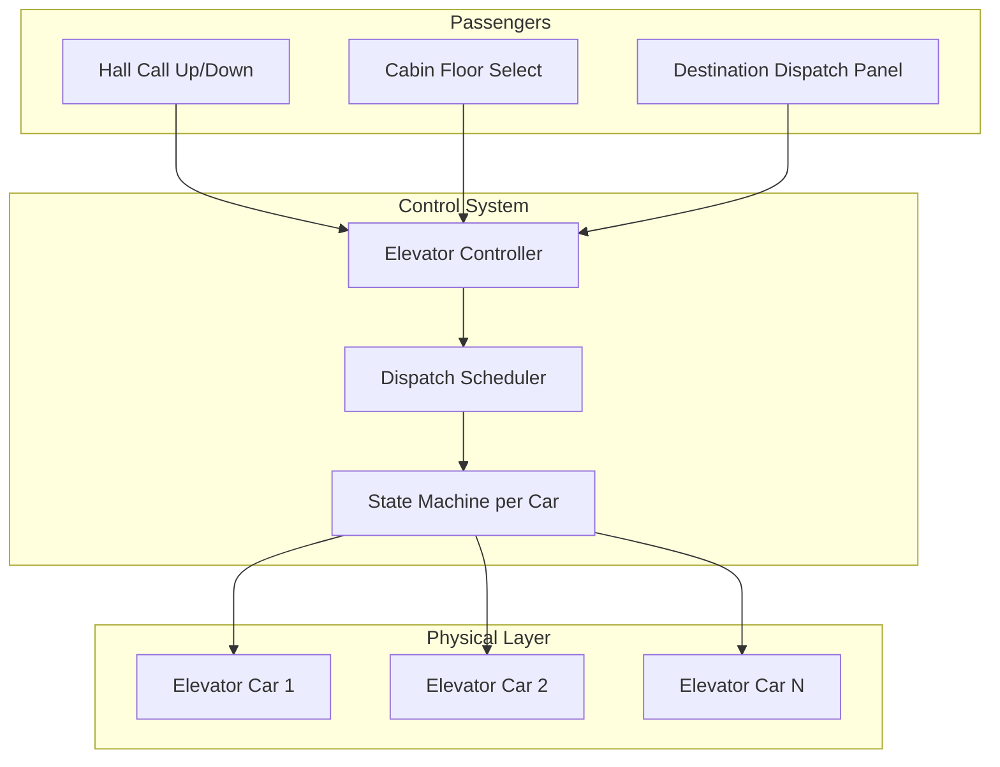

---

## 2. Requirements Clarification

### Clarifying Questions to Ask

| Question | Why It Matters |
|----------|----------------|
| How many floors? How many elevators? | Drives algorithm complexity and data structures |
| Single building or multi-building fleet? | Centralized vs distributed controller |
| Hall-call only or destination dispatch (passenger selects floor at lobby)? | Completely different UX and algorithm |
| Express / service elevators? | Separate zones, restricted floor access |
| Peak traffic profile? | Morning up-rush, lunch, evening down-rush |
| Safety certification required (ASME A17.1)? | Hard real-time, redundant controllers |
| Accessibility requirements? | Braille panels, audible announcements, door dwell time |
| Energy optimization priority? | Regenerative braking, idle parking strategy |

### Functional Requirements

**Must Have (P0):**

- Passengers press **Up/Down** hall buttons on any floor → system assigns an elevator
- Passengers select destination floors inside the cabin
- Elevator moves between floors, opens/closes doors at stops
- Multiple elevators operate concurrently without collision
- Display which elevator is arriving and its direction
- Emergency stop and fire-service mode override normal dispatch
- Weight limit enforcement — do not move if overloaded

**Should Have (P1):**

- **Destination dispatch** at lobby — passenger selects floor before boarding; system assigns optimal car
- Estimated Time of Arrival (ETA) display at hall and in mobile app
- Priority for accessibility / VIP / service requests
- Load balancing across elevator banks during peak hours
- Maintenance mode — take car offline gracefully

**Nice to Have (P2):**

- Mobile app: call elevator, see ETA, unlock turnstile
- Predictive dispatch using historical traffic patterns (ML)
- Energy-optimized scheduling (regenerative braking coordination)
- Integration with building access control (badge → auto-select floor)
- Multi-building fleet dashboard for property management

### Non-Functional Requirements

| Dimension | Target | Rationale |
|-----------|--------|-----------|
| **Average wait time** | < 30 seconds (peak) | Industry benchmark for Class A office |
| **Max wait time (p99)** | < 60 seconds | Passenger frustration threshold |
| **Door open duration** | 3–5 seconds (configurable) | ADA compliance; extend for accessibility |
| **Dispatch decision latency** | < 50 ms | Must feel instant on button press |
| **Safety response** | < 100 ms for emergency stop | Hard real-time requirement |
| **Availability** | 99.99% per car (one car down OK) | N-1 redundancy in bank |
| **Consistency** | Strong for safety state; eventual OK for analytics | Never compromise door/motor interlocks |

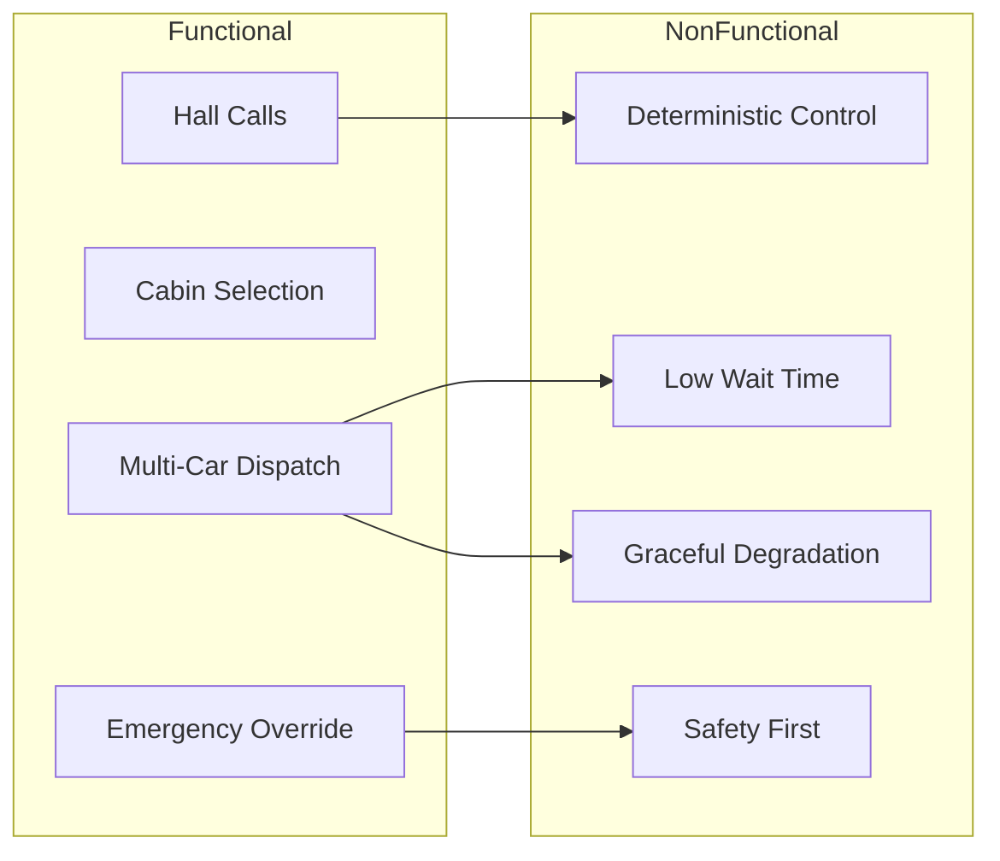

### Scope Boundaries (State Explicitly in Interview)

| In Scope | Out of Scope |
|----------|--------------|
| Software controller + scheduling | Motor/drive mechanical design |
| Request queue + dispatch algorithm | Elevator shaft construction |
| Per-car state machine | Electrical wiring / circuit breakers |
| Safety interlock logic (software) | Physical rope/counterweight engineering |
| Building configuration (floors, banks) | Manufacturing / installation |

---

## 3. Capacity Estimation

Assume a **50-floor commercial office tower**, **8 elevators** (2 banks of 4), **5,000 occupants**, peak morning rush **8:00–9:30 AM**.

### Traffic Profile

```
Occupants:                    5,000
Peak arrival rate:            ~70% in 90 min → ~2,800 people / 90 min ≈ 0.5/sec building-wide
Per elevator bank (4 cars):   ~0.25 requests/sec sustained
Peak burst (lobby rush):      ~5 hall calls/sec for 10 min windows
Average trip:                 20 floors × 1.5 sec/floor ≈ 30 sec travel + 8 sec door ≈ 38 sec/ride
Round trips per car/hour:     3600/38 ≈ 95 trips/car/hour
Bank capacity (4 cars):       95 × 4 × 10 persons ≈ 3,800 persons/hour (theoretical max)
```

### Request Volume (Software)

```
Hall calls peak:              5 req/sec × 2 banks = 10 hall calls/sec
Cabin floor selects peak:     ~20 req/sec (multiple per ride)
Dispatch decisions/sec:       ~30/sec peak
State machine ticks:          8 cars × 10 Hz = 80 state updates/sec
Telemetry events:             8 cars × 50 sensors × 1 Hz = 400 events/sec
Daily request volume:         ~500K hall calls, ~2M cabin selections
```

### Storage (Telemetry & Analytics)

```
Per ride event:               ~500 bytes (timestamps, floors, car ID, wait time)
Rides per day (8 cars):       95 × 8 × 16 active hours ≈ 12,000 rides
Daily telemetry:              12,000 × 500 B ≈ 6 MB/day (negligible)
Annual analytics storage:     ~2 GB/year per building
Fleet of 1,000 buildings:     ~2 TB/year — time-series DB handles easily
```

### Memory (In-Memory Controller State)

```
Per elevator state:           ~2 KB (floor, direction, door, queue, sensors)
8 elevators:                  16 KB
Request queues (all floors):  50 floors × 2 directions × 8 B ≈ 800 B
Pending cabin requests:       8 cars × 50 floors × 1 bit ≈ 50 B
Total hot state:              < 100 KB — fits entirely in memory on edge controller
```

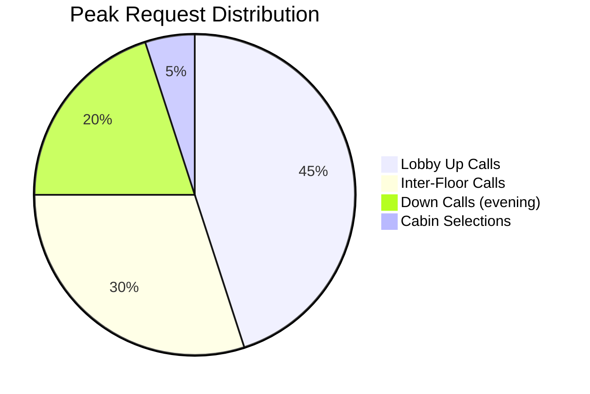

---

## 4. Core Entities

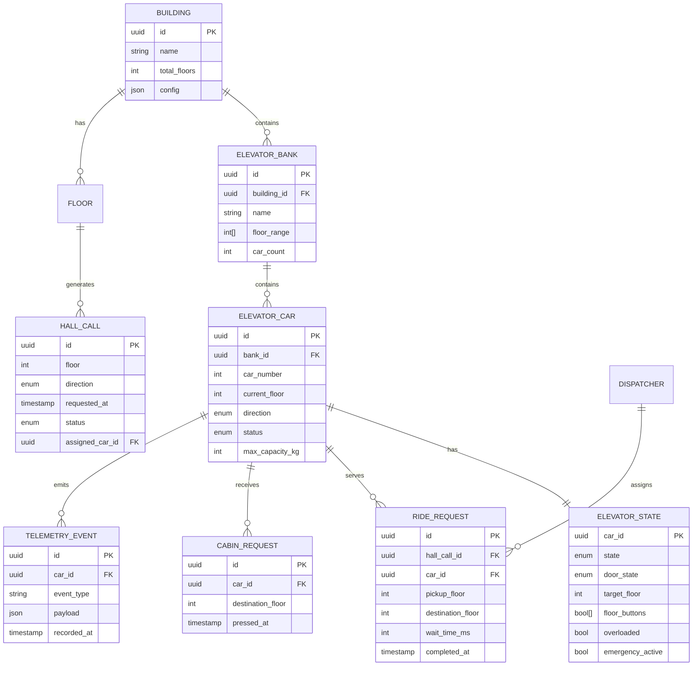

### Entity Descriptions

| Entity | Responsibility |
|--------|----------------|
| **Building** | Top-level config: floors, banks, express zones, fire-service rules |
| **ElevatorBank** | Group of cars sharing a shaft zone (e.g., floors 1–25 vs 26–50) |
| **ElevatorCar** | Physical car identity, capacity, current position |
| **ElevatorState** | Real-time mutable state — the heart of the state machine |
| **HallCall** | External request: "I want to go UP from floor 7" |
| **CabinRequest** | Internal request: passenger pressed floor 42 inside car 3 |
| **Dispatcher** | Stateless service that assigns hall calls to cars |
| **RideRequest** | Completed trip record for analytics |

---

## 5. API Design

### External APIs (Building Management / Mobile App)

#### POST /v1/buildings/{buildingId}/hall-calls

Request an elevator at a floor.

```json
// Request
{
  "floor": 1,
  "direction": "UP",
  "source": "LOBBY_PANEL",
  "destination_floor": 42  // optional — destination dispatch mode
}

// Response 201
{
  "hall_call_id": "hc_abc123",
  "assigned_car_id": "car_3",
  "assigned_car_number": 3,
  "estimated_arrival_seconds": 12,
  "direction": "UP"
}
```

#### POST /v1/cars/{carId}/cabin-requests

Passenger selects a floor inside the cabin.

```json
// Request
{
  "destination_floor": 42,
  "source": "CABIN_PANEL"
}

// Response 201
{
  "cabin_request_id": "cr_xyz789",
  "accepted": true,
  "estimated_arrival_seconds": 38
}
```

#### GET /v1/cars/{carId}/status

Real-time car status for display panels.

```json
// Response 200
{
  "car_id": "car_3",
  "current_floor": 7,
  "direction": "UP",
  "door_state": "CLOSED",
  "state": "MOVING",
  "next_stops": [12, 19, 42],
  "load_percentage": 65,
  "estimated_next_arrival_seconds": 8
}
```

#### GET /v1/buildings/{buildingId}/elevators

Fleet overview for monitoring dashboard.

```json
// Response 200
{
  "building_id": "bldg_001",
  "cars": [
    {
      "car_id": "car_1",
      "floor": 1,
      "state": "IDLE",
      "direction": "NONE",
      "status": "OPERATIONAL"
    },
    {
      "car_id": "car_2",
      "floor": 25,
      "state": "MOVING",
      "direction": "DOWN",
      "status": "OPERATIONAL"
    }
  ],
  "avg_wait_time_seconds": 18,
  "active_hall_calls": 4
}
```

#### POST /v1/cars/{carId}/maintenance

Take car offline (requires admin auth).

```json
// Request
{
  "mode": "MAINTENANCE",
  "reason": "Scheduled inspection",
  "park_at_floor": 1
}
```

#### POST /v1/buildings/{buildingId}/emergency

Fire service / emergency override.

```json
// Request
{
  "mode": "FIRE_SERVICE",
  "trigger": "FIRE_ALARM_PANEL",
  "zone": "FLOOR_15"
}
```

### Internal APIs (Controller ↔ Car Hardware)

| Method | Endpoint | Purpose |
|--------|----------|---------|
| `POST` | `/internal/cars/{id}/command` | Send motor/door command (MOVE_TO, OPEN_DOOR, CLOSE_DOOR, STOP) |
| `POST` | `/internal/cars/{id}/sensor-event` | Ingest sensor reading (floor position, weight, door obstruction) |
| `GET` | `/internal/dispatcher/next-assignment` | Poll pending hall calls for assignment |
| `POST` | `/internal/dispatcher/assign` | Commit hall call → car assignment |

### Hall Call Sequence (Destination Dispatch)

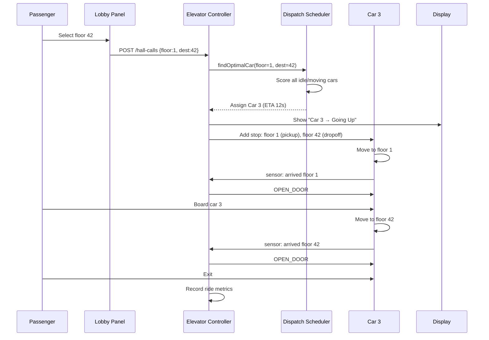

---

## 6. Data Model

### Building Configuration (PostgreSQL — rarely changes)

```sql
CREATE TABLE buildings (
    id              UUID PRIMARY KEY,
    name            VARCHAR(255) NOT NULL,
    total_floors    INT NOT NULL,
    config          JSONB NOT NULL  -- express zones, fire rules, peak profiles
);

CREATE TABLE elevator_banks (
    id              UUID PRIMARY KEY,
    building_id     UUID REFERENCES buildings(id),
    name            VARCHAR(50),
    floor_min       INT NOT NULL,
    floor_max       INT NOT NULL,
    car_count       INT NOT NULL
);

CREATE TABLE elevator_cars (
    id              UUID PRIMARY KEY,
    bank_id         UUID REFERENCES elevator_banks(id),
    car_number      INT NOT NULL,
    max_capacity_kg INT DEFAULT 1000,
    max_persons     INT DEFAULT 10,
    status          VARCHAR(20) DEFAULT 'OPERATIONAL',
    UNIQUE (bank_id, car_number)
);
```

### Real-Time State (Redis — hot path)

```
# Per-car state hash
HSET car:{car_id}:state
    current_floor     7
    direction         UP          # UP | DOWN | NONE
    state             MOVING      # IDLE | MOVING | DOORS_OPEN | EMERGENCY | MAINTENANCE
    door_state        CLOSED      # OPEN | CLOSING | CLOSED | OPENING
    target_floor      12
    overloaded        0
    last_updated_ms   1719900000123

# Pending stops — sorted set (score = floor number, with direction encoding)
ZADD car:{car_id}:stops_up   12  "12"  19  "19"  42  "42"
ZADD car:{car_id}:stops_down 5   "5"

# Hall call queue — per floor/direction
LPUSH hall_calls:{floor}:{direction}  {hall_call_id, requested_at, dest_floor}

# Active assignments
SET hall_call:{hall_call_id}:car  {car_id}  EX 300
```

### Analytics (Time-Series / PostgreSQL)

```sql
CREATE TABLE ride_events (
    id                  UUID PRIMARY KEY,
    building_id         UUID NOT NULL,
    car_id              UUID NOT NULL,
    pickup_floor        INT,
    destination_floor   INT,
    wait_time_ms        INT,          -- hall call → door open
    travel_time_ms      INT,          -- door close → destination door open
    total_time_ms       INT,
    peak_period         BOOLEAN,
    recorded_at         TIMESTAMPTZ DEFAULT NOW()
);

CREATE INDEX idx_ride_events_building_time ON ride_events (building_id, recorded_at);

CREATE TABLE hall_call_events (
    id              UUID PRIMARY KEY,
    building_id     UUID NOT NULL,
    floor           INT NOT NULL,
    direction       VARCHAR(4),
    assigned_car_id UUID,
    wait_time_ms    INT,
    cancelled       BOOLEAN DEFAULT FALSE,
    requested_at    TIMESTAMPTZ,
    assigned_at     TIMESTAMPTZ,
    fulfilled_at    TIMESTAMPTZ
);
```

---

## 7. High-Level Architecture

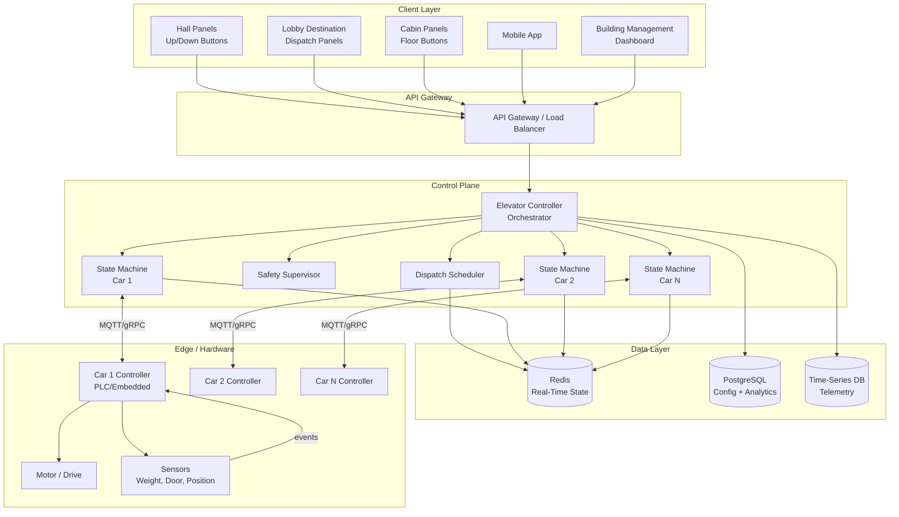

### Component Responsibilities

| Component | Role | Latency Requirement |
|-----------|------|---------------------|
| **Hall/Cabin Panels** | Capture passenger input; show assigned car + ETA | Input → ACK < 100 ms |
| **API Gateway** | Auth, rate limit, route to controller | < 5 ms overhead |
| **Elevator Controller** | Central orchestrator; routes requests, enforces safety | Dispatch < 50 ms |
| **Dispatch Scheduler** | Optimal car selection algorithm | Pure function; < 10 ms |
| **Safety Supervisor** | Monitors all cars; triggers emergency/fire mode | < 100 ms reaction |
| **State Machine (per car)** | Manages single car lifecycle: move, stop, door cycle | 10 Hz tick rate |
| **Redis** | Authoritative real-time state for all cars + queues | Sub-ms reads/writes |
| **Car Hardware Controller** | PLC/embedded system; direct motor and door control | Hard real-time (1 ms) |

### Data Flow: Hall Call → Elevator Arrives

```mermaid
flowchart LR
    A[Passenger presses<br/>UP at floor 7] --> B[Panel sends<br/>hall call event]
    B --> C[Controller receives<br/>validates floor]
    C --> D[Dispatch Scheduler<br/>scores all cars]
    D --> E[Assign Car 2<br/>ETA 15s]
    E --> F[Update Car 2<br/>stop queue]
    F --> G[State Machine<br/>redirects Car 2]
    G --> H[Hardware moves<br/>car to floor 7]
    H --> I[Door opens<br/>passenger boards]
    I --> J[Record metrics<br/>to analytics]
```

---

## 8. Deep Dive: Elevator State Machine

Each elevator car is modeled as a **finite state machine**. This is the core of the design — interviewers expect you to draw this clearly.

### States

| State | Description | Valid Transitions |
|-------|-------------|-------------------|
| `IDLE` | Stationary, doors closed, no pending work | → MOVING, → DOORS_OPEN, → MAINTENANCE, → EMERGENCY |
| `MOVING` | Traveling between floors | → IDLE (arrived, no more stops), → DOORS_OPEN (arrived at stop), → EMERGENCY |
| `DOORS_OPEN` | Doors fully open, passengers boarding/alighting | → DOORS_CLOSING (timeout or button), → EMERGENCY |
| `DOORS_CLOSING` | Doors in motion closing | → DOORS_OPEN (obstruction), → MOVING (fully closed), → EMERGENCY |
| `EMERGENCY` | Emergency stop engaged | → MAINTENANCE (manual reset only) |
| `MAINTENANCE` | Car offline for service | → IDLE (manual return to service) |
| `FIRE_SERVICE` | Firefighter control mode | Special protocol — bypass normal dispatch |

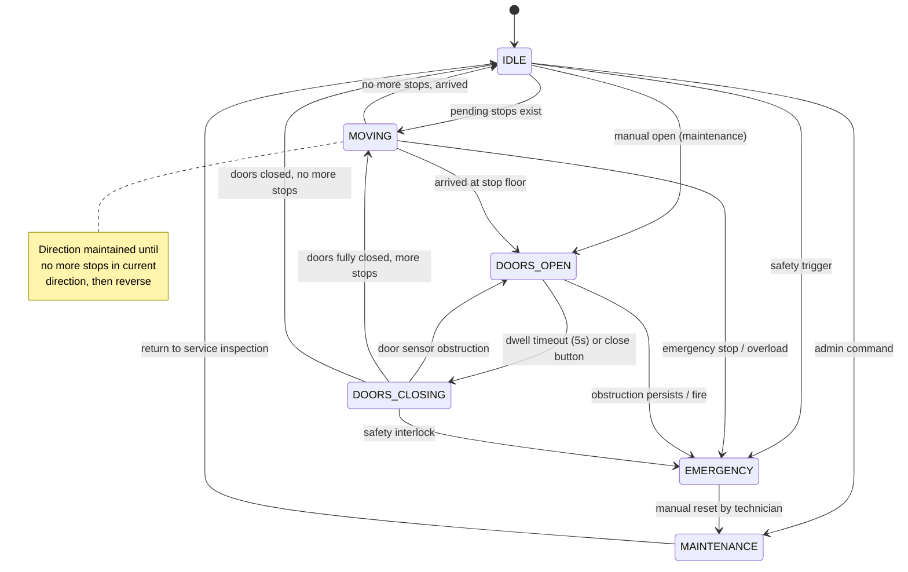

### State Machine Tick Loop (Pseudocode)

```python
class ElevatorStateMachine:
    TICK_RATE_HZ = 10  # 100ms tick

    def tick(self, car: ElevatorCar, sensors: SensorReading) -> Command:
        # Safety checks FIRST — always preempt normal operation
        if sensors.emergency_button or sensors.overspeed or sensors.overloaded:
            return self.enter_emergency(car)

        match car.state:
            case State.IDLE:
                if car.has_pending_stops():
                    return Command.CLOSE_DOORS_AND_MOVE
                return Command.NOOP

            case State.MOVING:
                if sensors.current_floor == car.next_stop_floor:
                    car.state = State.DOORS_OPEN
                    car.door_opened_at = now()
                    return Command.STOP_MOTOR_AND_OPEN_DOORS
                return Command.CONTINUE_MOVING

            case State.DOORS_OPEN:
                if sensors.door_obstruction:
                    car.door_opened_at = now()  # reset dwell timer
                    return Command.NOOP
                if now() - car.door_opened_at > car.dwell_time_ms:
                    car.state = State.DOORS_CLOSING
                    return Command.CLOSE_DOORS
                return Command.NOOP

            case State.DOORS_CLOSING:
                if sensors.door_obstruction:
                    car.state = State.DOORS_OPEN
                    return Command.REOPEN_DOORS
                if sensors.doors_fully_closed:
                    if car.has_pending_stops():
                        car.state = State.MOVING
                        return Command.MOVE_TO_NEXT_STOP
                    car.state = State.IDLE
                    return Command.NOOP
                return Command.NOOP
```

### Stop Queue Management

Each car maintains two queues — stops while going **UP** and stops while going **DOWN** (the classic SCAN algorithm data structure):

```mermaid
graph TB
    subgraph Car 2 — Current Floor 7, Direction UP
        UP_Q["Up Queue: [12, 19, 42]"]
        DOWN_Q["Down Queue: [5, 3]"]
    end

    UP_Q -->|serve in order| S1[Stop at 12]
    S1 --> S2[Stop at 19]
    S2 --> S3[Stop at 42]
    S3 -->|reverse direction| DOWN_Q
    DOWN_Q --> S4[Stop at 5]
    S4 --> S5[Stop at 3]
    S5 -->|idle at floor 3| IDLE[State: IDLE]
```

**Rules:**
1. While moving UP, serve all UP queue stops in ascending order
2. When UP queue empty, reverse direction → serve DOWN queue in descending order
3. New requests behind current direction are added to the appropriate queue
4. New requests *ahead* in current direction are inserted in sorted order

---

## 9. Deep Dive: Dispatch & Scheduling Algorithms

This is the **most important deep dive** — the interviewer will ask you to compare algorithms.

### Algorithm Comparison

| Algorithm | How It Works | Avg Wait | Pros | Cons |
|-----------|--------------|----------|------|------|
| **FCFS** | First hall call → nearest idle car | Poor at peak | Simple | Ignores direction; inefficient |
| **SCAN** | Car sweeps up/down like disk head | Good | Fair; no starvation | Passes floors without stopping |
| **LOOK** | SCAN but reverses at last request (not top/bottom floor) | Better | Less empty travel | Still not optimal for mixed traffic |
| **Destination Dispatch** | Passenger selects floor at lobby; system assigns car | Best (30–40% improvement) | Groups passengers by destination | Requires lobby panels; UX change |
| **AI / Predictive** | ML predicts demand; pre-position idle cars | Best at scale | Handles peak proactively | Complex; needs training data |

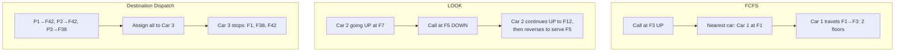

### Destination Dispatch — Scoring Function (Recommended)

When a hall call arrives, score every eligible car:

```
score(car) =
    w1 × estimated_pickup_time(car, floor)       # lower is better
  + w2 × estimated_crowding(car)                  # prefer less loaded
  + w3 × energy_cost(car, floor)                  # prefer cars already heading that way
  + w4 × penalty_if_reversal(car)                 # penalize direction change
  + w5 × bonus_if_already_stopping(car, floor)    # car already has this floor in queue
```

```python
def find_optimal_car(hall_call: HallCall, cars: list[ElevatorCar]) -> ElevatorCar:
    best_car, best_score = None, float('inf')

    for car in cars:
        if car.status in (Status.MAINTENANCE, Status.EMERGENCY):
            continue
        if not car.can_serve_floor(hall_call.floor):
            continue  # express elevator zone restriction

        pickup_eta = simulate_eta(car, hall_call.floor)
        crowding   = car.load_percentage / 100.0
        reversal   = 1.0 if would_reverse(car, hall_call) else 0.0
        already_stopping = 1.0 if hall_call.floor in car.pending_stops else 0.0

        score = (
            1.0 * pickup_eta
          + 0.3 * crowding * 30        # 30 sec penalty for full car
          + 0.5 * reversal * 15        # 15 sec penalty for direction change
          - 0.8 * already_stopping * pickup_eta  # bonus: already visiting
        )

        if score < best_score:
            best_score, best_car = score, car

    return best_car
```

### Peak Traffic Strategies

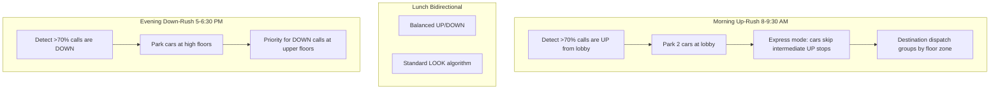

---

## 10. Deep Dive: Multi-Elevator Coordination

### Bank Partitioning (50-floor building, 8 cars)

```mermaid
graph TB
    subgraph Building — 50 Floors
        subgraph Bank A — Low Rise
            A1[Car 1]
            A2[Car 2]
            A3[Car 3]
            A4[Car 4]
            A1 ~~~ A2 ~~~ A3 ~~~ A4
            AF[Floors 1–25]
        end
        subgraph Bank B — High Rise
            B1[Car 5]
            B2[Car 6]
            B3[Car 7]
            B4[Car 8]
            B1 ~~~ B2 ~~~ B3 ~~~ B4
            BF[Floors 26–50]
        end
        subgraph Transfer Floor
            TF[Floor 25/26 — Sky Lobby]
        end
    end
    AF --> TF
    TF --> BF
```

**Rules:**
- Bank A cars cannot serve floors 26–50 directly
- Passengers for high floors transfer at sky lobby (floor 25/26)
- Each bank has its own dispatch scheduler instance
- Reduces scheduling complexity from O(8) to O(4) per decision

### Concurrency Model

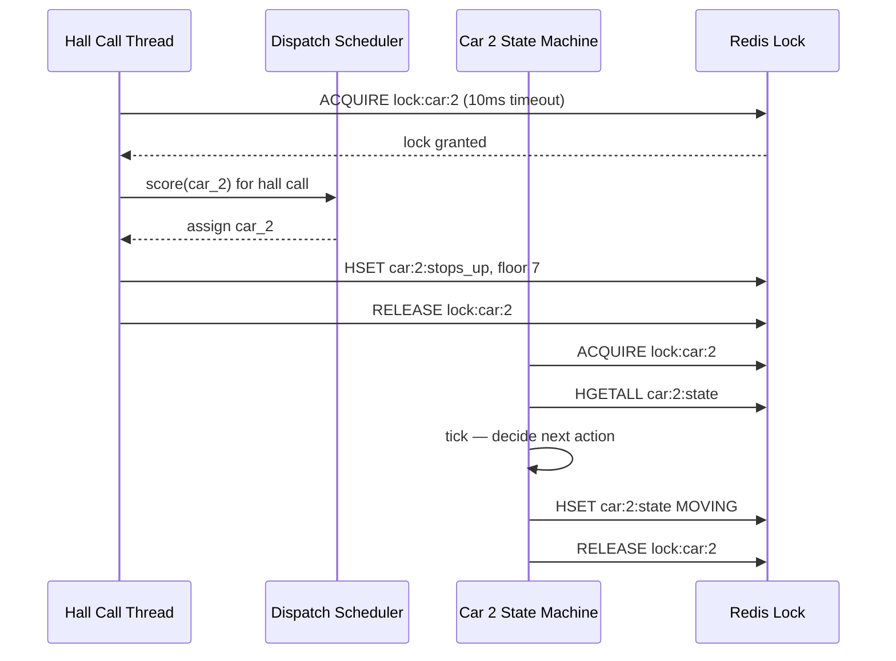

**Key concurrency rules:**
1. **Per-car lock** — only one writer to a car's state at a time (Redis distributed lock or single-threaded actor per car)
2. **Dispatch is stateless** — reads car state snapshot, returns assignment; does not mutate directly
3. **State machine is single-threaded per car** — one tick loop per car (actor model); no shared mutable state
4. **Hall call queue is append-only** — multiple floors can submit concurrently; dispatcher drains

### Actor Model Architecture (Recommended for Scale)

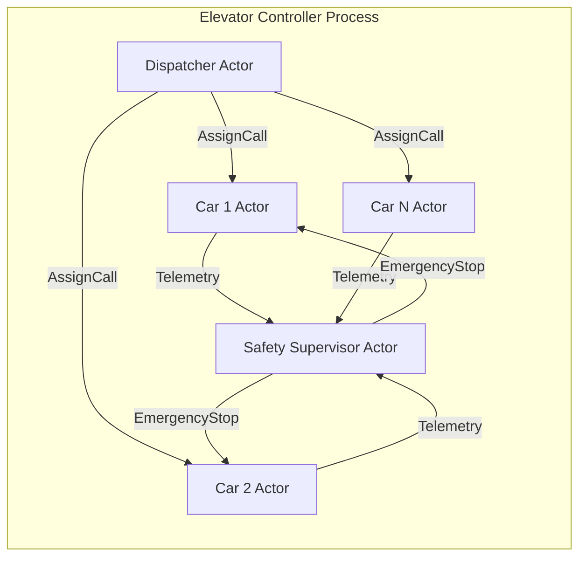

Each car actor:
- Owns its state machine exclusively (no locks needed within actor)
- Receives: `AssignStop`, `CabinRequest`, `SensorEvent`, `Tick`
- Emits: `MotorCommand`, `DoorCommand`, `TelemetryEvent`
- Communicates via message queue (in-process mailbox or Kafka for multi-node)

---

## 11. Deep Dive: Safety, Failover & Edge Cases

### Safety Interlocks (Non-Negotiable — Always Checked First)

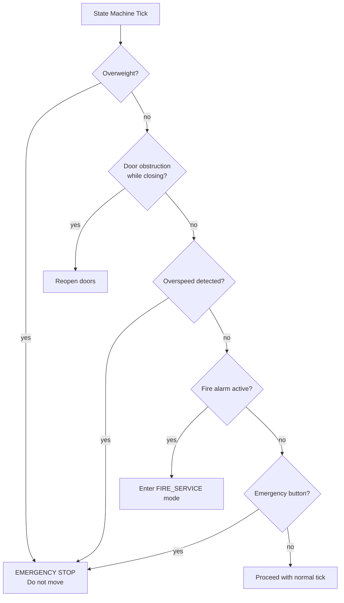

| Interlock | Sensor | Software Response | Hardware Response |
|-----------|--------|-------------------|-------------------|
| Overload | Load cell > 110% capacity | Block MOVING command | Motor inhibitor relay |
| Door obstruction | Infrared curtain / edge sensor | Reopen doors | Motor reverses door |
| Overspeed | Encoder vs expected velocity | Emergency brake command | Safety governor ( mechanical ) |
| Fire alarm | Building fire panel signal | All cars → recall to lobby | Bypass passenger input |
| Power failure | UPS/on-battery signal | Move to nearest floor, open doors | Backup brake engages |
| Communication loss | Heartbeat timeout > 2s | Car continues autonomously to next stop, then stop | PLC failsafe program |

### Fire Service Mode

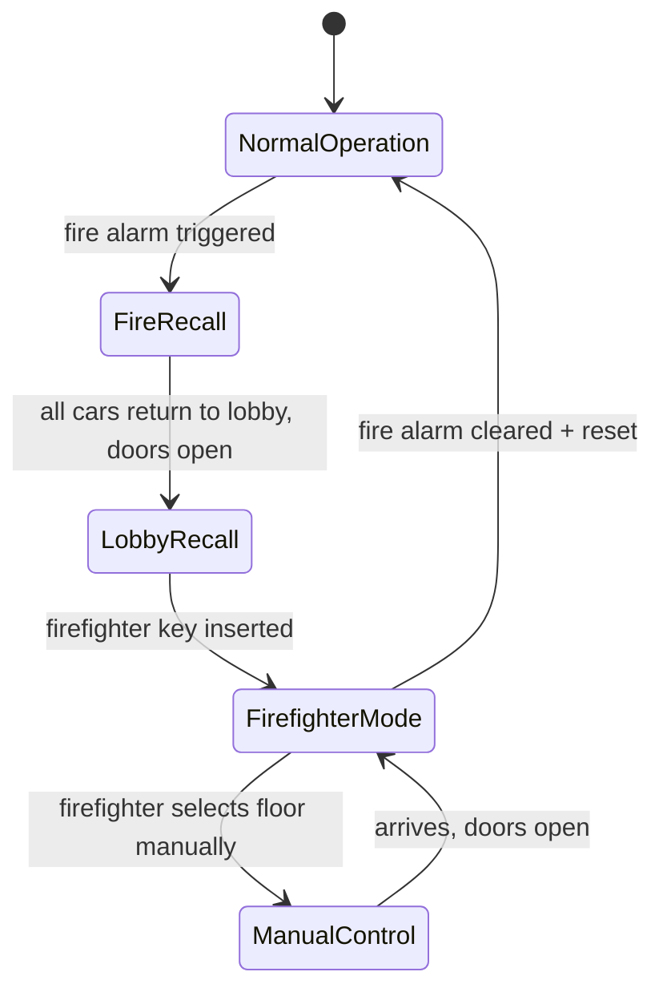

### Failover: Controller Crash

```
Scenario: Elevator Controller software crashes

Layer 1 — Car PLC (embedded):
  - PLC runs independent failsafe program
  - Completes current move to next stop OR nearest floor
  - Opens doors; waits for manual reset
  - Does NOT accept new software commands until heartbeat restored

Layer 2 — Standby Controller:
  - Hot standby controller polls Redis state every 100ms
  - If primary heartbeat missing for > 500ms → standby takes over
  - Replays state from Redis; resumes dispatch
  - Failover time: < 2 seconds

Layer 3 — Manual Override:
  - Building engineer can operate each car independently via manual mode
  - Required by ASME A17.1 safety code
```

---

## 12. Scaling & Reliability

### Single Building vs Fleet

| Scale | Architecture | Notes |
|-------|-------------|-------|
| **1 building, 8 cars** | Single edge server + Redis + PLC | All state in memory; sub-ms latency |
| **100 buildings** | Regional cloud + edge per building | Edge handles real-time; cloud handles analytics |
| **10,000 buildings (Otis scale)** | Multi-region cloud fleet management | MQTT/Kafka telemetry aggregation |

```mermaid
flowchart TB
    subgraph Cloud — Fleet Management
        FM[Fleet Manager]
        AN[Analytics Pipeline]
        ML[Predictive Dispatch ML]
        PG[(PostgreSQL<br/>Fleet Config)]
    end

    subgraph Building Edge — Per Site
        EC[Elevator Controller]
        Redis[(Redis)]
        PLC1[Car PLCs × N]
    end

    FM -->|config push| EC
    EC -->|telemetry stream| AN
    AN --> ML
    ML -->|peak profiles| EC
    EC --> Redis
    EC <-->|MQTT| PLC1
```

### Observability

| Metric | Alert Threshold | Action |
|--------|----------------|--------|
| `avg_wait_time_seconds` | > 45s for 5 min | Trigger peak mode; reposition idle cars |
| `car_heartbeat_missing` | > 2s | Failover to standby controller |
| `door_cycle_time_ms` | > 8000ms | Maintenance ticket; check door motor |
| `dispatch_latency_ms` | p99 > 100ms | Scale controller; check Redis |
| `rides_per_car_per_hour` | < 20 (underutilized) | Review bank partitioning |
| `emergency_stops_per_day` | > 0 | Immediate investigation |

---

## 13. Failure Modes & Edge Cases

| Scenario | Behavior | Mitigation |
|----------|----------|------------|
| **Passenger stuck between floors** | PLC detects position encoder mismatch | Stop motor; activate alarm; notify technician via IoT |
| **Two passengers press same hall button** | Deduplicate within 2s window; one call, both board same car | Idempotent hall call registration |
| **Car assigned but breaks down en route** | Re-dispatch hall call to next best car after 30s timeout | Timeout + reassignment in dispatcher |
| **All cars in MAINTENANCE except 1** | Single car serves entire bank (degraded mode) | Alert building management; extend wait times on display |
| **Power outage** | UPS powers controller + one car at a time to nearest floor | Battery-backed PLC; tested monthly |
| **Network partition (edge ↔ cloud)** | Edge operates autonomously; queues telemetry | Edge-first architecture; cloud is non-critical path |
| **Runaway car (software bug sends repeated MOVE_UP)** | Safety governor + counterweight brake (hardware) | Software cannot override mechanical safety governor |
| **VIP / accessibility priority** | Priority flag on hall call; dispatcher applies -20s score bonus | Configurable priority weights |
| **Express car wrong zone request** | Reject cabin request; display "Please transfer at floor 25" | Zone validation in controller |

### Hall Call Deduplication

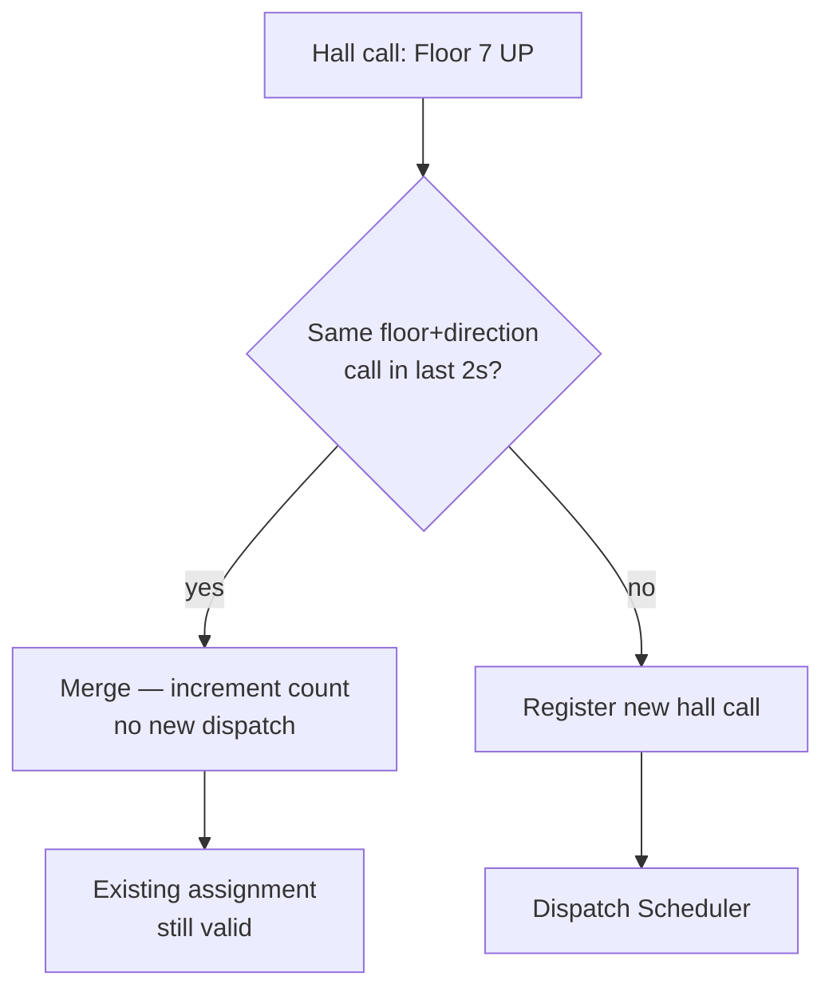

---

## 14. Trade-offs Summary

| Decision | Option A | Option B | Recommendation |
|----------|----------|----------|----------------|
| Dispatch algorithm | SCAN/LOOK (traditional) | Destination dispatch | **Destination dispatch** for new buildings; 30–40% wait time reduction |
| Controller placement | Cloud-only | Edge + cloud hybrid | **Edge** for real-time control; cloud for analytics |
| State storage | In-memory (single process) | Redis (shared) | **Redis** — enables failover + multi-service reads |
| Concurrency model | Shared memory + locks | Actor model (one actor per car) | **Actor model** — no locks, easier to reason about |
| Car assignment | Centralized global scheduler | Per-bank scheduler | **Per-bank** — reduces search space; scales to 50+ cars |
| Door dwell time | Fixed 5s | Adaptive (load-based) | **Adaptive** — extend when overloaded or accessibility |
| Peak mode trigger | Time-based (8 AM) | Traffic-based (call volume) | **Traffic-based** — handles irregular peaks |
| Communication | Polling (HTTP) | MQTT pub/sub | **MQTT** — lower latency; native IoT pattern |

---

## 15. Interview Walkthrough Script

### Minutes 0–5: Requirements

> "I'll design an elevator control system for a 50-floor office building with 8 elevators in 2 banks. Scope: hall calls, cabin floor selection, multi-car dispatch, and safety overrides. I'll optimize for average wait time and assume destination dispatch panels at the lobby. Out of scope: mechanical/motor design."

### Minutes 5–10: Entities & Estimation

> "Core entities: Building, ElevatorBank, ElevatorCar, HallCall, CabinRequest. Peak is ~5 hall calls/sec at lobby during morning rush. State per car is ~2 KB — 8 cars fit in 16 KB, entirely in-memory on an edge controller. I'll use Redis for state to enable controller failover."

### Minutes 10–20: High-Level Design

Draw the architecture:
1. Panels → API Gateway → Elevator Controller
2. Controller owns Dispatch Scheduler + one State Machine per car
3. State machines communicate with car PLCs via MQTT
4. Redis for real-time state; PostgreSQL for config + analytics

Emphasize: **safety supervisor is a separate concern** that can override any car at any time.

### Minutes 20–35: Deep Dives (Interviewer picks 2–3)

**State Machine:**
> "Each car has states: IDLE, MOVING, DOORS_OPEN, DOORS_CLOSING, EMERGENCY. Safety checks run before every tick — overload, door obstruction, fire alarm. Door obstruction resets the dwell timer."

**Dispatch Algorithm:**
> "I'll use destination dispatch with a scoring function: estimated pickup time + crowding penalty + direction reversal penalty. During morning rush, I detect UP-heavy traffic and pre-position 2 cars at the lobby."

**Multi-car coordination:**
> "Actor model — one actor per car, no shared mutable state. Dispatcher is stateless: reads car snapshots, returns assignment. Per-car Redis lock for stop queue updates."

### Minutes 35–45: Wrap-Up

> "Bottleneck during peak is dispatch quality, not throughput — 30 decisions/sec is trivial. I'd monitor avg wait time and trigger peak mode automatically. For fleet scale, edge controller per building with cloud analytics. Safety is never compromised by optimization — hardware interlocks are the last line of defense."

---

## 16. Follow-Up Questions

1. **How would you handle 100 floors and 20 elevators?**
   - Partition into 4 banks of 5 cars; sky lobbies at floors 25, 50, 75; independent schedulers per bank with a coordinator for transfer-floor traffic.

2. **Design the system for a hospital with bed-bound patients.**
   - Dedicated "stretcher" elevator with wider doors; priority dispatch (score bonus -60s); longer door dwell (10s); direct routing (no intermediate stops during critical transport).

3. **How do you prevent two elevators from being assigned to the same hall call?**
   - Atomic assignment: Redis `SET hall_call:{id}:car {car_id} NX` — only first car wins; others skip.

4. **What if the dispatch algorithm itself has a bug and assigns all calls to one car?**
   - Load-aware circuit breaker: if any car's queue exceeds 10 pending stops while others are idle, redistribute. Alert on imbalance metric.

5. **How would you simulate and test this without real elevators?**
   - Discrete-event simulator: model cars as state machines, replay historical hall call traces, measure avg wait time. Run 10,000 simulated morning rushes before deploying algorithm changes.

6. **Design the mobile app integration.**
   - BLE beacon at lobby detects phone → pre-call elevator when user enters building; OAuth + building access control integration; push notification when car arrives.

7. **Energy optimization — how to reduce power consumption?**
   - Regenerative braking stores energy; park idle cars at floor N/2 (balance counterweight); group passengers via destination dispatch reduces total trips; turn off unused cars during off-peak (2–5 AM).

---

## 17. Real-World References

| Company / Standard | Notable Design Choice |
|--------------------|----------------------|
| **Otis (OmniPass)** | Destination dispatch pioneered commercially; 30% wait time reduction |
| **Schindler (PORT)** | Personal Occupant Requirement Terminal — touchless destination entry |
| **KONE (Polaris)** | AI-based traffic prediction; learns building patterns over 2 weeks |
| **Thyssenkrupp (MULTI)** | Rope-free linear motor; horizontal + vertical movement (maglev) |
| **ASME A17.1** | US elevator safety code — defines software/hardware interlock requirements |
| **ISO 8100-1** | International elevator safety standard |

**Key concepts:**

- **SCAN / LOOK algorithm** — classic OS disk scheduling applied to elevators
- **Destination dispatch** — Otis patented; now industry standard for new high-rises
- **Edge computing for IoT** — elevator control is the canonical edge-first workload
- **Actor model** — Carl Hewitt; ideal for concurrent stateful entities (one per car)
- **Fail-safe vs fail-secure** — elevators fail-safe (stop, open doors); know the difference

---

## Interview Cheat Sheet

### Key Numbers to Remember

| Metric | Value |
|--------|-------|
| Average wait time target | < 30 seconds |
| Door dwell time | 3–5 seconds (10s accessibility) |
| Travel speed (high-rise) | ~10–20 floors/minute (1.5–3 sec/floor) |
| Dispatch decision latency | < 50 ms |
| Safety reaction time | < 100 ms |
| Destination dispatch improvement | 30–40% wait time reduction |
| Typical car capacity | 8–15 persons / 630–1000 kg |

### Must-Mention Points

- [ ] Draw the **state machine** (IDLE → MOVING → DOORS_OPEN → DOORS_CLOSING)
- [ ] Separate **safety logic** from **optimization logic** — safety always wins
- [ ] Compare **SCAN/LOOK vs destination dispatch** — know when to use each
- [ ] Explain **stop queue** data structure (two sorted sets: up + down)
- [ ] **Actor model** for concurrency — one thread/actor per car
- [ ] **Edge controller** — cloud is for analytics, not real-time control
- [ ] **Hardware failsafe** — software bug cannot cause runaway car
- [ ] **Peak mode** — detect traffic pattern, pre-position cars

### Common Mistakes

| Mistake | Why It's Wrong | Correct Approach |
|---------|---------------|------------------|
| Treating it as a CRUD API problem | Misses the real-time control nature | Start with state machine |
| One global queue for all elevators | Doesn't scale; ignores direction | Per-car stop queues + dispatcher |
| Cloud-only controller | Network latency breaks safety guarantees | Edge controller with cloud analytics |
| Ignoring safety interlocks | Instant fail in interview | Safety checks before every state transition |
| FCFS dispatch only | Shows lack of depth | Know SCAN, LOOK, destination dispatch |
| No peak traffic strategy | Unrealistic for office building | Morning up-rush / evening down-rush modes |

---

> **Interview Tip:** Start by drawing the **elevator state machine** — it immediately signals you understand this is a real-time control problem, not a web app. Then layer dispatch algorithm and multi-car coordination on top. Interviewers at Amazon and Microsoft love this question because it tests OOD, concurrency, and algorithm design in one problem.
