# Design a Parking Lot System

> **Hello Interview Framework** — A Big Tech–level system design guide for designing a multi-level parking garage management system (SpotHero, ParkWhiz, or airport parking bar).

---

## Table of Contents

1. [Problem Statement](#1-problem-statement)
2. [Requirements Clarification](#2-requirements-clarification)
3. [Capacity Estimation](#3-capacity-estimation)
4. [Core Entities](#4-core-entities)
5. [API Design](#5-api-design)
6. [Data Model](#6-data-model)
7. [High-Level Architecture](#7-high-level-architecture)
8. [Deep Dive: Spot Allocation & Best-Fit Algorithm](#8-deep-dive-spot-allocation--best-fit-algorithm)
9. [Deep Dive: Entry, Exit & Payment Flow](#9-deep-dive-entry-exit--payment-flow)
10. [Deep Dive: Concurrency & Spot Reservation](#10-deep-dive-concurrency--spot-reservation)
11. [Deep Dive: Real-Time Occupancy & IoT Sensors](#11-deep-dive-real-time-occupancy--iot-sensors)
12. [Scaling & Reliability](#12-scaling--reliability)
13. [Failure Modes & Edge Cases](#13-failure-modes--edge-cases)
14. [Trade-offs Summary](#14-trade-offs-summary)
15. [Interview Walkthrough Script](#15-interview-walkthrough-script)
16. [Follow-Up Questions](#16-follow-up-questions)
17. [Real-World References](#17-real-world-references)

---

## 1. Problem Statement

Design a software system to manage a multi-level parking garage. The system must track available parking spots, assign spots to vehicles on entry, calculate fees on exit, process payments, and display real-time availability — supporting multiple vehicle types and pricing tiers.

**What the interviewer is really testing:**

- Object modeling — vehicle types, spot types, and the **best-fit allocation** problem
- Concurrency — two cars entering simultaneously must not get the same spot
- State machine for spots (AVAILABLE → OCCUPIED → RESERVED) and tickets (ISSUED → PAID → CLOSED)
- Payment flow with idempotency and fee calculation edge cases (grace period, daily max, lost ticket)
- Whether you distinguish **OOD scope** (single process) from **distributed scope** (multi-garage fleet)
- Real-time availability at scale using in-memory counters vs sensor reconciliation

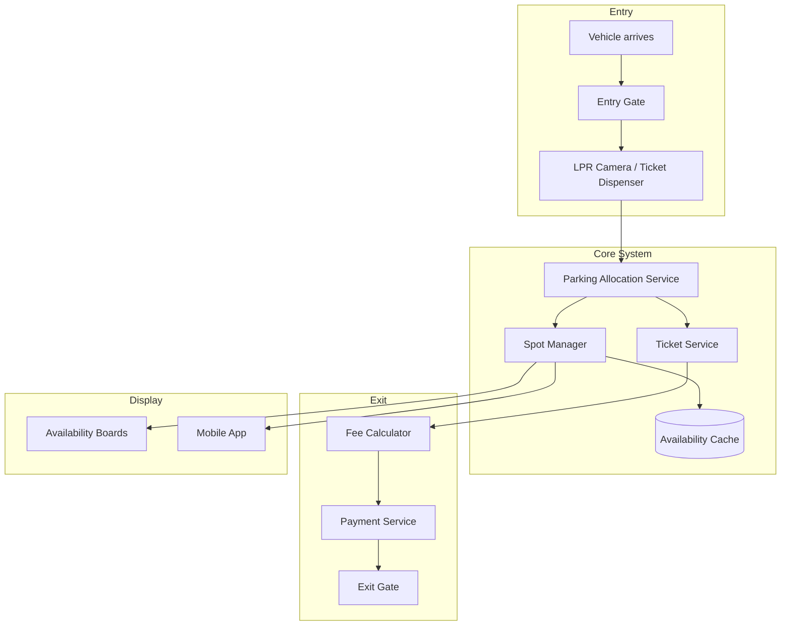

---

## 2. Requirements Clarification

### Clarifying Questions to Ask

| Question | Why It Matters |
|----------|----------------|
| Single garage or multi-location fleet? | Monolith vs sharded multi-tenant architecture |
| How many levels and total spots? | Capacity math and allocation algorithm complexity |
| Vehicle types supported? | Best-fit logic — motorcycle in compact spot? |
| Spot assignment: nearest entrance or pre-reserved? | Allocation algorithm design |
| Payment methods? | Cash, card, mobile app, monthly pass integration |
| Sensors or manual tracking? | IoT occupancy vs ticket-based inference |
| Reservations / mobile pre-booking? | Spot RESERVED state + TTL holds |
| EV charging spots? | Extended session tracking + premium pricing |

### Functional Requirements

**Must Have (P0):**

- Vehicle enters → system assigns an available spot (or rejects if full)
- Support multiple vehicle types: **motorcycle**, **car**, **large vehicle (SUV/truck)**
- Support multiple spot types: **compact**, **regular**, **large**, **handicap**, **motorcycle**
- Issue a **ticket** (physical QR/barcode or digital via app) on entry
- Vehicle exits → calculate parking fee based on duration and rate
- Process payment (card/cash/mobile) and open exit gate
- Display real-time available spot count per level on entry boards
- Prevent double assignment of the same spot (concurrency safe)

**Should Have (P1):**

- **Best-fit allocation** — motorcycle can use motorcycle or compact spot; car cannot use motorcycle spot
- **Nearest-available** — assign spot closest to entry/elevator on assigned level
- Monthly pass / subscription — skip payment on exit for subscribers
- Mobile app: view availability, reserve spot, pay via app (scan QR on exit)
- Handicap spot enforcement — only vehicles with handicap permit
- Grace period (first 15 min free)
- Daily maximum rate cap

**Nice to Have (P2):**

- License Plate Recognition (LPR) — ticketless entry/exit
- Dynamic pricing — surge pricing during events
- EV charging spot management + billing for electricity
- Valet mode — attendant assigns spot manually
- Multi-garage fleet dashboard for operator (SpotHero model)
- Parking guidance lights (green/red per spot)

### Non-Functional Requirements

| Dimension | Target | Rationale |
|-----------|--------|-----------|
| **Entry gate response** | < 2 seconds (spot assign + ticket print) | Cars queue behind gate; long wait = traffic backup |
| **Exit payment latency** | < 5 seconds (card tap to gate open) | Customer frustration at exit |
| **Availability read latency** | < 100 ms | Display boards refresh every few seconds |
| **Spot assignment correctness** | 100% — no double booking | Revenue loss + customer conflict |
| **Availability** | 99.9% | Gate must work even if analytics down |
| **Payment accuracy** | 100% — no under/overcharge disputes | Legal and trust requirement |
| **Concurrent entry gates** | 4+ gates simultaneously | Peak event arrival |

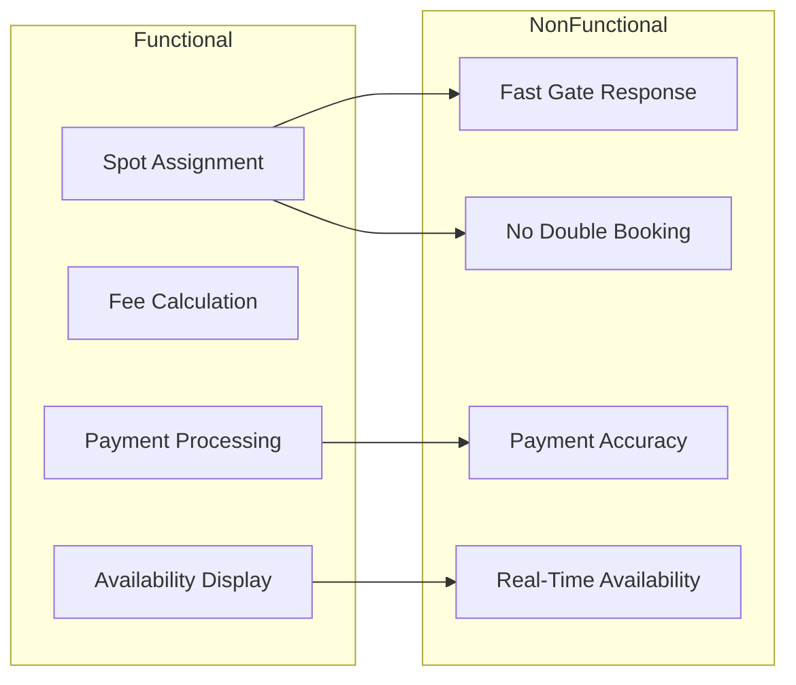

### Scope Boundaries

| In Scope | Out of Scope |
|----------|--------------|
| Spot allocation software | Physical gate arm mechanics |
| Ticket issuance and validation | Asphalt / structural garage design |
| Fee calculation and payment | Security camera footage storage |
| Real-time availability tracking | Valet driver scheduling (unless valet mode) |
| Multi-level spot management | City street parking (metered) |

---

## 3. Capacity Estimation

Assume a **5-level parking garage**, **200 spots per level**, **1,000 total spots**, **4 entry gates**, **4 exit gates**, peak **500 entries/hour** during events.

### Garage Layout

```
Levels:                       5
Spots per level:              200
Total spots:                  1,000
Spot breakdown:
  Motorcycle:                 50  (5%)
  Compact:                    150 (15%)
  Regular:                    650 (65%)
  Large:                      100 (10%)
  Handicap:                   30  (3%)
  EV Charging:                20  (2%)
Entry gates:                  4
Exit gates:                   4
Peak occupancy:               95% (950 cars during events)
```

### Request Volume

```
Peak entry rate:              500 vehicles/hour ≈ 0.14/sec per gate × 4 = 0.56/sec
Peak exit rate:               ~450 vehicles/hour (slightly lower than entry)
Spot assignment writes:       0.56 assign/sec peak + 0.45 release/sec
Availability reads:           4 display boards × 1 Hz + 100 mobile app users × 0.1 Hz
                              ≈ 14 reads/sec (trivial)
Payment transactions:         0.45/sec peak exit
Daily entries (avg):          ~3,000/day
Daily entries (event day):    ~8,000/day
Monthly active pass holders:  500 (skip payment on exit)
```

### Storage

```
Active parking sessions:      950 max (one per occupied spot)
Session record size:          ~500 bytes (ticket_id, spot_id, entry_time, plate, vehicle_type)
Active session storage:       950 × 500 B ≈ 475 KB (fits in Redis)

Completed sessions/day:       3,000–8,000
Daily history:                8,000 × 500 B ≈ 4 MB/day
Annual transaction storage:   ~1.5 GB/year (PostgreSQL — trivial)

Payment records/day:          3,000 × 1 KB ≈ 3 MB/day
Annual payment storage:       ~1 GB/year
```

### Memory (Hot State in Redis)

```
Per-spot bitmap (1000 spots):     1000 bits ≈ 125 bytes per spot type group
Availability counters per level:    5 levels × 6 spot types × 8 B = 240 B
Active sessions hash:               950 × 200 B ≈ 190 KB
Gate locks + assignment queue:      negligible
Total Redis memory:                 < 5 MB per garage
```

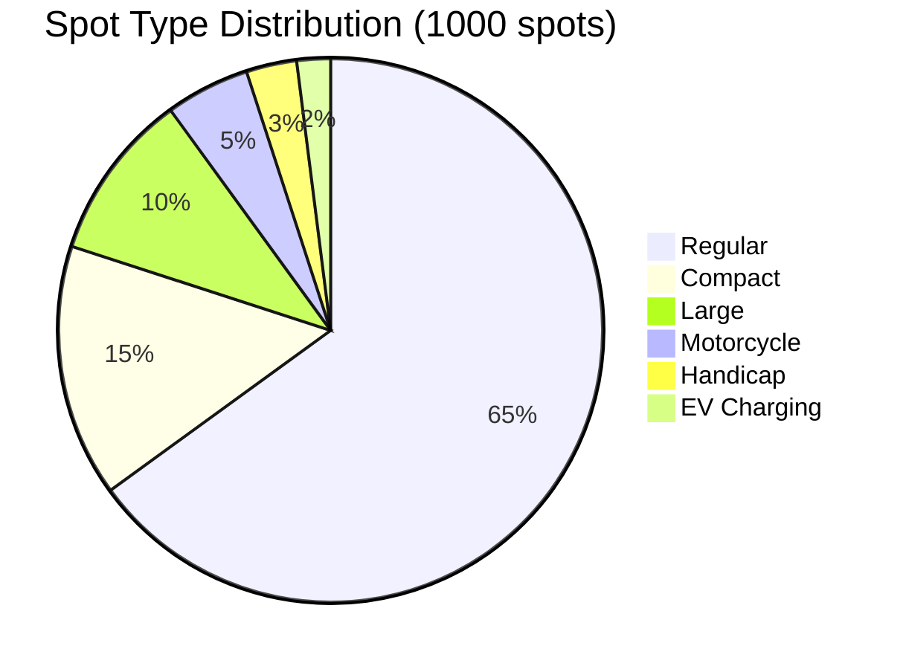

---

## 4. Core Entities

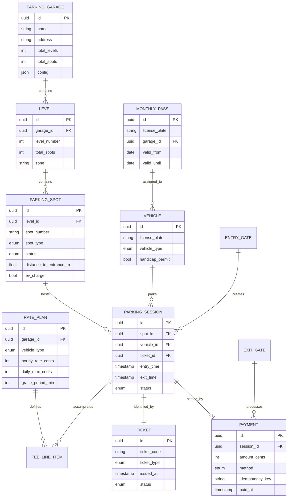

### Entity Descriptions

| Entity | Responsibility |
|--------|----------------|
| **ParkingGarage** | Top-level container; config, rate plans, gate count |
| **Level** | One floor of the garage; has availability counters |
| **ParkingSpot** | Atomic unit — one vehicle per spot; typed and status-tracked |
| **Vehicle** | Identified by license plate; has type and permit flags |
| **ParkingSession** | Active parking event — links vehicle, spot, ticket, times |
| **Ticket** | Proof of entry; QR/barcode scanned on exit |
| **Payment** | Fee settlement record with idempotency key |
| **RatePlan** | Pricing rules per vehicle type (hourly, daily max, grace) |
| **MonthlyPass** | Subscription — bypasses per-session payment |

### Vehicle Type vs Spot Type Compatibility Matrix

| Vehicle \ Spot | Motorcycle | Compact | Regular | Large | Handicap | EV |
|----------------|:----------:|:-------:|:-------:|:-----:|:--------:|:--:|
| **Motorcycle** | Yes | Yes | Yes | Yes | No | No |
| **Car** | No | Yes | Yes | Yes | No* | Yes |
| **Large/SUV** | No | No | No | Yes | No* | No |
| **Handicap car** | No | Yes | Yes | Yes | Yes | Yes |

*Handicap spots require valid handicap permit on vehicle.

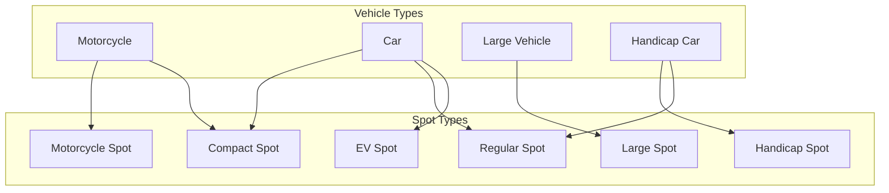

---

## 5. API Design

### Entry Gate APIs

#### POST /v1/garages/{garageId}/entry

Vehicle arrives at entry gate; system assigns spot and issues ticket.

```json
// Request
{
  "gate_id": "entry_gate_1",
  "vehicle_type": "CAR",
  "license_plate": "ABC-1234",
  "handicap_permit": false,
  "entry_method": "TICKET_DISPENSER"
}

// Response 201 — Success
{
  "session_id": "sess_abc123",
  "ticket_id": "tkt_xyz789",
  "ticket_code": "PK-20260708-004521",
  "assigned_spot": {
    "spot_id": "spot_42",
    "spot_number": "L2-B-042",
    "level": 2,
    "spot_type": "REGULAR",
    "distance_to_entrance_m": 28
  },
  "entry_time": "2026-07-08T14:30:00Z",
  "estimated_rate": "$4/hr, $24 daily max"
}

// Response 409 — Garage Full
{
  "error": "GARAGE_FULL",
  "message": "No available spots for vehicle type CAR",
  "availability": {
    "regular": 0,
    "compact": 0,
    "large": 3
  },
  "nearest_alternative": null
}
```

#### POST /v1/garages/{garageId}/reservations

Pre-book a spot via mobile app (reserve before arrival).

```json
// Request
{
  "license_plate": "ABC-1234",
  "vehicle_type": "CAR",
  "arrival_window_start": "2026-07-08T18:00:00Z",
  "arrival_window_end": "2026-07-08T19:00:00Z",
  "spot_type_preference": "REGULAR"
}

// Response 201
{
  "reservation_id": "res_001",
  "reserved_spot_id": "spot_88",
  "spot_number": "L1-A-088",
  "hold_expires_at": "2026-07-08T19:30:00Z",
  "confirmation_code": "RSV-8821"
}
```

### Exit Gate APIs

#### GET /v1/tickets/{ticketCode}/fee

Calculate fee before payment (displayed at payment kiosk).

```json
// Response 200
{
  "ticket_code": "PK-20260708-004521",
  "session_id": "sess_abc123",
  "license_plate": "ABC-1234",
  "entry_time": "2026-07-08T14:30:00Z",
  "duration_minutes": 135,
  "fee_breakdown": {
    "base_hours": 3,
    "hourly_rate_cents": 400,
    "subtotal_cents": 1200,
    "grace_period_applied": false,
    "daily_max_applied": false,
    "total_cents": 1200
  },
  "total_display": "$12.00",
  "monthly_pass_valid": false
}
```

#### POST /v1/tickets/{ticketCode}/pay

Process payment and authorize exit.

```json
// Request
{
  "payment_method": "CREDIT_CARD",
  "payment_token": "tok_visa_4242",
  "idempotency_key": "pay_unique_key_001"
}

// Response 200
{
  "payment_id": "pay_001",
  "amount_cents": 1200,
  "status": "PAID",
  "exit_authorized": true,
  "exit_gate_token": "exit_tok_abc",
  "exit_valid_until": "2026-07-08T16:50:00Z"
}
```

### Availability APIs

#### GET /v1/garages/{garageId}/availability

Real-time spot availability for display boards and mobile app.

```json
// Response 200
{
  "garage_id": "garage_001",
  "updated_at": "2026-07-08T14:30:05Z",
  "total_available": 47,
  "total_occupied": 953,
  "by_level": [
    {
      "level": 1,
      "available": 12,
      "occupied": 188,
      "by_type": {
        "regular": 8,
        "compact": 3,
        "large": 1,
        "handicap": 0,
        "ev": 0,
        "motorcycle": 0
      }
    }
  ],
  "is_full_for": {
    "CAR": false,
    "LARGE": false,
    "MOTORCYCLE": false
  }
}
```

### Admin APIs

| Method | Endpoint | Purpose |
|--------|----------|---------|
| `PUT` | `/v1/spots/{spotId}/status` | Mark spot maintenance / out of service |
| `GET` | `/v1/garages/{garageId}/sessions/active` | All active parking sessions |
| `POST` | `/v1/garages/{garageId}/lost-ticket` | Lost ticket flow — flat fee by duration estimate |
| `POST` | `/v1/passes` | Register monthly pass |
| `GET` | `/v1/garages/{garageId}/revenue` | Daily revenue report |

### Entry Flow Sequence

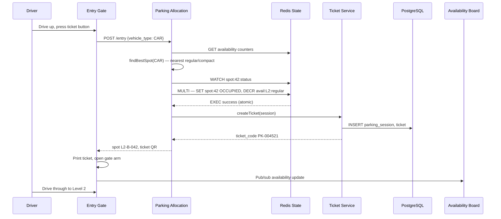

### Exit Flow Sequence

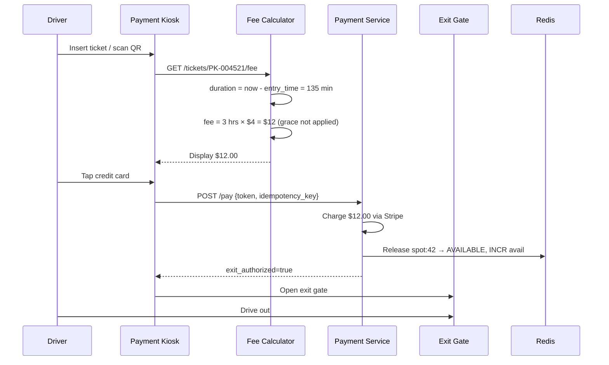

---

## 6. Data Model

### PostgreSQL — Durable Records

```sql
CREATE TABLE parking_garages (
    id              UUID PRIMARY KEY,
    name            VARCHAR(255) NOT NULL,
    address         TEXT,
    total_levels    INT NOT NULL,
    config          JSONB  -- grace_period, lost_ticket_fee, gate_count
);

CREATE TABLE parking_spots (
    id                  UUID PRIMARY KEY,
    garage_id           UUID REFERENCES parking_garages(id),
    level_number        INT NOT NULL,
    spot_number         VARCHAR(20) NOT NULL,
    spot_type           VARCHAR(20) NOT NULL,  -- MOTORCYCLE, COMPACT, REGULAR, LARGE, HANDICAP, EV
    status              VARCHAR(20) DEFAULT 'AVAILABLE',
    distance_to_entrance_m FLOAT,
    ev_charger_id       UUID,
    UNIQUE (garage_id, spot_number)
);

CREATE INDEX idx_spots_garage_type_status ON parking_spots (garage_id, spot_type, status);

CREATE TABLE parking_sessions (
    id              UUID PRIMARY KEY,
    garage_id       UUID REFERENCES parking_garages(id),
    spot_id         UUID REFERENCES parking_spots(id),
    license_plate   VARCHAR(20),
    vehicle_type    VARCHAR(20) NOT NULL,
    ticket_id       UUID,
    entry_time      TIMESTAMPTZ NOT NULL DEFAULT NOW(),
    exit_time       TIMESTAMPTZ,
    status          VARCHAR(20) DEFAULT 'ACTIVE',  -- ACTIVE, COMPLETED, ABANDONED
    entry_gate_id   VARCHAR(50),
    exit_gate_id    VARCHAR(50)
);

CREATE INDEX idx_sessions_active ON parking_sessions (garage_id, status) WHERE status = 'ACTIVE';
CREATE INDEX idx_sessions_plate ON parking_sessions (license_plate, status);

CREATE TABLE tickets (
    id              UUID PRIMARY KEY,
    ticket_code     VARCHAR(30) UNIQUE NOT NULL,
    session_id      UUID REFERENCES parking_sessions(id),
    status          VARCHAR(20) DEFAULT 'ISSUED',  -- ISSUED, PAID, LOST, VOID
    issued_at       TIMESTAMPTZ DEFAULT NOW()
);

CREATE TABLE payments (
    id              UUID PRIMARY KEY,
    session_id      UUID REFERENCES parking_sessions(id),
    amount_cents    INT NOT NULL,
    method          VARCHAR(20),
    idempotency_key VARCHAR(100) UNIQUE,
    stripe_charge_id VARCHAR(100),
    paid_at         TIMESTAMPTZ DEFAULT NOW()
);

CREATE TABLE rate_plans (
    id                  UUID PRIMARY KEY,
    garage_id           UUID REFERENCES parking_garages(id),
    vehicle_type        VARCHAR(20),
    hourly_rate_cents   INT NOT NULL,
    daily_max_cents     INT,
    grace_period_min    INT DEFAULT 15
);

CREATE TABLE monthly_passes (
    id              UUID PRIMARY KEY,
    garage_id       UUID REFERENCES parking_garages(id),
    license_plate   VARCHAR(20) NOT NULL,
    valid_from      DATE NOT NULL,
    valid_until     DATE NOT NULL,
    pass_type       VARCHAR(20) DEFAULT 'STANDARD'
);
```

### Redis — Real-Time Hot State

```
# Spot status (hash — 1000 spots)
HSET spot:{spot_id}:meta
    status          AVAILABLE     # AVAILABLE | OCCUPIED | RESERVED | MAINTENANCE
    session_id      ""            # set when occupied
    vehicle_type    ""
    occupied_since  ""

# Availability counters per level + type (atomic DECR/INCR)
HSET garage:{garage_id}:avail:L1
    motorcycle  8
    compact     22
    regular     145
    large       12
    handicap    5
    ev          4

# Active session lookup by ticket (fast exit path)
SET session:ticket:{ticket_code}  {session_id_json}  EX 86400

# Active session lookup by license plate (LPR exit)
SET session:plate:{license_plate}  {session_id}  EX 86400

# Reservation hold (TTL = arrival window + grace)
SET reservation:{spot_id}  {reservation_id}  EX 5400   # 90 min hold

# Distributed lock for spot assignment
SET lock:spot:{spot_id}  {gate_id}  NX  EX 5
```

---

## 7. High-Level Architecture

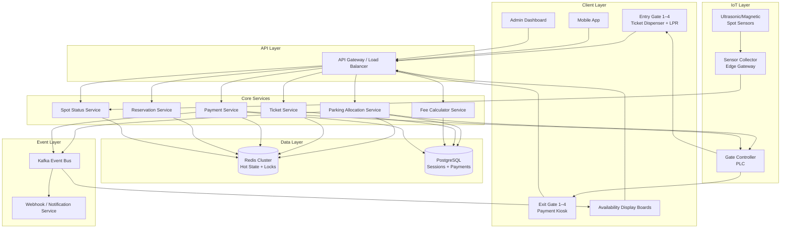

### Component Responsibilities

| Component | Role | Critical Path? |
|-----------|------|----------------|
| **Parking Allocation Service** | Find + atomically reserve best spot | Yes — entry gate |
| **Ticket Service** | Create/validate tickets; link to session | Yes — entry gate |
| **Fee Calculator** | Duration-based fee with grace/max rules | Yes — exit kiosk |
| **Payment Service** | Process payment; release spot; authorize exit | Yes — exit gate |
| **Reservation Service** | Pre-hold spots with TTL | No — async pre-arrival |
| **Spot Status Service** | Reconcile sensor data vs ticket state | No — background |
| **Redis** | Spot availability counters + distributed locks | Yes — hot path |
| **PostgreSQL** | Durable session/payment records | Yes — but async write OK on entry |
| **Gate Controller (PLC)** | Physical arm control; failsafe open on fire alarm | Yes — hardware |

---

## 8. Deep Dive: Spot Allocation & Best-Fit Algorithm

This is the **core algorithm** interviewers expect you to explain clearly.

### Allocation Strategy Options

| Strategy | Description | Use Case |
|----------|-------------|----------|
| **First Available** | Return first free spot in DB query | Simple; poor UX (far from entrance) |
| **Nearest Available** | Minimize `distance_to_entrance_m` among compatible spots | Best UX for customers |
| **Best Fit** | Smallest compatible spot type to minimize wasted capacity | Optimal garage utilization |
| **Combined (Recommended)** | Best-fit spot type + nearest within that type | Industry standard |

### Recommended Algorithm: Best-Fit + Nearest

```python
# Spot type priority order for each vehicle type (best-fit)
SPOT_PRIORITY = {
    VehicleType.MOTORCYCLE: [SpotType.MOTORCYCLE, SpotType.COMPACT, SpotType.REGULAR, SpotType.LARGE],
    VehicleType.CAR:        [SpotType.COMPACT, SpotType.REGULAR, SpotType.EV, SpotType.LARGE],
    VehicleType.LARGE:      [SpotType.LARGE],
    VehicleType.HANDICAP:   [SpotType.HANDICAP, SpotType.REGULAR, SpotType.COMPACT],
}

def find_best_spot(garage_id: str, vehicle: Vehicle) -> ParkingSpot | None:
    for spot_type in SPOT_PRIORITY[vehicle.type]:
        if spot_type == SpotType.HANDICAP and not vehicle.handicap_permit:
            continue
        if spot_type == SpotType.EV and not vehicle.needs_ev:
            continue  # don't waste EV spots on non-EV cars unless full

        # Check availability counter first (O(1) — avoid DB scan)
        count = redis.hget(f"garage:{garage_id}:avail:*", spot_type)
        if count == 0:
            continue

        # Find nearest available spot of this type
        spot = db.query("""
            SELECT id, spot_number, level_number, distance_to_entrance_m
            FROM parking_spots
            WHERE garage_id = %s
              AND spot_type = %s
              AND status = 'AVAILABLE'
            ORDER BY level_number ASC, distance_to_entrance_m ASC
            LIMIT 1
        """, garage_id, spot_type)

        if spot:
            return spot

    return None  # garage full for this vehicle type
```

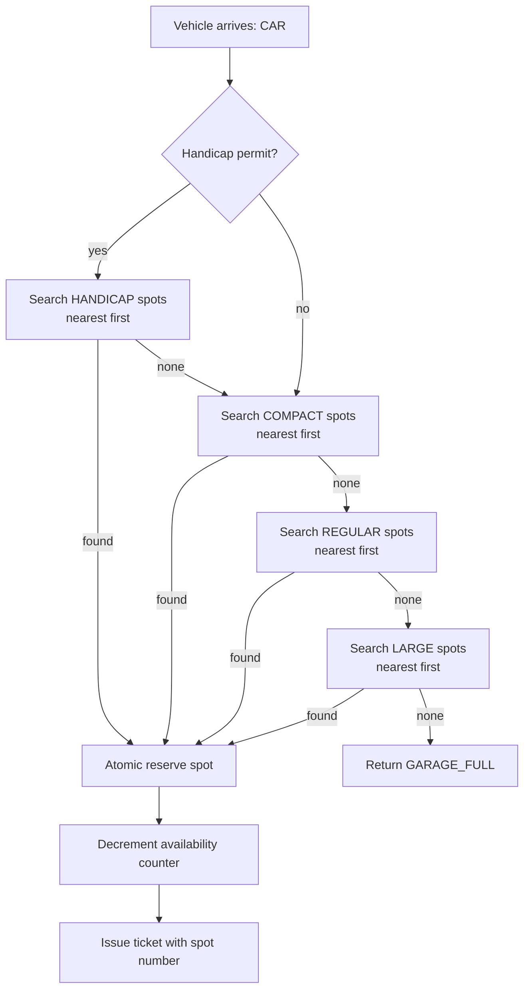

### Multi-Level Allocation Preference

```
Level preference strategy:
1. Fill Level 1 first (closest to exit/entrance) — reduces elevator/stair congestion
2. When Level 1 > 90% full → spill to Level 2
3. Reserve Level 5 for monthly pass holders (optional config)

Configurable per garage:
  fill_strategy: BOTTOM_UP | TOP_DOWN | SPREAD (balance across levels)
```

```mermaid
graph TB
    subgraph Level 1 — 90% full
        L1A[Available: 20 spots]
    end
    subgraph Level 2 — 60% full
        L2A[Available: 80 spots]
    end
    subgraph Level 3 — 40% full
        L3A[Available: 120 spots]
    end

    CAR[New CAR arrives] --> L1A
    L1A -->|prefer L1| SP1[Assign L1 spot if available]
    L1A -->|L1 full for type| L2A
    L2A --> SP2[Assign L2 spot]
```

---

## 9. Deep Dive: Entry, Exit & Payment Flow

### Fee Calculation Rules

```python
def calculate_fee(session: ParkingSession, rate_plan: RatePlan) -> int:
    duration_min = (session.exit_time - session.entry_time).total_seconds() / 60

    # Grace period — first 15 min free
    if duration_min <= rate_plan.grace_period_min:
        return 0

    billable_min = duration_min - rate_plan.grace_period_min
    billable_hours = math.ceil(billable_min / 60)  # round UP to next hour

    fee = billable_hours * rate_plan.hourly_rate_cents

    # Daily max cap
    if rate_plan.daily_max_cents:
        fee = min(fee, rate_plan.daily_max_cents)

    return fee
```

**Fee calculation examples:**

| Entry | Exit | Duration | Rate | Grace | Fee |
|-------|------|----------|------|-------|-----|
| 2:00 PM | 2:10 PM | 10 min | $4/hr | 15 min | **$0** (within grace) |
| 2:00 PM | 3:30 PM | 90 min | $4/hr | 15 min | **$8** (2 billable hours) |
| 2:00 PM | 8:00 PM | 6 hr | $4/hr, $24 max | 15 min | **$24** (daily max applied) |
| 8:00 AM | 6:00 PM | 10 hr | $4/hr, $24 max | 15 min | **$24** (daily max applied) |

### Ticket State Machine

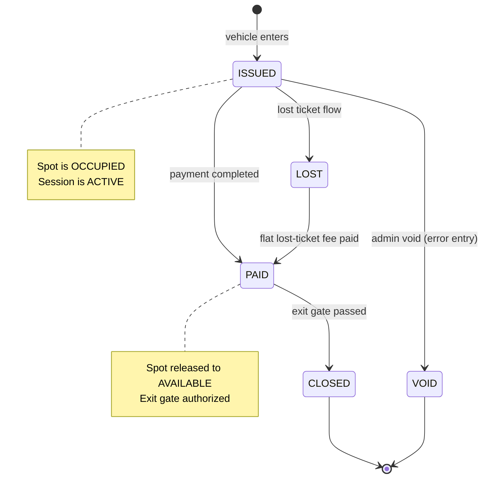

### Lost Ticket Flow

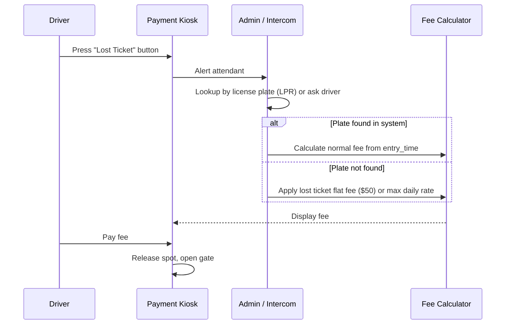

### Monthly Pass Exit (Fast Path)

```python
def handle_exit(ticket_code: str, license_plate: str) -> ExitResult:
    # Check monthly pass first — skip payment
    if pass := monthly_pass_repo.find_valid(license_plate, garage_id):
        session = session_repo.find_active(license_plate)
        release_spot(session.spot_id)
        return ExitResult(authorized=True, amount=0, pass_id=pass.id)

    # Normal payment flow
    session = session_repo.find_by_ticket(ticket_code)
    fee = calculate_fee(session, rate_plan)
    return ExitResult(authorized=False, amount=fee)
```

---

## 10. Deep Dive: Concurrency & Spot Reservation

### The Double-Booking Problem

Two entry gates simultaneously assign the same spot → two cars directed to one spot → conflict.

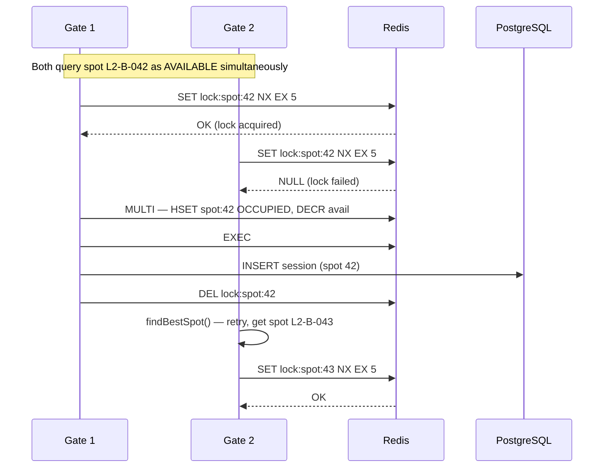

### Atomic Spot Reservation (Redis Lua Script)

```lua
-- KEYS[1] = spot:{spot_id}:meta
-- KEYS[2] = garage:{garage_id}:avail:{level}
-- ARGV[1] = session_id
-- ARGV[2] = spot_type field name

local status = redis.call('HGET', KEYS[1], 'status')
if status ~= 'AVAILABLE' then
    return 0  -- spot already taken
end

redis.call('HSET', KEYS[1], 'status', 'OCCUPIED', 'session_id', ARGV[1])
redis.call('HINCRBY', KEYS[2], ARGV[2], -1)
return 1  -- success
```

### Reservation Hold (Mobile Pre-Book)

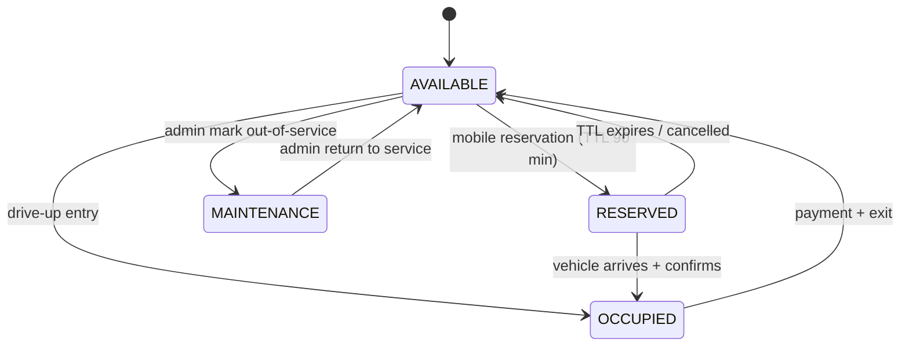

**Reservation rules:**
- Spot status → `RESERVED`; decrement availability counter
- TTL = arrival window end + 30 min grace (Redis `EX`)
- On arrival: scan confirmation code → convert RESERVED → OCCUPIED without re-allocation
- On expiry: Redis key expires → background job resets spot to AVAILABLE + increments counter

---

## 11. Deep Dive: Real-Time Occupancy & IoT Sensors

### Sensor-Based vs Ticket-Based Tracking

| Approach | Pros | Cons |
|----------|------|------|
| **Ticket-based only** | Simple; no IoT cost | Drift if driver parks without ticket; no spot-level accuracy |
| **Sensor per spot** | Ground truth occupancy; spot-level accuracy | Expensive ($50–200/sensor × 1000 spots); maintenance |
| **Hybrid (Recommended)** | Ticket for billing; sensors for reconciliation | Slightly more complex |

### Hybrid Reconciliation

```mermaid
flowchart LR
    subgraph Ticket System
        T1[Entry → spot 42 OCCUPIED]
    end
    subgraph Sensor System
        S1[Sensor 42: OCCUPIED]
        S2[Sensor 43: OCCUPIED]
    end
    subgraph Reconciliation Job — every 5 min
        R1[Compare ticket state vs sensor state]
        R2{Mismatch?}
        R2 -->|Sensor OCCUPIED, no ticket| A1[Alert: unauthorized parking]
        R2 -->|Ticket ACTIVE, sensor EMPTY| A2[Alert: ghost session — auto-close after 24h]
        R2 -->|Match| OK[No action]
    end
    T1 --> R1
    S1 --> R1
    S2 --> R1
```

### Availability Board Update Pipeline

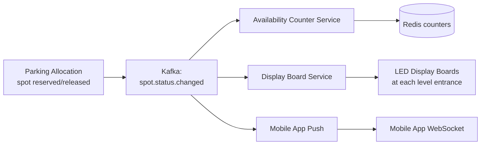

Display board shows:
```
LEVEL 1:  ████████░░  145 OPEN
LEVEL 2:  ██████░░░░  112 OPEN
LEVEL 3:  ████░░░░░░   87 OPEN
FULL ↑ for Large Vehicles
```

---

## 12. Scaling & Reliability

### Single Garage vs Multi-Location Fleet

| Scale | Architecture | Example |
|-------|-------------|---------|
| **1 garage, 1000 spots** | Monolith services + Redis + PostgreSQL | Airport parking |
| **100 garages (operator)** | Shard by `garage_id`; shared payment service | SpotHero operator |
| **10,000+ garages (platform)** | Multi-tenant SaaS; garage_id partition key everywhere | ParkWhiz / SpotHero platform |

```mermaid
flowchart TB
    subgraph Fleet Platform
        GW[Global API Gateway]
        PS[Shared Payment Service]
        NS[Notification Service]
        AN[Analytics Pipeline]
    end

    subgraph Garage A — Shard
        PA_A[Parking Allocation]
        Redis_A[(Redis A)]
        PG_A[(PostgreSQL A)]
    end

    subgraph Garage B — Shard
        PA_B[Parking Allocation]
        Redis_B[(Redis B)]
        PG_B[(PostgreSQL B)]
    end

    GW --> PA_A
    GW --> PA_B
    PA_A --> Redis_A
    PA_B --> Redis_B
    PA_A --> PS
    PA_B --> PS
    PA_A --> AN
    PA_B --> AN
```

### Entry Gate Failsafe

```
If Parking Allocation Service is down:
  1. Gate controller enters OFFLINE MODE (configured fallback)
  2. Dispense ticket without spot assignment (ticket-only mode)
  3. Spot tracked as "unknown occupancy" — sensor reconciliation handles it
  4. Alert operations team immediately
  5. Never block entry — traffic backup onto city street is worse than unassigned spot
```

---

## 13. Failure Modes & Edge Cases

| Scenario | Behavior | Mitigation |
|----------|----------|------------|
| **Two gates assign same spot** | Redis NX lock + Lua atomic reserve | Second gate retries with next spot |
| **Payment succeeds, gate fails to open** | Driver stuck at exit | Exit token valid 15 min; attendant manual override; idempotent re-auth |
| **Driver enters but never exits (abandoned)** | Spot permanently OCCUPIED | Ghost session job: if sensor EMPTY for 24h → auto-close session, release spot |
| **Garage full but large spots available** | Car offered large spot at large-spot rate | Display message: "Only large spots available — $6/hr" |
| **Monthly pass expired mid-session** | Charge normal rate on exit | Check pass validity at exit time, not entry |
| **Power outage at exit gate** | Gate arm fails open (fire code) | UPS + mechanical fail-open; manual fee collection on restore |
| **Redis down during entry** | Cannot assign spot atomically | Fallback to PostgreSQL `SELECT FOR UPDATE SKIP LOCKED` (slower but safe) |
| **Overstay (days without exit)** | Spot blocked for days | Escalating daily max; after 7 days → tow notification workflow |
| **Duplicate payment (network retry)** | Double charge | Idempotency key on payment API; Stripe deduplicates |
| **EV spot occupied by non-EV** | EV driver cannot charge | Sensor + ticket type mismatch alert; fine workflow |

### Ghost Session Cleanup

```python
# Cron job — runs every hour
def cleanup_ghost_sessions():
    active_sessions = session_repo.find_active(older_than_hours=24)
    for session in active_sessions:
        sensor_status = sensor_service.get_status(session.spot_id)
        if sensor_status == 'EMPTY':
            # Ticket says occupied, sensor says empty — ghost session
            release_spot(session.spot_id)
            session.status = 'ABANDONED'
            session_repo.save(session)
            alert_ops(f"Ghost session closed: {session.id}, spot {session.spot_number}")
```

---

## 14. Trade-offs Summary

| Decision | Option A | Option B | Recommendation |
|----------|----------|----------|----------------|
| Spot assignment | First available | Best-fit + nearest | **Best-fit + nearest** — optimal utilization + UX |
| Availability store | PostgreSQL query | Redis counters | **Redis counters** — O(1) read; DB for durability |
| Concurrency control | DB row lock | Redis Lua atomic script | **Redis Lua** — faster; DB fallback if Redis down |
| Occupancy tracking | Ticket-only | Sensor + ticket hybrid | **Hybrid** — sensors for accuracy; tickets for billing |
| Payment processor | Build in-house | Stripe / Square | **Stripe** — PCI compliance outsourced |
| Fill strategy | Bottom-up (Level 1 first) | Spread evenly | **Bottom-up** — less walking for most customers |
| Reservation TTL | 30 min | 90 min | **90 min** — accommodates late arrivals |
| Offline mode | Block entry when system down | Ticket-only fallback | **Ticket-only fallback** — never block entry |

---

## 15. Interview Walkthrough Script

### Minutes 0–5: Requirements

> "I'll design a parking lot system for a 5-level garage with 1,000 spots supporting motorcycles, cars, and large vehicles. Scope: entry spot assignment, exit fee calculation, payment, and real-time availability. I'll use best-fit + nearest allocation and support monthly passes. Out of scope: physical gate mechanics."

### Minutes 5–10: Entities & Estimation

> "Core entities: ParkingGarage, Level, ParkingSpot, Vehicle, ParkingSession, Ticket, Payment. Peak is 500 entries/hour across 4 gates — about 0.14 assigns/sec per gate, very manageable. Hot state is ~5 MB in Redis for 1,000 spots."

### Minutes 10–20: High-Level Design

Draw architecture:
1. Entry gate → Parking Allocation Service → Redis (atomic reserve) → Ticket Service
2. Exit kiosk → Fee Calculator → Payment Service → release spot → open gate
3. Kafka events update availability boards

Emphasize: **spot assignment must be atomic** — this is the key concurrency challenge.

### Minutes 20–35: Deep Dives (Interviewer picks 2–3)

**Best-fit allocation:**
> "Motorcycle can go in motorcycle, compact, regular, or large spot — I try smallest compatible type first to preserve large spots for trucks. Within each type, I pick nearest to the level entrance."

**Concurrency:**
> "Redis Lua script atomically checks AVAILABLE, sets OCCUPIED, and decrements the counter. If two gates race, one gets 0 from the script and retries with the next spot."

**Fee calculation:**
> "15-minute grace period, round up to next hour, apply daily max cap. Monthly pass checked at exit — if valid, skip payment entirely."

### Minutes 35–45: Wrap-Up

> "Bottleneck isn't throughput — it's correctness of spot assignment. I'd monitor double-booking rate (must be zero), ghost session count, and availability drift between Redis and sensors. For fleet scale, shard everything by garage_id."

---

## 16. Follow-Up Questions

1. **How would you design for a stadium event with 10,000 cars arriving in 2 hours?**
   - Pre-sell parking passes with assigned lots; open overflow lots; dynamic pricing; queue management at entry (virtual waiting line like Ticketmaster); stagger arrival windows on ticket.

2. **Design street parking (metered, city-wide) instead of a garage.**
   - Geospatial index for spots; mobile app payment by zone; enforcement officer app with LPR; no spot assignment — zone-based billing; integrate with city permit system.

3. **How do you handle valet parking mode?**
   - Attendant app: scan ticket → assign any spot → customer gets SMS with retrieval code; on return, attendant looks up spot by ticket; premium valet fee added.

4. **Design dynamic pricing (surge pricing).**
   - Occupancy rate > 85% → multiply hourly rate by 1.5×; display price on entry sign before ticket issued; price locked at entry time (not exit); stored in session record.

5. **How would you support EV charging billing?**
   - EV spot has charger ID linked; session tracks kWh consumed from charger API; fee = parking fee + (kWh × electricity rate); separate RatePlan extension for EV.

6. **What if two vehicles claim the same spot physically?**
   - Sensor alerts attendant; lookup active sessions for that spot; LPR camera at level entrance identifies which plate entered; issue citation to unauthorized vehicle.

7. **Design the mobile app experience.**
   - Show availability before arrival; reserve spot; navigate to assigned spot (indoor GPS/BLE beacons); pay in app → QR scan at exit gate (no kiosk stop).

---

## 17. Real-World References

| Company / System | Notable Design Choice |
|-----------------|----------------------|
| **SpotHero** | Multi-garage marketplace; pre-book + mobile payment; inventory API for operators |
| **ParkWhiz** | Event parking pre-purchase; dynamic pricing by demand |
| **Amano McGann** | Enterprise PARCS (Parking Access Revenue Control System) hardware + software |
| **SKIDATA** | Airport/stadium parking; LPR ticketless flow; global deployments |
| **Flash Parking** | Cloud-native PARCS; API-first; sensor integration |
| **ParkMobile** | Zone-based street parking; extend session via app |

**Key concepts:**

- **Best-fit allocation** — classic operating systems memory allocation applied to parking spots
- **Optimistic concurrency with Redis Lua** — atomic read-check-write in single script
- **Idempotency keys** — payment APIs (same pattern as Payment Gateway guide)
- **Event sourcing for occupancy** — Kafka spot events for boards, analytics, and reconciliation
- **Graceful degradation** — ticket-only offline mode; never block physical entry

---

## Interview Cheat Sheet

### Key Numbers to Remember

| Metric | Value |
|--------|-------|
| Entry gate response target | < 2 seconds |
| Exit payment target | < 5 seconds |
| Grace period (typical) | 15 minutes free |
| Hourly rate (typical urban) | $3–$8/hr |
| Daily max (typical) | $20–$30 |
| Lost ticket flat fee | $25–$50 or daily max |
| Garage capacity (medium) | 500–2,000 spots |
| Peak event entry rate | 500+ vehicles/hour |

### Must-Mention Points

- [ ] **Vehicle/spot compatibility matrix** — best-fit allocation
- [ ] **Atomic spot reservation** — Redis Lua or `SELECT FOR UPDATE SKIP LOCKED`
- [ ] **Fee calculation** — grace period, round up to hour, daily max cap
- [ ] **Ticket state machine** — ISSUED → PAID → CLOSED
- [ ] **Spot state machine** — AVAILABLE → OCCUPIED → (RESERVED, MAINTENANCE)
- [ ] **Monthly pass fast path** — skip payment on exit
- [ ] **Lost ticket flow** — flat fee or LPR lookup
- [ ] **Idempotency on payment** — prevent double charge
- [ ] **Offline fallback** — ticket-only mode; never block entry
- [ ] **Ghost session cleanup** — sensor vs ticket reconciliation

### Common Mistakes

| Mistake | Why It's Wrong | Correct Approach |
|---------|---------------|------------------|
| No concurrency handling | Double booking — instant fail | Redis atomic Lua script |
| One spot type for all vehicles | Wastes large spots on motorcycles | Best-fit compatibility matrix |
| Query DB for every availability check | Too slow for display boards | Redis counters updated atomically |
| Charge by the minute | Unusual; customers expect hourly | Round up to next full hour |
| Block entry when system is down | Traffic backup onto street | Ticket-only offline fallback |
| Forget daily max cap | Overcharge on long stays | Apply `min(hourly × hours, daily_max)` |
| Assign spot without printing on ticket | Driver can't find spot | Always include spot number on ticket/display |

### OOD Class Diagram (For OOD-Style Interviews)

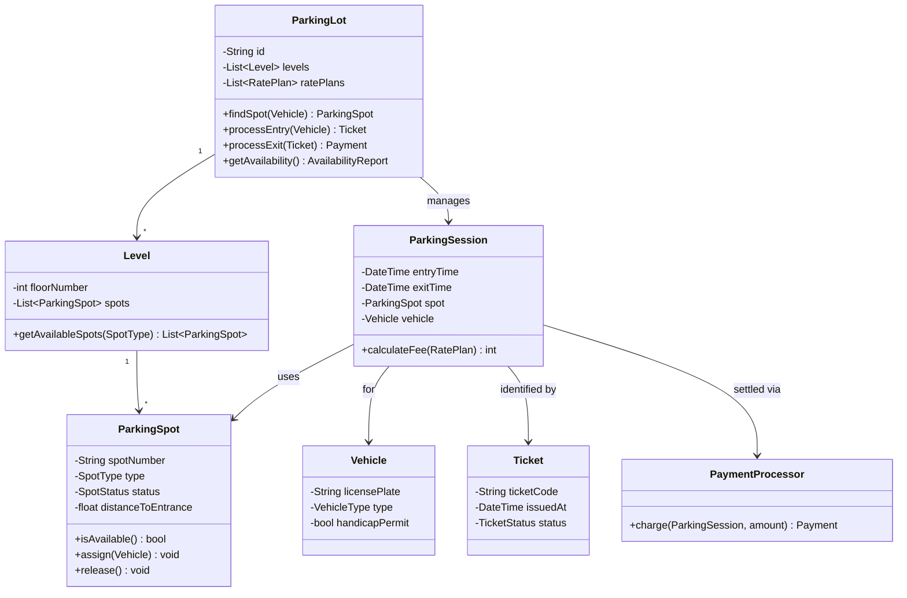

---

> **Interview Tip:** This question has two modes — **OOD** (classes: ParkingLot, Spot, Vehicle, Ticket) and **System Design** (distributed services, Redis, payment). Ask the interviewer which scope they want. If system design, lead with the entry/exit flow and atomic spot reservation. If OOD, draw the class diagram first, then discuss the allocation algorithm.
