# Scaling, CAP, Caching, Load Balancing, Sharding & Indexing

> **The definitive fundamentals guide** for system design interviews at Google, Microsoft, Meta, and Amazon. Covers *what* each technique is, *how* it is implemented, *where* to use it, and *what interviewers expect* you to say.

---

## Table of Contents

1. [Why Interviewers Care About These Fundamentals](#1-why-interviewers-care-about-these-fundamentals)
2. [Scalability Fundamentals](#2-scalability-fundamentals)
3. [CAP Theorem & Distributed Consistency](#3-cap-theorem--distributed-consistency)
4. [Caching — Deep Dive](#4-caching--deep-dive)
5. [Load Balancing — Deep Dive](#5-load-balancing--deep-dive)
6. [Database Sharding — Deep Dive](#6-database-sharding--deep-dive)
7. [Database Indexing — Deep Dive](#7-database-indexing--deep-dive)
8. [How They Work Together](#8-how-they-work-together)
9. [Decision Framework — When to Use What](#9-decision-framework--when-to-use-what)
10. [Interview Scenarios & Sample Answers](#10-interview-scenarios--sample-answers)
11. [Failure Modes Across All Layers](#11-failure-modes-across-all-layers)
12. [Trade-offs Master Table](#12-trade-offs-master-table)
13. [Interview Cheat Sheet](#13-interview-cheat-sheet)
14. [Follow-Up Questions & Model Answers](#14-follow-up-questions--model-answers)
15. [Common Mistakes That Fail Interviews](#15-common-mistakes-that-fail-interviews)

---

## 1. Why Interviewers Care About These Fundamentals

Every system design interview — Instagram, Uber, URL Shortener, or Elevator — eventually touches one or more of these topics. Interviewers are not testing whether you memorized definitions. They are testing whether you can:

1. **Identify the bottleneck** — Is it CPU, memory, I/O, network, or database?
2. **Pick the right tool** — Not "add Redis because everyone does" but *why* cache here and *what* consistency is acceptable
3. **Explain trade-offs** — Every choice has a cost; staff-level candidates articulate it unprompted
4. **Know implementation reality** — How consistent hashing actually works, not just the buzzword

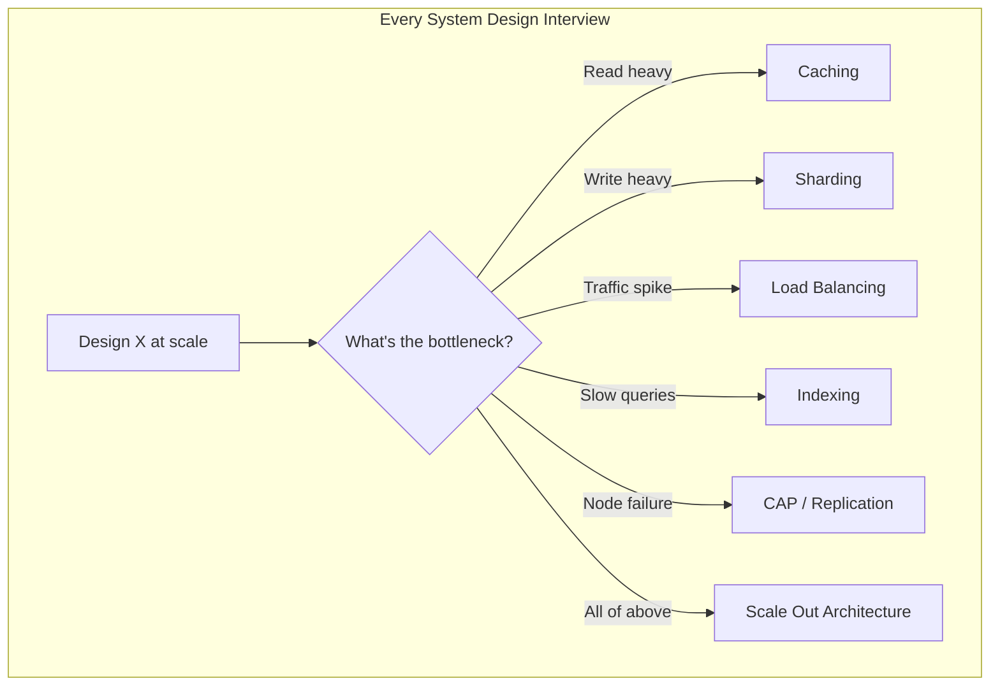

### What "Good" Looks Like in an Interview

| Level | What You Demonstrate |
|-------|---------------------|
| **Junior** | Names the technique ("we'd use a cache") |
| **Mid** | Explains why ("read-heavy, 100:1 ratio, stale data OK for 60s") |
| **Senior** | Describes how ("cache-aside with TTL, Redis cluster, invalidate on write for user profile") |
| **Staff** | Anticipates failure ("thundering herd on cache miss — add request coalescing or probabilistic early expiration") |

---

## 2. Scalability Fundamentals

### 2.1 Vertical vs Horizontal Scaling

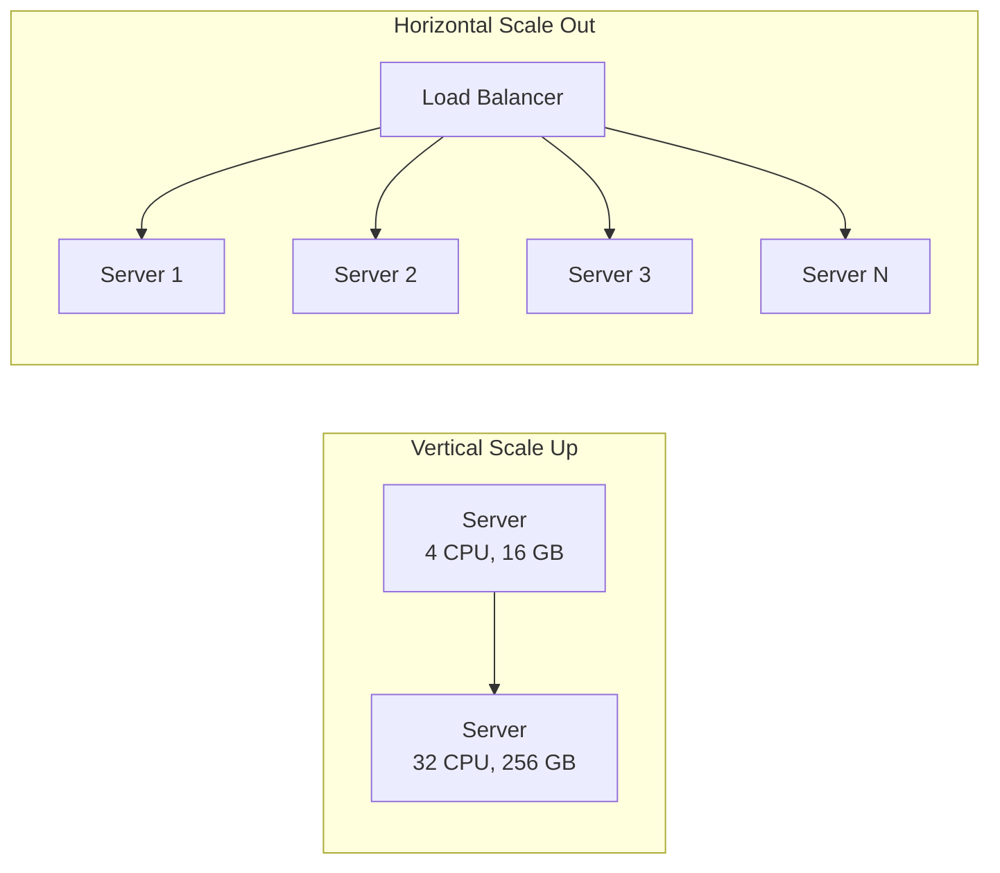

| Dimension | Vertical Scaling (Scale Up) | Horizontal Scaling (Scale Out) |
|-----------|----------------------------|-------------------------------|
| **What** | Bigger machine — more CPU, RAM, disk | More machines — add nodes to pool |
| **How** | Upgrade instance type (e.g., AWS `m5.xlarge` → `m5.24xlarge`) | Add servers behind load balancer |
| **Limit** | Hardware ceiling; single point of failure | Theoretically unlimited |
| **Cost curve** | Exponential — 2× RAM often costs 3× price | Linear — 2× servers ≈ 2× cost |
| **Complexity** | Low — no code changes | High — distributed systems problems |
| **Downtime** | Often requires restart | Zero-downtime if done correctly |
| **Best for** | Databases (short term), monoliths, quick fix | Web servers, stateless APIs, long-term growth |

**When interviewers ask "how would you scale this?"** — Always say horizontal for application tier, and explain that database scaling is harder (sharding, read replicas).

### 2.2 Stateless vs Stateful Services

```mermaid
flowchart TB
    subgraph Stateless — Easy to Scale
        U1[User Request] --> LB[Load Balancer]
        LB --> S1[Server 1<br/>no session stored]
        LB --> S2[Server 2]
        LB --> S3[Server 3]
        S1 --> DB[(Shared DB / Cache)]
        S2 --> DB
        S3 --> DB
    end

    subgraph Stateful — Hard to Scale
        U2[User Request] --> LB2[Load Balancer<br/>sticky session required]
        LB2 --> S4[Server A<br/>session in memory]
        LB2 -.->|wrong server| S5[Server B<br/>session lost!]
    end
```

| Type | Session Storage | Scaling | Example |
|------|----------------|---------|---------|
| **Stateless** | External (Redis, JWT, DB) | Add/remove servers freely | REST APIs, microservices |
| **Stateful** | In-process memory | Sticky sessions or session migration | WebSocket gateways, game servers |

**How to make a stateful service scalable:**
1. Externalize state to Redis/DB (preferred)
2. Sticky sessions on load balancer (fragile — server death loses session)
3. Consistent hashing to route user → same server (Discord gateway model)

### 2.3 Scaling Dimensions

| Dimension | Metric | Scale Technique |
|-----------|--------|-----------------|
| **Traffic** | Requests/sec (QPS) | Load balancer + more app servers |
| **Data volume** | Storage size (TB/PB) | Sharding, archival, compression |
| **Read throughput** | Read QPS | Caching, read replicas, CDN |
| **Write throughput** | Write QPS | Sharding, write-behind cache, async queues |
| **Latency** | p99 response time | Caching, edge deployment, indexing |
| **Concurrent users** | WebSocket connections | Connection pooling, gateway sharding |
| **Geography** | Global users | Multi-region, CDN, geo-routing |

### 2.4 The Scalability Stack (Bottom-Up)

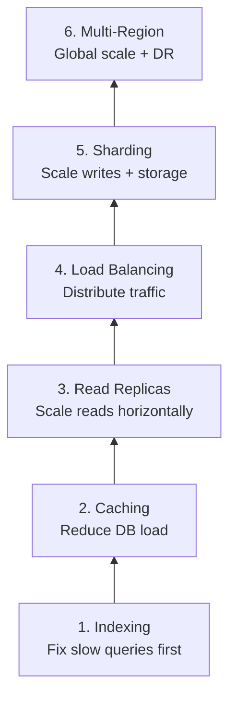

**Interview rule:** Don't jump to sharding before trying indexing and caching. Interviewers penalize over-engineering.

### 2.5 Back-of-Envelope: When Do You Need What?

```
Assume: 1 server handles 1,000 RPS comfortably

Traffic         Servers Needed    Technique
─────────────────────────────────────────────
1K RPS          1                 Monolith OK
10K RPS         10                Load balancer + stateless servers
100K RPS        100               + CDN for static, Redis cache
1M RPS          1,000             + DB read replicas, connection pooling
10M RPS         10,000            + Sharding, multi-region, async pipelines
```

---

## 3. CAP Theorem & Distributed Consistency

### 3.1 The Theorem (What It Actually Says)

In a **distributed system**, you can guarantee at most **two of three** properties during a **network partition**:

| Property | Definition |
|----------|------------|
| **C — Consistency** | Every read receives the most recent write or an error |
| **A — Availability** | Every request receives a non-error response (not necessarily the latest data) |
| **P — Partition Tolerance** | System continues operating despite network failures between nodes |

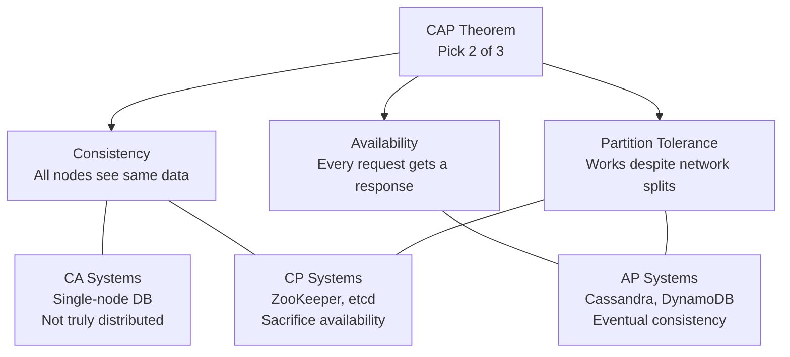

**Critical nuance interviewers expect you to know:**

> **Partition tolerance is not optional in distributed systems.** Network failures *will* happen. So the real choice is **CP vs AP** during a partition — not "do we want P."

### 3.2 CP vs AP — What Happens During a Partition

```mermaid
sequenceDiagram
    participant C as Client
    participant N1 as Node 1 (Leader)
    participant N2 as Node 2 (Follower)

    Note over N1,N2: Network partition occurs

    rect rgb(255, 230, 230)
        Note over C,N2: CP System (ZooKeeper, etcd)
        C->>N2: Write request
        N2-->>C: ERROR — cannot reach quorum
        Note over N2: Refuses write to preserve consistency
    end

    rect rgb(230, 255, 230)
        Note over C,N2: AP System (Cassandra, DynamoDB)
        C->>N2: Write request
        N2-->>C: OK — write accepted locally
        Note over N2: Accepts write; will reconcile later (conflict resolution)
    end
```

| System Type | During Partition | Example | Use When |
|-------------|-----------------|---------|----------|
| **CP** | Rejects requests to avoid stale data | ZooKeeper, etcd, HBase, MongoDB (default) | Distributed locks, leader election, financial ledger |
| **AP** | Accepts requests; data may be stale | Cassandra, DynamoDB, CouchDB, DNS | Social feeds, shopping carts, sensor data |
| **CA** | Only works on single node (not distributed) | PostgreSQL on one server | Not applicable at scale |

### 3.3 PACELC — The Extension Interviewers Love

CAP only describes behavior **during a partition**. PACELC extends it to **normal operation**:

> **If Partition → choose A or C. Else (normal operation) → choose Latency or Consistency.**

| System | During Partition | Normal Operation | Real-World Behavior |
|--------|-----------------|------------------|---------------------|
| **DynamoDB** | AP | Latency (L) | Fast writes; eventual consistency by default |
| **MongoDB** | CP | Consistency (C) | Strong consistency in single DC |
| **Cassandra** | AP | Configurable (L or C) | Tunable per query (`ONE`, `QUORUM`, `ALL`) |
| **Spanner** | CP | Consistency (C) | TrueTime enables global strong consistency |
| **Redis** | CP (single primary) | Latency (L) | Fast; loses availability on primary failure until failover |

### 3.4 Consistency Models (Granularity Beyond CAP)

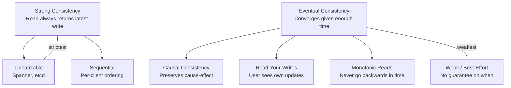

| Model | Guarantee | Latency | Example Use Case |
|-------|-----------|---------|-----------------|
| **Strong / Linearizable** | Latest write always visible | High (coordination) | Bank balance, inventory count |
| **Sequential** | Operations appear in some order globally | Medium | Chat message ordering |
| **Causal** | Cause precedes effect | Medium | Comment threads, collaborative docs |
| **Read-your-writes** | User sees their own updates | Low-Medium | User profile edit → view profile |
| **Eventual** | Converges eventually | Low | Like counts, view counts, CDN |
| **Best-effort** | No guarantee | Lowest | Analytics, metrics, recommendations |

**What to say in interviews:**

> "For the payment balance, I need strong consistency — CP, probably PostgreSQL with synchronous replication. For the like count on a post, eventual consistency is fine — AP, async update, display approximate count."

### 3.5 How Strong Consistency Is Achieved

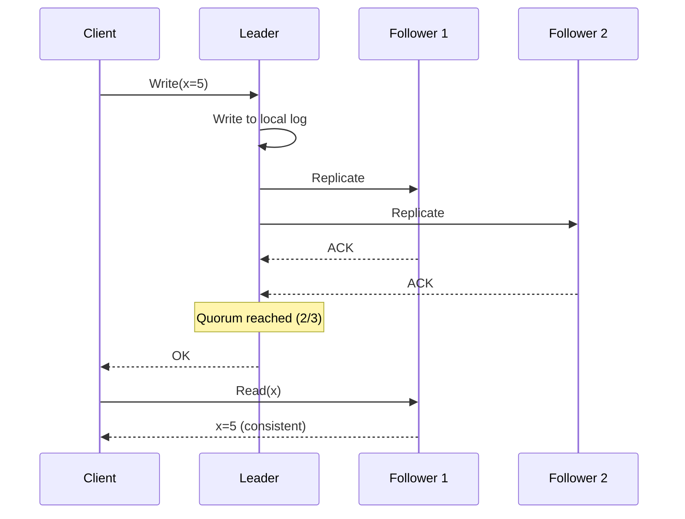

**Mechanisms:**

| Mechanism | How It Works | Used By |
|-----------|-------------|---------|
| **Quorum reads/writes** | W + R > N guarantees overlap | Cassandra, DynamoDB, Riak |
| **Leader-based replication** | All writes go to leader; reads from leader or synced followers | PostgreSQL, MySQL, Kafka |
| **Two-phase commit (2PC)** | Coordinator locks all participants before commit | Distributed transactions (rare — slow) |
| **Paxos / Raft consensus** | Nodes agree on log order | etcd, ZooKeeper, CockroachDB |
| **TrueTime (GPS clocks)** | Globally synchronized clocks bound uncertainty | Google Spanner |

**Quorum math (memorize this):**

```
N = total replicas
W = write quorum (nodes that must ACK write)
R = read quorum (nodes consulted for read)

Strong consistency requires: W + R > N

Example: N=3, W=2, R=2
  Write ACK from 2 nodes + Read from 2 nodes → at least 1 overlap → latest write seen
```

### 3.6 How Eventual Consistency Is Achieved

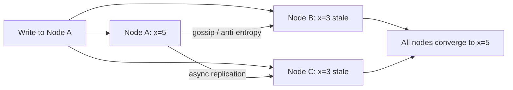

**Mechanisms:**

| Mechanism | Description |
|-----------|-------------|
| **Async replication** | Leader ACKs write before followers confirm |
| **Gossip protocols** | Nodes periodically exchange state (Cassandra) |
| **Anti-entropy repair** | Background job compares and fixes divergent replicas |
| **CRDTs** | Data structures that merge without conflicts (counters, sets) |
| **Last-write-wins (LWW)** | Timestamp determines winner (loses concurrent edits) |
| **Version vectors** | Track causality; detect conflicts for application resolution |

### 3.7 CAP in Real System Design Questions

| System | CAP Choice | Why |
|--------|-----------|-----|
| **Instagram feed** | AP | Stale feed by seconds is acceptable |
| **Instagram like count** | AP | Approximate count OK ("1.2K likes") |
| **Ticketmaster inventory** | CP | Cannot oversell tickets — strong consistency on count |
| **WhatsApp message delivery** | CP for ordering | Messages must not be lost or reordered |
| **WhatsApp online status** | AP | "Last seen" can be stale by minutes |
| **Uber driver location** | AP | Location updates every 3s; stale by 1s is fine |
| **Payment processing** | CP | Double-charge is unacceptable |
| **URL shortener redirect** | AP (with cache) | Stale redirect for 60s after URL change is OK |
| **Distributed lock (etcd)** | CP | Lock must be exclusive — availability sacrificed during partition |

---

## 4. Caching — Deep Dive

### 4.1 What Caching Solves

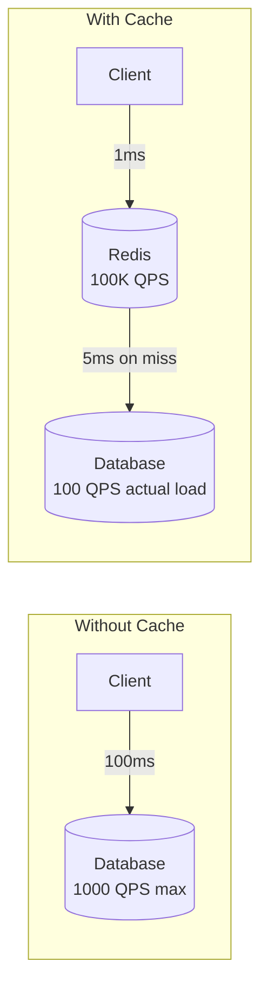

| Problem | How Cache Helps |
|---------|----------------|
| **High read latency** | Memory read: ~1ms vs disk/DB: ~10–100ms |
| **Database overload** | 90%+ cache hit rate → 10× fewer DB queries |
| **Expensive computation** | Cache rendered pages, ML inference results |
| **Traffic spikes** | Cache absorbs burst; protects DB from thundering herd |
| **Geographic latency** | CDN edge cache serves from nearest PoP |

### 4.2 Cache Placement in the Stack

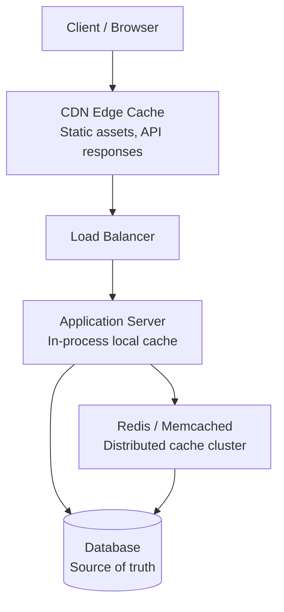

| Cache Layer | Latency | Hit Rate Target | Best For |
|-------------|---------|-----------------|----------|
| **Browser cache** | 0ms | N/A | Static assets with Cache-Control headers |
| **CDN** | 5–20ms | 90%+ | Images, videos, static JS/CSS, cacheable API GETs |
| **In-process (local)** | < 1ms | 80%+ | Hot config, feature flags, read-heavy same-key |
| **Distributed (Redis)** | 1–5ms | 85%+ | User sessions, API responses, computed results |
| **Database buffer pool** | N/A | Automatic | DB's own page cache (InnoDB buffer pool) |

### 4.3 Cache Patterns — How Each Is Implemented

#### Cache-Aside (Lazy Loading) — Most Common

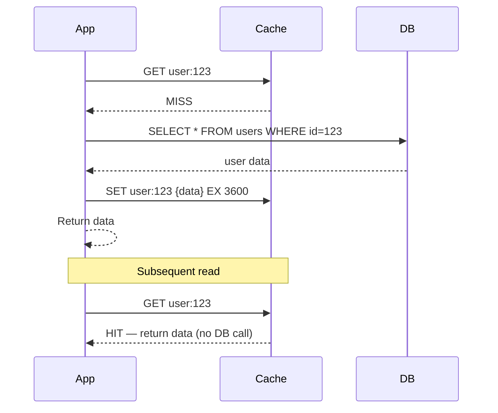

```python
def get_user(user_id: str) -> User:
    cache_key = f"user:{user_id}"
    cached = redis.get(cache_key)
    if cached:
        return User.from_json(cached)          # Cache HIT

    user = db.query("SELECT * FROM users WHERE id = %s", user_id)  # Cache MISS
    if user:
        redis.setex(cache_key, 3600, user.to_json())  # Populate cache, TTL 1hr
    return user
```

| Pros | Cons |
|------|------|
| Simple; cache only what's read | Cache miss penalty (2 round trips) |
| Cache failure doesn't break app | Stale data until TTL expires |
| App controls what's cached | Thundering herd on mass expiry |

**Use when:** General-purpose read-heavy workloads (user profiles, product catalog, config).

---

#### Read-Through Cache

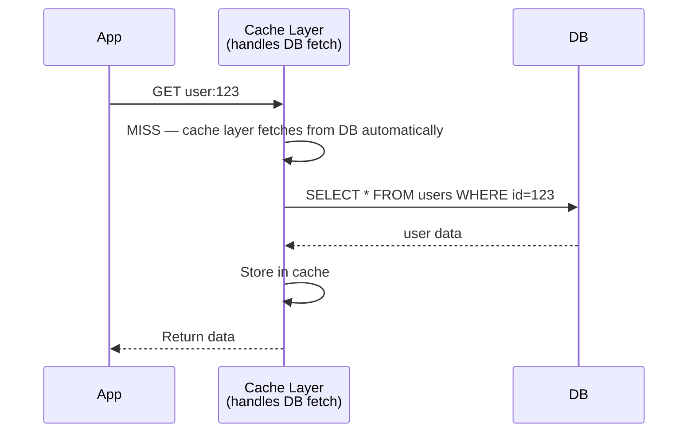

**Difference from cache-aside:** The cache library/service fetches from DB on miss — app only talks to cache.

**Use when:** You want a clean abstraction; using a cache product with read-through support (Google Cloud CDN, some ORM plugins).

---

#### Write-Through Cache

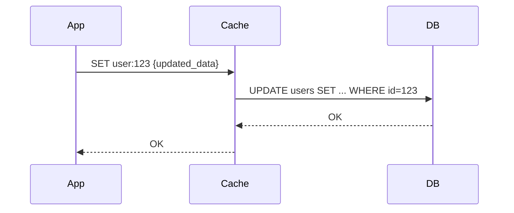

**Both cache and DB updated synchronously on every write.**

| Pros | Cons |
|------|------|
| Cache always consistent with DB | Write latency increased (2 writes) |
| No stale reads after write | Wasted cache space for rarely-read data |

**Use when:** Data must be immediately consistent after write AND is read frequently (session data, shopping cart).

---

#### Write-Behind (Write-Back) Cache

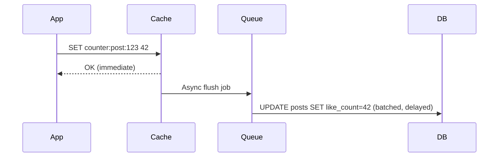

**Write to cache immediately; flush to DB asynchronously in batches.**

| Pros | Cons |
|------|------|
| Lowest write latency | Data loss risk if cache crashes before flush |
| Batches DB writes (efficient) | Complexity — ordering, retries, idempotency |

**Use when:** Write-heavy counters (view counts, like counts), analytics buffers, IoT telemetry aggregation.

---

#### Cache Invalidation (The Hard Part)

> *"There are only two hard things in Computer Science: cache invalidation and naming things."* — Phil Karlton

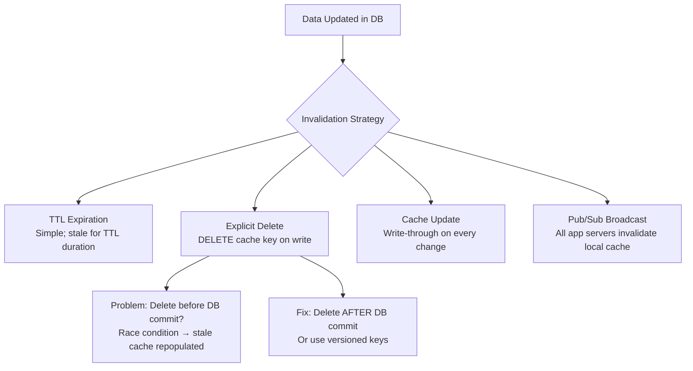

**Strategies compared:**

| Strategy | Staleness Window | Complexity | Best For |
|----------|-----------------|------------|----------|
| **TTL only** | Up to TTL duration | Low | Like counts, analytics, CDN |
| **Delete on write** | Near-zero | Medium | User profiles, product prices |
| **Write-through** | Zero | Medium | Session data, auth tokens |
| **Versioned keys** | Zero | High | `user:123:v5` — old versions naturally expire |
| **Pub/Sub invalidation** | Near-zero | High | Multi-layer cache (local + Redis) |

```python
# Delete-on-write with post-commit invalidation
def update_user(user_id: str, data: dict):
    db.update("UPDATE users SET ... WHERE id = %s", user_id, data)
    db.commit()                                    # Commit FIRST
    redis.delete(f"user:{user_id}")              # Then invalidate cache
```

### 4.4 Cache Eviction Policies

When cache is full, which keys to remove?

| Policy | How | Best For |
|--------|-----|----------|
| **LRU** (Least Recently Used) | Evict key accessed longest ago | General purpose (Redis default) |
| **LFU** (Least Frequently Used) | Evict key with fewest accesses | Hot key retention (Redis 4.0+) |
| **FIFO** (First In First Out) | Evict oldest inserted key | Streaming data, logs |
| **TTL-based** | Evict expired keys first | Time-sensitive data |
| **Random** | Evict random key | Simple; surprisingly effective |

### 4.5 Cache Problems & Solutions

#### Thundering Herd (Cache Stampede)

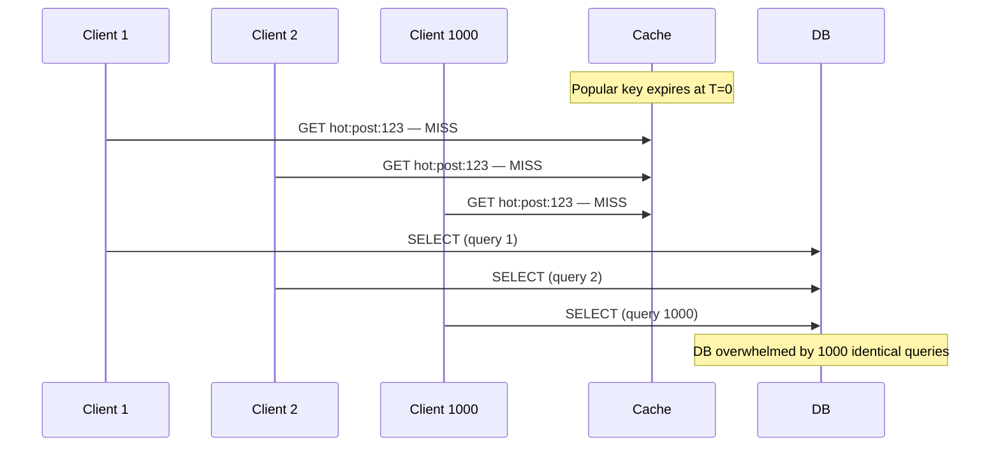

**Solutions:**

| Solution | How |
|----------|-----|
| **Request coalescing (mutex)** | Only one thread fetches on miss; others wait | `SET lock:key NX EX 5` in Redis |
| **Probabilistic early expiration** | Refresh cache before TTL expires (random jitter) | Jitter TTL by ±10% |
| **Never expire hot keys** | Background refresh before expiry | Cron job refreshes top 1000 keys |
| **Stale-while-revalidate** | Serve stale data while refreshing async | CDN pattern; `Cache-Control: stale-while-revalidate=60` |
| **Circuit breaker on DB** | After N misses, serve stale or default | Prevents DB death spiral |

```python
# Request coalescing with Redis lock
def get_with_lock(key: str) -> str:
    value = redis.get(key)
    if value:
        return value

    if redis.set(f"lock:{key}", "1", nx=True, ex=5):   # Acquire lock
        try:
            value = db.fetch(key)                        # Only ONE thread fetches
            redis.setex(key, 3600, value)
        finally:
            redis.delete(f"lock:{key}")
    else:
        time.sleep(0.05)                                   # Wait for lock holder
        return redis.get(key)                              # Retry cache
    return value
```

#### Hot Key Problem

A single key (celebrity profile, viral post) overwhelms one Redis node.

**Solutions:**
- **Local in-process cache** in front of Redis (60s TTL) — 1000 app servers each cache locally
- **Replicate hot key** across multiple Redis nodes with random read selection
- **Split key**: `hot:post:123` → `hot:post:123:shard_{0..9}` with same value

### 4.6 When to Use Caching — Decision Guide

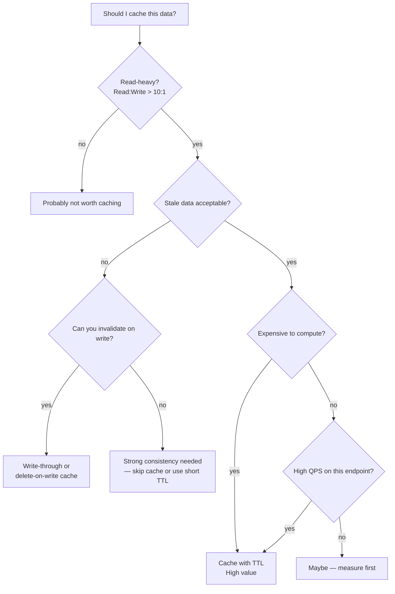

| Data Type | Cache? | Pattern | TTL |
|-----------|--------|---------|-----|
| User session | Yes | Write-through | Session duration |
| User profile | Yes | Cache-aside + invalidate on write | 1 hour |
| Product catalog | Yes | Cache-aside | 15 min |
| Like/view count | Yes | Write-behind | 60 sec |
| Bank balance | No | Strong consistency from DB | — |
| Search results | Yes | Cache-aside | 5 min |
| Real-time stock price | No | Too stale-sensitive | — |
| Config/feature flags | Yes | Local in-process | 30 sec |
| Generated HTML page | Yes | CDN | 5 min |

---

## 5. Load Balancing — Deep Dive

### 5.1 What Load Balancing Solves

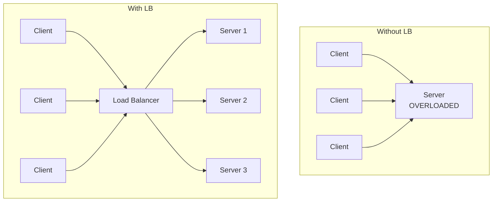

| Problem | How LB Helps |
|---------|-------------|
| **Single server overload** | Distributes traffic across pool |
| **Single point of failure** | Health checks remove dead servers |
| **Horizontal scaling** | Add servers without client reconfiguration |
| **SSL termination** | LB handles TLS; backends use plain HTTP |
| **Geographic routing** | Route to nearest data center |

### 5.2 Load Balancer Layers

```mermaid
graph TB
    Client[Client]
    
    subgraph Layer 7 — Application LB
        L7[NGINX / HAProxy / AWS ALB<br/>HTTP-aware: path, header, cookie routing]
    end
    
    subgraph Layer 4 — Transport LB
        L4[AWS NLB / IPVS<br/>TCP/UDP: IP + port routing]
    end
    
    subgraph Layer 3 — Network LB
        L3[BGP Anycast / DNS<br/>Route to nearest PoP]
    end

    Client --> L3
    L3 --> L7
    L7 --> L4
    L4 --> S1[Server 1]
    L4 --> S2[Server 2]
```

| Layer | OSI | Routes By | Examples | Use When |
|-------|-----|-----------|----------|----------|
| **L3** | Network | IP address | DNS round-robin, BGP anycast | Global traffic steering |
| **L4** | Transport | IP + port (TCP/UDP) | AWS NLB, IPVS, HAProxy (TCP mode) | WebSocket, gaming, ultra-low latency |
| **L7** | Application | HTTP path, headers, cookies | NGINX, AWS ALB, Envoy | REST APIs, microservices routing |

### 5.3 Load Balancing Algorithms

```mermaid
graph TB
    ALGO[Load Balancing Algorithm]

    ALGO --> RR[Round Robin<br/>Rotate through servers sequentially]
    ALGO --> WRR[Weighted Round Robin<br/>More traffic to powerful servers]
    ALGO --> LC[Least Connections<br/>Send to server with fewest active connections]
    ALGO --> WLC[Weighted Least Connections]
    ALGO --> LR[Least Response Time<br/>Send to fastest-responding server]
    ALGO --> IPH[IP Hash / Consistent Hash<br/>Same client → same server]
    ALGO --> RAND[Random<br/>Simple; surprisingly effective at scale]
```

| Algorithm | How It Works | Best For | Avoid When |
|-----------|-------------|----------|------------|
| **Round Robin** | Request 1→S1, 2→S2, 3→S3, 4→S1... | Homogeneous servers, stateless | Servers have different capacity |
| **Weighted Round Robin** | S1 gets 3 requests per S2's 1 | Mixed server sizes | — |
| **Least Connections** | Route to server with fewest open connections | Long-lived connections (WebSocket, DB pool) | Very short requests (adds overhead) |
| **Least Response Time** | Route to server with lowest p99 latency | Heterogeneous server performance | Needs latency monitoring overhead |
| **IP Hash (Sticky)** | `hash(client_ip) % N` → same server | Stateful sessions (legacy) | Server failure loses session |
| **Consistent Hash** | Minimal remapping when servers added/removed | Cache servers, WebSocket gateways | — |
| **Random** | Random server selection | Large server pools (law of large numbers) | Small pools (uneven distribution) |

### 5.4 Health Checks — How They Work

```mermaid
sequenceDiagram
    participant LB as Load Balancer
    participant S1 as Server 1 (healthy)
    participant S2 as Server 2 (crashed)
    participant S3 as Server 3 (healthy)

    loop Every 5 seconds
        LB->>S1: GET /health → 200 OK
        LB->>S2: GET /health → timeout (no response)
        LB->>S3: GET /health → 200 OK
    end

    Note over LB: Remove S2 from pool
    Note over LB: Route traffic only to S1, S3

    S2->>S2: Server restarts
    LB->>S2: GET /health → 200 OK
    Note over LB: Re-add S2 to pool
```

**Health check types:**

| Type | Checks | Detects |
|------|--------|---------|
| **HTTP check** | `GET /health` returns 200 | App crash, hung process |
| **TCP check** | Port accepts connection | Process listening |
| **Deep check** | `/health` verifies DB + cache connectivity | Partial failure (DB down) |
| **Passive check** | Monitor error rate from real traffic | Slow degradation |

**Best practice for `/health` endpoint:**

```python
@app.get("/health")
def health():
    checks = {
        "db": db.ping(),           # Can we reach PostgreSQL?
        "redis": redis.ping(),     # Can we reach Redis?
        "disk": shutil.disk_usage("/").free > 1_000_000_000  # >1GB free
    }
    if all(checks.values()):
        return {"status": "healthy", "checks": checks}, 200
    return {"status": "unhealthy", "checks": checks}, 503
```

### 5.5 Sticky Sessions (Session Affinity)

```mermaid
graph LR
    U1[User A] --> LB[Load Balancer<br/>cookie: server=S1]
    U1 --> S1[Server 1<br/>session stored in memory]
    U2[User B] --> LB
    LB --> S2[Server 2]

    S1 -.->|Server 1 crashes| X[Session LOST]
```

| Approach | How | Pros | Cons |
|----------|-----|------|------|
| **Cookie-based sticky** | LB sets `SERVERID=S1` cookie | Simple | Server death = session lost |
| **IP hash** | Same IP → same server | No cookie needed | Mobile users change IP; uneven distribution |
| **External session store** | Session in Redis; any server | True statelessness | Extra Redis dependency (preferred) |

**Interview answer:** "I'd avoid sticky sessions. Store session in Redis so any server can handle any request. Sticky sessions create hot spots and fail on server death."

### 5.6 Load Balancer Placement in Architecture

```mermaid
flowchart TB
    Client[Clients]
    DNS[DNS / GeoDNS<br/>Route to nearest region]
    GSLB[Global Load Balancer<br/>Cross-region failover]

    subgraph Region US-East
        ALB[Application LB<br/>L7 — path routing]
        WAF[WAF / DDoS Protection]
        NGINX[NGINX / Envoy<br/>L7 — per-service routing]
        API1[API Server 1]
        API2[API Server 2]
        NLB[Network LB<br/>L4 — internal TCP]
        DB[(Database)]
    end

    Client --> DNS
    DNS --> GSLB
    GSLB --> WAF
    WAF --> ALB
    ALB --> NGINX
    NGINX --> API1
    NGINX --> API2
    API1 --> NLB
    API2 --> NLB
    NLB --> DB
```

| Placement | Component | Purpose |
|-----------|-----------|---------|
| **Edge** | Cloudflare, AWS CloudFront | DDoS protection, CDN, SSL |
| **Global** | AWS Global Accelerator, DNS | Cross-region routing, failover |
| **Regional external** | AWS ALB, NGINX | Route to app servers |
| **Internal / service mesh** | Kubernetes kube-proxy, Istio, Envoy | Service-to-service routing |
| **Database** | ProxySQL, PgBouncer | Connection pooling + read replica routing |

### 5.7 When to Use What — Load Balancing Decision Guide

| Scenario | Algorithm | Layer | Notes |
|----------|-----------|-------|-------|
| Stateless REST API | Round Robin or Least Connections | L7 ALB | Default choice |
| WebSocket / long polling | Least Connections + Sticky | L4 or L7 | Or consistent hash by user ID |
| Microservices internal | Round Robin | L7 (service mesh) | Kubernetes kube-proxy |
| Global user base | GeoDNS + regional ALB | L3 + L7 | Route to nearest region |
| Cache cluster routing | Consistent Hash | L4/L7 | Same key → same cache node |
| Database read replicas | Weighted (primary gets writes only) | L4 ProxySQL | Read/write split |
| File upload (large payloads) | Least Connections | L4 NLB | Avoid buffering large bodies at L7 |

---

## 6. Database Sharding — Deep Dive

### 6.1 What Sharding Solves

```mermaid
graph TB
    subgraph Single Database — Bottleneck
        APP1[App] --> DB1[(Single PostgreSQL<br/>Max ~10K QPS<br/>Max ~1TB practical)]
    end

    subgraph Sharded — Scales Horizontally
        APP2[App] --> ROUTER[Shard Router<br/>hash user_id % 4]
        ROUTER --> SH0[(Shard 0<br/>Users 0–25M)]
        ROUTER --> SH1[(Shard 1<br/>Users 25–50M)]
        ROUTER --> SH2[(Shard 2<br/>Users 50–75M)]
        ROUTER --> SH3[(Shard 3<br/>Users 75–100M)]
    end
```

| Problem | How Sharding Helps |
|---------|-------------------|
| **Write throughput ceiling** | Each shard handles subset of writes |
| **Storage size limit** | Data partitioned across machines |
| **Memory limit** | Working set split across nodes |
| **Backup/recovery time** | Smaller shards = faster backup |

**When NOT to shard (interviewers test this):**
- Database is < 1TB and < 5K write QPS → read replicas + caching first
- You have complex cross-shard joins → sharding adds massive complexity
- Team lacks operational experience → managed sharding (Vitess, Citus) or avoid

### 6.2 Sharding Strategies — How Each Works

#### Hash-Based Sharding (Most Common)

```mermaid
graph LR
    REQ[Request: user_id=123456789] --> HASH[hash fn<br/>123456789 % 4 = 1]
    HASH --> SH1[(Shard 1)]
```

```python
def get_shard(user_id: int, num_shards: int = 4) -> int:
    return user_id % num_shards   # Simple modulo

# Better: consistent hashing (minimal remapping on shard add/remove)
def get_shard_consistent(user_id: str, ring: ConsistentHashRing) -> str:
    return ring.get_node(hash(user_id))
```

| Pros | Cons |
|------|------|
| Even data distribution | Resharding is painful (modulo changes → most keys move) |
| Simple routing logic | Range queries span all shards |
| O(1) lookup | Hot shard if popular user IDs cluster |

**Use when:** User-scoped data (profiles, messages, orders) where access is always by user ID.

---

#### Range-Based Sharding

```mermaid
graph LR
    REQ[Request: user_id=123456789] --> RANGE{Range lookup}
    RANGE -->|0–25M| SH0[(Shard 0)]
    RANGE -->|25M–50M| SH1[(Shard 1)]
    RANGE -->|50M–75M| SH2[(Shard 2)]
    RANGE -->|75M–100M| SH3[(Shard 3)]
```

| Pros | Cons |
|------|------|
| Range queries on shard key are efficient | Hot spots (new users all go to latest shard) |
| Easy to add new range shard | Uneven distribution without careful planning |
| Supports ORDER BY on shard key | Rebalancing when ranges skew |

**Use when:** Time-series data (logs by date), alphabetical (A–M, N–Z), geographic (US-East, US-West).

---

#### Directory-Based Sharding

```mermaid
graph LR
    REQ[Request: user_id=123] --> LOOKUP[Shard Map Service<br/>user 123 → Shard 2]
    LOOKUP --> SH2[(Shard 2)]
```

A lookup service (often in ZooKeeper or a DB table) maps each key to a shard.

| Pros | Cons |
|------|------|
| Flexible — move individual keys between shards | Lookup service is single point of failure / bottleneck |
| No hot spot from hash clustering | Extra hop on every request |
| Easy to rebalance specific hot keys | Must cache lookup table aggressively |

**Use when:** Multi-tenant SaaS (move large tenant to dedicated shard), dynamic rebalancing needs.

---

#### Geographic Sharding

```
Shard US-East:  users with region = "us-east"
Shard EU-West:  users with region = "eu-west"
Shard AP-South: users with region = "ap-south"
```

**Use when:** Data residency requirements (GDPR), latency-sensitive (serve from nearest region).

### 6.3 Sharding Key Selection — Critical Decision

```mermaid
flowchart TD
    START[Choose Sharding Key] --> Q1{Is access always<br/>by this key?}
    Q1 -->|no| BAD[Bad shard key —<br/>cross-shard queries needed]
    Q1 -->|yes| Q2{Is key high cardinality?}
    Q2 -->|no| HOT[Hot spot risk<br/>e.g., sharding by country]
    Q2 -->|yes| Q3{Is distribution even?}
    Q3 -->|no| SKEW[Data skew<br/>e.g., sharding by created_month]
    Q3 -->|yes| GOOD[Good shard key Yes]

    BAD --> FIX1[Redesign access patterns]
    HOT --> FIX2[Add hash suffix: country_id + hash]
    SKEW --> FIX3[Use hash of key instead of raw value]
```

| System | Good Shard Key | Why | Bad Shard Key |
|--------|---------------|-----|---------------|
| **Instagram** | `user_id` | All queries are user-scoped | `photo_id` (random access) |
| **Uber** | `city_id` or `geohash` | Rides are local | `driver_id` (drivers move cities) |
| **Discord** | `guild_id` | All messages in a guild together | `user_id` (user in 100 guilds) |
| **Twitter DMs** | `conversation_id` | Messages scoped to conversation | `user_id` (cross-user queries) |
| **E-commerce orders** | `user_id` or `order_id` | User order history | `product_id` (hot products) |

### 6.4 Cross-Shard Operations — The Hard Part

```mermaid
graph TB
    subgraph Easy — Single Shard
        Q1[SELECT * FROM messages<br/>WHERE user_id = 123] --> SH1[Shard 1 only]
    end

    subgraph Hard — Cross-Shard
        Q2[SELECT * FROM messages<br/>WHERE created_at > '2026-01-01'<br/>ORDER BY created_at DESC<br/>LIMIT 100]
        Q2 --> SH0[Shard 0]
        Q2 --> SH1b[Shard 1]
        Q2 --> SH2[Shard 2]
        Q2 --> SH3[Shard 3]
        SH0 --> MERGE[Scatter-Gather<br/>Merge + Sort + Limit]
        SH1b --> MERGE
        SH2 --> MERGE
        SH3 --> MERGE
    end
```

| Operation | Cross-Shard? | Solution |
|-----------|-------------|----------|
| **Point read by shard key** | No | Direct routing — O(1) |
| **Range query on shard key** | No (range sharding) | Single shard |
| **Aggregate (COUNT, SUM)** | Yes | Scatter-gather; sum partial results |
| **JOIN across tables** | Yes | Denormalize; duplicate data; or avoid |
| **Global ORDER BY + LIMIT** | Yes | Query all shards; merge-sort; very expensive |
| **Unique constraint** | Yes | Global index service or accept per-shard uniqueness |
| **Transaction (ACID)** | Yes | Distributed transaction (2PC — avoid) or saga pattern |

**Interview answer for cross-shard queries:**
> "I'd redesign the access pattern to avoid cross-shard queries. For a global feed, I'd use a separate feed service (push/pull fan-out) rather than querying all shards. If unavoidable, scatter-gather with a coordinator service and accept higher latency."

### 6.5 Resharding — Adding Shards Without Downtime

```mermaid
flowchart TD
    A[4 shards → need 8 shards] --> B[Phase 1: Dual-write<br/>Write to old AND new shard]
    B --> C[Phase 2: Backfill<br/>Copy historical data to new shards]
    C --> D[Phase 3: Verify<br/>Compare old vs new shard data]
    D --> E[Phase 4: Switch reads<br/>Route reads to new shards]
    E --> F[Phase 5: Stop dual-write<br/>Decommission old mapping]
```

**Consistent hashing advantage:** Adding 1 node to a 100-node ring remaps only ~1% of keys (vs 75% with `hash % 4` → `hash % 5`).

### 6.6 Sharding Implementation Options

| Approach | Description | When to Use |
|----------|-------------|-------------|
| **Application-level sharding** | App code routes queries by shard key | Full control; team has expertise |
| **Proxy-based (Vitess, ProxySQL)** | Middleware routes SQL to shards | MySQL/PostgreSQL; less app changes |
| **Native (MongoDB, Cassandra)** | DB handles sharding internally | Document/wide-column workloads |
| **Managed (Spanner, DynamoDB)** | Cloud provider manages shards | Minimum ops overhead; higher cost |

### 6.7 Sharding vs Other Scaling Techniques

```mermaid
flowchart TD
    START[DB is bottleneck] --> W{Write or Read?}
    W -->|Read| RR[Read Replicas<br/>5 replicas = 5× read capacity]
    W -->|Write| C{Can cache absorb writes?}
    C -->|yes| WB[Write-behind cache<br/>Batch DB writes]
    C -->|no| I{Can you index better?}
    I -->|yes| IDX[Better indexing<br/>Reduce query cost]
    I -->|no| SH[Shard the database<br/>Last resort]
    RR --> ENOUGH{Enough capacity?}
    ENOUGH -->|yes| DONE[Done Yes]
    ENOUGH -->|no| SH
```

---

## 7. Database Indexing — Deep Dive

### 7.1 What Indexing Solves

Without an index, the database performs a **full table scan** — reads every row to find matches.

```mermaid
graph LR
    subgraph Without Index — Full Table Scan
        Q1[SELECT * FROM users<br/>WHERE email = 'alice@x.com'] --> SCAN[Scan 100M rows<br/>~30 seconds]
    end
    subgraph With Index — B-Tree Lookup
        Q2[SELECT * FROM users<br/>WHERE email = 'alice@x.com'] --> BTREE[B-Tree lookup<br/>~3 disk reads<br/>~5ms]
    end
```

| Problem | How Index Helps |
|---------|----------------|
| **Slow WHERE clauses** | O(log n) lookup vs O(n) scan |
| **Slow JOINs** | Index on foreign key speeds join |
| **Slow ORDER BY** | Index pre-sorted; no sort step |
| **Slow GROUP BY** | Index supports ordered grouping |
| **Unique constraints** | Unique index enforces + accelerates |

### 7.2 How B-Tree Index Works (Default in PostgreSQL, MySQL)

```mermaid
graph TB
    ROOT[Root Node<br/>10 | 50 | 90]
    ROOT --> N1[Internal<br/>1 5 8]
    ROOT --> N2[Internal<br/>20 35 45]
    ROOT --> N3[Internal<br/>60 75 85]
    N1 --> L1[Leaf: rows 1,3,5,7]
    N2 --> L2[Leaf: rows 20,22,35,41]
    N3 --> L3[Leaf: rows 60,62,75,88]

    L1 -.->|linked list| L2
    L2 -.->|linked list| L3
```

**Key properties:**
- **Balanced tree** — all leaf nodes at same depth; O(log n) reads
- **Leaf nodes linked** — efficient range scans (`WHERE id BETWEEN 100 AND 200`)
- **Page size** — typically 16KB; one page read from disk per tree level
- **3-level B-Tree** — can index ~16M rows with 16KB pages (16 × 16 × 16K ≈ 4M per level)

**Lookup process for `WHERE user_id = 42`:**

```
1. Read root page from disk     (1 I/O)
2. Follow pointer to internal   (1 I/O)
3. Follow pointer to leaf       (1 I/O)
4. Find row pointer in leaf     (0 I/O — in memory)
Total: ~3 random disk I/Os ≈ 3–15ms (SSD) vs 30s full scan
```

### 7.3 Index Types

| Index Type | Structure | Best For | Avoid For |
|------------|-----------|----------|-----------|
| **B-Tree** (default) | Balanced tree | Range queries, sorting, equality | Very wide columns (large TEXT) |
| **Hash** | Hash table | Exact equality (`=`) only | Range queries, sorting |
| **GIN** (Generalized Inverted) | Inverted index | JSONB, arrays, full-text search | Simple scalar columns |
| **GiST** | Generalized Search Tree | Geospatial (PostGIS), ranges | Simple equality |
| **BRIN** (Block Range) | Min/max per block | Time-series (timestamp-ordered data) | Random access patterns |
| **Covering / Index-only scan** | B-Tree includes extra columns | Queries that only need indexed columns | Too many included columns (wide index) |

### 7.4 Composite (Multi-Column) Indexes — Leftmost Prefix Rule

```sql
CREATE INDEX idx_users_country_city_age ON users (country, city, age);
```

```mermaid
graph TB
    IDX[Composite Index: country, city, age]

    IDX --> Q1["Yes WHERE country = 'US'<br/>Uses index"]
    IDX --> Q2["Yes WHERE country = 'US' AND city = 'NYC'<br/>Uses index"]
    IDX --> Q3["Yes WHERE country = 'US' AND city = 'NYC' AND age > 25<br/>Uses index"]
    IDX --> Q4["No WHERE city = 'NYC'<br/>Full scan — skipped country"]
    IDX --> Q5["No WHERE age > 25<br/>Full scan — skipped country, city"]
    IDX --> Q6["Warning: WHERE country = 'US' AND age > 25<br/>Partial — uses country only"]
```

**Leftmost prefix rule:** Index `(A, B, C)` supports queries on `(A)`, `(A, B)`, `(A, B, C)` — but NOT `(B)`, `(C)`, or `(B, C)` alone.

**Column order matters:**
```sql
-- Query: WHERE user_id = 123 AND created_at > '2026-01-01'
-- Good:  INDEX (user_id, created_at)  — equality first, then range
-- Bad:   INDEX (created_at, user_id)  — range first breaks index for user_id
```

**Rule:** Put **equality columns first**, **range columns last** in composite index.

### 7.5 Index Selectivity

```mermaid
graph LR
    HIGH[High Selectivity<br/>email, UUID, order_id<br/>Yes Index very effective]
    LOW[Low Selectivity<br/>gender, status, is_active<br/>No Index often ignored by optimizer]
```

| Column | Cardinality | Index Useful? |
|--------|-------------|--------------|
| `user_id` (UUID) | 100M unique | Yes Excellent |
| `email` | 100M unique | Yes Excellent |
| `order_id` | 500M unique | Yes Excellent |
| `country` | ~200 values | Warning: OK as first column in composite |
| `status` (active/inactive) | 2 values | No Optimizer prefers full scan |
| `is_deleted` (true/false) | 2 values | No Partial index instead |

**Partial index for low-selectivity columns:**

```sql
-- Instead of indexing all rows, index only active users
CREATE INDEX idx_users_active_email ON users (email)
    WHERE is_deleted = false;

-- 90% of queries filter is_deleted = false → index is 10× smaller and faster
```

### 7.6 Index Trade-offs — What Interviewers Expect

| Benefit | Cost |
|---------|------|
| Reads 10–1000× faster | Writes 2–3× slower (update index on every INSERT/UPDATE/DELETE) |
| Faster JOINs and sorts | Storage overhead (index can be 50–100% of table size) |
| Enforces UNIQUE constraints | More indexes = more memory consumed (buffer pool) |
| Covering index avoids table lookup | Index maintenance on bulk loads |

```mermaid
graph LR
    subgraph Write Path with Index
        INSERT[INSERT INTO users] --> TABLE[Update Table]
        INSERT --> INDEX1[Update Index 1<br/>email]
        INSERT --> INDEX2[Update Index 2<br/>country, city]
        INSERT --> INDEX3[Update Index 3<br/>created_at]
    end
```

**Rule of thumb:** Index columns used in `WHERE`, `JOIN`, `ORDER BY` on read-heavy tables. Avoid indexing write-heavy tables with many indexes.

### 7.7 Common Index Patterns

#### Covering Index (Index-Only Scan)

```sql
-- Query: SELECT user_id, email FROM users WHERE country = 'US'
CREATE INDEX idx_users_country_covering ON users (country) INCLUDE (user_id, email);
-- PostgreSQL reads ONLY the index — never touches the table heap
```

#### Index for Sort + Limit

```sql
-- Query: SELECT * FROM posts WHERE user_id = 123 ORDER BY created_at DESC LIMIT 20
CREATE INDEX idx_posts_user_created ON posts (user_id, created_at DESC);
-- Index is pre-sorted; DB reads first 20 entries — no sort step
```

#### Full-Text Search Index

```sql
CREATE INDEX idx_posts_fts ON posts USING GIN (to_tsvector('english', title || ' ' || body));
-- Query: SELECT * FROM posts WHERE to_tsvector('english', title || ' ' || body) @@ to_tsquery('database & indexing')
```

#### Geospatial Index

```sql
CREATE INDEX idx_locations_geo ON locations USING GIST (coordinates);
-- Query: SELECT * FROM locations WHERE ST_DWithin(coordinates, ST_Point(-73.9, 40.7), 1000)
-- Finds all locations within 1km of a point
```

### 7.8 EXPLAIN — How to Analyze Index Usage

```sql
EXPLAIN ANALYZE
SELECT * FROM users WHERE email = 'alice@example.com';

-- Good — Index Scan:
-- Index Scan using idx_users_email on users  (cost=0.42..8.44 rows=1 width=100) (actual time=0.025..0.026 rows=1 loops=1)
--   Index Cond: (email = 'alice@example.com')
-- Planning Time: 0.1 ms | Execution Time: 0.05 ms

-- Bad — Sequential Scan:
-- Seq Scan on users  (cost=0.00..18334.00 rows=1 width=100) (actual time=245.123..245.125 rows=1 loops=1)
--   Filter: (email = 'alice@example.com')
--   Rows Removed by Filter: 100000000
-- Planning Time: 0.1 ms | Execution Time: 245.13 ms
```

| EXPLAIN Term | Meaning |
|-------------|---------|
| **Seq Scan** | Full table scan — BAD for large tables |
| **Index Scan** | B-Tree lookup + fetch row from heap — GOOD |
| **Index Only Scan** | Read from index without touching table — BEST |
| **Bitmap Index Scan** | Multiple index conditions combined — OK for medium selectivity |
| **Nested Loop** | For each row in A, scan B — OK for small sets |
| **Hash Join** | Build hash table from smaller relation — GOOD for large JOINs |
| **Sort** | Explicit sort step — add index to eliminate |

### 7.9 When to Use What — Indexing Decision Guide

```mermaid
flowchart TD
    START[Slow query] --> Q1{Large table?<br/>>100K rows}
    Q1 -->|no| MEM[Full scan is fine<br/>Keep it simple]
    Q1 -->|yes| Q2{Which columns in WHERE/JOIN/ORDER BY?}
    Q2 --> SINGLE[Single column filter]
    Q2 --> MULTI[Multiple column filter]
    Q2 --> TEXT[Text search]
    Q2 --> GEO[Location query]

    SINGLE --> SEL{High selectivity?}
    SEL -->|yes| BTREE[B-Tree index Yes]
    SEL -->|no| PARTIAL[Partial index<br/>or skip]

    MULTI --> COMP[Composite index<br/>equality cols first]
    TEXT --> GIN[GIN full-text index]
    GEO --> GIST[GiST geospatial index]
```

| Query Pattern | Index Type | Example |
|--------------|-----------|---------|
| `WHERE id = ?` | B-Tree (PK) | Primary key — automatic |
| `WHERE email = ?` | B-Tree UNIQUE | Login lookup |
| `WHERE user_id = ? ORDER BY created_at DESC` | Composite B-Tree | Feed queries |
| `WHERE status = 'active' AND country = 'US'` | Composite (country, status) | Country first (higher selectivity) |
| `WHERE created_at > ?` | BRIN or B-Tree | Time-series range |
| `WHERE search_vector @@ query` | GIN | Full-text search |
| `WHERE ST_DWithin(geo, point, r)` | GiST | Nearby locations |
| `WHERE metadata @> '{"key": "val"}'` | GIN | JSONB queries |

---

## 8. How They Work Together

Real systems combine all five techniques. Here is how they layer in a typical high-traffic application:

```mermaid
graph TB
    Client[100K RPS Clients]
    CDN[CDN<br/>Cache static + cacheable API<br/>Absorbs 60% traffic]
    LB[Load Balancer<br/>Round Robin<br/>Distributes across 20 servers]
    
    subgraph App Tier — 20 servers
        APP[Application Server]
        LC[Local In-Process Cache<br/>Hot keys, config]
    end

    Redis[Redis Cluster<br/>Distributed Cache<br/>Sessions, API responses<br/>90% DB read reduction]
    
    subgraph DB Tier
        PGW[PgBouncer<br/>Connection pool + LB]
        PRIMARY[(Primary DB<br/>Writes)]
        REPLICA1[(Read Replica 1)]
        REPLICA2[(Read Replica 2)]
    end

    subgraph Sharded Tier — when replicas insufficient
        SH0[(Shard 0)]
        SH1[(Shard 1)]
        SH2[(Shard 2)]
    end

    Client --> CDN
    CDN --> LB
    LB --> APP
    APP --> LC
    APP --> Redis
    APP --> PGW
    Redis -.->|cache miss| PGW
    PGW --> PRIMARY
    PGW --> REPLICA1
    PGW --> REPLICA2
    PRIMARY -.->|async replication| REPLICA1
    PRIMARY -.->|async replication| REPLICA2
    PRIMARY -.->|when write scale exceeded| SH0
```

### Instagram Feed Example — All Concepts Applied

| Layer | Technique | Purpose |
|-------|-----------|---------|
| **CDN** | Cache media files | Photos/videos served from edge — 95% cache hit |
| **Load Balancer** | Least connections | Distribute API requests across app servers |
| **Redis** | Cache-aside | Cache user profile, recent feed pages (TTL 60s) |
| **PostgreSQL** | Index on `(user_id, created_at DESC)` | Fast feed query per user |
| **Cassandra** | Sharded by `user_id` | Store posts — AP, write-heavy, user-scoped access |
| **CAP choice** | AP for feed (stale OK); CP for follow graph | Different consistency per data type |

### Read Path Latency Budget

```
Total p99 target: 200ms

CDN cache HIT:           5ms   (60% of requests)
Redis cache HIT:         8ms   (30% of requests)
DB read replica + index: 50ms  (9% of requests)
DB primary (write path): 100ms (1% of requests)
```

---

## 9. Decision Framework — When to Use What

### 9.1 Master Decision Tree

```mermaid
flowchart TD
    START[System is slow / needs scale] --> METRIC{What's the symptom?}

    METRIC -->|High read latency| CACHE[Add caching layer]
    METRIC -->|High write latency| INDEX[Check indexes first]
    METRIC -->|DB CPU high| CACHE2[Cache + read replicas]
    METRIC -->|DB storage full| SHARD[Shard or archive old data]
    METRIC -->|App server CPU high| LB[Load balance + scale out]
    METRIC -->|Single server limit| SCALE[Horizontal scale out]
    METRIC -->|Data inconsistency| CAP[Revisit CAP choice + consistency model]

    CACHE --> CACHE_Q{Stale data OK?}
    CACHE_Q -->|yes| CACHE_TTL[Cache-aside + TTL]
    CACHE_Q -->|no| CACHE_INV[Write-through + invalidate]

    INDEX --> INDEX_Q{Full table scan?}
    INDEX_Q -->|yes| ADD_IDX[Add B-Tree / composite index]
    INDEX_Q -->|no| SHARD2[Consider sharding]

    SHARD --> SHARD_Q{Cross-shard queries needed?}
    SHARD_Q -->|yes| REDESIGN[Redesign data model first]
    SHARD_Q -->|no| SHARD_OK[Hash shard by access key]
```

### 9.2 Technique Selection Matrix

| Symptom | First Try | Second Try | Last Resort |
|---------|-----------|------------|-------------|
| Slow reads | Index | Cache (Redis) | Read replicas |
| Slow writes | Index optimization | Write-behind cache | Sharding |
| High traffic | Load balancer + scale out | CDN | Multi-region |
| Large data | Archive old data | Sharding | Cold storage (S3) |
| Hot key | Local in-process cache | Key replication | Split key |
| DB single point of failure | Read replicas + failover | Multi-AZ primary | Multi-region |
| Inconsistent data | Fix consistency model | Strong consistency (CP) | Saga pattern |
| Full table scan | Add index | Partition table | Materialized view |

### 9.3 Consistency vs Technique

| Technique | Consistency Impact | Mitigation |
|-----------|-------------------|------------|
| **Cache-aside + TTL** | Stale for TTL duration | Short TTL; invalidate on write |
| **Read replica** | Replication lag (~100ms) | Read from primary for critical reads |
| **Write-behind cache** | Loss risk before flush | Durability via WAL; fsync |
| **Async sharding replication** | Cross-shard inconsistency | Design around single-shard transactions |
| **CDN cache** | Stale for Cache-Control duration | Short max-age; purge API |
| **Load balancer failover** | In-flight requests dropped | Graceful drain; connection retry |

---

## 10. Interview Scenarios & Sample Answers

### Scenario 1: "Your API is slow. How do you diagnose and fix it?"

> **Structured answer interviewers love:**
>
> 1. **Measure first** — Check p50/p99 latency, error rate, CPU, DB query time (don't guess)
> 2. **Find the bottleneck** — Is it app CPU, DB, network, or external service?
> 3. **Check DB** — Run EXPLAIN on slow queries; look for Seq Scans on large tables
> 4. **Fix in order:**
>    - Add missing index (cheapest, highest impact)
>    - Add Redis cache for read-heavy endpoints (90%+ hit rate target)
>    - Add read replicas if DB CPU still high
>    - Scale app servers behind load balancer if app CPU is bottleneck
>    - Shard only if write QPS exceeds single primary capacity

---

### Scenario 2: "Design caching for a social media feed"

> "The feed is read-heavy — 1000:1 read-to-write ratio — and stale by 30–60 seconds is acceptable (AP).
>
> I'd use **cache-aside** with Redis:
> - Key: `feed:{user_id}:page:{page_num}`
> - TTL: 60 seconds
> - On cache miss: query DB (indexed on `user_id, created_at DESC`), populate cache
> - On new post: don't invalidate entire feed — let TTL expire naturally (fan-out on write is expensive)
> - For celebrity users (hot keys): local in-process cache in front of Redis
> - Thundering herd: request coalescing with Redis lock on miss"

---

### Scenario 3: "When would you shard vs use read replicas?"

> "Read replicas when:
> - Read:write ratio > 10:1
> - All data fits on one machine (< 1–2 TB)
> - Writes are under ~5K QPS on PostgreSQL
>
> Sharding when:
> - Write QPS exceeds single primary (typically > 5–10K sustained writes/sec)
> - Storage exceeds single node capacity
> - All access is keyed by shard key (user_id, tenant_id) — no cross-shard joins
>
> I'd always try read replicas + caching before sharding — sharding is operationally expensive."

---

### Scenario 4: "Explain CAP for a payment system vs a social feed"

> "**Payment system — CP:**
> - Cannot accept a write during partition if it risks double-charge
> - Strong consistency on account balance
> - PostgreSQL with synchronous replication; reject writes if quorum unavailable
> - Latency: 50–100ms acceptable for payments
>
> **Social feed — AP:**
> - Stale feed by 30s is fine; user won't notice
> - Availability more important — show cached feed even if DB partition
> - Cassandra or Redis + async DB; eventual consistency
> - Latency: < 200ms p99; strong consistency not worth the cost"

---

## 11. Failure Modes Across All Layers

| Layer | Failure | Impact | Mitigation |
|-------|---------|--------|------------|
| **Cache** | Redis node down | Cache miss storm hits DB | Circuit breaker; fallback to DB with rate limit; Redis Sentinel failover |
| **Cache** | Hot key overload | Single Redis node CPU 100% | Local cache; key splitting |
| **Cache** | Cache stampede | DB overwhelmed on mass TTL expiry | Request coalescing; jitter TTL |
| **Load Balancer** | LB itself fails | All traffic dropped | Multi-LB with DNS failover; anycast |
| **Load Balancer** | Server marked healthy but broken | Requests fail | Deep health checks; passive monitoring |
| **Load Balancer** | Sticky session server dies | Session lost | External session store (Redis) |
| **Sharding** | Hot shard | One shard overloaded | Split hot shard; directory-based rebalancing |
| **Sharding** | Cross-shard query | Latency spike | Redesign; denormalize; avoid |
| **Sharding** | Resharding in progress | Dual-write inconsistency | Feature flag; verify before cutover |
| **Indexing** | Missing index | Full table scan; DB CPU 100% | EXPLAIN monitoring; slow query log |
| **Indexing** | Too many indexes | Write latency 3× | Audit indexes; drop unused |
| **CAP** | Network partition | CP rejects writes / AP serves stale | Design for chosen trade-off explicitly |

---

## 12. Trade-offs Master Table

| Technique | Throughput Gain | Latency Impact | Consistency | Complexity | Cost |
|-----------|----------------|---------------|-------------|------------|------|
| **Vertical scaling** | 2–4× | Same | Unchanged | Low | High ($) |
| **Horizontal scaling** | Linear | Same | Unchanged | Medium | Linear |
| **Caching (Redis)** | 10–100× reads | −90% on hit | Eventual | Medium | Medium |
| **CDN** | 100× static | −95% on hit | Eventual | Low | Medium |
| **Read replicas** | 5–10× reads | +10ms (replication lag) | Eventual | Medium | Medium |
| **Load balancing** | Linear | +1ms overhead | Unchanged | Low | Low |
| **B-Tree index** | 10–1000× reads | −99% on hit | Unchanged | Low | Storage overhead |
| **Hash sharding** | Linear writes | +1ms routing | Per-shard | High | Linear |
| **Strong consistency** | −50% throughput | +50–200ms | Strong | High | High |
| **Write-behind cache** | 10× writes | −80% write latency | Eventual | High | Low |

---

## 13. Interview Cheat Sheet

### Key Numbers to Memorize

| Metric | Value |
|--------|-------|
| Redis read latency | ~1ms |
| PostgreSQL indexed query | ~1–10ms |
| PostgreSQL full table scan (100M rows) | ~30s |
| CDN cache hit latency | ~5–20ms |
| DB replication lag (async) | ~10–100ms |
| Quorum for N=3 | W=2, R=2 for strong consistency |
| Cache hit rate target | > 90% for meaningful DB relief |
| Read replica scale factor | ~5–10× read capacity |
| Single PostgreSQL write limit | ~5–10K writes/sec |
| B-Tree depth for 100M rows | ~3 levels (3 disk I/Os) |

### One-Liner Definitions (Say These Confidently)

| Term | One-Liner |
|------|-----------|
| **CAP** | During a network partition, choose consistency OR availability — not both |
| **Cache-aside** | App checks cache; on miss, reads DB and populates cache |
| **Write-through** | Write to cache and DB synchronously on every update |
| **Write-behind** | Write to cache immediately; flush to DB asynchronously |
| **Consistent hashing** | Distributes keys across nodes; minimal remapping on node add/remove |
| **Shard key** | Column that determines which DB shard stores the row |
| **B-Tree index** | Balanced tree; O(log n) lookup; supports range queries |
| **Covering index** | Index that contains all columns needed by query — no table access |
| **Read replica** | Copy of primary DB; serves reads only; async replication |
| **Load balancer** | Distributes traffic across servers; health-checks and removes dead nodes |
| **Thundering herd** | Mass cache expiry causes simultaneous DB queries for same key |
| **Hot key** | Single cache key receiving disproportionate traffic |
| **Quorum** | W + R > N guarantees read sees latest write |
| **Eventual consistency** | All replicas converge to same value given enough time |
| **Leftmost prefix** | Composite index (A,B,C) only usable for queries starting with A |

### Must-Mention Points Checklist

- [ ] **Scaling order:** Index → Cache → Read replicas → Load balance → Shard (last)
- [ ] **CAP:** Partition tolerance is mandatory; real choice is CP vs AP
- [ ] **Cache invalidation** is harder than caching — mention strategy explicitly
- [ ] **Thundering herd** — proactively mention even if not asked
- [ ] **Shard key** must match access pattern — no cross-shard joins
- [ ] **Composite index column order** — equality before range
- [ ] **Sticky sessions are bad** — externalize state to Redis
- [ ] **EXPLAIN ANALYZE** — show you know how to diagnose slow queries
- [ ] **Different consistency per data type** — payments CP, likes AP
- [ ] **Resharding is hard** — prefer consistent hashing or directory-based

---

## 14. Follow-Up Questions & Model Answers

**Q1: What happens when a Redis cache node fails?**

> Redis Sentinel or Cluster detects failure in ~5–10 seconds and promotes a replica. During failover, cache misses hit the DB — circuit breaker limits DB load. App degrades gracefully (higher latency, not errors). Once Redis recovers, cache repopulates naturally via cache-aside misses. For critical paths, run Redis in Cluster mode with 3+ masters each with replicas.

---

**Q2: How do you choose between Redis and Memcached?**

> **Redis** if you need: data structures (sorted sets, hashes), persistence, pub/sub, replication, Lua scripts. **Memcached** if you need: pure key-value, multi-threaded (better CPU utilization on single node), simpler operational model. In 2026, Redis is the default choice for most system design interviews unless Memcached's multi-threading advantage is specifically relevant.

---

**Q3: How would you handle a database that needs both strong consistency AND high write throughput?**

> Strong consistency with high writes requires coordination — it's inherently slower. Options: (1) **Partition writes by key** — each shard is strongly consistent internally (CockroachDB, Spanner); (2) **Separate hot path** — Redis with synchronous replication for recent writes, async to DB; (3) **Accept serializable within shard** — shard by user_id, strong consistency per user, eventual across users. True global strong consistency at 100K writes/sec requires Spanner-class infrastructure (TrueTime, custom hardware).

---

**Q4: Explain the difference between horizontal and vertical partitioning.**

> **Vertical partitioning (normalization):** Split columns into separate tables — `users` (profile) + `user_settings` (preferences). Reduces row width; good when columns have different access patterns. **Horizontal partitioning (sharding):** Split rows across machines by key — users 1–25M on shard 0, 25–50M on shard 1. Scales storage and write throughput. In interviews, "partitioning" usually means horizontal (sharding).

---

**Q5: How do you detect and fix a missing index in production?**

> Enable `log_min_duration_statement = 1000` in PostgreSQL (log queries > 1s). Use `pg_stat_statements` to find most expensive queries by total time. Run `EXPLAIN ANALYZE` on top offenders — look for `Seq Scan` on large tables. Add index in production using `CREATE INDEX CONCURRENTLY` (no table lock). Monitor `pg_stat_user_indexes` for unused indexes to drop.

---

**Q6: What is the difference between L4 and L7 load balancing for WebSockets?**

> WebSocket connections are long-lived TCP connections. **L4 (TCP) LB** — routes by IP+port; connection stays on same backend for life; least connections is the right algorithm. **L7 (HTTP) LB** — can inspect HTTP Upgrade header for WebSocket; can route by cookie/path; slightly more overhead but more flexible. For WebSocket at scale (Discord, WhatsApp), use L4 with consistent hash on user ID for gateway affinity.

---

**Q7: How does consistent hashing differ from `hash(key) % N`?**

> `hash(key) % N` — adding one node changes `N`, remapping nearly all keys (massive cache invalidation). **Consistent hashing** — keys and nodes on a virtual ring; adding a node only affects keys on its arc (~1/N of keys). With virtual nodes (150 per physical node), distribution is even. Used in: Redis Cluster, Cassandra, CDNs, load balancers.

---

**Q8: When would you NOT use an index?**

> (1) Small tables (< 10K rows) — full scan is faster than index lookup. (2) Low-selectivity columns (boolean, gender) — optimizer ignores index. (3) Write-heavy tables where read improvement doesn't justify write penalty. (4) Columns that are frequently updated — index maintenance cost. (5) Very wide columns (large TEXT/BLOB) — index size exceeds benefit. Use partial indexes or expression indexes for edge cases.

---

## 15. Common Mistakes That Fail Interviews

| Mistake | Why It Fails | Correct Answer |
|---------|-------------|----------------|
| "Add Redis" without explaining why | Shows buzzword usage | "Read-heavy 100:1 ratio; cache-aside; 60s TTL; stale feed OK" |
| "CAP means pick 2 of 3 freely" | Shows misunderstanding | "P is mandatory; choice is CP vs AP during partition" |
| Jumping to sharding immediately | Over-engineering | "Index + cache + read replicas first; shard when writes exceed 5K/sec" |
| "Use round robin" for all cases | One-size-fits-all | "Least connections for WebSocket; consistent hash for cache cluster" |
| Ignoring cache invalidation | Incomplete design | Always specify: TTL, delete-on-write, or write-through |
| Index on every column | Shows lack of trade-off awareness | "Index WHERE/JOIN/ORDER BY columns; avoid low-selectivity" |
| Sticky sessions as first choice | Shows stateful thinking | "Externalize session to Redis; stateless servers" |
| "Strong consistency everywhere" | Ignores latency cost | "CP for payments; AP for likes, feeds, view counts" |
| Not mentioning thundering herd | Misses production reality | Proactively mention request coalescing on cache miss |
| Composite index wrong column order | Practical SQL gap | "Equality columns first, range column last: (user_id, created_at)" |
| Ignoring replication lag | Data correctness gap | "Read from primary for read-your-writes; replica for analytics" |
| "Shard by auto-increment ID" | Causes hot spot on latest shard | "Shard by user_id hash — even distribution" |

---

## Quick Reference Card

```mermaid
%%{init: {'theme': 'base', 'themeVariables': {'primaryColor': '#D2691E', 'primaryTextColor': '#ffffff', 'primaryBorderColor': '#5D2E0C', 'secondaryColor': '#D2691E', 'tertiaryColor': '#D2691E', 'lineColor': '#5D2E0C'}}}%%
mindmap
  root((System Design<br/>Fundamentals))
    Scaling
      Vertical — bigger machine
      Horizontal — more machines
      Stateless — scale freely
      Index → Cache → Replicas → Shard
    CAP
      C — latest write always
      A — always respond
      P — works during partition
      CP — ZooKeeper, etcd
      AP — Cassandra, DynamoDB
    Caching
      Cache-aside — lazy load
      Write-through — sync write
      Write-behind — async batch
      Invalidate — TTL or delete
    Load Balancing
      L4 — TCP/IP hash
      L7 — HTTP path/header
      Round Robin — stateless
      Least Conn — WebSocket
      Consistent Hash — cache
    Sharding
      Hash — even distribution
      Range — time/alpha
      Directory — flexible
      Shard key = access key
    Indexing
      B-Tree — default
      Composite — leftmost prefix
      Covering — index-only scan
      Partial — filter condition
      EXPLAIN — diagnose scans
```

---

> **Interview Tip:** When any scaling question comes up, use this framework out loud: *"Let me identify the bottleneck first — is this a read problem, write problem, or storage problem? Then I'll apply the right technique in order of complexity: indexing, caching, read replicas, load balancing, and sharding as a last resort. For consistency, I'll choose CP or AP based on whether stale data is acceptable for this specific data type."* That single sentence demonstrates staff-level thinking.

---

*Cross-reference: [Design Distributed Cache (Redis)](../06-platform-building-blocks/15-design-distributed-cache.md) · [Design URL Shortener](../06-platform-building-blocks/14-design-url-shortener.md) · [Design Ticketmaster](../03-marketplaces-booking/09-design-ticketmaster.md)*
