# Apache Kafka — Deep Dive

> **The definitive Kafka guide** for system design interviews at Google, Microsoft, Meta, and Amazon. Covers *what* Kafka is, *how* it works internally, *when* to use it over RabbitMQ or SQS, and *what interviewers expect* you to say when designing Instagram feeds, Uber pipelines, or payment event sourcing.

---

## Table of Contents

1. [Why Interviewers Care About Kafka](#1-why-interviewers-care-about-kafka)
2. [Problem Statement — What Kafka Is](#2-problem-statement--what-kafka-is)
3. [Internal Architecture — Deep Dive](#3-internal-architecture--deep-dive)
4. [How It Works Step-by-Step](#4-how-it-works-step-by-step)
5. [Delivery Semantics — Exactly-Once, At-Least-Once, At-Most-Once](#5-delivery-semantics--exactly-once-at-least-once-at-most-once)
6. [When to Use / When NOT to Use](#6-when-to-use--when-not-to-use)
7. [How Kafka Fits Into System Design Questions](#7-how-kafka-fits-into-system-design-questions)
8. [Scaling & Reliability](#8-scaling--reliability)
9. [Failure Modes](#9-failure-modes)
10. [Trade-offs](#10-trade-offs)
11. [Interview Cheat Sheet](#11-interview-cheat-sheet)
12. [Follow-Up Questions & Model Answers](#12-follow-up-questions--model-answers)
13. [Common Mistakes That Fail Interviews](#13-common-mistakes-that-fail-interviews)

---

## 1. Why Interviewers Care About Kafka

Kafka appears in **30–40% of senior+ system design interviews** whenever the problem involves:

- **High-throughput event streaming** (millions of events/sec)
- **Decoupling producers and consumers** at scale
- **Event sourcing / audit logs** (payments, orders)
- **Real-time analytics pipelines** (YouTube views, Uber locations)
- **Fan-out to multiple consumers** reading the same stream independently

Interviewers are not testing whether you can spell "partition." They are testing whether you can:

1. **Choose Kafka over RabbitMQ/SQS/Pulsar** with a concrete reason (throughput, replay, retention)
2. **Explain the log-based model** — why consumers pull and retain history
3. **Design partitioning** — avoid hot partitions, preserve ordering per key
4. **Articulate delivery semantics** — how exactly-once is achieved (idempotent producer + transactions + read_committed)
5. **Handle failure** — broker down, consumer lag, rebalance storms

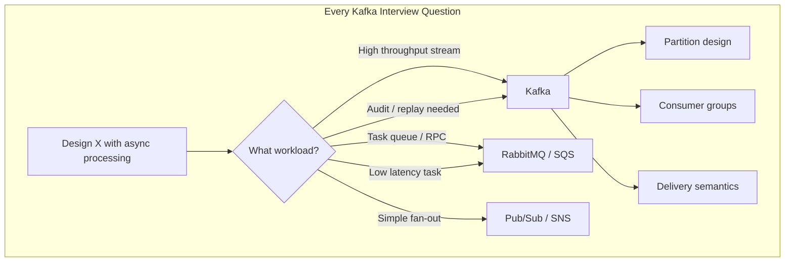

### What "Good" Looks Like in an Interview

| Level | What You Demonstrate |
|-------|---------------------|
| **Junior** | "We'd use Kafka for messaging" |
| **Mid** | "Kafka decouples producers and consumers; topics have partitions for parallelism" |
| **Senior** | "Partition by `user_id` for ordering; consumer group scales reads; at-least-once with idempotent consumers" |
| **Staff** | "Hot partition risk on celebrity users — composite key or dedicated topic; exactly-once via transactional producer + `read_committed` consumers; monitor consumer lag p99 and rebalance frequency" |

### What Interviewers Specifically Probe

| Probe Area | What They Want to Hear |
|------------|------------------------|
| **Log vs queue** | Kafka retains messages; multiple consumer groups read independently; replay is native |
| **Ordering** | Guaranteed **per partition**, not globally across topic |
| **Scaling writes** | Add partitions (not just brokers) — partitions are unit of parallelism |
| **Scaling reads** | Add consumers in same group (up to partition count) |
| **Failure** | ISR, leader election, min.insync.replicas, acks=all |
| **vs RabbitMQ** | Kafka = stream/retain/replay; RabbitMQ = queue/consume/delete/routing |

---

## 2. Problem Statement — What Kafka Is

### 2.1 The Core Problem Kafka Solves

Traditional point-to-point queues (RabbitMQ, ActiveMQ) **delete messages after consumption**. This creates problems at scale:

| Problem | Queue-Based (RabbitMQ) | Log-Based (Kafka) |
|---------|------------------------|-------------------|
| **Replay** | Must re-publish or dead-letter | Rewind offset — replay from any point |
| **Multiple consumers** | Competing consumers split work; fan-out needs exchanges | Each consumer group reads full stream independently |
| **Throughput** | ~10K–50K msg/sec per cluster (typical) | ~1M+ msg/sec per cluster (well-tuned) |
| **Retention** | Until consumed + ACK | Time-based or size-based retention (days/weeks) |
| **Backpressure** | Broker holds until consumer ACKs | Consumer controls pull rate via fetch |
| **Audit trail** | Not designed for long-term storage | Durable log — event sourcing friendly |

### 2.2 Kafka in One Sentence

> **Apache Kafka is a distributed, partitioned, replicated commit log** that serves as a durable, high-throughput event streaming platform — producers append records to topic partitions; consumers read by tracking offsets.

### 2.3 Key Abstractions

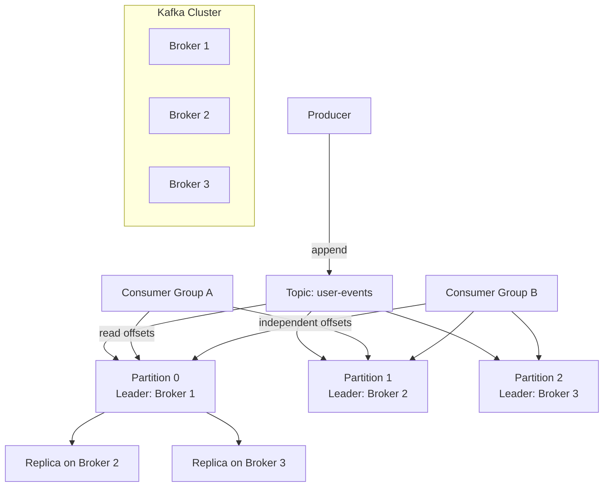

| Abstraction | Definition | Interview Must-Know |
|-------------|------------|---------------------|
| **Topic** | Named category/stream of records (like a table without indexes) | Logical grouping; physical unit is partition |
| **Partition** | Ordered, immutable sequence of records | Unit of parallelism and ordering boundary |
| **Offset** | Monotonic position within a partition (0, 1, 2, …) | Consumers track offset — not broker-assigned like RabbitMQ |
| **Broker** | Kafka server that stores partitions and serves clients | Cluster = 3+ brokers for production |
| **Replica** | Copy of partition on another broker | Leader serves reads/writes; followers replicate |
| **ISR** | In-Sync Replicas — followers caught up within `replica.lag.time.max.ms` | Only ISR members eligible for leader election |
| **Consumer Group** | Set of consumers cooperating to read a topic | One consumer per partition per group; enables scale-out |
| **ZooKeeper / KRaft** | Cluster metadata coordination | KRaft replaces ZooKeeper (Kafka 3.3+ production-ready) |

### 2.4 Kafka vs Traditional Message Queues — Mental Model

```mermaid
graph LR
    subgraph Queue Model — RabbitMQ
        QP[Publisher] --> QQ[Queue]
        QQ --> QC1[Consumer 1]
        QQ --> QC2[Consumer 2]
        Note1[Message deleted after ACK]
    end

    subgraph Log Model — Kafka
        KP[Producer] --> KL[Partition Log<br/>retained 7 days]
        KL --> KC1[Consumer Group A<br/>offset 1500]
        KL --> KC2[Consumer Group B<br/>offset 800]
        Note2[Message retained;<br/>multiple independent readers]
    end
```

**Queue model:** "Give me the next task" — message gone after processing.

**Log model:** "Give me records starting at offset N" — message stays; consumer advances cursor.

---

## 3. Internal Architecture — Deep Dive

### 3.1 Broker Internals

Each Kafka broker:

1. **Receives produce requests** — appends to local partition log
2. **Replicates to followers** — followers pull from leader (not push)
3. **Serves fetch requests** — consumers pull batches of records
4. **Manages log segments** — rolling files on disk (not one giant file)

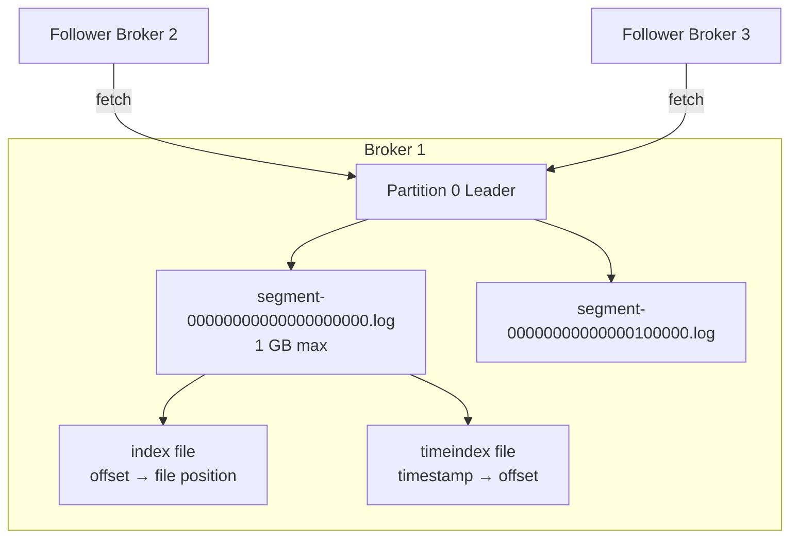

| Component | Purpose |
|-----------|---------|
| **`.log` file** | Append-only record storage |
| **`.index` file** | Sparse index: offset → byte position in log (fast seek) |
| **`.timeindex` file** | Timestamp → offset (time-based retention, seek by time) |
| **`log.segment.bytes`** | Roll to new segment (default 1 GB) |
| **`log.retention.hours`** | Delete segments older than retention |

### 3.2 Partition Leader / Follower / ISR

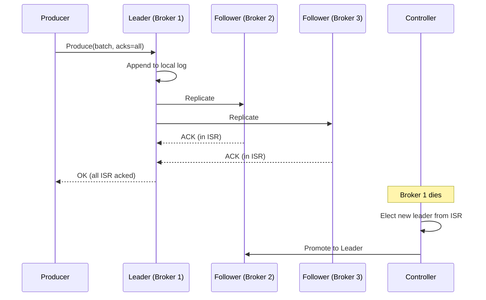

| Role | Responsibility |
|------|----------------|
| **Leader** | Handles all reads and writes for partition |
| **Follower** | Replicates data from leader; can become leader |
| **ISR** | Replicas within lag threshold — "caught up" |
| **Out-of-sync replica** | Too far behind — not eligible for leader election |
| **Controller** | One broker elected to manage partition leadership and ISR |

**Critical interview point:**

> With `acks=all` and `min.insync.replicas=2` on a 3-replica partition, Kafka refuses writes if only 1 broker is alive — **CP behavior** during failure (consistency over availability for that partition).

### 3.3 Topic, Partition, Replication Factor

```
Topic: ride-events
Partitions: 12
Replication Factor: 3

Physical layout (simplified):
  Partition 0: Leader=B1, Replicas=[B1, B2, B3], ISR=[B1, B2, B3]
  Partition 1: Leader=B2, Replicas=[B2, B3, B1], ISR=[B2, B3, B1]
  Partition 2: Leader=B3, Replicas=[B3, B1, B2], ISR=[B3, B1, B2]
  ...
```

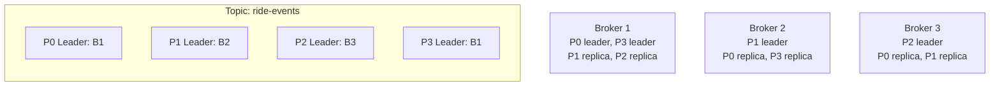

**Replication factor 3, min.insync.replicas 2:**
- Tolerates 1 broker failure without write outage
- Tolerates 2 broker failures with write outage (only 1 ISR member — below min)

### 3.4 Record Structure

```
Record {
  offset: 42              // assigned by broker on append
  timestamp: 1720000000   // CreateTime or LogAppendTime
  key: "user_123"         // optional — determines partition
  value: { ... }          // payload (bytes)
  headers: [ ... ]        // metadata key-value pairs
}
```

| Field | Purpose in Interviews |
|-------|----------------------|
| **Key** | Partition routing (`hash(key) % num_partitions`); ordering per key |
| **Value** | Event payload — often Avro/Protobuf/JSON with schema registry |
| **Headers** | Trace ID, content-type, source service — no schema enforcement |
| **Timestamp** | Event time vs ingestion time — critical for analytics windows |

### 3.5 ZooKeeper vs KRaft (Kafka Raft Metadata)

```mermaid
graph TB
    subgraph ZooKeeper Mode — Legacy
        ZK[ZooKeeper Ensemble<br/>3 or 5 nodes]
        KC1[Kafka Controller]
        KB1[Broker 1]
        KB2[Broker 2]
        KB3[Broker 3]
        ZK --> KC1
        KC1 --> KB1
        KC1 --> KB2
        KC1 --> KB3
    end

    subgraph KRaft Mode — Kafka 3.3+
        KM[Metadata Quorum<br/>Raft consensus<br/>on Kafka brokers]
        KB4[Broker 1<br/>controller + broker]
        KB5[Broker 2]
        KB6[Broker 3]
        KM --> KB4
        KM --> KB5
        KM --> KB6
    end
```

| Aspect | ZooKeeper | KRaft |
|--------|-----------|-------|
| **External dependency** | Separate ZK cluster to operate | Metadata stored in Kafka itself |
| **Scalability** | ZK bottleneck at 100K+ partitions | Millions of partitions supported |
| **Failover** | Controller election via ZK | Raft-based metadata quorum |
| **Operational complexity** | Two systems to manage | Single system |
| **Interview answer** | "Legacy deployments; being phased out" | "Default for new clusters; Raft quorum replaces ZK" |

**What to say:**

> "KRaft uses an internal Raft quorum to store topic metadata, partition assignments, and broker registrations — eliminating the ZooKeeper operational burden and supporting larger partition counts."

### 3.6 Controller Responsibilities

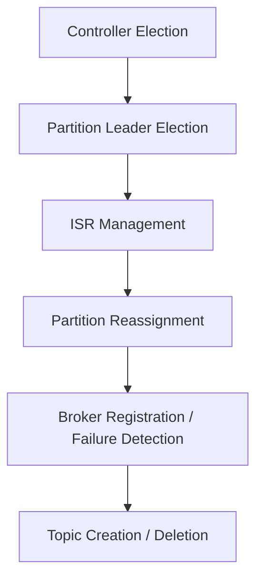

When a broker dies:
1. Controller detects via session timeout
2. For each partition where dead broker was leader → elect new leader from ISR
3. Notify producers and consumers of new metadata (leader epoch bump)
4. If ISR shrinks below `min.insync.replicas` → partition goes offline for writes

---

## 4. How It Works Step-by-Step

### 4.1 Producer → Partition → Broker (Full Flow)

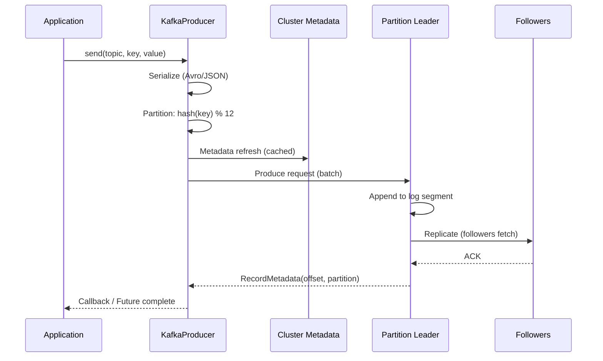

**Producer batching (why Kafka is fast):**

| Setting | Default | Purpose |
|---------|---------|---------|
| `linger.ms` | 5 | Wait to fill batch — throughput vs latency |
| `batch.size` | 16 KB | Max batch size before send |
| `compression.type` | none | lz4, snappy, zstd, gzip — 3–10× bandwidth reduction |
| `acks` | 1 | Durability vs latency trade-off |
| `enable.idempotence` | false | Exactly-once per partition (PID + sequence numbers) |

### 4.2 Partitioning Strategies

```mermaid
flowchart TD
    MSG[Incoming Message] --> K{Has key?}
    K -->|yes| HK[hash(key) % num_partitions<br/>Sticky partitioner (same key → same partition)]
    K -->|no| RR[Round-robin across partitions<br/>or sticky random batch partition]
    K -->|custom| CP[Custom Partitioner class<br/>geographic, tenant, priority]
```

| Strategy | Ordering Guarantee | Use Case | Hot Partition Risk |
|----------|-------------------|----------|---------------------|
| **Key-based (default)** | Per-key ordering | User events, order ID, payment ID | High — celebrity user, hot product |
| **Round-robin** | None | Metrics, logs without ordering need | Low — even distribution |
| **Sticky partitioner** | Per-batch to one partition | Better batching for null-key messages | Medium |
| **Custom** | Depends on logic | Multi-tenant isolation, geo routing | Depends on design |

**Interview example — Instagram post events:**

> "Partition by `user_id` so all posts from a user are ordered. For celebrity users generating 10K posts/sec, I'd use a composite key `user_id + post_sequence` or route celebrities to a dedicated high-partition topic to avoid hot partitions."

**Hot partition mitigation:**

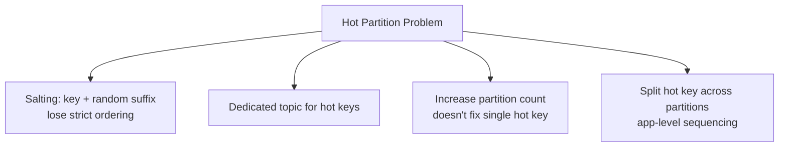

### 4.3 Consumer Groups & Offset Management

```mermaid
graph TB
    subgraph Topic: notifications (4 partitions)
        P0[P0]
        P1[P1]
        P2[P2]
        P3[P3]
    end

    subgraph Consumer Group: email-service
        C1[Consumer 1 → P0, P1]
        C2[Consumer 2 → P2]
        C3[Consumer 3 → P3]
    end

    subgraph Consumer Group: sms-service
        C4[Consumer 4 → P0]
        C5[Consumer 5 → P1, P2, P3]
    end

    P0 --> C1
    P1 --> C1
    P2 --> C2
    P3 --> C3

    P0 --> C4
    P1 --> C5
    P2 --> C5
    P3 --> C5
```

**Rules (memorize):**

1. **One consumer per partition per group** — max parallelism = partition count
2. **Adding consumers** beyond partition count → idle consumers
3. **Each consumer group** has independent offsets — fan-out is native
4. **Offsets stored** in `__consumer_offsets` internal topic (or external store for Kafka Streams)

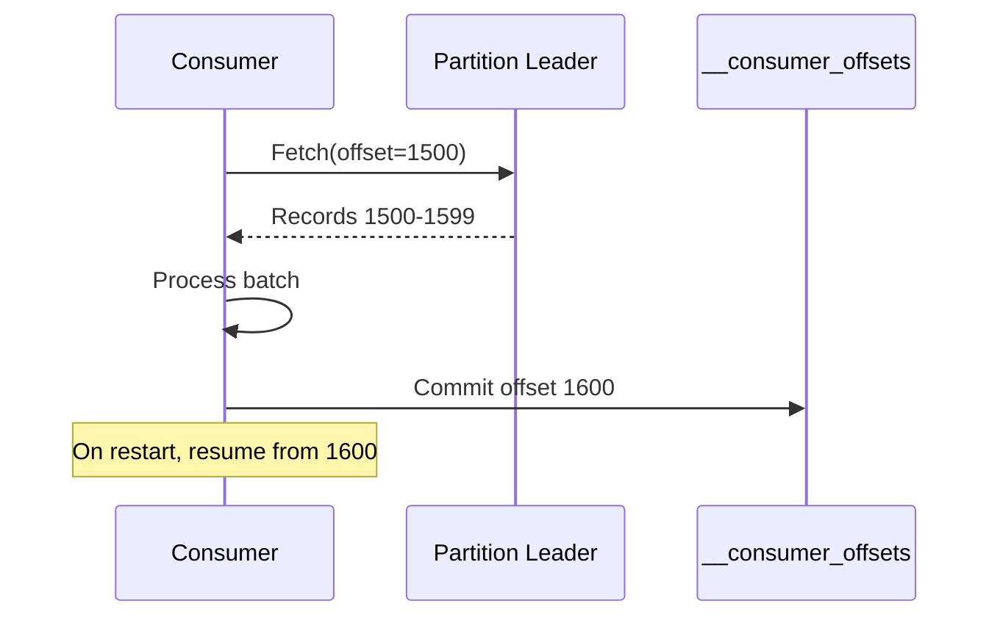

| Offset Commit Mode | Behavior | Risk |
|-------------------|----------|------|
| **Auto commit (default)** | Commit every `auto.commit.interval.ms` | May commit before processing → loss on crash |
| **Manual sync commit** | Commit after processing | At-least-once if commit after process |
| **Manual async commit** | Non-blocking commit | Faster but commit order not guaranteed |

### 4.4 Rebalancing — The Pain Point

When consumers join or leave a group, partitions are **reassigned**:

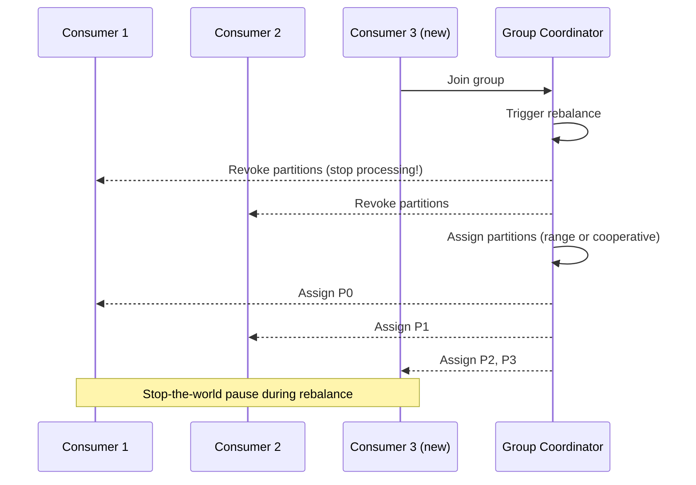

| Rebalance Protocol | Behavior | Interview Note |
|-------------------|----------|----------------|
| **Eager (range)** | Revoke ALL partitions, reassign | Stop-the-world; processing pauses |
| **Cooperative (incremental)** | Revoke only affected partitions | Kafka 2.4+; reduces pause time |
| **Static membership** | `group.instance.id` — skip rebalance on brief restart | Reduces churn during rolling deploys |

**Rebalance triggers:**
- Consumer joins or leaves group
- Consumer heartbeat timeout (GC pause, slow processing)
- Partition count changes
- Subscription changes

**Mitigation in interviews:**

> "Use cooperative rebalancing, static group membership for rolling deploys, and keep `max.poll.interval.ms` high enough for processing time. Monitor rebalance rate — frequent rebalances cause duplicate processing and lag spikes."

### 4.5 Retention, Compaction, Log Segments

**Time / size retention (default):**

```
log.retention.hours = 168  (7 days)
log.retention.bytes = -1   (unlimited per partition)
```

Old segments deleted when retention exceeded.

**Log compaction** — keeps latest value per key (like a changelog table):

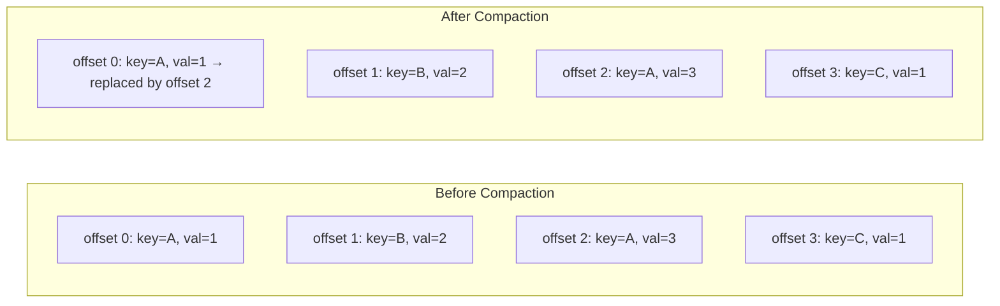

| Retention Type | Use Case | Example Topic |
|----------------|----------|---------------|
| **Delete (time/size)** | Event streams, telemetry | `click-events`, `ride-locations` |
| **Compact** | Changelog, config, state | `user-profiles`, `connector-offsets` |
| **Compact + Delete** | Latest state + recent history | `order-status` |

**Interview use case:**

> "For payment event sourcing, I'd use compacted topic for account state snapshots plus a time-retained topic for full audit trail — compacted for fast recovery, retained for compliance replay."

---

## 5. Delivery Semantics — Exactly-Once, At-Least-Once, At-Most-Once

### 5.1 The Three Semantics

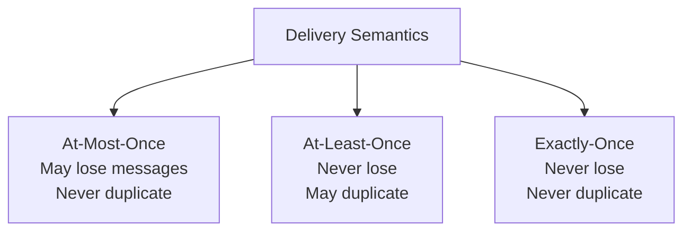

| Semantic | Producer | Consumer | When to Use |
|----------|----------|----------|-------------|
| **At-most-once** | `acks=0` or `acks=1` + no retry; fire-and-forget | Commit offset **before** processing | Metrics, logs — loss acceptable |
| **At-least-once** | `acks=all` + retries; idempotent consumer | Commit offset **after** processing | Default for most systems |
| **Exactly-once** | Idempotent producer + transactions | `read_committed` + transactional consume-process-produce | Payments, billing, inventory |

### 5.2 How At-Most-Once Is Achieved

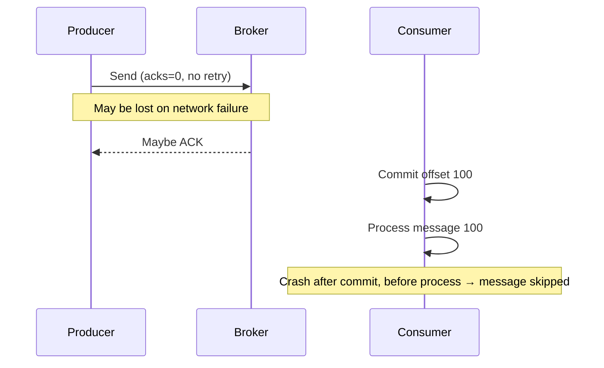

**Configuration:**
- Producer: `acks=0` or `acks=1` with `retries=0`
- Consumer: `enable.auto.commit=true` with commit before processing (or manual pre-process commit)

### 5.3 How At-Least-Once Is Achieved

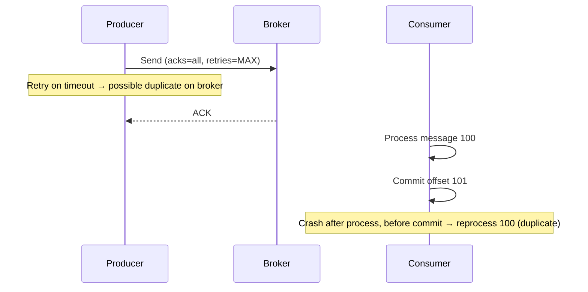

**Configuration:**
- Producer: `acks=all`, `retries > 0`, `enable.idempotence=true` (prevents broker-side duplicates from retries)
- Consumer: Process then commit; **idempotent consumer** (dedupe by event ID or DB upsert)

**Interview must-say:**

> "At-least-once is the practical default. I combine idempotent producer with consumer deduplication — store processed event IDs in Redis or use DB `INSERT ... ON CONFLICT DO NOTHING`."

### 5.4 How Exactly-Once Is Achieved (EOS)

Kafka exactly-once semantics (EOS) = **idempotent producer + transactions + read_committed consumers**:

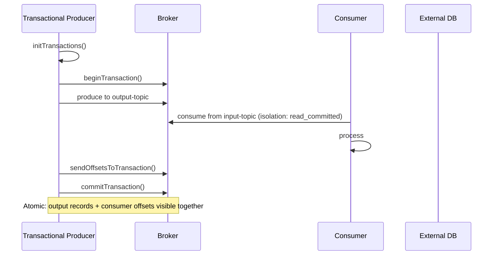

| Component | Mechanism |
|-----------|-----------|
| **Idempotent producer** | Producer ID (PID) + sequence number per partition — broker dedupes retries |
| **Transactions** | Transaction coordinator; atomic multi-partition write |
| **sendOffsetsToTransaction** | Consumer offset commit atomic with producer output |
| **read_committed** | Consumers only see committed transactional records |

**Limitation (say this in interviews):**

> "EOS covers consume-transform-produce within Kafka. For Kafka-to-DB exactly-once, I'd use transactional outbox pattern, idempotent DB writes, or Kafka Connect with support for exactly-once sink (e.g., JDBC with upsert)."

### 5.5 Idempotent Producer Internals

```
Producer assigned PID=12345
Partition 0: seq=0 → accepted
Partition 0: seq=1 → accepted
Partition 0: seq=1 (retry duplicate) → deduplicated by broker
Partition 0: seq=2 → accepted
```

Out-of-order sequence → `OutOfOrderSequenceException` → producer must reset.

### 5.6 Delivery Semantics Decision Tree

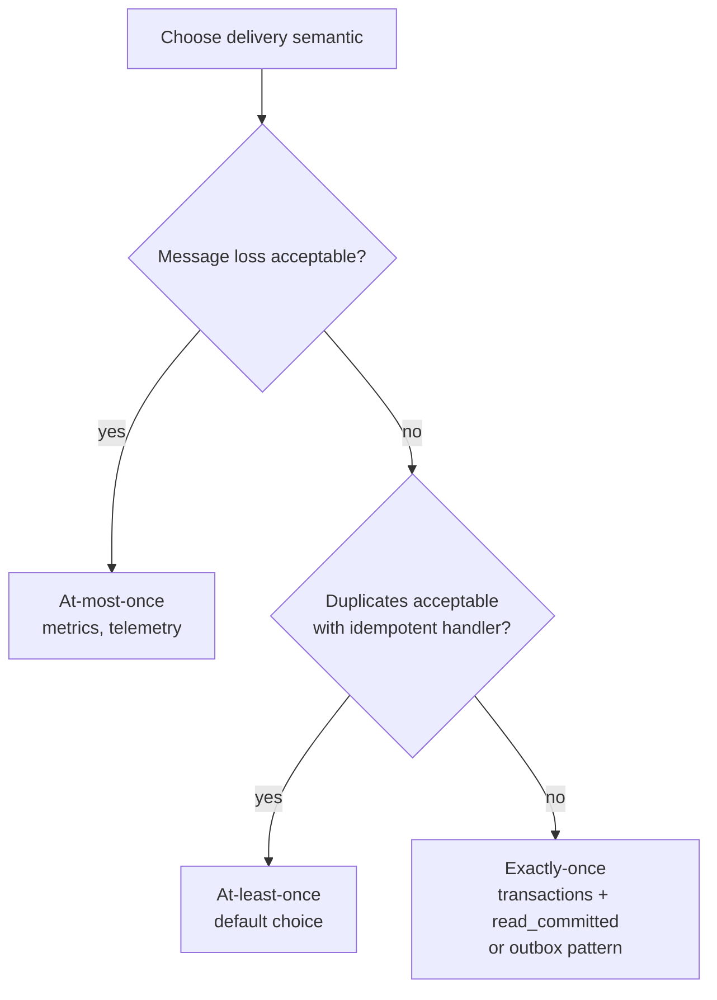

---

## 6. When to Use / When NOT to Use

### 6.1 Kafka Shines When

| Scenario | Why Kafka |
|----------|-----------|
| **Event sourcing / audit log** | Immutable retained log; replay any point in time |
| **Stream processing** | Kafka Streams, Flink, Spark consume continuously |
| **High throughput** | Millions events/sec with batching + partitioning |
| **Multiple independent consumers** | Analytics, search index, notifications — same stream |
| **Decouple burst producers** | Buffer spikes; consumers process at their pace |
| **Real-time pipelines** | ETL, CDC (Debezium), log aggregation |
| **Microservice choreography** | Services react to events without direct coupling |

### 6.2 Kafka Is the Wrong Choice When

| Scenario | Better Alternative | Why |
|----------|-------------------|-----|
| **Task queue with per-message TTL** | RabbitMQ, SQS | Kafka retention is topic-level, not per-message |
| **Complex routing (topic patterns)** | RabbitMQ exchanges | Kafka has no native exchange routing |
| **Low latency RPC (< 10ms)** | gRPC, direct HTTP | Kafka adds ms–seconds latency |
| **Small scale (< 1K msg/sec)** | RabbitMQ, Redis Streams, SQS | Kafka ops overhead not justified |
| **Priority queues** | RabbitMQ priority queue | Kafka partitions are FIFO per partition |
| **Individual message delete** | RabbitMQ | Kafka deletes by retention, not per message |
| **Request-reply pattern** | RabbitMQ RPC, gRPC | Kafka possible but awkward (reply topic) |

```mermaid
graph TB
    subgraph Use Kafka
        K1[Event streaming]
        K2[Log aggregation]
        K3[CDC pipelines]
        K4[Metrics at scale]
        K5[Fan-out analytics]
    end

    subgraph Use RabbitMQ / SQS
        R1[Job queues]
        R2[Notification routing]
        R3[Order workflow steps]
        R4[RPC reply queues]
        R5[Per-message TTL / DLQ]
    end
```

### 6.3 Kafka vs RabbitMQ vs SQS — Master Comparison

| Dimension | Kafka | RabbitMQ | AWS SQS |
|-----------|-------|----------|---------|
| **Model** | Distributed log | Message queue + exchanges | Managed queue |
| **Throughput** | 1M+ msg/sec | 10K–50K msg/sec | Nearly unlimited (soft limits) |
| **Retention** | Days/weeks (configurable) | Until consumed | 14 days max |
| **Replay** | Native (offset rewind) | Not native | Not native |
| **Ordering** | Per partition | Per queue (single consumer) | FIFO queues only |
| **Routing** | Topic + partition key | Exchanges (direct, fanout, topic) | Queue URL |
| **Consumer model** | Pull (long poll) | Push (broker delivers) | Pull |
| **Ops complexity** | High (self-hosted) | Medium | Low (managed) |
| **Latency** | ms–low seconds | sub-ms–ms | ms–seconds |
| **Exactly-once** | Transactions (complex) | At-least-once typical | At-least-once |

---

## 7. How Kafka Fits Into System Design Questions

### 7.1 Instagram Feed — Fan-Out on Write

```mermaid
graph TB
    U[User posts photo] --> API[Post Service]
    API --> DB[(Posts DB)]
    API --> K[Kafka: post-events<br/>partition by user_id]
    K --> F1[Feed Fan-out Service<br/>Consumer Group]
    K --> F2[Search Indexer]
    K --> F3[Notification Service]
    K --> F4[Analytics Pipeline]
    F1 --> CACHE[(Redis Feed Cache<br/>per follower)]
```

**What to say:**

> "On post creation, write to DB synchronously for durability, then publish `PostCreated` event to Kafka. Fan-out workers consume and push post IDs into followers' Redis feed caches. Kafka decouples the post API from slow fan-out — celebrity post doesn't block the user. Partition by `user_id` for ordering. At-least-once with idempotent fan-out (dedupe by `post_id`)."

**Why Kafka over RabbitMQ here:**

- Multiple consumers (feed, search, analytics) read same stream
- Replay fan-out if Redis corruption
- Handle celebrity write spikes (buffer in Kafka)

### 7.2 YouTube Analytics — View Count Pipeline

```mermaid
graph LR
    V[Video view] --> E[Edge / API] --> K[Kafka: view-events<br/>millions/sec<br/>partition by video_id]
    K --> S1[Real-time aggregator<br/>Flink / Kafka Streams]
    K --> S2[Data warehouse<br/>Snowflake / BigQuery]
    K --> S3[Recommendation model]
    S1 --> REDIS[(Redis view counters<br/>approximate)]
    S2 --> DWH[(Historical analytics)]
```

**What to say:**

> "View events are fire-and-forget — at-most-once or at-least-once acceptable. Partition by `video_id` for per-video aggregation. Flink windows compute 1-min view counts. Kafka retains 7 days for reprocessing if aggregation bug found. Hot videos create hot partitions — acceptable because aggregation is per-partition."

### 7.3 Uber Location Pipeline

```mermaid
sequenceDiagram
    participant D as Driver App
    participant GW as Gateway
    participant K as Kafka: location-updates
    participant M as Matching Service
    participant MAP as Map Service
    participant DB as Location Store

    D->>GW: GPS every 3 sec
    GW->>K: produce(key=driver_id, lat, lng, ts)
    K->>M: consume (nearby driver matching)
    K->>MAP: consume (rider map display)
    K->>DB: sink (batch write every 30s)
```

| Design Choice | Rationale |
|---------------|-----------|
| **Partition by `driver_id`** | All location updates for one driver ordered |
| **Retention: 1–24 hours** | Replay for debugging; not long-term storage |
| **Compaction: no** | Append-only location history (or compact for latest only) |
| **At-least-once** | Duplicate GPS point harmless (idempotent overwrite) |
| **Consumer lag alert** | > 5 sec lag → stale map positions |

**Interview nuance:**

> "Location is AP — stale by 1–2 seconds is fine. Kafka buffers driver spikes during surge pricing. Matching service maintains in-memory geospatial index updated from Kafka stream, not polling DB."

### 7.4 Payment Event Sourcing

```mermaid
graph TB
    PAY[Payment Service] --> K1[Kafka: payment-events<br/>compact + retain<br/>partition by account_id]
    K1 --> L[Ledger Service<br/>append-only entries]
    K1 --> F[Fraud Detection]
    K1 --> N[Notification Service]
    K1 --> A[Audit / Compliance Store]
    L --> DB[(Account balances<br/>derived from events)]
```

**What to say:**

> "Payment events require at-least-once minimum; ideally exactly-once for ledger. I'd use transactional producer writing payment event + outbox in same DB transaction, then relay to Kafka. Consumers use idempotent ledger entries keyed by `payment_id`. Partition by `account_id` for per-account ordering. Compacted topic for latest account state; retained topic for 7-year audit."

### 7.5 Notification System

```mermaid
graph TB
    EVT[Any service] --> K[Kafka: notification-events]
    K --> R[Router Service]
    R --> K2[Kafka: email-queue]
    R --> K3[Kafka: push-queue]
    R --> K4[Kafka: sms-queue]
    K2 --> E[Email workers]
    K3 --> P[Push workers]
    K4 --> S[SMS workers]
```

**Kafka vs RabbitMQ for notifications:**

| Factor | Kafka Approach | RabbitMQ Approach |
|--------|---------------|-------------------|
| **Routing complexity** | Multiple topics by channel | Topic exchange with routing keys — more natural |
| **Per-message priority** | Not supported | Priority queues supported |
| **Retry / DLQ** | Custom or Kafka Connect | Native DLX pattern |
| **Scale** | Millions notifications/min | Tens of thousands typical |

**Balanced interview answer:**

> "I'd use Kafka for the high-volume event ingestion bus (all events land in Kafka), then route to channel-specific topics. For per-user priority notifications or complex routing, a RabbitMQ layer downstream is reasonable — hybrid architecture."

### 7.6 Metrics / Observability Pipeline

```mermaid
graph LR
    APP1[Service A] --> A[Agent]
    APP2[Service B] --> A
    APP3[Service C] --> A
    A --> K[Kafka: metrics-raw]
    K --> TS[(TimescaleDB / Prometheus)]
    K --> ALERT[Alerting Engine]
    K --> S3[(Long-term S3 via Kafka Connect)]
```

> "Metrics are at-most-once acceptable. High cardinality partitioned by `service_name`. Kafka buffers agent bursts during incidents. Consumers batch-insert to TSDB. 24-hour retention on raw topic; downsampled topics retained longer."

---

## 8. Scaling & Reliability

### 8.1 Scaling Writes — Partitions First

```mermaid
graph TB
    SW[Scale Writes] --> P[Add partitions<br/>primary lever]
    SW --> B[Add brokers<br/>distributes partition leaders]
    SW --> PR[Producer-side batching<br/>linger.ms, compression]
    SW --> RF[Don't increase RF<br/>for throughput — increases replication cost]
```

| Action | Write Throughput Impact | Caveat |
|--------|------------------------|--------|
| **Increase partitions** | Linear (more parallel leaders) | Cannot decrease later easily; ordering per partition only |
| **Add brokers** | Distributes leaders across machines | Need enough partitions to utilize |
| **Batching + compression** | 3–10× effective throughput | Adds `linger.ms` latency |
| **Increase replication factor** | Decreases write throughput | More replicas to ACK |

**Partition count formula (rule of thumb):**

```
partitions = max(
  target_throughput_MB/s / single_partition_throughput_MB/s,
  target_consumer_throughput / single_consumer_throughput
)

Typical: start with 12–24 partitions per topic; scale based on lag metrics
```

### 8.2 Scaling Reads — Consumer Groups

```mermaid
graph LR
    T[Topic: 12 partitions] --> CG[Consumer Group]
    CG --> C1[Consumer 1: P0-P3]
    CG --> C2[Consumer 2: P4-P7]
    CG --> C3[Consumer 3: P8-P11]
    Note[Max 12 consumers active<br/>13th consumer is idle]
```

| Scale Reads | How |
|-------------|-----|
| **More consumers in group** | Up to partition count |
| **More partitions** | If consumers maxed out but lag growing |
| **Multiple consumer groups** | Each group scales independently |
| **Fetch tuning** | `fetch.min.bytes`, `max.partition.fetch.bytes` |

### 8.3 Broker Scaling & Cluster Sizing

```
Production minimum: 3 brokers (tolerate 1 failure with RF=3)
Large cluster: 10–50 brokers, 1000s of partitions

Per-broker guidelines:
  - Disk: NVMe SSD (not HDD for low latency)
  - Network: 10 Gbps+ for cross-broker replication
  - Partitions per broker: < 4000 (KRaft improves this)
  - CPU: compression and SSL are CPU-heavy
```

### 8.4 Reliability Configuration Checklist

| Setting | Production Value | Purpose |
|---------|-----------------|---------|
| `replication.factor` | 3 | Survive 1 broker loss |
| `min.insync.replicas` | 2 | Prevent acks=all with single replica |
| `acks` | all | Wait for ISR acknowledgment |
| `unclean.leader.election.enable` | false | Never promote out-of-sync replica (data loss risk) |
| `enable.idempotence` | true | Dedupe producer retries |
| Multi-AZ deployment | Required | AZ failure tolerance |

```mermaid
graph TB
    subgraph Availability Zone A
        B1[Broker 1]
        B2[Broker 2]
    end
    subgraph Availability Zone B
        B3[Broker 3]
    end
    subgraph Availability Zone C
        B4[Broker 4]
    end
    Note[RF=3: each partition spans 3 AZs]
```

### 8.5 Multi-Region / MirrorMaker

```mermaid
graph LR
    subgraph Region US
        KUS[Kafka Cluster US]
    end
    subgraph Region EU
        KEU[Kafka Cluster EU]
    end
    KUS -->|MirrorMaker 2| KEU
    Note[Active-active or active-passive<br/>offset mapping complex]
```

**Interview note:**

> "Cross-region Kafka is eventually consistent. MirrorMaker 2 replicates topics asynchronously. For global systems, often region-local Kafka clusters with events containing region metadata — avoid single global cluster (latency)."

---

## 9. Failure Modes

### 9.1 Broker Down

```mermaid
sequenceDiagram
    participant P as Producer
    participant L as Leader (dead)
    participant F as Follower
    participant C as Controller

    Note over L: Broker failure
    C->>C: Detect broker offline
    C->>F: Elect follower as new leader (from ISR)
    C->>P: Metadata update (new leader)
    P->>F: Retry produce to new leader
```

| Scenario | Impact | Mitigation |
|----------|--------|------------|
| **Leader dies, ISR ≥ 2** | Brief produce pause (metadata refresh) | RF=3, min.insync.replicas=2 |
| **Leader dies, ISR = 1** | Partition offline for writes | Alert; restore broker |
| **Unclean leader election** | Possible data loss | Keep `unclean.leader.election=false` |
| **Full cluster loss** | Total outage | Multi-AZ; backup cluster; DR runbook |

### 9.2 Consumer Lag

```mermaid
graph TB
    LAG[Consumer Lag Growing] --> R1[Consumer too slow<br/>scale consumers / optimize processing]
    LAG --> R2[Hot partition<br/>one partition overloaded]
    LAG --> R3[Rebalance storm<br/>consumers churning]
    LAG --> R4[Downstream bottleneck<br/>DB, external API]
    LAG --> R5[GC pause<br/>missed heartbeat → rebalance]
```

| Metric | Alert Threshold | Action |
|--------|----------------|--------|
| `consumer_lag` (records) | > 100K or growing 10 min | Scale consumers, investigate |
| `consumer_lag` (time) | > 60 sec for real-time | Priority escalation |
| Rebalance rate | > 1 per 5 min | Static membership, fix slow consumers |
| `max.poll.interval.ms` exceeded | Consumer kicked from group | Increase interval or reduce batch size |

### 9.3 Hot Partitions

```
Symptom: Partition 7 has 10× the message rate of others
Cause: Key skew (Beyoncé user_id, viral video_id)

Effects:
  - Single broker disk I/O saturated
  - One consumer in group overloaded
  - End-to-end latency spike for that key
```

| Mitigation | Trade-off |
|------------|-----------|
| **Salted keys** | Lose per-key ordering |
| **Dedicated topic for hot entities** | Operational complexity |
| **Custom partitioner** | Spread known hot keys |
| **Async processing** | Accept ordering relaxation |

### 9.4 Disk Full / Retention Failure

| Symptom | Cause | Fix |
|---------|-------|-----|
| Broker refuses writes | `log.retention` + disk at capacity | Increase disk; lower retention; add brokers |
| Slow produces | Disk I/O saturation | NVMe; reduce replication catch-up |
| Segment corruption | Unclean shutdown | Restore from replica; restore from backup |

### 9.5 ZooKeeper / KRaft Quorum Loss

| Mode | Failure | Impact |
|------|---------|--------|
| **ZooKeeper** | Lose quorum (2 of 3 ZK nodes) | Entire cluster metadata frozen — cannot elect leaders |
| **KRaft** | Lose metadata quorum | Same — cluster administration halted |
| **Mitigation** | 3 or 5 node quorum across AZs | Never 2-node ZK (no fault tolerance) |

### 9.6 Producer Failures

| Failure | Behavior | Fix |
|---------|----------|-----|
| `NotEnoughReplicasException` | ISR below min.insync.replicas | Restore brokers; temporary acks=1 (risky) |
| `TimeoutException` | Broker overloaded or network | Retry with idempotence |
| Message too large | `RecordTooLargeException` | Increase `max.message.bytes` or split payload |
| Serialization error | Goes to dead letter (if configured) | Schema validation at producer |

---

## 10. Trade-offs

### 10.1 Kafka Configuration Trade-offs

| Knob | Higher Value Effect | Trade-off |
|------|---------------------|-----------|
| `acks=all` | Durability | Latency + unavailable if ISR shrinks |
| `linger.ms` | Throughput | Latency |
| `replication.factor` | Durability | Storage + write latency |
| `partition count` | Parallelism | Ordering granularity; metadata overhead |
| `retention` | Replay window | Disk cost |
| `compression` | Bandwidth | CPU |
| `fetch.min.bytes` | Consumer efficiency | Latency |

### 10.2 Architecture Trade-offs

```mermaid
graph TB
    subgraph Kafka-Centric
        KC[Single event bus<br/>all services publish/consume]
        KC --> P1[Pro: unified pipeline]
        KC --> P2[Con: Kafka becomes critical dependency]
    end

    subgraph Hybrid
        HY[Kafka for streaming<br/>RabbitMQ for tasks]
        HY --> P3[Pro: right tool per job]
        HY --> P4[Con: two systems to operate]
    end
```

### 10.3 Master Trade-offs Table

| Choice | Gain | Cost |
|--------|------|------|
| **Kafka over RabbitMQ** | Throughput, replay, fan-out | Ops complexity, higher latency |
| **More partitions** | Write/read parallelism | Weaker global ordering; metadata overhead |
| **Exactly-once transactions** | No duplicates | 20–30% throughput penalty; complexity |
| **Log compaction** | Infinite key retention | No full history per key |
| **Self-hosted Kafka** | Full control, cost at scale | Team expertise required |
| **Managed (Confluent Cloud, MSK)** | Reduced ops | Cost; vendor lock-in |
| **Synchronous produce** | Immediate error feedback | Throughput loss |

---

## 11. Interview Cheat Sheet

### Key Numbers to Memorize

| Metric | Value |
|--------|-------|
| Single partition throughput | ~10–50 MB/sec (hardware dependent) |
| End-to-end latency (tuned) | 5–50 ms (p99 can be higher) |
| Typical replication factor | 3 |
| min.insync.replicas | 2 (with RF=3) |
| Default retention | 7 days (`log.retention.hours=168`) |
| Max consumers per group | = partition count |
| Partition ordering | Per partition only |
| Idempotent producer | PID + sequence per partition |
| Consumer offset storage | `__consumer_offsets` topic |
| KRaft production-ready | Kafka 3.3+ |

### One-Liner Definitions

| Term | One-Liner |
|------|-----------|
| **Topic** | Named stream of records; divided into partitions |
| **Partition** | Ordered append-only log; unit of parallelism |
| **Offset** | Position in partition log; consumer cursor |
| **ISR** | Replicas caught up with leader; eligible for election |
| **Consumer group** | Cooperative consumers; each partition assigned to one |
| **Rebalance** | Partition reassignment when group membership changes |
| **Log compaction** | Retain latest record per key; delete older duplicates |
| **Idempotent producer** | Broker dedupes retries via PID + sequence number |
| **Exactly-once (EOS)** | Transactions + idempotent producer + read_committed |
| **KRaft** | Kafka Raft metadata mode; replaces ZooKeeper |
| **Hot partition** | Skewed key causes one partition overload |
| **Consumer lag** | Difference between latest offset and consumer offset |

### Architecture Checklist (Say Proactively)

- [ ] **Partition key** matches ordering requirement
- [ ] **Partition count** ≥ max consumer parallelism needed
- [ ] **RF=3, min.insync.replicas=2, acks=all** for durability
- [ ] **At-least-once + idempotent consumer** as default
- [ ] **Multiple consumer groups** for fan-out (not duplicate consumption)
- [ ] **Retention policy** defined (time vs compact)
- [ ] **Consumer lag monitoring** with alerts
- [ ] **Rebalance strategy** — cooperative + static membership
- [ ] **Hot partition plan** for skewed keys
- [ ] **Schema registry** for Avro/Protobuf evolution

### Quick Decision: Kafka or Not?

```
USE KAFKA when:
  ✓ Throughput > 10K events/sec sustained
  ✓ Multiple independent consumers on same data
  ✓ Need replay / event sourcing
  ✓ Stream processing (Flink, Kafka Streams)
  ✓ Decouple producer burst from consumer speed

DON'T USE KAFKA when:
  ✗ Simple task queue (< 1K/sec)
  ✗ Complex per-message routing
  ✗ Sub-10ms latency requirement
  ✗ Per-message TTL or priority
  ✗ Team can't operate distributed log infra
```

---

## 12. Follow-Up Questions & Model Answers

**Q1: How does Kafka guarantee ordering?**

> Ordering is guaranteed **within a partition only**. Producers with the same key go to the same partition (default hash partitioner). If you need global ordering across all events, you need a single partition — which limits throughput to one consumer. In practice, partition by entity (`order_id`, `user_id`) for per-entity ordering.

**Q2: What happens if a consumer crashes mid-batch?**

> If offset not committed, on restart the consumer re-reads from last committed offset — **at-least-once** (duplicates). If auto-commit fired before processing finished, messages may be **lost** (at-most-once). Best practice: manual commit after successful processing + idempotent handler keyed by event ID.

**Q3: How do you add partitions to an existing topic?**

> `kafka-topics --alter --partitions 24` — new partitions are empty; existing key→partition mapping unchanged for old partitions. **New keys** distribute to all partitions; **existing keys** stay on original partition. Consumers rebalance to pick up new partitions. Cannot decrease partition count.

**Q4: Explain acks=0, acks=1, acks=all.**

> - `acks=0`: Producer doesn't wait for broker ACK — fastest, may lose data
> - `acks=1`: Leader ACK only — follower may not have replicated before leader dies
> - `acks=all`: All ISR replicas ACK — safest; fails if ISR < min.insync.replicas

**Q5: How would you design exactly-once payment processing with Kafka?**

> Use **transactional outbox**: DB transaction writes payment row + outbox row atomically. Outbox relay publishes to Kafka. Consumer ledger service uses `payment_id` as idempotency key (`INSERT ... ON CONFLICT DO NOTHING`). For Kafka-internal pipelines, use transactional producer with `sendOffsetsToTransaction` and `isolation.level=read_committed`.

**Q6: What is consumer lag and why does it matter?**

> Lag = `log_end_offset - current_offset` per partition. Growing lag means consumers can't keep up — data is stale. For Uber locations, 60-second lag means riders see outdated driver positions. Alert on lag time (not just records) for time-sensitive pipelines.

**Q7: Kafka vs RabbitMQ for a notification system?**

> Kafka for high-volume event ingestion and analytics fan-out (all events to data lake). RabbitMQ for routing notifications by type/priority with per-message TTL and DLQ. Hybrid: Kafka as central bus → router service → RabbitMQ per-channel queues for delivery semantics Rabbit handles better.

**Q8: What causes rebalance storms during deployment?**

> Rolling restart kills consumers sequentially — each exit triggers rebalance. Fix: `group.instance.id` (static membership) allows consumer to rejoin same assignment within `session.timeout.ms`. Also use cooperative rebalancing so only affected partitions revoke.

**Q9: How does log compaction work with tombstones?**

> Producing a record with `value=null` for a key writes a **tombstone**. Compaction eventually removes the key entirely after `delete.retention.ms`. Used for Kafka Streams state store changelog cleanup.

**Q10: Can Kafka replace a database?**

> No — Kafka is an event log, not a queryable database. Use Kafka for streaming and event sourcing; materialize state in DB/cache via consumers. `ksqlDB` or Flink can derive tables but source of truth for queries remains the materialized store.

**Q11: How do you handle schema evolution?**

> Confluent Schema Registry with Avro/Protobuf. Compatibility modes: BACKWARD (new consumers read old data — default), FORWARD, FULL. Consumers reject incompatible schemas at produce time.

**Q12: What is the controller broker?**

> One broker elected (via ZK or KRaft) to manage partition leader elections, ISR changes, and topic administration. Not the same as partition leader — controller is cluster-wide coordinator.

**Q13: How would you migrate from RabbitMQ to Kafka?**

> Dual-write phase: publish to both. Consumers read from Kafka; compare output. Backfill historical data if replay needed. Cut over consumers topic by topic. RabbitMQ strengths (RPC, priority) may remain for specific use cases.

**Q14: What is `enable.auto.commit=false` and when use it?**

> Manual offset control — commit only after successful processing. Required for at-least-once semantics in serious pipelines. Auto-commit risks committing unprocessed messages on crash.

**Q15: How does Kafka achieve high throughput?**

> Sequential disk I/O (append-only log), zero-copy transfer (`sendfile`), producer batching, compression, partition parallelism, and consumer pull-based fetch with large batches.

---

## 13. Common Mistakes That Fail Interviews

### Mistake 1: "Kafka guarantees ordering"

**Wrong.** Kafka guarantees ordering **per partition**. Multiple partitions = no global order.

**Right:** "Partition by `order_id` for per-order ordering. Accept that different orders have no relative ordering guarantee."

### Mistake 2: "Add consumers to scale writes"

**Wrong.** Consumers scale reads. Writes scale via partitions and producer batching.

### Mistake 3: "Kafka is a message queue like RabbitMQ"

**Wrong.** Kafka is a **distributed log**. Messages aren't deleted on consume; retention is time/size based.

### Mistake 4: Ignoring hot partition risk

**Wrong.** "Partition by `video_id`" without addressing viral video skew.

**Right.** Acknowledge skew; discuss salting, dedicated topics, or async aggregation.

### Mistake 5: "Exactly-once is free — just enable it"

**Wrong.** Transactions add latency and throughput cost; EOS doesn't cover Kafka-to-DB without additional patterns.

**Right.** "Exactly-once within Kafka via transactions; cross-system via outbox + idempotent consumers."

### Mistake 6: No delivery semantics discussion

Interviewers expect you to **proactively** state at-least-once default and how duplicates are handled.

### Mistake 7: `acks=1` for payment events

**Wrong.** Leader ACK without follower sync — data loss if leader dies before replication.

**Right.** `acks=all`, `min.insync.replicas=2`, `enable.idempotence=true`.

### Mistake 8: Too many partitions

**Wrong.** "1000 partitions per topic" without justification.

**Right.** Start with 12–24; each partition has file handles, memory, and metadata cost. KRaft helps but doesn't eliminate overhead.

### Mistake 9: Forgetting consumer lag monitoring

Always mention lag alerts for real-time pipelines.

### Mistake 10: Using Kafka for RPC

**Wrong.** "Service A produces request, Service B produces response" — awkward, high latency.

**Right.** gRPC for sync; Kafka for async events.

### Mistake 11: Single partition for "simplicity"

One partition = one consumer = no write parallelism. Only valid when global ordering is mandatory.

### Mistake 12: Not mentioning schema registry

At staff level, mention Avro/Protobuf + Schema Registry for production event contracts.

---

## Appendix A: Sample 5-Minute Kafka Pitch (Interview Opener)

> "I'd introduce Kafka as the central event bus. Producers publish domain events — `PostCreated`, `PaymentCompleted` — partitioned by entity ID for ordering. We run RF=3 with min.insync.replicas=2 and acks=all for durability. Consumers in independent groups handle feed fan-out, search indexing, and analytics without competing for messages. Default to at-least-once with idempotent consumers keyed by event ID. Monitor consumer lag per partition and alert on rebalance storms. Kafka retains 7 days for replay; compacted topics for latest entity state. For hot keys like celebrity users, I'd use a dedicated topic or salted partitioning with application-level ordering."

---

## Appendix B: Kafka Ecosystem (Name-Drop Appropriately)

| Tool | Purpose |
|------|---------|
| **Kafka Connect** | Source/sink connectors (Debezium CDC, S3, JDBC) |
| **Kafka Streams** | JVM stream processing library |
| **ksqlDB** | SQL interface over Kafka streams |
| **Schema Registry** | Avro/Protobuf/JSON schema management |
| **MirrorMaker 2** | Cross-cluster replication |
| **Cruise Control** | Automated partition rebalancing |
| **Burrow** | Consumer lag monitoring |
| **Debezium** | Change data capture → Kafka |

---

*End of Apache Kafka Deep Dive — Fundamentals Guide 24*
