# RabbitMQ — Deep Dive

> **The definitive RabbitMQ guide** for system design interviews at Google, Microsoft, Meta, and Amazon. Covers *what* RabbitMQ is, *how* AMQP routing works internally, *when* to use it over Kafka or SQS, and *what interviewers expect* you to say when designing notification systems, payment gateways, or job processing pipelines.

---

## Table of Contents

1. [Why Interviewers Care About RabbitMQ](#1-why-interviewers-care-about-rabbitmq)
2. [Problem Statement — What RabbitMQ Is](#2-problem-statement--what-rabbitmq-is)
3. [Internal Architecture — Deep Dive](#3-internal-architecture--deep-dive)
4. [How It Works Step-by-Step](#4-how-it-works-step-by-step)
5. [Delivery Semantics — Acknowledgments, Durability, DLQ](#5-delivery-semantics--acknowledgments-durability-dlq)
6. [When to Use / When NOT to Use](#6-when-to-use--when-not-to-use)
7. [How RabbitMQ Fits Into System Design Questions](#7-how-rabbitmq-fits-into-system-design-questions)
8. [Scaling & Reliability](#8-scaling--reliability)
9. [Failure Modes](#9-failure-modes)
10. [Trade-offs](#10-trade-offs)
11. [Interview Cheat Sheet](#11-interview-cheat-sheet)
12. [Follow-Up Questions & Model Answers](#12-follow-up-questions--model-answers)
13. [Common Mistakes That Fail Interviews](#13-common-mistakes-that-fail-interviews)

---

## 1. Why Interviewers Care About RabbitMQ

RabbitMQ appears in **25–35% of system design interviews** whenever the problem involves:

- **Task queues and job processing** (send email, resize image, generate PDF)
- **Complex message routing** (route by type, priority, geography)
- **Work distribution** among competing workers
- **RPC / request-reply** between microservices
- **Notification delivery** with per-channel routing and retries
- **Order workflow orchestration** (payment → inventory → shipping)

Interviewers are not testing whether you can draw a queue box. They are testing whether you can:

1. **Explain AMQP routing** — exchanges, bindings, routing keys, not just "put message in queue"
2. **Choose RabbitMQ over Kafka/SQS** — routing complexity, latency, message lifecycle
3. **Design for reliability** — persistent messages, publisher confirms, consumer ACKs, DLQ
4. **Handle failure** — poison messages, prefetch tuning, mirrored queue failover
5. **Articulate delivery guarantees** — at-least-once via manual ACK; at-most-once via auto-ACK

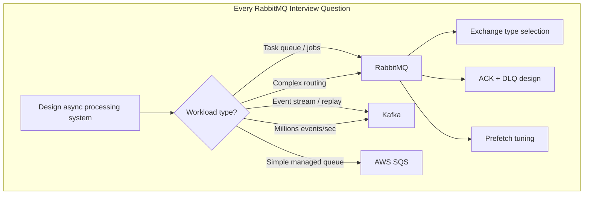

### What "Good" Looks Like in an Interview

| Level | What You Demonstrate |
|-------|---------------------|
| **Junior** | "We'd use a message queue for async tasks" |
| **Mid** | "RabbitMQ with a work queue; multiple workers consume from same queue" |
| **Senior** | "Direct exchange routes by `routing_key`; durable queues + persistent messages; manual ACK with DLQ for failures" |
| **Staff** | "Topic exchange for notification routing; prefetch=10 to prevent one slow consumer hoarding; publisher confirms + idempotent consumers; mirrored queues across AZs; federation for cross-region" |

### What Interviewers Specifically Probe

| Probe Area | What They Want to Hear |
|------------|------------------------|
| **Exchange types** | When to use direct vs fanout vs topic vs headers |
| **Push vs pull** | Broker pushes to consumers (flow control via prefetch) |
| **Message lifecycle** | Deleted after ACK — not retained like Kafka |
| **Durability** | Durable queue + persistent message + cluster — all three needed |
| **DLQ pattern** | Dead letter exchange for poison messages and retries |
| **vs Kafka** | RabbitMQ = smart broker (routing); Kafka = dumb broker, smart consumer |
| **Clustering** | Mirrored queues (classic) or quorum queues (modern) |

---

## 2. Problem Statement — What RabbitMQ Is

### 2.1 The Core Problem RabbitMQ Solves

Synchronous request-response architectures break down when:

| Problem | Without Message Queue | With RabbitMQ |
|---------|----------------------|---------------|
| **Slow downstream** | API blocks until email sent (2–5 sec) | API publishes in 5ms; worker sends async |
| **Traffic spikes** | DB / email service overwhelmed | Queue buffers; workers consume at steady rate |
| **Service coupling** | Service A calls B, C, D directly — cascade failures | A publishes event; B, C, D subscribe independently |
| **Work distribution** | Custom polling / locking in DB | Competing consumers on shared queue |
| **Routing complexity** | if/else chains for notification channels | Exchange + bindings declaratively route |

### 2.2 RabbitMQ in One Sentence

> **RabbitMQ is an open-source message broker implementing AMQP 0-9-1** that receives messages from producers, routes them through exchanges to queues via bindings, and delivers them to consumers — with acknowledgments, persistence, and flexible routing patterns.

### 2.3 AMQP Core Concepts

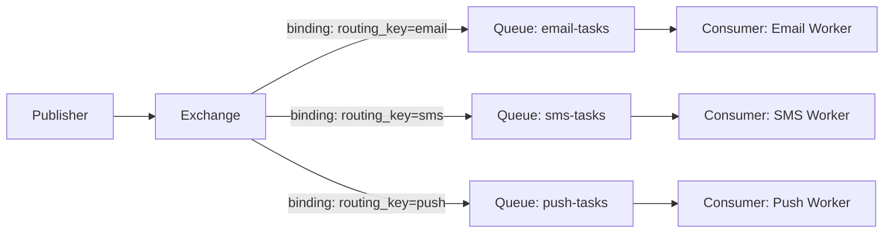

| Concept | Definition | Interview Must-Know |
|---------|------------|---------------------|
| **Producer / Publisher** | Sends messages to an exchange | Never publishes directly to queue (in AMQP) |
| **Exchange** | Routing component — decides which queue(s) receive message | Four types: direct, fanout, topic, headers |
| **Binding** | Link between exchange and queue with routing rules | `routing_key` pattern or header match |
| **Queue** | Buffer storing messages until consumed | Durable vs transient; exclusive vs shared |
| **Consumer** | Receives messages from queue | Competing consumers split work |
| **Routing key** | String set by producer; matched against bindings | `order.created`, `notification.email.us` |
| **Virtual host (vhost)** | Logical namespace isolating exchanges/queues | Like a "tenant" within RabbitMQ cluster |
| **Channel** | Lightweight connection inside TCP connection | Multiplex many channels per connection |
| **Connection** | TCP connection to broker | Expensive to create; reuse with channels |

### 2.4 RabbitMQ vs Queue-Based vs Log-Based Mental Model

```mermaid
graph TB
    subgraph RabbitMQ — Smart Broker
        P1[Producer] --> E1[Exchange<br/>routing logic]
        E1 --> Q1[Queue]
        E1 --> Q2[Queue]
        Q1 --> C1[Consumer]
        Note1[Message deleted after ACK<br/>Broker routes]
    end

    subgraph Kafka — Dumb Broker, Smart Consumer
        P2[Producer] --> L1[Partition Log]
        L1 --> C2[Consumer Group A]
        L1 --> C3[Consumer Group B]
        Note2[Message retained<br/>Consumer tracks offset]
    end
```

**RabbitMQ philosophy:** Push messages to the right consumer queue; broker does routing.

**Kafka philosophy:** Append to log; consumers decide what to read.

---

## 3. Internal Architecture — Deep Dive

### 3.1 Broker Internal Components

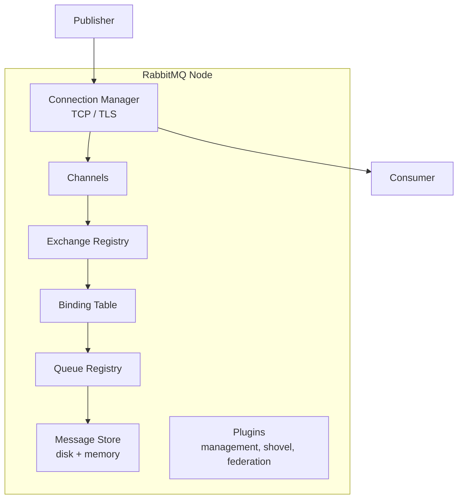

| Component | Function |
|-----------|----------|
| **Exchange registry** | In-memory table of exchange name → type → bindings |
| **Queue registry** | Queue metadata, consumer list, durability flags |
| **Binding table** | Maps (exchange, routing_key pattern) → queue(s) |
| **Message store** | Writes persistent messages to disk (`.rdq` files) |
| **Erlang processes** | One process per queue (classic) — isolation + concurrency |
| **Management plugin** | HTTP API, UI at port 15672 |

### 3.2 Exchange Types — The Heart of Routing

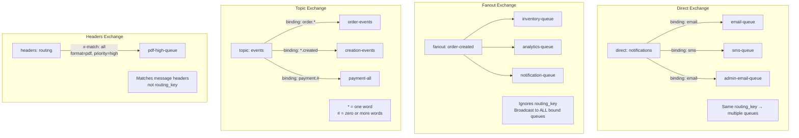

| Exchange Type | Routing Logic | Interview Example |
|---------------|--------------|-------------------|
| **Direct** | Exact `routing_key` match | `routing_key=email` → email queue |
| **Fanout** | Broadcast to all bound queues (ignores routing_key) | Order created → notify all services |
| **Topic** | Pattern match: `*` (one word), `#` (zero+ words) | `payment.us.#` → US payment handlers |
| **Headers** | Match message headers (all or any) | Route by `content_type=pdf` |
| **Default (unnamed)** | Direct exchange named `""` — route by queue name | Quick scripts; queue name = routing key |

### 3.3 Queue Properties

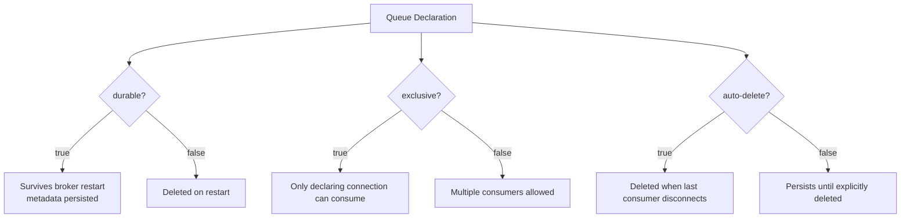

| Property | Durable + Not Auto-Delete | Typical Production Setting |
|----------|--------------------------|---------------------------|
| **durable** | `true` | Always for production queues |
| **exclusive** | `false` | Allow competing consumers |
| **auto-delete** | `false` | Queue survives consumer disconnect |
| **x-message-ttl** | Optional | Per-queue message expiration |
| **x-max-length** | Optional | Queue depth limit (reject or DLX) |
| **x-dead-letter-exchange** | Optional | Route failed/expired messages to DLQ |

### 3.4 Message Properties & Payload

```
Message {
  properties: {
    delivery_mode: 2          // 1=transient, 2=persistent
    content_type: "application/json"
    message_id: "uuid-123"    // idempotency key
    correlation_id: "req-456" // RPC reply matching
    reply_to: "amq.rabbitmq.reply-to"  // callback queue
    expiration: "60000"       // per-message TTL (ms)
    priority: 5               // 0-255 (requires priority queue)
    headers: { retry_count: 2 }
  }
  routing_key: "notification.email"
  exchange: "notifications"
  body: { user_id: 123, template: "welcome" }
}
```

### 3.5 Channels and Connections

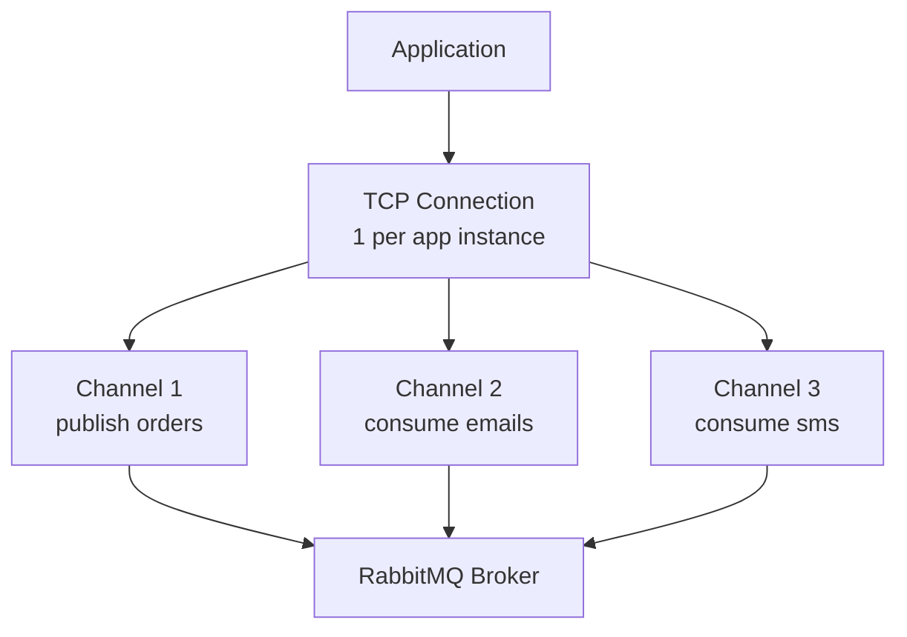

**Why channels matter in interviews:**

> "One TCP connection per service instance (expensive to create), multiple lightweight channels for different publish/consume flows. Channels are not thread-safe — one channel per thread or use connection pooling."

### 3.6 Classic Queues vs Quorum Queues vs Streams

| Queue Type | Consensus | Use Case | Interview Note |
|------------|-----------|----------|----------------|
| **Classic (mirrored)** | Master + mirrors (legacy HA) | General purpose; being phased out for HA | `ha-mode: all` or policy-based mirroring |
| **Quorum queue** | Raft-based replication (RabbitMQ 3.8+) | Production HA default — data safety | Slightly lower throughput; stronger guarantees |
| **Stream queue** | Append-only log (RabbitMQ 3.9+) | High-throughput, replay scenarios | Kafka-like within RabbitMQ; niche |

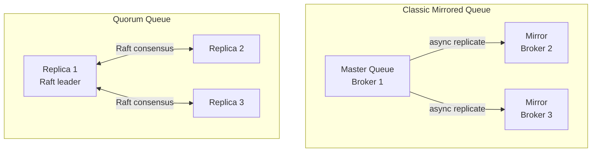

---

## 4. How It Works Step-by-Step

### 4.1 Publisher → Exchange → Routing → Queue → Consumer

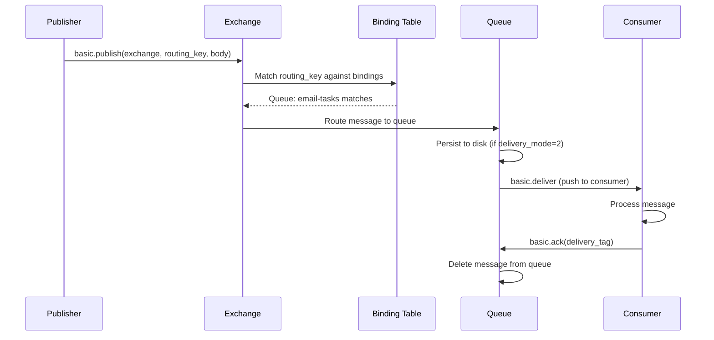

**Step-by-step:**

1. **Publisher** opens connection + channel, declares exchange (idempotent)
2. **Publisher** sends `basic.publish` with exchange name, routing key, properties, body
3. **Exchange** looks up bindings — may route to 0, 1, or N queues
4. **Queue** enqueues message (memory; flushed to disk if persistent)
5. **Broker pushes** to registered consumer (flow-controlled by prefetch)
6. **Consumer** processes and sends `basic.ack` — message removed
7. If no binding matches → message **silently dropped** (unless mandatory flag set)

### 4.2 Mandatory Flag & Return Handler

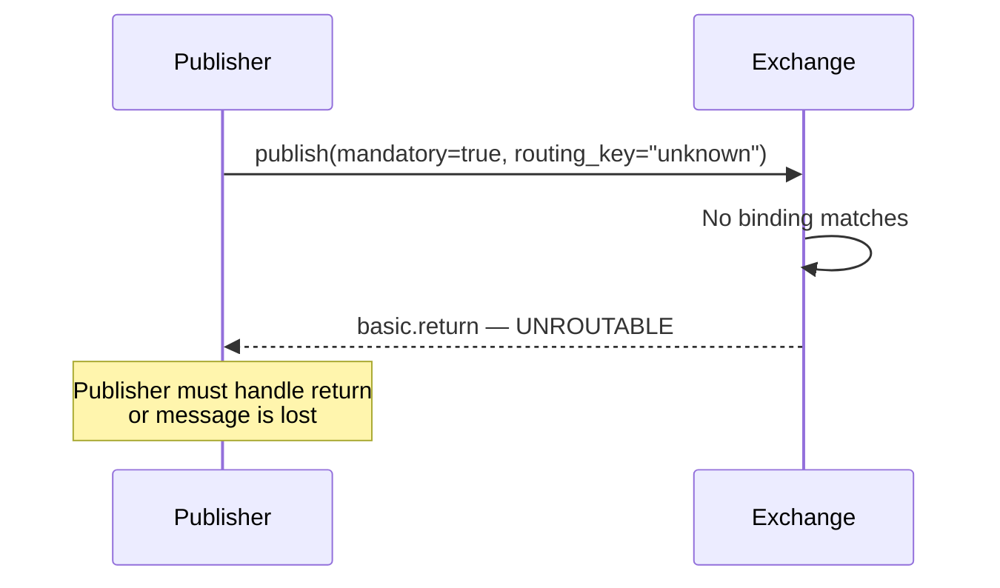

**Interview tip:** Always mention `mandatory=true` + return handler for critical messages, or use publisher confirms.

### 4.3 Work Queue Pattern

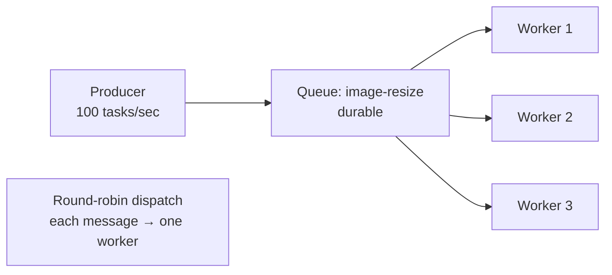

| Property | Behavior |
|----------|----------|
| **Competing consumers** | Broker round-robins messages across consumers |
| **Fair dispatch** | `basic.qos(prefetch_count=1)` — one unacked message per worker |
| **Acknowledgment** | Message requeued if consumer dies before ACK |
| **Scale** | Add more workers → linear throughput (up to broker limit) |

### 4.4 Pub/Sub Pattern (Fanout Exchange)

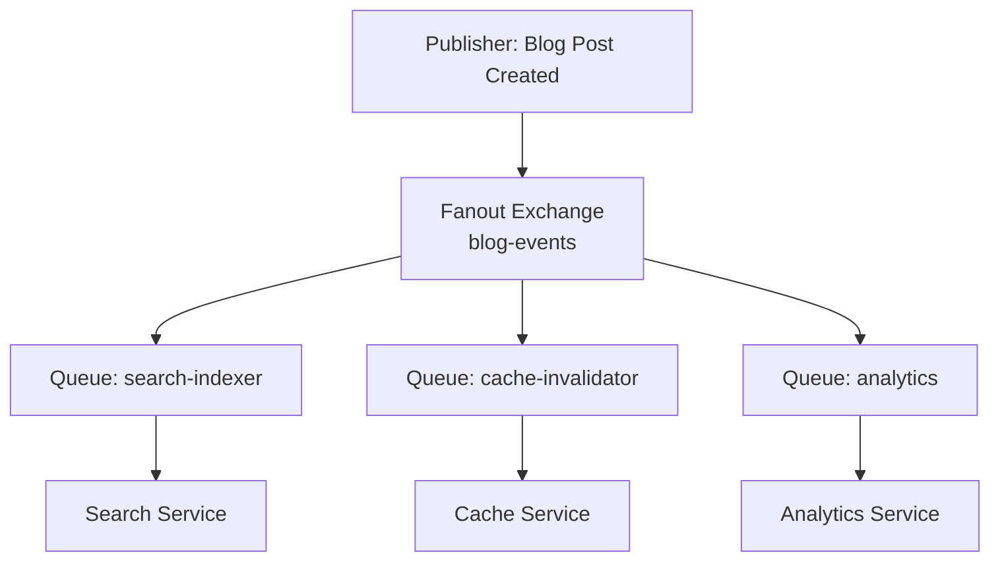

Each service gets its **own queue** bound to the fanout exchange — every message copied to all queues. Unlike Kafka consumer groups, this is true broadcast with independent queues.

### 4.5 Routing Pattern (Direct / Topic Exchange)

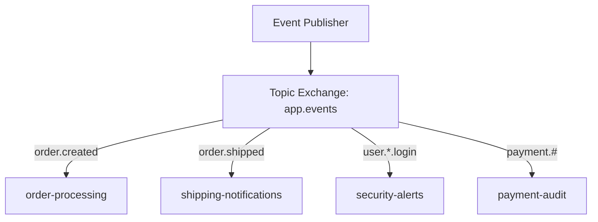

**Topic pattern examples:**

| Routing Key Published | Binding Pattern | Match? |
|----------------------|-----------------|--------|
| `order.created` | `order.created` | ✅ (direct exact) |
| `order.created` | `order.*` | ✅ |
| `order.created.us` | `order.*` | ❌ (* is exactly one word) |
| `order.created.us` | `order.#` | ✅ (# is zero or more words) |
| `payment.us.charge` | `payment.#` | ✅ |
| `payment.us.charge` | `payment.*.charge` | ✅ |

### 4.6 RPC Pattern (Request-Reply)

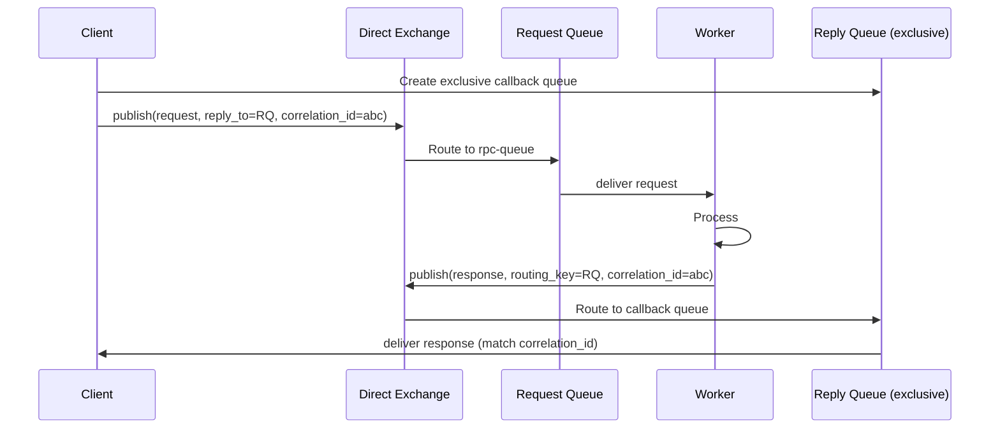

| Element | Purpose |
|---------|---------|
| **`reply_to`** | Queue name for server to send response |
| **`correlation_id`** | Client matches response to request |
| **Exclusive callback queue** | Auto-delete when client disconnects |
| **Direct Reply-To** | Broker-internal pseudo-queue (`amq.rabbitmq.reply-to`) — no queue declare needed |

**Interview caveat:**

> "RabbitMQ RPC works for low-volume internal calls. For high-throughput or public APIs, prefer gRPC/HTTP. RPC over RabbitMQ adds broker dependency to synchronous paths."

### 4.7 Publisher Confirms

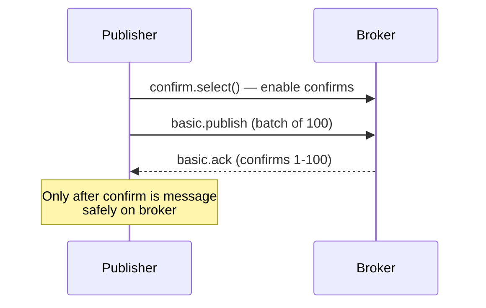

| Confirm Mode | Behavior |
|-------------|----------|
| **Publisher confirms** | Broker ACKs when message routed to queue(s) |
| **Transactional** | Atomic batch publish (slow — avoid in production) |
| **No confirms** | Fire-and-forget — may lose on broker crash |

**Production pattern:**

> "Enable publisher confirms; maintain in-flight counter; retry unconfirmed messages on `nack` or timeout. Combine with persistent messages + durable queues."

### 4.8 Prefetch (QoS) — Flow Control

```mermaid
graph TB
    subgraph Without Prefetch — Unfair
        Q1[Queue: 1000 messages]
        Q1 -->|50 unacked| SLOW[Slow Consumer<br/>hogging messages]
        Q1 -->|0 messages| FAST[Fast Consumer<br/>starved]
    end

    subgraph With prefetch_count=10 — Fair
        Q2[Queue: 1000 messages]
        Q2 -->|10 unacked max| SLOW2[Slow Consumer]
        Q2 -->|10 unacked max| FAST2[Fast Consumer<br/>gets fair share]
    end
```

```java
channel.basicQos(10);  // max 10 unacked messages per consumer
```

| Prefetch Value | Effect |
|----------------|--------|
| **0 (default)** | Unlimited unacked — consumer hoards messages |
| **1** | One at a time — best for long-running tasks |
| **10–100** | Batch efficiency for fast tasks |
| **Too high** | One slow consumer blocks many messages |

---

## 5. Delivery Semantics — Acknowledgments, Durability, DLQ

### 5.1 The Three Delivery Semantics

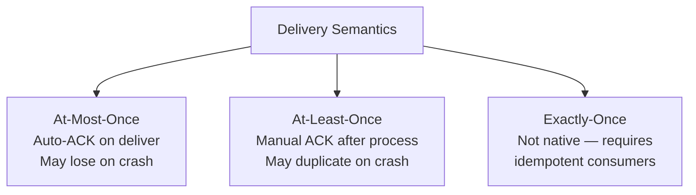

| Semantic | Configuration | Behavior |
|----------|--------------|----------|
| **At-most-once** | `auto_ack=true` | Broker deletes message on deliver; crash = loss |
| **At-least-once** | `auto_ack=false`, manual ACK after processing | Crash before ACK = redelivery (duplicate) |
| **Exactly-once** | Not built-in | Idempotent consumer + dedupe store required |

### 5.2 How At-Least-Once Is Achieved

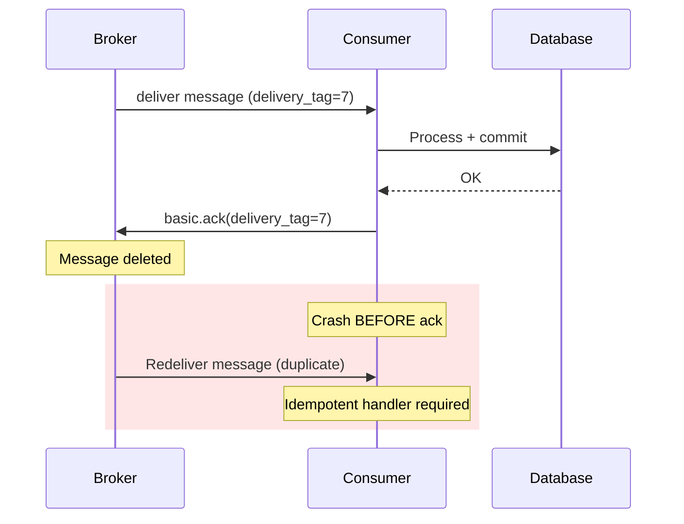

**Three pillars of durability (say all three in interviews):**

1. **Durable queue** — `durable=true` on `queue.declare`
2. **Persistent message** — `delivery_mode=2`
3. **Publisher confirms** — know message reached broker

Missing any one → possible message loss on broker crash.

### 5.3 Acknowledgment Modes

| Mode | API | Use Case |
|------|-----|----------|
| **Auto-ACK** | `auto_ack=true` on `basic.consume` | Metrics, logs — loss acceptable |
| **Manual ACK** | `basic.ack(delivery_tag)` | Production default |
| **Manual NACK** | `basic.nack(requeue=true/false)` | Reject and requeue or dead-letter |
| **Reject** | `basic.reject(requeue=false)` | Single message reject → DLX |

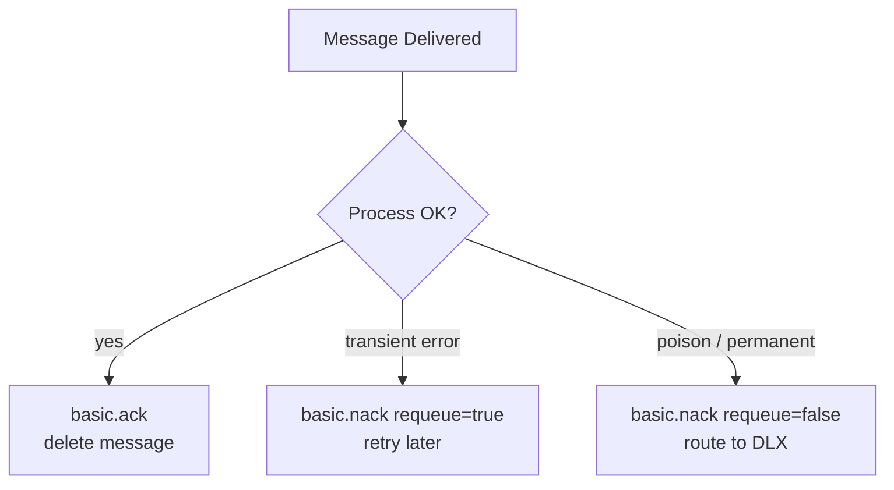

### 5.4 Dead Letter Queue (DLQ) Pattern

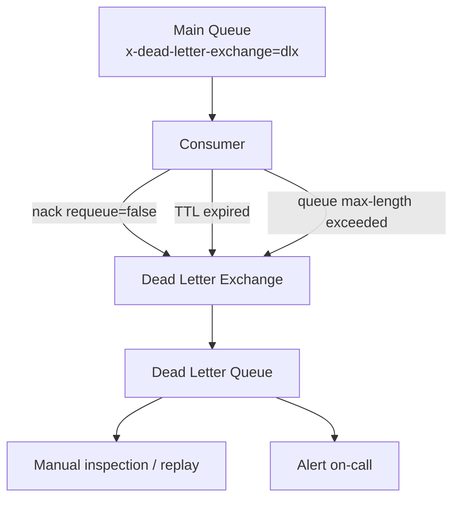

**Dead letter reasons:**

| Reason | Trigger |
|--------|---------|
| **Rejected** | `basic.nack(requeue=false)` or `basic.reject(requeue=false)` |
| **TTL expired** | `x-message-ttl` or `expiration` property exceeded |
| **Queue overflow** | `x-max-length` or `x-max-length-bytes` exceeded |
| **Delivery limit** | `x-delivery-limit` (quorum queues) — max redelivery count |

**Retry with backoff pattern:**

```mermaid
graph LR
    MAIN[work-queue] -->|fail| RETRY[retry-exchange]
    RETRY -->|TTL 30s| WAIT1[retry-30s-queue<br/>x-message-ttl=30000<br/>DLX back to main]
    WAIT1 -->|expire| MAIN
    RETRY -->|TTL 5min| WAIT2[retry-5min-queue]
    WAIT2 -->|expire| MAIN
    MAIN -->|max retries exceeded| DLQ[dead-letter-queue]
```

### 5.5 Message Durability Stack

```mermaid
graph TB
    L1[Layer 1: Durable Exchange<br/>survives restart]
    L2[Layer 2: Durable Queue<br/>metadata persisted]
    L3[Layer 3: Persistent Message<br/>delivery_mode=2]
    L4[Layer 4: Publisher Confirms<br/>broker ACK to publisher]
    L5[Layer 5: Consumer Manual ACK<br/>after successful processing]

    L1 --> L2 --> L3 --> L4 --> L5
    Note[All 5 for production reliability]
```

### 5.6 Priority Queues

```
Queue declare: x-max-priority: 10
Message property: priority: 8

Higher priority messages jump ahead in queue.
Caveat: only effective if consumers are idle enough to reorder.
Not a substitute for separate urgent/normal queues at scale.
```

---

## 6. When to Use / When NOT to Use

### 6.1 RabbitMQ Shines When

| Scenario | Why RabbitMQ |
|----------|-------------|
| **Task / job queues** | Competing consumers; message deleted after processing |
| **Complex routing** | Topic exchange with pattern matching |
| **RPC between services** | Built-in reply-to + correlation_id |
| **Notification routing** | Route by channel, region, priority |
| **Order workflow steps** | Each step is a queue; retry per step |
| **Moderate throughput** | 10K–50K msg/sec per cluster |
| **Per-message TTL** | Expire stale notifications |
| **Priority processing** | Priority queue for urgent tasks |
| **Low latency** | Sub-millisecond to low-ms delivery |

### 6.2 RabbitMQ Is the Wrong Choice When

| Scenario | Better Alternative | Why |
|----------|-------------------|-----|
| **Event replay / audit log** | Kafka | RabbitMQ deletes on ACK |
| **Millions events/sec** | Kafka, Pulsar | RabbitMQ throughput ceiling |
| **Multiple independent readers of same stream** | Kafka consumer groups | RabbitMQ needs separate queues per consumer |
| **Long retention (days/weeks)** | Kafka | RabbitMQ not designed as data store |
| **Stream processing** | Kafka + Flink | No native log replay |
| **Simple queue (no routing)** | AWS SQS | Managed, zero ops |
| **Global geo-replication at scale** | Kafka MirrorMaker, Pulsar | Federation is operationally complex |

```mermaid
graph TB
    subgraph Use RabbitMQ
        R1[Job processing]
        R2[Notification routing]
        R3[Order workflow]
        R4[RPC pattern]
        R5[Priority tasks]
        R6[Per-message TTL + DLQ]
    end

    subgraph Use Kafka
        K1[Event sourcing]
        K2[Analytics pipeline]
        K3[CDC / log aggregation]
        K4[Replay / reprocessing]
        K5[Multi-consumer fan-out at scale]
    end
```

### 6.3 RabbitMQ vs Kafka — Master Comparison Table

| Dimension | RabbitMQ | Kafka |
|-----------|----------|-------|
| **Protocol** | AMQP 0-9-1 (plus MQTT, STOMP) | Custom binary protocol |
| **Model** | Queue + exchange routing | Partitioned commit log |
| **Message lifecycle** | Deleted after consumer ACK | Retained per topic policy |
| **Routing** | Rich (4 exchange types) | Topic + partition key only |
| **Consumer** | Push (broker delivers) | Pull (consumer fetches) |
| **Throughput** | 10K–50K msg/sec | 1M+ msg/sec |
| **Latency** | Sub-ms to low ms | ms to seconds |
| **Replay** | Not native (need shovel/replay tool) | Native offset rewind |
| **Ordering** | Per queue (single consumer) | Per partition |
| **Priority** | Built-in priority queues | Not supported |
| **DLQ** | Native via dead letter exchange | Custom implementation |
| **Ops** | Medium (Erlang cluster) | High (JVM, ZooKeeper/KRaft) |
| **Managed options** | Amazon MQ, CloudAMQP | MSK, Confluent Cloud |

### 6.4 RabbitMQ vs AWS SQS

| Dimension | RabbitMQ | AWS SQS |
|-----------|----------|---------|
| **Routing** | Exchanges, topic patterns | Single queue (SNS fan-out for multi) |
| **Latency** | Lower (self-hosted) | 10–100ms |
| **Ordering** | Single consumer per queue | FIFO queues (300 msg/sec limit) |
| **Ops** | Self-managed or Amazon MQ | Fully managed |
| **Cost model** | Infra cost | Per-request pricing |
| **Prefetch** | Fine-grained QoS | Long polling (up to 20 sec) |
| **Best for** | Complex routing, low latency | Simple decoupling, AWS-native |

---

## 7. How RabbitMQ Fits Into System Design Questions

### 7.1 Notification System

```mermaid
graph TB
    API[Any Service] --> PUB[Notification Publisher]
    PUB --> TE[Topic Exchange<br/>notifications]
    TE -->|email.us| EQ[email-us-queue]
    TE -->|email.eu| EUEQ[email-eu-queue]
    TE -->|push.ios| PQ[push-ios-queue]
    TE -->|push.android| PAQ[push-android-queue]
    TE -->|sms| SQ[sms-queue]
    EQ --> EW[Email Workers]
    EUEQ --> EWEU[EU Email Workers<br/>GDPR region]
    PQ --> PW[Push Workers]
    SQ --> SW[SMS Workers]
    EW -->|fail| DLQ[DLQ + retry queues]
```

**What to say:**

> "API publishes notification event with routing key `email.us` to topic exchange. Bindings route to region-specific email queues for data residency. Each channel has independent workers scaling independently. Durable queues, persistent messages, publisher confirms. Manual ACK after third-party provider confirms delivery. Failed messages go to retry queue with 30s TTL backoff, then DLQ after 5 attempts. Idempotent sends using `message_id` dedup in Redis."

**Why RabbitMQ over Kafka:**

- Complex routing by channel + region + priority
- Per-message TTL (expire stale OTP codes)
- Native DLQ for failed push/email
- Lower latency for time-sensitive OTP

### 7.2 Payment Gateway — Order Processing Workflow

```mermaid
graph LR
    API[Payment API] --> EX[Direct Exchange<br/>payments]
    EX -->|charge| CQ[charge-queue]
    CQ --> PS[Payment Service<br/>process charge]
    PS -->|success| EX2[Fanout: payment-success]
    EX2 --> IQ[inventory-queue]
    EX2 --> NQ[notification-queue]
    EX2 --> AQ[analytics-queue]
    PS -->|fail| DLQ[payment-dlq]
    IQ --> INV[Inventory Service]
```

**What to say:**

> "Payment API validates synchronously, then publishes `charge` message to durable queue — returns 202 Accepted immediately. Payment worker processes charge with Stripe, ACKs on success. Fanout exchange broadcasts `payment-success` to inventory, notification, and analytics queues. Each downstream service has its own queue — failure in inventory doesn't block notification. At-least-once with idempotent payment handler (`payment_id` uniqueness constraint in DB)."

**Saga pattern mention:**

> "If inventory fails after payment succeeds, use compensating transaction (refund) published to `refund-queue` — choreography via messages, not distributed 2PC."

### 7.3 Job Processing (Image / Video / Report Generation)

```mermaid
graph TB
    U[User uploads video] --> API[Upload API]
    API --> S3[(S3 storage)]
    API --> PUB[Publish job]
    PUB --> Q[transcode-queue<br/>x-max-priority: 10]
    Q --> W1[Worker 1<br/>prefetch=1]
    Q --> W2[Worker 2]
    Q --> W3[Worker 3]
    W1 --> S3OUT[(Transcoded output)]
    W1 --> STATUS[Update job status in DB]
    W1 -->|fail after 3 retries| DLQ[transcode-dlq]
```

| Design Choice | Rationale |
|---------------|-----------|
| **prefetch=1** | Long-running transcode — one job per worker |
| **Priority queue** | Premium users get `priority=8` |
| **Durable + persistent** | Job not lost on broker restart |
| **DLQ** | Inspect failed transcodes manually |
| **Idempotent workers** | Same `job_id` won't re-transcode if already done |

### 7.4 Instagram-Style System — Where RabbitMQ Fits

```mermaid
graph TB
    POST[Post Service] --> K[Kafka: post-events<br/>high volume stream]
    K --> FAN[Fan-out Service]
    FAN --> RMQ[RabbitMQ: per-channel delivery]
    RMQ --> PUSH[Push notification queue]
    RMQ --> EMAIL[Email digest queue]
    Note[Kafka for event bus<br/>RabbitMQ for delivery routing]
```

**Hybrid architecture (staff-level answer):**

> "Kafka ingests all post events for analytics, search indexing, and feed fan-out. For notification *delivery* — which needs routing by user preferences, channel, locale, and retry logic — RabbitMQ topic exchange is more appropriate. This is a hybrid: Kafka for streaming scale, RabbitMQ for smart routing and task delivery."

### 7.5 Uber-Style System — Where RabbitMQ Fits

```mermaid
graph TB
    LOC[Location Gateway] --> K[Kafka: location-stream<br/>millions/sec]
    RIDE[Ride Service] --> RMQ[RabbitMQ]
    RMQ --> MQ[match-queue]
    RMQ --> NQ[driver-notification-queue]
    RMQ --> PQ[payment-queue]
    MQ --> MATCH[Matching Engine]
    NQ --> NOTIFY[Push to driver<br/>low latency]
```

> "Real-time location streaming goes to Kafka (throughput + multiple consumers). Ride lifecycle events (request, accept, complete, pay) go through RabbitMQ — lower volume, need routing, priority, and RPC-style request for driver matching with timeout and DLQ for unmatched rides."

### 7.6 Rate Limiting / Throttling with RabbitMQ

```mermaid
graph LR
    BURST[Traffic Burst<br/>10K req/sec] --> PUB[Publisher] --> Q[buffer-queue<br/>x-max-length: 100000]
    Q -->|steady 500/sec| W[Workers]
    Q -->|overflow| DLQ[overflow-dlq]
```

> "Queue acts as a buffer absorbing bursts. Workers consume at sustainable rate. `x-max-length` prevents unbounded memory growth — overflow to DLQ or reject with publisher confirm nack."

---

## 8. Scaling & Reliability

### 8.1 Vertical vs Horizontal Scaling

```mermaid
graph TB
    subgraph Vertical
        V1[Single Node<br/>32 GB RAM] --> V2[Bigger Node<br/>128 GB RAM]
        NoteV[Limited by single machine<br/>Erlang single-node ceiling]
    end

    subgraph Horizontal — Cluster
        N1[Node 1<br/>queues A, C]
        N2[Node 2<br/>queues B, D]
        N3[Node 3<br/>mirrors]
        N1 <-->|cluster| N2
        N2 <-->|cluster| N3
        N1 <-->|cluster| N3
    end
```

| Approach | Limit | Notes |
|----------|-------|-------|
| **Vertical** | ~100K–200K msg/sec per node | Fastest path; single point of failure |
| **Horizontal cluster** | Linear with nodes | Queues distributed across nodes |
| **Multiple clusters + federation** | Geographic scale | Cross-cluster message forwarding |
| **Sharding (rabbitmq-sharding plugin)** | Hash routing key → queue shard | Rare; Kafka better for extreme scale |

### 8.2 Clustering Architecture

```mermaid
graph TB
    subgraph RabbitMQ Cluster
        N1[Node 1<br/>rabbit@node1<br/>Disc node]
        N2[Node 2<br/>rabbit@node2<br/>Disc node]
        N3[Node 3<br/>rabbit@node3<br/>RAM node]
    end

    CLIENT[Clients] --> N1
    CLIENT --> N2
    Note[All nodes share metadata<br/>Queue data on hosting node<br/>Mirrors on other nodes]
```

| Node Type | Stores | Use |
|-----------|--------|-----|
| **Disc node** | Metadata + messages on disk | Production default |
| **RAM node** | Metadata only; queue data in RAM | Faster; less durable |

**Cluster facts for interviews:**

- All nodes in cluster share **metadata** (exchanges, bindings, queue definitions)
- **Queue data lives on one node** (master) — not automatically distributed
- **Consumers should connect to multiple nodes** — client libraries handle failover
- **Network partition** → pause minority partition (CP behavior) or auto-heal

### 8.3 Mirrored Queues (Classic HA)

```mermaid
graph TB
    subgraph Mirrored Queue: order-processing
        MASTER[Master: Node 1<br/>all writes]
        MIRROR1[Mirror: Node 2<br/>sync replica]
        MIRROR2[Mirror: Node 3<br/>sync replica]
        MASTER -->|sync| MIRROR1
        MASTER -->|sync| MIRROR2
    end

    MASTER -->|dies| PROMOTE[Promote mirror to master<br/>automatic failover]
```

| Policy | Effect |
|--------|--------|
| `ha-mode: all` | Mirror to all cluster nodes |
| `ha-mode: exactly 2` | Mirror to 2 nodes total |
| `ha-sync-mode: automatic` | New mirrors sync existing messages |

**Modern recommendation:** Use **quorum queues** instead of classic mirrored queues for new deployments.

### 8.4 Quorum Queues (Recommended HA)

```mermaid
sequenceDiagram
    participant P as Publisher
    participant L as Leader Replica
    participant F1 as Follower 1
    participant F2 as Follower 2
    participant C as Consumer

    P->>L: publish message
    L->>F1: replicate (Raft)
    L->>F2: replicate (Raft)
    F1-->>L: quorum ACK
    F2-->>L: quorum ACK
    L-->>P: confirm
    C->>L: consume
    C->>L: ack
```

| Feature | Classic Mirrored | Quorum Queue |
|---------|-----------------|--------------|
| **Consensus** | Master-mirror (older) | Raft |
| **Data safety** | Good (with sync) | Stronger — Raft quorum |
| **Performance** | Higher throughput | ~30% lower throughput |
| **Poison message handling** | Manual | `x-delivery-limit` built-in |
| **Interview answer** | "Legacy HA" | "Default for new production queues" |

### 8.5 Federation — Cross-Cluster / Cross-Region

```mermaid
graph LR
    subgraph US Cluster
        USE[exchange: us-events]
        USQ[queue: us-work]
    end
    subgraph EU Cluster
        EUE[exchange: eu-events]
        EUQ[queue: eu-work]
    end
    USE -->|federation upstream| EUE
    Note[One-way message flow<br/>US publishes → EU consumes<br/>Not bidirectional by default]
```

| Use Case | Pattern |
|----------|---------|
| **Geo-distributed workers** | Federation upstream from central to regional clusters |
| **Overflow scaling** | Shovel plugin moves messages between clusters |
| **Disaster recovery** | Federation to DR cluster (async) |

### 8.6 Shovel Plugin — Reliable Message Transfer

```mermaid
graph LR
    C1[Cluster 1<br/>queue: backlog] -->|Shovel<br/>auto-reconnect| C2[Cluster 2<br/>queue: processing]
```

> "Shovel consumes from source queue and publishes to destination — built-in reconnection and ack. Used for cluster migration, bridging, and overflow."

### 8.7 Connection & Consumer Scaling Guidelines

| Resource | Guideline |
|----------|-----------|
| **Connections** | 1 per application instance (pool at app level) |
| **Channels** | 1 per thread; hundreds per connection |
| **Consumers** | Match worker count; prefetch tunes parallelism per consumer |
| **Queues** | Thousands OK; tens of thousands — metadata pressure |
| **Messages/sec per node** | 10K–50K typical; benchmark your payload size |

---

## 9. Failure Modes

### 9.1 Broker Crash / Node Failure

```mermaid
sequenceDiagram
    participant C as Consumer
    participant N1 as Node 1 (Master)
    participant N2 as Node 2 (Mirror)

    Note over N1: Node 1 crashes
    N2->>N2: Promoted to master (mirrored queue)
    C->>C: Connection lost — reconnect
    C->>N2: Resume consuming
    Note over C: Unacked messages requeued<br/>to new master
```

| Scenario | Impact | Mitigation |
|----------|--------|------------|
| **Master node dies (mirrored)** | Brief failover; unacked messages requeued | Quorum/mirrored queues; client auto-reconnect |
| **Non-mirrored queue node dies** | Queue unavailable until node returns | Always mirror or use quorum queues |
| **Entire cluster down** | Total messaging outage | Multi-AZ cluster; DR cluster with federation |
| **Disk failure** | Message loss if not replicated | Quorum queues; monitor disk alarms |

### 9.2 Network Partition

```mermaid
graph TB
    subgraph Partition A — Majority
        N1[Node 1]
        N2[Node 2]
    end
    subgraph Partition B — Minority
        N3[Node 3<br/>PAUSED]
    end
    Note[RabbitMQ pauses minority partition<br/>prevents split-brain<br/>CP behavior]
```

> "RabbitMQ cluster prefers consistency over availability during partition — minority side pauses. Clients on minority can't publish/consume until partition heals."

### 9.3 Poison Messages

```mermaid
flowchart TD
    POISON[Poison Message<br/>always crashes consumer] --> DELIVER[Delivered to consumer]
    DELIVER --> CRASH[Consumer crashes<br/>no ACK]
    CRASH --> REDELIVER[Message requeued]
    REDELIVER --> DELIVER
    DELIVER -->|x-delivery-limit=3| DLQ[Dead Letter Queue]
    DLQ --> FIX[Fix message / deploy fix]
    FIX --> REPLAY[Manual replay to main queue]
```

| Mitigation | How |
|------------|-----|
| **DLX + max retries** | `x-delivery-limit: 3` on quorum queue |
| **Retry queues with TTL** | Exponential backoff before re-attempt |
| **Circuit breaker** | Stop consuming if error rate > threshold |
| **Validation at publish** | Schema check before enqueue |

### 9.4 Consumer Lag (Queue Depth Growing)

```mermaid
graph TB
    LAG[Queue Depth Growing] --> R1[Insufficient consumers<br/>add workers]
    LAG --> R2[Slow processing<br/>optimize or prefetch tune]
    LAG --> R3[Downstream bottleneck<br/>DB, API timeout]
    LAG --> R4[Publisher surge<br/>expected — queue buffering working]
    LAG --> R5[Consumer crash loop<br/>poison message]
```

| Metric | Alert | Action |
|--------|-------|--------|
| `queue_depth` | > 10K for 5 min | Scale consumers |
| `consumer_utilization` | < 50% | Increase prefetch or fix slow handler |
| `ack_rate` | Dropping | Investigate downstream |
| `memory alarm` | Broker paging | Increase RAM; add consumers; TTL old messages |

### 9.5 Memory & Disk Alarms

| Alarm | Trigger | Broker Behavior |
|-------|---------|----------------|
| **Memory alarm** | RAM usage > 40% (configurable) | Blocks publishers; consumers still work |
| **Disk alarm** | Free disk < 50 MB (configurable) | Blocks publishers |
| **Flow control** | Credit-based to slow fast publishers | Backpressure propagation |

**Interview answer:**

> "Monitor `rabbitmqctl status` memory and disk. Set queue TTL and max-length to prevent unbounded growth. Use lazy queues (`x-queue-mode: lazy`) for very deep queues — messages go to disk immediately."

### 9.6 Publisher Failures

| Failure | Symptom | Fix |
|---------|---------|-----|
| **No publisher confirms** | Silent message loss on crash | Enable confirm.select + retry |
| **Unroutable message** | Message dropped (no binding) | `mandatory=true` + return handler |
| **Broker memory alarm** | `basic.nack` or channel close | Slow publish rate; drain queues |
| **Channel exception** | Publish fails mid-batch | Per-message confirm tracking; retry unconfirmed |

---

## 10. Trade-offs

### 10.1 Exchange Type Selection

| Need | Exchange | Why Not Other |
|------|----------|---------------|
| Broadcast to all services | Fanout | Direct requires N bindings with same key |
| Route by exact category | Direct | Topic is overkill |
| Route by hierarchical pattern | Topic | Direct can't pattern match |
| Route by metadata attributes | Headers | More flexible but slower than topic |
| Simple point-to-point | Default (queue name as key) | No routing flexibility |

### 10.2 Durability vs Performance

```mermaid
graph LR
    subgraph Max Durability
        D1[durable queue]
        D2[persistent messages]
        D3[publisher confirms]
        D4[quorum queue]
        D5[manual consumer ACK]
    end

    subgraph Max Performance
        P1[transient queue]
        P2[non-persistent messages]
        P3[no confirms]
        P4[auto-ACK]
    end
```

| Configuration | Throughput | Durability |
|---------------|-----------|------------|
| Transient + auto-ACK | Highest | Messages lost on any failure |
| Durable + persistent + confirms + manual ACK | ~30–50% lower | Production-grade |
| Lazy queue mode | Better with deep queues | Slight consume latency increase |

### 10.3 Push vs Pull (RabbitMQ vs Kafka)

| Aspect | RabbitMQ (Push) | Kafka (Pull) |
|--------|----------------|--------------|
| **Flow control** | Prefetch count | Consumer fetch rate |
| **Backpressure** | Broker stops pushing when prefetch full | Consumer controls poll rate |
| **Slow consumer** | Can hoard with high prefetch | Independent offset lag |
| **Latency** | Lower (immediate push) | Higher (poll interval) |
| **Burst handling** | Queue buffers; push when ready | Log retains; consumer catches up |

### 10.4 Master Trade-offs Table

| Choice | Gain | Cost |
|--------|------|------|
| **RabbitMQ over Kafka** | Routing, low latency, DLQ, priority | No replay; lower throughput ceiling |
| **RabbitMQ over SQS** | Complex routing, lower latency | Self-managed ops |
| **Quorum queues** | Strong durability (Raft) | ~30% throughput vs classic |
| **Classic mirrored queues** | Higher throughput | Weaker guarantees; deprecated path |
| **Federation** | Geographic distribution | Async; operational complexity |
| **High prefetch** | Batch efficiency | Unfair distribution to slow consumers |
| **Auto-ACK** | Simplicity | Message loss on crash |
| **Transactional publish** | Atomic batch | 10–100× slower — avoid |

---

## 11. Interview Cheat Sheet

### Key Numbers to Memorize

| Metric | Value |
|--------|-------|
| Typical throughput per node | 10K–50K msg/sec (payload dependent) |
| Latency (local network) | Sub-ms to low ms |
| Max priority levels | 255 (typically use 0–10) |
| Default prefetch | Unlimited (set explicitly!) |
| Quorum queue replicas | Odd number (3 or 5) |
| AMQP default port | 5672 |
| Management UI port | 15672 |
| Federation/Shovel | Async cross-cluster |
| SQS FIFO throughput | 300 msg/sec per queue |
| Message persistence flag | `delivery_mode=2` |

### One-Liner Definitions

| Term | One-Liner |
|------|-----------|
| **Exchange** | Routes messages to queues based on type and bindings |
| **Binding** | Link between exchange and queue with routing rules |
| **Routing key** | String producer sets; matched by exchange for routing |
| **Direct exchange** | Routes to queues whose binding key exactly matches routing key |
| **Fanout exchange** | Broadcasts to all bound queues; ignores routing key |
| **Topic exchange** | Pattern-based routing: `*` = one word, `#` = zero or more |
| **Dead letter exchange** | Receives messages rejected, expired, or queue-overflowed |
| **Prefetch (QoS)** | Max unacked messages per consumer — flow control |
| **Publisher confirms** | Broker ACKs that message reached queue |
| **Quorum queue** | Raft-replicated queue — modern HA default |
| **Competing consumers** | Multiple consumers on one queue; round-robin dispatch |
| **vhost** | Virtual host — isolated namespace within cluster |
| **Shovel** | Plugin that reliably moves messages between brokers |
| **Federation** | One-way exchange/queue replication across clusters |

### Architecture Checklist (Say Proactively)

- [ ] **Exchange type** chosen for routing needs (topic for notifications)
- [ ] **Durable queue** + **persistent messages** + **publisher confirms**
- [ ] **Manual consumer ACK** after successful processing
- [ ] **Prefetch tuned** — `1` for long tasks, `10–50` for fast tasks
- [ ] **DLQ configured** with `x-dead-letter-exchange` + alert on depth
- [ ] **Idempotent consumers** — dedupe by `message_id`
- [ ] **Quorum queues** for HA (not unmirrored classic)
- [ ] **mandatory=true** or confirms for unroutable detection
- [ ] **Queue TTL / max-length** to prevent memory exhaustion
- [ ] **Client reconnection** logic with exponential backoff

### Quick Decision: RabbitMQ or Not?

```
USE RABBITMQ when:
  ✓ Task queue / job processing
  ✓ Complex routing (topic, headers)
  ✓ RPC / request-reply between services
  ✓ Per-message TTL, priority, DLQ
  ✓ Moderate throughput (< 50K/sec)
  ✓ Low latency delivery (< 10ms)
  ✓ Message deleted after processing

DON'T USE RABBITMQ when:
  ✗ Need event replay / audit log
  ✗ Millions events/sec
  ✗ Multiple independent readers on same data stream
  ✗ Long retention (days/weeks) as primary store
  ✗ Stream processing with offset rewind
  ✗ Zero ops preference → use SQS
```

### Pattern → Exchange Quick Reference

| Pattern | Exchange | Queue Setup |
|---------|----------|-------------|
| Work queue | Default or direct | Single shared queue; competing consumers |
| Pub/sub | Fanout | Separate queue per subscriber, all bound |
| Routing | Direct | One queue per routing key |
| Topics | Topic | Queues bound with patterns (`order.*`) |
| RPC | Direct | Request queue + exclusive reply queue |
| Delayed retry | DLX + TTL queues | Retry queue expires → routes back to main |
| Priority | Direct + `x-max-priority` | Single queue with priority property |

---

## 12. Follow-Up Questions & Model Answers

**Q1: Explain the difference between exchange and queue.**

> An **exchange** is a routing table — it receives messages from publishers and routes them to queues based on exchange type and bindings. A **queue** is a buffer that stores messages until consumers process them. In AMQP, publishers never send directly to queues — always through an exchange. Exception: default exchange (`""`) routes by queue name as routing key.

**Q2: How do you guarantee a message is not lost?**

> Four layers: (1) durable queue, (2) persistent message (`delivery_mode=2`), (3) publisher confirms, (4) manual consumer ACK after processing. All four together give at-least-once. Exactly-once requires idempotent consumer with dedupe by `message_id`.

**Q3: What is prefetch and why does it matter?**

> `basic.qos(prefetch_count=N)` limits unacked messages per consumer. Without it, a slow consumer hoards messages while fast consumers starve. For long-running jobs, `prefetch=1`. For fast tasks, `prefetch=10–50` for batch efficiency.

**Q4: How does a dead letter queue work?**

> Configure main queue with `x-dead-letter-exchange` pointing to a DLX. Messages arrive at DLQ when: consumer nacks with `requeue=false`, message TTL expires, or queue exceeds `x-max-length`. DLQ enables inspection, alerting, and manual replay.

**Q5: RabbitMQ vs Kafka for a notification system?**

> RabbitMQ: topic exchange routes by channel/region/priority; per-message TTL for OTP expiry; native DLQ for failed push; sub-ms latency. Kafka: better if notifications are part of a larger event stream needing replay, analytics fan-out, or millions/sec. Hybrid: Kafka ingests events, RabbitMQ handles delivery routing.

**Q6: What happens when a consumer crashes before ACK?**

> Broker detects channel closure, requeues all unacked messages. Another consumer receives them — at-least-once delivery (possible duplicate). Consumer must be idempotent. With `x-delivery-limit` on quorum queues, message goes to DLQ after N redeliveries instead of infinite loop.

**Q7: How do you scale RabbitMQ?**

> Add consumers (competing consumers on same queue) for processing scale. Add cluster nodes for capacity, but queue data is on one node — use quorum queues for HA. For geographic scale, use federation or shovel. Beyond ~50K msg/sec, consider Kafka or partitioning with sharding plugin.

**Q8: What is a quorum queue and why use it?**

> Quorum queues use Raft consensus to replicate messages across cluster nodes. Unlike classic mirrored queues, they provide stronger consistency guarantees and built-in `x-delivery-limit`. Recommended for all new HA deployments. Trade-off: ~30% lower throughput than classic queues.

**Q9: How would you implement delayed message retry?**

> Create retry queue with `x-message-ttl=30000` (30 sec) and `x-dead-letter-exchange` pointing back to main exchange. On failure, publish to retry queue. After TTL expires, message dead-letters back to main queue for reprocessing. Use multiple retry queues (30s, 5min, 30min) for exponential backoff.

**Q10: Explain the RPC pattern in RabbitMQ.**

> Client creates exclusive callback queue, publishes request with `reply_to=callback_queue` and `correlation_id=unique_id`. Server processes and publishes response to callback queue with same `correlation_id`. Client matches response. For simple cases, use `amq.rabbitmq.reply-to` pseudo-queue. Prefer gRPC for high-throughput RPC.

**Q11: What is the difference between `basic.reject` and `basic.nack`?**

> `reject` handles a single message; `nack` can handle multiple (bulk). Both support `requeue=true` (requeue) or `requeue=false` (dead-letter). `nack` is preferred in modern clients.

**Q12: How do you handle priority messages?**

> Declare queue with `x-max-priority: 10`. Publish with `priority` property (0–10). Higher priority messages dequeue first. Works best when queue has backlog and multiple priority levels. For extreme priority needs, use separate queues (urgent vs normal) with dedicated consumers.

**Q13: What causes memory alarms and how do you fix them?**

> Unbounded queue growth — consumers slower than producers. Fix: add consumers, set `x-max-length` + DLX, set message TTL, use lazy queue mode, or scale cluster. Memory alarm blocks publishers to protect broker from OOM.

**Q14: Can RabbitMQ replace Kafka?**

> No for event streaming at scale. RabbitMQ deletes messages on consume, lacks native replay, and has lower throughput ceiling. Can replace Kafka for low-volume event-driven microservices where routing complexity matters more than replay. Some teams use RabbitMQ streams (3.9+) for niche replay needs.

**Q15: How do you migrate from RabbitMQ to Kafka (or vice versa)?**

> Dual-publish during migration. For RabbitMQ → Kafka: add Kafka as event log, consumers gradually shift. For Kafka → RabbitMQ: only for delivery/routing layers where Kafka is overkill. Most large systems use both in hybrid architecture.

---

## 13. Common Mistakes That Fail Interviews

### Mistake 1: "Publish directly to a queue"

**Wrong.** In AMQP, publishers send to exchanges.

**Right.** "Publisher sends to topic exchange with routing key; bindings route to appropriate queue(s)."

### Mistake 2: "Durable queue = messages survive restart"

**Wrong.** Durable queue only persists queue **metadata**. Messages need `delivery_mode=2`.

**Right.** "Durable queue + persistent messages + publisher confirms — all three required."

### Mistake 3: Auto-ACK for payment or order processing

**Wrong.** Message lost if consumer crashes mid-processing.

**Right.** Manual ACK after DB commit; idempotent handler for redelivery duplicates.

### Mistake 4: No DLQ for production queues

**Wrong.** Poison message crashes consumer in infinite loop.

**Right.** Always configure DLX; alert on DLQ depth; `x-delivery-limit` on quorum queues.

### Mistake 5: "RabbitMQ and Kafka are interchangeable"

**Wrong.** Fundamentally different models.

**Right.** "RabbitMQ for task queues and routing; Kafka for event streaming and replay. Hybrid architectures use both."

### Mistake 6: Ignoring prefetch

**Wrong.** Default unlimited prefetch — slow consumer hoards messages.

**Right.** "prefetch=1 for long transcode jobs; prefetch=10 for email sending."

### Mistake 7: Single queue for both urgent and bulk traffic

**Wrong.** Bulk processing starves urgent messages (even with priority).

**Right.** Separate queues with dedicated consumers for SLA tiers.

### Mistake 8: No publisher confirms

**Wrong.** Publisher thinks message is sent; broker crash = silent loss.

**Right.** Enable confirms; retry unconfirmed messages.

### Mistake 9: "Scale RabbitMQ by adding queues"

**Wrong.** More queues don't scale one workload — more consumers on same queue do.

**Right.** Competing consumers on shared queue; add nodes for HA and capacity.

### Mistake 10: Using classic mirrored queues without knowing quorum

At senior+ level, mention quorum queues as modern HA default.

### Mistake 11: Fanout when you mean pub/sub with selective interest

**Wrong.** Fanout sends to ALL bound queues — no filtering.

**Right.** Use topic exchange if subscribers want subsets (`order.*` vs `payment.*`).

### Mistake 12: No queue bounds

**Wrong.** Unbounded queue → memory alarm → all publishers blocked.

**Right.** `x-max-length`, message TTL, lazy queue mode, consumer scaling.

### Mistake 13: Treating federation as synchronous replication

**Wrong.** Federation is async — messages can be lost if upstream dies before forward.

**Right.** Federation for geographic distribution with acceptance of eventual delivery.

### Mistake 14: RPC over RabbitMQ for user-facing synchronous API

**Wrong.** Adds broker dependency and latency to critical path.

**Right.** gRPC/HTTP for sync; RabbitMQ for async side effects.

### Mistake 15: Forgetting idempotency with at-least-once

Every manual ACK system duplicates on redelivery. Always mention `message_id` dedup.

---

## Appendix A: Sample 5-Minute RabbitMQ Pitch (Interview Opener)

> "For async processing I'd use RabbitMQ as the message broker. Producers publish to a topic exchange with routing keys like `notification.email.us`. Bindings route to durable, quorum-backed queues per channel and region. Messages are persistent with publisher confirms. Workers compete as consumers with prefetch=10 for fair dispatch. Manual ACK after successful delivery to the third-party provider. Failed messages retry via TTL-backed retry queues with exponential backoff, then land in DLQ for inspection. `message_id` provides consumer idempotency. This gives at-least-once delivery with routing flexibility Kafka doesn't natively provide, at the cost of no event replay — which is fine for task delivery workloads."

---

## Appendix B: RabbitMQ Ecosystem (Name-Drop Appropriately)

| Tool / Plugin | Purpose |
|---------------|---------|
| **Management plugin** | Web UI + HTTP API for monitoring |
| **Shovel** | Reliable inter-broker message transfer |
| **Federation** | Cross-cluster exchange/queue upstream |
| **Delayed Message Exchange** | Plugin for scheduled delivery |
| **rabbitmq-sharding** | Consistent-hash routing to sharded queues |
| **Amazon MQ** | Managed RabbitMQ on AWS |
| **CloudAMQP** | Hosted RabbitMQ service |
| **MassTransit / Spring AMQP** | Client frameworks (mention for microservices) |

---

## Appendix C: Notification System — Full Message Flow (End-to-End)

```mermaid
sequenceDiagram
    participant API as Order Service
    participant EX as Topic Exchange
    participant EQ as email-queue
    participant EW as Email Worker
    participant SG as SendGrid API
    participant DLQ as dead-letter-queue

    API->>EX: publish(routing_key=email.us,<br/>delivery_mode=2, message_id=uuid)
    EX->>EQ: route via binding
    Note over EQ: Durable quorum queue
    EQ->>EW: deliver (prefetch satisfied)
    EW->>SG: Send email
    alt Success
        SG-->>EW: 202 Accepted
        EW->>EQ: basic.ack
    else Transient failure
        SG-->>EW: 503
        EW->>EQ: basic.nack(requeue=true)
    else Permanent failure / max retries
        EW->>EQ: basic.nack(requeue=false)
        EQ->>DLQ: dead letter
        DLQ->>DLQ: Alert on-call
    end
```

---

## Appendix D: Payment Gateway — Saga Choreography

```mermaid
sequenceDiagram
    participant API as Checkout API
    participant PQ as payment-queue
    participant PS as Payment Service
    participant IQ as inventory-queue
    participant IS as Inventory Service
    participant RQ as refund-queue

    API->>PQ: charge(payment_id, order_id)
    PQ->>PS: deliver
    PS->>PS: Charge card (Stripe)
    PS->>IQ: publish inventory-reserve
    PS->>PQ: ack
    IQ->>IS: deliver
    IS->>IS: Reserve inventory
    alt Inventory OK
        IS->>IQ: ack
    else Inventory fail
        IS->>RQ: publish refund(payment_id)
        IS->>IQ: ack
        RQ->>PS: Process refund (compensating transaction)
    end
```

---

*End of RabbitMQ Deep Dive — Fundamentals Guide 25*
