# Database Types & Selection Guide

> **The definitive fundamentals guide** for system design interviews at Google, Microsoft, Meta, and Amazon. Covers *what* each database type is, *how* it works internally, *where* to use it in real systems, and *what interviewers expect* you to say when choosing between PostgreSQL, Cassandra, Redis, Elasticsearch, and the rest.

---

## Table of Contents

1. [Why Interviewers Care About Database Selection](#1-why-interviewers-care-about-database-selection)
2. [Database Taxonomy Overview](#2-database-taxonomy-overview)
3. [Relational (SQL) Databases — Deep Dive](#3-relational-sql-databases--deep-dive)
4. [Document Databases — Deep Dive](#4-document-databases--deep-dive)
5. [Wide-Column Databases — Deep Dive](#5-wide-column-databases--deep-dive)
6. [Key-Value Stores — Deep Dive](#6-key-value-stores--deep-dive)
7. [Graph Databases — Deep Dive](#7-graph-databases--deep-dive)
8. [Time-Series Databases — Deep Dive](#8-time-series-databases--deep-dive)
9. [Search Engines — Deep Dive](#9-search-engines--deep-dive)
10. [Vector Databases — Deep Dive](#10-vector-databases--deep-dive)
11. [NewSQL / Distributed SQL — Deep Dive](#11-newsql--distributed-sql--deep-dive)
12. [Real-World System Mappings](#12-real-world-system-mappings)
13. [Decision Framework — When to Use What](#13-decision-framework--when-to-use-what)
14. [Master Comparison Table](#14-master-comparison-table)
15. [Interview Cheat Sheet](#15-interview-cheat-sheet)
16. [Follow-Up Questions & Model Answers](#16-follow-up-questions--model-answers)
17. [Common Mistakes That Fail Interviews](#17-common-mistakes-that-fail-interviews)

---

## 1. Why Interviewers Care About Database Selection

Every system design interview eventually asks: *"What database would you use and why?"* Interviewers are not testing whether you memorized a list of databases. They are testing whether you can:

1. **Match data model to access pattern** — Not "MongoDB because it's modern" but *why* document storage fits this write pattern
2. **Articulate internal trade-offs** — B-tree vs LSM tree, inverted index vs B-tree, CP vs AP
3. **Combine databases correctly** — Polyglot persistence: PostgreSQL for transactions + Redis for cache + Elasticsearch for search
4. **Know when NOT to use a database** — Cassandra for financial ledger? Strong no.

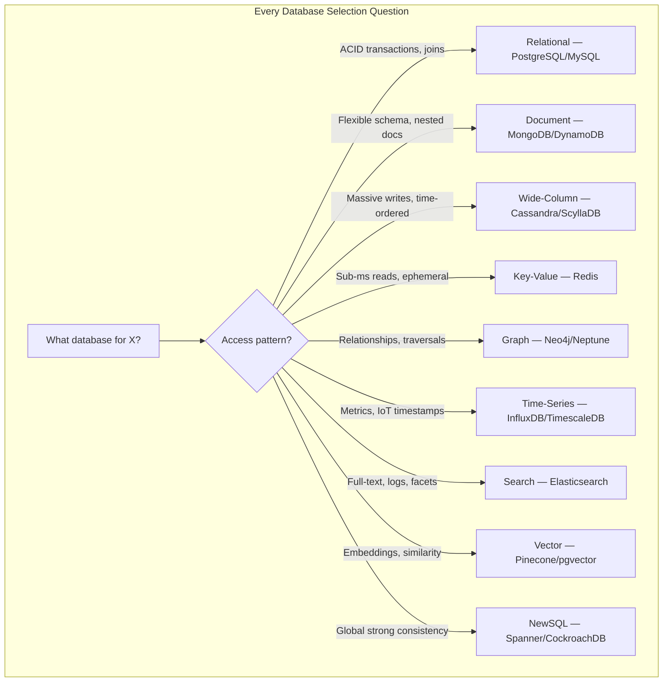

### What "Good" Looks Like in an Interview

| Level | What You Demonstrate |
|-------|---------------------|
| **Junior** | Names a database ("we'd use MongoDB") |
| **Mid** | Explains access pattern fit ("document model matches nested post structure") |
| **Senior** | Describes architecture ("Cassandra LSM tree for write-heavy feed; tunable consistency QUORUM") |
| **Staff** | Designs polyglot stack with consistency boundaries ("PostgreSQL for billing CP; Cassandra for messages AP; Redis cache-aside with 60s TTL") |

### The Polyglot Persistence Principle

Real systems at scale **never use one database for everything**. Interviewers reward candidates who say:

> "I'd use PostgreSQL as the source of truth for user accounts and billing, Cassandra for the high-write message store, Redis for session cache and rate limiting, and Elasticsearch for people search — each chosen for its access pattern."

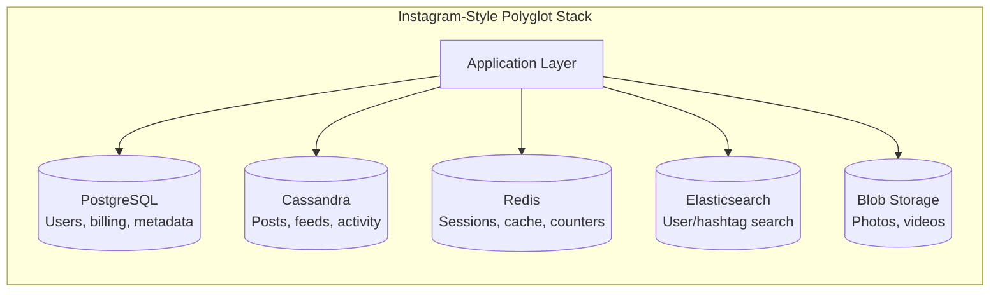

---

## 2. Database Taxonomy Overview

### 2.1 The Database Landscape

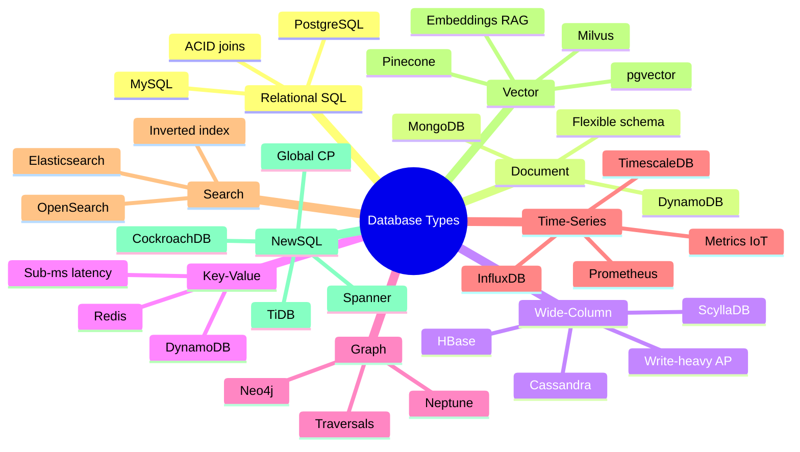

### 2.2 CAP Classification at a Glance

| Database Type | Typical CAP | Consistency Default | Partition Behavior |
|---------------|-------------|---------------------|-------------------|
| **Relational (single node)** | CA (not truly distributed) | Strong (ACID) | N/A — single node |
| **Relational (replicated)** | CP or AP (configurable) | Strong on primary | Replica may lag |
| **Document (MongoDB)** | CP (default) | Strong with replica set | Secondary reads = eventual |
| **Document (DynamoDB)** | AP | Eventual (default) | Always available |
| **Wide-Column (Cassandra)** | AP | Tunable (ONE → ALL) | Always available |
| **Key-Value (Redis)** | CP (Cluster) | Strong per key slot | Failover via Sentinel |
| **Graph (Neo4j)** | CP | ACID per transaction | Cluster quorum |
| **Time-Series** | AP (mostly) | Eventual | High availability |
| **Search (Elasticsearch)** | AP | Near real-time (NRT) | Always available |
| **Vector** | AP (mostly) | Eventual | Approximate NN |
| **NewSQL (Spanner)** | CP | External consistency | Sacrifices availability |

### 2.3 Storage Engine Families

Understanding internal storage engines is what separates senior from staff candidates:

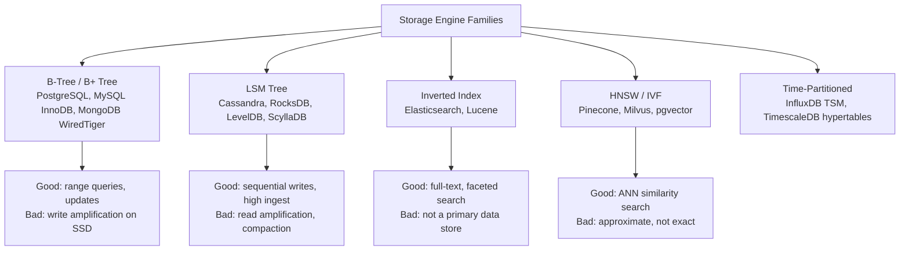

| Engine | Write Pattern | Read Pattern | Compaction | Best For |
|--------|--------------|-------------|------------|----------|
| **B-Tree** | Random I/O per write | O(log n) point + range | Page splits | OLTP, general purpose |
| **LSM Tree** | Sequential memtable flush | May check multiple SSTables | Background compaction | Write-heavy logs, feeds |
| **Inverted Index** | Index every term on write | Fast term lookup | Segment merge | Search, logs |
| **HNSW Graph** | Insert + graph rewire | Approximate nearest neighbor | Periodic rebuild | Vector similarity |

---

## 3. Relational (SQL) Databases — Deep Dive

### 3.1 What They Are

Relational databases store data in **tables** with **rows** and **columns**, enforcing **schema**, **relationships** via foreign keys, and **ACID transactions** across multiple rows/tables.

**Primary examples:** PostgreSQL, MySQL (InnoDB), Amazon Aurora, SQLite.

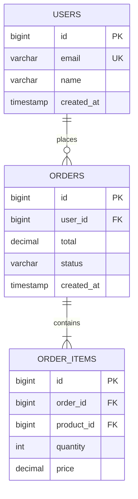

### 3.2 Internal Architecture — B-Tree / B+ Tree

PostgreSQL and MySQL InnoDB use **B+ trees** as their primary index structure.

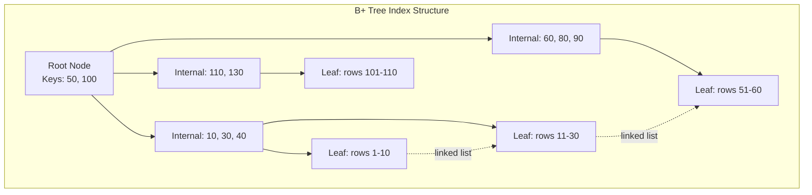

**How a B+ tree lookup works:**

1. Start at root node (always in memory / buffer pool)
2. Binary search keys in each node to find child pointer
3. Traverse down to leaf node — O(log n) levels
4. Leaf nodes contain row data (InnoDB clustered index) or row pointers (PostgreSQL)
5. Leaf nodes are linked for efficient range scans

| Property | Value |
|----------|-------|
| **Lookup complexity** | O(log n) — ~3-4 disk I/Os for 100M rows |
| **Range queries** | Excellent — follow leaf node linked list |
| **Insert** | May cause page splits — random I/O |
| **Update in place** | Yes (within page) — good for mutable data |
| **Buffer pool** | Hot pages cached in RAM — 99%+ cache hit in production |

**PostgreSQL-specific internals:**

| Component | Purpose |
|-----------|---------|
| **Shared buffers** | In-memory page cache (25% of RAM typical) |
| **WAL (Write-Ahead Log)** | Durability — write to WAL before data pages |
| **MVCC** | Multi-version concurrency — readers don't block writers |
| **VACUUM** | Reclaims dead tuple space from MVCC |
| **Query planner** | Cost-based optimizer — chooses index vs seq scan |

**MySQL InnoDB-specific internals:**

| Component | Purpose |
|-----------|---------|
| **Clustered index** | Primary key IS the table — data in leaf nodes |
| **Secondary indexes** | Store primary key pointer — extra lookup |
| **Buffer pool** | Same concept as PostgreSQL shared buffers |
| **Redo log** | Durability equivalent to WAL |
| **Binlog** | Replication log — statement or row format |

### 3.3 ACID Properties — What Interviewers Expect

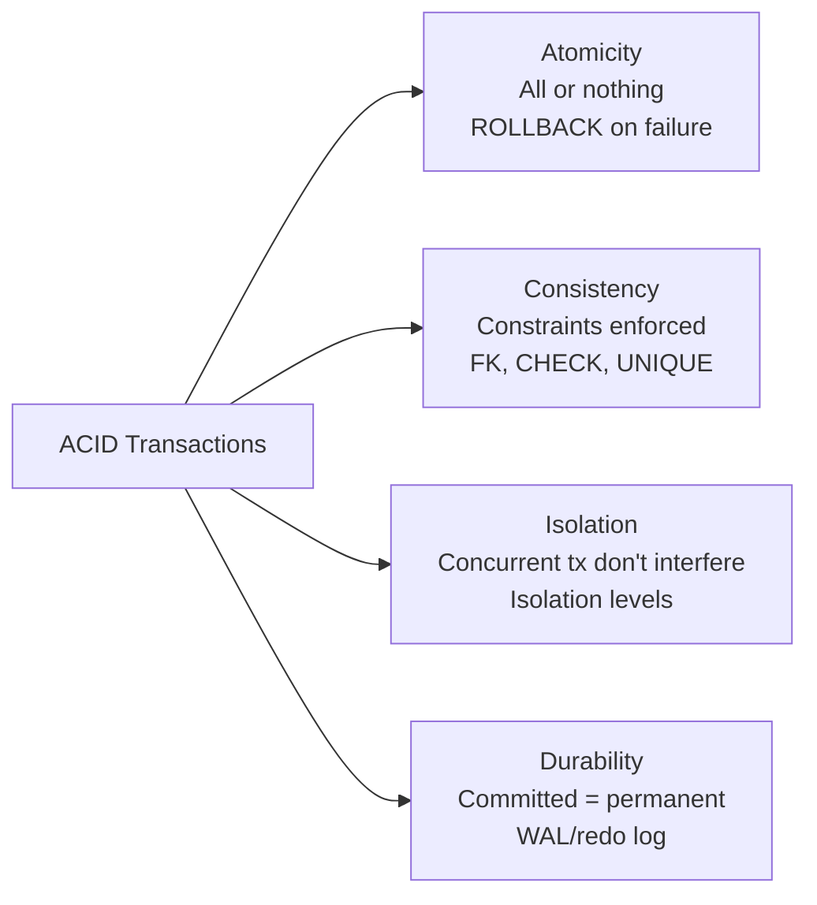

| Property | Mechanism | Interview Example |
|----------|-----------|-------------------|
| **Atomicity** | Transaction log + rollback | "Transfer $100: debit + credit in one tx" |
| **Consistency** | Constraints, triggers | "Order total must equal sum of items" |
| **Isolation** | Locks, MVCC | "Two users booking last seat — SERIALIZABLE" |
| **Durability** | WAL fsync before ACK | "Payment committed = survives crash" |

**Isolation levels (know these):**

| Level | Dirty Read | Non-Repeatable Read | Phantom Read | Use Case |
|-------|-----------|--------------------|--------------| ---------|
| READ UNCOMMITTED | Possible | Possible | Possible | Rarely used |
| READ COMMITTED | No | Possible | Possible | PostgreSQL default |
| REPEATABLE READ | No | No | Possible | MySQL InnoDB default |
| SERIALIZABLE | No | No | No | Financial transactions |

### 3.4 CAP & Consistency

| Deployment | CAP | Consistency |
|------------|-----|-------------|
| **Single PostgreSQL node** | CA | Strong — single source of truth |
| **Primary + async replicas** | AP (reads) / CP (writes) | Eventual on replicas; strong on primary |
| **Primary + sync replicas** | CP | Strong — write waits for replica ACK |
| **Amazon Aurora** | CP | Quorum writes to 6 storage nodes across 3 AZs |
| **PostgreSQL synchronous replication** | CP | Commit waits for sync standby |

```mermaid
sequenceDiagram
    participant App
    participant Primary as PostgreSQL Primary
    participant Replica as Read Replica
    participant Client as Client B

    App->>Primary: BEGIN; UPDATE balance SET amount=900 WHERE id=1
    Primary->>Primary: Write WAL, update page
    Primary->>Replica: Stream WAL (async)
    Primary-->>App: COMMIT (success)
    App->>Replica: SELECT balance WHERE id=1
    Replica-->>App: amount=1000 (STALE — replication lag)
    Note over App,Replica: This is why read-your-writes needs primary or sync replica
```

### 3.5 Scaling Model

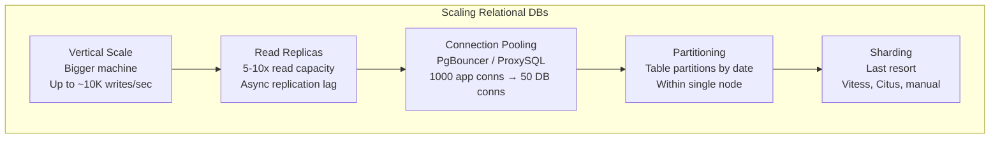

| Technique | What It Solves | Limit | Tools |
|-----------|---------------|-------|-------|
| **Vertical scaling** | Quick capacity boost | Hardware ceiling ~10K writes/sec | Bigger AWS RDS instance |
| **Read replicas** | Read-heavy workloads | Replication lag 10-100ms | RDS replicas, streaming replication |
| **Connection pooling** | Too many app connections | Doesn't scale queries | PgBouncer, ProxySQL, HikariCP |
| **Table partitioning** | Large table maintenance | Single-node writes | PostgreSQL declarative partitioning |
| **Sharding** | Write throughput + storage | Cross-shard joins impossible | Vitess (MySQL), Citus (PostgreSQL) |

### 3.6 PostgreSQL vs MySQL — When to Pick Which

| Dimension | PostgreSQL | MySQL (InnoDB) |
|-----------|-----------|----------------|
| **SQL compliance** | Most standards-compliant OSS RDBMS | Practical subset |
| **JSON support** | Native JSONB with indexing | JSON type, functional indexes |
| **Full-text search** | Built-in tsvector (basic) | FULLTEXT indexes (basic) |
| **Extensions** | PostGIS, pgvector, Citus, TimescaleDB | Fewer native extensions |
| **MVCC** | True MVCC — no read locks | MVCC + gap locks |
| **Replication** | Streaming, logical | Binlog (row/statement) |
| **Performance** | Better for complex queries, analytics | Better for simple read-heavy web apps |
| **Ecosystem** | Default for startups in 2026 | Legacy web apps, WordPress |
| **Interview default** | **Prefer PostgreSQL** unless interviewer says MySQL | When legacy or team expertise |

### 3.7 When to USE in Interviews

| System | Why Relational | What to Store |
|--------|---------------|---------------|
| **Uber** | Ride billing, payments, driver payouts | Trips, fares, transactions |
| **YouTube** | Video metadata, channels, subscriptions | Users, videos, playlists |
| **Ticketmaster** | Seat reservations, ticket purchases | Orders, seats, payments |
| **Banking** | ACID transfers, audit trail | Accounts, transactions, ledger |
| **E-commerce** | Inventory, orders, refunds | Products, orders, payments |
| **Any system with joins** | Normalized data, complex queries | Anything needing `JOIN` across entities |

**Sample interview answer (YouTube metadata):**

> "Video metadata — title, description, upload date, channel_id, view count — lives in PostgreSQL. These are structured, relational entities with foreign keys. I need ACID for subscription updates and transactional consistency for playlist ordering. View counts can be denormalized to Redis for display, but PostgreSQL is the source of truth."

### 3.8 When NOT to Use

| Scenario | Why Not | Use Instead |
|----------|---------|-------------|
| **Millions of writes/sec feed** | Write throughput ceiling ~10K/sec per node | Cassandra, ScyllaDB |
| **Flexible/nested documents** | Rigid schema; JSON columns are a workaround | MongoDB |
| **Full-text search at scale** | `LIKE '%term%'` is O(n); tsvector limited | Elasticsearch |
| **Sub-millisecond reads** | Disk I/O even with index = 1-10ms | Redis |
| **Time-series metrics** | Row-oriented storage inefficient for time-range scans | TimescaleDB, InfluxDB |
| **Graph traversals (6 hops)** | Recursive CTEs are O(n^depth) | Neo4j |
| **Global multi-region strong consistency** | Single-primary replication lag across regions | Spanner, CockroachDB |

---

## 4. Document Databases — Deep Dive

### 4.1 What They Are

Document databases store data as **self-contained documents** (typically JSON/BSON), with **flexible schema** and **embedded/nested structures**. Each document is independently addressable.

**Primary examples:** MongoDB, Amazon DynamoDB (also key-value), CouchDB, Firebase Firestore.

```mermaid
graph TB
    subgraph Document Model — Social Post
        DOC["{<br/>  _id: 'post_123',<br/>  user_id: 'user_456',<br/>  text: 'Hello world',<br/>  media: [{url, type, width, height}],<br/>  likes_count: 42,<br/>  comments: [{user, text, ts}],<br/>  tags: ['travel', 'food'],<br/>  created_at: ISODate(...)<br/>}"]
    end
```

### 4.2 Internal Architecture

**MongoDB (WiredTiger storage engine):**

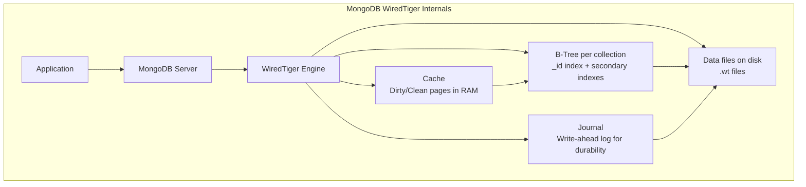

| Component | Purpose |
|-----------|---------|
| **WiredTiger** | Default storage engine — B-tree with document-level locking |
| **Oplog** | Operation log for replication (like binlog) |
| **Journal** | Durability — fsync every 50-100ms (group commit) |
| **Working set** | Hot documents + indexes in RAM |

**DynamoDB internals:**

```mermaid
graph TB
    subgraph DynamoDB Partition Model
        REQ[Request: GetItem pk=USER#123]
        REQ --> ROUTER[Partition Key Router<br/>hash(pk) → partition]
        ROUTER --> P1[Partition 1<br/>10GB storage limit<br/>3000 RCU / 1000 WCU]
        ROUTER --> P2[Partition 2]
        ROUTER --> P3[Partition N<br/>Auto-split when >10GB or >3000 RCU]
    end
```

| Component | Purpose |
|-----------|---------|
| **Partition key** | Determines storage partition via consistent hashing |
| **Sort key** | Optional — enables range queries within partition |
| **GSI/LSI** | Secondary indexes — eventual consistency on GSI |
| **DAX** | DynamoDB Accelerator — in-memory cache layer |
| **Streams** | Change data capture for event-driven architectures |

### 4.3 CAP & Consistency

| Database | CAP | Default Consistency | Tunable? |
|----------|-----|---------------------|----------|
| **MongoDB (replica set)** | CP | Strong (primary reads) | `readConcern: majority` |
| **MongoDB (secondary reads)** | AP | Eventual | `readPreference: secondary` |
| **DynamoDB** | AP | Eventual | `ConsistentRead=true` (same partition only) |
| **DynamoDB Transactions** | CP | Serializable isolation | Limited to 25 items per tx |

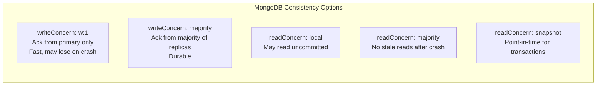

### 4.4 Scaling Model

**MongoDB scaling:**

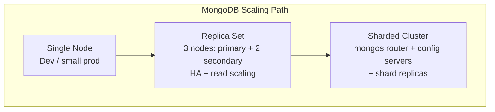

| Stage | Capacity | Complexity |
|-------|----------|------------|
| **Single node** | ~5K ops/sec | Low |
| **Replica set** | Same writes; 2-3x reads | Medium |
| **Sharded cluster** | Linear horizontal scale | High — shard key is critical |

**DynamoDB scaling:** Fully managed — auto-scales partitions. No ops burden. Pay per RCU/WCU.

### 4.5 MongoDB vs DynamoDB

| Dimension | MongoDB | DynamoDB |
|-----------|---------|----------|
| **Hosting** | Self-managed or Atlas | Fully managed AWS |
| **Schema** | Flexible documents | Flexible items (key-value + attributes) |
| **Queries** | Rich query language, aggregations | Key-based + GSI; limited ad-hoc queries |
| **Joins** | `$lookup` (slow at scale) | No joins — denormalize |
| **Scaling** | Manual sharding | Automatic partition splitting |
| **Consistency** | Configurable per query | Eventual default; strong per partition |
| **Cost model** | Instance-based | Per-request (can be expensive at scale) |
| **Best for** | Rapid prototyping, complex queries | AWS-native, predictable key access, serverless |

### 4.6 When to USE in Interviews

| System | Why Document | What to Store |
|--------|-------------|---------------|
| **Content management** | Nested content blocks, varying fields | Articles, pages, templates |
| **User profiles** | Varying attributes per user type | Profile with optional fields |
| **Product catalogs** | Different attributes per category | Electronics vs clothing |
| **IoT device state** | Variable sensor readings | Device telemetry documents |
| **Mobile apps (Firebase)** | Offline sync, flexible schema | User data, app state |
| **Serverless APIs** | DynamoDB + Lambda = no ops | Session data, game state |

**Sample interview answer (product catalog):**

> "Product catalog uses MongoDB because products have vastly different attributes — a laptop has CPU/RAM, a shirt has size/color. Document model avoids sparse tables with 200 nullable columns. I'd index category_id and brand for listing pages, and use Elasticsearch for customer-facing search."

### 4.7 When NOT to Use

| Scenario | Why Not | Use Instead |
|----------|---------|-------------|
| **Multi-table ACID transactions** | Limited cross-document tx (MongoDB 4.0+ helps but not like SQL) | PostgreSQL |
| **Complex joins across entities** | `$lookup` doesn't scale; data duplication | PostgreSQL + denormalize selectively |
| **Ad-hoc analytics queries** | Document DBs optimize for key-based access | PostgreSQL, BigQuery |
| **Strong global consistency** | DynamoDB eventual by default | Spanner, CockroachDB |
| **Full-text search** | Basic text indexes only | Elasticsearch |

---

## 5. Wide-Column Databases — Deep Dive

### 5.1 What They Are

Wide-column (column-family) databases store data in **rows** grouped into **column families**, optimized for **sparse data**, **massive write throughput**, and **linear horizontal scaling**. They sacrifice joins and ad-hoc queries for write performance.

**Primary examples:** Apache Cassandra, HBase, ScyllaDB, Google Bigtable.

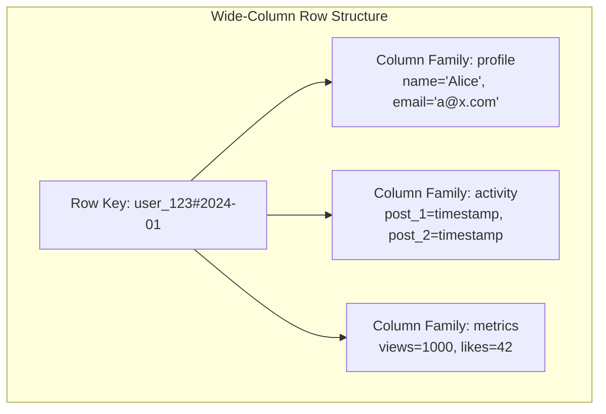

### 5.2 Internal Architecture — LSM Tree & SSTables

Cassandra and ScyllaDB use **LSM (Log-Structured Merge) trees** — the most important internal detail for interviews.

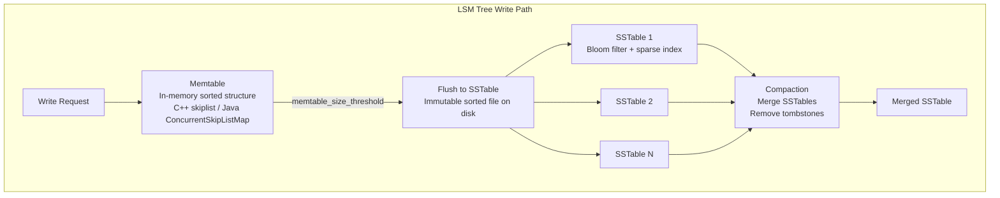

**LSM tree read path:**

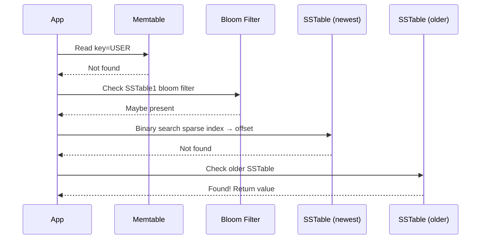

| LSM Component | Purpose | Trade-off |
|---------------|---------|-----------|
| **Memtable** | Absorb writes in RAM | Lost on crash without commit log |
| **Commit log** | Durability before memtable flush | Sequential disk writes — fast |
| **SSTable** | Immutable on-disk sorted file | Read may check multiple SSTables |
| **Bloom filter** | Skip SSTables that don't contain key | False positives possible (rare) |
| **Compaction** | Merge SSTables, reclaim space | I/O intensive; causes latency spikes |
| **Tombstones** | Delete markers | Must compact before truly deleted |

**ScyllaDB difference:** Rewritten in C++ (not Java GC), shard-per-core architecture — 10x lower latency than Cassandra on same hardware.

**HBase difference:** Built on HDFS, uses Bigtable model, relies on ZooKeeper for coordination — CP system, strong consistency per row.

### 5.3 CAP & Consistency — Tunable Consistency

Cassandra is the canonical **AP** system with **tunable consistency**.

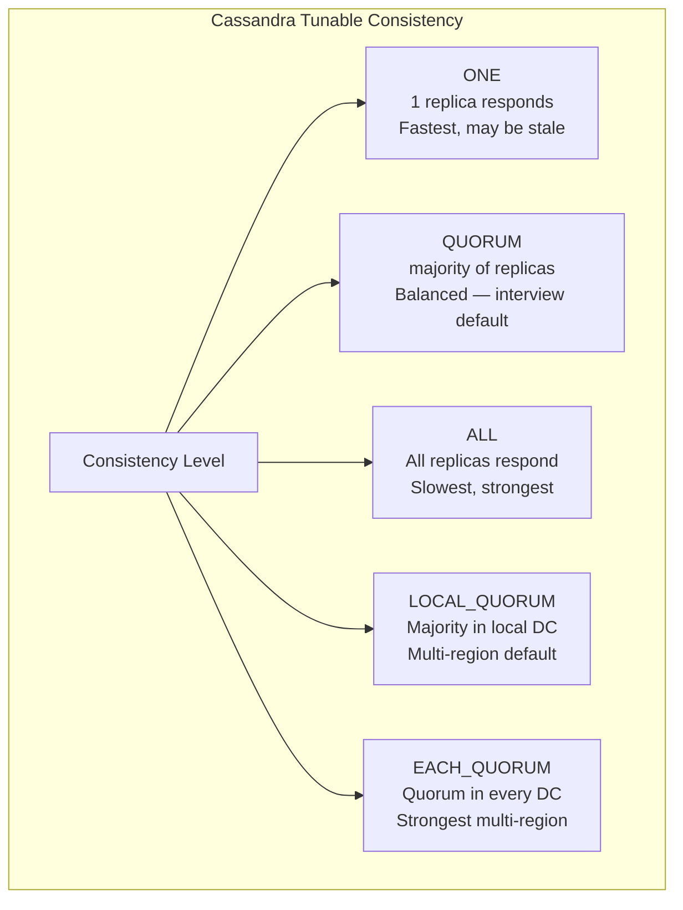

| Consistency Level | Replicas Required | Use Case |
|-------------------|-------------------|----------|
| **ONE** | 1 | Metrics, logs, non-critical writes |
| **QUORUM** | (RF/2)+1 | Most production workloads |
| **LOCAL_QUORUM** | Local DC quorum | Multi-region with low latency |
| **ALL** | All replicas | Rare — one slow node blocks all |
| **EACH_QUORUM** | Quorum per DC | Cross-DC strong consistency |

**Hinted Handoff & Read Repair:**

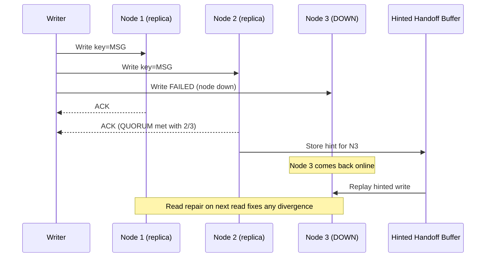

### 5.4 Scaling Model

```mermaid
graph TB
    subgraph Cassandra Ring Topology
        C1[Node 1<br/>Token range: 0-25%]
        C2[Node 2<br/>Token range: 25-50%]
        C3[Node 3<br/>Token range: 50-75%]
        C4[Node 4<br/>Token range: 75-100%]

        C1 <-->|gossip| C2
        C2 <-->|gossip| C3
        C3 <-->|gossip| C4
        C4 <-->|gossip| C1
    end

    APP[Application] -->|hash(key) → token range| C1
    APP --> C2
    APP --> C3
```

| Scaling Property | How |
|-----------------|-----|
| **Horizontal** | Add nodes to ring — consistent hashing redistributes tokens |
| **Replication** | RF=3 typical — replicas on different racks/AZs |
| **No single point of failure** | Peer-to-peer — no master node |
| **Linear write scaling** | Each node handles its token range independently |
| **Data center aware** | Replication across DCs with LOCAL_QUORUM |

### 5.5 When to USE in Interviews

| System | Why Wide-Column | What to Store |
|--------|----------------|---------------|
| **WhatsApp** | Billions of messages/day, write-heavy | Message store, delivery receipts |
| **Instagram** | Feed activity, user timelines | Posts, likes, activity log |
| **Netflix** | Viewing history, recommendations input | Watch events, user activity |
| **IoT ingestion** | Millions of sensor writes/sec | Time-ordered sensor data |
| **Audit logs** | Append-only, high volume | Event logs, access records |

**Sample interview answer (WhatsApp messages):**

> "Message storage uses Cassandra. Write pattern is append-only — billions of messages per day, keyed by (conversation_id, message_id). I need AP availability — messages must deliver even during network partitions. Consistency level QUORUM with RF=3 gives durability without sacrificing availability. LSM tree handles sequential writes efficiently."

### 5.6 When NOT to Use

| Scenario | Why Not | Use Instead |
|----------|---------|-------------|
| **ACID transactions across rows** | No multi-row transactions (lightweight tx limited) | PostgreSQL |
| **Ad-hoc queries / JOINs** | Query must include partition key | PostgreSQL + denormalize |
| **Strong consistency required** | Tunable but AP at core | Spanner, PostgreSQL |
| **Small dataset (<100GB)** | Operational overhead not justified | PostgreSQL |
| **Frequent updates to same row** | LSM compaction overhead on updates | PostgreSQL B-tree |
| **Full-text search** | No native search | Elasticsearch |

---

## 6. Key-Value Stores — Deep Dive

### 6.1 What They Are

Key-value stores map **unique keys** to **opaque values** with **O(1) lookup**. Optimized for speed, simplicity, and ephemeral data. Values can be strings, hashes, lists, sorted sets (Redis), or arbitrary blobs.

**Primary examples:** Redis, Amazon DynamoDB (also document), Memcached, Riak, etcd.

```mermaid
graph LR
    subgraph Key-Value Operations
        SET["SET session:abc123 → {user_id, expiry}"]
        GET["GET session:abc123 → {user_id, expiry}"]
        DEL["DEL session:abc123"]
        TTL["TTL session:abc123 → 3600"]
    end
```

### 6.2 Internal Architecture — Redis

```mermaid
graph TB
    subgraph Redis Internals
        CMD[Client Command] --> EVENT[Event Loop<br/>Single-threaded<br/>epoll/kqueue]
        EVENT --> DICT[Hash Table<br/>Key → RedisObject]
        DICT --> STR[String encoding<br/>SDS simple dynamic string]
        DICT --> HASH[Hash encoding<br/>ziplist or hashtable]
        DICT --> ZSET[Sorted Set<br/>skiplist + hashtable]
        DICT --> LIST[List<br/>quicklist: linked ziplists]
        AOF[AOF / RDB<br/>Persistence] --> DICT
    end
```

| Component | Purpose |
|-----------|---------|
| **Single-threaded event loop** | No lock contention — ~100K ops/sec per core |
| **Hash table** | O(1) key lookup — rehashing when load factor grows |
| **SDS (Simple Dynamic String)** | O(1) length, binary-safe strings |
| **Skiplist** | Sorted sets — O(log n) range queries by score |
| **RDB** | Point-in-time snapshot persistence |
| **AOF** | Append-only file — every write logged |
| **Redis Cluster** | Hash slots (16384) distributed across nodes |

**Redis Cluster architecture:**

```mermaid
graph TB
    subgraph Redis Cluster — 6 Nodes
        M1[Master 1<br/>Slots 0-5460]
        M2[Master 2<br/>Slots 5461-10922]
        M3[Master 3<br/>Slots 10923-16383]
        R1[Replica of M1]
        R2[Replica of M2]
        R3[Replica of M3]
        M1 --> R1
        M2 --> R2
        M3 --> R3
    end

    APP[Application] -->|CRC16(key) % 16384 → slot| M1
    APP --> M2
    APP --> M3
```

### 6.3 CAP & Consistency

| System | CAP | Consistency Model |
|--------|-----|-------------------|
| **Redis (single node)** | CA | Strong — single thread |
| **Redis Cluster** | CP | Strong per key slot; failover may lose last writes |
| **Redis Sentinel** | CP | Automatic failover; async replication |
| **DynamoDB** | AP | Eventual (default); per-item strong optional |
| **etcd** | CP | Linearizable — Raft consensus |
| **Memcached** | CA | No persistence; restart = data loss |

### 6.4 Scaling Model

| System | Scaling Approach | Throughput |
|--------|-----------------|------------|
| **Redis** | Cluster (hash slots), read replicas | ~100K ops/sec per node |
| **Memcached** | Client-side consistent hashing | ~1M ops/sec (multi-threaded) |
| **DynamoDB** | Auto-partitioning | Unlimited (managed) |
| **etcd** | Raft — typically 3-5 nodes | ~10K writes/sec (consensus cost) |

### 6.5 Redis Use Cases in System Design

```mermaid
graph TB
    subgraph Redis Use Cases
        R[Redis]
        R --> CACHE[Cache-Aside<br/>DB query results<br/>TTL-based expiry]
        R --> SESS[Session Store<br/>user_id → session data<br/>TTL = session lifetime]
        R --> RATE[Rate Limiting<br/>INCR + EXPIRE<br/>sliding window counter]
        R --> LEADER[Leaderboard<br/>Sorted Sets<br/>ZADD, ZRANGE]
        R --> PUBSUB[Pub/Sub<br/>Real-time notifications<br/>Fire-and-forget]
        R --> LOCK[Distributed Lock<br/>SET NX EX<br/>Redlock algorithm]
        R --> COUNT[Counters<br/>INCR view_count<br/>HyperLogLog for unique counts]
        R --> QUEUE[Task Queue<br/>LPUSH/BRPOP<br/>Simple job queue]
    end
```

### 6.6 When to USE in Interviews

| System | Why Key-Value | What to Store |
|--------|--------------|---------------|
| **Every web app** | Session management | `session:{id} → {user_id, roles}` |
| **Instagram** | Feed cache, story views | Cached feeds, view counters |
| **Uber** | Driver location cache | `driver:{id} → {lat, lng, status}` |
| **Twitter** | Trending topics, rate limits | Sorted sets for trending; counters |
| **Any read-heavy system** | Cache-aside pattern | Hot data with TTL |
| **Leaderboards** | Sorted sets | Game scores, trending content |

**Sample interview answer (rate limiting):**

> "Rate limiting uses Redis with a sliding window counter. Key is `rate:{user_id}:{window}`, INCR on each request, EXPIRE for window duration. At 100 requests/minute, if counter exceeds 100, return 429. Redis gives sub-millisecond latency and atomic INCR. Alternative: token bucket with Lua script for smoother limiting."

### 6.7 When NOT to Use

| Scenario | Why Not | Use Instead |
|----------|---------|-------------|
| **Primary data store** | Data loss risk; memory cost | PostgreSQL, Cassandra |
| **Complex queries** | No query language — only key access | PostgreSQL, Elasticsearch |
| **Large values (>512MB)** | Memory pressure; slow network transfer | S3, blob storage |
| **Durable long-term storage** | RAM is expensive; persistence is secondary | Any disk-based DB |
| **Multi-key ACID transactions** | Limited (Redis 4.0+ MULTI/EXEC per slot) | PostgreSQL |

---

## 7. Graph Databases — Deep Dive

### 7.1 What They Are

Graph databases store data as **nodes** (entities) and **edges** (relationships), optimized for **traversal queries** — finding connections, paths, and patterns across entities.

**Primary examples:** Neo4j, Amazon Neptune, ArangoDB, JanusGraph.

```mermaid
graph TB
    subgraph Social Graph — LinkedIn Model
        Alice[Alice<br/>Software Engineer]
        Bob[Bob<br/>Product Manager]
        Carol[Carol<br/>Designer]
        Dave[Dave<br/>Engineer at Google]
        Eve[Eve<br/>Recruiter]

        Alice -->|WORKS_AT| CompanyA[Acme Corp]
        Bob -->|WORKS_AT| CompanyA
        Carol -->|WORKS_AT| CompanyB[Design Studio]
        Dave -->|WORKS_AT| Google[Google]
        Alice -->|CONNECTED| Bob
        Bob -->|CONNECTED| Carol
        Alice -->|CONNECTED| Dave
        Eve -->|CONNECTED| Bob
        Dave -->|KNOWS| Alice
    end
```

### 7.2 Internal Architecture — Neo4j

```mermaid
graph TB
    subgraph Neo4j Storage Architecture
        NODE[Node Store<br/>Fixed-size records<br/>ID → labels + properties pointer]
        REL[Relationship Store<br/>Fixed-size records<br/>start_node + end_node + type]
        PROP[Property Store<br/>Key-value pairs<br/>Linked to nodes/relationships]
        LABEL[Label Index<br/>Label → node IDs]
        REL_IDX[Relationship Index<br/>Type + direction → relationships]

        NODE --> REL
        NODE --> PROP
        NODE --> LABEL
        REL --> REL_IDX
    end
```

**How graph traversal works (vs SQL):**

| Query | SQL (PostgreSQL) | Graph (Neo4j) |
|-------|-----------------|---------------|
| **Friends of friends** | Recursive CTE — O(n^depth) | Native traversal — O(edges visited) |
| **Shortest path** | Complex recursive query | `shortestPath()` — built-in |
| **6-degree connection** | Impractical at scale | Milliseconds on indexed graph |
| **Pattern matching** | Multiple JOINs | Cypher pattern: `(a)-[:KNOWS*1..6]-(b)` |

**Index-free adjacency:** Neo4j stores each relationship as a direct pointer from node → relationship → node. No index lookup needed for traversal — this is the key performance advantage.

```mermaid
sequenceDiagram
    participant App
    participant Neo4j
    participant NodeA as Node: Alice
    participant Rel1 as REL: CONNECTED
    participant NodeB as Node: Bob
    participant Rel2 as REL: CONNECTED
    participant NodeC as Node: Carol

    App->>Neo4j: MATCH (a:Person{name:'Alice'})-[:CONNECTED*2]-(fof) RETURN fof
    Neo4j->>NodeA: Start at Alice
    NodeA->>Rel1: Follow pointer (no index lookup)
    Rel1->>NodeB: Arrive at Bob
    NodeB->>Rel2: Follow pointer
    Rel2->>NodeC: Arrive at Carol (friend of friend)
    Neo4j-->>App: Return Carol in <1ms
```

### 7.3 CAP & Consistency

| System | CAP | Consistency |
|--------|-----|-------------|
| **Neo4j (single)** | CA | ACID transactions |
| **Neo4j Causal Cluster** | CP | Causal consistency across cluster |
| **Amazon Neptune** | CP | ACID per transaction; read replicas eventual |
| **JanusGraph** | CP (with Cassandra/HBase backend) | Depends on storage backend |

### 7.4 Scaling Model

```mermaid
graph TB
    subgraph Graph DB Scaling Options
        VERT[Vertical Scaling<br/>More RAM for graph in memory<br/>Neo4j default path]
        READ[Read Replicas<br/>Neptune / Neo4j causal cluster<br/>Scale reads]
        PART[Graph Partitioning<br/>Cut edges across shards<br/>VERY HARD — research area]
        CACHE[Cache Hot Subgraphs<br/>Redis for frequent traversals<br/>Practical at scale]
    end
```

**Graph scaling is hard.** Unlike relational or wide-column DBs, graphs have interconnected data that resists clean partitioning. Interviewers know this — mention it proactively.

| Approach | Feasibility | Used By |
|----------|------------|---------|
| **Vertical scaling** | Easy | Most Neo4j deployments |
| **Read replicas** | Medium | Neptune, Neo4j cluster |
| **Graph partitioning** | Hard — edge cuts break traversals | Facebook TAO (hybrid) |
| **Hybrid (SQL + graph)** | Practical | LinkedIn: MySQL for profiles, graph for connections |

### 7.5 When to USE in Interviews

| System | Why Graph | What to Model |
|--------|----------|---------------|
| **LinkedIn** | "People you may know" — 2nd/3rd degree connections | Social network, connection paths |
| **Fraud detection** | Circular payment patterns, money laundering chains | Transaction graph, account relationships |
| **Recommendation** | Collaborative filtering via shared connections | User-item-interaction graph |
| **Knowledge graphs** | Entity relationships, semantic search | Concepts, facts, relationships |
| **Network topology** | Dependency mapping, blast radius | Services, dependencies, infrastructure |
| **Access control** | Permission inheritance through groups | Users, groups, resources, permissions |

**Sample interview answer (LinkedIn "People You May Know"):**

> "Connection recommendations use a graph database — Neptune or an in-house graph layer. Query: find users within 2 hops who share employers or schools, excluding existing connections. In SQL this is a recursive CTE across a billion-row edge table — impractical. Graph DB does index-free adjacency traversal in milliseconds. Profile data stays in MySQL; only the relationship graph lives in the graph store."

### 7.6 When NOT to Use

| Scenario | Why Not | Use Instead |
|----------|---------|-------------|
| **Simple CRUD** | Overkill — no traversals needed | PostgreSQL |
| **Aggregate analytics** | Graph DBs don't do SUM/COUNT/GROUP BY well | PostgreSQL, BigQuery |
| **High write throughput** | Edge index maintenance is expensive | Cassandra + batch graph build |
| **Billions of nodes** | Graph partitioning unsolved at scale | Hybrid: SQL for profiles + graph for hot subgraphs |
| **Full-text search** | Not a search engine | Elasticsearch |

---

## 8. Time-Series Databases — Deep Dive

### 8.1 What They Are

Time-series databases optimize for **timestamped data** — metrics, sensor readings, events — with **efficient time-range queries**, **compression**, and **automatic data expiration**.

**Primary examples:** InfluxDB, TimescaleDB, Prometheus, OpenTSDB, QuestDB.

```mermaid
graph TB
    subgraph Time-Series Data Model
        METRIC[Metric: cpu_usage]
        METRIC --> S1["{host: server1, region: us-east}<br/>2024-01-01T00:00:00Z → 45.2%<br/>2024-01-01T00:00:01Z → 46.1%<br/>2024-01-01T00:00:02Z → 44.8%<br/>...billions of points"]
    end
```

### 8.2 Internal Architecture

**TimescaleDB (PostgreSQL extension):**

```mermaid
graph TB
    subgraph TimescaleDB Hypertable Architecture
        APP[Application] --> HYP[Hypertable: metrics<br/>Logical table — auto-partitioned]
        HYP --> C1[Chunk: Jan 2024<br/>PostgreSQL table partition]
        HYP --> C2[Chunk: Feb 2024]
        HYP --> C3[Chunk: Mar 2024]
        C1 --> IDX[B-tree on (time, tag_id)]
        C1 --> COMP[Native compression<br/>90%+ on time-series data]
    end
```

**InfluxDB (TSM engine):**

```mermaid
graph TB
    subgraph InfluxDB TSM Storage
        WRITE[Write Point] --> WAL[Write-Ahead Log]
        WAL --> CACHE[In-memory Cache]
        CACHE -->|snapshot| TSM[TSM Files<br/>Time-Structured Merge Tree<br/>Compressed time blocks]
        TSM --> COMPACT[Compaction<br/>Merge TSM files<br/>Apply retention policy]
    end
```

**Prometheus (designed for metrics, not general TSDB):**

| Component | Purpose |
|-----------|---------|
| **Pull model** | Prometheus scrapes `/metrics` endpoints — not push |
| **TSDB** | Local block storage with 2-hour blocks |
| **PromQL** | Query language for aggregation, rate, histogram |
| **Retention** | Configurable — typically 15 days local |
| **Remote write** | Long-term storage → Cortex, Thanos, Mimir |

| Engine | Storage Model | Compression | Query Language |
|--------|--------------|-------------|----------------|
| **TimescaleDB** | PostgreSQL hypertables (chunks) | 90%+ native | SQL |
| **InfluxDB** | TSM files (time blocks) | Gorilla encoding | Flux / InfluxQL |
| **Prometheus** | Local TSDB blocks | XOR encoding | PromQL |
| **QuestDB** | Column-oriented, memory-mapped | High | SQL |

### 8.3 CAP & Consistency

| System | CAP | Consistency |
|--------|-----|-------------|
| **InfluxDB** | AP (cluster) | Eventual across nodes |
| **TimescaleDB** | CP (PostgreSQL) | Strong — inherits PostgreSQL |
| **Prometheus** | CA (single node) | Strong locally; federation is pull |
| **OpenTSDB (on HBase)** | CP | Strong per row |

### 8.4 Scaling Model

```mermaid
graph TB
    subgraph Time-Series Scaling
        SINGLE[Single Node<br/>Prometheus / InfluxDB<br/>Millions of points/sec]
        PART[Partitioning by Time<br/>Chunks / shards by time range<br/>Drop old chunks easily]
        CLUSTER[Clustered<br/>InfluxDB Enterprise / Cortex<br/>Horizontal scale]
        TIER[Tiered Storage<br/>Hot: SSD recent data<br/>Cold: S3 historical data]
    end

    SINGLE --> PART --> CLUSTER --> TIER
```

| Technique | What It Solves |
|-----------|---------------|
| **Time-based partitioning** | Queries only scan relevant time chunks |
| **Compression** | 90%+ reduction — timestamps delta-encoded |
| **Retention policies** | Auto-delete data older than N days |
| **Downsampling** | Keep 1-sec resolution for 7 days; 1-min for 1 year |
| **Tiered storage** | Recent data on SSD; archive to S3 |

### 8.5 When to USE in Interviews

| System | Why Time-Series | What to Store |
|--------|----------------|---------------|
| **Datadog / monitoring** | Infrastructure metrics, alerting | CPU, memory, latency, error rates |
| **IoT platform** | Sensor data ingestion | Temperature, pressure, GPS coordinates |
| **Stock trading** | Tick data, price history | Price points, trade volumes |
| **Uber** | Driver location history, ETA analytics | GPS breadcrumbs over time |
| **Application metrics** | Request latency, throughput | p50/p99 latency, QPS per endpoint |

**Sample interview answer (Datadog-style monitoring):**

> "Metrics storage uses TimescaleDB or InfluxDB. Write pattern: millions of data points per minute, each tagged with host, service, metric_name. Queries are always time-range bounded — 'avg CPU over last 1 hour.' Hypertables partition by time so queries skip irrelevant chunks. Retention policy drops raw data after 30 days; downsampled aggregates kept for 1 year."

### 8.6 When NOT to Use

| Scenario | Why Not | Use Instead |
|----------|---------|-------------|
| **Transactional data** | No ACID for business logic | PostgreSQL |
| **Mutable records** | TSDBs optimize for append-only | PostgreSQL |
| **Complex relationships** | No joins across metrics and entities | PostgreSQL + TSDB side by side |
| **Low-volume data** | Overhead not justified | PostgreSQL with timestamp index |
| **Full-text search on logs** | TSDBs lack text search | Elasticsearch for logs; TSDB for metrics |

---

## 9. Search Engines — Deep Dive

### 9.1 What They Are

Search engines (Elasticsearch, OpenSearch) are **inverted-index-based** systems optimized for **full-text search**, **faceted filtering**, **aggregations**, and **log analytics**. They are **not** primary data stores — they are **secondary indexes** built from source-of-truth databases.

**Primary examples:** Elasticsearch, OpenSearch, Solr, Algolia.

```mermaid
graph TB
    subgraph Inverted Index — How Search Works
        DOC1["Doc 1: 'The quick brown fox'"]
        DOC2["Doc 2: 'The lazy dog jumps'"]
        DOC3["Doc 3: 'Quick fox and dog'"]

        DOC1 --> IDX[Inverted Index]
        DOC2 --> IDX
        DOC3 --> IDX

        IDX --> T1["'brown' → [Doc1]"]
        IDX --> T2["'dog' → [Doc2, Doc3]"]
        IDX --> T3["'fox' → [Doc1, Doc3]"]
        IDX --> T4["'quick' → [Doc1, Doc3]"]
        IDX --> T5["'the' → [Doc1, Doc2]"]
    end
```

### 9.2 Internal Architecture — Elasticsearch

```mermaid
graph TB
    subgraph Elasticsearch Cluster
        COORD[Coordinating Node<br/>Receives query, fans out, merges]
        COORD --> SH1[Shard 0 Primary<br/>Inverted index segment]
        COORD --> SH2[Shard 1 Primary]
        COORD --> SH3[Shard 2 Primary]
        SH1 --> R1[Shard 0 Replica]
        SH2 --> R2[Shard 1 Replica]
        SH3 --> R3[Shard 2 Replica]
    end
```

**Index → Shard → Segment hierarchy:**

```mermaid
graph TB
    subgraph Lucene Segment Internals
        INDEX[Elasticsearch Index: products]
        INDEX --> S0[Shard 0]
        INDEX --> S1[Shard 1]
        S0 --> SEG1[Segment 1<br/>Immutable inverted index<br/>Bloom filter + skip list]
        S0 --> SEG2[Segment 2<br/>Newer writes]
        SEG1 --> MERGE[Background Merge<br/>Combine segments<br/>Remove deleted docs]
        SEG2 --> MERGE
    end
```

| Component | Purpose |
|-----------|---------|
| **Inverted index** | Term → list of document IDs — O(1) term lookup |
| **Analyzer** | Tokenizer + filters — "Running" → "run" (stemming) |
| **Segments** | Immutable Lucene index files — writes go to new segment |
| **Segment merge** | Background process combines small segments |
| **Doc values** | Column-optimized storage for sorting, aggregations |
| **Near-real-time (NRT)** | Refresh interval (default 1s) — write → searchable delay |

**Write path:**

```mermaid
sequenceDiagram
    participant App
    participant Primary as Primary Shard
    participant Replica as Replica Shard
    participant TransLog as Transaction Log
    participant Segment as New Segment

    App->>Primary: Index document {title: "Hello World"}
    Primary->>TransLog: Write to transaction log (durability)
    Primary->>Primary: Add to in-memory buffer
    Note over Primary: refresh_interval (default 1s)
    Primary->>Segment: Flush buffer → new immutable segment
    Primary->>Replica: Replicate segment
    Note over App: Document searchable after refresh
```

### 9.3 CAP & Consistency

| Property | Value |
|----------|-------|
| **CAP** | AP — always available, eventually consistent |
| **Write consistency** | Quorum (majority of shards) for acknowledgment |
| **Read consistency** | May read from replica — slightly stale |
| **Near-real-time** | 1-second refresh delay by default |
| **Not a primary store** | Data loss possible — always rebuild from source |

### 9.4 Scaling Model

```mermaid
graph TB
    subgraph Elasticsearch Scaling
        SINGLE[Single Node<br/>Dev / small prod<br/>All shards on one node]
        CLUSTER[Multi-Node Cluster<br/>Shards distributed<br/>Replicas for HA + read scale]
        TIER[Index Lifecycle Management<br/>Hot: SSD recent logs<br/>Warm: HDD older data<br/>Cold: S3 archived<br/>Delete: auto-remove]
    end

    SINGLE --> CLUSTER --> TIER
```

| Scaling Technique | How |
|-------------------|-----|
| **Primary shards** | Set at index creation — cannot change (reindex required) |
| **Replica shards** | Add replicas for read scaling + HA |
| **Index per time period** | `logs-2024-01-01`, `logs-2024-01-02` — easy to drop old |
| **ILM (Index Lifecycle Management)** | Auto-rollover, shrink, forcemerge, delete |
| **Cross-cluster replication** | Replicate indices across DCs |

### 9.5 When to USE in Interviews

| System | Why Search Engine | What to Index |
|--------|------------------|---------------|
| **Google Search** | Full-text web page search | Inverted index of web pages (custom + Bigtable) |
| **LinkedIn** | People search, job search | User profiles, skills, companies |
| **E-commerce** | Product search with facets | Products with filters (brand, price, color) |
| **Log analytics (ELK)** | Centralized log search | Application logs, access logs |
| **Uber** | Restaurant/menu search | Restaurant names, cuisines, dishes |
| **Any "search bar" feature** | Autocomplete, fuzzy match, relevance ranking | Whatever users type into search |

**Sample interview answer (e-commerce product search):**

> "Product search uses Elasticsearch as a secondary index. PostgreSQL is the source of truth for product data. On product create/update, an async event updates the Elasticsearch index. Search queries hit Elasticsearch with multi-match on title/description, faceted filters on brand/category/price, and relevance scoring via BM25. Autocomplete uses completion suggester."

### 9.6 When NOT to Use

| Scenario | Why Not | Use Instead |
|----------|---------|-------------|
| **Primary data store** | Not durable; no ACID; data loss on cluster failure | PostgreSQL + ES as secondary |
| **Transactional operations** | No transactions | PostgreSQL |
| **Exact-match key lookups** | Overkill — inverted index overhead | Redis, PostgreSQL |
| **Small dataset (<10K docs)** | Operational overhead | PostgreSQL full-text search |
| **Real-time strong consistency** | NRT delay + eventual consistency | PostgreSQL |

---

## 10. Vector Databases — Deep Dive

### 10.1 What They Are

Vector databases store and query **high-dimensional embeddings** (float arrays) with **similarity search** — finding the nearest vectors to a query vector. Powering AI/ML applications: recommendations, RAG, semantic search, image similarity.

**Primary examples:** Pinecone, Milvus, Weaviate, Qdrant, pgvector (PostgreSQL extension), Chroma.

```mermaid
graph TB
    subgraph Vector Search Concept
        QUERY[Query: 'best pizza in NYC']
        QUERY --> EMB[Embedding Model<br/>text-embedding-3-large<br/>Query → 1536-dim vector]
        EMB --> VDB[Vector Database<br/>Find nearest vectors<br/>by cosine similarity]
        VDB --> R1["Result: 'Joe's Pizza review' (0.92)"]
        VDB --> R2["Result: 'NYC food guide' (0.87)"]
        VDB --> R3["Result: 'Italian restaurants' (0.85)"]
    end
```

### 10.2 Internal Architecture — HNSW Index

Most vector databases use **HNSW (Hierarchical Navigable Small World)** graphs for approximate nearest neighbor (ANN) search.

```mermaid
graph TB
    subgraph HNSW Graph Structure
        L2[Layer 2 — Sparse long-range links]
        L1[Layer 1 — Medium density]
        L0[Layer 0 — All vectors, dense links]

        L2 --> L1 --> L0

        Q[Query Vector] --> L2
        L2 -->|greedy search| L1
        L1 -->|greedy search| L0
        L0 -->|find nearest neighbors| RESULTS[Top-K Results]
    end
```

| Algorithm | How It Works | Trade-off |
|-----------|-------------|-----------|
| **HNSW** | Multi-layer graph; greedy search from top | Fast, memory-heavy, approximate |
| **IVF (Inverted File)** | Cluster vectors; search relevant clusters only | Faster build, slightly less accurate |
| **Flat (brute force)** | Compare query to every vector | Exact, slow at scale |
| **LSH (Locality-Sensitive Hashing)** | Hash similar vectors to same buckets | Fast but lower recall |
| **Product Quantization** | Compress vectors — reduce memory | Memory savings, some accuracy loss |

**pgvector (PostgreSQL extension):**

```mermaid
graph LR
    subgraph pgvector in PostgreSQL
        PG[PostgreSQL]
        PG --> TABLE[Table: documents<br/>id, content, embedding vector(1536)]
        PG --> IDX_HNSW[HNSW Index<br/>Approximate NN]
        PG --> IDX_IVFFLAT[IVFFlat Index<br/>Cluster-based NN]
        PG --> SQL["SELECT * FROM documents<br/>ORDER BY embedding <=> query_vec<br/>LIMIT 10"]
    end
```

### 10.3 CAP & Consistency

| System | CAP | Consistency |
|--------|-----|-------------|
| **Pinecone** | AP | Eventual — managed service |
| **Milvus** | AP | Eventual across nodes |
| **pgvector** | CP (PostgreSQL) | Strong — inherits PostgreSQL ACID |
| **Weaviate** | AP | Eventual in cluster mode |

**Key nuance:** Vector search is **approximate** by design (ANN). "Consistency" means index freshness, not exact results.

### 10.4 Scaling Model

```mermaid
graph TB
    subgraph Vector DB Scaling
        SMALL[<1M vectors<br/>pgvector in PostgreSQL<br/>Simple, strong consistency]
        MEDIUM[1M-100M vectors<br/>Dedicated vector DB<br/>Pinecone, Milvus, Qdrant]
        LARGE[100M+ vectors<br/>Sharded vector index<br/>GPU acceleration, quantization]
    end

    SMALL --> MEDIUM --> LARGE
```

| Scale | Approach | Latency |
|-------|----------|---------|
| **<1M vectors** | pgvector with HNSW index | ~10-50ms |
| **1M-100M** | Dedicated vector DB (Pinecone, Milvus) | ~5-20ms |
| **100M+** | Sharded + quantized + GPU | ~10-50ms at scale |

### 10.5 When to USE in Interviews

| System | Why Vector DB | What to Store |
|--------|--------------|---------------|
| **ChatGPT RAG** | Retrieve relevant documents for context | Document chunk embeddings |
| **Spotify** | Music similarity recommendations | Song embedding vectors |
| **Pinterest** | Visual search — find similar images | Image embedding vectors |
| **Semantic search** | Search by meaning, not keywords | Text embeddings of content |
| **Fraud detection** | Anomaly detection via embedding distance | Transaction behavior vectors |
| **Product recommendations** | "Similar items" based on embedding proximity | Product description embeddings |

**Sample interview answer (RAG for Q&A system):**

> "Document retrieval uses pgvector or Pinecone. On ingest, chunk documents into 512-token segments, generate embeddings via OpenAI text-embedding-3, store {chunk_text, embedding, metadata} in vector DB. On query, embed the user question, find top-10 nearest chunks by cosine similarity, feed as context to LLM. pgvector is fine for <1M chunks; Pinecone for managed scale."

### 10.6 When NOT to Use

| Scenario | Why Not | Use Instead |
|----------|---------|-------------|
| **Exact keyword search** | Vector search is fuzzy/semantic — not exact | Elasticsearch |
| **Structured queries** | No SQL joins or filters (unless hybrid) | PostgreSQL |
| **Small dataset (<10K items)** | Embedding + vector index overhead | PostgreSQL + Elasticsearch |
| **Real-time transactional data** | Optimized for search, not CRUD | PostgreSQL |
| **When explainability matters** | "Why this result?" is hard with vectors | Rule-based + Elasticsearch |

---

## 11. NewSQL / Distributed SQL — Deep Dive

### 11.1 What They Are

NewSQL databases provide **SQL interface** with **ACID transactions** AND **horizontal scaling** — attempting to get the best of relational and distributed systems. The hardest problem in databases.

**Primary examples:** Google Spanner, CockroachDB, TiDB, YugabyteDB, Amazon Aurora (limited).

```mermaid
graph TB
    subgraph NewSQL — The Promise
        SQL[SQL Interface<br/>Familiar queries, joins, ACID]
        SCALE[Horizontal Scale<br/>Add nodes, linear throughput]
        GLOBAL[Global Distribution<br/>Multi-region, low latency]
        STRONG[Strong Consistency<br/>Serializable isolation]

        SQL --> NEWSQL[NewSQL]
        SCALE --> NEWSQL
        GLOBAL --> NEWSQL
        STRONG --> NEWSQL
    end
```

### 11.2 Internal Architecture

**Google Spanner — TrueTime:**

```mermaid
sequenceDiagram
    participant Client
    participant Leader as Spanner Leader
    participant TT as TrueTime API
    participant Replicas as Replicas (Paxos)

    Client->>Leader: BEGIN TRANSACTION
    Leader->>TT: TT.now() → [earliest, latest]
    Leader->>Replicas: Acquire locks via Paxos
    Leader->>Leader: Execute reads/writes
    Leader->>TT: Wait until TT.after(commit_timestamp)
    Note over Leader: Commit wait ensures external consistency
    Leader->>Replicas: Commit via Paxos
    Leader-->>Client: COMMIT (globally consistent)
```

| Component | Purpose |
|-----------|---------|
| **TrueTime** | GPS + atomic clock — bounded clock uncertainty (~7ms) |
| **Commit wait** | Wait out clock uncertainty before acknowledging commit |
| **Paxos replication** | Consensus across replicas per shard |
| **External consistency** | If T1 commits before T2 starts, T2 sees T1's writes |
| **Globally distributed** | Data spans continents with strong consistency |

**CockroachDB — Raft + Hybrid Logical Clock:**

```mermaid
graph TB
    subgraph CockroachDB Architecture
        CLIENT[SQL Client] --> GW[Gateway Node<br/>SQL parsing, planning]
        GW --> R1[Range 1<br/>Raft group: 3-5 replicas<br/>Keys: aa* to mz*]
        GW --> R2[Range 2<br/>Raft group<br/>Keys: na* to zz*]
        R1 --> S1[Store on Node A]
        R1 --> S2[Store on Node B]
        R2 --> S3[Store on Node C]
    end
```

| Component | Purpose |
|-----------|---------|
| **Raft consensus** | Per-range leader election and log replication |
| **Hybrid Logical Clock (HLC)** | Combines physical clock + logical counter |
| **Range partitioning** | Data split into ranges by key — auto-split when large |
| **Multi-active availability** | Any node can serve reads; writes go to range leader |
| **Serializable isolation** | Default — strongest isolation level |

**TiDB — MySQL-compatible distributed SQL:**

| Component | Purpose |
|-----------|---------|
| **TiDB server** | Stateless SQL layer — MySQL protocol |
| **TiKV** | Distributed key-value storage (Raft, Percolator tx model) |
| **PD (Placement Driver)** | Cluster metadata, scheduling, timestamp oracle |
| **TiFlash** | Columnar replica for analytics (HTAP) |

### 11.3 CAP & Consistency

| System | CAP | Consistency | Latency Cost |
|--------|-----|-------------|-------------|
| **Google Spanner** | CP | External consistency (strongest) | Commit wait ~7ms |
| **CockroachDB** | CP | Serializable (default) | Consensus overhead ~10-50ms |
| **TiDB** | CP | Snapshot isolation (default) | Percolator 2PC overhead |
| **YugabyteDB** | CP | Serializable | Raft consensus per tablet |

**The fundamental trade-off:** Strong consistency at global scale **requires** coordination, which **costs latency**. Spanner pays with TrueTime commit wait; CockroachDB pays with Raft consensus.

### 11.4 Scaling Model

```mermaid
graph TB
    subgraph NewSQL Horizontal Scaling
        N1[Node 1<br/>Ranges: 1, 4, 7]
        N2[Node 2<br/>Ranges: 2, 5, 8]
        N3[Node 3<br/>Ranges: 3, 6, 9]
        N4[Node 4<br/>New node — rebalance ranges]

        N4 -.->|auto-rebalance| N1
        N4 -.->|auto-rebalance| N2
    end
```

| Property | How |
|----------|-----|
| **Auto-sharding** | Ranges split when they exceed size threshold |
| **Auto-rebalancing** | Data migrates when nodes added/removed |
| **Multi-region** | Replicas placed across regions; follower reads for local latency |
| **Linear read scaling** | Follower reads from local replica |
| **Write scaling** | Limited by consensus — ~10-50K writes/sec per range |

### 11.5 When to USE in Interviews

| System | Why NewSQL | What to Store |
|--------|-----------|---------------|
| **Global banking** | Cross-region ACID transfers | Accounts, transactions |
| **Multi-region SaaS** | Strong consistency across DCs | User data, configurations |
| **Inventory management** | Prevent overselling across regions | Stock levels, reservations |
| **Google Ads** | Global ad serving with consistency | Campaign data, billing |
| **When interviewer says "global + ACID"** | The only right answer | Anything needing both |

**Sample interview answer (global payment system):**

> "Payment ledger requires global strong consistency — a transfer must be atomic across regions. I'd use Spanner or CockroachDB. Serializable isolation prevents double-spending. Spanner's TrueTime gives external consistency with ~7ms commit wait. For a startup, CockroachDB is more accessible — Raft-based, PostgreSQL-compatible wire protocol."

### 11.6 When NOT to Use

| Scenario | Why Not | Use Instead |
|----------|---------|-------------|
| **Single-region app** | Consensus overhead for no benefit | PostgreSQL |
| **Write-heavy feeds (millions/sec)** | Consensus bottleneck ~10-50K writes/sec per range | Cassandra |
| **Cost-sensitive startup** | Expensive — multi-node minimum | PostgreSQL |
| **Simple CRUD** | Over-engineering | PostgreSQL |
| **Analytics workloads** | OLTP-optimized — slow for aggregations | BigQuery, Snowflake |
| **Eventual consistency acceptable** | Paying latency cost for no benefit | PostgreSQL + Cassandra |

---

## 12. Real-World System Mappings

### 12.1 Instagram

```mermaid
graph TB
    subgraph Instagram Database Stack
        APP[Instagram App]
        APP --> PG[(PostgreSQL / PostgreSQL<br/>User accounts, relationships<br/>metadata, settings)]
        APP --> CAS[(Cassandra<br/>Posts, feeds, activity log<br/>Write-heavy, AP)]
        APP --> REDIS[(Redis<br/>Feed cache, session store<br/>Story view counters)]
        APP --> ES[(Elasticsearch<br/>User/hashtag search)]
        APP --> S3[(S3 / Blob Storage<br/>Photos, videos, stories)]
        APP --> CDN[CDN<br/>Media delivery]
    end
```

| Data | Database | Why |
|------|----------|-----|
| **User accounts** | PostgreSQL | ACID, relationships, profile data |
| **Posts & feeds** | Cassandra | Billions of writes; time-ordered; AP |
| **Feed cache** | Redis | Sub-ms feed reads; TTL-based |
| **Search** | Elasticsearch | User search, hashtag search |
| **Media files** | S3 + CDN | Blob storage; not a database problem |
| **Story views** | Redis counters | HyperLogLog or INCR for view counts |

### 12.2 Uber

```mermaid
graph TB
    subgraph Uber Database Stack
        APP[Uber App]
        APP --> MYSQL[(MySQL / PostgreSQL<br/>Riders, drivers, trips<br/>Billing, payments)]
        APP --> REDIS[(Redis<br/>Driver location cache<br/>Surge pricing, sessions)]
        APP --> GEO[(Geospatial Index<br/>PostGIS / custom quadtree<br/>Nearby driver matching)]
        APP --> KAFKA[Kafka<br/>Location stream processing<br/>ETA calculation]
        APP --> ES[(Elasticsearch<br/>Restaurant/menu search<br/>Uber Eats)]
    end
```

| Data | Database | Why |
|------|----------|-----|
| **Trip records** | MySQL/PostgreSQL | ACID for billing, fare calculation |
| **Driver locations** | Redis + geospatial | Real-time location; sub-second updates |
| **Nearby drivers** | Geospatial index (PostGIS or custom) | Radius queries for matching |
| **Surge pricing** | Redis | Real-time demand counters per zone |
| **Location stream** | Kafka → processing | Event stream for ETA, routing |

### 12.3 LinkedIn

```mermaid
graph TB
    subgraph LinkedIn Database Stack
        APP[LinkedIn App]
        APP --> MYSQL[(MySQL / Espresso<br/>Member profiles<br/>Companies, jobs)]
        APP --> GRAPH[(Graph DB / Custom<br/>Connection graph<br/>People You May Know)]
        APP --> ES[(Elasticsearch<br/>People search, job search<br/>Skill matching)]
        APP --> KAFKA[Kafka<br/>Activity feed events<br/>Profile updates)]
    end
```

| Data | Database | Why |
|------|----------|-----|
| **Member profiles** | MySQL (Espresso — LinkedIn's store) | Structured profile data, ACID |
| **Connection graph** | Custom graph layer (Neo4j-like) | 2nd/3rd degree connection traversals |
| **People/job search** | Elasticsearch | Full-text + faceted search |
| **Feed** | Kafka + processing | Event-driven feed generation |

### 12.4 WhatsApp

```mermaid
graph TB
    subgraph WhatsApp Database Stack
        APP[WhatsApp Client]
        APP --> WS[WebSocket Gateway<br/>Persistent connection]
        WS --> CAS[(Cassandra / Custom<br/>Message store<br/>Billions of messages/day)]
        APP --> REDIS[(Redis<br/>Online presence<br/>Last seen, typing indicators)]
        APP --> S3[(Blob Storage<br/>Media messages<br/>Photos, videos, voice)]
    end
```

| Data | Database | Why |
|------|----------|-----|
| **Messages** | Cassandra (or custom) | Write-heavy; append-only; AP |
| **Online presence** | Redis | Ephemeral state; TTL-based |
| **Media** | Blob storage (S3) | Large files; not in message DB |
| **Delivery receipts** | Cassandra | High write volume; eventual consistency OK |

### 12.5 YouTube

```mermaid
graph TB
    subgraph YouTube Database Stack
        APP[YouTube App]
        APP --> MYSQL[(MySQL / Vitess<br/>Video metadata<br/>Channels, subscriptions<br/>Sharded by user_id)]
        APP --> BLOB[(Blob Storage / CDN<br/>Video files<br/>Multi-resolution)]
        APP --> REDIS[(Redis / Memcached<br/>View count cache<br/>Trending videos)]
        APP --> ES[(Custom search index<br/>Video search, recommendations)]
    end
```

| Data | Database | Why |
|------|----------|-----|
| **Video metadata** | MySQL (Vitess-sharded) | Structured; relational; sharded at scale |
| **Video files** | Blob storage + CDN | Petabyte-scale media |
| **View counts** | Redis + async flush to MySQL | Display needs speed; exact count not critical |
| **Search** | Custom (Google infrastructure) | Full-text + relevance ranking |

### 12.6 Metrics / Datadog

```mermaid
graph TB
    subgraph Datadog Observability Stack
        AGENT[Datadog Agent] -->|metrics| INTAKE[Intake API]
        INTAKE --> KAFKA[Kafka<br/>Buffer incoming metrics]
        KAFKA --> TSDB[(TimescaleDB / Custom TSDB<br/>Time-series storage<br/>Compression + retention)]
        KAFKA --> ES[(Elasticsearch<br/>Log storage + search)]
        TSDB --> QUERY[Query API<br/>Dashboards, alerts]
        ES --> QUERY
    end
```

| Data | Database | Why |
|------|----------|-----|
| **Infrastructure metrics** | TimescaleDB / custom TSDB | Time-range queries; compression; retention |
| **Application logs** | Elasticsearch | Full-text log search; aggregations |
| **Traces** | Custom TSDB | Time-ordered span data |
| **Alerts** | TSDB query engine | Threshold evaluation on time-series |

### 12.7 Google Search

```mermaid
graph TB
    subgraph Google Search Infrastructure
        CRAWLER[Web Crawler] --> INDEX[Indexer]
        INDEX --> BT[(Bigtable<br/>Web index storage<br/>Petabyte-scale)]
        INDEX --> CUSTOM[(Custom Inverted Index<br/>Term → document mappings)]
        QUERY[Search Query] --> FRONT[Search Frontend]
        FRONT --> CUSTOM
        FRONT --> BT
        FRONT --> CACHE[(Distributed Cache<br/>Popular queries)]
    end
```

| Data | Database | Why |
|------|----------|-----|
| **Web index** | Bigtable (wide-column) | Petabyte-scale; column-family model |
| **Inverted index** | Custom built | Optimized for Google's specific needs |
| **PageRank scores** | Bigtable | Massive graph computed offline |
| **Query cache** | Distributed cache | Popular queries served from cache |

### 12.8 TikTok

```mermaid
graph TB
    subgraph TikTok Database Stack
        APP[TikTok App]
        APP --> MYSQL[(MySQL / Distributed SQL<br/>User accounts, social graph)]
        APP --> CAS[(Cassandra / Custom<br/>Video metadata, interactions<br/>Likes, comments, shares)]
        APP --> REDIS[(Redis<br/>Feed cache, trending<br/>Real-time counters)]
        APP --> VDB[(Vector DB<br/>Recommendation embeddings<br/>Content similarity)]
        APP --> BLOB[(Blob Storage + CDN<br/>Short video files)]
        APP --> KAFKA[Kafka<br/>Event stream for feed generation<br/>For You Page algorithm)]
    end
```

| Data | Database | Why |
|------|----------|-----|
| **User accounts** | MySQL / distributed SQL | Structured; ACID |
| **Video interactions** | Cassandra | Write-heavy; billions of likes/day |
| **For You feed** | Kafka + ML pipeline + Redis cache | Event-driven recommendation |
| **Content similarity** | Vector DB | Embedding-based content matching |
| **Video files** | Blob storage + CDN | Global low-latency delivery |

---

## 13. Decision Framework — When to Use What

### 13.1 Master Decision Flowchart

```mermaid
flowchart TB
    START[What database do I need?] --> Q1{Need ACID<br/>transactions?}

    Q1 -->|Yes| Q2{Need global<br/>multi-region<br/>strong consistency?}
    Q1 -->|No| Q3{Primary access<br/>pattern?}

    Q2 -->|Yes| NEWSQL[NewSQL<br/>Spanner / CockroachDB]
    Q2 -->|No| SQL[Relational<br/>PostgreSQL / MySQL]

    Q3 -->|Key-based lookup<br/>sub-ms latency| KV[Key-Value<br/>Redis / DynamoDB]
    Q3 -->|Full-text search<br/>faceted filtering| SEARCH[Search Engine<br/>Elasticsearch]
    Q3 -->|Time-range queries<br/>metrics / IoT| TS[Time-Series<br/>TimescaleDB / InfluxDB]
    Q3 -->|Graph traversals<br/>relationships| GRAPH[Graph DB<br/>Neo4j / Neptune]
    Q3 -->|Similarity search<br/>embeddings / RAG| VEC[Vector DB<br/>pgvector / Pinecone]
    Q3 -->|Massive writes<br/>append-only| WC[Wide-Column<br/>Cassandra / ScyllaDB]
    Q3 -->|Flexible schema<br/>nested documents| DOC[Document<br/>MongoDB / DynamoDB]
    Q3 -->|Structured + complex queries| SQL

    SQL --> Q4{Read or write<br/>bottleneck?}
    Q4 -->|Read-heavy| SQL_CACHE[PostgreSQL + Redis cache<br/>+ read replicas]
    Q4 -->|Write-heavy| SQL_SHARD[PostgreSQL + sharding<br/>or add Cassandra for hot path]
```

### 13.2 Decision by Access Pattern

```mermaid
graph TB
    subgraph Access Pattern → Database
        AP1[Point lookup by key] --> KV2[Redis / DynamoDB]
        AP2[Range query on sorted data] --> SQL2[PostgreSQL B-tree index]
        AP3[Full-text keyword search] --> ES2[Elasticsearch]
        AP4[Semantic similarity search] --> VEC2[Vector DB]
        AP5[Multi-table JOIN] --> SQL3[PostgreSQL]
        AP6[Graph traversal 3+ hops] --> G2[Neo4j / Neptune]
        AP7[Time-range aggregation] --> TS2[TimescaleDB / InfluxDB]
        AP8[Append-only high writes] --> WC2[Cassandra]
        AP9[Flexible nested documents] --> DOC2[MongoDB]
        AP10[ACID across regions] --> NS2[Spanner / CockroachDB]
    end
```

### 13.3 Consistency-Driven Selection

| Consistency Requirement | Database Choice | Example |
|------------------------|-----------------|---------|
| **Strong ACID** | PostgreSQL, MySQL | Payments, inventory |
| **Global strong** | Spanner, CockroachDB | Cross-region banking |
| **Tunable (quorum)** | Cassandra (QUORUM) | Messages, activity logs |
| **Eventual (default)** | DynamoDB, Cassandra (ONE) | View counts, metrics |
| **Per-key strong** | Redis (single key ops) | Distributed locks, counters |
| **Near-real-time** | Elasticsearch (1s refresh) | Search index |
| **Approximate** | Vector DB (ANN) | Recommendations |

### 13.4 The Polyglot Persistence Checklist

When designing any system, walk through this checklist:

- [ ] **What is the source of truth?** → Usually PostgreSQL/MySQL
- [ ] **What needs sub-ms reads?** → Redis cache layer
- [ ] **What needs full-text search?** → Elasticsearch (secondary index)
- [ ] **What has massive write volume?** → Cassandra for the hot path
- [ ] **What needs graph traversals?** → Graph DB for relationship queries
- [ ] **What is time-ordered data?** → Time-series DB for metrics/logs
- [ ] **What needs semantic search?** → Vector DB for embeddings
- [ ] **What needs global ACID?** → NewSQL (only if truly required)

---

## 14. Master Comparison Table

| Dimension | Relational | Document | Wide-Column | Key-Value | Graph | Time-Series | Search | Vector | NewSQL |
|-----------|-----------|----------|-------------|-----------|-------|-------------|--------|--------|--------|
| **Examples** | PostgreSQL, MySQL | MongoDB, DynamoDB | Cassandra, ScyllaDB | Redis, DynamoDB | Neo4j, Neptune | InfluxDB, TimescaleDB | Elasticsearch | Pinecone, pgvector | Spanner, CockroachDB |
| **Data model** | Tables, rows, columns | JSON documents | Column families | Key → value | Nodes, edges | Timestamped points | Inverted index | Embedding vectors | Tables (distributed) |
| **Schema** | Rigid (DDL) | Flexible | Flexible per CF | Schema-less | Schema-optional | Tag-based | Mapping (schema-on-write) | Vector + metadata | Rigid (DDL) |
| **Storage engine** | B+ tree | B-tree (WiredTiger) | LSM tree | Hash table | Native graph store | TSM / hypertables | Lucene segments | HNSW / IVF | B-tree (distributed) |
| **CAP** | CA / CP | CP / AP | AP | CP (cluster) | CP | AP / CP | AP | AP | CP |
| **Consistency** | Strong (ACID) | Tunable | Tunable (ONE→ALL) | Per-key strong | ACID per tx | Eventual / strong | Eventual (NRT) | Approximate (ANN) | Serializable |
| **Read perf** | Good (indexed) | Good (indexed) | Good (key-based) | Excellent (<1ms) | Excellent (traversal) | Excellent (time-range) | Excellent (text) | Good (ANN) | Good (follower reads) |
| **Write perf** | Moderate (~10K/s) | Good (~20K/s) | Excellent (~100K/s) | Excellent (~100K/s) | Moderate | Excellent (append) | Good (bulk index) | Moderate (index rebuild) | Moderate (~50K/s) |
| **Joins** | Native | `$lookup` (limited) | No | No | Traversal (native) | No | No | No | Native (distributed) |
| **Transactions** | Full ACID | Multi-doc (limited) | Lightweight only | Per-key (limited) | ACID per tx | No | No | No | Distributed ACID |
| **Scaling** | Vertical + replicas + shard | Sharding (manual) | Linear horizontal | Cluster / managed | Vertical + read replicas | Time partitioning | Shard + replica | Horizontal sharding | Auto-sharding |
| **Best for** | OLTP, joins, ACID | Flexible schema, catalogs | Write-heavy logs, feeds | Cache, sessions, counters | Social graphs, fraud | Metrics, IoT, monitoring | Search, logs, analytics | AI/RAG, recommendations | Global ACID |
| **Avoid for** | Massive writes, graph traversals | Complex joins, analytics | Ad-hoc queries, ACID | Primary store, complex queries | Simple CRUD, analytics | Transactions, mutable data | Primary store, exact lookups | Exact search, small data | Single-region, feeds |

---

## 15. Interview Cheat Sheet

### Key Numbers to Memorize

| Metric | Value |
|--------|-------|
| PostgreSQL single-node write limit | ~5-10K writes/sec |
| PostgreSQL indexed query latency | ~1-10ms |
| Redis operation latency | ~0.1-1ms |
| Redis throughput per node | ~100K ops/sec |
| Cassandra write throughput per node | ~10-50K writes/sec |
| Elasticsearch refresh interval | 1 second (NRT) |
| Elasticsearch primary shards | Set at creation — cannot change |
| B-tree depth for 100M rows | ~3 levels (3 disk I/Os) |
| LSM compaction overhead | Read amplification 10-100x without bloom filter |
| HNSW search latency (1M vectors) | ~5-20ms |
| Spanner commit wait (TrueTime) | ~7ms |
| CockroachDB consensus overhead | ~10-50ms per write |
| TimescaleDB compression ratio | ~90%+ on time-series data |
| Neo4j traversal (6 hops) | Milliseconds (index-free adjacency) |
| PostgreSQL recursive CTE (6 hops) | Seconds to minutes at scale |

### One-Liner Definitions (Say These Confidently)

| Term | One-Liner |
|------|-----------|
| **B+ tree** | Balanced tree with leaf-linked nodes; O(log n) lookup; used by PostgreSQL, MySQL |
| **LSM tree** | Log-structured merge; writes to memtable, flushes to immutable SSTables; used by Cassandra |
| **SSTable** | Sorted String Table — immutable on-disk file in LSM trees |
| **Inverted index** | Maps terms to document IDs; O(1) term lookup; used by Elasticsearch |
| **HNSW** | Hierarchical graph for approximate nearest neighbor vector search |
| **Polyglot persistence** | Using multiple database types in one system — each for its access pattern |
| **Tunable consistency** | Cassandra lets you choose consistency per query (ONE, QUORUM, ALL) |
| **MVCC** | Multi-version concurrency control — readers don't block writers in PostgreSQL |
| **Write-ahead log (WAL)** | Durability mechanism — write log before data pages |
| **Compaction** | LSM background process merging SSTables; reclaims space, removes tombstones |
| **Near-real-time** | Elasticsearch: document searchable ~1s after indexing |
| **ANN** | Approximate Nearest Neighbor — trade accuracy for speed in vector search |
| **Hypertable** | TimescaleDB auto-partitioned table by time chunks |
| **Index-free adjacency** | Graph DB stores direct pointers between nodes — no index lookup for traversal |
| **External consistency** | Spanner: if T1 commits before T2 starts, T2 sees T1's writes globally |
| **Raft** | Consensus algorithm used by CockroachDB, etcd, TiKV for leader election |
| **Column family** | Wide-column DB grouping of related columns — Cassandra's data model unit |

### Must-Mention Points Checklist

- [ ] **Never one database for everything** — polyglot persistence is the senior answer
- [ ] **Match database to access pattern** — not "MongoDB because it's popular"
- [ ] **PostgreSQL is the default source of truth** — unless write volume or global ACID demands otherwise
- [ ] **Redis is a cache, not a primary store** — always mention TTL and cache-aside
- [ ] **Elasticsearch is a secondary index** — rebuild from source of truth on failure
- [ ] **Cassandra for write-heavy, append-only** — messages, feeds, activity logs
- [ ] **Graph DB only when traversals are core** — not for simple CRUD with a few relationships
- [ ] **Vector DB for semantic search / RAG** — not for exact keyword match
- [ ] **NewSQL only when interviewer demands global ACID** — expensive, consensus overhead
- [ ] **Know the storage engine** — B-tree vs LSM vs inverted index vs HNSW
- [ ] **CAP: name the trade-off** — "Cassandra is AP; we accept eventual consistency for availability"
- [ ] **Mention operational cost** — self-managed Cassandra vs managed DynamoDB

---

## 16. Follow-Up Questions & Model Answers

**Q1: How would you design the database layer for Instagram?**

> Polyglot persistence. PostgreSQL for user accounts, relationships, and settings — ACID matters for account data. Cassandra for posts and activity feeds — billions of writes per day, append-only, keyed by (user_id, timestamp). Redis for feed cache (cache-aside, 60s TTL) and story view counters (HyperLogLog). Elasticsearch for user and hashtag search — secondary index synced via change data capture. S3 for photo/video storage with CDN delivery. Each database chosen for its access pattern, not convenience.

---

**Q2: PostgreSQL vs MongoDB — how do you decide?**

> **PostgreSQL** when: data is structured with relationships (JOINs), ACID transactions are required (payments, inventory), complex queries with aggregations, or team knows SQL. **MongoDB** when: schema varies significantly per document (product catalogs), rapid prototyping with changing schema, document-level operations without cross-document transactions, or horizontal scaling via sharding is needed early. In 2026, PostgreSQL with JSONB columns covers many "flexible schema" use cases — MongoDB needs a stronger justification.

---

**Q3: Why does WhatsApp use Cassandra instead of PostgreSQL for messages?**

> Write volume: billions of messages per day, append-only pattern. Cassandra's LSM tree handles sequential writes at massive scale — PostgreSQL's B-tree would bottleneck at ~10K writes/sec per node. Availability: WhatsApp must deliver messages even during network partitions — Cassandra is AP with tunable consistency (QUORUM). Access pattern: messages are always queried by conversation_id (partition key) — no cross-partition joins needed. PostgreSQL would require sharding with worse write performance and operational complexity.

---

**Q4: When would you use a vector database vs Elasticsearch?**

> **Vector DB** for semantic similarity — "find documents meaningually similar to this query" using embedding cosine distance. Use cases: RAG, recommendation systems, image similarity. **Elasticsearch** for exact and fuzzy keyword search — "find documents containing these terms" using inverted index. Use cases: product search, log search, autocomplete. They complement each other: Elasticsearch for keyword search, vector DB for "more like this" recommendations. Hybrid search (keyword + vector) is the 2026 best practice.

---

**Q5: Explain the difference between B-tree and LSM tree storage engines.**

> **B-tree** (PostgreSQL, MySQL): Data stored in balanced tree pages. Reads are O(log n) — typically 3-4 disk I/Os. Writes update pages in place — random I/O. Best for read-heavy OLTP with updates. **LSM tree** (Cassandra, RocksDB): Writes go to in-memory memtable, then flush to immutable SSTables on disk. Reads may check multiple SSTables — bloom filters reduce checks. Background compaction merges SSTables. Best for write-heavy, append-only workloads. Trade-off: LSM has write amplification (compaction) but sequential write performance; B-tree has read efficiency but write amplification on updates.

---

**Q6: How does Google Spanner achieve global strong consistency?**

> Three mechanisms: (1) **TrueTime** — GPS + atomic clocks in every datacenter give bounded clock uncertainty (~7ms). (2) **Commit wait** — after executing a transaction, Spanner waits until TrueTime passes the commit timestamp, ensuring all later transactions see it. (3) **Paxos replication** — each shard replicates via Paxos across datacenters. Result: external consistency — if T1 commits before T2 begins anywhere in the world, T2 sees T1's writes. Cost: ~7ms commit wait latency. This is why NewSQL is only justified when global ACID is truly required.

---

**Q7: How would you add search to an existing PostgreSQL application?**

> Don't use PostgreSQL `LIKE` or basic `tsvector` at scale. Add Elasticsearch as a secondary search index. Architecture: PostgreSQL remains source of truth. On INSERT/UPDATE/DELETE, publish change event (via trigger, Debezium CDC, or application-level). Consumer indexes document in Elasticsearch. Search queries go to Elasticsearch; detail views go to PostgreSQL. On Elasticsearch failure, rebuild index from PostgreSQL (batch reindex). Accept near-real-time delay (1s refresh interval).

---

**Q8: What is the hot shard problem and how do you handle it?**

> In any sharded system (Cassandra, MongoDB, PostgreSQL Vitess), uneven key distribution causes one shard to receive disproportionate traffic. Examples: celebrity user in Instagram (all followers hit one partition), latest time-range shard in time-partitioned data. Solutions: (1) Add random suffix to key (`user_id#random(0-99)`) — spread writes, merge on read. (2) Separate hot data to dedicated infrastructure. (3) Cache hot data in Redis. (4) Use directory-based sharding for manual rebalancing. Always mention hot shards when discussing sharding in interviews.

---

**Q9: How do you handle database migrations in a polyglot system?**

> Each database has its own migration strategy. PostgreSQL: versioned SQL migrations (Flyway, Liquibase, Alembic). MongoDB: schema validation rules + application-level migration scripts. Elasticsearch: reindex to new mapping (index aliases for zero-downtime). Cassandra: additive-only schema changes (ALTER TABLE ADD COLUMN) — no column drops. Key principle: **expand-contract pattern** — add new schema, dual-write, migrate reads, remove old schema. Never big-bang migration in production.

---

**Q10: When is it appropriate to use DynamoDB vs PostgreSQL on AWS?**

> **DynamoDB** when: serverless/no-ops is priority, access pattern is key-based (no ad-hoc queries), auto-scaling needed, pay-per-request cost model acceptable, and within AWS ecosystem. **PostgreSQL (RDS/Aurora)** when: complex queries with JOINs, ACID transactions, existing SQL expertise, reporting/analytics on same data, or cost predictability at sustained high throughput (DynamoDB per-request pricing gets expensive). **Rule of thumb:** Start with Aurora PostgreSQL; move hot paths to DynamoDB when you hit specific scaling bottlenecks and access patterns are key-based.

---

## 17. Common Mistakes That Fail Interviews

| Mistake | Why It Fails | Correct Answer |
|---------|-------------|----------------|
| "Use MongoDB for everything" | No polyglot thinking | "PostgreSQL for accounts, Cassandra for feeds, Redis for cache" |
| "Redis as primary database" | Data loss risk; no durability guarantees | "Redis for cache/sessions with TTL; PostgreSQL as source of truth" |
| "Elasticsearch as primary store" | Not durable; no ACID; data loss on failure | "Elasticsearch as secondary index; rebuild from PostgreSQL" |
| "Cassandra for payments" | No ACID; tunable consistency not strong enough | "PostgreSQL or Spanner for payments; Cassandra for activity logs" |
| "Graph DB for user profiles" | Overkill — no traversal queries on profiles | "PostgreSQL for profiles; graph DB only for connection recommendations" |
| "One database simplifies ops" | Different access patterns need different tools | "Polyglot persistence — each DB optimized for its workload" |
| "Vector DB replaces search" | ANN is approximate; not keyword search | "Elasticsearch for keywords; vector DB for semantic similarity" |
| "NewSQL for a startup MVP" | Consensus overhead, cost, complexity | "PostgreSQL until you prove need for global ACID" |
| Not knowing storage engines | Shows surface-level knowledge | "Cassandra uses LSM trees for write-heavy; PostgreSQL uses B+ trees" |
| "CAP means pick any 2 of 3" | Partition tolerance is mandatory in distributed systems | "P is mandatory; real choice is CP (Spanner) vs AP (Cassandra)" |
| "Strong consistency everywhere" | Ignores latency and availability cost | "CP for payments; AP for likes, views, feeds" |
| Ignoring hot shard problem | Shows lack of production experience | Proactively mention key distribution and hot key mitigation |
| "Shard PostgreSQL immediately" | Over-engineering | "Index + cache + read replicas first; shard when writes exceed 10K/sec" |
| Not mentioning CDC for search index | Incomplete search architecture | "Debezium CDC from PostgreSQL → Elasticsearch" |

---

## Quick Reference Card

```mermaid
mindmap
  root((Database Selection))
    Relational
      PostgreSQL — default OLTP
      MySQL — legacy web
      B+ tree engine
      ACID joins
    Document
      MongoDB — flexible schema
      DynamoDB — managed key-doc
      Catalogs profiles
    Wide-Column
      Cassandra — write-heavy AP
      LSM tree SSTables
      Messages feeds logs
    Key-Value
      Redis — cache sessions
      Sub-ms latency
      Not primary store
    Graph
      Neo4j Neptune
      Traversals paths
      LinkedIn fraud
    Time-Series
      TimescaleDB InfluxDB
      Metrics IoT monitoring
      Time-range queries
    Search
      Elasticsearch
      Inverted index
      Secondary index only
    Vector
      Pinecone pgvector
      HNSW ANN search
      RAG recommendations
    NewSQL
      Spanner CockroachDB
      Global ACID
      Consensus overhead
```

---

> **Interview Tip:** When any database question comes up, use this framework out loud: *"Let me identify the access patterns first — is this read-heavy or write-heavy? Do I need ACID, or is eventual consistency acceptable? Are there joins, traversals, full-text search, or similarity queries? I'll use PostgreSQL as the source of truth for structured transactional data, and add specialized databases — Redis for caching, Cassandra for high-write feeds, Elasticsearch for search, and vector DB for recommendations — only where the access pattern demands it."* That single sentence demonstrates staff-level polyglot thinking.

---

*Cross-reference: [Scaling, CAP, Caching, Load Balancing, Sharding & Indexing](./23-scaling-cap-caching-load-balancing-sharding-indexing.md) · [Design Distributed Cache (Redis)](../06-platform-building-blocks/15-design-distributed-cache.md) · [Design WhatsApp](../02-messaging-chat/01-design-whatsapp.md)*


