# Networking for System Design

> **The definitive networking guide** for system design interviews at Google, Microsoft, Meta, and Amazon. Covers *what* each protocol and pattern is, *how* it works internally, *where* to use it in real systems, and *what interviewers expect* you to say when designing Instagram, WhatsApp, Zoom, or Uber.

---

## Table of Contents

1. [Why Interviewers Care About Networking](#1-why-interviewers-care-about-networking)
2. [OSI & TCP/IP Model — Practical Subset](#2-osi--tcpip-model--practical-subset)
3. [TCP vs UDP — Deep Dive](#3-tcp-vs-udp--deep-dive)
4. [HTTP/1.1 vs HTTP/2 vs HTTP/3 (QUIC)](#4-http11-vs-http2-vs-http3-quic)
5. [HTTPS & TLS — How Encryption Works](#5-https--tls--how-encryption-works)
6. [Real-Time Communication Patterns](#6-real-time-communication-patterns)
7. [REST vs gRPC vs GraphQL](#7-rest-vs-grpc-vs-graphql)
8. [CDN — How It Works Internally](#8-cdn--how-it-works-internally)
9. [API Gateway Patterns](#9-api-gateway-patterns)
10. [Rate Limiting at the Network Layer](#10-rate-limiting-at-the-network-layer)
11. [CORS — Cross-Origin Resource Sharing](#11-cors--cross-origin-resource-sharing)
12. [WebRTC for Video/Audio](#12-webrtc-for-videoaudio)
13. [Connection Pooling, Keep-Alive & Timeouts](#13-connection-pooling-keep-alive--timeouts)
14. [NAT, Load Balancers & Network Infrastructure](#14-nat-load-balancers--network-infrastructure)
15. [How Networking Fits in Real Systems](#15-how-networking-fits-in-real-systems)
16. [Interview Cheat Sheet](#16-interview-cheat-sheet)
17. [Follow-Up Questions & Model Answers](#17-follow-up-questions--model-answers)
18. [Common Mistakes That Fail Interviews](#18-common-mistakes-that-fail-interviews)

---

## 1. Why Interviewers Care About Networking

Networking is the invisible layer that every distributed system depends on. Interviewers test whether you can:

1. **Pick the right protocol** — Not "use WebSocket for everything" but *why* WhatsApp needs persistent connections and Instagram doesn't
2. **Explain protocol internals** — TCP handshake, HTTP/2 multiplexing, TLS encryption — not just names
3. **Design for latency** — CDN placement, connection pooling, keep-alive, geographic routing
4. **Handle real-time requirements** — WebSocket vs SSE vs long polling vs WebRTC — each has distinct trade-offs

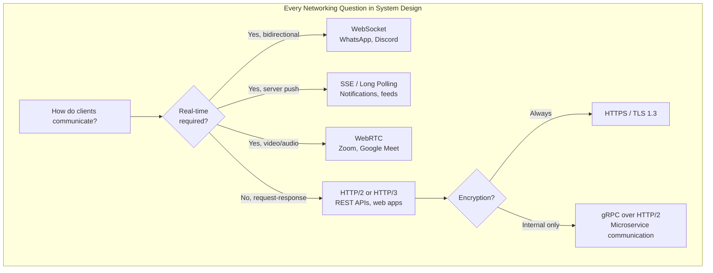
```mermaid
graph TB
    subgraph "Every Networking Question in System Design"
        Q[How do clients communicate?]
        Q --> RT{Real-time<br/>required?}
        RT -->|Yes, bidirectional| WS[WebSocket<br/>WhatsApp, Discord]
        RT -->|Yes, server push| SSE[SSE / Long Polling<br/>Notifications, feeds]
        RT -->|Yes, video/audio| RTC[WebRTC<br/>Zoom, Google Meet]
        RT -->|No, request-response| HTTP[HTTP/2 or HTTP/3<br/>REST APIs, web apps]
        HTTP --> ENC{Encryption?}
        ENC -->|Always| TLS[HTTPS / TLS 1.3]
        ENC -->|Internal only| GRPC[gRPC over HTTP/2<br/>Microservice communication]
    end
```

### What "Good" Looks Like in an Interview

| Level | What You Demonstrate |
|-------|---------------------|
| **Junior** | Names a protocol ("we'd use WebSocket") |
| **Mid** | Explains why ("bidirectional, low-latency message delivery") |
| **Senior** | Describes internals ("HTTP/2 multiplexing over single TCP connection; head-of-line blocking solved by HTTP/3 QUIC") |
| **Staff** | Designs full stack ("CDN for static media, WebSocket gateway with consistent hash for connection affinity, gRPC for internal service mesh, rate limiting at API gateway") |

---

## 2. OSI & TCP/IP Model — Practical Subset

### 2.1 The Models — What to Know for Interviews

You don't need to memorize all 7 OSI layers. Focus on the **4 layers that matter in system design**:

```mermaid
graph TB
    subgraph OSI Model — 7 Layers
        L7O[7. Application<br/>HTTP, gRPC, DNS, WebSocket]
        L6O[6. Presentation<br/>TLS encryption, compression]
        L5O[5. Session<br/>Connection management]
        L4O[4. Transport<br/>TCP, UDP]
        L3O[3. Network<br/>IP, routing, ICMP]
        L2O[2. Data Link<br/>Ethernet, MAC addresses]
        L1O[1. Physical<br/>Cables, signals]
    end

    subgraph TCP/IP Model — 4 Layers
        L4T[Application Layer<br/>HTTP, gRPC, DNS, TLS, WebSocket]
        L3T[Transport Layer<br/>TCP, UDP]
        L2T[Internet Layer<br/>IP, routing]
        L1T[Network Access<br/>Ethernet, WiFi]
    end

    L7O --> L4T
    L6O --> L4T
    L5O --> L4T
    L4O --> L3T
    L3O --> L2T
    L2O --> L1T
    L1O --> L1T
```

### 2.2 Interview-Relevant Layer Breakdown

| Layer | Protocols | What It Does | Interview Relevance |
|-------|-----------|-------------|-------------------|
| **Application (L7)** | HTTP/1.1, HTTP/2, HTTP/3, gRPC, WebSocket, DNS | End-user protocols | API design, protocol selection |
| **Transport (L4)** | TCP, UDP | Reliable/unreliable delivery, ports | TCP vs UDP decision, connection management |
| **Network (L3)** | IP (v4/v6), ICMP | Routing packets between hosts | NAT, IP addressing, routing |
| **Data Link (L2)** | Ethernet, ARP | Local network delivery | Rarely discussed in interviews |

### 2.3 How a Request Flows Through the Stack

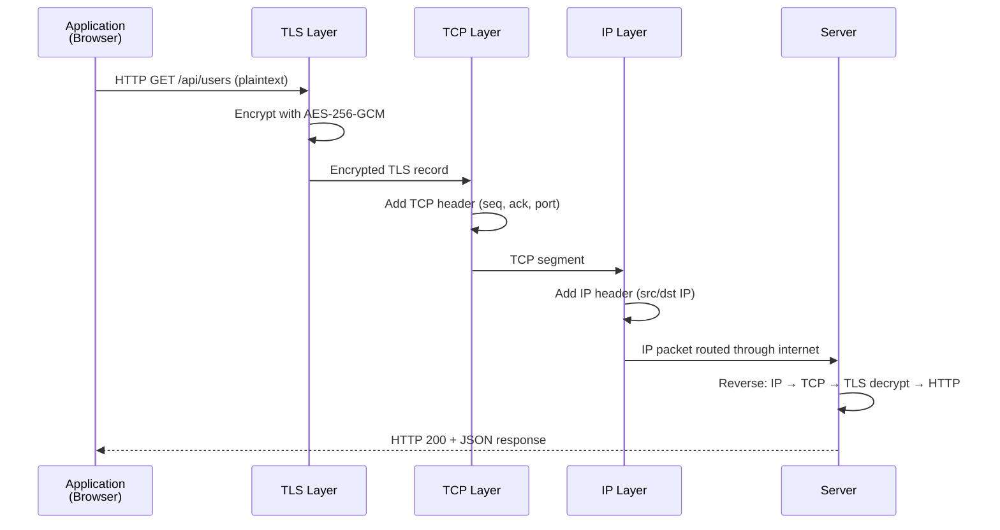
```mermaid
sequenceDiagram
    participant App as Application<br/>(Browser)
    participant TLS as TLS Layer
    participant TCP as TCP Layer
    participant IP as IP Layer
    participant Server as Server

    App->>TLS: HTTP GET /api/users (plaintext)
    TLS->>TLS: Encrypt with AES-256-GCM
    TLS->>TCP: Encrypted TLS record
    TCP->>TCP: Add TCP header (seq, ack, port)
    TCP->>IP: TCP segment
    IP->>IP: Add IP header (src/dst IP)
    IP->>Server: IP packet routed through internet
    Server->>Server: Reverse: IP → TCP → TLS decrypt → HTTP
    Server-->>App: HTTP 200 + JSON response
```

### 2.4 Key Networking Concepts

| Concept | Definition | Interview Example |
|---------|-----------|-------------------|
| **IP Address** | Unique host identifier (IPv4: 32-bit, IPv6: 128-bit) | "Server at 10.0.1.5 in VPC" |
| **Port** | Multiplexing identifier on a host (0-65535) | "HTTP on port 80, HTTPS on 443, PostgreSQL on 5432" |
| **DNS** | Domain Name → IP address resolution | "api.instagram.com → 157.240.x.x" |
| **MTU** | Maximum Transmission Unit — max packet size (1500 bytes Ethernet) | "Large responses fragmented at IP layer" |
| **Latency** | Time for packet to travel (ms) | "US-East to US-West: ~60-80ms" |
| **Bandwidth** | Data transfer capacity (Mbps/Gbps) | "1Gbps link handles ~125MB/sec" |
| **Throughput** | Actual data transferred per second | "Limited by bandwidth OR latency (RTT)" |

### 2.5 Latency Numbers Every Engineer Should Know

| Operation | Latency | Context |
|-----------|---------|---------|
| **L1 cache reference** | 0.5 ns | CPU |
| **Main memory reference** | 100 ns | RAM |
| **SSD random read** | 16 μs | Local disk |
| **Data center round trip** | 0.5 ms | Same DC |
| **Redis round trip** | 0.5-1 ms | Same DC |
| **PostgreSQL query (indexed)** | 1-10 ms | Same DC |
| **Cross-region round trip (US)** | 60-80 ms | US-East ↔ US-West |
| **Cross-continent round trip** | 150-300 ms | US ↔ Europe |
| **DNS resolution** | 20-120 ms | First lookup (cached: 0ms) |
| **TCP handshake (1 RTT)** | 0.5-1 ms (same DC) | Connection setup |
| **TLS handshake (1-RTT)** | 0.5-1 ms (same DC) | TLS 1.3 with session resumption |
| **CDN cache hit** | 5-20 ms | Edge PoP |

---

## 3. TCP vs UDP — Deep Dive

### 3.1 TCP — Transmission Control Protocol

TCP provides **reliable, ordered, connection-oriented** byte stream delivery.

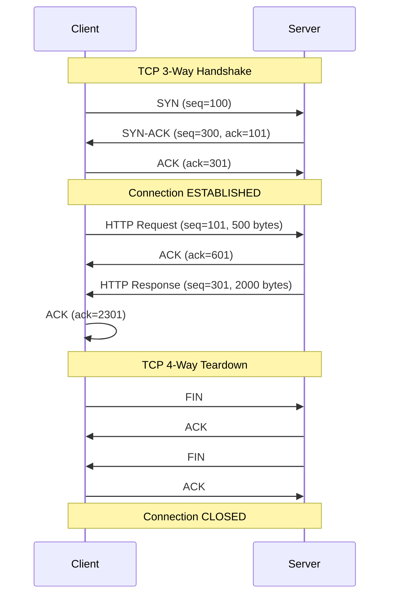
```mermaid
sequenceDiagram
    participant Client
    participant Server

    Note over Client,Server: TCP 3-Way Handshake
    Client->>Server: SYN (seq=100)
    Server->>Client: SYN-ACK (seq=300, ack=101)
    Client->>Server: ACK (ack=301)
    Note over Client,Server: Connection ESTABLISHED

    Client->>Server: HTTP Request (seq=101, 500 bytes)
    Server->>Client: ACK (ack=601)
    Server->>Client: HTTP Response (seq=301, 2000 bytes)
    Client->>Client: ACK (ack=2301)

    Note over Client,Server: TCP 4-Way Teardown
    Client->>Server: FIN
    Server->>Client: ACK
    Server->>Client: FIN
    Client->>Server: ACK
    Note over Client,Server: Connection CLOSED
```

### 3.2 TCP Internals — What Interviewers Expect

**Flow Control (Receiver-side):**

```mermaid
graph LR
    subgraph TCP Flow Control — Sliding Window
        SENDER[Sender<br/>Sends up to window size]
        RECEIVER[Receiver<br/>Advertises window size<br/>in TCP header]
        BUFFER[Receive Buffer<br/>If full → window=0<br/>Sender pauses]
        SENDER -->|data within window| RECEIVER
        RECEIVER --> BUFFER
        BUFFER -->|window update| SENDER
    end
```

| Mechanism | Purpose | How |
|-----------|---------|-----|
| **Flow control** | Prevent overwhelming receiver | Receiver advertises window size; sender limits in-flight data |
| **Congestion control** | Prevent overwhelming network | Sender adjusts rate based on packet loss/delays |
| **Sequence numbers** | Ordered delivery | Every byte numbered; receiver reorders |
| **Acknowledgments** | Confirm receipt | Receiver ACKs next expected sequence number |
| **Retransmission** | Handle packet loss | Timeout or duplicate ACK triggers resend |

**Congestion Control Algorithms:**

| Algorithm | Behavior | Used By |
|-----------|----------|---------|
| **Slow Start** | Exponential window growth until threshold | All TCP |
| **Congestion Avoidance** | Linear growth after threshold | All TCP |
| **Fast Retransmit** | Resend on 3 duplicate ACKs (no timeout wait) | All TCP |
| **Fast Recovery** | Halve window on loss, then linear growth | Reno, NewReno |
| **CUBIC** | Cubic function for window growth — better for high bandwidth | Linux default |
| **BBR** | Model-based — estimates bandwidth and RTT | Google (YouTube, GCP) |

### 3.3 UDP — User Datagram Protocol

UDP provides **unreliable, unordered, connectionless** datagram delivery.

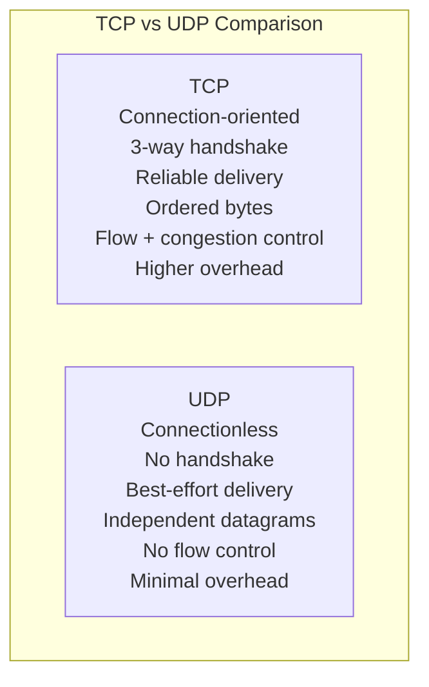
```mermaid
graph TB
    subgraph TCP vs UDP Comparison
        TCP_BOX[TCP<br/>Connection-oriented<br/>3-way handshake<br/>Reliable delivery<br/>Ordered bytes<br/>Flow + congestion control<br/>Higher overhead]
        UDP_BOX[UDP<br/>Connectionless<br/>No handshake<br/>Best-effort delivery<br/>Independent datagrams<br/>No flow control<br/>Minimal overhead]
    end
```

| Property | TCP | UDP |
|----------|-----|-----|
| **Connection** | Connection-oriented (handshake) | Connectionless (send immediately) |
| **Reliability** | Guaranteed delivery + retransmission | Best-effort; packets may be lost |
| **Ordering** | In-order delivery guaranteed | No ordering guarantee |
| **Speed** | Slower (handshake + ACK overhead) | Faster (no handshake, no ACK) |
| **Header size** | 20-60 bytes | 8 bytes |
| **Use cases** | HTTP, gRPC, databases, file transfer | DNS, video streaming, gaming, VoIP |
| **Head-of-line blocking** | Yes — lost packet blocks all subsequent | No — lost packet only affects that datagram |

### 3.4 When to Use TCP vs UDP in Interviews

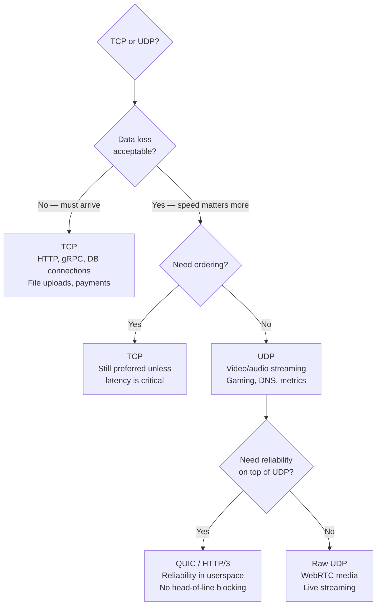
```mermaid
flowchart TB
    START{TCP or UDP?} --> Q1{Data loss<br/>acceptable?}
    Q1 -->|No — must arrive| TCP_CHOICE[TCP<br/>HTTP, gRPC, DB connections<br/>File uploads, payments]
    Q1 -->|Yes — speed matters more| Q2{Need ordering?}
    Q2 -->|Yes| TCP_CHOICE2[TCP<br/>Still preferred unless<br/>latency is critical]
    Q2 -->|No| UDP_CHOICE[UDP<br/>Video/audio streaming<br/>Gaming, DNS, metrics]

    UDP_CHOICE --> Q3{Need reliability<br/>on top of UDP?}
    Q3 -->|Yes| QUIC[QUIC / HTTP/3<br/>Reliability in userspace<br/>No head-of-line blocking]
    Q3 -->|No| RAW_UDP[Raw UDP<br/>WebRTC media<br/>Live streaming]
```

| System | Protocol | Why |
|--------|----------|-----|
| **REST APIs** | TCP (HTTP/2) | Reliable request-response |
| **gRPC internal** | TCP (HTTP/2) | Reliable RPC between services |
| **WhatsApp messages** | TCP (WebSocket) | Messages must arrive |
| **Zoom video** | UDP (WebRTC) | 30ms late frame is useless; drop it |
| **DNS lookup** | UDP | Single request-response; speed |
| **Online gaming** | UDP | Position updates; latest state matters |
| **Netflix streaming** | TCP (HTTPS) | Buffering compensates for latency |
| **Live sports streaming** | UDP/WebRTC | Low latency > perfect quality |

**Sample interview answer (Zoom video call):**

> "Video/audio media uses UDP via WebRTC. A lost video frame is useless — retransmitting it would cause delay. UDP sends packets without waiting for ACKs. For signaling (call setup, ICE negotiation), we use TCP/WebSocket because those messages must arrive. This is why Zoom uses WebRTC (UDP for media) not WebSocket (TCP for everything)."

---

## 4. HTTP/1.1 vs HTTP/2 vs HTTP/3 (QUIC)

### 4.1 HTTP/1.1 — The Baseline

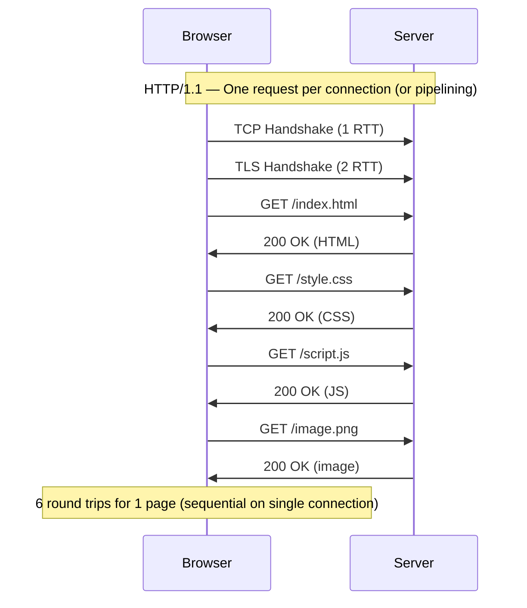
```mermaid
sequenceDiagram
    participant Browser
    participant Server

    Note over Browser,Server: HTTP/1.1 — One request per connection (or pipelining)
    Browser->>Server: TCP Handshake (1 RTT)
    Browser->>Server: TLS Handshake (2 RTT)
    Browser->>Server: GET /index.html
    Server->>Browser: 200 OK (HTML)
    Browser->>Server: GET /style.css
    Server->>Browser: 200 OK (CSS)
    Browser->>Server: GET /script.js
    Server->>Browser: 200 OK (JS)
    Browser->>Server: GET /image.png
    Server->>Browser: 200 OK (image)
    Note over Browser: 6 round trips for 1 page (sequential on single connection)
```

| Property | HTTP/1.1 |
|----------|----------|
| **Connections** | One request at a time per connection (pipelining rarely used) |
| **Workaround** | Browsers open 6-8 parallel TCP connections per domain |
| **Head-of-line blocking** | Yes — one slow response blocks all behind it on same connection |
| **Header overhead** | Full headers repeated every request (no compression) |
| **Server push** | Not supported |
| **Status** | Still widely used; being replaced by HTTP/2 |

### 4.2 HTTP/2 — Multiplexing Over Single TCP

```mermaid
graph TB
    subgraph HTTP/2 — Single TCP Connection, Multiple Streams
        TCP[Single TCP Connection]
        TCP --> S1[Stream 1: GET /index.html]
        TCP --> S2[Stream 2: GET /style.css]
        TCP --> S3[Stream 3: GET /script.js]
        TCP --> S4[Stream 4: GET /image.png]
        TCP --> S5[Stream 5: GET /api/data]
    end
```

**Key HTTP/2 features:**

| Feature | How | Benefit |
|---------|-----|---------|
| **Multiplexing** | Multiple streams over one TCP connection | No connection limit; parallel requests |
| **Header compression (HPACK)** | Compress headers with static + dynamic tables | ~30-50% header size reduction |
| **Server push** | Server sends resources before client asks | Reduced round trips (rarely used in practice) |
| **Stream prioritization** | Weighted priority per stream | Critical resources first |
| **Binary framing** | Data sent as binary frames, not text | More efficient parsing |

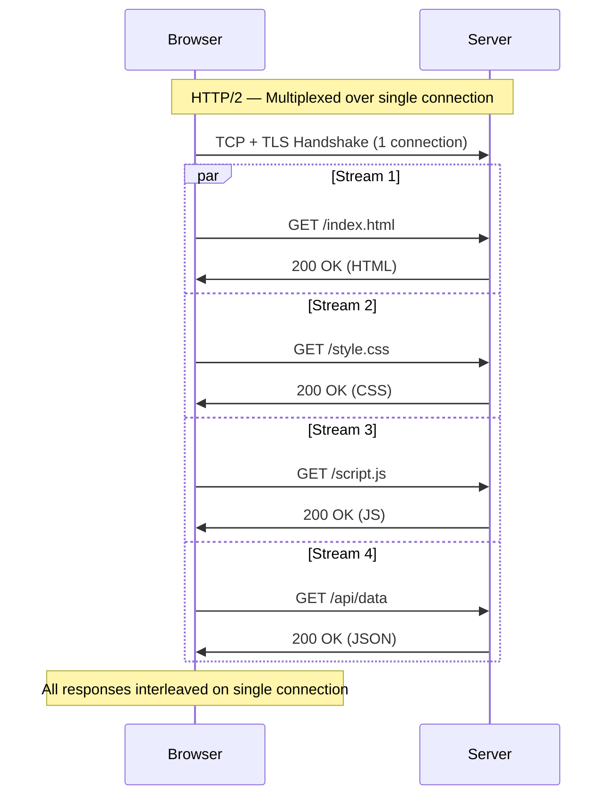
```mermaid
sequenceDiagram
    participant Browser
    participant Server

    Note over Browser,Server: HTTP/2 — Multiplexed over single connection
    Browser->>Server: TCP + TLS Handshake (1 connection)
    par Stream 1
        Browser->>Server: GET /index.html
        Server->>Browser: 200 OK (HTML)
    and Stream 2
        Browser->>Server: GET /style.css
        Server->>Browser: 200 OK (CSS)
    and Stream 3
        Browser->>Server: GET /script.js
        Server->>Browser: 200 OK (JS)
    and Stream 4
        Browser->>Server: GET /api/data
        Server->>Browser: 200 OK (JSON)
    end
    Note over Browser: All responses interleaved on single connection
```

**HTTP/2 head-of-line blocking problem:**

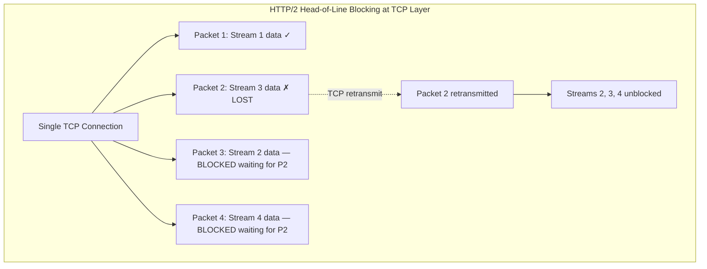
```mermaid
graph TB
    subgraph HTTP/2 Head-of-Line Blocking at TCP Layer
        TCP2[Single TCP Connection]
        TCP2 --> P1[Packet 1: Stream 1 data ✓]
        TCP2 --> P2[Packet 2: Stream 3 data ✗ LOST]
        TCP2 --> P3[Packet 3: Stream 2 data — BLOCKED waiting for P2]
        TCP2 --> P4[Packet 4: Stream 4 data — BLOCKED waiting for P2]
        P2 -.->|TCP retransmit| P2R[Packet 2 retransmitted]
        P2R --> UNBLOCK[Streams 2, 3, 4 unblocked]
    end
```

> HTTP/2 solves application-layer head-of-line blocking but **TCP-layer head-of-line blocking remains**. One lost packet blocks ALL streams on the connection.

### 4.3 HTTP/3 (QUIC) — UDP-Based, No Head-of-Line Blocking

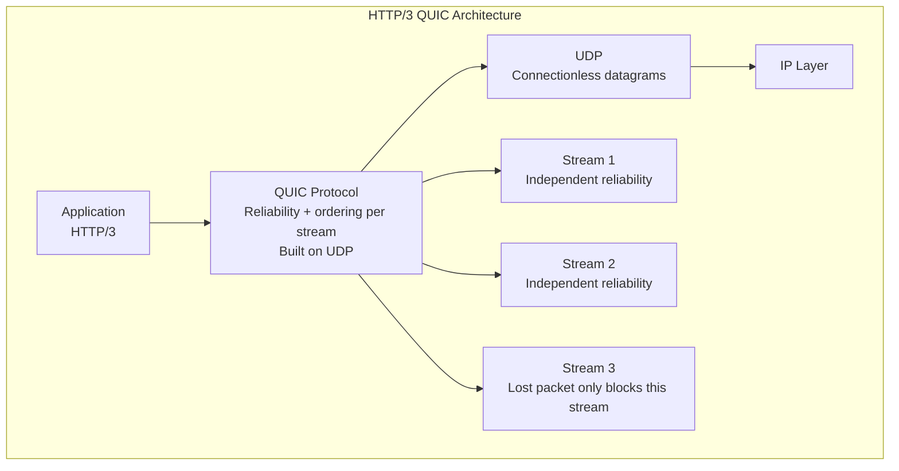
```mermaid
graph TB
    subgraph HTTP/3 QUIC Architecture
        APP[Application<br/>HTTP/3]
        APP --> QUIC[QUIC Protocol<br/>Reliability + ordering per stream<br/>Built on UDP]
        QUIC --> UDP_L[UDP<br/>Connectionless datagrams]
        UDP_L --> IP_L[IP Layer]

        QUIC --> S1[Stream 1<br/>Independent reliability]
        QUIC --> S2[Stream 2<br/>Independent reliability]
        QUIC --> S3[Stream 3<br/>Lost packet only blocks this stream]
    end
```

| Feature | HTTP/2 | HTTP/3 (QUIC) |
|---------|--------|---------------|
| **Transport** | TCP | UDP (QUIC provides reliability) |
| **Connection setup** | TCP (1 RTT) + TLS (1-2 RTT) = 2-3 RTT | QUIC + TLS 1.3 integrated = **0-1 RTT** |
| **Head-of-line blocking** | TCP-layer blocking affects all streams | Per-stream reliability — lost packet blocks only that stream |
| **Connection migration** | Breaks on IP change (mobile switching WiFi→4G) | Connection ID based — survives IP changes |
| **Multiplexing** | Yes (over TCP) | Yes (native per-stream) |
| **Adoption** | ~70% of websites (2026) | Growing rapidly; Google, Facebook, Cloudflare |
| **Firewall issues** | TCP 443 — universally allowed | UDP 443 — some corporate firewalls block |

**QUIC connection establishment:**

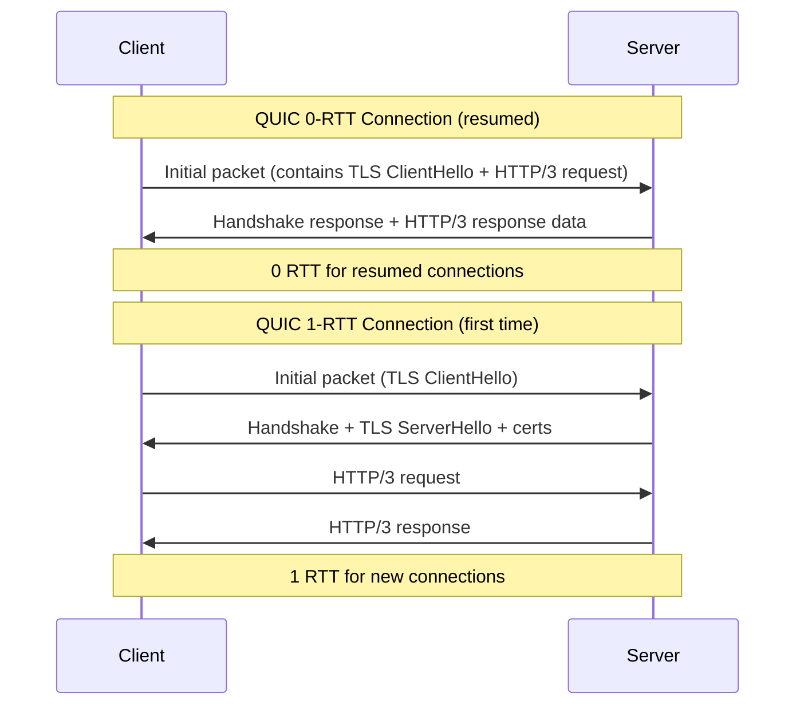
```mermaid
sequenceDiagram
    participant Client
    participant Server

    Note over Client,Server: QUIC 0-RTT Connection (resumed)
    Client->>Server: Initial packet (contains TLS ClientHello + HTTP/3 request)
    Server->>Client: Handshake response + HTTP/3 response data
    Note over Client,Server: 0 RTT for resumed connections

    Note over Client,Server: QUIC 1-RTT Connection (first time)
    Client->>Server: Initial packet (TLS ClientHello)
    Server->>Client: Handshake + TLS ServerHello + certs
    Client->>Server: HTTP/3 request
    Server->>Client: HTTP/3 response
    Note over Client,Server: 1 RTT for new connections
```

### 4.4 Protocol Selection in Interviews

| Scenario | Protocol | Why |
|----------|----------|-----|
| **Public REST API** | HTTP/2 or HTTP/3 | Broad client support; multiplexing |
| **Internal microservices** | gRPC over HTTP/2 | Binary, typed, streaming |
| **Static content delivery** | HTTP/2 or HTTP/3 via CDN | Multiplexing for parallel asset loading |
| **Mobile app (frequent network changes)** | HTTP/3 (QUIC) | Connection migration on IP change |
| **Real-time messaging** | WebSocket over TCP | Bidirectional; HTTP/2 not designed for this |
| **Video conferencing** | WebRTC over UDP | Latency > reliability for media |

---

## 5. HTTPS & TLS — How Encryption Works

### 5.1 Why HTTPS Matters

Every system design interview assumes HTTPS for external traffic. Interviewers expect you to understand what happens during the TLS handshake.

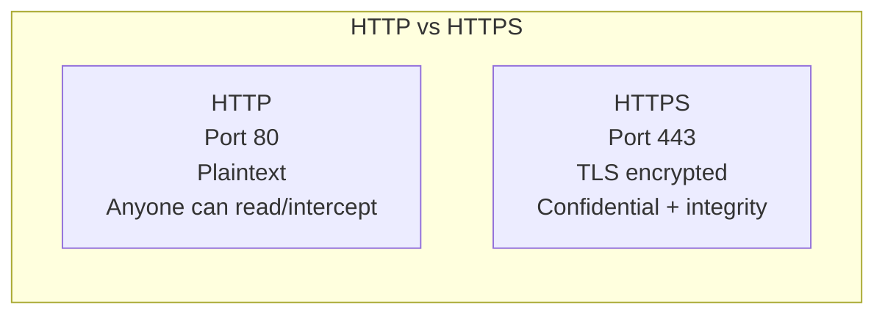
```mermaid
graph LR
    subgraph HTTP vs HTTPS
        HTTP_UN[HTTP<br/>Port 80<br/>Plaintext<br/>Anyone can read/intercept]
        HTTPS_ENC[HTTPS<br/>Port 443<br/>TLS encrypted<br/>Confidential + integrity]
    end
```

### 5.2 TLS 1.3 Handshake — Step by Step

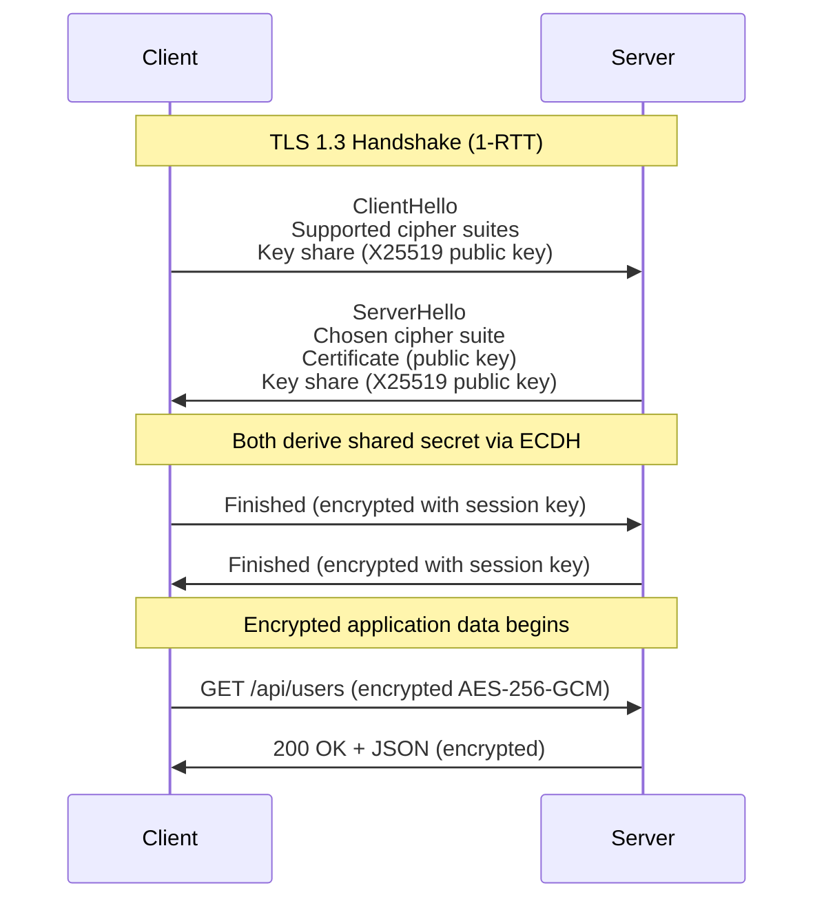
```mermaid
sequenceDiagram
    participant Client
    participant Server

    Note over Client,Server: TLS 1.3 Handshake (1-RTT)
    Client->>Server: ClientHello<br/>Supported cipher suites<br/>Key share (X25519 public key)
    Server->>Client: ServerHello<br/>Chosen cipher suite<br/>Certificate (public key)<br/>Key share (X25519 public key)
    Note over Client,Server: Both derive shared secret via ECDH
    Client->>Server: Finished (encrypted with session key)
    Server->>Client: Finished (encrypted with session key)
    Note over Client,Server: Encrypted application data begins

    Client->>Server: GET /api/users (encrypted AES-256-GCM)
    Server->>Client: 200 OK + JSON (encrypted)
```

| Step | What Happens | Purpose |
|------|-------------|---------|
| **ClientHello** | Client sends supported ciphers + key share | Negotiate encryption parameters |
| **ServerHello** | Server picks cipher + sends certificate + key share | Authenticate server + negotiate |
| **Key derivation** | Both compute shared secret via ECDH | Symmetric encryption key |
| **Finished** | Both confirm handshake integrity | Prevent tampering |
| **Application data** | Encrypted with AES-256-GCM (or ChaCha20) | Confidential + integrity |

### 5.3 TLS Concepts for Interviews

| Concept | What It Is | Interview Relevance |
|---------|-----------|-------------------|
| **Symmetric encryption** | Same key encrypts and decrypts (AES-256-GCM) | Fast bulk data encryption |
| **Asymmetric encryption** | Public/private key pair (RSA, ECDH) | Key exchange during handshake only |
| **Certificate** | Server's public key signed by CA (Let's Encrypt, DigiCert) | Proves server identity |
| **Certificate Authority (CA)** | Trusted third party that signs certificates | Browser trusts CA → trusts server |
| **Forward secrecy** | Compromised long-term key doesn't decrypt past sessions | TLS 1.3 mandates ephemeral keys |
| **Session resumption** | Reuse previous session key (0-RTT) | Faster reconnections |
| **mTLS** | Mutual TLS — client also presents certificate | Service-to-service authentication |

### 5.4 TLS Termination Patterns

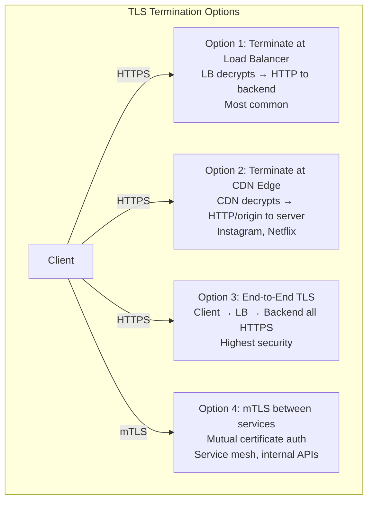
```mermaid
graph TB
    subgraph TLS Termination Options
        CLIENT[Client]

        CLIENT -->|HTTPS| OPT1[Option 1: Terminate at Load Balancer<br/>LB decrypts → HTTP to backend<br/>Most common]
        CLIENT -->|HTTPS| OPT2[Option 2: Terminate at CDN Edge<br/>CDN decrypts → HTTP/origin to server<br/>Instagram, Netflix]
        CLIENT -->|HTTPS| OPT3[Option 3: End-to-End TLS<br/>Client → LB → Backend all HTTPS<br/>Highest security]
        CLIENT -->|mTLS| OPT4[Option 4: mTLS between services<br/>Mutual certificate auth<br/>Service mesh, internal APIs]
    end
```

| Pattern | Where TLS Ends | Backend Protocol | Use Case |
|---------|---------------|-----------------|----------|
| **LB termination** | Load balancer | HTTP (internal network) | Most web apps |
| **CDN termination** | CDN edge PoP | HTTP to origin (or origin HTTPS) | Static content, media |
| **End-to-end** | Application server | HTTPS all the way | Banking, healthcare |
| **mTLS** | Both sides authenticate | gRPC with mTLS | Microservice mesh (Istio) |

---

## 6. Real-Time Communication Patterns

### 6.1 The Spectrum of Real-Time Options

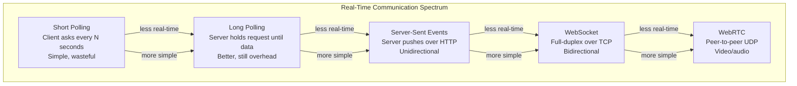
```mermaid
graph TB
    subgraph Real-Time Communication Spectrum
        POLL[Short Polling<br/>Client asks every N seconds<br/>Simple, wasteful]
        LPOLL[Long Polling<br/>Server holds request until data<br/>Better, still overhead]
        SSE[Server-Sent Events<br/>Server pushes over HTTP<br/>Unidirectional]
        WS[WebSocket<br/>Full-duplex over TCP<br/>Bidirectional]
        RTC[WebRTC<br/>Peer-to-peer UDP<br/>Video/audio]
    end

    POLL -->|less real-time| LPOLL -->|less real-time| SSE -->|less real-time| WS -->|less real-time| RTC
    POLL -->|more simple| LPOLL -->|more simple| SSE -->|more simple| WS -->|more simple| RTC
```

### 6.2 Short Polling vs Long Polling

**Short polling:**

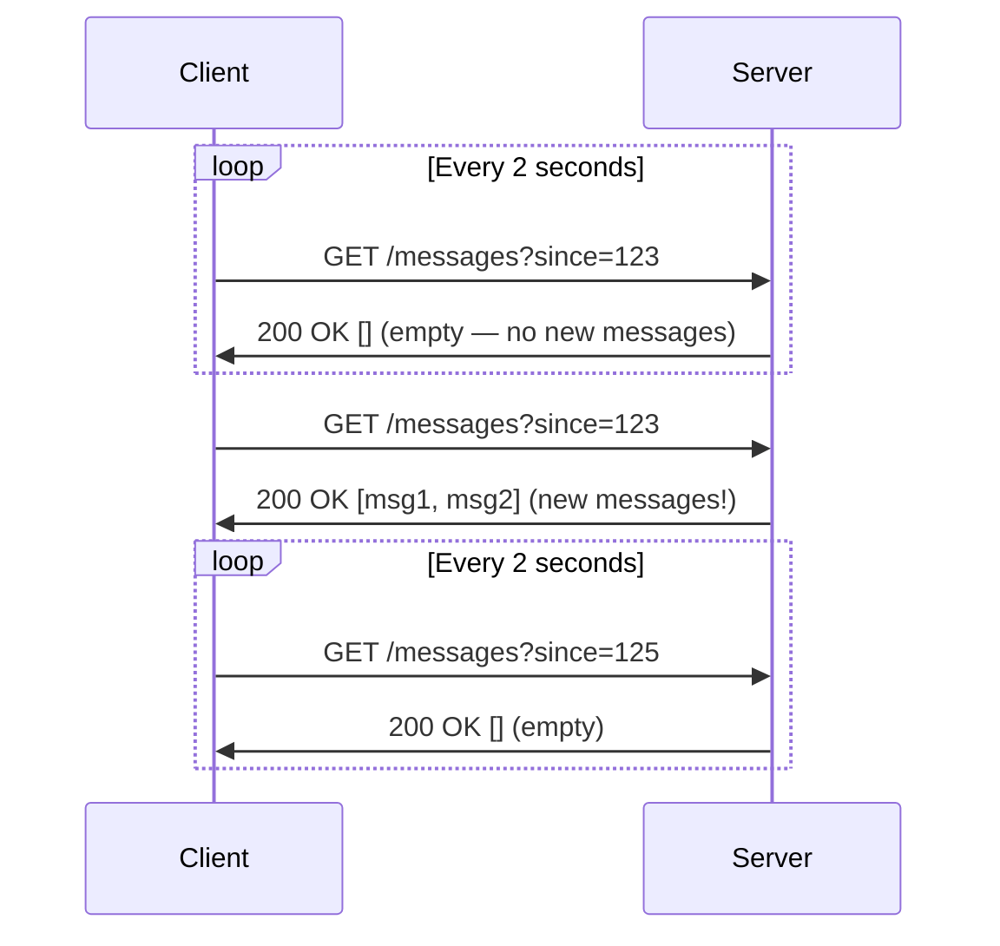
```mermaid
sequenceDiagram
    participant Client
    participant Server

    loop Every 2 seconds
        Client->>Server: GET /messages?since=123
        Server->>Client: 200 OK [] (empty — no new messages)
    end
    Client->>Server: GET /messages?since=123
    Server->>Client: 200 OK [msg1, msg2] (new messages!)
    loop Every 2 seconds
        Client->>Server: GET /messages?since=125
        Server->>Client: 200 OK [] (empty)
    end
```

**Long polling:**

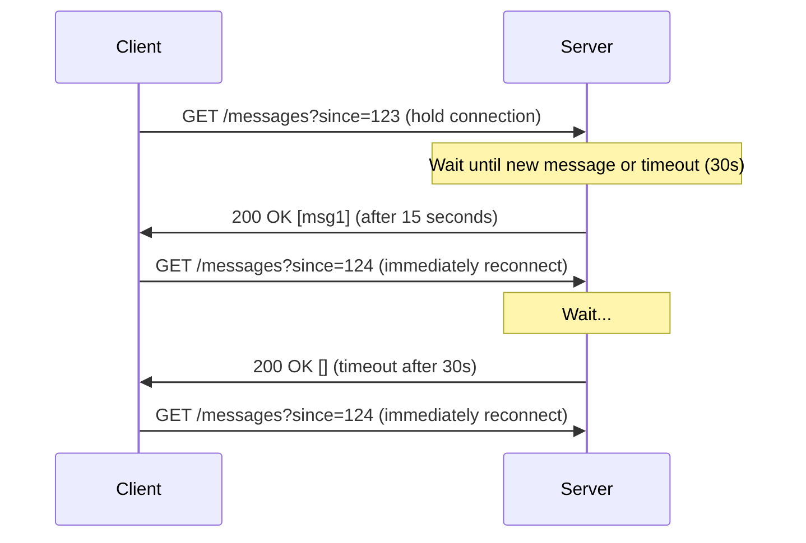
```mermaid
sequenceDiagram
    participant Client
    participant Server

    Client->>Server: GET /messages?since=123 (hold connection)
    Note over Server: Wait until new message or timeout (30s)
    Server->>Client: 200 OK [msg1] (after 15 seconds)
    Client->>Server: GET /messages?since=124 (immediately reconnect)
    Note over Server: Wait...
    Server->>Client: 200 OK [] (timeout after 30s)
    Client->>Server: GET /messages?since=124 (immediately reconnect)
```

| Pattern | Latency | Server Load | Complexity | Use Case |
|---------|---------|-------------|------------|----------|
| **Short polling** | 0-N seconds (poll interval) | High (constant requests) | Very low | Dashboard refresh, status checks |
| **Long polling** | Near real-time | Medium (held connections) | Low | Notifications before WebSocket era |
| **SSE** | Near real-time | Medium (persistent connections) | Low | Stock tickers, live feeds, notifications |
| **WebSocket** | Real-time (<100ms) | Medium (persistent connections) | Medium | Chat, gaming, collaborative editing |
| **WebRTC** | Ultra-low latency (<50ms) | Low (peer-to-peer) | High | Video calls, screen sharing |

### 6.3 WebSocket — Deep Dive

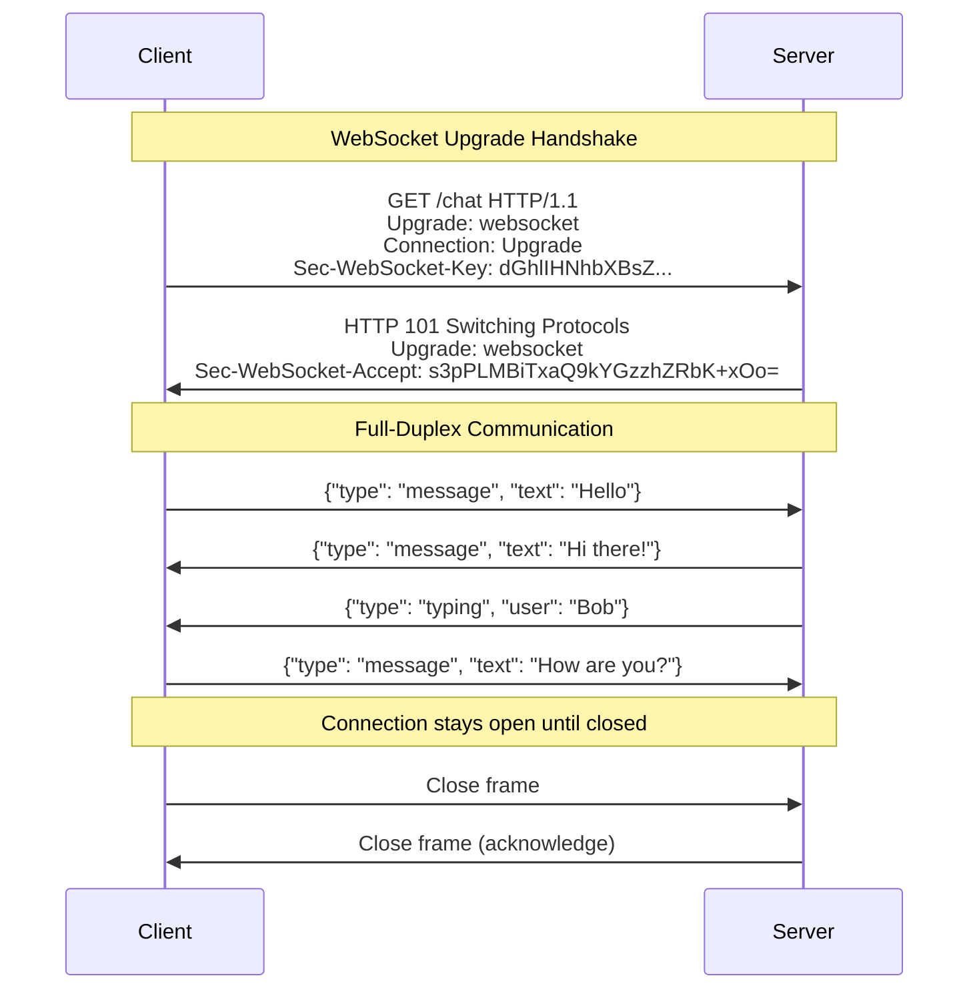
```mermaid
sequenceDiagram
    participant Client
    participant Server

    Note over Client,Server: WebSocket Upgrade Handshake
    Client->>Server: GET /chat HTTP/1.1<br/>Upgrade: websocket<br/>Connection: Upgrade<br/>Sec-WebSocket-Key: dGhlIHNhbXBsZ...
    Server->>Client: HTTP 101 Switching Protocols<br/>Upgrade: websocket<br/>Sec-WebSocket-Accept: s3pPLMBiTxaQ9kYGzzhZRbK+xOo=

    Note over Client,Server: Full-Duplex Communication
    Client->>Server: {"type": "message", "text": "Hello"}
    Server->>Client: {"type": "message", "text": "Hi there!"}
    Server->>Client: {"type": "typing", "user": "Bob"}
    Client->>Server: {"type": "message", "text": "How are you?"}

    Note over Client,Server: Connection stays open until closed
    Client->>Server: Close frame
    Server->>Client: Close frame (acknowledge)
```

**WebSocket scaling architecture:**

```mermaid
graph TB
    subgraph WebSocket Gateway Architecture
        C1[Client 1] --> LB[Load Balancer<br/>L4: consistent hash by user_id]
        C2[Client 2] --> LB
        C3[Client 3] --> LB

        LB --> GW1[WebSocket Gateway 1<br/>10K connections]
        LB --> GW2[WebSocket Gateway 2<br/>10K connections]
        LB --> GW3[WebSocket Gateway 3<br/>10K connections]

        GW1 --> REDIS[Redis Pub/Sub<br/>Cross-gateway message routing]
        GW2 --> REDIS
        GW3 --> REDIS

        REDIS --> BACKEND[Message Service<br/>Cassandra / Kafka]
    end
```

| Challenge | Solution |
|-----------|----------|
| **Connection affinity** | Consistent hash on user_id at L4 load balancer |
| **Cross-gateway messaging** | Redis Pub/Sub or dedicated message bus |
| **Scaling gateways** | Each gateway handles 10-50K connections; add gateways horizontally |
| **Reconnection** | Client auto-reconnect with exponential backoff; server tracks last message ID |
| **Heartbeat** | Ping/pong frames every 30s to detect dead connections |

### 6.4 Server-Sent Events (SSE)

```mermaid
sequenceDiagram
    participant Client
    participant Server

    Client->>Server: GET /events HTTP/1.1<br/>Accept: text/event-stream
    Server->>Client: HTTP 200<br/>Content-Type: text/event-stream

    Server->>Client: data: {"price": 150.25}\n\n
    Server->>Client: data: {"price": 150.30}\n\n
    Server->>Client: data: {"price": 150.28}\n\n
    Note over Client,Server: Connection stays open; server pushes events
```

| Property | SSE | WebSocket |
|----------|-----|-----------|
| **Direction** | Server → Client only | Bidirectional |
| **Protocol** | HTTP (works through proxies/firewalls) | Upgrade from HTTP (some proxies block) |
| **Reconnection** | Built-in auto-reconnect | Manual implementation |
| **Data format** | Text only (UTF-8) | Binary or text |
| **Complexity** | Simpler — just HTTP | More complex — upgrade handshake |
| **Use case** | Live feeds, notifications, stock prices | Chat, gaming, collaborative editing |

### 6.5 When to Use What — Real-Time Decision

| System | Pattern | Why |
|--------|---------|-----|
| **WhatsApp** | WebSocket | Bidirectional; instant message delivery; typing indicators |
| **Discord** | WebSocket | Bidirectional; voice signaling + text chat |
| **Twitter notifications** | SSE or Long Polling | Server push only; client doesn't send via notification channel |
| **Stock ticker** | SSE | Server pushes price updates; unidirectional |
| **Google Docs** | WebSocket | Bidirectional; real-time cursor and edit sync |
| **Uber driver tracking** | WebSocket or SSE | Server pushes location updates to rider |
| **Zoom** | WebRTC (media) + WebSocket (signaling) | Video needs UDP; signaling needs reliability |
| **Live sports score** | SSE | Server pushes score updates |

---

## 7. REST vs gRPC vs GraphQL

### 7.1 REST — Representational State Transfer

```mermaid
graph TB
    subgraph REST API Design
        CLIENT[Client]
        CLIENT -->|GET /users/123| API[REST API Server]
        CLIENT -->|POST /users| API
        CLIENT -->|PUT /users/123| API
        CLIENT -->|DELETE /users/123| API
        API --> DB[(Database)]
    end
```

| Property | REST |
|----------|------|
| **Protocol** | HTTP/1.1 or HTTP/2 |
| **Data format** | JSON (typically) |
| **Contract** | URL paths + HTTP methods (informal) |
| **Discovery** | OpenAPI/Swagger spec |
| **Caching** | HTTP caching headers (ETag, Cache-Control) |
| **Browser support** | Native — fetch, XMLHttpRequest |
| **Streaming** | Limited (chunked transfer encoding) |

### 7.2 gRPC — High-Performance RPC

```mermaid
graph TB
    subgraph gRPC Architecture
        CLIENT[gRPC Client<br/>Stub generated from .proto]
        CLIENT -->|HTTP/2 + Protobuf| SERVER[gRPC Server<br/>Service implementation]
        SERVER --> DB[(Database)]

        PROTO[.proto file<br/>message User {<br/>  int64 id = 1;<br/>  string name = 2;<br/>}<br/>service UserService {<br/>  rpc GetUser(UserRequest) returns (User);<br/>}]
        PROTO -.->|code generation| CLIENT
        PROTO -.->|code generation| SERVER
    end
```

| Property | gRPC |
|----------|------|
| **Protocol** | HTTP/2 (required) |
| **Data format** | Protocol Buffers (binary, ~10x smaller than JSON) |
| **Contract** | Strict — `.proto` file defines messages and services |
| **Code generation** | Auto-generates client/server stubs in 10+ languages |
| **Streaming** | Unary, server streaming, client streaming, bidirectional |
| **Browser support** | Requires gRPC-Web proxy (Envoy) |
| **Performance** | 5-10x faster than REST JSON (binary + HTTP/2 multiplexing) |

**gRPC streaming modes:**

```mermaid
graph TB
    subgraph gRPC Streaming Types
        UNARY[Unary<br/>Client sends 1 request<br/>Server sends 1 response<br/>Like REST]
        SERVER_S[Server Streaming<br/>Client sends 1 request<br/>Server sends stream of responses<br/>e.g., download file chunks]
        CLIENT_S[Client Streaming<br/>Client sends stream<br/>Server sends 1 response<br/>e.g., upload file chunks]
        BIDI[Bidirectional Streaming<br/>Both sides send streams<br/>e.g., chat, real-time sync]
    end
```

### 7.3 GraphQL — Query Language for APIs

```mermaid
sequenceDiagram
    participant Client
    participant GQL as GraphQL Server
    participant UserDB as User Service
    participant PostDB as Post Service

    Client->>GQL: query {<br/>  user(id: 123) {<br/>    name<br/>    email<br/>    posts(limit: 5) {<br/>      title<br/>      likes<br/>    }<br/>  }<br/>}
    GQL->>UserDB: GetUser(123)
    UserDB->>GQL: {name, email}
    GQL->>PostDB: GetPosts(user=123, limit=5)
    PostDB->>GQL: [{title, likes}, ...]
    GQL->>Client: {user: {name, email, posts: [...]}}
    Note over Client: Client gets exactly the fields it asked for
```

| Property | GraphQL |
|----------|---------|
| **Protocol** | HTTP (POST typically) |
| **Data format** | JSON |
| **Contract** | GraphQL schema (typed, introspectable) |
| **Query flexibility** | Client specifies exact fields needed |
| **Over-fetching** | Eliminated — client requests only needed fields |
| **Under-fetching** | Eliminated — one query fetches related data |
| **Caching** | Harder — no HTTP URL-based caching (use persisted queries) |
| **Complexity** | Server must resolve nested queries (N+1 problem) |

### 7.4 REST vs gRPC vs GraphQL — Comparison

| Dimension | REST | gRPC | GraphQL |
|-----------|------|------|---------|
| **Best for** | Public APIs, web apps, CRUD | Internal microservices, high perf | Mobile apps, flexible frontends |
| **Performance** | Moderate (JSON overhead) | Excellent (binary protobuf) | Moderate (JSON; N+1 risk) |
| **Contract** | Informal (OpenAPI) | Strict (.proto) | Strict (GraphQL schema) |
| **Browser support** | Native | Needs gRPC-Web proxy | Native |
| **Caching** | HTTP caching (easy) | Not HTTP-cacheable | Custom (persisted queries) |
| **Streaming** | Limited | Full bidirectional | Subscriptions (WebSocket) |
| **Learning curve** | Low | Medium | Medium |
| **Versioning** | URL/header versioning | Backward-compatible proto fields | Schema evolution (deprecation) |
| **Tooling** | Swagger, Postman | grpcurl, BloomRPC | GraphiQL, Apollo |
| **Used by** | Most public APIs | Google, Uber, Netflix (internal) | Facebook, GitHub, Shopify |

### 7.5 When to Use What in Interviews

```mermaid
flowchart TB
    START{API type?} --> Q1{Who consumes it?}
    Q1 -->|External clients<br/>browsers, mobile| Q2{Need flexible<br/>queries?}
    Q1 -->|Internal microservices| GRPC[gRPC<br/>High performance<br/>Strict contract<br/>Bidirectional streaming]

    Q2 -->|Yes — mobile with<br/>varying screen sizes| GQL[GraphQL<br/>Client specifies fields<br/>Reduce over-fetching]
    Q2 -->|No — standard CRUD| REST[REST<br/>Simple, universal<br/>HTTP caching<br/>OpenAPI docs]

    REST --> Q3{Performance<br/>critical internal?}
    Q3 -->|Yes| GRPC
    Q3 -->|No| REST
```

| System | API Type | Why |
|--------|----------|-----|
| **Uber (internal)** | gRPC | Microservice-to-microservice; high throughput; typed contracts |
| **Uber (rider app)** | REST/GraphQL | External client; CRUD operations |
| **Netflix (internal)** | gRPC | Service mesh; streaming for recommendations |
| **GitHub (public API)** | REST + GraphQL | REST for simple; GraphQL for flexible queries |
| **Google (internal)** | gRPC (Stubby/GRPC) | All internal communication |
| **Stripe (public API)** | REST | Developer-friendly; predictable endpoints |
| **Facebook (mobile)** | GraphQL | Mobile app fetches exactly needed fields per screen |

**Sample interview answer (Uber internal services):**

> "Internal service communication uses gRPC over HTTP/2. Trip service calls pricing service, driver service, and notification service — all via gRPC. Protobuf serialization is 10x smaller than JSON. HTTP/2 multiplexing allows concurrent RPCs on one connection. Strict .proto contracts catch breaking changes at compile time. External rider/driver apps use REST APIs through an API gateway that translates to internal gRPC."

---

## 8. CDN — How It Works Internally

### 8.1 What a CDN Is

A Content Delivery Network caches content at **edge Points of Presence (PoPs)** geographically distributed near users, reducing latency and origin server load.

```mermaid
graph TB
    subgraph CDN Architecture
        USER_US[User in New York]
        USER_EU[User in London]
        USER_ASIA[User in Tokyo]

        USER_US -->|5ms| POP_US[PoP: US-East<br/>Edge Cache]
        USER_EU -->|8ms| POP_EU[PoP: EU-West<br/>Edge Cache]
        USER_ASIA -->|10ms| POP_ASIA[PoP: Asia-Pacific<br/>Edge Cache]

        POP_US -->|cache miss| ORIGIN[Origin Server<br/>US-West<br/>S3 / Application]
        POP_EU -->|cache miss| ORIGIN
        POP_ASIA -->|cache miss| ORIGIN
    end
```

### 8.2 CDN Request Flow

```mermaid
sequenceDiagram
    participant User
    participant DNS as DNS (GeoDNS)
    participant Edge as CDN Edge PoP
    participant Origin as Origin Server

    User->>DNS: Resolve cdn.instagram.com
    DNS->>User: Nearest PoP IP (Anycast)
    User->>Edge: GET /photo/abc123.jpg

    alt Cache HIT
        Edge->>User: 200 OK (from edge cache, 5-20ms)
    else Cache MISS
        Edge->>Origin: GET /photo/abc123.jpg
        Origin->>Edge: 200 OK + image data
        Edge->>Edge: Store in cache (TTL=86400)
        Edge->>User: 200 OK (50-200ms first time)
    end
```

### 8.3 CDN Cache Hierarchy

```mermaid
graph TB
    subgraph CDN Cache Hierarchy
        USER[User Request]
        USER --> L1[Edge PoP — Tier 1<br/>Closest to user<br/>Small cache, hot content<br/>5-20ms latency]
        L1 -->|miss| L2[Regional PoP — Tier 2<br/>Larger cache<br/>20-50ms latency]
        L2 -->|miss| L3[Origin Shield<br/>Single origin-facing cache<br/>Reduces origin load]
        L3 -->|miss| ORIGIN[Origin Server<br/>S3 / Application Server<br/>100-500ms latency]
    end
```

| Tier | Location | Cache Size | Latency | Purpose |
|------|----------|-----------|---------|---------|
| **Edge PoP** | 100+ cities worldwide | Small (TB) | 5-20ms | Serve hot content near user |
| **Regional PoP** | ~20 regions | Medium (10s of TB) | 20-50ms | Backfill edge misses |
| **Origin Shield** | 1-2 locations | Large | 50-100ms | Protect origin from cache miss storm |
| **Origin** | Your infrastructure | Unlimited | 100-500ms+ | Source of truth |

### 8.4 CDN Caching Mechanics

| Concept | How It Works | Interview Relevance |
|---------|-------------|-------------------|
| **Cache key** | URL + query params + headers (Vary) | Same URL = same cache entry |
| **TTL (Time to Live)** | `Cache-Control: max-age=86400` | How long edge keeps content |
| **Cache invalidation** | Purge API (CloudFront, Cloudflare) | Force refresh after deploy |
| **Stale-while-revalidate** | Serve stale content while fetching fresh | Zero-latency during revalidation |
| **Anycast routing** | Same IP announced from multiple PoPs; BGP routes to nearest | DNS resolves to nearest edge |
| **GeoDNS** | DNS returns different IPs based on user location | Route to nearest PoP |

### 8.5 What to Cache vs Not Cache

| Content | Cache? | TTL | Why |
|---------|--------|-----|-----|
| **Images, videos** | Yes | Hours to days | Immutable content; huge bandwidth savings |
| **CSS, JS (versioned)** | Yes | 1 year | Filename includes hash; immutable |
| **API responses (public)** | Yes | Seconds to minutes | Reduce origin load for popular data |
| **User-specific data** | Careful | Seconds or no cache | `Vary: Cookie` or `Cache-Control: private` |
| **Dynamic HTML** | Usually no | — | Personalized per user |
| **POST/PUT/DELETE** | Never | — | Mutations must reach origin |

### 8.6 CDN in System Design Interviews

| System | CDN Use | Details |
|--------|---------|---------|
| **Instagram** | Photo/video delivery | Images served from CDN edge; upload goes to origin → propagates to PoPs |
| **Netflix** | Video streaming | Open Connect — Netflix's own CDN appliances inside ISP networks |
| **YouTube** | Video + thumbnails | Google's private CDN (similar to Cloud CDN) |
| **Any web app** | Static assets | JS, CSS, fonts, images cached at edge |
| **API responses** | Cache public endpoints | `GET /trending` cached for 60s at edge |

**Sample interview answer (Instagram photo delivery):**

> "Photo uploads go to S3 (origin). CDN (CloudFront/Akamai) pulls from S3 on first request and caches at edge PoPs worldwide. Subsequent views served from nearest PoP — 5-20ms instead of 200ms+ to origin. Cache key is the photo URL (includes unique ID). TTL is 7 days since photos are immutable. On delete, purge via CDN API. Thumbnails are pre-generated and cached separately."

---

## 9. API Gateway Patterns

### 9.1 What an API Gateway Is

An API gateway is a **single entry point** for all client requests, handling cross-cutting concerns before routing to backend services.

```mermaid
graph TB
    subgraph API Gateway Pattern
        CLIENT1[Mobile App]
        CLIENT2[Web App]
        CLIENT3[Third-Party API]

        CLIENT1 --> GW[API Gateway]
        CLIENT2 --> GW
        CLIENT3 --> GW

        GW --> AUTH[Authentication<br/>JWT validation, API keys]
        GW --> RATE[Rate Limiting<br/>Per user/IP/API key]
        GW --> ROUTE[Request Routing<br/>Path → service mapping]
        GW --> TRANSFORM[Request/Response Transform<br/>REST → gRPC translation]
        GW --> CACHE[Response Caching<br/>Cache public endpoints]
        GW --> LOG[Logging & Monitoring<br/>Request tracing, metrics]

        ROUTE --> S1[User Service]
        ROUTE --> S2[Trip Service]
        ROUTE --> S3[Payment Service]
        ROUTE --> S4[Notification Service]
    end
```

### 9.2 API Gateway Responsibilities

| Responsibility | What It Does | Example |
|---------------|-------------|---------|
| **Authentication** | Validate JWT, API keys, OAuth tokens | Reject unauthenticated requests before hitting services |
| **Authorization** | Check permissions/roles | User can only access their own data |
| **Rate limiting** | Throttle requests per user/IP/key | 100 requests/minute per API key |
| **Request routing** | Map URL path to backend service | `/api/users/*` → User Service |
| **Protocol translation** | REST → gRPC, HTTP → WebSocket | External REST calls internal gRPC |
| **Load balancing** | Distribute across service instances | Round robin to 5 User Service pods |
| **SSL termination** | Decrypt HTTPS at gateway | Backend services use HTTP internally |
| **Request/response transformation** | Modify headers, body format | Add trace ID, strip internal fields |
| **Circuit breaking** | Stop routing to failing services | After 5 failures, return 503 for 30s |
| **Caching** | Cache responses at gateway level | `GET /trending` cached 60s |

### 9.3 API Gateway Architecture Patterns

```mermaid
graph TB
    subgraph Pattern 1: Single API Gateway
        C[Clients] --> GW1[API Gateway<br/>Kong / AWS API Gateway / Envoy]
        GW1 --> MS1[Microservice 1]
        GW1 --> MS2[Microservice 2]
        GW1 --> MS3[Microservice 3]
    end

    subgraph Pattern 2: BFF per Client Type
        C2[Mobile] --> BFF_M[Mobile BFF<br/>Optimized for mobile]
        C3[Web] --> BFF_W[Web BFF<br/>Optimized for web]
        BFF_M --> MS4[Backend Services]
        BFF_W --> MS4
    end
```

| Pattern | Description | Use When |
|---------|-------------|----------|
| **Single API Gateway** | One gateway for all clients | Simple microservice architecture |
| **BFF (Backend for Frontend)** | Separate gateway per client type | Mobile needs different data than web |
| **Service mesh** | Sidecar proxy per service (Istio/Envoy) | Internal service-to-service concerns |
| **No gateway** | Direct client → service | Monolith or very simple systems |

### 9.4 Popular API Gateway Technologies

| Gateway | Type | Strengths |
|---------|------|-----------|
| **Kong** | Open-source / managed | Plugin ecosystem, rate limiting, auth |
| **AWS API Gateway** | Managed cloud | Serverless integration, pay-per-request |
| **Envoy** | Open-source proxy | Service mesh (Istio), high performance |
| **NGINX** | Reverse proxy + gateway | Battle-tested, L7 routing |
| **Traefik** | Cloud-native | Kubernetes-native, auto-discovery |
| **GraphQL Gateway (Apollo)** | GraphQL-specific | Schema stitching, federation |

---

## 10. Rate Limiting at the Network Layer

### 10.1 Why Rate Limiting Matters

Rate limiting protects services from abuse, ensures fair usage, and prevents cascade failures.

```mermaid
graph TB
    subgraph Rate Limiting Placement
        CLIENT[Client] --> CDN_RL[CDN Edge<br/>DDoS protection<br/>Geographic rate limits]
        CDN_RL --> GW_RL[API Gateway<br/>Per-user/API-key limits<br/>100 req/min]
        GW_RL --> APP_RL[Application<br/>Per-endpoint limits<br/>10 uploads/hour]
        APP_RL --> SVC[Service]
    end
```

### 10.2 Rate Limiting Algorithms

```mermaid
graph TB
    subgraph Rate Limiting Algorithms
        ALGO[Algorithm Choice]

        ALGO --> TB[Token Bucket<br/>Tokens refill at fixed rate<br/>Burst allowed up to bucket size<br/>Most common in interviews]
        ALGO --> LB[Leaky Bucket<br/>Requests leak at fixed rate<br/>Smooth output rate<br/>No burst]
        ALGO --> FIXED[Fixed Window<br/>Count requests per window<br/>Simple but boundary burst<br/>e.g., 100/minute]
        ALGO --> SLIDING[Sliding Window<br/>Rolling time window<br/>Smooth, no boundary burst<br/>More accurate]
        ALGO --> SWC[Sliding Window Counter<br/>Hybrid: fixed windows + weighted avg<br/>Redis-friendly<br/>Best practice]
    end
```

| Algorithm | How It Works | Burst Handling | Implementation |
|-----------|-------------|----------------|----------------|
| **Token bucket** | Bucket holds N tokens; refill R tokens/sec; each request consumes 1 | Allows bursts up to bucket size | Redis + Lua script |
| **Leaky bucket** | Requests queue; leak at fixed rate; overflow dropped | No burst — smooth rate | Queue-based |
| **Fixed window** | Counter resets every window (e.g., 60s) | 2× burst at window boundary | Redis INCR + EXPIRE |
| **Sliding window log** | Store timestamp of each request; count in window | No burst | Redis sorted set |
| **Sliding window counter** | Weighted count from current + previous window | Minimal burst | Redis — recommended |

### 10.3 Token Bucket — Interview Deep Dive

```mermaid
sequenceDiagram
    participant Client
    participant Redis
    participant API as API Server

    Note over Redis: Bucket: capacity=10, refill=1/sec
    Client->>API: Request 1
    API->>Redis: EVAL token_bucket_script (key, capacity=10, rate=1)
    Redis->>Redis: tokens=10, consume 1 → tokens=9
    Redis->>API: ALLOWED (9 tokens remaining)
    API->>Client: 200 OK

    loop 10 rapid requests
        Client->>API: Request
        API->>Redis: EVAL token_bucket_script
        Redis->>API: ALLOWED
    end
    Note over Redis: tokens=0

    Client->>API: Request (bucket empty)
    API->>Redis: EVAL token_bucket_script
    Redis->>API: DENIED (0 tokens)
    API->>Client: 429 Too Many Requests<br/>Retry-After: 1
```

### 10.4 Rate Limiting Response

```http
HTTP/1.1 429 Too Many Requests
Retry-After: 30
X-RateLimit-Limit: 100
X-RateLimit-Remaining: 0
X-RateLimit-Reset: 1620000000

{"error": "Rate limit exceeded. Try again in 30 seconds."}
```

| Header | Purpose |
|--------|---------|
| **Retry-After** | Seconds until client should retry |
| **X-RateLimit-Limit** | Max requests per window |
| **X-RateLimit-Remaining** | Requests left in current window |
| **X-RateLimit-Reset** | Unix timestamp when window resets |

### 10.5 Distributed Rate Limiting with Redis

```mermaid
graph TB
    subgraph Distributed Rate Limiting
        C1[Client A] --> GW1[API Gateway 1]
        C2[Client B] --> GW2[API Gateway 2]
        C3[Client A] --> GW1

        GW1 --> REDIS[(Redis Cluster<br/>rate:user_123 → counter<br/>Atomic INCR + EXPIRE)]
        GW2 --> REDIS

        REDIS --> DECISION{Counter > Limit?}
        DECISION -->|No| ALLOW[200 OK]
        DECISION -->|Yes| DENY[429 Too Many Requests]
    end
```

**Key design decisions:**

| Decision | Options | Recommendation |
|----------|---------|----------------|
| **Key granularity** | Per IP, per user, per API key | Per user (authenticated) or per IP (anonymous) |
| **Window size** | 1s, 1min, 1hour | 1 minute for APIs; 1 second for DDoS protection |
| **Limit value** | Fixed or tiered by plan | Free: 100/min; Pro: 1000/min; Enterprise: 10000/min |
| **Storage** | Redis (shared state) | Redis with atomic Lua scripts |
| **Placement** | CDN edge, API gateway, application | All three layers for defense in depth |

---

## 11. CORS — Cross-Origin Resource Sharing

### 11.1 The Problem CORS Solves

Browsers enforce the **Same-Origin Policy** — JavaScript on `https://app.example.com` cannot make requests to `https://api.other.com` unless the server explicitly allows it.

```mermaid
sequenceDiagram
    participant Browser as Browser (app.example.com)
    participant API as API (api.example.com)

    Note over Browser,API: Simple Request (GET, no custom headers)
    Browser->>API: GET /api/users<br/>Origin: https://app.example.com
    API->>Browser: 200 OK<br/>Access-Control-Allow-Origin: https://app.example.com
    Note over Browser: Browser allows response

    Note over Browser,API: Preflight Request (POST with JSON)
    Browser->>API: OPTIONS /api/users<br/>Origin: https://app.example.com<br/>Access-Control-Request-Method: POST
    API->>Browser: 204 No Content<br/>Access-Control-Allow-Origin: https://app.example.com<br/>Access-Control-Allow-Methods: GET, POST<br/>Access-Control-Allow-Headers: Content-Type
    Browser->>API: POST /api/users<br/>Origin: https://app.example.com
    API->>Browser: 201 Created
```

### 11.2 CORS in System Design (Brief)

| Scenario | CORS Needed? | Solution |
|----------|-------------|----------|
| **Same-origin API** | No | `app.example.com` calls `app.example.com/api` |
| **Separate API domain** | Yes | `Access-Control-Allow-Origin` header on API |
| **Mobile app** | No | CORS is browser-only; native apps bypass it |
| **Server-to-server** | No | CORS only applies to browsers |
| **CDN cached responses** | Careful | CORS headers must be in cache key or Vary header |

**Interview mention:** "Frontend at `app.example.com` calls API at `api.example.com` — need CORS headers. API gateway handles `Access-Control-Allow-Origin`. Mobile apps don't need CORS since they're not browsers."

---

## 12. WebRTC for Video/Audio

### 12.1 What WebRTC Is

WebRTC (Web Real-Time Communication) enables **peer-to-peer** audio, video, and data transfer directly between browsers/devices using UDP.

```mermaid
graph TB
    subgraph WebRTC Architecture
        A[User A Browser]
        B[User B Browser]
        SFU[SFU Server<br/>Selective Forwarding Unit<br/>Zoom, Google Meet]
        STUN[STUN Server<br/>Discover public IP]
        TURN[TURN Server<br/>Relay when P2P fails]

        A -->|Signaling via WebSocket| SFU
        B -->|Signaling via WebSocket| SFU
        A -->|ICE candidates| STUN
        B -->|ICE candidates| STUN
        A -.->|Media UDP direct| B
        A -.->|Fallback relay| TURN
        TURN -.->|Relay| B
        A -->|Media UDP| SFU
        SFU -->|Media UDP| B
    end
```

### 12.2 WebRTC Connection Establishment

```mermaid
sequenceDiagram
    participant A as User A
    participant SIG as Signaling Server (WebSocket)
    participant B as User B
    participant STUN as STUN Server

    A->>SIG: Join room "meeting-123"
    SIG->>B: User A joined
    A->>A: Create PeerConnection
    A->>STUN: What's my public IP?
    STUN->>A: Your public IP is 203.0.113.1:54321
    A->>SIG: SDP Offer + ICE candidates
    SIG->>B: Forward SDP Offer + ICE candidates
    B->>B: Create PeerConnection, set remote description
    B->>STUN: What's my public IP?
    STUN->>B: Your public IP is 198.51.100.1:54322
    B->>SIG: SDP Answer + ICE candidates
    SIG->>A: Forward SDP Answer + ICE candidates
    A->>A: ICE connectivity check
    A->>B: UDP media packets (direct P2P)
    B->>A: UDP media packets (direct P2P)
    Note over A,B: Media flows directly (or via TURN/SFU)
```

### 12.3 WebRTC Components

| Component | Purpose | Protocol |
|-----------|---------|----------|
| **Signaling** | Exchange SDP offers/answers, ICE candidates | WebSocket (TCP) |
| **STUN** | Discover device's public IP:port (NAT traversal) | UDP |
| **TURN** | Relay media when direct P2P fails (symmetric NAT, firewall) | UDP/TCP |
| **SFU** | Server receives all streams, forwards to participants | UDP |
| **Media transport** | Actual audio/video data | UDP (SRTP — encrypted) |
| **Codec** | Compress audio/video | VP8/VP9/H.264 (video), Opus (audio) |

### 12.4 Zoom Architecture (WebRTC-based)

```mermaid
graph TB
    subgraph Zoom Meeting Architecture
        U1[User 1] -->|WebRTC UDP| SFU[SFU Cluster<br/>Receives all streams<br/>Forwards relevant streams]
        U2[User 2] -->|WebRTC UDP| SFU
        U3[User 3] -->|WebRTC UDP| SFU
        U100[User 100] -->|WebRTC UDP| SFU

        U1 -->|Signaling TCP| SIG[Signaling Server<br/>WebSocket]
        U2 -->|Signaling TCP| SIG
        U3 -->|Signaling TCP| SIG

        SFU --> RECORD[Recording Service]
        SFU --> TRANS[Live Transcription]
    end
```

| Zoom Component | Technology | Why |
|---------------|-----------|-----|
| **Video/audio media** | WebRTC over UDP | Low latency; drop frames instead of delay |
| **Signaling** | WebSocket over TCP | Reliable call setup, mute/unmute, screen share |
| **Multi-party** | SFU (not mesh) | 100 users × mesh = 9,900 connections; SFU = 100 connections |
| **NAT traversal** | STUN + TURN | Corporate firewalls block direct P2P |
| **Adaptive bitrate** | WebRTC built-in | Reduce quality on poor network; increase on good network |

### 12.5 WebRTC vs WebSocket — When to Use What

| Property | WebSocket | WebRTC |
|----------|-----------|--------|
| **Transport** | TCP | UDP (SRTP) |
| **Direction** | Client ↔ Server | Peer ↔ Peer (or via SFU) |
| **Data type** | Text/binary messages | Audio/video streams + data channels |
| **Latency** | ~50-100ms | ~20-50ms (media) |
| **Reliability** | Guaranteed delivery | Best-effort (drop frames) |
| **Use case** | Chat, notifications, gaming state | Video calls, screen sharing, live streaming |
| **Scalability** | Server-mediated (gateway scaling) | P2P (mesh) or SFU (server-mediated) |

---

## 13. Connection Pooling, Keep-Alive & Timeouts

### 13.1 Connection Pooling — Why It Matters

Establishing a TCP + TLS connection costs 2-3 round trips (~1-3ms same DC, ~200ms cross-region). Connection pooling reuses existing connections.

```mermaid
graph TB
    subgraph Without Connection Pooling
        APP1[App Instance] -->|New TCP+TLS per query| DB1[(PostgreSQL)]
        APP1 -->|New TCP+TLS per query| DB1
        APP1 -->|New TCP+TLS per query| DB1
        Note1[3 connections opened and closed<br/>3x handshake overhead]
    end

    subgraph With Connection Pooling
        APP2[App Instance] --> POOL[PgBouncer / HikariCP<br/>Pool: 20 connections]
        POOL -->|Reuse| DB2[(PostgreSQL)]
        Note2[20 persistent connections<br/>Shared across all requests]
    end
```

| Pool Type | Where | Tool | Purpose |
|-----------|-------|------|---------|
| **Database pool** | App → DB | PgBouncer, HikariCP, ProxySQL | Reuse DB connections |
| **HTTP pool** | App → HTTP service | OkHttp, requests (Python) | Reuse HTTP connections (keep-alive) |
| **gRPC pool** | App → gRPC service | Built into gRPC channel | HTTP/2 multiplexing on one connection |
| **Redis pool** | App → Redis | Jedis pool, redis-py connection pool | Reuse Redis connections |

### 13.2 Connection Pool Sizing

| Formula | Rule | Example |
|---------|------|---------|
| **PostgreSQL** | `connections = (core_count × 2) + effective_spindle_count` | 8-core server → ~20 connections |
| **Per app instance** | `pool_size = total_db_connections / num_app_instances` | 100 DB connections / 10 app servers = 10 per pool |
| **Too few** | Requests queue waiting for connection | High latency, timeouts |
| **Too many** | DB overwhelmed with context switching | PostgreSQL degrades past ~300 connections |

```mermaid
graph LR
    subgraph Connection Pool Sizing
        APP1[App Server 1<br/>Pool: 10] --> PGB[PgBouncer<br/>Max: 100 connections]
        APP2[App Server 2<br/>Pool: 10] --> PGB
        APP3[App Server 3<br/>Pool: 10] --> PGB
        APPN[App Server N<br/>Pool: 10] --> PGB
        PGB --> PG[(PostgreSQL<br/>Max: 100 connections)]
    end
```

### 13.3 HTTP Keep-Alive

```mermaid
sequenceDiagram
    participant Client
    participant Server

    Note over Client,Server: Without Keep-Alive
    Client->>Server: TCP + TLS handshake
    Client->>Server: GET /api/users
    Server->>Client: 200 OK
    Client->>Server: TCP FIN (close)
    Client->>Server: TCP + TLS handshake (again!)
    Client->>Server: GET /api/posts
    Server->>Client: 200 OK
    Client->>Server: TCP FIN (close)

    Note over Client,Server: With Keep-Alive (HTTP/1.1 default)
    Client->>Server: TCP + TLS handshake (once)
    Client->>Server: GET /api/users<br/>Connection: keep-alive
    Server->>Client: 200 OK<br/>Connection: keep-alive
    Client->>Server: GET /api/posts (same connection!)
    Server->>Client: 200 OK
    Note over Client,Server: Connection reused — no handshake overhead
```

| Setting | Default | Recommendation |
|---------|---------|----------------|
| **HTTP/1.1 keep-alive** | On by default | Always enabled |
| **Keep-alive timeout** | Server-dependent (5-120s) | 60s for APIs |
| **Max requests per connection** | Unlimited (HTTP/1.1) | 100-1000 (then recycle) |
| **HTTP/2** | Always multiplexed | Single connection per origin |

### 13.4 Timeout Configuration

```mermaid
graph TB
    subgraph Timeout Hierarchy
        CLIENT[Client Timeout<br/>Overall request budget<br/>e.g., 30 seconds]
        CLIENT --> GW[API Gateway Timeout<br/>e.g., 25 seconds]
        GW --> APP[Application Timeout<br/>e.g., 20 seconds]
        APP --> DB[Database Query Timeout<br/>e.g., 5 seconds]
        APP --> EXT[External API Timeout<br/>e.g., 10 seconds]
        APP --> CACHE[Redis Timeout<br/>e.g., 100ms]
    end
```

| Timeout | Typical Value | Why |
|---------|--------------|-----|
| **Client → API** | 30s | User-facing; show error after this |
| **API Gateway** | 25s | Slightly less than client (respond before client gives up) |
| **Service → Database** | 5s | Queries should be fast; slow = missing index |
| **Service → Redis** | 100ms | Cache should be near-instant; miss if slow |
| **Service → External API** | 10s | Third-party APIs are unpredictable |
| **TCP connect timeout** | 5s | Detect unreachable host quickly |
| **WebSocket idle timeout** | 60-300s | Close dead connections; client reconnects |
| **gRPC deadline** | Per-RPC | Propagate timeout through call chain |

**Interview rule:** Timeouts must **decrease** at each layer (client > gateway > service > database). If the database timeout is longer than the client timeout, the client gives up while the DB query is still running — wasting resources.

---

## 14. NAT, Load Balancers & Network Infrastructure

### 14.1 NAT — Network Address Translation

```mermaid
graph TB
    subgraph NAT — How Private Networks Reach the Internet
        PC1[PC 10.0.0.1]
        PC2[PC 10.0.0.2]
        PC3[PC 10.0.0.3]
        ROUTER[NAT Router<br/>Private: 10.0.0.0/24<br/>Public: 203.0.113.1]
        INTERNET[Internet]

        PC1 --> ROUTER
        PC2 --> ROUTER
        PC3 --> ROUTER
        ROUTER -->|Source NAT: 10.0.0.1:5000 → 203.0.113.1:12345| INTERNET
    end
```

| NAT Type | How | Impact on System Design |
|----------|-----|------------------------|
| **Source NAT (SNAT)** | Private IP → public IP for outbound | All office traffic appears from one IP — rate limiting by IP |
| **Destination NAT (DNAT)** | Public IP:port → private IP:port | Load balancer forwards to backend |
| **Port forwarding** | Specific port mapped to internal host | Home router, dev environments |
| **Symmetric NAT** | Different external port per destination | Breaks WebRTC P2P — needs TURN relay |

### 14.2 Load Balancers — L4 vs L7

```mermaid
graph TB
    subgraph L4 vs L7 Load Balancing
        CLIENT[Client]

        CLIENT --> L7[Layer 7 — Application LB<br/>NGINX, AWS ALB, Envoy<br/>Routes by: HTTP path, headers, cookies<br/>Can inspect/modify HTTP<br/>SSL termination<br/>~1-5ms overhead]
        CLIENT --> L4[Layer 4 — Transport LB<br/>AWS NLB, IPVS<br/>Routes by: IP + port<br/>TCP/UDP pass-through<br/>Ultra-low latency<br/>~0.1ms overhead]

        L7 --> APP1[App Server 1]
        L7 --> APP2[App Server 2]
        L4 --> APP3[App Server 3]
        L4 --> APP4[App Server 4]
    end
```

| Property | L4 (Transport) | L7 (Application) |
|----------|---------------|-------------------|
| **Routes by** | IP + port | HTTP path, headers, cookies, method |
| **SSL termination** | Pass-through or terminate | Terminate (decrypt) |
| **Latency** | Ultra-low (~0.1ms) | Low (~1-5ms) |
| **WebSocket** | Works (TCP pass-through) | Works (HTTP Upgrade inspection) |
| **Health checks** | TCP port check | HTTP endpoint check (deeper) |
| **Use case** | Gaming, WebSocket, ultra-low latency | REST APIs, microservices routing |
| **Examples** | AWS NLB, IPVS, HAProxy (TCP mode) | AWS ALB, NGINX, Envoy |

### 14.3 Load Balancer Placement

```mermaid
flowchart TB
    CLIENT[Clients worldwide]
    DNS[GeoDNS / Anycast<br/>Route to nearest region]
    CDN[CDN Edge<br/>DDoS protection, static cache]
    GSLB[Global Load Balancer<br/>Cross-region failover]
    WAF[WAF<br/>SQL injection, XSS filtering]

    subgraph Region US-East
        ALB[Application LB — L7<br/>Path routing, SSL termination]
        NGINX[NGINX / Envoy<br/>Per-service routing]
        API1[API Server 1]
        API2[API Server 2]
        NLB[Network LB — L4<br/>Internal TCP routing]
        DB[(Database)]
    end

    CLIENT --> DNS
    DNS --> CDN
    CDN --> GSLB
    GSLB --> WAF
    WAF --> ALB
    ALB --> NGINX
    NGINX --> API1
    NGINX --> API2
    API1 --> NLB
    API2 --> NLB
    NLB --> DB
```

| Placement | Component | Purpose |
|-----------|-----------|---------|
| **Edge** | CDN (Cloudflare, CloudFront) | DDoS protection, static caching, SSL |
| **Global** | Global Accelerator, GeoDNS | Cross-region routing, failover |
| **Regional external** | AWS ALB, NGINX | Route to app servers, SSL termination |
| **Internal** | AWS NLB, kube-proxy | Service-to-service TCP routing |
| **Database** | ProxySQL, PgBouncer | Connection pooling + read replica routing |

### 14.4 DNS in System Design

```mermaid
sequenceDiagram
    participant Client
    participant DNS as DNS Resolver
    participant AUTH as Authoritative DNS
    participant CDN as CDN Edge

    Client->>DNS: Resolve www.instagram.com
    DNS->>AUTH: Query authoritative nameserver
    AUTH->>DNS: CNAME → instagram.cdn.cloudflare.com
    DNS->>AUTH: Query CDN nameserver
    AUTH->>DNS: A record → 104.16.x.x (nearest PoP via Anycast)
    DNS->>Client: 104.16.x.x
    Client->>CDN: GET / (to nearest edge)
```

| DNS Concept | Purpose | Interview Example |
|-------------|---------|-------------------|
| **A record** | Domain → IPv4 address | `api.example.com → 10.0.1.5` |
| **CNAME** | Domain → another domain | `www.example.com → example.cdn.com` |
| **GeoDNS** | Different IP based on user location | US users → US-East; EU users → EU-West |
| **Anycast** | Same IP announced from multiple locations; BGP routes to nearest | Cloudflare, Google DNS |
| **TTL** | How long DNS result is cached | Low TTL (60s) for failover; high TTL (3600s) for stability |
| **DNS propagation** | Time for DNS change to spread | 60s-48h depending on TTL |

---

## 15. How Networking Fits in Real Systems

### 15.1 Instagram

```mermaid
graph TB
    subgraph Instagram Networking Stack
        MOBILE[Mobile App]
        WEB[Web Browser]

        MOBILE -->|HTTPS/HTTP2| CDN[CDN Edge<br/>Photo/video delivery<br/>Static assets]
        WEB -->|HTTPS/HTTP2| CDN
        MOBILE -->|HTTPS/HTTP2| ALB[Load Balancer L7<br/>API requests]
        WEB -->|HTTPS/HTTP2| ALB

        ALB --> API[API Servers<br/>REST/GraphQL]
        API -->|gRPC internal| SERVICES[Backend Services<br/>Feed, User, Media]
        API -->|WebSocket| WS_GW[WebSocket Gateway<br/>Real-time notifications<br/>Story updates]
        SERVICES --> POOL[Connection Pool<br/>PgBouncer]
        POOL --> DB[(PostgreSQL / Cassandra)]
    end
```

| Layer | Protocol | Purpose |
|-------|----------|---------|
| **Media delivery** | HTTPS via CDN | Photos/videos cached at edge PoPs |
| **API calls** | HTTPS/HTTP/2 REST | Feed, profile, post CRUD |
| **Real-time** | WebSocket | Live notifications, story updates |
| **Internal** | gRPC over HTTP/2 | Service-to-service communication |
| **Database** | TCP (PostgreSQL wire protocol) | Connection pooled via PgBouncer |

### 15.2 WhatsApp

```mermaid
graph TB
    subgraph WhatsApp Networking Stack
        APP[WhatsApp Client]

        APP -->|WebSocket over TCP| WS[WebSocket Gateway<br/>Persistent connection<br/>Consistent hash by phone number]
        WS --> MSG[Message Service]
        MSG --> CAS[(Cassandra)]

        APP -->|HTTPS| API[REST API<br/>Profile, groups, settings]
        API --> DB[(Database)]

        WS --> PRESENCE[Presence Service<br/>Redis Pub/Sub<br/>Online/offline/typing]
        WS -->|WebSocket| APP2[Delivery to recipient's gateway]
    end
```

| Layer | Protocol | Purpose |
|-------|----------|---------|
| **Messaging** | WebSocket (TCP) | Persistent bidirectional connection; instant delivery |
| **Signaling** | WebSocket | Typing indicators, read receipts, online status |
| **Profile/groups** | HTTPS REST | Infrequent CRUD operations |
| **Media** | HTTPS to CDN | Photo/video upload and download |
| **Cross-gateway routing** | Redis Pub/Sub | Route message to recipient's WebSocket gateway |

### 15.3 Zoom

```mermaid
graph TB
    subgraph Zoom Networking Stack
        USER[Zoom Client]

        USER -->|WebSocket TCP| SIG[Signaling Server<br/>Join/leave, mute, screen share]
        USER -->|WebRTC UDP| SFU[SFU Media Server<br/>Video/audio streams]
        USER -->|WebRTC UDP| SFU

        SIG --> ROOM[Room Service<br/>Participant management]
        SFU --> CODEC[Transcoding<br/>Simulcast layers<br/>Adaptive bitrate]

        USER -.->|STUN/TURN| NAT[NAT Traversal<br/>STUN: discover public IP<br/>TURN: relay when P2P fails]
    end
```

| Layer | Protocol | Purpose |
|-------|----------|---------|
| **Video/audio** | WebRTC over UDP | Low-latency media; drop frames vs delay |
| **Call signaling** | WebSocket over TCP | Join, mute, screen share commands |
| **Multi-party** | SFU (UDP) | Server forwards streams; 100 users without mesh |
| **NAT traversal** | STUN + TURN | Corporate firewalls block direct P2P |
| **Screen sharing** | WebRTC data channel | High-resolution screen capture stream |

### 15.4 Uber

```mermaid
graph TB
    subgraph Uber Networking Stack
        RIDER[Rider App]
        DRIVER[Driver App]

        RIDER -->|HTTPS REST| GW[API Gateway<br/>Rate limiting, auth, routing]
        DRIVER -->|HTTPS REST| GW
        GW --> TRIP[Trip Service]
        GW --> PRICING[Pricing Service]
        GW --> MAP[Map Service]

        TRIP -->|gRPC| PRICING
        TRIP -->|gRPC| DRIVER_SVC[Driver Service]
        TRIP -->|gRPC| NOTIF[Notification Service]

        DRIVER -->|WebSocket| LOC[Location Service<br/>GPS updates every 4 seconds]
        LOC --> MATCH[Matching Engine<br/>Geospatial index<br/>Nearby driver queries]
        RIDER -->|WebSocket/SSE| LOC
    end
```

| Layer | Protocol | Purpose |
|-------|----------|---------|
| **External API** | HTTPS REST via API Gateway | Rider/driver app CRUD |
| **Internal services** | gRPC over HTTP/2 | High-performance inter-service RPC |
| **Driver location** | WebSocket | Real-time GPS streaming every 4 seconds |
| **Rider tracking** | WebSocket/SSE | Server pushes driver location to rider |
| **Matching** | gRPC internal | Geospatial queries for nearby drivers |

### 15.5 Networking Decision Matrix

| System | External Protocol | Real-Time | Internal Protocol | CDN | Key Challenge |
|--------|------------------|-----------|-------------------|-----|---------------|
| **Instagram** | HTTPS/HTTP/2 | WebSocket | gRPC | Yes (media) | CDN for global media delivery |
| **WhatsApp** | WebSocket | WebSocket | Custom | Yes (media) | Billion persistent connections |
| **Zoom** | HTTPS + WebRTC | WebRTC (UDP) | gRPC | No | NAT traversal, SFU scaling |
| **Uber** | HTTPS REST | WebSocket (location) | gRPC | No | Real-time location streaming |
| **Netflix** | HTTPS | — | gRPC | Yes (Open Connect) | Video CDN inside ISPs |
| **Twitter** | HTTPS/HTTP/2 | SSE (notifications) | gRPC/Thrift | Yes (media) | Fan-out on tweet post |
| **Discord** | WebSocket | WebSocket | gRPC | Yes (CDN for media) | Voice (UDP) + text (WebSocket) |

---

## 16. Interview Cheat Sheet

### Key Numbers to Memorize

| Metric | Value |
|--------|-------|
| TCP handshake | 1 RTT (same DC: ~0.5ms) |
| TLS 1.3 handshake | 1 RTT (0-RTT with session resumption) |
| HTTP/1.1 connections per domain | 6-8 parallel |
| HTTP/2 streams per connection | Unlimited multiplexing |
| DNS lookup (uncached) | 20-120ms |
| CDN cache hit latency | 5-20ms |
| CDN cache miss (to origin) | 50-500ms |
| WebSocket message latency | 1-50ms (same DC) |
| WebRTC media latency | 20-50ms (UDP direct) |
| Cross-region RTT (US coast-to-coast) | 60-80ms |
| Cross-continent RTT (US to Europe) | 150-300ms |
| gRPC vs REST JSON performance | 5-10x faster |
| Connection pool size (PostgreSQL) | ~20 per app instance |
| Rate limit typical API | 100-1000 requests/minute |
| UDP header size | 8 bytes |
| TCP header size | 20-60 bytes |
| MTU (Ethernet) | 1500 bytes |

### One-Liner Definitions (Say These Confidently)

| Term | One-Liner |
|------|-----------|
| **TCP** | Reliable, ordered, connection-oriented — 3-way handshake, ACKs, retransmission |
| **UDP** | Unreliable, connectionless, minimal overhead — used for video, gaming, DNS |
| **HTTP/2** | Multiplexed streams over single TCP connection; header compression (HPACK) |
| **HTTP/3 (QUIC)** | HTTP over QUIC (UDP); no TCP head-of-line blocking; 0-RTT connection |
| **TLS 1.3** | Encrypts traffic; 1-RTT handshake; forward secrecy with ephemeral keys |
| **WebSocket** | Full-duplex persistent connection over TCP; HTTP Upgrade handshake |
| **SSE** | Server-Sent Events — unidirectional server push over HTTP |
| **gRPC** | High-performance RPC over HTTP/2 with Protocol Buffers |
| **CDN** | Geographically distributed edge caches; serve content from nearest PoP |
| **API Gateway** | Single entry point; auth, rate limiting, routing, SSL termination |
| **WebRTC** | Peer-to-peer audio/video over UDP; STUN/TURN for NAT traversal |
| **Connection pooling** | Reuse TCP connections; avoid per-request handshake overhead |
| **Keep-alive** | HTTP/1.1 persistent connections; reuse TCP for multiple requests |
| **Rate limiting** | Token bucket or sliding window; protect services from overload |
| **CORS** | Browser security — server must allow cross-origin requests explicitly |
| **NAT** | Maps private IPs to public IP; breaks WebRTC P2P (needs TURN) |
| **Anycast** | Same IP from multiple locations; BGP routes to nearest |
| **Head-of-line blocking** | One lost packet blocks all subsequent — TCP problem solved by QUIC |

### Must-Mention Points Checklist

- [ ] **HTTPS everywhere** — TLS 1.3 for all external traffic
- [ ] **HTTP/2 or HTTP/3** for APIs — not HTTP/1.1 (6 connection limit)
- [ ] **WebSocket for bidirectional real-time** — chat, gaming, live updates
- [ ] **WebRTC (UDP) for video/audio** — not WebSocket (TCP too slow for media)
- [ ] **gRPC for internal services** — REST for external clients
- [ ] **CDN for static content and media** — photos, videos, JS, CSS
- [ ] **API Gateway** for auth, rate limiting, routing — not in application code
- [ ] **Connection pooling** for database — PgBouncer, HikariCP
- [ ] **Rate limiting at gateway** — token bucket with Redis
- [ ] **Timeouts decrease at each layer** — client > gateway > service > DB
- [ ] **L4 LB for WebSocket** — L7 for REST APIs
- [ ] **CORS only for browsers** — mobile apps and server-to-server don't need it

---

## 17. Follow-Up Questions & Model Answers

**Q1: How would you design the networking layer for a chat application like WhatsApp?**

> Three layers. (1) **WebSocket gateway** for persistent bidirectional connections — consistent hash on phone number at L4 load balancer for connection affinity. Scale gateways horizontally; each handles 10-50K connections. (2) **Redis Pub/Sub** for cross-gateway message routing — when User A on Gateway 1 sends to User B on Gateway 3, message routes through Pub/Sub. (3) **REST API** for infrequent operations — profile updates, group management. Media (photos, videos) uploaded via HTTPS to blob storage + CDN. Messages stored in Cassandra via the message service, not through the WebSocket directly.

---

**Q2: Explain head-of-line blocking and how HTTP/3 solves it.**

> In HTTP/1.1, one request blocks the next on the same connection. HTTP/2 fixes this at the application layer with multiplexed streams, but TCP-layer head-of-line blocking remains — if one TCP packet is lost, ALL streams on that connection wait for retransmission. HTTP/3 uses QUIC over UDP, which provides per-stream reliability. A lost packet on Stream 3 only blocks Stream 3; Streams 1, 2, and 4 continue delivering. This is critical for lossy networks (mobile, WiFi).

---

**Q3: When would you use gRPC vs REST for a microservices architecture?**

> **gRPC** for all internal service-to-service communication: binary protobuf (10x smaller than JSON), HTTP/2 multiplexing, strict .proto contracts, bidirectional streaming. Used by: service A calls service B, background workers, event processing. **REST** for external-facing APIs consumed by browsers and mobile apps: universal support, easy debugging (curl), HTTP caching, OpenAPI documentation. Pattern: API Gateway accepts REST from clients, translates to gRPC for internal routing.

---

**Q4: How does a CDN work and when would you use one?**

> CDN places edge caches in 100+ cities worldwide. User request routes to nearest PoP via Anycast DNS. Cache hit: served in 5-20ms from edge. Cache miss: edge fetches from origin, caches with TTL, serves to user. Use CDN for: static assets (JS, CSS, images), media (photos, videos), and cacheable API responses. Don't CDN: user-specific dynamic data, POST/PUT/DELETE requests. Instagram uses CDN for photo delivery; WhatsApp for media messages; Netflix built their own CDN (Open Connect) inside ISP networks.

---

**Q5: How would you implement rate limiting for a public API?**

> Token bucket algorithm in Redis. Key: `rate:{api_key}:{window}`. Lua script atomically: check token count, decrement if available, return allowed/denied. API Gateway enforces before routing to services. Return 429 with `Retry-After` header when exceeded. Tiered limits: free=100/min, pro=1000/min, enterprise=10000/min. Also rate limit at CDN edge for DDoS protection (IP-based). Three layers: CDN (IP), gateway (API key), application (endpoint-specific).

---

**Q6: Explain the TLS handshake and why it matters for latency.**

> TLS 1.3 handshake takes 1 RTT (one round trip). Client sends ClientHello with supported ciphers and key share. Server responds with chosen cipher, certificate, and key share. Both derive symmetric session key via ECDH. All subsequent data encrypted with AES-256-GCM. With session resumption (0-RTT), repeat connections skip the handshake entirely. At 60ms cross-region RTT, TLS adds 60ms to first request — this is why connection pooling and keep-alive matter: amortize handshake cost over many requests.

---

**Q7: What is the difference between WebSocket, SSE, and long polling?**

> **Long polling**: client sends request, server holds until data available (or timeout). Near real-time but constant connection churn. **SSE**: persistent HTTP connection where server pushes events. Unidirectional (server→client). Auto-reconnect built in. Good for notifications, stock tickers. **WebSocket**: full-duplex over TCP after HTTP Upgrade. Bidirectional. Best for chat, gaming, collaborative editing. Choose WebSocket when client needs to send data frequently; SSE when only server pushes.

---

**Q8: How does WebRTC work for a video conferencing app like Zoom?**

> Four components. (1) **Signaling** (WebSocket/TCP): exchange SDP offers/answers and ICE candidates between peers. (2) **STUN** (UDP): discover public IP:port behind NAT. (3) **TURN** (UDP/TCP): relay media when direct P2P fails (symmetric NAT, corporate firewall). (4) **Media transport** (UDP/SRTP): actual video/audio packets. For multi-party (Zoom), use SFU architecture — each client sends one stream to SFU, SFU forwards relevant streams. Mesh would be N² connections; SFU is N connections.

---

**Q9: How do you handle WebSocket scaling for millions of concurrent connections?**

> WebSocket gateways are stateful — each holds open connections. Scale horizontally: add gateway servers behind L4 load balancer with consistent hash on user ID (connection affinity). Each gateway handles 10-50K connections (limited by file descriptors and memory). Cross-gateway messaging via Redis Pub/Sub or dedicated message bus. On gateway failure, clients auto-reconnect (exponential backoff) to another gateway via load balancer. Connection state (last message ID) stored in Redis, not in gateway memory.

---

**Q10: What networking considerations apply when designing a globally distributed system?**

> Five considerations. (1) **Latency**: cross-region RTT 60-300ms — place services near users (multi-region deployment). (2) **DNS**: GeoDNS/Anycast route users to nearest region. (3) **CDN**: cache static content and media at edge. (4) **Data consistency**: async replication between regions (10-100ms lag) — design for eventual consistency across regions. (5) **Failover**: DNS TTL + health checks route around failed regions. Instagram: CDN for media (global), multi-region API servers, Cassandra replicated across DCs.

---

## 18. Common Mistakes That Fail Interviews

| Mistake | Why It Fails | Correct Answer |
|---------|-------------|----------------|
| "Use WebSocket for everything" | Not all data needs bidirectional real-time | "WebSocket for chat; REST for profile CRUD; CDN for media" |
| "WebSocket for video calls" | TCP is too slow; retransmission causes delay | "WebRTC over UDP for video; WebSocket only for signaling" |
| "REST for internal microservices" | JSON overhead, no streaming, no strict contract | "gRPC for internal; REST only for external clients" |
| "HTTP/1.1 is fine" | 6 connection limit per domain; no multiplexing | "HTTP/2 or HTTP/3 for parallel requests on one connection" |
| "No CDN needed" | Every media-heavy app needs CDN | "CDN for photos/videos/static assets — 5ms vs 200ms" |
| "Rate limiting in application code only" | Bypassed if multiple app instances | "Rate limit at API gateway with Redis; defense in depth" |
| "Ignore connection pooling" | New TCP+TLS per request = 3 RTT overhead | "PgBouncer for DB; HTTP keep-alive for services" |
| "No timeout configuration" | Cascading failures when downstream is slow | "Timeouts decrease per layer: client 30s > gateway 25s > service 20s > DB 5s" |
| "L7 LB for WebSocket" | Works but L4 is simpler and lower latency | "L4 with consistent hash for WebSocket; L7 for REST" |
| "Ignore TLS latency" | 1 RTT per new connection adds up | "TLS session resumption (0-RTT) + connection pooling" |
| "Long polling is good enough for chat" | Connection churn, latency, server load | "WebSocket for chat — persistent, bidirectional, low latency" |
| "gRPC directly to browser" | Browsers don't natively support gRPC | "gRPC-Web proxy (Envoy) or REST at gateway" |
| "CORS for mobile apps" | CORS is browser-only security mechanism | "CORS only for web frontend; mobile uses API keys/JWT" |
| "One load balancer for everything" | Different protocols need different LB layers | "CDN edge → L7 ALB for APIs → L4 NLB for WebSocket/DB" |

---

## Quick Reference Card

```mermaid
mindmap
  root((Networking<br/>for System Design))
    Protocols
      TCP — reliable, ordered
      UDP — fast, best-effort
      HTTP/2 — multiplexed
      HTTP/3 QUIC — no HOL blocking
    Security
      TLS 1.3 — 1 RTT handshake
      mTLS — service-to-service
      CORS — browser cross-origin
    Real-Time
      WebSocket — bidirectional chat
      SSE — server push feeds
      WebRTC — video/audio UDP
      Long Polling — legacy fallback
    API Styles
      REST — external APIs
      gRPC — internal services
      GraphQL — flexible queries
    Infrastructure
      CDN — edge caching
      API Gateway — auth rate limit
      L4 LB — TCP WebSocket
      L7 LB — HTTP routing
    Performance
      Connection pooling
      Keep-alive
      Timeouts per layer
      Rate limiting Redis
```

---

> **Interview Tip:** When any networking question comes up, use this framework out loud: *"Let me think about the communication patterns — is this request-response (HTTP/gRPC), server-push (SSE), bidirectional real-time (WebSocket), or media streaming (WebRTC/UDP)? For external clients I'll use HTTPS with TLS 1.3, put an API gateway in front for auth and rate limiting, CDN for static content, and connection pooling for backend services. For internal services, gRPC over HTTP/2 for performance."* That single sentence demonstrates staff-level networking fluency.

---

*Cross-reference: [Scaling, CAP, Caching, Load Balancing, Sharding & Indexing](./23-scaling-cap-caching-load-balancing-sharding-indexing.md) · [Database Types & Selection Guide](./26-database-types-selection-guide.md) · [Design WhatsApp](../02-messaging-chat/01-design-whatsapp.md) · [Design Zoom](../04-streaming-media/01-design-zoom.md)*


