# DNS — Deep Dive

> **The definitive fundamentals guide** for system design interviews at Google, Microsoft, Meta, and Amazon. Covers *what* DNS is, *how* resolution works at every layer, *where* DNS fits in real architectures, and *what interviewers expect* you to say when designing URL shorteners, CDNs, multi-region systems, and service discovery.

---

## Table of Contents

1. [Why Interviewers Care About DNS](#1-why-interviewers-care-about-dns)
2. [What DNS Is — The Phone Book of the Internet](#2-what-dns-is--the-phone-book-of-the-internet)
3. [DNS Hierarchy — Root → TLD → Authoritative → Recursive](#3-dns-hierarchy--root--tld--authoritative--recursive)
4. [DNS Record Types — When to Use Each](#4-dns-record-types--when-to-use-each)
5. [DNS Resolution — Step-by-Step](#5-dns-resolution--step-by-step)
6. [TTL and Caching at Every Layer](#6-ttl-and-caching-at-every-layer)
7. [DNS Load Balancing — Round Robin, Weighted, GeoDNS, Latency](#7-dns-load-balancing--round-robin-weighted-geodns-latency)
8. [Anycast DNS — Cloudflare, Google 8.8.8.8](#8-anycast-dns--cloudflare-google-8888)
9. [DNS in System Design — Real Architectures](#9-dns-in-system-design--real-architectures)
10. [DNS Propagation Delays and Pitfalls](#10-dns-propagation-delays-and-pitfalls)
11. [DNSSEC — Brief Overview](#11-dnssec--brief-overview)
12. [Internal DNS and Service Discovery](#12-internal-dns-and-service-discovery)
13. [Split-Horizon DNS](#13-split-horizon-dns)
14. [How DNS Fits Common Interview Questions](#14-how-dns-fits-common-interview-questions)
15. [Failure Modes](#15-failure-modes)
16. [Decision Framework — When to Use What](#16-decision-framework--when-to-use-what)
17. [Interview Scenarios & Sample Answers](#17-interview-scenarios--sample-answers)
18. [Trade-offs Master Table](#18-trade-offs-master-table)
19. [Interview Cheat Sheet](#19-interview-cheat-sheet)
20. [Follow-Up Questions & Model Answers](#20-follow-up-questions--model-answers)
21. [Common Mistakes That Fail Interviews](#21-common-mistakes-that-fail-interviews)

---

## 1. Why Interviewers Care About DNS

DNS is invisible infrastructure — until it breaks. Every system design that touches the public internet, custom domains, CDNs, multi-region failover, or microservice discovery eventually involves DNS. Interviewers test whether you understand DNS as a **distributed, cached, eventually-consistent naming system** — not a magic instant lookup.

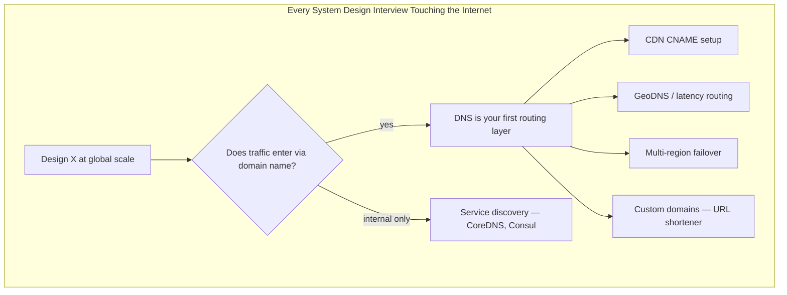

### What "Good" Looks Like in an Interview

| Level | What You Demonstrate |
|-------|---------------------|
| **Junior** | "DNS maps domain to IP address" |
| **Mid** | "Browser caches, then OS, then recursive resolver; TTL controls staleness" |
| **Senior** | "For custom domains I'd use CNAME to our edge; low TTL during migration; health-checked failover" |
| **Staff** | "DNS is AP — eventual consistency; plan for propagation delay; combine DNS failover with application-layer health checks; anycast for resolver availability" |

### Why DNS Matters in System Design

| Concern | DNS Role |
|---------|----------|
| **Global routing** | GeoDNS, latency-based routing send users to nearest region |
| **Load distribution** | Round-robin A records spread traffic across IPs |
| **Failover** | Change A record to healthy region; TTL bounds recovery time |
| **CDN integration** | CNAME to `d123.cloudfront.net` delegates edge routing to CDN |
| **Custom domains** | URL shortener (bit.ly) maps `links.customer.com` → your infrastructure |
| **Service discovery** | Internal DNS resolves `payments.service.consul` → pod IP |
| **Security** | DNSSEC prevents spoofing; split-horizon hides internal topology |

---

## 2. What DNS Is — The Phone Book of the Internet

The **Domain Name System (DNS)** is a hierarchical, distributed database that maps human-readable domain names (`api.example.com`) to machine-usable records (IP addresses, mail servers, text verification strings, etc.).

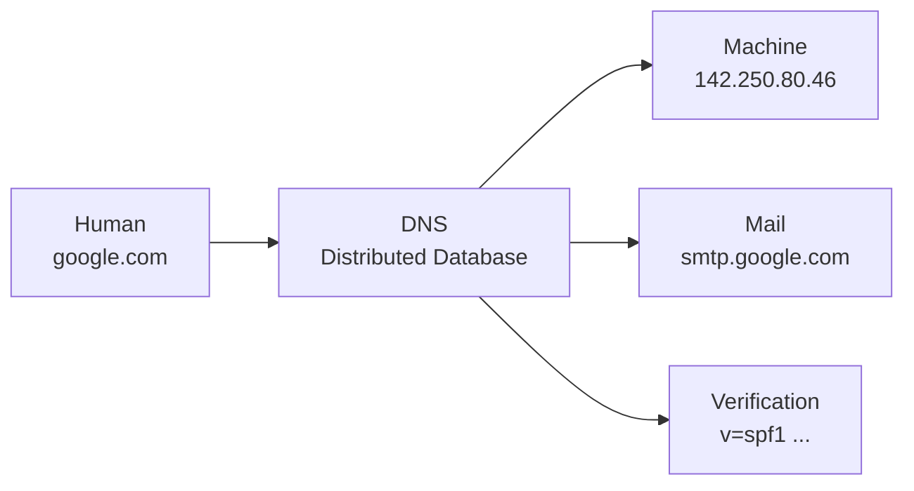

### Core Properties Interviewers Expect You to Know

| Property | Description | Interview Implication |
|----------|-------------|----------------------|
| **Distributed** | No single server holds all records; hierarchy delegates authority | Outages are localized; root/TLD are highly replicated |
| **Cached** | Every layer caches responses per TTL | Changes are not instant — propagation delay |
| **Eventually consistent** | AP system — availability over strong consistency | Stale records possible during migration |
| **UDP-first** | Queries typically use UDP port 53 (TCP for large responses) | Fast but size-limited; truncation triggers TCP retry |
| **Hierarchical delegation** | Parent zone points to child nameservers via NS records | Misconfigured NS = zone unreachable |

### DNS vs Other Naming Systems

| System | Scope | Consistency | Use Case |
|--------|-------|-------------|----------|
| **DNS** | Global internet + internal networks | Eventual (TTL-based) | Public domains, CDN, email, service discovery |
| **Hosts file** | Single machine | Immediate | Local overrides, development |
| **Consul / etcd** | Cluster / datacenter | Strong (with consensus) | Microservice discovery, config |
| **Kubernetes Services** | Cluster | Eventual (watch-based) | Pod-to-pod communication |
| **Load balancer VIP** | Region | Immediate (control plane) | Internal L4/L7 routing |

**Interview one-liner:**

> "DNS is the first layer of global traffic routing. It's cached, eventually consistent, and TTL-bound — design around propagation delay, not against it."

---

## 3. DNS Hierarchy — Root → TLD → Authoritative → Recursive

DNS is organized as an inverted tree. Each node is a **zone** administered by an authority. Resolution walks down the tree from root to the authoritative server for the requested name.

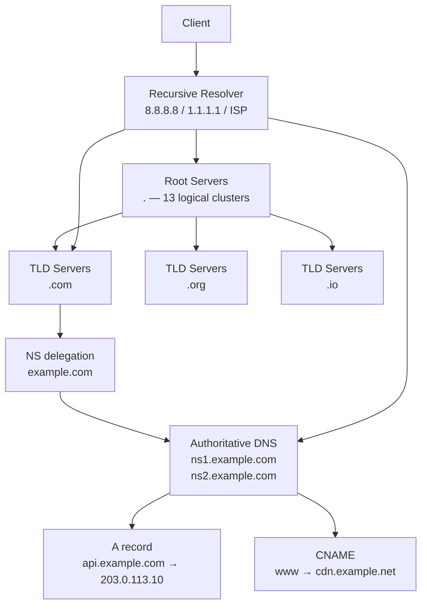

### 3.1 Root Servers

| Fact | Detail |
|------|--------|
| **Count** | 13 logical root server identities (A through M); each is an anycast cluster of hundreds of physical servers |
| **Role** | Answer "where are the nameservers for `.com`?" — returns NS + glue records for TLD |
| **Operators** | ICANN, Verisign, universities, US military, etc. |
| **Resilience** | Heavily anycasted; root failure is extraordinarily rare |

### 3.2 TLD (Top-Level Domain) Servers

| TLD Type | Examples | Operator |
|----------|----------|----------|
| **gTLD** (generic) | `.com`, `.org`, `.net`, `.io` | Verisign, PIR, Afilias, etc. |
| **ccTLD** (country) | `.uk`, `.de`, `.jp` | National registries |
| **new gTLD** | `.dev`, `.app`, `.cloud` | Various registries |

TLD servers hold NS records delegating `example.com` to whatever nameservers the domain owner configured.

### 3.3 Authoritative Nameservers

**Authoritative servers** are the source of truth for a zone (`example.com`). They store and serve the actual records: A, AAAA, CNAME, MX, TXT, etc.

| Provider | Examples | Interview Note |
|----------|----------|----------------|
| **Managed DNS** | Route 53, Cloudflare DNS, Google Cloud DNS, NS1 | Health checks, GeoDNS, low TTL |
| **Registrar DNS** | GoDaddy, Namecheap default NS | Fine for simple sites; limited features |
| **Self-hosted** | BIND, PowerDNS, CoreDNS (external) | Full control; operational burden |

### 3.4 Recursive Resolvers

**Recursive resolvers** (also called DNS resolvers or caching nameservers) do the full lookup on behalf of clients. They cache aggressively and return final answers.

| Resolver | Operator | Notes |
|----------|----------|-------|
| **8.8.8.8 / 8.8.4.4** | Google | Anycast; widely used |
| **1.1.1.1 / 1.0.0.1** | Cloudflare | Privacy-focused; fast |
| **ISP resolver** | Comcast, AT&T, etc. | Default for most users; variable quality |
| **Corporate resolver** | Internal DNS in enterprises | May apply split-horizon policies |

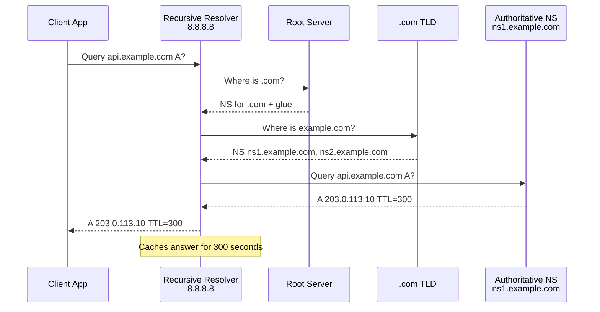

### 3.5 Zone vs Domain

| Term | Definition |
|------|------------|
| **Domain** | Full name: `api.staging.example.com` |
| **Zone** | Administrative unit: `example.com` zone contains `api.staging.example.com` |
| **Delegation** | Parent zone has NS records pointing to child's authoritative servers |
| **Apex / root of zone** | `example.com` itself (not a subdomain) |

---

## 4. DNS Record Types — When to Use Each

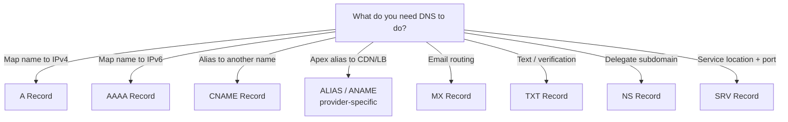

### 4.1 A Record (Address)

Maps a hostname to an **IPv4 address**.

```
api.example.com.    300    IN    A    203.0.113.10
api.example.com.    300    IN    A    203.0.113.11
api.example.com.    300    IN    A    203.0.113.12
```

| Use Case | Example |
|----------|---------|
| Point domain to server IP | `www.example.com → 203.0.113.5` |
| Round-robin load balancing | Multiple A records for same name |
| Failover (manual) | Swap A record to backup IP |

**Interview note:** Multiple A records = client typically tries one (often round-robin or random). No health checking at DNS level unless using managed DNS (Route 53 health checks).

### 4.2 AAAA Record (IPv6 Address)

Same as A but for **IPv6**.

```
api.example.com.    300    IN    AAAA    2001:db8::1
```

| When to Use | When to Skip |
|-------------|--------------|
| Dual-stack deployments | IPv4-only legacy infra |
| Mobile-first global apps | Internal services with no IPv6 |
| Future-proofing public APIs | Quick prototypes |

### 4.3 CNAME Record (Canonical Name)

Maps an alias to **another domain name** (not directly to IP).

```
www.example.com.    300    IN    CNAME    example.com.
cdn.example.com.    60     IN    CNAME    d111111abcdef8.cloudfront.net.
links.customer.com. 300    IN    CNAME    custom.bitly.com.
```

| Rule | Detail |
|------|--------|
| **Cannot** CNAME at zone apex | `example.com` itself cannot be CNAME per RFC; use ALIAS/ANAME or A record |
| **Chain resolution** | Resolver follows CNAME chain until A/AAAA found |
| **CDN pattern** | CNAME to CDN hostname; CDN handles edge routing |

**URL shortener custom domain pattern:**

```
links.acme.com  CNAME  custom.shortener.io
```

Your edge terminates TLS for `links.acme.com` (via ACME/Let's Encrypt or uploaded cert) and routes by `Host` header.

### 4.4 ALIAS / ANAME (Provider-Specific)

Flattened alias at zone apex — looks like A record to clients but points to another hostname internally.

| Provider | Record Type |
|----------|-------------|
| **Route 53** | ALIAS (to CloudFront, ELB, S3, another Route 53 record) |
| **Cloudflare** | CNAME flattening at apex |
| **DNSimple** | ALIAS |
| **NS1** | ALIAS |

**Use when:** Apex domain (`example.com`) must point to CDN or load balancer hostname.

### 4.5 MX Record (Mail Exchange)

Directs email for a domain to mail servers, with **priority** (lower = preferred).

```
example.com.    3600    IN    MX    10    mail1.example.com.
example.com.    3600    IN    MX    20    mail2.example.com.
```

| Use Case | Record |
|----------|--------|
| Google Workspace | MX → `aspmx.l.google.com` (priority 1) |
| AWS SES inbound | MX → SES inbound endpoint |
| No email | MX not required; some use null MX (RFC 7505) |

**System design relevance:** Low for most product interviews unless designing email infrastructure.

### 4.6 TXT Record (Text)

Arbitrary text strings — verification, SPF, DKIM, DMARC, domain ownership proofs.

```
example.com.    300    IN    TXT    "v=spf1 include:_spf.google.com ~all"
_acme-challenge.api.example.com. 60 IN TXT "verification-token-here"
```

| Use Case | Example |
|----------|---------|
| Domain ownership verification | Google Search Console, SaaS custom domains |
| SPF / DKIM / DMARC | Email authentication |
| ACME DNS-01 challenge | Automated TLS certificate issuance |

### 4.7 NS Record (Nameserver)

Delegates a zone (or subdomain) to authoritative nameservers.

```
example.com.    172800    IN    NS    ns1.example.com.
example.com.    172800    IN    NS    ns2.example.com.
staging.example.com. 3600 IN    NS    ns-staging.dnsprovider.com.
```

| Use Case | Detail |
|----------|--------|
| Domain delegation | Registrar points to Route 53 / Cloudflare NS |
| Subdomain delegation | `dev.example.com` managed by separate DNS zone |
| DNS provider migration | Change NS at registrar |

**TTL note:** NS records at TLD often cached for 24–48 hours (TTL up to 172800s). NS changes are slow.

### 4.8 SRV Record (Service)

Specifies **hostname, port, priority, and weight** for a service.

```
_xmpp-server._tcp.example.com. 300 IN SRV 10 5 5269 xmpp1.example.com.
_mysql._tcp.example.com. 300 IN SRV 10 5 3306 db-primary.internal.
```

| Field | Meaning |
|-------|---------|
| **Priority** | Lower tried first |
| **Weight** | Load balance within same priority |
| **Port** | Service port |
| **Target** | Hostname of service |

**Use when:** Service discovery without fixed ports; legacy Microsoft AD, XMPP, some databases. In modern interviews, prefer Consul/Kubernetes over public SRV.

### 4.9 Record Type Summary Table

| Record | Points To | Apex OK? | Common Interview Use |
|--------|-----------|----------|---------------------|
| **A** | IPv4 | Yes | Direct server, round-robin LB |
| **AAAA** | IPv6 | Yes | Dual-stack |
| **CNAME** | Another hostname | No (apex) | CDN, custom domains |
| **ALIAS** | Hostname (flattened) | Yes | Apex → CloudFront/ALB |
| **MX** | Mail server | Yes | Email (rare in SD interviews) |
| **TXT** | Text | Yes | Domain verification, ACME |
| **NS** | Nameserver | Yes | Delegation |
| **SRV** | Service + port | Yes | Legacy service discovery |

---

## 5. DNS Resolution — Step-by-Step

Full resolution path from user typing a URL to obtaining an IP address.

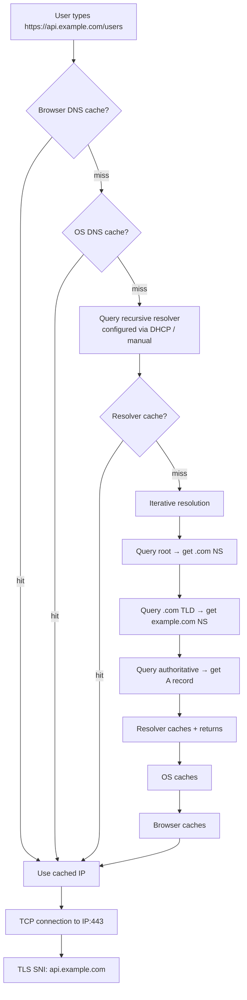

### 5.1 Step-by-Step Narration (Interview Gold)

> 1. User navigates to `https://api.example.com/users`
> 2. **Browser cache** checked first (Chrome caches per RFC 6761 rules + TTL)
> 3. **OS cache** checked (system resolver cache on Linux: `systemd-resolved`; macOS: `mDNSResponder`)
> 4. **Recursive resolver** queried (e.g., 8.8.8.8) — this is what `/etc/resolv.conf` points to
> 5. Resolver checks **its cache**; on miss, performs iterative lookup:
>    - Query root servers → NS for `.com`
>    - Query `.com` TLD → NS for `example.com`
>    - Query authoritative NS → A record for `api.example.com`
> 6. Answer returned with **TTL**; cached at resolver, OS, and browser
> 7. Browser opens TCP to IP; TLS handshake uses **SNI** to present correct certificate for `api.example.com`

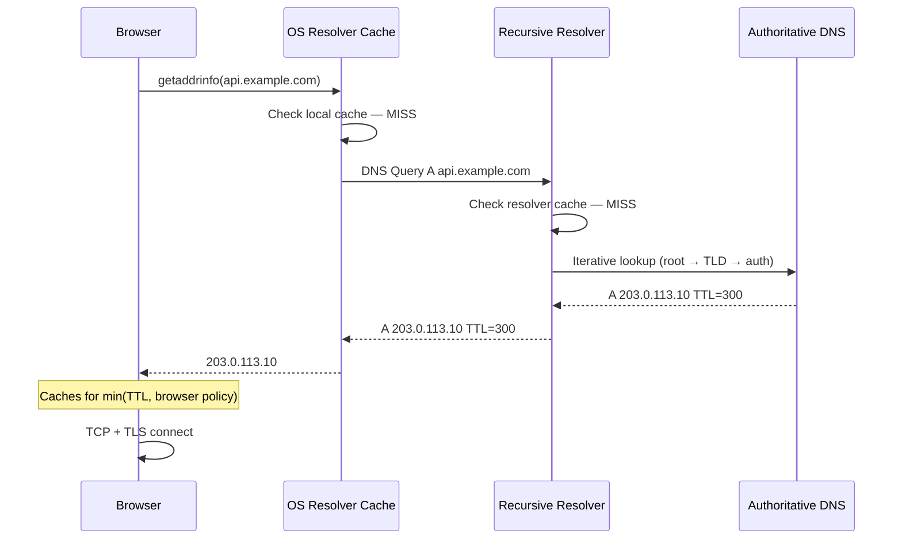

### 5.2 Negative Caching

When a record **does not exist** (NXDOMAIN) or exists but requested type missing (NODATA), resolvers cache the negative response too.

| Response | Meaning | Cached? |
|----------|---------|---------|
| **NXDOMAIN** | Domain does not exist | Yes (SOA MINIMUM TTL) |
| **NODATA** | Domain exists, no A record | Yes |
| **SERVFAIL** | Server error | Short or no cache |

**Interview pitfall:** Typos in DNS migration can be NXDOMAIN-cached, causing prolonged outages even after fix.

### 5.3 CNAME Chain Resolution

```
www.example.com  CNAME  example.com
example.com      A      203.0.113.10
```

Resolver follows CNAME, returns final A record (and may include CNAME in additional section). Each hop adds latency on cold cache.

### 5.4 DNS over HTTPS (DoH) and DNS over TLS (DoT)

| Protocol | Port | Who Uses |
|----------|------|----------|
| **Traditional DNS** | UDP/TCP 53 | Default everywhere |
| **DoT** | TCP 853 | Android, some routers |
| **DoH** | HTTPS 443 | Firefox, Chrome (optional) |

**Interview mention:** DoH/DoT encrypt DNS queries between client and resolver — privacy benefit. Authoritative resolution unchanged.

---

## 6. TTL and Caching at Every Layer

TTL (Time To Live) is the **maximum** time a record may be cached. DNS is a multi-layer cache system — understanding each layer is critical for migration and failover design.

```mermaid
graph TB
    AUTH[Authoritative Server<br/>Sets TTL=300 on A record]
    AUTH --> L1[Recursive Resolver Cache<br/>8.8.8.8 — honors TTL]
    L1 --> L2[OS Cache<br/>systemd-resolved — honors TTL]
    L2 --> L3[Browser Cache<br/>min TTL, browser policy)]
    L3 --> L4[Application Cache<br/>optional: JVM, connection pool]

    style AUTH fill:#D2691E,color:#ffffff
    style L1 fill:#fff3e0
    style L2 fill:#fff3e0
    style L3 fill:#fff3e0
    style L4 fill:#fce4ec
```

### 6.1 TTL Values — Practical Guide

| TTL | Use Case | Trade-off |
|-----|----------|-----------|
| **60s** | Migration window, failover-ready | Higher DNS query load |
| **300s (5 min)** | Production default for mutable records | Balance of freshness and load |
| **3600s (1 hour)** | Stable infrastructure | 1-hour stale on change |
| **86400s (24 hour)** | NS records, rarely changed MX | Very slow propagation |
| **300s pre-migration** | Lower TTL 24h before migration | Prepares for fast cutover |

### 6.2 Caching Behavior by Layer

| Layer | Cache Location | TTL Behavior | Bypass |
|-------|---------------|--------------|--------|
| **Browser** | Chrome, Firefox internal | min(TTL, max 900s–varies) | Hard refresh doesn't clear DNS |
| **OS** | systemd-resolved, mDNSResponder | Honors TTL | `sudo systemd-resolve --flush-caches` |
| **Recursive resolver** | ISP, 8.8.8.8, 1.1.1.1 | Honors TTL (mostly) | Wait for expiry |
| **CDN / App** | Connection pooling to IP | Ignores DNS after connect | Connection lifetime |
| **Java / Go HTTP client** | May cache DNS independently | JVM default: forever (until restart) | Custom resolver or short-lived connections |

### 6.3 The Migration Playbook (Interview Favorite)

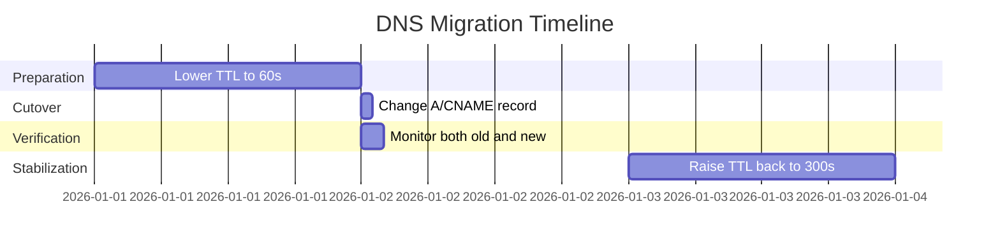

**Steps to narrate:**

1. **T-24h:** Lower TTL from 3600 to 60 seconds
2. **T-0:** Change A record or CNAME to new target
3. **T+0 to T+TTL_old:** Some clients still hit old IP (cached at 3600s)
4. **T+5min:** Most clients on new IP (if old TTL was lowered)
5. **T+24h:** Raise TTL back to 300–3600

### 6.4 TTL and Failover Recovery Time

```
Failover recovery time ≈ TTL + health-check interval + propagation delay

Example:
  TTL = 300s
  Route 53 health check interval = 30s
  Worst case client recovery ≈ 300s (5 min) after DNS update propagates
```

**Key insight:** DNS failover is **not instant**. Application-layer failover (anycast, load balancer health checks) is faster than DNS-only failover.

---

## 7. DNS Load Balancing — Round Robin, Weighted, GeoDNS, Latency

DNS is a crude but effective **first-hop load balancer**. It has no awareness of server health unless augmented by managed DNS features.

### 7.1 Round-Robin DNS

Multiple A records for one name — resolvers/clients rotate through them.

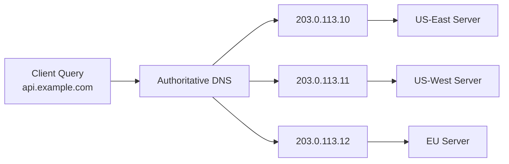

| Pros | Cons |
|------|------|
| Zero hardware — just DNS records | No health checking (unless managed DNS) |
| Simple to configure | Uneven client distribution |
| Works with any backend | Client may cache one IP for full TTL |
| Geographic spread possible | No session affinity |

**Interview answer:** "Round-robin DNS is a weak form of load balancing — clients cache one IP for the TTL duration, so distribution is imperfect. I'd use it for simple multi-region entry points combined with per-region load balancers, not as primary LB."

### 7.2 Weighted Round Robin

Managed DNS providers assign weights to records.

```
api.example.com  A  203.0.113.10  weight=70  (primary)
api.example.com  A  203.0.113.20  weight=30  (canary)
```

| Provider | Feature |
|----------|---------|
| **Route 53** | Weighted routing policy |
| **Cloudflare** | Load balancing pools with weights |
| **NS1** | Filter chains with weighted answers |

**Use for:** Canary deployments, blue-green at DNS level, gradual migration.

### 7.3 GeoDNS (Geolocation Routing)

Return different answers based on **client's geographic location** (typically EDNS Client Subnet or resolver location).

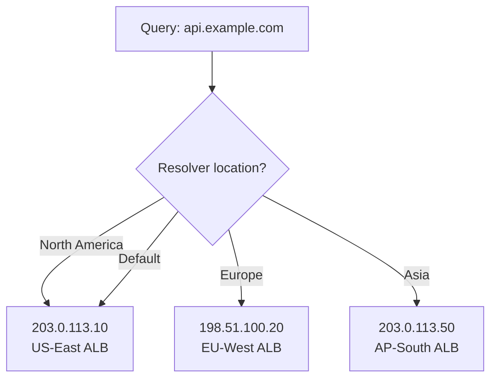

| Provider | Routing Policies |
|----------|-----------------|
| **Route 53** | Geolocation, Geoproximity |
| **Cloudflare** | Geo steering in Load Balancing |
| **NS1** | Geographic filters |

| Pros | Cons |
|------|------|
| Route users to nearest region | Resolver location ≠ user location |
| Data residency compliance | VPN users get wrong region |
| Reduce cross-region latency | Complex to test |

**Interview nuance:** GeoDNS uses the **recursive resolver's IP** (or ECS extension) to guess user location. Mobile users on Google 8.8.8.8 may be routed incorrectly without EDNS Client Subnet.

### 7.4 Latency-Based Routing (Route 53)

Route 53 periodically measures latency from AWS regions to your endpoints and routes to the lowest-latency healthy endpoint.

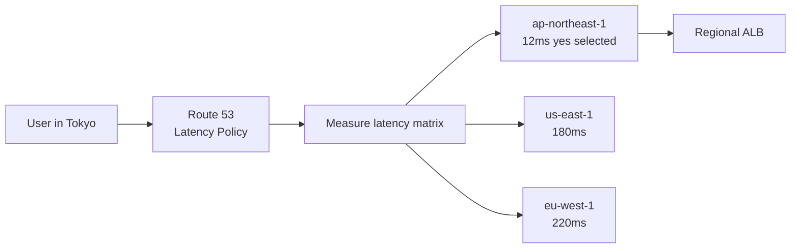

| vs GeoDNS | Latency-Based |
|-----------|---------------|
| Based on geography map | Based on measured network latency |
| Static rules | Dynamic — adapts to network conditions |
| Good for compliance | Good for performance |

### 7.5 Health-Checked DNS Failover

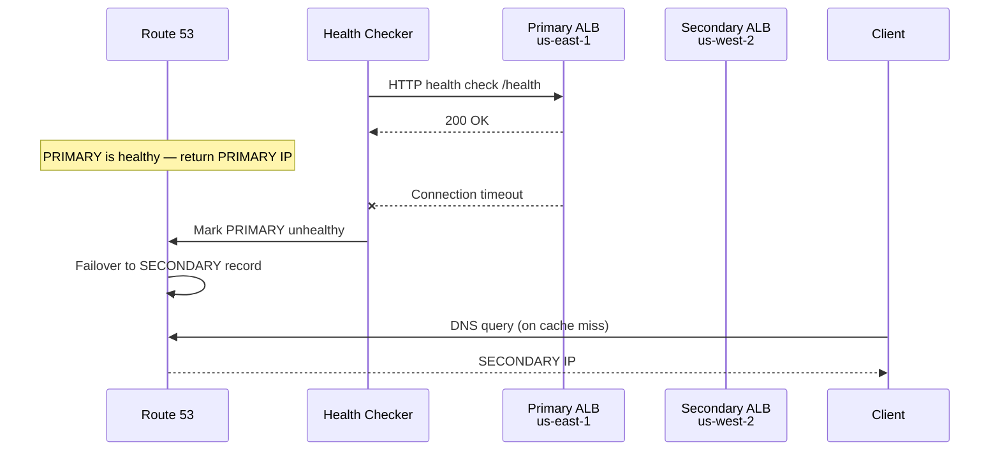

| Feature | Limitation |
|---------|------------|
| Automatic failover | Bounded by TTL — cached clients unaffected |
| Health check intervals | 10–30s typical |
| Passive vs active | Active HTTP/TCP checks standard |

**Combine with:** Global load balancer (AWS Global Accelerator), anycast, or application retry to another region.

### 7.6 DNS LB vs Application LB

| Dimension | DNS LB | Application LB (ALB/NGINX) |
|-----------|--------|---------------------------|
| **Speed of failover** | Minutes (TTL-bound) | Seconds (health check) |
| **Distribution quality** | Poor (client caching) | Excellent |
| **Layer** | Before connection | During connection |
| **Health awareness** | Only with managed DNS | Native |
| **Session affinity** | No | Yes (cookies, consistent hash) |

**Interview rule:** DNS for **geographic routing** and **multi-region entry**; application LB for **actual traffic distribution**.

---

## 8. Anycast DNS — Cloudflare, Google 8.8.8.8

**Anycast** advertises the same IP address from multiple geographic locations. BGP routes the client to the **nearest** PoP (point of presence).

```mermaid
graph TB
    subgraph Anycast Network — same IP 1.1.1.1
        POP_US[US PoP<br/>1.1.1.1]
        POP_EU[EU PoP<br/>1.1.1.1]
        POP_AP[APAC PoP<br/>1.1.1.1]
    end

    USER_US[User in New York] -->|BGP shortest path| POP_US
    USER_EU[User in London] -->|BGP shortest path| POP_EU
```

### 8.1 Anycast for Recursive Resolvers

| Service | Anycast IP | Benefit |
|---------|------------|---------|
| **Cloudflare 1.1.1.1** | 1.1.1.1 | Low-latency DNS worldwide |
| **Google 8.8.8.8** | 8.8.8.8 | Same |
| **Quad9 9.9.9.9** | 9.9.9.9 | Security filtering + anycast |

### 8.2 Anycast for Authoritative DNS

Cloudflare DNS and many providers anycast their **authoritative nameservers** — queries hit nearest PoP, which may serve from cache or proxy to origin.

| Benefit | Detail |
|---------|--------|
| **DDoS absorption** | Distributed across hundreds of PoPs |
| **Low latency** | Authoritative answers from nearby edge |
| **High availability** | PoP failure → BGP reroutes |

### 8.3 Anycast vs Unicast vs Multicast

| Type | Same IP, Multiple Locations? | Use Case |
|------|------------------------------|----------|
| **Unicast** | No — one server | Traditional single-server DNS |
| **Anycast** | Yes — BGP routes to nearest | Public DNS resolvers, CDN, authoritative DNS |
| **Multicast** | One-to-many | Not used in DNS |

### 8.4 Anycast in CDN Context

CDN edges use anycast — `d123.cloudfront.net` resolves to nearest CloudFront PoP IP.

```
User → DNS resolves cdn.example.com CNAME → d123.cloudfront.net
     → CloudFront anycast IP (nearest PoP)
     → Edge cache serves content
```

**Interview connection:** CDN + DNS CNAME + anycast = the standard static asset delivery stack.

---

## 9. DNS in System Design — Real Architectures

### 9.1 URL Shortener — Custom Domains (bit.ly Pattern)

Enterprise customers want `links.acme.com/xyz` instead of `short.ly/xyz`.

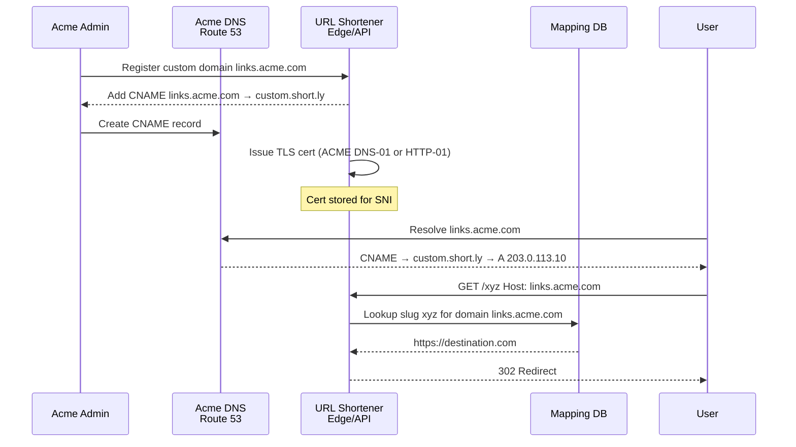

**Design components:**

| Component | Responsibility |
|-----------|---------------|
| **CNAME to your edge** | Customer delegates routing to your infra |
| **Host header routing** | Distinguish `links.acme.com` from `links.other.com` |
| **TLS termination** | Per-domain cert via ACME automation |
| **Domain verification** | TXT record or CNAME proves ownership before activation |
| **DB schema** | `(domain, slug) → destination_url` composite key |

**Interview talking points:**

> "Custom domains use CNAME to our edge hostname. We verify ownership via TXT before activation. TLS certs are automated with ACME DNS-01. We store mappings keyed by (custom_domain, slug). TTL on customer DNS is their problem; we control our authoritative TTL for the edge."

### 9.2 CDN CNAME Setup

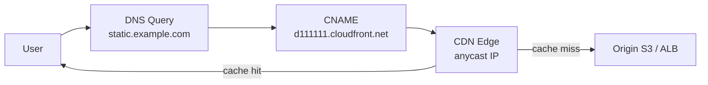

**Typical records:**

```
static.example.com   CNAME   d111111abcdef8.cloudfront.net   TTL=300
origin.example.com   A       203.0.113.10 (origin ALB, not public-facing)
```

| Record | Purpose |
|--------|---------|
| **CNAME to CDN** | Delegate edge routing to CDN provider |
| **Origin DNS** | CDN pulls from origin on cache miss — often separate hostname |
| **ALIAS at apex** | `example.com` → CloudFront without CNAME restriction |

### 9.3 Multi-Region Active-Active

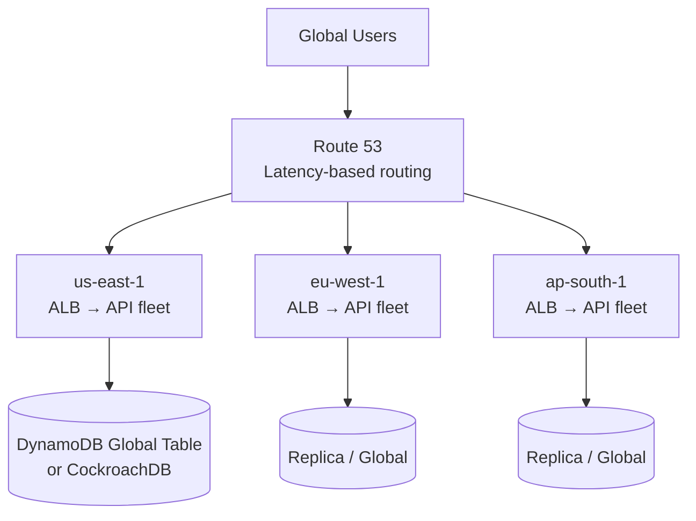

**DNS role in multi-region:**

| Pattern | DNS Configuration |
|---------|-------------------|
| **Latency routing** | Route 53 latency policy per region ALB |
| **Active-passive failover** | Primary + secondary with health checks |
| **Weighted migration** | 90/10 weight split during region migration |
| **Geo compliance** | EU users → EU region only (geolocation policy) |

**Critical interview point:** DNS routes the **first connection**. Cross-region data consistency is a separate problem (CAP, replication lag).

### 9.4 Multi-Region Failover (Active-Passive)

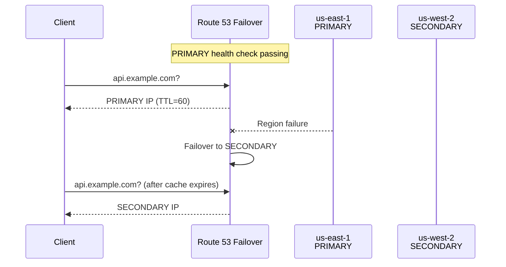

**RTO calculation:**

```
RTO ≈ health_check_interval + DNS_TTL + client_retry_time
    ≈ 30s + 60s + 5s = ~95 seconds best case
```

### 9.5 Service Discovery via DNS (External)

Public-facing service discovery is rare, but **internal** DNS SRV/AAAA records still appear in hybrid architectures.

```
payments.internal.example.com  A  10.0.1.50
payments.internal.example.com  A  10.0.1.51
```

With short TTL (30s) set programmatically when instances register/deregister.

---

## 10. DNS Propagation Delays and Pitfalls

"DNS propagation" is not a technical protocol event — it is the **time for old cached records to expire** across millions of independent caches.

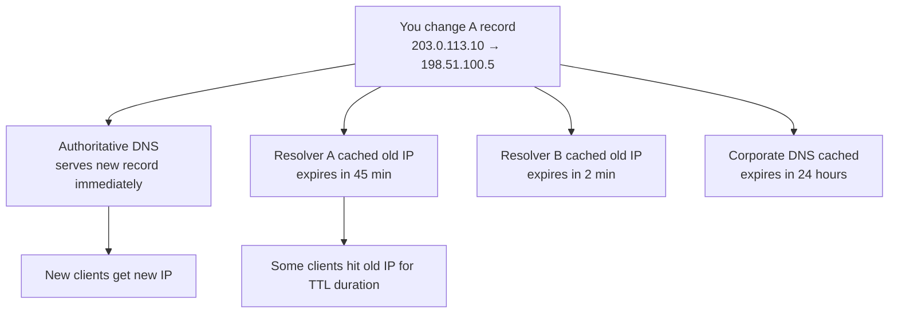

### 10.1 Common Pitfalls

| Pitfall | What Happens | Mitigation |
|---------|--------------|------------|
| **TTL too high during migration** | Old IP served for hours | Lower TTL 24h before change |
| **Forgot NS TTL** | NS change takes 48h | Plan NS migrations carefully |
| **CNAME at apex** | Invalid config rejected or broken | Use ALIAS/ANAME |
| **CNAME + MX conflict** | RFC: CNAME at name precludes other records | Use subdomain |
| **NXDOMAIN cached** | Typo fix delayed | Lower SOA minimum TTL |
| **Assuming instant failover** | Clients on old IP until TTL | Combine with app-layer failover |
| **GeoDNS + public resolver** | Wrong region for VPN users | ECS or accept limitation |
| **JVM DNS cache forever** | Java apps never pick up new IP | Set `networkaddress.cache.ttl` |

### 10.2 DNS Propagation Checklist

- [ ] Lower TTL 24–48 hours before planned change
- [ ] Verify change on authoritative server directly (`dig @ns1.example.com`)
- [ ] Check multiple resolvers globally (whatsmydns.net pattern)
- [ ] Monitor traffic on **both** old and new endpoints during window
- [ ] Keep old endpoint alive until max old TTL elapsed
- [ ] Document SOA minimum for negative caching

### 10.3 Testing DNS Changes

```bash
# Query authoritative directly (bypass caches)
dig @ns1.example.com api.example.com A +short

# Trace full resolution
dig api.example.com +trace

# Check TTL remaining
dig api.example.com | grep -E '^api|TTL'

# Test from specific public resolver
dig @8.8.8.8 api.example.com A
dig @1.1.1.1 api.example.com A
```

---

## 11. DNSSEC — Brief Overview

**DNSSEC** (DNS Security Extensions) adds cryptographic signatures to DNS records, preventing **man-in-the-middle spoofing** and cache poisoning.

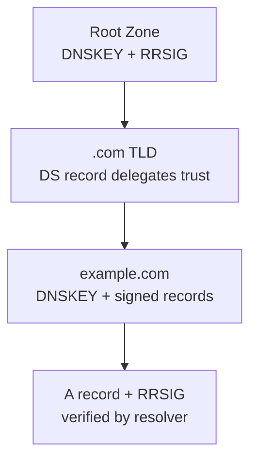

### 11.1 Key Concepts

| Term | Meaning |
|------|---------|
| **DNSKEY** | Public key for a zone |
| **RRSIG** | Signature over a record set |
| **DS** | Delegation Signer — hash of child zone's DNSKEY in parent |
| **Chain of trust** | Root → TLD → zone — each validates next |

### 11.2 Interview-Level Summary

| Aspect | Detail |
|--------|--------|
| **Problem solved** | DNS response tampering / spoofing |
| **Not solved** | DNS privacy (queries still visible — use DoH/DoT) |
| **Adoption** | ~30%+ of queries validated; growing |
| **Operational cost** | Key rotation, signature expiration, larger responses |
| **System design relevance** | Mention for security-sensitive domains (banking); not deep implementation expected |

**One-liner:** "DNSSEC ensures DNS responses are authentic and unmodified — a chain of trust from root. It doesn't encrypt queries. For most product interviews, mention it exists; focus on TTL, failover, and CNAME patterns."

---

## 12. Internal DNS and Service Discovery

Public DNS is for internet-facing names. **Internal DNS** resolves service names within a datacenter, VPC, or Kubernetes cluster.

```mermaid
graph TB
    subgraph Kubernetes Cluster
        POD1[Pod<br/>10.244.1.5]
        POD2[Pod<br/>10.244.2.8]
        SVC[Service payments<br/>ClusterIP 10.96.0.20]
        CORE[CoreDNS<br/>10.96.0.10]
    end

    APP[App Pod] --> CORE
    CORE --> SVC
    SVC --> POD1
    SVC --> POD2
```

### 12.1 Kubernetes CoreDNS

| Feature | Detail |
|---------|--------|
| **Default cluster DNS** | Replaces kube-dns; runs as Deployment |
| **Service discovery** | `my-service.my-namespace.svc.cluster.local` |
| **Pod DNS** | Optional per-pod DNS records |
| **Upstream forwarding** | Forwards external queries to `/etc/resolv.conf` upstream |
| **Custom zones** | ConfigMap `Corefile` for stub domains |

**DNS naming convention:**

```
<service>.<namespace>.svc.cluster.local
payments.production.svc.cluster.local → ClusterIP → kube-proxy → endpoints
```

```mermaid
sequenceDiagram
    participant Pod as App Pod
    participant DNS as CoreDNS
    participant SVC as Service<br/>payments.prod.svc
    participant EP as Endpoints<br/>3 pod IPs

    Pod->>DNS: A payments.production.svc.cluster.local?
    DNS->>SVC: Watch API for service
    SVC-->>DNS: ClusterIP 10.96.0.20
    DNS-->>Pod: A 10.96.0.20
    Note over Pod: kube-proxy DNATs to pod IP
```

### 12.2 Consul Service Discovery

| Feature | Detail |
|---------|--------|
| **Service registry** | Services register on startup with health checks |
| **DNS interface** | `payments.service.consul` resolves to healthy instances |
| **HTTP API** | Alternative to DNS for programmatic discovery |
| **Multi-datacenter** | WAN gossip between Consul clusters |

```
payments.service.us-east-1.consul  →  10.0.1.50, 10.0.1.51
```

**Consul DNS vs Kubernetes DNS:**

| Dimension | CoreDNS (K8s) | Consul DNS |
|-----------|---------------|------------|
| **Scope** | Single cluster | Multi-DC, VMs + containers |
| **Health-aware** | Via readiness probes | Native health checks |
| **TTL** | Typically 30s | Configurable per service |
| **Best for** | Kubernetes-native apps | Hybrid VM + K8s, service mesh |

### 12.3 etcd and DNS

etcd is **not a DNS server** — it is a consistent key-value store used for service registry (Kubernetes itself stores cluster state in etcd). Do not conflate etcd with DNS in interviews.

| System | Role |
|--------|------|
| **etcd** | Consensus store; leader election; K8s state |
| **CoreDNS** | Actual DNS queries in Kubernetes |
| **Consul** | Service registry with optional DNS interface |

### 12.4 Comparison: Service Discovery Options

| Solution | Protocol | Consistency | Health Checks | Interview Default |
|----------|----------|-------------|---------------|-------------------|
| **Kubernetes DNS** | DNS | Eventual | Readiness probe | K8s workloads |
| **Consul** | DNS + HTTP | Strong (Raft) | Native | Multi-platform |
| **etcd direct** | gRPC | Strong | N/A | Internal control plane only |
| **Service mesh (Istio)** | Envoy xDS | Eventual | Envoy | Advanced microservices |
| **ZooKeeper** | Custom | Strong (ZAB) | Ephemeral nodes | Legacy (Kafka old versions) |

---

## 13. Split-Horizon DNS

**Split-horizon** (split-brain) DNS returns **different answers** depending on who is asking — typically internal vs external clients.

```mermaid
graph TB
    Q[Query: db.internal.example.com]

    Q --> INT{Source?}
    INT -->|Internal<br/>10.0.0.0/8| PRIVATE[10.0.5.20<br/>private IP]
    INT -->|External<br/>internet| PUBLIC[NXDOMAIN or<br/>public bastion IP]
```

### 13.1 Use Cases

| Scenario | Internal Answer | External Answer |
|----------|----------------|-----------------|
| **Database hostname** | `10.0.5.20` (VPC private) | NXDOMAIN |
| **Internal API** | `10.0.1.100` | `203.0.113.10` (via VPN/proxy) |
| **Office split tunnel** | Direct to internal IP | Public CDN IP |
| **Security** | Hide internal topology | Public-facing load balancer only |

### 13.2 Implementation

| Method | Detail |
|--------|--------|
| **Separate DNS views** | BIND views; Route 53 private hosted zones |
| **AWS Private Hosted Zone** | Associated with VPC; same domain, different records internally |
| **Conditional forwarding** | Corporate resolver forwards `*.internal` to internal DNS |

```mermaid
graph LR
    subgraph AWS
        PHZ[Private Hosted Zone<br/>api.internal.example.com → 10.0.1.50]
        PUB[Public Hosted Zone<br/>api.example.com → 203.0.113.10]
    end

    VPC[VPC Instance] --> PHZ
    INTERNET[Internet User] --> PUB
```

### 13.3 Interview Mention

> "We'd use a Route 53 private hosted zone for internal service names resolving to private IPs, and a separate public zone for internet-facing endpoints. Same domain name, different answers — split-horizon."

---

## 14. How DNS Fits Common Interview Questions

### 14.1 URL Shortener

| DNS Element | Design Choice |
|-------------|---------------|
| Main domain | `short.ly` A/ALIAS → edge load balancer |
| Custom domains | Customer CNAME → `custom.short.ly` |
| Verification | TXT record before domain activation |
| TLS | ACME DNS-01 for automated certs |
| TTL | 300s default; customer controls their CNAME TTL |

### 14.2 Multi-Region Active-Active

| DNS Element | Design Choice |
|-------------|---------------|
| Routing | Route 53 latency-based or geolocation |
| Health checks | Per-region ALB `/health` |
| Failover | Automatic to healthy region |
| TTL | 60s for faster failover |
| Caveat | DNS alone insufficient — need global DB replication |

### 14.3 CDN / Static Assets

| DNS Element | Design Choice |
|-------------|---------------|
| Asset domain | `static.example.com` CNAME → CloudFront |
| Apex | ALIAS to CloudFront |
| Cache invalidation | CDN API (not DNS) |
| Origin | Separate origin hostname, not user-facing |

### 14.4 Global Load Balancing

```mermaid
graph TB
    DNS[DNS Layer<br/>GeoDNS / Latency / Weighted]
    DNS --> GSLB[Global Accelerator /<br/>Cloudflare Load Balancing]
    GSLB --> R1[Region 1 ALB]
    GSLB --> R2[Region 2 ALB]
    GSLB --> R3[Region 3 ALB]
```

**Layer cake:** DNS → Global LB → Regional LB → App servers. Each layer has different failover speed and granularity.

### 14.5 Rate Limiter / API Gateway

DNS typically points to a **single global entry** (API gateway or CDN), which handles rate limiting internally. DNS does not rate limit.

### 14.6 WebSocket / Real-Time

DNS resolves gateway hostname; **sticky routing** happens at L4 LB (consistent hash on user ID), not DNS. DNS TTL caching means reconnects after TTL may hit different gateway — session state must be external.

---

## 15. Failure Modes

| Failure | Impact | Detection | Mitigation |
|---------|--------|-----------|------------|
| **Authoritative DNS outage** | New lookups fail; cached clients OK | SERVFAIL spikes; external monitoring | Multi-provider NS; anycast authoritative |
| **Recursive resolver outage** | All lookups fail for affected users | User reports; resolver monitoring | Fallback resolver; DoH alternatives |
| **Stale cache after migration** | Traffic to decommissioned IP | 404/connection refused on old IP | Lower TTL; keep old endpoint alive during window |
| **TTL too high** | Slow failover (hours) | Gradual traffic drop on failed region | Pre-lower TTL; health-checked DNS |
| **DNS DDoS** | Resolution latency spikes | Resolver metrics; anomaly detection | Anycast absorption (Cloudflare); rate limiting |
| **NXDOMAIN misconfiguration** | Complete service unreachable | Immediate user impact | Validate with `dig +trace`; lower SOA minimum |
| **CNAME loop** | Resolution failure | SERVFAIL | Lint DNS configs |
| **Certificate / DNS mismatch** | TLS errors after DNS change | SSL monitoring | Update cert before DNS cutover |
| **Split-horizon leak** | Internal IP exposed publicly | Security audit | Separate zones; audit public records |
| **Route 53 health check flapping** | Intermittent failover | CloudWatch alarms | Increase failure threshold; stabilize health endpoint |

```mermaid
graph TD
    FAIL[DNS Failure Mode]
    FAIL --> AUTH[Authoritative down]
    FAIL --> STALE[Stale cache]
    FAIL --> WRONG[Wrong record]
    FAIL --> DDOS[DNS amplification / flood]

    AUTH --> M1[Anycast + multi-NS]
    STALE --> M2[Low TTL + dual-running endpoints]
    WRONG --> M3[Infrastructure as code for DNS]
    DDOS --> M4[Managed DNS provider DDoS protection]
```

---

## 16. Decision Framework — When to Use What

```mermaid
flowchart TD
    START[DNS Design Decision]
    START --> Q1{Internet-facing?}
    Q1 -->|no| INTERNAL[Internal DNS<br/>CoreDNS / Consul / Private HZ]
    Q1 -->|yes| Q2{Apex domain?}
    Q2 -->|yes| ALIAS[ALIAS/ANAME to CDN or LB]
    Q2 -->|no| Q3{Point to CDN?}
    Q3 -->|yes| CNAME[CNAME to CDN hostname]
    Q3 -->|no| Q4{Multiple regions?}
    Q4 -->|yes| Q5{Need fast failover?}
    Q5 -->|yes| HEALTH[Route 53 health checks<br/>TTL=60 + Global Accelerator]
    Q5 -->|no| GEO[GeoDNS or latency routing]
    Q4 -->|no| A[A record to LB IP]
```

### 16.1 Record Type Decision Matrix

| Goal | Record | TTL |
|------|--------|-----|
| Point subdomain to CDN | CNAME | 300 |
| Point apex to CDN | ALIAS | 300 |
| Multi-region entry | Latency A records + health checks | 60 |
| Custom domain (shortener) | Customer CNAME to your edge | 300 (customer side) |
| Domain verification | TXT | 300 |
| Email | MX | 3600 |
| Delegate subdomain to another team | NS | 3600 |

### 16.2 Managed DNS Provider Selection

| Provider | Strengths | Interview Mention |
|----------|-----------|-------------------|
| **Route 53** | AWS integration, health checks, latency routing | AWS-heavy designs |
| **Cloudflare** | Anycast, DDoS, free tier, CDN integration | Performance + security |
| **Google Cloud DNS** | GCP integration, reliable anycast | GCP-heavy designs |
| **NS1** | Advanced traffic steering, filters | Sophisticated routing |

---

## 17. Interview Scenarios & Sample Answers

### Scenario 1: "Design custom domains for a URL shortener"

> "Enterprise customers CNAME `links.acme.com` to `custom.ourshortener.com`. Before activation, they add a TXT record for ownership verification. Our edge load balancer terminates TLS — we automate certs via ACME DNS-01. The redirect service looks up `(host, slug)` in the database. Customer DNS TTL is outside our control; we set our edge TTL to 300s. For apex domains, customers use ALIAS if their provider supports it, or we recommend `go.acme.com` subdomain."

---

### Scenario 2: "How do you failover between regions using DNS?"

> "Route 53 latency routing normally sends users to the lowest-latency healthy region. I configure active-passive failover with health checks on each region's ALB `/health` endpoint. TTL is 60 seconds — lowered 24 hours before any planned migration. On region failure, Route 53 stops returning that region's record. Recovery time is bounded by TTL — worst case 60 seconds for clients whose cache expired. For faster failover, I'd add AWS Global Accelerator (anycast) in front, which detects failure in seconds. DNS failover alone is too slow for sub-minute RTO requirements."

---

### Scenario 3: "Explain DNS resolution when a user visits your API"

> "Browser checks its DNS cache, then the OS cache, then sends query to the configured recursive resolver — typically ISP or 8.8.8.8. The resolver checks its cache; on miss, it queries root → .com TLD → our authoritative nameserver → returns A record with TTL 300. The answer is cached at resolver, OS, and browser. Browser connects to the IP on port 443; TLS SNI carries `api.example.com` for certificate selection. Total DNS latency on cold cache: 20–100ms; on warm cache: 0ms."

---

### Scenario 4: "CDN setup for static assets — what DNS records?"

> "`static.example.com` CNAME to `d123.cloudfront.net`. CloudFront distribution has origin `origin.example.com` pointing to S3 or ALB. For apex `example.com`, use Route 53 ALIAS to CloudFront since CNAME at apex is invalid. TTL 300 seconds. Cache invalidation is via CloudFront API, not DNS — DNS only handles initial routing to the CDN edge."

---

### Scenario 5: "Internal service discovery — Kubernetes vs Consul"

> "For Kubernetes-native workloads, CoreDNS is the default — services get `service.namespace.svc.cluster.local` names automatically. kube-proxy load-balances to healthy pods. For hybrid environments with VMs and containers, Consul provides a service registry with DNS interface (`payments.service.consul`) and native health checks. I'd use CoreDNS in K8s, Consul when services span outside the cluster."

---

### Scenario 6: "What happens if your DNS provider goes down?"

> "Authoritative DNS outage means new lookups fail with SERVFAIL — clients with cached records continue working until TTL expires. Mitigation: multiple nameservers across providers (e.g., Route 53 + NS1 as secondary), anycast authoritative DNS, and low TTL during incident. Recursive resolver outage (e.g., 8.8.8.8) affects only users of that resolver — clients can switch to backup resolver. For our own domains, multi-NS is the primary defense."

---

## 18. Trade-offs Master Table

| Technique | Failover Speed | Distribution Quality | Complexity | Cost | Consistency |
|-----------|---------------|---------------------|------------|------|-------------|
| **Single A record** | N/A (manual change) | None | Low | Low | N/A |
| **Round-robin A** | Manual | Poor (client caching) | Low | Low | Eventual |
| **Weighted DNS** | Manual weight change | Moderate | Medium | Low | Eventual |
| **GeoDNS** | Policy change | Geographic | Medium | Medium | Eventual |
| **Latency routing** | Automatic (health) | Performance-based | Medium | Medium | Eventual |
| **Health-checked failover** | TTL-bound (~60s) | Good | Medium | Medium | Eventual |
| **Anycast (CDN/GSLB)** | Seconds | Excellent | High (provider) | Medium–High | N/A |
| **ALIAS at apex** | Same as underlying | Same | Low | Low | N/A |
| **Split-horizon** | Independent per view | N/A | High | Low | Per-view |
| **DNSSEC** | N/A | N/A | High | Low | Authenticity |

---

## 19. Interview Cheat Sheet

### Key Numbers to Memorize

| Metric | Value |
|--------|-------|
| DNS UDP port | 53 |
| DNS TCP port | 53 (truncated responses, zone transfers) |
| Typical production TTL | 300s (5 min) |
| Pre-migration TTL | 60s (lower 24h before) |
| NS record TTL at TLD | Up to 172800s (48 hours) |
| Cold DNS resolution latency | 20–100ms |
| Warm DNS cache hit | 0ms |
| Route 53 health check interval | 10–30s |
| DNS failover RTO (DNS only) | ≈ TTL + health check interval |
| Root server identities | 13 logical (anycast clusters) |

### One-Liner Definitions

| Term | One-Liner |
|------|-----------|
| **DNS** | Hierarchical, distributed naming system mapping domains to records |
| **Authoritative DNS** | Source of truth for a zone's records |
| **Recursive resolver** | Caches and performs full lookup on behalf of clients (8.8.8.8) |
| **TTL** | Max seconds a record may be cached — bounds failover speed |
| **A record** | Domain → IPv4 address |
| **CNAME** | Domain → another domain name (alias) |
| **ALIAS** | Provider-specific apex-friendly CNAME flattening |
| **NS record** | Delegates zone to authoritative nameservers |
| **Round-robin DNS** | Multiple A records — crude load distribution |
| **GeoDNS** | Different answers based on querier geography |
| **Anycast** | Same IP announced from multiple locations — BGP routes to nearest |
| **Split-horizon** | Different DNS answers for internal vs external clients |
| **DNSSEC** | Cryptographic signatures verifying DNS response authenticity |
| **NXDOMAIN** | Domain does not exist — cached negatively |
| **EDNS Client Subnet** | Extension sending client subnet to authoritative for better GeoDNS |

### Must-Mention Points Checklist

- [ ] **DNS is cached at 4 layers** — browser, OS, resolver, (app)
- [ ] **TTL bounds failover speed** — not instant; lower before migrations
- [ ] **CNAME cannot be at apex** — use ALIAS/ANAME
- [ ] **DNS is AP** — eventually consistent; design for propagation delay
- [ ] **Round-robin DNS ≠ real load balancer** — client caches one IP
- [ ] **Combine DNS failover with app-layer** — Global Accelerator, anycast
- [ ] **Custom domains = CNAME + TLS + Host header routing**
- [ ] **CDN = CNAME to provider hostname**
- [ ] **Internal DNS** — CoreDNS (K8s), Consul (hybrid), Private Hosted Zone (AWS)
- [ ] **Split-horizon** — different internal/external answers for security

---

## 20. Follow-Up Questions & Model Answers

**Q1: Why can't you use CNAME at the zone apex (`example.com`)?**

> RFC 1034 states a CNAME record cannot coexist with other records on the same name. The apex must have SOA and NS records, which conflict with CNAME. Providers solve this with ALIAS/ANAME — synthetically resolving the target and returning A records to clients. At interview mention Route 53 ALIAS or Cloudflare CNAME flattening.

---

**Q2: How long does DNS propagation actually take?**

> There is no global propagation event. Each cache independently expires per TTL. After you change a record, authoritative servers serve the new value immediately. Clients with cached old values continue using them until TTL expires. If old TTL was 3600s, some clients wait up to 1 hour. Lowering TTL to 60s twenty-four hours before the change ensures most caches refresh within 60 seconds of the change.

---

**Q3: What's the difference between authoritative and recursive DNS?**

> **Authoritative** servers own the records for a zone and give definitive answers. **Recursive** resolvers act on behalf of clients — they chase the full chain (root → TLD → authoritative) and cache results. Clients never query authoritative servers directly in normal operation; they always go through a recursive resolver.

---

**Q4: How does Route 53 health-checked failover work with TTL?**

> Route 53 health checks monitor endpoint health every 10–30 seconds. When primary fails, Route 53 stops including it in DNS responses. But clients who cached the primary IP keep using it until their cache TTL expires. This is why TTL=60 is recommended for failover records. For sub-60-second RTO, add Global Accelerator or anycast layer above DNS.

---

**Q5: Explain EDNS Client Subnet (ECS).**

> Normally GeoDNS sees only the recursive resolver's IP (e.g., all Google 8.8.8.8 users appear to be in Google's datacenter). ECS extends the DNS query to include the client's subnet (/24 for IPv4). Authoritative servers use this for more accurate GeoDNS. Privacy concern: leaks client location to authoritative server.

---

**Q6: How would you design DNS for a multi-tenant SaaS with custom domains?**

> (1) Customer adds CNAME to `tenants.ourapp.com`. (2) We verify via TXT challenge. (3) Automated ACME cert provisioning per domain. (4) Edge proxy routes by `Host` header to tenant context. (5) Store tenant-domain mapping in DB. (6) Our authoritative TTL 300s. (7) Support wildcard certs as fallback but prefer per-domain for security isolation.

---

**Q7: What is DNS amplification attack?**

> Attacker sends small DNS queries with spoofed source IP (victim's IP) to open resolvers. Resolvers send large responses to the victim, amplifying traffic (up to 50×). Mitigation: response rate limiting, disable open recursion, DNS cookies, BCP38 egress filtering. Cloudflare/Google resolvers are hardened; self-hosted BIND must be configured carefully.

---

**Q8: JVM apps not picking up DNS changes — why?**

> Java caches DNS results indefinitely by default (`networkaddress.cache.ttl = -1` in security policy). Fix: set positive TTL (30–60s), use custom connection pool with periodic refresh, or restart pods after DNS migration. Mention this proactively in interviews involving Java microservices.

---

## 21. Common Mistakes That Fail Interviews

| Mistake | Why It Fails | Correct Answer |
|---------|-------------|----------------|
| "DNS updates are instant" | Shows lack of caching understanding | "Bounded by TTL; lower 24h before migration" |
| "Round-robin DNS is a load balancer" | Overstates capability | "Weak distribution; clients cache one IP for TTL" |
| "CNAME at apex" | Invalid configuration | "ALIAS/ANAME at apex; CNAME for subdomains only" |
| Ignoring TTL in failover design | Unrealistic RTO | "RTO ≈ TTL + health check; use 60s TTL for failover" |
| "DNS handles SSL" | Confuses layers | "DNS routes to IP; TLS/SNI handles certificates" |
| Conflating DNS with service discovery | Wrong tool | "DNS for routing; Consul/etcd for registry with strong consistency" |
| "8.8.8.8 is authoritative" | Wrong role | "8.8.8.8 is recursive resolver; authoritative is zone owner" |
| No mention of custom domain verification | Incomplete shortener design | "TXT or CNAME verification before activation" |
| "GeoDNS knows exact user location" | Overstates precision | "Based on resolver IP or ECS; VPN breaks it" |
| Forgetting split-horizon for internal services | Security gap | "Private hosted zone for internal; public zone for external" |
| DNS as only failover mechanism | Too slow | "Combine DNS with anycast Global Accelerator / app retry" |
| Not mentioning Host header routing | Custom domain gap | "Edge routes by Host header after DNS resolves to shared IP" |

---

## Quick Reference Card

```mermaid
%%{init: {'theme': 'base', 'themeVariables': {'primaryColor': '#D2691E', 'primaryTextColor': '#ffffff', 'primaryBorderColor': '#5D2E0C', 'secondaryColor': '#D2691E', 'tertiaryColor': '#D2691E', 'lineColor': '#5D2E0C'}}}%%
mindmap
  root((DNS Deep Dive))
    Hierarchy
      Root → TLD → Authoritative
      Recursive resolver caches
      8.8.8.8 / 1.1.1.1 anycast
    Records
      A / AAAA — IP mapping
      CNAME — alias subdomain
      ALIAS — apex to CDN
      MX — email
      TXT — verification
      NS — delegation
    Resolution
      Browser → OS → Resolver
      Iterative root → TLD → auth
      TTL cached at every layer
    Load Balancing
      Round-robin A — crude
      GeoDNS — geography
      Latency routing — performance
      Health checks — failover
    System Design
      URL shortener CNAME
      CDN CNAME setup
      Multi-region latency
      Custom domain TLS
    Internal
      CoreDNS — Kubernetes
      Consul — hybrid SD
      Split-horizon — int/ext
    Pitfalls
      TTL too high
      Stale cache on migration
      CNAME apex invalid
      DNS failover slow
```

---

*Next in series: [Message Queues & Patterns Comparison](./29-message-queues-patterns-comparison.md)*
