# Message Queues & Patterns — Comprehensive Comparison

> **The definitive messaging guide** for system design interviews at Google, Microsoft, Meta, and Amazon. Covers *what* each queue system is, *how* it works internally, *which patterns* to apply, and *what interviewers expect* when you choose Kafka over RabbitMQ, SQS over Redis Pub/Sub, or design sagas and outbox patterns.

---

## Table of Contents

1. [Why Interviewers Care About Message Queues](#1-why-interviewers-care-about-message-queues)
2. [Messaging Fundamentals](#2-messaging-fundamentals)
3. [Apache Kafka — Deep Dive](#3-apache-kafka--deep-dive)
4. [RabbitMQ — Deep Dive](#4-rabbitmq--deep-dive)
5. [Amazon SQS — Deep Dive](#5-amazon-sqs--deep-dive)
6. [Redis Pub/Sub — Deep Dive](#6-redis-pubsub--deep-dive)
7. [Apache Pulsar — Deep Dive](#7-apache-pulsar--deep-dive)
8. [NATS — Deep Dive](#8-nats--deep-dive)
9. [System Comparison Matrix](#9-system-comparison-matrix)
10. [Pattern: Point-to-Point (Work Queue)](#10-pattern-point-to-point-work-queue)
11. [Pattern: Pub/Sub (Fan-Out)](#11-pattern-pubsub-fan-out)
12. [Pattern: Event Sourcing](#12-pattern-event-sourcing)
13. [Pattern: CQRS with Message Queues](#13-pattern-cqrs-with-message-queues)
14. [Pattern: Saga for Distributed Transactions](#14-pattern-saga-for-distributed-transactions)
15. [Pattern: Outbox Pattern](#15-pattern-outbox-pattern)
16. [Pattern: Change Data Capture (CDC)](#16-pattern-change-data-capture-cdc)
17. [Decision Matrix — Which Queue for Which Question](#17-decision-matrix--which-queue-for-which-question)
18. [Interview Scenarios & Sample Answers](#18-interview-scenarios--sample-answers)
19. [Failure Modes Across All Systems](#19-failure-modes-across-all-systems)
20. [Trade-offs Master Table](#20-trade-offs-master-table)
21. [Interview Cheat Sheet](#21-interview-cheat-sheet)
22. [Follow-Up Questions & Model Answers](#22-follow-up-questions--model-answers)
23. [Common Mistakes That Fail Interviews](#23-common-mistakes-that-fail-interviews)

---

## 1. Why Interviewers Care About Message Queues

Message queues decouple producers from consumers, absorb traffic spikes, and enable asynchronous processing — but the **wrong choice** creates ordering bugs, lost messages, or operational nightmares. Interviewers test whether you understand **delivery guarantees**, **ordering semantics**, and **when to use which system**.

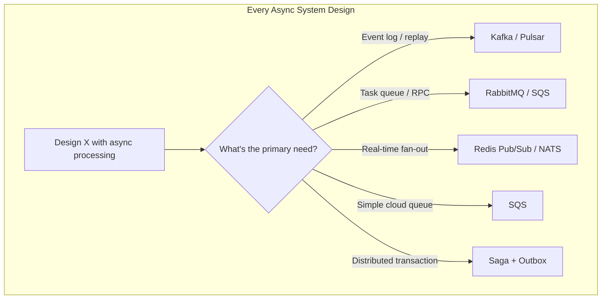

### What "Good" Looks Like in an Interview

| Level | What You Demonstrate |
|-------|---------------------|
| **Junior** | "Use a message queue for async" |
| **Mid** | "Kafka for event stream; consumers process notifications" |
| **Senior** | "At-least-once delivery; idempotent consumers; partition by user_id for ordering" |
| **Staff** | "Outbox pattern for DB + event atomicity; DLQ for poison messages; exactly-once via idempotent writes, not broker guarantee" |

### Core Questions Interviewers Ask

| Question | What They're Testing |
|----------|---------------------|
| Kafka or RabbitMQ? | Throughput vs routing flexibility |
| How do you guarantee no message loss? | Acknowledgments, persistence, DLQ |
| How do you handle duplicate messages? | Idempotency keys, dedup store |
| How do you order events? | Partition keys, single consumer per partition |
| How do you coordinate distributed transactions? | Saga, outbox — not 2PC |

---

## 2. Messaging Fundamentals

### 2.1 Delivery Guarantees

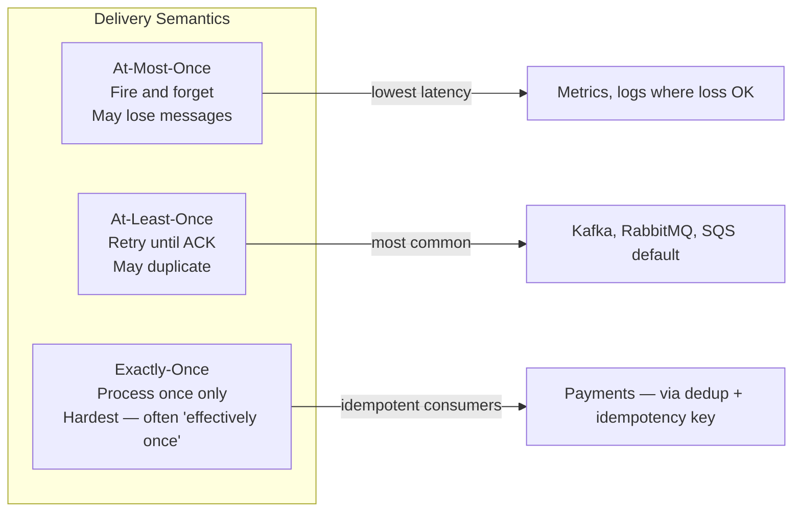

| Guarantee | Producer | Broker | Consumer | Duplicates? | Loss? |
|-----------|----------|--------|----------|-------------|-------|
| **At-most-once** | No retry | May drop | Auto-commit before process | No | Yes |
| **At-least-once** | Retry until ACK | Persist until consumed | ACK after process | Yes | No (if configured) |
| **Exactly-once** | Transactional | Deduplication | Idempotent + transactional | No | No |

**Interview truth:** True end-to-end exactly-once is nearly impossible across services. Say **"effectively exactly-once"** via idempotent consumers + dedup keys.

### 2.2 Ordering Guarantees

| Scope | Guarantee | System |
|-------|-----------|--------|
| **Global order** | All messages strictly ordered | Single partition only; limits throughput |
| **Partition order** | Ordered within partition key | Kafka, Pulsar, Kinesis |
| **No order** | Best-effort | SQS standard, Redis Pub/Sub |
| **Per-entity order** | Ordered per user_id / order_id | Kafka partition key = user_id |

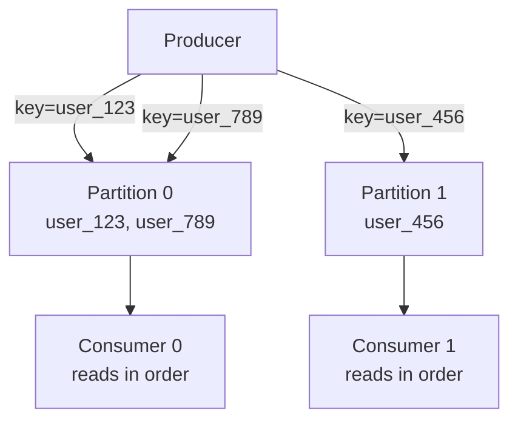

### 2.3 Push vs Pull

| Model | Who Initiates | Examples | Trade-off |
|-------|--------------|----------|-----------|
| **Push** | Broker pushes to consumer | RabbitMQ (basic), Redis Pub/Sub, NATS | Consumer overwhelmed if slow |
| **Pull** | Consumer polls broker | Kafka, SQS, Pulsar | Higher latency; consumer controls pace |

### 2.4 Message Queue vs Event Stream vs Pub/Sub

| Concept | Message Deleted After? | Replay? | Primary Use |
|---------|----------------------|---------|-------------|
| **Task queue** | Yes (on ACK) | No | Job processing |
| **Event stream** | No (retention period) | Yes | Event sourcing, CDC, analytics |
| **Pub/Sub** | No (no persistence default) | No | Real-time notifications |

---

## 3. Apache Kafka — Deep Dive

Kafka is a **distributed commit log** (event streaming platform) — not a traditional message queue. Messages are appended to partitioned topics and retained for a configurable period.

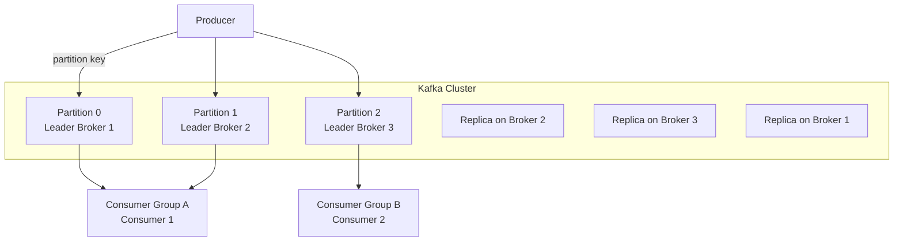

### 3.1 Architecture Internals

| Component | Role |
|-----------|------|
| **Broker** | Server storing topic partitions |
| **Topic** | Named category of messages (like a table) |
| **Partition** | Ordered, immutable sequence of messages |
| **Offset** | Position within partition (monotonically increasing) |
| **Producer** | Writes to topic; chooses partition via key or round-robin |
| **Consumer Group** | Set of consumers sharing work; each partition → one consumer in group |
| **ZooKeeper / KRaft** | Cluster metadata and controller election (KRaft replaces ZK in 3.x+) |
| **Replication** | Each partition has leader + follower replicas; `acks=all` for durability |

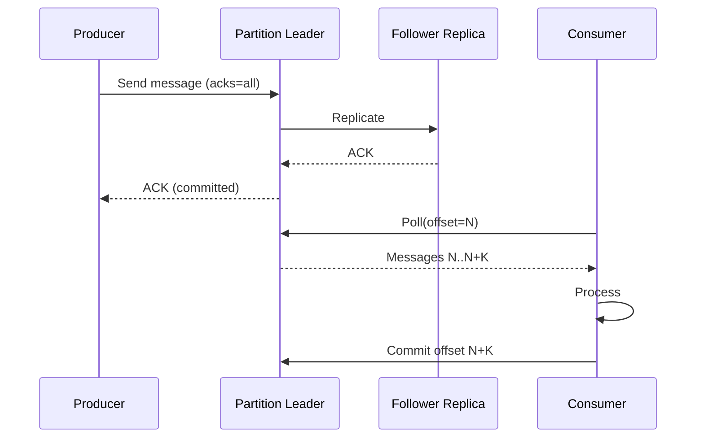

### 3.2 Delivery Guarantees

| Setting | Guarantee |
|---------|-----------|
| `acks=0` | At-most-once (fire and forget) |
| `acks=1` | Leader ACK only; may lose if leader dies before replicate |
| `acks=all` | At-least-once (with consumer idempotency → effectively once) |
| `enable.idempotence=true` | Producer dedup within session |
| Transactional producer | Exactly-once **within Kafka** (producer + consumer + offsets) |

### 3.3 Ordering Guarantees

- **Within partition:** Strict FIFO order
- **Across partitions:** No ordering guarantee
- **Interview rule:** Partition by entity ID (`user_id`, `order_id`) when per-entity order matters

### 3.4 Throughput Characteristics

| Metric | Typical Value |
|--------|---------------|
| **Throughput** | Millions of messages/sec per cluster |
| **Latency** | 5–50ms (batching increases throughput, adds latency) |
| **Retention** | Days to forever (disk-based, not memory) |
| **Message size** | Default 1MB max (configurable) |

### 3.5 When to Use Kafka

| Use Case | Why Kafka |
|----------|-----------|
| Event sourcing | Immutable log; replay from any offset |
| Metrics / analytics pipeline | High throughput; multiple consumer groups |
| CDC (Debezium) | Stream DB changes to downstream |
| Activity feeds (at scale) | Fan-out via consumer groups |
| Uber driver location | High write volume; geo-partitioned streams |
| Log aggregation | Natural fit for append-only logs |

### 3.6 When NOT to Use Kafka

| Scenario | Why Not | Alternative |
|----------|---------|-------------|
| Task queue with per-message ACK to delete | Kafka retains; not task semantics | RabbitMQ, SQS |
| Low volume (< 1000 msg/sec) | Operational overhead unjustified | SQS, RabbitMQ |
| Complex routing (topic exchange patterns) | Kafka has no native routing | RabbitMQ |
| Sub-millisecond latency | Batch-oriented | NATS, Redis |
| Simple fan-out to unknown subscribers | Consumer groups must be pre-declared | Redis Pub/Sub, NATS |
| Request-reply pattern | Not native | RabbitMQ RPC |

---

## 4. RabbitMQ — Deep Dive

RabbitMQ is a **traditional message broker** implementing AMQP. Messages are routed through **exchanges** to **queues** via **bindings** and **routing keys**.

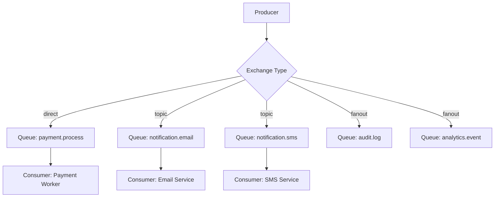

### 4.1 Architecture Internals

| Component | Role |
|-----------|------|
| **Exchange** | Receives messages; routes to queues (not stored) |
| **Queue** | Stores messages until consumed |
| **Binding** | Link between exchange and queue with routing rules |
| **Routing key** | Message attribute used for routing |
| **Channel** | Lightweight connection within TCP connection |
| **Virtual host** | Logical namespace isolation |
| **Erlang OTP** | Underlying runtime — superb concurrency |

**Exchange types:**

| Type | Routing Rule | Use Case |
|------|-------------|----------|
| **direct** | Exact routing key match | Point-to-point task queues |
| **topic** | Pattern match (`order.*`, `order.created`) | Pub/sub with filtering |
| **fanout** | All bound queues | Broadcast |
| **headers** | Match message headers | Complex routing (rare) |

### 4.2 Delivery Guarantees

| Setting | Guarantee |
|---------|-----------|
| **Persistent messages** + durable queue | Survives broker restart (at-least-once) |
| **Publisher confirms** | Producer knows message reached broker |
| **Manual ACK** | Consumer ACK after processing (at-least-once) |
| **Auto ACK** | At-most-once (message lost if consumer crashes mid-process) |
| **Dead Letter Exchange (DLX)** | Failed messages routed to DLQ after N retries |

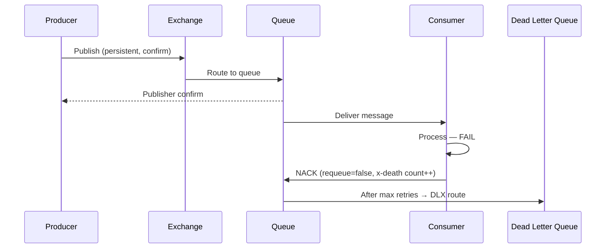

### 4.3 Ordering Guarantees

| Scope | Guarantee |
|-------|-----------|
| **Single queue, single consumer** | FIFO order |
| **Single queue, multiple consumers** | Competing consumers — no order |
| **Multiple queues** | No cross-queue order |

### 4.4 Throughput Characteristics

| Metric | Typical Value |
|--------|---------------|
| **Throughput** | 10K–50K msg/sec per node |
| **Latency** | 1–10ms |
| **Message size** | No hard limit (memory/disk bound) |
| **Retention** | Until consumed (or TTL/max-length exceeded) |

### 4.5 When to Use RabbitMQ

| Use Case | Why RabbitMQ |
|----------|--------------|
| Payment processing | Routing, DLQ, per-message ACK, priority queues |
| Task/job queues | Classic work queue pattern |
| Complex routing | Topic exchanges with pattern matching |
| Request-reply (RPC) | Built-in reply-to queue pattern |
| Moderate throughput | Simpler ops than Kafka |
| Instagram notifications (moderate scale) | Fan-out via fanout/topic exchange |

### 4.6 When NOT to Use RabbitMQ

| Scenario | Why Not | Alternative |
|----------|---------|-------------|
| Event replay / event sourcing | Messages deleted on consume | Kafka |
| Millions msg/sec | Throughput ceiling | Kafka, Pulsar |
| Long-term retention | Not designed as log | Kafka |
| Multi-datacenter replication at scale | Federation limited | Pulsar geo-replication |
| Serverless / zero-ops | Self-managed | SQS |

---

## 5. Amazon SQS — Deep Dive

SQS is a **fully managed**, serverless message queue from AWS. Two flavors: **Standard** (at-least-once, best-effort order) and **FIFO** (exactly-once processing, strict order).

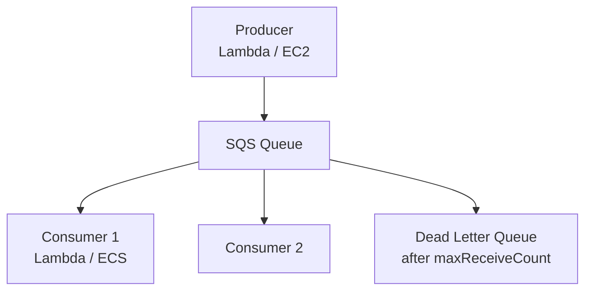

### 5.1 Architecture Internals

| Component | Role |
|-----------|------|
| **Queue** | Managed message store (distributed across AZs) |
| **Visibility timeout** | Message hidden after receive; reappears if not deleted |
| **Long polling** | `WaitTimeSeconds=20` reduces empty receives |
| **DLQ** | Redrive policy after N failed receives |
| **FIFO queue** | `.fifo` suffix; deduplication ID + message group ID |

### 5.2 Delivery Guarantees

| Queue Type | Delivery | Ordering |
|------------|----------|----------|
| **Standard** | At-least-once (may duplicate) | Best-effort order |
| **FIFO** | Exactly-once processing (dedup) | Strict per message-group order |

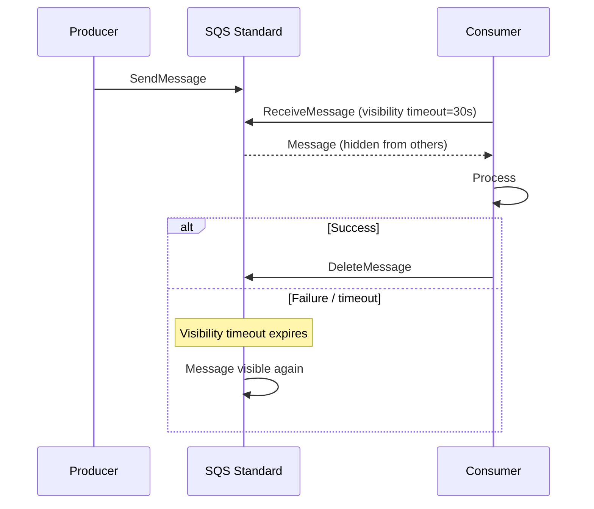

### 5.3 Throughput Characteristics

| Metric | Standard | FIFO |
|--------|----------|------|
| **Throughput** | Unlimited (soft) | 300 msg/sec per queue (3000 with batching) |
| **Latency** | 10–100ms | 10–100ms |
| **Message size** | 256 KB max | 256 KB max |
| **Retention** | 1 min to 14 days | Same |

### 5.4 When to Use SQS

| Use Case | Why SQS |
|----------|---------|
| AWS-native task processing | Zero ops; IAM integration |
| Lambda event source | Native trigger |
| Decouple microservices on AWS | Simple, reliable, cheap |
| Background jobs | Image processing, email sending |
| Burst traffic absorption | Serverless scaling |

### 5.5 When NOT to Use SQS

| Scenario | Why Not | Alternative |
|----------|---------|-------------|
| Event replay | No replay — delete on consume | Kafka, Kinesis |
| High throughput FIFO (>3K/sec) | FIFO limits | Kafka partitioned |
| Complex routing | No exchanges | RabbitMQ, SNS+SQS fan-out |
| Multi-cloud | AWS lock-in | RabbitMQ, Kafka |
| Sub-10ms latency | Polling overhead | NATS, Redis |
| Large messages (>256KB) | Size limit | S3 + SQS pointer |

---

## 6. Redis Pub/Sub — Deep Dive

Redis Pub/Sub is a **fire-and-forget broadcast** mechanism — no persistence, no acknowledgments, no replay.

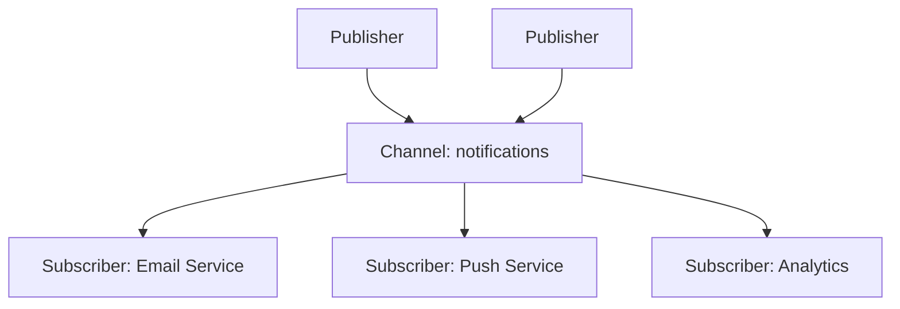

### 6.1 Architecture Internals

| Component | Role |
|-----------|------|
| **Channel** | Named broadcast medium |
| **Pattern subscribe** | `PSUBSCRIBE notifications.*` |
| **Subscriber** | Blocking connection listening for messages |
| **Publisher** | `PUBLISH channel message` — O(N) where N = subscribers |

**Critical:** Pub/Sub is **not a queue**. If no subscriber is connected, message is **lost forever**.

### 6.2 Delivery Guarantees

| Guarantee | Detail |
|-----------|--------|
| **At-most-once** | Only guarantee — no persistence, no ACK |
| Offline subscribers | Miss all messages while disconnected |
| Slow subscribers | TCP buffer overflow → disconnect |

### 6.3 Ordering Guarantees

| Scope | Guarantee |
|-------|-----------|
| **Single channel** | FIFO delivery to each subscriber |
| **Across channels** | No guarantee |

### 6.4 Throughput Characteristics

| Metric | Value |
|--------|-------|
| **Throughput** | 100K+ msg/sec (in-memory) |
| **Latency** | Sub-millisecond |
| **Persistence** | None (Pub/Sub); use Redis Streams for persistence |
| **Message size** | 512 MB max (practical: small) |

### 6.5 Redis Streams (Related — Know the Difference)

| Feature | Pub/Sub | Streams |
|---------|---------|---------|
| **Persistence** | No | Yes (AOF/RDB) |
| **Consumer groups** | No | Yes |
| **Replay** | No | Yes (by offset ID) |
| **ACK** | No | Yes (`XACK`) |
| **Use case** | Real-time broadcast | Lightweight Kafka alternative |

### 6.6 When to Use Redis Pub/Sub

| Use Case | Why |
|----------|-----|
| Real-time chat (presence, typing) | Sub-ms latency; ephemeral OK |
| Live leaderboards | Fast broadcast |
| Cache invalidation signals | Fire-and-forget notify all app servers |
| WebSocket gateway fan-out | Gateway instances subscribe to channel |

### 6.7 When NOT to Use Redis Pub/Sub

| Scenario | Why Not | Alternative |
|----------|---------|-------------|
| Payment events | No persistence — message loss | RabbitMQ, Kafka |
| Task queues | No ACK, no DLQ | SQS, RabbitMQ |
| Event sourcing | No replay | Kafka |
| Critical notifications | Offline = lost | Kafka, RabbitMQ |
| Large fan-out at scale | O(N) per publish; memory bound | Kafka consumer groups |

---

## 7. Apache Pulsar — Deep Dive

Pulsar separates **compute (brokers)** from **storage (BookKeeper)** — designed for multi-tenancy, geo-replication, and unified messaging + streaming.

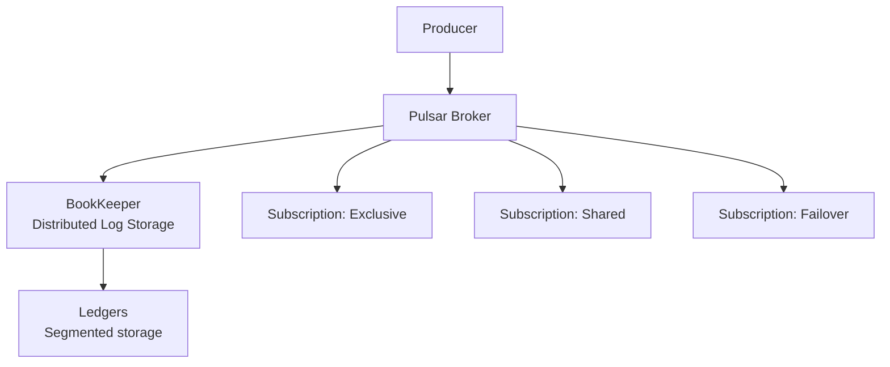

### 7.1 Architecture Internals

| Component | Role |
|-----------|------|
| **Broker** | Handles produce/consume; stateless |
| **BookKeeper (Bookie)** | Persists messages in ledgers |
| **Topic** | Named channel (like Kafka) |
| **Subscription** | Consumer group equivalent (exclusive, shared, failover, key_shared) |
| **Cursor** | Per-subscription consumption position |
| **Geo-replication** | Cross-datacenter replication built-in |

### 7.2 Delivery Guarantees

| Mode | Guarantee |
|------|-----------|
| **Persistent + ACK** | At-least-once |
| **Dedup (broker-side)** | Effectively exactly-once within Pulsar |
| **Non-persistent** | At-most-once (like Pub/Sub) |

### 7.3 Ordering Guarantees

- Per partition key: ordered (like Kafka)
- Key_Shared subscription: parallel consumption with per-key order

### 7.4 Throughput Characteristics

| Metric | Value |
|--------|-------|
| **Throughput** | Comparable to Kafka (millions/sec) |
| **Latency** | 5–30ms |
| **Retention** | Configurable; tiered storage to S3 |
| **Multi-tenancy** | Native namespace isolation |

### 7.5 When to Use Pulsar

| Use Case | Why |
|----------|-----|
| Kafka-like streaming + traditional queuing | Unified model (subscription types) |
| Geo-replicated messaging | Built-in cross-region |
| Multi-tenant SaaS | Namespace isolation |
| Tiered storage | Old data to S3 automatically |

### 7.6 When NOT to Use Pulsar

| Scenario | Why Not | Alternative |
|----------|---------|-------------|
| Simple task queue | Operational complexity | SQS, RabbitMQ |
| Small team / low volume | Steep learning curve | RabbitMQ |
| AWS-only serverless | Not native AWS | SQS, Kinesis |
| Mature Kafka ecosystem | Migration cost | Kafka |

---

## 8. NATS — Deep Dive

NATS is a **lightweight, high-performance** messaging system focused on simplicity and low latency. NATS JetStream adds persistence and streaming.

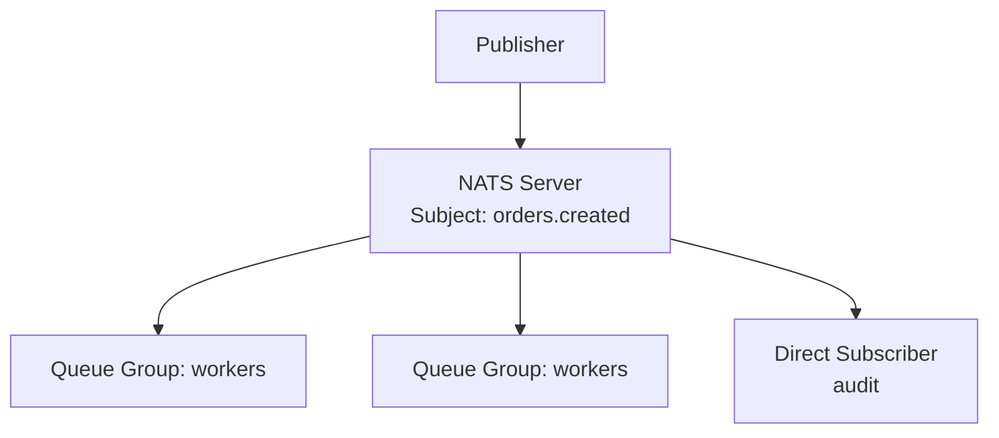

### 8.1 Architecture Internals

| Component | Role |
|-----------|------|
| **Subject** | Hierarchical topic (`orders.created.us`) |
| **Queue group** | Load-balanced consumers (like Kafka consumer group) |
| **Core NATS** | In-memory, fire-and-forget (at-most-once) |
| **JetStream** | Persistence, replay, exactly-once (with dedup) |
| **Supercluster** | Gateway-based federation |

### 8.2 Delivery Guarantees

| Mode | Guarantee |
|------|-----------|
| **Core NATS** | At-most-once |
| **JetStream** | At-least-once; exactly-once with dedup |
| **Request-reply** | Synchronous RPC pattern built-in |

### 8.3 Throughput & Latency

| Metric | Core NATS | JetStream |
|--------|-----------|-----------|
| **Throughput** | Millions/sec | Hundreds of thousands/sec |
| **Latency** | Sub-millisecond | 1–10ms |
| **Persistence** | No | Yes |

### 8.4 When to Use NATS

| Use Case | Why |
|----------|-----|
| Service mesh messaging | Lightweight, subject-based routing |
| IoT telemetry | Millions of small messages |
| Request-reply microservices | Native pattern |
| Real-time with optional persistence | JetStream when needed |

### 8.5 When NOT to Use NATS

| Scenario | Why Not | Alternative |
|----------|---------|-------------|
| Event sourcing at PB scale | Smaller ecosystem than Kafka | Kafka |
| Complex DLQ / routing | Less mature than RabbitMQ | RabbitMQ |
| Managed cloud queue | Self-hosted | SQS |

---

## 9. System Comparison Matrix

### 9.1 Head-to-Head Comparison

| Dimension | Kafka | RabbitMQ | SQS | Redis Pub/Sub | Pulsar | NATS |
|-----------|-------|----------|-----|---------------|--------|------|
| **Model** | Event log | Message broker | Managed queue | Broadcast | Log + queue | Subject-based |
| **Persistence** | Yes (disk) | Yes (optional) | Yes | No | Yes | JetStream only |
| **Delivery** | At-least-once | At-least-once | At-least-once / FIFO exactly-once | At-most-once | At-least-once | At-most-once / JetStream |
| **Ordering** | Per partition | Per queue (single consumer) | FIFO only | Per channel | Per key | Per subject |
| **Replay** | Yes | No | No | No | Yes | JetStream yes |
| **Throughput** | Millions/sec | 10–50K/sec | High (unlimited std) | 100K+/sec | Millions/sec | Millions/sec |
| **Latency** | 5–50ms | 1–10ms | 10–100ms | <1ms | 5–30ms | <1ms |
| **Routing** | Topic only | Exchange types | None (SNS fan-out) | Channels | Topics + subscriptions | Subject hierarchy |
| **Ops burden** | High | Medium | Zero (managed) | Low (if Redis exists) | High | Low–Medium |
| **DLQ** | Custom / connect | Native DLX | Native | None | Native | JetStream |
| **Best for** | Event streaming | Task queues, routing | AWS jobs | Real-time broadcast | Unified streaming | Low-latency mesh |

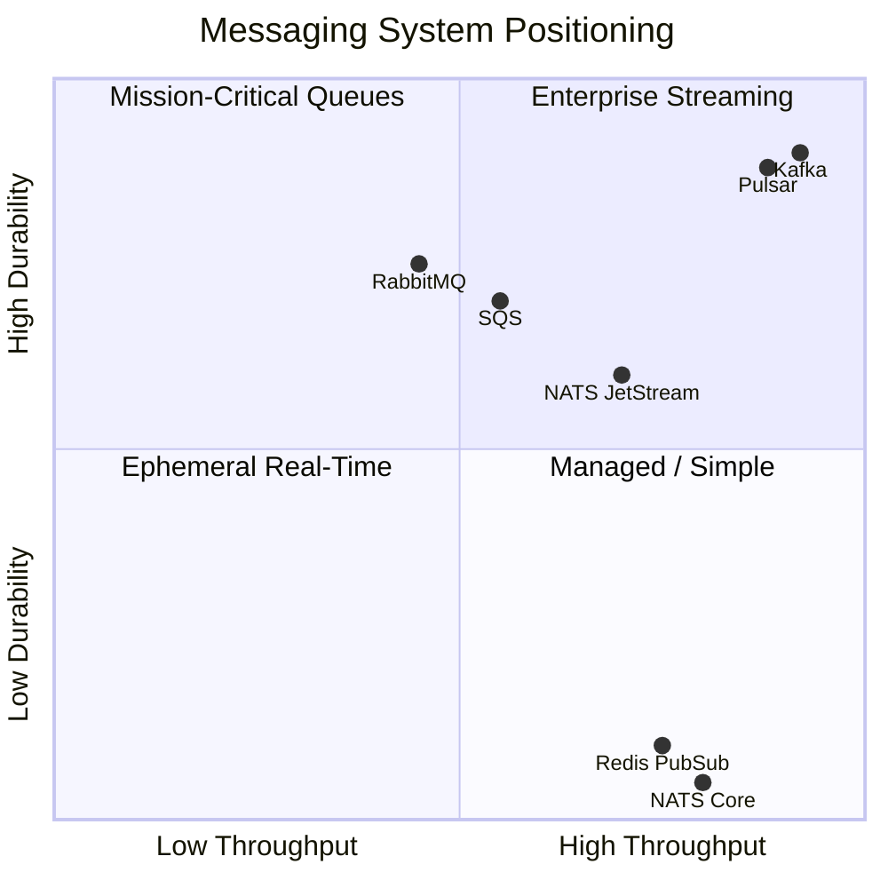

### 9.2 Selection Flowchart

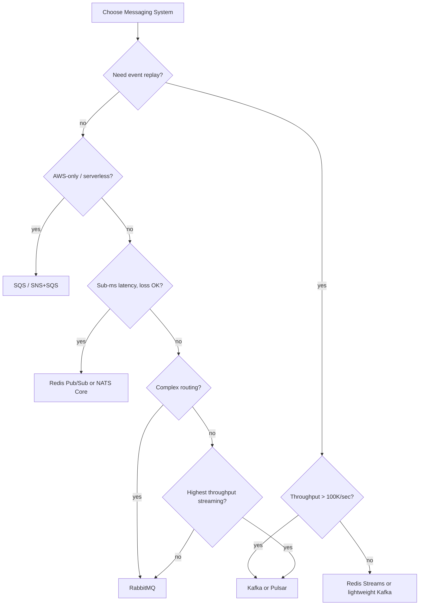

---

## 10. Pattern: Point-to-Point (Work Queue)

One message → exactly one consumer processes it. Competing consumers share the workload.

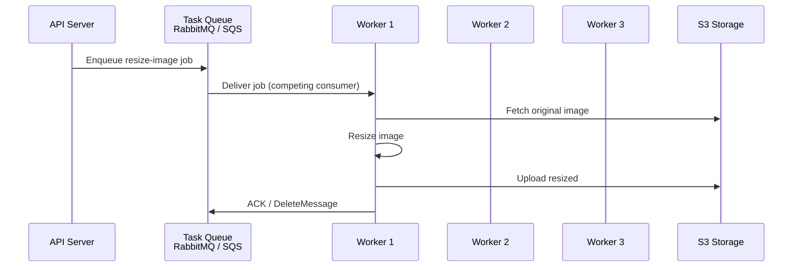

### 10.1 Implementation by System

| System | Pattern |
|--------|---------|
| **RabbitMQ** | Direct exchange → single queue → multiple consumers |
| **SQS** | Standard queue → multiple consumers with visibility timeout |
| **Kafka** | Consumer group (less ideal — message not deleted) |
| **NATS** | Queue group subscription |

### 10.2 Key Design Decisions

| Decision | Recommendation |
|----------|---------------|
| **Visibility timeout** | Set > max processing time (SQS) |
| **Prefetch** | Limit unacked messages per consumer (RabbitMQ `prefetch=1` for fair dispatch) |
| **Idempotency** | Required — at-least-once may redeliver |
| **Poison messages** | DLQ after N failures |
| **Scaling** | Add consumers up to queue throughput |

### 10.3 Interview Talking Points

> "Image processing is a classic work queue. API enqueues job to SQS; worker fleet polls with long polling. Visibility timeout is 5 minutes (processing takes ~30s). Idempotency key on job ID prevents duplicate processing. After 3 failures, message goes to DLQ for manual inspection."

---

## 11. Pattern: Pub/Sub (Fan-Out)

One message → **all** subscribers receive a copy. Producer doesn't know consumers.

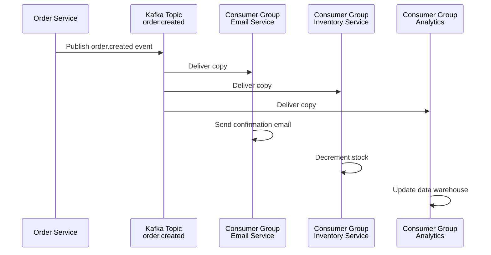

### 11.1 Implementation by System

| System | Fan-Out Mechanism |
|--------|-------------------|
| **Kafka** | Multiple consumer groups on same topic |
| **RabbitMQ** | Fanout exchange → multiple bound queues |
| **SQS** | SNS topic → multiple SQS queues |
| **Redis Pub/Sub** | Multiple subscribers on channel |
| **NATS** | Multiple subscribers on subject |

### 11.2 Fan-Out vs Work Queue

```mermaid
graph TB
    subgraph Work Queue — one consumer gets message
        P1[Producer] --> Q1[Queue]
        Q1 --> W1[Worker 1 ✓]
        Q1 -.-> W2[Worker 2 ✗]
    end

    subgraph Fan-Out — all subscribers get copy
        P2[Producer] --> TOPIC[Topic / Fanout]
        TOPIC --> S1[Email ✓]
        TOPIC --> S2[Analytics ✓]
        TOPIC --> S3[Audit ✓]
    end
```

### 11.3 Instagram Notifications Example

| Component | Choice |
|-----------|--------|
| **Event** | `user.liked_post`, `user.followed` |
| **Broker** | Kafka (high volume, multiple downstream) or RabbitMQ fanout (moderate scale) |
| **Consumers** | Push notification service, email digest, activity feed indexer |
| **Partition key** | `user_id` (recipient) for per-user ordering |
| **Why not Redis Pub/Sub** | Notifications must not be lost if push service is briefly down |

---

## 12. Pattern: Event Sourcing

Store every state change as an immutable sequence of events. Current state = replay of all events.

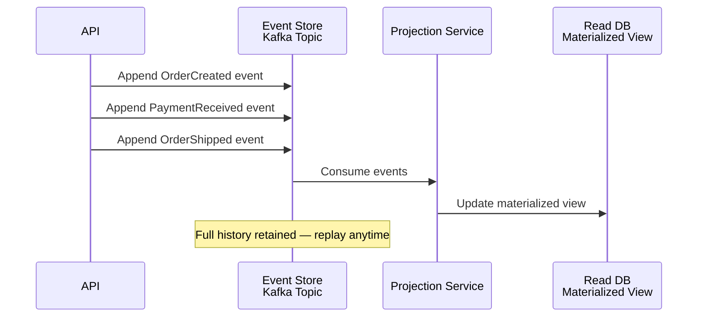

### 12.1 Core Concepts

| Concept | Definition |
|---------|------------|
| **Event** | Immutable fact: `OrderCreated { id, items, total }` |
| **Event store** | Append-only log (Kafka topic) |
| **Aggregate** | Entity rebuilt by replaying events |
| **Snapshot** | Periodic aggregate state to avoid full replay |
| **Projection** | Read-optimized view built from events |

### 12.2 Why Kafka for Event Sourcing

| Requirement | Kafka Feature |
|-------------|---------------|
| Immutable log | Append-only partitions |
| Replay | Reset consumer offset |
| Ordering per entity | Partition key = aggregate ID |
| Retention | Configurable; compacted topics for latest-per-key |
| Multiple projections | Multiple consumer groups |

### 12.3 Event Sourcing Trade-offs

| Pros | Cons |
|------|------|
| Complete audit trail | Query complexity (need projections) |
| Temporal queries ("state at time T") | Event schema evolution (upcasting) |
| Decouple write from read models | Storage growth |
| Natural integration with CQRS | Learning curve |

---

## 13. Pattern: CQRS with Message Queues

**Command Query Responsibility Segregation** — separate write model (commands → events) from read model (projections → query-optimized store).

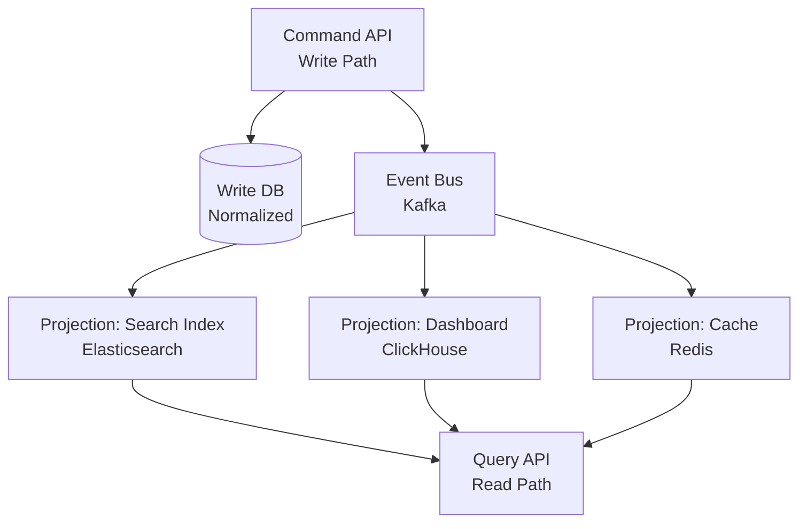

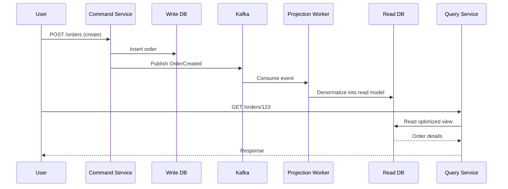

### 13.1 When to Use CQRS

| Scenario | Rationale |
|----------|-----------|
| Read/write load asymmetry (1000:1) | Optimize read model independently |
| Complex queries on denormalized data | Separate Elasticsearch/ClickHouse |
| Multiple read views from same writes | Fan-out projections |
| Event-driven microservices | Natural boundary |

### 13.2 CQRS Without Event Sourcing

CQRS does not require event sourcing. You can:
- Write to PostgreSQL → publish change event → update Redis read cache
- Simpler; lose full event history

---

## 14. Pattern: Saga for Distributed Transactions

Sagas coordinate multi-service transactions via a sequence of **local transactions** with **compensating actions** on failure — instead of 2PC.

```mermaid
sequenceDiagram
    participant O as Order Service
    participant P as Payment Service
    participant I as Inventory Service
    participant S as Shipping Service
    participant Q as Message Broker

    O->>Q: Start Saga: OrderCreated
    Q->>P: Reserve payment
    P-->>Q: PaymentReserved
    Q->>I: Reserve inventory
    I-->>Q: InventoryReserved
    Q->>S: Create shipment
    S-->>Q: ShipmentFailed ❌
    Q->>I: Compensate: ReleaseInventory
    Q->>P: Compensate: RefundPayment
    Q->>O: Compensate: CancelOrder
```

### 14.1 Choreography vs Orchestration

```mermaid
graph TB
    subgraph Choreography — event-driven, no central coordinator
        O1[Order Svc] -->|OrderCreated| K1[Kafka]
        K1 --> P1[Payment Svc]
        P1 -->|PaymentDone| K1
        K1 --> I1[Inventory Svc]
        I1 -->|InventoryFailed| K1
        K1 --> P1
        Note1[Payment listens and refunds]
    end

    subgraph Orchestration — central saga manager
        O2[Order Svc] --> ORCH[Saga Orchestrator]
        ORCH --> P2[Payment Svc]
        ORCH --> I2[Inventory Svc]
        ORCH --> S2[Shipping Svc]
        ORCH -->|on failure| COMP[Run compensations]
    end
```

| Style | Pros | Cons |
|-------|------|------|
| **Choreography** | Decoupled; no single point of failure | Hard to track saga state; cyclic deps |
| **Orchestration** | Clear flow; easy to monitor | Orchestrator is dependency; can become god-service |

### 14.2 Saga Implementation with Message Queues

| Component | Role |
|-----------|------|
| **Kafka topic per step** | `order.created`, `payment.reserved`, `inventory.failed` |
| **Saga state** | Stored in DB table or Kafka compacted topic |
| **Compensating transaction** | Idempotent reverse operation |
| **Timeout** | Saga coordinator triggers compensation if step hangs |
| **RabbitMQ** | Topic exchange routes saga events; DLQ for stuck steps |

### 14.3 Payment Processing Saga (Interview Gold)

> "Order service publishes `OrderCreated` to Kafka. Payment service consumes, charges card, publishes `PaymentCompleted` or `PaymentFailed`. On `PaymentFailed`, inventory service (which already reserved stock) listens and publishes `InventoryReleased`. Each step is idempotent — payment service checks `idempotency_key` before charging. Saga state table tracks current step. Timeout after 30s triggers automatic compensation."

---

## 15. Pattern: Outbox Pattern

Atomically write business data **and** an outbox event in the same DB transaction. A separate relay publishes outbox rows to the message broker.

```mermaid
sequenceDiagram
    participant API as API Service
    participant DB as PostgreSQL
    participant RELAY as Outbox Relay<br/>Debezium / Polling Publisher
    participant K as Kafka

    API->>DB: BEGIN TRANSACTION
    API->>DB: INSERT INTO orders (...)
    API->>DB: INSERT INTO outbox (event_type, payload)
    API->>DB: COMMIT
    RELAY->>DB: Poll outbox (or CDC via WAL)
    RELAY->>K: Publish OrderCreated
    RELAY->>DB: Mark outbox row as published
```

### 15.1 Why Outbox Is Needed

| Problem | Without Outbox | With Outbox |
|---------|---------------|-------------|
| DB commit + Kafka publish | Dual-write: one can fail | Single transaction |
| Consistency | Data in DB but no event (or vice versa) | Atomic: both or neither |
| Recovery | Manual reconciliation | Relay retries until published |

### 15.2 Outbox Implementations

| Method | How | Trade-off |
|--------|-----|-----------|
| **Polling publisher** | Cron reads `outbox WHERE published=false` | Simple; polling lag |
| **CDC (Debezium)** | Reads PostgreSQL WAL → Kafka | Real-time; no polling |
| **Transactional outbox (Kafka)** | Kafka transactions + DB (limited) | Complex; same DB vendor |

```mermaid
graph LR
    DB[(PostgreSQL)] -->|WAL| DEB[Debezium Connector]
    DEB --> K[Kafka Topic<br/>order.events]
    K --> C1[Email Service]
    K --> C2[Analytics]
```

### 15.3 Outbox Table Schema

```sql
CREATE TABLE outbox (
    id            UUID PRIMARY KEY,
    aggregate_id  UUID NOT NULL,
    event_type    VARCHAR(100) NOT NULL,
    payload       JSONB NOT NULL,
    created_at    TIMESTAMP DEFAULT NOW(),
    published_at  TIMESTAMP NULL
);
CREATE INDEX idx_outbox_unpublished ON outbox (created_at) WHERE published_at IS NULL;
```

---

## 16. Pattern: Change Data Capture (CDC)

CDC streams database changes (INSERT, UPDATE, DELETE) to message brokers in real-time by reading the database **write-ahead log (WAL)**.

```mermaid
sequenceDiagram
    participant APP as Application
    participant DB as PostgreSQL
    participant WAL as WAL / Binlog
    participant DEB as Debezium
    participant K as Kafka
    participant DW as Data Warehouse
    participant CACHE as Cache Invalidator

    APP->>DB: UPDATE users SET name='Alice'
    DB->>WAL: Write change to WAL
    DEB->>WAL: Read WAL (logical replication slot)
    DEB->>K: Publish users.change event
    K->>DW: Sync to Snowflake
    K->>CACHE: Invalidate user:123 cache
```

### 16.1 CDC vs Outbox

| Dimension | CDC (Debezium) | Outbox |
|-----------|---------------|--------|
| **Capture scope** | All table changes | Only intended events |
| **Application change** | None (reads WAL) | Must write to outbox table |
| **Event shape** | Raw row change (before/after) | Application-defined payload |
| **Coupling** | Schema-coupled to DB | Decoupled event contract |
| **Interview default** | Data sync, cache invalidation | Domain events between services |

### 16.2 Debezium Architecture

| Component | Role |
|-----------|------|
| **Connector** | PostgreSQL/MySQL/MongoDB source |
| **Kafka Connect** | Framework running connectors |
| **Schema Registry** | Avro/Protobuf schemas (Confluent) |
| **Transform (SMT)** | Filter, route, flatten changes |

### 16.3 CDC Use Cases in Interviews

| Use Case | Flow |
|----------|------|
| **Search index sync** | PostgreSQL → Debezium → Kafka → Elasticsearch consumer |
| **Data warehouse ETL** | OLTP DB → Kafka → Snowflake/BigQuery |
| **Cache invalidation** | Row update → Kafka → Redis cache purge |
| **Read replica lag monitoring** | Not CDC but related pattern |

---

## 17. Decision Matrix — Which Queue for Which Question

### 17.1 System Design Question → Queue Mapping

```mermaid
flowchart TD
    Q[Interview Question] --> INSTA[Instagram Notifications]
    Q --> UBER[Uber Driver Location]
    Q --> PAY[Payment Processing]
    Q --> CHAT[Real-Time Chat]
    Q --> MET[Metrics Pipeline]
    Q --> TASK[Task / Job Processing]

    INSTA --> K1[Kafka ✓<br/>or RabbitMQ fanout at moderate scale]
    UBER --> K2[Kafka ✓<br/>high throughput geo-stream]
    PAY --> R1[RabbitMQ + DLQ ✓<br/>routing + per-message ACK]
    CHAT --> R2[Redis Pub/Sub ✓<br/>or dedicated WebSocket gateway]
    MET --> K3[Kafka ✓<br/>log aggregation at scale]
    TASK --> S1[SQS ✓<br/>or RabbitMQ work queue]
```

### 17.2 Detailed Scenario Matrix

| Interview Question | Recommended Queue | Why | Avoid |
|-------------------|-------------------|-----|-------|
| **Instagram notifications** | Kafka (scale) or RabbitMQ (moderate) | Fan-out to push, email, feed; durable | Redis Pub/Sub (loss on disconnect) |
| **Uber driver location** | Kafka | Millions of GPS updates/sec; geo-partitioned; consumers: matching, map, surge | RabbitMQ (throughput ceiling) |
| **Payment processing** | RabbitMQ + DLQ | Per-message ACK; priority queues; DLQ for failed payments; routing | Redis Pub/Sub (no persistence) |
| **Real-time chat** | Redis Pub/Sub + WebSocket gateway | Sub-ms latency; ephemeral typing/presence; dedicated chat history in DB | Kafka (too slow for typing indicators) |
| **Metrics pipeline** | Kafka | Append-only; multiple consumers (Grafana, alerting, warehouse); high throughput | SQS (no replay) |
| **Task/job processing** | SQS (AWS) or RabbitMQ | Classic work queue; DLQ; competing consumers | Kafka (not task semantics) |
| **Order fulfillment saga** | Kafka + choreography | Durable events; compensation flow; audit trail | SQS (no ordering across steps without FIFO) |
| **Search index sync** | Debezium → Kafka | CDC from OLTP; replay on failure | Application dual-write |
| **Cache invalidation** | Redis Pub/Sub or Kafka | Ephemeral: Pub/Sub; durable: Kafka CDC | SQS (overkill) |
| **Email digest (batch)** | SQS + Lambda | Serverless; scheduled; cheap | NATS |
| **Activity/audit log** | Kafka (compacted topic) | Retain forever; replay; compliance | RabbitMQ (messages deleted) |
| **IoT sensor data** | Kafka or NATS | Volume-dependent; NATS for edge; Kafka for aggregation | SQS (throughput cost) |

### 17.3 Instagram Notifications — Deep Answer

```mermaid
graph TB
    EVENT[User likes post] --> API[API Service]
    API --> K[Kafka Topic<br/>social.events<br/>partition by recipient_id]
    K --> PUSH[Push Notification<br/>Consumer Group]
    K --> EMAIL[Email Digest<br/>Consumer Group]
    K --> FEED[Feed Indexer<br/>Consumer Group]
    K --> COUNTER[Like Counter<br/>Consumer Group]

    PUSH --> FCM[FCM / APNS]
    EMAIL --> DIGEST[Hourly batch aggregator]
```

> "I'd publish `PostLiked` to Kafka partitioned by `recipient_user_id` — ensures notification ordering per user. Separate consumer groups for push (real-time), email digest (batched), and feed indexer. At-least-once delivery with idempotent consumers (dedup by `event_id`). Push service maintains device token registry. For MVP scale, RabbitMQ fanout exchange works — migrate to Kafka when exceeding ~50K events/sec."

### 17.4 Uber Driver Location — Deep Answer

```mermaid
sequenceDiagram
    participant D as Driver App
    participant GW as Gateway
    participant K as Kafka<br/>driver.locations
    participant MATCH as Matching Service
    participant MAP as Map Service
    participant SURGE as Surge Pricing

    D->>GW: GPS update every 3s
    GW->>K: Publish (key=driver_id, lat, lng, timestamp)
    K->>MATCH: Consume for nearby rider matching
    K->>MAP: Consume for map tile updates
    K->>SURGE: Consume for supply/demand analysis
```

> "Driver location is a high-throughput event stream — Kafka partitioned by `driver_id`. Retention 24 hours (replay for debugging). At-least-once; consumers use latest-offset for real-time (dedup by timestamp). Matching service maintains in-memory geo-index (H3/S2 cells) fed by Kafka consumer. Don't use RabbitMQ — millions of updates per minute in a city."

### 17.5 Payment Processing — Deep Answer

```mermaid
sequenceDiagram
    participant API as Payment API
    participant EX as RabbitMQ<br/>direct exchange
    participant Q as payment.process queue
    participant W as Payment Worker
    participant PSP as Stripe / PSP
    participant DLQ as Dead Letter Queue

    API->>EX: Publish payment job (persistent, priority)
    EX->>Q: Route to queue
    Q->>W: Deliver
    W->>PSP: Charge card (idempotency_key)
    alt Success
        W->>Q: ACK
    else Transient failure
        W->>Q: NACK + requeue (retry 3x)
    else Permanent failure
        W->>DLQ: Route to DLQ
    end
```

> "Payment jobs go to RabbitMQ durable queue with publisher confirms and manual ACK. Worker calls PSP with `idempotency_key = payment_id`. DLQ captures permanent failures for manual review. Priority queue for premium users. This is a work queue, not event stream — message deleted after processing. Kafka overkill unless we also need payment event sourcing for audit."

### 17.6 Real-Time Chat — Deep Answer

```mermaid
graph TB
    USER1[User A] --> WS1[WebSocket Gateway 1]
    USER2[User B] --> WS2[WebSocket Gateway 2]
    WS1 --> REDIS[Redis Pub/Sub<br/>channel: room:123]
    WS2 --> REDIS
    WS1 --> DB[(PostgreSQL<br/>message history)]
    WS2 --> DB
```

> "Real-time delivery via WebSocket gateways subscribed to Redis Pub/Sub channel `room:{room_id}`. Message sent → persist to PostgreSQL (source of truth) → publish to Redis Pub/Sub → all gateway instances in room forward to connected clients. Pub/Sub loss is acceptable for typing indicators; chat messages are durable in DB. User fetches history from DB on reconnect. For DM notifications to offline users, use Kafka/RabbitMQ separately."

### 17.7 Metrics Pipeline — Deep Answer

> "Application → Kafka topic `metrics.raw` (partitioned by `service_name`) → Flink/Spark streaming aggregation → Kafka `metrics.aggregated` → Grafana (via Prometheus remote write) + long-term S3 (via Kafka Connect). Retention: raw 7 days, aggregated 90 days. At-least-once; duplicate metrics acceptable (idempotent sum). Kafka because multiple consumers need same data and replay is required after consumer bug."

### 17.8 Task/Job Processing — Deep Answer

> "On AWS: SQS standard queue → Lambda/ECS workers. Visibility timeout = 6× p99 processing time. DLQ after 3 receives. For cross-cloud or complex routing: RabbitMQ work queue with prefetch=1 for fair dispatch. Not Kafka — we don't need replay; message should be deleted after successful processing."

---

## 18. Interview Scenarios & Sample Answers

### Scenario 1: "Design async notification system for 100M users"

> "Events (`follow`, `like`, `comment`) published to Kafka topic `notifications` partitioned by `recipient_id`. Consumer groups: (1) real-time push via FCM — latency-sensitive; (2) email digest aggregator — batches hourly; (3) in-app notification DB writer. At-least-once with `event_id` dedup in Redis (TTL 24h). Rate limit push per user (max 100/hour) in consumer. DLQ topic for persistently failing events. Start with RabbitMQ fanout if < 10K events/sec; migrate to Kafka at scale."

---

### Scenario 2: "How do you ensure payment is processed exactly once?"

> "True exactly-once end-to-end is impractical. I achieve **effective exactly-once**: (1) `idempotency_key` on every payment request stored in DB with UNIQUE constraint; (2) RabbitMQ at-least-once with manual ACK after PSP confirms; (3) before processing, worker checks if `payment_id` already completed; (4) DLQ for permanent failures. Outbox pattern ensures order creation and payment event are atomic in the order DB."

---

### Scenario 3: "Kafka vs RabbitMQ for order processing?"

> "**Kafka** if: multiple services need to read the same order events, event sourcing, replay for audit, throughput > 50K/sec. **RabbitMQ** if: task queue semantics (delete on process), complex routing (topic exchange), moderate throughput, priority queues, simpler ops. For most e-commerce order processing, I'd start with RabbitMQ for the fulfillment pipeline (work queue) and add Kafka for the order event stream (analytics, search indexing) via outbox/CDC."

---

### Scenario 4: "Design data pipeline from OLTP to data warehouse"

> "Debezium CDC connector on PostgreSQL WAL → Kafka topics (one per table) → Kafka Connect S3 sink (Parquet) → Snowflake external table. Schema Registry for Avro evolution. No application code changes. Replay by resetting consumer offset. Separate compacted topic for dimension tables (users, products)."

---

### Scenario 5: "How would you handle a poison message?"

> "Poison message = fails processing every time (malformed payload, bug). After N retries (RabbitMQ: `x-death` count → DLX; SQS: `maxReceiveCount` → DLQ), route to dead letter queue. Alert on DLQ depth. Manual tooling to inspect, fix, and re-publish. Idempotent consumer ensures safe reprocessing. Root cause: schema validation at publish time prevents most poison messages."

---

### Scenario 6: "Design distributed transaction for travel booking (flight + hotel)"

> "Saga orchestration: Booking orchestrator publishes steps to Kafka. (1) Reserve flight → `FlightReserved`; (2) Reserve hotel → `HotelReserved`; (3) Charge payment → `PaymentCompleted` → confirm all. On `HotelUnavailable` → compensate: `ReleaseFlight`, `RefundIfNeeded`. Saga state in PostgreSQL `saga_instances` table. Each step idempotent. Timeout 5 min → auto-compensate. No 2PC — airlines and hotels don't support XA transactions."

---

## 19. Failure Modes Across All Systems

| Failure | System | Impact | Mitigation |
|---------|--------|--------|------------|
| **Broker down** | All | Producers can't publish; consumers stall | Cluster replication; multi-AZ |
| **Consumer crash mid-process** | All (at-least-once) | Message redelivered | Idempotent consumer |
| **Poison message** | All | Infinite retry loop | DLQ after N attempts |
| **Consumer lag** | Kafka | Stale processing | Scale consumers (≤ partitions); optimize processing |
| **Rebalance storm** | Kafka | Duplicate processing during rebalance | Cooperative rebalancing; static membership |
| **Visibility timeout too short** | SQS | Duplicate processing | Set timeout > p99 process time |
| **Redis Pub/Sub subscriber disconnect** | Redis | Lost messages | Use Redis Streams or switch to Kafka |
| **Kafka disk full** | Kafka | Cannot produce | Retention policy; tiered storage; monitor disk |
| **Outbox relay failure** | Outbox | Events stuck in DB | Monitor unpublished count; relay HA |
| **Schema breaking change** | Kafka + Registry | Consumers fail | Backward-compatible schema evolution |
| **Message too large** | SQS (256KB) | Rejected | S3 pointer pattern (extended client) |
| **FIFO throughput limit** | SQS FIFO | Throttled at 3K/sec | Multiple FIFO queues with sharded group IDs |

```mermaid
graph TD
    FAIL[Messaging Failure]
    FAIL --> LOSS[Message Loss]
    FAIL --> DUP[Duplicate Messages]
    FAIL --> LAG[Consumer Lag]
    FAIL --> POISON[Poison Messages]

    LOSS --> M1[Persistence + ACK + replication]
    DUP --> M2[Idempotency keys + dedup store]
    LAG --> M3[Scale consumers + optimize + add partitions]
    POISON --> M4[DLQ + schema validation + alerting]
```

---

## 20. Trade-offs Master Table

| System | Throughput | Latency | Durability | Ops Complexity | Ordering | Replay | Best Interview Answer |
|--------|-----------|---------|------------|---------------|----------|--------|----------------------|
| **Kafka** | ★★★★★ | ★★★ | ★★★★★ | ★★★★ | Per partition | Yes | Event streams, metrics, CDC |
| **RabbitMQ** | ★★★ | ★★★★ | ★★★★ | ★★★ | Per queue | No | Task queues, routing, payments |
| **SQS** | ★★★★ | ★★★ | ★★★★ | ★ | Standard: no | No | AWS serverless jobs |
| **Redis Pub/Sub** | ★★★★★ | ★★★★★ | ★ | ★★ | Per channel | No | Real-time ephemeral |
| **Pulsar** | ★★★★★ | ★★★ | ★★★★★ | ★★★★★ | Per key | Yes | Kafka alternative + geo |
| **NATS** | ★★★★★ | ★★★★★ | ★★ (JetStream ★★★★) | ★★ | Per subject | JetStream | Low-latency mesh |

---

## 21. Interview Cheat Sheet

### Key Numbers to Memorize

| Metric | Value |
|--------|-------|
| Kafka throughput | Millions msg/sec per cluster |
| RabbitMQ throughput | 10–50K msg/sec per node |
| SQS message size limit | 256 KB |
| SQS FIFO throughput | 3,000 msg/sec (with batching) |
| SQS visibility timeout | 0 sec – 12 hours |
| SQS retention | 1 min – 14 days |
| Redis Pub/Sub latency | Sub-millisecond |
| Kafka default retention | 7 days (configurable) |
| Kafka partition ordering | Guaranteed within partition only |
| Payment idempotency | ALWAYS use idempotency_key |

### One-Liner Definitions

| Term | One-Liner |
|------|-----------|
| **At-least-once** | Message delivered one or more times — consumer must be idempotent |
| **At-most-once** | Message delivered zero or one time — may lose messages |
| **Exactly-once** | Message processed exactly once — achieved via idempotency, not broker alone |
| **Consumer group** | Cooperative consumers sharing partition assignment (Kafka, Pulsar) |
| **Partition key** | Determines which partition — provides per-key ordering |
| **DLQ** | Dead letter queue — parking lot for failed messages |
| **Outbox pattern** | Atomic DB write + event in same transaction; relay publishes later |
| **CDC** | Capture DB changes from WAL/binlog → stream to message broker |
| **Saga** | Distributed transaction via local transactions + compensating actions |
| **Event sourcing** | Store state changes as immutable event log; rebuild state by replay |
| **CQRS** | Separate write model (commands) from read model (queries/projections) |
| **Fan-out** | One message delivered to all subscribers |
| **Work queue** | One message processed by exactly one consumer |
| **Visibility timeout** | SQS message hidden duration after receive |
| **Offset** | Position in Kafka partition — consumers commit offset after processing |

### Must-Mention Points Checklist

- [ ] **Delivery guarantee** — state at-least-once + idempotent consumers
- [ ] **Ordering** — partition by entity ID when per-entity order matters
- [ ] **DLQ** — for poison messages after N retries
- [ ] **Idempotency key** — especially for payments
- [ ] **Outbox pattern** — for atomic DB + event publish
- [ ] **Kafka ≠ task queue** — retained log, not delete-on-consume
- [ ] **Redis Pub/Sub ≠ durable** — offline subscribers miss messages
- [ ] **SQS visibility timeout** — must exceed processing time
- [ ] **Saga not 2PC** — compensating transactions for distributed workflows
- [ ] **Scale consumers ≤ Kafka partitions** — more consumers than partitions = idle

---

## 22. Follow-Up Questions & Model Answers

**Q1: How do you achieve ordering in Kafka?**

> Partition by the entity that needs ordering — `user_id` for per-user notification order, `order_id` for order lifecycle events. Single consumer per partition guarantees FIFO within that partition. Global ordering requires a single partition (throughput bottleneck). For cross-partition ordering, use Kafka Streams with windowed joins or design to avoid cross-partition dependencies.

---

**Q2: What happens during a Kafka consumer group rebalance?**

> Partitions are reassigned among consumers. During rebalance, consumption pauses — causes latency spike. Worst case: duplicate processing if consumer committed offset but hadn't finished processing. Mitigation: cooperative-sticky rebalancer (incremental), static group membership (`group.instance.id`), idempotent consumers, and processing after commit (at-least-once safe).

---

**Q3: SQS Standard vs FIFO — when to use which?**

> **Standard:** Default choice — highest throughput, cheapest, ordering not guaranteed, may duplicate. **FIFO:** When strict ordering per message group AND exactly-once processing needed — e.g., sequential order status updates per `order_id` (message group ID). FIFO limited to 3K msg/sec per queue. Never use FIFO for high-throughput fan-out.

---

**Q4: How does the outbox pattern differ from CDC?**

> **Outbox:** Application explicitly writes events to an `outbox` table in the same transaction as business data. Relay publishes to broker. Event shape is application-defined. **CDC:** Debezium reads database WAL — captures all row changes without application code. Event shape is raw DB change. Use outbox for domain events between services; CDC for data sync, search indexing, and warehouse ETL.

---

**Q5: Why not use 2PC (two-phase commit) for distributed transactions?**

> 2PC blocks all participants during coordination — slow, doesn't scale, and any participant crash blocks the transaction until recovery. Modern microservices use **sagas** (choreography or orchestration) with compensating transactions. Each step is a local transaction; failure triggers reverse operations. Accept temporary inconsistency (eventual consistency) between steps.

---

**Q6: How do you handle messages larger than 256KB in SQS?**

> **Extended Client Library** — store payload in S3, send SQS message with S3 pointer. Consumer fetches from S3. Alternative: chunk message across multiple SQS messages with sequence metadata (complex). For Kafka, increase `message.max.bytes` (default 1MB) or use S3 reference pattern for very large payloads.

---

**Q7: Redis Pub/Sub vs Redis Streams — which for chat?**

> **Pub/Sub:** Real-time delivery to online users; typing indicators; presence. Messages lost if subscriber offline. **Streams:** Persistent; consumer groups; message history; ACK support. Architecture: Streams (or PostgreSQL) for durable message history; Pub/Sub for real-time fan-out to WebSocket gateways. On reconnect, client fetches history from DB/Streams.

---

**Q8: How would you migrate from RabbitMQ to Kafka?**

> (1) Add Kafka as parallel event bus via outbox/CDC — don't big-bang replace. (2) Dual-write period: publish to both RabbitMQ and Kafka. (3) Migrate consumers one by one to Kafka consumer groups. (4) Verify parity with shadow consumers comparing outputs. (5) Deprecate RabbitMQ queues when all consumers migrated. (6) Keep RabbitMQ for task queue use cases if still needed — Kafka and RabbitMQ serve different patterns.

---

## 23. Common Mistakes That Fail Interviews

| Mistake | Why It Fails | Correct Answer |
|---------|-------------|----------------|
| "Kafka for everything" | Wrong tool for task queues | "Kafka for event streams; RabbitMQ/SQS for task queues" |
| "Redis Pub/Sub for notifications" | Messages lost when offline | "Kafka or RabbitMQ for durable notifications" |
| "Exactly-once guaranteed by Kafka" | Misleading | "At-least-once from broker; exactly-once via idempotent consumer" |
| Ignoring idempotency | Data corruption on redelivery | "Idempotency key + dedup store for all at-least-once consumers" |
| No DLQ | Poison messages block queue | "DLQ after 3 retries; alert on DLQ depth" |
| "Use 2PC for microservices" | Doesn't scale | "Saga with compensating transactions" |
| Dual-write DB + Kafka without outbox | Inconsistency window | "Outbox pattern or CDC for atomic publish" |
| More consumers than partitions | Wasted resources | "Consumers ≤ partitions; add partitions to scale" |
| SQS visibility timeout too short | Duplicate processing | "Set to 6× p99 processing time" |
| "Ordering guaranteed in SQS Standard" | Wrong | "FIFO queue with message group ID for ordering" |
| Ignoring consumer lag | Silent degradation | "Monitor lag; scale consumers; alert on threshold" |
| Redis Pub/Sub for payment events | No durability | "RabbitMQ with persistence + DLQ" |

---

## Quick Reference Card

```mermaid
mindmap
  root((Message Queues))
    Systems
      Kafka — event log replay
      RabbitMQ — routing DLQ
      SQS — managed AWS jobs
      Redis Pub/Sub — ephemeral real-time
      Pulsar — geo streaming
      NATS — low-latency mesh
    Patterns
      Work Queue — one consumer
      Pub/Sub — fan-out all
      Event Sourcing — immutable log
      CQRS — separate read write
      Saga — compensating txns
      Outbox — atomic DB event
      CDC — Debezium WAL
    Guarantees
      At-most-once — may lose
      At-least-once — may duplicate
      Effectively once — idempotent
    Interview Picks
      Notifications — Kafka
      Driver location — Kafka
      Payments — RabbitMQ DLQ
      Chat — Redis Pub/Sub
      Metrics — Kafka
      Jobs — SQS RabbitMQ
```

---

*Previous in series: [DNS Deep Dive](./28-dns-deep-dive.md)*
