# Kubernetes & Container Orchestration

> **The definitive infrastructure guide** for system design interviews at Google, Microsoft, Meta, and Amazon. Covers *what* containers and Kubernetes are, *how* they work internally, *where* to mention them in system design, and *what interviewers expect* you to say — without over-engineering every answer.

---

## Table of Contents

1. [Why Interviewers Care About Containers & K8s](#1-why-interviewers-care-about-containers--k8s)
2. [Docker Container Internals — Deep Dive](#2-docker-container-internals--deep-dive)
3. [Kubernetes Architecture — Control Plane & Workers](#3-kubernetes-architecture--control-plane--workers)
4. [Core Kubernetes Objects](#4-core-kubernetes-objects)
5. [Networking: Services, Ingress & Service Discovery](#5-networking-services-ingress--service-discovery)
6. [Autoscaling: HPA, VPA & Cluster Autoscaler](#6-autoscaling-hpa-vpa--cluster-autoscaler)
7. [Configuration & Storage: ConfigMaps, Secrets, PVs](#7-configuration--storage-configmaps-secrets-pvs)
8. [How Kubernetes Fits System Design](#8-how-kubernetes-fits-system-design)
9. [When to Mention K8s vs Simpler Deployment](#9-when-to-mention-k8s-vs-simpler-deployment)
10. [Decision Framework — When to Use What](#10-decision-framework--when-to-use-what)
11. [Interview Scenarios & Sample Answers](#11-interview-scenarios--sample-answers)
12. [Failure Modes Across All Layers](#12-failure-modes-across-all-layers)
13. [Trade-offs Master Table](#13-trade-offs-master-table)
14. [Interview Cheat Sheet](#14-interview-cheat-sheet)
15. [Follow-Up Questions & Model Answers](#15-follow-up-questions--model-answers)
16. [Common Mistakes That Fail Interviews](#16-common-mistakes-that-fail-interviews)

---

## 1. Why Interviewers Care About Containers & K8s

System design interviews test whether you can design **services at scale** — not whether you can operate a Kubernetes cluster. But containers and orchestration appear in almost every modern architecture discussion because they solve real problems:

1. **Deployment velocity** — Rolling updates, zero-downtime deploys, instant rollback
2. **Resource efficiency** — Pack many services onto shared hardware without conflicts
3. **Operational consistency** — "Works on my machine" → works in prod, staging, and CI
4. **Scaling mechanics** — Horizontal pod autoscaling, self-healing, service discovery
5. **Microservices enabler** — Independent deploy, scale, and failure isolation per service

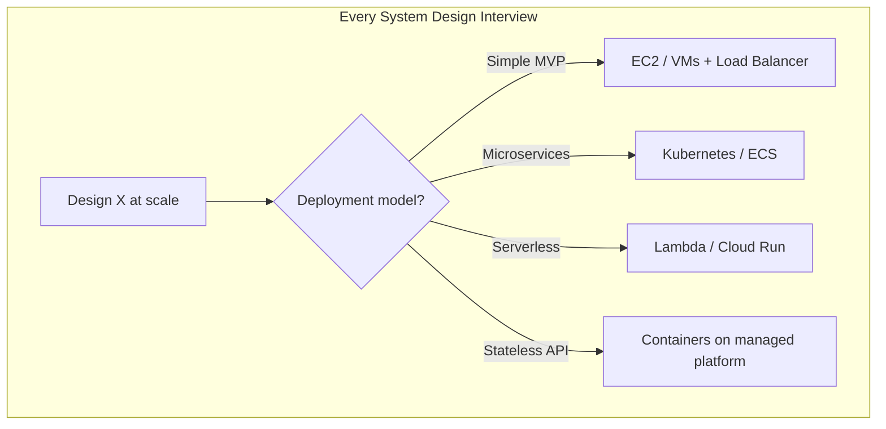
```mermaid
graph TB
    subgraph "Every System Design Interview"
        Q[Design X at scale]
        Q --> D{Deployment model?}
        D -->|Simple MVP| VM[EC2 / VMs + Load Balancer]
        D -->|Microservices| K8S[Kubernetes / ECS]
        D -->|Serverless| LAMBDA[Lambda / Cloud Run]
        D -->|Stateless API| CONTAINER[Containers on managed platform]
    end
```

### What "Good" Looks Like in an Interview

| Level | What You Demonstrate |
|-------|---------------------|
| **Junior** | Says "we'd use Docker" without explaining why |
| **Mid** | Mentions containers for consistent deployment; knows Pods and Deployments |
| **Senior** | Explains rolling deploys, HPA, service discovery; knows when K8s is overkill |
| **Staff** | Articulates control plane vs data plane, failure modes, and when to skip K8s entirely |

### The Hello Interview Framework Applied to Infrastructure

In a 45-minute system design interview, infrastructure discussion typically occupies **5–10 minutes** near the end — after you've nailed functional requirements, API design, data model, and scaling strategy. Use this order:

```
1. Functional requirements + API
2. Data model + storage choice
3. High-level architecture (components + data flow)
4. Scaling (caching, sharding, load balancing)
5. Infrastructure / deployment (containers, K8s, cloud services)  ← HERE
6. Failure modes + monitoring
```

**Interview rule:** Don't lead with Kubernetes. Lead with the *problem* (scale microservices, zero-downtime deploys) and *then* mention K8s if it fits.

---

## 2. Docker Container Internals — Deep Dive

### 2.1 What a Container Actually Is

A container is **not a lightweight VM**. It is a **process** (or group of processes) running on the host kernel with **isolated views** of system resources, enforced by Linux kernel features.

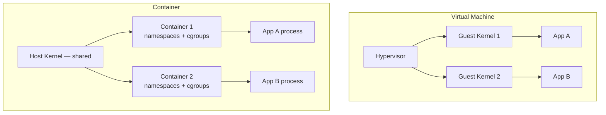
```mermaid
graph TB
    subgraph "Virtual Machine"
        VM_H[Hypervisor]
        VM_H --> VM_K1[Guest Kernel 1]
        VM_H --> VM_K2[Guest Kernel 2]
        VM_K1 --> VM_A1[App A]
        VM_K2 --> VM_A2[App B]
    end

    subgraph "Container"
        C_H[Host Kernel — shared]
        C_H --> C1[Container 1<br/>namespaces + cgroups]
        C_H --> C2[Container 2<br/>namespaces + cgroups]
        C1 --> CA1[App A process]
        C2 --> CA2[App B process]
    end
```

| Dimension | Virtual Machine | Container |
|-----------|----------------|-----------|
| **Isolation** | Hardware-level (hypervisor) | OS-level (namespaces + cgroups) |
| **Kernel** | Separate guest kernel per VM | Shared host kernel |
| **Boot time** | 30–60 seconds | Milliseconds |
| **Memory overhead** | GB (full OS) | MB (process only) |
| **Density** | 10–20 per host | 100–500 per host |
| **Security boundary** | Strong (hypervisor) | Weaker (shared kernel) |
| **Use when** | Multi-tenant isolation, legacy OS | Microservices, CI/CD, dev/prod parity |

**What to say in interviews:**

> "Containers share the host kernel — they're isolated processes, not mini-VMs. For multi-tenant SaaS where tenants can't share a kernel, I'd use VMs or gVisor/Kata containers. For our own microservices on trusted infrastructure, standard containers are fine."

### 2.2 Linux Namespaces — Isolation Mechanisms

Namespaces give each container its **own view** of a global resource. The container thinks it has its own PID 1, its own network stack, its own filesystem root.

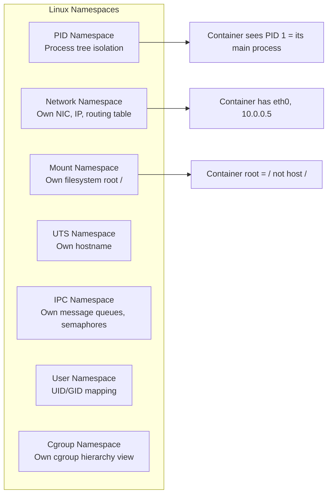
```mermaid
graph LR
    subgraph "Linux Namespaces"
        PID[PID Namespace<br/>Process tree isolation]
        NET[Network Namespace<br/>Own NIC, IP, routing table]
        MNT[Mount Namespace<br/>Own filesystem root /]
        UTS[UTS Namespace<br/>Own hostname]
        IPC[IPC Namespace<br/>Own message queues, semaphores]
        USER[User Namespace<br/>UID/GID mapping]
        CGROUP[Cgroup Namespace<br/>Own cgroup hierarchy view]
    end

    PID --> C1[Container sees PID 1 = its main process]
    NET --> C2[Container has eth0, 10.0.0.5]
    MNT --> C3[Container root = / not host /]
```

| Namespace | What It Isolates | Interview Example |
|-----------|-----------------|-------------------|
| **PID** | Process IDs | Container's PID 1 is the app, not systemd |
| **Network** | Network interfaces, IPs, ports, routing | Container binds port 8080 without conflicting with host |
| **Mount** | Filesystem mount points | Container sees `/` as its own rootfs |
| **UTS** | Hostname and domain name | Container hostname = `api-server-abc123` |
| **IPC** | Inter-process communication | Shared memory isolated between containers |
| **User** | UID/GID mappings | Container root (UID 0) maps to unprivileged host UID 1000 |
| **Cgroup** | Cgroup root directory | Container sees only its own cgroup subtree |

**How Docker creates a container (simplified):**

```
1. Create namespaces (clone() syscall with CLONE_NEW* flags)
2. Set up cgroup limits (CPU, memory, I/O)
3. pivot_root or chroot into container filesystem
4. exec the container entrypoint as PID 1
5. Configure network namespace (veth pair to bridge)
```

### 2.3 cgroups — Resource Limits & Accounting

**Control groups (cgroups)** limit and account for resource usage. Without cgroups, one container could consume all host CPU/RAM and starve others.

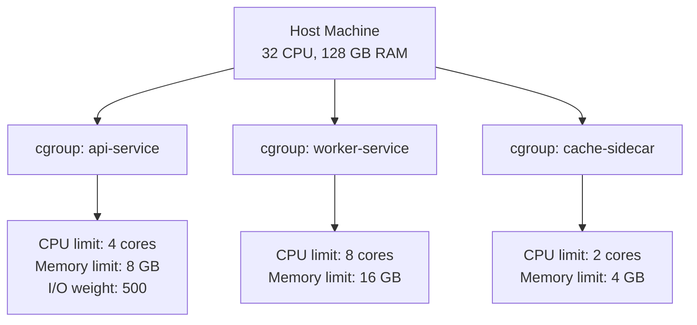
```mermaid
graph TB
    HOST[Host Machine<br/>32 CPU, 128 GB RAM]

    HOST --> CG1[cgroup: api-service]
    HOST --> CG2[cgroup: worker-service]
    HOST --> CG3[cgroup: cache-sidecar]

    CG1 --> L1[CPU limit: 4 cores<br/>Memory limit: 8 GB<br/>I/O weight: 500]
    CG2 --> L2[CPU limit: 8 cores<br/>Memory limit: 16 GB]
    CG3 --> L3[CPU limit: 2 cores<br/>Memory limit: 4 GB]
```

| cgroup v2 Controller | What It Controls | K8s Mapping |
|---------------------|-----------------|-------------|
| **cpu** | CPU time (CFS scheduler shares) | `resources.requests.cpu`, `resources.limits.cpu` |
| **memory** | RAM + swap limits | `resources.requests.memory`, `resources.limits.memory` |
| **io** | Disk I/O bandwidth | `resources.limits.ephemeral-storage` |
| **pids** | Max number of processes | Prevents fork bombs |
| **cpuset** | Pin to specific CPU cores | `resources.limits.cpu` with pinning |

**Critical interview behavior — OOM Kill:**

```
Container exceeds memory limit
  → Linux OOM killer terminates the process inside the cgroup
  → Kubernetes sees container exit → restarts pod (if restartPolicy: Always)
  → If no limit set → container can consume all host RAM → kills OTHER containers
```

**What to say:**

> "Always set memory requests and limits. Without limits, a memory leak in one service can OOM-kill unrelated pods on the same node. Requests guarantee scheduling; limits enforce the cgroup ceiling."

### 2.4 Container Image Layers — How Images Work

A Docker/OCI image is a **stack of read-only layers** plus a **writable container layer** on top.

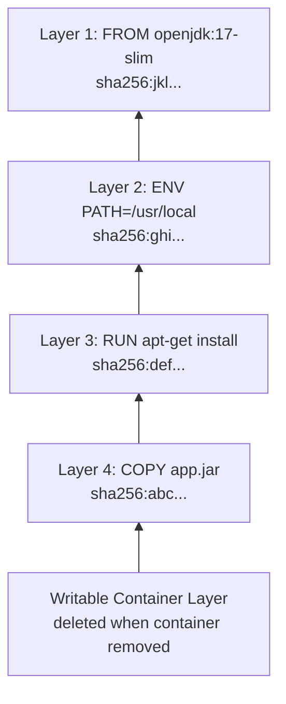
```mermaid
graph BT
    W[Writable Container Layer<br/>deleted when container removed]
    L4[Layer 4: COPY app.jar<br/>sha256:abc...]
    L3[Layer 3: RUN apt-get install<br/>sha256:def...]
    L2[Layer 2: ENV PATH=/usr/local<br/>sha256:ghi...]
    L1[Layer 1: FROM openjdk:17-slim<br/>sha256:jkl...]

    W --> L4 --> L3 --> L2 --> L1
```

| Concept | Description | Interview Impact |
|---------|-------------|-----------------|
| **Layer** | Filesystem diff from previous step | Cached on build — order Dockerfile for cache hits |
| **Union filesystem** | OverlayFS merges layers into single view | Copy-on-write: reading is fast, writing copies layer |
| **Image digest** | SHA256 hash of all layers | Immutable — `myapp:v2` tag can be moved; digest cannot |
| **Container layer** | Thin writable layer on top | All writes go here; discarded on `docker rm` |
| **Layer sharing** | Same base image layers shared across containers | 10 containers from `node:20-alpine` share base layers on disk |

**Dockerfile layer optimization (mention in interviews):**

```dockerfile
# BAD — any code change invalidates dependency cache
COPY . /app
RUN npm install

# GOOD — dependencies cached unless package.json changes
COPY package.json package-lock.json /app/
RUN npm ci --production
COPY . /app
```

### 2.5 Container Runtime Interface (CRI)

Kubernetes does not run containers directly. It talks to a **container runtime** via the CRI API.

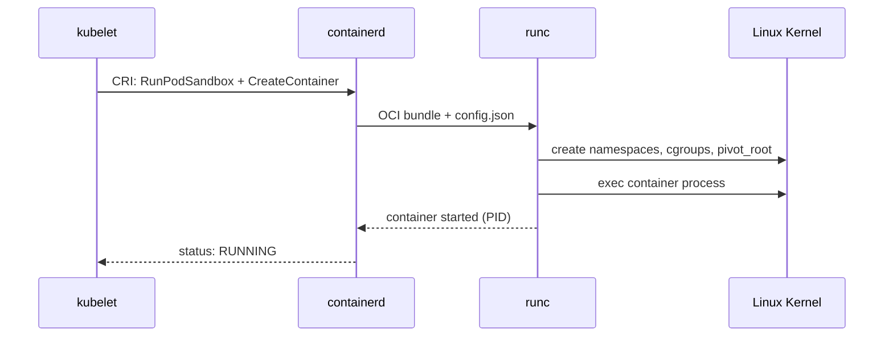
```mermaid
sequenceDiagram
    participant K as kubelet
    participant C as containerd
    participant R as runc
    participant KRN as Linux Kernel

    K->>C: CRI: RunPodSandbox + CreateContainer
    C->>R: OCI bundle + config.json
    R->>KRN: create namespaces, cgroups, pivot_root
    R->>KRN: exec container process
    R-->>C: container started (PID)
    C-->>K: status: RUNNING
```

| Runtime | Role | Used By |
|---------|------|---------|
| **containerd** | High-level runtime; image pull, storage, networking | Default in most K8s distros |
| **CRI-O** | Lightweight CRI implementation | OpenShift, some bare-metal |
| **runc** | Low-level OCI runtime; actually creates container | Called by containerd/CRI-O |
| **gVisor (runsc)** | User-space kernel for stronger isolation | Multi-tenant, untrusted workloads |
| **Kata Containers** | Lightweight VM per container | Strong isolation, compliance |

### 2.6 Container Networking Basics

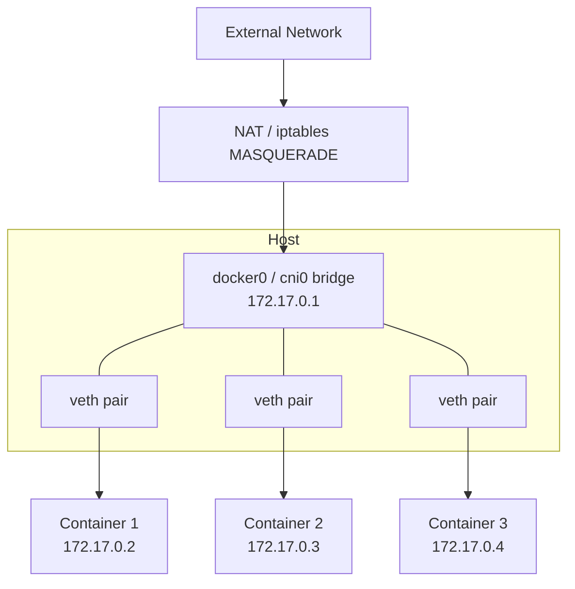
```mermaid
graph TB
    subgraph "Host"
        BR[docker0 / cni0 bridge<br/>172.17.0.1]
        VETH1[veth pair]
        VETH2[veth pair]
        VETH3[veth pair]
    end

    BR --- VETH1
    BR --- VETH2
    BR --- VETH3

    VETH1 --> C1[Container 1<br/>172.17.0.2]
    VETH2 --> C2[Container 2<br/>172.17.0.3]
    VETH3 --> C3[Container 3<br/>172.17.0.4]

    EXT[External Network] --> NAT[NAT / iptables MASQUERADE]
    NAT --> BR
```

| Pattern | How It Works | K8s Equivalent |
|---------|-------------|----------------|
| **Bridge** | Containers on virtual bridge; NAT for outbound | CNI bridge plugin (kind, minikube) |
| **Host network** | Container uses host's network namespace directly | `hostNetwork: true` (DaemonSets, CNI) |
| **Overlay (VXLAN)** | Encapsulated packets across nodes | Flannel, Calico VXLAN, Cilium |
| **eBPF routing** | Kernel-level packet routing without iptables | Cilium |

---

## 3. Kubernetes Architecture — Control Plane & Workers

### 3.1 High-Level Cluster Architecture

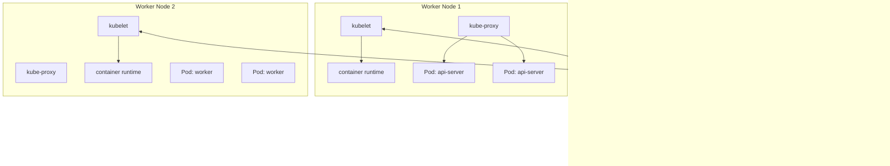
```mermaid
graph TB
    subgraph "Control Plane — manages cluster state"
        API[API Server<br/>REST API gateway]
        ETCD[(etcd<br/>cluster state store)]
        SCHED[Scheduler<br/>assigns pods to nodes]
        CM[Controller Manager<br/>reconciliation loops]
        CCM[Cloud Controller Manager<br/>cloud LB, volumes]
    end

    subgraph "Worker Node 1"
        K1[kubelet]
        KP1[kube-proxy]
        RT1[container runtime]
        P1[Pod: api-server]
        P2[Pod: api-server]
    end

    subgraph "Worker Node 2"
        K2[kubelet]
        KP2[kube-proxy]
        RT2[container runtime]
        P3[Pod: worker]
        P4[Pod: worker]
    end

    API <--> ETCD
    SCHED --> API
    CM --> API
    CCM --> API

    K1 <--> API
    K2 <--> API
    K1 --> RT1
    K2 --> RT2
    KP1 --> P1
    KP1 --> P2
```

### 3.2 Control Plane Components — Deep Dive

#### API Server

The **single entry point** for all cluster operations. Every `kubectl` command, controller action, and kubelet sync goes through the API server.

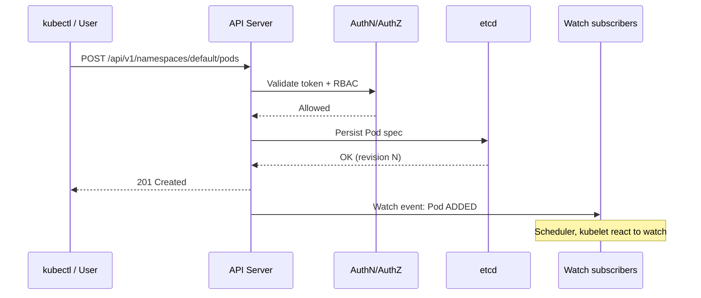
```mermaid
sequenceDiagram
    participant U as kubectl / User
    participant API as API Server
    participant AUTH as AuthN/AuthZ
    participant ETCD as etcd
    participant W as Watch subscribers

    U->>API: POST /api/v1/namespaces/default/pods
    API->>AUTH: Validate token + RBAC
    AUTH-->>API: Allowed
    API->>ETCD: Persist Pod spec
    ETCD-->>API: OK (revision N)
    API-->>U: 201 Created
    API->>W: Watch event: Pod ADDED
    Note over W: Scheduler, kubelet react to watch
```

| Property | Detail |
|----------|--------|
| **Protocol** | REST over HTTPS |
| **Stateless** | All state in etcd |
| **Watch API** | Long-polling stream of resource changes — how controllers work |
| **Admission controllers** | Mutating (inject sidecar) and Validating (policy enforcement) webhooks |
| **Scale limit** | ~5,000 nodes per cluster (practical); API server is often the bottleneck |

#### etcd — The Source of Truth

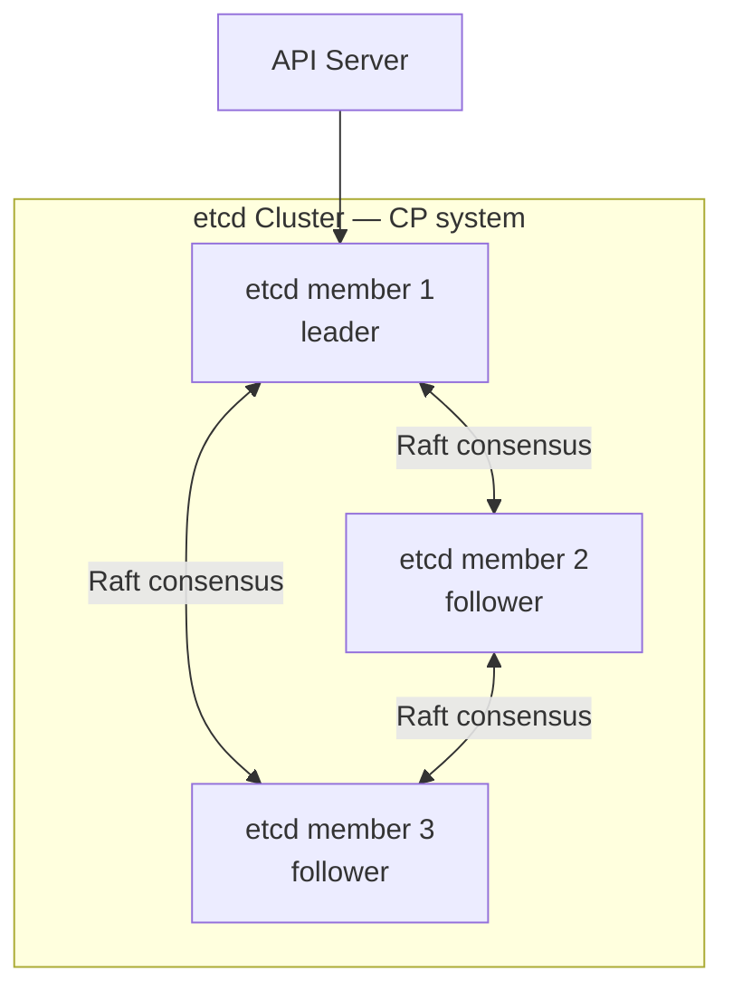
```mermaid
graph TB
    subgraph "etcd Cluster — CP system"
        E1[etcd member 1<br/>leader]
        E2[etcd member 2<br/>follower]
        E3[etcd member 3<br/>follower]
    end

    E1 <-->|Raft consensus| E2
    E1 <-->|Raft consensus| E3
    E2 <-->|Raft consensus| E3

    API[API Server] --> E1
```

| Property | Detail | Interview Note |
|----------|--------|----------------|
| **Consistency** | CP — linearizable via Raft | Sacrifices availability during partition to prevent split-brain |
| **Data** | All K8s objects (Pods, Services, ConfigMaps, etc.) | Not your application data |
| **Quorum** | N=3 members, need 2 for writes | Never run even-numbered etcd clusters |
| **Performance** | Latency-sensitive — SSD required | etcd slowness → entire cluster slowness |
| **Backup** | Snapshot etcd for disaster recovery | Critical for cluster restore |

**What to say:**

> "etcd is a CP store — it uses Raft consensus. If etcd loses quorum, the control plane can't accept writes. That's why production clusters run 3 or 5 etcd members across failure domains."

#### Scheduler

Assigns **pending Pods** to **Nodes** based on constraints and optimization.

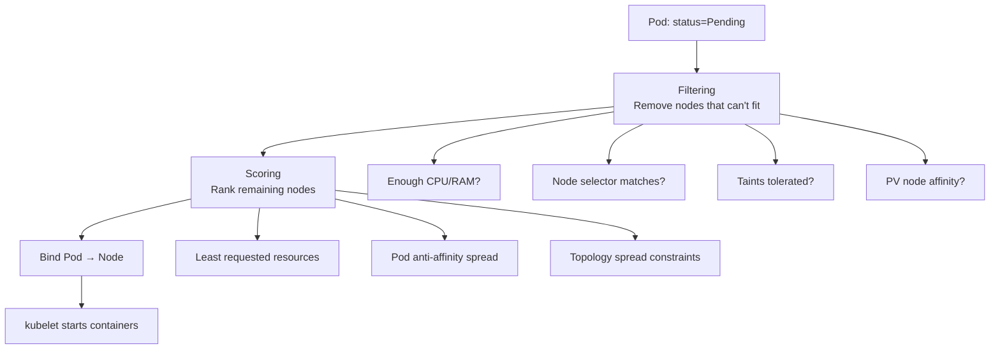
```mermaid
flowchart TB
    PENDING[Pod: status=Pending] --> FILTER[Filtering<br/>Remove nodes that can't fit]
    FILTER --> SCORE[Scoring<br/>Rank remaining nodes]
    SCORE --> BIND[Bind Pod → Node]
    BIND --> KUBELET[kubelet starts containers]

    FILTER --> F1[Enough CPU/RAM?]
    FILTER --> F2[Node selector matches?]
    FILTER --> F3[Taints tolerated?]
    FILTER --> F4[PV node affinity?]

    SCORE --> S1[Least requested resources]
    SCORE --> S2[Pod anti-affinity spread]
    SCORE --> S3[Topology spread constraints]
```

| Scheduling Concept | What It Does |
|-------------------|-------------|
| **Requests vs Limits** | Scheduler uses *requests* for placement; limits enforced at runtime |
| **Node selector** | `nodeSelector: {disktype: ssd}` — hard requirement |
| **Taints & Tolerations** | Node repels pods unless pod has matching toleration |
| **Affinity / Anti-affinity** | Co-locate or spread pods (e.g., one per AZ) |
| **Topology spread** | Distribute pods across zones evenly |
| **Priority classes** | Preemption — high-priority pod evicts low-priority pod |

#### Controller Manager

Runs **reconciliation loops** — watch desired state vs actual state, take action to converge.

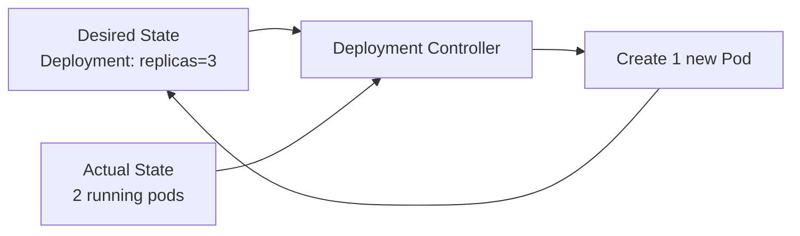
```mermaid
graph LR
    DESIRED[Desired State<br/>Deployment: replicas=3] --> CTRL[Deployment Controller]
    ACTUAL[Actual State<br/>2 running pods] --> CTRL
    CTRL --> ACTION[Create 1 new Pod]
    ACTION --> DESIRED
```

| Controller | Watches | Action |
|-----------|---------|--------|
| **Deployment** | Deployment → ReplicaSet → Pods | Rolling update, rollback |
| **ReplicaSet** | ReplicaSet → Pods | Maintain pod count |
| **StatefulSet** | StatefulSet → Pods | Ordered create/delete, stable identity |
| **DaemonSet** | DaemonSet → Pods | One pod per matching node |
| **Job / CronJob** | Job → Pods | Run-to-completion, scheduled |
| **Node** | Node objects | Mark NotReady on missed heartbeats |
| **EndpointSlice** | Service + Pods | Update backend endpoints |
| **Namespace** | Namespace deletion | Cascade delete all resources |

### 3.3 Worker Node Components

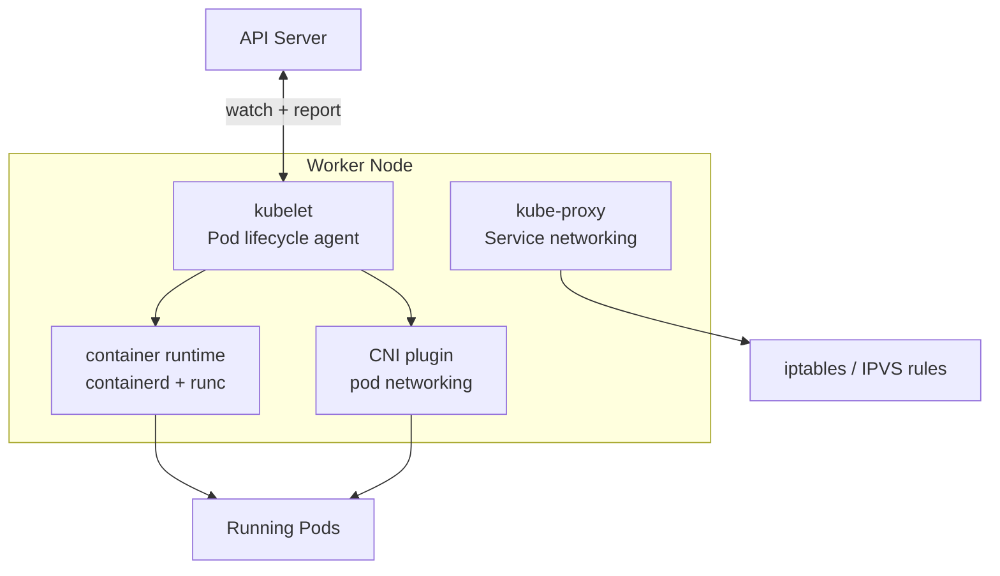
```mermaid
graph TB
    subgraph "Worker Node"
        KUBELET[kubelet<br/>Pod lifecycle agent]
        PROXY[kube-proxy<br/>Service networking]
        RUNTIME[container runtime<br/>containerd + runc]
        CNI[CNI plugin<br/>pod networking]
    end

    API[API Server] <-->|watch + report| KUBELET
    KUBELET --> RUNTIME
    KUBELET --> CNI
    PROXY --> IPT[iptables / IPVS rules]
    RUNTIME --> PODS[Running Pods]
    CNI --> PODS
```

#### kubelet

| Responsibility | Detail |
|---------------|--------|
| **Pod lifecycle** | Pull images, start/stop containers, run probes |
| **Node registration** | Heartbeat to API server every ~10s |
| **Resource reporting** | Node capacity, allocatable resources, pod status |
| **Volume mounting** | Attach/detach PVs, mount into pod filesystem |
| **Probes** | Liveness (restart), Readiness (traffic), Startup (slow apps) |
| **CRI calls** | CreateContainer, StartContainer, StopContainer |

#### kube-proxy — Service Networking

Implements the **Service** abstraction by programming network rules on each node.

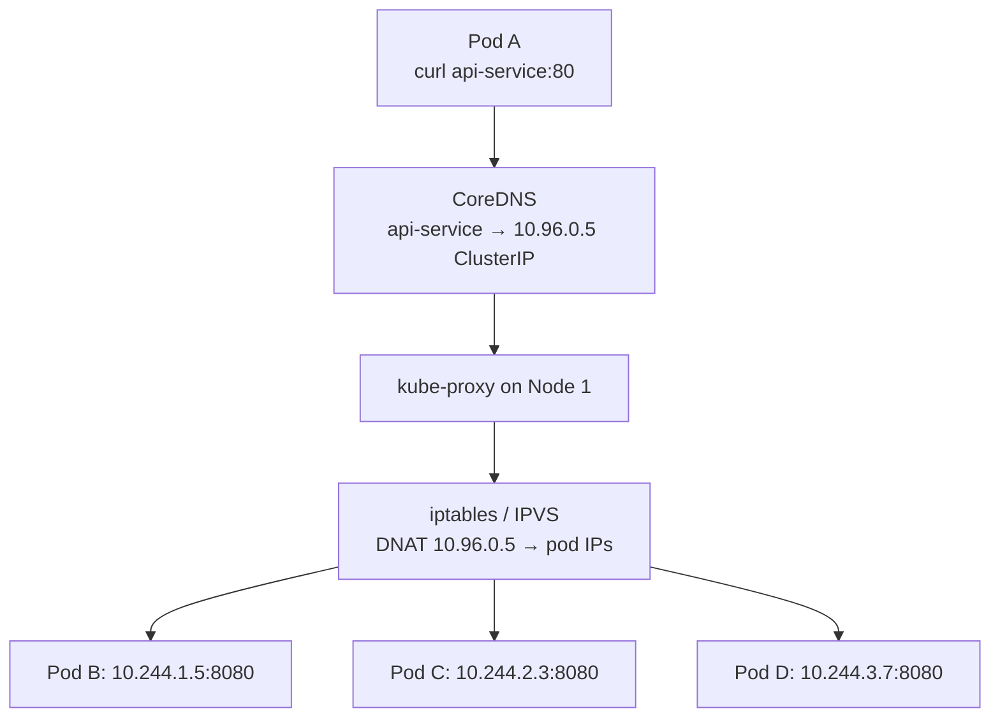
```mermaid
graph TB
    CLIENT[Pod A<br/>curl api-service:80] --> DNS[CoreDNS<br/>api-service → 10.96.0.5 ClusterIP]
    DNS --> PROXY[kube-proxy on Node 1]
    PROXY --> RULES[iptables / IPVS<br/>DNAT 10.96.0.5 → pod IPs]
    RULES --> P1[Pod B: 10.244.1.5:8080]
    RULES --> P2[Pod C: 10.244.2.3:8080]
    RULES --> P3[Pod D: 10.244.3.7:8080]
```

| Mode | How It Works | Trade-off |
|------|-------------|-----------|
| **iptables** (default) | Random DNAT to backend pod | O(n) rules per service; slow at 5,000+ services |
| **IPVS** | Kernel load balancer with hash tables | Better performance at scale |
| **eBPF (Cilium)** | Bypass kube-proxy entirely | Best performance; requires Cilium CNI |

### 3.4 Kubernetes Object Model

Everything in Kubernetes is an **API resource** with `metadata`, `spec` (desired), and `status` (actual).

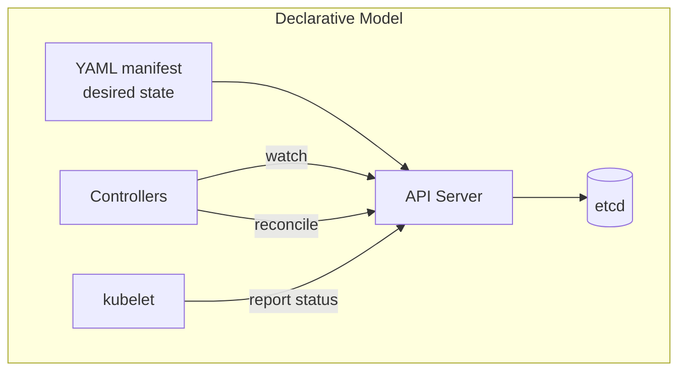
```mermaid
graph TB
    subgraph "Declarative Model"
        YAML[YAML manifest<br/>desired state] --> API[API Server]
        API --> ETCD[(etcd)]
        CTRL[Controllers] -->|watch| API
        CTRL -->|reconcile| API
        KUBELET[kubelet] -->|report status| API
    end
```

| Principle | Interview Phrasing |
|-----------|-------------------|
| **Declarative** | "I describe what I want (3 replicas), not how to create them" |
| **Idempotent** | "Applying the same YAML twice has no extra effect" |
| **Level-triggered** | "Controllers continuously reconcile, not just on change" |
| **Eventually consistent** | "Pod may take seconds to schedule and start" |

---

## 4. Core Kubernetes Objects

### 4.1 Pods — The Atomic Unit

A **Pod** is the smallest deployable unit — one or more containers sharing network and storage namespaces.

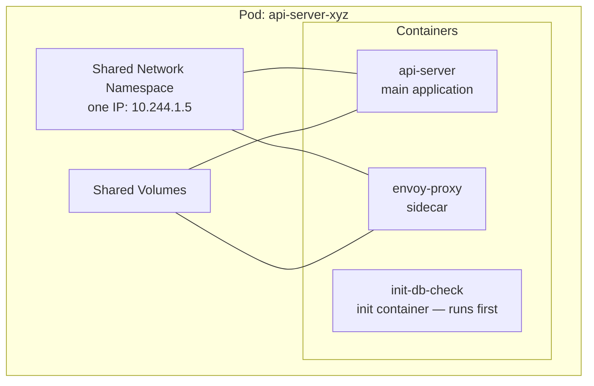
```mermaid
graph TB
    subgraph "Pod: api-server-xyz"
        NET[Shared Network Namespace<br/>one IP: 10.244.1.5]
        VOL[Shared Volumes]

        subgraph "Containers"
            MAIN[api-server<br/>main application]
            SIDE[envoy-proxy<br/>sidecar]
            INIT[init-db-check<br/>init container — runs first]
        end

        NET --- MAIN
        NET --- SIDE
        VOL --- MAIN
        VOL --- SIDE
    end
```

| Pod Pattern | Use Case | Example |
|------------|----------|---------|
| **Single container** | Standard microservice | `api-server` |
| **Sidecar** | Proxy, logging, config sync | Envoy + app, Fluentd log shipper |
| **Init container** | Pre-flight checks before main starts | Wait for DB, download config |
| **Ambassador** | Proxy to external service | Local Redis proxy |
| **Adapter** | Normalize output | Prometheus metrics adapter |

**Pod lifecycle states:**

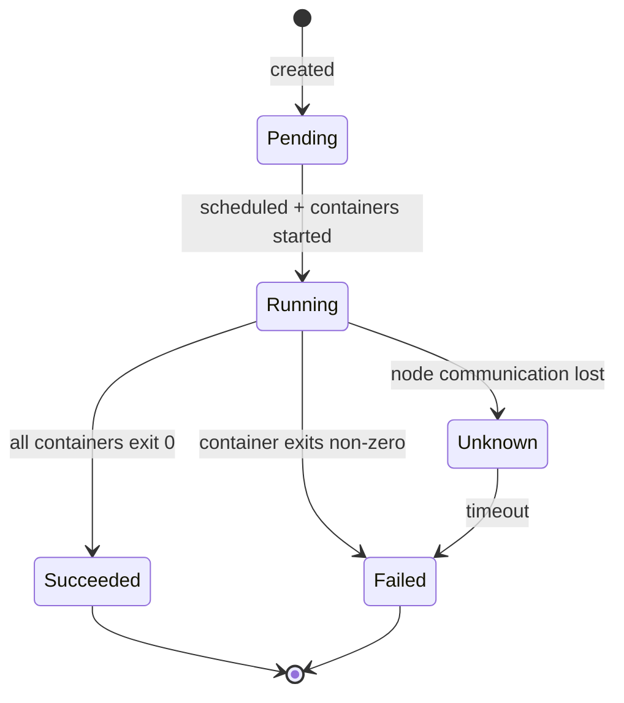
```mermaid
stateDiagram-v2
    [*] --> Pending: created
    Pending --> Running: scheduled + containers started
    Running --> Succeeded: all containers exit 0
    Running --> Failed: container exits non-zero
    Running --> Unknown: node communication lost
    Succeeded --> [*]
    Failed --> [*]
    Unknown --> Failed: timeout
```

| Phase | Meaning |
|-------|---------|
| **Pending** | Accepted but not yet running (scheduling, image pull) |
| **Running** | At least one container is running |
| **Succeeded** | All containers terminated successfully (Jobs) |
| **Failed** | At least one container failed |
| **Unknown** | Node not reporting status |

### 4.2 ReplicaSets — Maintaining Pod Count

A **ReplicaSet** ensures a specified number of pod replicas are running at all times.

```yaml
apiVersion: apps/v1
kind: ReplicaSet
metadata:
  name: api-server-rs
spec:
  replicas: 3
  selector:
    matchLabels:
      app: api-server
  template:
    metadata:
      labels:
        app: api-server
    spec:
      containers:
      - name: api
        image: api-server:v2.1
```

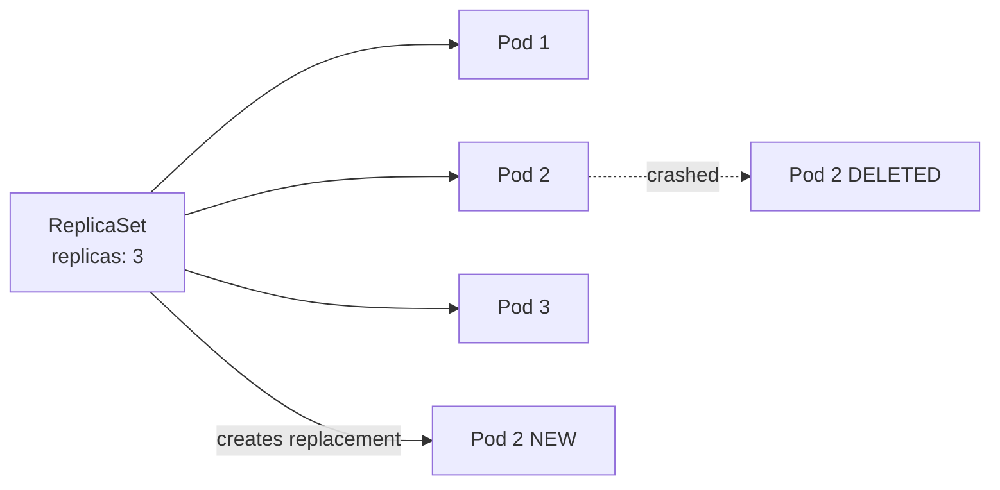
```mermaid
graph LR
    RS[ReplicaSet<br/>replicas: 3] --> P1[Pod 1]
    RS --> P2[Pod 2]
    RS --> P3[Pod 3]
    P2 -.->|crashed| X[Pod 2 DELETED]
    RS -->|creates replacement| P4[Pod 2 NEW]
```

**Interview note:** You rarely create ReplicaSets directly. Deployments manage them.

### 4.3 Deployments — Declarative Rolling Updates

A **Deployment** manages ReplicaSets and enables **rolling updates** and **rollbacks**.

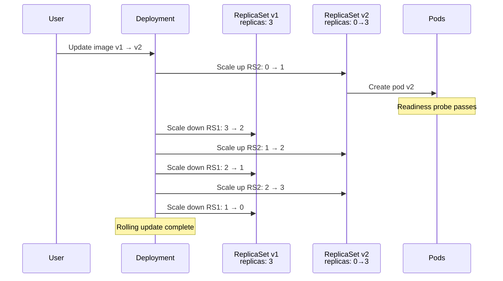
```mermaid
sequenceDiagram
    participant U as User
    participant D as Deployment
    participant RS1 as ReplicaSet v1<br/>replicas: 3
    participant RS2 as ReplicaSet v2<br/>replicas: 0→3
    participant P as Pods

    U->>D: Update image v1 → v2
    D->>RS2: Scale up RS2: 0 → 1
    RS2->>P: Create pod v2
    Note over P: Readiness probe passes
    D->>RS1: Scale down RS1: 3 → 2
    D->>RS2: Scale up RS2: 1 → 2
    D->>RS1: Scale down RS1: 2 → 1
    D->>RS2: Scale up RS2: 2 → 3
    D->>RS1: Scale down RS1: 1 → 0
    Note over D: Rolling update complete
```

| Deployment Strategy | Behavior | Use When |
|--------------------|----------|----------|
| **RollingUpdate** (default) | Gradually replace old pods | Zero-downtime deploys |
| **Recreate** | Kill all old, then create new | Can't run two versions simultaneously |
| **maxUnavailable: 0** | Never reduce below desired count | Strict availability |
| **maxSurge: 1** | Create 1 extra pod during update | Controlled rollout speed |

**Rollback:**

```
kubectl rollout undo deployment/api-server
  → Deployment scales up previous ReplicaSet
  → Scales down current ReplicaSet
  → Typically < 30 seconds to rollback
```

### 4.4 Services — Stable Network Endpoint

Pods are ephemeral — they die and get new IPs. **Services** provide a stable virtual IP (ClusterIP) and DNS name.

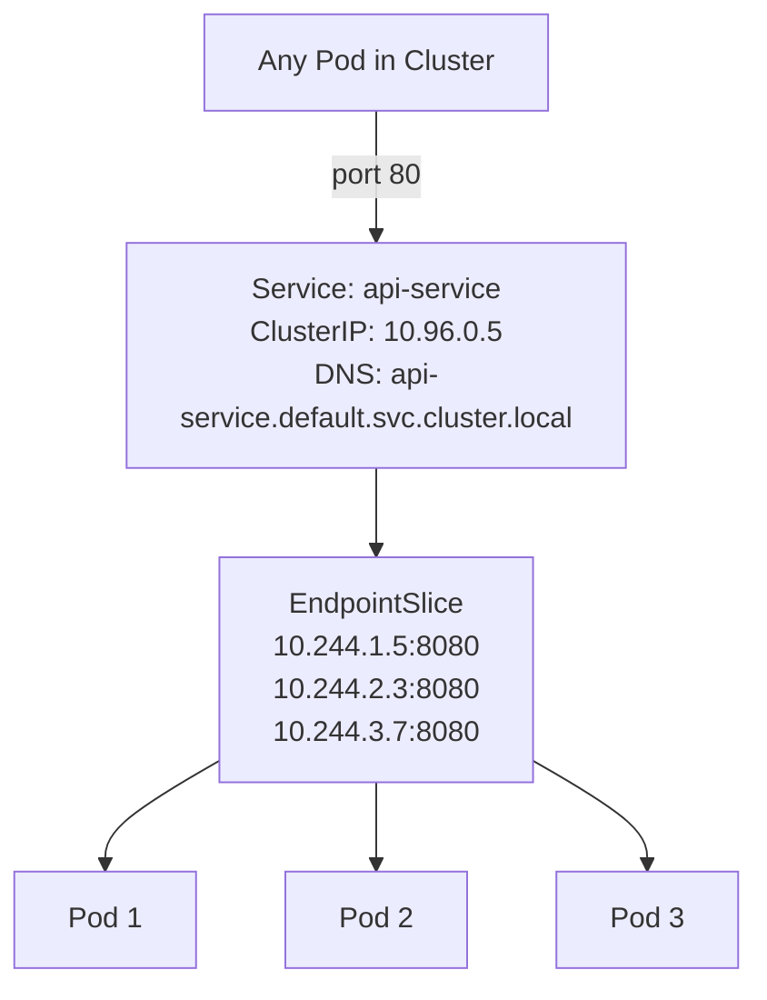
```mermaid
graph TB
    SVC[Service: api-service<br/>ClusterIP: 10.96.0.5<br/>DNS: api-service.default.svc.cluster.local]

    SVC --> EP[EndpointSlice<br/>10.244.1.5:8080<br/>10.244.2.3:8080<br/>10.244.3.7:8080]

    EP --> P1[Pod 1]
    EP --> P2[Pod 2]
    EP --> P3[Pod 3]

    CLIENT[Any Pod in Cluster] -->|port 80| SVC
```

### 4.5 Service Types — ClusterIP, NodePort, LoadBalancer

```mermaid
graph TB
    subgraph "ClusterIP — internal only"
        CIP[ClusterIP 10.96.0.5:80]
        CIP --> CP1[Pod]
        CIP --> CP2[Pod]
        INT[Internal client] --> CIP
    end

    subgraph "NodePort — expose on every node"
        NP[NodePort 30080<br/>on ALL nodes]
        NP --> CIP2[ClusterIP]
        CIP2 --> NP1[Pod]
        EXT1[External client] -->|node-ip:30080| NP
    end

    subgraph "LoadBalancer — cloud LB"
        LB[Cloud Load Balancer<br/>public IP]
        LB --> NP2[NodePort]
        NP2 --> CIP3[ClusterIP]
        CIP3 --> LP1[Pod]
        EXT2[Internet] --> LB
    end
```

| Type | Reachable From | Port | Use Case |
|------|---------------|------|----------|
| **ClusterIP** | Inside cluster only | Virtual IP (e.g., 10.96.0.5) | Service-to-service communication (default) |
| **NodePort** | External via `<NodeIP>:<30000-32767>` | Static high port on every node | Dev/test, bare-metal without cloud LB |
| **LoadBalancer** | External via cloud LB public IP/DNS | Cloud-assigned (80, 443) | Production external traffic (creates cloud LB) |
| **ExternalName** | DNS CNAME to external service | N/A | Map `redis.default` → `redis.amazonaws.com` |
| **Headless** (`clusterIP: None`) | Direct pod DNS records | Per-pod A records | StatefulSet peer discovery |

**Traffic flow for LoadBalancer Service:**

```mermaid
sequenceDiagram
    participant C as Client
    participant LB as Cloud LB<br/>AWS NLB / GCP LB
    participant NP as NodePort 30080
    participant KP as kube-proxy
    participant P as Pod 10.244.1.5:8080

    C->>LB: HTTPS api.example.com:443
    LB->>NP: TCP node-1:30080
    NP->>KP: DNAT via iptables
    KP->>P: Forward to pod IP:8080
    P-->>C: Response
```

### 4.6 StatefulSets — Stable Identity

For stateful workloads needing **stable network identity** and **persistent storage**.

```mermaid
graph LR
    SS[StatefulSet: cassandra]

    SS --> P0[cassandra-0<br/>PVC: data-cassandra-0<br/>DNS: cassandra-0.cassandra]
    SS --> P1[cassandra-1<br/>PVC: data-cassandra-1<br/>DNS: cassandra-1.cassandra]
    SS --> P2[cassandra-2<br/>PVC: data-cassandra-2<br/>DNS: cassandra-2.cassandra]
```

| Feature | Deployment | StatefulSet |
|---------|-----------|-------------|
| **Pod name** | Random hash suffix | Ordinal: `app-0`, `app-1`, `app-2` |
| **DNS** | Shared service endpoint | Per-pod: `app-0.service.namespace` |
| **Storage** | Shared or ephemeral | Dedicated PVC per pod |
| **Scaling** | Parallel | Ordered (0 → 1 → 2) |
| **Use case** | Stateless APIs | Databases, Kafka, ZooKeeper |

### 4.7 DaemonSets — One Pod Per Node

```mermaid
graph TB
    DS[DaemonSet: fluentd]

    DS --> N1[Node 1 → fluentd pod]
    DS --> N2[Node 2 → fluentd pod]
    DS --> N3[Node 3 → fluentd pod]
```

**Use cases:** Log collectors (Fluentd), monitoring agents (Datadog), CNI plugins, node storage (GlusterFS).

### 4.8 Jobs & CronJobs — Batch Workloads

| Type | Behavior | Example |
|------|----------|---------|
| **Job** | Run pods to completion (N times) | Data migration, ML batch inference |
| **CronJob** | Schedule Jobs on cron expression | Nightly ETL, certificate rotation |

---

## 5. Networking: Services, Ingress & Service Discovery

### 5.1 Kubernetes DNS — Service Discovery

```mermaid
graph TB
    POD[Pod: frontend-abc] --> DNS[CoreDNS<br/>10.96.0.10]

    DNS -->|api-service.default.svc.cluster.local| SVC[Service ClusterIP]
    DNS -->|postgres-0.postgres.default.svc.cluster.local| STS[StatefulSet Pod IP]
    DNS -->|s3.amazonaws.com| EXT[External DNS<br/>upstream resolver]
```

| DNS Pattern | Resolves To |
|------------|-------------|
| `<service>` | Service in same namespace |
| `<service>.<namespace>` | Service in specified namespace |
| `<service>.<namespace>.svc.cluster.local` | Fully qualified |
| `<pod-ip>.<namespace>.pod.cluster.local` | Pod IP (optional) |
| `<statefulset>-<N>.<headless-svc>` | Specific StatefulSet pod |

**What to say in system design:**

> "Services discover each other via DNS — `payment-service` resolves to a ClusterIP that load-balances across healthy pods. No hardcoded IPs. If I need external service discovery across clusters, I'd add a service mesh like Istio or use an external registry."

### 5.2 Ingress Controllers — HTTP Routing

**Ingress** provides HTTP/HTTPS routing from outside the cluster to Services.

```mermaid
graph TB
    CLIENT[Client] --> LB[Cloud LB / Ingress Controller<br/>NGINX, Traefik, AWS ALB]

    LB -->|host: api.example.com/path/users| SVC1[Service: user-service:80]
    LB -->|host: api.example.com/path/orders| SVC2[Service: order-service:80]
    LB -->|host: static.example.com| SVC3[Service: static-service:80]

    SVC1 --> P1[User Pods]
    SVC2 --> P2[Order Pods]
    SVC3 --> P3[Static Pods]
```

| Feature | Ingress | API Gateway |
|---------|---------|-------------|
| **Layer** | L7 HTTP routing | L7 + auth + rate limiting + transformation |
| **TLS termination** | Yes | Yes |
| **Path/host routing** | Yes | Yes |
| **Auth** | Basic (annotations) | Full (OAuth, API keys, JWT) |
| **Rate limiting** | Via annotations / plugins | Built-in |
| **Examples** | NGINX Ingress, ALB Ingress | Kong, AWS API Gateway, Envoy |

**Ingress vs LoadBalancer Service:**

```
LoadBalancer Service:  1 Service → 1 cloud LB (expensive at scale)
Ingress:               N Services → 1 Ingress Controller → 1 cloud LB
```

### 5.3 Network Policies — Pod-Level Firewall

```mermaid
graph LR
    FE[frontend pods] -->|allowed port 8080| API[api pods]
    API -->|allowed port 5432| DB[postgres pods]
    HACK[compromised pod] -.->|DENIED| DB
```

| Without NetworkPolicy | With NetworkPolicy |
|----------------------|-------------------|
| All pods can talk to all pods | Default deny; explicit allow rules |
| Lateral movement easy after breach | Blast radius contained |

### 5.4 Full Request Path — End to End

```mermaid
sequenceDiagram
    participant U as User
    participant CDN as CDN / WAF
    participant IG as Ingress Controller
    participant SVC as Service ClusterIP
    participant KP as kube-proxy
    participant P as Pod
    participant DB as RDS via ExternalName

    U->>CDN: GET /api/feed
    CDN->>IG: Cache miss → origin
    IG->>SVC: Route to feed-service:80
    SVC->>KP: DNAT to pod IP
    KP->>P: HTTP request
    P->>DB: Query via external endpoint
    DB-->>P: Rows
    P-->>U: JSON response
```

---

## 6. Autoscaling: HPA, VPA & Cluster Autoscaler

### 6.1 Horizontal Pod Autoscaler (HPA)

Scales **number of pods** based on observed metrics.

```mermaid
graph LR
    METRICS[Metrics Server<br/>CPU, memory, custom] --> HPA[HPA Controller]
    HPA -->|desired replicas| DEP[Deployment]
    DEP --> PODS[Pod count<br/>3 → 7]
```

```yaml
apiVersion: autoscaling/v2
kind: HorizontalPodAutoscaler
metadata:
  name: api-server-hpa
spec:
  scaleTargetRef:
    apiVersion: apps/v1
    kind: Deployment
    name: api-server
  minReplicas: 3
  maxReplicas: 50
  metrics:
  - type: Resource
    resource:
      name: cpu
      target:
        type: Utilization
        averageUtilization: 70
  - type: Pods
    pods:
      metric:
        name: http_requests_per_second
      target:
        type: AverageValue
        averageValue: "1000"
```

| HPA Metric Type | Source | Use When |
|----------------|--------|----------|
| **CPU utilization** | metrics-server | General compute-bound workloads |
| **Memory utilization** | metrics-server | Memory-bound (use carefully — laggy) |
| **Custom metrics** | Prometheus adapter | RPS, queue depth, latency |
| **External metrics** | CloudWatch, Pub/Sub | SQS queue length, Kafka lag |

**HPA scaling math (know this):**

```
desiredReplicas = ceil(currentReplicas × (currentMetric / targetMetric))

Example:
  currentReplicas = 4
  currentCPU = 85%
  targetCPU = 70%
  desiredReplicas = ceil(4 × (85/70)) = ceil(4.86) = 5
```

**HPA behavior flags (mention for senior interviews):**

| Flag | Default | Purpose |
|------|---------|---------|
| **scale-up stabilization** | 0s | Wait before scaling up again |
| **scale-down stabilization** | 300s | Prevent flapping — wait 5 min before scale down |
| **scale-down percent** | 100% / 15s | Max pods to remove per period |

### 6.2 Vertical Pod Autoscaler (VPA)

Adjusts **CPU/memory requests and limits** on pods — not replica count.

```mermaid
graph TB
    VPA[VPA Recommender] -->|analyzes usage| REC[Recommendations<br/>CPU: 500m → 1200m<br/>Memory: 512Mi → 2Gi]
    REC --> MODE{Update Mode}
    MODE -->|Off| LOG[Log only — safe start]
    MODE -->|Initial| NEW[Apply on pod creation only]
    MODE -->|Auto| RESTART[Evict + recreate pods<br/>with new resources]
```

| HPA vs VPA | HPA | VPA |
|-----------|-----|-----|
| **Scales** | Pod count | Resource requests per pod |
| **Use for** | Stateless horizontal scale | Right-sizing over-provisioned pods |
| **Conflict** | Don't use both on same CPU/memory metrics | Use HPA on custom metrics + VPA on resources |
| **Downtime** | None (adds pods) | Auto mode evicts pods (brief disruption) |

### 6.3 Cluster Autoscaler

Adds/removes **nodes** when pods can't be scheduled (pending) or nodes are underutilized.

```mermaid
flowchart TB
    PENDING[Pod Pending<br/>insufficient CPU] --> CA[Cluster Autoscaler]
    CA -->|scale up| ASG[Auto Scaling Group<br/>add EC2 instance]
    ASG --> NODE[New Node joins cluster]
    NODE --> SCHED[Scheduler places pod]
    SCHED --> RUNNING[Pod Running]

    IDLE[Node < 50% util<br/>all pods fit elsewhere] --> CA2[Cluster Autoscaler]
    CA2 -->|drain + terminate| ASG2[Remove EC2 instance]
```

| Autoscaler | Scales | Trigger |
|-----------|--------|---------|
| **HPA** | Pods | CPU/RPS/custom metrics |
| **VPA** | Pod resource requests | Historical usage |
| **Cluster Autoscaler** | Nodes | Pending pods / underutilized nodes |

**What to say:**

> "HPA handles traffic spikes by adding pods. Cluster Autoscaler ensures nodes exist for those pods. Together they provide full elastic scaling — but I need to set resource requests accurately, or the scheduler can't make good decisions."

---

## 7. Configuration & Storage: ConfigMaps, Secrets, PVs

### 7.1 ConfigMaps — Non-Sensitive Configuration

```mermaid
graph LR
    CM[ConfigMap<br/>app-config] -->|volume mount| POD1[Pod 1<br/>/etc/config/app.yaml]
    CM -->|env var| POD2[Pod 2<br/>LOG_LEVEL=debug]
    CM -->|envFrom| POD3[Pod 3<br/>all keys as env vars]
```

| Injection Method | Behavior | Use When |
|-----------------|----------|----------|
| **Volume mount** | File appears in container filesystem; auto-updates | Config files (nginx.conf, app.yaml) |
| **Environment variable** | Set at pod creation; **not updated** on ConfigMap change | Simple key-value settings |
| **envFrom** | Import all keys as env vars | Many config values |

**Interview note:** ConfigMap volume mounts **do** update in place (kubelet syncs every ~60s). Env vars do **not** update — pod must restart.

### 7.2 Secrets — Sensitive Configuration

```mermaid
graph TB
    SEC[Secret<br/>db-credentials] -->|base64 encoded<br/>NOT encrypted by default| ETCD[(etcd)]
    SEC -->|volume mount| POD[Pod<br/>/etc/secrets/password]

    ESO[External Secrets Operator] -->|sync| SM[AWS Secrets Manager]
    SM --> SEC
```

| Aspect | ConfigMap | Secret |
|--------|-----------|--------|
| **Data type** | Plain text | Base64 encoded (not encrypted at rest by default) |
| **Size limit** | 1 MiB | 1 MiB |
| **etcd encryption** | Optional | Should enable `EncryptionConfiguration` |
| **Best practice** | App config | External secret store (Vault, AWS SM) + operator |

**What to say:**

> "Kubernetes Secrets are base64, not encrypted — I enable etcd encryption at rest and prefer External Secrets Operator pulling from AWS Secrets Manager. Secrets never go in container images or Git."

### 7.3 PersistentVolumes & PersistentVolumeClaims

```mermaid
graph LR
    PVC[PVC: data-postgres-0<br/>request: 100Gi, SSD] -->|bound| PV[PV: aws-ebs-vol-abc<br/>100Gi, gp3, us-east-1a]
    PV --> POD[Pod: postgres-0<br/>mount /var/lib/postgresql]
```

| Concept | Role |
|---------|------|
| **PersistentVolume (PV)** | Cluster-level storage resource (EBS, GCE PD, NFS) |
| **PersistentVolumeClaim (PVC)** | Pod's request for storage (size, access mode, class) |
| **StorageClass** | Dynamic provisioning template (`gp3`, `io2`, `standard`) |
| **Access Modes** | RWO (one node), ROX (many read), RWX (many read-write) |
| **Reclaim Policy** | Retain (keep data), Delete (destroy volume), Recycle |

**Storage in system design interviews:**

```
Stateful data (Postgres, Redis persistence) → Managed DB (RDS) preferred
                                             → K8s StatefulSet + PV only if self-managing

Ephemeral/cache data → emptyDir or memory
Static assets → S3 (not PV)
Shared files → EFS / GCS Filestore (RWX)
```

### 7.4 Volume Types Summary

| Volume | Lifetime | Use Case |
|--------|----------|----------|
| **emptyDir** | Pod lifetime | Temp files, cache, sidecar sharing |
| **hostPath** | Node lifetime | Dangerous — node-specific; DaemonSets only |
| **configMap / secret** | Pod lifetime | Configuration injection |
| **PVC** | Independent of pod | Databases, persistent state |
| **projected** | Pod lifetime | Combine multiple sources into one mount |

---

## 8. How Kubernetes Fits System Design

### 8.1 Microservices Deployment Architecture

```mermaid
graph TB
    subgraph "Kubernetes Cluster"
        IG[Ingress / API Gateway]

        IG --> US[user-service<br/>Deployment 3-20 pods<br/>HPA on RPS]
        IG --> FS[feed-service<br/>Deployment 5-50 pods<br/>HPA on CPU]
        IG --> MS[media-service<br/>Deployment 2-10 pods]

        US --> UDB[(RDS PostgreSQL<br/>users table)]
        FS --> REDIS[(ElastiCache Redis<br/>feed cache)]
        FS --> CASS[(Cassandra<br/>posts by user)]
        MS --> S3[(S3<br/>media objects)]

        US -.->|gRPC| FS
        FS -.->|async| KAFKA[Kafka<br/>post-created events]
    end

    CDN[CloudFront CDN] --> S3
    CLIENT[Mobile/Web Client] --> CDN
    CLIENT --> IG
```

### 8.2 What Kubernetes Solves vs What It Doesn't

```mermaid
graph TB
    subgraph "K8s Solves"
        K1[Deploy 50 microservices consistently]
        K2[Rolling updates + instant rollback]
        K3[Auto-heal crashed containers]
        K4[HPA for traffic spikes]
        K5[Service discovery via DNS]
        K6[Resource isolation via cgroups]
    end

    subgraph "K8s Does NOT Solve"
        N1[Database scaling / sharding]
        N2[Caching strategy]
        N3[Message queue design]
        N4[Data consistency / CAP]
        N5[CDN / edge caching]
        N6[Business logic]
    end
```

| Problem | K8s Contribution | You Still Design |
|---------|-----------------|-----------------|
| **Traffic spike** | HPA adds pods in seconds | Caching, CDN, rate limiting |
| **Service communication** | DNS + ClusterIP | API contracts, sync vs async |
| **Deployment** | Rolling update, canary via Argo | Feature flags, DB migrations |
| **Failure recovery** | Restart pod, reschedule to healthy node | Circuit breakers, retries, fallbacks |
| **Data durability** | PV for local state | RDS, S3, replication strategy |
| **Observability** | Container stdout, metrics endpoints | Logging pipeline, tracing, alerting |

### 8.3 Rolling Deploys in System Design

```mermaid
sequenceDiagram
    participant U as Users
    participant LB as Load Balancer
    participant V1 as Pods v1.0
    participant V2 as Pods v1.1

    Note over V1: All traffic to v1.0
    V2->>V2: Deploy v1.1 pod
    V2->>V2: Readiness probe passes
    LB->>V2: Start routing traffic
    LB->>V1: Drain connections
    V1->>V1: Terminate after grace period
    Note over V2: All traffic to v1.1
    U->>LB: Zero downtime perceived
```

**Advanced: Canary Deployments (mention at staff level):**

```mermaid
graph LR
    IG[Ingress / Service Mesh] -->|90% traffic| STABLE[Stable v1.0<br/>9 pods]
    IG -->|10% traffic| CANARY[Canary v1.1<br/>1 pod]
    CANARY -->|error rate OK| PROMOTE[Promote to 100%]
    CANARY -->|error rate HIGH| ROLLBACK[Auto rollback]
```

| Tool | Canary Approach |
|------|----------------|
| **Argo Rollouts** | Weighted traffic split, analysis runs |
| **Istio / Linkerd** | Service mesh traffic splitting |
| **Flagger** | Automated canary with Prometheus analysis |
| **Native Deployment** | maxSurge rolling only (no traffic split) |

### 8.4 Service Discovery in Multi-Service Architecture

```mermaid
graph TB
    ORDER[order-service] -->|DNS: payment-service| PAY[payment-service]
    ORDER -->|DNS: inventory-service| INV[inventory-service]
    ORDER -->|async: Kafka topic| KAFKA[order-events topic]
    PAY -->|external| STRIPE[Stripe API<br/>via ExternalName or direct]
```

| Discovery Method | Scope | Use When |
|-----------------|-------|----------|
| **K8s DNS (ClusterIP)** | Inside cluster | Default for microservices |
| **Headless Service + StatefulSet** | Per-pod DNS | Clustered databases, Raft peers |
| **Service Mesh (Istio)** | Cross-cluster, mTLS | Multi-cluster, zero-trust networking |
| **External registry (Consul)** | Multi-platform | K8s + VMs mixed environment |
| **API Gateway** | External clients | Client → gateway → internal services |

---

## 9. When to Mention K8s vs Simpler Deployment

### 9.1 Deployment Option Spectrum

```mermaid
graph LR
    SIMPLE[Single EC2<br/>+ Docker Compose] --> PaaS[ECS Fargate<br/>Cloud Run]
    PaaS --> K8S[Managed K8s<br/>EKS / GKE / AKS]
    K8S --> MESH[K8s + Service Mesh<br/>+ GitOps + Multi-cluster]
```

| Factor | EC2 + Docker | ECS Fargate | Kubernetes (EKS) |
|--------|-------------|-------------|-----------------|
| **Team size** | 1–3 engineers | 3–10 engineers | 10+ engineers (or managed) |
| **Service count** | 1–3 | 3–15 | 15+ microservices |
| **Ops burden** | Low | Very low (serverless containers) | High (unless managed + platform team) |
| **Scaling** | Manual / ASG | Auto task scaling | HPA + Cluster Autoscaler |
| **Deploy complexity** | SSH + docker pull | Task definition update | Helm + ArgoCD GitOps |
| **Cost at low scale** | Cheapest | Moderate (per-task pricing) | Expensive (control plane + nodes) |
| **Portability** | Low | AWS/GCP specific | High (K8s API is standard) |

### 9.2 Decision Matrix — When to Mention What

| System Design Question | Mention K8s? | What to Say Instead |
|----------------------|-------------|-------------------|
| **URL Shortener** (simple CRUD) | No | "Stateless API on 3–5 VMs behind ALB, or Lambda" |
| **Paste bin / Markdown editor** | No | "Single service on Cloud Run or ECS Fargate" |
| **Instagram** (100+ services) | Yes | "Microservices on K8s — feed, media, user, notification services independently scaled" |
| **Uber** (real-time + batch) | Yes | "K8s for API services; Kafka consumers as Deployments with HPA on lag" |
| **Ticketmaster** (traffic spike) | Yes | "HPA scales ticket API pods; Cluster Autoscaler adds nodes; but queue for purchase flow" |
| **WhatsApp** (persistent connections) | Partial | "WebSocket gateways as StatefulSet (sticky); K8s for stateless API tier" |
| **LeetCode** (judge system) | Yes | "Job pods for code execution — sandboxed, run-to-completion, auto-cleanup" |
| **Payment system** | No (usually) | "Small number of critical services — VMs or Fargate with strict change control" |

### 9.3 The 30-Second Infrastructure Blurb (Template)

> "For deployment, I'd run the **{service name}** as a **stateless container** behind a **load balancer**. On Kubernetes, that's a **Deployment** with **3 replicas** minimum, **HPA** scaling to **{N}** based on **CPU/RPS**, and a **ClusterIP Service** for internal discovery. External traffic enters via **Ingress** with TLS termination. Config in **ConfigMaps**, secrets from **AWS Secrets Manager**. Rolling deploys for zero downtime. I'd use **managed Kubernetes (EKS)** unless the team is small — then **ECS Fargate** is simpler."

---

## 10. Decision Framework — When to Use What

### 10.1 Infrastructure Decision Tree

```mermaid
flowchart TB
    START[Need to deploy service] --> Q1{How many services?}
    Q1 -->|1-3| Q2{Traffic pattern?}
    Q1 -->|10+| K8S[Kubernetes<br/>EKS / GKE]
    Q1 -->|3-10| Q3{Team has K8s expertise?}

    Q2 -->|Steady, predictable| EC2[EC2 + Docker<br/>or ECS Fargate]
    Q2 -->|Spiky / event-driven| LAMBDA[Lambda / Cloud Functions]

    Q3 -->|Yes| K8S
    Q3 -->|No| FARGATE[ECS Fargate<br/>simpler ops]

    K8S --> Q4{Stateful workloads?}
    Q4 -->|Database| RDS[Managed RDS<br/>NOT in K8s]
    Q4 -->|Cache| ELASTICACHE[ElastiCache<br/>NOT in K8s]
    Q4 -->|App state| PV[StatefulSet + PV<br/>last resort]
```

### 10.2 K8s Object Selection Matrix

| Workload Type | K8s Object | Scaling | Storage |
|--------------|-----------|---------|---------|
| **REST API** | Deployment + Service | HPA on CPU/RPS | None (stateless) |
| **WebSocket gateway** | StatefulSet + headless Service | Manual / HPA with care | Optional session PV |
| **Background worker** | Deployment + HPA on queue depth | HPA custom metrics | None |
| **Batch job** | Job | Fixed parallelism | emptyDir |
| **Scheduled task** | CronJob | N/A | None |
| **Node agent (logging)** | DaemonSet | 1 per node | hostPath / emptyDir |
| **Database** | ❌ Use RDS | N/A | Managed |
| **Code sandbox** | Job (run-to-completion) | Parallelism: N | emptyDir (ephemeral) |

### 10.3 Resource Sizing Guidelines

| Service Type | CPU Request | Memory Request | HPA Target |
|-------------|------------|---------------|------------|
| **Light API** | 100–250m | 256–512 Mi | 70% CPU |
| **Standard API** | 500m | 512 Mi–1 Gi | 70% CPU or 1000 RPS |
| **Memory-heavy (ML)** | 1000m | 4–8 Gi | Custom metric |
| **Worker (I/O bound)** | 250m | 512 Mi | Queue depth |
| **WebSocket** | 500m | 1 Gi | Connection count |

---

## 11. Interview Scenarios & Sample Answers

### Scenario 1: "Design Instagram — how do you deploy the services?"

> "Instagram-scale implies **50+ microservices** — user, feed, media, notification, search. I'd deploy on **Kubernetes (EKS)**:
>
> - Each service is a **Deployment** with its own **HPA** — feed-service scales on RPS (read-heavy), media-service scales on CPU (image processing)
> - **Ingress** routes `/api/v1/feed` → feed-service, `/api/v1/media` → media-service
> - Internal communication via **ClusterIP Services** — feed-service calls user-service at `user-service.default.svc.cluster.local`
> - **Rolling deploys** with maxUnavailable=0 for zero downtime
> - **Databases stay outside K8s** — RDS for user data, Cassandra for posts (managed), ElastiCache for feed cache
> - Media uploads go to **S3** via pre-signed URLs — not through K8s pods (offload bandwidth)
> - **Canary deploys** via Argo Rollouts for feed-service (highest risk)
>
> I would NOT put databases inside K8s — managed services give me backups, failover, and patching."

---

### Scenario 2: "How would you handle a traffic spike on Ticketmaster?"

> "Ticket onsale is a **10–100× traffic spike** lasting minutes. Kubernetes handles the **compute** layer:
>
> 1. **Pre-warm**: Scale Deployment to max replicas before onsale (HPA max=200)
> 2. **HPA** on custom metric — `http_requests_waiting` or CPU — scale in seconds
> 3. **Cluster Autoscaler** adds nodes when pods are Pending
> 4. **But K8s alone isn't enough** — I'd add:
>    - **Virtual waiting room** (queue) before users hit the API — protects K8s from 1M RPS
>    - **Redis** for inventory countdown (AP consistency — approximate count OK)
>    - **CP transaction** on purchase — PostgreSQL row lock for actual seat assignment
>    - **CDN** for static assets (seat maps, UI)
> 5. **Pod Disruption Budget** — `minAvailable: 80%` during deploys so we never drop capacity during onsale
>
> K8s scales the stateless API tier. The queue and caching strategy protect everything behind it."

---

### Scenario 3: "Design a CI/CD code judge system (LeetCode)"

> "Each code submission runs in an **isolated sandbox** — perfect for K8s **Jobs**:
>
> 1. API receives submission → pushes to Kafka topic `submissions`
> 2. **Job controller** (worker Deployment) consumes submissions
> 3. For each submission, create a **Job** with:
>    - `activeDeadlineSeconds: 30` (kill after timeout)
>    - `backoffLimit: 0` (no retry)
>    - Resource limits: 1 CPU, 256 Mi memory (prevent runaway code)
>    - `securityContext`: read-only root filesystem, no privilege escalation, drop all capabilities
>    - **gVisor runtime class** for kernel-level isolation (untrusted user code)
> 4. Job runs test cases → writes results to Redis/DB → Job deleted
> 5. **Cluster Autoscaler** adds nodes during contest peak
> 6. **PriorityClass**: contest submissions preempt batch rejudging
>
> Key point: **Jobs are ephemeral** — no long-running pods. Each submission is a disposable sandbox."

---

### Scenario 4: "When would you NOT use Kubernetes?"

> "I'd skip K8s when:
>
> 1. **Single monolith** with 2 engineers — ECS Fargate or a few EC2 instances is simpler and cheaper
> 2. **Serverless fits** — event-driven, spiky traffic (image thumbnail on upload → Lambda)
> 3. **Extreme latency sensitivity** — serverless cold starts or K8s scheduling delay (10–30s for new node) may be too slow; bare metal or pre-warmed pools
> 4. **Regulated environment** with no container expertise — managed PaaS (Heroku, App Engine)
> 5. **Persistent connection heavy** (gaming, WhatsApp) — StatefulSet helps but custom bare-metal routing may be better
> 6. **Cost at very low scale** — EKS control plane alone is ~$75/month + nodes; overkill for a side project
>
> The question is always: **does the operational complexity earn its keep?** Below ~10 services, usually not."

---

### Scenario 5: "Explain how a pod restart works after a node failure"

> "1. Node stops sending heartbeats to API server
> 2. **Node controller** marks node `NotReady` after ~40s (default `node-monitor-grace-period`)
> 3. After `pod-eviction-timeout` (~5 min), pods on dead node are **evicted**
> 4. ReplicaSet/Deployment controller sees fewer running pods than desired
> 5. **Scheduler** assigns new pods to healthy nodes
> 6. **kubelet** on new node pulls image, starts container, runs readiness probe
> 7. **EndpointSlice** controller adds new pod IP to Service endpoints
> 8. Traffic resumes to new pods
>
> Total downtime: ~2–5 minutes (dominated by node failure detection). Mitigation: **Pod Topology Spread** across AZs so one AZ failure doesn't kill all replicas. **PodDisruptionBudget** for voluntary disruptions only (not involuntary node failure)."

---

## 12. Failure Modes Across All Layers

| Layer | Failure | Impact | Mitigation |
|-------|---------|--------|------------|
| **Container** | OOM kill (exceeds memory limit) | Pod restart; request fails | Set memory limits; fix leak; VPA for right-sizing |
| **Container** | Liveness probe failure | kubelet restarts container | Fix app health; tune probe timing |
| **Pod** | Image pull failure | Pod stuck in ImagePullBackOff | Image registry HA; image pull secrets; pre-pull with DaemonSet |
| **Pod** | CrashLoopBackOff | Pod keeps restarting | Check logs; fix startup error; increase `initialDelaySeconds` |
| **Node** | Node NotReady | Pods evicted after timeout | Multi-AZ spread; Cluster Autoscaler; node health monitoring |
| **Node** | Disk pressure | Pod evictions | Log rotation; ephemeral storage limits; larger volumes |
| **Scheduler** | Pod Pending (no resources) | Service degraded | Cluster Autoscaler; reduce resource requests; add nodes |
| **Scheduler** | Pod Pending (no matching node) | Can't deploy | Fix node selectors, taints, affinity rules |
| **Service** | Endpoints empty (no ready pods) | 503 errors to clients | Readiness probes; PDB; graceful shutdown |
| **Service** | kube-proxy rules stale | Traffic to dead pods | Relies on readiness probe removing unhealthy endpoints |
| **Ingress** | Controller down | External traffic blocked | Multiple ingress controller replicas; health checks |
| **HPA** | Metrics unavailable | No scaling | metrics-server HA; Prometheus adapter fallback |
| **HPA** | Flapping (scale up/down loop) | Instability | Stabilization windows; scale-down delay |
| **etcd** | Quorum lost | Cluster read-only or down | 3/5 member etcd across AZs; automated backups |
| **API Server** | Overloaded | All operations slow | API server HA (3 replicas); rate limiting; etcd performance |
| **Deployment** | Bad rollout | All pods unhealthy | `maxUnavailable: 25%`; readiness probes; auto-rollback (Argo) |
| **PV** | AZ mismatch | Pod can't mount volume | Volume topology awareness; StorageClass `allowedTopologies` |
| **Secret** | Leaked in etcd | Credential compromise | Encrypt etcd; External Secrets Operator; RBAC |

### Failure Cascade Example

```mermaid
sequenceDiagram
    participant N as Node Failure
    participant P as Pods on Node
    participant S as Service Endpoints
    participant C as Clients
    participant DB as Database

    N->>P: Node dies
    Note over P: 40s grace period
    P->>S: Endpoints removed (if readiness fails first)
    C->>S: Requests to surviving pods
    Note over S: 2 of 3 replicas survive (spread across AZs)
    C->>DB: Increased load on fewer pods
    Note over DB: Connection pool may exhaust
    Note over C: ~5 min until full replica count restored
```

---

## 13. Trade-offs Master Table

| Approach | Deploy Speed | Ops Complexity | Scaling | Cost (low traffic) | Cost (high traffic) | Portability |
|----------|-------------|---------------|---------|-------------------|--------------------| ------------|
| **Single EC2** | Minutes (manual) | Low | Manual ASG | $ | $$ | Low |
| **Docker on EC2** | Minutes | Low-Medium | Manual | $ | $$ | Medium |
| **ECS Fargate** | Seconds | Low | Auto task scaling | $$ | $$$ | AWS-locked |
| **Cloud Run** | Seconds | Very Low | Auto (0→N) | $ (scale to zero) | $$$ | GCP-locked |
| **EKS (K8s)** | Seconds (GitOps) | High | HPA + CA | $$$ (control plane) | $$ (efficient packing) | High |
| **Lambda** | Seconds | Very Low | Automatic | $ (per-invocation) | $$$$ at scale | Cloud-specific |
| **Bare metal** | Hours | Very High | Manual | $$$$ (fixed) | $$ (at scale) | High |

| K8s Feature | Benefit | Cost |
|------------|---------|------|
| **Rolling deploy** | Zero downtime | Slower deploy (gradual) |
| **HPA** | Auto scale pods | Flapping risk; needs tuning |
| **Service mesh** | mTLS, traffic split, observability | +50ms latency; operational complexity |
| **Self-healing** | Auto restart failed pods | Restart loops if app is broken |
| **Resource limits** | Noisy neighbor protection | OOM kills if misconfigured |
| **Multi-AZ spread** | AZ failure tolerance | Cross-AZ traffic cost |
| **GitOps (ArgoCD)** | Auditable deploys | Learning curve; sync delays |

---

## 14. Interview Cheat Sheet

### Key Numbers to Memorize

| Metric | Value |
|--------|-------|
| Pod scheduling latency | 1–10 seconds (existing node) |
| New node provisioning | 2–5 minutes (Cluster Autoscaler + cloud ASG) |
| Node NotReady detection | ~40 seconds (default) |
| Pod eviction after node failure | ~5 minutes |
| HPA sync period | 15 seconds (default) |
| HPA scale-down stabilization | 300 seconds (default) |
| Max services per cluster (practical) | ~5,000 before API/etcd stress |
| Max pods per node | 100–250 (depends on resources) |
| Container startup (warm image) | 1–5 seconds |
| Container startup (cold image pull) | 10–60 seconds |
| EKS control plane cost | ~$0.10/hour (~$73/month) |
| DNS resolution inside cluster | < 5ms (CoreDNS) |

### One-Liner Definitions (Say These Confidently)

| Term | One-Liner |
|------|-----------|
| **Container** | Isolated process using Linux namespaces and cgroups — not a VM |
| **Pod** | Smallest K8s unit — one or more containers sharing network and storage |
| **Deployment** | Manages ReplicaSets; enables rolling updates and rollbacks |
| **Service** | Stable virtual IP + DNS that load-balances to healthy pods |
| **ClusterIP** | Internal-only service IP reachable within the cluster |
| **Ingress** | HTTP routing from outside cluster to services (host/path rules) |
| **HPA** | Automatically scales pod count based on CPU, memory, or custom metrics |
| **VPA** | Automatically adjusts pod CPU/memory requests based on usage |
| **ConfigMap** | Non-sensitive configuration injected as files or env vars |
| **Secret** | Sensitive data (base64); use external secret store in production |
| **PV/PVC** | Persistent storage abstraction — claim storage, bind to volume |
| **kubelet** | Node agent that runs pod lifecycle (start, stop, probe) |
| **kube-proxy** | Programs iptables/IPVS for Service load balancing |
| **etcd** | CP key-value store holding all cluster state (Raft consensus) |
| **Namespace** | Virtual cluster partition for resource isolation (dev, staging, prod) |
| **Taint/Toleration** | Node repels pods unless pod explicitly tolerates the taint |
| **Readiness probe** | Determines if pod receives traffic (failed = removed from Service) |
| **Liveness probe** | Determines if pod is alive (failed = restart container) |
| **PDB** | Pod Disruption Budget — minimum available pods during voluntary disruptions |

### Must-Mention Points Checklist

- [ ] **Containers ≠ VMs** — shared kernel, namespaces + cgroups
- [ ] **Pods are ephemeral** — use Services for stable endpoints
- [ ] **Databases outside K8s** — RDS, ElastiCache, managed Cassandra
- [ ] **Set resource requests AND limits** — scheduler needs requests; cgroups enforce limits
- [ ] **Readiness vs Liveness** — readiness controls traffic; liveness controls restart
- [ ] **Rolling deploys** — maxUnavailable=0 for zero downtime
- [ ] **HPA + Cluster Autoscaler** — pods AND nodes must both scale
- [ ] **Multi-AZ pod spread** — topologySpreadConstraints or podAntiAffinity
- [ ] **Don't lead with K8s** — mention the problem first, K8s as the solution
- [ ] **Secrets management** — external store, not plain K8s Secrets in prod
- [ ] **Ingress for HTTP** — one LB for many services (cheaper than per-service LB)
- [ ] **K8s doesn't replace** caching, sharding, CDN, or queue design

### Quick Object Selection

```
Stateless API       → Deployment + Service + HPA
Background worker   → Deployment + HPA on queue depth
Batch processing    → Job or CronJob
Per-node agent      → DaemonSet
Database            → RDS (managed) — NOT StatefulSet in interviews
Code sandbox        → Job + gVisor + resource limits
WebSocket gateway   → StatefulSet + headless Service
External traffic    → Ingress (HTTP) or LoadBalancer Service (TCP)
```

---

## 15. Follow-Up Questions & Model Answers

**Q1: What happens when a pod exceeds its memory limit?**

> "The Linux OOM killer terminates the container process inside the cgroup. kubelet detects the exit, and if `restartPolicy: Always`, it restarts the container. Clients see errors until the new container passes its readiness probe. If no limit is set, the container can consume all node memory and trigger node-level OOM, killing *other* pods. That's why limits are mandatory."

---

**Q2: How does Kubernetes achieve zero-downtime deployments?**

> "The Deployment controller uses a **RollingUpdate** strategy. It creates a new ReplicaSet with the updated image, scales it up one pod at a time, and only removes old pods after new ones pass **readiness probes**. With `maxUnavailable: 0` and `maxSurge: 1`, capacity never drops below desired count. The Service's EndpointSlice only includes ready pods, so traffic never routes to starting or terminating pods. `terminationGracePeriodSeconds` (default 30s) allows in-flight requests to complete."

---

**Q3: What's the difference between a Deployment and a StatefulSet?**

> "**Deployment** for stateless apps — pods are interchangeable, random names, shared storage optional. **StatefulSet** for stateful apps — stable ordinal names (`pod-0`, `pod-1`), per-pod PVCs, ordered scaling and deletion. In system design interviews, I use Deployment for APIs and StatefulSet only when I need stable network identity (e.g., Kafka brokers). For databases, I prefer managed RDS over StatefulSet."

---

**Q4: How would you debug a pod stuck in CrashLoopBackOff?**

> "1. `kubectl logs <pod> --previous` — check logs from last crashed container
> 2. `kubectl describe pod <pod>` — check events (OOMKilled? ImagePullBackOff? Probe failure?)
> 3. Common causes: misconfigured env vars, missing ConfigMap/Secret, app crashes on startup, liveness probe too aggressive (kills before ready)
> 4. Fix the root cause, redeploy. Temporarily increase `initialDelaySeconds` on probes if app is slow to start."

---

**Q5: Explain taints and tolerations.**

> "**Taints** are on nodes — they repel pods. **Tolerations** are on pods — they allow scheduling on tainted nodes. Example: GPU nodes have taint `nvidia.com/gpu=true:NoSchedule`. Only pods with matching toleration schedule there. Also used for dedicated node pools — `dedicated=ingress:NoSchedule` ensures only ingress controller pods land on ingress nodes. It's like node selection in reverse — node says 'keep out' unless pod has a pass."

---

**Q6: What is a service mesh and when would you use one?**

> "A service mesh (Istio, Linkerd) adds a **sidecar proxy** (Envoy) to every pod, intercepting all network traffic. It provides: mTLS between services, traffic splitting (canary), retries/timeouts, observability (per-request metrics/traces). I'd use it when I have 20+ microservices and need mutual TLS, canary deploys, or detailed service-to-service observability. I would NOT mention it for simple designs — the operational overhead isn't worth it for 3 services."

---

**Q7: How does HPA decide when to scale?**

> "The HPA controller polls metrics every 15 seconds (default). It calculates `desiredReplicas = ceil(currentReplicas × currentMetric / targetMetric)`. If desired differs from current (and stabilization window has passed), it updates the Deployment's replica count. For scale-down, the default 300-second stabilization window prevents flapping. Custom metrics (via Prometheus adapter) enable scaling on RPS, queue depth, or any application metric."

---

**Q8: What is etcd's role and what happens if it fails?**

> "etcd is the **single source of truth** for all cluster state — every Pod, Service, ConfigMap, Secret. It uses **Raft consensus** (CP system). With 3 members, I need 2 for quorum. If quorum is lost, the API server can't write new state — no new pods, no scaling, no deploys. Existing pods keep running (data plane is independent). Recovery: restore from etcd snapshot or rebuild cluster. Prevention: 3 or 5 etcd members across AZs, SSD disks, regular snapshots."

---

**Q9: How do you handle secrets in Kubernetes?**

> "Never in Git or container images. Options in order of preference:
> 1. **External Secrets Operator** syncing from AWS Secrets Manager / Vault
> 2. **Sealed Secrets** — encrypted in Git, decrypted in cluster
> 3. **Native K8s Secrets** with etcd encryption at rest enabled
> Mount as volumes (not env vars) so secrets aren't in `/proc` environment. RBAC restricts which service accounts can read which secrets."

---

**Q10: Compare ECS Fargate vs EKS for a mid-size startup.**

> "**ECS Fargate**: No nodes to manage, pay per task, simpler IAM model, faster to learn. Good for 3–15 services, team without K8s expertise. AWS-locked.
>
> **EKS**: Full K8s API, portable across clouds, richer ecosystem (Helm, ArgoCD, Prometheus operator). Higher ops burden — node management, CNI, ingress, upgrades. Control plane costs $73/month regardless of scale.
>
> For a 10-person startup with 8 microservices and no platform team: **ECS Fargate**. When they hire a platform engineer or hit 20+ services: migrate to EKS."

---

## 16. Common Mistakes That Fail Interviews

| Mistake | Why It Fails | What to Say Instead |
|---------|-------------|-------------------|
| **"We'll use Kubernetes" as first answer** | Over-engineering; no problem stated | "Stateless API containers behind a load balancer; K8s if microservices count warrants it" |
| **Putting databases in K8s** | Operational nightmare; no backups/failover story | "RDS for relational, ElastiCache for cache, S3 for objects" |
| **Ignoring resource requests/limits** | Shows no production experience | "Set requests for scheduling, limits for isolation" |
| **Confusing liveness and readiness** | Causes downtime or restart loops | "Readiness = traffic gate; Liveness = restart trigger" |
| **One LoadBalancer per service** | Expensive; doesn't scale to 50 services | "Ingress controller routes all HTTP traffic through one LB" |
| **No mention of probes** | Zero-downtime deploy story is incomplete | "Readiness probe gates traffic during startup" |
| **Treating containers as VMs** | Fundamental misunderstanding | "Containers are isolated processes sharing the host kernel" |
| **Ignoring HPA + node scaling** | Incomplete scaling story | "HPA scales pods; Cluster Autoscaler scales nodes" |
| **No multi-AZ awareness** | Single AZ failure kills system | "Topology spread across 3 availability zones" |
| **Service mesh for everything** | Massive over-engineering | "Service mesh only at 20+ services with mTLS requirement" |
| **Secrets in ConfigMaps** | Security red flag | "External Secrets Operator + AWS Secrets Manager" |
| **Not knowing when to skip K8s** | Seems dogmatic | "For 2 services and 3 engineers, ECS Fargate is simpler" |

---

## Quick Reference Card

```
┌─────────────────────────────────────────────────────────────────────┐
│                 KUBERNETES INTERVIEW QUICK REFERENCE                │
├─────────────────────────────────────────────────────────────────────┤
│  CONTAINER = process + namespaces + cgroups (NOT a VM)            │
│  POD = 1+ containers, shared IP, atomic unit                       │
│  DEPLOYMENT = stateless app + rolling update + rollback             │
│  SERVICE = stable DNS + ClusterIP → load balance pods             │
│  INGRESS = HTTP routing, one LB for many services                   │
│  HPA = scale pods (CPU/RPS/custom)                                │
│  CLUSTER AUTOSCALER = scale nodes (pending pods)                    │
├─────────────────────────────────────────────────────────────────────┤
│  DEPLOY ORDER:                                                      │
│    1. Design services + data layer (RDS, Redis, S3)                 │
│    2. Stateless services → Deployment + Service                     │
│    3. External traffic → Ingress                                    │
│    4. Scaling → HPA + Cluster Autoscaler                           │
│    5. Config → ConfigMap; Secrets → external store                  │
│    6. Multi-AZ → topologySpreadConstraints                         │
├─────────────────────────────────────────────────────────────────────┤
│  WHEN TO MENTION K8s:                                               │
│    ✅ 10+ microservices, independent scaling/deploy                  │
│    ✅ Zero-downtime rolling deploys                                  │
│    ✅ Batch jobs (code judge, ETL)                                   │
│    ❌ Simple CRUD (URL shortener, paste bin)                        │
│    ❌ Serverless fits (event-driven, spiky)                          │
│    ❌ Databases (always managed: RDS, ElastiCache)                   │
├─────────────────────────────────────────────────────────────────────┤
│  KEY NUMBERS:                                                       │
│    Pod schedule: 1-10s | New node: 2-5min | Node failure: ~5min    │
│    HPA sync: 15s | Scale-down delay: 300s | EKS: ~$73/mo           │
└─────────────────────────────────────────────────────────────────────┘
```

---

*Next: [Cloud Infrastructure Service Mapping](./31-cloud-infrastructure-service-mapping.md) — AWS/GCP/Azure service equivalents, when to use which, and real system design mappings.*
