# Cloud Infrastructure Service Mapping

> **The definitive cloud guide** for system design interviews at Google, Microsoft, Meta, and Amazon. Covers *which* AWS/GCP/Azure services to pick, *how* they work internally, *where* they fit in real architectures, and *what interviewers expect* you to say.

---

## Table of Contents

1. [Why Interviewers Care About Cloud Services](#1-why-interviewers-care-about-cloud-services)
2. [Cross-Cloud Service Mapping Overview](#2-cross-cloud-service-mapping-overview)
3. [Compute Services — Deep Dive](#3-compute-services--deep-dive)
4. [Object Storage — S3 Internals & Equivalents](#4-object-storage--s3-internals--equivalents)
5. [Block & Archive Storage](#5-block--archive-storage)
6. [Managed Databases — Relational & NoSQL](#6-managed-databases--relational--nosql)
7. [Caching & In-Memory Stores](#7-caching--in-memory-stores)
8. [Messaging & Event Streaming](#8-messaging--event-streaming)
9. [CDN & Edge Services](#9-cdn--edge-services)
10. [Real System Design Service Mappings](#10-real-system-design-service-mappings)
11. [Cost & Operations Trade-offs](#11-cost--operations-trade-offs)
12. [Multi-AZ & Multi-Region Patterns](#12-multi-az--multi-region-patterns)
13. [Decision Framework — When to Use What](#13-decision-framework--when-to-use-what)
14. [Interview Scenarios & Sample Answers](#14-interview-scenarios--sample-answers)
15. [Failure Modes Across All Layers](#15-failure-modes-across-all-layers)
16. [Trade-offs Master Table](#16-trade-offs-master-table)
17. [Interview Cheat Sheet](#17-interview-cheat-sheet)
18. [Follow-Up Questions & Model Answers](#18-follow-up-questions--model-answers)
19. [Common Mistakes That Fail Interviews](#19-common-mistakes-that-fail-interviews)

---

## 1. Why Interviewers Care About Cloud Services

System design interviews are not cloud certification exams — but **naming the right managed service** signals production experience. Interviewers want to see:

1. **You pick managed over self-hosted** when ops burden outweighs control
2. **You know service boundaries** — S3 for objects, RDS for relational, ElastiCache for cache
3. **You map requirements to services** — not "we'll use AWS" but *which* AWS service and *why*
4. **You understand internals** — S3 consistency, DynamoDB partition keys, SQS visibility timeout
5. **You articulate trade-offs** — Lambda cold starts vs EC2 always-on; multi-AZ cost vs RTO

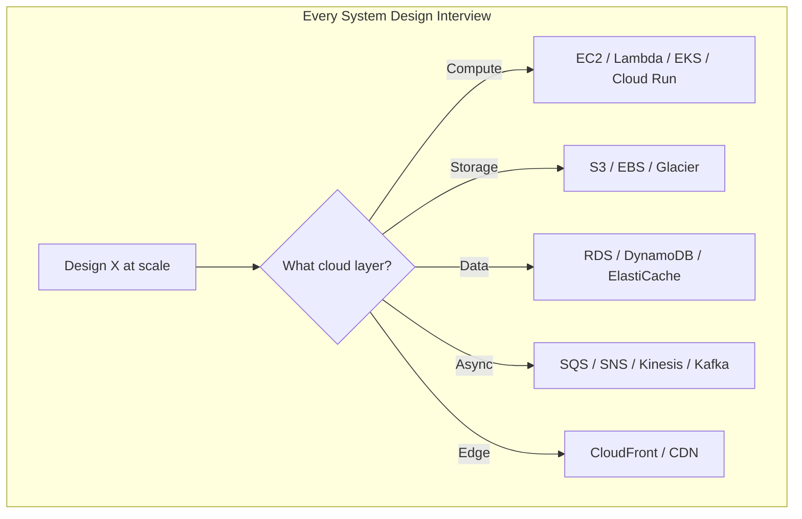
```mermaid
graph TB
    subgraph "Every System Design Interview"
        Q[Design X at scale]
        Q --> C{What cloud layer?}
        C -->|Compute| COMP[EC2 / Lambda / EKS / Cloud Run]
        C -->|Storage| STORE[S3 / EBS / Glacier]
        C -->|Data| DATA[RDS / DynamoDB / ElastiCache]
        C -->|Async| MSG[SQS / SNS / Kinesis / Kafka]
        C -->|Edge| EDGE[CloudFront / CDN]
    end
```

### What "Good" Looks Like in an Interview

| Level | What You Demonstrate |
|-------|---------------------|
| **Junior** | Says "we'll use a database" without specifying managed vs self-hosted |
| **Mid** | Names RDS, S3, Redis with basic justification |
| **Senior** | Maps each component to a specific service; explains consistency, scaling limits |
| **Staff** | Multi-region DR, cost model, when to avoid managed services, cross-cloud portability |

### The Hello Interview Framework Applied to Cloud

Cloud services appear throughout the interview — not just at the end:

```
1. Functional requirements
2. API design
3. Data model → pick database (RDS vs DynamoDB)     ← cloud here
4. Storage for media/files → S3 + CloudFront          ← cloud here
5. Async processing → SQS / Kafka                       ← cloud here
6. Caching → ElastiCache / Redis                      ← cloud here
7. Compute → EC2 / Lambda / EKS                       ← cloud here
8. Multi-region / DR                                  ← cloud here
```

**Interview rule:** Say the **service name** and **one sentence why** — "S3 for media storage because it's durable, cheap at PB scale, and integrates with CloudFront."

---

## 2. Cross-Cloud Service Mapping Overview

### 2.1 The Master Mapping Table

| Category | AWS | GCP | Azure | Open Source / Self-Hosted |
|----------|-----|-----|-------|--------------------------|
| **VM Compute** | EC2 | Compute Engine | Virtual Machines | KVM, bare metal |
| **Container Orchestration** | EKS | GKE | AKS | Self-managed K8s |
| **Serverless Containers** | Fargate / App Runner | Cloud Run | Container Instances | — |
| **Serverless Functions** | Lambda | Cloud Functions | Azure Functions | — |
| **Object Storage** | S3 | Cloud Storage (GCS) | Blob Storage | MinIO, Ceph |
| **Block Storage** | EBS | Persistent Disk | Managed Disks | LVM, local SSD |
| **Archive Storage** | Glacier / S3 IA | Archive / Nearline | Archive Blob | Tape, cold MinIO |
| **Relational DB** | RDS / Aurora | Cloud SQL / AlloyDB | Azure SQL / PostgreSQL | Self-hosted Postgres |
| **NoSQL Key-Value** | DynamoDB | Firestore / Bigtable | Cosmos DB | Cassandra, Riak |
| **Wide-Column** | Keyspaces | Bigtable | Cassandra on Cosmos | Cassandra, HBase |
| **Document DB** | DocumentDB | Firestore | Cosmos DB (Mongo API) | MongoDB |
| **Graph DB** | Neptune | — | Cosmos DB (Gremlin) | Neo4j |
| **In-Memory Cache** | ElastiCache | Memorystore | Azure Cache for Redis | Self-hosted Redis |
| **Message Queue** | SQS | Cloud Tasks / Pub/Sub | Service Bus Queue | RabbitMQ |
| **Pub/Sub** | SNS | Pub/Sub | Service Bus Topics | NATS |
| **Event Bus** | EventBridge | Eventarc | Event Grid | — |
| **Stream Processing** | Kinesis | Dataflow / Pub/Sub | Event Hubs | Kafka, Flink |
| **CDN** | CloudFront | Cloud CDN | Azure CDN / Front Door | Cloudflare, Fastly |
| **Load Balancer** | ALB / NLB | Cloud Load Balancing | Azure LB / App Gateway | HAProxy, NGINX |
| **DNS** | Route 53 | Cloud DNS | Azure DNS | BIND, CoreDNS |
| **Secrets** | Secrets Manager | Secret Manager | Key Vault | HashiCorp Vault |
| **IAM** | IAM | Cloud IAM | Azure AD / RBAC | — |
| **Monitoring** | CloudWatch | Cloud Monitoring | Azure Monitor | Prometheus + Grafana |
| **Search** | OpenSearch | — | Cognitive Search | Elasticsearch |

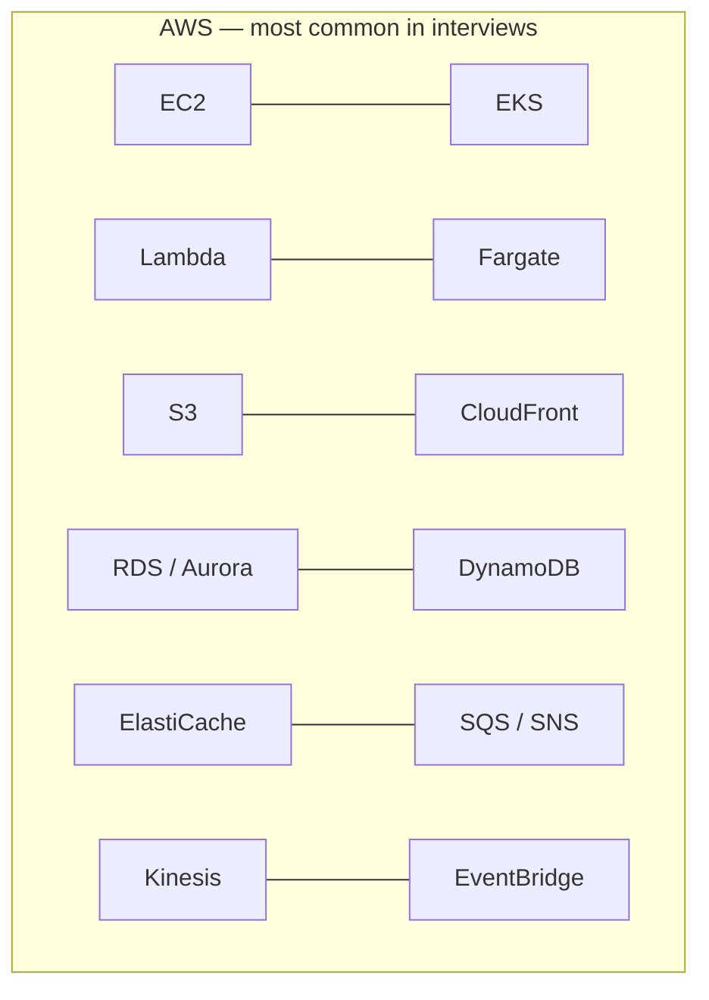
```mermaid
graph TB
    subgraph "AWS — most common in interviews"
        EC2[EC2] --- EKS[EKS]
        LAMBDA[Lambda] --- FARGATE[Fargate]
        S3[S3] --- CF[CloudFront]
        RDS[RDS / Aurora] --- DDB[DynamoDB]
        ELASTIC[ElastiCache] --- SQS[SQS / SNS]
        KINESIS[Kinesis] --- EB[EventBridge]
    end
```

### 2.2 Interview Default: Speak AWS, Acknowledge Equivalents

> "I'll design on AWS since it's most common — the GCP/Azure equivalents are GCS/Cloud Storage for S3, Cloud SQL for RDS, and Pub/Sub for SNS/SQS."

Most FAANG interviewers accept AWS nomenclature even at Google/Microsoft — but showing you know the mapping scores points.

### 2.3 Managed vs Self-Hosted Decision

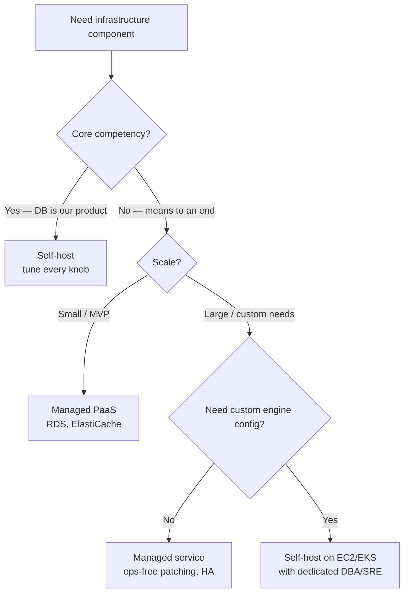
```mermaid
flowchart TB
    START[Need infrastructure component] --> Q1{Core competency?}
    Q1 -->|Yes — DB is our product| SELF[Self-host<br/>tune every knob]
    Q1 -->|No — means to an end| Q2{Scale?}

    Q2 -->|Small / MVP| MANAGED_SIMPLE[Managed PaaS<br/>RDS, ElastiCache]
    Q2 -->|Large / custom needs| Q3{Need custom engine config?}

    Q3 -->|No| MANAGED[Managed service<br/>ops-free patching, HA]
    Q3 -->|Yes| SELF2[Self-host on EC2/EKS<br/>with dedicated DBA/SRE]
```

| Factor | Managed | Self-Hosted |
|--------|---------|-------------|
| **Ops burden** | Provider handles patching, backups, failover | Your team owns everything |
| **Customization** | Limited to exposed parameters | Full control (engine tuning, plugins) |
| **Cost at small scale** | Higher per-unit | Lower (one EC2) |
| **Cost at large scale** | Volume discounts; no ops headcount | Ops headcount + hardware |
| **Time to production** | Hours | Days to weeks |
| **Compliance** | Provider certifications (SOC2, HIPAA BAA) | Your responsibility |

---

## 3. Compute Services — Deep Dive

### 3.1 Compute Spectrum

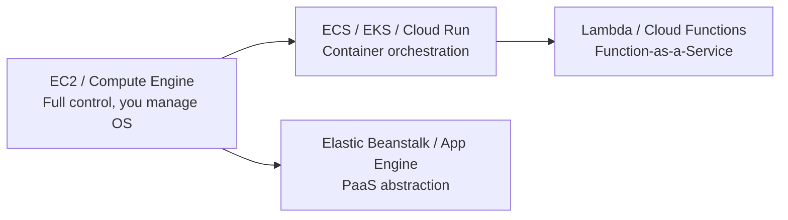
```mermaid
graph LR
    BARE[EC2 / Compute Engine<br/>Full control, you manage OS] --> CONTAINER[ECS / EKS / Cloud Run<br/>Container orchestration]
    CONTAINER --> FUNC[Lambda / Cloud Functions<br/>Function-as-a-Service]
    BARE --> PAAS[Elastic Beanstalk / App Engine<br/>PaaS abstraction]
```

### 3.2 EC2 (Elastic Compute Cloud)

Virtual machines in the cloud — you choose instance type, OS, networking.

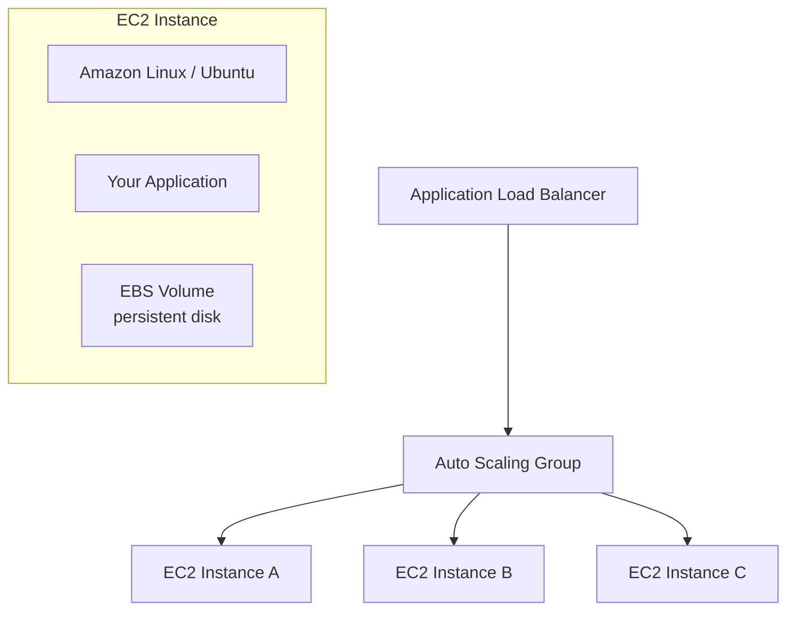
```mermaid
graph TB
    subgraph "EC2 Instance"
        OS[Amazon Linux / Ubuntu]
        APP[Your Application]
        EBS_VOL[EBS Volume<br/>persistent disk]
    end

    ASG[Auto Scaling Group] --> EC2A[EC2 Instance A]
    ASG --> EC2B[EC2 Instance B]
    ASG --> EC2C[EC2 Instance C]
    ALB[Application Load Balancer] --> ASG
```

| Concept | Detail | Interview Note |
|---------|--------|----------------|
| **Instance type** | `m5.large` (general), `c5` (compute), `r5` (memory), `i3` (storage) | Match workload: CPU-bound → C family, memory → R family |
| **Auto Scaling Group** | Adds/removes instances based on CPU, custom metrics, schedule | "ASG scales EC2 behind ALB on CPU > 70%" |
| **Spot Instances** | 60–90% cheaper; can be interrupted with 2-min notice | Batch processing, fault-tolerant workers |
| **Reserved Instances** | 30–60% discount for 1–3 year commitment | Baseline capacity |
| **Placement Groups** | Cluster (low latency), Spread (fault isolation) | HPC, distributed databases |

**When to use EC2:**
- Long-running processes (WebSocket servers, game servers)
- Custom kernel modules or OS tuning
- Stateful applications without containerization
- GPU workloads (ML training) with specific drivers
- When Lambda cold starts or timeout limits are unacceptable

**When NOT to use EC2:**
- Spiky, event-driven workloads (use Lambda)
- Standard microservices with container workflow (use EKS/Fargate)
- Simple web apps (use App Runner / Cloud Run)

### 3.3 AWS Lambda — Serverless Functions

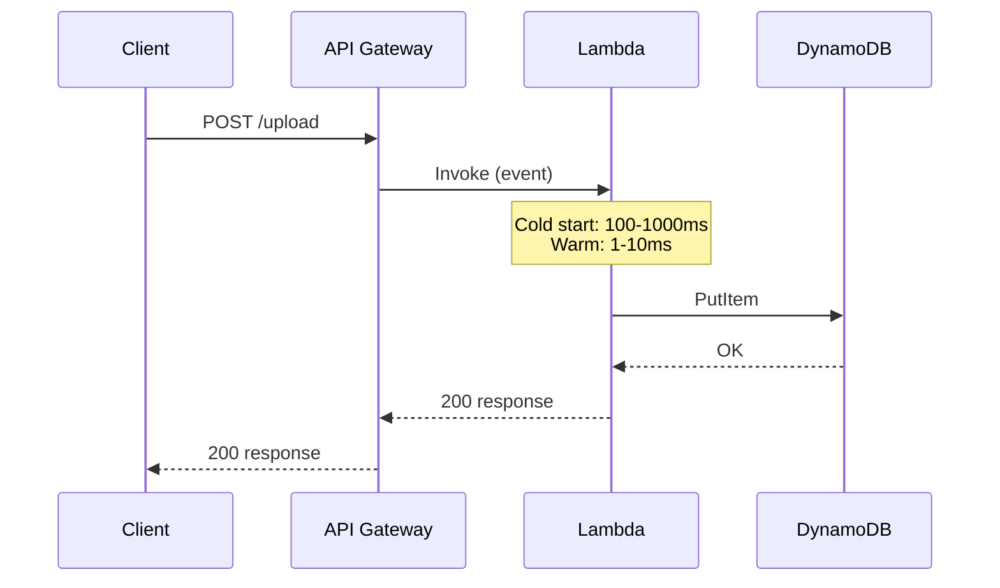
```mermaid
sequenceDiagram
    participant C as Client
    participant AG as API Gateway
    participant L as Lambda
    participant D as DynamoDB

    C->>AG: POST /upload
    AG->>L: Invoke (event)
    Note over L: Cold start: 100-1000ms<br/>Warm: 1-10ms
    L->>D: PutItem
    D-->>L: OK
    L-->>AG: 200 response
    AG-->>C: 200 response
```

| Property | Value | Interview Impact |
|----------|-------|-----------------|
| **Max timeout** | 15 minutes | Not for long-running jobs |
| **Memory** | 128 MB – 10 GB | More memory = more CPU |
| **Cold start** | 100ms–3s (depends on runtime, size) | Provisioned concurrency for latency-sensitive |
| **Concurrency** | 1000 default per region (increasable) | Throttling at scale — request limit increase |
| **Pricing** | Per invocation + per GB-second | Cheap at low volume; expensive at sustained high RPS |
| **Triggers** | API Gateway, S3, SQS, DynamoDB Streams, EventBridge | Event-driven architecture backbone |

**Lambda use cases in system design:**

| System | Lambda Role |
|--------|-------------|
| **Image thumbnail** | S3 upload trigger → resize → store thumbnail |
| **Notification sender** | SQS message → format → send via SES/SNS |
| **API (low traffic)** | API Gateway → Lambda → DynamoDB |
| **Scheduled tasks** | EventBridge cron → cleanup expired data |
| **Auth hook** | Cognito trigger → validate / enrich user |

**Lambda anti-patterns (mention in interviews):**
- Sustained 10K+ RPS (cheaper on EC2/EKS)
- Long-running ML inference (use SageMaker or EC2 GPU)
- WebSocket connections (use API Gateway WebSocket or EC2)
- Heavy startup dependencies (large cold starts)

### 3.4 ECS / EKS — Container Services

| Feature | ECS (Fargate) | EKS |
|---------|--------------|-----|
| **Abstraction** | AWS-native task/service | Full Kubernetes API |
| **Ops burden** | Very low (Fargate = no nodes) | High (or managed node groups) |
| **Portability** | AWS-locked | Multi-cloud K8s |
| **Scaling** | Service auto scaling (task count) | HPA + Cluster Autoscaler |
| **Networking** | AWS VPC native | CNI plugins, service mesh |
| **Best for** | 3–15 services, AWS shop | 15+ microservices, K8s ecosystem |
| **GCP equivalent** | Cloud Run | GKE |

### 3.5 Cloud Run (GCP Equivalent)

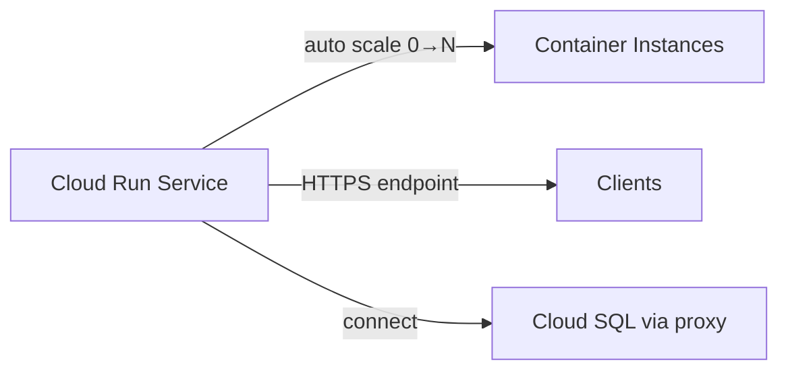
```mermaid
graph LR
    CR[Cloud Run Service] -->|auto scale 0→N| INST[Container Instances]
    CR -->|HTTPS endpoint| CLIENT[Clients]
    CR -->|connect| SQL[Cloud SQL via proxy]
```

| Feature | Cloud Run | AWS Equivalent |
|---------|-----------|---------------|
| **Scale to zero** | Yes (no cost when idle) | Lambda (functions) or App Runner |
| **Max request timeout** | 60 minutes | Lambda 15 min; App Runner unlimited |
| **Concurrency** | Up to 1000 per instance | Lambda: 1 per invocation (default) |
| **Pricing** | Per request + vCPU-seconds | Fargate per-task or Lambda per-invocation |

### 3.6 Compute Selection Matrix

| Requirement | Best Choice | Why |
|------------|-------------|-----|
| **Steady 5K RPS API** | EKS Deployment or EC2 ASG | Cost-effective at sustained load |
| **Spiky thumbnail generation** | Lambda (S3 trigger) | Pay per upload; auto scales |
| **WebSocket chat (100K connections)** | EC2 ASG or EKS StatefulSet | Persistent connections; Lambda can't |
| **Batch ETL nightly** | EC2 Spot or AWS Batch | Cost-optimized; interruption-tolerant |
| **ML inference < 100ms p99** | EC2 GPU or SageMaker endpoint | No cold starts; GPU access |
| **Startup MVP (3 services)** | ECS Fargate or Cloud Run | Minimal ops |
| **50+ microservices** | EKS / GKE | Full orchestration, service mesh |

---


## 4. Object Storage — S3 Internals & Equivalents

### 4.1 S3 Architecture — How It Works

Amazon S3 (Simple Storage Service) is an **object store** — not a filesystem. Objects are stored in **buckets** and accessed via REST API.

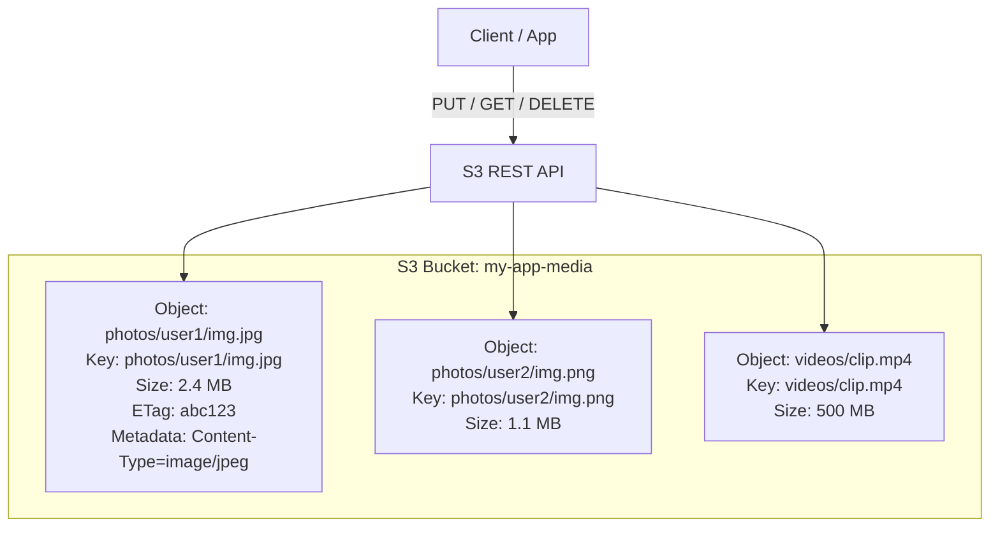
```mermaid
graph TB
    subgraph "S3 Bucket: my-app-media"
        OBJ1[Object: photos/user1/img.jpg<br/>Key: photos/user1/img.jpg<br/>Size: 2.4 MB<br/>ETag: abc123<br/>Metadata: Content-Type=image/jpeg]
        OBJ2[Object: photos/user2/img.png<br/>Key: photos/user2/img.png<br/>Size: 1.1 MB]
        OBJ3[Object: videos/clip.mp4<br/>Key: videos/clip.mp4<br/>Size: 500 MB]
    end

    CLIENT[Client / App] -->|PUT / GET / DELETE| S3API[S3 REST API]
    S3API --> OBJ1
    S3API --> OBJ2
    S3API --> OBJ3
```

| Concept | Detail |
|---------|--------|
| **Bucket** | Global unique namespace; region-scoped storage; flat (no real directories) |
| **Object** | Data + metadata; max 5 TB per object |
| **Key** | Unique identifier within bucket (`photos/2024/img.jpg` — slashes are convention, not folders) |
| **ETag** | MD5 hash of object (for multipart, more complex) — used for conditional requests |
| **Versioning** | Keep multiple versions of same key; protect against accidental delete |
| **Lifecycle rules** | Auto-transition to IA/Glacier; auto-delete after N days |

### 4.2 S3 Consistency Model — Critical for Interviews

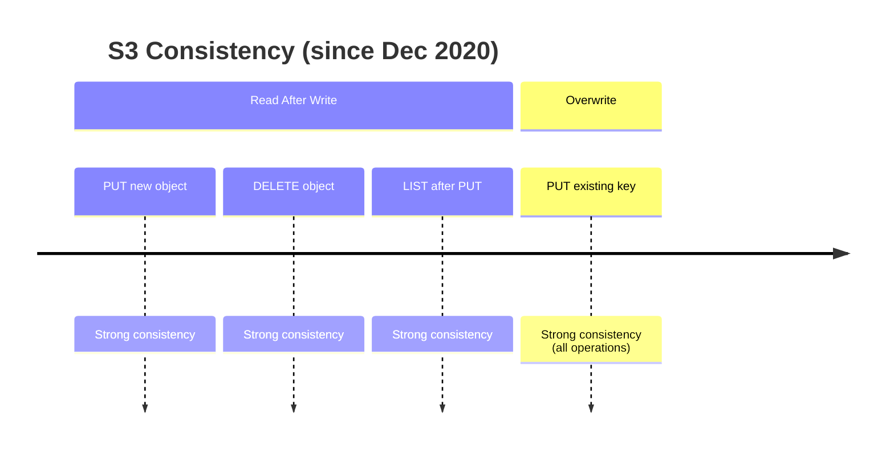
```mermaid
timeline
    title S3 Consistency (since Dec 2020)
    section Read After Write
        PUT new object : Strong consistency
        DELETE object : Strong consistency
        LIST after PUT : Strong consistency
    section Overwrite
        PUT existing key : Strong consistency (all operations)
```

| Operation | Consistency (current) | Pre-2020 |
|-----------|----------------------|----------|
| **PUT new object** | **Read-after-write consistent** | Eventual |
| **PUT overwrite** | **Strong** | Eventual |
| **DELETE** | **Strong** | Eventual |
| **LIST** | **Strong** (after write) | Eventual |

**What to say:**

> "S3 now provides strong read-after-write consistency for all operations. If I PUT an object and immediately GET it, I'll always see the latest version. For system design, I can treat S3 as strongly consistent — but I still use versioned keys or idempotent writes for critical pipelines."

### 4.3 S3 Storage Classes

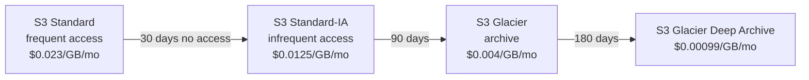
```mermaid
graph LR
    HOT[S3 Standard<br/>frequent access<br/>$0.023/GB/mo] -->|30 days no access| IA[S3 Standard-IA<br/>infrequent access<br/>$0.0125/GB/mo]
    IA -->|90 days| GLACIER[S3 Glacier<br/>archive<br/>$0.004/GB/mo]
    GLACIER -->|180 days| DEEP[S3 Glacier Deep Archive<br/>$0.00099/GB/mo]
```

| Class | Use Case | Retrieval | Min Storage |
|-------|----------|-----------|-------------|
| **Standard** | Hot data — media, active files | Instant | None |
| **Standard-IA** | Backups, disaster recovery | Instant (per-GB fee) | 30 days |
| **One Zone-IA** | Reproducible data (thumbnails) | Instant | 30 days |
| **Glacier Instant** | Archive with instant access | Instant | 90 days |
| **Glacier Flexible** | Archive | 1 min – 12 hours | 90 days |
| **Glacier Deep Archive** | Compliance, legal hold | 12–48 hours | 180 days |
| **Intelligent-Tiering** | Unknown/changing access patterns | Auto-moves between tiers | None |

### 4.4 S3 in System Design — Common Patterns

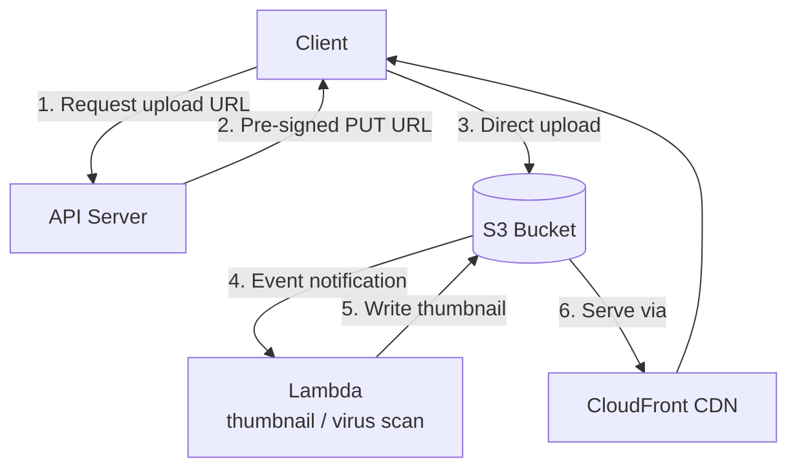
```mermaid
graph TB
    CLIENT[Client] -->|1. Request upload URL| API[API Server]
    API -->|2. Pre-signed PUT URL| CLIENT
    CLIENT -->|3. Direct upload| S3[(S3 Bucket)]
    S3 -->|4. Event notification| LAMBDA[Lambda<br/>thumbnail / virus scan]
    LAMBDA -->|5. Write thumbnail| S3
    S3 -->|6. Serve via| CDN[CloudFront CDN]
    CDN --> CLIENT
```

| Pattern | How | Why |
|---------|-----|-----|
| **Pre-signed URL upload** | API generates temporary PUT URL; client uploads directly to S3 | Offloads bandwidth from API servers; handles large files |
| **S3 event → Lambda** | `s3:ObjectCreated:*` triggers processing | Thumbnails, transcoding, indexing |
| **S3 + CloudFront** | CDN origin = S3 bucket (OAC/OAI) | Global low-latency delivery |
| **S3 as data lake** | Raw logs, analytics parquet files | Cheap storage; Athena queries |
| **Multipart upload** | Split large files (>100 MB) into parts | Parallel upload; resume on failure |

### 4.5 S3 Equivalents

| Feature | AWS S3 | GCP Cloud Storage | Azure Blob Storage |
|---------|--------|-------------------|-------------------|
| **Object store** | S3 | GCS buckets | Blob containers |
| **Pre-signed URL** | Pre-signed URL | Signed URL | SAS token |
| **Event trigger** | S3 Event → Lambda/SQS | GCS → Pub/Sub | Event Grid |
| **CDN integration** | CloudFront OAC | Cloud CDN backend | Azure CDN |
| **Lifecycle** | Lifecycle rules | Lifecycle management | Lifecycle policy |
| **Versioning** | Bucket versioning | Object versioning | Blob versioning |

---

## 5. Block & Archive Storage

### 5.1 EBS (Elastic Block Store)

Block storage volumes attached to EC2 instances — like a virtual hard drive.

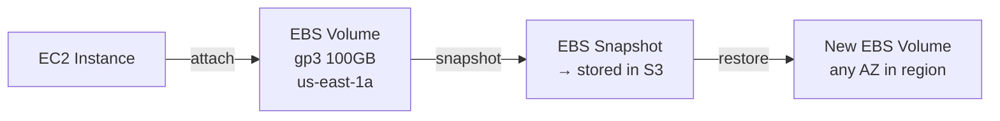
```mermaid
graph LR
    EC2[EC2 Instance] -->|attach| EBS[EBS Volume<br/>gp3 100GB<br/>us-east-1a]
    EBS -->|snapshot| SNAP[EBS Snapshot<br/>→ stored in S3]
    SNAP -->|restore| EBS2[New EBS Volume<br/>any AZ in region]
```

| Volume Type | IOPS | Throughput | Use Case | Cost |
|------------|------|-----------|----------|------|
| **gp3** (general SSD) | 3,000–16,000 | 125–1000 MB/s | Boot volumes, databases | $ |
| **io2** (provisioned IOPS) | Up to 256,000 | Up to 4,000 MB/s | High-performance databases | $$$$ |
| **st1** (throughput HDD) | 500 | 500 MB/s | Big data, log processing | $ |
| **sc1** (cold HDD) | 250 | 250 MB/s | Infrequent access | $ |

**Interview rules for EBS:**
- EBS is **AZ-scoped** — volume lives in one AZ; attach only to EC2 in same AZ
- For multi-AZ: use RDS (manages replication) or replicate at application level
- **Snapshots** are cross-region portable — use for DR
- Don't use EBS for shared storage across instances — use EFS or S3

### 5.2 EFS (Elastic File System) — Shared Filesystem

| Feature | EBS | EFS | S3 |
|---------|-----|-----|-----|
| **Access** | Single EC2 (per volume) | Multiple EC2 simultaneously | HTTP API |
| **Protocol** | Block device | NFS v4 | REST |
| **Scope** | Single AZ | Multi-AZ in region | Global (any region) |
| **Use case** | Database disk, boot volume | Shared config, CMS files, ML datasets | Media, backups, data lake |

### 5.3 Glacier — Long-Term Archive

```
Use Glacier when:
  - Access frequency < 1× per quarter
  - Retrieval time of minutes-to-hours is acceptable
  - Cost optimization for PB-scale archival (compliance, legal)

Don't use Glacier when:
  - Users need instant access (use S3 Standard)
  - Small objects (< 128 KB — minimum billable size makes it expensive)
```

---

## 6. Managed Databases — Relational & NoSQL

### 6.1 RDS (Relational Database Service)

Managed relational databases — AWS handles patching, backups, failover.

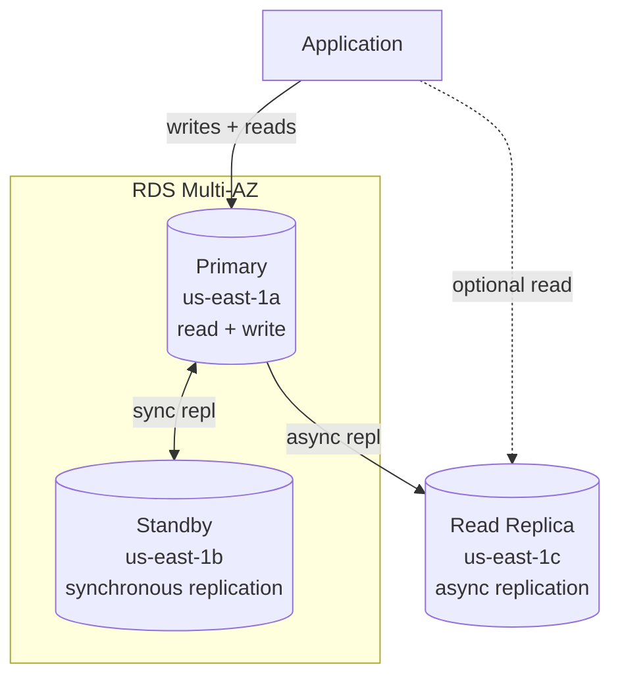
```mermaid
graph TB
    subgraph "RDS Multi-AZ"
        PRIMARY[(Primary<br/>us-east-1a<br/>read + write)]
        STANDBY[(Standby<br/>us-east-1b<br/>synchronous replication)]
        PRIMARY <-->|sync repl| STANDBY
    end

    APP[Application] -->|writes + reads| PRIMARY
    APP -.->|optional read| REPLICA[(Read Replica<br/>us-east-1c<br/>async replication)]
    PRIMARY -->|async repl| REPLICA
```

| Engine | Best For | Interview Mention |
|--------|----------|-------------------|
| **PostgreSQL** | General purpose, JSON, GIS, complex queries | Default choice for most system design |
| **MySQL** | Web apps, WordPress, read-heavy | Simpler; good for LAMP stacks |
| **Aurora** | High-throughput MySQL/PostgreSQL compatible | 5× throughput; auto-scaling storage; 15 read replicas |
| **MariaDB** | MySQL alternative | Rarely mentioned in interviews |

### 6.2 Aurora — When to Upgrade from RDS

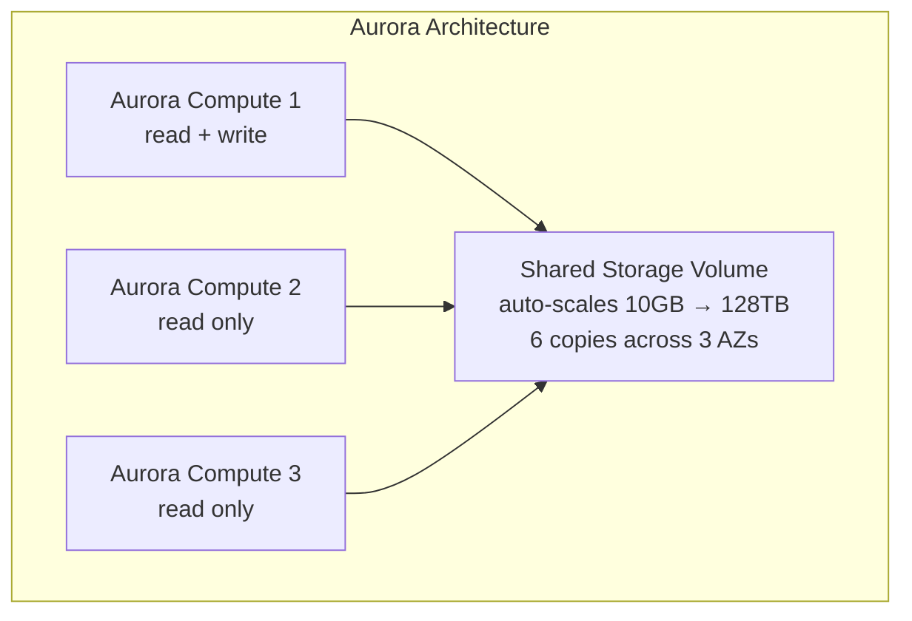
```mermaid
graph TB
    subgraph "Aurora Architecture"
        SHARED[Shared Storage Volume<br/>auto-scales 10GB → 128TB<br/>6 copies across 3 AZs]
        AC1[Aurora Compute 1<br/>read + write]
        AC2[Aurora Compute 2<br/>read only]
        AC3[Aurora Compute 3<br/>read only]
        AC1 --> SHARED
        AC2 --> SHARED
        AC3 --> SHARED
    end
```

| Feature | RDS PostgreSQL | Aurora PostgreSQL |
|---------|---------------|-------------------|
| **Max read replicas** | 5 | 15 |
| **Storage scaling** | Manual (max 64 TB) | Auto (up to 128 TB) |
| **Failover time** | 60–120 seconds | ~30 seconds |
| **Throughput** | Standard | Up to 5× PostgreSQL |
| **Cost** | Lower at small scale | Higher; worth it at > 10K QPS |
| **Serverless** | No | Aurora Serverless v2 (auto scale ACUs) |

**When to say Aurora:**

> "For Uber-scale ride matching with 50K+ read QPS on trip history, I'd use Aurora with 10+ read replicas. For a startup with 500 QPS, standard RDS PostgreSQL with one read replica is simpler and cheaper."

### 6.3 DynamoDB — Managed NoSQL Key-Value

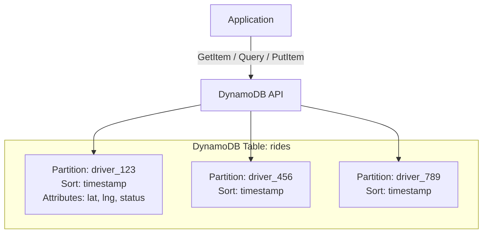
```mermaid
graph TB
    subgraph "DynamoDB Table: rides"
        P1[Partition: driver_123<br/>Sort: timestamp<br/>Attributes: lat, lng, status]
        P2[Partition: driver_456<br/>Sort: timestamp]
        P3[Partition: driver_789<br/>Sort: timestamp]
    end

    APP[Application] -->|GetItem / Query / PutItem| DDB[DynamoDB API]
    DDB --> P1
    DDB --> P2
    DDB --> P3
```

| Concept | Detail | Interview Critical |
|---------|--------|-------------------|
| **Partition key** | Determines which physical partition stores the item | **Cannot change after table creation** |
| **Sort key** | Optional; enables range queries within partition | Design access patterns first |
| **GSI (Global Secondary Index)** | Alternate partition + sort key; separate capacity | Query by different attribute |
| **LSI (Local Secondary Index)** | Same partition key, different sort key | Must define at table creation |
| **WCU/RCU** | Write/Read Capacity Units (or on-demand) | On-demand for unpredictable; provisioned for steady |
| **Consistency** | Eventually consistent (default); strongly consistent (opt-in per read) | AP system; mention for feed/location |
| **Streams** | Ordered change log per partition | Trigger Lambda for real-time processing |
| **TTL** | Auto-delete items after expiry timestamp | Sessions, temp data, GDPR compliance |
| **Single-item limit** | 400 KB per item | Not for large blobs — store in S3, reference in DDB |
| **Max table size** | Unlimited (auto-partitions) | Scales automatically |

**DynamoDB partition key design (memorize):**

```
GOOD partition keys (high cardinality, even distribution):
  user_id, order_id, device_id, session_id

BAD partition keys (hot partitions):
  status ("active" / "inactive")
  country_code ("US" gets 60% of traffic)
  date ("2024-01-15" for time-series without suffix)

HOT PARTITION FIX:
  Add random suffix: user_id#shard_{0-9}
  Or use write sharding with GSI for reads
```

### 6.4 RDS vs DynamoDB — Decision Matrix

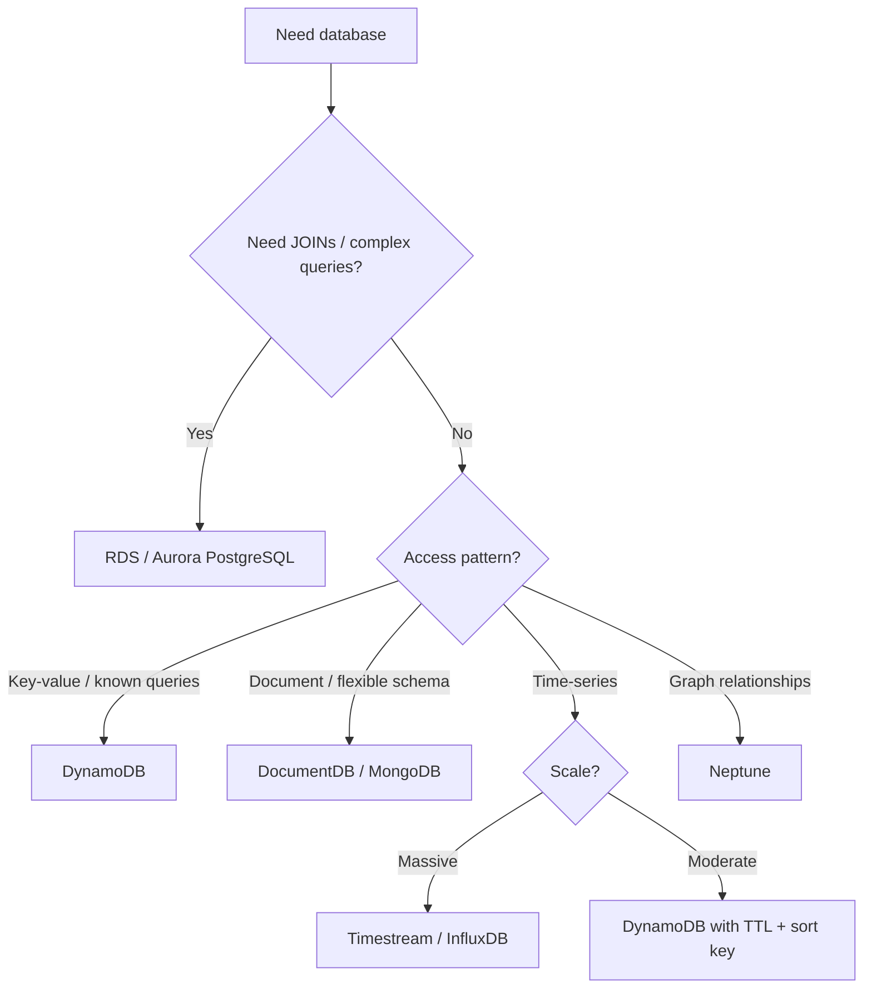
```mermaid
flowchart TB
    START[Need database] --> Q1{Need JOINs / complex queries?}
    Q1 -->|Yes| RDS[RDS / Aurora PostgreSQL]
    Q1 -->|No| Q2{Access pattern?}

    Q2 -->|Key-value / known queries| DDB[DynamoDB]
    Q2 -->|Document / flexible schema| DOC[DocumentDB / MongoDB]
    Q2 -->|Time-series| Q3{Scale?}
    Q2 -->|Graph relationships| NEPTUNE[Neptune]

    Q3 -->|Massive| TIMESTREAM[Timestream / InfluxDB]
    Q3 -->|Moderate| DDB2[DynamoDB with TTL + sort key]
```

| Factor | RDS (PostgreSQL) | DynamoDB |
|--------|-----------------|----------|
| **Query flexibility** | SQL — any query | Key-condition queries only ( + GSI) |
| **JOINs** | Yes | No — denormalize |
| **Scaling** | Vertical + read replicas + sharding (hard) | Horizontal, automatic |
| **Consistency** | Strong (single node) | Eventual (strong opt-in) |
| **Max item size** | Unlimited (TOAST) | 400 KB |
| **Ops** | Patch, vacuum, connection pooling | Zero ops |
| **Cost at low scale** | ~$15/month (db.t3.micro) | On-demand can be pricier |
| **Cost at massive scale** | Sharding complexity | Scales linearly; predictable |
| **Best for** | Uber trips, payments, user profiles | IoT telemetry, gaming leaderboards, sessions |

### 6.5 Other Managed Databases

| Service | Type | Use Case | AWS |
|---------|------|----------|-----|
| **ElastiCache** | In-memory cache | Session, feed cache, rate limiting | Redis or Memcached |
| **DocumentDB** | Document (MongoDB-compatible) | Flexible schema catalogs | MongoDB API |
| **Neptune** | Graph | Social graph, fraud detection, knowledge graph | Gremlin / SPARQL |
| **Timestream** | Time-series | IoT metrics, monitoring data | SQL queries on time-series |
| **Keyspaces** | Wide-column (Cassandra-compatible) | Write-heavy, high availability | Cassandra API |
| **Redshift** | Data warehouse | Analytics, OLAP | SQL |
| **OpenSearch** | Search / analytics | Full-text search, log analytics | Elasticsearch API |

---


## 7. Caching & In-Memory Stores

### 7.1 ElastiCache — Managed Redis / Memcached

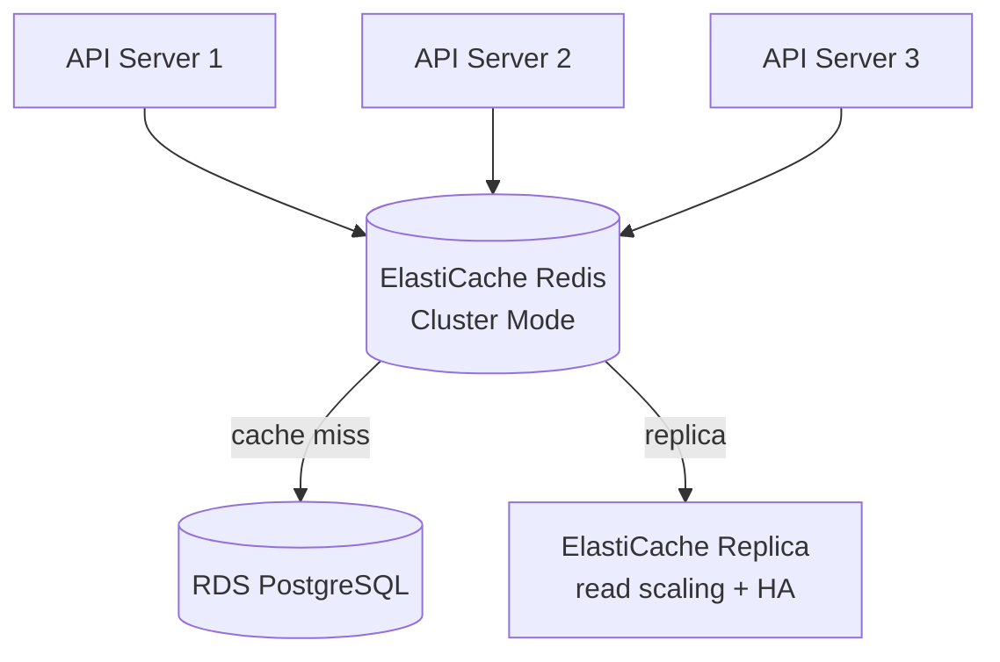
```mermaid
graph TB
    APP1[API Server 1] --> REDIS[(ElastiCache Redis<br/>Cluster Mode)]
    APP2[API Server 2] --> REDIS
    APP3[API Server 3] --> REDIS
    REDIS -->|cache miss| RDS[(RDS PostgreSQL)]
    REDIS -->|replica| REPLICA[ElastiCache Replica<br/>read scaling + HA]
```

| Feature | Redis (ElastiCache) | Memcached (ElastiCache) |
|---------|--------------------|-----------------------|
| **Data structures** | Strings, lists, sets, sorted sets, hashes, streams | Strings only |
| **Persistence** | RDB snapshots + AOF | None (pure cache) |
| **Replication** | Primary + replicas | None |
| **Cluster mode** | Hash slots across shards | Client-side consistent hashing |
| **Pub/Sub** | Yes | No |
| **TTL** | Per-key | Per-key |
| **Use when** | Sessions, leaderboards, rate limiting, pub/sub | Simple key-value cache |

### 7.2 Caching Patterns with Cloud Services

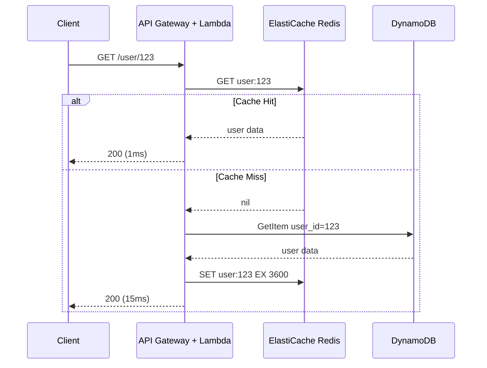
```mermaid
sequenceDiagram
    participant C as Client
    participant API as API Gateway + Lambda
    participant REDIS as ElastiCache Redis
    participant DDB as DynamoDB

    C->>API: GET /user/123
    API->>REDIS: GET user:123
    alt Cache Hit
        REDIS-->>API: user data
        API-->>C: 200 (1ms)
    else Cache Miss
        REDIS-->>API: nil
        API->>DDB: GetItem user_id=123
        DDB-->>API: user data
        API->>REDIS: SET user:123 EX 3600
        API-->>C: 200 (15ms)
    end
```

| Pattern | Cloud Implementation | Use Case |
|---------|---------------------|----------|
| **Cache-aside** | App + ElastiCache + RDS | General read-heavy (feeds, profiles) |
| **Write-through** | App writes to Redis + RDS sync | Session data, config |
| **Read-through** | DAX (DynamoDB Accelerator) | DynamoDB read-heavy |
| **CDN cache** | CloudFront + S3 | Static assets, API responses |
| **DAX** | In-memory cache for DynamoDB | Microsecond DynamoDB reads |

### 7.3 DAX — DynamoDB Accelerator

```
DAX = managed Redis-like cache specifically for DynamoDB
  - Microsecond read latency (vs DynamoDB's single-digit ms)
  - Write-through: writes go to DAX → DynamoDB
  - Item-level cache invalidation on write
  - Use when: DynamoDB read-heavy AND need sub-ms latency
  - Don't use when: already using ElastiCache (redundant)
```

---

## 8. Messaging & Event Streaming

### 8.1 Messaging Spectrum

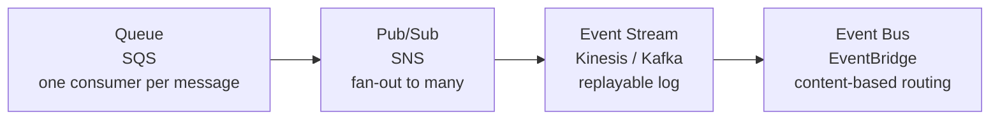
```mermaid
graph LR
    QUEUE[Queue<br/>SQS<br/>one consumer per message] --> PUBSUB[Pub/Sub<br/>SNS<br/>fan-out to many]
    PUBSUB --> STREAM[Event Stream<br/>Kinesis / Kafka<br/>replayable log]
    STREAM --> BUS[Event Bus<br/>EventBridge<br/>content-based routing]
```

### 8.2 SQS (Simple Queue Service)

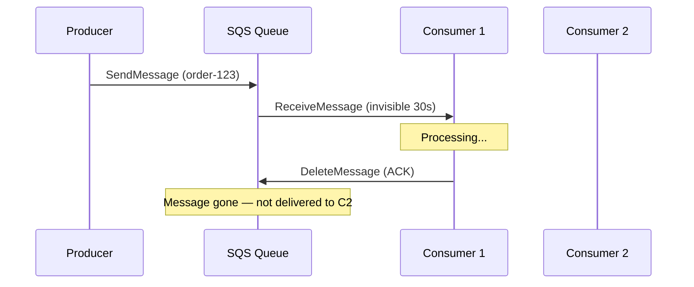
```mermaid
sequenceDiagram
    participant P as Producer
    participant Q as SQS Queue
    participant C1 as Consumer 1
    participant C2 as Consumer 2

    P->>Q: SendMessage (order-123)
    Q->>C1: ReceiveMessage (invisible 30s)
    Note over C1: Processing...
    C1->>Q: DeleteMessage (ACK)
    Note over Q: Message gone — not delivered to C2
```

| Property | Standard Queue | FIFO Queue |
|----------|---------------|------------|
| **Ordering** | Best-effort (occasionally out of order) | Strict FIFO |
| **Delivery** | At-least-once (duplicates possible) | Exactly-once processing |
| **Throughput** | Unlimited | 3,000 msg/sec (batch: 30K) |
| **Use when** | Decouple services, async processing | Order processing, financial transactions |
| **Visibility timeout** | 0–12 hours (default 30s) | Same |
| **Dead letter queue** | After N failed receives → DLQ | Same |

**Key SQS concepts for interviews:**

| Concept | Detail |
|---------|--------|
| **Visibility timeout** | After consumer receives message, it's hidden for N seconds. If not deleted, reappears for retry |
| **Long polling** | `WaitTimeSeconds=20` — reduces empty responses, lowers cost |
| **Dead Letter Queue (DLQ)** | Failed messages after max retries → separate queue for investigation |
| **Message retention** | 1 minute to 14 days (default 4 days) |
| **Fan-out** | SNS → multiple SQS queues (one per consumer service) |

### 8.3 SNS (Simple Notification Service)

```mermaid
graph TB
    PUB[Publisher<br/>order-service] --> SNS[SNS Topic<br/>order-placed]
    SNS --> SQS1[SQS: email-service]
    SNS --> SQS2[SQS: inventory-service]
    SNS --> SQS3[SQS: analytics-service]
    SNS --> LAMBDA[Lambda: fraud-check]
    SNS --> EMAIL[Email / SMS / Push]
```

| Feature | SNS | SQS |
|---------|-----|-----|
| **Model** | Pub/Sub (push to subscribers) | Queue (pull by consumer) |
| **Consumers** | Many (fan-out) | One per message |
| **Persistence** | No (fire-and-forget unless SQS subscribed) | Yes (retained until consumed) |
| **Ordering** | No guarantee | FIFO option |
| **Use when** | Notify multiple services of event | Decouple producer from consumer |

### 8.4 Kinesis — Real-Time Streaming

```mermaid
graph TB
    PRODUCERS[Producers<br/>app servers, IoT devices, clickstream] -->|PutRecord| KIN[Kinesis Data Stream<br/>sharded log]

    KIN -->|shard 1| C1[Consumer: analytics Lambda]
    KIN -->|shard 2| C2[Consumer: fraud detection]
    KIN -->|shard 3| C3[Consumer: real-time dashboard]

    KIN --> FIREHOSE[Kinesis Firehose<br/>batch delivery]
    FIREHOSE --> S3[(S3 Data Lake)]
    FIREHOSE --> REDSHIFT[(Redshift)]
```

| Service | Purpose | Throughput | Retention |
|---------|---------|-----------|-----------|
| **Kinesis Data Streams** | Real-time streaming | 1 MB/sec per shard (ingest) | 1–365 days |
| **Kinesis Firehose** | Delivery to S3/Redshift/OpenSearch | Auto-scaling | N/A (delivery stream) |
| **Kinesis Data Analytics** | SQL on streams | Managed Flink/SQL | N/A |

**Kinesis vs Kafka vs SQS — interview comparison:**

| Feature | SQS | Kinesis | Kafka (MSK) |
|---------|-----|---------|-------------|
| **Model** | Queue (message consumed once) | Stream (replayable log) | Stream (replayable log) |
| **Ordering** | FIFO option | Per-shard ordering | Per-partition ordering |
| **Retention** | 14 days max | 1–365 days | Unlimited (disk-based) |
| **Consumers** | Competing consumers | Multiple independent consumers | Consumer groups |
| **Replay** | No | Yes (reset iterator) | Yes (offset reset) |
| **Throughput** | Unlimited (standard) | 1 MB/s per shard | MB/s per partition |
| **Ops** | Zero | Low (shard management) | Medium-High (MSK managed) |
| **Use when** | Task queues, async jobs | Real-time analytics, clickstream | Event sourcing, high-throughput logs |

### 8.5 EventBridge — Event Bus

```mermaid
graph TB
    SOURCES[Event Sources<br/>S3, Lambda, custom apps, SaaS] --> EB[EventBridge Event Bus]

    EB -->|rule: source=order AND type=created| LAMBDA1[Lambda: send confirmation]
    EB -->|rule: detail.amount > 1000| LAMBDA2[Lambda: fraud alert]
    EB -->|rule: source=schedule| LAMBDA3[Lambda: nightly cleanup]
    EB -->|rule: *| ARCHIVE[Event Archive<br/>replay for debugging]
```

| Feature | SNS | EventBridge |
|---------|-----|-------------|
| **Routing** | Topic-based (all subscribers get all messages) | Content-based rules (filter by event fields) |
| **Schema** | Opaque message body | JSON event with schema registry |
| **Cross-account** | Yes | Yes (built-in) |
| **Scheduling** | No | Cron/rate rules |
| **SaaS integration** | Limited | 18+ partners (Zendesk, Auth0, etc.) |
| **Use when** | Simple fan-out | Complex event routing, serverless workflows |

### 8.6 Messaging in System Design — When to Use What

| System Design Need | Service | Why |
|-------------------|---------|-----|
| **Async email after order** | SQS + Lambda | Decouple; retry on failure; DLQ |
| **Notify 5 services of new post** | SNS → 5 SQS queues | Fan-out; each service at own pace |
| **Clickstream analytics** | Kinesis Data Streams | Real-time; replayable; per-shard ordering |
| **Log aggregation to data lake** | Kinesis Firehose → S3 | Auto-batch; auto-compress; zero consumer code |
| **Event-driven microservices** | EventBridge | Content-based routing; schema validation |
| **Order processing (strict order)** | SQS FIFO | Exactly-once; strict ordering |
| **Payment pipeline** | SQS FIFO + DLQ | No duplicate processing; failed → DLQ for review |
| **Activity feed fan-out** | Kafka (MSK) | High throughput; multiple consumers; replay |

---

## 9. CDN & Edge Services

### 9.1 CloudFront — AWS CDN

```mermaid
graph TB
    USER_US[User — US] -->|nearest edge| EDGE_US[CloudFront PoP<br/>New York]
    USER_EU[User — EU] -->|nearest edge| EDGE_EU[CloudFront PoP<br/>Frankfurt]
    USER_AP[User — Asia] -->|nearest edge| EDGE_AP[CloudFront PoP<br/>Tokyo]

    EDGE_US -->|cache miss| ORIGIN[Origin<br/>S3 / ALB / Custom]
    EDGE_EU -->|cache hit| USER_EU
    EDGE_AP -->|cache miss| ORIGIN
```

| Feature | Detail | Interview Note |
|---------|--------|----------------|
| **Edge locations** | 450+ PoPs globally | Serves from nearest edge |
| **Origins** | S3, ALB, EC2, custom HTTP | S3 + CloudFront is the classic pair |
| **Cache behavior** | Path-based rules (TTL, headers, query strings) | `/static/*` → 1 year TTL; `/api/*` → no cache |
| **Signed URLs / cookies** | Restrict access to private content | Premium video, paid content |
| **Lambda@Edge** | Run Lambda at edge locations | A/B testing, auth, URL rewriting |
| **WAF integration** | AWS WAF at edge | DDoS protection, rate limiting |
| **Price class** | All edge / exclude expensive regions | Cost optimization |

### 9.2 CDN Caching Flow

```mermaid
sequenceDiagram
    participant U as User
    participant CF as CloudFront Edge
    participant O as S3 Origin

    U->>CF: GET /photos/img.jpg
    alt Cache Hit
        CF-->>U: 200 (5ms, X-Cache: Hit)
    else Cache Miss
        CF->>O: GET /photos/img.jpg
        O-->>CF: 200 + image data
        CF->>CF: Store in edge cache (TTL=86400)
        CF-->>U: 200 (50ms, X-Cache: Miss)
    end
```

### 9.3 CDN Use Cases in System Design

| System | CDN Role | Configuration |
|--------|----------|---------------|
| **Instagram** | Serve photos/videos globally | S3 origin; 1-year TTL for immutable media; WebP format |
| **Netflix** | Video segments (with proprietary CDN too) | Long TTL for VOD; short for live |
| **API responses (read-heavy)** | Cache GET responses at edge | `Cache-Control: max-age=60`; invalidate on write |
| **Static web app** | HTML, JS, CSS bundles | S3 + CloudFront; cache-bust via hash in filename |
| **Software downloads** | Installers, updates | S3 + CloudFront; signed URLs for paid software |
| **DDoS protection** | Absorb traffic at edge | CloudFront + WAF + Shield |

### 9.4 CDN Equivalents

| Feature | AWS | GCP | Azure | Third-Party |
|---------|-----|-----|-------|-------------|
| **CDN** | CloudFront | Cloud CDN | Azure CDN / Front Door | Cloudflare, Fastly, Akamai |
| **Edge compute** | Lambda@Edge / CloudFront Functions | Cloud CDN + Cloud Run | Azure Front Door Rules | Cloudflare Workers |
| **DDoS protection** | Shield | Cloud Armor | DDoS Protection | Cloudflare |

---

## 10. Real System Design Service Mappings

### 10.1 Instagram

```mermaid
graph TB
    CLIENT[Mobile/Web Client] --> CF[CloudFront CDN<br/>photos, videos]
    CLIENT --> ALB[ALB<br/>API traffic]

    ALB --> EKS[EKS Cluster]
    EKS --> US[user-service]
    EKS --> FS[feed-service]
    EKS --> MS[media-service]
    EKS --> NS[notification-service]

    US --> RDS1[(RDS PostgreSQL<br/>user profiles, auth)]
    FS --> REDIS[(ElastiCache Redis<br/>feed cache)]
    FS --> CASS[(Keyspaces / Cassandra<br/>posts by user_id)]
    MS --> S3[(S3<br/>photos, videos)]
    NS --> SQS[SQS<br/>notification queue]
    SQS --> LAMBDA[Lambda<br/>push notification sender]

    CF --> S3
    MS -->|pre-signed URL| S3
    FS --> KAFKA[MSK Kafka<br/>post-created events]
    KAFKA --> FS2[feed-fanout-service]
```

| Component | Service | Why |
|-----------|---------|-----|
| **User profiles** | RDS PostgreSQL | Relational; JOINs; ACID for auth |
| **Photo/video storage** | S3 + CloudFront | PB-scale; cheap; global CDN delivery |
| **Feed cache** | ElastiCache Redis | Sub-ms reads; 90%+ hit rate |
| **Posts by user** | Cassandra / Keyspaces | Write-heavy; AP; partition by user_id |
| **Feed fan-out** | Kafka (MSK) | Async fan-out to follower feeds |
| **Push notifications** | SQS + Lambda + SNS | Async; retry; fan-out to mobile push |
| **API compute** | EKS | 50+ microservices; independent scaling |
| **Media upload** | S3 pre-signed URL | Direct client → S3; no API bandwidth |

**Sample interview blurb:**

> "Users upload photos via pre-signed S3 URLs. Metadata goes to Cassandra partitioned by user_id. The feed service reads from Redis cache (60s TTL, cache-aside). On new post, Kafka event triggers fan-out to follower feeds. Photos served via CloudFront from S3 with 1-year cache TTL."

---

### 10.2 Uber

```mermaid
graph TB
    RIDER[Rider App] --> ALB[ALB / API Gateway]
    DRIVER[Driver App] --> ALB

    ALB --> EKS[EKS Cluster]
    EKS --> RS[ride-service]
    EKS --> MS[matching-service]
    EKS --> PS[pricing-service]
    EKS --> LS[location-service]

    RS --> RDS[(Aurora PostgreSQL<br/>trips, payments)]
    MS --> REDIS[(ElastiCache Redis<br/>nearby drivers geo-index)]
    LS --> DDB[(DynamoDB<br/>driver locations<br/>partition: driver_id)]
    PS --> RDS

    LS --> KINESIS[Kinesis Data Streams<br/>location updates]
    KINESIS --> ANALYTICS[Real-time surge pricing]

    RS --> SQS[SQS FIFO<br/>ride-matching queue]
    SQS --> MS
```

| Component | Service | Why |
|-----------|---------|-----|
| **Trip records** | Aurora PostgreSQL | ACID; complex queries (history, billing) |
| **Driver locations** | DynamoDB | 1M+ writes/sec; key = driver_id; TTL for stale |
| **Nearby driver search** | ElastiCache Redis (GEO) | `GEORADIUS` for sub-ms proximity search |
| **Surge pricing** | Kinesis + Lambda | Real-time demand aggregation |
| **Ride matching** | SQS FIFO | Ordered processing; exactly-once |
| **Payment** | RDS (strong consistency) | CP; no double-charge |
| **Location stream** | Kinesis Data Streams | Durable; replayable; per-driver ordering |

**Sample interview blurb:**

> "Driver locations update every 3 seconds to DynamoDB (partition key: driver_id, TTL: 30s). Nearby driver search uses Redis GEO commands — O(log N). Trip matching goes through SQS FIFO for ordered processing. Payments on Aurora with synchronous Multi-AZ for CP consistency."

---

### 10.3 URL Shortener

```mermaid
graph TB
    CLIENT[Client] --> CF[CloudFront<br/>cache redirects]
    CLIENT --> ALB[ALB]
    ALB --> EKS[EKS: redirect-service<br/>3-10 pods]

    EKS --> REDIS[(ElastiCache Redis<br/>hot URL cache)]
    EKS --> DDB[(DynamoDB<br/>url_mappings<br/>PK: short_code)]
    EKS --> LAMBDA[Lambda<br/>create short URL]

    CF -->|cache miss| ALB
```

| Component | Service | Why |
|-----------|---------|-----|
| **URL mappings** | DynamoDB | Key-value; massive scale; single-digit ms |
| **Hot URL cache** | ElastiCache Redis | 90%+ reads are cache hits |
| **Redirect serving** | CloudFront + ALB | CDN caches 301 redirects; sub-ms for popular URLs |
| **URL creation** | Lambda or EKS pod | Low frequency; either works |
| **Analytics** | Kinesis Firehose → S3 → Athena | Async click tracking |

**Why NOT over-engineer:**

> "A URL shortener doesn't need 50 microservices. DynamoDB for storage, Redis for cache, CloudFront for redirect caching, and a small EKS deployment or even Lambda behind API Gateway. Total: 4 services."

---

### 10.4 WhatsApp / Messaging

```mermaid
graph TB
    CLIENT[Client] --> ALB[ALB<br/>WebSocket upgrade]
    ALB --> EKS[EKS StatefulSet<br/>gateway pods<br/>sticky connections]

    EKS --> KAFKA[MSK Kafka<br/>message topics<br/>partition by chat_id]
    KAFKA --> EKS2[EKS Deployment<br/>message-storage-service]
    EKS2 --> CASS[(Cassandra<br/>messages by chat_id)]

    EKS --> REDIS[(ElastiCache<br/>online status, presence)]
    EKS2 --> S3[(S3<br/>media attachments)]
    S3 --> CF[CloudFront]
```

| Component | Service | Why |
|-----------|---------|-----|
| **WebSocket gateway** | EKS StatefulSet | Persistent connections; stable pod identity |
| **Message storage** | Cassandra | Write-heavy; partition by chat_id; time-ordered |
| **Message queue** | Kafka (MSK) | Ordered per chat; durable; replay for offline delivery |
| **Media** | S3 + CloudFront | Large files; CDN delivery |
| **Online status** | ElastiCache Redis | AP; stale by 30s is fine; TTL-based |
| **Push notifications** | SNS + Lambda | Offline users get push via mobile push service |

---

### 10.5 Ticketmaster

```mermaid
graph TB
    CLIENT[Client] --> CF[CloudFront + WAF<br/>DDoS protection]
    CF --> WAIT[Waiting Room<br/>Queue-it / custom]
    WAIT --> ALB[ALB]
    ALB --> EKS[EKS<br/>ticket-service<br/>HPA max=200]

    EKS --> REDIS[(ElastiCache Redis<br/>inventory countdown)]
    EKS --> RDS[(Aurora PostgreSQL<br/>seat assignment<br/>row-level lock)]
    EKS --> SQS[SQS FIFO<br/>purchase queue]

    SQS --> LAMBDA[Lambda<br/>payment processor]
    LAMBDA --> RDS
```

| Component | Service | Why |
|-----------|---------|-----|
| **Waiting room** | Custom queue (SQS + Redis) | Absorb 100× traffic spike |
| **Inventory display** | Redis (AP) | Approximate count; fast |
| **Seat assignment** | Aurora (CP) | Row-level lock; no double-sell |
| **Purchase queue** | SQS FIFO | Ordered; exactly-once purchase |
| **API scaling** | EKS + HPA | Scale pods for spike |
| **DDoS protection** | CloudFront + WAF + Shield | Edge absorption |

---

### 10.6 YouTube / Video Streaming

| Component | Service | Why |
|-----------|---------|-----|
| **Video storage** | S3 (multi-tier lifecycle) | PB-scale; Standard → IA → Glacier |
| **Video delivery** | CloudFront | Global edge; adaptive bitrate |
| **Transcoding** | Elastic Transcoder / MediaConvert | S3 upload → Lambda trigger → transcode → S3 |
| **Metadata** | RDS PostgreSQL | Relational; complex queries (search, recommendations) |
| **View counts** | DynamoDB + atomic counters | AP; approximate count OK |
| **Recommendations** | SageMaker + S3 data lake | ML on watch history |
| **Live streaming** | Kinesis Video Streams | Real-time ingest; WebRTC |

---

### 10.7 System → Service Quick Lookup

| System | Compute | Storage | Database | Cache | Messaging | CDN |
|--------|---------|---------|----------|-------|-----------|-----|
| **Instagram** | EKS | S3 | Cassandra + RDS | Redis | Kafka | CloudFront |
| **Uber** | EKS | — | Aurora + DynamoDB | Redis GEO | Kinesis + SQS FIFO | — |
| **URL Shortener** | Lambda/EKS | — | DynamoDB | Redis | Kinesis Firehose | CloudFront |
| **WhatsApp** | EKS StatefulSet | S3 | Cassandra | Redis | Kafka | CloudFront |
| **Ticketmaster** | EKS + HPA | — | Aurora | Redis | SQS FIFO | CloudFront + WAF |
| **YouTube** | EKS + Lambda | S3 (tiered) | RDS | Redis | Kafka | CloudFront |
| **Twitter/X** | EKS | S3 | Manhattan/Redis | Redis | Kafka | CloudFront |
| **Netflix** | EC2/EKS | S3 | Cassandra (Cassandra) | EVCache | Kafka | Custom + CloudFront |
| **Payment system** | ECS Fargate | — | Aurora (Multi-AZ) | — | SQS FIFO | — |
| **IoT platform** | Lambda | S3 | DynamoDB + Timestream | — | Kinesis + IoT Core | — |
| **Search engine** | EKS | S3 | — | Redis | Kafka | — |
| **LeetCode** | EKS Jobs | S3 | RDS | Redis | SQS | CloudFront |

---


## 11. Cost & Operations Trade-offs

### 11.1 Cost Comparison at Different Scales

```mermaid
graph LR
    subgraph "Low Scale — 100 RPS"
        L1[Lambda: $5/mo]
        L2[EC2 t3.micro: $8/mo]
        L3[EKS: $73+ /mo ❌]
    end

    subgraph "Medium Scale — 5K RPS"
        M1[Lambda: $200/mo]
        M2[EC2 ASG 3×m5.large: $300/mo]
        M3[EKS 3 nodes: $400/mo]
    end

    subgraph "High Scale — 100K RPS"
        H1[Lambda: $5000+/mo ❌]
        H2[EC2 ASG 20×m5.xlarge: $2500/mo]
        H3[EKS 50 nodes: $3000/mo ✓]
    end
```

| Service | Low Scale Cost | High Scale Cost | Ops Burden | When Cheapest |
|---------|---------------|----------------|------------|---------------|
| **Lambda** | Very cheap ($0–20/mo) | Expensive ($1000s/mo) | Zero | Spiky, < 1K RPS |
| **EC2** | Cheap ($10–50/mo) | Moderate (linear) | Medium (patching, ASG) | Steady, predictable |
| **EKS** | Expensive ($73+ control plane) | Efficient (bin packing) | High (K8s ops) | 20+ services, 10K+ RPS |
| **Fargate** | Moderate | Moderate-High | Very low | 3–15 services, no K8s team |
| **RDS** | $15/mo (t3.micro) | $1000s (Aurora cluster) | Very low | Always cheaper than self-hosted DB ops |
| **DynamoDB on-demand** | Pay per request | Can be expensive | Zero | Unpredictable traffic |
| **DynamoDB provisioned** | Must provision | Cheaper at steady high | Low | Predictable, > 10K RCU |
| **S3 Standard** | $0.023/GB/mo | Cheapest at PB scale | Zero | Always — don't store files on EBS |
| **ElastiCache** | $15/mo (t3.micro) | $100s (cluster) | Very low | Cheaper than self-hosted Redis ops |
| **SQS** | $0.40/million requests | Pennies | Zero | Always — essentially free |
| **CloudFront** | $0.085/GB transfer | Cheaper than origin transfer | Zero | Any global user base |

### 11.2 Managed vs Self-Hosted Cost Analysis

| Component | Self-Hosted (EC2) | Managed | Break-Even |
|-----------|-------------------|---------|------------|
| **PostgreSQL** | $50/mo EC2 + 20hr DBA/mo ($3000) | $200/mo RDS | Always managed (unless DB is core product) |
| **Redis** | $30/mo EC2 + monitoring | $50/mo ElastiCache | < 5 engineers: managed |
| **Kafka** | $200/mo EC2 × 3 + Kafka ops | $300/mo MSK | < 20 engineers: MSK |
| **Elasticsearch** | $500/mo EC2 × 3 + ES ops | $400/mo OpenSearch | < 10 engineers: OpenSearch |
| **Kubernetes** | $0 (open source) + 1 SRE ($150K/yr) | $73/mo EKS + node costs | < 5 services: Fargate instead |

**What to say:**

> "At our scale, managed services are cheaper when you factor in engineering time. A DBA costs $150K/year — RDS at $500/month is a bargain. I'd self-host only if we need engine-level customization that managed doesn't offer."

### 11.3 Hidden Costs to Mention

| Hidden Cost | Service | Impact |
|------------|---------|--------|
| **Cross-AZ data transfer** | All services | $0.01/GB each way — adds up with chatty microservices |
| **NAT Gateway** | VPC | $0.045/GB + $0.045/hr — expensive; use VPC endpoints |
| **EKS control plane** | EKS | $0.10/hr per cluster — $73/month minimum |
| **Idle resources** | EC2, RDS, ElastiCache | Dev/staging running 24/7 — use auto-stop schedules |
| **S3 LIST operations** | S3 | $0.005/1000 LIST — expensive at billions of objects |
| **DynamoDB hot partitions** | DynamoDB | Over-provisioned WCU on one partition |
| **CloudFront origin transfer** | CloudFront | $0.02/GB from S3 — still cheaper than direct S3 |
| **Lambda cold starts** | Lambda | Provisioned concurrency: $0.000004/GB-sec always |

---

## 12. Multi-AZ & Multi-Region Patterns

### 12.1 Multi-AZ — High Availability Within a Region

```mermaid
graph TB
    subgraph "Region: us-east-1"
        subgraph "AZ-1a"
            ALB1[ALB Node]
            EC21[EC2 / EKS Pod]
            RDS_PRI[(RDS Primary)]
        end
        subgraph "AZ-1b"
            ALB2[ALB Node]
            EC22[EC2 / EKS Pod]
            RDS_STBY[(RDS Standby<br/>sync replication)]
        end
        subgraph "AZ-1c"
            EC23[EC2 / EKS Pod]
            RDS_REP[(Read Replica<br/>async)]
        end
    end

    ALB1 --- ALB2
    RDS_PRI <-->|sync| RDS_STBY
    RDS_PRI -->|async| RDS_REP
```

| Service | Multi-AZ Support | Failover Time | Data Loss |
|---------|-----------------|---------------|-----------|
| **RDS Multi-AZ** | Automatic standby in different AZ | 60–120 seconds | Zero (sync replication) |
| **Aurora Multi-AZ** | 6 copies across 3 AZs | ~30 seconds | Zero |
| **ElastiCache Multi-AZ** | Primary + replica in different AZ | 1–2 minutes | Minimal |
| **EKS** | Spread pods across AZs (topology spread) | Seconds (reschedule) | N/A (stateless) |
| **S3** | Automatically replicated across ≥ 3 AZs | N/A (durability) | Zero (11 nines) |
| **DynamoDB** | Automatically replicated across 3 AZs | N/A (durability) | Zero for single-region |
| **ALB** | Cross-zone load balancing | Instant | N/A |

**What to say:**

> "Everything runs Multi-AZ by default — RDS primary in 1a with sync standby in 1b, EKS pods spread across 3 AZs with topology spread constraints, S3 and DynamoDB are automatically AZ-redundant. This survives a single AZ failure with minutes of disruption at most."

### 12.2 Multi-Region — Disaster Recovery & Global Users

```mermaid
graph TB
    subgraph "us-east-1 (Primary)"
        ALB_US[ALB]
        EKS_US[EKS Cluster]
        RDS_US[(Aurora Global<br/>Primary)]
        S3_US[(S3 Bucket)]
    end

    subgraph "eu-west-1 (Secondary)"
        ALB_EU[ALB]
        EKS_EU[EKS Cluster]
        RDS_EU[(Aurora Global<br/>Secondary — read only)]
        S3_EU[(S3 Cross-Region<br/>Replication)]
    end

    R53[Route 53<br/>Latency-based routing] --> ALB_US
    R53 --> ALB_EU
    RDS_US -->|async replication| RDS_EU
    S3_US -->|CRR| S3_EU
    CF[CloudFront<br/>global edge] --> S3_US
    CF --> S3_EU
```

| Pattern | RPO | RTO | Cost | Use When |
|---------|-----|-----|------|----------|
| **Backup & Restore** | Hours | Hours | $ | Non-critical; dev/staging |
| **Pilot Light** | Minutes | 30–60 min | $$ | Core DB replicated; compute scaled down |
| **Warm Standby** | Minutes | 15–30 min | $$$ | Reduced capacity always running in DR region |
| **Active-Active** | Zero | Zero | $$$$ | Global users; requires conflict resolution |
| **Multi-region active-passive** | Seconds–minutes | 5–15 min | $$$ | Most production systems |

### 12.3 Multi-Region Service Considerations

| Service | Multi-Region Approach | Gotcha |
|---------|----------------------|--------|
| **S3** | Cross-Region Replication (CRR) | One-way; eventual; replication time |
| **DynamoDB** | Global Tables (active-active) | Conflict resolution: last-write-wins |
| **Aurora** | Global Database (1 primary, N secondary) | Secondary is read-only; promote for DR |
| **RDS** | Cross-region read replica | Manual promotion; minutes of downtime |
| **ElastiCache** | No native multi-region | Use per-region clusters; app-level routing |
| **SQS/SNS** | Regional services | No cross-region — use EventBridge or replicate |
| **Route 53** | Latency-based / failover routing | Health checks for automatic failover |
| **CloudFront** | Inherently global | Origin failover configuration |
| **EKS** | Separate cluster per region | No native multi-region cluster |

### 12.4 Data Residency & Compliance

| Requirement | Solution |
|------------|----------|
| **GDPR (EU data stays in EU)** | Deploy in `eu-west-1`; Route 53 geolocation routing |
| **HIPAA** | BAA with AWS; encrypt at rest (KMS) and in transit (TLS) |
| **PCI DSS** | No card data on EC2; use Stripe/payment processor |
| **Data sovereignty** | Region-locked resources; no cross-region replication |

---

## 13. Decision Framework — When to Use What

### 13.1 Cloud Service Decision Tree

```mermaid
flowchart TB
    START[Design component] --> Q1{What type?}

    Q1 -->|Files / media / backups| S3[S3 + CloudFront]
    Q1 -->|Relational data| Q2{Need JOINs / SQL?}
    Q1 -->|Key-value / known queries| DDB[DynamoDB]
    Q1 -->|Cache| REDIS[ElastiCache Redis]
    Q1 -->|Async task| SQS[SQS + Lambda]
    Q1 -->|Event fan-out| SNS[SNS → SQS queues]
    Q1 -->|Real-time stream| KINESIS[Kinesis / MSK Kafka]
    Q1 -->|Compute| Q3{Traffic pattern?}

    Q2 -->|Yes| RDS[RDS / Aurora PostgreSQL]
    Q2 -->|Massive reads| AURORA[Aurora + read replicas]

    Q3 -->|Steady / WebSocket| EC2[EC2 ASG / EKS]
    Q3 -->|Spiky / event-driven| LAMBDA[Lambda]
    Q3 -->|Microservices 10+| EKS[EKS / GKE]
    Q3 -->|Simple containers| FARGATE[ECS Fargate / Cloud Run]
```

### 13.2 Service Selection by Requirement

| Requirement | Primary | Alternative | Avoid |
|------------|---------|-------------|-------|
| **Store user photos** | S3 + CloudFront | GCS + Cloud CDN | EBS, EFS |
| **User authentication data** | RDS PostgreSQL | Aurora | DynamoDB (no complex queries) |
| **Session store** | ElastiCache Redis | DynamoDB (with TTL) | RDS (too slow) |
| **Real-time leaderboard** | ElastiCache sorted sets | DynamoDB + atomic counters | RDS (lock contention) |
| **Order processing** | SQS FIFO + Lambda | Kafka | SNS alone (no persistence) |
| **Clickstream analytics** | Kinesis → S3 → Athena | Kafka → Spark | SQS (no replay) |
| **Search** | OpenSearch | Algolia (SaaS) | RDS LIKE queries |
| **Email sending** | SES + SQS | SendGrid (SaaS) | Lambda directly (no retry) |
| **Cron jobs** | EventBridge Scheduler | CronJob on EKS | EC2 cron (fragile) |
| **DNS** | Route 53 | Cloudflare | Self-hosted BIND |
| **Secrets** | Secrets Manager | Parameter Store | Hardcoded in code |
| **Monitoring** | CloudWatch + X-Ray | Datadog (SaaS) | Self-hosted Prometheus (at scale) |

---

## 14. Interview Scenarios & Sample Answers

### Scenario 1: "Design Instagram — what AWS services do you use?"

> "Four layers:
>
> **Storage:** S3 for photos/videos (pre-signed upload URLs). CloudFront CDN for global delivery. Lifecycle policy moves old content to S3 IA after 90 days.
>
> **Compute:** EKS for microservices (user, feed, media, notification). Each service is a Deployment with HPA. Media upload bypasses API — client uploads directly to S3.
>
> **Data:** RDS PostgreSQL for user profiles and auth (relational, ACID). Cassandra (Keyspaces) for posts partitioned by user_id (write-heavy, AP). ElastiCache Redis for feed cache (60s TTL, cache-aside, 90%+ hit rate).
>
> **Async:** Kafka (MSK) for post-created events → feed fan-out service. SQS + Lambda for push notifications.
>
> **Not using:** Lambda for API (sustained high RPS — EKS cheaper). DynamoDB for posts (Cassandra better for wide-column time-series). EBS for photos (S3 is 10× cheaper at PB scale)."

---

### Scenario 2: "When do you pick DynamoDB over RDS?"

> "DynamoDB when:
> - Access patterns are key-value or key-range (I know my queries upfront)
> - Need 10K+ writes/sec per partition with auto-scaling
> - Can denormalize (no JOINs)
> - AP consistency is acceptable (feeds, sessions, IoT)
> - Item size < 400 KB
>
> RDS when:
> - Need ad-hoc SQL queries, JOINs, aggregations
> - Strong consistency required (payments, inventory)
> - Data model is relational and normalized
> - Team knows SQL, not NoSQL modeling
> - Write QPS < 5K (single PostgreSQL primary handles this)
>
> For Uber trips: Aurora (complex billing queries). For driver locations: DynamoDB (key = driver_id, 1M writes/sec)."

---

### Scenario 3: "How do you design for multi-region?"

> "Depends on RPO/RTO requirements:
>
> **Active-passive (most common):**
> - Primary in us-east-1, DR in eu-west-1
> - Aurora Global Database: secondary region has read replica (RPO ~ 1 second)
> - S3 Cross-Region Replication for media
> - EKS cluster in DR region at reduced capacity (warm standby)
> - Route 53 failover routing with health checks
> - RTO: 15 minutes (promote Aurora + scale EKS)
>
> **Active-active (global users):**
> - DynamoDB Global Tables (conflict: last-write-wins)
> - S3 + CloudFront (inherently global)
> - EKS in each region; Route 53 latency-based routing
> - ElastiCache per region (no cross-region cache)
> - Kafka per region; global events via EventBridge cross-region
>
> I'd start active-passive — active-active adds conflict resolution complexity."

---

### Scenario 4: "Estimate the cost of storing 1 billion photos"

> "Assumptions: average photo 2 MB, S3 Standard pricing.
>
> ```
> Storage: 1B × 2 MB = 2 PB = 2,000 TB
> S3 Standard: 2,000 TB × $0.023/GB = 2,000,000 GB × $0.023 = $46,000/month
>
> With Intelligent-Tiering (30% IA after 30 days):
>   ~$35,000/month (saves ~25%)
>
> CloudFront (10B views/month, 80% cache hit):
>   Origin transfer: 2B × 2 MB = 4 PB → $0.02/GB = $80,000/month
>   Edge transfer: 10B × 2 MB × 20% miss = $40,000/month
>   Total CDN: ~$120,000/month
>
> Total: ~$160,000/month for 1B photos with heavy CDN usage
> ```
>
> Optimization: WebP compression (50% smaller), S3 IA for old photos, CloudFront price class optimization."

---

### Scenario 5: "SQS vs Kafka — which for an order processing system?"

> "**SQS FIFO** if:
> - Single consumer group processes orders sequentially
> - Volume < 3,000 orders/sec
> - Want zero ops (fully managed)
> - Don't need to replay events
>
> **Kafka (MSK)** if:
> - Multiple independent consumers (inventory, shipping, analytics, fraud)
> - Need to replay order events (reprocess last 24 hours)
> - Volume > 10K orders/sec
> - Event sourcing — Kafka IS the source of truth
>
> For most interview scenarios: **SQS FIFO** for order processing (simpler, sufficient). Mention Kafka if they ask about event sourcing or multiple consumers needing the same events."

---

## 15. Failure Modes Across All Layers

| Layer | Failure | Impact | Mitigation |
|-------|---------|--------|------------|
| **EC2** | Instance crash | ASG replaces in minutes | Multi-AZ ASG; health checks |
| **Lambda** | Throttled (concurrency limit) | 429 errors to clients | Request concurrency increase; reserved concurrency |
| **Lambda** | Cold start latency | p99 spike on first request | Provisioned concurrency; smaller packages |
| **RDS** | Primary failure | Writes blocked 60–120s | Multi-AZ automatic failover |
| **RDS** | Read replica lag | Stale reads | Monitor `ReplicaLag`; route critical reads to primary |
| **Aurora** | Writer failure | Auto-promote replica ~30s | Aurora auto-failover (faster than RDS) |
| **DynamoDB** | Hot partition | Throttled writes on one key | Random suffix sharding; write sharding |
| **DynamoDB** | Exceeding RCU/WCU | `ProvisionedThroughputExceededException` | On-demand mode; auto-scaling policies |
| **S3** | Bucket policy misconfiguration | Public exposure or access denied | IAM policy review; Block Public Access |
| **S3** | Accidental delete | Data loss | Versioning + MFA Delete |
| **ElastiCache** | Primary failure | Cache miss storm | Multi-AZ auto-failover; replica promotion |
| **SQS** | Message visibility timeout too short | Duplicate processing | Increase timeout; idempotent consumers |
| **SQS** | DLQ fills up | Failed messages lost from attention | CloudWatch alarm on DLQ depth |
| **Kinesis** | Hot shard | Throttled writes | Reshard; partition key design |
| **CloudFront** | Origin down | 503 to all users | Origin failover to S3 backup bucket |
| **ALB** | Target unhealthy | Traffic to remaining targets | Health checks; enough capacity for N-1 |
| **NAT Gateway** | AZ failure | Outbound internet blocked for AZ | NAT per AZ; VPC endpoints for AWS services |
| **Cross-AZ** | AZ outage | 33% capacity loss | Always 3 AZ; topology spread |
| **Cross-region** | Region outage | Full outage if single-region | Multi-region DR; Route 53 failover |

---

## 16. Trade-offs Master Table

| Service | Throughput | Latency | Consistency | Durability | Ops | Cost (low) | Cost (high) |
|---------|-----------|---------|-------------|-----------|-----|-----------|------------|
| **EC2** | Linear (add instances) | Low | N/A | EBS-dependent | Medium | $ | $$ |
| **Lambda** | Auto (1000+ concurrent) | Medium (cold start) | N/A | Stateless | Zero | $ | $$$$ |
| **EKS** | Linear (pods + nodes) | Low | N/A | Stateless pods | High | $$$ | $$ |
| **S3** | 3,500 PUT/s per prefix | 10–100ms | Strong (read-after-write) | 11 nines | Zero | $ | $ |
| **RDS** | 5–10K writes/sec | 1–10ms | Strong | Multi-AZ sync | Very low | $ | $$$ |
| **Aurora** | 5× RDS | 1–5ms | Strong | 6 copies, 3 AZ | Very low | $$ | $$$ |
| **DynamoDB** | Unlimited (auto-scale) | 1–10ms | Eventual (strong opt-in) | 3 AZ replication | Zero | $$ | $$$ |
| **ElastiCache** | 100K+ ops/sec | < 1ms | N/A (cache) | Optional persistence | Very low | $ | $$ |
| **SQS** | Unlimited (standard) | 10–100ms | At-least-once | 14-day retention | Zero | $ | $ |
| **Kinesis** | 1 MB/s per shard | 200ms–1s | Ordered per shard | 1–365 days | Low | $ | $$ |
| **CloudFront** | Massive (edge scale) | 5–20ms (hit) | Eventual (cache) | N/A (cache) | Zero | $ | $$ |
| **Kafka (MSK)** | MB/s per partition | 5–50ms | Ordered per partition | Configurable retention | Medium | $$ | $$$ |

---

## 17. Interview Cheat Sheet

### Key Numbers to Memorize

| Metric | Value |
|--------|-------|
| S3 durability | 99.999999999% (11 nines) |
| S3 max object size | 5 TB |
| S3 PUT rate per prefix | 3,500/second (use random prefix for hot keys) |
| DynamoDB max item size | 400 KB |
| DynamoDB on-demand scaling | Automatic |
| SQS visibility timeout default | 30 seconds |
| SQS message retention max | 14 days |
| SQS FIFO throughput | 3,000 messages/second |
| Kinesis shard throughput | 1 MB/sec ingest, 2 MB/sec egress |
| Lambda max timeout | 15 minutes |
| Lambda default concurrency | 1,000 per region |
| RDS Multi-AZ failover | 60–120 seconds |
| Aurora failover | ~30 seconds |
| Aurora max read replicas | 15 |
| CloudFront edge locations | 450+ |
| ElastiCache Redis latency | < 1ms |
| EKS control plane cost | ~$73/month |
| Cross-AZ data transfer | $0.01/GB each way |

### One-Liner Definitions (Say These Confidently)

| Term | One-Liner |
|------|-----------|
| **S3** | Object store — buckets, keys, 11-nines durability, strong consistency |
| **EBS** | Block storage for EC2 — AZ-scoped, like a virtual hard drive |
| **RDS** | Managed relational database — patching, backups, Multi-AZ failover |
| **Aurora** | AWS-proprietary relational — 5× throughput, auto-scaling storage, 30s failover |
| **DynamoDB** | Managed NoSQL key-value — partition key design is critical, auto-scales |
| **ElastiCache** | Managed Redis/Memcached — sub-ms cache, sessions, rate limiting |
| **SQS** | Managed message queue — decouple services, at-least-once, DLQ for failures |
| **SNS** | Pub/sub notification — fan-out to SQS, Lambda, email, SMS |
| **Kinesis** | Real-time data stream — replayable, ordered per shard, analytics |
| **EventBridge** | Event bus with content-based routing — schema registry, cron, cross-account |
| **CloudFront** | CDN — 450+ edge locations, S3/ALB origin, Lambda@Edge |
| **Lambda** | Serverless functions — event-driven, 15-min max, pay per invocation |
| **EKS** | Managed Kubernetes — control plane $73/mo, you manage nodes |
| **ALB** | Layer 7 load balancer — HTTP routing, health checks, SSL termination |
| **Route 53** | DNS service — latency-based, failover, geolocation routing |
| **Pre-signed URL** | Temporary S3 upload/download URL — offloads bandwidth from API |
| **Multi-AZ** | Resources replicated across availability zones — survives AZ failure |
| **Global Tables** | DynamoDB active-active multi-region — last-write-wins conflict resolution |

### Must-Mention Points Checklist

- [ ] **S3 for all file/media storage** — not EBS, not EC2 disk
- [ ] **RDS/Aurora for relational** — not DynamoDB when you need JOINs
- [ ] **DynamoDB partition key design** — high cardinality, even distribution
- [ ] **ElastiCache for caching** — not "we'll cache in the app server"
- [ ] **SQS for async decoupling** — not synchronous HTTP between services
- [ ] **CloudFront for global delivery** — not serving from single region
- [ ] **Multi-AZ for everything production** — RDS, EKS pods, ElastiCache
- [ ] **Pre-signed URLs for uploads** — client → S3 directly
- [ ] **Managed over self-hosted** — unless strong reason otherwise
- [ ] **Name the specific service** — not just "a database" or "a queue"
- [ ] **S3 consistency is now strong** — read-after-write guaranteed
- [ ] **Factor in cross-AZ transfer costs** — chatty microservices add up

### Quick Service Selection Card

```
FILES / MEDIA     → S3 + CloudFront (+ pre-signed URLs)
RELATIONAL DATA   → RDS PostgreSQL (or Aurora at scale)
KEY-VALUE / NoSQL → DynamoDB (design partition key first)
CACHE             → ElastiCache Redis
ASYNC TASKS       → SQS (+ Lambda consumer)
EVENT FAN-OUT     → SNS → multiple SQS queues
REAL-TIME STREAM  → Kinesis (analytics) or Kafka/MSK (event sourcing)
SERVERLESS COMPUTE→ Lambda (spiky) or Cloud Run
CONTAINER COMPUTE → EKS (10+ services) or Fargate (3-15 services)
VM COMPUTE        → EC2 ASG (WebSocket, GPU, long-running)
SEARCH            → OpenSearch
DNS               → Route 53
SECRETS           → Secrets Manager
MONITORING        → CloudWatch + X-Ray
```

---

## 18. Follow-Up Questions & Model Answers

**Q1: How does S3 achieve 11 nines of durability?**

> "S3 automatically stores each object across **at least 3 Availability Zones** within a region. It uses erasure coding and checksums to detect and repair corruption. If an entire AZ goes down, data is still available from the other 2 AZs. For cross-region durability, add Cross-Region Replication. The 99.999999999% (11 nines) means statistically you could lose one object in 10 billion per year."

---

**Q2: Explain DynamoDB hot partitions and how to fix them.**

> "A hot partition occurs when too many requests hit a single partition key — e.g., all writes to `status=active` or `date=2024-01-15`. DynamoDB throttles when a partition exceeds its share of the table's total WCU/RCU.
>
> Fixes:
> 1. **Better partition key** — use `user_id` instead of `status` (high cardinality)
> 2. **Write sharding** — append random suffix `user_id#shard_{0-9}`; scatter writes, GSI for reads
> 3. **On-demand mode** — auto-scales but doesn't fix uneven access
> 4. **DAX** — absorbs read hot spots"

---

**Q3: When would you use Aurora over standard RDS?**

> "When I need: (1) > 5K read QPS — Aurora supports 15 read replicas vs RDS's 5; (2) storage > 1 TB with auto-scaling — Aurora grows automatically to 128 TB; (3) failover < 30 seconds — Aurora fails over in ~30s vs RDS's 60–120s; (4) write throughput > 10K/sec — Aurora's shared storage layer handles higher write throughput. For a startup at 500 QPS with 50 GB data, standard RDS is simpler and cheaper."

---

**Q4: Compare SQS, SNS, and EventBridge.**

> "**SQS** = message queue. Producer sends, one consumer processes each message. Persistent, retry, DLQ. Use for task queues.
>
> **SNS** = pub/sub. One publisher, many subscribers get the same message. Not persistent (unless subscribed to SQS). Use for fan-out notifications.
>
> **EventBridge** = event bus with content-based routing. Filter events by field values, route to different targets. Schema registry, cron scheduling, cross-account. Use for event-driven architectures with complex routing rules.
>
> Common pattern: SNS → SQS fan-out (SNS notifies, SQS buffers per consumer)."

---

**Q5: How do you secure data in AWS?**

> "Defense in depth:
> 1. **Network:** VPC with private subnets; no public IPs on databases
> 2. **Encryption at rest:** KMS for RDS, S3, EBS, DynamoDB (enabled by default)
> 3. **Encryption in transit:** TLS everywhere (ALB terminates HTTPS)
> 4. **IAM:** Least privilege; service roles (not access keys on EC2)
> 5. **Secrets:** Secrets Manager (not hardcoded, not in AMIs)
> 6. **S3:** Block Public Access enabled; bucket policies restrict access
> 7. **WAF:** CloudFront + AWS WAF for DDoS and OWASP Top 10
> 8. **Audit:** CloudTrail logs all API calls; GuardDuty for threat detection"

---

**Q6: What is the difference between ALB and NLB?**

> "**ALB (Application Load Balancer)** — Layer 7 HTTP/HTTPS. Path-based routing (`/api/*` → service A), host-based routing, WebSocket support, SSL termination. Use for web APIs.
>
> **NLB (Network Load Balancer)** — Layer 4 TCP/UDP. Ultra-low latency (~100μs), static IP, handles millions of RPS. Use for gaming, IoT, non-HTTP protocols.
>
> In system design: ALB for 95% of cases. NLB when you need TCP-level load balancing or extreme performance."

---

**Q7: How does CloudFront reduce latency?**

> "CloudFront caches content at **450+ edge locations** worldwide. User in Tokyo hits Tokyo edge (5ms) instead of US origin (200ms). On cache hit, response never touches origin. For dynamic content, still benefits from AWS backbone network between edge and origin (faster than public internet). Lambda@Edge runs code at edge for auth, A/B testing without round-trip to origin."

---

**Q8: Explain RDS read replicas vs Multi-AZ.**

> "**Multi-AZ** = high availability. Synchronous replication to standby in different AZ. Standby is NOT readable. Automatic failover on primary failure. Use for production HA.
>
> **Read replica** = read scaling. Asynchronous replication. Readable. Doesn't provide automatic failover (manual promotion). Use when read QPS exceeds primary capacity.
>
> You can have BOTH: Multi-AZ for HA + read replicas for scaling. They're independent features."

---

**Q9: When is Lambda the wrong choice?**

> "Lambda is wrong when:
> 1. **Sustained high RPS** (> 5K) — EC2/EKS is cheaper
> 2. **Long-running** (> 15 min) — use EC2 or Batch
> 3. **WebSocket / persistent connections** — use EC2 or API Gateway WebSocket
> 4. **Large dependencies** (> 250 MB deployment package) — cold starts suffer
> 5. **Predictable baseline load** — always-on EC2 is cheaper than per-invocation
> 6. **GPU workloads** — Lambda has limited GPU support
> 7. **Stateful processing** — Lambda is stateless; use EC2/EKS with state"

---

**Q10: How do you handle a region-wide outage?**

> "1. **Route 53** health checks detect region failure → failover DNS to DR region
> 2. **Promote Aurora Global Database** secondary to primary (~1 minute)
> 3. **Scale up EKS** in DR region (warm standby or pilot light)
> 4. **S3 CRR** already has data in DR region
> 5. **DynamoDB Global Tables** continue serving from other regions (active-active)
> 6. **ElastiCache** — per-region; cache rebuilds on miss (acceptable)
> 7. **SQS/SNS** — regional; messages in failed region are lost unless replicated
>
> RTO: 15–30 minutes for active-passive. RPO: seconds (Aurora Global) to minutes (S3 CRR)."

---

## 19. Common Mistakes That Fail Interviews

| Mistake | Why It Fails | What to Say Instead |
|---------|-------------|-------------------|
| **"We'll use a database" (no specifics)** | Vague; no production experience | "RDS PostgreSQL for user data; DynamoDB for sessions" |
| **Storing files on EBS/EC2** | Doesn't scale; no CDN integration | "S3 for object storage; CloudFront for delivery" |
| **DynamoDB for relational data** | Can't do JOINs; bad partition key design | "RDS for relational; DynamoDB for key-value access patterns" |
| **Lambda for everything** | Cold starts, 15-min limit, cost at scale | "Lambda for event processing; EKS for sustained API traffic" |
| **Ignoring CDN** | Serves all media from one region | "CloudFront for global media delivery" |
| **Single-AZ deployment** | AZ failure = full outage | "Multi-AZ for RDS, EKS pods spread across 3 AZs" |
| **Synchronous between all services** | Cascading failures; tight coupling | "SQS for async decoupling between services" |
| **Self-hosted database on EC2** | Ops burden; no automatic failover | "RDS Multi-AZ — managed patching, backups, failover" |
| **No caching layer** | Database overload at scale | "ElastiCache Redis — cache-aside, 90%+ hit rate" |
| **Ignoring cost** | Over-provisioned everything | "Start with RDS t3.medium; Aurora when > 5K QPS" |
| **One AWS region for global app** | 200ms+ latency for distant users | "CloudFront for static; multi-region for dynamic" |
| **SNS without SQS** | Consumer down = message lost | "SNS → SQS fan-out — each consumer buffers independently" |

---

## Quick Reference Card

```
┌─────────────────────────────────────────────────────────────────────┐
│              CLOUD SERVICE MAPPING — INTERVIEW QUICK REF            │
├─────────────────────────────────────────────────────────────────────┤
│  COMPUTE:                                                           │
│    Steady API       → EC2 ASG / EKS                                 │
│    Spiky / events   → Lambda                                        │
│    Containers 3-15  → ECS Fargate / Cloud Run                       │
│    Containers 15+   → EKS / GKE                                     │
├─────────────────────────────────────────────────────────────────────┤
│  STORAGE:                                                           │
│    Files / media    → S3 + CloudFront                               │
│    Database disk    → EBS (EC2-attached only)                       │
│    Shared files     → EFS                                           │
│    Archive          → S3 Glacier                                    │
├─────────────────────────────────────────────────────────────────────┤
│  DATABASE:                                                          │
│    Relational / SQL → RDS PostgreSQL (Aurora at scale)              │
│    Key-value / NoSQL→ DynamoDB (partition key design!)              │
│    Cache            → ElastiCache Redis                             │
│    Search           → OpenSearch                                    │
│    Graph            → Neptune                                       │
│    Time-series      → Timestream / DynamoDB + TTL                   │
├─────────────────────────────────────────────────────────────────────┤
│  MESSAGING:                                                         │
│    Task queue       → SQS (+ DLQ)                                   │
│    Fan-out          → SNS → SQS queues                              │
│    Event routing    → EventBridge                                   │
│    Real-time stream → Kinesis (analytics) / Kafka (event sourcing)  │
├─────────────────────────────────────────────────────────────────────┤
│  PATTERNS:                                                          │
│    Upload           → Pre-signed S3 URL                             │
│    Multi-AZ         → Everything production (RDS, EKS, ElastiCache) │
│    Multi-region     → Aurora Global + S3 CRR + Route 53 failover    │
│    Async decouple   → SQS between services (not sync HTTP)          │
├─────────────────────────────────────────────────────────────────────┤
│  KEY NUMBERS:                                                       │
│    S3 durability: 11 nines | DynamoDB item: 400KB max              │
│    Lambda timeout: 15min | SQS FIFO: 3K msg/sec                    │
│    RDS failover: 60-120s | Aurora failover: ~30s                  │
│    CloudFront edges: 450+ | EKS control plane: ~$73/mo             │
└─────────────────────────────────────────────────────────────────────┘
```

---

*Previous: [Kubernetes & Container Orchestration](./30-kubernetes-containers-orchestration.md) — containers, K8s architecture, pods, services, HPA, and when to mention K8s in interviews.*

