# CI/CD & Deployment Strategies

> **The definitive infrastructure guide** for system design interviews at Google, Microsoft, Meta, and Amazon. Covers *what* each deployment pattern is, *how* it is implemented, *where* to use it, and *what interviewers expect* you to say about release velocity, availability, and rollback.

---

## Table of Contents

1. [Why Interviewers Care About CI/CD & Deployments](#1-why-interviewers-care-about-cicd--deployments)
2. [CI/CD Pipeline Anatomy](#2-cicd-pipeline-anatomy)
3. [Deployment Strategies — Deep Dive](#3-deployment-strategies--deep-dive)
4. [Zero-Downtime Deployment](#4-zero-downtime-deployment)
5. [Database Migration Strategies with Deploys](#5-database-migration-strategies-with-deploys)
6. [Rollback Strategies](#6-rollback-strategies)
7. [CI/CD Tool Landscape](#7-cicd-tool-landscape)
8. [How Deployment Fits System Design Interviews](#8-how-deployment-fits-system-design-interviews)
9. [Decision Framework — When to Use What](#9-decision-framework--when-to-use-what)
10. [Interview Scenarios & Sample Answers](#10-interview-scenarios--sample-answers)
11. [Failure Modes Across the Pipeline](#11-failure-modes-across-the-pipeline)
12. [Trade-offs Master Table](#12-trade-offs-master-table)
13. [Interview Cheat Sheet](#13-interview-cheat-sheet)
14. [Follow-Up Questions & Model Answers](#14-follow-up-questions--model-answers)
15. [Common Mistakes That Fail Interviews](#15-common-mistakes-that-fail-interviews)

---

## 1. Why Interviewers Care About CI/CD & Deployments

Every production system design interview eventually touches **how you ship code safely**. Interviewers are not testing whether you can configure a Jenkinsfile. They are testing whether you can:

1. **Protect availability during releases** — Can you deploy 50 times/day without downtime?
2. **Manage risk** — How do you limit blast radius when a bad deploy goes out?
3. **Coordinate schema changes** — How do you migrate a database without breaking running instances?
4. **Recover fast** — What is your rollback story when p99 latency doubles after deploy?
5. **Balance velocity vs safety** — When is canary worth the complexity over rolling deploy?

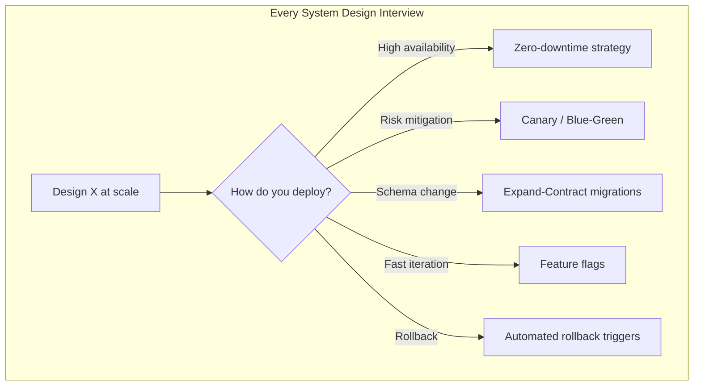

### What "Good" Looks Like in an Interview

| Level | What You Demonstrate |
|-------|---------------------|
| **Junior** | Names a strategy ("we'd use blue-green") |
| **Mid** | Explains why ("zero-downtime; instant rollback by switching traffic") |
| **Senior** | Describes how ("K8s rolling update with maxUnavailable=0, readiness probes, pre-stop hook draining connections") |
| **Staff** | Anticipates failure ("canary watches error rate SLO; auto-rollback if 5xx > 1% for 2 min; expand-contract for DB column rename") |

### The Two Axes Interviewers Probe

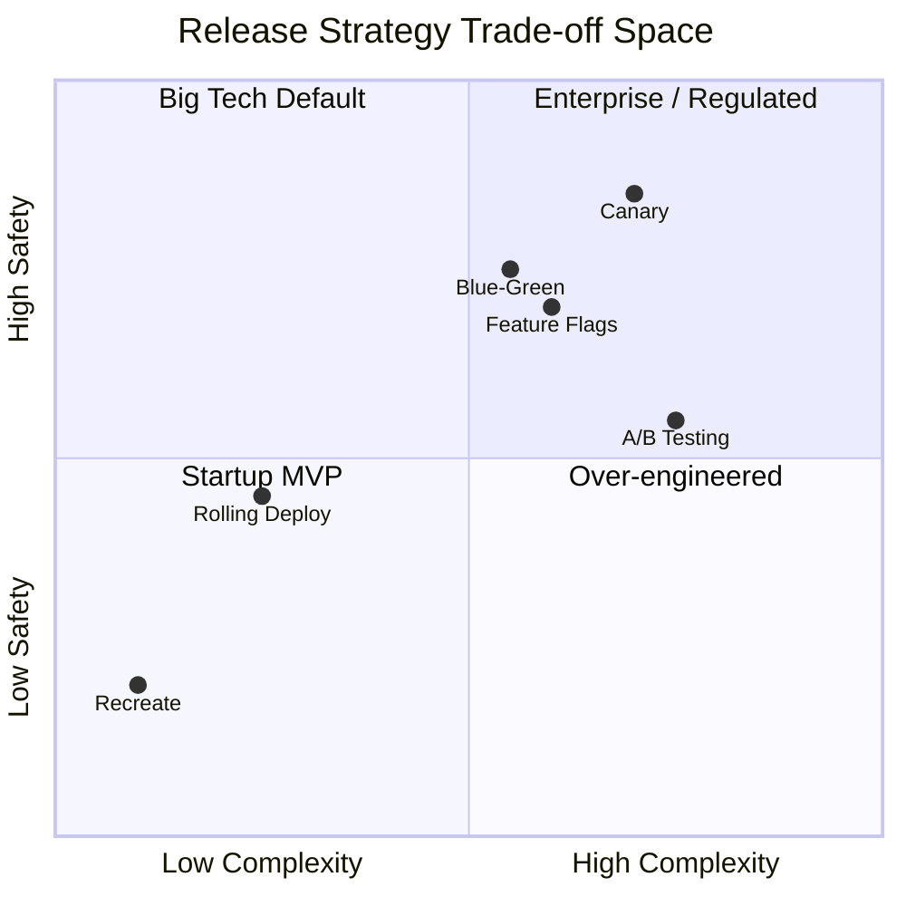

---

## 2. CI/CD Pipeline Anatomy

### 2.1 The Four Stages Every Pipeline Has

```mermaid
flowchart LR
    subgraph Source
        GIT[Git Push / PR Merge]
        TAG[Tag / Release Branch]
    end

    subgraph Build
        COMPILE[Compile / Bundle]
        ARTIFACT[Container Image / JAR / Binary]
        SBOM[SBOM Generation]
    end

    subgraph Test
        UNIT[Unit Tests]
        INT[Integration Tests]
        E2E[E2E / Contract Tests]
        PERF[Load / Perf Regression]
    end

    subgraph Scan
        SAST[SAST - Code Analysis]
        SCA[SCA - Dependency CVEs]
        CONTAINER[Container Image Scan]
        SECRET[Secret Detection]
    end

    subgraph Deploy
        STG[Staging]
        CAN[Canary / Progressive]
        PROD[Production]
        VERIFY[Post-deploy Verification]
    end

    GIT --> COMPILE --> ARTIFACT
    ARTIFACT --> UNIT --> INT --> E2E
    E2E --> SAST --> SCA --> CONTAINER
    CONTAINER --> STG --> CAN --> PROD --> VERIFY
```

| Stage | Purpose | Failure Action | Typical Duration |
|-------|---------|----------------|------------------|
| **Build** | Produce immutable artifact | Block pipeline; no deploy | 2–10 min |
| **Test** | Validate correctness | Block deploy; notify author | 5–30 min |
| **Scan** | Security & compliance gate | Block deploy on critical CVE | 1–5 min |
| **Deploy** | Roll out to environment | Rollback or halt promotion | 5–60 min |

### 2.2 CI vs CD vs Continuous Deployment

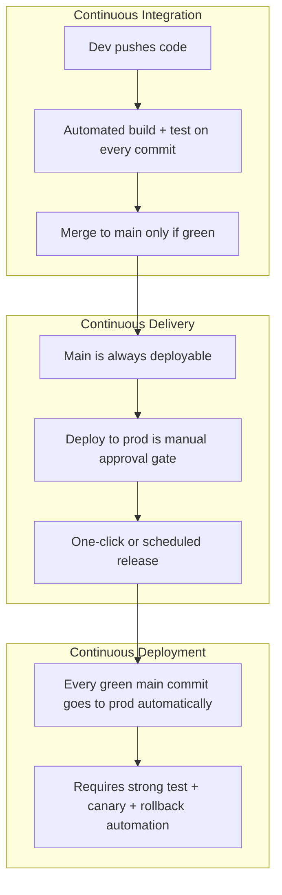

| Model | Human Gate | Release Frequency | Who Uses It |
|-------|-----------|-------------------|-------------|
| **CI only** | Manual build + deploy | Weekly/monthly | Legacy enterprises |
| **Continuous Delivery** | Manual prod approval | Daily–weekly | Most mid-size companies |
| **Continuous Deployment** | None (automated) | Multiple per day | Google, Meta, Netflix, Stripe |

**Interview line:**

> "I'd design for continuous delivery — main is always deployable, staging mirrors prod. Production promotion is automated with canary analysis but gated on SLO checks, not a human button for every deploy."

### 2.3 Pipeline as a Directed Acyclic Graph (DAG)

Modern CI systems (GitHub Actions, GitLab CI, Buildkite) model pipelines as DAGs — parallel jobs where possible.

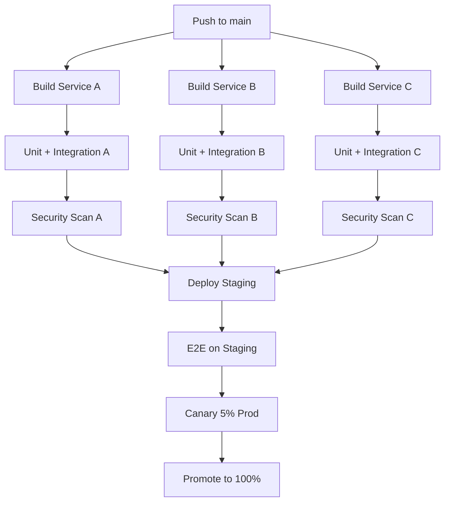

**Key design decisions for pipeline DAGs:**

| Decision | Options | Interview Recommendation |
|----------|---------|-------------------------|
| **Monorepo vs polyrepo** | One pipeline vs per-service | Monorepo: affected-path detection to avoid building everything |
| **Artifact immutability** | Rebuild on deploy vs promote same artifact | Promote same SHA/image digest from staging → prod |
| **Environment parity** | Staging ≈ prod | Same K8s manifests, smaller replica count |
| **Pipeline per service** | Independent deploy units | Microservices: each service owns its pipeline |

### 2.4 Build Stage Deep Dive

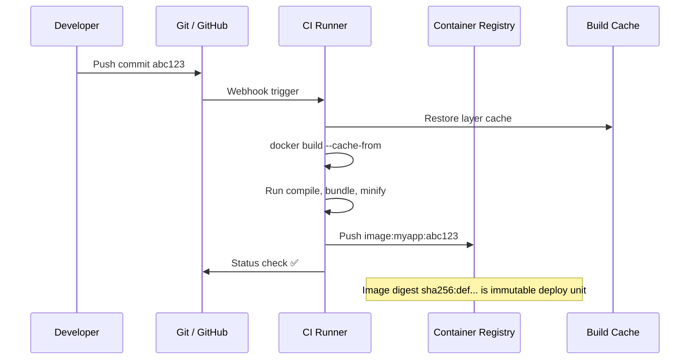

**Build best practices (say these in interviews):**

| Practice | Why |
|----------|-----|
| **Immutable artifacts** | Same binary/image promoted across environments — no "works in staging" surprises |
| **Semantic versioning + SHA tags** | `v2.4.1` for humans, `abc123` for traceability |
| **Multi-stage Docker builds** | Smaller images, faster deploys, smaller attack surface |
| **Build cache** | Layer caching cuts build time 50–80% |
| **Reproducible builds** | Lock files, pinned base images, hermetic builds (Bazel) |

### 2.5 Test Stage — The Quality Gate Pyramid

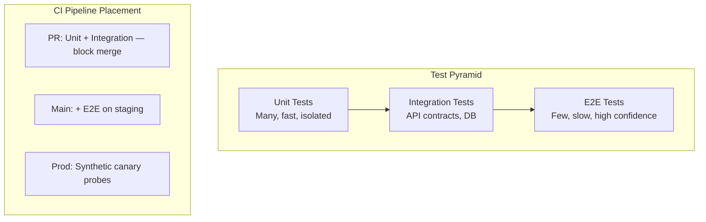

| Test Type | Run When | Blocks Deploy? | Typical Count |
|-----------|----------|----------------|---------------|
| **Unit** | Every commit | Yes (PR gate) | 10,000+ |
| **Integration** | Every commit | Yes | 500–2,000 |
| **Contract** | Every API change | Yes | Per service boundary |
| **E2E** | Pre-prod promotion | Yes | 50–200 critical paths |
| **Load/perf** | Nightly or pre-release | Warn/block on regression | 5–10 scenarios |
| **Chaos** | Scheduled | No (informational) | Game days |

### 2.6 Scan Stage — Shift Left on Security

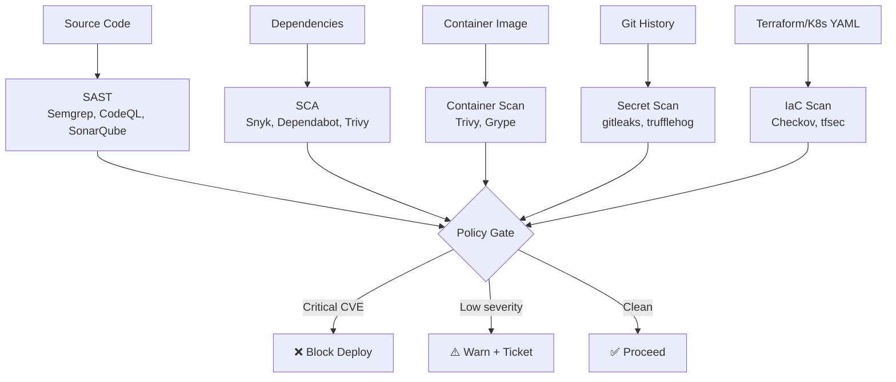

**Interview framing:**

> "Security scans are part of the deploy gate, not a quarterly audit. Critical CVEs block the pipeline. We accept risk on lows with a ticket — but nothing reaches prod unscanned."

### 2.7 Deploy Stage — GitOps vs Push-Based

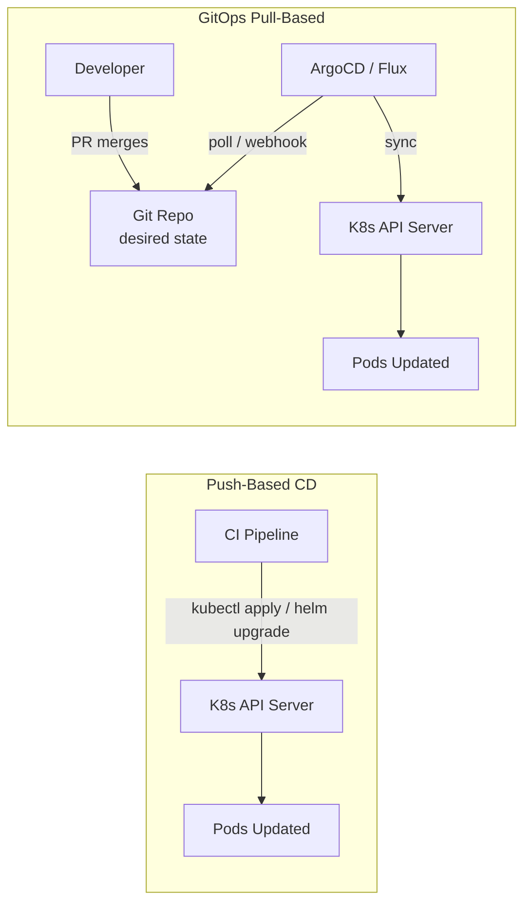

| Model | How It Works | Pros | Cons |
|-------|-------------|------|------|
| **Push-based** | CI/CD tool applies manifests directly | Simple, familiar | CI needs cluster credentials; drift possible |
| **GitOps** | Git is source of truth; operator reconciles | Auditable, drift detection, easy rollback (git revert) | Extra component; learning curve |

**Staff-level answer:**

> "I'd use GitOps — every prod change is a git commit. ArgoCD reconciles cluster state. Rollback is `git revert` + sync. CI only updates image tag in the manifest repo; it never holds kubeconfig for prod."

---

## 3. Deployment Strategies — Deep Dive

### 3.1 Strategy Overview Matrix

| Strategy | Downtime | Rollback Speed | Resource Cost | Risk Isolation | Complexity |
|----------|----------|---------------|---------------|----------------|------------|
| **Recreate** | Yes (minutes) | Slow (redeploy) | 1× | None | Low |
| **Rolling** | No* | Slow (roll back revision) | 1× | Partial (batch) | Low |
| **Blue-Green** | No | Instant (switch LB) | 2× | Full (two envs) | Medium |
| **Canary** | No | Fast (shift traffic back) | 1.05–1.5× | Excellent (%) | High |
| **Feature Flags** | No | Instant (toggle) | 1× | Per-feature | Medium |
| **A/B Testing** | No | Instant | 1× | Per-user cohort | High |

*Rolling achieves zero downtime only with proper health checks and `maxUnavailable=0`.

### 3.2 Recreate Deployment

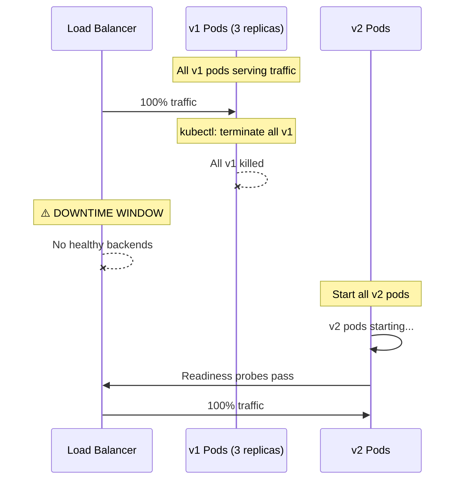

**When to use:** Dev/staging only, batch jobs, stateless maintenance windows, embedded devices.

**Interview:** Never propose recreate for a user-facing production API unless explicitly doing maintenance.

### 3.3 Rolling Deployment

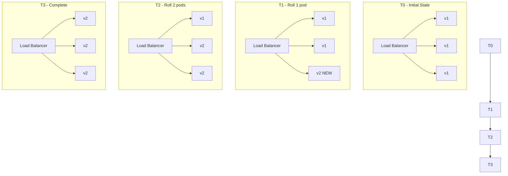

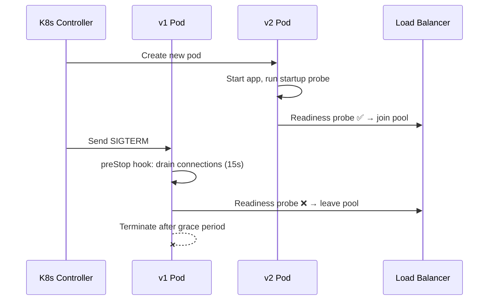

**Kubernetes rolling update parameters:**

```yaml
strategy:
  type: RollingUpdate
  rollingUpdate:
    maxSurge: 1        # Extra pods above desired count during rollout
    maxUnavailable: 0  # Never go below desired — zero downtime
```

| Parameter | Effect | Zero-Downtime Setting |
|-----------|--------|----------------------|
| `maxSurge` | How many extra pods during rollout | `1` or `25%` |
| `maxUnavailable` | How many pods can be down | `0` (critical for ZDD) |
| `minReadySeconds` | Wait before considering pod available | `10–30` |
| `progressDeadlineSeconds` | Fail rollout if stuck | `600` |

**Rolling deploy risks:**

| Risk | What Happens | Mitigation |
|------|-------------|------------|
| **Mixed versions** | v1 and v2 serve traffic simultaneously | Backward-compatible API changes only |
| **Bad binary rolls out** | Bad pods gradually join pool | Readiness probes; canary before full rolling |
| **Slow rollout** | 50 pods × 30s drain = 25 min | Increase `maxSurge`; parallelize |
| **Connection drain failure** | Requests killed mid-flight | `preStop` hook + graceful shutdown |

### 3.4 Blue-Green Deployment

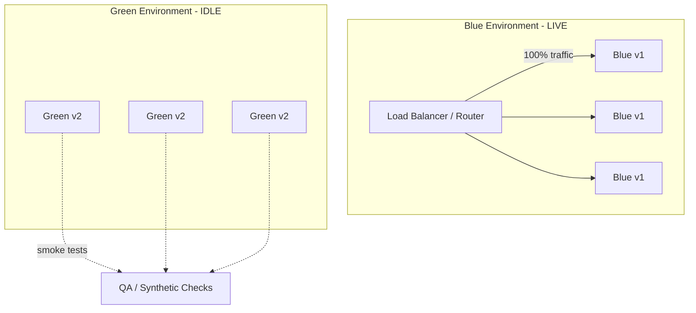

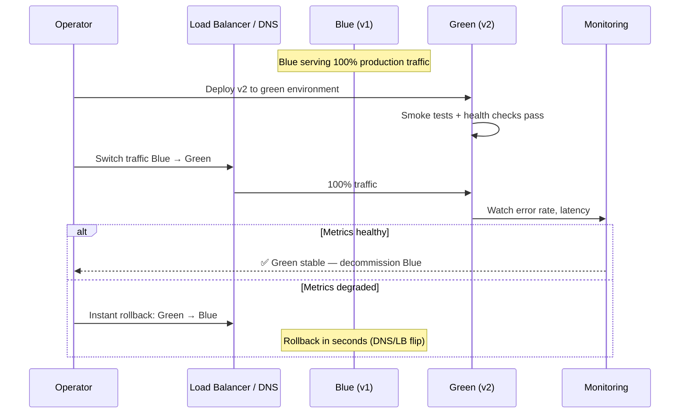

**Blue-green characteristics:**

| Aspect | Detail |
|--------|--------|
| **Rollback** | Instant — flip load balancer/DNS back to blue |
| **Cost** | 2× infrastructure during deploy window |
| **Database** | Hard — both environments share DB; schema must be compatible |
| **DNS TTL** | If using DNS switch, TTL affects rollback speed (use LB instead) |
| **Best for** | Major releases, regulated industries, monoliths |

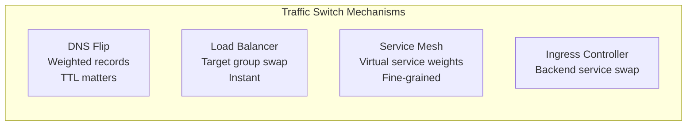

### 3.5 Canary Deployment

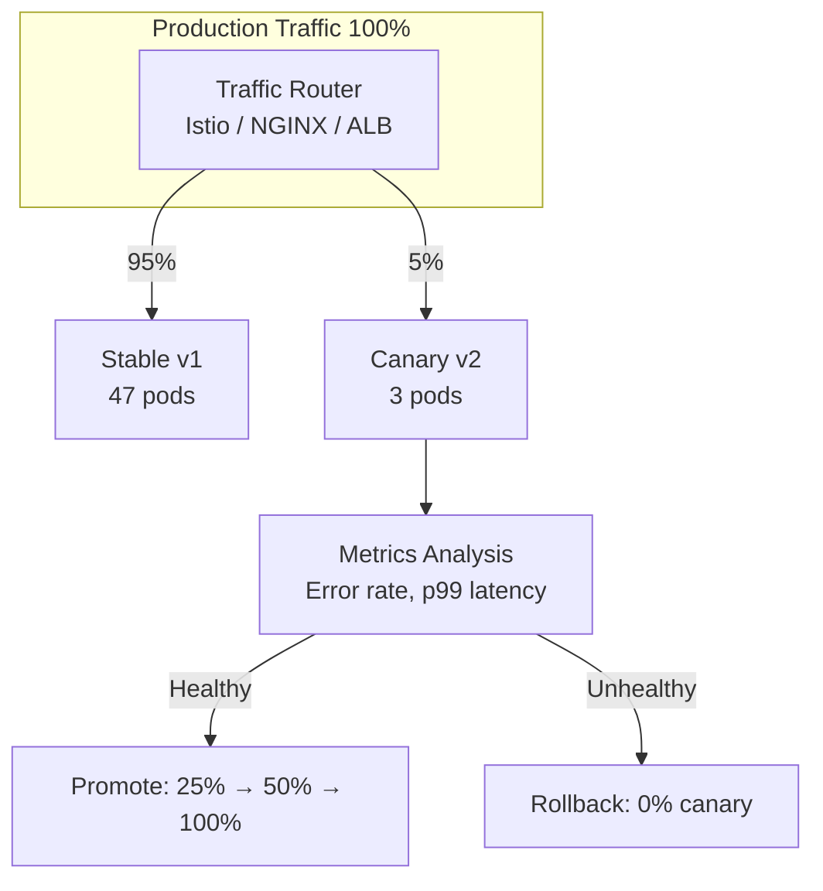

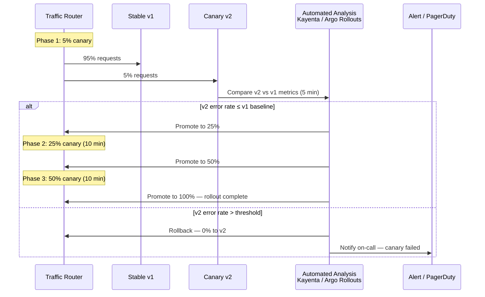

**Canary analysis metrics (memorize for interviews):**

| Metric | Threshold Example | Why |
|--------|------------------|-----|
| **HTTP 5xx rate** | < 0.1% (vs baseline) | Direct user impact |
| **p99 latency** | < 10% regression | Performance degradation |
| **Business metric** | Checkout success rate | Catches logic bugs tests miss |
| **CPU / memory** | < 20% increase | Resource leak detection |
| **Custom SLI** | Search null-result rate | Domain-specific correctness |

**Canary routing mechanisms:**

```mermaid
graph TB
    subgraph Header-Based Canary
        H_REQ[Request + header<br/>X-Canary: true] --> H_ROUTE[Router]
        H_ROUTE --> H_V2[Canary v2]
    end

    subgraph Weight-Based Canary
        W_REQ[Normal request] --> W_ROUTE[Router<br/>5% weighted random]
        W_ROUTE -->|5%| W_V2[Canary v2]
        W_ROUTE -->|95%| W_V1[Stable v1]
    end

    subgraph Hash-Based Canary
        HASH_REQ[Request] --> HASH_ROUTE[Router<br/>hash(user_id) % 100 < 5]
        HASH_ROUTE -->|sticky 5%| HASH_V2[Canary v2]
        HASH_ROUTE -->|95%| HASH_V1[Stable v1]
    end
```

| Routing Type | Sticky? | Use Case |
|-------------|---------|----------|
| **Weight-based random** | No | Stateless APIs |
| **Hash-based** | Yes — same user always hits canary | Stateful flows, UX consistency |
| **Header-based** | Yes — for internal testing | Dogfooding before external canary |

### 3.6 Feature Flags (Dark Launching)

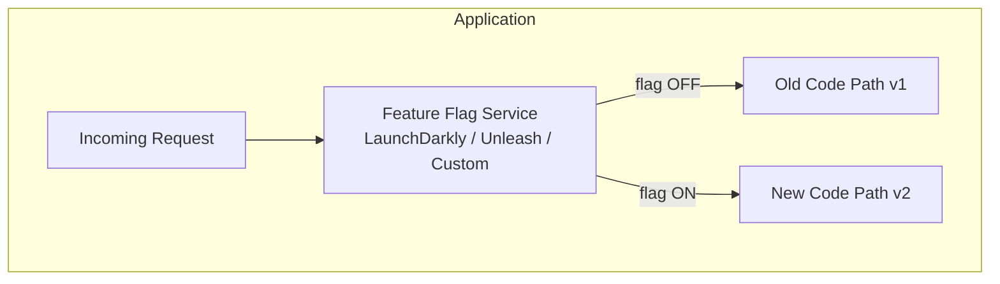

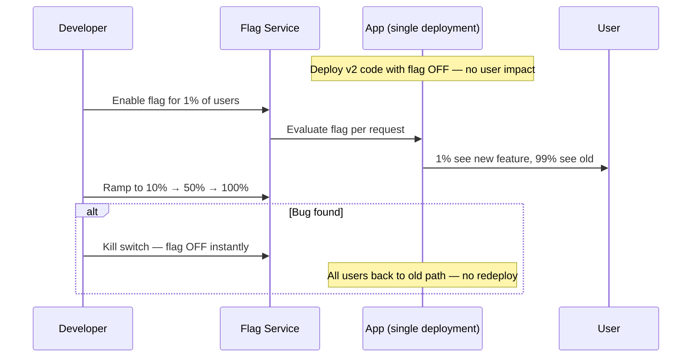

**Feature flags vs canary — when to use which:**

| Dimension | Canary | Feature Flags |
|-----------|--------|---------------|
| **Unit of change** | Entire deployment / binary | Individual feature within same binary |
| **Rollback speed** | Minutes (traffic shift) | Milliseconds (toggle) |
| **Scope** | Infrastructure-level | Application-level |
| **Code in prod** | Only canary pods run new code | All pods have new code; flag gates execution |
| **Best for** | Infra changes, dependency upgrades | Product features, A/B experiments |
| **Risk** | Two versions running | Flag misconfiguration exposes unfinished code |

**Flag types:**

| Type | Lifetime | Example |
|------|----------|---------|
| **Release flag** | Days–weeks; delete after launch | New checkout flow |
| **Ops flag** | Permanent | Circuit breaker, rate limit toggle |
| **Experiment flag** | Weeks; drives A/B analysis | Button color test |
| **Permission flag** | Permanent | Premium feature gating |

### 3.7 A/B Testing vs Canary vs Feature Flags

```mermaid
graph TB
    subgraph A/B Testing - Product Experimentation
        AB_USER[User] --> AB_SPLIT[Experiment Splitter<br/>user_id hash]
        AB_SPLIT -->|Group A 50%| VAR_A[Variant A - blue button]
        AB_SPLIT -->|Group B 50%| VAR_B[Variant B - green button]
        VAR_A --> AB_METRICS[Analytics Pipeline<br/>conversion rate]
        VAR_B --> AB_METRICS
        AB_METRICS --> AB_DECISION[Product Decision<br/>which variant wins]
    end
```

| Concept | Primary Goal | Success Metric | Owner |
|---------|-------------|----------------|-------|
| **Canary** | Safe deploy | Error rate, latency | Engineering / SRE |
| **Feature flag** | Decouple deploy from release | Feature adoption, bug escape | Engineering + Product |
| **A/B test** | Product optimization | Conversion, engagement, revenue | Product + Data Science |

**Interview distinction (say this clearly):**

> "Canary validates that the *deployment* is safe — it's an engineering gate. A/B testing validates that a *product change* is better — it's a product gate. Feature flags decouple *code deploy* from *feature exposure*. I'd use all three: deploy via canary, expose new UI via feature flag, and run A/B test on the flagged cohort."

### 3.8 Deployment Strategy Decision Tree

```mermaid
flowchart TD
    START[Need to deploy new version]
    START --> Q1{Zero downtime<br/>required?}
    Q1 -->|No| REC[Recreate<br/>dev/staging only]
    Q1 -->|Yes| Q2{Instant rollback<br/>required?}
    Q2 -->|Yes| Q3{2× resources<br/>available?}
    Q3 -->|Yes| BG[Blue-Green]
    Q3 -->|No| Q4{Automated metric<br/>analysis available?}
    Q4 -->|Yes| CAN[Canary]
    Q4 -->|No| ROLL[Rolling + manual verification]
    Q2 -->|No| ROLL
    START --> Q5{Feature-level<br/>granularity needed?}
    Q5 -->|Yes| FF[Feature Flags<br/>+ any deploy strategy]
```

---

## 4. Zero-Downtime Deployment

### 4.1 The Four Requirements for Zero Downtime

```mermaid
graph TB
    ZDD[Zero-Downtime Deployment]

    ZDD --> R1[1. Health Checks<br/>Readiness + Liveness]
    ZDD --> R2[2. Graceful Shutdown<br/>Drain in-flight requests]
    ZDD --> R3[3. Backward Compatibility<br/>v1 ↔ v2 API contract]
    ZDD --> R4[4. Surge Capacity<br/>maxSurge / extra instances]
```

| Requirement | Without It | With It |
|-------------|-----------|---------|
| **Readiness probe** | Traffic hits starting pod → 502 errors | Pod joins LB only when ready |
| **Liveness probe** | Dead pod serves traffic until manual fix | K8s restarts unhealthy pod |
| **Graceful shutdown** | In-flight requests killed on SIGTERM | `preStop` hook drains for 15–30s |
| **Backward compatibility** | v2 breaks v1 clients during mixed rollout | Expand-contract schema; versioned APIs |
| **Connection draining** | LB sends traffic to terminating pod | Deregister from pool before kill |

### 4.2 Graceful Shutdown Sequence

```mermaid
sequenceDiagram
    participant K8s as Kubernetes
    participant Pod as Application Pod
    participant LB as Load Balancer
    participant Client as Client

    K8s->>Pod: SIGTERM (termination begins)
    Pod->>Pod: preStop hook: sleep 5s (propagation delay)
    Pod->>LB: Readiness fails → removed from pool
    Note over LB: No new connections routed here
    Client->>Pod: In-flight request completes (up to 30s)
    Pod->>Pod: Stop accepting new connections
    Pod->>Pod: Drain existing connections
    K8s->>Pod: SIGKILL after terminationGracePeriodSeconds
```

**Graceful shutdown checklist:**

```yaml
# Kubernetes deployment excerpt
spec:
  terminationGracePeriodSeconds: 30
  containers:
  - name: app
    lifecycle:
      preStop:
        exec:
          command: ["/bin/sh", "-c", "sleep 5"]
    readinessProbe:
      httpGet:
        path: /health/ready
        port: 8080
      periodSeconds: 5
    livenessProbe:
      httpGet:
        path: /health/live
        port: 8080
      periodSeconds: 10
```

### 4.3 Backward Compatibility During Mixed-Version Rollout

```mermaid
graph LR
    subgraph Rolling Deploy - Mixed Versions
        CLIENT[Client v1 SDK]
        V1_SRV[Server v1.5<br/>old field: name string]
        V2_SRV[Server v2.0<br/>new field: name object]
    end

    CLIENT -->|50% traffic| V1_SRV
    CLIENT -->|50% traffic| V2_SRV
```

**Rules for backward-compatible deploys:**

| Change Type | Safe During Rolling? | Pattern |
|-------------|---------------------|---------|
| Add optional API field | ✅ Yes | New field ignored by old clients |
| Add DB column (nullable) | ✅ Yes | Expand phase |
| Remove API field | ❌ No | Deprecate → wait → remove (contract) |
| Rename DB column | ❌ No | Expand-contract: add new, dual-write, migrate, drop old |
| Change response format | ❌ No | Version API (`/v1`, `/v2`) or content negotiation |

### 4.4 Load Balancer Coordination

```mermaid
sequenceDiagram
    participant Pod as New Pod
    participant K8s as K8s Endpoints
    participant LB as Load Balancer
    participant Old as Old Pod

    Pod->>Pod: App starts, binds port
    Pod->>K8s: Readiness probe passes
    K8s->>LB: Endpoints updated (+ new pod IP)
    Note over LB: Propagation delay 5-30s depending on LB
    LB->>Pod: New traffic begins

    par Old pod termination
        Old->>K8s: Readiness fails
        K8s->>LB: Endpoints updated (- old pod IP)
        Note over LB: Propagation delay again
        Old->>Old: Drain remaining connections
    end
```

**Why `preStop sleep` is necessary:** K8s removes endpoint before LB stops sending traffic — the sleep bridges the propagation gap.

### 4.5 Zero-Downtime for Stateful Services

```mermaid
graph TB
    subgraph Stateless API - Easy ZDD
        SL_LB[LB] --> SL1[Pod 1]
        SL_LB --> SL2[Pod 2]
        SL_LB --> SL3[Pod 3]
    end

    subgraph Stateful - Hard ZDD
        ST_LB[LB] --> ST1[Pod 1<br/>in-memory state]
        ST_LB --> ST2[Pod 2<br/>in-memory state]
        ST1 --> REDIS[(External State<br/>Redis / DB)]
        ST2 --> REDIS
    end
```

| Service Type | ZDD Approach |
|-------------|-------------|
| **Stateless REST API** | Rolling update, `maxUnavailable=0` |
| **WebSocket gateway** | Drain connections; sticky routing; long grace period (60s+) |
| **Database** | Rolling restart with leader election; or maintenance window |
| **Message consumer** | Stop consumer → finish in-flight → rebalance partition |
| **Cache (Redis)** | Replica promotion; never restart primary during peak |

---

## 5. Database Migration Strategies with Deploys

### 5.1 The Expand-Contract Pattern (Mandatory Interview Knowledge)

```mermaid
graph LR
    subgraph Phase 1 - EXPAND
        E_APP[App v1] --> E_DB[(DB: add new column<br/>nullable, unused)]
    end

    subgraph Phase 2 - MIGRATE
        M_APP[App v2<br/>dual-write both columns] --> M_DB[(DB: both columns populated)]
    end

    subgraph Phase 3 - SWITCH
        S_APP[App v3<br/>read from new column] --> S_DB[(DB: new column is source of truth)]
    end

    subgraph Phase 4 - CONTRACT
        C_APP[App v4] --> C_DB[(DB: drop old column)]
    end

    E_APP --> M_APP --> S_APP --> C_APP
```

```mermaid
sequenceDiagram
    participant Eng as Engineering
    participant DB as Database
    participant App as Application

    Note over Eng,DB: Phase 1: EXPAND (Deploy 1)
    Eng->>DB: ALTER TABLE ADD COLUMN new_email VARCHAR NULL
    Note over App: v1 app ignores new column — no behavior change

    Note over Eng,DB: Phase 2: MIGRATE (Deploy 2)
    Eng->>App: v2 writes to BOTH old and new columns
    Eng->>DB: Backfill job: UPDATE SET new_email = old_email WHERE new_email IS NULL

    Note over Eng,DB: Phase 3: SWITCH (Deploy 3)
    Eng->>App: v3 reads from new column only

    Note over Eng,DB: Phase 4: CONTRACT (Deploy 4)
    Eng->>DB: ALTER TABLE DROP COLUMN old_email
```

**Why you cannot skip phases:**

| Shortcut Attempt | What Breaks |
|-----------------|------------|
| Rename column in one deploy | Old app crashes on missing column |
| Add NOT NULL column instantly | Insert fails until all code writes it |
| Drop column while old app reads it | Query errors on 50% of pods during rolling deploy |

### 5.2 Migration Types and Deploy Coordination

| Migration Type | Online? | Deploy Coordination | Tool Examples |
|---------------|---------|---------------------|---------------|
| **Add nullable column** | ✅ Yes | Any deploy order | Flyway, Liquibase, gh-ost |
| **Add index** | ✅ Yes (concurrently) | No app change needed | `CREATE INDEX CONCURRENTLY` |
| **Rename column** | ❌ Multi-phase | Expand-contract (4 deploys) | gh-ost, pt-online-schema-change |
| **Change column type** | ❌ Multi-phase | Add new col → migrate → drop | gh-ost |
| **Add NOT NULL constraint** | ⚠️ Phased | Add nullable → backfill → add constraint | Multi-step |
| **Table partition** | ⚠️ Complex | Often maintenance window | pg_partman |

### 5.3 Online Schema Change Tools

```mermaid
graph TB
    subgraph gh-ost / pt-online-schema-change
        APP[Application] --> PROXY[Schema Change Proxy]
        PROXY --> ORIG[(Original Table)]
        PROXY --> GHOST[(Ghost Table<br/>new schema)]
        GHOST --> SYNC[Continuous binlog sync]
        SYNC --> CUTOVER[Atomic rename<br/>milliseconds lock]
    end
```

| Tool | How It Works | Lock Duration | Best For |
|------|-------------|---------------|----------|
| **gh-ost** | Triggerless binlog replication to ghost table | ~ms at cutover | MySQL large tables |
| **pt-online-schema-change** | Triggers-based sync | ~ms at cutover | MySQL (older approach) |
| **pg_repack** | Rewrite table online | Brief lock at end | PostgreSQL bloat |
| **Flyway / Liquibase** | Versioned migration scripts | Depends on SQL | App-coordinated migrations |
| **CREATE INDEX CONCURRENTLY** | PG builds index without blocking writes | None | PostgreSQL indexing |

### 5.4 Multi-Service Database Migration Coordination

```mermaid
graph TB
    subgraph Deploy Order for Shared DB
        D1[Deploy 1: Add column (nullable)<br/>All services compatible]
        D2[Deploy 2: Service A writes new column]
        D3[Deploy 3: Service B writes new column]
        D4[Deploy 4: Backfill complete]
        D5[Deploy 5: All services read new column]
        D6[Deploy 6: Drop old column]
    end

    D1 --> D2 --> D3 --> D4 --> D5 --> D6
```

**Interview scenario — "How do you rename a column used by 5 microservices?"**

> "Expand-contract across multiple deploy cycles. Deploy 1: add `new_name` column, nullable. Deploy 2–6: each service updated to dual-write. Run backfill job. Deploy 7: all services read from `new_name`. Deploy 8: drop `old_name`. No single big-bang deploy. Each step is backward compatible with the previous."

### 5.5 Database Deploy Anti-Patterns

| Anti-Pattern | Consequence | Correct Approach |
|-------------|-------------|-----------------|
| **Big-bang migration** | Downtime + data loss risk | Expand-contract |
| **Migration in app startup** | Race conditions with multiple pods | Separate migration job (K8s Job, init container with lock) |
| **Long-running migration in transaction** | Table lock, prod outage | Online schema change tools |
| **Deploy code before schema** | App crashes on missing column | Schema first (expand), then code |
| **Drop column before all code updated** | Query failures | Contract last, after all services migrated |

---

## 6. Rollback Strategies

### 6.1 Rollback Decision Matrix

```mermaid
flowchart TD
    DETECT[Anomaly Detected<br/>5xx spike / latency / business metric]
    DETECT --> AUTO{Automated rollback<br/>configured?}
    AUTO -->|Yes| EVAL[Evaluate canary analysis / SLO breach]
    EVAL -->|Breach| RB_AUTO[Auto-rollback<br/>traffic shift or git revert]
    AUTO -->|No| ONCALL[On-call investigates]
    ONCALL --> RB_MANUAL[Manual rollback decision]
    RB_AUTO --> VERIFY[Verify metrics recover]
    RB_MANUAL --> VERIFY
    VERIFY --> POSTMORTEM[Postmortem + fix forward]
```

| Rollback Method | Speed | Data Risk | When to Use |
|----------------|-------|-----------|-------------|
| **Traffic shift (blue-green)** | Seconds | None (same DB) | Blue-green deploys |
| **Canary rollback** | Seconds–minutes | None | Canary with automated analysis |
| **K8s rollout undo** | 1–10 min | None | `kubectl rollout undo` |
| **Git revert + redeploy** | 5–30 min | None | GitOps workflows |
| **Feature flag kill** | Milliseconds | None | Logic bugs in new feature |
| **DB migration rollback** | Hard / impossible | Data loss risk | Avoid — design forward-only migrations |
| **Forward fix** | 30 min–hours | Depends | When rollback is harder than fix |

### 6.2 Automated Rollback Triggers

```mermaid
graph TB
    subgraph Automated Rollback System
        DEPLOY[New Version Deployed]
        DEPLOY --> WATCH[Watch Metrics<br/>5 min window]
        WATCH --> COMPARE[Compare canary vs baseline]
        COMPARE --> CHECK{Threshold breached?}
        CHECK -->|5xx > 1%| RB[Auto Rollback]
        CHECK -->|p99 > 2× baseline| RB
        CHECK -->|Business KPI drop > 5%| RB
        CHECK -->|All clear| PROMOTE[Continue promotion]
        RB --> NOTIFY[Page on-call + create incident]
        RB --> REVERT[Revert traffic / deployment]
    end
```

**Automated rollback configuration (Argo Rollouts example):**

```yaml
analysis:
  templates:
  - templateName: success-rate
  args:
  - name: service-name
    value: my-app
  metrics:
  - name: error-rate
    interval: 1m
    count: 5
    successCondition: result[0] < 0.01  # < 1% error rate
    failureLimit: 2  # Rollback after 2 failures
```

### 6.3 Rollback vs Roll Forward

```mermaid
quadrantChart
    title Rollback vs Roll Forward Decision
    x-axis Fast to execute --> Slow to execute
    y-axis Low Risk --> High Risk
    quadrant-1 Roll Forward
    quadrant-2 Investigate First
    quadrant-3 Auto Rollback
    quadrant-4 Emergency Rollback
    Feature flag toggle: [0.15, 0.20]
    Blue-green switch: [0.20, 0.25]
    K8s rollout undo: [0.40, 0.30]
    Git revert + rebuild: [0.70, 0.35]
    DB schema rollback: [0.85, 0.90]
    Forward fix hot patch: [0.55, 0.50]
```

| Situation | Rollback | Roll Forward |
|-----------|----------|-------------|
| Bad binary causing 5xx | ✅ Immediate rollback | — |
| Minor UI bug | — | ✅ Fix in next deploy |
| DB migration already at CONTRACT phase | ❌ Cannot rollback schema | ✅ Fix data + forward |
| Security vulnerability in new version | ✅ Rollback immediately | Patch ASAP if rollback slow |
| Canary shows 0.5% error rate increase | ⚠️ Investigate; may be noise | Check sample size |

### 6.4 Immutable Infrastructure and Rollback

```mermaid
graph LR
    subgraph Immutable Model
        REG[Container Registry]
        REG -->|v1.2.3 sha:abc| PROD_V1[Prod running abc]
        REG -->|v1.2.4 sha:def| PROD_V2[Bad deploy def]
        PROD_V2 -->|rollback = deploy abc again| PROD_V1
    end

    subgraph Mutable Model - AVOID
        SSH[SSH into server]
        SSH --> PATCH[git pull / patch files]
        PATCH --> UNKNOWN[Unknown server state]
    end
```

**Interview principle:**

> "Rollback means redeploying the last known-good immutable artifact — not SSH-ing into servers. The container image digest or binary SHA is the rollback unit."

---

## 7. CI/CD Tool Landscape

### 7.1 Tool Category Map

```mermaid
graph TB
    subgraph CI - Build and Test
        GHA[GitHub Actions]
        JENKINS[Jenkins]
        GITLAB[GitLab CI]
        CIRCLE[CircleCI]
        BAZEL[Bazel / BuildBuddy]
    end

    subgraph CD - Deploy Orchestration
        ARGO[ArgoCD / Flux - GitOps]
        SPIN[Spinnaker]
        CODEPIPE[AWS CodePipeline]
        HARNESS[Harness]
    end

    subgraph Progressive Delivery
        ARGO_RO[Argo Rollouts]
        FLAGGER[Flagger]
        LD[LaunchDarkly]
    end

    subgraph Platform
        K8S[Kubernetes]
        HELM[Helm / Kustomize]
        TF[Terraform]
    end

    GHA --> ARGO
    JENKINS --> SPIN
    ARGO --> K8S
    SPIN --> K8S
    ARGO_RO --> K8S
```

### 7.2 GitHub Actions

```mermaid
sequenceDiagram
    participant Dev as Developer
    participant GH as GitHub
    participant Runner as GitHub Runner
    participant ECR as Container Registry
    participant Argo as ArgoCD

    Dev->>GH: Push to main
    GH->>Runner: Trigger workflow
    Runner->>Runner: checkout → build → test → scan
    Runner->>ECR: Push image:sha-abc123
    Runner->>GH: Update manifest repo (image tag)
    Argo->>GH: Detect manifest change
    Argo->>Argo: Sync to K8s cluster
```

| Aspect | Detail |
|--------|--------|
| **Model** | Event-driven workflows (YAML); GitHub-hosted or self-hosted runners |
| **Strengths** | Native GitHub integration, marketplace actions, matrix builds |
| **Weaknesses** | Limited deployment orchestration; not a full CD platform |
| **Best for** | Open-source, GitHub-centric orgs, CI + trigger CD |
| **Interview mention** | "GHA for CI; ArgoCD for CD — separation of concerns" |

**Typical GHA pipeline structure:**

```yaml
# Conceptual — not copy-paste production config
on:
  push:
    branches: [main]
  pull_request:
    branches: [main]

jobs:
  test:
    runs-on: ubuntu-latest
    steps:
      - uses: actions/checkout@v4
      - run: make test

  build-and-push:
    needs: test
    if: github.ref == 'refs/heads/main'
    steps:
      - run: docker build -t app:${{ github.sha }} .
      - run: docker push app:${{ github.sha }}

  deploy-staging:
    needs: build-and-push
    steps:
      - run: update-manifest staging ${{ github.sha }}

  deploy-prod:
    needs: deploy-staging
    environment: production  # approval gate
    steps:
      - run: update-manifest prod ${{ github.sha }}
```

### 7.3 Jenkins

```mermaid
graph TB
    subgraph Jenkins Architecture
        MASTER[Jenkins Controller]
        AGENT1[Agent 1<br/>Docker executor]
        AGENT2[Agent 2<br/>K8s pod executor]
        AGENT3[Agent N<br/>Static VM]
        PLUGINS[Plugin Ecosystem<br/>2000+ plugins]
    end

    MASTER --> AGENT1
    MASTER --> AGENT2
    MASTER --> AGENT3
    MASTER --> PLUGINS
```

| Aspect | Detail |
|--------|--------|
| **Model** | Self-hosted controller + agents; Groovy Jenkinsfiles |
| **Strengths** | Extremely flexible, plugin ecosystem, on-prem friendly |
| **Weaknesses** | Operational burden, plugin fragility, UI dated |
| **Best for** | Enterprises with on-prem, complex legacy pipelines |
| **Interview mention** | "Jenkins for legacy polyglot builds; migrating to GHA + ArgoCD for cloud-native" |

**Jenkins vs GitHub Actions (interview comparison):**

| Dimension | Jenkins | GitHub Actions |
|-----------|---------|----------------|
| **Hosting** | Self-managed | GitHub-hosted or self-hosted |
| **Config** | Jenkinsfile (Groovy) | Workflow YAML |
| **Ecosystem** | Plugins (fragile) | Actions marketplace |
| **Scalability** | Manual agent management | Elastic runners |
| **Modern adoption** | Declining for new projects | Default for GitHub orgs |

### 7.4 ArgoCD (GitOps CD)

```mermaid
graph TB
    subgraph GitOps Flow
        REPO[Git Manifest Repo<br/>K8s YAML / Helm]
        ARGO[ArgoCD Controller]
        K8S[Kubernetes Cluster]
        UI[ArgoCD UI / CLI]
    end

    REPO -->|poll every 3 min or webhook| ARGO
    ARGO -->|kubectl apply diff| K8S
    ARGO -->|sync status| UI
    K8S -->|actual state| ARGO
    ARGO -->|drift detection| REPO
```

| Aspect | Detail |
|--------|--------|
| **Model** | Pull-based GitOps; git is desired state |
| **Strengths** | Drift detection, easy rollback (git revert), auditable, multi-cluster |
| **Weaknesses** | K8s-only; learning curve; sync can be destructive if misconfigured |
| **Best for** | Kubernetes deployments, multi-env promotion |
| **Key concepts** | Application, Sync, Health, Drift, App of Apps pattern |

**ArgoCD sync policies:**

| Policy | Behavior | Use Case |
|--------|----------|----------|
| **Manual sync** | Human clicks sync | Production (with approval) |
| **Auto sync** | Reconciles on git change | Staging, dev |
| **Self-heal** | Reverts manual kubectl changes | Enforce git as truth |
| **Prune** | Deletes resources removed from git | Cleanup orphaned resources |

### 7.5 Spinnaker

```mermaid
graph TB
    subgraph Spinnaker Pipelines
        TRIGGER[Trigger<br/>Git / Webhook / Schedule]
        BUILD_B[Bake Manifest<br/>Helm / Kustomize]
        DEPLOY_S[Deploy to Staging]
        CANARY_S[Canary Analysis<br/>Kayenta]
        JUDGE[Automated Judgment<br/>Pass / Fail]
        DEPLOY_P[Deploy to Production]
        MANUAL[Manual Judgment Gate]
    end

    TRIGGER --> BUILD_B --> DEPLOY_S --> CANARY_S --> JUDGE
    JUDGE -->|Pass| MANUAL --> DEPLOY_P
    JUDGE -->|Fail| ROLLBACK[Rollback Stage]
```

| Aspect | Detail |
|--------|--------|
| **Model** | Multi-cloud CD platform; pipeline stages with built-in deployment strategies |
| **Strengths** | Native blue-green, canary, red-black; multi-cloud (K8s, EC2, Lambda); Kayenta canary analysis |
| **Weaknesses** | Complex to operate (multiple microservices); steep learning curve; resource-heavy |
| **Best for** | Netflix-style multi-cloud, large enterprises needing advanced deployment orchestration |
| **Created by** | Netflix; open-source |

**Spinnaker vs ArgoCD (interview comparison):**

| Dimension | Spinnaker | ArgoCD |
|-----------|-----------|--------|
| **Scope** | Full CD platform (CI trigger → deploy) | GitOps sync only |
| **Deploy strategies** | Built-in canary, blue-green, red-black | Via Argo Rollouts extension |
| **Multi-cloud** | AWS, GCP, K8s, bare metal | K8s-focused |
| **Complexity** | High (Deck, Clouddriver, Orca, etc.) | Medium |
| **2026 adoption** | Enterprise legacy; declining for new | Default for K8s GitOps |

### 7.6 Tool Selection for Interviews

```mermaid
flowchart TD
    Q[What CD tool?]
    Q --> K8S{Kubernetes?}
    K8S -->|Yes| GITOPS[ArgoCD + Argo Rollouts<br/>GHA for CI]
    K8S -->|No| CLOUD{Cloud provider?}
    CLOUD -->|AWS| AWS[CodePipeline + CodeDeploy]
    CLOUD -->|Multi-cloud enterprise| SPIN[Spinnaker]
    CLOUD -->|Simple| GHA2[GitHub Actions end-to-end]
```

---

## 8. How Deployment Fits System Design Interviews

### 8.1 Availability ↔ Deployment Connection

```mermaid
graph TB
    subgraph SLA Components
        UPTIME[99.9% Uptime SLA<br/>43 min downtime/month allowed]
        DEPLOY[Deploy 10×/day<br/>5 min each = 50 min risk]
        CONFLICT[Conflict! Deploys can consume entire error budget]
    end

    UPTIME --> ZDD_REQ[Zero-downtime deploys are mandatory]
    DEPLOY --> ZDD_REQ
    ZDD_REQ --> CANARY_REQ[Canary + auto-rollback reduces risk per deploy]
```

**Key interview math:**

```
Availability target: 99.9% (three nines)
  = 43.2 minutes downtime per month allowed

If each deploy risks 5 minutes downtime (recreate):
  10 deploys/month = 50 minutes → SLA BREACH

If zero-downtime deploy with 0.1% canary error rate:
  Error budget consumed only if canary fails detection
  → Deployments become invisible to availability metrics
```

### 8.2 Release Velocity ↔ Architecture Connection

| Architecture Choice | Deploy Impact |
|--------------------|---------------|
| **Monolith** | Single deploy unit; all-or-nothing; slower cadence |
| **Microservices** | Independent deploy per service; higher velocity; integration risk |
| **Feature flags** | Decouple deploy frequency from feature release frequency |
| **Shared database** | Schema migrations block all services — coupling |
| **Database-per-service** | Independent schema evolution; harder cross-service queries |

```mermaid
graph LR
    subgraph High Release Velocity Stack
        MONO[Small services] --> INDEP[Independent pipelines]
        INDEP --> FF[Feature flags]
        FF --> CANARY[Canary analysis]
        CANARY --> AUTO[Auto-rollback]
        AUTO --> GITOPS[GitOps audit trail]
    end
```

### 8.3 Where to Mention CI/CD in a System Design Answer

| Interview Phase | What to Say |
|---------------|-------------|
| **Requirements** | "How often do we deploy? What's acceptable downtime?" |
| **High-level design** | "Each microservice has its own pipeline; shared DB uses expand-contract migrations" |
| **Deep dive (availability)** | "Rolling deploy with maxUnavailable=0; readiness probes; graceful shutdown" |
| **Deep dive (risk)** | "Canary 5% → 25% → 100% with automated error rate analysis" |
| **Trade-offs** | "Blue-green gives instant rollback but 2× cost; canary is cheaper but slower rollback" |
| **Failure modes** | "Bad deploy auto-rollback; DB migrations are forward-only" |

### 8.4 Deployment in the Non-Functional Requirements Table

When you write NFRs in an interview, include deployment:

| Dimension | Target | How Achieved |
|-----------|--------|-------------|
| **Availability** | 99.95% | Zero-downtime rolling + canary |
| **Deploy frequency** | 20×/day per service | CI/CD automation, feature flags |
| **MTTR (bad deploy)** | < 5 min | Auto-rollback on SLO breach |
| **RTO (disaster)** | < 30 min | Blue-green standby region |
| **Change failure rate** | < 5% | Canary analysis + test gates |

---

## 9. Decision Framework — When to Use What

### 9.1 Deployment Strategy Selection

```mermaid
flowchart TD
    START[Choose deployment strategy]

    START --> TEAM{Team size / maturity?}
    TEAM -->|Small, < 10 engineers| ROLL[Rolling + feature flags]
    TEAM -->|Medium, SRE team| CAN[Canary + Argo Rollouts]
    TEAM -->|Large, multi-region| BG[Blue-green per region + canary]

    START --> CRIT{Criticality?}
    CRIT -->|Payment / auth| CAN
    CRIT -->|Internal admin tool| ROLL
    CRIT -->|Batch ETL| REC[Recreate OK]

    START --> FREQ{Deploy frequency?}
    FREQ -->|50+/day| CAN
    FREQ -->|Weekly| ROLL
    FREQ -->|Monthly| BG
```

### 9.2 CI/CD Maturity Model

| Level | Characteristics | Deploy Strategy |
|-------|----------------|-----------------|
| **L0 — Manual** | SSH deploy, no tests | Recreate; prayer |
| **L1 — Basic CI** | Automated tests, manual deploy | Rolling |
| **L2 — CD** | Automated staging, manual prod | Rolling + smoke tests |
| **L3 — Progressive** | Canary, feature flags, auto-rollback | Canary + flags |
| **L4 — Continuous Deployment** | Every commit to prod, full automation | Automated canary + SLO gates |

```mermaid
graph LR
    L0[L0 Manual] --> L1[L1 Basic CI]
    L1 --> L2[L2 CD]
    L2 --> L3[L3 Progressive]
    L3 --> L4[L4 Continuous Deploy]
```

---

## 10. Interview Scenarios & Sample Answers

### Scenario 1: "Design a deployment pipeline for a microservices e-commerce platform"

```mermaid
graph TB
    subgraph E-Commerce Deploy Architecture
        PR[PR] --> GHA[GitHub Actions<br/>per-service pipeline]
        GHA --> TEST[Test + Scan]
        TEST --> IMG[Push to ECR]
        IMG --> MANIFEST[Update GitOps manifest]
        MANIFEST --> ARGO[ArgoCD]
        ARGO --> STG[Staging cluster]
        STG --> E2E[E2E tests]
        E2E --> CANARY[Argo Rollouts canary<br/>5% → 100%]
        CANARY --> PROD[Production]
        PROD --> SYN[Synthetic monitoring]
    end
```

> **Model answer (condensed):**
>
> "Each of the 20 microservices has an independent pipeline triggered on merge to main. GitHub Actions runs unit/integration tests, security scans, builds a container image tagged with the git SHA, and pushes to ECR. A bot commits the new image tag to our GitOps manifest repo. ArgoCD syncs to staging automatically. E2E tests run against staging. Production promotion uses Argo Rollouts: 5% canary for 10 minutes, automated analysis comparing error rate and checkout success rate against baseline. If clean, promote to 25%, 50%, 100%. Auto-rollback on SLO breach.
>
> For the shared order database, all schema changes use expand-contract across multiple deploys. Payment service deploys are gated on stricter canary thresholds (0.01% error rate).
>
> Feature flags (LaunchDarkly) decouple product feature launches from deploys — new checkout UI ships dark, enabled for 1% via flag."

---

### Scenario 2: "How would you deploy a database schema change that renames a column?"

> **Model answer:**
>
> "I would NOT rename in a single deploy. Expand-contract in four phases:
>
> 1. **Expand:** `ALTER TABLE ADD new_column` (nullable). Deploy app that ignores it. Zero risk.
> 2. **Migrate:** Deploy app that dual-writes to both columns. Run backfill: `UPDATE SET new = old WHERE new IS NULL`. Use gh-ost if it's a large MySQL table to avoid locking.
> 3. **Switch:** Deploy app that reads from `new_column` only. Old column still exists as fallback.
> 4. **Contract:** Drop `old_column` after confirming all services are on the new code.
>
> Each phase is a separate deploy, backward compatible with the previous phase. Rollback at any phase means reverting to the previous app version — the schema is always ahead of the code (expand first, contract last)."

---

### Scenario 3: "Your canary shows a 0.3% increase in error rate. Rollback?"

> **Model answer:**
>
> "Not automatically — 0.3% might be noise at 5% traffic. I'd check: (1) Is the absolute error count statistically significant? At 5% canary with 10K RPS total, that's 500 RPS canary — 0.3% = 1.5 errors/sec, need a few minutes to be confident. (2) Is the error type new? Check logs for novel exceptions. (3) Is the baseline stable? If v1 error rate is also fluctuating, comparison is unreliable.
>
> My canary config would set failure threshold at 1% error rate for 3 consecutive minutes with a minimum sample size. 0.3% triggers an alert for human review but not auto-rollback. If it climbs to 0.8% over 5 minutes, auto-rollback."

---

## 11. Failure Modes Across the Pipeline

| Layer | Failure | Impact | Mitigation |
|-------|---------|--------|------------|
| **CI** | Flaky test blocks deploy | Deploy stall; devs bypass gates | Quarantine flaky tests; retry with limit; fix or delete |
| **CI** | Build cache corruption | Bad artifact deployed | Content-addressable cache; rebuild without cache on anomaly |
| **CI** | Runner compromise | Supply chain attack | Ephemeral runners; signed artifacts; SLSA provenance |
| **Scan** | False positive CVE blocks | Deploy delayed for non-exploit | Severity-based gating; exception workflow with expiry |
| **Deploy** | Readiness probe too shallow | Traffic to broken pod | Deep probes: check DB connection, dependency health |
| **Deploy** | preStop missing | 502s during rolling update | preStop sleep + graceful shutdown handler |
| **Deploy** | Canary analysis false negative | Bad version reaches 100% | Multiple metrics; business KPIs; manual judgment gate at 50% |
| **Deploy** | Auto-rollback too aggressive | Good deploy rolled back on noise | Minimum sample size; consecutive failure requirement |
| **DB migration** | Long DDL lock | Production outage | Online schema change (gh-ost); off-peak execution |
| **DB migration** | Backfill overwhelms DB | Replication lag, slow queries | Throttled backfill; read replica promotion delay |
| **Rollback** | DB schema already contracted | Cannot rollback app without schema | Forward-only migrations; expand-contract prevents this |
| **GitOps** | Drift from manual kubectl | State inconsistency | Self-heal enabled; RBAC prevents manual changes |
| **Feature flag** | Flag service down | Default behavior unclear | SDK defaults to OFF; local cache with TTL |

```mermaid
graph TB
    subgraph Pipeline Failure Cascade
        FLAKY[Flaky Test] --> BYPASS[Dev skips CI]
        BYPASS --> BUG[Bug reaches prod]
        BUG --> NO_CANARY[No canary detection]
        NO_CANARY --> OUTAGE[Outage]
        OUTAGE --> SLOW_RB[Slow manual rollback]
    end
```

---

## 12. Trade-offs Master Table

| Strategy / Tool | Deploy Speed | Rollback Speed | Infra Cost | Blast Radius | Complexity |
|----------------|-------------|---------------|------------|-------------|------------|
| **Recreate** | Slow (full restart) | Slow | 1× | Total | Low |
| **Rolling** | Medium (gradual) | Medium (5–15 min) | 1× | Partial per batch | Low |
| **Blue-green** | Fast (pre-staged) | Instant (LB flip) | 2× | Total per env | Medium |
| **Canary** | Slow (analysis waits) | Fast (seconds) | 1.1× | Small (%) | High |
| **Feature flags** | N/A (runtime toggle) | Instant | 1× + flag service | Per feature | Medium |
| **GitHub Actions** | Fast CI | N/A | Low (hosted) | N/A | Low |
| **Jenkins** | Medium CI | N/A | Medium (self-host) | N/A | High |
| **ArgoCD** | Medium CD | Fast (git revert) | Low | N/A | Medium |
| **Spinnaker** | Full pipeline | Fast (built-in) | High (self-host) | N/A | Very High |
| **Expand-contract** | Slow (multi-deploy) | Per-phase | 1× | Minimal per phase | Medium |
| **gh-ost migration** | Online (hours) | Hard | 1× + ghost table | Low | Medium |

---

## 13. Interview Cheat Sheet

### Key Numbers to Memorize

| Metric | Value |
|--------|-------|
| K8s default `terminationGracePeriodSeconds` | 30s |
| K8s default `progressDeadlineSeconds` | 600s (10 min) |
| Typical canary starting traffic | 5% |
| Canary analysis window per step | 5–15 min |
| Blue-green resource overhead | 2× during deploy |
| Auto-rollback error rate threshold | 1% 5xx (tune per service) |
| DNS TTL impact on rollback | Minutes (avoid; use LB) |
| preStop propagation delay | 5–15s sleep |
| Expand-contract phases | 4 (expand, migrate, switch, contract) |
| gh-ost cutover lock time | Milliseconds |

### One-Liner Definitions (Say These Confidently)

| Term | One-Liner |
|------|-----------|
| **CI** | Automate build and test on every code change |
| **CD** | Automate deployment to production (with or without human gate) |
| **GitOps** | Git is the source of truth; operator reconciles cluster to match |
| **Rolling deploy** | Gradually replace old instances with new ones |
| **Blue-green** | Two identical environments; switch traffic instantly |
| **Canary** | Route small % of traffic to new version; analyze before full promotion |
| **Feature flag** | Runtime toggle that decouples deploy from feature release |
| **Expand-contract** | Multi-phase DB migration: add new, migrate, switch, drop old |
| **Readiness probe** | K8s check — pod joins LB only when ready to serve |
| **Graceful shutdown** | Drain in-flight requests before process termination |
| **Immutable artifact** | Same container image/binary promoted across all environments |
| **Auto-rollback** | Revert deploy automatically when canary metrics breach threshold |
| **maxUnavailable: 0** | K8s setting ensuring zero-downtime rolling update |
| **SLSA** | Supply chain security levels for build provenance |

### Must-Mention Points Checklist

- [ ] **Zero-downtime requires** readiness probes + graceful shutdown + backward compatibility
- [ ] **Never rename DB column** in one deploy — expand-contract
- [ ] **Canary watches business metrics**, not just error rate
- [ ] **Rollback unit is immutable artifact** (image SHA), not patched server
- [ ] **Feature flags ≠ canary** — flags gate features; canary gates deployments
- [ ] **GitOps rollback** = `git revert` + sync
- [ ] **preStop sleep** bridges LB propagation delay
- [ ] **DB migration: schema before code** (expand), **code before schema** (contract)
- [ ] **Deploy frequency impacts availability** — ZDD is an SLA requirement
- [ ] **Auto-rollback needs minimum sample size** to avoid noise-induced rollbacks

---

## 14. Follow-Up Questions & Model Answers

**Q1: How do you handle database migrations in a zero-downtime deploy?**

> Use expand-contract: schema changes always lead code changes (add column before app uses it) and trail code changes (drop column after no code uses it). For large tables, use online schema change tools (gh-ost, `CREATE INDEX CONCURRENTLY`). Run migrations as a separate K8s Job with an advisory lock, not in app startup — multiple pods starting simultaneously must not race migrations.

---

**Q2: What is the difference between liveness and readiness probes?**

> **Readiness:** Can this pod serve traffic? Fails → removed from LB pool but not restarted. Use for dependency checks (DB connected). **Liveness:** Is this pod alive or deadlocked? Fails → K8s kills and restarts the pod. Use cautiously — if liveness is too aggressive, you restart pods that are just slow, causing cascading failures.

---

**Q3: How would you deploy a change that is NOT backward compatible?**

> You don't — in a rolling deploy with mixed versions. Options: (1) Version the API (`/v2/endpoint`) and run both versions during transition; (2) Blue-green — switch 100% at once so no mixed versions; (3) Feature flag the new behavior, old code path remains default; (4) Maintenance window with recreate (last resort). The correct answer is almost never "just deploy it."

---

**Q4: Explain GitOps vs traditional CI/CD push deploy.**

> Traditional: CI pipeline holds kubeconfig, runs `kubectl apply` after build. Risk: CI has prod credentials; cluster can drift from what's in git. GitOps: CI only updates a manifest in git (image tag). ArgoCD watches git and reconciles cluster. Rollback is `git revert`. Cluster drift is detected and optionally auto-healed. Audit trail is git history.

---

**Q5: When would you choose Spinnaker over ArgoCD?**

> Spinnaker when you need multi-cloud deployment (K8s + EC2 + Lambda), built-in canary analysis (Kayenta), and complex pipeline orchestration with manual judgment stages — typical of large enterprises that started with Netflix's model. ArgoCD when you're K8s-native, want simpler GitOps, and can add Argo Rollouts for canary. In 2026, new K8s projects default to ArgoCD; Spinnaker is maintained but not growing.

---

**Q6: How do you prevent a bad deploy from consuming your error budget?**

> Three layers: (1) **Pre-deploy gates** — tests, scans, staging E2E; (2) **Progressive exposure** — canary at 5% limits blast radius to 5% of traffic; (3) **Automated analysis** — rollback before canary promotes if metrics degrade. With these, a bad deploy affects at most 5% of traffic for at most the canary window (e.g., 5 minutes) — that's 0.017% of monthly minutes, well within a 99.9% budget.

---

**Q7: How do feature flags interact with canary deploys?**

> They're complementary layers. Canary validates the *binary* is safe (no crashes, no latency regression). Feature flags control *which code paths execute* within that binary. Typical flow: canary deploy new binary with all flags OFF → canary passes → full rollout → gradually enable flags for users. If flag causes issues, kill flag instantly without redeploying. If binary causes issues, rollback canary.

---

**Q8: What is red-black deployment?**

> A Spinnaker term — essentially blue-green with a twist: red (old) stays running but receives zero traffic after cutover, kept as instant rollback target for a configurable window (e.g., 1 hour). After the window, red is destroyed. It's blue-green with a safety buffer before decommissioning the old environment.

---

## 15. Common Mistakes That Fail Interviews

| Mistake | Why It Fails | Correct Answer |
|---------|-------------|----------------|
| "Just deploy at 3 AM" | Ignores availability requirements | Zero-downtime rolling with canary |
| "Rollback the database" | DB rollback often impossible after migration | Forward-only expand-contract migrations |
| "Blue-green is always best" | 2× cost; shared DB complicates it | Choose based on criticality, frequency, resources |
| "CI and CD are the same thing" | Shows conceptual gap | CI = build/test; CD = deploy automation |
| "We don't need canary, we have tests" | Tests don't catch all production issues | Canary catches config, load, and integration issues |
| "Rename column with ALTER TABLE" | Breaks running old code during rolling deploy | Expand-contract across 4 deploys |
| "Kill pod immediately on deploy" | Causes 502s on in-flight requests | Graceful shutdown with preStop + drain |
| "One pipeline for all microservices" | Couples deploys; one failure blocks all | Independent pipeline per service |
| "Feature flags replace canary" | Flags don't catch binary/infrastructure issues | Use both: canary for deploy, flags for features |
| Ignoring supply chain security | Modern interview expectation | Scan images, sign artifacts, SLSA provenance |

---

## Quick Reference Card

```mermaid
mindmap
  root((CI/CD & Deploy))
    Pipeline
      Build — immutable artifact
      Test — pyramid gate
      Scan — shift left security
      Deploy — progressive promotion
    Strategies
      Rolling — gradual, maxUnavailable 0
      Blue-Green — instant rollback, 2x cost
      Canary — limit blast radius
      Feature Flags — decouple release
      A/B — product experimentation
    Zero Downtime
      Readiness probe
      Graceful shutdown
      preStop sleep
      Backward compatibility
    DB Migrations
      Expand — add column
      Migrate — dual write + backfill
      Switch — read new column
      Contract — drop old column
    Rollback
      Traffic shift — seconds
      K8s rollout undo — minutes
      Git revert — GitOps
      Feature flag kill — instant
      DB — forward only
    Tools
      GHA — CI
      Jenkins — legacy CI
      ArgoCD — GitOps CD
      Spinnaker — multi-cloud CD
      Argo Rollouts — canary
```

---

> **Interview Tip:** When deployment comes up in any system design, use this framework out loud: *"I'd deploy via immutable container artifacts with a CI pipeline that gates on tests and security scans. Production promotion uses canary analysis — 5% traffic, compare error rate and p99 latency against baseline, auto-rollback on SLO breach. Database changes use expand-contract across multiple deploys — never big-bang schema changes. Feature flags decouple product launches from deploy cadence."* That single paragraph demonstrates senior-level infrastructure thinking.

---

*Cross-reference: [Scaling & Load Balancing Fundamentals](../08-fundamentals/23-scaling-cap-caching-load-balancing-sharding-indexing.md) · [Observability — Logging, Tracing, Metrics](./33-observability-logging-tracing-metrics.md) · [Design Metrics & Monitoring (Datadog)](../06-platform-building-blocks/20-design-metrics-monitoring.md)*
