# Observability — Logging, Tracing & Metrics

> **The definitive infrastructure guide** for system design interviews at Google, Microsoft, Meta, and Amazon. Covers *what* each observability pillar is, *how* it is implemented, *where* to use it, and *what interviewers expect* you to say about debugging at scale, SLOs, and alert design.

---

## Table of Contents

1. [Why Interviewers Care About Observability](#1-why-interviewers-care-about-observability)
2. [The Three Pillars of Observability](#2-the-three-pillars-of-observability)
3. [Metrics — Deep Dive](#3-metrics--deep-dive)
4. [Logging — Deep Dive](#4-logging--deep-dive)
5. [Distributed Tracing — Deep Dive](#5-distributed-tracing--deep-dive)
6. [SLI, SLO, SLA & Error Budgets](#6-sli-slo-sla--error-budgets)
7. [Alerting Strategies](#7-alerting-strategies)
8. [RED Method & USE Method](#8-red-method--use-method)
9. [How Observability Fits System Design Interviews](#9-how-observability-fits-system-design-interviews)
10. [Debugging at Scale — The Incident Workflow](#10-debugging-at-scale--the-incident-workflow)
11. [Decision Framework — When to Use What](#11-decision-framework--when-to-use-what)
12. [Interview Scenarios & Sample Answers](#12-interview-scenarios--sample-answers)
13. [Failure Modes Across Observability](#13-failure-modes-across-observability)
14. [Trade-offs Master Table](#14-trade-offs-master-table)
15. [Interview Cheat Sheet](#15-interview-cheat-sheet)
16. [Follow-Up Questions & Model Answers](#16-follow-up-questions--model-answers)
17. [Common Mistakes That Fail Interviews](#17-common-mistakes-that-fail-interviews)

---

## 1. Why Interviewers Care About Observability

You can design the perfect architecture, but interviewers want to know: **how do you know it's working?** And when it breaks at 3 AM, **how do you find the root cause in minutes, not hours?**

Interviewers test whether you can:

1. **Instrument systems correctly** — Not "add logging everywhere" but *what* to measure and *why*
2. **Define SLOs** — Translate business requirements into measurable reliability targets
3. **Design alerting** — Alert on symptoms, not causes; reduce fatigue
4. **Debug distributed systems** — Trace a request across 15 microservices
5. **Manage cardinality** — Prevent your metrics system from exploding

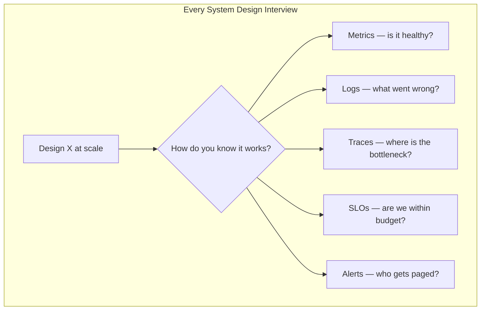
```mermaid
graph TB
    subgraph "Every System Design Interview"
        Q[Design X at scale]
        Q --> O{How do you know it works?}
        O --> MET[Metrics — is it healthy?]
        O --> LOG[Logs — what went wrong?]
        O --> TRACE[Traces — where is the bottleneck?]
        O --> SLO[SLOs — are we within budget?]
        O --> ALERT[Alerts — who gets paged?]
    end
```

### What "Good" Looks Like in an Interview

| Level | What You Demonstrate |
|-------|---------------------|
| **Junior** | Names the pillars ("we'd add logs and metrics") |
| **Mid** | Explains what to measure ("p99 latency, error rate, request rate per endpoint") |
| **Senior** | Describes how ("Prometheus pull model, structured JSON logs with trace_id, OpenTelemetry SDK propagating W3C trace context") |
| **Staff** | Anticipates failure ("cardinality explosion from user_id tag — use logs for high-cardinality data; alert on SLO burn rate, not raw CPU") |

---

## 2. The Three Pillars of Observability

### 2.1 Pillar Overview

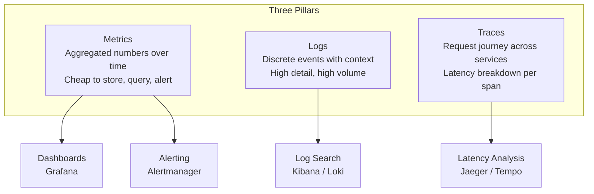
```mermaid
graph TB
    subgraph Three Pillars
        METRICS[Metrics<br/>Aggregated numbers over time<br/>Cheap to store, query, alert]
        LOGS[Logs<br/>Discrete events with context<br/>High detail, high volume]
        TRACES[Traces<br/>Request journey across services<br/>Latency breakdown per span]
    end

    METRICS --> DASH[Dashboards<br/>Grafana]
    METRICS --> ALERTS[Alerting<br/>Alertmanager]
    LOGS --> SEARCH[Log Search<br/>Kibana / Loki]
    TRACES --> LATENCY[Latency Analysis<br/>Jaeger / Tempo]
```

| Pillar | Data Type | Best For | Storage Cost | Query Pattern |
|--------|-----------|----------|-------------|---------------|
| **Metrics** | Time-series numbers | Dashboards, alerting, trends | Low (compression) | Aggregation over time ranges |
| **Logs** | Text/JSON events | Debugging specific failures, audit | High (raw text) | Full-text search, filter by fields |
| **Traces** | Span trees per request | Latency breakdown, dependency mapping | Medium (sampled) | Trace ID lookup, service graph |

### 2.2 How the Pillars Correlate

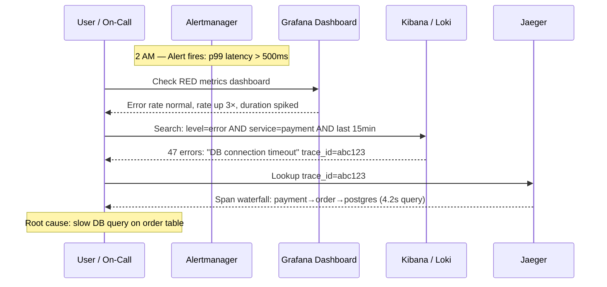
```mermaid
sequenceDiagram
    participant User as User / On-Call
    participant Alert as Alertmanager
    participant Grafana as Grafana Dashboard
    participant Logs as Kibana / Loki
    participant Trace as Jaeger

    Note over Alert: 2 AM — Alert fires: p99 latency > 500ms
    User->>Grafana: Check RED metrics dashboard
    Grafana-->>User: Error rate normal, rate up 3×, duration spiked
    User->>Logs: Search: level=error AND service=payment AND last 15min
    Logs-->>User: 47 errors: "DB connection timeout" trace_id=abc123
    User->>Trace: Lookup trace_id=abc123
    Trace-->>User: Span waterfall: payment→order→postgres (4.2s query)
    Note over User: Root cause: slow DB query on order table
```

**The debugging flow (memorize this):**

```
Alert (metric threshold breached)
  → Dashboard (which metric, which service, which time)
    → Logs (what errors, which trace_ids)
      → Trace (which span is slow, which dependency)
        → Root cause identified
```

### 2.3 Observability vs Monitoring

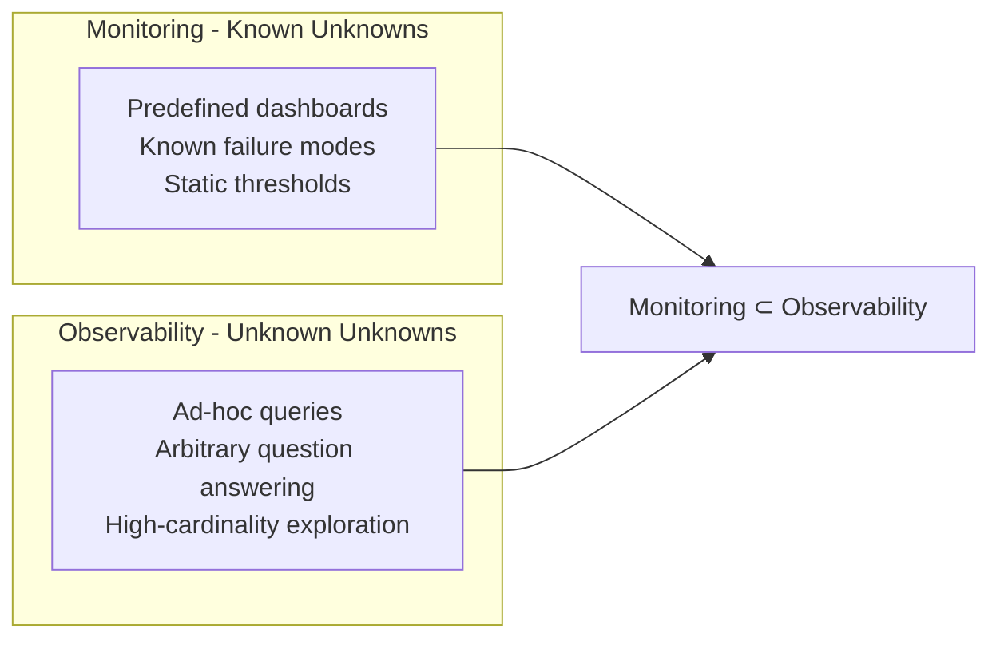
```mermaid
graph LR
    subgraph Monitoring - Known Unknowns
        MON[Predefined dashboards<br/>Known failure modes<br/>Static thresholds]
    end

    subgraph Observability - Unknown Unknowns
        OBS[Ad-hoc queries<br/>Arbitrary question answering<br/>High-cardinality exploration]
    end

    MON --> SUBSET[Monitoring ⊂ Observability]
    OBS --> SUBSET
```

| Concept | Definition | Example |
|---------|-----------|---------|
| **Monitoring** | Watch known metrics for known thresholds | "Alert if CPU > 90%" |
| **Observability** | Ability to answer arbitrary questions about system state | "Why did checkout latency spike for users in EU between 2–3 AM?" |

**Interview line:**

> "Monitoring tells you *something is wrong*. Observability lets you ask *what* and *why* without redeploying code. You need both: monitoring for automated alerts, observability for investigation."

### 2.4 Push vs Pull vs Agent-Based Collection

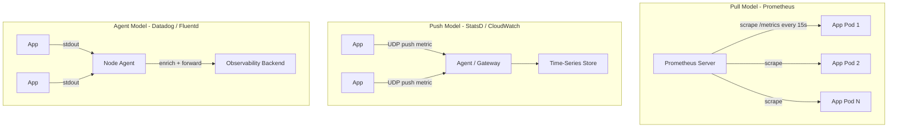
```mermaid
graph TB
    subgraph Pull Model - Prometheus
        PROM[Prometheus Server] -->|scrape /metrics every 15s| APP1[App Pod 1]
        PROM -->|scrape| APP2[App Pod 2]
        PROM -->|scrape| APP3[App Pod N]
    end

    subgraph Push Model - StatsD / CloudWatch
        APP4[App] -->|UDP push metric| AGENT[Agent / Gateway]
        APP5[App] -->|UDP push metric| AGENT
        AGENT --> STORE[Time-Series Store]
    end

    subgraph Agent Model - Datadog / Fluentd
        APP6[App] -->|stdout| AGENT2[Node Agent]
        APP7[App] -->|stdout| AGENT2
        AGENT2 -->|enrich + forward| BACKEND[Observability Backend]
    end
```

| Model | Examples | Pros | Cons |
|-------|---------|------|------|
| **Pull** | Prometheus, VictoriaMetrics | Server controls scrape rate; detects down targets; no agent needed | Doesn't work well for short-lived jobs; NAT/firewall issues |
| **Push** | StatsD, Graphite, CloudWatch | Works behind NAT; good for batch jobs | Agent can overwhelm receiver; harder to detect missing data |
| **Agent** | Datadog Agent, Fluentd, OTel Collector | Enriches with K8s metadata; buffers on network failure | Agent is another thing to manage |

---

## 3. Metrics — Deep Dive

### 3.1 Metric Types

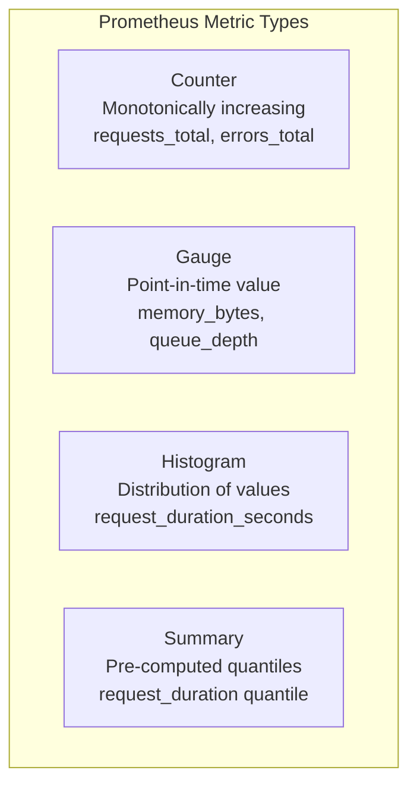
```mermaid
graph TB
    subgraph Prometheus Metric Types
        COUNTER[Counter<br/>Monotonically increasing<br/>requests_total, errors_total]
        GAUGE[Gauge<br/>Point-in-time value<br/>memory_bytes, queue_depth]
        HISTOGRAM[Histogram<br/>Distribution of values<br/>request_duration_seconds]
        SUMMARY[Summary<br/>Pre-computed quantiles<br/>request_duration quantile]
    end
```

| Type | Resets? | Operations | Example |
|------|---------|-----------|---------|
| **Counter** | Never (only increases) | `rate()`, `increase()` | `http_requests_total{status="500"}` |
| **Gauge** | Yes (up and down) | `avg()`, `max()`, direct value | `jvm_memory_used_bytes` |
| **Histogram** | Never | `histogram_quantile()` | `http_request_duration_seconds_bucket` |
| **Summary** | Never | Pre-computed quantiles | `rpc_duration_seconds{quantile="0.99"}` |

**When to use histogram vs summary:**

| | Histogram | Summary |
|---|-----------|---------|
| **Quantile accuracy** | Approximate (per-bucket) | Exact (per-instance) |
| **Aggregation across instances** | Yes — merge buckets | No — quantiles don't aggregate |
| **Recommendation** | **Default choice** | Legacy; avoid for new systems |

### 3.2 Prometheus Architecture

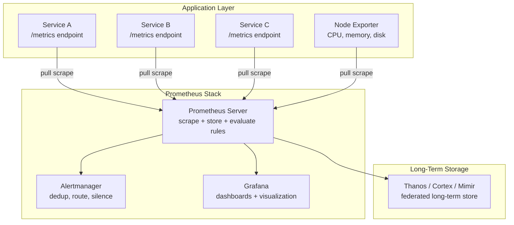
```mermaid
graph TB
    subgraph Application Layer
        APP1[Service A<br/>/metrics endpoint]
        APP2[Service B<br/>/metrics endpoint]
        APP3[Service C<br/>/metrics endpoint]
        EXPORTER[Node Exporter<br/>CPU, memory, disk]
    end

    subgraph Prometheus Stack
        PROM[Prometheus Server<br/>scrape + store + evaluate rules]
        AM[Alertmanager<br/>dedup, route, silence]
        GRAF[Grafana<br/>dashboards + visualization]
    end

    subgraph Long-Term Storage
        THANOS[Thanos / Cortex / Mimir<br/>federated long-term store]
    end

    APP1 -->|pull scrape| PROM
    APP2 -->|pull scrape| PROM
    APP3 -->|pull scrape| PROM
    EXPORTER -->|pull scrape| PROM
    PROM --> AM
    PROM --> GRAF
    PROM --> THANOS
```

**Prometheus data model:**

```
metric_name{label1="value1", label2="value2"} value timestamp

http_requests_total{method="GET", status="200", service="api"} 15234 1704067200
```

- **Metric name:** What you're measuring
- **Labels (dimensions):** Tags for filtering and grouping
- **Value:** Float64 at a point in time
- **Timestamp:** Unix milliseconds

### 3.3 PromQL — Essential Queries

```promql
# Request rate (requests per second, last 5 min)
rate(http_requests_total[5m])

# Error rate (percentage of 5xx)
sum(rate(http_requests_total{status=~"5.."}[5m]))
/
sum(rate(http_requests_total[5m])) * 100

# p99 latency
histogram_quantile(0.99,
  sum(rate(http_request_duration_seconds_bucket[5m])) by (le)
)

# p99 latency per service
histogram_quantile(0.99,
  sum(rate(http_request_duration_seconds_bucket[5m])) by (le, service)
)

# CPU usage per pod
sum(rate(container_cpu_usage_seconds_total[5m])) by (pod)

# Alert: error rate > 1% for 5 minutes
sum(rate(http_requests_total{status=~"5.."}[5m]))
/
sum(rate(http_requests_total[5m])) > 0.01
```

| PromQL Function | Purpose | Example |
|----------------|---------|---------|
| `rate()` | Per-second rate from counter | `rate(requests_total[5m])` |
| `increase()` | Total increase over range | `increase(errors_total[1h])` |
| `histogram_quantile()` | Compute percentile from histogram | p99 latency |
| `sum() by (label)` | Aggregate grouping | Total RPS per service |
| `avg_over_time()` | Average of gauge over range | Avg memory over 1h |
| `predict_linear()` | Linear prediction | Disk full in N hours |

### 3.4 Grafana Dashboards

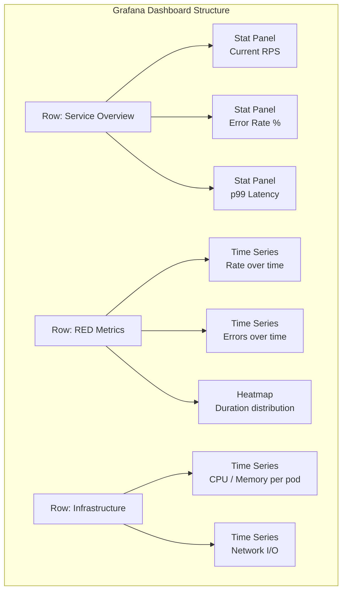
```mermaid
graph TB
    subgraph Grafana Dashboard Structure
        ROW1[Row: Service Overview]
        ROW1 --> PANEL1[Stat Panel<br/>Current RPS]
        ROW1 --> PANEL2[Stat Panel<br/>Error Rate %]
        ROW1 --> PANEL3[Stat Panel<br/>p99 Latency]

        ROW2[Row: RED Metrics]
        ROW2 --> PANEL4[Time Series<br/>Rate over time]
        ROW2 --> PANEL5[Time Series<br/>Errors over time]
        ROW2 --> PANEL6[Heatmap<br/>Duration distribution]

        ROW3[Row: Infrastructure]
        ROW3 --> PANEL7[Time Series<br/>CPU / Memory per pod]
        ROW3 --> PANEL8[Time Series<br/>Network I/O]
    end
```

**Dashboard hierarchy for interviews:**

| Level | Audience | Content |
|-------|----------|---------|
| **L1 — Executive** | Leadership | SLO compliance, error budget remaining, uptime |
| **L2 — Service** | Engineering team | RED metrics per service, dependency health |
| **L3 — Infrastructure** | SRE / platform | CPU, memory, disk, network per node/pod |
| **L4 — Debug** | On-call engineer | Detailed per-endpoint, per-pod, flame graphs |

### 3.5 Cardinality — The Silent Killer

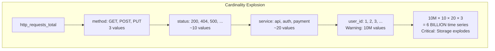
```mermaid
graph TB
    subgraph Cardinality Explosion
        METRIC[http_requests_total]
        METRIC --> L1[method: GET, POST, PUT<br/>3 values]
        L1 --> L2[status: 200, 404, 500, ...<br/>~10 values]
        L2 --> L3[service: api, auth, payment<br/>~20 values]
        L3 --> L4[user_id: 1, 2, 3, ...<br/>Warning: 10M values]
        L4 --> BLOW[10M × 10 × 20 × 3<br/>= 6 BILLION time series<br/>Critical: Storage explodes]
    end
```

**Cardinality rules (critical for interviews):**

| Rule | Rationale | Example |
|------|-----------|---------|
| **Never label with user_id** | Unbounded values | Use logs/traces for per-user debugging |
| **Never label with URL path** | Unbounded (REST IDs) | Normalize: `/users/{id}` not `/users/12345` |
| **Keep labels < 10 per metric** | Each label multiplies cardinality | method, status, service — OK |
| **Cardinality budget per service** | ~10,000 series per service | Review in CI with `promtool check rules` |
| **High-cardinality → logs** | Logs handle billions of events | Metrics aggregate; logs detail |

```
Cardinality calculation:
  series_count = label1_values × label2_values × ... × labelN_values

  http_requests_total{method, status, service}
    = 3 × 10 × 20 = 600 series Yes

  http_requests_total{method, status, service, user_id}
    = 3 × 10 × 20 × 10,000,000 = 6B series No
```

### 3.6 Metric Instrumentation Best Practices

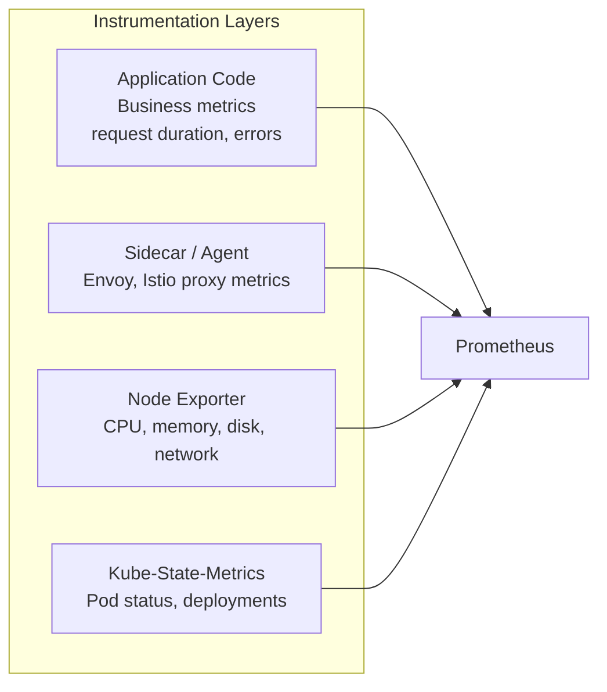
```mermaid
flowchart LR
    subgraph Instrumentation Layers
        APP[Application Code<br/>Business metrics<br/>request duration, errors]
        SIDE[Sidecar / Agent<br/>Envoy, Istio proxy metrics]
        NODE[Node Exporter<br/>CPU, memory, disk, network]
        K8S[Kube-State-Metrics<br/>Pod status, deployments]
    end

    APP --> PROM[Prometheus]
    SIDE --> PROM
    NODE --> PROM
    K8S --> PROM
```

| Layer | What to Instrument | Example Metrics |
|-------|-------------------|-----------------|
| **Application** | Business logic, request handling | `orders_created_total`, `payment_duration_seconds` |
| **Middleware** | HTTP framework, RPC | `http_requests_total`, `grpc_server_handled_total` |
| **Infrastructure** | OS-level resources | `node_cpu_seconds_total`, `node_memory_MemAvailable_bytes` |
| **Orchestration** | K8s state | `kube_pod_status_phase`, `kube_deployment_status_replicas` |

---

## 4. Logging — Deep Dive

### 4.1 Structured vs Unstructured Logs

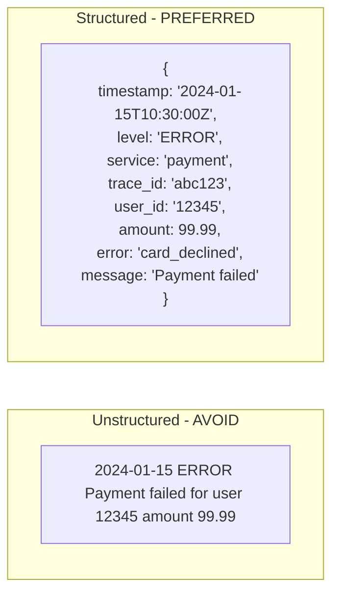
```mermaid
graph LR
    subgraph Unstructured - AVOID
        U1["2024-01-15 ERROR Payment failed for user 12345 amount 99.99"]
    end

    subgraph Structured - PREFERRED
        S1["{<br/>  timestamp: '2024-01-15T10:30:00Z',<br/>  level: 'ERROR',<br/>  service: 'payment',<br/>  trace_id: 'abc123',<br/>  user_id: '12345',<br/>  amount: 99.99,<br/>  error: 'card_declined',<br/>  message: 'Payment failed'<br/>}"]
    end
```

| Aspect | Unstructured | Structured (JSON) |
|--------|-------------|-------------------|
| **Searchability** | Regex (slow, fragile) | Field filter: `error="card_declined"` |
| **Aggregation** | Impossible at scale | `GROUP BY error COUNT` |
| **Correlation** | Manual grep for trace_id | `trace_id="abc123"` instant join |
| **Parsing cost** | Logstash grok (CPU-heavy) | Zero parsing — already JSON |
| **Interview default** | Never propose | Always propose JSON structured logs |

### 4.2 Log Levels and When to Use Each

| Level | When | Volume | Example |
|-------|------|--------|---------|
| **DEBUG** | Development only; never in prod | Massive | Variable values, flow tracing |
| **INFO** | Normal operations worth recording | Moderate | "Order 12345 created", "User logged in" |
| **WARN** | Unexpected but recoverable | Low | "Retry attempt 2/3", "Cache miss, fetching from DB" |
| **ERROR** | Operation failed; needs attention | Very low | "Payment declined", "DB connection failed" |
| **FATAL** | Service cannot continue | Rare | "Cannot connect to database on startup" |

**Interview rule:** Log at INFO for business events, ERROR for failures. Never DEBUG in production — volume will overwhelm your log pipeline and storage costs.

### 4.3 ELK Stack Architecture

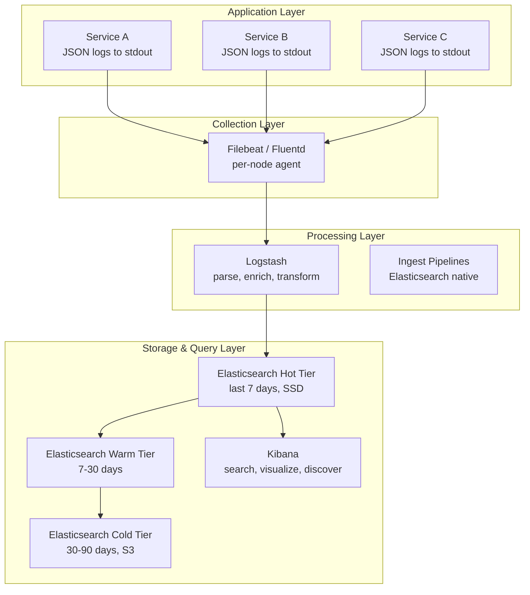
```mermaid
graph TB
    subgraph Application Layer
        APP1[Service A<br/>JSON logs to stdout]
        APP2[Service B<br/>JSON logs to stdout]
        APP3[Service C<br/>JSON logs to stdout]
    end

    subgraph Collection Layer
        FB[Filebeat / Fluentd<br/>per-node agent]
    end

    subgraph Processing Layer
        LS[Logstash<br/>parse, enrich, transform]
        PIPE[Ingest Pipelines<br/>Elasticsearch native]
    end

    subgraph Storage & Query Layer
        ES_HOT[Elasticsearch Hot Tier<br/>last 7 days, SSD]
        ES_WARM[Elasticsearch Warm Tier<br/>7-30 days]
        ES_COLD[Elasticsearch Cold Tier<br/>30-90 days, S3]
        KIBANA[Kibana<br/>search, visualize, discover]
    end

    APP1 --> FB
    APP2 --> FB
    APP3 --> FB
    FB --> LS
    LS --> ES_HOT
    ES_HOT --> ES_WARM --> ES_COLD
    ES_HOT --> KIBANA
```

### 4.4 Fluentd / Fluent Bit Collection

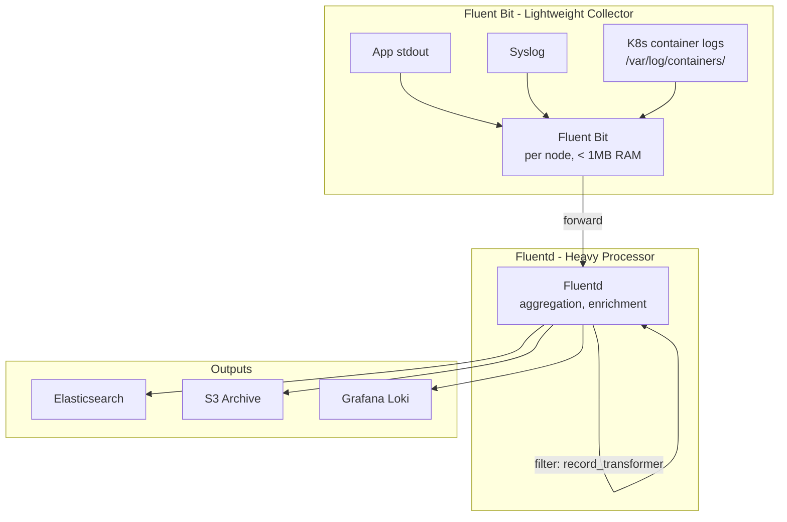
```mermaid
graph TB
    subgraph Fluent Bit - Lightweight Collector
        FB_APP[App stdout] --> FB[Fluent Bit<br/>per node, < 1MB RAM]
        FB_SYS[Syslog] --> FB
        FB_K8S[K8s container logs<br/>/var/log/containers/] --> FB
    end

    subgraph Fluentd - Heavy Processor
        FB -->|forward| FD[Fluentd<br/>aggregation, enrichment]
        FD -->|filter: kubernetes_metadata| FD
        FD -->|filter: record_transformer| FD
    end

    subgraph Outputs
        FD --> ES_OUT[Elasticsearch]
        FD --> S3_OUT[S3 Archive]
        FD --> LOKI_OUT[Grafana Loki]
    end
```

| Component | Role | Resource Usage |
|-----------|------|---------------|
| **Fluent Bit** | Lightweight collector on every node | < 1 MB RAM, C-based |
| **Fluentd** | Aggregation, complex routing, enrichment | ~40 MB RAM, Ruby-based |
| **Filebeat** | Elastic's log shipper (ELK native) | ~50 MB RAM |
| **Vector** | Modern alternative (Rust, high performance) | Configurable |

**Fluentd vs Fluent Bit (interview):**

> "Fluent Bit on every K8s node — collects container stdout, adds K8s metadata (pod, namespace, labels), forwards to Fluentd aggregator or directly to Elasticsearch/Loki. Fluentd for complex routing rules and multi-destination output."

### 4.5 Log Pipeline: Enrichment and Indexing

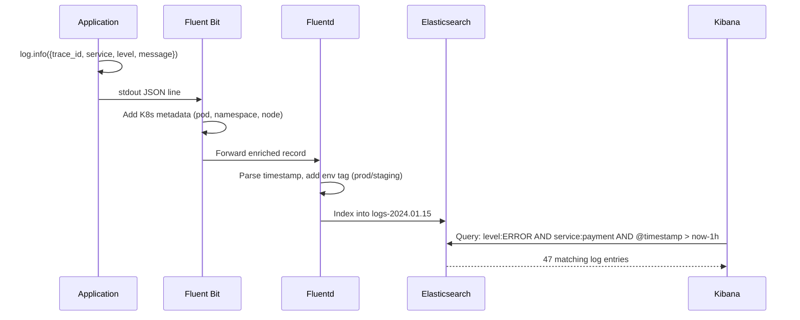
```mermaid
sequenceDiagram
    participant App as Application
    participant FB as Fluent Bit
    participant FD as Fluentd
    participant ES as Elasticsearch
    participant KB as Kibana

    App->>App: log.info({trace_id, service, level, message})
    App->>FB: stdout JSON line
    FB->>FB: Add K8s metadata (pod, namespace, node)
    FB->>FD: Forward enriched record
    FD->>FD: Parse timestamp, add env tag (prod/staging)
    FD->>ES: Index into logs-2024.01.15
    KB->>ES: Query: level:ERROR AND service:payment AND @timestamp > now-1h
    ES-->>KB: 47 matching log entries
```

**Index strategy:**

| Strategy | Description | Pro/Con |
|----------|-------------|---------|
| **Daily indices** | `logs-2024.01.15` | Easy retention (delete old indices); many shards at scale |
| **ILM (Index Lifecycle Management)** | Hot → warm → cold → delete | Automated tiering; cost optimization |
| **Data streams** | ES 7.9+ append-only | Simplified management; built-in ILM |

### 4.6 Log Volume Management

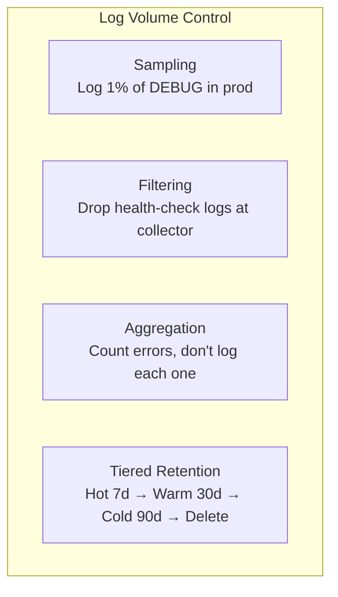
```mermaid
graph TB
    subgraph Log Volume Control
        SAMPLING[Sampling<br/>Log 1% of DEBUG in prod]
        FILTERING[Filtering<br/>Drop health-check logs at collector]
        AGGREGATION[Aggregation<br/>Count errors, don't log each one]
        RETENTION[Tiered Retention<br/>Hot 7d → Warm 30d → Cold 90d → Delete]
    end
```

**Cost math for interviews:**

```
Assume: 100 microservices, 1 KB per log line, 1000 lines/sec per service

Raw volume: 100 × 1000 × 1 KB = 100 MB/sec = 8.6 TB/day

With filtering (drop 80% noise): 1.7 TB/day
With sampling (10% of INFO): 0.5 TB/day
With tiered storage (hot 7d SSD, rest S3): ~$50/day vs $500/day all-SSD
```

### 4.7 Grafana Loki — Label-Based Log Aggregation

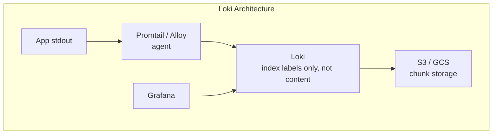
```mermaid
graph TB
    subgraph Loki Architecture
        APP_L[App stdout] --> PROMTAIL[Promtail / Alloy<br/>agent]
        PROMTAIL --> LOKI[Loki<br/>index labels only, not content]
        LOKI --> S3_L[S3 / GCS<br/>chunk storage]
        GRAF_L[Grafana] --> LOKI
    end
```

| Aspect | Elasticsearch | Loki |
|--------|--------------|------|
| **Index** | Full-text index on content | Labels only (like Prometheus) |
| **Cost** | Higher (indexes everything) | Lower (stores compressed chunks) |
| **Query** | Full-text search, complex | LogQL — label filter + grep |
| **Best for** | Complex log analytics | K8s environments, cost-sensitive |
| **Cardinality risk** | Mapping explosion | Label cardinality (same rules as Prometheus) |

---

## 5. Distributed Tracing — Deep Dive

### 5.1 Trace, Span, and Context

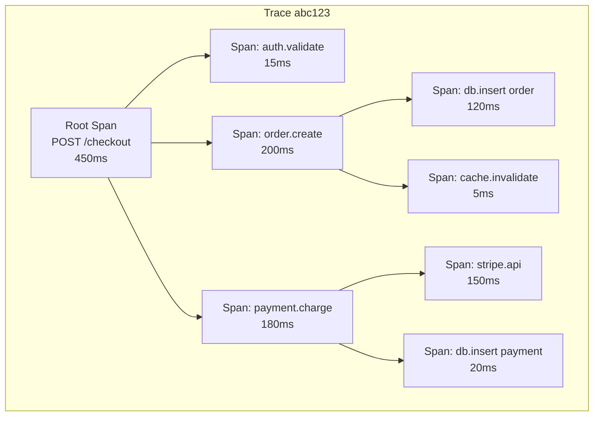
```mermaid
graph TB
    subgraph Trace abc123
        ROOT[Root Span<br/>POST /checkout<br/>450ms]
        ROOT --> S1[Span: auth.validate<br/>15ms]
        ROOT --> S2[Span: order.create<br/>200ms]
        ROOT --> S3[Span: payment.charge<br/>180ms]
        S2 --> S4[Span: db.insert order<br/>120ms]
        S2 --> S5[Span: cache.invalidate<br/>5ms]
        S3 --> S6[Span: stripe.api<br/>150ms]
        S3 --> S7[Span: db.insert payment<br/>20ms]
    end
```

| Concept | Definition | Example |
|---------|-----------|---------|
| **Trace** | End-to-end journey of a single request | `trace_id: abc123` |
| **Span** | Single operation within a trace | `auth.validate — 15ms` |
| **Parent span** | The span that triggered this one | `checkout` → `payment.charge` |
| **Span attributes** | Key-value metadata on a span | `http.status_code=200`, `db.statement="SELECT..."` |
| **Baggage** | Cross-cutting key-value propagated across services | `user_tier=premium` |

### 5.2 Trace Context Propagation

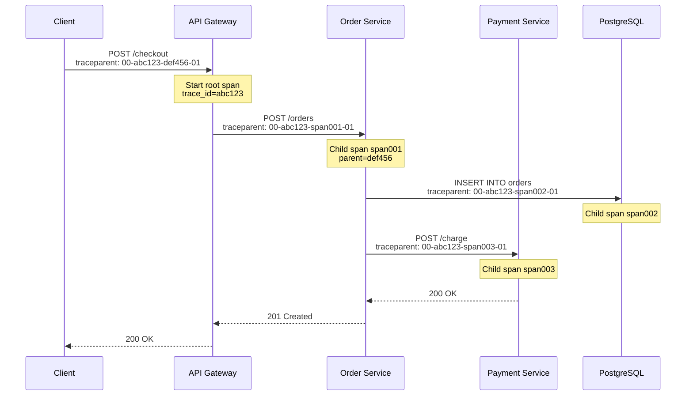
```mermaid
sequenceDiagram
    participant Client
    participant Gateway as API Gateway
    participant Order as Order Service
    participant Payment as Payment Service
    participant DB as PostgreSQL

    Client->>Gateway: POST /checkout<br/>traceparent: 00-abc123-def456-01
    Note over Gateway: Start root span<br/>trace_id=abc123
    Gateway->>Order: POST /orders<br/>traceparent: 00-abc123-span001-01
    Note over Order: Child span span001<br/>parent=def456
    Order->>DB: INSERT INTO orders<br/>traceparent: 00-abc123-span002-01
    Note over DB: Child span span002
    Order->>Payment: POST /charge<br/>traceparent: 00-abc123-span003-01
    Note over Payment: Child span span003
    Payment-->>Order: 200 OK
    Order-->>Gateway: 201 Created
    Gateway-->>Client: 200 OK
```

**W3C Trace Context headers (standard):**

```
traceparent: 00-{trace_id}-{parent_span_id}-{flags}
tracestate: vendor-specific data

Example:
traceparent: 00-4bf92f3577b34da6a3ce929d0e0e4736-00f067aa0ba902b7-01
             │   │                                │                │
             │   32-hex trace ID                  16-hex span ID   sampled flag
             version
```

| Propagation Mechanism | Standard | Used By |
|----------------------|----------|---------|
| **W3C Trace Context** | `traceparent` / `tracestate` headers | OpenTelemetry (default), modern services |
| **B3 (Zipkin)** | `X-B3-TraceId`, `X-B3-SpanId` | Zipkin, older Spring Cloud |
| **Jaeger** | `uber-trace-id` header | Jaeger native |
| **OpenTelemetry** | Supports all formats via propagators | OTel SDK auto-detects and converts |

### 5.3 OpenTelemetry Architecture

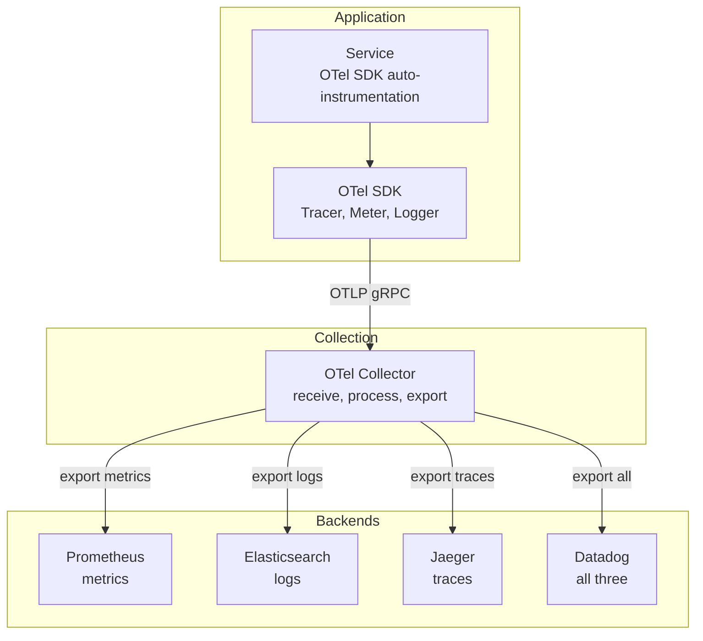
```mermaid
graph TB
    subgraph Application
        APP_OT[Service<br/>OTel SDK auto-instrumentation]
        SDK[OTel SDK<br/>Tracer, Meter, Logger]
    end

    subgraph Collection
        COL[OTel Collector<br/>receive, process, export]
    end

    subgraph Backends
        PROM_OT[Prometheus<br/>metrics]
        ES_OT[Elasticsearch<br/>logs]
        JAEGER[Jaeger<br/>traces]
        DD[Datadog<br/>all three]
    end

    APP_OT --> SDK
    SDK -->|OTLP gRPC| COL
    COL -->|export metrics| PROM_OT
    COL -->|export logs| ES_OT
    COL -->|export traces| JAEGER
    COL -->|export all| DD
```

**OpenTelemetry components:**

| Component | Role |
|-----------|------|
| **OTel SDK** | Library embedded in app — creates spans, metrics, logs |
| **Auto-instrumentation** | Agent that hooks into frameworks (Spring, Express, gRPC) without code changes |
| **OTel Collector** | Vendor-neutral pipeline — receive, batch, filter, export to any backend |
| **OTLP** | OpenTelemetry Protocol — standard gRPC/HTTP transport |

### 5.4 Jaeger Architecture

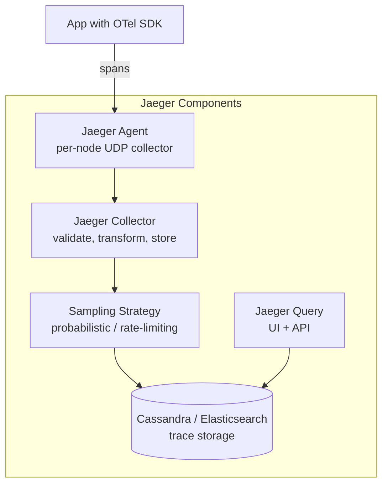
```mermaid
graph TB
    subgraph Jaeger Components
        AGENT[Jaeger Agent<br/>per-node UDP collector]
        COLLECTOR[Jaeger Collector<br/>validate, transform, store]
        QUERY[Jaeger Query<br/>UI + API]
        STORE[(Cassandra / Elasticsearch<br/>trace storage)]
        SAMPLER[Sampling Strategy<br/>probabilistic / rate-limiting]
    end

    APP_J[App with OTel SDK] -->|spans| AGENT
    AGENT --> COLLECTOR
    COLLECTOR --> SAMPLER
    SAMPLER --> STORE
    QUERY --> STORE
```

### 5.5 Zipkin Architecture

```mermaid
graph TB
    subgraph Zipkin - Simpler Architecture
        APP_Z[App<br/>Zipkin SDK / Brave]
        COLLECTOR_Z[Zipkin Collector<br/>HTTP / Kafka]
        STORAGE_Z[(In-memory / Elasticsearch / Cassandra)]
        UI_Z[Zipkin UI<br/>trace lookup + dependency graph]
    end

    APP_Z -->|HTTP POST /api/v2/spans| COLLECTOR_Z
    COLLECTOR_Z --> STORAGE_Z
    UI_Z --> STORAGE_Z
```

| Aspect | Jaeger | Zipkin |
|--------|--------|--------|
| **Origins** | Uber | Twitter |
| **Storage** | Cassandra, ES, Kafka (streaming) | In-memory, ES, Cassandra, MySQL |
| **UI** | Rich: service graph, comparison | Simpler: trace timeline, dependency |
| **Sampling** | Adaptive (throughput-aware) | Rate-based |
| **2026 status** | CNCF graduated; OTel native | Maintained; less feature growth |
| **Interview pick** | Jaeger or OTel Collector → Jaeger backend | Mention as alternative |

### 5.6 Sampling Strategies

```mermaid
graph TB
    subgraph Sampling Decision
        REQ[Incoming Request]
        REQ --> ALWAYS[Always Sample<br/>Errors, slow requests > 1s]
        REQ --> PROB[Probabilistic<br/>1% of normal requests]
        REQ --> RATE[Rate Limiting<br/>Max 100 traces/sec per service]
        REQ --> ADAPTIVE[Adaptive<br/>Adjust rate based on traffic volume]
    end
```

| Strategy | Sample Rate | Storage Cost | Debug Coverage |
|----------|------------|-------------|----------------|
| **Always sample** | 100% | Critical: Prohibitive at scale | Perfect |
| **Probabilistic 1%** | 1% | Manageable | 1 in 100 requests |
| **Probabilistic 0.1%** | 0.1% | Low | 1 in 1000 — may miss rare bugs |
| **Tail-based sampling** | Decide after request completes | Medium | Sample all errors + slow; 1% of fast |
| **Head-based sampling** | Decide at request start | Lowest | Random — may discard important traces |

**Interview recommendation:**

> "Head-based probabilistic sampling at 1% for normal traffic. Tail-based sampling for errors and requests > SLO threshold — always keep slow and failed traces. This gives debug coverage where it matters without storing every health-check trace."

### 5.7 Service Dependency Graph

```mermaid
graph LR
    subgraph Service Dependency Map - from traces
        GW[API Gateway]
        AUTH[Auth Service]
        ORDER[Order Service]
        PAY[Payment Service]
        INV[Inventory Service]
        NOTIF[Notification Service]
        PG[(PostgreSQL)]
        REDIS[(Redis)]
        KAFKA[Kafka]
    end

    GW --> AUTH
    GW --> ORDER
    ORDER --> PAY
    ORDER --> INV
    ORDER --> PG
    ORDER --> KAFKA
    PAY --> PG
    INV --> REDIS
    KAFKA --> NOTIF
```

**Derived automatically from trace data** — no manual maintenance. Shows:
- Which services call which
- Call rate between services
- Error rate per edge
- p99 latency per edge

---

## 6. SLI, SLO, SLA & Error Budgets

### 6.1 Definitions

```mermaid
graph TB
    subgraph Reliability Hierarchy
        SLA[SLA — Service Level Agreement<br/>Contract with consequences<br/>99.9% uptime or refund]
        SLO[SLO — Service Level Objective<br/>Internal target<br/>99.95% uptime]
        SLI[SLI — Service Level Indicator<br/>Actual measurement<br/>current: 99.97%]
    end

    SLI --> SLO
    SLO --> SLA
    Note1[SLO is stricter than SLA<br/>buffer for safety]
```

| Term | Definition | Example | Who Defines |
|------|-----------|---------|-------------|
| **SLI** | Quantitative measure of service behavior | p99 latency, availability, error rate | Engineering |
| **SLO** | Target value for an SLI | p99 < 200ms, availability > 99.9% | Engineering + Product |
| **SLA** | Contract with business consequences | 99.9% or credits/refund | Business + Legal |
| **Error budget** | Allowed unreliability = 100% - SLO | 99.9% SLO → 0.1% budget = 43 min/month | Derived from SLO |

### 6.2 Common SLIs

| SLI Type | Measurement | Good SLO Target |
|----------|------------|-----------------|
| **Availability** | Successful requests / total requests | 99.9% – 99.99% |
| **Latency** | p99 request duration | < 200ms (API), < 2s (web page) |
| **Throughput** | Requests handled per second | Depends on capacity plan |
| **Error rate** | 5xx responses / total responses | < 0.1% |
| **Freshness** | Time since last data update | < 5 min (analytics), < 1s (trading) |
| **Correctness** | Correct results / total results | 99.99% (payments), 95% (recommendations) |

### 6.3 Error Budget Mechanics

```mermaid
graph TB
    subgraph Error Budget Flow
        SLO_T[SLO: 99.9% availability<br/>Error budget: 0.1% = 43.2 min/month]
        BURN[Burn Rate<br/>how fast budget is consumed]
        BUDGET[Remaining Budget<br/>35 min left this month]
    end

    SLO_T --> BURN
    BURN -->|Fast burn: incident| BUDGET
    BURN -->|Slow burn: minor issues| BUDGET

    BUDGET -->|Budget exhausted| FREEZE[Feature freeze<br/>focus on reliability]
    BUDGET -->|Budget healthy| SHIP[Continue shipping features]
```

**Error budget calculation:**

```
SLO: 99.9% monthly availability
Total minutes in month: 43,200
Error budget: 43,200 × 0.001 = 43.2 minutes of downtime allowed

If incident caused 15 minutes downtime:
  Remaining budget: 43.2 - 15 = 28.2 minutes
  Budget consumed: 35%

Burn rate = budget consumed / time elapsed
  If 35% consumed in 10 days of 30: burn rate = 3.5× (will exhaust early)
```

### 6.4 Multi-Window Burn Rate Alerts

```mermaid
graph TB
    subgraph Burn Rate Alerting - Google SRE Book
        FAST[Fast Burn<br/>14.4× burn rate<br/>1-hour window<br/>→ Page immediately]
        MEDIUM[Medium Burn<br/>6× burn rate<br/>6-hour window<br/>→ Page during business hours]
        SLOW[Slow Burn<br/>3× burn rate<br/>3-day window<br/>→ Ticket, no page]
    end
```

| Alert | Window | Burn Rate Multiplier | Action |
|-------|--------|---------------------|--------|
| **Fast burn** | 1 hour | 14.4× | Page on-call immediately |
| **Medium burn** | 6 hours | 6× | Page if during business hours |
| **Slow burn** | 3 days | 3× | Create ticket; review in standup |
| **Budget exhausted** | Monthly | 100% consumed | Feature freeze; reliability sprint |

**Why multi-window?**

> A 5-minute blip triggers a fast-burn alert (correct — page immediately). A slow degradation over 3 days triggers a slow-burn alert (ticket, not page at 3 AM). This prevents both missed incidents and alert fatigue.

### 6.5 SLO in System Design Interviews

```mermaid
graph LR
    subgraph SLO-Driven Design Decisions
        SLO_D[SLO: 99.95% availability]
        SLO_D --> HA[Multi-AZ deployment]
        SLO_D --> CANARY[Canary deploy with auto-rollback]
        SLO_D --> REDUND[Redundant dependencies]
        SLO_D --> GRACEFUL[Graceful degradation]
        SLO_D --> BUDGET[Error budget policy]
    end
```

**How to present SLOs in an interview:**

> "For the payment API, I'd set an SLO of 99.95% availability and p99 latency < 200ms. That gives us a 21-minute monthly error budget. We spend budget on planned maintenance and risky deploys. When budget is below 25%, we freeze feature launches and focus on reliability work. Alerts use multi-window burn rate — not static thresholds."

---

## 7. Alerting Strategies

### 7.1 Alert on Symptoms, Not Causes

```mermaid
graph TB
    subgraph Bad Alerting - Causes
        CPU_ALERT[Alert: CPU > 90%]
        DISK_ALERT[Alert: Disk > 80%]
        MEM_ALERT[Alert: Memory > 85%]
        CPU_ALERT --> FATIGUE[Alert Fatigue<br/>Pages at 3 AM for non-issues]
    end

    subgraph Good Alerting - Symptoms
        ERR_ALERT[Alert: Error rate > 1%<br/>for 5 min]
        LAT_ALERT[Alert: p99 latency > 500ms<br/>for 5 min]
        SLO_ALERT[Alert: SLO burn rate > 14.4×<br/>1-hour window]
        ERR_ALERT --> ACTION[Actionable page<br/>Users are affected]
    end
```

| Alert Type | Example | Actionable? | Recommendation |
|-----------|---------|-------------|----------------|
| **Symptom** | Error rate > 1% for 5 min | Yes Users affected | Page on-call |
| **Symptom** | p99 latency > SLO for 10 min | Yes Users affected | Page on-call |
| **Symptom** | SLO burn rate > 14.4× | Yes Budget at risk | Page on-call |
| **Cause** | CPU > 90% |  Maybe user impact | Dashboard only |
| **Cause** | Disk > 80% |  Not yet user impact | Ticket if trending |
| **Cause** | Pod restarted |  Maybe self-healed | Log, don't page |

### 7.2 Alert Severity Levels

```mermaid
graph TB
    subgraph Alert Routing
        P1[P1 — Critical<br/>User-facing outage<br/>Page immediately<br/>All hands]
        P2[P2 — High<br/>Degraded service<br/>Page on-call<br/>15-min response]
        P3[P3 — Medium<br/>Non-critical impact<br/>Ticket next business day]
        P4[P4 — Low<br/>Informational<br/>Dashboard review weekly]
    end

    P1 --> PD1[PagerDuty → Phone call]
    P2 --> PD2[PagerDuty → Push notification]
    P3 --> TICKET[Jira / Linear ticket]
    P4 --> DASH[Dashboard annotation]
```

### 7.3 Alert Fatigue Prevention

```mermaid
graph TB
    subgraph Alert Fatigue Prevention Toolkit
        DEDUP[Deduplication<br/>Same alert within 5 min → one page]
        INHIBIT[Inhibition<br/>Node down → suppress pod alerts]
        SILENCE[Silencing<br/>Planned maintenance window]
        GROUP[Grouping<br/>50 pods OOM → one alert, not 50]
        ROUTE[Routing<br/>Payment alerts → payment team]
        ESCALATE[Escalation<br/>No ack in 15 min → escalate]
    end
```

| Technique | How It Works | Example |
|-----------|-------------|---------|
| **Deduplication** | Same alert fingerprint → one notification | 10 identical "high error rate" in 1 min → 1 page |
| **Inhibition** | Higher-severity alert suppresses lower | Node down inhibits all pod-on-node alerts |
| **Silencing** | Manual mute for known maintenance | "DB migration 2–4 AM — silence all DB alerts" |
| **Grouping** | Batch related alerts | "12 pods in deployment X are unhealthy" (one alert) |
| **Routing** | Send to owning team | `service=payment` → `#payment-oncall` Slack |
| **Escalation policy** | No ack → escalate to secondary | Primary 15 min → secondary → manager |

### 7.4 Alertmanager Architecture

```mermaid
graph TB
    subgraph Alert Pipeline
        PROM_A[Prometheus<br/>evaluates recording + alerting rules]
        AM[Alertmanager]
        AM --> DEDUP_A[Deduplicate]
        DEDUP_A --> GROUP_A[Group]
        GROUP_A --> ROUTE_A[Route by severity/service]
        ROUTE_A --> INHIBIT_A[Inhibit]
        INHIBIT_A --> SILENCE_A[Silence check]
        SILENCE_A --> NOTIFY[Notify]
        NOTIFY --> PD[PagerDuty]
        NOTIFY --> SLACK[Slack]
        NOTIFY --> EMAIL[Email]
    end

    PROM_A -->|firing alerts| AM
```

### 7.5 Alert Rule Design Template

```yaml
# Prometheus alerting rule — conceptual
groups:
  - name: payment-service
    rules:
      - alert: PaymentHighErrorRate
        expr: |
          sum(rate(http_requests_total{service="payment", status=~"5.."}[5m]))
          /
          sum(rate(http_requests_total{service="payment"}[5m])) > 0.01
        for: 5m                    # Must be true for 5 min (not transient)
        labels:
          severity: critical
          service: payment
        annotations:
          summary: "Payment error rate above 1%"
          description: "Error rate is {{ $value | humanizePercentage }} for 5 min"
          runbook: "https://wiki.internal/payment-high-error-rate"
```

**Alert rule checklist:**

| Rule | Purpose | Example |
|------|---------|---------|
| `for: 5m` | Avoid paging on transient spikes | CPU spike for 30s → no page |
| `severity` label | Route to correct channel | critical → PagerDuty; warning → Slack |
| `runbook` annotation | Tell on-call what to do | Link to investigation steps |
| `summary` | One-line human description | "Payment error rate above 1%" |

---

## 8. RED Method & USE Method

### 8.1 RED Method — For Services

```mermaid
graph TB
    subgraph RED Method - Request-Driven Services
        R[Rate<br/>Requests per second<br/>How much traffic?]
        E[Errors<br/>Failed requests per second<br/>How many are failing?]
        D[Duration<br/>Request latency distribution<br/>How long do they take?]
    end
```

| Metric | PromQL Example | Alert Threshold |
|--------|---------------|-----------------|
| **Rate** | `sum(rate(http_requests_total[5m]))` | Capacity planning (not alert) |
| **Errors** | `sum(rate(http_requests_total{status=~"5.."}[5m])) / sum(rate(http_requests_total[5m]))` | > 1% for 5 min |
| **Duration** | `histogram_quantile(0.99, sum(rate(http_request_duration_seconds_bucket[5m])) by (le))` | p99 > SLO target |

**Apply RED to every microservice in your system design.** It's the minimum viable instrumentation.

### 8.2 USE Method — For Infrastructure

```mermaid
graph TB
    subgraph USE Method - Resources
        U[Utilization<br/>% time resource is busy<br/>CPU at 85%]
        S[Saturation<br/>Queue depth / wait time<br/>CPU run queue > 2]
        E_ERR[Errors<br/>Device errors, failures<br/>disk read errors, NIC drops]
    end
```

| Resource | Utilization | Saturation | Errors |
|----------|------------|------------|--------|
| **CPU** | `cpu_usage_percent` | `load_average / num_cores` | — |
| **Memory** | `memory_used / memory_total` | `swap_used`, OOM kills | OOM events |
| **Disk** | `disk_io_time_percent` | `disk_queue_depth` | `disk_read_errors_total` |
| **Network** | `bandwidth_used / bandwidth_max` | `network_backlog_bytes` | `network_transmit_errors_total` |

### 8.3 RED vs USE — When to Apply Which

```mermaid
flowchart TD
    Q[What are you monitoring?]
    Q -->|Application / API / Microservice| RED[RED Method<br/>Rate, Errors, Duration]
    Q -->|Infrastructure / Host / Disk / NIC| USE[USE Method<br/>Utilization, Saturation, Errors]
    Q -->|Database| BOTH[Both: RED on queries<br/>USE on disk/CPU/memory]
    Q -->|Queue / Kafka| CUSTOM[Custom: lag, throughput<br/>consumer rate vs produce rate]
```

| Method | Scope | Who Uses It | Interview Mention |
|--------|-------|-------------|-------------------|
| **RED** | Services (request-driven) | Application engineers | "Every service gets RED metrics" |
| **USE** | Resources (infrastructure) | SRE / platform team | "USE for node and database monitoring" |
| **Four Golden Signals** (Google) | Latency, traffic, errors, saturation | Both — combines RED + USE saturation | Alternative framing; equally valid |

### 8.4 Four Golden Signals (Google SRE)

| Signal | RED Equivalent | USE Equivalent |
|--------|---------------|-----------------|
| **Latency** | Duration | — |
| **Traffic** | Rate | Utilization |
| **Errors** | Errors | Errors |
| **Saturation** | — | Saturation |

**Interview tip:** RED and Four Golden Signals are nearly identical. Use whichever the interviewer mentions. If they say "Google SRE," use Four Golden Signals. If they say "monitoring methodology," use RED.

---

## 9. How Observability Fits System Design Interviews

### 9.1 Where to Mention Observability in Your Answer

```mermaid
graph TB
    subgraph Interview Phases
        REQ[Requirements] -->|NFRs| SLO_M[Mention SLO targets]
        HLD[High-Level Design] -->|Per service| INST[Instrumentation plan]
        DD[Deep Dive] -->|Bottleneck| MET_M[Metrics to identify bottleneck]
        DD -->|Failure| LOG_M[Logs + traces for debugging]
        TRADE[Trade-offs] -->|Cost| CARD[Cardinality management]
        FAIL[Failure Modes] -->|Detection| ALERT_M[Alert design]
    end
```

| Interview Phase | What to Say |
|---------------|-------------|
| **Requirements** | "What's the SLO? 99.9% availability? p99 < 200ms?" |
| **High-level design** | "Each service exposes RED metrics via Prometheus; structured JSON logs with trace_id" |
| **Deep dive (scaling)** | "Monitor p99 latency and saturation; alert on SLO burn rate, not CPU" |
| **Deep dive (failure)** | "On alert: dashboard → logs → trace → root cause.in under 15 min" |
| **Trade-offs** | "Full tracing at 100% is too expensive; 1% head-based + tail-based for errors" |
| **Cost** | "Cardinality budget: no user_id in metric labels; tiered log retention" |

### 9.2 Cross-Reference: Design a Metrics System (Datadog)

For the full system design of building a metrics platform, see:

> **[Design Metrics & Monitoring (Datadog)](../06-platform-building-blocks/20-design-metrics-monitoring.md)**

That guide covers designing the platform itself (time-series DB, ingestion pipeline, cardinality management). This guide covers **using** observability in any system design.

```mermaid
graph LR
    subgraph This Guide - Consumer Perspective
        USE[How to instrument YOUR system<br/>What to measure, alert on, log]
    end

    subgraph Datadog Guide - Platform Perspective
        BUILD[How to BUILD a monitoring platform<br/>TSDB, ingestion, alerting engine]
    end

    USE -.->|if interviewer asks<br/>design monitoring system| BUILD
```

### 9.3 Observability Maturity Model

| Level | Characteristics | Interview Signal |
|-------|----------------|-------------------|
| **L0 — None** | SSH and grep logs on server | Junior; don't present this |
| **L1 — Basic** | Centralized logs, basic CPU alerts | Mid — mention as starting point |
| **L2 — Metrics-driven** | Prometheus + Grafana, RED metrics, SLOs | Senior — default recommendation |
| **L3 — Full observability** | Metrics + logs + traces correlated; burn-rate alerts | Staff — demonstrate proactively |
| **L4 — Observability-driven dev** | SLOs drive deploy decisions; auto-rollback on SLO breach | Principal — tie to error budgets |

```mermaid
graph LR
    L0[L0 SSH/grep] --> L1[L1 Centralized logs]
    L1 --> L2[L2 Prometheus + SLOs]
    L2 --> L3[L3 Metrics + Logs + Traces]
    L3 --> L4[L4 SLO-driven culture]
```

---

## 10. Debugging at Scale — The Incident Workflow

### 10.1 The 15-Minute Root Cause Framework

```mermaid
flowchart TD
    ALERT_F[Alert Fires] --> ACK[Acknowledge<br/>1 min]
    ACK --> DASHBOARD[Check service dashboard<br/>RED metrics<br/>2 min]
    DASHBOARD --> SCOPE{User-facing?}
    SCOPE -->|Yes| MITIGATE[Mitigate first<br/>rollback, scale, failover<br/>5 min]
    SCOPE -->|No| INVESTIGATE[Investigate<br/>logs → traces<br/>5 min]
    MITIGATE --> INVESTIGATE
    INVESTIGATE --> ROOT[Root cause identified<br/>2 min]
    ROOT --> FIX[Fix + verify<br/>remaining time]
    FIX --> POSTMORTEM[Schedule postmortem<br/>blameless]
```

### 10.2 Investigation Steps with Tools

```mermaid
sequenceDiagram
    participant OC as On-Call Engineer
    participant G as Grafana
    participant K as Kibana
    participant J as Jaeger
    participant P as Prometheus

    Note over OC: Alert: payment-service error rate > 1%

    OC->>G: Open payment RED dashboard
    G-->>OC: Rate normal, errors spiked at 02:15, p99 up 3×

    OC->>P: PromQL: topk(5, sum by (endpoint) (rate(errors[5m])))
    P-->>OC: /charge endpoint: 95% of errors

    OC->>K: Search: service:payment AND level:ERROR AND @timestamp > 02:10
    K-->>OC: "Stripe API timeout" trace_id=xyz789 (847 occurrences)

    OC->>J: Trace xyz789
    J-->>OC: payment.charge → stripe.api span: 30s timeout (normally 200ms)

    Note over OC: Root cause: Stripe API degraded.<br/>Mitigation: enable circuit breaker fallback.
```

### 10.3 Common Production Issues and Which Pillar Finds Them

| Symptom | First Look | Pillar | Query |
|---------|-----------|--------|-------|
| **Sudden error spike** | Error rate dashboard | Metrics | `rate(errors[5m])` |
| **Slow responses** | p99 latency dashboard | Metrics → Traces | `histogram_quantile(0.99, ...)` then trace |
| **Specific user complaint** | Search by user_id | Logs | `{user_id="12345"}` |
| **Intermittent failures** | Trace comparison | Traces | Compare failed vs successful traces |
| **Memory leak** | Memory trend over days | Metrics (USE) | `process_resident_memory_bytes` over 7d |
| **Cascading failure** | Service dependency graph | Traces | Jaeger service graph — red edges |
| **Data corruption** | Audit logs | Logs | `{action="update", entity="order"}` |

### 10.4 Postmortem Template (Blameless)

```mermaid
graph TB
    subgraph Blameless Postmortem
        TIMELINE[Timeline<br/>Detection → Mitigation → Resolution]
        ROOT_PM[Root Cause<br/>Technical, not human error]
        IMPACT[Impact<br/>Duration, users affected, SLO budget consumed]
        ACTION[Action Items<br/>Prevent recurrence, improve detection]
        LESSONS[Lessons Learned<br/>What went well, what didn't]
    end
```

---

## 11. Decision Framework — When to Use What

### 11.1 Pillar Selection Matrix

| Question You Need to Answer | Use This Pillar | Tool |
|----------------------------|----------------|------|
| "Is the service healthy right now?" | Metrics | Prometheus + Grafana |
| "How many errors in the last hour?" | Metrics | `rate(errors[1h])` |
| "What error message for request X?" | Logs | Kibana: `{trace_id="abc"}` |
| "Why is this request slow?" | Traces | Jaeger: trace waterfall |
| "Which dependency is failing?" | Traces | Service dependency graph |
| "What did user Y do today?" | Logs | Kibana: `{user_id="Y"}` |
| "Are we within SLO?" | Metrics | Error budget dashboard |
| "Will we exhaust budget this month?" | Metrics | Burn rate alert |

### 11.2 Build vs Buy Decision

```mermaid
flowchart TD
    Q[Observability platform?]
    Q --> SIZE{Team size?}
    SIZE -->|< 20 engineers| MANAGED[Managed: Datadog, New Relic<br/>Fast setup, higher cost]
    SIZE -->|20-100 engineers| HYBRID[Hybrid: Prometheus + Grafana<br/>+ managed logs/traces]
    SIZE -->|> 100 engineers| SELF[Self-hosted: Prometheus + ELK + Jaeger<br/>Lower cost at scale, ops burden]
```

| Approach | Monthly Cost (100 services) | Ops Burden | Time to Value |
|----------|---------------------------|------------|---------------|
| **Datadog (full suite)** | $50K–150K | Low | Days |
| **Prometheus + Grafana + ELK + Jaeger** | $10K–30K (infra) | High (2–3 SREs) | Weeks |
| **Grafana Cloud (managed)** | $20K–50K | Medium | Days |
| **CloudWatch + X-Ray (AWS)** | $15K–40K | Low (if on AWS) | Days |

---

## 12. Interview Scenarios & Sample Answers

### Scenario 1: "How would you add observability to a microservices e-commerce platform?"

```mermaid
graph TB
    subgraph E-Commerce Observability
        subgraph Per Service
            OTEL[OTel SDK<br/>auto-instrumentation]
            RED_M[RED metrics<br/>/metrics endpoint]
            JSON[Structured JSON logs<br/>stdout]
        end

        subgraph Collection
            COLLECTOR[OTel Collector<br/>per cluster]
            PROM_E[Prometheus<br/>scrape metrics]
            LOKI_E[Grafana Loki<br/>collect logs]
        end

        subgraph Analysis
            GRAF_E[Grafana<br/>dashboards]
            JAEGER_E[Jaeger<br/>traces]
            AM_E[Alertmanager<br/>SLO burn rate alerts]
        end

        OTEL --> COLLECTOR
        RED_M --> PROM_E
        JSON --> LOKI_E
        COLLECTOR --> JAEGER_E
        PROM_E --> GRAF_E
        PROM_E --> AM_E
        LOKI_E --> GRAF_E
        JAEGER_E --> GRAF_E
    end
```

> **Model answer (condensed):**
>
> "Every microservice uses the OpenTelemetry SDK with auto-instrumentation for HTTP/gRPC. Each service exposes RED metrics on `/metrics` scraped by Prometheus every 15 seconds. Logs are structured JSON to stdout, collected by Promtail, stored in Loki. Traces export via OTLP to the OTel Collector, stored in Jaeger.
>
> All three pillars correlate via `trace_id` injected into logs and propagated in HTTP headers (W3C traceparent).
>
> SLOs: 99.95% availability and p99 < 200ms for checkout. Error budget tracked in Grafana. Alerts use multi-window burn rate — fast burn (14.4× over 1 hour) pages on-call. Symptom-based alerts on error rate and latency, not CPU.
>
> Cardinality rules: labels are method, status, service, endpoint (normalized). Never user_id in metrics. Per-user debugging uses logs filtered by trace_id.
>
> Sampling: 1% head-based for normal traffic; 100% for errors and requests exceeding SLO latency."

---

### Scenario 2: "Design alerting for a payment service with 99.99% SLO"

> **Model answer:**
>
> "99.99% SLO = 4.3 minutes monthly error budget — very tight.
>
> **SLIs:** Availability (non-5xx / total) and p99 latency (< 100ms).
>
> **Alerts (symptom-based only):**
> 1. Fast burn: SLO burn rate > 14.4× over 1 hour → page immediately
> 2. Error rate > 0.01% for 3 minutes → page (note: well below 1% — tight SLO)
> 3. p99 latency > 100ms for 5 minutes → page
>
> **NOT alerting on:** CPU, memory, disk — these go on dashboards.
>
> **Routing:** Payment alerts → `#payment-oncall` PagerDuty → primary → secondary after 10 min.
>
> **Inhibition:** If `PaymentServiceDown` fires, suppress all other payment alerts.
>
> **Runbooks:** Every alert links to a runbook with: dashboard link, log query, trace query, known failure modes, escalation path.
>
> **Error budget policy:** When budget < 25% remaining, freeze payment service deploys. Only reliability fixes ship."

---

### Scenario 3: "How would you debug a latency regression after a deploy?"

> **Model answer:**
>
> "Step 1: Check the RED dashboard for the deployed service — confirm p99 latency regression timing correlates with deploy timestamp.
>
> Step 2: Compare p99 before and after deploy using Grafana time range. Check if regression is on all endpoints or specific ones.
>
> Step 3: Search logs for the affected service in the post-deploy window. Filter `level=WARN OR level=ERROR`. Look for new error types.
>
> Step 4: Pull traces for slow requests (Jaeger: filter duration > 500ms). Compare span waterfall before vs after deploy — which span got slower?
>
> Step 5: If a specific downstream dependency slowed down, check their RED metrics too. Could be cascading.
>
> Step 6: If root cause is the deploy itself, rollback via canary reversal or `kubectl rollout undo`. Verify latency recovers.
>
> Timeline target: 15 minutes from alert to root cause identification."

---

## 13. Failure Modes Across Observability

| Layer | Failure | Impact | Mitigation |
|-------|---------|--------|------------|
| **Metrics** | Cardinality explosion | Prometheus OOM; query timeout | Label rules; `metric_relabel_configs` drop high-cardinality |
| **Metrics** | Prometheus disk full | Stop ingesting; lose visibility | Retention limits; Thanos for long-term; remote write |
| **Metrics** | Scrape target down | Gap in data; false "no data" alert | `up` metric alert; redundant Prometheus |
| **Logs** | Log pipeline backpressure | Lost logs during burst | Fluent Bit buffer; rate limiting at app |
| **Logs** | Elasticsearch cluster red | Cannot search logs | Replica shards; ILM; hot-warm-cold tiering |
| **Logs** | Unstructured logs | Cannot query efficiently | Enforce JSON schema in CI linting |
| **Traces** | 100% sampling at scale | Storage cost explosion | Head-based 1% + tail-based for errors |
| **Traces** | Broken context propagation | Disconnected spans; useless trace | W3C traceparent standard; OTel SDK |
| **Traces** | Jaeger storage full | Cannot store new traces | Retention policy; Elasticsearch ILM |
| **Alerting** | Alert storm (50 pods fail) | 50 pages; on-call overwhelmed | Alertmanager grouping + inhibition |
| **Alerting** | False positive alerts | Alert fatigue; ignored real alerts | `for: 5m` duration; SLO-based thresholds |
| **Alerting** | Alertmanager down | Alerts not delivered | HA Alertmanager cluster (3 replicas) |
| **Dashboards** | Stale dashboard | Misleading investigation | Dashboard-as-code in git; review in PRs |
| **SLO** | SLO too loose | Never alerts; false confidence | Tie SLO to business requirements |
| **SLO** | SLO too tight | Constant paging; alert fatigue | Error budget policy; balance with cost |

```mermaid
graph TB
    subgraph Observability Failure Cascade
        CARD[Cardinality explosion] --> PROM_DOWN[Prometheus OOM]
        PROM_DOWN --> NO_METRICS[No metrics during outage]
        NO_METRICS --> NO_ALERT[No alerts fire]
        NO_ALERT --> BLIND[Flying blind during incident]
        BLIND --> LONGER_MTTR[MTTR increases 10×]
    end
```

---

## 14. Trade-offs Master Table

| Approach | Cost | Query Flexibility | Ops Burden | Scalability | Best For |
|----------|------|-------------------|------------|-------------|----------|
| **Prometheus (self-hosted)** | Low | High (PromQL) | Medium | Medium (federation/Thanos) | K8s-native, cost-conscious |
| **Datadog (managed)** | High | High | Low | High (managed) | Fast time-to-value, budget available |
| **Elasticsearch (logs)** | High | Very high (full-text) | High | High (sharding) | Complex log analytics |
| **Grafana Loki (logs)** | Low | Medium (LogQL) | Medium | High | K8s logs, cost-sensitive |
| **Jaeger (traces)** | Medium | High | Medium | Medium | Open-source tracing |
| **100% trace sampling** | Critical: Very high | Perfect coverage | Low | Poor | Dev/staging only |
| **1% head-based sampling** | Low | Statistical coverage | Low | Good | Production default |
| **Tail-based sampling** | Medium | Error/slow coverage | Medium | Good | Production recommended |
| **Structured JSON logs** | Medium | High (field query) | Low | Good | Always recommend |
| **Unstructured logs** | Low | Low (regex) | Low | Poor at scale | Never in interviews |
| **SLO burn-rate alerts** | — | — | Medium | — | Production SLO tracking |
| **Static threshold alerts** | — | — | Low | — | Infrastructure USE metrics only |

---

## 15. Interview Cheat Sheet

### Key Numbers to Memorize

| Metric | Value |
|--------|-------|
| Prometheus default scrape interval | 15s |
| Typical prod trace sampling rate | 1% head-based |
| SLO: three nines availability | 99.9% = 43.2 min downtime/month |
| SLO: four nines availability | 99.99% = 4.3 min downtime/month |
| SLO: "many nines" (Google) | 99.999% = 26 sec downtime/month |
| Fast burn alert multiplier | 14.4× over 1-hour window |
| Cardinality budget per service | ~10,000 active series |
| Log retention hot tier | 7 days (SSD) |
| Log retention cold tier | 90 days (S3) |
| Alert `for` duration minimum | 5 min (avoid transient pages) |
| MTTR target with observability | < 15 min to root cause |

### One-Liner Definitions (Say These Confidently)

| Term | One-Liner |
|------|-----------|
| **SLI** | Quantitative measurement of service behavior |
| **SLO** | Internal target for an SLI (e.g., 99.9% availability) |
| **SLA** | Contract with business consequences if SLO breached |
| **Error budget** | Allowed unreliability = 100% minus SLO |
| **RED method** | Rate, Errors, Duration — for request-driven services |
| **USE method** | Utilization, Saturation, Errors — for infrastructure resources |
| **Cardinality** | Number of unique time series; labels multiply it |
| **Trace** | End-to-end record of a request across all services |
| **Span** | Single operation within a distributed trace |
| **Trace propagation** | Passing trace context (trace_id) across service boundaries |
| **Head-based sampling** | Sampling decision at request start |
| **Tail-based sampling** | Sampling decision after request completes (keep errors) |
| **Structured logging** | JSON logs with key-value fields for machine parsing |
| **Burn rate** | Speed at which error budget is consumed |
| **Alert fatigue** | Too many alerts → on-call ignores real incidents |
| **OpenTelemetry** | Vendor-neutral standard for metrics, logs, and traces |
| **PromQL** | Prometheus Query Language for time-series analysis |

### Must-Mention Points Checklist

- [ ] **Three pillars correlate** via trace_id in logs, metrics, and traces
- [ ] **RED for services**, USE for infrastructure — every service gets RED
- [ ] **Alert on symptoms** (error rate, latency), not causes (CPU, disk)
- [ ] **SLO-driven design** — availability target drives architecture choices
- [ ] **Error budget** — when exhausted, freeze features, fix reliability
- [ ] **Cardinality** — never user_id or unbounded values in metric labels
- [ ] **Structured JSON logs** — not unstructured text
- [ ] **Sampling** — 1% head-based in prod; 100% for errors (tail-based)
- [ ] **W3C traceparent** — standard trace context propagation
- [ ] **Multi-window burn rate alerts** — fast/medium/slow burn
- [ ] **Debugging flow** — alert → dashboard → logs → trace → root cause
- [ ] **Runbooks** — every alert links to investigation steps

---

## 16. Follow-Up Questions & Model Answers

**Q1: What is the difference between metrics and logs?**

> Metrics are aggregated numbers over time — efficient to store and query for trends and alerting. Logs are discrete events with full context — efficient for debugging specific failures. Use metrics to detect *that* something is wrong (error rate spiked). Use logs to understand *what* went wrong (specific error message, stack trace). They correlate via shared labels (service, trace_id).

---

**Q2: How do you handle cardinality explosion in Prometheus?**

> Prevention: never put unbounded values (user_id, URL path with IDs) in metric labels. Use recording rules to pre-aggregate. Set `metric_relabel_configs` to drop expensive labels at scrape time. Enforce cardinality budgets per team (~10K series). For high-cardinality data, use logs or traces instead. Monitor Prometheus itself: `prometheus_tsdb_head_series` alert if growing unexpectedly.

---

**Q3: Explain tail-based vs head-based trace sampling.**

> **Head-based:** Decision at request start — "sample 1% of all requests." Simple, low overhead, but you might discard the one trace that shows a rare bug. **Tail-based:** Decision after request completes — "keep all errors and slow requests; sample 1% of successful fast ones." Requires buffering completed traces (more memory), but ensures you never lose important traces. Production recommendation: tail-based with OTel Collector's tail sampling processor.

---

**Q4: How would you design SLOs for a social media feed service?**

> Feed is AP-consistent (eventual consistency OK). SLIs: (1) Availability: successful feed loads / total attempts — SLO 99.9%; (2) Latency: p99 feed load < 500ms — SLO 99%; (3) Freshness: feed reflects posts within 30 seconds — SLO 95%. Error budget: 43 min/month. Burn rate alerts on availability SLO. Latency and freshness are best-effort SLOs (tickets, not pages). Different SLOs for read (feed load) vs write (post creation) paths.

---

**Q5: What is LogQL and how does it differ from PromQL?**

> LogQL is Grafana Loki's query language, inspired by PromQL. **Log stream selection** (like PromQL metric selection): `{service="payment", level="error"}`. **Line filters:** `|= "timeout"` (contains), `!= "health-check"` (exclude). **Parser expressions:** `| json | amount > 100`. **Metric queries:** `rate({service="payment"}[5m])` — converts logs to metrics. PromQL queries numbers; LogQL queries log content with label filtering.

---

**Q6: How do you prevent alert fatigue?**

> (1) Alert on symptoms (user impact), not causes (CPU). (2) Use `for: 5m` duration to avoid transient spikes. (3) SLO burn-rate alerts instead of static thresholds. (4) Alertmanager grouping: 50 pod failures = 1 alert. (5) Inhibition: node down suppresses pod alerts. (6) Routing: send to owning team, not global on-call. (7) Regular alert audit: if an alert hasn't fired meaningfully in 6 months, delete it. (8) Runbooks: every alert must have one — if you can't write a runbook, it shouldn't be an alert.

---

**Q7: How does observability differ for batch vs real-time systems?**

> **Real-time (APIs):** RED metrics, distributed tracing, alerting on latency/error SLOs. **Batch (ETL, MapReduce):** Metrics on job duration, records processed, failure rate per batch. Alert on job failure or SLA miss (job not complete by 6 AM), not per-record errors. Logs for failed record debugging. Traces less useful (no user-facing request path). USE method for compute resources (CPU, memory during job).

---

**Q8: What would you include in an observability section of a system design diagram?**

> Show: (1) OTel SDK in each service box; (2) `/metrics` endpoint scraped by Prometheus; (3) JSON logs to stdout → log collector; (4) Traces → OTel Collector → Jaeger; (5) Grafana as the unified dashboard; (6) Alertmanager with SLO burn-rate rules; (7) `trace_id` correlation arrow between logs and traces. This demonstrates you think about operations, not just functionality.

---

## 17. Common Mistakes That Fail Interviews

| Mistake | Why It Fails | Correct Answer |
|---------|-------------|----------------|
| "Add logging everywhere" | No structure, no correlation, volume explosion | Structured JSON with trace_id, level, service |
| "Monitor CPU and memory" | Cause-based; not actionable | RED metrics; alert on error rate and latency |
| "100% trace sampling" | Storage cost prohibitive at scale | 1% head-based + tail-based for errors |
| "We'll check logs when users complain" | Reactive; no SLO tracking | Proactive SLO monitoring with burn-rate alerts |
| "One dashboard for everything" | Information overload | Hierarchy: executive → service → infra → debug |
| "user_id as metric label" | Cardinality explosion | user_id in logs only; metrics aggregate |
| "Strong consistency for metrics" | Metrics are inherently eventually consistent | Accept 15–30s scrape delay; design for it |
| Ignoring log costs | TB/day storage is expensive | Tiered retention, sampling, filter noise |
| "We'll use printf debugging" | Doesn't work across 50 microservices | Distributed tracing with context propagation |
| No mention of SLOs | Shows no reliability thinking | Define SLIs, SLOs, error budget in every design |
| "Alert on everything" | Alert fatigue; real incidents missed | Symptom-based, SLO-driven, with runbooks |
| Ignoring correlation | Three pillars siloed = slow debugging | trace_id links logs, metrics, and traces |

---

## Quick Reference Card

```mermaid
%%{init: {'theme': 'base', 'themeVariables': {'primaryColor': '#D2691E', 'primaryTextColor': '#ffffff', 'primaryBorderColor': '#5D2E0C', 'secondaryColor': '#D2691E', 'tertiaryColor': '#D2691E', 'lineColor': '#5D2E0C'}}}%%
mindmap
  root((Observability))
    Three Pillars
      Metrics — aggregated numbers
      Logs — discrete events
      Traces — request journeys
    Metrics Stack
      Prometheus — pull model
      PromQL — query language
      Grafana — dashboards
      Cardinality — label discipline
    Logging Stack
      Structured JSON — always
      ELK — Elasticsearch Logstash Kibana
      Fluentd/Fluent Bit — collection
      Loki — label-based logs
    Tracing Stack
      OpenTelemetry — standard
      Jaeger — trace storage
      Zipkin — alternative
      W3C traceparent — propagation
    SLO Framework
      SLI — measurement
      SLO — internal target
      SLA — contract
      Error budget — allowed failure
      Burn rate — consumption speed
    Methods
      RED — Rate Errors Duration
      USE — Utilization Saturation Errors
      Four Golden Signals — Google SRE
    Alerting
      Symptom not cause
      Multi-window burn rate
      Grouping + inhibition
      Runbooks required
    Debugging Flow
      Alert → Dashboard
      Dashboard → Logs
      Logs → Trace
      Trace → Root cause
```

---

## System Design Mapping — Which Pillar Answers Which Question

```mermaid
graph TB
    subgraph System Design Questions → Observability Answers
        Q1[How do you know its working?] --> M1[Metrics: RED dashboard]
        Q2[What happens when it breaks?] --> A1[Alerts: SLO burn rate]
        Q3[How do you debug at 3 AM?] --> D1[Logs → Traces → Root cause]
        Q4[How do you measure reliability?] --> S1[SLIs and SLOs]
        Q5[When do you stop shipping features?] --> E1[Error budget exhausted]
        Q6[How do you detect a bad deploy?] --> C1[Canary metrics comparison]
        Q7[How do you find the slow service?] --> T1[Trace waterfall + service graph]
        Q8[How do you control observability cost?] --> CO1[Sampling + cardinality + retention tiers]
    end
```

---

> **Interview Tip:** When observability comes up in any system design, use this framework out loud: *"Each service exposes RED metrics scraped by Prometheus, with structured JSON logs containing trace_id for correlation, and OpenTelemetry traces at 1% sampling with tail-based retention for errors. SLO is 99.9% availability with p99 under 200ms. We alert on multi-window SLO burn rate, not infrastructure metrics. When paged, the investigation path is dashboard → logs → trace → root cause, target 15 minutes."* That paragraph demonstrates staff-level operational thinking.

---

*Cross-reference: [Design Metrics & Monitoring (Datadog)](../06-platform-building-blocks/20-design-metrics-monitoring.md) · [CI/CD & Deployment Strategies](./32-cicd-deployment-strategies.md) · [Scaling & Load Balancing Fundamentals](../08-fundamentals/23-scaling-cap-caching-load-balancing-sharding-indexing.md)*
