# API Gateway & Service Mesh

> **The definitive infrastructure guide** for system design interviews at Google, Microsoft, Meta, and Amazon. Covers *what* API gateways and service meshes are, *how* they are implemented, *where* to use them, and *what interviewers expect* you to say when designing microservices at scale.

---

## Table of Contents

1. [Why Interviewers Care About API Gateway & Service Mesh](#1-why-interviewers-care-about-api-gateway--service-mesh)
2. [API Gateway — Deep Dive](#2-api-gateway--deep-dive)
3. [API Gateway Product Comparison](#3-api-gateway-product-comparison)
4. [Service Mesh Fundamentals](#4-service-mesh-fundamentals)
5. [Sidecar Proxy Pattern — Internals](#5-sidecar-proxy-pattern--internals)
6. [Istio & Linkerd — Deep Dive](#6-istio--linkerd--deep-dive)
7. [mTLS, Circuit Breaker, Retry & Timeout at the Mesh Layer](#7-mtls-circuit-breaker-retry--timeout-at-the-mesh-layer)
8. [BFF — Backend for Frontend Pattern](#8-bff--backend-for-frontend-pattern)
9. [How Gateway & Mesh Fit Together](#9-how-gateway--mesh-fit-together)
10. [Real-World Systems — Ticketmaster, Uber, Netflix](#10-real-world-systems--ticketmaster-uber-netflix)
11. [Gateway vs Direct Service Calls](#11-gateway-vs-direct-service-calls)
12. [Decision Framework — When to Use What](#12-decision-framework--when-to-use-what)
13. [Interview Scenarios & Sample Answers](#13-interview-scenarios--sample-answers)
14. [Failure Modes Across Gateway & Mesh Layers](#14-failure-modes-across-gateway--mesh-layers)
15. [Trade-offs Master Table](#15-trade-offs-master-table)
16. [Interview Cheat Sheet](#16-interview-cheat-sheet)
17. [Follow-Up Questions & Model Answers](#17-follow-up-questions--model-answers)
18. [Common Mistakes That Fail Interviews](#18-common-mistakes-that-fail-interviews)

---

## 1. Why Interviewers Care About API Gateway & Service Mesh

Every microservices interview — Uber ride matching, Netflix streaming, Ticketmaster on-sale, or a generic "design an e-commerce platform" — eventually asks how traffic enters the system and how services talk to each other safely at scale. Interviewers are not testing whether you can name "Kong" or "Istio." They are testing whether you can:

1. **Separate edge concerns from service concerns** — Auth and rate limiting at the gateway; retries and mTLS between services in the mesh
2. **Explain the sidecar model** — Why a proxy container next to every pod beats a shared library
3. **Articulate trade-offs** — Gateway adds latency but centralizes policy; mesh adds operational complexity but decouples resilience from application code
4. **Know when NOT to use them** — Monoliths, small teams, and low service counts don't need a mesh

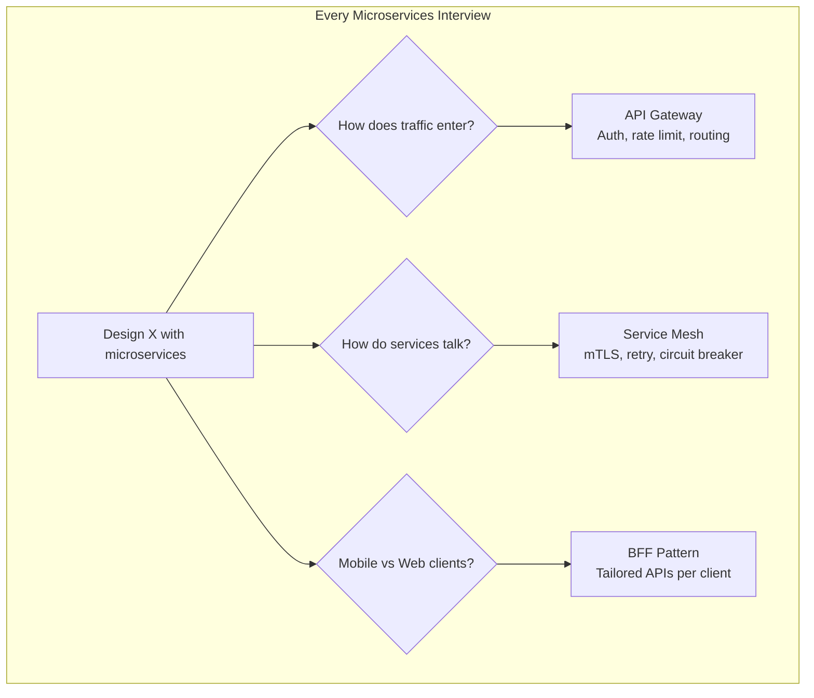

### What "Good" Looks Like in an Interview

| Level | What You Demonstrate |
|-------|---------------------|
| **Junior** | Names API Gateway ("we put NGINX in front") |
| **Mid** | Explains responsibilities ("gateway handles JWT validation; services trust internal network") |
| **Senior** | Describes architecture ("Envoy sidecar intercepts all egress via iptables; Istio control plane pushes xDS config") |
| **Staff** | Anticipates failure ("gateway rate limiter must use Redis cluster, not in-memory — otherwise per-node limits are ineffective; mesh retry budget prevents retry storms") |

### The Two-Layer Mental Model

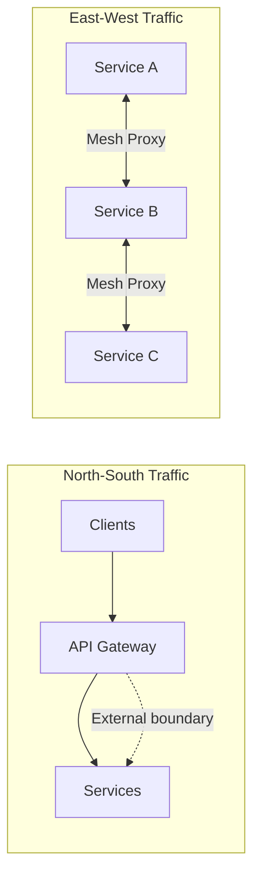

| Traffic Type | Direction | Handled By | Examples |
|-------------|-----------|------------|----------|
| **North-South** | Client → Backend | API Gateway, CDN, WAF | User login, REST API calls |
| **East-West** | Service → Service | Service Mesh, internal LB | Order service calls Payment service |
| **Edge-to-Origin** | CDN → Backend | CDN, origin shield | Static asset fetch on cache miss |

**Interview rule:** Always draw north-south and east-west as separate concerns. Conflating them signals shallow understanding.

---

## 2. API Gateway — Deep Dive

### 2.1 What an API Gateway Is

An **API Gateway** is a single entry point for all client-facing API traffic. It sits between clients and backend services, performing cross-cutting concerns so individual services stay focused on business logic.

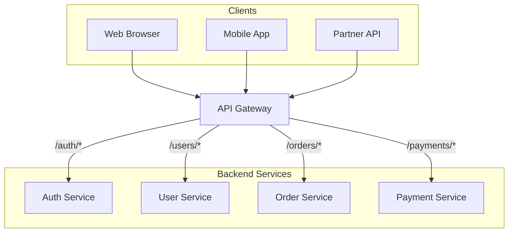

| Without Gateway | With Gateway |
|----------------|--------------|
| Clients know every service URL | Clients know one base URL |
| Each service implements auth | Auth centralized at gateway |
| Rate limiting duplicated per service | Rate limiting at single choke point |
| SSL certs on every service | SSL termination at gateway |
| API versioning scattered | Version routing at gateway (`/v1`, `/v2`) |

### 2.2 Core Responsibilities

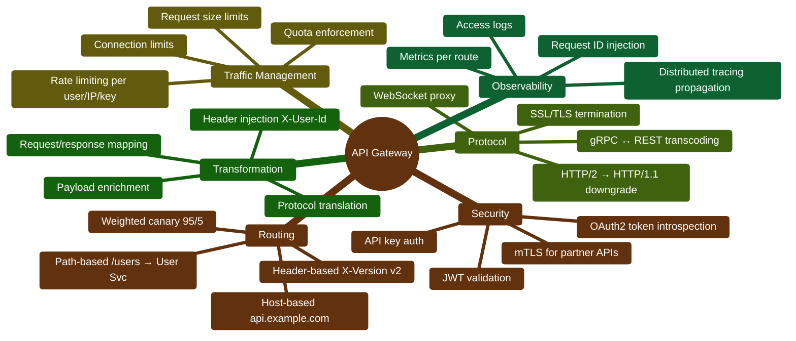

### 2.3 Routing — How It Works

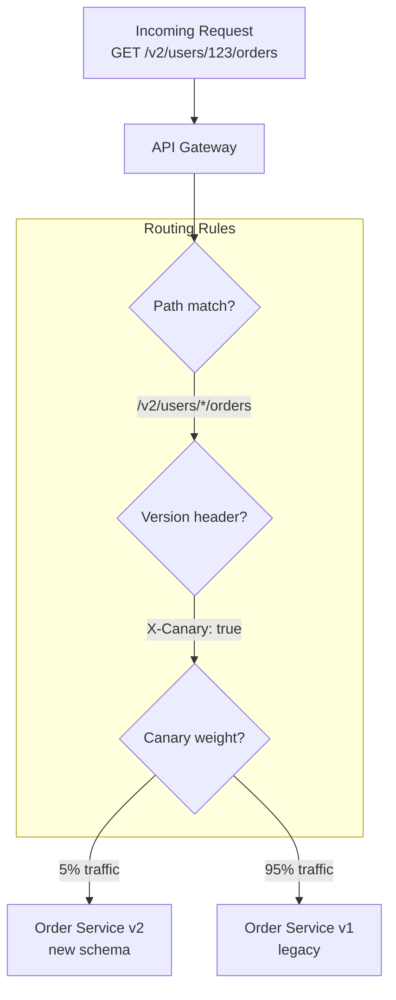

**Routing dimensions:**

| Dimension | Example Rule | Use Case |
|-----------|-------------|----------|
| **Path** | `/api/orders/*` → Order Service | REST API standard |
| **Host** | `admin.api.com` → Admin Service | Separate admin surface |
| **Header** | `X-API-Version: 2` → v2 backend | Header-based versioning |
| **Query param** | `?version=beta` → Beta cluster | Feature flag routing |
| **Method** | `POST /graphql` → GraphQL gateway | Method-specific routing |
| **Weight** | 90% stable, 10% canary | Blue-green / canary deploy |
| **Geography** | EU users → EU region backend | Data residency compliance |

**Implementation detail interviewers love:**

```nginx
# NGINX path-based routing example
location /api/users/ {
    proxy_pass http://user-service:8080/;
    proxy_set_header X-Request-Id $request_id;
    proxy_set_header X-Forwarded-For $proxy_add_x_forwarded_for;
}

location /api/orders/ {
    proxy_pass http://order-service:8080/;
    # Canary: 10% to new version
    split_clients "${remote_addr}${date_gmt}" $backend {
        10%     order-service-v2:8080;
        *       order-service-v1:8080;
    }
}
```

### 2.4 Authentication & Authorization at the Gateway

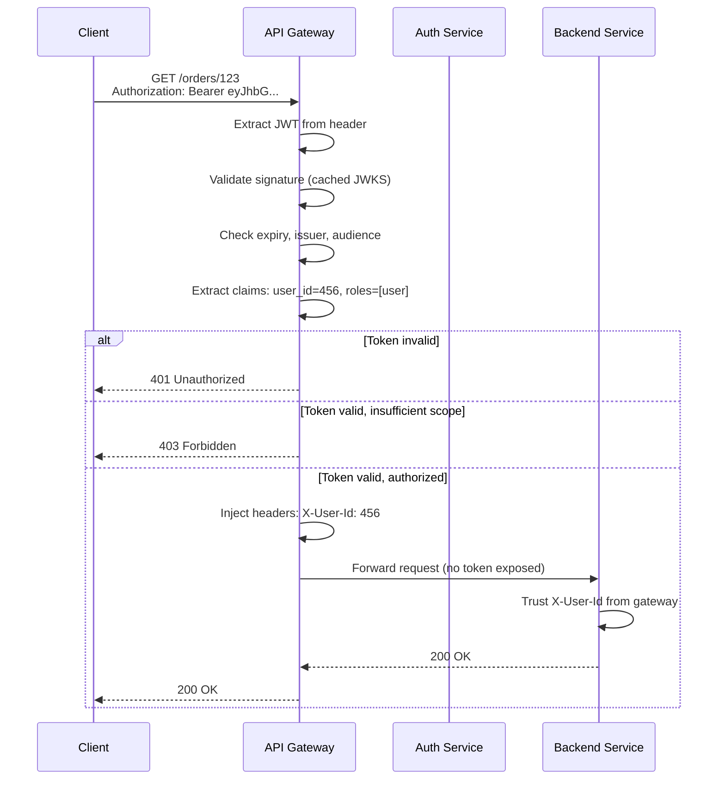

| Auth Pattern | How Gateway Handles It | Backend Trust Model |
|-------------|----------------------|---------------------|
| **JWT validation** | Gateway validates signature + claims; strips token | Backend trusts `X-User-Id` header from gateway |
| **API key** | Gateway looks up key in Redis/DB; attaches client identity | Backend receives `X-Client-Id` |
| **OAuth2 introspection** | Gateway calls auth server to validate opaque token | Backend never sees token |
| **mTLS (partner APIs)** | Gateway terminates client cert; maps to partner ID | Mutual TLS at edge only |
| **Session cookie** | Gateway validates session in Redis | Backend receives session context headers |

**Critical interview point:**

> The gateway is the **trust boundary**. Backend services in a private network can trust headers injected by the gateway. They must **reject** direct client requests that bypass the gateway (network policy: only gateway subnet can reach services).

### 2.5 Rate Limiting — Algorithms & Architecture

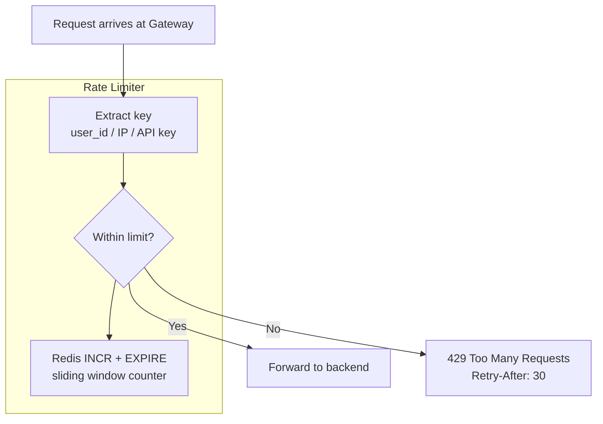

**Rate limiting algorithms:**

| Algorithm | How It Works | Pros | Cons |
|-----------|-------------|------|------|
| **Fixed window** | Count requests per minute; reset at :00 | Simple | Burst at window boundary (2× limit in 1s) |
| **Sliding window log** | Store timestamp of each request; count in last N seconds | Accurate | Memory-heavy per key |
| **Sliding window counter** | Weighted count of current + previous window | Good accuracy, low memory | Slightly complex |
| **Token bucket** | Tokens refill at fixed rate; request consumes token | Allows controlled bursts | Burst size must be tuned |
| **Leaky bucket** | Queue requests; process at fixed rate | Smooth output rate | Adds latency under burst |

**Ticketmaster on-sale scenario (interview favorite):**

```
Problem: 1M users hit "Buy Tickets" in 10 seconds when sale opens
Without rate limiting: 1M requests hit inventory service → DB lock contention → site down

Solution at API Gateway:
├── Global rate limit: 50K RPS across all users (protect backend)
├── Per-user rate limit: 5 requests/minute (prevent bot abuse)
├── Per-IP rate limit: 100 requests/minute (prevent DDoS)
├── Queue/token system: virtual waiting room before gateway admits request
└── Redis Cluster for distributed counters (not in-memory per gateway node)

Key insight: In-memory rate limiting on 10 gateway nodes = 10× the intended limit.
Must use shared store (Redis) for accurate global limits.
```

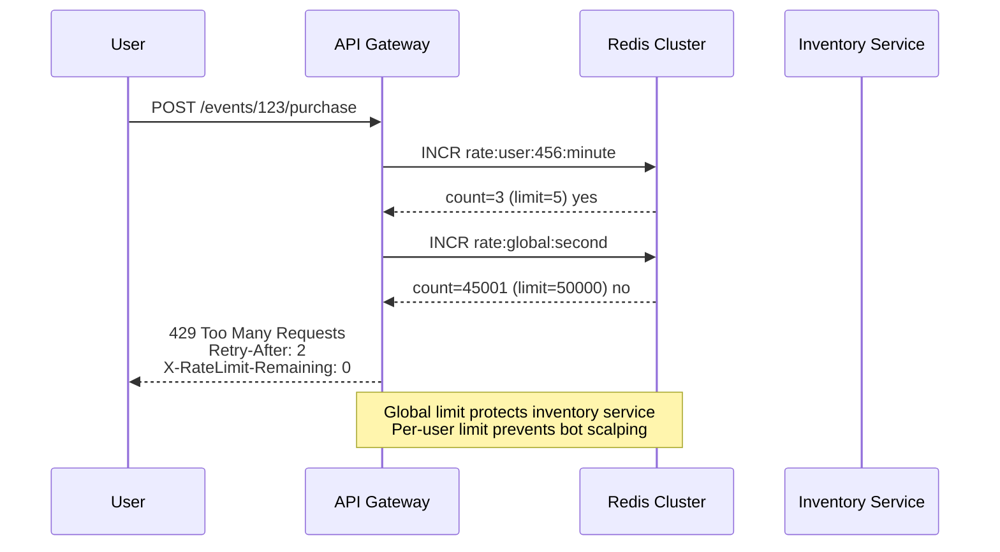

### 2.6 SSL/TLS Termination

```mermaid
flowchart LR
    subgraph Internet — TLS Encrypted
        C[Client] -->|HTTPS TLS 1.3| GW[API Gateway<br/>Terminates TLS]
    end

    subgraph Private Network — Plain HTTP or mTLS
        GW -->|HTTP or mTLS| SVC1[Service 1]
        GW -->|HTTP or mTLS| SVC2[Service 2]
    end
```

| Aspect | At Gateway (Edge) | Between Services (Mesh) |
|--------|------------------|------------------------|
| **Who terminates** | API Gateway / Load Balancer | Envoy sidecar (mTLS) |
| **Certificate** | Public CA cert (`*.api.com`) | Internal CA / SPIFFE identity |
| **Protocol** | TLS 1.2/1.3 with clients | mTLS between sidecars |
| **Performance** | Hardware offload (AWS ALB) or OpenSSL | Sidecar handles per-connection |
| **Why** | Clients need trusted public cert | Services need identity verification |

**SSL termination benefits:**
- Backend services don't manage certificates
- Centralized cipher suite policy
- HTTP/2 multiplexing at gateway
- Certificate rotation without redeploying services

**Interview nuance:** "We terminate TLS at the gateway for clients, but use mTLS in the service mesh for east-west traffic. The private network is not trusted — zero-trust model."

### 2.7 Request & Response Transformation

```mermaid
flowchart TB
    REQ_IN[Client Request<br/>POST /api/v1/checkout<br/>{cart_id, payment_token}]

    subgraph Gateway Transformations
        T1[Path rewrite<br/>/api/v1/checkout → /internal/v2/orders]
        T2[Header injection<br/>X-User-Id, X-Request-Id, X-Trace-Id]
        T3[Body mapping<br/>payment_token → stripe_token field rename]
        T4[Auth strip<br/>Remove Authorization header]
    end

    REQ_OUT[Backend Request<br/>POST /internal/v2/orders<br/>{cart_id, stripe_token}<br/>X-User-Id: 456]

    RESP_IN[Backend Response<br/>{order_id, status, internal_cost_margin}]

    subgraph Response Transformations
        R1[Field filtering<br/>Remove internal_cost_margin]
        R2[Format conversion<br/>Protobuf → JSON]
        R3[Error normalization<br/>500 → {error: service_unavailable}]
    end

    RESP_OUT[Client Response<br/>{order_id, status}]

    REQ_IN --> T1 --> T2 --> T3 --> T4 --> REQ_OUT
    RESP_IN --> R1 --> R2 --> R3 --> RESP_OUT
```

| Transformation Type | Example | Why |
|--------------------|---------|-----|
| **Path rewrite** | `/api/users` → `/v2/user-profiles` | API versioning without client changes |
| **Header injection** | Add `X-User-Id` from JWT claims | Backend doesn't parse JWT |
| **Header removal** | Strip `Authorization` before backend | Security — token not exposed internally |
| **Body field mapping** | `client_field` → `server_field` | Legacy API compatibility |
| **Protocol transcoding** | REST → gRPC | Client uses REST; backend uses gRPC |
| **Response filtering** | Remove internal fields | Don't leak `cost_price` to client |
| **Aggregation** | BFF combines 3 service calls into 1 response | Reduce client round trips |

---

### 2.8 API Gateway Placement in Full Architecture

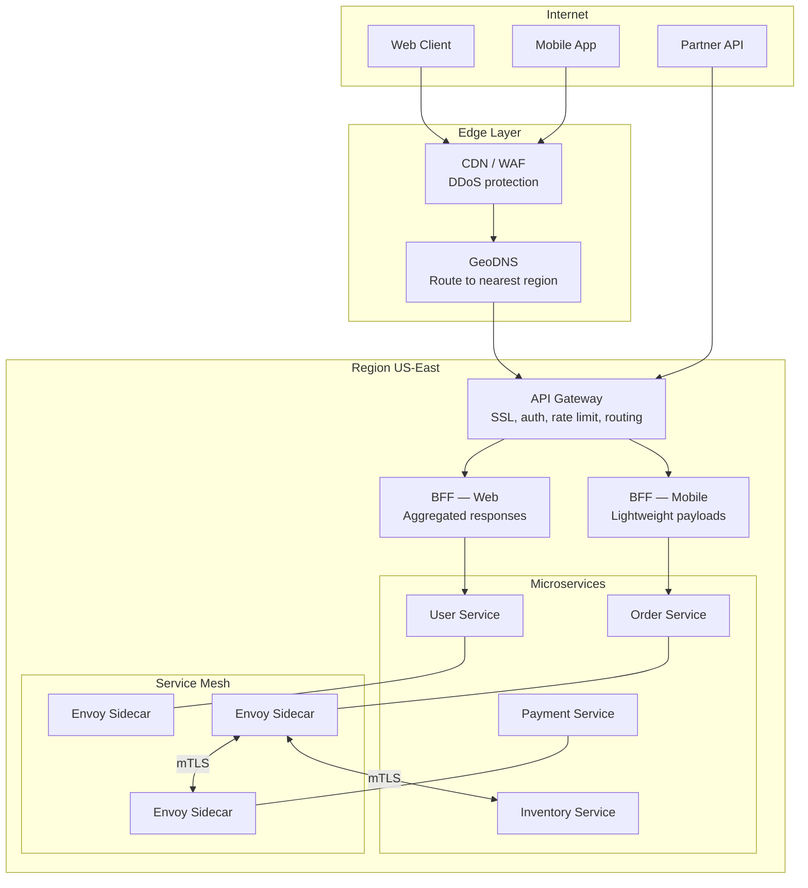

---

## 3. API Gateway Product Comparison

### 3.1 Kong vs AWS API Gateway vs NGINX vs Envoy

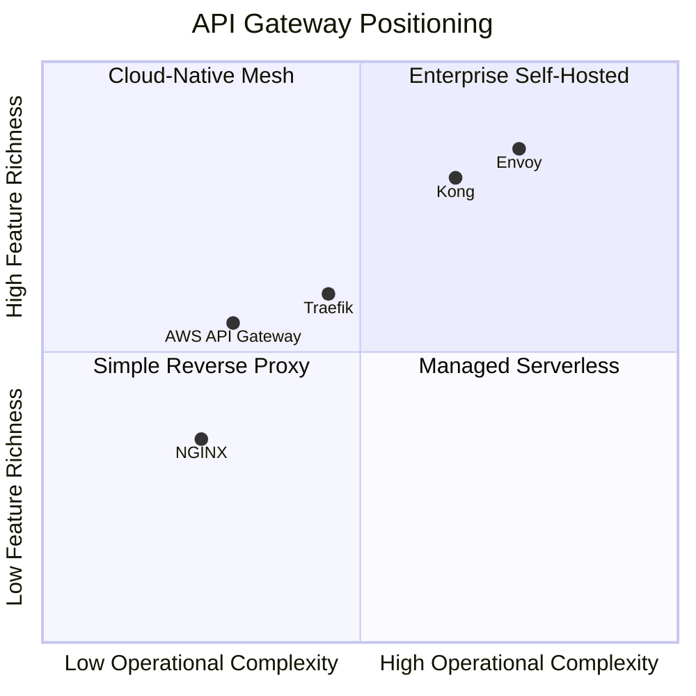

| Dimension | Kong | AWS API Gateway | NGINX | Envoy |
|-----------|------|----------------|-------|-------|
| **Type** | API management platform | Managed serverless gateway | Reverse proxy / LB | Cloud-native proxy (data plane) |
| **Deployment** | Self-hosted or Kong Konnect (SaaS) | Fully managed AWS service | Self-hosted or NGINX Plus | Sidecar or standalone |
| **Routing** | Path, host, header, plugin-based | Path, stage, API key, Lambda proxy | `location` blocks, `upstream` | xDS dynamic config, weighted clusters |
| **Auth** | Plugins: JWT, OAuth2, LDAP, HMAC | Cognito, IAM, Lambda authorizer | `auth_request` module, lua | JWT filter, ext_authz gRPC |
| **Rate limiting** | Redis-backed plugin, sliding window | Usage plans, throttling (account limits) | `limit_req` zone (local), lua+Redis | Local + global rate limit filters |
| **SSL termination** | Yes | Yes (ACM integration) | Yes (industry standard) | Yes (SDS dynamic certs) |
| **Transformation** | Request/response transformer plugins | Mapping templates (VTL), Lambda | `sub_filter`, lua scripting | Lua, WASM filters |
| **Observability** | Prometheus, Datadog plugins | CloudWatch, X-Ray | Stub status, commercial LB logs | Native stats, OpenTelemetry, access logs |
| **Best for** | Multi-cloud API management, plugin ecosystem | Serverless AWS apps, quick setup | High-performance L7 proxy, static config | Service mesh data plane, dynamic config |
| **Pricing** | Open source free; Enterprise $$$ | Per-request ($3.50/M requests) | Open source free; Plus $$$ | Open source free; Tetrate/SAAS |

### 3.2 Kong — Architecture Internals

```mermaid
graph TB
    subgraph Kong Gateway Node
        NGINX_CORE[OpenResty / NGINX<br/>Event-driven worker processes]
        
        subgraph Plugin Pipeline — Per Request
            P1[Authentication Plugin]
            P2[Rate Limiting Plugin]
            P3[Logging Plugin]
            P4[Proxy Plugin]
        end

        CACHE[DB-less or DB cache<br/>Routes, services, plugins]
    end

    subgraph Kong Control
        ADMIN[Kong Admin API<br/>Declarative config]
        DB[(PostgreSQL / DB-less YAML)]
    end

    CLIENT[Client] --> NGINX_CORE
    NGINX_CORE --> P1 --> P2 --> P3 --> P4
    P4 --> UPSTREAM[Upstream Service]
    ADMIN --> DB
    DB --> CACHE
```

**Kong request lifecycle:**

```
1. Request hits Kong's NGINX worker (OpenResty)
2. Kong matches route: longest path prefix wins
3. Plugin chain executes in configured order (auth before rate limit before proxy)
4. Rate limiter checks Redis: INCR kong:rate:{route}:{consumer_id}
5. Proxy plugin forwards to upstream with transformed headers
6. Response passes through logging plugin → Prometheus metrics
```

| Kong Feature | Interview Talking Point |
|-------------|------------------------|
| **Plugin architecture** | Cross-cutting concerns as composable plugins — add rate limiting without touching routing config |
| **DB-less mode** | Config as YAML in Git; GitOps-friendly; no PostgreSQL dependency |
| **Consumer + Credential** | Per-client API keys, JWT credentials, OAuth2 tokens |
| **Upstream health checks** | Active/passive health checks; circuit breaker via `healthy`/`unhealthy` thresholds |

### 3.3 AWS API Gateway — Architecture Internals

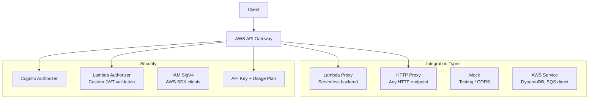

| AWS API Gateway Feature | Detail |
|------------------------|--------|
| **REST API vs HTTP API** | REST API: full features (VTL mapping, usage plans). HTTP API: 70% cheaper, lower latency, JWT authorizer built-in |
| **Throttling** | Account-level: 10K RPS default (increasable). Per-stage: burst 5K, rate 10K/sec. Per-method overrides |
| **Usage plans** | API key → usage plan → throttle quota (e.g., 10K requests/day for free tier) |
| **Request validation** | JSON schema validation before hitting backend — reject malformed requests at edge |
| **Caching** | Built-in response cache (0.5GB–237GB); TTL 0–3600s; cache key by path + query + headers |
| **WebSocket** | `$connect`, `$disconnect`, `$default` routes; connection management via DynamoDB |

**When to say AWS API Gateway in interviews:**
- Serverless architecture (Lambda backends)
- Quick MVP with managed infra
- Need built-in API key management and usage plans
- **Avoid saying it for:** High-throughput systems (>100K RPS — cost explodes), low-latency microservices (adds ~10–30ms), complex transformation logic

### 3.4 NGINX as API Gateway

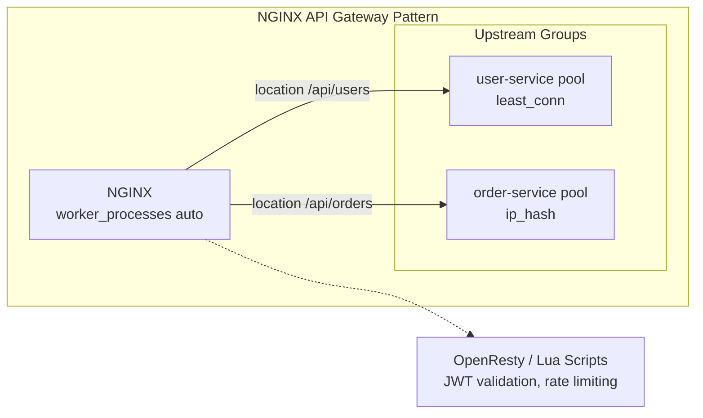

| NGINX Strength | NGINX Limitation |
|---------------|-----------------|
| 50K+ RPS per node on commodity hardware | Config is static — reload required for changes |
| Battle-tested SSL termination | No built-in API management UI |
| `limit_req`, `limit_conn` for basic rate limiting | Distributed rate limiting needs lua + Redis |
| `auth_request` subrequest for auth | Plugin ecosystem less rich than Kong |
| Low memory footprint | Service discovery integration manual |

**NGINX rate limiting example:**

```nginx
# Per-IP: 10 requests/second with burst of 20
limit_req_zone $binary_remote_addr zone=api_limit:10m rate=10r/s;

server {
    location /api/ {
        limit_req zone=api_limit burst=20 nodelay;
        limit_req_status 429;
        proxy_pass http://backend;
    }
}
```

### 3.5 Envoy as API Gateway & Mesh Data Plane

```mermaid
graph TB
    subgraph Envoy Proxy Architecture
        LISTENER[Listener<br/>Port 443, TLS]
        FILTER_CHAIN[Filter Chain<br/>HTTP Connection Manager]
        
        subgraph HTTP Filters — Ordered Pipeline
            F1[Rate Limit Filter]
            F2[JWT Auth Filter]
            F3[Router Filter]
        end

        CLUSTER[Cluster<br/>order-service endpoints]
        EDS[EDS — Endpoint Discovery<br/>Dynamic upstream list]
    end

    subgraph Envoy Control Plane
        XDS[xDS Server<br/>Istio / Consul / custom]
    end

    CLIENT[Client] --> LISTENER --> FILTER_CHAIN
    FILTER_CHAIN --> F1 --> F2 --> F3
    F3 --> CLUSTER --> EDS
    XDS -->|CDS, LDS, RDS, EDS| LISTENER
    XDS --> CLUSTER
```

| Envoy Concept | What It Is |
|--------------|-----------|
| **Listener** | Binds to IP:port; terminates TLS; starts filter chain |
| **Filter chain** | Ordered processing pipeline (like Kong plugins) |
| **Cluster** | Group of upstream hosts with LB policy |
| **xDS** | Dynamic config API (CDS, LDS, RDS, EDS, SDS) — no restart needed |
| **Sidecar mode** | Intercepts all inbound/outbound via iptables redirect |
| **Wasm filters** | Custom logic in WebAssembly — language-agnostic extensions |

**Why Envoy won the service mesh data plane:**
- Built for dynamic config (xDS) — not static files like NGINX
- First-class observability: stats, tracing, access logs per route
- Designed as sidecar: minimal resource footprint per pod
- CNCF graduated; used by Istio, AWS App Mesh, Consul Connect

### 3.6 Product Selection Decision Matrix

| Scenario | Recommended Gateway | Why |
|----------|-------------------|-----|
| AWS serverless (Lambda) | AWS API Gateway | Native integration, per-request pricing OK at low volume |
| Kubernetes microservices | Envoy + Istio / Kong Ingress | Dynamic service discovery, xDS config |
| High-throughput REST API (100K+ RPS) | NGINX or Kong | Cost-effective at scale; AWS API Gateway too expensive |
| Multi-cloud API management | Kong Konnect | Cloud-agnostic; unified policy across AWS + GCP |
| Quick MVP / startup | NGINX or AWS HTTP API | Minimal setup; add Kong later |
| GraphQL federation gateway | Apollo Router or Kong | Schema stitching; not raw NGINX |
| Partner B2B API with usage billing | Kong or AWS API Gateway | API keys, usage plans, developer portal |

---

## 4. Service Mesh Fundamentals

### 4.1 What Problem Does a Service Mesh Solve?

In a microservices architecture with 50+ services, every service needs:
- **Retries** with exponential backoff on transient failures
- **Timeouts** to prevent cascade failures
- **Circuit breakers** to stop calling unhealthy services
- **mTLS** for service-to-service authentication
- **Traffic splitting** for canary deployments
- **Observability** — distributed tracing, per-service metrics

**Without mesh:** Each team implements these in their service code (Java, Go, Python) — inconsistent, buggy, duplicated.

**With mesh:** A sidecar proxy handles all of this — application code is unaware.

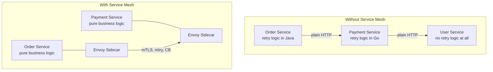

### 4.2 Service Mesh Architecture — Control Plane vs Data Plane

```mermaid
graph TB
    subgraph Control Plane — Configuration & Policy
        ISTIOD[Istiod / Linkerd Controller<br/>Service discovery, cert issuance, policy]
        CRD[Kubernetes CRDs<br/>VirtualService, DestinationRule]
    end

    subgraph Data Plane — Traffic Handling
        subgraph Pod A
            APP_A[App Container]
            ENVOY_A[Envoy Sidecar<br/>iptables redirect]
        end
        subgraph Pod B
            APP_B[App Container]
            ENVOY_B[Envoy Sidecar]
        end
        subgraph Pod C
            APP_C[App Container]
            ENVOY_C[Envoy Sidecar]
        end
    end

    ISTIOD -->|xDS push| ENVOY_A
    ISTIOD -->|xDS push| ENVOY_B
    ISTIOD -->|xDS push| ENVOY_C
    CRD --> ISTIOD

    APP_A -->|localhost:15001| ENVOY_A
    ENVOY_A -->|mTLS| ENVOY_B
    ENVOY_B -->|mTLS| ENVOY_C
```

| Plane | Components | Responsibility |
|-------|-----------|---------------|
| **Data plane** | Envoy/Linkerd-proxy sidecars | Proxy all traffic; enforce policy; collect telemetry |
| **Control plane** | Istiod, Linkerd controller | Service discovery; config distribution; cert management |

**Analogy for interviews:** "The control plane is air traffic control — it tells planes where to go. The data plane is the planes themselves — they carry the actual traffic."

### 4.3 When You Need a Service Mesh

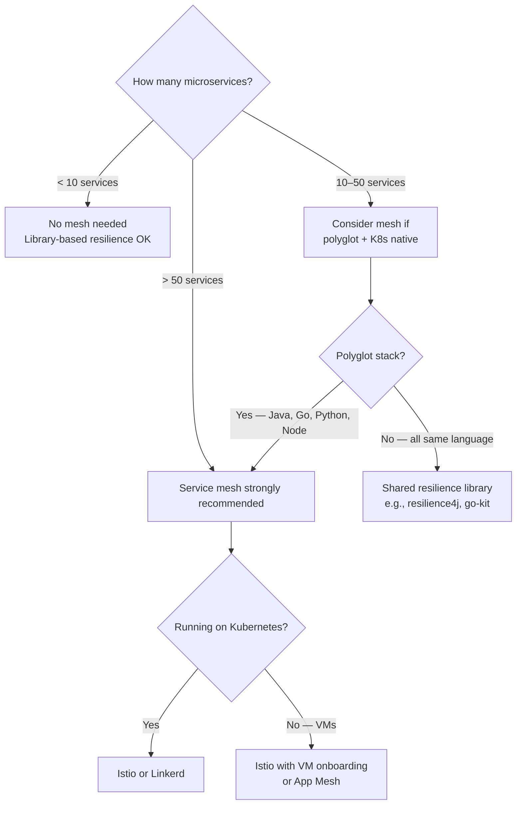

| Signal You Need a Mesh | Signal You Don't |
|----------------------|-----------------|
| 50+ microservices across multiple teams | Monolith or < 10 services |
| Polyglot: Java, Go, Python, Node mixed | Single language with shared library |
| Security audit requires mTLS everywhere | Private VPC "trust the network" is acceptable |
| Frequent canary/blue-green deploys | Monthly deploys; manual traffic shift OK |
| Need unified observability without code changes | Each team owns their own tracing |
| Kubernetes-native deployment | Bare VMs without orchestration |

### 4.4 Service Mesh vs API Gateway — Complementary, Not Competing

```mermaid
graph TB
    subgraph Responsibilities
        GW_RESP[API Gateway<br/>─────────────<br/>Client authentication<br/>Public rate limiting<br/>SSL termination<br/>API versioning<br/>Request transformation<br/>DDoS protection]
        
        MESH_RESP[Service Mesh<br/>─────────────<br/>Service identity (mTLS)<br/>Internal retry/timeout<br/>Circuit breaker<br/>Traffic splitting (canary)<br/>Service-to-service authZ<br/>Distributed tracing]
    end

    GW_RESP -.->|North-South| CLIENT[External Clients]
    MESH_RESP -.->|East-West| SERVICES[Internal Services]
```

| Concern | API Gateway | Service Mesh |
|---------|------------|--------------|
| **Who is the client?** | External users, partners | Internal services |
| **Authentication** | JWT, API key, OAuth | mTLS service identity (SPIFFE) |
| **Rate limiting scope** | Per user, per API key | Per service, per endpoint |
| **Traffic management** | A/B at API level | Canary at service version level |
| **Observability** | Per-API metrics | Per-service, per-call metrics |
| **Deployment** | Few gateway instances (3–10) | Sidecar per pod (1000s) |

---

## 5. Sidecar Proxy Pattern — Internals

### 5.1 How Traffic Interception Works

```mermaid
sequenceDiagram
    participant APP as App Container<br/>Order Service
    participant IPT as iptables / eBPF
    participant ENVOY as Envoy Sidecar<br/>localhost:15001
    participant REMOTE as Remote Envoy Sidecar<br/>Payment Service

    Note over APP,ENVOY: Outbound call: app thinks it's calling payment:8080

    APP->>IPT: connect payment-service:8080
    IPT->>IPT: REDIRECT rule:<br/>OUTPUT → ENVOY port 15001
    IPT->>ENVOY: Intercepted connection
    ENVOY->>ENVOY: Apply: retry policy, timeout,<br/>load balance, mTLS wrap
    ENVOY->>REMOTE: mTLS connection to payment sidecar
    REMOTE->>REMOTE: Decrypt mTLS, apply inbound policy
    REMOTE->>APP: Forward to payment container :8080
```

**iptables redirection (simplified):**

```bash
# Istio installs these rules in every pod's network namespace
iptables -t nat -A OUTPUT -p tcp --dport 8080 -j REDIRECT --to-port 15001
# App calls localhost:15001 thinking it's calling remote:8080
# Envoy knows real destination from xDS config
```

| Interception Method | Used By | Pros | Cons |
|--------------------|---------|------|------|
| **iptables REDIRECT** | Istio (default) | Works with any app; no code change | Intercepts ALL outbound traffic |
| **eBPF (Cilium)** | Cilium service mesh | More efficient; finer-grained | Requires Linux 4.19+; newer |
| **IPVS** | Kube-proxy modes | Kernel-level LB | Less flexible policy |
| **SDK integration** | App Mesh SDK | No sidecar overhead | Requires code change per language |

### 5.2 Sidecar Lifecycle in Kubernetes

```mermaid
flowchart TB
    subgraph Pod Startup
        INIT[Istio Init Container<br/>istio-iptables<br/>Sets up redirection rules]
        APP_START[App Container starts]
        ENVOY_START[Envoy Sidecar starts<br/>Waits for xDS config]
        READY{Envoy ready?<br/>/config_dump has clusters}
    end

    subgraph Running
        PROXY[Proxy all traffic<br/>mTLS, metrics, tracing]
        XDS_RECV[Receive xDS updates<br/>Hot reload, no restart]
    end

    subgraph Shutdown
        DRAIN[Envoy drains connections<br/>preStop hook: 5s wait]
        APP_STOP[App container stops]
        ENVOY_STOP[Envoy stops last<br/>Kubernetes native sidecar in 1.29+]
    end

    INIT --> ENVOY_START --> READY
    READY -->|Yes| PROXY
    PROXY --> XDS_RECV
    PROXY --> DRAIN --> APP_STOP --> ENVOY_STOP
```

**Sidecar resource overhead (know these numbers):**

| Metric | Envoy Sidecar | Linkerd-proxy |
|--------|--------------|---------------|
| **Memory** | 50–100 MB per pod | 10–30 MB per pod |
| **CPU (idle)** | ~0.01 core | ~0.005 core |
| **CPU (10K RPS)** | ~0.1–0.3 core | ~0.05–0.15 core |
| **Latency overhead** | ~1–3ms p99 | ~0.5–1ms p99 |
| **Startup time** | 2–5 seconds | 1–2 seconds |

**Interview point:** "At 1000 pods, Envoy sidecars add ~50–100 GB aggregate memory. Linkerd is lighter but less feature-rich. For a 10-service startup, this overhead isn't justified."

### 5.3 xDS Configuration Protocol

```mermaid
graph LR
    subgraph xDS APIs
        LDS[LDS — Listener Discovery<br/>Which ports to listen on]
        RDS[RDS — Route Discovery<br/>URL path → cluster mapping]
        CDS[CDS — Cluster Discovery<br/>Upstream service endpoints]
        EDS[EDS — Endpoint Discovery<br/>Pod IPs for each cluster]
        SDS[SDS — Secret Discovery<br/>TLS certificates for mTLS]
    end

    ISTIOD[Istiod Control Plane]
    ENVOY[Envoy Sidecar]

    ISTIOD -->|gRPC stream| LDS --> ENVOY
    ISTIOD -->|gRPC stream| RDS --> ENVOY
    ISTIOD -->|gRPC stream| CDS --> ENVOY
    ISTIOD -->|gRPC stream| EDS --> ENVOY
    ISTIOD -->|gRPC stream| SDS --> ENVOY
```

**What happens when a new pod starts:**

```
1. Payment Service pod scales from 3 → 5 replicas
2. Kubernetes registers new pod IPs in endpoints
3. Istiod watches endpoints; detects change within ~1 second
4. Istiod pushes updated EDS to ALL Envoy sidecars
5. Order Service's Envoy now load-balances across 5 payment pods
6. No restart, no config reload — live update via gRPC stream
```

### 5.4 Sidecar vs Ambient Mesh (Next Generation)

```mermaid
graph TB
    subgraph Traditional Sidecar
        POD1[Pod: App + Envoy sidecar]
        POD2[Pod: App + Envoy sidecar]
        POD3[Pod: App + Envoy sidecar]
        POD1 <-->|mTLS per pod| POD2
        POD2 <-->|mTLS per pod| POD3
    end

    subgraph Ambient Mesh — Istio 1.22+
        POD4[Pod: App only]
        POD5[Pod: App only]
        ZTUNNEL[ztunnel — node-level proxy]
        WAYPOINT[Waypoint proxy — per-namespace L7]
        POD4 --> ZTUNNEL
        POD5 --> ZTUNNEL
        ZTUNNEL <-->|HBONE tunnel| ZTUNNEL
        ZTUNNEL --> WAYPOINT
    end
```

| Model | Proxy Location | Memory per Pod | L7 Features |
|-------|---------------|----------------|-------------|
| **Sidecar** | One Envoy per pod | 50–100 MB | Full L7 (retry, fault injection, headers) |
| **Ambient (ztunnel)** | One per node | 0 MB per pod | L4 mTLS only |
| **Ambient (waypoint)** | One per namespace | 0 MB per pod | L7 via shared waypoint proxy |

**Interview tip:** Mention ambient mesh to show you're current. "Istio's ambient mode removes per-pod sidecars — ztunnel handles L4 mTLS at the node level, waypoint proxy handles L7 policy per namespace. Reduces memory overhead by 90% for large clusters."

---

## 6. Istio & Linkerd — Deep Dive

### 6.1 Istio Architecture

```mermaid
graph TB
    subgraph Istio Control Plane
        ISTIOD[Istiod<br/>Pilot + Citadel + Galley merged]
        
        subgraph Istiod Responsibilities
            SD[Service Discovery<br/>Watch K8s endpoints]
            CONFIG[Config Distribution<br/>xDS to all Envoys]
            CERT[Certificate Authority<br/>Issue mTLS certs<br/>24h TTL, auto-rotate]
        end
    end

    subgraph Istio Data Plane
        subgraph Order Pod
            ORDER_APP[order-service]
            ORDER_ENVOY[Envoy Sidecar]
        end
        subgraph Payment Pod
            PAY_APP[payment-service]
            PAY_ENVOY[Envoy Sidecar]
        end
    end

    subgraph Istio CRDs — User Configuration
        VS[VirtualService<br/>Routing rules, retries, timeouts]
        DR[DestinationRule<br/>Subsets, LB policy, circuit breaker]
        GW[Istio Gateway<br/>North-south ingress]
        PA[PeerAuthentication<br/>mTLS mode: STRICT/PERMISSIVE]
        RA[RequestAuthentication<br/>JWT validation]
    end

    ISTIOD --> ORDER_ENVOY
    ISTIOD --> PAY_ENVOY
    VS --> ISTIOD
    DR --> ISTIOD
    ORDER_ENVOY <-->|mTLS| PAY_ENVOY
```

### 6.2 Istio Traffic Management — VirtualService & DestinationRule

```mermaid
flowchart LR
    REQ[Request to payment-service]

    VS[VirtualService<br/>Route: 90% v1, 10% v2<br/>Retry: 3 attempts<br/>Timeout: 5s]

    DR[DestinationRule<br/>Subset v1: version=1.0<br/>Subset v2: version=2.0<br/>Circuit breaker: max 100 conn]

    V1[payment-v1 Pod]
    V2[payment-v2 Pod]

    REQ --> VS
    VS -->|90%| DR
    VS -->|10%| DR
    DR -->|subset v1| V1
    DR -->|subset v2| V2
```

**Istio VirtualService example (explain in interview):**

```yaml
apiVersion: networking.istio.io/v1
kind: VirtualService
metadata:
  name: payment-service
spec:
  hosts:
    - payment-service
  http:
    - route:
        - destination:
            host: payment-service
            subset: v1
          weight: 90
        - destination:
            host: payment-service
            subset: v2
          weight: 10
      retries:
        attempts: 3
        perTryTimeout: 2s
        retryOn: 5xx,reset,connect-failure
      timeout: 5s
```

**Istio DestinationRule with circuit breaker:**

```yaml
apiVersion: networking.istio.io/v1
kind: DestinationRule
metadata:
  name: payment-service
spec:
  host: payment-service
  subsets:
    - name: v1
      labels:
        version: v1
    - name: v2
      labels:
        version: v2
  trafficPolicy:
    connectionPool:
      tcp:
        maxConnections: 100
      http:
        h2UpgradePolicy: UPGRADE
        http1MaxPendingRequests: 50
        http2MaxRequests: 100
    outlierDetection:
      consecutive5xxErrors: 5
      interval: 30s
      baseEjectionTime: 30s
      maxEjectionPercent: 50
```

### 6.3 Linkerd Architecture — The Lightweight Alternative

```mermaid
graph TB
    subgraph Linkerd Control Plane
        IDENTITY[Identity Service<br/>mTLS cert issuance<br/>ECDSA P-256]
        DESTINATION[Destination Service<br/>Service discovery<br/>DNS-based lookup]
        PROXY_INJECT[Proxy Injector<br/>Mutating webhook<br/>Adds sidecar to pods]
    end

    subgraph Linkerd Data Plane
        subgraph Pod
            APP[Application]
            LINKERD_PROXY[linkerd-proxy<br/>Rust — ultra lightweight]
        end
    end

    IDENTITY -->|Cert via gRPC| LINKERD_PROXY
    DESTINATION -->|Endpoint lookup| LINKERD_PROXY
    PROXY_INJECT -.->|Inject on pod create| Pod
    APP <-->|localhost| LINKERD_PROXY
```

### 6.4 Istio vs Linkerd Comparison

| Dimension | Istio | Linkerd |
|-----------|-------|---------|
| **Data plane** | Envoy (C++) | linkerd-proxy (Rust) |
| **Complexity** | High — many CRDs, steep learning curve | Low — minimal config, opinionated defaults |
| **Memory per pod** | 50–100 MB | 10–30 MB |
| **Features** | Full L7: fault injection, mirroring, WASM | Core L7: retry, timeout, mTLS; fewer knobs |
| **Multi-cluster** | Built-in (primary-remote, multi-primary) | Limited native multi-cluster |
| **Non-K8s (VM) support** | Yes — workload onboarding | Kubernetes only |
| **CNCF status** | Graduated (via Envoy) | Graduated |
| **Best for** | Large enterprises, complex traffic management | Teams wanting simple mTLS + observability |
| **Used by** | Google, IBM, eBay, AutoTrader | Microsoft (partial), HP, Nordstrom |

```mermaid
graph LR
    subgraph Istio — Feature Rich
        I1[VirtualService]
        I2[DestinationRule]
        I3[Gateway]
        I4[PeerAuthentication]
        I5[ServiceEntry]
        I6[WasmPlugin]
        I7[Telemetry]
    end

    subgraph Linkerd — Minimal Config
        L1[ServiceProfile<br/>retry, timeout]
        L2[ServerPolicy<br/>authz]
        L3[HTTPRoute<br/>traffic split]
    end
```

**Interview answer for "Istio or Linkerd?":**

> "For a team with 100+ services needing canary deploys, traffic mirroring, and multi-cluster — Istio. For a 20-service team that primarily needs mTLS and basic retries with minimal operational burden — Linkerd. I'd default to Linkerd for startups and Istio for enterprises, unless the team already has Envoy expertise."

---

## 7. mTLS, Circuit Breaker, Retry & Timeout at the Mesh Layer

### 7.1 Mutual TLS (mTLS) — How It Works

```mermaid
sequenceDiagram
    participant CA as Istiod CA<br/>Certificate Authority
    participant EA as Envoy A<br/>Order Service
    participant EB as Envoy B<br/>Payment Service

    Note over CA,EB: Startup — Certificate Issuance
    EA->>CA: CSR: SPIFFE ID spiffe://cluster.local/ns/default/sa/order-sa
    CA-->>EA: Cert (24h TTL) + private key
    EB->>CA: CSR: SPIFFE ID spiffe://cluster.local/ns/default/sa/payment-sa
    CA-->>EB: Cert (24h TTL) + private key

    Note over EA,EB: Request — Mutual Authentication
    EA->>EB: ClientHello + Order Service cert
    EB->>EB: Verify Order cert against CA trust bundle
    EB->>EA: ServerHello + Payment Service cert
    EA->>EA: Verify Payment cert against CA trust bundle
    EA->>EB: Encrypted application data
    EB-->>EA: Encrypted response

    Note over CA,EB: Rotation — Every 24 hours, automatic
    CA-->>EA: New cert pushed via SDS
    CA-->>EB: New cert pushed via SDS
```

| mTLS Mode (Istio) | Behavior |
|-------------------|----------|
| **STRICT** | Only mTLS allowed; plain text rejected |
| **PERMISSIVE** | Accept both mTLS and plain text (migration mode) |
| **DISABLE** | No mTLS |

**SPIFFE identity format:**

```
spiffe://trust-domain/ns/<namespace>/sa/<service-account>

Example:
spiffe://cluster.local/ns/payments/sa/payment-service
```

**Why mTLS matters in interviews:**

> "In a zero-trust model, the network is hostile. A compromised service in the cluster can impersonate any other service. mTLS ensures every connection is authenticated — Order Service can only talk to Payment Service if its SPIFFE identity is authorized. Network policies alone only restrict IP/port, not identity."

### 7.2 Circuit Breaker — Preventing Cascade Failures

```mermaid
stateDiagram-v2
    [*] --> Closed: Initial state<br/>All requests pass through

    Closed --> Open: Error rate > threshold<br/>OR consecutive failures > 5
    Open --> HalfOpen: After cooldown period<br/>(e.g., 30 seconds)
    HalfOpen --> Closed: Probe request succeeds
    HalfOpen --> Open: Probe request fails

    state Closed {
        [*] --> ForwardingRequests
    }
    state Open {
        [*] --> RejectingAll: Return 503 immediately<br/>No call to unhealthy service
    }
    state HalfOpen {
        [*] --> ProbingSingle: Allow 1 test request
    }
```

**Netflix Hystrix-style circuit breaker at mesh layer:**

```
Payment Service is down (returning 500s)

Without circuit breaker:
  Order Service → Payment (timeout 30s, fails)
  Order Service → Payment (timeout 30s, fails)  ← 100 concurrent requests
  = 100 threads blocked for 30s = Order Service also down (cascade)

With circuit breaker (Istio outlierDetection):
  Request 1-5 → Payment → 500 error
  Envoy marks Payment pod as outlier (ejected from pool)
  Request 6+ → Envoy returns 503 immediately (< 1ms)
  Order Service threads freed; degrades gracefully
  After 30s: half-open probe → if Payment recovered, re-admit
```

```mermaid
sequenceDiagram
    participant OS as Order Service
    participant EA as Envoy A
    participant EB as Envoy B
    participant PS as Payment Service<br/>(CRASHED)

    OS->>EA: Call payment-service
    EA->>EB: Attempt 1
    EB->>PS: Forward
    PS-->>EB: 500 Internal Server Error
    EB-->>EA: 500

    EA->>EB: Attempt 2 (retry)
    EB->>PS: Forward
    PS-->>EB: 500
    EB-->>EA: 500

    Note over EA: outlierDetection:<br/>5 consecutive 5xx → eject pod

    OS->>EA: Call payment-service
    EA->>EA: Pod ejected from pool
    EA-->>OS: 503 UF (Upstream Failure)<br/>Immediate — no wait

    Note over EA: After baseEjectionTime: 30s
    EA->>EB: Half-open probe
    EB->>PS: Forward (if recovered)
    PS-->>EB: 200 OK
    Note over EA: Pod re-admitted to pool
```

| Circuit Breaker Setting | Recommended Value | Why |
|--------------------------|------------------|-----|
| **consecutive5xxErrors** | 5 | Avoid ejecting on transient blips |
| **interval** | 30s | Evaluation window |
| **baseEjectionTime** | 30s | Give service time to recover |
| **maxEjectionPercent** | 50% | Always keep half the pods available |
| **maxConnections** | 100 per host | Prevent connection exhaustion |

### 7.3 Retry Policy — With Budget

```mermaid
flowchart TB
    REQ[Request from Order → Payment]

    subgraph Retry Logic
        ATT1[Attempt 1<br/>timeout: 2s]
        ATT2[Attempt 2<br/>backoff: 100ms]
        ATT3[Attempt 3<br/>backoff: 200ms]
        BUDGET{Retry budget<br/>max 20% of active requests}
    end

    SUCCESS[Return 200]
    FAIL[Return 503 after 3 attempts]

    REQ --> ATT1
    ATT1 -->|5xx / timeout| BUDGET
    BUDGET -->|Budget available| ATT2
    ATT2 -->|5xx / timeout| ATT3
    ATT3 -->|Success| SUCCESS
    ATT3 -->|Failure| FAIL
    BUDGET -->|Budget exhausted| FAIL
```

**Retry configuration best practices:**

| Setting | Value | Rationale |
|---------|-------|-----------|
| **Max attempts** | 3 | More retries amplify load on failing service |
| **perTryTimeout** | 2s | Shorter than total timeout |
| **Total timeout** | 5s | Client-facing SLA |
| **retryOn** | `5xx,reset,connect-failure` | Don't retry 4xx (client error) |
| **Retry budget** | 20% of concurrent requests | Prevent retry storm |

**The retry storm problem (staff-level talking point):**

```
Payment Service normally handles 1000 RPS
Payment Service starts failing (DB connection pool exhausted)

Without retry budget:
  Each of 1000 RPS retries 3× = 3000 RPS hitting Payment
  Payment, already failing, gets MORE load → never recovers
  This is a "retry storm" — retries make the outage worse

With retry budget (20%):
  Only 200 of 1000 RPS are allowed to retry
  800 RPS fail fast with 503
  Payment gets 1000 + 200 = 1200 RPS (manageable)
  Circuit breaker opens → remaining requests fail immediately
```

### 7.4 Timeout Hierarchy

```mermaid
graph TB
    CLIENT_TO[Client Timeout: 10s<br/>Browser / mobile app gives up]

    GW_TO[Gateway Timeout: 8s<br/>API Gateway cuts connection]

    MESH_TO[Mesh Total Timeout: 5s<br/>VirtualService timeout]

    TRY_TO[Per-Try Timeout: 2s<br/>perTryTimeout per attempt]

    APP_TO[App Timeout: 1s<br/>DB query timeout]

    CLIENT_TO --> GW_TO --> MESH_TO --> TRY_TO --> APP_TO
```

| Layer | Timeout | Rule |
|-------|---------|------|
| **Client** | 10s | Outermost — user patience |
| **API Gateway** | 8s | Must be < client timeout |
| **Mesh total** | 5s | Must be < gateway timeout |
| **Per-try** | 2s | Must be < mesh total / attempts |
| **App/DB** | 1s | Innermost — fast fail |

**Interview rule:** "Timeouts must cascade inward — each layer shorter than the one above. If the mesh timeout is 5s but the gateway timeout is 3s, the gateway kills the request before the mesh can retry."

---

## 8. BFF — Backend for Frontend Pattern

### 8.1 What Is a BFF?

A **Backend for Frontend (BFF)** is a dedicated backend service tailored to a specific client type (web, mobile, iOS, Android). It sits between the API Gateway and microservices, aggregating and shaping data for that client's needs.

```mermaid
graph TB
    subgraph Clients
        WEB[Web App<br/>Rich UI, large screen]
        IOS[iOS App<br/>Limited bandwidth]
        AND[Android App<br/>Different release cycle]
    end

    GW[API Gateway<br/>Auth, rate limit]

    subgraph BFF Layer
        BFF_WEB[BFF — Web<br/>Aggregates 5 services<br/>Full product details]
        BFF_IOS[BFF — iOS<br/>Aggregates 3 services<br/>Compressed images, minimal fields]
        BFF_AND[BFF — Android<br/>Feature-flagged responses]
    end

    subgraph Microservices
        USER[User Service]
        PRODUCT[Product Service]
        ORDER[Order Service]
        REVIEW[Review Service]
        REC[Recommendation Service]
    end

    WEB --> GW --> BFF_WEB
    IOS --> GW --> BFF_IOS
    AND --> GW --> BFF_AND

    BFF_WEB --> USER
    BFF_WEB --> PRODUCT
    BFF_WEB --> ORDER
    BFF_WEB --> REVIEW
    BFF_WEB --> REC

    BFF_IOS --> USER
    BFF_IOS --> PRODUCT
    BFF_IOS --> ORDER
```

### 8.2 Why Not One API for All Clients?

| Concern | Web Client | Mobile Client |
|---------|-----------|---------------|
| **Payload size** | Full product with all images (500KB) | Thumbnail + essential fields (20KB) |
| **Round trips** | Can handle 5 API calls (fast connection) | Needs 1 aggregated call (high latency per call) |
| **Data shape** | Nested objects for SSR rendering | Flat JSON for parsing efficiency |
| **Feature set** | Full admin features | Read-only for v1 mobile |
| **Release cycle** | Deploy daily | App store review: 2-week cycle |
| **Error handling** | Show detailed error pages | Simple error codes |

```mermaid
sequenceDiagram
    participant WEB as Web App
    participant BFF as BFF — Web
    participant US as User Service
    participant PS as Product Service
    participant RS as Review Service

    WEB->>BFF: GET /product-page/123
    BFF->>US: GET /users/me (parallel)
    BFF->>PS: GET /products/123 (parallel)
    BFF->>RS: GET /products/123/reviews (parallel)
    US-->>BFF: User profile
    PS-->>BFF: Product details + all images
    RS-->>BFF: Top 10 reviews
    BFF->>BFF: Aggregate into single response<br/>{user, product, reviews, recommendations}
    BFF-->>WEB: One JSON payload (product page ready to render)
```

### 8.3 BFF vs API Gateway vs GraphQL

| Pattern | Aggregation | Client-specific | Caching | Complexity |
|---------|------------|----------------|---------|------------|
| **BFF** | Server-side per client type | Yes — separate BFF per client | BFF caches aggregated responses | Medium — N BFFs to maintain |
| **API Gateway** | No — pure routing | No — same API for all | Gateway-level response cache | Low — single gateway |
| **GraphQL** | Client-driven via query | Yes — client specifies fields | Per-query caching (hard) | High — schema federation, N+1 |
| **Generic API + client aggregation** | Client makes multiple calls | No | Per-service caching | Low server, high client latency |

**When to use BFF in interviews:**

> "With 3+ client types (web, iOS, Android) and 10+ backend microservices, a BFF prevents each client from making 5–10 API calls per screen. The mobile BFF returns a lightweight product card; the web BFF returns the full page with recommendations. Each BFF team aligns with the client team — web frontend team owns the web BFF."

### 8.4 BFF Anti-Patterns

```mermaid
graph TB
    subgraph Anti-Pattern — God BFF
        GOD[BFF<br/>5000 lines<br/>Calls 20 services<br/>Serves web + mobile + admin]
    end

    subgraph Correct — Focused BFFs
        BFF1[BFF — Web]
        BFF2[BFF — Mobile]
        BFF3[BFF — Admin]
    end

    GOD -.->|Becomes monolith| BAD[Same problems as monolith<br/>tight coupling, deploy risk]
    BFF1 --> SVC[Microservices]
    BFF2 --> SVC
    BFF3 --> SVC
```

| Anti-Pattern | Why It Fails | Fix |
|-------------|-------------|-----|
| **God BFF** | One BFF serves all clients — becomes monolith | One BFF per client type |
| **BFF with business logic** | BFF computes discounts, inventory — belongs in services | BFF only aggregates and shapes |
| **BFF calling BFF** | BFF-Web calls BFF-Mobile — circular dependency | BFFs call services directly |
| **No BFF, client aggregates** | Mobile makes 8 API calls per screen — 2s load time | Add mobile BFF with aggregated endpoint |

---

## 9. How Gateway & Mesh Fit Together

### 9.1 The Complete Request Path

```mermaid
sequenceDiagram
    participant C as Mobile Client
    participant CDN as CDN / WAF
    participant GW as API Gateway
    participant BFF as Mobile BFF
    participant EA as Envoy Sidecar
    participant OS as Order Service
    participant EB as Envoy Sidecar
    participant PS as Payment Service

    C->>CDN: GET /api/mobile/checkout
    CDN->>GW: Forward (cache miss)
    GW->>GW: Validate JWT
    GW->>GW: Rate limit check (Redis)
    GW->>GW: SSL already terminated
    GW->>BFF: Forward with X-User-Id: 456
    BFF->>EA: GET order-service/orders/789
    EA->>EA: mTLS wrap, retry policy, timeout 5s
    EA->>EB: mTLS to payment-service
    EB->>PS: Forward to payment container
    PS-->>EB: 200 {status: paid}
    EB-->>EA: mTLS response
    EA-->>BFF: 200
    BFF->>BFF: Aggregate order + payment status
    BFF-->>GW: 200 {checkout_complete}
    GW-->>CDN: 200
    CDN-->>C: 200
```

### 9.2 Layered Responsibility Model

```mermaid
graph TB
    subgraph Layer 1 — Edge
        L1[CDN + WAF<br/>DDoS, static cache, geo-routing]
    end

    subgraph Layer 2 — API Gateway
        L2[Auth, rate limit, SSL,<br/>API versioning, routing]
    end

    subgraph Layer 3 — BFF
        L3[Client-specific aggregation,<br/>response shaping]
    end

    subgraph Layer 4 — Service Mesh
        L4[mTLS, retry, timeout,<br/>circuit breaker, canary]
    end

    subgraph Layer 5 — Services
        L5[Business logic only<br/>No cross-cutting concerns]
    end

    L1 --> L2 --> L3 --> L4 --> L5
```

| Layer | Owns | Does NOT Own |
|-------|------|-------------|
| **CDN/WAF** | Static caching, DDoS mitigation | Business logic, auth |
| **API Gateway** | Client auth, public rate limits, SSL | Service-to-service auth, retries |
| **BFF** | Response aggregation per client | Business rules, data persistence |
| **Service Mesh** | mTLS, internal resilience, canary | Client-facing API shape |
| **Service** | Domain logic, data access | Auth, rate limiting, retries |

---

## 10. Real-World Systems — Ticketmaster, Uber, Netflix

### 10.1 Ticketmaster — Rate Limiting at the Gateway

```mermaid
flowchart TB
    subgraph On-Sale Event — 1M users in 60 seconds
        USERS[1M Users<br/>Click Buy at 10:00:00 AM]
    end

    subgraph Edge Protection
        WAF[AWS WAF / Cloudflare<br/>Bot detection, CAPTCHA]
        QUEUE[Virtual Waiting Room<br/>Queue-it / custom token queue]
    end

    subgraph API Gateway Layer
        GW1[Gateway Node 1]
        GW2[Gateway Node 2]
        GW3[Gateway Node N]
        REDIS[(Redis Cluster<br/>Global rate counters)]
    end

    subgraph Backend
        INV[Inventory Service<br/>Limited tickets: 10,000]
        DB[(Ticket DB<br/>Row-level locks)]
    end

    USERS --> WAF
    WAF -->|Humans only| QUEUE
    QUEUE -->|Admit 50K/sec| GW1
    QUEUE --> GW2
    QUEUE --> GW3
    GW1 --> REDIS
    GW2 --> REDIS
    GW3 --> REDIS
    GW1 -->|5 req/min per user| INV
    GW2 --> INV
    GW3 --> INV
    INV --> DB
```

**Ticketmaster interview talking points:**

| Challenge | Solution at Gateway | Why Not Elsewhere |
|-----------|-------------------|-------------------|
| 1M concurrent users | Virtual waiting room before gateway | Services can't handle 1M connections |
| Bot scalpers | Per-user rate limit (5/min) + device fingerprint | Per-service limit is too late |
| Inventory oversell | Gateway serializes purchase requests per event | DB lock alone can't stop flood |
| Global rate protection | Redis-backed global counter (50K RPS max) | In-memory per-node = 10× limit |
| Fair access | Token queue: FIFO admission | First-come-first-served at gateway |

```
Ticketmaster on-sale flow:
1. User clicks "Buy" → WAF checks for bot signatures
2. User enters virtual waiting room (Queue-it integration)
3. Queue admits users at controlled rate (e.g., 50K/minute)
4. Admitted user gets a short-lived purchase token (JWT, 5 min TTL)
5. Gateway validates token + rate limit (5 purchase attempts/min)
6. Only then does request reach Inventory Service
7. Inventory Service uses optimistic locking (version column)
8. Failed purchase → 409 Conflict "sold out" (not 500)
```

### 10.2 Uber — Microservices with Service Mesh

```mermaid
graph TB
    subgraph Uber-Scale Microservices — 4000+ services
        RIDER[Rider App]
        
        subgraph Edge
            GW[API Gateway<br/>Auth, geo-routing]
        end

        subgraph Core Services
            DISPATCH[Dispatch Service]
            PRICING[Pricing Service]
            MAP[Map/ETA Service]
            PAYMENT[Payment Service]
            NOTIF[Notification Service]
        end

        subgraph Service Mesh — Istio/Envoy
            MESH[mTLS between all services<br/>Circuit breaker on Payment<br/>Retry on Map (3× with backoff)]
        end

        RIDER --> GW
        GW --> DISPATCH
        DISPATCH --> MESH
        MESH --> PRICING
        MESH --> MAP
        MESH --> PAYMENT
        MESH --> NOTIF
    end
```

| Uber Challenge | Gateway/Mesh Solution |
|---------------|----------------------|
| **4000+ microservices** | Service mesh for uniform mTLS, retry, tracing |
| **Polyglot (Java, Go, Python, Node)** | Sidecar proxy — language-agnostic resilience |
| **Ride matching latency < 100ms** | Gateway geo-routes to nearest region; mesh timeout 50ms for dispatch |
| **Payment must not cascade-fail** | Circuit breaker on Payment Service; fallback to "pay later" |
| **Canary deploys 100×/day** | Mesh traffic splitting: 99% stable, 1% canary per service |
| **Cross-region routing** | Gateway DNS geo-routing; mesh multi-cluster federation |

**Uber dispatch flow (simplified for interview):**

```
1. Rider requests ride → API Gateway (nearest region via GeoDNS)
2. Gateway validates JWT, rate limit (10 requests/min per rider)
3. Dispatch Service receives request
4. Dispatch → Map Service (mesh: timeout 50ms, retry 2×)
5. Dispatch → Pricing Service (mesh: timeout 100ms, no retry — price must be fresh)
6. Dispatch → Matching Service (mesh: circuit breaker, 200ms timeout)
7. Match found → Notification Service (mesh: async, fire-and-forget)
8. Payment pre-auth → Payment Service (mesh: STRICT mTLS, circuit breaker)
```

### 10.3 Netflix — Zuul Gateway + Internal Resilience

```mermaid
graph TB
    subgraph Netflix Edge
        EUREKA[Eureka<br/>Service Discovery]
        ZUUL[Zuul API Gateway<br/>Routing, auth, rate limit,<br/>request filtering]
        BFF_N[Netflix BFF Pattern<br/>Per-device API shaping]
    end

    subgraph Netflix Services — 700+ microservices
        PLAYBACK[Playback Service]
        REC[Recommendation Service]
        BILLING[Billing Service]
        ENCODE[Encoding Service]
    end

    subgraph Resilience — Hystrix → Resilience4j
        CB[Circuit Breaker<br/>per dependency]
        BULKHEAD[Bulkhead<br/>thread pool isolation]
        FALLBACK[Fallback<br/>default recommendations]
    end

    CLIENT[Smart TV / Mobile / Web] --> ZUUL
    ZUUL --> BFF_N
    BFF_N --> PLAYBACK
    BFF_N --> REC
    PLAYBACK --> CB
    REC --> CB
    CB --> FALLBACK
```

| Netflix Component | Modern Equivalent | Role |
|------------------|-------------------|------|
| **Zuul 1** | Kong / Envoy Gateway | API Gateway — routing, auth, filtering |
| **Zuul 2** | Envoy (async, Netty-based) | High-performance gateway for streaming |
| **Eureka** | Kubernetes DNS + Istio | Service discovery |
| **Hystrix** | Istio outlierDetection + Resilience4j | Circuit breaker, bulkhead, fallback |
| **Ribbon** | Envoy load balancing | Client-side load balancing |
| **Archaius** | Istio VirtualService / K8s ConfigMap | Dynamic configuration |

**Netflix interview talking point:**

> "Netflix pioneered the API Gateway pattern with Zuul and circuit breakers with Hystrix. Today, the equivalent is Envoy/Istio at the mesh layer. Netflix's key insight: resilience must be per-dependency, not per-service. If Recommendation Service is down, Playback should still work with a default recommendation list — that's a fallback at the circuit breaker level."

---

## 11. Gateway vs Direct Service Calls

### 11.1 Decision Framework

```mermaid
flowchart TD
    START{Who is calling?}
    START -->|External client| GW[Use API Gateway<br/>Always]
    START -->|Internal service| INTERNAL{How many services?}

    INTERNAL -->|< 10 services| DIRECT[Direct calls OK<br/>+ shared resilience library]
    INTERNAL -->|10–50 services| MESH_CONSIDER[Consider service mesh]
    INTERNAL -->|> 50 services| MESH[Service mesh required]

    START -->|Partner B2B API| GW_PARTNER[API Gateway<br/>+ API keys + usage plans]
    START -->|Admin/internal tool| DIRECT_ADMIN[Direct or internal gateway<br/>VPN required]
```

### 11.2 Gateway vs Direct — Comparison

| Dimension | Through API Gateway | Direct Service Call |
|-----------|-------------------|-------------------|
| **Latency** | +2–10ms (extra hop) | Lower (one less hop) |
| **Auth** | Centralized at gateway | Each service validates (duplicated) |
| **Rate limiting** | Single choke point | Must implement per service |
| **Observability** | Centralized access logs | Distributed — harder to correlate |
| **Deployment** | Gateway config change for routing | Service discovery handles it |
| **SSL** | Terminated at gateway | Each service needs cert |
| **Versioning** | Gateway routes `/v1` vs `/v2` | Clients must know service URLs |
| **DDoS protection** | Gateway absorbs attack | Attack hits services directly |

### 11.3 When Direct Service Calls Are OK

```mermaid
graph LR
    subgraph Monolith or Small System — Direct OK
        CLIENT[Internal Admin Tool] -->|Direct HTTP| SVC1[Service A]
        SVC1 -->|Direct HTTP| SVC2[Service B]
    end

    subgraph Large System — Gateway + Mesh Required
        CLIENT2[External Client] --> GW2[API Gateway]
        GW2 --> SVC3[Service A]
        SVC3 -->|via Envoy mTLS| SVC4[Service B]
    end
```

| Scenario | Direct OK? | Why |
|----------|-----------|-----|
| Internal batch job → 2 services | Yes | No auth/rate-limit needed; low QPS |
| Monolith with 3 modules | Yes | Modules share process; no network overhead |
| Startup with 5 microservices | Yes (with library) | Mesh overhead > benefit |
| Mobile app → backend | No — use gateway | Auth, rate limit, SSL required |
| Service → service (50+ services) | No — use mesh | mTLS, retry, circuit breaker needed |
| Partner API integration | No — use gateway | API keys, usage plans, SLA enforcement |

---

## 12. Decision Framework — When to Use What

### 12.1 Master Decision Tree

```mermaid
flowchart TD
    Q1{External clients?}
    Q1 -->|Yes| Q2{Need API management?<br/>keys, billing, portal}
    Q2 -->|Yes| KONG[Kong / AWS API Gateway]
    Q2 -->|No, just routing| NGINX[NGINX / Envoy Gateway]

    Q1 -->|No — internal only| Q3{Service count?}
    Q3 -->|< 10| LIB[Shared resilience library<br/>No mesh]
    Q3 -->|10–50| Q4{Polyglot?}
    Q4 -->|Yes| LINKERD[Linkerd — simple mesh]
    Q4 -->|No| LIB2[Language-native library OK]
    Q3 -->|> 50| ISTIO[Istio — full mesh]

    Q1 -->|Multiple client types| BFF[BFF per client type<br/>+ API Gateway]
```

### 12.2 Component Selection Table

| Requirement | Component | Product |
|------------|-----------|---------|
| Client authentication | API Gateway | Kong JWT plugin, AWS Cognito authorizer |
| Per-user rate limiting | API Gateway + Redis | Kong rate-limiting plugin |
| SSL termination | API Gateway / LB | AWS ALB, NGINX, Envoy |
| Service-to-service mTLS | Service Mesh | Istio STRICT mode, Linkerd |
| Canary deployment | Service Mesh | Istio VirtualService weighted routing |
| Circuit breaker | Service Mesh | Istio outlierDetection, Envoy cluster config |
| Mobile-optimized API | BFF | Custom Node.js / Go service per client |
| DDoS protection | CDN + WAF | Cloudflare, AWS WAF (before gateway) |
| API versioning | API Gateway | Path-based `/v1`, `/v2` routing |
| Distributed tracing | Service Mesh + Gateway | Envoy OpenTelemetry, Zipkin/Jaeger headers |

---

## 13. Interview Scenarios & Sample Answers

### 13.1 Scenario: Design Ticketmaster Ticket Purchase System

**Interviewer:** "How would you handle 1 million users trying to buy tickets when a popular concert goes on sale?"

```mermaid
flowchart TB
    subgraph Defense Layers — Outside In
        L1[Layer 1: CDN + WAF<br/>Block bots, absorb static traffic]
        L2[Layer 2: Virtual Waiting Room<br/>Queue-it: admit 50K users/min]
        L3[Layer 3: API Gateway<br/>Per-user rate limit: 5/min<br/>Global limit: 50K RPS]
        L4[Layer 4: Purchase Token<br/>Short-lived JWT after queue]
        L5[Layer 5: Inventory Service<br/>Optimistic locking<br/>Redis pre-check stock]
        L6[Layer 6: Database<br/>Row-level lock on ticket row]
    end

    L1 --> L2 --> L3 --> L4 --> L5 --> L6
```

> **Model answer:**
>
> "I'd implement defense in depth, starting at the edge:
>
> 1. **WAF/CDN** — Block known bot signatures; CAPTCHA for suspicious traffic
> 2. **Virtual waiting room** — Don't let 1M users hit the API simultaneously. Queue-it admits users at a controlled rate (50K/min). Users see a position-in-queue page.
> 3. **API Gateway rate limiting** — Redis-backed global counter: max 50K RPS to backend. Per-user limit: 5 purchase attempts per minute. Critical: rate limiter must use Redis, not in-memory — with 10 gateway nodes, in-memory gives 10× the intended limit.
> 4. **Purchase token** — After queue admission, user gets a 5-minute JWT. Gateway validates token before forwarding to inventory.
> 5. **Inventory Service** — Optimistic locking: `UPDATE tickets SET version=version+1, status='sold' WHERE id=123 AND version=5 AND status='available'`. If 0 rows updated → sold out.
> 6. **Redis pre-check** — Before hitting DB, check `DECR ticket:event:123:remaining`. If negative → immediate 409 without DB query.
>
> The gateway is the most critical layer — it's the only place you can enforce per-user fairness before requests reach the scarce resource (tickets)."

---

### 13.2 Scenario: Design Uber Ride Request Flow

**Interviewer:** "How do Uber's microservices communicate when a rider requests a ride?"

```mermaid
sequenceDiagram
    participant R as Rider App
    participant GW as API Gateway
    participant D as Dispatch Service
    participant M as Map Service
    participant P as Pricing Service
    participant PAY as Payment Service
    participant N as Notification Service

    R->>GW: POST /rides/request {pickup, dropoff}
    GW->>GW: Auth + rate limit (10/min)
    GW->>D: Forward with X-Rider-Id

    par Parallel via Mesh
        D->>M: GET /eta {pickup, dropoff}<br/>mesh timeout: 50ms, retry 2×
        D->>P: GET /price {distance, demand}<br/>mesh timeout: 100ms, no retry
    end

    M-->>D: ETA: 4 min
    P-->>D: Price: $12.50

    D->>D: Find nearest driver (matching algo)
    D->>PAY: POST /preauth {rider, $12.50}<br/>mesh: STRICT mTLS, circuit breaker
    PAY-->>D: Pre-auth OK

    D-->>GW: 200 {ride_id, driver, eta, price}
    GW-->>R: 200

    D->>N: Async: notify driver<br/>fire-and-forget, no retry
```

> **Model answer:**
>
> "Uber runs 4000+ microservices, so a service mesh is essential for consistent east-west communication.
>
> **North-south:** Rider app → API Gateway. Gateway handles JWT auth, geo-routes to nearest region, rate limits 10 requests/min per rider.
>
> **East-west via mesh:** Dispatch Service orchestrates the ride. It calls Map Service (ETA) and Pricing Service in parallel. Mesh configures: Map gets 50ms timeout with 2 retries (transient failures OK); Pricing gets 100ms timeout with NO retry (stale price is worse than failure).
>
> Payment pre-auth uses STRICT mTLS with circuit breaker. If Payment Service is down, circuit breaker opens after 5 consecutive failures — Dispatch returns 'ride confirmed, payment pending' instead of failing the entire ride.
>
> Notification is fire-and-forget — mesh does NOT retry. A missed push notification is acceptable; a duplicate ride is not.
>
> **Key insight:** Different services get different mesh policies based on business criticality. Payment = strict; notification = best-effort."

---

### 13.3 Scenario: Design Netflix API for Multiple Devices

**Interviewer:** "Netflix runs on smart TVs, phones, tablets, and browsers. How do you handle different API needs?"

> **Model answer:**
>
> "I'd use the BFF pattern with an API Gateway:
>
> 1. **API Gateway (Zuul/Envoy)** — Single entry point; handles auth (Netflix account token), rate limiting, SSL
> 2. **BFF per device category:**
>    - **TV BFF** — Returns full metadata, 4K stream URLs, DRM license info. TV has bandwidth and processing power.
>    - **Mobile BFF** — Returns compressed thumbnails, 720p stream URLs, fewer metadata fields. Optimized for battery and bandwidth.
>    - **Web BFF** — Returns SSR-friendly nested JSON for Next.js rendering.
> 3. **BFF aggregation example:** `GET /home-screen` on mobile BFF calls Recommendation Service + Continue Watching Service + New Releases Service in parallel, returns one 15KB payload. Without BFF, mobile would make 3 API calls × 200ms each = 600ms page load.
> 4. **Resilience:** If Recommendation Service is down, mobile BFF returns hardcoded 'Top Picks' fallback (circuit breaker fallback). Playback must never fail because recommendations failed.
> 5. **Service mesh** handles east-west mTLS and retry between BFF and backend services."

---

### 13.4 Scenario: When Would You NOT Use a Service Mesh?

> **Model answer:**
>
> "I would NOT use a service mesh when:
>
> 1. **< 10 services** — A shared resilience library (resilience4j for Java, go-kit for Go) covers retry, timeout, circuit breaker with zero infrastructure overhead.
> 2. **Monolith** — No east-west traffic; mesh adds sidecar overhead for no benefit.
> 3. **Team < 5 engineers** — Istio operational complexity (CRDs, mTLS debugging, Envoy config) requires dedicated platform team.
> 4. **Not on Kubernetes** — Mesh without K8s means manual sidecar injection on VMs; operational burden is high.
> 5. **Latency-critical (< 1ms p99)** — Sidecar adds 1–3ms; for HFT or real-time gaming, library-based approach in-process is better.
>
> **Rule of thumb:** If you can't name a specific problem the mesh solves (mTLS for compliance, canary for 10 deploys/day, polyglot retry consistency), you don't need it yet."

---

## 14. Failure Modes Across Gateway & Mesh Layers

| Layer | Failure | Impact | Mitigation |
|-------|---------|--------|------------|
| **API Gateway** | Gateway node crash | Partial traffic loss if < N nodes | Run 3+ gateway instances behind LB; health checks |
| **API Gateway** | Redis (rate limiter) down | Rate limiting disabled or fails open | Redis Sentinel/Cluster; fail-closed (reject all) preferred over fail-open |
| **API Gateway** | JWT validation key rotation | All auth fails | JWKS caching with overlap period; dual-key validation during rotation |
| **API Gateway** | Config error (wrong route) | Traffic routed to wrong service | Canary config rollout; integration tests on gateway config |
| **API Gateway** | SSL cert expiry | All HTTPS traffic fails | Automated cert renewal (Let's Encrypt, ACM); alert 30 days before |
| **Service Mesh** | Control plane (Istiod) down | Existing connections work; new pods get no config | Run 2+ Istiod replicas; Envoy caches last-known-good config |
| **Service Mesh** | Sidecar crash | Pod loses all network (iptables redirect to dead proxy) | K8s liveness probe on sidecar; restart pod; native sidecar container (K8s 1.29+) |
| **Service Mesh** | mTLS cert expiry | Service-to-service calls fail with TLS error | Auto-rotation every 24h; alert on cert age > 20h |
| **Service Mesh** | Retry storm | Failing service gets 3× load from retries | Retry budget (20% max); circuit breaker opens quickly |
| **Service Mesh** | Circuit breaker too aggressive | Healthy pods ejected on transient 5xx | Tune consecutive5xxErrors to 5+; set maxEjectionPercent to 50% |
| **BFF** | BFF service down | One client type affected (mobile), not all | BFF per client type is isolated failure; web still works |
| **BFF** | Upstream timeout in aggregation | Partial data returned | Return partial response with `{degraded: true}` flag; don't fail entire page |

```mermaid
graph TB
    subgraph Failure Cascade — Without Protection
        F1[Payment Service slow] --> F2[Order Service threads blocked]
        F2 --> F3[Order Service OOM]
        F3 --> F4[Gateway timeouts cascade]
        F4 --> F5[Full site down]
    end

    subgraph With Mesh Protection
        G1[Payment Service slow] --> G2[Circuit breaker opens<br/>after 5 failures]
        G2 --> G3[Order Service gets 503<br/>immediately — 1ms]
        G3 --> G4[Order Service degrades gracefully<br/>'Payment pending']
        G4 --> G5[Site stays up]
    end
```

---

## 15. Trade-offs Master Table

| Technique | Latency Impact | Throughput | Security | Complexity | Cost |
|-----------|---------------|------------|----------|------------|------|
| **API Gateway (Kong)** | +2–5ms | 50K RPS/node | Centralized auth | Medium | Self-hosted infra |
| **API Gateway (AWS)** | +10–30ms | Auto-scales | IAM/Cognito integration | Low (managed) | $3.50/M requests |
| **NGINX reverse proxy** | +1–2ms | 100K+ RPS/node | Basic auth, lua | Low | Minimal |
| **Service Mesh (Istio)** | +1–3ms per hop | Slight reduction (sidecar CPU) | mTLS everywhere | Very high | 50–100MB RAM/pod |
| **Service Mesh (Linkerd)** | +0.5–1ms per hop | Minimal reduction | mTLS everywhere | Medium | 10–30MB RAM/pod |
| **BFF pattern** | +5–20ms (aggregation) | Reduces client round trips | Same as gateway | Medium (N BFFs) | N additional services |
| **Direct service calls** | Lowest | Highest (no proxy hop) | Per-service auth needed | Low | None |
| **mTLS (mesh)** | +1–2ms (handshake, amortized) | -5% (encryption overhead) | Zero-trust identity | High (cert management) | Included in mesh |
| **Circuit breaker** | -99% when open (instant 503) | Protects failing service | N/A | Low (mesh config) | None |
| **Retry (mesh)** | +2–6s on failure (3 attempts) | 3× load on failing service | N/A | Low (mesh config) | Risk of retry storm |

---

## 16. Interview Cheat Sheet

### Key Numbers to Memorize

| Metric | Value |
|--------|-------|
| API Gateway latency overhead | +2–10ms |
| Envoy sidecar memory | 50–100 MB per pod |
| Linkerd-proxy memory | 10–30 MB per pod |
| Sidecar latency overhead | +1–3ms p99 |
| mTLS cert TTL (Istio default) | 24 hours, auto-rotated |
| AWS API Gateway default throttle | 10K RPS account, 5K burst |
| AWS API Gateway cost | ~$3.50 per million requests |
| Kong throughput (single node) | ~50K RPS |
| NGINX throughput (single node) | ~100K RPS |
| Circuit breaker ejection threshold | 5 consecutive 5xx errors |
| Retry budget (recommended) | 20% of concurrent requests |
| Gateway instances for HA | Minimum 3 across AZs |
| Service mesh justified at | 50+ microservices (rule of thumb) |

### One-Liner Definitions (Say These Confidently)

| Term | One-Liner |
|------|-----------|
| **API Gateway** | Single entry point for client traffic — handles auth, rate limiting, routing, SSL |
| **Service Mesh** | Infrastructure layer for east-west traffic — mTLS, retry, circuit breaker via sidecar proxy |
| **Sidecar proxy** | Container co-located with app pod that intercepts all network traffic via iptables |
| **mTLS** | Both client and server present certificates — mutual authentication, not just server cert |
| **SPIFFE** | Standard for service identity — `spiffe://domain/ns/X/sa/Y` format |
| **BFF** | Backend for Frontend — dedicated API per client type (web, mobile) that aggregates microservices |
| **Circuit breaker** | Stop calling a failing service after N errors; probe periodically for recovery |
| **Retry storm** | Retries amplify load on failing service, making outage worse — needs retry budget |
| **North-south traffic** | Client-to-backend — handled by API Gateway |
| **East-west traffic** | Service-to-service — handled by service mesh |
| **xDS** | Envoy's dynamic config API — CDS, LDS, RDS, EDS, SDS pushed from control plane |
| **Outlier detection** | Envoy/Istio term for circuit breaker — ejects unhealthy upstream hosts |
| **VirtualService** | Istio CRD for routing rules — retries, timeouts, traffic splitting |
| **DestinationRule** | Istio CRD for upstream policy — subsets, LB, circuit breaker |
| **Canary deployment** | Route 5–10% traffic to new version; monitor; gradually increase |
| **Zero-trust** | Never trust the network — every service call authenticated via mTLS |

### Must-Mention Points Checklist

- [ ] **North-south vs east-west** — Gateway for clients, mesh for services
- [ ] **Rate limiting must be distributed** — Redis, not in-memory per gateway node
- [ ] **mTLS is for service identity** — not just encryption; SPIFFE IDs
- [ ] **Circuit breaker before retry** — otherwise retries amplify failure
- [ ] **Retry budget** — max 20% of requests; prevent retry storm
- [ ] **Timeout cascade** — each layer shorter than the one above
- [ ] **BFF per client type** — not one BFF for all clients
- [ ] **Mesh justified at 50+ services** — not for startups with 5 services
- [ ] **Gateway is trust boundary** — backend trusts headers from gateway only
- [ ] **Sidecar overhead** — 50–100MB RAM per pod; mention ambient mesh as alternative
- [ ] **Ticketmaster** — virtual waiting room + gateway rate limit + optimistic locking
- [ ] **Zero-trust** — private network is NOT trusted; mTLS everywhere

---

## 17. Follow-Up Questions & Model Answers

**Q1: What happens when the API Gateway goes down?**

> Run 3+ gateway instances across availability zones behind a load balancer. DNS health checks failover to secondary region if entire region fails. Gateway is stateless (rate limit counters in Redis, not in-memory) — any gateway node can handle any request. Recovery: auto-scaling group replaces failed nodes in ~60 seconds. During outage of one node, LB routes around it — zero user impact if N ≥ 3.

---

**Q2: How do you do rate limiting without a single point of failure?**

> Redis Cluster (not single Redis node) stores rate limit counters. Each gateway node does `INCR` + `EXPIRE` on Redis. If Redis is down: fail-closed (reject requests with 503) rather than fail-open (unlimited traffic). Alternative: sliding window counter in Redis with Lua script for atomicity. For extreme scale (Ticketmaster), add a local token bucket as first check (reject obvious overflow without Redis call), then Redis for global accuracy.

---

**Q3: How does Istio mTLS work without changing application code?**

> Istio init container installs iptables rules redirecting all outbound traffic to Envoy sidecar (port 15001). Envoy presents a SPIFFE certificate issued by Istiod's CA. Remote Envoy validates the certificate. Application code calls `http://payment-service:8080` — it doesn't know about mTLS. Envoy handles TLS handshake, cert rotation, and encryption transparently. Application sees plain HTTP on localhost.

---

**Q4: What's the difference between API Gateway rate limiting and mesh rate limiting?**

> **Gateway rate limiting:** Per external client (user ID, IP, API key). Purpose: protect backend from abuse, enforce SLA/quotas. Example: 100 requests/min per user. **Mesh rate limiting:** Per service or per endpoint between services. Purpose: protect downstream service from being overwhelmed by other services. Example: Order Service can call Payment Service max 500 RPS. Both are needed — gateway protects from external abuse, mesh protects from internal cascade.

---

**Q5: How would you migrate from no mesh to Istio without downtime?**

> Use Istio's PERMISSIVE mTLS mode: sidecars accept both mTLS and plain text simultaneously. Phase 1: Inject sidecars into all pods (PERMISSIVE — no traffic disruption). Phase 2: Verify all traffic is encrypted via Istio metrics dashboard. Phase 3: Switch to STRICT mTLS namespace by namespace. Phase 4: Remove PERMISSIVE override. Total migration: 2–4 weeks for large clusters. Rollback: switch back to PERMISSIVE instantly.

---

**Q6: When would you use GraphQL instead of BFF?**

> GraphQL when: (1) clients have very different data needs that change frequently, (2) you want client-driven field selection without deploying a new BFF, (3) many frontend teams share one API. BFF when: (1) 2–3 client types with stable needs, (2) team structure aligns (mobile team owns mobile BFF), (3) aggregation logic is complex server-side. Netflix moved away from GraphQL toward BFFs because schema federation at their scale became a bottleneck. For interviews: "I'd start with BFF for 2–3 client types; consider GraphQL if client data needs become highly variable."

---

**Q7: How do you debug a request that fails across gateway + mesh?**

> 1. **Gateway access logs** — Was request admitted? Auth failure? Rate limited? Check `X-Request-Id`. 2. **Distributed tracing** — Gateway injects `X-Trace-Id` / `traceparent` header. Jaeger/Zipkin shows full path: Gateway → BFF → Service A → Service B. 3. **Envoy access logs** — Per-sidecar logs show mTLS handshake failures, upstream timeouts, circuit breaker ejections. 4. **Istio metrics** — `istio_requests_total{response_code=503}` per service pair. 5. **kubectl** — `istioctl proxy-config routes <pod>` to see live Envoy config.

---

**Q8: What is ambient mesh and why does it matter?**

> Istio ambient mesh (2023+) removes per-pod sidecars. **ztunnel** runs at node level — handles L4 mTLS for all pods on that node. **Waypoint proxy** runs per namespace — handles L7 policy (retry, authz). Benefit: zero per-pod memory overhead (saves 50–100MB × thousands of pods). Trade-off: L7 features require waypoint proxy (not automatic per-pod). Mention in interviews to show currency: "For a 5000-pod cluster, ambient mesh saves ~250GB of sidecar memory."

---

## 18. Common Mistakes That Fail Interviews

| Mistake | Why It Fails | Correct Answer |
|---------|-------------|----------------|
| "Put NGINX in front" without explaining why | Buzzword — no depth | "API Gateway for auth, rate limiting, SSL termination; NGINX is one option" |
| "Use service mesh for everything" | Over-engineering | "Mesh at 50+ services; library-based resilience for < 10" |
| Rate limiting in gateway memory | Per-node limits are wrong | "Redis Cluster for distributed counters — global accuracy" |
| "mTLS encrypts traffic" only | Misses identity aspect | "mTLS authenticates service identity via SPIFFE — zero-trust" |
| Retry without circuit breaker | Retry storm | "Circuit breaker opens first; retry only with 20% budget" |
| One BFF for all clients | God BFF anti-pattern | "Separate BFF per client type: web, iOS, Android" |
| Gateway and mesh do the same thing | Conflates north-south and east-west | "Gateway = client-facing; mesh = service-to-service" |
| "Backend validates JWT" | Duplicated auth logic | "Gateway validates JWT once; injects X-User-Id; backend trusts gateway" |
| No timeout hierarchy | Gateway kills before mesh retries | "Client 10s > Gateway 8s > Mesh 5s > per-try 2s" |
| Ignoring sidecar overhead | Unrealistic at scale | "50–100MB per pod; at 1000 pods = 50–100GB; consider ambient mesh" |
| Direct service calls for mobile clients | No auth/rate limit at edge | "All external traffic through API Gateway — always" |
| "Istio is the only mesh" | Shows narrow knowledge | "Linkerd for simplicity; Istio for feature-rich; Cilium for eBPF" |

---

## Quick Reference Card

```mermaid
%%{init: {'theme': 'base', 'themeVariables': {'primaryColor': '#D2691E', 'primaryTextColor': '#ffffff', 'primaryBorderColor': '#5D2E0C', 'secondaryColor': '#D2691E', 'tertiaryColor': '#D2691E', 'lineColor': '#5D2E0C'}}}%%
mindmap
  root((API Gateway<br/>& Service Mesh))
    API Gateway
      North-South traffic
      Auth — JWT, API key
      Rate limit — Redis
      SSL termination
      Request transform
      Kong / NGINX / Envoy / AWS
    Service Mesh
      East-West traffic
      Sidecar proxy — Envoy
      mTLS — SPIFFE identity
      Circuit breaker
      Retry with budget
      Istio / Linkerd
    BFF
      Per client type
      Aggregation
      Response shaping
      Not business logic
    Patterns
      Zero-trust — mTLS everywhere
      Defense in depth — WAF + GW + Mesh
      Timeout cascade — outer > inner
      Canary — weighted routing
      Fail-closed — reject on Redis down
```

---

> **Interview Tip:** When any microservices question comes up, use this framework out loud: *"Let me separate the concerns. North-south traffic from clients goes through an API Gateway — that's where I handle authentication, rate limiting, and SSL termination. East-west traffic between services goes through a service mesh — that's where I handle mTLS, retries, circuit breakers, and canary deployments. If there are multiple client types, I'd add a BFF layer between the gateway and services to aggregate responses per client. The gateway is the trust boundary; the mesh is the resilience layer."* That single paragraph demonstrates staff-level thinking.

---

*Cross-reference: [Design Ticketmaster](../03-marketplaces-booking/09-design-ticketmaster.md) · [Scaling, CAP, Caching & Load Balancing](../08-fundamentals/23-scaling-cap-caching-load-balancing-sharding-indexing.md) · [Design Uber](../04-ride-sharing/05-design-uber.md) · [Object Storage, CDN & Edge Infrastructure](./35-object-storage-cdn-edge-infrastructure.md)*
