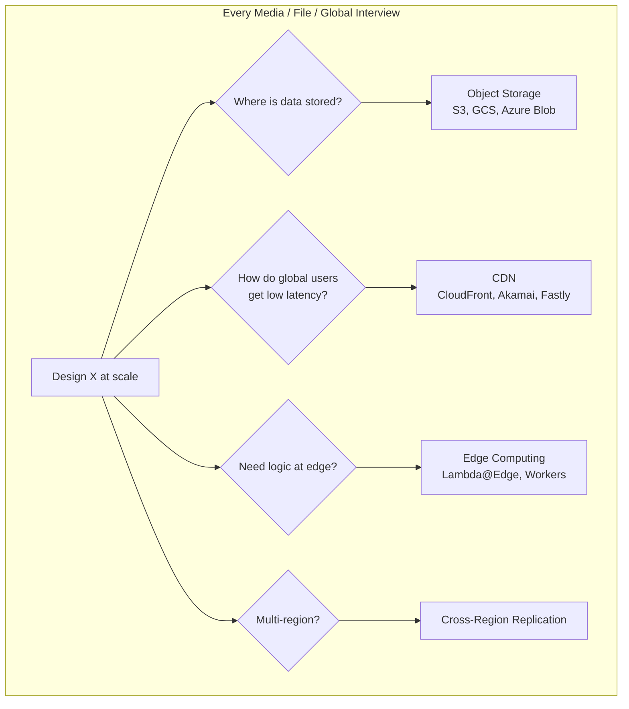
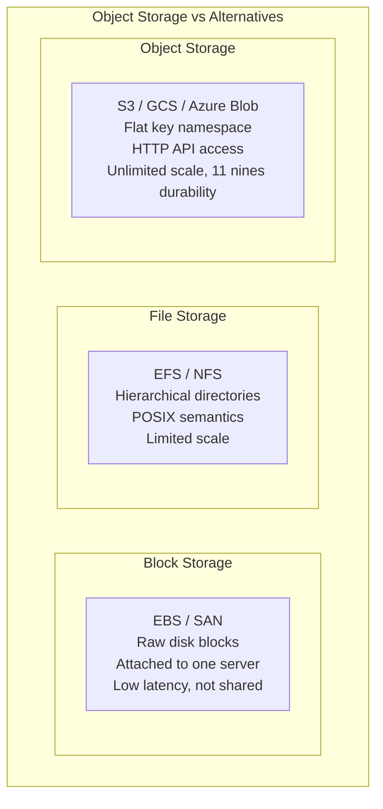
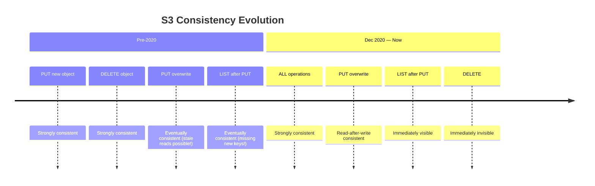
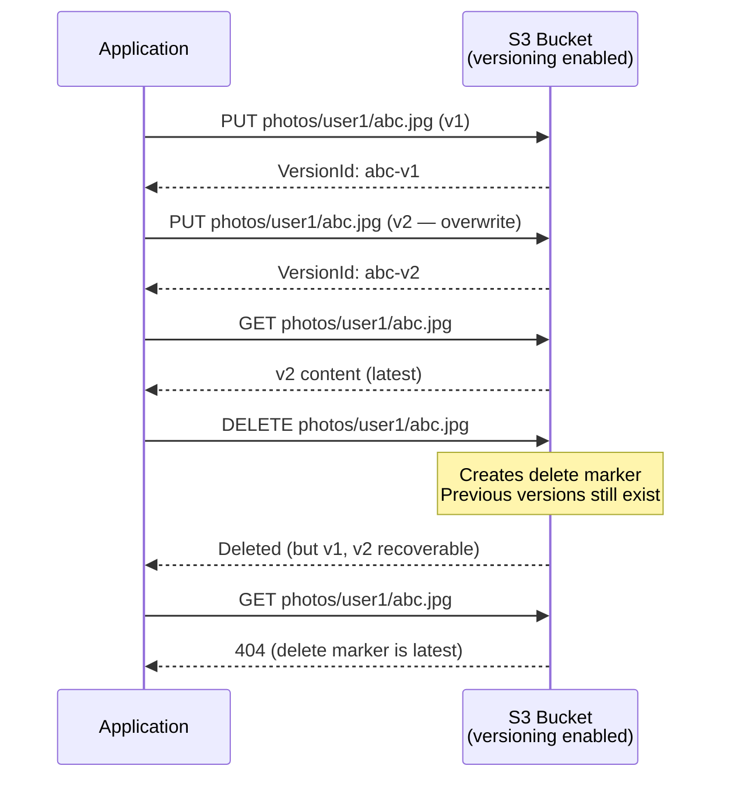
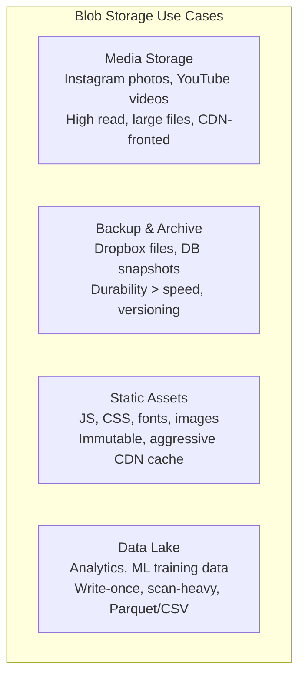
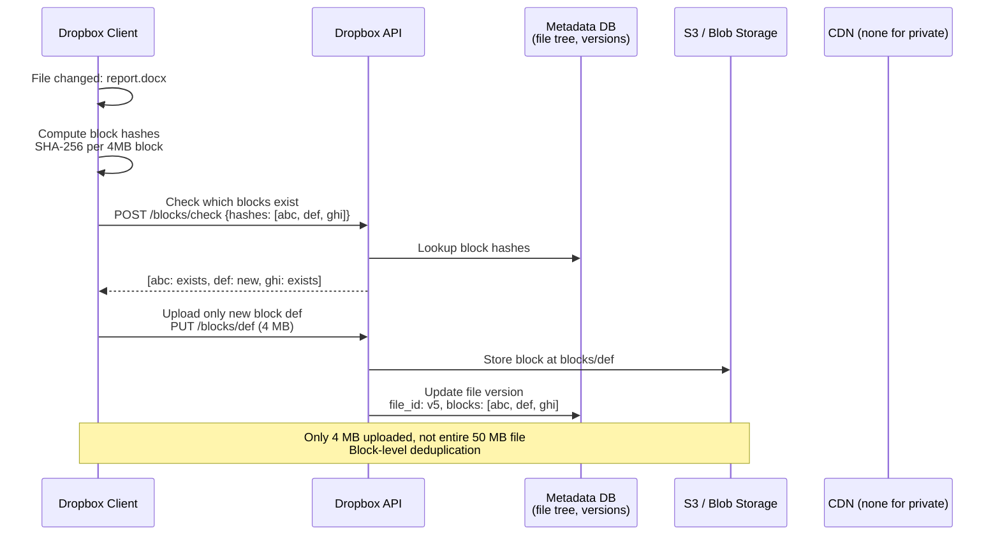
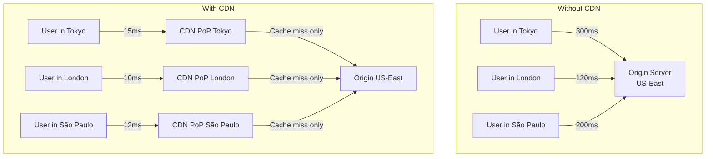
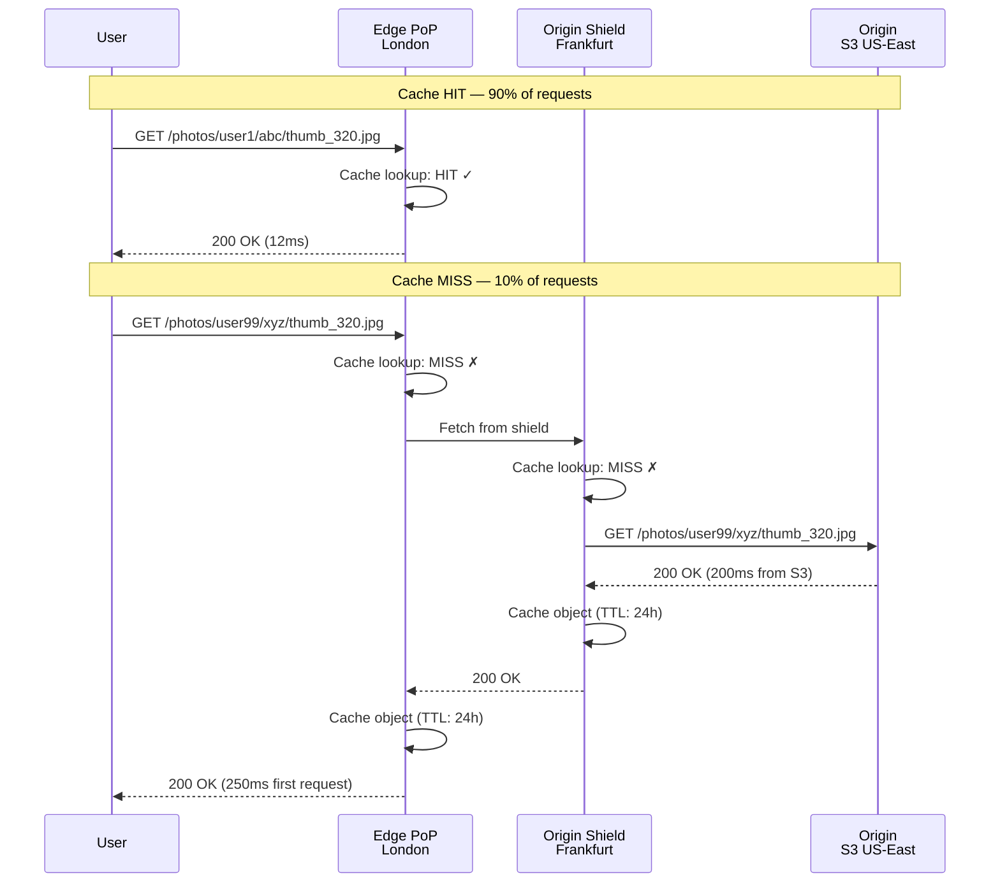
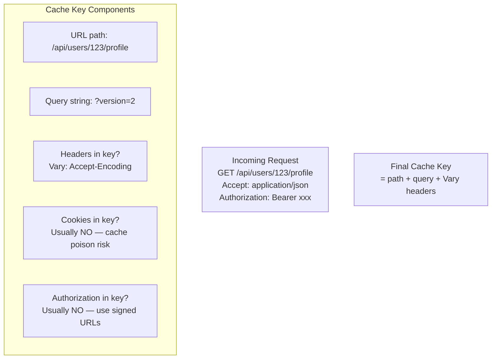
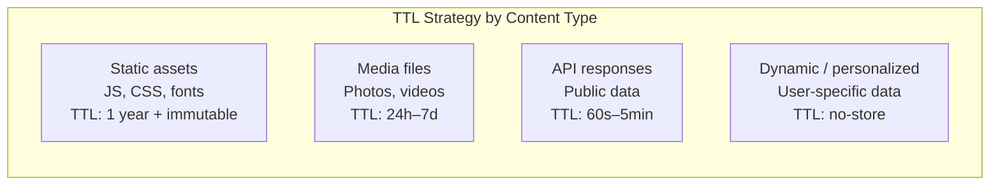

# Object Storage, CDN & Edge Infrastructure

> **The definitive infrastructure guide** for system design interviews at Google, Microsoft, Meta, and Amazon. Covers *what* object storage and CDNs are, *how* they are implemented, *where* to use them, and *what interviewers expect* you to say when designing media platforms, file storage, and global content delivery at scale.

---

## Table of Contents

1. [Why Interviewers Care About Object Storage, CDN & Edge](#1-why-interviewers-care-about-object-storage-cdn--edge)
2. [Object Storage Fundamentals — S3 Internals](#2-object-storage-fundamentals--s3-internals)
3. [S3 Consistency Model & Durability](#3-s3-consistency-model--durability)
4. [Blob Storage Patterns — Media, Backups, Static Assets](#4-blob-storage-patterns--media-backups-static-assets)
5. [CDN Architecture — Deep Dive](#5-cdn-architecture--deep-dive)
6. [CDN Cache Hierarchy & Invalidation](#6-cdn-cache-hierarchy--invalidation)
7. [CloudFront, Akamai, Fastly Comparison](#7-cloudfront-akamai-fastly-comparison)
8. [Edge Computing — Lambda@Edge, Cloudflare Workers](#8-edge-computing--lambdaedge-cloudflare-workers)
9. [Multi-Region Object Storage Replication](#9-multi-region-object-storage-replication)
10. [How It Fits — Instagram, YouTube, Dropbox, URL Shortener](#10-how-it-fits--instagram-youtube-dropbox-url-shortener)
11. [Decision Framework — When to Use What](#11-decision-framework--when-to-use-what)
12. [Interview Scenarios & Sample Answers](#12-interview-scenarios--sample-answers)
13. [Failure Modes Across Storage & CDN Layers](#13-failure-modes-across-storage--cdn-layers)
14. [Trade-offs Master Table](#14-trade-offs-master-table)
15. [Interview Cheat Sheet](#15-interview-cheat-sheet)
16. [Follow-Up Questions & Model Answers](#16-follow-up-questions--model-answers)
17. [Common Mistakes That Fail Interviews](#17-common-mistakes-that-fail-interviews)

---

## 1. Why Interviewers Care About Object Storage, CDN & Edge

Every system design interview involving media, files, or global users — Instagram photos, YouTube videos, Dropbox sync, URL shortener redirects, or static web assets — eventually touches object storage and CDN. Interviewers are not testing whether you can say "use S3 and CloudFront." They are testing whether you can:

1. **Explain S3 internals** — Buckets, objects, key structure, 11 nines durability, read-after-write consistency
2. **Design CDN caching strategy** — Cache hierarchy, TTL, invalidation, cache key design
3. **Choose the right storage tier** — Hot media vs cold backups vs static assets
4. **Articulate edge computing trade-offs** — When Lambda@Edge beats origin processing



### What "Good" Looks Like in an Interview

| Level | What You Demonstrate |
|-------|---------------------|
| **Junior** | Names S3 and CDN ("store images in S3, serve via CDN") |
| **Mid** | Explains caching ("CDN caches at edge PoPs; 90%+ cache hit rate; 20ms latency") |
| **Senior** | Describes architecture ("S3 key: `photos/{user_id}/{photo_id}/original.jpg`; CloudFront with signed URLs; cache invalidation on delete") |
| **Staff** | Anticipates failure ("versioned S3 keys prevent stale CDN cache after update; CRDT-based sync for Dropbox conflict resolution; origin shield prevents thundering herd on cache miss") |

### The Three-Layer Content Delivery Model

```mermaid
flowchart LR
    subgraph Layer 3 — Edge
        EDGE[Edge PoP<br/>5–20ms from user<br/>Cache hit: 90%+]
    end

    subgraph Layer 2 — Origin Region
        ORIGIN[Origin Server / S3<br/>50–100ms from user<br/>Cache miss path]
    end

    subgraph Layer 1 — Storage
        STORAGE[S3 / Blob Storage<br/>Durable, 11 nines<br/>Source of truth]
    end

    USER[User] --> EDGE
    EDGE -->|Cache miss| ORIGIN
    ORIGIN --> STORAGE
```

| Layer | Latency | Role | Examples |
|-------|---------|------|----------|
| **Edge (CDN PoP)** | 5–20ms | Cache frequently accessed content close to users | CloudFront edge, Akamai PoP |
| **Origin** | 50–200ms | Application logic, cache miss processing, transcoding | EC2 origin, S3 static website |
| **Storage** | 100–500ms (direct) | Durable source of truth | S3, GCS, Azure Blob |

**Interview rule:** Always mention all three layers. "Store in S3" without CDN is incomplete for global users.

---

## 2. Object Storage Fundamentals — S3 Internals

### 2.1 What Is Object Storage?

**Object storage** stores data as objects (files + metadata) in a flat namespace (buckets). Unlike file systems (hierarchical directories) or block storage (disk sectors), object storage is optimized for **scale, durability, and access via HTTP API**.



| Storage Type | Access | Scale | Use Case |
|-------------|--------|-------|----------|
| **Block** | SCSI/iSCSI, attached to VM | TB per volume | Databases, OS boot volumes |
| **File** | NFS/SMB mount | PB (with limits) | Shared filesystem, legacy apps |
| **Object** | HTTP REST API (GET/PUT) | Exabyte | Images, videos, backups, static assets, data lakes |

### 2.2 S3 Core Concepts — Buckets, Objects, Keys

```mermaid
graph TB
    subgraph AWS S3 Namespace
        BUCKET[s3://my-app-media<br/>Bucket — global unique name<br/>Region: us-east-1]

        subgraph Objects — Flat Key Space
            OBJ1[Key: photos/user123/abc/original.jpg<br/>Value: binary image data<br/>Metadata: Content-Type, custom tags<br/>Version ID: v1, v2, v3]
            OBJ2[Key: photos/user123/abc/thumb_150.jpg]
            OBJ3[Key: videos/user456/def/chunk_001.ts]
            OBJ4[Key: backups/2026/07/09/db-snapshot.gz]
        end
    end

    BUCKET --> OBJ1
    BUCKET --> OBJ2
    BUCKET --> OBJ3
    BUCKET --> OBJ4
```

| Concept | Definition | Constraints |
|---------|-----------|-------------|
| **Bucket** | Top-level container; globally unique name across all AWS | 100 buckets/account (soft limit); region-specific |
| **Object** | Data + metadata stored at a key | Max 5 TB per object |
| **Key** | Unique identifier within bucket (like a file path) | Max 1024 bytes; any UTF-8 characters |
| **Metadata** | System (Content-Type, ETag) + user-defined (x-amz-meta-*) | User metadata max 2 KB |
| **Version ID** | Unique identifier per version of an object | Enabled via bucket versioning |

**Key naming is NOT a filesystem — but you simulate hierarchy:**

```
s3://instagram-media/photos/user_12345/photo_abc/original.jpg
s3://instagram-media/photos/user_12345/photo_abc/thumb_150.jpg
s3://instagram-media/photos/user_12345/photo_abc/thumb_320.jpg

The "/" characters are just part of the key string.
S3 has no real directories — "photos/user_12345/" is a prefix, not a folder.
ListObjects with prefix="photos/user_12345/" returns all matching keys.
```

### 2.3 S3 Key Structure Design Patterns

```mermaid
flowchart TB
    subgraph Key Design Patterns
        P1[Pattern 1: Entity-based<br/>photos/{user_id}/{photo_id}/original.jpg]
        P2[Pattern 2: Date-partitioned<br/>logs/{year}/{month}/{day}/{hour}/event.json]
        P3[Pattern 3: Hash-prefix<br/>uploads/{hash[0:2]}/{hash[2:4]}/{uuid}.jpg]
        P4[Pattern 4: Versioned<br/>docs/{doc_id}/v{version}/content.pdf]
    end
```

| Pattern | Key Example | Best For | Hot Partition Risk |
|---------|------------|----------|-------------------|
| **Entity-based** | `photos/{user_id}/{photo_id}/original.jpg` | User media (Instagram) | Low — keys spread by user |
| **Date-partitioned** | `logs/2026/07/09/14/request.json` | Logs, analytics, backups | High if all writes to current hour prefix |
| **Hash-prefix** | `uploads/a3/f1/uuid.jpg` | High-write uploads (S3 scales prefix throughput) | Low — hash distributes writes |
| **Content-addressed** | `blobs/sha256/abc123...def` | Deduplication (Dropbox) | Very low — hash is uniform |
| **Versioned** | `docs/report/v3/content.pdf` | Documents with history | Low |

**S3 request rate performance (critical interview number):**

```
S3 automatically scales to handle 3,500 PUT/s and 5,500 GET/s per prefix.

Old myth: "S3 can't handle more than 100 requests/sec per prefix" — FALSE since 2018.
AWS now scales prefix throughput automatically.

However: for extreme write rates (>10K PUT/s to single prefix), use hash-prefix pattern:
  uploads/{uuid[0:2]}/{uuid[2:4]}/{uuid}.jpg
  Distributes writes across 256 × 256 = 65,536 logical prefixes
```

### 2.4 S3 Internal Architecture (Conceptual)

```mermaid
graph TB
    subgraph S3 Internal Architecture — Simplified
        API[S3 API Endpoint<br/>REST: PUT, GET, DELETE, LIST]

        subgraph Metadata Layer
            META[Metadata Service<br/>Bucket → Key → Location mapping<br/>Strongly consistent since Dec 2020]
        end

        subgraph Storage Layer
            SHARD1[Storage Node 1<br/>Erasure coded chunks]
            SHARD2[Storage Node 2]
            SHARD3[Storage Node 3]
            SHARDN[Storage Node N<br/>Across multiple AZs]
        end

        API --> META
        META --> SHARD1
        META --> SHARD2
        META --> SHARD3
        META --> SHARDN
    end
```

| Component | Role |
|-----------|------|
| **API layer** | Handles HTTP requests; authentication (IAM, bucket policy) |
| **Metadata service** | Maps bucket+key → storage location; strongly consistent |
| **Storage nodes** | Store erasure-coded data chunks across multiple AZs |
| **Erasure coding** | Data split into N chunks; any K of N can reconstruct (like RAID at scale) |

### 2.5 S3 Storage Classes & Lifecycle

```mermaid
graph LR
    subgraph S3 Storage Classes — Cost vs Access Speed
        S3_STD[S3 Standard<br/>$0.023/GB/mo<br/>ms access<br/>11 nines durability]
        S3_IA[S3 Infrequent Access<br/>$0.0125/GB/mo<br/>ms access + retrieval fee]
        S3_GLACIER[S3 Glacier<br/>$0.004/GB/mo<br/>minutes–hours retrieval]
        S3_GDA[S3 Glacier Deep Archive<br/>$0.00099/GB/mo<br/>12–48 hour retrieval]
    end

    S3_STD -->|30 days no access| S3_IA
    S3_IA -->|90 days no access| S3_GLACIER
    S3_GLACIER -->|180 days| S3_GDA
```

| Storage Class | Durability | Availability | Retrieval Time | Cost (per GB/mo) | Use Case |
|--------------|-----------|-------------|---------------|-----------------|----------|
| **S3 Standard** | 11 nines | 99.99% | Immediate | $0.023 | Hot data: photos, videos, active files |
| **S3 Standard-IA** | 11 nines | 99.9% | Immediate + $0.01/GB retrieval | $0.0125 | Infrequent access: old photos |
| **S3 One Zone-IA** | 11 nines (single AZ) | 99.5% | Immediate | $0.01 | Recreatable infrequent data |
| **S3 Glacier Instant** | 11 nines | 99.9% | Immediate | $0.004 | Archive with instant access |
| **S3 Glacier Flexible** | 11 nines | 99.99% | 1 min – 12 hours | $0.0036 | Backups, compliance |
| **S3 Glacier Deep Archive** | 11 nines | 99.99% | 12 – 48 hours | $0.00099 | Long-term compliance, tape replacement |

**Lifecycle policy example (say in interview):**

```json
{
  "Rules": [{
    "ID": "InstagramPhotoLifecycle",
    "Filter": { "Prefix": "photos/" },
    "Transitions": [
      { "Days": 90, "StorageClass": "STANDARD_IA" },
      { "Days": 365, "StorageClass": "GLACIER" }
    ],
    "Expiration": { "Days": 2555 }
  }]
}
```

---

## 3. S3 Consistency Model & Durability

### 3.1 Durability — 11 Nines (99.999999999%)

```mermaid
graph TB
    subgraph S3 Durability — How 11 Nines Is Achieved
        UPLOAD[Object Upload<br/>photo.jpg — 4 MB]

        subgraph Erasure Coding across AZs
            AZ1[AZ-1: Data chunks 1, 2, 3]
            AZ2[AZ-2: Data chunks 4, 5, 6]
            AZ3[AZ-3: Parity chunks 7, 8]
        end

        CHECKSUM[Checksum verification<br/>on every read]
        REPLICATE[Automatic repair<br/>if chunk corruption detected]
    end

    UPLOAD --> AZ1
    UPLOAD --> AZ2
    UPLOAD --> AZ3
    AZ1 --> CHECKSUM
    CHECKSUM --> REPLICATE
```

| Durability Level | Annual Loss Probability | Meaning |
|-----------------|------------------------|---------|
| **99.999999999% (11 nines)** | 0.000000001% | 1 object lost per 10 billion per year |
| **99.99999999% (10 nines)** | 0.00000001% | Google Cloud Storage standard |
| **99.999% (5 nines)** | 0.001% | Typical RAID-6 array |

**Interview talking point:**

> "S3's 11 nines durability means if you store 10 million objects, you expect to lose 1 object every 10 years due to hardware failure. This is achieved through erasure coding across multiple availability zones — not simple 3× replication. I still enable versioning for logical deletes (user accidentally deletes photo) — durability protects against hardware failure, not human error."

### 3.2 Consistency Model — The Dec 2020 Change



| Operation | Pre-2020 | Post-2020 (Current) |
|-----------|----------|-------------------|
| **PUT new object** | Strongly consistent | Strongly consistent |
| **PUT overwrite existing** | Eventually consistent | **Strongly consistent (read-after-write)** |
| **DELETE** | Eventually consistent | **Strongly consistent** |
| **LIST objects** | Eventually consistent | **Strongly consistent** |

**Why this matters in interviews:**

> "Before December 2020, if you overwrote an object in S3, a subsequent GET might return the old version for a few seconds. This made S3 unsuitable for read-after-write patterns without versioning. Now all S3 operations are strongly consistent — you can PUT and immediately GET the new value. However, CDN caches are still eventually consistent — that's a separate layer."

### 3.3 S3 Versioning & Delete Behavior



| Versioning State | DELETE Behavior | Recovery |
|-----------------|----------------|----------|
| **Disabled** | Permanent delete | Not recoverable |
| **Enabled** | Delete marker added; old versions remain | Delete marker → restores previous version |
| **Suspended** | Same as disabled for new objects; old versions remain | Old versions still recoverable |

---

## 4. Blob Storage Patterns — Media, Backups, Static Assets

### 4.1 Pattern Overview



| Pattern | Read:Write Ratio | File Size | Access Pattern | Storage Class | CDN |
|---------|-----------------|-----------|---------------|--------------|-----|
| **Media (Instagram)** | 1000:1 | 100KB–10MB | Hot then warm | Standard → IA | Yes, aggressive |
| **Video (YouTube)** | 10000:1 | 1MB–10GB (chunked) | Write once, read forever | Standard | Yes, multi-tier |
| **Backup (Dropbox)** | 1:1 | 1KB–5GB | Sync, versioned | Standard + versioning | No (private) |
| **Static assets** | 100000:1 | 1KB–5MB | Immutable after deploy | Standard | Yes, max TTL |
| **Data lake** | 10:1 | 100MB–1GB | Batch write, scan read | Standard / IA | No |

### 4.2 Instagram Photo Storage Pattern

```mermaid
flowchart TB
    subgraph Instagram Photo Upload Flow
        MOB[Mobile App] -->|POST /photos| API[API Server]
        API -->|Generate photo_id| META[(Metadata DB<br/>photo_id, user_id, caption)]
        API -->|Upload original| S3_ORIG[S3: photos/{user_id}/{photo_id}/original.jpg]
        API -->|Queue resize job| SQS[SQS Queue]
        SQS --> WORKER[Image Processing Worker]
        WORKER -->|Generate thumbnails| S3_THUMB[S3: photos/{user_id}/{photo_id}/thumb_150.jpg<br/>thumb_320.jpg<br/>thumb_640.jpg]
    end

    subgraph Instagram Photo Read Flow
        FEED[Feed Request] --> API2[API Server]
        API2 -->|Get photo URLs| META
        API2 -->|Return CDN URLs| CDN[CloudFront CDN]
        CDN -->|Cache hit 95%+| USER[User sees photo in 15ms]
        CDN -->|Cache miss| S3_THUMB
    end
```

**Instagram S3 key structure:**

```
s3://instagram-media/
  photos/
    {user_id}/
      {photo_id}/
        original.jpg        (5 MB — rarely served directly)
        thumb_150.jpg       (8 KB — feed thumbnail)
        thumb_320.jpg       (25 KB — profile grid)
        thumb_640.jpg       (80 KB — detail view)
        thumb_1080.jpg      (200 KB — full screen)
```

| Design Decision | Choice | Why |
|----------------|--------|-----|
| **Pre-generate thumbnails** | At upload time via async worker | Don't resize on every read — CPU expensive |
| **CDN URLs in API response** | `https://cdn.instagram.com/photos/...` | Client fetches directly from CDN, not API |
| **Separate keys per size** | Not dynamic resize at CDN | CloudFront can't resize; use CloudFront Functions for URL rewrite only |
| **Content-Type metadata** | `image/jpeg` on every object | CDN sets correct `Content-Type` header |
| **Cache-Control header** | `max-age=31536000, immutable` | Photos don't change after upload; cache 1 year |

### 4.3 YouTube Video Storage Pattern

```mermaid
flowchart TB
    subgraph YouTube Video Pipeline
        UPLOAD[Creator uploads 4K video<br/>10 GB file] -->|Resumable upload| GCS[Google Cloud Storage<br/>Raw video blob]
        GCS --> TRANSCODE[Transcoding Farm<br/>100+ renditions]
        
        subgraph Output Renditions
            R1[360p — 50 MB<br/>video/{id}/360p/playlist.m3u8]
            R2[720p — 200 MB<br/>video/{id}/720p/playlist.m3u8]
            R3[1080p — 500 MB<br/>video/{id}/1080p/playlist.m3u8]
            R4[4K — 2 GB<br/>video/{id}/4k/playlist.m3u8]
        end

        TRANSCODE --> R1
        TRANSCODE --> R2
        TRANSCODE --> R3
        TRANSCODE --> R4
    end

    subgraph YouTube Video Playback
        PLAYER[Video Player] -->|HLS manifest| CDN_YT[YouTube CDN<br/>Global edge cache]
        CDN_YT -->|Segment request<br/>chunk_042.ts| EDGE[Edge PoP<br/>Cache 2MB segments]
        EDGE -->|Cache miss| ORIGIN_YT[Origin Storage]
    end
```

**YouTube storage key structure:**

```
gs://youtube-videos/
  {video_id}/
    metadata.json           (duration, title, codec info)
    360p/
      playlist.m3u8         (HLS manifest — list of segments)
      segment_000.ts        (2-second video chunk, ~500 KB)
      segment_001.ts
      ...
    720p/
      playlist.m3u8
      segment_000.ts
      ...
    1080p/
      ...
    thumbnails/
      default.jpg           (auto-generated thumbnail)
      custom_001.jpg        (creator-uploaded)
```

| YouTube Design Decision | Detail |
|------------------------|--------|
| **HLS/DASH chunking** | 2-second segments (~500 KB each) | Player buffers 3–5 segments; CDN caches small chunks efficiently |
| **Multiple renditions** | 360p to 4K+ | Adaptive bitrate — player switches quality based on bandwidth |
| **Segment-level CDN caching** | Cache key = `/video/{id}/720p/segment_042.ts` | Popular videos: 99%+ cache hit; long tail: cache miss to origin |
| **Resumable upload** | GCS resumable upload API | 10 GB upload may take 30 min; resume on network failure |
| **Separate storage per rendition** | Not one file with byte-range requests | HLS requires segment-level access; byte-range is for MP4 progressive download |

### 4.4 Dropbox Backup & Sync Pattern



**Dropbox storage architecture:**

```
s3://dropbox-storage/
  blocks/
    {sha256_hash}           (4 MB block — content-addressed, deduplicated)
  files/
    {file_id}/
      v1/metadata.json      (block list: [hash1, hash2, hash3])
      v2/metadata.json      (block list: [hash1, hash4, hash3] — only hash4 is new)
```

| Dropbox Design Decision | Detail |
|------------------------|--------|
| **Block-level deduplication** | 4 MB blocks identified by SHA-256 hash | Two users with same file block store it once |
| **Content-addressed storage** | Key = hash of content | Identical blocks across all users map to same S3 key |
| **Version history** | Metadata stores block list per version | Only changed blocks uploaded on sync |
| **No CDN** | Files are private, user-specific | Signed URLs with short TTL for download |
| **Delta sync** | Client sends only changed blocks | 50 MB file with 1 changed block → upload 4 MB, not 50 MB |
| **Conflict resolution** | Last-writer-wins + conflict copy | `report (conflicted copy).docx` saved alongside |

### 4.5 Static Asset Storage Pattern

```mermaid
flowchart LR
    subgraph Static Asset Pipeline — CI/CD
        BUILD[npm run build<br/>webpack/vite] -->|Output| DIST[dist/<br/>app.a3f1b2.js<br/>app.c4d5e6.css<br/>logo.png]
        DIST -->|CI upload| S3_STATIC[S3: static/assets/<br/>Content-MD5 in key or hash in filename]
        S3_STATIC -->|Invalidate OR<br/>versioned filename| CDN_STATIC[CloudFront CDN<br/>Cache-Control: max-age=31536000, immutable]
    end

    subgraph Browser Request
        BROWSER[Browser] -->|GET /assets/app.a3f1b2.js| CDN_STATIC
        CDN_STATIC -->|Cache HIT| BROWSER
    end
```

| Static Asset Strategy | How | Cache Busting |
|----------------------|-----|--------------|
| **Hash in filename** | `app.[contenthash].js` | New deploy = new filename = automatic cache bust |
| **CDN invalidation** | `/*` or `/assets/*` purge | Explicit purge on deploy; costs $0.005/path |
| **Long TTL + immutable** | `Cache-Control: max-age=31536000, immutable` | Browser never revalidates; instant load |
| **S3 website hosting** | S3 static website endpoint as origin | Simple; no server needed for SPA |

**Interview answer for static assets:**

> "I'd use content-hashed filenames (`app.a3f1b2.js`) so every deploy automatically busts the CDN cache without explicit invalidation. Set `Cache-Control: max-age=31536000, immutable` — the browser and CDN never revalidate. This gives sub-20ms load times globally. Only `index.html` gets a short TTL (60s) since it references the hashed assets."

---

## 5. CDN Architecture — Deep Dive

### 5.1 What Is a CDN?

A **Content Delivery Network (CDN)** is a geographically distributed network of edge servers (Points of Presence / PoPs) that cache content close to users, reducing latency and origin load.



| Metric | Without CDN | With CDN (90% cache hit) |
|--------|------------|-------------------------|
| **Latency (Tokyo user)** | 300ms | 15ms (hit) / 300ms (miss) |
| **Origin load** | 100% of requests | 10% of requests |
| **Bandwidth cost** | Full origin egress | 90% served from edge (cheaper) |
| **DDoS resilience** | Origin absorbs all traffic | CDN absorbs 90%+ at edge |

### 5.2 CDN Architecture — Origin, Edge PoPs, Cache Hierarchy

```mermaid
graph TB
    subgraph CDN Architecture
        USER[User in Australia]

        subgraph Edge Layer — 300+ PoPs globally
            EDGE_SYD[Edge PoP<br/>Sydney<br/>Cache: popular content<br/>TTL: minutes to hours]
        end

        subgraph Mid-Tier — Regional Shield
            SHIELD[Origin Shield<br/>Sydney or Singapore<br/>Consolidates cache misses<br/>Prevents origin stampede]
        end

        subgraph Origin
            ORIGIN[Origin Server<br/>S3 / EC2 / ALB<br/>US-East<br/>Source of truth]
        end

        USER -->|1. Request| EDGE_SYD
        EDGE_SYD -->|2. Cache HIT 90%| USER
        EDGE_SYD -->|3. Cache MISS| SHIELD
        SHIELD -->|4. Cache HIT| EDGE_SYD
        SHIELD -->|5. Cache MISS| ORIGIN
        ORIGIN -->|6. Response| SHIELD
        SHIELD -->|7. Cache + forward| EDGE_SYD
        EDGE_SYD -->|8. Cache + deliver| USER
    end
```

| CDN Component | Role | Count (CloudFront scale) |
|--------------|------|------------------------|
| **Edge PoP** | Serve cached content to nearby users | 300+ globally |
| **Regional Edge Cache** | Mid-tier cache; reduces origin hits | ~13 regional caches |
| **Origin Shield** | Single PoP fetches from origin on behalf of all edge PoPs | 1 per region (optional) |
| **Origin** | Source of truth; S3, EC2, custom server | Your infrastructure |

### 5.3 CDN Request Flow — Cache Hit vs Miss



### 5.4 CDN Cache Key Design



| Cache Key Factor | Include in Key? | Why |
|-----------------|----------------|-----|
| **URL path** | Always | Core identifier |
| **Query string** | Yes (by default) | `?size=320` vs `?size=640` are different objects |
| **Accept-Encoding** | Yes (automatic) | gzip vs br = different cached versions |
| **Authorization header** | No | Would create per-user cache entries — use signed URLs instead |
| **Cookies** | No (dangerous) | Cache poisoning risk; one user's data served to another |
| **Custom headers** | Only if in `Vary` response header | `Vary: Accept` for content negotiation |

**Signed URL pattern for private content:**

```
# S3 Pre-signed URL (time-limited access without auth header)
https://cdn.example.com/photos/private/abc.jpg
  ?Expires=1735689600
  &Signature=v1abc123...
  &Key-Pair-Id=APKAXXX

CDN caches by URL path + query (signature is part of query string)
Each unique signature = unique cache entry
Short expiry (1 hour) limits cache duplication
```

### 5.5 CDN TTL & Caching Headers

| Header | Set By | Value | Effect |
|--------|--------|-------|--------|
| **Cache-Control: max-age=86400** | Origin | 24 hours | CDN caches for 24h before revalidating |
| **Cache-Control: s-maxage=3600** | Origin | 1 hour | CDN-specific TTL (overrides max-age for CDN only) |
| **Cache-Control: immutable** | Origin | — | Browser/CDN never revalidates; no conditional requests |
| **Cache-Control: no-store** | Origin | — | CDN does NOT cache (dynamic API responses) |
| **Cache-Control: private** | Origin | — | CDN does NOT cache; only browser may cache |
| **ETag** | Origin | `"abc123"` | Conditional request: `If-None-Match` → 304 Not Modified |
| **Last-Modified** | Origin | `Wed, 09 Jul 2026 12:00:00 GMT` | Conditional request: `If-Modified-Since` |
| **Vary** | Origin | `Accept-Encoding` | Cache separate versions per header value |



---

## 6. CDN Cache Hierarchy & Invalidation

### 6.1 Cache Invalidation Strategies

```mermaid
flowchart TB
    subgraph Cache Invalidation Strategies
        S1[Strategy 1: TTL Expiry<br/>Let cache expire naturally<br/>Simplest — no action needed]
        S2[Strategy 2: Content-Hashed URLs<br/>app.v2.js → app.v3.js<br/>Best for static assets]
        S3[Strategy 3: CDN Purge/Invalidation<br/>Explicit delete from all PoPs<br/>Costs money, takes 1–15 min]
        S4[Strategy 4: Versioned Keys<br/>S3: photo.jpg → photo_v2.jpg<br/>New key = automatic cache miss]
        S5[Strategy 5: Surrogate Keys<br/>Tag-based purge<br/>Fastly: purge by tag photo_123]
    end
```

| Strategy | Speed | Cost | Best For |
|----------|-------|------|----------|
| **TTL expiry** | Slow (wait for TTL) | Free | Content that can be stale temporarily |
| **Content-hashed URL** | Instant (new URL) | Free | JS/CSS static assets |
| **CDN purge** | 1–15 minutes globally | $0.005/path (CloudFront) | Urgent content removal (deleted photo) |
| **Versioned S3 key** | Instant (new key) | Free | Updated images, documents |
| **Surrogate key purge** | Seconds (Fastly) | Included | Purge all variants of one entity |

### 6.2 CDN Purge Flow

```mermaid
sequenceDiagram
    participant APP as Application
    participant S3 as S3 Storage
    participant API as CloudFront API
    participant POP1 as Edge PoP — London
    participant POP2 as Edge PoP — Tokyo
    participant POP3 as Edge PoP — NYC

    APP->>S3: DELETE photos/user1/abc.jpg
    APP->>API: CreateInvalidation<br/>Paths: [/photos/user1/abc.jpg, /photos/user1/abc/*]
    API->>POP1: Invalidate cache entry
    API->>POP2: Invalidate cache entry
    API->>POP3: Invalidate cache entry
    Note over POP1,POP3: Propagation: 1–15 minutes globally

    APP->>APP: Alternative: use versioned key<br/>photos/user1/abc_v2.jpg<br/>Old CDN cache becomes irrelevant
```

**CloudFront invalidation limits:**

```
- First 1,000 paths per month: free
- Additional paths: $0.005 per path
- Wildcard: /photos/user1/* counts as 1 path
- Propagation time: typically 1–5 minutes (can be up to 15)
- Concurrent invalidations: max 15 in progress per distribution

Interview tip: Avoid frequent purges. Use versioned keys or content-hashed URLs instead.
"Delete photo" → don't purge; just stop serving the URL from API. Old CDN cache expires via TTL.
```

### 6.3 Stale-While-Revalidate & Stale-If-Error

```mermaid
sequenceDiagram
    participant U as User
    participant CDN as CDN Edge
    participant O as Origin

    U->>CDN: GET /feed/trending
    CDN->>CDN: Cache expired (TTL passed)

    alt stale-while-revalidate
        CDN-->>U: 200 OK (stale content served immediately)
        CDN->>O: Background revalidation request
        O-->>CDN: 200 OK (fresh content)
        CDN->>CDN: Update cache for next request
    end

    alt stale-if-error (origin down)
        CDN->>O: Revalidation request
        O-->>CDN: 503 Service Unavailable
        CDN-->>U: 200 OK (stale content served as fallback)
    end
```

| Header | Behavior | Use Case |
|--------|----------|----------|
| **stale-while-revalidate=60** | Serve stale for 60s while fetching fresh in background | News feed — instant response, background refresh |
| **stale-if-error=3600** | Serve stale for 1 hour if origin returns 5xx | High availability — origin down but CDN has cached copy |
| **must-revalidate** | Must check with origin when stale | Financial data — stale not acceptable |

### 6.4 Origin Shield — Preventing Thundering Herd

```mermaid
graph TB
    subgraph Without Origin Shield — Cache Stampede
        MISS1[PoP London — MISS] --> ORIGIN1[Origin S3]
        MISS2[PoP Tokyo — MISS] --> ORIGIN1
        MISS3[PoP NYC — MISS] --> ORIGIN1
        MISS4[PoP Sydney — MISS] --> ORIGIN1
        MISS5[PoP São Paulo — MISS] --> ORIGIN1
        ORIGIN1[Origin hit by 5 PoPs<br/>simultaneously for same object]
    end

    subgraph With Origin Shield
        MISS6[PoP London — MISS] --> SHIELD2[Origin Shield<br/>Frankfurt]
        MISS7[PoP Tokyo — MISS] --> SHIELD2
        MISS8[PoP NYC — MISS] --> SHIELD2
        MISS9[PoP Sydney — MISS] --> SHIELD2
        MISS10[PoP São Paulo — MISS] --> SHIELD2
        SHIELD2 -->|Single fetch| ORIGIN2[Origin S3]
    end
```

**Thundering herd on cache miss (interview favorite):**

```
Viral video goes trending. 1M users request same video segment simultaneously.
All 300 CDN PoPs have cache MISS (first viewer in each region).

Without origin shield:
  300 PoPs × fetch from origin = 300 simultaneous requests to S3 for same object
  S3 handles it, but origin egress cost × 300

With origin shield (CloudFront Origin Shield):
  300 PoPs → 1 Origin Shield PoP → 1 S3 request
  Origin Shield caches and serves all 300 PoPs
  Origin egress cost × 1

With request coalescing (singleflight pattern):
  Multiple requests for same object at shield → only 1 origin fetch
  Others wait for the in-flight request to complete
```

---

## 7. CloudFront, Akamai, Fastly Comparison

### 7.1 CDN Provider Comparison

```mermaid
quadrantChart
    title CDN Provider Positioning
    x-axis Low Customization --> High Customization
    y-axis Low Global Reach --> High Global Reach
    quadrant-1 Enterprise Global
    quadrant-2 Developer Edge
    quadrant-3 Basic CDN
    quadrant-4 Programmable CDN
    CloudFront: [0.35, 0.7]
    Akamai: [0.55, 0.95]
    Fastly: [0.85, 0.65]
    Cloudflare: [0.75, 0.8]
    BunnyCDN: [0.3, 0.4]
```

| Dimension | CloudFront | Akamai | Fastly | Cloudflare |
|-----------|-----------|--------|--------|------------|
| **Edge PoPs** | 300+ | 4,000+ (incl. embedded) | 60+ (high-capacity) | 300+ |
| **Origin** | AWS-native (S3, ALB, EC2) | Multi-cloud, enterprise | Any origin | Any origin + Workers |
| **Cache purge speed** | 1–15 minutes | Minutes | **Seconds** (instant purge) | 30 seconds (global) |
| **Edge computing** | Lambda@Edge, CloudFront Functions | EdgeWorkers (JavaScript) | Compute@Edge (Wasm) | **Cloudflare Workers** (V8) |
| **Pricing model** | Per GB transferred + per request | Enterprise contracts ($$$) | Per GB + compute time | Per request + bandwidth |
| **DDoS protection** | AWS Shield Standard (free) | Built-in (Kona Site Defender) | Built-in | **Best-in-class** (included free) |
| **Signed URLs** | Custom policy + RSA key pairs | Token auth, ACLs | Surrogate keys + VCL | Signed URLs + Workers |
| **Best for** | AWS workloads, S3 integration | Enterprise media (Disney+, NBC) | Real-time purge, API caching | Full-stack edge platform |
| **Weakness** | Slow purge; limited edge compute | Expensive; complex contracts | Fewer PoPs than Akamai | Vendor lock-in for Workers |

### 7.2 CloudFront — Architecture & Features

```mermaid
graph TB
    subgraph CloudFront Distribution
        VIEWER[Viewer Request] --> EDGE_CF[Edge Location<br/>300+ PoPs]
        EDGE_CF -->|Cache miss| REGIONAL[Regional Edge Cache<br/>13 locations]
        REGIONAL -->|Cache miss| SHIELD_CF[Origin Shield<br/>Optional — 1 per region]
        SHIELD_CF -->|Cache miss| ORIGIN_CF[Origin<br/>S3 / ALB / EC2 / Custom]

        subgraph Edge Functions
            CF_FUNC[CloudFront Functions<br/>Lightweight JS<br/>URL rewrite, header manipulation<br/>< 1ms latency]
            LAMBDA_EDGE[Lambda@Edge<br/>Full Node.js/Python<br/>Auth, A/B testing, image resize<br/>5–50ms latency]
        end

        EDGE_CF -.-> CF_FUNC
        EDGE_CF -.-> LAMBDA_EDGE
    end
```

| CloudFront Feature | Detail |
|-------------------|--------|
| **Origin types** | S3, ALB, EC2, custom HTTP, MediaStore |
| **OAC (Origin Access Control)** | S3 bucket only accessible via CloudFront — not public S3 URL |
| **Cache behaviors** | Path-based rules: `/api/*` no-cache, `/static/*` 1-year TTL |
| **Geo-restriction** | Block/allow countries |
| **SSL** | Free ACM certificate; TLS 1.2/1.3 |
| **Real-time logs** | Kinesis Data Streams; ~1 second delay |
| **Price class** | PriceClass_100 (US/EU only, cheapest) to PriceClass_All (all PoPs) |

### 7.3 Akamai — Enterprise CDN

```mermaid
graph TB
    subgraph Akamai Platform
        subgraph Edge Delivery
            AKA_EDGE[4,000+ Edge Servers<br/>Embedded in ISP networks<br/>Sub-10ms in major cities]
        end

        subgraph Akamai Intelligence
            BOT[Bot Manager<br/>ML-based bot detection]
            WAF_AKA[WAF<br/>OWASP rule sets]
            DDOS[DDoS Protection<br/>Prolexic — 20+ Tbps capacity]
        end

        subgraph Akamai Media
            ADAPTIVE[Adaptive Media Delivery<br/>HLS/DASH optimization]
            DRM[DRM Integration<br/>Widevine, FairPlay]
        end

        AKA_EDGE --> BOT
        AKA_EDGE --> WAF_AKA
        AKA_EDGE --> ADAPTIVE
    end
```

**When to say Akamai in interviews:**
- Large-scale media streaming (Disney+, HBO Max)
- Enterprise with existing Akamai contract
- Need embedded ISP-level CDN (deepest edge)
- **Avoid for:** Startups (expensive), AWS-native workloads (CloudFront simpler)

### 7.4 Fastly — Programmable CDN

```mermaid
graph TB
    subgraph Fastly Edge Cloud Platform
        VCL[VCL — Varnish Config Language<br/>Full request/response control<br/>at edge]
        
        subgraph Compute@Edge
            WASM[WebAssembly modules<br/>Any language compiled to Wasm<br/>Image processing, auth, routing]
        end

        subgraph Instant Purge
            SURROGATE[Surrogate Keys<br/>Tag objects: photo_123<br/>Purge all tagged in < 150ms]
        end

        KV[Edge Dictionary / Config Store<br/>Key-value at edge<br/>Feature flags, A/B config]
    end
```

| Fastly Feature | Why It Matters |
|---------------|---------------|
| **Instant purge (< 150ms)** | Delete a photo → globally purged before next request |
| **Surrogate keys** | Tag `photo_123` on all sizes (thumb_150, thumb_320, original); purge all with one key |
| **VCL full control** | Custom cache key logic, origin selection, response modification at edge |
| **Compute@Edge (Wasm)** | Run Rust/Go image resize at edge — no origin round trip |
| **Real-time analytics** | Sub-second log delivery; see cache hit rate in real time |

**When to say Fastly in interviews:**
- Need instant cache purge (news site, social media — deleted content must disappear immediately)
- API response caching with complex cache key logic
- Edge compute for image resizing (Instagram thumbnail generation at edge)
- **Avoid for:** Simple static asset serving (CloudFront is cheaper and simpler)

---

## 8. Edge Computing — Lambda@Edge, Cloudflare Workers

### 8.1 Why Edge Computing?

```mermaid
graph TB
    subgraph Without Edge Computing
        USER1[User in Sydney] -->|Request image resize| CDN1[CDN Edge]
        CDN1 -->|Cache miss| ORIGIN1[Origin US-East<br/>Resize image: 200ms<br/>Return: 300ms total]
    end

    subgraph With Edge Computing
        USER2[User in Sydney] -->|Request image resize| CDN2[CDN Edge<br/>Lambda@Edge / Worker<br/>Resize at edge: 20ms<br/>Return: 25ms total]
    end
```

| Task | At Origin | At Edge | Savings |
|------|----------|---------|---------|
| **URL rewrite** | 200ms round trip | < 1ms (CloudFront Functions) | 200ms |
| **A/B test routing** | 200ms (origin decides) | 5ms (Lambda@Edge) | 195ms |
| **JWT validation** | 200ms (origin validates) | 5ms (Lambda@Edge) | 195ms |
| **Image resize** | 200ms (origin processes) | 20ms (Workers + Wasm) | 180ms |
| **Geo-based redirect** | 200ms | < 1ms (CloudFront Functions) | 200ms |
| **Bot detection** | 200ms | 5ms (Workers ML) | 195ms |

### 8.2 Lambda@Edge vs CloudFront Functions vs Cloudflare Workers

```mermaid
graph TB
    subgraph Edge Compute Spectrum
        CFF[CloudFront Functions<br/>──────────<br/>JS subset, < 1ms<br/>Viewer request/response only<br/>No network access<br/>1MB code limit]
        LAE[Lambda@Edge<br/>──────────<br/>Node.js/Python, 5–50ms<br/>Origin request/response<br/>Network access allowed<br/>10MB code (50MB zipped)]
        CFW[Cloudflare Workers<br/>──────────<br/>V8 isolates, < 5ms<br/>Full HTTP + TCP + UDP<br/>KV, R2, D1, Durable Objects<br/>No cold start]
    end
```

| Feature | CloudFront Functions | Lambda@Edge | Cloudflare Workers |
|---------|---------------------|-------------|-------------------|
| **Runtime** | JavaScript (subset) | Node.js 18, Python 3.11 | V8 isolates (JS, Wasm, Rust) |
| **Cold start** | None (< 1ms) | 50–200ms (regional) | None (< 1ms) |
| **Max duration** | < 1ms | 5 seconds (viewer), 30 seconds (origin) | 30 seconds (CPU time) |
| **Memory** | 2 MB | 128 MB | 128 MB |
| **Network access** | No | Yes (origin events) | Yes (full) |
| **Storage at edge** | No | No | KV Store, R2 (object storage), D1 (SQL) |
| **Trigger points** | Viewer request, viewer response | Viewer + origin request/response | Every request |
| **Pricing** | $0.10 per 1M invocations | $0.60 per 1M + compute time | $5/month per 10M requests |
| **Best for** | URL rewrites, header manipulation | Auth, A/B testing, origin selection | Full edge applications |

### 8.3 Edge Computing Use Cases

```mermaid
flowchart TB
    subgraph URL Shortener at Edge
        REQ[GET /abc123] --> WORKER[Cloudflare Worker]
        WORKER -->|KV lookup: abc123 → URL| KV_STORE[Workers KV<br/>Edge-replicated<br/>Read: < 5ms globally]
        KV_STORE -->|Redirect 301| RESP[Location: https://example.com/long/url]
    end

    subgraph Image Resize at Edge
        IMG_REQ[GET /photos/user1/abc.jpg?w=320] --> LAE2[Lambda@Edge]
        LAE2 -->|Check cache| EDGE_CACHE[Edge Cache<br/>key includes ?w=320]
        EDGE_CACHE -->|MISS| S3_ORIG2[S3 Original]
        S3_ORIG2 --> LAE2
        LAE2 -->|Resize to 320px| EDGE_CACHE
        EDGE_CACHE --> IMG_RESP[Return 320px JPEG]
    end

    subgraph A/B Testing at Edge
        AB_REQ[GET /homepage] --> CF_FUNC2[CloudFront Function]
        CF_FUNC2 -->|50% → variant A<br/>50% → variant B| AB_RESP[Route to different origin]
    end
```

**URL Shortener at edge (interview scenario):**

```
Problem: 10B redirects/month, p99 latency < 10ms globally

Solution: Cloudflare Workers + Workers KV
1. User clicks short URL: https://short.ly/abc123
2. Cloudflare Worker intercepts at nearest PoP (Sydney, London, NYC)
3. Worker reads Workers KV: abc123 → https://very-long-url.example.com/path
4. Workers KV is edge-replicated — read latency < 5ms at any PoP
5. Worker returns 301 redirect (or 302 for analytics tracking)
6. No origin server involved for redirect — pure edge

Why not S3 + CloudFront?
  S3 GET for redirect: 50–100ms even with CloudFront
  Workers KV: < 5ms — 10× faster

Write path: Admin creates short URL → API writes to Workers KV (eventually consistent across PoPs, ~60s)
Read path: 99.999% of traffic — pure edge, no origin
```

### 8.4 Edge Computing Limitations

| Limitation | Impact | Mitigation |
|-----------|--------|------------|
| **No persistent local storage** | Can't store large data at edge (Lambda@Edge) | Use Workers KV, CloudFront cache, or origin |
| **Execution time limits** | Lambda@Edge: 5s viewer, 30s origin | Keep edge logic lightweight |
| **Cold starts (Lambda@Edge)** | 50–200ms on first invocation in region | CloudFront Functions for latency-critical; keep Workers warm |
| **Debugging difficulty** | Logs scattered across 300+ PoPs | Centralized logging via CloudWatch, Workers Tail |
| **Vendor lock-in** | Cloudflare Workers API ≠ Lambda@Edge API | Abstract edge logic; use Wasm for portability |
| **Cost at scale** | $0.60/M invocations adds up at 10B requests | Reserve for high-value paths; use CDN cache for static |

---

## 9. Multi-Region Object Storage Replication

### 9.1 Why Multi-Region Storage?

```mermaid
graph TB
    subgraph Single Region — US-East Only
        USER_EU[User in EU] -->|300ms| S3_US[S3 US-East]
        USER_ASIA[User in Asia] -->|400ms| S3_US
        FAIL[US-East region failure] -->|Data unavailable| DOWN[Full outage for EU/Asia users]
    end

    subgraph Multi-Region
        USER_EU2[User in EU] -->|20ms| S3_EU[S3 EU-West<br/>CRR replica]
        USER_ASIA2[User in Asia] -->|25ms| S3_AP[S3 AP-Tokyo<br/>CRR replica]
        FAIL2[US-East region failure] -->|Failover| S3_EU
    end
```

| Requirement | Single Region | Multi-Region |
|------------|--------------|-------------|
| **Latency (global users)** | 200–400ms for distant users | 20–50ms (read from nearest region) |
| **Disaster recovery** | Region failure = data unavailable | Automatic failover to replica region |
| **Compliance (GDPR)** | Data may leave EU | Data residency per region |
| **Cost** | 1× storage cost | 2–3× storage cost (replication) |
| **Complexity** | Low | Medium (conflict resolution, consistency) |

### 9.2 S3 Cross-Region Replication (CRR)

```mermaid
sequenceDiagram
    participant APP as Application<br/>US-East
    participant S3_SRC as S3 Source<br/>us-east-1
    participant CRR as S3 CRR Service<br/>Async replication
    participant S3_DST as S3 Destination<br/>eu-west-1

    APP->>S3_SRC: PUT photos/user1/abc.jpg
    S3_SRC-->>APP: 200 OK (write confirmed in us-east-1)

    S3_SRC->>CRR: Replication event (async, typically < 15 min)
    CRR->>S3_DST: PUT photos/user1/abc.jpg (replica)
    S3_DST-->>CRR: 200 OK

    Note over APP,S3_DST: EU users read from eu-west-1 replica<br/>Latency: 20ms vs 300ms from us-east-1
```

| Replication Type | Direction | Latency | Use Case |
|-----------------|-----------|---------|----------|
| **CRR (Cross-Region)** | Source → Destination (one-way) | Minutes | DR, global read access |
| **SRR (Same-Region)** | Bucket → Bucket (same region) | Seconds | Log aggregation, compliance copy |
| **Bidirectional** | Two CRR rules (A→B and B→A) | Minutes | Active-active multi-region |
| **S3 Batch Replication** | Backfill existing objects | Hours | Migrate existing data to new region |

### 9.3 Multi-Region Architecture Patterns

```mermaid
graph TB
    subgraph Pattern 1: Primary-Replica (Most Common)
        WRITE[Writes] --> PRIMARY[S3 Primary<br/>US-East]
        PRIMARY -->|CRR async| REPLICA1[S3 Replica<br/>EU-West]
        PRIMARY -->|CRR async| REPLICA2[S3 Replica<br/>AP-Tokyo]
        READ_EU[EU Reads] --> REPLICA1
        READ_AP[AP Reads] --> REPLICA2
    end

    subgraph Pattern 2: Active-Active with Conflict Resolution
        WRITE_US[US Writes] --> S3_US2[S3 US-East]
        WRITE_EU[EU Writes] --> S3_EU2[S3 EU-West]
        S3_US2 <-->|Bidirectional CRR| S3_EU2
        MERGE[Conflict: same key written in both<br/>Resolution: last-writer-wins<br/>or version-based merge]
    end
```

| Pattern | Write Region | Read Region | Conflict Risk | Best For |
|---------|-------------|-------------|--------------|----------|
| **Primary-Replica** | One region only | Nearest replica | None (single writer) | Instagram, YouTube (upload to primary) |
| **Active-Active** | Any region | Local region | Yes — needs resolution | Dropbox (users edit files globally) |
| **CDN-as-Cache** | One region | CDN edge (global) | None (read-only replicas) | Static assets, media (write once) |

### 9.4 Multi-Region CDN Configuration

```mermaid
flowchart TB
    subgraph Multi-Region CDN Setup
        USER_G[Global Users]

        subgraph CloudFront Distribution
            CF[CloudFront<br/>Global edge PoPs<br/>Auto-routes to nearest]
        end

        subgraph Origins — Multi-Region
            ORIGIN_US[Origin US-East<br/>S3 us-east-1]
            ORIGIN_EU[Origin EU-West<br/>S3 eu-west-1<br/>CRR replica]
        end

        USER_G --> CF
        CF -->|US users cache miss| ORIGIN_US
        CF -->|EU users cache miss| ORIGIN_EU
    end
```

**Origin selection strategies:**

| Strategy | How | Best For |
|----------|-----|----------|
| **Single origin + CDN** | One S3 region; CDN caches globally | Most apps (CDN handles 90%+ hits) |
| **Latency-based routing** | Route 53 latency policy: US → us-east-1, EU → eu-west-1 | Active-active with regional origins |
| **Geo-restriction** | EU data stays in EU origin (GDPR) | Compliance requirements |
| **Origin failover** | Primary origin fails → automatic failover to secondary | Disaster recovery |

---

## 10. How It Fits — Instagram, YouTube, Dropbox, URL Shortener

### 10.1 Instagram — Photo Storage & CDN

```mermaid
flowchart TB
    subgraph Instagram Complete Architecture
        MOB[Mobile App] -->|Upload photo| API[Instagram API<br/>US-East]
        API -->|PUT original| S3[S3: photos/{user_id}/{photo_id}/original.jpg]
        API -->|Queue| WORKER[Image Worker<br/>Resize to 5 thumbnails]
        WORKER -->|PUT thumbnails| S3
        API -->|Store metadata| DB[(Cassandra<br/>photo metadata)]

        FEED[Feed Request] --> API2[Instagram API]
        API2 -->|Get photo CDN URLs| DB
        API2 -->|Return feed JSON<br/>with CDN URLs| MOB2[Mobile App]
        MOB2 -->|GET thumb_320.jpg| CF[CloudFront CDN<br/>95%+ cache hit]
        CF -->|Cache miss| S3
    end
```

| Instagram Component | Technology | Why |
|--------------------|-----------|-----|
| **Photo storage** | S3 (billions of objects) | 11 nines durability; unlimited scale |
| **Key structure** | `photos/{user_id}/{photo_id}/{size}.jpg` | Prefix per user; no hot partition |
| **Thumbnail generation** | Async worker (not at read time) | CPU-intensive; do once at upload |
| **CDN** | CloudFront or Akamai | 95%+ cache hit; 15ms global latency |
| **Cache TTL** | 7 days (photos rarely change) | High hit rate; low origin load |
| **Photo deletion** | Stop serving URL from API; TTL expiry | Don't purge CDN (expensive); let TTL handle |
| **Storage class** | Standard → IA after 90 days | Old photos accessed infrequently |

**Instagram numbers for interviews:**

```
- 95M photos uploaded per day (2025 estimate)
- Average photo: 2 MB original, 25 KB thumbnail
- Daily upload storage: 95M × 2 MB = 190 TB/day
- CDN serves 500B+ image requests/day
- Cache hit rate: 95%+ (popular content cached at edge)
- Without CDN: 500B × 200ms origin latency = impossible
- With CDN: 500B × 15ms edge latency = sub-second feed load
```

### 10.2 YouTube — Video Storage & CDN

```mermaid
flowchart TB
    subgraph YouTube Video Architecture
        CREATOR[Creator] -->|Resumable upload<br/>10 GB| GCS[Google Cloud Storage<br/>Raw video]
        GCS --> TRANSCODE[Transcoding Cluster<br/>100+ machines<br/>360p, 720p, 1080p, 4K]
        TRANSCODE -->|HLS segments| GCS2[GCS: video/{id}/{quality}/segment_N.ts]
        
        VIEWER[Viewer] -->|Request video| YT_CDN[YouTube CDN<br/>Google's private CDN<br/>1000+ edge locations]
        YT_CDN -->|HLS manifest| VIEWER
        VIEWER -->|Request segment_042.ts| YT_CDN
        YT_CDN -->|Cache hit 99%| VIEWER
        YT_CDN -->|Cache miss| GCS2
    end
```

| YouTube Design Decision | Detail |
|------------------------|--------|
| **HLS adaptive streaming** | Player requests quality based on bandwidth | 360p on 3G, 4K on fiber — automatic |
| **2-second segments** | ~500 KB per segment | Small enough for CDN cache; large enough for efficiency |
| **Private CDN** | Google's own CDN (not CloudFront) | 1000+ PoPs; embedded in ISP networks |
| **Popular vs long tail** | Popular: 99.9% cache hit; long tail: cache miss OK | Origin can handle long tail; CDN handles viral |
| **Live streaming** | DASH/HLS with 2–5 second latency | Segments generated in real-time; edge caches recent segments |
| **Storage cost** | Standard for recent; Archive for old/unpopular | Lifecycle policy: move to Coldline after 1 year |

### 10.3 Dropbox — File Sync & Block Storage

```mermaid
flowchart TB
    subgraph Dropbox Sync Architecture
        CLIENT[Dropbox Client<br/>Laptop] -->|1. File changed| DELTA[Delta Sync Engine<br/>Split into 4MB blocks<br/>SHA-256 hash each block]
        DELTA -->|2. Check existing blocks| API[Dropbox API]
        API --> META[(Metadata DB<br/>block_hash → s3_location<br/>file_id → block_list)]
        API -->|3. Upload only new blocks| S3_D[Content-Addressed S3<br/>blocks/{sha256_hash}]
        
        CLIENT2[Dropbox Client<br/>Phone] -->|4. Sync request| API2[Dropbox API]
        API2 -->|5. Return block list| CLIENT2
        CLIENT2 -->|6. Download missing blocks| S3_D
    end
```

| Dropbox Component | Detail |
|------------------|--------|
| **Block size** | 4 MB | Balance between dedup granularity and metadata overhead |
| **Content-addressed** | Key = SHA-256 hash of block content | Same block stored once globally |
| **Deduplication** | Two users with identical file block → one S3 object | Saves 40–60% storage (industry estimate) |
| **No CDN** | Files are private, user-authenticated | Pre-signed S3 URLs with 1-hour TTL |
| **Version history** | Metadata stores block list per file version | Only changed blocks uploaded on edit |
| **Multi-region** | S3 CRR for disaster recovery | Primary in US; replica in EU for GDPR |
| **Conflict resolution** | Last-writer-wins + conflict copy file | `report (User's conflicted copy).docx` |

### 10.4 URL Shortener — Edge Redirect

```mermaid
flowchart TB
    subgraph URL Shortener — Edge-First Architecture
        USER[User clicks<br/>https://short.ly/abc123]

        subgraph Cloudflare Edge — Global
            WORKER[Cloudflare Worker<br/>< 5ms execution]
            KV[Workers KV<br/>abc123 → https://very-long-url.com/path<br/>Edge-replicated globally]
        end

        subgraph Write Path — Origin
            ADMIN[Admin/API] -->|Create short URL| API[API Server]
            API --> KV_WRITE[Workers KV Write<br/>Eventually consistent ~60s]
            API --> DB[(PostgreSQL<br/>Analytics, metadata)]
        end

        USER --> WORKER
        WORKER -->|KV lookup| KV
        KV -->|301 Redirect| USER
    end
```

| URL Shortener Component | Technology | Why |
|------------------------|-----------|-----|
| **Redirect lookup** | Cloudflare Workers KV | < 5ms globally; no origin round trip |
| **Write path** | API → Workers KV + PostgreSQL | KV for fast read; DB for analytics |
| **Redirect type** | 301 (permanent) or 302 (track clicks) | 301: browser caches; 302: count every click |
| **Analytics** | Async: Worker logs click → Kafka → DB | Don't block redirect for analytics |
| **Custom domains** | Cloudflare for SaaS | Each customer gets `links.customer.com` |
| **Expiration** | TTL on KV entry or cron cleanup | Short URLs may expire after 1 year |

**URL Shortener latency comparison:**

```
Architecture                    p99 Redirect Latency
─────────────────────────────────────────────────
PostgreSQL at origin            200–500ms (cross-region)
Redis at origin + CDN           50–100ms (CDN cache helps)
Cloudflare Workers KV           < 10ms (edge lookup)
In-memory at edge (hot URLs)    < 5ms
```

---

## 11. Decision Framework — When to Use What

### 11.1 Storage & CDN Decision Tree

```mermaid
flowchart TD
    Q1{What are you storing?}
    Q1 -->|User files / backups| Q2{Need deduplication?}
    Q2 -->|Yes| BLOCK[Block-level object storage<br/>Content-addressed keys<br/>Dropbox pattern]
    Q2 -->|No| S3_STD[S3 Standard<br/>Entity-based keys]

    Q1 -->|Media photos/video| MEDIA[S3 + pre-processed variants<br/>CDN with long TTL]
    Q1 -->|Static assets JS/CSS| STATIC[S3 + content-hashed filenames<br/>CDN immutable cache]
    Q1 -->|Analytics / logs| LOGS[S3 date-partitioned keys<br/>Lifecycle to Glacier]

    Q1 -->|Global low-latency reads?| Q3{Read:Write ratio?}
    Q3 -->|> 100:1| CDN[CDN required<br/>CloudFront / Cloudflare]
    Q3 -->|< 100:1| Q4{Need < 10ms reads?}
    Q4 -->|Yes| EDGE_STORE[Edge KV / Cache<br/>Workers KV, Redis at edge]
    Q4 -->|No| S3_DIRECT[S3 + regional replicas]
```

### 11.2 Component Selection Table

| Requirement | Solution | Product |
|------------|----------|---------|
| Store billions of photos | Object storage + CDN | S3 + CloudFront |
| Global redirect < 10ms | Edge KV lookup | Cloudflare Workers + KV |
| Video streaming | Chunked HLS + CDN | S3/GCS + CloudFront/Akamai |
| File sync with dedup | Content-addressed blocks | S3 + block metadata DB |
| Static JS/CSS | Content-hashed URLs + immutable CDN | S3 + CloudFront |
| Private user files | Pre-signed S3 URLs (no CDN) | S3 + short TTL signed URLs |
| Image resize on demand | Edge compute | Lambda@Edge or Cloudflare Workers + Wasm |
| Multi-region DR | S3 Cross-Region Replication | S3 CRR |
| Instant cache purge | Surrogate key purge | Fastly or Cloudflare |
| Cost-optimized archive | S3 Glacier lifecycle | S3 Lifecycle policies |

---

## 12. Interview Scenarios & Sample Answers

### 12.1 Scenario: Design Instagram Photo Storage

**Interviewer:** "How would you store and serve 95 million photos per day for a global user base?"

```mermaid
flowchart TB
    subgraph Instagram Storage Design
        UP[Upload] --> API[API Server]
        API --> S3_O[S3: photos/{user_id}/{photo_id}/original.jpg]
        API --> Q[SQS Queue]
        Q --> W[Worker: resize to 5 sizes]
        W --> S3_T[S3: thumb_150, thumb_320, thumb_640, thumb_1080]

        READ[Feed Read] --> API2[API returns CDN URLs]
        API2 --> CDN[CloudFront<br/>Cache-Control: max-age=604800]
        CDN -->|95% HIT| USER[User — 15ms]
        CDN -->|5% MISS| S3_T
    end
```

> **Model answer:**
>
> "I'd use a three-layer architecture:
>
> **Storage (S3):** Key structure `photos/{user_id}/{photo_id}/{size}.jpg`. User ID prefix distributes writes across S3 prefixes — no hot partition. Store original (5 MB) plus 5 pre-generated thumbnails (8 KB–200 KB).
>
> **Processing:** Async worker resizes on upload, not on read. Upload returns immediately; thumbnails ready in 2–5 seconds. User sees placeholder until thumbnail is ready.
>
> **Delivery (CDN):** CloudFront in front of S3. API returns CDN URLs, not S3 URLs. `Cache-Control: max-age=604800` (7 days). 95%+ cache hit rate means 95M daily reads served from edge at 15ms, not origin at 200ms.
>
> **Deletion:** Don't CDN-purge. Stop returning URL from API. Old CDN cache expires via TTL (7 days max). For immediate removal (CSAM, legal), use CloudFront invalidation on specific paths.
>
> **Cost optimization:** S3 Lifecycle: Standard → Standard-IA after 90 days. Old photos accessed infrequently."

---

### 12.2 Scenario: Design YouTube Video Streaming

**Interviewer:** "How does YouTube store and deliver videos to billions of viewers?"

> **Model answer:**
>
> "YouTube uses a chunked streaming architecture, not single-file download:
>
> 1. **Upload:** Resumable upload to GCS (10 GB+ files). Transcoding farm creates 10+ quality renditions (360p to 4K).
> 2. **Storage:** HLS format — 2-second segments (~500 KB each). Key: `video/{id}/{quality}/segment_{N}.ts`. Manifest file `playlist.m3u8` lists all segments.
> 3. **Delivery:** Private CDN (Google's own, 1000+ PoPs). Player downloads manifest, then requests segments based on bandwidth (adaptive bitrate).
> 4. **CDN caching:** Segment-level caching. Popular video segments: 99.9% cache hit. Long-tail videos: cache miss to origin (acceptable — low traffic).
> 5. **Origin shield:** One regional PoP fetches from GCS on behalf of all edge PoPs — prevents thundering herd on viral video.
> 6. **Storage lifecycle:** Recent videos in Standard; videos > 1 year with < 100 views/month move to Coldline (10× cheaper)."

---

### 12.3 Scenario: Design Dropbox File Sync

**Interviewer:** "How would you design file storage and sync for 500 million users?"

> **Model answer:**
>
> "Dropbox uses block-level content-addressed storage:
>
> 1. **Block splitting:** Files split into 4 MB blocks. Each block hashed (SHA-256).
> 2. **Deduplication:** Blocks stored by hash: `blocks/{sha256}`. Two users with same block → stored once. Saves 40–60% storage.
> 3. **Delta sync:** On file change, client computes new block hashes, uploads only changed blocks. 50 MB file with 1 changed block → 4 MB upload.
> 4. **Version history:** Metadata DB stores block list per file version. Old versions reconstructable from block list.
> 5. **No CDN:** Files are private. Pre-signed S3 URLs with 1-hour TTL for download. CDN would cache private data — security risk.
> 6. **Multi-region:** S3 CRR from US to EU for GDPR data residency. Active-active with conflict resolution (last-writer-wins + conflict copy).
> 7. **Metadata DB:** PostgreSQL or custom DB for file tree, permissions, sharing links. Storage is just blocks; metadata is the hard part."

---

### 12.4 Scenario: Design URL Shortener Redirects at Scale

**Interviewer:** "Design a URL shortener that handles 10 billion redirects per month with < 10ms latency."

> **Model answer:**
>
> "The redirect is a pure read — optimize for read latency above all else:
>
> 1. **Edge-first:** Cloudflare Workers intercept every redirect at nearest PoP. No origin round trip for reads.
> 2. **Workers KV:** `abc123 → https://long-url.com/path`. Edge-replicated; read latency < 5ms globally.
> 3. **Write path:** API server writes to Workers KV (async, ~60s global consistency) + PostgreSQL (analytics, metadata).
> 4. **301 vs 302:** 302 for analytics (count every click). 301 if we don't need click tracking (browser caches redirect).
> 5. **Analytics:** Worker fires async event to Kafka on each redirect. Don't block the 301 response for analytics.
> 6. **Why not Redis at origin?** Redis in US-East: EU user redirect = 300ms cross-Atlantic. Workers KV at edge: 5ms.
> 7. **Capacity:** 10B/month = ~4K RPS average, ~40K RPS peak. Workers handle millions of RPS — no bottleneck."

---

## 13. Failure Modes Across Storage & CDN Layers

| Layer | Failure | Impact | Mitigation |
|-------|---------|--------|------------|
| **S3** | AZ failure | None (data replicated across 3+ AZs) | S3 handles automatically; 11 nines durability |
| **S3** | Accidental delete | Data lost (if versioning disabled) | Enable versioning; MFA delete for production buckets |
| **S3** | Hot prefix (extreme) | Throttling on single prefix | Hash-prefix key design; request rate scales automatically since 2018 |
| **CDN** | PoP failure | Users in that region routed to next-nearest PoP | CDN handles automatically; anycast routing |
| **CDN** | Origin down | Cache HITs still served; MISSes fail | `stale-if-error` header; extend TTL on error |
| **CDN** | Stale content after update | Users see old version until TTL expires | Versioned keys; content-hashed URLs; or explicit purge |
| **CDN** | Cache poisoning | Wrong content served to users | Don't include auth/cookies in cache key; use signed URLs |
| **Edge compute** | Worker/Lambda@Edge crash | Request falls through to origin or returns 500 | Graceful fallback; keep edge logic simple |
| **CRR** | Replication lag | EU users see stale data for minutes | Acceptable for media; not for financial data |
| **CRR** | Destination region failure | Reads fail in that region | Route to primary region; increase latency temporarily |
| **Pre-signed URL** | URL leaked | Anyone with URL accesses private content | Short TTL (1 hour); single-use tokens for sensitive content |

```mermaid
graph TB
    subgraph Failure: Origin Down with stale-if-error
        F1[Origin S3 returns 503]
        F2[CDN has cached copy<br/>stale-if-error: 3600]
        F3[CDN serves stale content<br/>Users see slightly old data<br/>but site stays UP]
        F1 --> F2 --> F3
    end

    subgraph Failure: Accidental S3 Delete
        G1[Developer deletes bucket]
        G2{Versioning enabled?}
        G2 -->|Yes| G3[Delete marker added<br/>All versions recoverable]
        G2 -->|No| G4[Data permanently lost<br/>11 nines doesn't help]
    end
```

---

## 14. Trade-offs Master Table

| Technique | Latency | Durability | Cost | Complexity | Best For |
|-----------|---------|-----------|------|------------|----------|
| **S3 Standard** | 100–200ms (direct) | 11 nines | $0.023/GB/mo | Low | Hot data, media |
| **S3 + CloudFront** | 15ms (CDN hit) | 11 nines | $0.023/GB + $0.085/GB transfer | Low | Global media delivery |
| **S3 Glacier** | Minutes–hours retrieval | 11 nines | $0.004/GB/mo | Low | Backups, compliance |
| **S3 CRR** | +minutes replication lag | 11 nines × 2 regions | 2× storage + transfer | Medium | DR, global reads |
| **Content-addressed blocks** | Same as S3 | 11 nines + dedup | 40–60% less storage | High | File sync (Dropbox) |
| **CDN (CloudFront)** | 5–20ms (hit) | Cache only (not durable) | $0.085/GB transfer | Low | Static assets, media |
| **CDN (Fastly)** | 5–20ms (hit) | Cache only | Higher per GB | Medium | Instant purge needed |
| **Workers KV** | < 5ms (edge) | Eventually consistent | $0.50/GB/mo | Medium | URL shortener, config |
| **Lambda@Edge** | 5–50ms | Stateless | $0.60/M invocations | Medium | Auth, A/B, resize |
| **Pre-signed URLs** | S3 latency | 11 nines | No additional cost | Low | Private file download |
| **Origin Shield** | +1 hop on miss | N/A | Small additional cost | Low | Viral content protection |

---

## 15. Interview Cheat Sheet

### Key Numbers to Memorize

| Metric | Value |
|--------|-------|
| S3 durability | 11 nines (99.999999999%) |
| S3 max object size | 5 TB |
| S3 PUT/GET per prefix | 3,500 PUT/s, 5,500 GET/s (auto-scales) |
| S3 consistency | Strongly consistent (all operations, since Dec 2020) |
| S3 Standard cost | ~$0.023/GB/month |
| S3 Glacier Deep Archive | ~$0.00099/GB/month |
| CDN cache hit latency | 5–20ms |
| CDN cache hit rate target | > 90% for meaningful origin relief |
| CloudFront edge PoPs | 300+ |
| Akamai edge servers | 4,000+ (including ISP-embedded) |
| CloudFront invalidation | $0.005/path; first 1,000 free/month |
| Fastly purge speed | < 150ms globally |
| Workers KV read latency | < 5ms at edge |
| Lambda@Edge cold start | 50–200ms |
| CloudFront Functions latency | < 1ms |
| Instagram photos per day | ~95M (2025 estimate) |
| YouTube video segments | 2 seconds, ~500 KB each |

### One-Liner Definitions (Say These Confidently)

| Term | One-Liner |
|------|-----------|
| **Object storage** | Flat key-value store for files; HTTP API; unlimited scale; 11 nines durability |
| **S3 bucket** | Top-level container with globally unique name; holds objects at keys |
| **S3 key** | Unique object identifier within bucket; slashes simulate directories but aren't |
| **CDN** | Geographically distributed cache network; serves content from nearest edge PoP |
| **Edge PoP** | CDN cache server in a specific city; 5–20ms from local users |
| **Origin** | Source of truth behind CDN; S3, EC2, or custom server |
| **Cache hit** | Content found in CDN cache; served without origin request |
| **Cache miss** | Content not in CDN; CDN fetches from origin, caches, then serves |
| **TTL** | Time To Live — how long CDN caches before revalidating with origin |
| **Cache invalidation** | Explicitly removing content from all CDN PoPs before TTL expires |
| **Origin Shield** | Mid-tier CDN cache that consolidates cache misses from multiple PoPs |
| **Signed URL** | Time-limited URL with cryptographic signature for private content access |
| **CRR** | S3 Cross-Region Replication — async copy to another region for DR/global reads |
| **Content-addressed** | Storage key = hash of content; enables deduplication (Dropbox model) |
| **HLS** | HTTP Live Streaming — video split into small segments with adaptive bitrate |
| **stale-while-revalidate** | Serve stale content instantly while refreshing in background |
| **stale-if-error** | Serve stale content if origin returns error — graceful degradation |
| **Lambda@Edge** | AWS serverless functions running at CloudFront edge locations |
| **Workers KV** | Cloudflare's edge key-value store; globally replicated; < 5ms reads |
| **Surrogate key** | Fastly cache tag for purging groups of related objects instantly |

### Must-Mention Points Checklist

- [ ] **Three layers:** Storage (S3) → Origin → CDN Edge — mention all three
- [ ] **S3 consistency** — strongly consistent since Dec 2020 (read-after-write)
- [ ] **11 nines durability** — erasure coding across AZs, not simple 3× replication
- [ ] **CDN cache hit rate** — target 90%+; mention what happens on miss
- [ ] **Cache key design** — don't include auth/cookies in cache key
- [ ] **Content-hashed URLs** — best cache busting for static assets (no purge needed)
- [ ] **Pre-generate thumbnails** — at upload time, not on read (Instagram pattern)
- [ ] **HLS chunking** — 2-second segments for video CDN caching (YouTube pattern)
- [ ] **Block-level dedup** — content-addressed keys for file sync (Dropbox pattern)
- [ ] **Edge KV for redirects** — URL shortener at edge, not origin (Workers KV)
- [ ] **Origin Shield** — prevents thundering herd on viral content cache miss
- [ ] **Versioning** — protects against accidental delete, not hardware failure
- [ ] **stale-if-error** — origin down but CDN serves cached copy

---

## 16. Follow-Up Questions & Model Answers

**Q1: How do you handle a photo update when the CDN has cached the old version?**

> Three strategies in order of preference: (1) **Versioned S3 key** — upload to `photo_v2.jpg` instead of overwriting `photo.jpg`. CDN cache of old key becomes irrelevant. New API response returns new CDN URL. (2) **Content-hashed URL** — `photo.{hash}.jpg`; new content = new hash = new URL. (3) **CDN invalidation** — explicit purge of old path. Slowest (1–15 min) and costs money. I'd use versioned keys for user-generated content and content-hashed URLs for static assets.

---

**Q2: Why doesn't Dropbox use a CDN?**

> Dropbox files are private and user-specific. A CDN caches content globally — if User A's file is cached at an edge PoP, there's risk of serving it to User B (cache key collision if auth header is excluded). Pre-signed S3 URLs with 1-hour TTL bypass the CDN entirely. Each download is authenticated and direct from S3. The latency cost (100–200ms vs 15ms) is acceptable for file downloads that happen infrequently. For Dropbox's new shared-link feature, they could use a CDN with signed URLs where the signature is part of the cache key.

---

**Q3: How does S3 achieve 11 nines durability?**

> Erasure coding across multiple availability zones. Data is split into N chunks with parity chunks — any K of N chunks can reconstruct the full object. Stored on multiple physical disks across 3+ AZs. On every read, checksums verify integrity. If a chunk is corrupted, automatic repair from parity chunks. Annual loss probability: 0.000000001% — roughly 1 object per 10 billion stored per year. This is hardware failure protection, not human error protection — versioning handles accidental deletes.

---

**Q4: What's the difference between CloudFront and Cloudflare?**

> **CloudFront** is AWS's CDN — deeply integrated with S3, ALB, Lambda@Edge. Best for AWS-native workloads. Slower cache purge (1–15 min). **Cloudflare** is a full edge platform — CDN + DDoS protection + Workers (edge compute) + R2 (edge storage) + DNS. Better DDoS protection (included free). Faster purge (30 seconds). Workers KV for edge data. More vendor lock-in. For interviews: "CloudFront if AWS-native; Cloudflare if I need edge compute (URL shortener) or best DDoS protection."

---

**Q5: How would you design storage for a system with 1 PB of images?**

> 1 PB = ~500 billion photos at 2 MB average. S3 handles this scale natively. Key design: (1) Prefix by `{user_id}` or hash-prefix to distribute across S3 partitions. (2) Lifecycle: Standard (0–90 days) → Standard-IA (90 days–1 year) → Glacier (1+ year). Saves 60–80% on storage cost. (3) CDN for all reads — 95%+ cache hit means origin only serves 5% of 500B daily reads = 25B origin requests, manageable with S3. (4) Metadata in separate DB (Cassandra/DynamoDB) — don't LIST S3 objects to find photos. (5) Enable versioning on production bucket. Cost estimate: 1 PB × $0.023 = $23K/month Standard; with lifecycle → ~$8K/month blended.

---

**Q6: Explain the thundering herd problem on CDN cache miss.**

> Viral content (popular video, breaking news image) causes simultaneous cache misses across all CDN PoPs. Without protection: 300 PoPs each fetch from origin independently = 300× origin load for the same object. Solutions: (1) **Origin Shield** — one mid-tier PoP fetches on behalf of all edge PoPs. (2) **Request coalescing (singleflight)** — multiple concurrent requests for same object at shield → only one origin fetch. (3) **Stale-while-revalidate** — serve slightly stale content while one request refreshes. For YouTube: origin shield is critical — a viral video segment requested by 10M users simultaneously would overwhelm GCS without it.

---

**Q7: When would you use edge computing vs origin processing?**

> **Edge** when: (1) latency critical (< 10ms), (2) logic is lightweight (< 5ms execution), (3) operation is read-heavy (URL lookup, auth check, A/B routing). **Origin** when: (1) complex business logic, (2) needs database access, (3) write operations, (4) heavy computation (video transcoding). Rule: push read-only, lightweight logic to edge; keep stateful/complex logic at origin. Lambda@Edge for auth and routing; origin for payment processing and data persistence.

---

**Q8: How do you ensure GDPR compliance with global CDN and storage?**

> (1) **Data residency:** EU user data stored in S3 EU region only. S3 CRR configured to replicate within EU, not to US. (2) **CDN geo-restriction:** EU users' requests served from EU PoPs; origin is EU S3 bucket. (3) **CloudFront/OAC:** Origin Access Control ensures data only accessible via CDN (not direct S3 URL). (4) **Right to deletion:** Delete from S3 + CDN invalidation (or versioned key removal). (5) **Logging:** CDN access logs stored in EU region. (6) **Pre-signed URLs:** Short TTL; no PII in URL path.

---

## 17. Common Mistakes That Fail Interviews

| Mistake | Why It Fails | Correct Answer |
|---------|-------------|----------------|
| "Store in S3" without CDN | Ignores global latency | "S3 for storage; CloudFront CDN for delivery — 15ms vs 200ms" |
| "CDN caches everything" | API responses with auth can't be CDN-cached | "CDN for static/media only; API responses are no-store or short TTL" |
| "S3 is eventually consistent" | Outdated (pre-2020) | "S3 is strongly consistent since Dec 2020 for all operations" |
| "Overwrite S3 object, CDN shows new version" | CDN has cached old version | "Use versioned keys or content-hashed URLs; CDN cache is separate layer" |
| "Use CDN for private files" | Cache poisoning risk | "Pre-signed S3 URLs, no CDN; or signed URLs where signature is cache key" |
| "Resize images on every read" | CPU expensive at scale | "Pre-generate thumbnails at upload time via async worker" |
| "Single 10 GB video file" | Can't do adaptive bitrate streaming | "HLS: 2-second segments, multiple quality renditions" |
| "Store file path in S3 key only" | Dropbox needs dedup | "Content-addressed blocks by SHA-256 hash for deduplication" |
| "URL shortener with DB at origin" | 200ms+ redirect latency | "Cloudflare Workers KV at edge — < 5ms redirect" |
| "CDN invalidation for every deploy" | Expensive and slow (1–15 min) | "Content-hashed filenames — new deploy = new URL = automatic bust" |
| "11 nines = can't lose data" | Durability ≠ protection from delete | "Versioning for accidental delete; 11 nines for hardware failure" |
| "Multi-region for all apps" | 2–3× cost, complexity | "Multi-region when latency or compliance requires it; CDN handles most global reads" |

---

## Quick Reference Card

```mermaid
mindmap
  root((Object Storage<br/>CDN & Edge))
    Object Storage
      S3 — 11 nines durability
      Flat key namespace
      Standard → IA → Glacier
      Versioning for delete protection
      CRR for multi-region
    CDN
      Edge PoP — 5–20ms
      Origin — source of truth
      Cache hit 90%+ target
      TTL + immutable for static
      Origin Shield — stampede protection
      CloudFront / Akamai / Fastly
    Edge Computing
      Workers KV — < 5ms reads
      Lambda@Edge — auth, A/B
      CloudFront Functions — URL rewrite
      URL shortener at edge
    Patterns
      Instagram — pre-gen thumbnails + CDN
      YouTube — HLS segments + CDN
      Dropbox — block dedup, no CDN
      URL Shortener — Workers KV redirect
      Static assets — content-hashed URLs
```

---

> **Interview Tip:** When any media, file, or global delivery question comes up, use this framework out loud: *"Let me design this in three layers. Storage layer: S3 with the right key structure and storage class. Processing layer: async workers for thumbnails/transcoding at upload time, not read time. Delivery layer: CDN for global low-latency reads with appropriate TTL and cache key design. If I need sub-10ms reads for simple lookups like redirects, I'd push that to edge computing with Workers KV. For durability, I rely on S3's 11 nines; for delete protection, I enable versioning."* That single paragraph demonstrates staff-level thinking.

---

*Cross-reference: [Design Instagram](../02-social-media/03-design-instagram.md) · [Design YouTube](../02-social-media/04-design-youtube.md) · [Design Dropbox](../05-file-storage/07-design-dropbox.md) · [Design URL Shortener](../06-platform-building-blocks/14-design-url-shortener.md) · [API Gateway & Service Mesh](./34-api-gateway-service-mesh.md) · [Scaling, CAP, Caching & Load Balancing](../08-fundamentals/23-scaling-cap-caching-load-balancing-sharding-indexing.md)*
