# JVM Master Guide — How the Java Virtual Machine Works (Including Garbage Collection)

> **Goal:** After working through this guide, you should understand the JVM from first principles through principal/staff-level production troubleshooting — class loading, memory layout, bytecode execution, every major garbage collector, tuning flags, diagnostics, and how Spring Boot services behave on the JVM.
> **Method:** One mental model (Part 1), then depth in each subsystem, then GC logs, case studies, and interview drills.

**Related guides:** [Spring Boot Master Guide](SPRING-BOOT-MASTER-GUIDE.md) · [Design Patterns Master Guide](DESIGN-PATTERNS-MASTER-GUIDE.md) · [Kubernetes & Containers](09-infrastructure/30-kubernetes-containers-orchestration.md) · [Observability](09-infrastructure/33-observability-logging-tracing-metrics.md)

---

## Table of Contents

- [Part 0: How to Use This Guide + Study Path](#part-0-how-to-use-this-guide--study-path)
- [Part 1: Never Forget — JVM in One Picture](#part-1-never-forget--jvm-in-one-picture)
- [Part 2: Class Loading](#part-2-class-loading)
- [Part 3: Runtime Data Areas](#part-3-runtime-data-areas)
- [Part 4: Object Lifecycle](#part-4-object-lifecycle)
- [Part 5: Bytecode & Execution Engine](#part-5-bytecode--execution-engine)
- [Part 6: Garbage Collection Deep Dive](#part-6-garbage-collection-deep-dive)
- [Part 7: Memory Management & JVM Flags Reference](#part-7-memory-management--jvm-flags-comprehensive-reference)
- [Part 8: Threading & Java Memory Model](#part-8-threading--java-memory-model)
- [Part 9: JVM Monitoring & Diagnostics](#part-9-jvm-monitoring--diagnostics)
- [Part 10: Spring Boot + JVM](#part-10-spring-boot--jvm)
- [Part 11: Performance Troubleshooting Case Studies](#part-11-performance-troubleshooting-case-studies)
- [Part 12: Senior Interview Q&A](#part-12-senior-interview-qa)
- [Part 13: Master Cheat Sheet](#part-13-master-cheat-sheet)

---


## Part 0: How to Use This Guide + Study Path

This guide is designed for three audiences at once:

1. **Junior developers** learning why `OutOfMemoryError` happens and what `-Xmx` means.
2. **Mid-level engineers** tuning Spring Boot services and reading GC logs under load.
3. **Senior/staff engineers** choosing collectors, diagnosing production incidents, and explaining JVM trade-offs in architecture reviews.

### How to read

| Your level | Path | Time |
|------------|------|------|
| Complete beginner | Parts 0 → 1 → 3 → 4 → 6 (intro sections only) → 13 | 2–3 days |
| Backend developer (1–3 yrs) | All parts; skip deep CMS unless maintaining legacy | 1 week |
| Senior JVM owner | Parts 5–6–7–9–11 in depth; drill Part 12 | 3–5 days focused |
| Interview prep (2 weeks) | Part 1 daily, Part 6 + 12 daily, Part 11 on weekends | 14 days |

### Study path (recommended)

```
Week 1 — Foundations
├── Day 1: Part 0, 1, 2 (class loaders)
├── Day 2: Part 3, 4 (memory + objects)
├── Day 3: Part 5 (bytecode, JIT)
├── Day 4: Part 6 sections 6.1–6.6 (GC theory)
├── Day 5: Part 6 sections 6.7–6.12 (collectors + logs)
└── Weekend: Run examples on JDK 17+ locally

Week 2 — Production
├── Day 1: Part 7 (flags reference)
├── Day 2: Part 8 (JMM, virtual threads)
├── Day 3: Part 9 (jcmd, JFR, async-profiler)
├── Day 4: Part 10 (Spring Boot sizing)
├── Day 5: Part 11 (case studies)
└── Weekend: Part 12 interview drills + Part 13 cheat sheet
```

### Prerequisites

- Comfortable reading Java (interfaces, generics, lambdas).
- Basic OS concepts: process, thread, virtual memory.
- Optional: one Spring Boot app you can run with different `-X` flags.

### Hands-on lab setup

Run every example on **JDK 17 or newer** (21 LTS recommended). Unified GC logging (`-Xlog:gc*`) differs from pre-9 `-XX:+PrintGCDetails`.

```bash
# Verify Java
java -version

# Minimal GC logging for experiments
java -Xlog:gc*,safepoint:file=gc.log:time,uptime,level,tags:filecount=5,filesize=10M \
     -Xms512m -Xmx512m \
     -jar your-app.jar
```

### What "principal/staff level" means here

You should finish able to:

- Draw the JVM architecture from memory and explain each box.
- Choose G1 vs ZGC vs Parallel for a given SLA and heap size.
- Read a GC log line and say what phase ran, how long it paused, and whether tuning is needed.
- Diagnose memory leaks vs metaspace growth vs GC misconfiguration.
- Explain happens-before to a colleague and spot a data race in code.
- Size a Kubernetes Spring Boot pod's heap and metaspace with justification.


## Part 1: Never Forget — JVM in One Picture

Before diving into flags and collectors, lock in this single mental model. Every topic in this guide maps to one of three subsystems.

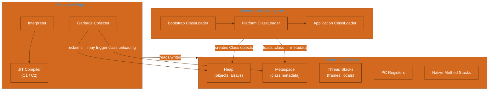

### The three subsystems (plain English)

| Subsystem | Job | You care when… |
|-----------|-----|----------------|
| **Class Loader** | Finds `.class` bytes, verifies them, defines `Class<?>` metadata | `ClassNotFoundException`, duplicate classes, hot reload, SPI |
| **Runtime Data Areas** | Stores everything at run time: objects (heap), frames (stacks), metadata (metaspace) | OOM, stack overflow, memory sizing |
| **Execution Engine** | Executes bytecode (interpret → JIT compile), runs GC | Slow warm-up, CPU spikes, GC pauses |

### Lifecycle of one request (Spring Boot example)

```
HTTP request
    → DispatcherServlet (already-loaded class, metaspace)
    → new objects on heap (DTOs, Strings, collections)
    → methods execute on thread stack (frames pushed/popped)
    → hot paths JIT-compiled to native code
    → short-lived objects die in Young GC
    → response returned; some objects may promote to Old gen
```

### Key invariant

**The heap is shared; stacks are per-thread.** This single sentence explains most concurrency and memory questions.

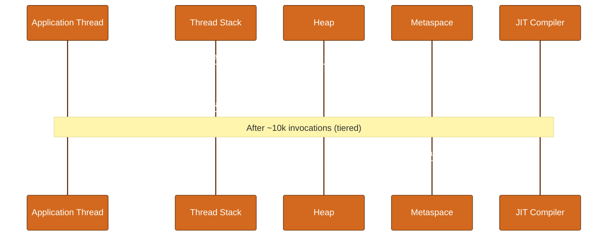

### Memory vs class metadata (critical distinction)

| Stores | Location | GC? | Typical OOM message |
|--------|----------|-----|---------------------|
| `new User()`, arrays, Strings | **Heap** | Yes | `Java heap space` |
| Class structures, method bytecode, constant pools | **Metaspace** | Class unloading (rare) | `Metaspace` |
| Thread stacks, local variables | **Stack** (per thread) | No (thread dies) | `StackOverflowError` |


## Part 2: Class Loading

Class loading is the bridge between `.class` files on disk (or in JARs) and running code. The JVM lazy-loads classes — a class is loaded when first **referenced** (not necessarily when first used for a method call in all cases, but conceptually "when needed").

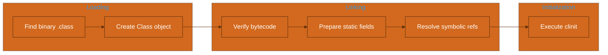

### The three built-in class loaders (JDK 9+)

| ClassLoader | Loads | Example |
|-------------|-------|---------|
| **Bootstrap** (`null` in Java API) | Core JDK classes | `java.lang.String`, `java.util.List` |
| **Platform** (Extension pre-9) | Platform modules | `java.sql.*`, JAXB (if module present) |
| **Application / System** | Classpath / module path | Your `com.example.App`, Spring JARs |

```java
public class LoaderDemo {
    public static void main(String[] args) {
        System.out.println(String.class.getClassLoader());        // null (bootstrap)
        System.out.println(com.sun.crypto.provider.SunJCE.class.getClassLoader()); // platform
        System.out.println(LoaderDemo.class.getClassLoader());    // app loader
    }
}
```

### Parent delegation model

When `AppClassLoader.loadClass("com.example.Foo")` is called:

1. Ask parent (`Platform`) to load.
2. Platform asks Bootstrap.
3. If parent cannot find class, child tries its own classpath.

**Why:** Prevents you from replacing `java.lang.String` with a malicious version on the classpath.

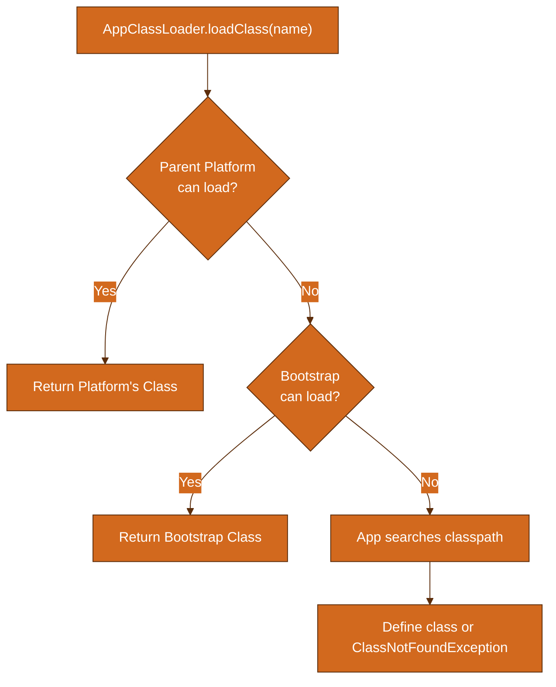

### Breaking delegation (when and why)

Custom class loaders **can** override `loadClass` and load before delegating — used in:

- **Servlet containers** (Tomcat: WebAppClassLoader loads WAR classes first for isolation)
- **OSGi**, plugin frameworks
- **Hot swap** / agent frameworks (with caution)

```java
public class InvertedLoader extends ClassLoader {
    public InvertedLoader(ClassLoader parent) {
        super(parent);
    }

    @Override
    protected Class<?> loadClass(String name, boolean resolve) throws ClassNotFoundException {
        synchronized (getClassLoadingLock(name)) {
            Class<?> c = findLoadedClass(name);
            if (c == null) {
                try {
                    // Try local first (inverted)
                    c = findClass(name);
                } catch (ClassNotFoundException e) {
                    c = getParent().loadClass(name);
                }
            }
            if (resolve) resolveClass(c);
            return c;
        }
    }

    @Override
    protected Class<?> findClass(String name) throws ClassNotFoundException {
        byte[] bytes = loadBytesFromCustomSource(name);
        return defineClass(name, bytes, 0, bytes.length);
    }

    private byte[] loadBytesFromCustomSource(String name) throws ClassNotFoundException {
        throw new ClassNotFoundException(name);
    }
}
```

### SPI and context class loader

Java SPI (`ServiceLoader`) loads implementations from classpath/META-INF/services. Framework code often runs with the **thread context class loader (TCCL)** set to the application loader so SPI finds impl JARs.

```java
Thread.currentThread().setContextClassLoader(appClassLoader);
ServiceLoader<MyService> loader = ServiceLoader.load(MyService.class);
```

**Spring Boot fat JAR:** `LaunchedURLClassLoader` loads nested JARs; TCCL is set correctly for `@Configuration` scanning.

### Common class loading failures

| Exception | Typical cause |
|-----------|---------------|
| `ClassNotFoundException` | Class not on classpath at load time |
| `NoClassDefFoundError` | Class was present at compile time, missing at run time (or static init failed) |
| `LinkageError` / `ClassCastException` (same name, different loaders) | Duplicate class loaded by two loaders |

### Module system (JPMS) interaction (JDK 9+)

- **Named modules** export packages explicitly.
- `--add-opens java.base/java.lang=ALL-UNNAMED` is common for reflection libraries (Hibernate, Spring).
- Class loading respects module boundaries; unnamed JAR on classpath = unnamed module.


## Part 3: Runtime Data Areas

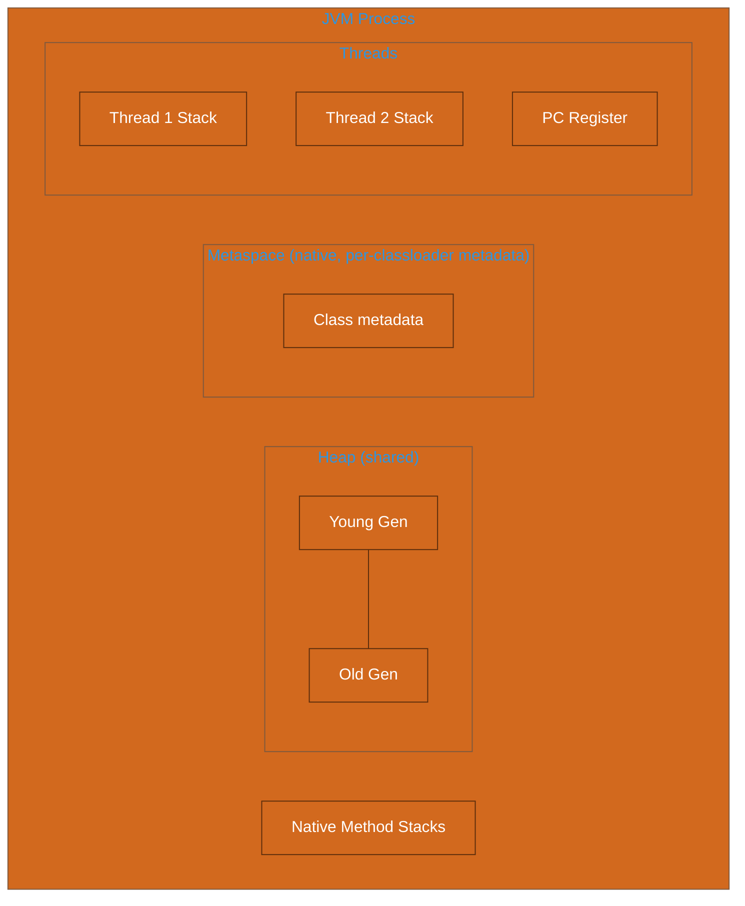

### Heap

- Single logical heap **shared by all threads** (except thread-local allocations in some GCs — conceptually shared).
- Divided into **Young** and **Old** generations (except some collectors that use regions).
- All `new` objects (except scalar replacement / TLAB internals) live here.

| Region | Purpose | Collector notes |
|--------|---------|-----------------|
| Eden | New allocations | Minor GC clears survivors |
| Survivor (S0, S1) | Objects surviving minor GCs | Copied between survivors |
| Old (Tenured) | Long-lived objects | Major / mixed GC |

### Thread stack

Each Java thread gets a stack of **frames**. Each frame holds:

- Local variable array (primitives, object references)
- Operand stack (bytecode evaluation)
- Reference to constant pool of executing method

**Default size:** `-Xss1m` (platform-dependent). Deep recursion → `StackOverflowError`.

```java
public class StackOverflowDemo {
    public static void main(String[] args) {
        recurse();
    }
    static void recurse() {
        recurse(); // eventually StackOverflowError
    }
}
```

### Metaspace (JDK 8+)

Replaced **PermGen** (fixed size in heap, painful to tune).

- Stores class metadata, method metadata, bytecodes, constant pools (runtime structures).
- Allocated from **native memory** (not Java heap).
- Grows by default; limited with `-XX:MaxMetaspaceSize`.
- **Class unloading** occurs when ClassLoader is collectible (uncommon for app class loaders that live forever).

### PC register

Per-thread program counter pointing to current bytecode instruction (undefined for native methods).

### Native method stack

Supports JNI calls into C/C++ code; not directly visible from Java.

### Direct / off-heap memory

Not a "runtime data area" in the spec sense, but critical:

- `ByteBuffer.allocateDirect()`
- Netty, NIO, mapped files
- Limited by `-XX:MaxDirectMemorySize` (default ≈ `-Xmx`)


## Part 4: Object Lifecycle

### Object creation (`new`)

Bytecode for `new Foo()`:

1. `new` — allocate uninitialized instance (TLAB fast path on Eden)
2. `dup` — duplicate reference on operand stack
3. `<init>` — invoke constructor

### Object layout (HotSpot, compressed oops typical)

```
┌─────────────────────────────────────────┐
│ Mark Word (8 bytes) — hash, lock state  │
├─────────────────────────────────────────┤
│ Klass Pointer (4–8 bytes) → metaspace   │
├─────────────────────────────────────────┤
│ Instance fields (refs, ints, etc.)      │
│ (padding for alignment)                 │
└─────────────────────────────────────────┘
```

| Field | Purpose |
|-------|---------|
| Mark word | Identity hash, GC age, lock bits (thin/heavy) |
| Klass pointer | Points to class metadata in metaspace |
| Array length | If array object, before elements |

**Alignment:** Objects align to 8 bytes (often 16 bytes minimum object size on 64-bit).

### Escape analysis

If the JIT proves an object **does not escape** the method (no store to field, no return, no pass to unknown code), it may:

- **Scalar replace** — allocate fields in registers/stack instead of heap
- **Stack allocate** (less common terminology today)

```java
public int sum() {
    Point p = new Point(1, 2); // may not allocate on heap after JIT
    return p.x + p.y;
}
```

Disable analysis for testing: `-XX:-DoEscapeAnalysis` (diagnostic only).

### Object lifecycle states (conceptual)

```
Allocated (Eden)
    → minor GC → copied to Survivor (age++)
    → repeated survival → promoted to Old
    → unreachable → marked garbage → collected
```

### Reference types and GC interaction

| Type | GC behavior | Use case |
|------|-------------|----------|
| Strong | Never collected while reachable | Normal references |
| Soft | Collected only if memory needed | caches |
| Weak | Collected at next GC | `WeakHashMap`, listeners |
| Phantom | After finalization/enqueue | cleanup tracking |

```java
import java.lang.ref.*;

public class ReferenceDemo {
    public static void main(String[] args) throws InterruptedException {
        Object strong = new byte[1_000_000];
        WeakReference<Object> weak = new WeakReference<>(strong);
        System.out.println("Before clear: " + weak.get());
        strong = null;
        System.gc();
        Thread.sleep(100);
        System.out.println("After GC: " + weak.get()); // often null
    }
}
```


## Part 5: Bytecode & Execution Engine

### Interpreter vs JIT

| Mode | Pros | Cons |
|------|------|------|
| Interpreter | Fast startup, low memory | Slow steady-state |
| JIT (C1/C2) | Near-native speed | Compile cost, code cache |

**Tiered compilation (default):** Methods start interpreted → C1 (fast compile, some opts) → C2 (aggressive opts) based on invocation counters.

### C1 vs C2

| Compiler | Alias | Focus |
|----------|-------|-------|
| C1 | Client | Quick compile, lighter optimizations |
| C2 | Server | Deep inlining, loop opts, vectorization |

Flags:

- `-XX:TieredStopAtLevel=1` — C1 only (fast startup, lower peak perf)
- `-XX:-TieredCompilation` — force C2-only path (older style)

### OSR (On-Stack Replacement)

Compiles **long-running loops** mid-execution when back-branch count exceeds threshold — critical for hot loops in otherwise cold methods.

### Deoptimization

When assumptions break (e.g., class hierarchy changed, uncommon trap):

1. Invalidate optimized nmethod
2. Fall back to interpreter or recompile with new profile

You may see in logs: `Made non-entrant`, `uncommon trap`.

### Example: viewing bytecode

```bash
javap -c -v MyClass.class
```

Common opcodes:

| Opcode | Meaning |
|--------|---------|
| `aload_0` | Load local 0 (often `this`) |
| `invokevirtual` | Virtual method call |
| `invokeinterface` | Interface call |
| `monitorenter/exit` | `synchronized` block |

### Safepoints

GC and deopt require threads at **safepoints**. Long counted loops get safepoint polls — rare issue: `-XX:+UseCountedLoopSafepoints`.


## Part 6: Garbage Collection Deep Dive

Garbage collection reclaims unreachable objects so the heap can be reused. No Java programmer frees memory manually; the collector identifies live objects and compacts or copies as needed.


### 6.1 GC Roots and Reachability

An object is **eligible for GC** when no chain of strong references exists from a **GC root**.

### GC root categories

| Root type | Example |
|-----------|---------|
| Local variables / operand stacks | Active stack frames |
| Static fields | `static Map cache` |
| JNI globals | Native code holding refs |
| JVM internal | Class objects, thread objects, system class loader |
| Active Java threads | Thread objects themselves |
| Synchronizer monitors | Held locks |
| JMX / JVMTI | Debugger, agent references |

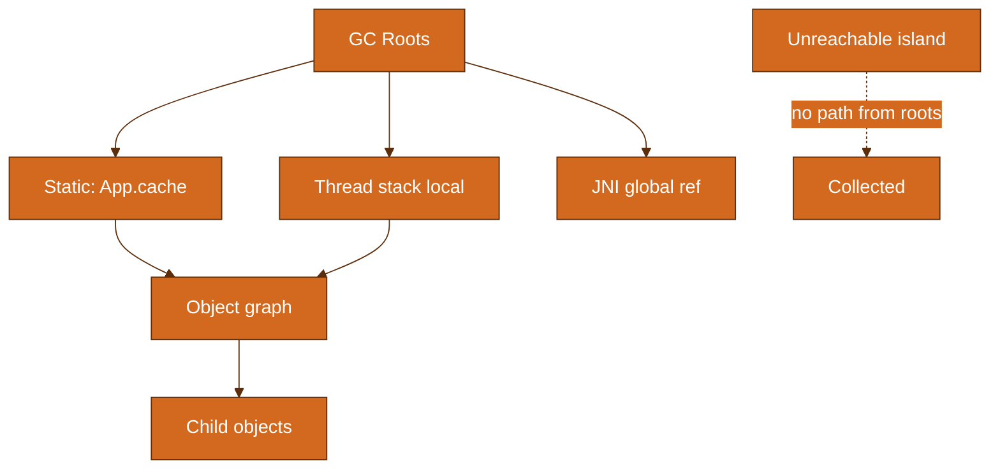


### 6.2 Generational Hypothesis

**Weak generational hypothesis:** Most objects die young.

Therefore:

- **Minor GC** (young gen) — frequent, fast copying
- **Major / Mixed GC** (old gen) — less frequent, more expensive

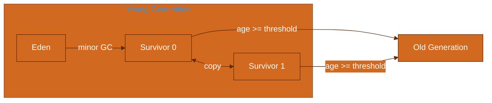


### 6.3 GC Phases

| Phase | What happens | Stop-the-world? |
| --- | --- | --- |
| Mark | Traverse from roots, mark live objects | Mostly STW for classic collectors |
| Sweep | Reclaim unmarked space | Often concurrent in modern GCs |
| Compact | Move objects to defragment | Usually STW |


### 6.4 Collectors Overview

| Collector | Flag | STW pauses | Throughput | Best for |
| --- | --- | --- | --- | --- |
| Serial | -XX:+UseSerialGC | Full STW | Low on multi-core | Single-core, tiny heaps, tests |
| Parallel | -XX:+UseParallelGC | STW but parallelized | High | Batch, throughput-first |
| CMS (legacy) | -XX:+UseConcMarkSweepGC | Reduced old-gen pauses | Moderate | Legacy only — removed |
| G1 | -XX:+UseG1GC (default 9+) | Target pause times | Balanced | General purpose, heaps 4–32GB |
| ZGC | -XX:+UseZGC | Sub-ms typical | Good | Large heaps, low latency |
| Shenandoah | -XX:+UseShenandoahGC | Concurrent compact | Good | Low latency (Red Hat builds) |


### 6.5 Serial GC

Single-threaded mark-sweep-compact for young and old. `-XX:+UseSerialGC`.

Use when: one CPU, small embedded JVM, unit tests. Avoid on multi-core services.


### 6.6 Parallel GC

`-XX:+UseParallelGC` — multiple GC threads, STW. Default pre-G1 on many JDK 8 installs.

Tuning knobs:

- `-XX:ParallelGCThreads=N`
- `-XX:MaxGCPauseMillis=200` (hint, not guarantee)
- `-XX:GCTimeRatio=19` (5% GC time target)

Good for: ETL, offline jobs where 200ms pauses are acceptable.


### 6.7 CMS (Legacy)

**Concurrent Mark Sweep** — mostly concurrent old-gen collector. **Removed in JDK 14.** Documented for reading old logs and maintaining JDK 8 systems.

Phases: initial mark (STW) → concurrent mark → remark (STW) → concurrent sweep.

Problems: fragmentation, concurrent mode failure, floating garbage.

Migration path: **G1** or **ZGC**.


### 6.8 G1 GC

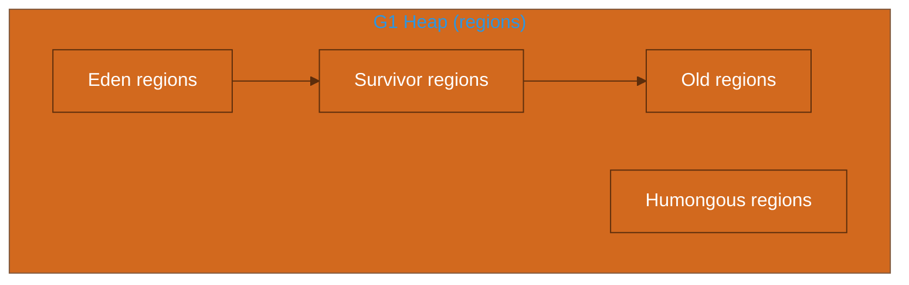

**Garbage-First (G1)** — default since JDK 9. Heap split into **regions** (1–32MB, `-XX:G1HeapRegionSize`).

- **Young GC:** collection set = all eden + survivors
- **Mixed GC:** collects some old regions with most garbage (garbage-first)
- **Humongous object:** > 50% region size → dedicated humongous regions

Key flags:

```
-XX:+UseG1GC
-XX:MaxGCPauseMillis=200
-XX:G1HeapRegionSize=16m
-XX:InitiatingHeapOccupancyPercent=45
```

**When to use:** General Spring Boot services, 4–32GB heap, balanced latency/throughput.


### 6.9 ZGC

**Z Garbage Collector** — low-latency, scalable. Concurrent marking, relocation, remapping. Colored pointers + load barriers.

```
-XX:+UseZGC
-XX:SoftMaxHeapSize=8g   # JDK 21+: gentle return of memory to OS
```

Sub-millisecond pauses typical (root scanning pauses scale with root set).

**When to use:** Large heaps (8GB+), strict p99 latency, JDK 17+ production.

JDK 21+: **Generational ZGC** (`-XX:+ZGenerational`) — default when using ZGC in 21+.


### 6.10 Shenandoah

Red Hat / OpenJDK Shenandoah — concurrent compaction with Brooks pointers. `-XX:+UseShenandoahGC`.

Similar niche to ZGC. Availability depends on JDK distribution (common in RHEL builds, Temurin).

Compare: both target low pause; choose based on JDK vendor support and benchmarks on **your** workload.


### 6.11 GC Logging (JDK 17+ Unified Logging)

Pre-JDK 9: `-XX:+PrintGCDetails`. **Deprecated.**

Modern unified logging:

```bash
# Basic
-Xlog:gc

# Production-friendly rotation
-Xlog:gc*,gc+heap=debug,gc+age=trace,safepoint:file=/var/log/app/gc-%t.log:time,uptime,level,tags:filecount=10,filesize=50M

# Human-readable on console during dev
-Xlog:gc*:stdout:time,level,tags
```

### Log line anatomy (G1 young GC example)

```
[2024-03-15T10:23:45.123+0000][info][gc] GC(42) Pause Young (Normal) (G1 Evacuation Pause) 512M->128M(1024M) 12.345ms
```

| Token | Meaning |
|-------|---------|
| `GC(42)` | GC event number |
| `Pause Young (Normal)` | Young generation evacuation |
| `512M->128M(1024M)` | Heap before → after (capacity) |
| `12.345ms` | Pause duration |


### 6.12 Tuning Flags Reference (GC)

| Flag | Purpose | Example |
| --- | --- | --- |
| -Xms | Initial heap | -Xms2g |
| -Xmx | Max heap | -Xmx2g |
| -XX:MaxGCPauseMillis | G1/Parallel pause goal | 200 |
| -XX:MaxMetaspaceSize | Cap metaspace | 256m |
| -XX:+UseZGC | Enable ZGC |  |
| -XX:NewRatio | Old/Young ratio (Parallel) | 2 |
| -XX:SurvivorRatio | Eden/S survivor ratio | 8 |
| -XX:MaxTenuringThreshold | Age before promotion | 15 |
| -XX:G1HeapRegionSize | G1 region size | 16m |
| -XX:InitiatingHeapOccupancyPercent | Start concurrent cycle (G1/CMS) | 45 |


### 6.13 Common GC Problems

| Problem | Symptom | Mitigation |
|---------|---------|------------|
| **Promotion failure** | Minor GC cannot promote; full GC | Increase heap, tune survivor, reduce allocation rate |
| **Humongous objects (G1)** | Many objects > region/2 | Increase region size or reduce object size |
| **Metaspace OOM** | `OutOfMemoryError: Metaspace` | `-XX:MaxMetaspaceSize`, fix class loader leaks |
| **GC overhead limit** | `GC overhead limit exceeded` | Heap too small for live set |
| **Long remark (CMS legacy)** | Pause spikes | Migrate off CMS |
| **Allocation stall (ZGC)** | App threads stall on allocation | Increase heap or tune conc threads |


### 6.14 Worked GC Log Examples

#### Example 1: Healthy G1 Young GC

```text
[info][gc] GC(15) Pause Young (Normal) (G1 Evacuation Pause) 180M->45M(512M) 8.2ms
```

**Interpretation:** Normal young collection. Heap dropped from 180M to 45M live. Pause 8ms — excellent.

#### Example 2: G1 Mixed GC

```text
[info][gc] GC(89) Pause Mixed (G1 Evacuation Pause) 420M->210M(1024M) 45.1ms
```

**Interpretation:** G1 collecting young + some old regions. 45ms pause — check against SLA.

#### Example 3: Full GC (bad sign under G1)

```text
[info][gc] GC(120) Pause Full (G1 Evacuation Pause) 980M->950M(1024M) 1200.5ms
```

**Interpretation:** Full heap evacuation — often allocation failure or metaspace. Investigate heap sizing and leaks.

#### Example 4: Concurrent cycle start (G1)

```text
[info][gc] GC(50) Concurrent Cycle
```

**Interpretation:** Background concurrent mark started — not a pause event.

#### Example 5: ZGC pause

```text
[info][gc] GC(10) Pause Mark Start 0.012ms
```

**Interpretation:** ZGC sub-millisecond pause phase. Collect multiple phases per cycle.

#### Example 6: Promotion failed (Parallel)

```text
[info][gc] GC(33) Pause Young (Allocation Failure) 450M->440M(512M) 150.0ms
```

**Interpretation:** Young GC triggered by allocation failure; long pause suggests old gen pressure.

#### Example 7: Metaspace GC

```text
[info][gc,metaspace] Metaspace: 128M->128M(256M) NonClass: 120M->120M
```

**Interpretation:** Metaspace usage stable at 128M of 256M cap — healthy.

#### Example 8: Safepoint

```text
[info][safepoint] Safepoint "Cleanup", Time since last: 5000 ms, Reaching safepoint: 0.1 ms, At safepoint: 2.0 ms
```

**Interpretation:** Safepoint for cleanup — long 'At safepoint' may indicate threads slow to yield.

#### Example 9: Humongous allocation (G1)

```text
[info][gc] GC(44) Pause Young (Concurrent Start) (G1 Humongous Allocation) 600M->580M(1024M) 25.0ms
```

**Interpretation:** Large object triggered young GC + concurrent cycle start. Review object sizes.

#### Example 10: To-space exhausted

```text
[info][gc] GC(55) Pause Young (G1 Evacuation Pause) (to-space exhausted) 400M->395M(512M) 80.0ms
```

**Interpretation:** Survivor/evacuation could not copy all live objects — tune region size or heap.

#### Example 11: GC overhead

```text
[info][gc] GC(200) Pause Full (Ergonomics) (G1 Evacuation Pause) 508M->505M(512M) 800.0ms
```

**Interpretation:** JVM spending too much time in GC — increase heap or reduce allocation.

#### Example 12: Application stopped time

```text
[info][gc] GC(30) Pause Young 15.0ms, GC(31) Pause Young 18.0ms
```

**Interpretation:** Two pauses in quick succession — allocation burst; correlate with traffic spike.

#### Example 13: Parallel GC full collection

```
[info][gc] GC(78) Pause Full (Ergonomics) 490M->120M(512M) 350.2ms
```

**Interpretation:** Parallel collector full GC reclaimed significant space (490→120M). Single 350ms pause — acceptable for batch, not for interactive API.

#### Example 14: G1 concurrent mark end

```
[info][gc] GC(60) Concurrent Mark 890.5ms
[info][gc] GC(60) Pause Remark 3.2ms
```

**Interpretation:** Concurrent mark took 890ms wall time (not STW). Remark pause only 3.2ms — healthy G1 concurrent cycle.

#### Example 15: Allocation rate indicator

```
[info][gc] GC(10) Pause Young 8ms
[info][gc] GC(11) Pause Young 7ms
[info][gc] GC(12) Pause Young 9ms
# ... every 2 seconds ...
```

**Interpretation:** Young GC every ~2s under steady load. Calculate allocation rate: `(heap_before - heap_after) / interval`. High rate → optimize object churn in code.


### 6.15 Memory Leak Demo Code

```java
import java.util.*;

// ANTI-PATTERN: static collection grows forever
public class MemoryLeakDemo {
    private static final List<byte[]> LEAK = new ArrayList<>();

    public static void main(String[] args) throws InterruptedException {
        while (true) {
            LEAK.add(new byte[1024 * 1024]); // 1 MB per iteration
            Thread.sleep(100);
        }
    }
}
// Run: java -Xmx256m -Xlog:gc MemoryLeakDemo
// Observe: increasing GC frequency, eventual Java heap space OOM

```


## Part 7: Memory Management & JVM Flags Comprehensive Reference

### Heap sizing

| Flag | Description |
|------|-------------|
| `-Xms` | Initial heap size |
| `-Xmx` | Maximum heap size |
| `-Xmn` | Young gen size (legacy explicit sizing) |
| `-XX:NewSize` / `-XX:MaxNewSize` | Young gen bounds |

**Production rule:** Set `-Xms == -Xmx` to avoid resize pauses and OS accounting surprises (especially containers).

### Metaspace

| Flag | Default behavior |
|------|------------------|
| `-XX:MetaspaceSize` | Initial threshold triggering GC |
| `-XX:MaxMetaspaceSize` | Hard cap (unbounded by default) |
| `-XX:MinMetaspaceFreeRatio` | GC tuning ratio |

### Stack and threads

| Flag | Purpose |
|------|---------|
| `-Xss` | Thread stack size |
| `-XX:MaxJavaStackTraceDepth` | Limit stack trace depth in errors |

### Direct memory

| Flag | Purpose |
|------|---------|
| `-XX:MaxDirectMemorySize` | Cap for direct byte buffers |

### Compiler

| Flag | Purpose |
|------|---------|
| `-XX:ReservedCodeCacheSize` | JIT code cache |
| `-XX:CICompilerCount` | Compiler threads |
| `-XX:TieredStopAtLevel` | Limit tiered level |

### Diagnostic

| Flag | Purpose |
|------|---------|
| `-XX:+HeapDumpOnOutOfMemoryError` | Dump heap on OOM |
| `-XX:HeapDumpPath` | Dump file path |
| `-XX:+ExitOnOutOfMemoryError` | Kill process on OOM (K8s restart) |
| `-XX:OnOutOfMemoryError` | Run command on OOM |
| `-XX:NativeMemoryTracking=summary` | NMT for native leak debug |

### Container awareness (JDK 10+)

CGroup-aware defaults: JVM respects container memory limit for heap sizing unless overridden.

```
-XX:MaxRAMPercentage=75.0
-XX:InitialRAMPercentage=50.0
```

In Kubernetes, prefer percentages over fixed `-Xmx` when limits change.

### GC selection

| Flag | Description |
| --- | --- |
| -XX:+UseG1GC | Garbage-First collector |
| -XX:+UseZGC | Z Garbage Collector |
| -XX:+UseParallelGC | Throughput collector |
| -XX:+UseSerialGC | Single-threaded collector |
| -XX:+UseShenandoahGC | Shenandoah low-latency |

### G1 tuning

| Flag | Description |
| --- | --- |
| -XX:MaxGCPauseMillis | Target max pause (default 200) |
| -XX:G1HeapRegionSize | 1MB to 32MB, power of 2 |
| -XX:G1NewSizePercent | Min young gen % of heap |
| -XX:G1MaxNewSizePercent | Max young gen % of heap |
| -XX:G1MixedGCCountTarget | Target mixed GC count after mark |
| -XX:G1MixedGCLiveThresholdPercent | Live threshold for old region collection |
| -XX:G1HeapWastePercent | Allowed waste before mixed GC |
| -XX:InitiatingHeapOccupancyPercent | IHOP — start concurrent mark |

### Parallel tuning

| Flag | Description |
| --- | --- |
| -XX:ParallelGCThreads | STW parallel threads |
| -XX:MaxGCPauseMillis | Pause time goal |
| -XX:GCTimeRatio | Throughput vs GC time ratio |

### ZGC tuning

| Flag | Description |
| --- | --- |
| -XX:ConcGCThreads | Concurrent GC worker threads |
| -XX:ParallelGCThreads | Parallel phase threads |
| -XX:SoftMaxHeapSize | Soft max heap (JDK 21+) |
| -XX:+ZGenerational | Generational ZGC (JDK 21+) |

### Logging

| Flag | Description |
| --- | --- |
| -Xlog:gc | Basic GC log |
| -Xlog:gc* | All GC tags |
| -Xlog:safepoint | Safepoint stats |
| -Xlog:gc+heap=debug | Heap details at GC |


## Part 8: Threading & Java Memory Model

The **Java Memory Model (JMM)** defines when writes by one thread are visible to another — independent of the JVM implementation.

### Happens-before rules (must know)

| Rule | Meaning |
|------|---------|
| Program order | Actions in same thread appear in order |
| Monitor lock | Unlock on `m` happens-before subsequent lock on `m` |
| `volatile` | Write to volatile happens-before read of same volatile |
| Thread start | `thread.start()` happens-before any action in started thread |
| Thread join | Actions in thread happen-before successful `join()` return |
| Transitivity | If A hb B and B hb C, then A hb C |

### volatile vs synchronized

| Feature | volatile | synchronized |
|---------|----------|--------------|
| Atomicity | Single read/write only | Full block |
| Visibility | Yes | Yes |
| Ordering | Prevents reorder with volatile access | Mutual exclusion |

```java
public class VisibilityBug {
    private static boolean running = true; // BUG: not volatile

    public static void main(String[] args) throws InterruptedException {
        Thread t = new Thread(() -> {
            while (running) { /* may loop forever */ }
        });
        t.start();
        Thread.sleep(100);
        running = false; // may not be visible to t
        t.join();
    }
}
```

Fix: `private static volatile boolean running`.

### Virtual threads (JDK 21+)

**Project Loom** — lightweight threads mapped to carrier platform threads.

```java
try (var executor = Executors.newVirtualThreadPerTaskExecutor()) {
    IntStream.range(0, 10_000).forEach(i ->
        executor.submit(() -> handleRequest(i)));
}
```

| Aspect | Platform thread | Virtual thread |
|--------|-----------------|----------------|
| Memory | ~1MB stack default | Small, mounted on carrier |
| Blocking I/O | Ties up OS thread | Unmounts, frees carrier |
| Best for | CPU-bound | Massive concurrency, I/O-bound |

**Pinning:** Synchronized block or native code on virtual thread pins to carrier — avoid synchronized in hot virtual-thread paths; use `ReentrantLock`.

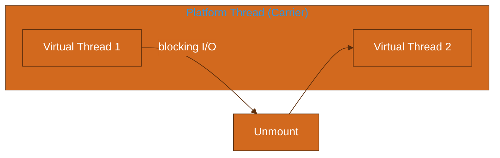


## Part 9: JVM Monitoring & Diagnostics

### Tool quick reference

| Tool | Purpose | Example |
| --- | --- | --- |
| jcmd | JVM diagnostic command | jcmd <pid> VM.flags
jcmd <pid> GC.heap_info
jcmd <pid> JFR.start |
| jstat | GC/ class stats | jstat -gcutil <pid> 1000 10 |
| jmap | Heap dump / histogram | jmap -histo:live <pid>
jmap -dump:live,format=b,file=heap.hprof <pid> |
| jstack | Thread dump | jstack <pid> > threads.txt |
| jhsdb | Interactive debugger | jhsdb jstack --pid <pid> |
| VisualVM | GUI monitoring | Attach to local/remote process |
| JFR | Java Flight Recorder | jcmd <pid> JFR.start settings=profile duration=60s filename=rec.jfr |
| async-profiler | CPU/allocation/flame graphs | asprof -d 30 -f flame.html <pid> |

### jstat columns (gcutil)

| Column | Meaning |
|--------|---------|
| S0, S1 | Survivor utilization % |
| E | Eden utilization % |
| O | Old gen utilization % |
| M | Metaspace utilization % |
| YGC, YGCT | Young GC count and time |
| FGC, FGCT | Full GC count and time |

### Reading a thread dump

Look for:

- `BLOCKED` threads waiting on same monitor → lock contention
- `deadlock` section at end (jstack detects cycles)
- Same stack trace repeated → pool exhaustion

### JFR events (high value)

| Event | Use |
|-------|-----|
| `jdk.GarbageCollection` | GC pauses |
| `jdk.ObjectAllocationInNewTLAB` | Allocation hotspots |
| `jdk.ThreadPark` | Blocking / parking |
| `jdk.JavaMonitorEnter` | Lock contention |

### async-profiler (production-safe with care)

```bash
# CPU profile 60 seconds
./profiler.sh -d 60 -e cpu -f /tmp/cpu.html <pid>

# Allocation profile
./profiler.sh -d 60 -e alloc -f /tmp/alloc.html <pid>
```

Always test overhead in staging. `-e wall` for wall-clock including blocked time.


## Part 10: Spring Boot + JVM

See also: [Kenya Integrator Skills Master Guide](KENYA-INTEGRATOR-SKILLS-MASTER-GUIDE.md) for Spring Boot integration patterns.

### Typical microservice JVM flags

```bash
JAVA_OPTS="
  -Xms512m -Xmx512m
  -XX:MaxMetaspaceSize=256m
  -XX:+UseG1GC
  -XX:MaxGCPauseMillis=200
  -XX:+HeapDumpOnOutOfMemoryError
  -XX:HeapDumpPath=/tmp/heap.hprof
  -XX:+ExitOnOutOfMemoryError
  -Xlog:gc*,safepoint:file=/var/log/gc.log:time,uptime,level,tags:filecount=5,filesize=20M
"
```

### Heap sizing heuristic (Spring Boot API)

| Pod memory limit | Suggested heap | Metaspace cap | Notes |
|------------------|----------------|---------------|-------|
| 512Mi | 256–320m | 128m | Small sidecar |
| 1Gi | 512m | 256m | Typical REST service |
| 2Gi | 1g–1.2g | 256m | Moderate caching |
| 4Gi | 2g–2.5g | 512m | Heavy in-memory work |

Leave **25–30%** for metaspace, direct memory, thread stacks, native overhead.

### GC choice for microservices

| Profile | Collector | Rationale |
|---------|-----------|-----------|
| Default REST | G1 | Balanced, well-tested |
| Strict p99 < 50ms | ZGC | Sub-ms pauses |
| Batch worker | Parallel | Max throughput |
| Tiny (< 256MB heap) | Serial or G1 | Serial on single-core nodes |

### Spring-specific memory considerations

- **Classpath scanning** — loads many classes at startup → metaspace spike
- **CGLIB proxies** — one class per proxied bean
- **DevTools** — separate class loader; never in production
- **Actuator + Micrometer** — negligible heap if metrics cardinality controlled

```yaml
# application.yml — don't set heap here; use JAVA_OPTS or K8s env
management:
  endpoints:
    web:
      exposure:
        include: health,metrics,prometheus
```

### Kubernetes resources

```yaml
resources:
  requests:
    memory: "1Gi"
    cpu: "500m"
  limits:
    memory: "1Gi"
    cpu: "2"
env:
  - name: JAVA_TOOL_OPTIONS
    value: "-XX:MaxRAMPercentage=75.0 -XX:+UseG1GC"
```

**Never** set `-Xmx` larger than container memory limit.


## Part 11: Performance Troubleshooting Case Studies

### Case 1: Memory Leak in Cache

**Symptoms:** Symptoms: Heap slowly rises over days; Full GC every hour; eventual OOM.

**Investigation:**

1. `jmap -histo:live` — top objects are `byte[]` and `ConcurrentHashMap$Node`
2. Heap dump → MAT dominator tree → `UserSessionCache`
3. Cache has no TTL; keys are session IDs never removed

**Fix:** Add Caffeine cache with `maximumSize` + `expireAfterAccess`. `-XX:+HeapDumpOnOutOfMemoryError` for next time.

**Lesson:** Static or long-lived collections holding request-scoped data.

### Case 2: GC Pause Spikes (G1)

**Symptoms:** Symptoms: p99 latency jumps to 2s every 10 minutes.

**Investigation:**

1. GC logs show `Pause Mixed` 800–1200ms
2. `IHOP` too high — old gen fills before concurrent cycle completes
3. `-XX:InitiatingHeapOccupancyPercent=45` → 30

**Fix:** Lower IHOP, increase heap from 2G to 3G, review allocation burst during batch job.

**Lesson:** Mixed GC pauses correlate with old-gen occupancy and humongous objects.

### Case 3: Metaspace OOM

**Symptoms:** Symptoms: `OutOfMemoryError: Metaspace` after redeploy loops without restart.

**Investigation:**

1. Dynamic class generation (CGLIB + Groovy scripts)
2. `jcmd VM.classloader_stats` — thousands of duplicate loaders

**Fix:** Fix class loader lifecycle in hot-reload plugin; `-XX:MaxMetaspaceSize=512m` as safety cap; restart policy.

**Lesson:** Metaspace leaks = class loader leaks, not regular object leaks.

### Case 4: Thread Dump Deadlock

**Symptoms:** Symptoms: API hangs; all worker threads BLOCKED.

**Investigation:**

1. `jstack` shows cycle: Thread-1 holds lock A waits B; Thread-2 holds B waits A
2. At `OrderService.create` and `InventoryService.reserve`

**Fix:** Consistent lock ordering: always acquire `Order` then `Inventory`. Or use DB row locks.

**Lesson:** jstack `Found one Java-level deadlock` — act immediately.

### Case 5: CPU Hot Method

**Symptoms:** Symptoms: 100% CPU on one core; latency normal but AWS bill high.

**Investigation:**

1. async-profiler `-e cpu` → `com.example.JsonUtil.deepCopy`
2. Called 50k/sec in logging path

**Fix:** Remove deep copy from debug logging; use structured logging with reference.

**Lesson:** CPU issues ≠ GC issues — profile before tuning heap.


## Part 12: Senior Interview Q&A

### Q1. What is the JVM?

**Answer:** A spec-implementing runtime that loads bytecode, manages memory via GC, and executes via interpreter + JIT.

### Q2. Difference between JDK, JRE, JVM?

**Answer:** JVM runs bytecode. JRE = JVM + libraries (legacy term). JDK = JRE + compiler/tools (javac, jcmd).

### Q3. Explain class loader delegation.

**Answer:** Child asks parent to load first; only loads locally if parent fails — protects core classes.

### Q4. What is PermGen vs Metaspace?

**Answer:** PermGen was fixed heap area pre-8. Metaspace uses native memory, auto-grows, per-class-loader metadata.

### Q5. Heap vs stack?

**Answer:** Heap: shared objects. Stack: per-thread frames, locals, partial operand stacks.

### Q6. What makes an object eligible for GC?

**Answer:** No reachable path of strong references from GC roots.

### Q7. GC roots examples?

**Answer:** Stack locals, static fields, JNI globals, active threads, synchronized monitors.

### Q8. Generational hypothesis?

**Answer:** Most objects die young → optimize with young/old generations.

### Q9. Minor vs major GC?

**Answer:** Minor collects young gen. Major/full collects old gen (or entire heap).

### Q10. Eden and Survivor roles?

**Answer:** Eden: new allocations. Survivors: hold objects surviving minor GC between collections.

### Q11. Object promotion?

**Answer:** When survivor age exceeds threshold or survivor space full → moved to old gen.

### Q12. Serial vs Parallel GC?

**Answer:** Serial: one thread STW. Parallel: multiple GC threads STW — higher throughput on multi-core.

### Q13. When use G1?

**Answer:** Default general collector; region-based; target pause times; heaps ~4–32GB typical sweet spot.

### Q14. When use ZGC?

**Answer:** Large heaps, strict latency SLAs, JDK 17+; sub-ms pauses.

### Q15. What is a safepoint?

**Answer:** Execution point where all threads can pause safely for GC, deopt, JVMTI.

### Q16. Stop-the-world?

**Answer:** All application threads paused — required for parts of most GC algorithms.

### Q17. What is TLAB?

**Answer:** Thread-Local Allocation Buffer — lock-free Eden allocation per thread.

### Q18. Escape analysis?

**Answer:** JIT optimization eliminating heap allocation for non-escaping objects.

### Q19. Mark-sweep vs mark-compact?

**Answer:** Sweep leaves holes; compact moves objects to defragment.

### Q20. CMS problems?

**Answer:** Fragmentation, concurrent mode failure, floating garbage — deprecated/removed.

### Q21. G1 humongous object?

**Answer:** Object > 50% G1 region size; allocated in dedicated regions; special handling.

### Q22. What is IHOP?

**Answer:** InitiatingHeapOccupancyPercent — when G1 starts concurrent marking cycle.

### Q23. MaxGCPauseMillis guarantee?

**Answer:** No — it's a goal for ergonomics, not a hard guarantee.

### Q24. -Xms vs -Xmx?

**Answer:** Initial vs maximum heap. Production: often equal.

### Q25. How read GC log line?

**Answer:** Event id, phase, heap before→after(capacity), pause ms.

### Q26. Metaspace OOM causes?

**Answer:** Too many classes, class loader leak, dynamic codegen.

### Q27. Heap dump tools?

**Answer:** jmap, -XX:+HeapDumpOnOutOfMemoryError, Actuator heapdump (secured).

### Q28. jstack use?

**Answer:** Thread dump — deadlocks, blocked threads, stack hotspots.

### Q29. happens-before?

**Answer:** Visibility guarantee between actions — foundation of JMM.

### Q30. volatile guarantees?

**Answer:** Visibility + ordering for read/write; no compound atomicity.

### Q31. synchronized vs ReentrantLock?

**Answer:** Both mutual exclusion; lock offers tryLock, fairness, conditions.

### Q32. Virtual threads benefit?

**Answer:** Massive cheap threads; great for I/O-bound; avoid pinning.

### Q33. What is pinning?

**Answer:** Virtual thread stuck on carrier during native/sync — limits scalability.

### Q34. WeakReference use?

**Answer:** Collections that shouldn't prevent GC (e.g. canonical mappings).

### Q35. SoftReference use?

**Answer:** Memory-sensitive caches.

### Q36. PhantomReference use?

**Answer:** Post-mortem cleanup scheduling via ReferenceQueue.

### Q37. Finalize vs Cleaner?

**Answer:** finalize deprecated; Cleaner runs after object unreachable — prefer try-with-resources.

### Q38. OSR in JIT?

**Answer:** On-stack replacement compiles long loops still running.

### Q39. Deoptimization?

**Answer:** Revert optimized code when assumptions invalidated.

### Q40. Code cache full?

**Answer:** JIT stops compiling — `-XX:ReservedCodeCacheSize` increase.

### Q41. Container JVM pitfalls?

**Answer:** Ignoring cgroup limits; `-Xmx` > limit; not using MaxRAMPercentage.

### Q42. Spring metaspace growth?

**Answer:** Many beans, CGLIB, reflection — cap and monitor metaspace.

### Q43. Promotion failure?

**Answer:** Cannot promote to old gen during minor GC → full GC.

### Q44. Allocation rate?

**Answer:** Bytes allocated per second — drives young GC frequency.

### Q45. G1 mixed GC?

**Answer:** Collects some old regions along with young — garbage-first selection.

### Q46. ZGC colored pointers?

**Answer:** Metadata in pointer for concurrent relocation tracking.

### Q47. Should I use -XX:+DisableExplicitGC?

**Answer:** Rarely by default; breaks System.gc() and some NIO/direct buffer paths.

### Q48. ParallelOld vs Parallel?

**Answer:** ParallelOld compacts old gen; part of Parallel collector set.

### Q49. How diagnose memory leak?

**Answer:** Repeated heap histograms, dominator tree, compare retained sets.

### Q50. Full GC every hour healthy?

**Answer:** Usually no for services — indicates sizing or leak issue.

### Q51. JFR vs external APM?

**Answer:** JFR is in-process, low overhead; complements Micrometer/Prometheus.


## Part 13: Master Cheat Sheet

### GC selector table

| Scenario | Recommended | Avoid |
| --- | --- | --- |
| Spring REST 512m–2g | G1 | CMS |
| Latency p99 < 20ms, 8g+ heap | ZGC / Shenandoah | Parallel |
| Batch ETL throughput | Parallel | ZGC (unless pause SLA) |
| Single-core embedded | Serial | Parallel |
| JDK 8 legacy CMS app | Plan migration to G1 | New CMS tuning |
| Massive heap 100g+ | ZGC generational | G1 without testing |

### Essential flags (copy-paste)

```bash
# Development
java -Xlog:gc*:stdout:time,level,tags -jar app.jar

# Production Spring Boot
java -Xms1g -Xmx1g \
     -XX:MaxMetaspaceSize=256m \
     -XX:+UseG1GC \
     -XX:MaxGCPauseMillis=200 \
     -XX:+HeapDumpOnOutOfMemoryError \
     -XX:+ExitOnOutOfMemoryError \
     -Xlog:gc*,safepoint:file=gc.log:time,uptime,level,tags:filecount=5,filesize=50M \
     -jar app.jar

# Low-latency (JDK 21)
java -XX:+UseZGC -XX:+ZGenerational -Xmx4g -jar app.jar
```

### Tool cheat sheet

| Situation | Command |
|-----------|---------|
| GC live stats | `jstat -gcutil <pid> 1000` |
| Why is heap full? | `jmap -histo:live <pid>` |
| Thread stuck? | `jstack <pid>` |
| Flags in use? | `jcmd <pid> VM.flags` |
| 60s CPU flame | `asprof -d 60 -e cpu -f out.html <pid>` |
| Record JFR | `jcmd <pid> JFR.start duration=120s filename=app.jfr` |

### One-page architecture (ASCII)

```
┌─────────────────────────────────────────────────────────────┐
│                        JVM Process                          │
│  ┌─────────────┐   ┌──────────────────┐   ┌───────────────┐ │
│  │Class Loaders│──►│    Metaspace     │   │ Execution Eng.│ │
│  └─────────────┘   └──────────────────┘   │ Interp + JIT  │ │
│         │                    ▲             │ + GC          │ │
│         ▼                    │             └───────┬───────┘ │
│  ┌─────────────────────────────────┐                │         │
│  │            Heap                 │◄───────────────┘         │
│  │  Young (Eden + S0 + S1) + Old   │                          │
│  └─────────────────────────────────┘                          │
│  ┌──────────┐ ┌──────────┐ ┌─────────────────────────────┐  │
│  │ Thread 1 │ │ Thread 2 │ │ ... stacks + PC registers   │  │
│  │  Stack   │ │  Stack   │ │                             │  │
│  └──────────┘ └──────────┘ └─────────────────────────────┘  │
└─────────────────────────────────────────────────────────────┘
```

### Glossary (quick)

| Term | Definition |
|------|------------|
| STW | Stop-the-world pause |
| TLAB | Thread-local allocation buffer |
| IHOP | Initial heap occupancy for concurrent mark (G1) |
| NMT | Native memory tracking |
| JFR | Java Flight Recorder |
| TCCL | Thread context class loader |
| OSR | On-stack replacement |
| SATB | Snapshot-at-the-beginning (G1 remark) |

---

*End of JVM Master Guide. Revisit Part 1 weekly until the diagram is automatic.*


## Appendix A: Complete JVM Glossary

| Term | Definition |
| --- | --- |
| Allocation rate | Bytes allocated per second; drives young GC frequency. |
| Biased locking | Optimization assuming lock held by one thread; revoked on contention. |
| Card table | Byte array marking old-gen cards dirty when young ref written to old object. |
| Class file | Binary format (.class) containing bytecode, constant pool, metadata. |
| Class unloading | Removing class metadata when ClassLoader is unreachable. |
| Code cache | Native memory storing JIT-compiled machine code. |
| Colored pointers | ZGC technique embedding GC metadata in pointer bits. |
| Compacting GC | Moves live objects to eliminate fragmentation. |
| Concurrent GC | GC work overlaps with application threads. |
| Constant pool | Table of literals and symbolic references in class file. |
| Copying collector | Copies live objects from one space to another (Eden→Survivor). |
| Deflate | G1 uncommit empty regions to return memory to OS. |
| Dominator tree | Heap analysis tree showing retention paths (MAT). |
| Ergonomics | JVM auto-tuning based on heap size and GC choice. |
| Evacuation | Copy live objects out of collection set during GC. |
| Finalizer | Deprecated mechanism; finalize() called before GC (unreliable). |
| Floating garbage | Objects unreachable but not yet collected during concurrent phase. |
| G1 region | Fixed-size heap chunk (1-32MB) in G1 collector. |
| GC overhead limit | JVM throws OOM if too much time spent in GC (>98% recent). |
| Handle area | Native structure for JNI global/local references. |
| Heap dump | HPROF snapshot of all objects at a point in time. |
| Heap histogram | Count and size per class; jmap -histo. |
| Humongous object | G1: object larger than half a region. |
| Incremental update | CMS/G1 technique tracking changed references during concurrent mark. |
| JNI | Java Native Interface; calls C/C++ from Java. |
| Klass | Internal HotSpot structure for Java class metadata. |
| Load barrier | ZGC/Shenandoah: pointer read triggers GC bookkeeping. |
| Lock coarsening | JIT merges adjacent synchronized blocks. |
| Lock elision | JIT removes locks when escape analysis proves no sharing. |
| Mark word | Header bits: hash code, GC age, lock state. |
| Mixed GC | G1: collects young + selected old regions. |
| Monomorphic call site | Call targeting one implementation; inline-friendly. |
| nmethod | Native method structure holding compiled JIT code. |
| Parallel GC threads | Worker threads running STW phases in parallel. |
| PermGen | Pre-JDK8 fixed area for class metadata in heap. |
| Pretenuring | Large objects or long-lived allocated directly in old gen. |
| Reference counting | NOT used by HotSpot for Java objects (only for some natives). |
| Remembered set | Tracks old→young references for efficient minor GC. |
| Remapping | ZGC phase updating references after relocation. |
| Retained set | Objects kept alive by a particular object (MAT). |
| Root scanning | Finding all GC roots at GC start. |
| Safepoint poll | Thread checks for safepoint request in counted loops. |
| SATB queue | Snapshot-at-the-beginning buffer for G1 concurrent mark. |
| Scavenge | Minor GC copying collection in young generation. |
| Shenandoah | Low-latency concurrent collector with Brooks pointers. |
| String deduplication | G1 option reusing backing char[] for equal Strings (-XX:+UseStringDeduplication). |
| Survivor ratio | Eden size relative to one survivor space. |
| Tenuring threshold | Age at which object promotes from survivor to old. |
| TLAB | Thread-local Eden allocation buffer avoiding locks. |
| Uncommon trap | Deoptimization point when JIT assumption fails. |
| Write barrier | Code executed on reference store to track cross-region refs. |
| Young GC | Collection of Eden + Survivor spaces. |
| Z page | ZGC memory unit (similar concept to region). |


## Appendix B: Bytecode Opcode Reference

Common opcodes for reading `javap -c` output:

| Opcode | Hex | Description |
| --- | --- | --- |
| nop | 0 | No operation |
| aconst_null | 1 | Push null reference |
| iconst_0..5 | 3-8 | Push int constant 0-5 |
| bipush | 16 | Push byte constant |
| sipush | 17 | Push short constant |
| ldc | 18 | Push constant pool item |
| iload / aload | 21/25 | Load local int / reference |
| istore / astore | 54/58 | Store local int / reference |
| iaload / aaload | 46/50 | Load from int/ref array |
| iastore / aastore | 79/83 | Store to int/ref array |
| pop | 87 | Pop stack top |
| dup | 89 | Duplicate stack top |
| iadd | 96 | Add two ints |
| isub | 100 | Subtract ints |
| imul | 104 | Multiply ints |
| idiv | 108 | Divide ints |
| irem | 112 | Int remainder |
| ineg | 116 | Negate int |
| ishl / ishr | 120/122 | Shift left/right |
| iand / ior / ixor | 126/128/130 | Bitwise ops |
| i2l / i2f / i2d | 133/134/135 | Int widen |
| lcmp | 148 | Compare longs |
| fcmpl / fcmpg | 149/150 | Compare floats |
| ifeq / ifne | 153/154 | Branch if int zero/nonzero |
| if_icmpeq | 159 | Branch if two ints equal |
| if_acmpeq | 165 | Branch if refs equal |
| goto | 167 | Unconditional branch |
| tableswitch | 170 | Jump table switch |
| lookupswitch | 171 | Sparse switch |
| ireturn / areturn | 172/176 | Return int / reference |
| return | 177 | Return void from method |
| getstatic / putstatic | 178/179 | Static field access |
| getfield / putfield | 180/181 | Instance field access |
| invokevirtual | 182 | Virtual instance call |
| invokespecial | 183 | Constructor, private, super call |
| invokestatic | 184 | Static method call |
| invokeinterface | 185 | Interface method call |
| invokedynamic | 186 | Dynamic call (lambdas) |
| new | 187 | Allocate object |
| newarray | 188 | Allocate primitive array |
| anewarray | 189 | Allocate ref array |
| arraylength | 190 | Get array length |
| athrow | 191 | Throw exception |
| checkcast | 192 | Type check / cast |
| instanceof | 193 | Instance test |
| monitorenter | 194 | Enter synchronized block |
| monitorexit | 195 | Exit synchronized block |
| ifnull / ifnonnull | 198/199 | Branch on null |


## Appendix C: Extended JVM Flags by Category

### Heap and generation sizing

| Flag | Purpose | Notes |
| --- | --- | --- |
| -Xms<size> | Initial heap | e.g. -Xms2g |
| -Xmx<size> | Maximum heap | e.g. -Xmx2g |
| -Xmn<size> | Young generation size | Legacy explicit sizing |
| -XX:NewRatio=n | Old/young ratio | Default 2 |
| -XX:SurvivorRatio=n | Eden/survivor ratio | Default 8 |
| -XX:NewSize | Min young gen bytes |  |
| -XX:MaxNewSize | Max young gen bytes |  |
| -XX:TargetSurvivorRatio | Target survivor utilization | Default 50 |

### Metaspace and class metadata

| Flag | Purpose | Notes |
| --- | --- | --- |
| -XX:MetaspaceSize | Initial metaspace threshold | Triggers GC when exceeded |
| -XX:MaxMetaspaceSize | Hard metaspace cap | Unlimited by default |
| -XX:MinMetaspaceFreeRatio | Min free after GC | Default 40 |
| -XX:MaxMetaspaceFreeRatio | Max free after GC | Default 70 |
| -XX:CompressedClassSpaceSize | Compressed class space cap | Default 1g |

### G1 garbage collector

| Flag | Purpose | Notes |
| --- | --- | --- |
| -XX:+UseG1GC | Enable G1 | Default JDK 9+ |
| -XX:MaxGCPauseMillis | Pause time goal | Default 200 |
| -XX:G1HeapRegionSize | Region size 1-32MB | Power of 2 |
| -XX:G1NewSizePercent | Min young % | Default 5 |
| -XX:G1MaxNewSizePercent | Max young % | Default 60 |
| -XX:InitiatingHeapOccupancyPercent | IHOP | Default 45 |
| -XX:G1MixedGCCountTarget | Mixed GC target count | Default 8 |
| -XX:G1MixedGCLiveThresholdPercent | Old region live threshold | Default 85 |
| -XX:G1HeapWastePercent | Allowed old gen waste | Default 5 |
| -XX:G1ReservePercent | Reserve against to-space | Default 10 |
| -XX:+UseStringDeduplication | Dedup String backing arrays | G1 only |

### Z garbage collector

| Flag | Purpose | Notes |
| --- | --- | --- |
| -XX:+UseZGC | Enable ZGC | JDK 11+ experimental, 15+ prod |
| -XX:+ZGenerational | Generational ZGC | JDK 21+ default with ZGC |
| -XX:ConcGCThreads | Concurrent GC threads | Auto by default |
| -XX:SoftMaxHeapSize | Soft max heap | JDK 21+ returns memory to OS |
| -XX:ZCollectionInterval | Max time between cycles | Optional |
| -XX:ZFragmentationLimit | Fragmentation threshold | Advanced |

### Parallel / throughput collector

| Flag | Purpose | Notes |
| --- | --- | --- |
| -XX:+UseParallelGC | Parallel scavenge + Parallel Old |  |
| -XX:ParallelGCThreads | Parallel STW threads | Default = CPU count |
| -XX:MaxGCPauseMillis | Pause goal | Hint only |
| -XX:GCTimeRatio | Throughput ratio | Default 99 (1% GC) |
| -XX:AdaptiveSizePolicyWeight | Adaptive sizing weight |  |

### Diagnostic and troubleshooting

| Flag | Purpose | Notes |
| --- | --- | --- |
| -XX:+HeapDumpOnOutOfMemoryError | Dump on OOM | Production essential |
| -XX:HeapDumpPath | Dump file path |  |
| -XX:+ExitOnOutOfMemoryError | Exit process on OOM | K8s friendly |
| -XX:OnOutOfMemoryError | Shell command on OOM | e.g. notify script |
| -XX:NativeMemoryTracking | NMT summary/detail | Requires restart |
| -XX:+PrintNMTStatistics | Print NMT at exit | With NMT enabled |
| -XX:+FlightRecorder | Enable JFR | Low overhead |
| -XX:StartFlightRecording | Auto-start JFR | duration, filename |

### JIT and compilation

| Flag | Purpose | Notes |
| --- | --- | --- |
| -XX:TieredStopAtLevel | Max tier 1-4 | 1 = C1 only |
| -XX:-TieredCompilation | Disable tiered | Force C2 path |
| -XX:ReservedCodeCacheSize | Code cache max | Default ~240MB |
| -XX:InitialCodeCacheSize | Initial code cache |  |
| -XX:CICompilerCount | Compiler threads | Auto by default |
| -XX:+PrintCompilation | Log compilations | Debug warm-up |
| -XX:+LogCompilation | Detailed compile log | Requires unlock |

### Container and ergonomics

| Flag | Purpose | Notes |
| --- | --- | --- |
| -XX:MaxRAMPercentage | Max heap % of container RAM | Default 25 in container |
| -XX:InitialRAMPercentage | Initial heap % |  |
| -XX:+UseContainerSupport | Respect cgroup limits | Default JDK 10+ |
| -XX:ActiveProcessorCount | Override CPU count | Container tuning |


## Appendix D: GC Algorithm Walkthroughs

### D.1 Serial Young Collection (step by step)

1. **Stop-the-world** — all application threads paused.
2. **Root scan** — traverse stacks, statics, JNI for live references into young gen.
3. **Copy** — live objects in Eden + from-survivor copied to to-survivor.
4. **Age increment** — each copied object age field +1.
5. **Promotion** — objects with age >= threshold copied to old gen instead.
6. **Clear Eden** — Eden and from-survivor emptied; roles swap.
7. **Resume** — application threads continue.

**Time complexity:** proportional to **live** young objects, not total allocated.

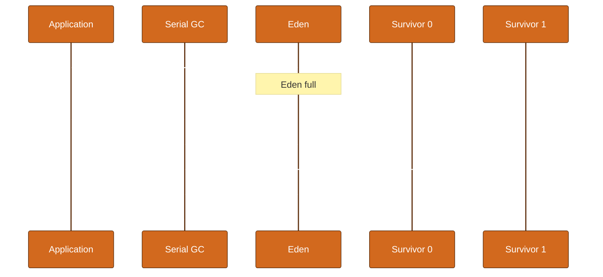

### D.2 G1 Young Evacuation (step by step)

1. **STW** — pause starts.
2. **Root scan** — scan GC roots + remembered sets (old→young refs).
3. **Evacuation** — copy live objects from collection set (all Eden + survivor regions + optional old) to empty regions.
4. **Update pointers** — fix references to moved objects.
5. **Free regions** — empty regions added to free list.
6. **STW end** — pause duration logged.

**Collection set (CSet):** set of regions chosen for this GC event.

### D.3 G1 Concurrent Marking Cycle

1. **Initial mark** (STW, often piggyback on young GC) — mark roots.
2. **Concurrent mark** — traverse object graph concurrently with app.
3. **Remark** (STW) — finish marking after SATB buffer drained.
4. **Cleanup** (partial STW) — count live data per region, identify empty regions.
5. **Mixed GCs** — evacuate young + garbage-heavy old regions.

### D.4 ZGC Concurrent Cycle (simplified)

1. **Pause Mark Start** — short STW, mark roots.
2. **Concurrent Mark** — trace live objects.
3. **Pause Mark End** — short STW, finalize mark.
4. **Concurrent Process References** — handle Soft/Weak/Phantom.
5. **Concurrent Relocate** — move objects, fix pointers via load barriers.
6. **Pause Relocate Start** — short STW, setup relocation set.

**Key insight:** Most work is concurrent; pauses don't scale linearly with heap size.


## Appendix E: Additional GC Log Worked Examples

#### E.1 Normal startup sequence

```text
[info][gc,heap] Heap region size: 1M
[info][gc] Using G1
[info][gc] GC(0) Pause Young (Normal) (G1 Evacuation Pause) 25M->5M(512M) 3.1ms
```

**Interpretation:** First young GC after warmup allocations. Small pause — healthy JVM startup.

#### E.2 Increasing pause times (warning sign)

```text
[info][gc] GC(100) Pause Young (Normal) 450M->200M(512M) 45.0ms
[info][gc] GC(101) Pause Young (Normal) 480M->220M(512M) 62.0ms
[info][gc] GC(102) Pause Young (Normal) 500M->240M(512M) 85.0ms
```

**Interpretation:** Pauses growing while live set grows. Approaching heap limit — increase -Xmx or reduce retention.

#### E.3 Successful mixed GC after concurrent cycle

```text
[info][gc] GC(50) Concurrent Cycle
[info][gc] GC(50) Pause Remark 4.5ms
[info][gc] GC(51) Pause Young (Mixed) 380M->150M(1024M) 35.0ms
[info][gc] GC(52) Pause Young (Mixed) 320M->120M(1024M) 28.0ms
```

**Interpretation:** Mixed GCs reclaiming old regions after concurrent mark. Pauses within typical G1 SLA.

#### E.4 ZGC generational young collection (JDK 21+)

```text
[info][gc] GC(20) Garbage Collection (Warmup) 512M(20%) -> 128M(5%)
[info][gc] GC(20) Pause Mark Start 0.008ms
[info][gc] GC(20) Concurrent Mark 12.500ms
[info][gc] GC(20) Pause Mark End 0.015ms
```

**Interpretation:** ZGC concurrent mark dominated by concurrent time, not pauses. Check pause lines separately.

#### E.5 Full GC after metaspace pressure

```text
[info][gc,metaspace] Metaspace: 250M->248M(256M)
[info][gc] GC(88) Pause Full (Metadata GC Threshold) 400M->380M(512M) 890.0ms
[warn][gc,metaspace] Metaspace allocation request exceeds threshold
```

**Interpretation:** Metaspace near cap triggered full GC. Increase MaxMetaspaceSize or fix class leak.

#### E.6 Parallel GC throughput pattern

```text
[info][gc] GC(15) Pause Young (Allocation Failure) 400M->50M(512M) 25.0ms
[info][gc] GC(16) Pause Young (Allocation Failure) 410M->55M(512M) 26.0ms
```

**Interpretation:** Parallel collector young GC on allocation failure. Regular 25ms pauses — tune if SLA requires lower.

#### E.7 G1 concurrent mark aborted

```text
[info][gc] GC(40) Concurrent Cycle
[info][gc] GC(41) Pause Young (Normal) (G1 Evacuation Pause) 900M->400M(1024M) 120.0ms
[info][gc] GC(41) Concurrent Mark Abort
```

**Interpretation:** Concurrent cycle aborted — often because heap filled before mark completed. Lower IHOP or increase heap.

#### E.8 Humongous region allocation

```text
[info][gc] GC(22) Pause Young (Concurrent Start) (G1 Humongous Allocation) 600M->580M(1024M) 18.0ms
[info][gc,heap] Humongous regions: 12 -> 14
```

**Interpretation:** Large byte arrays or collections triggered humongous handling. Count increased — review large object allocations.

#### E.9 Safepoint sync issue

```text
[info][safepoint] Safepoint "Cleanup", Time since last: 1000 ms, Reaching safepoint: 150.0 ms, At safepoint: 2.0 ms
```

**Interpretation:** 150ms to reach safepoint — one thread slow to poll (long loop, JNI, blocked I/O without safepoint).

#### E.10 GC time ratio exceeded

```text
[info][gc] GC(200) Pause Full (Ergonomics) 508M->505M(512M) 800.0ms
[error][gc] GC overhead limit exceeded
```

**Interpretation:** JVM spent >98% time in GC with <2% heap reclaimed. Heap far too small or severe leak.


## Appendix F: Hands-On Labs

### Lab 1: Observe class loaders

**Task:** Write LoaderDemo printing class loader for String, JDBC driver, and your class. Explain null loader.

**Expected:** String → null (bootstrap). Your class → AppClassLoader.

### Lab 2: StackOverflowError

**Task:** Run infinite recursion with -Xss256k vs -Xss2m. Note depth difference.

**Expected:** Smaller stack → earlier StackOverflowError.

### Lab 3: GC logging comparison

**Task:** Run same app with -Xlog:gc* and trigger 1000 object allocations/sec. Count young GCs/minute.

**Expected:** Higher allocation rate → more frequent young GC.

### Lab 4: Heap OOM

**Task:** Run MemoryLeakDemo with -Xmx128m -Xlog:gc. Capture log before OOM.

**Expected:** Observe heap climbing, Full GC failing to reclaim enough.

### Lab 5: jstat live

**Task:** Start Spring Boot app; run jstat -gcutil <pid> 1000. Watch E, O, M columns.

**Expected:** E spikes then drops at young GC. O grows slowly with long-lived objects.

### Lab 6: Thread dump

**Task:** Create deadlock with two locks. jstack and find 'Found Java-level deadlock'.

**Expected:** jstack identifies cycle and lock owners.

### Lab 7: Heap histogram

**Task:** jmap -histo:live <pid> | head -20. Identify top consuming classes.

**Expected:** Often char[], byte[], String, domain objects.

### Lab 8: JFR recording

**Task:** jcmd <pid> JFR.start duration=60s filename=app.jfr. Open in JDK Mission Control.

**Expected:** Inspect allocation and GC event timelines.

### Lab 9: Virtual threads

**Task:** JDK 21: 100k virtual threads sleeping 1s. Compare to platform thread attempt.

**Expected:** Virtual threads complete; platform thread version may fail or exhaust memory.

### Lab 10: Collector comparison

**Task:** Same workload: -XX:+UseG1GC vs -XX:+UseZGC. Compare p99 latency and GC log pauses.

**Expected:** ZGC typically lower pauses; G1 may have higher throughput on some workloads.


## Appendix G: Java Code Examples Library

```java
// WeakHashMap — keys collected when no strong refs remain
import java.util.*;

public class WeakHashMapDemo {
    public static void main(String[] args) throws InterruptedException {
        Map<Object, String> cache = new WeakHashMap<>();
        Object key = new Object();
        cache.put(key, "value");
        System.out.println("Size: " + cache.size());
        key = null;
        System.gc();
        Thread.sleep(100);
        System.out.println("After GC: " + cache.size()); // often 0
    }
}

```

```java
// Class loader leak anti-pattern ( servlet containers avoid this )
public class ClassLoaderLeakPattern {
    private static final List<ClassLoader> LEAK = new ArrayList<>();

    static class LeakLoader extends ClassLoader {
        LeakLoader() { super(LeakLoader.class.getClassLoader()); }
    }

    public static void main(String[] args) {
        for (int i = 0; i < 1000; i++) {
            ClassLoader cl = new LeakLoader();
            LEAK.add(cl); // prevents loader + all its classes from being collected
        }
        // Metaspace grows until MaxMetaspaceSize OOM
    }
}

```

```java
// volatile vs atomic — visibility vs atomicity
import java.util.concurrent.atomic.AtomicInteger;

public class CounterComparison {
    private volatile int volatileCounter = 0;
    private final AtomicInteger atomicCounter = new AtomicInteger(0);

    void incrementVolatile() {
        volatileCounter++; // NOT atomic — lost updates possible
    }

    void incrementAtomic() {
        atomicCounter.incrementAndGet(); // atomic
    }
}

```

```java
// Virtual thread friendly: use ReentrantLock instead of synchronized in hot paths
import java.util.concurrent.locks.ReentrantLock;

public class VirtualThreadLocking {
    private final ReentrantLock lock = new ReentrantLock();

    void doWork() {
        lock.lock();
        try {
            // I/O here won't pin carrier as badly as synchronized in some JDK versions
        } finally {
            lock.unlock();
        }
    }
}

```

```bash
# Production diagnostic one-liner bundle
PID=$(pgrep -f 'my-app.jar')
jcmd $PID VM.flags
jcmd $PID GC.heap_info
jstat -gcutil $PID 1000 5
jcmd $PID Thread.print > /tmp/threads-$(date +%s).txt

```


## Appendix H: JDK Version Migration Notes

| JDK | JVM changes relevant to this guide |
|-----|-------------------------------------|
| 8 | PermGen removed → Metaspace; Lambda invokedynamic; default Parallel GC |
| 9 | G1 default (eventually); module system; unified logging preview |
| 11 | ZGC experimental; removed Java EE modules from JDK |
| 14 | CMS removed |
| 17 | LTS; ZGC production; unified logging standard |
| 21 | LTS; virtual threads; generational ZGC default |
| 22+ | Continued ZGC/G1 improvements; monitor release notes |

When upgrading Spring Boot across JDK versions, re-validate:

- GC defaults (may change pause profile)
- `--add-opens` requirements for reflection
- Metaspace footprint (more modules, more classes)
- Virtual thread compatibility with libraries using synchronized


## Appendix I: Principal-Level Decision Framework

Use this checklist in architecture reviews:

### Heap sizing decision tree

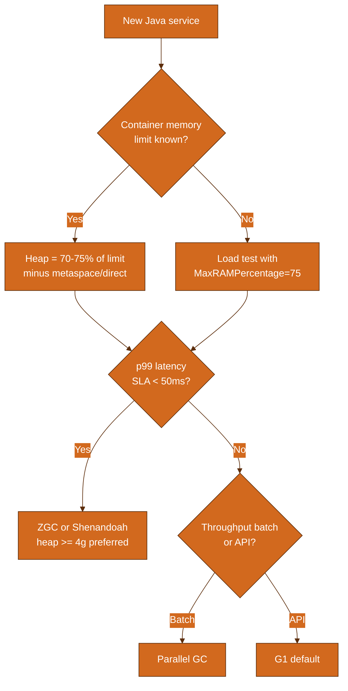

### Questions to ask before changing GC flags

1. What is the **live set** size after 24h steady state?
2. What is **allocation rate** (MB/s) under peak traffic?
3. Are pauses **STW** or **concurrent** dominated in logs?
4. Is the problem **heap**, **metaspace**, **direct memory**, or **threads**?
5. Did we compare **before/after** with JFR, not just gut feel?

### Red flags in production JVM metrics

| Metric | Warning | Action |
|--------|---------|--------|
| Old gen % | > 80% sustained | Heap increase or leak analysis |
| Metaspace | Steady climb over days | Class loader leak |
| GC pause p99 | > SLA | Change collector or tune IHOP |
| Full GC count | > 0/hour on G1/ZGC | Investigate immediately |
| Thread count | Unbounded growth | Pool leak or missing shutdown |
| CPU on GC threads | > 20% sustained | Allocation rate or heap too small |


### 6.16 Remembered Sets and Write Barriers

Minor GC must find **all live young objects**. Roots include:

- Thread stacks (always scanned)
- **Old gen objects pointing to young** — found via remembered set

When application stores a young reference into an old object:

```
oldObject.field = youngObject;  // triggers write barrier
```

Write barrier **marks the card** (512-byte heap chunk) in card table. Minor GC scans dirty cards instead of entire old gen.


### 6.17 TLAB Deep Dive

**Thread-Local Allocation Buffer (TLAB)** — each thread gets a small Eden slice:

- **Fast path:** bump pointer in TLAB (no lock)
- **Slow path:** TLAB full → refill from Eden (brief lock) or young GC

Flags:

- `-XX:UseTLAB` (default true)
- `-XX:TLABSize` — manual size (usually auto-tuned)
- `-XX:ResizeTLAB` — dynamic resizing

JFR event `jdk.ObjectAllocationInNewTLAB` shows allocation hotspots per thread.


### 6.18 GC Tuning Methodology

### Step-by-step production tuning

1. **Baseline** — enable GC logs, JFR profile, Micrometer metrics.
2. **Measure** — live set, allocation rate, pause percentiles, GC time %.
3. **Hypothesize** — heap too small? leak? humongous objects? IHOP wrong?
4. **Change one knob** — never change `-Xmx` and collector simultaneously.
5. **Compare** — same load test, same time window.
6. **Document** — record flags in runbook (Part 13 cheat sheet).

### Load testing checklist

- Warm up 10–15 minutes before measuring (JIT + caches)
- Run at **peak** and **2x peak** allocation rate
- Include **soak test** (24h) for metaspace and leak detection
- Capture heap dump at plateau, not during ramp-up


### 6.19 Comparing G1 vs ZGC vs Parallel (decision matrix)

| Criterion | G1 | ZGC | Parallel |
| --- | --- | --- | --- |
| Default JDK 21 | Yes (non-generational ZGC optional) | Available | No |
| Typical pause target | 10-200ms | <1ms STW phases | 100ms-seconds |
| Heap size sweet spot | 2-32GB | 8GB-unlimited | 2-16GB |
| Throughput | High | Good (improving) | Highest |
| Tuning complexity | Moderate | Low | Low |
| Humongous object handling | Special regions | Medium pages | Standard |
| Spring Boot default choice | Yes | If latency SLA strict | Batch only |


## Part 12 (continued): Additional Interview Questions

### Q52. What is a write barrier?

**Answer:** Code executed on reference stores to maintain remembered sets or concurrent GC invariants.

### Q53. Card table purpose?

**Answer:** Coarse-grained map of old gen; dirty cards scanned during minor GC.

### Q54. SATB in G1?

**Answer:** Snapshot-at-the-beginning: concurrent mark sees objects live at mark start.

### Q55. What triggers young GC?

**Answer:** Eden full, TLAB refill failure, explicit System.gc (if enabled), metaspace pressure on some collectors.

### Q56. Can GC collect circular references?

**Answer:** Yes — Java uses reachability from roots, not reference counting.

### Q57. System.gc() in production?

**Answer:** Avoid; may trigger full STW GC. Some libs call it (RMI, NIO). -XX:+DisableExplicitGC has trade-offs.

### Q58. What is heap fragmentation?

**Answer:** Free space split into small non-contiguous holes; compacting GC fixes it.

### Q59. Parallel Old collector?

**Answer:** Multithreaded mark-sweep-compact for old gen; pairs with Parallel Scavenge.

### Q60. Default collector JDK 8 vs 11 vs 21?

**Answer:** 8: Parallel; 11: G1; 21: G1 (ZGC optional, generational ZGC available).

### Q61. JVM vs ART (Android)?

**Answer:** Both run bytecode; ART AOT/JIT different pipeline — out of scope but similar concepts.

### Q62. What is AOT (GraalVM)?

**Answer:** Ahead-of-time native image; no traditional HotSpot GC at runtime in native mode.

### Q63. Compressed oops?

**Answer:** 32-bit references in 64-bit JVM when heap < ~32GB; saves memory.

### Q64. Compressed class pointers?

**Answer:** Similar compression for class metadata pointers.

### Q65. Large pages (-XX:+UseLargePages)?

**Answer:** OS huge pages reduce TLB misses; ops complexity in containers.

### Q66. AlwaysPreTouch?

**Answer:** -XX:+AlwaysPreTouch maps and zeros heap at start; slower startup, fewer runtime page faults.

### Q67. What does jcmd VM.native_memory show?

**Answer:** NMT breakdown: Java heap, metaspace, code, thread stacks, GC, internal.

### Q68. Difference jmap -histo vs dump?

**Answer:** histo: class counts; dump: full object graph for MAT analysis.

### Q69. MAT 'Leak Suspects' report?

**Answer:** Heuristic report pointing to probable leak paths from dominators.

### Q70. What is retained size?

**Answer:** Memory freed if object collected including exclusive descendants.

### Q71. Shallow size?

**Answer:** Memory of object itself excluding referenced objects.

### Q72. GC cause 'Allocation Failure'?

**Answer:** Allocator could not satisfy request — triggered GC to reclaim.

### Q73. GC cause 'G1 Evacuation Pause'?

**Answer:** Normal G1 young/mixed evacuation STW phase.

### Q74. GC cause 'Metadata GC Threshold'?

**Answer:** Metaspace usage crossed threshold — triggered GC.

### Q75. What is JIT inline threshold?

**Answer:** Method size/hotness controlling inlining; -XX:MaxInlineSize etc.

### Q76. Monomorphic vs megamorphic?

**Answer:** 1 impl vs many at call site; megamorphic prevents inlining.

### Q77. Why String concatenation slow in loops?

**Answer:** Creates many intermediate String objects; use StringBuilder.

### Q78. Autoboxing GC impact?

**Answer:** Primitive → Integer creates heap objects; prefer primitives in hot loops.

### Q79. Thread pool sizing vs CPU?

**Answer:** CPU-bound: ~cores; I/O-bound: higher; virtual threads: thousands.

### Q80. ForkJoinPool common pool?

**Answer:** Shared pool for parallel streams; configurable parallelism.

### Q81. What is STW safepoint bias?

**Answer:** Long non-counted loops or JNI may delay safepoint — 'long pause to safepoint'.

### Q82. JDWP impact?

**Answer:** Debugger attachment disables optimizations; never in production hot paths.

### Q83. Flight Recorder overhead?

**Answer:** Default profile ~1-2%; production-safe with proper settings.

### Q84. Micrometer vs JFR?

**Answer:** Micrometer: aggregated app metrics export; JFR: deep JVM event trace.

### Q85. Kubernetes OOMKilled vs Java OOM?

**Answer:** K8s kills container exceeding limit; Java OOM is JVM heap/metaspace — different signals.

### Q86. Should heap equal container limit?

**Answer:** No — leave 25-30% for native, metaspace, stacks, direct.

### Q87. ActiveProcessorCount in K8s?

**Answer:** Set if CPU limits cause JVM to detect wrong core count.

### Q88. Spring DevTools classloader?

**Answer:** RestartClassLoader — development only; metaspace churn.

### Q89. Hibernate metaspace usage?

**Answer:** Many entity classes, reflection, bytecode enhancement — monitor metaspace.

### Q90. CGLIB vs JDK proxy?

**Answer:** CGLIB subclasses create extra classes — metaspace impact in large apps.

### Q91. What is class data sharing (CDS)?

**Answer:** Shared archive of class metadata — faster startup (-Xshare:on).

### Q92. Shenandoah vs ZGC difference?

**Answer:** Both low-latency concurrent; different barrier and relocation algorithms — benchmark both.

### Q93. Generational ZGC benefit?

**Answer:** Separates young/old like G1 — better throughput on many workloads JDK 21+.

### Q94. When is Serial GC still valid?

**Answer:** Single-core containers, CI tests, extremely small heaps.

### Q95. What is GC ergonomics?

**Answer:** JVM auto-selects heap layout and GC threads based on hardware and flags.


## Part 2 (Extended): Class Loading Deep Dive

### 2.1 Loading, Linking, Initialization in Detail

The JVM specification defines five phases from bytes to usable class:

| Phase | What happens | Developer-visible? |
|-------|--------------|-------------------|
| Loading | Read `.class`, create `Class` runtime representation | `ClassNotFoundException` |
| Linking — Verify | Bytecode safety checks (stack depth, type safety) | `VerifyError` |
| Linking — Prepare | Allocate static fields, default values (0, null) | Rare errors |
| Linking — Resolve | Resolve constant pool symbolic refs (often lazy) | `IncompatibleClassChangeError` |
| Initialization | Run `<clinit>` static blocks | `ExceptionInInitializerError` |

**Important:** Initialization is **lazy** and **single-threaded per class** (class init lock).

```java
public class InitOrder {
    static {
        System.out.println("InitOrder static block");
    }
    static int x = sideEffect();

    static int sideEffect() {
        System.out.println("static field initializer");
        return 42;
    }
}
// Output order: static block order in source — field init interleaved top-to-bottom
```

### 2.2 When is a class initialized?

A class is initialized when:

1. `new` instance created
2. Static method invoked on class
3. Static field accessed (except compile-time constant)
4. `Class.forName(..., true, loader)` with initialize=true
5. Subclass initialized → superclass initialized first
6. JVM entry point class (main)

**Not initialized** by: accessing compile-time constant (`static final` literal known at compile time).

```java
public class Constants {
    static final int COMPILE_TIME = 1 + 2; // inlining — no class init required to read
    static final Integer RUNTIME = Integer.valueOf(3); // requires class init
}
```

### 2.3 Custom ClassLoader — complete example

```java
import java.nio.file.*;
import java.util.*;

public class FileSystemClassLoader extends ClassLoader {
    private final Path classDirectory;

    public FileSystemClassLoader(Path classDirectory, ClassLoader parent) {
        super(parent);
        this.classDirectory = classDirectory;
    }

    @Override
    protected Class<?> findClass(String name) throws ClassNotFoundException {
        try {
            String relative = name.replace('.', '/') + ".class";
            byte[] bytes = Files.readAllBytes(classDirectory.resolve(relative));
            return defineClass(name, bytes, 0, bytes.length);
        } catch (Exception e) {
            throw new ClassNotFoundException(name, e);
        }
    }
}
```

**Security note:** Never load untrusted bytecode without SecurityManager / module restrictions (SecurityManager deprecated JDK 17, removed 24 — use module boundaries and validation).

### 2.4 Tomcat WebAppClassLoader (production pattern)

Servlet containers use **per-application class loaders**:

```
Bootstrap
  └── Platform
        └── System (Catalina)
              └── WebAppClassLoader (app1.war)
              └── WebAppClassLoader (app2.war)
```

- Each WAR isolated — same class name in two apps = two different classes.
- **Shared lib** JARs loaded higher in tree to deduplicate (e.g. JDBC driver once).
- Redeploy without restart: old WebAppClassLoader must be **collectible** — common leak source if threads hold references.

### 2.5 ServiceLoader (SPI) end-to-end

File: `META-INF/services/com.example.Plugin`

```
com.example.impl.PluginImpl
```

```java
ServiceLoader<Plugin> loader = ServiceLoader.load(Plugin.class);
for (Plugin p : loader) {
    p.execute();
}
```

**Class loader used:** Thread context class loader at `ServiceLoader.load` time.

Spring Boot auto-configuration uses similar `spring.factories` / `AutoConfiguration.imports` mechanisms with sophisticated scanning.

### 2.6 JPMS (Java Platform Module System) essentials

```
module com.example.app {
    requires java.sql;
    requires transitive com.example.api;
    exports com.example.api to com.example.client;
    opens com.example.internal to org.hibernate.orm.core;
}
```

| Keyword | Meaning |
|---------|---------|
| `requires` | Depends on module |
| `exports` | Public API packages |
| `opens` | Deep reflection allowed (Hibernate, Jackson) |
| `provides ... with` | SPI registration |

Run with classpath (unnamed module) vs module-path changes class loading graph. Most Spring Boot apps still use classpath fat JAR (unnamed module).


## Part 3 (Extended): Runtime Data Areas Deep Dive

### 3.1 Heap generational layout (detailed)

Typical G1 / generational layout:

```
┌──────────────────────────────────────────────────────────────┐
│                         Java Heap                             │
│  ┌──────────────────────── Young Gen ──────────────────────┐ │
│  │  Eden (80%)  │ Survivor 0 (10%) │ Survivor 1 (10%)     │ │
│  └──────────────────────────────────────────────────────────┘ │
│  ┌────────────────────── Old Gen (Tenured) ────────────────┐ │
│  │  Long-lived objects, promoted survivors, large arrays    │ │
│  └──────────────────────────────────────────────────────────┘ │
└──────────────────────────────────────────────────────────────┘
```

**Survivor ratio 8** (default `-XX:SurvivorRatio=8`): Eden : one survivor = 8:1. Two survivors → Eden ≈ 80% of young gen.

### 3.2 Stack frame anatomy

Each method invocation creates a frame:

```
┌─────────────────────────────────────┐
│ Local Variable Array                 │
│  slot 0: this (instance methods)     │
│  slot 1: arg1                        │
│  slot 2: local var                   │
├─────────────────────────────────────┤
│ Operand Stack (for bytecode eval)    │
│  [ ... push/pop values ]           │
├─────────────────────────────────────┤
│ Constant pool reference for method   │
│ Dynamic linking / return address     │
└─────────────────────────────────────┘
```

```java
public int add(int a, int b) {
    return a + b;
}
// javap shows: iload_1, iload_2, iadd, ireturn
// Frame holds a,b in locals; iadd pops two ints, pushes sum on operand stack
```

### 3.3 Metaspace vs heap — what lives where

| Artifact | Location |
|----------|----------|
| `new String("hello")` char data (JDK 9+ compact strings: byte[]) | **Heap** |
| `String` class structure, methods | **Metaspace** |
| `static final Map` on class | Reference on **Heap**; static field metadata in **Metaspace** |
| JIT compiled code | **Code cache** (native, off-heap) |
| `ByteBuffer.allocateDirect` | **Native/direct** |

### 3.4 Native Memory Tracking (NMT) categories

Enable: `-XX:NativeMemoryTracking=summary` (restart required)

```
jcmd <pid> VM.native_memory summary
```

| Category | Contains |
|----------|----------|
| Java Heap | -Xmx committed |
| Class | Metaspace, class space |
| Thread | Thread stacks |
| Code | JIT code cache |
| GC | GC data structures |
| Internal | JVM internal allocations |
| Other | Unknown native |

Use when: RSS >> heap + metaspace → native leak (Netty direct buffers, JNI).

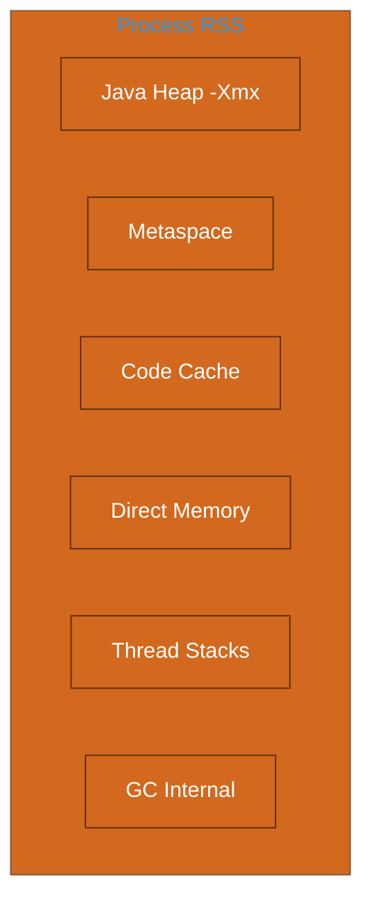


## Part 4 (Extended): Object Layout and Internals

### 4.1 HotSpot object header (64-bit, compressed oops)

| Component | Size (typical) | Notes |
|-----------|----------------|-------|
| Mark word | 8 bytes | Hash, age (4 bits in G1), lock state |
| Klass pointer | 4 bytes | With compressed class pointers |
| Array length | 4 bytes | If array |
| Instance fields | sum(fields) | References 4 bytes compressed |
| Padding | 0–7 bytes | Align to 8-byte boundary |

**Minimum object size:** often 16 bytes (header only, no fields).

### 4.2 Array layout

```java
int[] arr = new int[10];   // header + 4 length + 10*4 = 48 bytes + padding
Object[] refs = new Object[10]; // header + 10 references (4 bytes each compressed)
```

Multi-dimensional arrays are array of references:

```java
int[][] matrix = new int[100][100];
// matrix ref → array of 100 refs, each → int[100]
```

### 4.3 String internals (JDK 9+)

- Backing storage: `byte[]` (compact strings — Latin1 or UTF-16 flag in coder field)
- `String.intern()` puts reference in string pool (heap, not permgen since JDK 7)
- Concatenation via `invokedynamic` + `StringBuilder` bootstrap (JDK 9+)

### 4.4 Boxing and cache pools

```java
Integer a = 127;
Integer b = 127;
System.out.println(a == b); // true — cache -128 to 127

Integer c = 128;
Integer d = 128;
System.out.println(c == d); // false — distinct heap objects
```

Autoboxing in hot loops creates GC pressure — use primitives.

### 4.5 Identity hash code

Default `Object.hashCode()` often derived from mark word (unless lock bits interfere). Not guaranteed stable across GC moves in all JVM versions for all objects — don't persist hash codes of movable objects as external keys without `equals` contract awareness.


## Part 5 (Extended): Bytecode Walkthrough

### 5.1 Complete method disassembly example

Source:

```java
public class BytecodeDemo {
    public int multiply(int x, int y) {
        return x * y;
    }
}
```

`javap -c -v BytecodeDemo`:

```
public int multiply(int, int);
  Code:
   0: iload_1        // push x from local 1
   1: iload_2        // push y from local 2
   2: imul           // multiply, push result
   3: ireturn        // return int from stack top
  stack=2, locals=3, args_size=3
```

Locals: slot 0 = `this`, slot 1 = `x`, slot 2 = `y`.

### 5.2 Control flow — if-else bytecode

```java
public int max(int a, int b) {
    if (a > b) return a;
    return b;
}
```

Pattern: `iload`, `iload`, `if_icmple` branch to else, `iload`, `ireturn`, else label, `iload`, `ireturn`.

### 5.3 Lambda and invokedynamic

```java
List<String> names = List.of("a", "b");
names.forEach(s -> System.out.println(s));
```

Lambda body compiled to private synthetic method; `invokedynamic` binds `Consumer` at runtime via **LambdaMetafactory**. First call links; subsequent calls use linked call site (monomorphic inline friendly).

### 5.4 JIT compilation tiers (detailed)

| Level | Engine | When |
|-------|--------|------|
| 0 | Interpreter | Cold code |
| 1 | C1 with full optimization | Warm |
| 2 | C1 with invocation counters | Warmer |
| 3 | C1 (profile gathering for C2) | Hot |
| 4 | C2 | Hottest methods |

`-XX:CompileThreshold` (deprecated naming) — invocation count triggers compile. BackEdgeThreshold for OSR loops.

### 5.5 Inlining decisions

C2 inlines small hot methods aggressively:

```java
public int square(int x) { return x * x; }

public int sumOfSquares(int[] arr) {
    int sum = 0;
    for (int v : arr) sum += square(v); // square may inline into loop
    return sum;
}
```

Too large methods, virtual calls with many targets, or `-XX:-UseInline` disable → no inline → call overhead remains.


## Part 6 (Extended): Collector Internals

### 6.20 Serial GC — Full Reference

**Algorithm:** Mark-copy (young), mark-sweep-compact (old).

**Threads:** 1 GC thread always.

**Pause model:** Full STW for both generations.

**When appropriate:**
- `-Xmx128m` microservice on 1 CPU Kubernetes limit
- Integration tests in CI
- Client-side embedded JVM

**Flags:**
```
-XX:+UseSerialGC
-XX:NewRatio=2
```

**Avoid when:** Multiple CPU cores available and latency-sensitive API traffic.

### 6.20 Parallel GC — Full Reference

**Algorithm:** Parallel Scavenge (young, copying) + Parallel Old (old, compacting).

**Threads:** `-XX:ParallelGCThreads` (default ≈ CPU count).

**Pause model:** STW but parallelized — pause time ≈ serial_time / threads (roughly).

**Throughput:** Highest on batch workloads — minimal concurrent overhead.

**Adaptive sizing:** `-XX:+UseAdaptiveSizePolicy` (default) adjusts young/old ratio.

**When appropriate:**
- Spark executors, ETL, report generation
- Services with 500ms+ acceptable pause

**Tuning example:**
```
-XX:+UseParallelGC
-XX:ParallelGCThreads=8
-XX:MaxGCPauseMillis=500
-XX:GCTimeRatio=19
```

### 6.20 G1 GC — Full Reference

**Algorithm:** Region-based generational collector with concurrent marking.

**Region size:** `-XX:G1HeapRegionSize=n` where n is power of 2 from 1MB to 32MB.

**Young GC:** Stop-the-world evacuation of all Eden + survivor regions.

**Concurrent cycle:** Initial mark → concurrent mark → remark → cleanup.

**Mixed GC:** Evacuate young + subset of old regions sorted by garbage percentage.

**Humongous objects:** > 50% region size; can cause fragmentation and special GC triggers.

**IHOP tuning:** If full GC occurs, lower `-XX:InitiatingHeapOccupancyPercent` from 45 to 35.

**String deduplication:** `-XX:+UseStringDeduplication` — beneficial for JSON-heavy APIs.

**Production template:**
```
-XX:+UseG1GC
-XX:MaxGCPauseMillis=200
-XX:G1HeapRegionSize=16m
-XX:InitiatingHeapOccupancyPercent=40
-XX:+ParallelRefProcEnabled
```

### 6.20 ZGC — Full Reference

**Algorithm:** Region-based, concurrent marking, concurrent relocation, colored pointers.

**Generational (JDK 21+):** `-XX:+ZGenerational` — young collections similar to other generational GCs.

**Pause sources:** Root scanning (thread stacks, JNI), not proportional to heap size.

**Memory overhead:** Requires headroom for relocation — don't size heap to 100% of limit.

**SoftMaxHeapSize (JDK 21+):** JVM returns unused memory to OS gradually.

**When appropriate:**
- 8GB+ heap with p99 pause SLA under 10ms
- Large in-memory caches with variable size
- JDK 17+ LTS with ZGC production support

**Example:**
```
-XX:+UseZGC
-XX:+ZGenerational
-Xms4g -Xmx4g
-XX:SoftMaxHeapSize=3500m
```

### 6.20 Shenandoah — Full Reference

**Algorithm:** Brooks pointers — forwardings during concurrent compaction.

**Availability:** OpenJDK builds, Red Hat / Temurin distributions; verify vendor support.

**Similar niche to ZGC:** Low pause, concurrent compaction.

**`-XX:+ShenandoahGC`** on supported builds.

**Benchmark both** ZGC and Shenandoah on your hardware — winner is workload-dependent.

**Watch for:** Allocation pressure during concurrent phases; may need larger heap than G1 for same throughput.

### 6.20 CMS (Legacy) — Full Reference

**Status:** Removed JDK 14. Documented for legacy JDK 8 maintenance only.

**Phases:** Initial mark STW → concurrent mark → remark STW → concurrent sweep.

**Failure mode:** Concurrent mode failure → serial old gen full STW compact.

**Migration:** Move to G1 (minimal flag change) or ZGC (latency focus).

Do not tune CMS on new projects.


## Part 8 (Extended): JMM Patterns and Pitfalls

### 8.1 Double-checked locking (broken vs fixed)

**Broken (pre-JMM memory model or without volatile):**

```java
public class BrokenSingleton {
    private static BrokenSingleton instance;

    public static BrokenSingleton getInstance() {
        if (instance == null) {
            synchronized (BrokenSingleton.class) {
                if (instance == null) {
                    instance = new BrokenSingleton(); // reordering hazard
                }
            }
        }
        return instance;
    }
}
```

**Fixed — volatile:**

```java
private static volatile BrokenSingleton instance;
```

**Better — holder idiom or enum:**

```java
public enum Singleton {
    INSTANCE;
}
```

### 8.2 Producer-consumer happens-before

```java
// Queue synchronizes happens-before between put and take
BlockingQueue<Event> queue = new ArrayBlockingQueue<>(100);

// Thread A
queue.put(event);  // happens-before

// Thread B
Event e = queue.take();  // sees fully constructed event
```

### 8.3 volatile does not compose

```java
public class VolatileCounter {
    private volatile int count = 0;

    public void increment() {
        count++; // NOT atomic — still race
    }
}
```

Use `AtomicInteger` or `synchronized` for compound operations.

### 8.4 Virtual threads — structured concurrency (JDK 21+ preview patterns)

```java
try (var scope = new StructuredTaskScope.ShutdownOnFailure()) {
    Subtask<String> user = scope.fork(() -> fetchUser(id));
    Subtask<List<Order>> orders = scope.fork(() -> fetchOrders(id));
    scope.join();
    scope.throwIfFailed();
    return combine(user.get(), orders.get());
}
```

Virtual threads make blocking style efficient; structured scopes manage lifecycle.

### 8.5 Pinning scenarios to avoid

| Pattern | Issue |
|---------|-------|
| `synchronized` block + JDBC in virtual thread | May pin carrier (JDK 21 improving) |
| Native library call | Pins for duration |
| `Object.wait()` in synchronized | Pinning |

Prefer `ReentrantLock` + virtual threads for I/O-heavy critical sections when profiling shows pinning.


## Part 9 (Extended): Diagnostic Playbooks

### 9.1 High CPU playbook

1. `top -H -p <pid>` — identify hot OS thread id
2. Convert to hex → `jstack` find `nid=0x...`
3. If inconclusive → async-profiler `-e cpu`
4. Check if GC threads hot → allocation/GC tuning not code fix

### 9.2 High memory playbook

1. `jcmd <pid> GC.heap_info` — heap usage summary
2. `jmap -histo:live <pid>` — top classes (trigger full GC first with `:live`)
3. If leak suspected → heap dump `jmap -dump:live,format=b,file=heap.hprof <pid>`
4. MAT: Leak Suspects → Dominator Tree → compare two dumps (baseline vs leak)

### 9.3 Slow API playbook

1. Check GC logs for pause correlation with latency spikes
2. JFR: `jdk.GCPhasePause`, `jdk.MethodProfiling`
3. Trace DB/external calls (APM) — don't assume JVM first
4. Thread dump if thread pool exhausted

### 9.4 jcmd reference (extended)

| Command | Output |
|---------|--------|
| `jcmd <pid> help` | All commands |
| `jcmd <pid> VM.version` | JDK version |
| `jcmd <pid> VM.flags` | Effective flags |
| `jcmd <pid> VM.system_properties` | System properties |
| `jcmd <pid> GC.class_histogram` | Like jmap histo |
| `jcmd <pid> GC.heap_dump /tmp/h.hprof` | Live heap dump |
| `jcmd <pid> Thread.print` | Thread dump |
| `jcmd <pid> VM.classloader_stats` | Class loader stats |
| `jcmd <pid> JFR.start` | Start flight recording |
| `jcmd <pid> JFR.dump` | Dump active recording |

### 9.5 Reading jstack output

```
"pool-1-thread-3" #25 prio=5 os_prio=0 cpu=1234.56ms elapsed=3600s tid=0x... nid=0x1a80 waiting on condition  [0x00007f...]
   java.lang.Thread.State: WAITING (parking)
        at jdk.internal.misc.Unsafe.park
        at java.util.concurrent.locks.LockSupport.park
        at java.util.concurrent.LinkedBlockingQueue.take
```

| State | Meaning |
|-------|---------|
| RUNNABLE | Executing or ready (may be blocked on I/O in native) |
| WAITING | Waiting indefinitely (park, join) |
| TIMED_WAITING | wait(sleep, timeout) |
| BLOCKED | Waiting for monitor enter |


## Part 10 (Extended): Spring Boot JVM Profiles

| Profile | Heap | Metaspace | GC | Notes |
| --- | --- | --- | --- | --- |
| Small REST API (512Mi pod) | 256-320m heap | 128m metaspace | G1 | Low traffic, few beans |
| Standard microservice (1Gi) | 512m heap | 256m metaspace | G1 | Typical Spring Data REST |
| High-throughput API (2Gi) | 1.2g heap | 256m metaspace | G1 or ZGC | If p99 SLA strict use ZGC |
| Batch processor (4Gi) | 2.5g heap | 512m metaspace | Parallel | Chunk-oriented Spring Batch |
| GraphQL / large responses (2Gi) | 1g heap | 384m metaspace | G1 + dedup | Large JSON graphs |

### Spring Boot startup memory timeline

```
t=0s    JVM start, bootstrap classes loaded (metaspace ↑)
t=2s    Spring context refresh begins — scanning @Components (metaspace ↑↑)
t=5s    Hibernate/JPA entity metadata (metaspace ↑)
t=8s    CGLIB proxies for @Transactional services (metaspace ↑)
t=10s   Tomcat started, JIT warming (code cache ↑)
t=15s   Steady state — heap live set stabilizes
```

**Actuator metrics to watch:**

- `jvm.memory.used` (heap, non-heap)
- `jvm.gc.pause` (Micrometer timer from GC notifications)
- `jvm.threads.live`

### Connecting to Spring guide

See [Kenya Integrator Skills Master Guide — Spring Boot Must Own](KENYA-INTEGRATOR-SKILLS-MASTER-GUIDE.md) for application architecture. JVM tuning **complements** Spring practices:

| Spring concern | JVM tie-in |
|----------------|------------|
| `@Cacheable` Caffeine | Heap for cache entries — size caches explicitly |
| `@Async` thread pools | Platform threads = stacks; consider virtual threads JDK 21 |
| `@Transactional` CGLIB | Extra classes in metaspace |
| DevTools restart | Class loader leak risk — never in prod |
| Actuator `/heapdump` | Same as jmap — secure endpoint |


## Part 11 (Extended): Case Study Timelines

### Case 1 timeline: Memory leak (expanded)

| Time | Observation | Action |
|------|-------------|--------|
| Day 1 | Heap 60% steady | Baseline |
| Day 3 | Heap 75%, YGC frequent | Enable GC logs |
| Day 5 | Heap 90%, FGC hourly | jmap histo — cache dominates |
| Day 6 | OOM in prod | Heap dump from staging replica |
| Day 7 | Fix: Caffeine maxSize + TTL | Deploy, heap stable 45% |

### Case 2 timeline: G1 pause spikes

| Time | Observation | Action |
|------|-------------|--------|
| 10:00 | p99 200ms normal | — |
| 10:15 | Batch job starts | Correlate logs |
| 10:16 | Mixed GC 800ms | IHOP was 45, old gen 90% |
| Fix | IHOP=30, heap 2G→3G | Mixed pause 40ms |

### Case 3 timeline: Metaspace

| Time | Observation | Action |
|------|-------------|--------|
| Deploy v1 | Metaspace 120M | OK |
| Deploy v2 (no restart) | Metaspace 180M | Dynamic scripts? |
| Deploy v3 | Metaspace 240M | classloader_stats — 500 loaders |
| Fix | Restart policy + fix plugin unload | Stable 130M |


## Appendix J: Unified GC Logging Tag Reference

Unified logging uses `-Xlog:` tags. Combine with levels: `trace`, `debug`, `info`, `warning`, `error`.

| Tag | Content |
| --- | --- |
| gc | Summary GC events |
| gc,start | GC start marker |
| gc,heap | Heap layout changes |
| gc,phases | Individual GC phase timing |
| gc,age | Tenuring distribution |
| gc,region | G1 region level detail |
| gc,metaspace | Metaspace usage at GC |
| gc,stringdedup | String deduplication stats |
| safepoint | Safepoint begin/end/sync |
| suspension | Thread suspension for GC |


**Examples:**

```bash
# All GC info to rotating file
-Xlog:gc*,gc+heap=debug:file=gc.log:time,uptime,level,tags:filecount=10,filesize=50M

# Safepoint issues only
-Xlog:safepoint:stdout:time,level,tags

# G1 region detail (verbose)
-Xlog:gc+region=trace:file=regions.log:filecount=2,filesize=100M
```


## Appendix K: Practice Exam (Self-Test)

**1. Draw heap generations from memory.**

*Answer:* Eden, S0, S1, Old; arrows for minor GC copy and promotion.

**2. Name three GC roots.**

*Answer:* Stack locals, static fields, active threads (any three valid roots).

**3. G1 default region size formula?**

*Answer:* 1MB to 32MB power of 2; heuristic based on heap size.

**4. Difference Parallel vs G1?**

*Answer:* Parallel STW throughput; G1 region-based pause targets.

**5. Read: GC(10) Pause Young 512M->64M(1024M) 15ms**

*Answer:* Young GC, 512M live before, 64M after, 1G capacity, 15ms pause.

**6. Fix visibility bug without synchronized.**

*Answer:* volatile on shared flag or atomic/queue happens-before.

**7. Metaspace OOM first checks?**

*Answer:* MaxMetaspaceSize, classloader_stats, dynamic codegen.

**8. Container 1Gi limit, suggest heap.**

*Answer:* ~512-640m heap, 256m metaspace cap, rest native overhead.

**9. jstack vs JFR for deadlock?**

*Answer:* jstack immediate; JFR historical if event captured.

**10. When ZGC over G1?**

*Answer:* Strict latency SLA, large heap, JDK 17+ supported deployment.


## Appendix L: Diagram Index

| Location | Diagram |
| --- | --- |
| Part 1 | JVM three subsystems flowchart |
| Part 1 | Request lifecycle sequence |
| Part 2 | Class loading phases |
| Part 2 | Parent delegation flowchart |
| Part 3 | Runtime data areas |
| Part 6 | GC roots reachability |
| Part 6 | Generational layout |
| Part 6 | G1 regions |
| Part 6 | Remembered set write barrier |
| Part 8 | Virtual thread carriers |
| Appendix D | Serial young GC sequence |
| Appendix I | Heap sizing decision tree |
| Part 3 Extended | Process RSS breakdown |

---

## Appendix M: GC Log Line Parser Reference

Every token in a typical JDK 17+ G1 young GC log line:

```
[2024-03-15T10:23:45.123+0000][info][gc] GC(42) Pause Young (Normal) (G1 Evacuation Pause) 512M->128M(1024M) 12.345ms
```

| Token | Meaning |
|-------|---------|
| Timestamp | ISO-8601 wall clock |
| `[info]` | Log level |
| `[gc]` | Unified logging tag |
| `GC(42)` | 42nd GC event since JVM start |
| `Pause Young (Normal)` | Young generation evacuation, normal cause |
| `(G1 Evacuation Pause)` | Collector-specific name |
| `512M->128M` | Heap used before → after |
| `(1024M)` | Current heap capacity (not necessarily -Xmx until fully expanded) |
| `12.345ms` | Stop-the-world pause duration |

### Cause strings you will see

| Cause | Meaning |
|-------|---------|
| G1 Evacuation Pause | Normal G1 collection |
| G1 Humongous Allocation | Large object allocation triggered GC |
| Allocation Failure | Could not allocate — GC attempted reclaim |
| Metadata GC Threshold | Metaspace triggered collection |
| Ergonomics | JVM internal heuristic trigger |
| System.gc() | Explicit GC call (if not disabled) |
| GCLocker Initiated GC | JNI critical region GC coordination |

---

## Appendix N: Heap Dump Analysis with MAT (Step by Step)

1. **Acquire dump:** `-XX:+HeapDumpOnOutOfMemoryError` or `jcmd GC.heap_dump`.
2. **Open in Eclipse Memory Analyzer (MAT).**
3. **Leak Suspects Report** — automated hints (not gospel).
4. **Dominator Tree** — sort by retained heap; largest retained = best leak candidate.
5. **Path to GC Roots** — exclude weak/soft refs to see what's keeping object alive.
6. **Compare dumps** — baseline after startup vs after 24h soak; diff retained sets.

### Common leak dominators in Spring apps

| Class | Typical cause |
|-------|---------------|
| `ConcurrentHashMap$Node` | Unbounded cache map |
| `byte[]` | Large HTTP buffers, serialized sessions |
| `char[]` / `String` | String accumulation in logs or buffers |
| `java.util.LinkedList$Node` | Queue never drained |
| `org.hibernate.*` | Session not closed (secondary-level cache) |
| `com.example.dto.*` | Request context stored in singleton |

### Retained vs shallow worked example

```
ArrayList (shallow 24 bytes, retained 10MB)
  └── holds 100,000 User objects (each 100 bytes)
```

Shallow size of ArrayList is tiny; **retained** includes all exclusively held Users — that's what matters for leak detection.

---

## Appendix O: JVM Flags Quick Lookup (A-Z)

| Name | Flag | Purpose |
|------|------|---------|
| AlwaysPreTouch | `-XX:+AlwaysPreTouch` | Touch all heap pages at startup |
| ActiveProcessorCount | `-XX:ActiveProcessorCount=n` | Override detected CPU count |
| CICompilerCount | `-XX:CICompilerCount=n` | Number of JIT compiler threads |
| CompressedClassSpaceSize | `-XX:CompressedClassSpaceSize` | Max compressed class space |
| DisableExplicitGC | `-XX:+DisableExplicitGC` | Ignore System.gc() |
| ExitOnOutOfMemoryError | `-XX:+ExitOnOutOfMemoryError` | Exit on OOM |
| FlightRecorder | `-XX:+FlightRecorder` | Enable JFR |
| G1HeapRegionSize | `-XX:G1HeapRegionSize` | G1 region size |
| GCTimeRatio | `-XX:GCTimeRatio` | Throughput vs GC time (Parallel) |
| HeapDumpOnOutOfMemoryError | `-XX:+HeapDumpOnOutOfMemoryError` | Auto heap dump |
| HeapDumpPath | `-XX:HeapDumpPath` | Dump file location |
| InitialRAMPercentage | `-XX:InitialRAMPercentage` | Initial heap % in container |
| InitiatingHeapOccupancyPercent | `-XX:InitiatingHeapOccupancyPercent` | G1 IHOP |
| MaxDirectMemorySize | `-XX:MaxDirectMemorySize` | Cap direct buffers |
| MaxGCPauseMillis | `-XX:MaxGCPauseMillis` | Pause time goal |
| MaxMetaspaceSize | `-XX:MaxMetaspaceSize` | Metaspace cap |
| MaxRAMPercentage | `-XX:MaxRAMPercentage` | Max heap % in container |
| MaxTenuringThreshold | `-XX:MaxTenuringThreshold` | Age before old gen promotion |
| MetaspaceSize | `-XX:MetaspaceSize` | Initial metaspace threshold |
| NativeMemoryTracking | `-XX:NativeMemoryTracking` | Enable NMT |
| NewRatio | `-XX:NewRatio` | Old/young size ratio |
| OnOutOfMemoryError | `-XX:OnOutOfMemoryError` | Shell command on OOM |
| ParallelGCThreads | `-XX:ParallelGCThreads` | Parallel GC worker threads |
| ReservedCodeCacheSize | `-XX:ReservedCodeCacheSize` | JIT code cache max |
| SoftMaxHeapSize | `-XX:SoftMaxHeapSize` | ZGC soft max (JDK 21+) |
| SurvivorRatio | `-XX:SurvivorRatio` | Eden/survivor ratio |
| TieredStopAtLevel | `-XX:TieredStopAtLevel` | Max compilation tier |
| UseContainerSupport | `-XX:+UseContainerSupport` | CGroup-aware defaults |
| UseG1GC | `-XX:+UseG1GC` | Enable G1 |
| UseLargePages | `-XX:+UseLargePages` | OS huge pages |
| UseParallelGC | `-XX:+UseParallelGC` | Enable Parallel collector |
| UseSerialGC | `-XX:+UseSerialGC` | Enable Serial collector |
| UseStringDeduplication | `-XX:+UseStringDeduplication` | G1 string dedup |
| UseZGC | `-XX:+UseZGC` | Enable ZGC |
| ZGenerational | `-XX:+ZGenerational` | Generational ZGC (JDK 21+) |

---

## Appendix P: More GC Log Worked Examples (16-25)

#### 16. Young GC with to-space exhausted

```
[info][gc] GC(55) Pause Young (G1 Evacuation Pause) (to-space exhausted) 480M->470M(512M) 95.0ms
```

**Interpretation:** Evacuation failed — survivors + promotions exceeded available regions. Increase heap or decrease allocation burst.

#### 17. Remark pause after concurrent mark

```
[info][gc] GC(60) Pause Remark 5.2ms
```

**Interpretation:** Short STW remark after concurrent marking. If > 100ms, check reference processing (`-XX:+ParallelRefProcEnabled`).

#### 18. Cleanup phase

```
[info][gc] GC(60) Pause Cleanup 1.8ms
```

**Interpretation:** Identifies empty regions for reclamation. Normal part of G1 concurrent cycle.

#### 19. Concurrent cycle start piggybacked

```
[info][gc] GC(45) Pause Young (Concurrent Start) (G1 Evacuation Pause) 300M->80M(1024M) 20.0ms
```

**Interpretation:** Young GC that also starts concurrent marking cycle (initial mark). IHOP threshold reached.

#### 20. String deduplication

```
[info][gc,stringdedup] Concurrent String Deduplication 1024.5ms
```

**Interpretation:** Background dedup of String backing arrays. Check savings in detailed logs if enabled.

#### 21. Reference processing time

```
[info][gc,phases] GC(70) Pause Young: Ref Proc 45.0ms
```

**Interpretation:** Reference processing dominated pause — many SoftReference or FinalReference? Review reference usage.

#### 22. GC after System.gc()

```
[info][gc] GC(5) Pause Full (System.gc()) 200M->180M(512M) 300.0ms
```

**Interpretation:** Explicit GC — find caller (RMI, NIO, library). Consider `-XX:+DisableExplicitGC` if safe.

#### 23. Allocation stall

```
[info][gc] GC(33) Pause Young (Normal) 400M->100M(1024M) 5.0ms
[info][gc] Allocation Stall 120.0ms
```

**Interpretation:** Threads stalled waiting for GC to complete allocation — short pause but allocation stall hurts throughput.

#### 24. Region size in log

```
[info][gc,heap] Heap region size: 16M
```

**Interpretation:** Confirms G1 region size — humongous threshold is 8M (half of 16M).

#### 25. Full GC on ZGC (rare)

```
[info][gc] GC(999) Pause Full 4096M->4090M(4096M) 50.0ms
```

**Interpretation:** Full GC on ZGC should be rare — often external trigger or resource exhaustion. Investigate immediately.

---

## Appendix Q: Common Mistakes Checklist

| Mistake | Consequence / Fix |
|---------|-------------------|
| Setting -Xmx equal to container memory limit | Native OOMKilled — leave 25-30% headroom |
| Ignoring metaspace | Only tuning heap — metaspace OOM still kills process |
| Changing multiple JVM flags at once | Cannot attribute improvement — change one at a time |
| Using CMS on JDK 17+ | Removed — use G1 or ZGC |
| Assuming MaxGCPauseMillis is guaranteed | It's a hint — measure actual p99 pauses |
| Heap dump in production without disk space check | Dump equals heap size — can fill disk |
| Synchronized blocks in virtual thread hot paths | Pinning reduces scalability |
| Trusting jmap -histo without :live | Includes garbage objects — misleading counts |
| No GC logs in production | Flying blind during incidents |
| Skipping warm-up in benchmarks | Misleading JIT and GC behavior |

---

## Appendix R: Senior Staff Discussion Topics

These topics separate principal-level JVM discussions from mid-level:

### When to move off G1

Consider ZGC or Shenandoah when **all** of the following hold:

- Heap >= 8GB with strict p99 pause SLA (< 20ms)
- GC logs show G1 mixed pauses exceeding SLA regularly after tuning IHOP and region size
- Allocation rate is moderate (extreme allocation may favor throughput collectors)
- Team can operate JDK 17+ LTS with vendor support for chosen collector

### JVM as platform decision

Staff engineers document JVM choices in **Architecture Decision Records (ADRs)**:

```markdown
## ADR: GC Selection for Payment API

- Context: 2Gi pods, p99 50ms SLA, JDK 21
- Decision: G1 with MaxGCPauseMillis=100
- Alternatives considered: ZGC (higher native overhead in testing)
- Evidence: Load test JFR — G1 p99 pause 35ms, ZGC 8ms but 8% throughput loss
- Review date: 2026-Q3
```

### Multi-tenant JVM considerations

Shared JVM processes (rare in cloud-native microservices, common in app servers) require:

- Class loader isolation per tenant
- Heap quotas via separate processes preferred over soft limits
- GC pause impacts all tenants — prefer one JVM per tenant for strict isolation

### GraalVM native image trade-off

Native images (AOT) eliminate JIT warm-up and reduce RSS but:

- No dynamic class loading (limits Spring patterns)
- Different profiling tooling
- Build-time configuration replaces runtime JVM flags

Document when native is **in** vs **out** of scope for the organization.

---

## Appendix S: Reference Reading and Specs

| Resource | URL / Location |
|----------|----------------|
| JVM Specification | `docs.oracle.com/javase/specs/jvms` |
| GC Tuning Guide (Oracle) | Oracle JDK documentation — Garbage Collection |
| JEP 377 (ZGC) | openjdk.org/jeps/377 |
| JEP 444 (Virtual Threads) | openjdk.org/jeps/444 |
| Unified JVM Logging | JEP 158 / `-Xlog` documentation |
| Spring Boot JVM hints | docs.spring.io — production-ready features |

---

*End of JVM Master Guide. Revisit Part 1 weekly until the diagram is automatic.*

