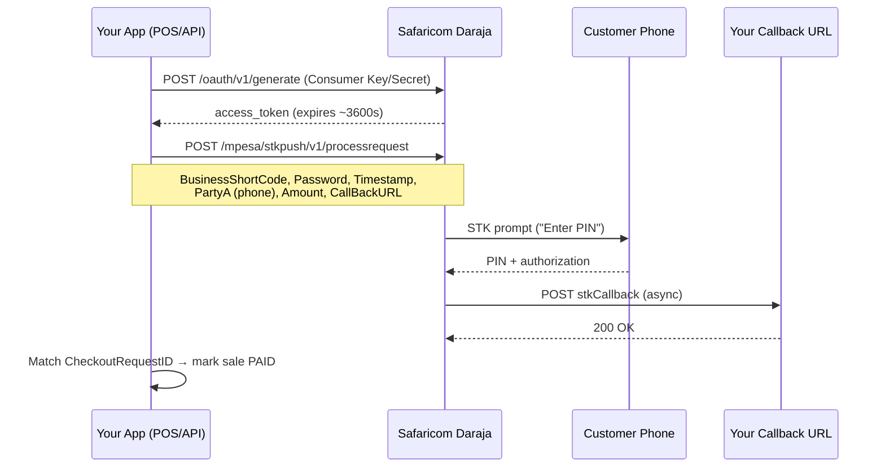
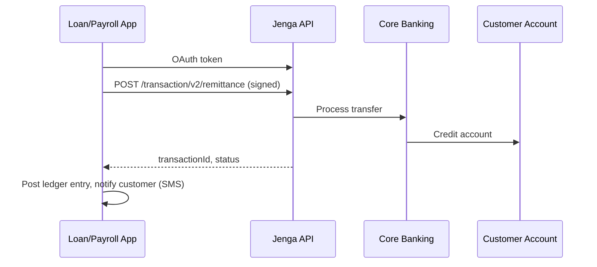
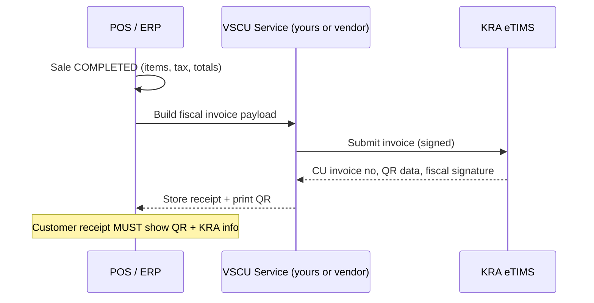
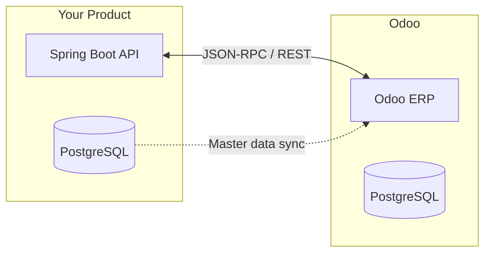
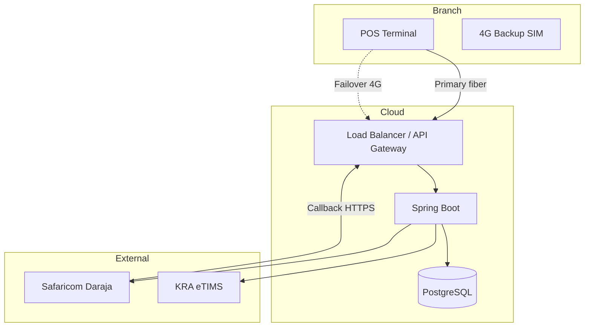
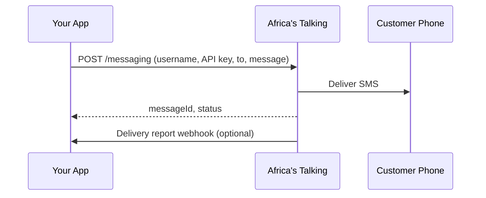
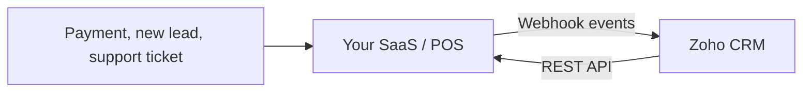
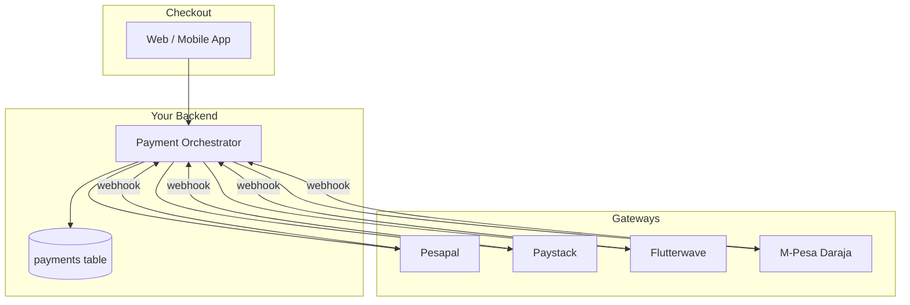
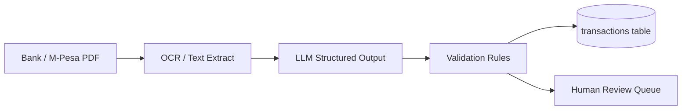

# Kenya Integrator Skills — Master Guide

> **Goal:** Become the developer who can wire Kenyan businesses end-to-end — M-Pesa, banks, KRA eTIMS, ERPs, payment gateways, SMS, accounting, CRM, PostgreSQL, and the business context around all of it.  
> **Audience:** Backend/full-stack engineers building POS, fintech, ERP, or SaaS products in Kenya and East Africa.  
> **Primary stack assumed:** **Java** (Spring Boot) + **PostgreSQL** — you can mirror patterns in PHP later.

---

## How to Use This Guide

Each section follows the same rhythm:

1. **What it is** — vocabulary and stakeholders  
2. **Why it matters** — real business pain it solves  
3. **How it works** — architecture, flows, failure modes  
4. **Build it** — sandbox setup, code patterns, checklists  
5. **Study path** — 1-week sprint + deeper resources  

**Recommended order** (dependencies flow downward):

```
Accounting basics → PostgreSQL → Java depth
        ↓
Networking & ISPs → M-Pesa Daraja → Payment gateways → Banking APIs
        ↓
SMS → KRA eTIMS → ERP → CRM
        ↓
Business requirements → AI basics
```

**Estimated total:** 12–16 weeks at ~10 hrs/week for working proficiency; 6–9 months to integrate confidently in production.

---

## Table of Contents

| # | Section | Time to Working Proficiency |
|---|---------|----------------------------|
| 1 | [M-Pesa Daraja API + Third Party (IntaSend)](#1-m-pesa-daraja-api--third-party-intasend) | 2 weeks |
| 2 | [Banking APIs (Jenga / Equity)](#2-banking-apis-jenga--equity) | 2 weeks |
| 3 | [KRA eTIMS Integration](#3-kra-etims-integration) | 2–3 weeks |
| 4 | [ERP — Odoo (Primary)](#4-erp--odoo-primary) | 3 weeks |
| 5 | [Java Mastery Path](#5-java-mastery-path) | Ongoing (8–12 weeks foundation) |
| 6 | [Networking & ISPs (Kenya Context)](#6-networking--isps-kenya-context) | 1–2 weeks |
| 7 | [SMS Integrations](#7-sms-integrations) | 3–5 days |
| 8 | [Accounting Basics](#8-accounting-basics) | 1 week |
| 9 | [CRM — Zoho (Primary)](#9-crm--zoho-primary) | 1–2 weeks |
| 10 | [PostgreSQL Mastery](#10-postgresql-mastery) | 3–4 weeks |
| 11 | [Payment Gateways](#11-payment-gateways-pesapal-paystack-flutterwave) | 1–2 weeks |
| 12 | [Reading Business Requirements](#12-reading-business-requirements-not-just-code) | Ongoing |
| 13 | [AI Basics for Integrators](#13-ai-basics-for-integrators) | 1 week |

---

## 1. M-Pesa Daraja API + Third Party (IntaSend)

### 1.1 What It Is

**M-Pesa Daraja** is Safaricom's REST API platform for developers. It exposes:

| Product | Use Case |
|---------|----------|
| **OAuth 2.0** | Get `access_token` for all other calls |
| **STK Push (Lipa Na M-PESA Online)** | Merchant initiates payment on customer's phone |
| **C2B (Customer to Business)** | Customer pays Paybill/Till; you receive validation + confirmation callbacks |
| **B2C** | Business pays customer (refunds, salaries, disbursements) |
| **B2B** | Business pays another business |
| **Account Balance / Transaction Status** | Reconciliation and polling |
| **Dynamic QR** | QR-based checkout |

**Third-party aggregator (IntaSend):** Instead of going direct to Safaricom, you use IntaSend (or similar) as a unified payments API — M-Pesa, cards, bank transfer — with one SDK, webhooks, and settlement. Trade-off: faster integration, less Daraja paperwork; higher per-transaction fee and less control.

### 1.2 Why It Matters

- ~30M+ M-Pesa users in Kenya — default payment rail for retail, bills, loans, gig economy  
- Direct Daraja = lowest fees, full control, required for large merchants and POS  
- Aggregators = speed for MVPs and cross-border products  

### 1.3 Architecture — STK Push (Direct Daraja)



**Critical concepts:**

| Concept | Detail |
|---------|--------|
| **Callback URL** | Must be **public HTTPS** (Safaricom rejects localhost). Use ngrok in dev. |
| **Password field** | `Base64(Shortcode + Passkey + Timestamp)` — not your login password |
| **CheckoutRequestID** | Idempotency key for matching callback to pending payment |
| **ResultCode 0** | Success; extract `MpesaReceiptNumber` from callback metadata |
| **Sandbox vs Production** | Separate apps, credentials, and shortcodes on [developer.safaricom.co.ke](https://developer.safaricom.co.ke) |

### 1.4 Production Patterns (From Real POS Integrations)

```
┌─────────────────────────────────────────────────────────────┐
│                     Payment State Machine                    │
├─────────────────────────────────────────────────────────────┤
│  INITIATED → PENDING (STK sent) → SUCCESS | FAILED | TIMEOUT │
│       ↑                              ↓                       │
│       └──────── retry (new STK) ←──┘                       │
└─────────────────────────────────────────────────────────────┘
```

**Rules that save you in production:**

1. **Never mark paid on STK initiation** — only on callback with `ResultCode=0` and amount match  
2. **Store raw callback JSON** — disputes and reconciliation depend on it  
3. **Timeout job** — if no callback in 120s, mark `TIMEOUT`; customer may still pay (handle late callbacks)  
4. **Amount validation** — callback amount must equal sale total (watch partial payments)  
5. **Credential resolution** — org-level vs branch-level Daraja configs; sandbox defaults for dev  
6. **OAuth token cache** — tokens expire; cache ~3500s, refresh before expiry  

### 1.5 Code Sketch — Java (Spring Boot)

```java
// 1. OAuth token (cache this)
POST https://sandbox.safaricom.co.ke/oauth/v1/generate?grant_type=client_credentials
Authorization: Basic base64(consumerKey:consumerSecret)

// 2. STK Push
POST https://sandbox.safaricom.co.ke/mpesa/stkpush/v1/processrequest
Authorization: Bearer {access_token}
{
  "BusinessShortCode": "174379",
  "Password": "{base64(shortcode+passkey+timestamp)}",
  "Timestamp": "20260730153000",
  "TransactionType": "CustomerPayBillOnline",
  "Amount": 1,
  "PartyA": "254712345678",
  "PartyB": "174379",
  "PhoneNumber": "254712345678",
  "CallBackURL": "https://your-domain.com/api/v1/integrations/mpesa/stk/callback",
  "AccountReference": "SALE-12345",
  "TransactionDesc": "Payment for order 12345"
}

// 3. Callback handler — always return 200 quickly, process async if heavy
@PostMapping("/api/v1/integrations/mpesa/stk/callback")
public ResponseEntity<Void> stkCallback(@RequestBody String rawJson) {
    mpesaCallbackService.process(rawJson); // idempotent by CheckoutRequestID
    return ResponseEntity.ok().build();
}
```

### 1.6 C2B (Paybill) Flow — When Customer Pays First

1. Register validation and confirmation URLs on Daraja  
2. **Validation URL** — Safaricom asks "accept this payment?" → respond within ~8 seconds  
3. **Confirmation URL** — payment accepted → credit customer account in your system  
4. Map `BillRefNumber` / `TransID` to invoices  

### 1.7 Third Party: IntaSend

| Aspect | Direct Daraja | IntaSend |
|--------|---------------|----------|
| Onboarding | Safaricom approval, Go-Live checklist | Sign up, API keys |
| M-Pesa STK | Full Daraja control | `POST /v1/collections/mpesa-stk/` |
| Cards / bank | Separate integrations | Same API |
| Webhooks | You implement callback | Unified webhook events |
| Best for | POS, high volume, regulated | MVPs, multi-rail startups |

**IntaSend flow:** Create collection → customer pays → webhook `COMPLETE` → verify via API before fulfilling.

### 1.8 Sandbox Setup Checklist

- [ ] Create app at [developer.safaricom.co.ke](https://developer.safaricom.co.ke)  
- [ ] Copy Consumer Key, Consumer Secret, Passkey, Shortcode (sandbox: often `174379`)  
- [ ] Test phone: Safaricom provides test MSISDNs in portal  
- [ ] Expose callback via ngrok or Cloudflare Tunnel  
- [ ] Test: OAuth → STK → callback → receipt stored  
- [ ] Test failure paths: wrong PIN, cancelled STK, duplicate callback  

### 1.9 Study Path

| Week | Task |
|------|------|
| 1 | Daraja portal, OAuth, STK Push, callback parsing, state machine |
| 2 | C2B registration, reconciliation with Transaction Status API, IntaSend comparison project |

**Docs:** [Daraja API Documentation](https://developer.safaricom.co.ke/APIs) · [IntaSend Docs](https://intasend.com/docs)

---

## 2. Banking APIs (Jenga / Equity)

### 2.1 What It Is

Kenyan banks expose APIs for account inquiry, transfers, and merchant services. **Jenga API** (by Equity Bank / Finserve Africa) is the most developer-friendly unified banking API in the region.

| Capability | Typical Use |
|------------|-------------|
| Account balance | Loan underwriting, wallet prefunding checks |
| Account verification (IPRS-style) | KYC — confirm account name matches ID |
| Send money (EFT/RTGS/PesaLink) | Disbursements, supplier payments |
| Receive money (collections) | Invoice payments via bank |
| Mobile wallet transfer | Bank ↔ M-Pesa rails |
| Merchant / POS | Card and bank checkout |

**Alternatives:**

| Platform | Bank | Notes |
|----------|------|-------|
| **Jenga** | Equity (+ partner banks) | Best docs, sandbox, OAuth2 |
| **KCB Buni** | KCB | Enterprise focus, longer onboarding |
| **Co-op Bank APIs** | Co-operative Bank | Growing dev portal |
| **NCBA Loop / APIs** | NCBA | Digital-first products |
| **Absa API** | Absa | Corporate banking integrations |

### 2.2 Why It Matters

- B2B payments, payroll, loan disbursement, and supplier settlements run through banks  
- Account verification reduces fraud in lending and marketplaces  
- Regulators expect audit trails linking bank refs to your ledger  

### 2.3 Architecture — Bank Disbursement



### 2.4 Integration Patterns

**Authentication:** API Key + Secret → OAuth bearer token. Many calls require **request signing** (HMAC or RSA) — read the spec per endpoint.

**Idempotency:** Send `transactionReference` you generate (UUID). Retries with same ref must not double-pay.

**Status polling:** Transfers may be `PENDING` → `SUCCESS` / `FAILED`. Webhooks where available; otherwise poll.

**Ledger coupling:** Every bank movement = double-entry in your DB:

```
Debit:  Loan Disbursement Expense
Credit: Bank Clearing Account
```

### 2.5 Compliance & Ops

- **CBK regulations** — know your customer (KYC), AML reporting for large transactions  
- **Cut-off times** — RTGS windows, EFT next-day, PesaLink near-real-time  
- **Reconciliation** — daily bank statement vs your `bank_transactions` table  

### 2.6 Sandbox Checklist

- [ ] Register at [jengaapi.io](https://jengaapi.io)  
- [ ] Complete sandbox KYC simulation  
- [ ] Test account balance and account inquiry  
- [ ] Test remittance with sandbox accounts  
- [ ] Implement signing middleware once — reuse across endpoints  

### 2.7 Study Path

| Week | Task |
|------|------|
| 1 | Jenga OAuth, account verification, balance |
| 2 | Remittance + webhook/poll + ledger posting + daily recon |

**Docs:** [Jenga API Docs](https://developer.jengaapi.io/docs) · KCB Buni portal for comparison reading

---

## 3. KRA eTIMS Integration

### 3.1 What It Is

**eTIMS** (electronic Tax Invoice Management System) is KRA's platform for **real-time or near-real-time fiscal reporting** of sales. Businesses must issue compliant invoices with KRA verification data (QR code, CU invoice number).

| Component | Role |
|-----------|------|
| **VSCU** (Virtual Sales Control Unit) | Software-based control unit — most common for ERP/POS integrators |
| **OSCU** (Online Sales Control Unit) | Cloud/API-first integrators |
| **Taxpayer portal** | Registration, device activation |
| **Invoice schema** | Item lines, tax codes, buyer PIN optional/required |

### 3.2 Why It Matters

- **Legal requirement** for VAT-registered businesses in Kenya  
- Non-compliance → penalties, blocked invoices, audit risk  
- POS/ERP products without eTIMS are unsellable to formal retailers  

### 3.3 Architecture — POS to KRA



### 3.4 Data You Must Capture Per Sale

| Field | Example |
|-------|---------|
| Seller PIN | P051234567X |
| Branch/device ID | From VSCU registration |
| Item code / HS code | From your product catalog |
| Tax rate | 16% standard VAT, 8% reduced, 0% exempt |
| Quantity, unit price, discount | Per line |
| Total tax, total amount | Header |
| Payment method | Cash, M-Pesa, card |
| Buyer PIN (B2B) | Required for some invoice types |

### 3.5 Implementation States

```
DRAFT → SUBMITTED → ACCEPTED | REJECTED → (retry or manual fix)
```

**Production rules:**

1. **Immutable fiscal record** — never edit submitted invoice; issue credit note  
2. **Offline queue** — if KRA unreachable, queue and retry (VSCU spec defines limits)  
3. **Receipt reprint** — must show original CU number, not regenerate  
4. **Tax agency config** — org-level VAT rates, eTIMS enabled flag  

### 3.6 Typical API Shape (Application Layer)

Even before KRA wire-up, model your domain:

```
POST /admin/orgs/{orgId}/branches/{branchId}/etims-invoice-records
  { "saleId": "..." }

POST .../etims-invoice-records/{id}/submit
POST .../etims-invoice-records/{id}/poll-status
```

### 3.7 Study Path

| Week | Task |
|------|------|
| 1 | KRA eTIMS registration process, VSCU vs OSCU, VAT categories |
| 2 | Map POS sale model to fiscal schema; build submit/poll/retry |
| 3 | QR on receipt, credit notes, failure handling |

**Docs:** [KRA eTIMS](https://etims.kra.go.ke) · Vendor VSCU SDK docs (varies by KRA-approved integrator)

---

## 4. ERP — Odoo (Primary)

### 4.1 What It Is

An **ERP** (Enterprise Resource Planning) system unifies finance, inventory, HR, CRM, and manufacturing. For Kenyan integrators, you either **build connectors to ERP** or **extend ERP** for local rails (M-Pesa, eTIMS).

| ERP | Best For | Integration Style |
|-----|----------|-------------------|
| **Odoo** (pick this) | SMB–mid market, open source | XML-RPC, JSON-RPC, REST (Odoo 17+) |
| **SAP Business One** | Mid-market manufacturers | Service Layer OData API |
| **Microsoft Dynamics 365** | Enterprise, Microsoft shops | Dataverse / OData / custom connectors |
| **Sage** | Accounting-heavy businesses | Sage API / SDK |

### 4.2 Why Odoo First

- Free Community edition — run locally, break things, learn  
- Python + PostgreSQL under the hood — aligns with your stack literacy  
- Modules: Accounting, Inventory, POS, HR — map directly to Kenyan SME needs  
- Huge partner ecosystem in Nairobi  

### 4.3 Architecture — Your App ↔ Odoo



### 4.4 Common Integration Points

| Flow | Direction | Odoo Model |
|------|-----------|------------|
| Product catalog sync | Odoo → POS | `product.product` |
| Sales orders | POS → Odoo | `sale.order` |
| Invoices | POS → Odoo | `account.move` |
| Stock levels | Bidirectional | `stock.quant` |
| Payments (M-Pesa) | Your gateway → Odoo | `account.payment` |
| eTIMS fiscal | Your VSCU → receipt in Odoo | Custom module / PDF report |

### 4.5 Odoo JSON-RPC Example

```python
# Authenticate
uid = models.execute_kw(db, uid, password,
    'res.partner', 'search_read',
    [[['customer_rank', '>', 0]]],
    {'fields': ['name', 'email'], 'limit': 10})

# Create invoice
invoice_id = models.execute_kw(db, uid, password,
    'account.move', 'create', [{
        'move_type': 'out_invoice',
        'partner_id': partner_id,
        'invoice_line_ids': [(0, 0, {
            'product_id': product_id,
            'quantity': 2,
            'price_unit': 1500.00,
        })]
    }])
```

### 4.6 Study Path

| Week | Task |
|------|------|
| 1 | Install Odoo CE, modules: Sales, Inventory, Accounting |
| 2 | JSON-RPC read/write; map one product + one invoice from your API |
| 3 | Webhook or scheduled sync; conflict resolution |

**Docs:** [Odoo Developer Docs](https://www.odoo.com/documentation/17.0/developer.html)

---

## 5. Java Mastery Path

### 5.1 Why Java for Kenyan Integrations

- Enterprise clients, banks, and government-facing systems overwhelmingly use Java  
- Spring Boot is the default for secure, long-running integration services  
- Your POS/fintech codebases are already Java — depth here compounds  

PHP remains valid (Laravel for rapid SMB portals), but **master Java first**.

### 5.2 Skill Layers

```
Layer 4: System design, DDD, event-driven, observability
Layer 3: Spring Boot, Security, JPA, testing, API design
Layer 2: Java core — collections, streams, concurrency, I/O
Layer 1: JVM, build tools (Maven/Gradle), debugging
```

### 5.3 Core Java — Must Own

| Topic | Why Integrators Need It |
|-------|-------------------------|
| **Immutability + records** | Safe DTOs for payment callbacks |
| **Optional, exceptions** | Clean error handling for external APIs |
| **Streams + collectors** | Reconciliation reports |
| **CompletableFuture / virtual threads (21+)** | Parallel gateway calls |
| **java.time** | Timestamp formats for Daraja, KRA |
| **BigDecimal** | Money — never `double` for KES amounts |
| **Concurrency** | Webhook bursts, idempotent consumers |

### 5.4 Spring Boot — Must Own

| Module | Integration Use |
|--------|-----------------|
| **Spring Web** | REST controllers for callbacks |
| **Spring Security** | JWT for admin; permit callback endpoints carefully |
| **Spring Data JPA** | Transactions, ledger, payment records |
| **Flyway/Liquibase** | Schema migrations in prod |
| **Spring Validation** | Request DTOs from gateways |
| **@Scheduled** | STK timeout jobs, eTIMS retry queue |
| **RestClient / WebClient** | Daraja, Jenga, SMS HTTP calls |
| **Spring Retry** | Transient failures to external APIs |

### 5.5 Money Handling Pattern

```java
public record Money(BigDecimal amount, Currency currency) {
    public Money {
        if (amount.scale() > 2) throw new IllegalArgumentException("Max 2 decimal places");
        amount = amount.setScale(2, RoundingMode.HALF_UP);
    }
    public Money add(Money other) {
        if (!currency.equals(other.currency)) throw new IllegalArgumentException("Currency mismatch");
        return new Money(amount.add(other.amount), currency);
    }
}
```

### 5.6 Project-Based Learning

Build **one integration monolith** (or modular monolith) that includes:

1. STK Push + callback + idempotency  
2. SMS notification on payment  
3. PostgreSQL ledger + daily reconciliation report  
4. Admin API for credentials (encrypted at rest)  
5. eTIMS invoice stub (submit/poll states)  

### 5.7 Study Path

| Weeks | Focus |
|-------|-------|
| 1–4 | Java core + effective Java idioms |
| 5–8 | Spring Boot + JPA + security + testing |
| 9–12 | Integration patterns, resilience, production hardening |

**Books:** *Effective Java* (Bloch) · *Spring Boot Up & Running*  
**Next language:** C# (similar enterprise market) or Node (JS-heavy startups)

---

## 6. Networking & ISPs (Kenya Context)

### 6.1 What You Need to Know

Integrations fail in production more often from **network issues** than from code bugs. You must understand:

- Why Safaricom callbacks timeout  
- How to debug SSL, DNS, and routing  
- ISP redundancy for POS and server hosting  

### 6.2 Kenya ISP Landscape

| Provider | Type | Integrator Notes |
|----------|------|------------------|
| **Safaricom** | Mobile + fiber (Faiba overlap) | Best mobile coverage; host callbacks in cloud, not Safaricom-dependent LAN |
| **Airtel** | Mobile + fiber | Good backup SIM for field devices |
| **Jamii Telecom (Faiba)** | Fiber | Common office fiber |
| **Liquid Intelligent Technologies** | Enterprise fiber, SD-WAN | Business parks, redundant links |
| **Zuku / Telkom** | Fiber | Residential and SME |
| **AWS/Azure/GCP (Nairobi region or nearby)** | Cloud | Use **af-south-1** (Cape Town) or **eu-west** with CDN; latency ~150–250ms acceptable for async callbacks |

### 6.3 Concepts for Integrators

| Concept | Practical Application |
|---------|----------------------|
| **Public IP vs NAT** | Callback URLs need public reachability |
| **HTTPS / TLS** | Daraja, banks, KRA require valid certs (Let's Encrypt OK) |
| **DNS** | Point API subdomain to load balancer; low TTL for failover |
| **Firewall / Security Groups** | Allow 443 inbound for callbacks only |
| **VPN / MPLS** | Enterprise clients connecting branch POS to HQ ERP |
| **Static IP** | Some banks whitelist your server IP |
| **Latency & timeouts** | Set HTTP client timeouts > gateway p99; Daraja OAuth ~30s read timeout |
| **MTN / packet loss** | Retry with backoff; idempotency on your side |

### 6.4 Debugging Checklist

```
1. curl -v https://your-callback-url from external host (not localhost)
2. Check SSL chain: openssl s_client -connect host:443
3. Traceroute to gateway API — identify where latency spikes
4. tcpdump / Wireshark for TLS handshake failures (corporate proxies)
5. Log HTTP status + response body from every outbound gateway call
```

### 6.5 Architecture — Resilient Integration Hosting



### 6.6 Study Path

Read [08-fundamentals/27-networking-for-system-design.md](08-fundamentals/27-networking-for-system-design.md) and [cybersec/NETWORKING-MASTER-GUIDE.md](cybersec/NETWORKING-MASTER-GUIDE.md) in this repo, then:

| Week | Task |
|------|------|
| 1 | TLS, DNS, HTTP timeouts; deploy callback to cloud with HTTPS |
| 2 | Trace one M-Pesa callback end-to-end; document failure modes |

---

## 7. SMS Integrations

### 7.1 What It Is

SMS remains essential in Kenya for OTPs, payment confirmations, loan status, and marketing (with consent).

| Provider | Strength |
|----------|----------|
| **Africa's Talking** | Best local docs, USSD + SMS + Airtime, Kenya-native |
| **Twilio** | Global, excellent APIs, higher cost |
| **Safaricom APIs** | Direct, enterprise contracts |
| **Advanta / other bulk SMS** | Marketing bulk, less developer-centric |

### 7.2 Architecture



### 7.3 Patterns

| Use Case | Pattern |
|----------|---------|
| OTP | 6 digits, 5-min expiry, rate limit per phone |
| Payment confirm | "Received KES 1,500. Ref: ABC123. Balance: ..." |
| Bulk marketing | Opt-in list, quiet hours, KRA/DPA consent |
| Failover | Queue SMS if provider down; retry |

### 7.4 Code Sketch

```java
// Africa's Talking
POST https://api.africastalking.com/version1/messaging
{
  "username": "sandbox",
  "to": "+254712345678",
  "message": "Your payment of KES 1,500 was received. Ref: SALE-123."
}
```

**Security:** Never log full OTP; hash at rest; throttle resend.

### 7.5 Study Path

| Days | Task |
|------|------|
| 1–2 | Africa's Talking sandbox, send + delivery report |
| 3–5 | OTP module, payment notification, rate limiting |

**Docs:** [Africa's Talking SMS](https://developers.africastalking.com/docs/sms/overview)

---

## 8. Accounting Basics

### 8.1 Why Developers Must Know This

Payment code without accounting thinking causes **production disasters** — duplicated revenue, unreconciled M-Pesa, VAT audits failing.

### 8.2 Core Concepts

| Term | Meaning |
|------|---------|
| **Double-entry bookkeeping** | Every transaction: debits = credits |
| **Chart of accounts** | List of accounts (Cash, Revenue, VAT Payable, etc.) |
| **General ledger** | All posted journal entries |
| **Accounts receivable (AR)** | Money customers owe you |
| **Accounts payable (AP)** | Money you owe suppliers |
| **Reconciliation** | Match your records to bank/M-Pesa statements |
| **Invoice** | Document requesting payment |
| **Credit note** | Reverse or reduce a prior invoice |
| **VAT (16% standard in Kenya)** | Output VAT on sales, input VAT on purchases, remit difference to KRA |

### 8.3 VAT Quick Reference (Kenya)

| Category | Rate | Example |
|----------|------|---------|
| Standard | 16% | Most goods and services |
| Reduced | 8% | Fuel, some exports |
| Zero-rated | 0% | Exports, certain medical |
| Exempt | No VAT | Financial services, residential rent |

**Developer rule:** Store `tax_rate`, `tax_amount`, `line_total_ex_vat`, `line_total_inc_vat` per line — never recalculate VAT from rounded totals alone.

### 8.4 Sample Journal Entries

**Sale KES 1,160 (inc. 16% VAT) paid via M-Pesa:**

```
Debit:  M-Pesa Clearing     1,160
Credit: Sales Revenue       1,000
Credit: VAT Payable           160
```

**M-Pesa settlement to bank (after Safaricom charges):**

```
Debit:  Bank Account          985
Debit:  M-Pesa Charges Expense   15
Credit: M-Pesa Clearing      1,000
```

### 8.5 Reconciliation Workflow

```
Daily:
1. Export M-Pesa statement (Daraja or portal)
2. Match TransID to your payment_records.mpesa_receipt
3. Flag: unmatched bank/M-Pesa items → suspense account
4. Age unmatched items > 3 days → ops review
```

### 8.6 Study Path

| Week | Task |
|------|------|
| 1 | Double-entry, VAT math, invoice + credit note; build ledger tables in PostgreSQL |

**Resources:** KRA VAT guide · *Accounting Made Simple* · Your client's accountant (best teacher)

---

## 9. CRM — Zoho (Primary)

### 9.1 What It Is

A **CRM** tracks leads, deals, contacts, and customer communication. Integrations sync product usage, support tickets, and payments into sales view.

| CRM | Best For |
|-----|----------|
| **Zoho CRM** (pick this) | Affordable, good API, common in Kenyan SMB |
| **HubSpot** | Inbound marketing heavy |
| **Salesforce** | Enterprise, complex implementations |
| **Microsoft Dynamics 365** | Microsoft-centric enterprises |

### 9.2 Integration Architecture



### 9.3 Common Sync Events

| Event in Your App | CRM Action |
|-------------------|------------|
| New signup | Create Lead / Contact |
| First payment | Update Deal → Closed Won |
| Support ticket | Create Case |
| Churn risk score | Update custom field |

### 9.4 Zoho API Pattern

```
POST https://www.zohoapis.com/crm/v6/Leads
Authorization: Zoho-oauthtoken {token}
{
  "data": [{
    "Last_Name": "Kamau",
    "Company": "Acme Shop",
    "Phone": "+254712345678",
    "Lead_Source": "POS Trial"
  }]
}
```

OAuth refresh tokens require scheduled refresh job — same pattern as Daraja OAuth cache.

### 9.5 Study Path

| Week | Task |
|------|------|
| 1 | Zoho CRM free trial, REST API create/read Lead |
| 2 | Webhook from your app on payment; bi-directional sync one field |

**Docs:** [Zoho CRM API](https://www.zoho.com/crm/developer/docs/api/v6/)

---

## 10. PostgreSQL Mastery

### 10.1 Why PostgreSQL for Integrations

- ACID transactions for money — non-negotiable  
- JSONB for raw gateway callbacks  
- Row-level locking for inventory and payment state  
- Mature ecosystem; powers Odoo and most SaaS backends  

### 10.2 Schema Patterns for Fintech/POS

```sql
-- Payment with immutable audit
CREATE TABLE payment_records (
    id              UUID PRIMARY KEY DEFAULT gen_random_uuid(),
    sale_id         UUID NOT NULL REFERENCES sales(id),
    provider        TEXT NOT NULL,  -- 'MPESA_STK', 'PESAPAL', etc.
    external_ref    TEXT NOT NULL,  -- CheckoutRequestID, etc.
    mpesa_receipt   TEXT,
    amount          NUMERIC(15,2) NOT NULL,
    currency        CHAR(3) NOT NULL DEFAULT 'KES',
    status          TEXT NOT NULL,  -- PENDING, SUCCESS, FAILED, TIMEOUT
    raw_callback    JSONB,
    created_at      TIMESTAMPTZ NOT NULL DEFAULT now(),
    updated_at      TIMESTAMPTZ NOT NULL DEFAULT now(),
    UNIQUE (provider, external_ref)
);

-- Ledger (double-entry)
CREATE TABLE ledger_entries (
    id          BIGSERIAL PRIMARY KEY,
    journal_id  UUID NOT NULL,
    account     TEXT NOT NULL,
    debit       NUMERIC(15,2) NOT NULL DEFAULT 0,
    credit      NUMERIC(15,2) NOT NULL DEFAULT 0,
    posted_at   TIMESTAMPTZ NOT NULL DEFAULT now(),
    CONSTRAINT chk_debit_credit CHECK (
        (debit > 0 AND credit = 0) OR (credit > 0 AND debit = 0)
    )
);
```

### 10.3 Skills Checklist

| Skill | Use Case |
|-------|----------|
| **Transactions (`BEGIN` / `COMMIT`)** | Payment + ledger atomic post |
| **Indexes (B-tree, partial, unique)** | Fast lookup by `external_ref` |
| **`SELECT ... FOR UPDATE`** | Prevent double STK on same sale |
| **JSONB operators** | Query callback fields |
| **Window functions** | Running balance, reconciliation gaps |
| **CTE + recursive** | Org/branch hierarchies |
| **EXPLAIN ANALYZE** | Slow reconciliation queries |
| **Connection pooling (PgBouncer)** | Spring Boot in prod |
| **Backups + PITR** | Financial data recovery |

### 10.4 Transaction Pattern — Payment Callback

```sql
BEGIN;
  SELECT status FROM payment_records
    WHERE provider = 'MPESA_STK' AND external_ref = $1
    FOR UPDATE;

  -- if already SUCCESS, COMMIT and return (idempotent)
  UPDATE payment_records SET status = 'SUCCESS', mpesa_receipt = $2, ...
    WHERE external_ref = $1 AND status = 'PENDING';

  INSERT INTO ledger_entries (journal_id, account, debit, credit) VALUES
    ($3, 'MPESA_CLEARING', 1160, 0),
    ($3, 'SALES_REVENUE', 0, 1000),
    ($3, 'VAT_PAYABLE', 0, 160);
COMMIT;
```

### 10.5 Study Path

| Week | Task |
|------|------|
| 1 | Schema design, indexes, transactions |
| 2 | JSONB, window functions — use [SQL-INTERVIEW-MASTER-GUIDE.md](SQL-INTERVIEW-MASTER-GUIDE.md) |
| 3 | EXPLAIN, pooling, migrations (Flyway) |
| 4 | Build reconciliation queries for M-Pesa vs ledger |

---

## 11. Payment Gateways (Pesapal, Paystack, Flutterwave)

### 11.1 What They Are

**Payment gateways** aggregate multiple rails (cards, mobile money, bank) behind one API. Unlike raw Daraja, they handle PCI scope for cards and cross-border settlement.

| Gateway | HQ / Strength | Kenya Notes |
|---------|---------------|-------------|
| **Pesapal** | Kenya | Strong local presence, cards + M-Pesa, SBE integration |
| **Paystack** | Nigeria (Stripe-owned) | Popular in East Africa dev community |
| **Flutterwave** | Nigeria | Multi-country, good for cross-border |
| **Stripe** | Global | Limited M-Pesa; strong for cards/international |

### 11.2 When to Use Which

```
Local retail POS, lowest M-Pesa fees     → Direct Daraja
Quick online checkout, cards + M-Pesa    → Pesapal or Paystack
Multi-country expansion                  → Flutterwave
Subscription SaaS, global cards          → Stripe
```

### 11.3 Unified Architecture



**Orchestrator responsibilities:**

- Route by payment method, currency, merchant config  
- Normalize webhook payloads to internal `PaymentEvent`  
- Idempotency on `provider + event_id`  
- Never fulfill order until `status = succeeded` verified via API  

### 11.4 Webhook Security

| Gateway | Verification |
|---------|--------------|
| Paystack | HMAC SHA512 of body with secret key |
| Flutterwave | Hash header `verif-hash` |
| Pesapal | IPN signature per docs |
| Daraja | HTTPS + match CheckoutRequestID (no HMAC on STK callback) |

Always **verify server-side** — never trust client-side "payment complete".

### 11.5 Study Path

| Week | Task |
|------|------|
| 1 | Pesapal sandbox: initiate + IPN + verify |
| 2 | Paystack or Flutterwave second integration; abstract common interface |

Also read: [06-platform-building-blocks/18-design-payment-gateway.md](06-platform-building-blocks/18-design-payment-gateway.md)

**Docs:** [Pesapal API](https://developer.pesapal.com) · [Paystack Docs](https://paystack.com/docs) · [Flutterwave Docs](https://developer.flutterwave.com/docs)

---

## 12. Reading Business Requirements (Not Just Code)

### 12.1 The Skill

Senior integrators spend 40% of time **translating business language into systems** before writing code.

### 12.2 Requirements Document Anatomy

| Section | What to Extract |
|---------|-----------------|
| **Background** | Who pays, who uses, regulatory context |
| **Goals / KPIs** | "Reduce reconciliation time" → batch job + dashboard |
| **User stories** | Actor, action, outcome → API + UI |
| **Acceptance criteria** | Test cases — literal pass/fail conditions |
| **Out of scope** | Prevents scope creep |
| **Assumptions** | Challenge wrong ones early |
| **Compliance** | eTIMS, VAT, CBK, DPA 2019 |

### 12.3 Questions to Ask Stakeholders

**Payments:**
- Who initiates payment — customer or merchant?  
- Partial payments allowed?  
- Refunds to original rail or cash?  
- What receipt is legally required (eTIMS QR)?  

**Operations:**
- Who reconciles daily — finance or IT?  
- Branch offline scenarios?  
- Cut-off times for same-day settlement?  

**Security:**
- Who can view API credentials?  
- PCI scope — do we touch card PAN?  

### 12.4 From Requirement to Design

**Example requirement:**  
*"When a sale completes, the system must send the invoice to KRA and show a QR code on the receipt."*

**Your breakdown:**

| Piece | Technical Task |
|-------|----------------|
| Trigger | `SaleCompleted` domain event |
| Data | Map sale lines to eTIMS schema |
| Async | Queue submit; don't block checkout |
| Failure | Retry + manual resubmit screen |
| Receipt | PDF/HTML template with QR from KRA response |
| Audit | Store CU invoice number immutable |

### 12.5 Deliverables Before Coding

1. **Sequence diagram** for happy path + 3 failure paths  
2. **State machine** for payment / invoice status  
3. **Data model** delta (tables, fields)  
4. **API contract** (OpenAPI) reviewed by stakeholder  
5. **Test plan** mapped to acceptance criteria  

### 12.6 Practice

Take [xpos-app FRD/PRD docs] or any client brief → produce the 5 deliverables above without writing implementation code. Review with a non-technical stakeholder.

---

## 13. AI Basics for Integrators

### 13.1 What You Need (Not a Data Scientist)

Integrators benefit from AI for **document processing, support automation, and fraud signals** — not from training foundation models.

### 13.2 Practical Use Cases in Kenya Fintech

| Use Case | Approach |
|----------|----------|
| M-Pesa / bank statement parsing | OCR + LLM structured extraction → JSON transactions |
| Loan document classification | Vision model or PDF text + classifier |
| Support chatbot | RAG over product docs + ticket history |
| Fraud / anomaly | Rules + simple ML on transaction velocity |
| Code generation | Copilot/Cursor for boilerplate integrations |

### 13.3 Architecture — Document to Transactions



**Rules:**
- Never auto-approve loans on AI-extracted data alone — human-in-the-loop  
- Log prompts and outputs for audit  
- Redact PII in logs (ID numbers, full account numbers)  

### 13.4 Key Concepts

| Term | Meaning |
|------|---------|
| **LLM** | Large language model — text in, text out |
| **Prompt** | Instructions + context |
| **RAG** | Retrieve docs, augment prompt, generate answer |
| **Structured output** | JSON schema enforced response |
| **Embedding** | Vector representation for semantic search |
| **Fine-tuning** | Usually unnecessary for integrators — RAG first |
| **Token** | Billing unit; context window limits |

### 13.5 API Pattern — Structured Extraction

```java
// Pseudocode — OpenAI / Anthropic / local model
var response = client.chat(request()
    .model("gpt-4o")
    .system("Extract transactions from this M-Pesa statement. Return JSON array.")
    .user(pdfText)
    .responseFormat(TransactionListSchema.class));
```

Validate: dates parseable, amounts sum roughly to opening/closing balance, currency = KES.

### 13.6 Study Path

| Week | Task |
|------|------|
| 1 | Prompt engineering, structured JSON, RAG basics; build statement parser prototype |

**Resources:** Provider docs (OpenAI, Anthropic) · [05-search-discovery/13-design-ai-recommendation-system.md](05-search-discovery/13-design-ai-recommendation-system.md) for system thinking

---

## Capstone Project — Tie It All Together

Build **"Kenya Merchant Hub"** — a single Spring Boot + PostgreSQL app:

| Module | Demonstrates |
|--------|--------------|
| Product catalog + sales | ERP-style domain |
| M-Pesa STK checkout | Daraja direct |
| Pesapal card fallback | Payment gateway |
| eTIMS invoice submit (stub or sandbox) | KRA compliance |
| SMS receipt | Africa's Talking |
| Daily reconciliation report | Accounting |
| Zoho lead on signup | CRM |
| Admin credential vault | Security |
| Statement upload → transactions | AI extraction |

**Done when:** Finance user can reconcile a day of M-Pesa + card payments to the penny, and every sale receipt shows eTIMS QR (or mock).

---

## Quick Reference — External Links

| Area | Link |
|------|------|
| M-Pesa Daraja | https://developer.safaricom.co.ke |
| IntaSend | https://intasend.com/docs |
| Jenga API | https://developer.jengaapi.io/docs |
| KRA eTIMS | https://etims.kra.go.ke |
| Odoo Dev | https://www.odoo.com/documentation/17.0/developer.html |
| Africa's Talking | https://developers.africastalking.com |
| Pesapal | https://developer.pesapal.com |
| Paystack | https://paystack.com/docs |
| Flutterwave | https://developer.flutterwave.com/docs |
| Zoho CRM API | https://www.zoho.com/crm/developer/docs/api/v6/ |
| PostgreSQL Docs | https://www.postgresql.org/docs/ |

---

## Related Guides in This Repo

| Guide | Relevance |
|-------|-----------|
| [06-platform-building-blocks/18-design-payment-gateway.md](06-platform-building-blocks/18-design-payment-gateway.md) | Idempotency, PCI, reconciliation |
| [SQL-INTERVIEW-MASTER-GUIDE.md](SQL-INTERVIEW-MASTER-GUIDE.md) | PostgreSQL query patterns |
| [08-fundamentals/27-networking-for-system-design.md](08-fundamentals/27-networking-for-system-design.md) | HTTP, TLS, timeouts |
| [cybersec/NETWORKING-MASTER-GUIDE.md](cybersec/NETWORKING-MASTER-GUIDE.md) | Subnetting, troubleshooting |
| [DESIGN-PATTERNS-MASTER-GUIDE.md](DESIGN-PATTERNS-MASTER-GUIDE.md) | Java patterns for integrators |

---

*Last updated: July 2026*
