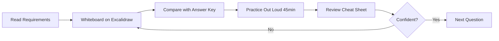

# 37 System Design Interview Guides

> Comprehensive interview prep guides for Big Tech (Google, Microsoft, Meta, Amazon) system design interviews.  
> Format inspired by [Hello Interview's Delivery Framework](https://www.hellointerview.com/learn/system-design/in-a-hurry/delivery).

---

## How to Use These Guides

Each document follows the **Hello Interview Delivery Framework** — the same linear structure used in real FAANG interviews:

| Phase | Time | What to Cover |
|-------|------|---------------|
| **1. Requirements** | ~5 min | Functional + non-functional requirements, scope, clarifying questions |
| **2. Core Entities** | ~2 min | Primary data objects (User, Post, Message, etc.) |
| **3. API Design** | ~5 min | REST/RPC endpoints, request/response contracts |
| **4. High-Level Design** | ~10–15 min | Architecture boxes-and-arrows, component interactions |
| **5. Deep Dives** | ~10 min | Bottlenecks, scaling, edge cases, trade-offs |
| **6. Capacity Estimation** | woven in | Back-of-envelope QPS, storage, bandwidth |

### Recommended Study Order

**Start with Track 8 (Fundamentals)** — 7 deep-dive guides covering scaling, databases, messaging, networking, and DNS. These concepts appear in every system design interview. Then work through Tracks 1–7 for applied case studies.

### Track 8 Study Path (Recommended Order)

```
23 Scaling/CAP/Cache/LB/Shard/Index  →  26 Database Types  →  24 Kafka + 25 RabbitMQ + 29 MQ Comparison
                                              ↓
                                    27 Networking  →  28 DNS
```

---

## Track 1: Social & Feeds
*The classics every interviewer loves*

| # | System | File | Lines | Diagrams | Key Topics |
|---|--------|------|-------|----------|------------|
| 1 | **Design Instagram** | [01-design-instagram.md](01-social-feeds/01-design-instagram.md) | 1,664 | 18 | Hello Interview framework, hybrid push/pull fan-out, CDN, stories |
| 2 | **Design TikTok** | [02-design-tiktok.md](01-social-feeds/02-design-tiktok.md) | 1,514 | 22 | Hello Interview framework, FYP pipeline, transcoding, engagement |
| 3 | **Design LinkedIn** | [03-design-linkedin.md](01-social-feeds/03-design-linkedin.md) | 1,937 | 18 | Hello Interview framework, graph DB, PYMK, job search, feed |

---

## Track 2: Messaging & Real-Time
*Where most candidates stumble*

| # | System | File | Lines | Diagrams | Key Topics |
|---|--------|------|-------|----------|------------|
| 4 | **Design WhatsApp** | [04-design-whatsapp.md](02-messaging-realtime/04-design-whatsapp.md) | 1,072 | 13 | E2E encryption (Signal Protocol), store-and-forward, message ordering |
| 5 | **Design Discord** | [05-design-discord.md](02-messaging-realtime/05-design-discord.md) | 1,227 | 15 | Guild sharding, voice SFU, presence, Gateway fan-out |
| 6 | **Design Zoom** | [06-design-zoom.md](02-messaging-realtime/06-design-zoom.md) | 1,276 | 20 | SFU vs MCU, breakout rooms, cloud recording, 1000+ participants |

---

## Track 3: Marketplaces & Booking
*Concurrency under pressure*

| # | System | File | Lines | Diagrams | Key Topics |
|---|--------|------|-------|----------|------------|
| 7 | **Design Uber** | [07-design-uber.md](03-marketplaces-booking/07-design-uber.md) | 852 | 16 | Geospatial indexing (H3/S2), ride matching, surge pricing, ETA |
| 8 | **Design Airbnb** | [08-design-airbnb.md](03-marketplaces-booking/08-design-airbnb.md) | 903 | 18 | Search/filter, double-booking prevention, calendar availability |
| 9 | **Design Ticketmaster** | [09-design-ticketmaster.md](03-marketplaces-booking/09-design-ticketmaster.md) | 990 | 17 | Virtual waiting room, atomic inventory, bot prevention, seat holds |

---

## Track 4: Storage & Media
*Big files, bigger scale*

| # | System | File | Lines | Diagrams | Key Topics |
|---|--------|------|-------|----------|------------|
| 10 | **Design Dropbox** | [10-design-dropbox.md](04-storage-media/10-design-dropbox.md) | 1,151 | 18 | Block chunking, deduplication, conflict resolution, sync journal |
| 11 | **Design YouTube** | [11-design-youtube.md](04-storage-media/11-design-youtube.md) | 1,145 | 18 | Upload pipeline, transcoding DAG, CDN, view counts, comments |
| — | **Design Netflix** | [12-design-netflix.md](04-storage-media/12-design-netflix.md) | 1,092 | 11 | Open Connect CDN, per-title encoding, ABR, regional catalogs, homepage rows |

---

## Track 5: Search & Discovery
*The senior-level differentiator*

| # | System | File | Lines | Diagrams | Key Topics |
|---|--------|------|-------|----------|------------|
| 12 | **Design Google Search** | [12-design-google-search.md](05-search-discovery/12-design-google-search.md) | 1,081 | 17 | Crawling, inverted index, PageRank, query serving, autocomplete |
| 13 | **Design AI Recommendation System** | [13-design-ai-recommendation-system.md](05-search-discovery/13-design-ai-recommendation-system.md) | 1,188 | 17 | Two-tower models, feature store, cold start, online/offline serving |

---

## Track 6: Platform Building Blocks
*The components behind every system above*

| # | System | File | Lines | Diagrams | Key Topics |
|---|--------|------|-------|----------|------------|
| 14 | **Design URL Shortener (Bitly)** | [14-design-url-shortener.md](06-platform-building-blocks/14-design-url-shortener.md) | 812 | 18 | Base62 encoding, redirect latency, analytics, custom domains |
| 15 | **Design Distributed Cache (Redis)** | [15-design-distributed-cache.md](06-platform-building-blocks/15-design-distributed-cache.md) | 801 | 23 | Consistent hashing, eviction policies, cache-aside vs write-through |
| 16 | **Design Notification System** | [16-design-notification-system.md](06-platform-building-blocks/16-design-notification-system.md) | 941 | 24 | Hello Interview framework, multi-channel fan-out, async 202, idempotency |
| 17 | **Design Distributed Rate Limiter** | [17-design-rate-limiter.md](06-platform-building-blocks/17-design-rate-limiter.md) | 1,028 | 19 | Hello Interview framework, sliding window, Redis Lua, Python implementations |
| 18 | **Design Payment Gateway** | [18-design-payment-gateway.md](06-platform-building-blocks/18-design-payment-gateway.md) | 899 | 21 | Idempotency, double-spend prevention, PCI compliance, reconciliation |
| 19 | **Design Distributed Lock Service** | [19-design-distributed-lock.md](06-platform-building-blocks/19-design-distributed-lock.md) | 847 | 18 | Redlock vs ZooKeeper, fencing tokens, lease expiration |
| 20 | **Design Metrics & Monitoring (Datadog)** | [20-design-metrics-monitoring.md](06-platform-building-blocks/20-design-metrics-monitoring.md) | 901 | 20 | Time-series DB, aggregation, alerting, cardinality management |
| — | **Design LRU Cache** | [21-design-lru-cache.md](06-platform-building-blocks/21-design-lru-cache.md) | 786 | 8 | HashMap + DLL O(1), thread safety, distributed sharding, LRU vs LFU, L1+L2 |

---

## Track 7: Classics & Control Systems
*State machines, real-time control, and OOD favorites*

| # | System | File | Lines | Diagrams | Key Topics |
|---|--------|------|-------|----------|------------|
| 21 | **Design Elevator System** | [21-design-elevator-system.md](07-classics-control-systems/21-design-elevator-system.md) | 1,243 | 18 | State machine, SCAN/LOOK vs destination dispatch, actor model, safety interlocks |
| 22 | **Design Parking Lot System** | [22-design-parking-lot.md](07-classics-control-systems/22-design-parking-lot.md) | 1,409 | 18 | Best-fit allocation, atomic spot reservation, fee calculation, IoT sensors |

---

## Track 8: Fundamentals & Core Concepts
*The building blocks interviewers expect you to know cold — study these first*

| # | Guide | File | Lines | Diagrams | Key Topics |
|---|-------|------|-------|----------|------------|
| 23 | **Scaling, CAP, Caching, Load Balancing, Sharding & Indexing** | [23-scaling-cap-caching-load-balancing-sharding-indexing.md](08-fundamentals/23-scaling-cap-caching-load-balancing-sharding-indexing.md) | 1,711 | 41 | CAP/PACELC, cache patterns, LB algorithms, shard strategies, B-Tree indexes |
| 24 | **Apache Kafka Deep Dive** | [24-apache-kafka-deep-dive.md](08-fundamentals/24-apache-kafka-deep-dive.md) | 1,320 | 34 | Partitions, ISR, consumer groups, exactly-once, log compaction, KRaft |
| 25 | **RabbitMQ Deep Dive** | [25-rabbitmq-deep-dive.md](08-fundamentals/25-rabbitmq-deep-dive.md) | 1,466 | 42 | AMQP, exchanges, bindings, DLQ, ack modes, quorum queues |
| 26 | **Database Types & Selection Guide** | [26-database-types-selection-guide.md](08-fundamentals/26-database-types-selection-guide.md) | 1,957 | 56 | SQL, document, wide-column, graph, time-series, search, vector, NewSQL |
| 27 | **Networking for System Design** | [27-networking-for-system-design.md](08-fundamentals/27-networking-for-system-design.md) | 1,805 | 53 | TCP/UDP, HTTP/2/3, TLS, WebSocket, gRPC, CDN, WebRTC, API gateway |
| 28 | **DNS Deep Dive** | [28-dns-deep-dive.md](08-fundamentals/28-dns-deep-dive.md) | 1,450 | 28 | Resolution flow, record types, GeoDNS, anycast, custom domains, failover |
| 29 | **Message Queues — Patterns & Comparison** | [29-message-queues-patterns-comparison.md](08-fundamentals/29-message-queues-patterns-comparison.md) | 1,444 | 32 | Kafka vs RabbitMQ vs SQS, saga, outbox, CDC, event sourcing, CQRS |

> **Study Track 8 first** — every case study in Tracks 1–7 assumes you know these fundamentals.

---

## Track 9: Infrastructure & DevOps
*How systems are deployed, operated, and observed in production*

| # | Guide | File | Lines | Diagrams | Key Topics |
|---|-------|------|-------|----------|------------|
| 30 | **Kubernetes & Container Orchestration** | [30-kubernetes-containers-orchestration.md](09-infrastructure/30-kubernetes-containers-orchestration.md) | 1,615 | 42 | Docker internals, control plane, pods, HPA, Ingress, service discovery |
| 31 | **Cloud Infrastructure Service Mapping** | [31-cloud-infrastructure-service-mapping.md](09-infrastructure/31-cloud-infrastructure-service-mapping.md) | 1,681 | 34 | AWS/GCP/Azure, S3, RDS, DynamoDB, SQS, Lambda, multi-AZ/region |
| 32 | **CI/CD & Deployment Strategies** | [32-cicd-deployment-strategies.md](09-infrastructure/32-cicd-deployment-strategies.md) | 1,678 | 48 | Blue-green, canary, rolling, zero-downtime, ArgoCD, DB migrations |
| 33 | **Observability — Logging, Tracing & Metrics** | [33-observability-logging-tracing-metrics.md](09-infrastructure/33-observability-logging-tracing-metrics.md) | 1,583 | 45 | Prometheus, Grafana, ELK, Jaeger, OpenTelemetry, SLI/SLO/error budgets |
| 34 | **API Gateway & Service Mesh** | [34-api-gateway-service-mesh.md](09-infrastructure/34-api-gateway-service-mesh.md) | 2,129 | 48 | Kong, Envoy, Istio, mTLS, circuit breaker, BFF pattern |
| 35 | **Object Storage, CDN & Edge** | [35-object-storage-cdn-edge-infrastructure.md](09-infrastructure/35-object-storage-cdn-edge-infrastructure.md) | 1,704 | 43 | S3 internals, CloudFront, cache hierarchy, Lambda@Edge, multi-region |

> **Track 9** answers "how would you deploy and operate this?" — often the final 5–10 minutes of senior/staff interviews.

---

## Document Structure (Every Guide)

Each case study guide (Tracks 1–7) follows the **Hello Interview Delivery Framework**:

```
1.  How to Use This Guide (opening script, rubric, pacing)
2.  Requirements (~5 min)
3.  Core Entities (~2 min)
4.  API / System Interface (~5 min)
5.  Data Flow (~5 min)
6.  High-Level Design (~10–15 min)
7.  Deep Dives (~10 min)
8.  Capacity & Sizing
9.  Failure Modes & Resilience
10. Trade-offs Summary
11. Interview Walkthrough Script
12. Follow-Up Questions
13. Real-World References
14. Interview Cheat Sheet
```

Fundamentals (Track 8) and Infrastructure (Track 9) use a deep-dive reference format with interview cheat sheets — same spirit, adapted for concept guides rather than single-system designs.

All diagrams use **Mermaid** syntax — render in GitHub, Obsidian, VS Code, or any Mermaid-compatible viewer.

---

## Stats

| Metric | Value |
|--------|-------|
| Total guides | **37** (24 case studies + 7 fundamentals + 6 infrastructure) |
| Total lines | **~48,310** |
| Total Mermaid diagrams | **~973** |
| Avg lines per guide | **~1,330** |
| Avg diagrams per guide | **~27** |

---

## Interview Prep Workflow



1. **Read** the requirements section only — don't peek at the answer
2. **Design** on a whiteboard (Excalidraw) for 45 minutes, talking out loud
3. **Compare** your design against the guide's HLD and deep dives
4. **Review** the cheat sheet and follow-up Q&A
5. **Repeat** until you can deliver any guide in under 45 minutes

---

## Companion Guides (Code, SQL, Capacity)

These sit alongside the 37 system design guides:

| Guide | File | Covers |
|-------|------|--------|
| **Design Patterns Master** | [DESIGN-PATTERNS-MASTER-GUIDE.md](DESIGN-PATTERNS-MASTER-GUIDE.md) | All 23 GoF patterns + Repository/DI — memorable analogies, **Java** examples, why/how/where for each |
| **12 System Design Patterns** | [SYSTEM-DESIGN-PATTERNS-MASTER-GUIDE.md](SYSTEM-DESIGN-PATTERNS-MASTER-GUIDE.md) | Circuit breaker, rate limiter, bulkhead, retry, timeout, cache aside, write-through, pub/sub, event sourcing, CQRS, strangler fig, saga |
| **SQL Interview Mastery** | [SQL-INTERVIEW-MASTER-GUIDE.md](SQL-INTERVIEW-MASTER-GUIDE.md) | Joins, CTEs (incl. recursive), window functions, HackerRank patterns, big-tech metrics (DAU, funnels, retention) |
| **Capacity Estimation Master** | [CAPACITY-ESTIMATION-MASTER-GUIDE.md](CAPACITY-ESTIMATION-MASTER-GUIDE.md) | MAU, DAU, QPS, TPS, latency, bandwidth, storage — formulas, units, worked examples, per-system metric map |
| **Spring Boot Master** | [SPRING-BOOT-MASTER-GUIDE.md](SPRING-BOOT-MASTER-GUIDE.md) | Principal-level Spring Boot — startup internals, annotations, auto-config, security, memory, concurrency, performance, 45+ interview Q&A |
| **JVM Master** | [JVM-MASTER-GUIDE.md](JVM-MASTER-GUIDE.md) | Class loading, heap/metaspace, JIT, G1/ZGC/Shenandoah GC deep dive, GC log analysis, jcmd/jfr, 96+ interview Q&A |
| **Kenya Integrator Skills** | [KENYA-INTEGRATOR-SKILLS-MASTER-GUIDE.md](KENYA-INTEGRATOR-SKILLS-MASTER-GUIDE.md) | M-Pesa Daraja, banking APIs, KRA eTIMS, ERP/CRM, payment gateways, SMS, accounting, PostgreSQL, Java, networking, business requirements, AI |

---

## Cybersecurity & Networking (`cybersec/`)

World-class security and networking curriculum — see [cybersec/README.md](cybersec/README.md):

| Guide | File | Covers |
|-------|------|--------|
| **Cybersecurity Master** | [cybersec/CYBERSEC-MASTER-GUIDE.md](cybersec/CYBERSEC-MASTER-GUIDE.md) | Linux, Wireshark, pentest, blue team, AD, threat hunting, DevSecOps, zero trust |
| **Unleash Hacking (Ethical)** | [cybersec/UNLEASH-HACKING.md](cybersec/UNLEASH-HACKING.md) | Python offensive scripts, modern tools (nmap/Burp/Metasploit/BloodHound), OS commands, HTB to OSCP hero path — **authorized labs only** |
| **Networking Master** | [cybersec/NETWORKING-MASTER-GUIDE.md](cybersec/NETWORKING-MASTER-GUIDE.md) | Subnetting, AWS/Azure/GCP VPC, firewalls, BGP, elite troubleshooting |

---

## Cross-Cutting Patterns (Learn Once, Apply Everywhere)

These patterns appear across multiple guides — master them early:

| Pattern | Appears In |
|---------|-----------|
| **Fan-out on write vs read** | Instagram, Twitter, Notification System |
| **Consistent hashing + sharding** | Cache, URL Shortener, LRU Cache, Discord, Uber |
| **CDN + object storage** | Instagram, YouTube, Netflix, Dropbox, TikTok |
| **Message queue + async workers** | YouTube transcoding, Notifications, Search indexing |
| **Idempotency keys** | Payment Gateway, Notifications, Ticketmaster |
| **Geospatial indexing** | Uber, Airbnb |
| **Recommendation pipeline** | TikTok, YouTube, Netflix, AI Rec System, LinkedIn |
| **Rate limiting** | Ticketmaster, API Gateway (all systems), [System Design Patterns](SYSTEM-DESIGN-PATTERNS-MASTER-GUIDE.md) |
| **Circuit breaker + bulkhead + retry** | API Gateway, Payment Gateway, [System Design Patterns](SYSTEM-DESIGN-PATTERNS-MASTER-GUIDE.md) |
| **Saga + compensating transactions** | Payment Gateway, Message Queues guide, Booking systems |
| **CQRS + event sourcing** | Message Queues guide, AI Rec System, high read:write feeds |
| **CAP theorem trade-offs** | Cache, Lock Service, WhatsApp, Discord |
| **State machines + actor model** | Elevator System, Parking Lot, Zoom (breakout rooms), Payment Gateway |
| **Real-time dispatch / scheduling** | Elevator System, Uber, Ticketmaster, Parking Lot (spot allocation) |
| **Optimistic concurrency (atomic reserve)** | Parking Lot, Ticketmaster, Airbnb |
| **Kafka event pipeline** | YouTube transcoding, Uber locations, Metrics/Datadog, Notifications |
| **RabbitMQ task routing** | Payment gateway, notification dispatch, job queues |
| **Polyglot persistence** | Instagram (Cassandra+PG+Redis), LinkedIn (Neo4j+ES), Uber (MySQL+Redis) |
| **WebSocket / gRPC real-time** | WhatsApp, Discord, Uber internal services |
| **DNS + CDN edge routing** | URL Shortener custom domains, multi-region failover, Instagram media |
| **K8s + HPA autoscaling** | Microservices deployment, zero-downtime rolling updates |
| **S3 + CloudFront media pipeline** | Instagram, YouTube, Netflix (Open Connect), Dropbox blob storage |
| **SLI/SLO/error budgets** | Observability guide, Datadog metrics, release decisions |
| **Canary + blue-green deploys** | CI/CD guide, high-availability system launches |

---

*Last updated: July 2026*
