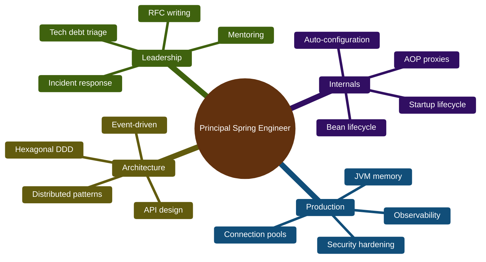
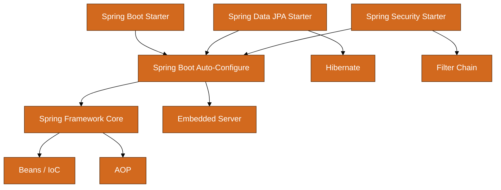
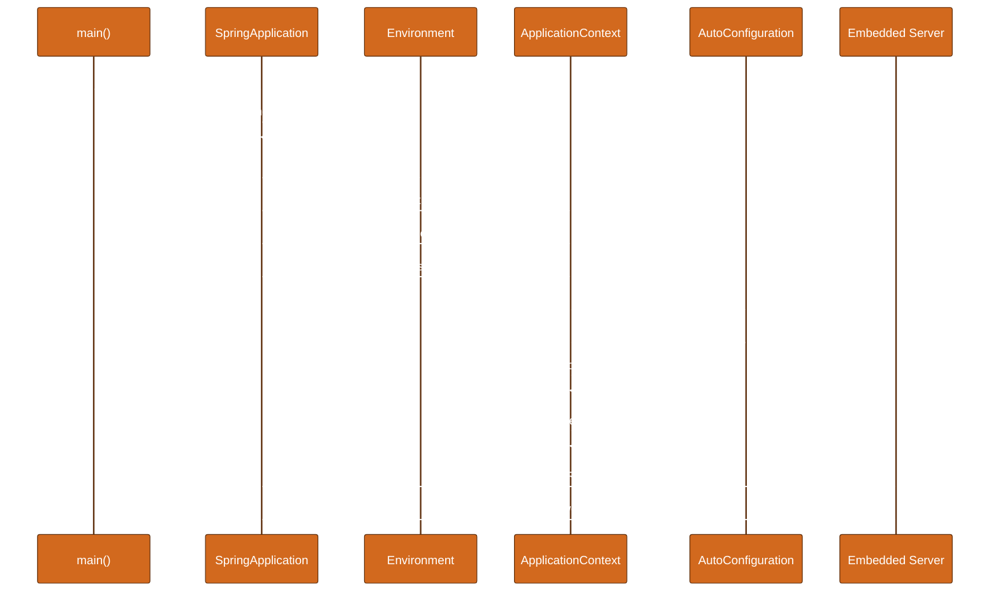
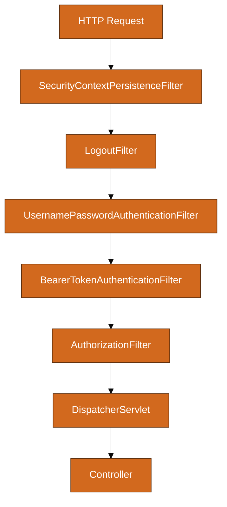
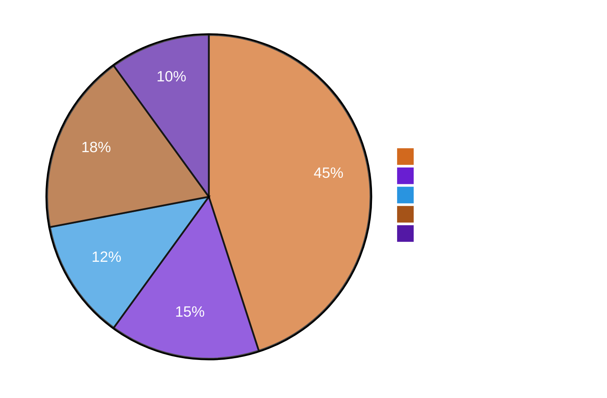
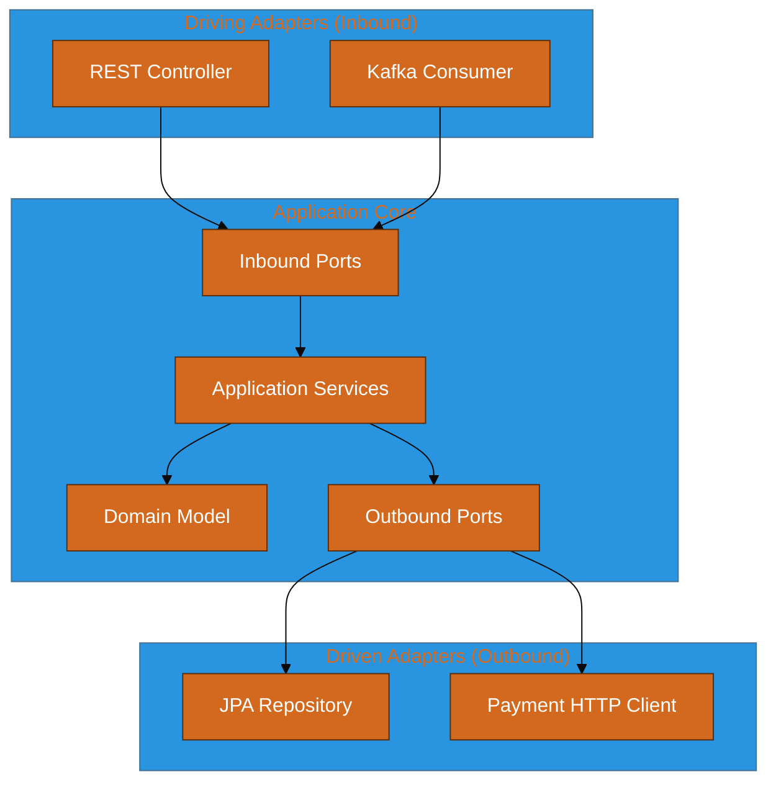
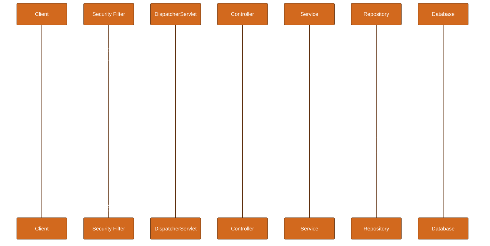

# Spring Boot Master Guide — Zero to Principal Engineer

> **Audience:** Java developers from intermediate to senior, targeting principal/staff engineer depth.
> **Goal:** Master Spring Boot internals, production operations, architecture, and interview-level fluency.
> **Format:** 20 parts (0–19) — tables, mermaid diagrams, Java 17/21 code, Never Forget boxes, 45+ interview Q&A.

**Related:** [JVM Master Guide](JVM-MASTER-GUIDE.md) (heap, GC, tuning for Spring Boot services) · [Design Patterns Master Guide](DESIGN-PATTERNS-MASTER-GUIDE.md)

---

## Table of Contents

- [Part 0: How to Use + Principal Engineer Skill Map](#part-0-how-to-use--principal-engineer-skill-map)
- [Part 1: Spring Ecosystem Overview](#part-1-spring-ecosystem-overview)
- [Part 2: Spring Boot Startup Process — Deep Dive](#part-2-spring-boot-startup-process--deep-dive)
- [Part 3: Annotations Encyclopedia](#part-3-annotations-encyclopedia)
- [Part 4: Auto-Configuration Internals](#part-4-auto-configuration-internals)
- [Part 5: Dependency Injection Deep Dive](#part-5-dependency-injection-deep-dive)
- [Part 6: Configuration](#part-6-configuration)
- [Part 7: Web Layer](#part-7-web-layer)
- [Part 8: Data Layer](#part-8-data-layer)
- [Part 9: Security](#part-9-security)
- [Part 10: Messaging and Integration](#part-10-messaging-and-integration)
- [Part 11: Observability](#part-11-observability)
- [Part 12: Memory Management in Spring Boot Apps](#part-12-memory-management-in-spring-boot-apps)
- [Part 13: Multithreading and Concurrency](#part-13-multithreading-and-concurrency)
- [Part 14: Performance Optimization](#part-14-performance-optimization)
- [Part 15: Clean Code and Architecture Patterns](#part-15-clean-code-and-architecture-patterns)
- [Part 16: Underlying Design Patterns in Spring](#part-16-underlying-design-patterns-in-spring)
- [Part 17: Testing at Principal Level](#part-17-testing-at-principal-level)
- [Part 18: Senior/Principal Interview Q&A](#part-18-seniorprincipal-interview-qa)
- [Part 19: Master Cheat Sheet](#part-19-master-cheat-sheet)

---

# Part 0: How to Use + Principal Engineer Skill Map

## How to Use This Guide

This guide is a **linear curriculum** with optional branch tracks. Read Part 0 and Part 1 first. Parts 2–4 cover **internals**. Parts 5–11 are **production domains**. Parts 12–14 are **runtime engineering**. Parts 15–17 are **architecture and quality**. Part 18 is **interview prep**. Part 19 is your **desk reference**.

### Reading Modes

| Mode | Who | How |
|------|-----|-----|
| **Foundation Sprint** | Mid-level Java dev new to Spring | Parts 0→1→3→5→6→7→8 |
| **Internals Track** | Senior debugging startup/config | Parts 2→4→5→16 |
| **Production Track** | Tech lead shipping to prod | Parts 6→9→11→12→14 |
| **Architecture Track** | Staff/principal candidate | Parts 15→16→17→18 |
| **Interview Sprint** | 4-week prep | Part 18 daily + Part 19 flash cards |

### Study Principles

1. **Run the code.** Every snippet targets Spring Boot 3.2+ with Java 17 or 21.
2. **Trace startup once.** Add `--debug` and read `ConditionEvaluationReport`.
3. **Break things safely.** Disable auto-config, create circular deps, leak connections.
4. **Write design docs.** Summarize one production decision per part.
5. **Spaced repetition.** Revisit Never Forget boxes weekly.

### Principal Engineer Skill Map


### Skill Depth Matrix

| Skill Area | Senior | Staff | Principal |
|------------|--------|-------|-----------|
| Spring Boot internals | Knows auto-config categories | Traces startup, writes custom starters | Platform conventions for org |
| Transactions | `@Transactional` on services | Isolation/propagation edge cases | Saga/outbox across services |
| Security | OAuth2 resource server | Threat models auth flows | Zero-trust integration |
| Performance | Caching, pool tuning | JVM profiling, N+1 fixes | Capacity models, SLO architecture |
| Testing | Unit + integration | Testcontainers, contracts | Testing strategy at scale |
| Observability | Actuator endpoints | Custom metrics, tracing | Golden signals org-wide |

### 12-Month Principal Path

| Quarter | Focus | Milestone |
|---------|-------|-----------|
| Q1 | Parts 0–4 | Custom starter; startup sequence diagram |
| Q2 | Parts 5–9 | Production API with OAuth2, Flyway |
| Q3 | Parts 10–14 | Kafka + tracing; JVM tuning doc |
| Q4 | Parts 15–19 | Hexagonal refactor; 40 interview answers |
> **Never Forget:** Principal engineers know **where to look**, **how the container thinks**, and **how to make safe defaults for everyone else**.

---


# Part 1: Spring Ecosystem Overview

## The Spring Family Tree

| Project | What It Is | When You Need It |
|---------|-----------|------------------|
| **Spring Framework** | Core IoC, AOP, MVC, JDBC, TX | Always (Boot embeds it) |
| **Spring Boot** | Opinionated auto-config + embedded server | Default for new apps |
| **Spring Data** | Repository abstractions (JPA, JDBC, Redis, Mongo) | Data access |
| **Spring Security** | AuthN/AuthZ filter chain | Any secured app |
| **Spring Cloud** | Distributed patterns (config, discovery, gateway) | Microservices |
| **Spring Batch** | Chunk-oriented batch jobs | ETL, large file processing |
| **Spring Integration** | Enterprise integration patterns | Legacy system bridges |

### Spring Framework vs Spring Boot

| Aspect | Spring Framework | Spring Boot |
|--------|------------------|-------------|
| Configuration | Manual `@Configuration`, XML (legacy) | Auto-configuration + conventions |
| Server | Deploy WAR to Tomcat | Embedded Tomcat/Jetty/Undertow |
| Dependencies | Manual version alignment | BOM (`spring-boot-dependencies`) |
| Entry point | `AnnotationConfigApplicationContext` | `SpringApplication.run()` |
| Production readiness | Add Actuator manually | Starters include health/metrics |

### Spring Boot vs Spring Cloud

```java
// Spring Boot — single deployable service
@SpringBootApplication
public class OrderServiceApplication {
    public static void main(String[] args) {
        SpringApplication.run(OrderServiceApplication.class, args);
    }
}
```

```java
// Spring Cloud — Boot + distributed infrastructure
@SpringBootApplication
@EnableDiscoveryClient
@EnableFeignClients
public class OrderServiceApplication {
    public static void main(String[] args) {
        SpringApplication.run(OrderServiceApplication.class, args);
    }
}
```

### Version Alignment (2024–2026)

| Spring Boot | Spring Framework | Java | Jakarta EE |
|-------------|------------------|------|------------|
| 3.0.x | 6.0.x | 17+ | EE 9 (jakarta.*) |
| 3.2.x | 6.1.x | 17+ | EE 10 |
| 3.3.x | 6.1.x | 17–21 | EE 10 |
| 3.4.x | 6.2.x | 17–21 | EE 10 |

### Module Dependency Graph


### Typical Layered Architecture

| Layer | Responsibility | Spring Artifacts |
|-------|---------------|------------------|
| Presentation | HTTP, DTOs, validation | `@RestController`, `@ControllerAdvice` |
| Application | Use cases, orchestration | `@Service`, events |
| Domain | Business rules, entities | Plain Java (prefer no Spring) |
| Infrastructure | DB, messaging, external APIs | `@Repository`, `@Configuration` |

### Minimal pom.xml (Maven)

```xml
<parent>
    <groupId>org.springframework.boot</groupId>
    <artifactId>spring-boot-starter-parent</artifactId>
    <version>3.3.5</version>
</parent>
<dependencies>
    <dependency>
        <groupId>org.springframework.boot</groupId>
        <artifactId>spring-boot-starter-web</artifactId>
    </dependency>
    <dependency>
        <groupId>org.springframework.boot</groupId>
        <artifactId>spring-boot-starter-data-jpa</artifactId>
    </dependency>
    <dependency>
        <groupId>org.springframework.boot</groupId>
        <artifactId>spring-boot-starter-test</artifactId>
        <scope>test</scope>
    </dependency>
</dependencies>
```
> **Never Forget:** Spring Boot is **not a replacement** for Spring Framework — it is **opinionated composition** of Framework modules with production defaults.

---


# Part 2: Spring Boot Startup Process — Deep Dive

Understanding startup is the **#1 differentiator** between mid-level and principal Spring engineers.

## High-Level Sequence


## Step 1: main() and SpringApplication Construction

```java
@SpringBootApplication
public class DemoApplication {
    public static void main(String[] args) {
        SpringApplication app = new SpringApplication(DemoApplication.class);
        app.setBannerMode(Banner.Mode.OFF);
        app.setAdditionalProfiles("local");
        app.run(args);
    }
}
```

`@SpringBootApplication` is a composed annotation:

```java
@Target(ElementType.TYPE)
@Retention(RetentionPolicy.RUNTIME)
@Documented
@Inherited
@SpringBootConfiguration
@EnableAutoConfiguration
@ComponentScan(excludeFilters = { /* ... */ })
public @interface SpringBootApplication { }
```

| Meta-Annotation | Purpose |
|-----------------|---------|
| `@SpringBootConfiguration` | Marks `@Configuration` for Boot-specific processing |
| `@EnableAutoConfiguration` | Imports auto-config classes via `AutoConfigurationImportSelector` |
| `@ComponentScan` | Scans package of main class and sub-packages |

## Step 2: SpringApplication.run() Internals

```java
public ConfigurableApplicationContext run(String... args) {
    Startup startup = Startup.create();
    // 1. Create BootstrapContext (logging, startup metrics)
    DefaultBootstrapContext bootstrapContext = createBootstrapContext();
    // 2. Configure headless, converters, listeners
    configureHeadlessProperty();
    // 3. Get and prepare Environment
    ConfigurableEnvironment environment = prepareEnvironment(bootstrapContext, listeners);
    // 4. Print banner
    Banner printedBanner = printBanner(environment);
    // 5. Create ApplicationContext
    ConfigurableApplicationContext context = createApplicationContext();
    // 6. Prepare context (post-process, apply initializers, listeners)
    prepareContext(bootstrapContext, context, environment, listeners, printedBanner, args);
    // 7. REFRESH — the heavy lifting
    refreshContext(context);
    // 8. After refresh hooks
    afterRefresh(context, applicationArguments);
    // 9. Call ApplicationRunner / CommandLineRunner
    callRunners(context, applicationArguments);
    return context;
}
```

## Step 3: Environment Preparation

```java
// application.yml layers (lowest to highest priority for same key — last wins in merge)
// 1. defaultProperties (SpringApplication.setDefaultProperties)
// 2. @PropertySource
// 3. Config data (application.yml, application-{profile}.yml)
// 4. OS environment variables
// 5. System properties
// 6. Command line args (--server.port=9090)
```

| Property Source | Example | Typical Use |
|----------------|---------|-------------|
| `application.yml` | `server.port: 8080` | Defaults |
| `application-prod.yml` | `logging.level.root: WARN` | Profile overrides |
| Env var | `SPRING_DATASOURCE_URL` | Container/K8s secrets |
| CLI | `--spring.profiles.active=prod` | Deployment-time |

### EnvironmentPostProcessor

Runs **before** context refresh — can mutate environment early:

```java
public class CustomEnvironmentPostProcessor implements EnvironmentPostProcessor {
    @Override
    public void postProcessEnvironment(ConfigurableEnvironment env, SpringApplication app) {
        Map<String, Object> map = new HashMap<>();
        map.put("app.region", System.getenv().getOrDefault("AWS_REGION", "local"));
        env.getPropertySources().addFirst(new MapPropertySource("custom", map));
    }
}
```

Register in `META-INF/spring/org.springframework.boot.env.EnvironmentPostProcessor`:

```
com.example.CustomEnvironmentPostProcessor
```

## Step 4: ApplicationContext Creation

| Web Type | Context Class |
|----------|---------------|
| Servlet (default) | `AnnotationConfigServletWebServerApplicationContext` |
| Reactive | `AnnotationConfigReactiveWebServerApplicationContext` |
| None | `AnnotationConfigApplicationContext` |

## Step 5: Context Refresh — The Core

```java
// AbstractApplicationContext.refresh() — simplified
public void refresh() throws BeansException {
    prepareRefresh();
    ConfigurableListableBeanFactory beanFactory = obtainFreshBeanFactory();
    prepareBeanFactory(beanFactory);
    postProcessBeanFactory(beanFactory);          // BeanFactoryPostProcessors
    invokeBeanFactoryPostProcessors(beanFactory);
    registerBeanPostProcessors(beanFactory);      // BeanPostProcessors
    initMessageSource();
    initApplicationEventMulticaster();
    onRefresh();                                   // Subclass hook — starts embedded server
    registerListeners();
    finishBeanFactoryInitialization(beanFactory); // Instantiate all singletons
    finishRefresh();                               // LifecycleProcessor.onRefresh()
}
```

### BeanFactoryPostProcessor vs BeanPostProcessor

| Type | When | Examples | Can modify |
|------|------|----------|------------|
| **BeanFactoryPostProcessor** | Before bean creation | `PropertySourcesPlaceholderConfigurer`, `@Configuration` parsing | Bean **definitions** |
| **BeanPostProcessor** | Before/after each bean init | `@Autowired` processing, AOP proxy creation | Bean **instances** |

### BeanPostProcessor Order (Critical)

| Order | Processor | Effect |
|-------|-----------|--------|
| Early | `AutowiredAnnotationBeanPostProcessor` | Field/constructor injection |
| Mid | `CommonAnnotationBeanPostProcessor` | `@PostConstruct`, `@PreDestroy` |
| Late | `AnnotationAwareAspectJAutoProxyCreator` | Creates AOP proxies |
| Last | `ApplicationListenerDetector` | Registers listeners |

```java
@Component
public class TimingBeanPostProcessor implements BeanPostProcessor, Ordered {
    @Override
    public Object postProcessBeforeInitialization(Object bean, String name) {
        return bean;
    }
    @Override
    public Object postProcessAfterInitialization(Object bean, String name) {
        if (bean.getClass().getName().startsWith("com.example")) {
            System.out.println("Initialized: " + name);
        }
        return bean;
    }
    @Override
    public int getOrder() { return Ordered.LOWEST_PRECEDENCE; }
}
```

## Step 6: Auto-Configuration Pipeline

```mermaid
%%{init: {'theme': 'base', 'themeVariables': {'primaryColor': '#D2691E', 'primaryTextColor': '#ffffff', 'primaryBorderColor': '#5D2E0C'}}}%%
flowchart TD
    A[@EnableAutoConfiguration] --> B[AutoConfigurationImportSelector]
    B --> C[Load META-INF/spring/org.springframework.boot.autoconfigure.AutoConfiguration.imports]
    C --> D[Filter with @ConditionalOnClass etc.]
    D --> E[Sort with @AutoConfigureBefore/After/Order]
    E --> F[Apply @Import selectors]
    F --> G[Register @Configuration classes]
    G --> H[ConditionEvaluationReport]
```

Enable debug logging:

```yaml
logging:
  level:
    org.springframework.boot.autoconfigure: DEBUG
```

Or run with `--debug`.

## Step 7: Conditional Beans

```java
@Configuration
@ConditionalOnClass(DataSource.class)
@ConditionalOnProperty(name = "app.db.enabled", havingValue = "true", matchIfMissing = true)
@EnableConfigurationProperties(DatabaseProperties.class)
public class DatabaseAutoConfiguration {

    @Bean
    @ConditionalOnMissingBean
    public DataSource dataSource(DatabaseProperties props) {
        HikariDataSource ds = new HikariDataSource();
        ds.setJdbcUrl(props.getUrl());
        ds.setUsername(props.getUsername());
        ds.setPassword(props.getPassword());
        return ds;
    }
}
```

| Annotation | Condition |
|------------|-----------|
| `@ConditionalOnClass` | Class present on classpath |
| `@ConditionalOnMissingClass` | Class absent |
| `@ConditionalOnBean` | Bean already registered |
| `@ConditionalOnMissingBean` | Bean not registered |
| `@ConditionalOnProperty` | Property matches |
| `@ConditionalOnWebApplication` | Servlet or reactive web app |
| `@ConditionalOnExpression` | SpEL evaluates true |

## Step 8: Embedded Server Start

During `onRefresh()` for web apps, `ServletWebServerApplicationContext` starts the embedded container:

```java
// Simplified flow
protected void onRefresh() {
    createWebServer();  // Tomcat/Jetty/Undertow
}
// WebServerStartStopLifecycle starts server after context refresh
```

```yaml
server:
  port: 8080
  servlet:
    context-path: /api
  tomcat:
    threads:
      max: 200
      min-spare: 10
    accept-count: 100
```

## Step 9: ApplicationRunner and CommandLineRunner

```java
@Component
@Order(1)
public class CacheWarmupRunner implements ApplicationRunner {
    private final ProductCache cache;
    public CacheWarmupRunner(ProductCache cache) { this.cache = cache; }

    @Override
    public void run(ApplicationArguments args) {
        cache.warmup();
    }
}

@Component
@Order(2)
public class MigrationCheckRunner implements CommandLineRunner {
    @Override
    public void run(String... args) {
        // args from command line
    }
}
```

## Startup Timeline Debugging

```java
@SpringBootApplication
public class DemoApplication {
    public static void main(String[] args) {
        SpringApplication app = new SpringApplication(DemoApplication.class);
        app.addListeners((ApplicationListener<ApplicationReadyEvent>) event -> {
            System.out.println("Ready in: " + event.getTimeTaken());
        });
        app.run(args);
    }
}
```

| Phase | Typical Duration | If Slow, Check |
|-------|-----------------|----------------|
| Context refresh | 1–5s | Too many beans, slow `@PostConstruct` |
| JPA/Hibernate init | 0.5–3s | `ddl-auto`, metadata scan |
| Flyway/Liquibase | 0.1–10s | Migration count, lock contention |
| Connection pool init | 0.1–1s | DB unreachable, timeout |
| Actuator/Metrics | 0.1–0.5s | Excessive meter registration |
> **Never Forget:** Startup failures at **bean creation** almost always mean a **missing dependency**, **circular reference**, or **wrong `@Conditional`** — read the full stack trace, not just the last line.

---


# Part 3: Annotations Encyclopedia

Complete reference grouped by domain. Each entry: **Purpose**, **Example**, **When to Use**.

## Core / Stereotype Annotations

| Annotation | Purpose | Example | When to Use |
|------------|---------|---------|-------------|
| `@Component` | Generic Spring-managed bean | `@Component class EmailValidator` | Utility beans without layer semantics |
| `@Service` | Business logic layer | `@Service class OrderService` | Application/use-case services |
| `@Repository` | Data access + exception translation | `@Repository interface OrderRepo extends JpaRepository` | Persistence layer |
| `@Controller` | MVC controller returning views | `@Controller class HomeController` | Server-rendered HTML |
| `@RestController` | `@Controller` + `@ResponseBody` | `@RestController class OrderApi` | REST JSON APIs |
| `@Configuration` | Source of `@Bean` definitions | `@Configuration class AppConfig` | Java-based configuration |
| `@Bean` | Register method return value as bean | `@Bean PasswordEncoder encoder()` | Third-party objects, conditional beans |
| `@Import` | Import additional config | `@Import(SecurityConfig.class)` | Modular configuration |
| `@Primary` | Preferred when multiple candidates | `@Primary @Bean ObjectMapper mapper()` | Default implementation |
| `@Qualifier` | Disambiguate injection | `@Qualifier("kafka") MessageSender sender` | Multiple same-type beans |
| `@Lazy` | Defer initialization | `@Lazy @Component class HeavyClient` | Expensive beans not always needed |
| `@Scope` | Bean lifecycle scope | `@Scope("prototype")` | Stateful or per-request beans |
| `@Profile` | Conditional on active profile | `@Profile("prod")` | Environment-specific beans |
| `@Conditional` | Custom condition class | `@Conditional(OnKafkaEnabled.class)` | Feature flags |
| `@Order` | Ordering for components/lists | `@Order(1)` | Filters, runners, advice |
| `@DependsOn` | Explicit init order | `@DependsOn("dataSource")` | Bean A must exist before B |

```java
@Configuration
public class AppConfig {
    @Bean
    @Primary
    public ObjectMapper objectMapper() {
        return new ObjectMapper()
            .registerModule(new JavaTimeModule())
            .disable(SerializationFeature.WRITE_DATES_AS_TIMESTAMPS);
    }

    @Bean("compactMapper")
    public ObjectMapper compactMapper() {
        return new ObjectMapper().setSerializationInclusion(JsonInclude.Include.NON_NULL);
    }
}

@Service
public class ReportService {
    private final ObjectMapper mapper;
    public ReportService(@Qualifier("compactMapper") ObjectMapper mapper) {
        this.mapper = mapper;
    }
}
```

## Spring Boot Annotations

| Annotation | Purpose | Example | When to Use |
|------------|---------|---------|-------------|
| `@SpringBootApplication` | Composed entry annotation | On main class | Every Boot app |
| `@EnableAutoConfiguration` | Enable auto-config (usually via above) | Rarely used directly | Custom Boot apps |
| `@EnableConfigurationProperties` | Register `@ConfigurationProperties` | `@EnableConfigurationProperties(AppProps.class)` | Type-safe config |
| `@ConfigurationProperties` | Bind prefix to POJO | `@ConfigurationProperties("app")` | Externalized config |
| `@ConditionalOn*` | Auto-config conditions | `@ConditionalOnMissingBean` | Custom starters |
| `@AutoConfigureBefore/After` | Auto-config ordering | `@AutoConfigureAfter(DataSourceAutoConfiguration.class)` | Starter ordering |
| `@SpringBootTest` | Full integration test | `@SpringBootTest webEnvironment = RANDOM_PORT` | E2E tests |
| `@WebMvcTest` | MVC slice test | `@WebMvcTest(OrderController.class)` | Controller unit tests |
| `@DataJpaTest` | JPA slice test | `@DataJpaTest` | Repository tests |
| `@MockBean` | Replace bean in test context | `@MockBean PaymentGateway gateway` | Test doubles |
| `@SpyBean` | Partial mock | `@SpyBean AuditService audit` | Verify interactions |
| `@TestConfiguration` | Test-only beans | `@TestConfiguration` inner class | Test fixtures |
| `@ImportAutoConfiguration` | Import specific auto-configs | `@ImportAutoConfiguration(RedisAutoConfiguration.class)` | Slice tests |

## Web Annotations

| Annotation | Purpose | Example | When to Use |
|------------|---------|---------|-------------|
| `@RequestMapping` | Map HTTP to handler | `@RequestMapping("/api/v1/orders")` | Class-level base path |
| `@GetMapping` | HTTP GET | `@GetMapping("/{id}")` | Read operations |
| `@PostMapping` | HTTP POST | `@PostMapping` | Create |
| `@PutMapping` | HTTP PUT | `@PutMapping("/{id}")` | Full update |
| `@PatchMapping` | HTTP PATCH | `@PatchMapping("/{id}")` | Partial update |
| `@DeleteMapping` | HTTP DELETE | `@DeleteMapping("/{id}")` | Delete |
| `@PathVariable` | URI template variable | `@PathVariable Long id` | REST path params |
| `@RequestParam` | Query parameter | `@RequestParam(defaultValue="0") int page` | Filtering, pagination |
| `@RequestBody` | Deserialize request body | `@RequestBody CreateOrderRequest req` | JSON POST/PUT |
| `@ResponseBody` | Serialize return value | On method (included in `@RestController`) | JSON response |
| `@ResponseStatus` | Set HTTP status | `@ResponseStatus(HttpStatus.CREATED)` | Non-default status |
| `@RequestHeader` | HTTP header value | `@RequestHeader("X-Request-Id") String reqId` | Correlation IDs |
| `@CookieValue` | Cookie value | `@CookieValue("session") String session` | Session cookies |
| `@ModelAttribute` | Bind form/query to object | `@ModelAttribute SearchCriteria criteria` | Form binding |
| `@CrossOrigin` | CORS config | `@CrossOrigin(origins="https://app.com")` | Dev/simple CORS |
| `@ControllerAdvice` | Global controller advice | `@ControllerAdvice class GlobalHandler` | Exception handling |
| `@ExceptionHandler` | Handle exceptions | `@ExceptionHandler(NotFoundException.class)` | Per-exception mapping |
| `@InitBinder` | WebDataBinder customization | `@InitBinder void init(WebDataBinder b)` | Date format, disallowed fields |
| `@RestControllerAdvice` | `@ControllerAdvice` + `@ResponseBody` | Exception handler for REST | API error responses |

```java
@RestController
@RequestMapping("/api/v1/orders")
@Validated
public class OrderController {
    private final OrderService orderService;
    public OrderController(OrderService orderService) { this.orderService = orderService; }

    @PostMapping
    @ResponseStatus(HttpStatus.CREATED)
    public OrderResponse create(@Valid @RequestBody CreateOrderRequest request) {
        return orderService.create(request);
    }

    @GetMapping("/{id}")
    public OrderResponse get(@PathVariable Long id) {
        return orderService.findById(id);
    }

    @GetMapping
    public Page<OrderResponse> list(
            @RequestParam(defaultValue = "0") @Min(0) int page,
            @RequestParam(defaultValue = "20") @Max(100) int size) {
        return orderService.list(PageRequest.of(page, size));
    }
}
```

## Data / JPA Annotations

| Annotation | Purpose | Example | When to Use |
|------------|---------|---------|-------------|
| `@Entity` | JPA entity | `@Entity class Order` | Persistent domain objects |
| `@Table` | Table mapping | `@Table(name="orders")` | Non-default table name |
| `@Id` | Primary key | `@Id Long id` | Every entity |
| `@GeneratedValue` | PK generation | `@GeneratedValue(strategy=IDENTITY)` | Auto-increment |
| `@Column` | Column mapping | `@Column(nullable=false, length=100)` | Constraints, naming |
| `@OneToMany` | 1:N relationship | `@OneToMany(mappedBy="order")` | Parent-child |
| `@ManyToOne` | N:1 relationship | `@ManyToOne(fetch=LAZY)` | Foreign key side |
| `@ManyToMany` | N:N relationship | With `@JoinTable` | Tags, roles |
| `@OneToOne` | 1:1 relationship | `@OneToOne(cascade=ALL)` | Profile, details |
| `@Embedded` | Embeddable value object | `@Embedded Address address` | Value objects |
| `@Embeddable` | Mark embeddable class | `@Embeddable class Money` | Composite columns |
| `@Enumerated` | Enum mapping | `@Enumerated(STRING)` | Always prefer STRING |
| `@Version` | Optimistic locking | `@Version Long version` | Concurrent updates |
| `@Transactional` | Transaction boundary | `@Transactional(readOnly=true)` | Service layer |
| `@Modifying` | DML query | `@Modifying @Query("UPDATE...")` | Bulk updates |
| `@Query` | JPQL/native query | `@Query("SELECT o FROM Order o WHERE...")` | Custom queries |
| `@EntityGraph` | Fetch graph | `@EntityGraph(attributePaths={"items"})` | Avoid N+1 |
| `@EnableJpaRepositories` | Enable Spring Data JPA | On `@Configuration` | Custom repo base |
| `@EnableJpaAuditing` | Auditing fields | With `@CreatedDate` | createdAt/updatedAt |

```java
@Entity
@Table(name = "orders", indexes = @Index(name = "idx_customer", columnList = "customer_id"))
public class Order {
    @Id @GeneratedValue(strategy = GenerationType.IDENTITY)
    private Long id;

    @Column(nullable = false)
    private Long customerId;

    @Enumerated(EnumType.STRING)
    private OrderStatus status;

    @Version
    private Long version;

    @OneToMany(mappedBy = "order", cascade = CascadeType.ALL, orphanRemoval = true)
    private List<OrderItem> items = new ArrayList<>();
}
```

## Security Annotations

| Annotation | Purpose | Example | When to Use |
|------------|---------|---------|-------------|
| `@EnableWebSecurity` | Enable Spring Security | On config class | Servlet security |
| `@EnableMethodSecurity` | Method-level security | `@EnableMethodSecurity` | `@PreAuthorize` |
| `@PreAuthorize` | SpEL before method | `@PreAuthorize("hasRole('ADMIN')")` | Fine-grained authz |
| `@PostAuthorize` | SpEL after method | `@PostAuthorize("returnObject.owner == authentication.name")` | Return value check |
| `@Secured` | Role-based (legacy) | `@Secured("ROLE_ADMIN")` | Simple role checks |
| `@RolesAllowed` | JSR-250 | `@RolesAllowed("ADMIN")` | Standard annotation |
| `@EnableOAuth2ResourceServer` | OAuth2 JWT resource server | On config | API with JWT |
| `@WithMockUser` | Test security context | `@WithMockUser(roles="ADMIN")` | Security tests |
| `@WithUserDetails` | Custom UserDetails in test | `@WithUserDetails("admin@test.com")` | Realistic auth tests |

## Validation Annotations

| Annotation | Purpose | Example | When to Use |
|------------|---------|---------|-------------|
| `@Valid` | Trigger validation cascade | `@Valid @RequestBody Request req` | Nested object validation |
| `@Validated` | Enable method validation | On class with `@RequestParam` constraints | Parameter validation |
| `@NotNull` | Must not be null | `@NotNull Long customerId` | Required fields |
| `@NotBlank` | Non-null non-empty string | `@NotBlank String name` | String required |
| `@NotEmpty` | Collection/string not empty | `@NotEmpty List<Item> items` | Non-empty collections |
| `@Size` | Size constraint | `@Size(min=8, max=64) String password` | Length limits |
| `@Min` / `@Max` | Numeric bounds | `@Min(0) int quantity` | Range validation |
| `@Email` | Email format | `@Email String email` | Email fields |
| `@Pattern` | Regex | `@Pattern(regexp="[A-Z]{2}\d{4}")` | Custom formats |
| `@Past` / `@Future` | Date constraints | `@Future Instant deliveryDate` | Temporal validation |
| `@Positive` | Positive number | `@Positive BigDecimal amount` | Money, counts |

## AOP Annotations

| Annotation | Purpose | Example | When to Use |
|------------|---------|---------|-------------|
| `@Aspect` | Mark aspect class | `@Aspect @Component class LoggingAspect` | Cross-cutting concerns |
| `@Before` | Before advice | `@Before("execution(* com.example.service.*.*(..))")` | Logging, auth checks |
| `@After` | After advice (finally) | `@After("bean(orderService)")` | Cleanup |
| `@AfterReturning` | After normal return | `@AfterReturning(pointcut="...", returning="result")` | Audit success |
| `@AfterThrowing` | After exception | `@AfterThrowing(pointcut="...", throwing="ex")` | Error metrics |
| `@Around` | Wrap method | `@Around("@annotation(Timed)")` | Timing, transactions |
| `@Pointcut` | Named pointcut | `@Pointcut("@annotation(Timed)") void timed() {}` | Reusable cuts |
| `@EnableAspectJAutoProxy` | Enable AOP | On `@Configuration` | Usually auto-enabled |

## Scheduling / Async / Cache

| Annotation | Purpose | Example | When to Use |
|------------|---------|---------|-------------|
| `@EnableScheduling` | Enable `@Scheduled` | On main or config | Cron jobs |
| `@Scheduled` | Scheduled task | `@Scheduled(cron="0 0 * * * *")` | Periodic tasks |
| `@EnableAsync` | Enable `@Async` | On config | Async execution |
| `@Async` | Async method | `@Async void sendEmail()` | Non-blocking side effects |
| `@EnableCaching` | Enable cache abstraction | On config | Cache support |
| `@Cacheable` | Cache method result | `@Cacheable("products")` | Read-heavy data |
| `@CacheEvict` | Remove cache entry | `@CacheEvict(key="#id")` | After update/delete |
| `@CachePut` | Update cache | `@CachePut(key="#product.id")` | Write-through cache |

## Actuator / Cloud (Selected)

| Annotation | Purpose | Example | When to Use |
|------------|---------|---------|-------------|
| `@Endpoint` | Custom actuator endpoint | `@Endpoint(id="features")` | Custom ops endpoints |
| `@ReadOperation` | GET on endpoint | On endpoint method | Read-only ops |
| `@WriteOperation` | POST on endpoint | On endpoint method | Mutating ops |
| `@EnableDiscoveryClient` | Service registration | On main class | Eureka/Consul |
| `@LoadBalanced` | Client-side LB | `@LoadBalanced @Bean RestTemplate` | Inter-service calls |
| `@RefreshScope` | Refresh config beans | `@RefreshScope @Component` | Cloud Config refresh |

## Test Annotations

| Annotation | Purpose | Example | When to Use |
|------------|---------|---------|-------------|
| `@SpringBootTest` | Full context | `@SpringBootTest` | Integration tests |
| `@AutoConfigureMockMvc` | MockMvc setup | With `@WebMvcTest` or `@SpringBootTest` | HTTP testing |
| `@TestPropertySource` | Override properties | `@TestPropertySource(properties="app.feature=true")` | Test config |
| `@DynamicPropertySource` | Dynamic properties | Static method with `DynamicPropertyRegistry` | Testcontainers |
| `@Sql` | Run SQL scripts | `@Sql("/data/orders.sql")` | Test data setup |
| `@DirtiesContext` | Reset context | `@DirtiesContext(classMode=AFTER_EACH_TEST_METHOD)` | Stateful tests |
| `@Transactional` (test) | Rollback after test | On test method | DB test isolation |
| `@ActiveProfiles` | Activate profile | `@ActiveProfiles("test")` | Profile-specific tests |

```java
@SpringBootTest
@AutoConfigureMockMvc
@ActiveProfiles("test")
class OrderControllerIntegrationTest {
    @Autowired MockMvc mockMvc;
    @MockBean PaymentGateway paymentGateway;

    @Test
    void createsOrder() throws Exception {
        when(paymentGateway.charge(any())).thenReturn(PaymentResult.success("tx-1"));
        mockMvc.perform(post("/api/v1/orders")
                .contentType(MediaType.APPLICATION_JSON)
                .content("{"customerId":1,"items":[{"productId":10,"quantity":2}]}"))
            .andExpect(status().isCreated())
            .andExpect(jsonPath("$.id").exists());
    }
}
```
> **Never Forget:** @RestController replaces @Controller + @ResponseBody, but **does not replace validation** — always add `@Valid` on request bodies.

---


# Part 4: Auto-Configuration Internals

## How Auto-Configuration Works

Spring Boot 3.x uses `META-INF/spring/org.springframework.boot.autoconfigure.AutoConfiguration.imports` (replacing `spring.factories` for auto-config):

```
# META-INF/spring/org.springframework.boot.autoconfigure.AutoConfiguration.imports
org.springframework.boot.autoconfigure.jdbc.DataSourceAutoConfiguration
org.springframework.boot.autoconfigure.orm.jpa.HibernateJpaAutoConfiguration
com.example.autoconfigure.MyCustomAutoConfiguration
```

### Legacy spring.factories (Still Used For)

| Key | Purpose |
|-----|---------|
| `org.springframework.boot.env.EnvironmentPostProcessor` | Early environment mutation |
| `org.springframework.context.ApplicationListener` | Application event listeners |
| `org.springframework.boot.SpringBootExceptionReporter` | Custom exception reporting |
| `org.springframework.boot.autoconfigure.AutoConfiguration.imports` | **Preferred** for auto-config |

## AutoConfigurationImportSelector Flow

```java
// Simplified — what @EnableAutoConfiguration triggers
public String[] selectImports(AnnotationMetadata metadata) {
    List<String> configurations = getCandidateConfigurations(metadata, attributes);
    configurations = removeDuplicates(configurations);
    configurations = getAutoConfigurationImportFilter().filter(configurations);
    configurations = sortAutoConfigurations(configurations);
    return configurations.toArray(new String[0]);
}
```


## Writing a Custom Starter

### Project Structure

```
my-spring-boot-starter/
├── my-autoconfigure/
│   ├── src/main/java/.../MyAutoConfiguration.java
│   ├── src/main/java/.../MyProperties.java
│   └── src/main/resources/META-INF/spring/
│       └── org.springframework.boot.autoconfigure.AutoConfiguration.imports
└── my-starter/
    └── pom.xml  (depends on my-autoconfigure + optional deps)
```

### Properties Class

```java
@ConfigurationProperties(prefix = "my.feature")
public record MyProperties(
    boolean enabled,
    String endpoint,
    Duration timeout
) {
    public MyProperties {
        if (timeout == null) timeout = Duration.ofSeconds(30);
    }
}
```

### Auto-Configuration Class

```java
@AutoConfiguration
@ConditionalOnClass(MyClient.class)
@ConditionalOnProperty(prefix = "my.feature", name = "enabled", havingValue = "true")
@EnableConfigurationProperties(MyProperties.class)
public class MyAutoConfiguration {

    @Bean
    @ConditionalOnMissingBean
    public MyClient myClient(MyProperties properties) {
        return MyClient.builder()
            .endpoint(properties.endpoint())
            .timeout(properties.timeout())
            .build();
    }

    @Bean
    @ConditionalOnMissingBean
    public MyClientHealthIndicator myClientHealth(MyClient client) {
        return new MyClientHealthIndicator(client);
    }
}
```

### Starter pom.xml

```xml
<dependency>
    <groupId>com.example</groupId>
    <artifactId>my-autoconfigure</artifactId>
    <version>${project.version}</version>
</dependency>
<dependency>
    <groupId>com.example</groupId>
    <artifactId>my-client</artifactId>
    <optional>true</optional>
</dependency>
```

## Conditional Annotations Deep Reference

| Annotation | Attribute | Notes |
|------------|-----------|-------|
| `@ConditionalOnClass` | `name` or `value` | Uses `ClassLoader` — fails gracefully if missing |
| `@ConditionalOnMissingBean` | `name`, `type`, `annotation` | Most common in starters |
| `@ConditionalOnBean` | Same | Requires bean from other auto-config |
| `@ConditionalOnProperty` | `prefix`, `name`, `havingValue`, `matchIfMissing` | Feature flags |
| `@ConditionalOnResource` | `resources` | File on classpath exists |
| `@ConditionalOnWebApplication` | `type = SERVLET \| REACTIVE` | Web stack specific |
| `@ConditionalOnCloudPlatform` | `KUBERNETES`, `HEROKU`, etc. | Platform-aware config |
| `@ConditionalOnJava` | `Range` | Java version gates |

### Custom Condition

```java
public class OnKafkaEnabledCondition implements Condition {
    @Override
    public boolean matches(ConditionContext context, AnnotatedTypeMetadata metadata) {
        return context.getEnvironment()
            .getProperty("app.kafka.enabled", Boolean.class, false);
    }
}

@Configuration
@Conditional(OnKafkaEnabledCondition.class)
public class KafkaConfig { }
```

## Excluding Auto-Configuration

```java
@SpringBootApplication(exclude = {
    DataSourceAutoConfiguration.class,
    HibernateJpaAutoConfiguration.class
})
public class BatchApplication { }
```

```yaml
spring:
  autoconfigure:
    exclude:
      - org.springframework.boot.autoconfigure.jdbc.DataSourceAutoConfiguration
```

## Debugging Auto-Config

```bash
java -jar app.jar --debug 2>&1 | grep -A2 "MyAutoConfiguration"
```

```java
@Component
public class AutoConfigReportRunner implements ApplicationRunner {
    private final ConditionEvaluationReport report;
    public AutoConfigReportRunner(ObjectProvider<ConditionEvaluationReport> provider) {
        this.report = provider.getIfAvailable();
    }
    @Override
    public void run(ApplicationArguments args) {
        if (report != null) {
            report.getExclusions().forEach(e -> System.out.println("Excluded: " + e));
        }
    }
}
```
> **Never Forget:** Custom starters should use `@ConditionalOnMissingBean` so **consumers can override** — never force your beans as the only option.

---


# Part 5: Dependency Injection Deep Dive

## Injection Styles Compared

| Style | Testability | Immutability | Recommendation |
|-------|-------------|--------------|----------------|
| **Constructor** | Excellent — required deps explicit | `final` fields | **Always prefer** |
| **Setter** | Good for optional deps | Mutable | Optional/configurable deps |
| **Field** | Poor — needs reflection | Mutable | **Avoid in production code** |

```java
// PREFERRED — constructor injection
@Service
public class OrderService {
    private final OrderRepository orderRepository;
    private final PaymentGateway paymentGateway;
    private final ApplicationEventPublisher events;

    public OrderService(OrderRepository orderRepository,
                        PaymentGateway paymentGateway,
                        ApplicationEventPublisher events) {
        this.orderRepository = orderRepository;
        this.paymentGateway = paymentGateway;
        this.events = events;
    }
}

// ACCEPTABLE — optional dependency
@Service
public class NotificationService {
    private final EmailSender emailSender;
    private SmsSender smsSender;  // optional

    public NotificationService(EmailSender emailSender) {
        this.emailSender = emailSender;
    }

    @Autowired(required = false)
    public void setSmsSender(SmsSender smsSender) {
        this.smsSender = smsSender;
    }
}

// AVOID — field injection
@Service
public class BadService {
    @Autowired
    private OrderRepository orderRepository;  // hard to test, hidden dependency
}
```

## @Qualifier and @Primary

```java
public interface PaymentGateway { PaymentResult charge(Money amount); }

@Component("stripeGateway")
public class StripePaymentGateway implements PaymentGateway { /* ... */ }

@Component("paypalGateway")
public class PayPalPaymentGateway implements PaymentGateway { /* ... */ }

@Configuration
public class PaymentConfig {
    @Bean
    @Primary
    public PaymentGateway defaultGateway(@Qualifier("stripeGateway") PaymentGateway stripe) {
        return stripe;
    }
}

@Service
public class CheckoutService {
    private final PaymentGateway gateway;
    private final PaymentGateway paypal;

    public CheckoutService(PaymentGateway gateway,  // @Primary — Stripe
                           @Qualifier("paypalGateway") PaymentGateway paypal) {
        this.gateway = gateway;
        this.paypal = paypal;
    }
}
```

## Bean Scopes

| Scope | Lifecycle | Use Case |
|-------|-----------|----------|
| `singleton` (default) | One per container | Stateless services |
| `prototype` | New instance per injection | Stateful, non-thread-safe objects |
| `request` | One per HTTP request | Request-scoped data (web) |
| `session` | One per HTTP session | Shopping cart |
| `application` | One per ServletContext | App-wide cache |

```java
@Component
@Scope(value = WebApplicationContext.SCOPE_REQUEST, proxyMode = ScopedProxyMode.TARGET_CLASS)
public class RequestContext {
    private String correlationId = UUID.randomUUID().toString();
    public String getCorrelationId() { return correlationId; }
}
```

## @Lazy Injection

```java
@Service
public class ReportService {
    private final ObjectProvider<ExpensiveReportGenerator> generatorProvider;

    public ReportService(ObjectProvider<ExpensiveReportGenerator> generatorProvider) {
        this.generatorProvider = generatorProvider;
    }

    public Report generate(Long id) {
        // Only instantiated when actually needed
        return generatorProvider.getObject().generate(id);
    }
}
```

## Circular Dependency Solutions

### Problem

```
OrderService → InventoryService → OrderService (cycle)
```

Spring resolves constructor-only cycles by failing. Field/setter injection can break cycles via early references.

### Solution 1: Redesign (Best)

Extract shared logic to a third service or use events.

```java
@Service
public class OrderInventoryCoordinator {
    private final OrderRepository orders;
    private final InventoryRepository inventory;
    // Both OrderService and InventoryService depend on this, not each other
}
```

### Solution 2: @Lazy on one dependency

```java
@Service
public class OrderService {
    public OrderService(@Lazy InventoryService inventory) {
        this.inventory = inventory;
    }
}
```

### Solution 3: ObjectProvider

```java
@Service
public class OrderService {
    private final ObjectProvider<InventoryService> inventory;
    public OrderService(ObjectProvider<InventoryService> inventory) {
        this.inventory = inventory;
    }
    void checkStock(Long productId) {
        inventory.getObject().check(productId);
    }
}
```

### Solution 4: ApplicationEventPublisher (Decoupled)

```java
@Service
public class OrderService {
    private final ApplicationEventPublisher publisher;
    public OrderPlacedResponse placeOrder(OrderRequest req) {
        Order order = /* save */;
        publisher.publishEvent(new OrderPlacedEvent(order.getId()));
        return toResponse(order);
    }
}

@Component
public class InventoryListener {
    @EventListener
    @Async
    public void onOrderPlaced(OrderPlacedEvent event) {
        // decrement stock — no circular dependency
    }
}
```

## ObjectProvider, Provider, @Autowired Optional

```java
@Service
public class FeatureService {
    private final Optional<ExperimentalFeature> experimental;

    public FeatureService(Optional<ExperimentalFeature> experimental) {
        this.experimental = experimental;
    }

    public void execute() {
        experimental.ifPresent(ExperimentalFeature::run);
    }
}
```
> **Never Forget:** Circular dependencies are a **design smell** — `@Lazy` is a bandage, not architecture.

---


# Part 6: Configuration

## @ConfigurationProperties vs @Value

| Aspect | @ConfigurationProperties | @Value |
|--------|-------------------------|--------|
| Type safety | Strong — binds to record/class | String + conversion |
| Validation | `@Validated` + JSR-380 | Manual |
| Relaxed binding | `app.db-url` → `dbUrl` | Exact key |
| Prefix grouping | `app.*` namespace | Single property |
| Recommendation | **Production config** | Simple one-offs |

```java
@ConfigurationProperties(prefix = "app.payment")
@Validated
public record PaymentProperties(
    @NotBlank String provider,
    @Min(1) @Max(5) int retryAttempts,
    Duration timeout,
    List<String> allowedCurrencies
) {}

@Configuration
@EnableConfigurationProperties(PaymentProperties.class)
public class PaymentConfig { }
```

```yaml
app:
  payment:
    provider: stripe
    retry-attempts: 3
    timeout: 30s
    allowed-currencies:
      - USD
      - EUR
```

## @Value Pitfalls

```java
// BAD — fails if property missing (unless default provided)
@Value("${app.legacy.endpoint}")
private String endpoint;

// GOOD — default value
@Value("${app.legacy.endpoint:http://localhost:8080}")
private String endpoint;

// BAD — SpEL injection risk if value comes from untrusted source
@Value("#{systemProperties['user.home']}")
private String home;

// BAD — cannot inject into final field without constructor
@Value("${app.name}")
private final String name;  // compile error or requires @AllArgsConstructor hack
```

## Profiles

```yaml
# application.yml
spring:
  profiles:
    active: ${SPRING_PROFILES_ACTIVE:dev}

---
spring:
  config:
    activate:
      on-profile: dev
logging:
  level:
    com.example: DEBUG

---
spring:
  config:
    activate:
      on-profile: prod
logging:
  level:
    root: WARN
```

```java
@Configuration
@Profile("prod")
public class ProdSecurityConfig {
    @Bean
    public SecurityFilterChain filterChain(HttpSecurity http) throws Exception {
        return http
            .requiresChannel(channel -> channel.anyRequest().requiresSecure())
            .build();
    }
}

@Component
@Profile("!test")
public class StartupBanner implements ApplicationRunner {
    @Override
    public void run(ApplicationArguments args) {
        log.info("Production instance started");
    }
}
```

## Externalized Configuration Hierarchy

| Source | Example | Priority (high wins) |
|--------|---------|---------------------|
| Command line | `--server.port=9090` | Highest |
| SPRING_APPLICATION_JSON | Env var JSON blob | High |
| OS environment | `SERVER_PORT=9090` | High |
| application-{profile}.properties | Profile-specific | Medium |
| application.properties | Defaults | Low |
| @PropertySource | Custom files | Depends on order |
| Default properties | `SpringApplication.setDefaultProperties` | Lowest |

## Secrets Management

```java
// NEVER do this
@Value("${db.password}")
private String password;  // in source-controlled application.yml

// DO — environment variable (K8s Secret → env)
// SPRING_DATASOURCE_PASSWORD injected at runtime

@Configuration
public class VaultConfig {
    @Bean
    public VaultTemplate vaultTemplate() {
        VaultEndpoint endpoint = VaultEndpoint.create("vault.example.com", 8200);
        return new VaultTemplate(endpoint, new TokenAuthentication("..."));
    }
}
```

```yaml
# Kubernetes Secret → env var mapping
spring:
  datasource:
    url: ${DB_URL}
    username: ${DB_USERNAME}
    password: ${DB_PASSWORD}
```

### Secrets Checklist

| Rule | Why |
|------|-----|
| Never commit secrets to Git | History is forever |
| Rotate credentials regularly | Blast radius reduction |
| Use secret managers (Vault, AWS SM) | Audit trail, dynamic secrets |
| Separate config per environment | Prod secrets != dev secrets |
| Mask secrets in logs | `@ToString(exclude="password")` |
> **Never Forget:** @ConfigurationProperties with `@Validated` catches **misconfiguration at startup** — fail fast beats production surprises.

---


# Part 7: Web Layer

## REST API Design

```java
@RestController
@RequestMapping("/api/v1/customers/{customerId}/orders")
public class CustomerOrderController {
    private final OrderService orderService;
    public CustomerOrderController(OrderService orderService) { this.orderService = orderService; }

    @PostMapping
    @ResponseStatus(HttpStatus.CREATED)
    public ResponseEntity<OrderResponse> create(
            @PathVariable Long customerId,
            @Valid @RequestBody CreateOrderRequest request,
            UriComponentsBuilder uriBuilder) {
        OrderResponse created = orderService.create(customerId, request);
        URI location = uriBuilder.path("/api/v1/orders/{id}")
            .buildAndExpand(created.id()).toUri();
        return ResponseEntity.created(location).body(created);
    }
}
```

## DTO Pattern

```java
public record CreateOrderRequest(
    @NotEmpty List<OrderItemRequest> items,
    @NotNull @Positive Long shippingAddressId
) {}

public record OrderResponse(
    Long id,
    OrderStatus status,
    BigDecimal total,
    Instant createdAt
) {}

@Service
public class OrderService {
    public OrderResponse create(Long customerId, CreateOrderRequest request) {
        Order order = Order.create(customerId, request.items());
        order = orderRepository.save(order);
        return new OrderResponse(order.getId(), order.getStatus(),
            order.getTotal(), order.getCreatedAt());
    }
}
```

## Global Exception Handling

```java
@RestControllerAdvice
public class GlobalExceptionHandler {
    private static final Logger log = LoggerFactory.getLogger(GlobalExceptionHandler.class);

    @ExceptionHandler(MethodArgumentNotValidException.class)
    @ResponseStatus(HttpStatus.BAD_REQUEST)
    public ProblemDetail handleValidation(MethodArgumentNotValidException ex) {
        var detail = ex.getBindingResult().getFieldErrors().stream()
            .collect(Collectors.toMap(
                FieldError::getField,
                fe -> fe.getDefaultMessage() != null ? fe.getDefaultMessage() : "invalid",
                (a, b) -> a));
        ProblemDetail problem = ProblemDetail.forStatusAndDetail(HttpStatus.BAD_REQUEST, "Validation failed");
        problem.setProperty("errors", detail);
        return problem;
    }

    @ExceptionHandler(ResourceNotFoundException.class)
    @ResponseStatus(HttpStatus.NOT_FOUND)
    public ProblemDetail handleNotFound(ResourceNotFoundException ex) {
        return ProblemDetail.forStatusAndDetail(HttpStatus.NOT_FOUND, ex.getMessage());
    }

    @ExceptionHandler(Exception.class)
    @ResponseStatus(HttpStatus.INTERNAL_SERVER_ERROR)
    public ProblemDetail handleGeneral(Exception ex) {
        log.error("Unhandled exception", ex);
        return ProblemDetail.forStatusAndDetail(HttpStatus.INTERNAL_SERVER_ERROR, "Internal error");
    }
}
```

## Filters vs Interceptors

| Aspect | Filter (`javax.servlet.Filter`) | Interceptor (`HandlerInterceptor`) |
|--------|--------------------------------|-------------------------------------|
| Scope | Servlet container — all requests | Spring MVC dispatch only |
| Order | `@Order` on `@Component` | `WebMvcConfigurer.addInterceptors` |
| Access to handler | No | Yes — `HandlerMethod` |
| Use case | Security, compression, logging | Auth checks, timing, tenant context |

```java
@Component
@Order(Ordered.HIGHEST_PRECEDENCE)
public class CorrelationIdFilter extends OncePerRequestFilter {
    @Override
    protected void doFilterInternal(HttpServletRequest request,
                                      HttpServletResponse response,
                                      FilterChain chain) throws ServletException, IOException {
        String correlationId = Optional.ofNullable(request.getHeader("X-Correlation-Id"))
            .orElse(UUID.randomUUID().toString());
        MDC.put("correlationId", correlationId);
        response.setHeader("X-Correlation-Id", correlationId);
        try {
            chain.doFilter(request, response);
        } finally {
            MDC.remove("correlationId");
        }
    }
}

@Configuration
public class WebMvcConfig implements WebMvcConfigurer {
    @Override
    public void addInterceptors(InterceptorRegistry registry) {
        registry.addInterceptor(new TenantInterceptor())
            .addPathPatterns("/api/**")
            .excludePathPatterns("/api/health");
    }
}
```

## WebFlux Brief (Reactive Stack)

```java
@RestController
@RequestMapping("/api/v1/products")
public class ProductHandler {
    private final ProductRepository repository;
    public ProductHandler(ProductRepository repository) { this.repository = repository; }

    @GetMapping(produces = MediaType.APPLICATION_NDJSON_VALUE)
    public Flux<Product> streamAll() {
        return repository.findAllBy();
    }

    @GetMapping("/{id}")
    public Mono<Product> getById(@PathVariable Long id) {
        return repository.findById(id)
            .switchIfEmpty(Mono.error(new ResourceNotFoundException("Product", id)));
    }
}
```

| Servlet (MVC) | WebFlux (Reactive) |
|---------------|-------------------|
| Thread-per-request | Event loop — non-blocking |
| `spring-boot-starter-web` | `spring-boot-starter-webflux` |
| Blocking JDBC | R2DBC, WebClient |
| Mature ecosystem | Better for high concurrency I/O |

## OpenAPI / Swagger

```java
@Configuration
public class OpenApiConfig {
    @Bean
    public OpenAPI customOpenAPI() {
        return new OpenAPI()
            .info(new Info()
                .title("Order API")
                .version("v1")
                .description("Order management service"))
            .addSecurityItem(new SecurityRequirement().addList("bearerAuth"))
            .components(new Components()
                .addSecuritySchemes("bearerAuth",
                    new SecurityScheme()
                        .type(SecurityScheme.Type.HTTP)
                        .scheme("bearer")
                        .bearerFormat("JWT")));
    }
}
```

```xml
<dependency>
    <groupId>org.springdoc</groupId>
    <artifactId>springdoc-openapi-starter-webmvc-ui</artifactId>
    <version>2.6.0</version>
</dependency>
```

## HATEOAS Brief

```java
@RestController
@RequestMapping("/api/v1/orders")
public class OrderHateoasController {
    private final OrderService service;
    private final EntityModelAssembler<OrderResponse> assembler;

    @GetMapping("/{id}")
    public EntityModel<OrderResponse> get(@PathVariable Long id) {
        OrderResponse order = service.findById(id);
        return assembler.toModel(order)
            .add(linkTo(methodOn(OrderHateoasController.class).get(id)).withSelfRel())
            .add(linkTo(methodOn(OrderHateoasController.class).cancel(id)).withRel("cancel"));
    }
}
```
> **Never Forget:** Never expose JPA entities directly in REST APIs — use DTOs to control serialization and prevent **lazy-loading exceptions**.

---


# Part 8: Data Layer

## JPA Entity Best Practices

```java
@Entity
@Getter @Setter
@NoArgsConstructor(access = AccessLevel.PROTECTED)  // JPA requirement
public class Product {
    @Id @GeneratedValue(strategy = GenerationType.IDENTITY)
    private Long id;

    @Column(nullable = false, unique = true, length = 64)
    private String sku;

    @Column(nullable = false, precision = 19, scale = 4)
    private BigDecimal price;

    @Version
    private Long version;

    public static Product create(String sku, BigDecimal price) {
        Product p = new Product();
        p.sku = sku;
        p.price = price;
        return p;
    }
}
```

## Repository Pattern

```java
public interface OrderRepository extends JpaRepository<Order, Long> {
    List<Order> findByCustomerIdAndStatus(Long customerId, OrderStatus status);

    @Query("SELECT o FROM Order o JOIN FETCH o.items WHERE o.id = :id")
    Optional<Order> findByIdWithItems(@Param("id") Long id);

    @Modifying
    @Query("UPDATE Order o SET o.status = :status WHERE o.id = :id")
    int updateStatus(@Param("id") Long id, @Param("status") OrderStatus status);
}
```

## @Transactional Deep Dive

```java
@Service
public class OrderService {
    private final OrderRepository orderRepository;
    private final InventoryService inventoryService;

    @Transactional  // default: REQUIRED, readOnly=false
    public OrderResponse placeOrder(CreateOrderRequest request) {
        Order order = Order.create(request);
        orderRepository.save(order);
        inventoryService.reserve(order.getItems());  // joins same transaction
        return toResponse(order);
    }

    @Transactional(readOnly = true)
    public OrderResponse findById(Long id) {
        return orderRepository.findById(id)
            .map(this::toResponse)
            .orElseThrow(() -> new ResourceNotFoundException("Order", id));
    }
}
```

### Propagation Levels

| Propagation | Behavior | Use Case |
|-------------|----------|----------|
| `REQUIRED` (default) | Join existing or create new | Most service methods |
| `REQUIRES_NEW` | Always new transaction | Audit log independent of main TX |
| `NESTED` | Savepoint within existing | Partial rollback |
| `MANDATORY` | Must have existing TX | Called only from transactional code |
| `SUPPORTS` | Join if exists, else non-TX | Read helpers |
| `NOT_SUPPORTED` | Suspend existing TX | Non-TX operations |
| `NEVER` | Fail if TX exists | Assert non-transactional |

### Isolation Levels

| Level | Dirty Read | Non-Repeatable Read | Phantom Read | Performance |
|-------|-----------|---------------------|--------------|-------------|
| READ_UNCOMMITTED | Yes | Yes | Yes | Fastest |
| READ_COMMITTED | No | Yes | Yes | Default (PostgreSQL, Oracle) |
| REPEATABLE_READ | No | No | Yes | MySQL default |
| SERIALIZABLE | No | No | No | Slowest |

```java
@Transactional(isolation = Isolation.REPEATABLE_READ)
public void reconcileAccount(Long accountId) {
    Account account = accountRepository.findByIdForUpdate(accountId)
        .orElseThrow();
    // balance cannot change between reads within this transaction
}
```

## N+1 Problem

```java
// PROBLEM — 1 query for orders + N queries for items
List<Order> orders = orderRepository.findAll();
orders.forEach(o -> o.getItems().size());  // lazy load each

// SOLUTION 1 — JOIN FETCH
@Query("SELECT DISTINCT o FROM Order o JOIN FETCH o.items WHERE o.customerId = :cid")
List<Order> findByCustomerIdWithItems(@Param("cid") Long customerId);

// SOLUTION 2 — @EntityGraph
@EntityGraph(attributePaths = {"items"})
List<Order> findByCustomerId(Long customerId);

// SOLUTION 3 — DTO projection (best for lists)
@Query("SELECT new com.example.OrderSummary(o.id, o.status, o.total) FROM Order o WHERE o.customerId = :cid")
List<OrderSummary> findSummariesByCustomerId(@Param("cid") Long customerId);
```

## Projections

```java
public interface ProductSummary {
    Long getId();
    String getSku();
    BigDecimal getPrice();
}

public record ProductDto(Long id, String sku, BigDecimal price) {}

public interface ProductRepository extends JpaRepository<Product, Long> {
    List<ProductSummary> findByPriceGreaterThan(BigDecimal price);
    @Query("SELECT new com.example.ProductDto(p.id, p.sku, p.price) FROM Product p")
    List<ProductDto> findAllDtos();
}
```

## Flyway Migrations

```sql
-- V1__create_orders.sql
CREATE TABLE orders (
    id          BIGSERIAL PRIMARY KEY,
    customer_id BIGINT       NOT NULL,
    status      VARCHAR(32)  NOT NULL,
    total       NUMERIC(19,4) NOT NULL,
    version     BIGINT       NOT NULL DEFAULT 0,
    created_at  TIMESTAMPTZ  NOT NULL DEFAULT NOW()
);

CREATE INDEX idx_orders_customer ON orders(customer_id);
```

```yaml
spring:
  flyway:
    enabled: true
    locations: classpath:db/migration
    baseline-on-migrate: true
    validate-on-migrate: true
```

## R2DBC Brief

```java
public interface ProductRepository extends ReactiveCrudRepository<Product, Long> {
    Flux<Product> findByCategory(String category);
}

@Service
public class ProductService {
    private final ProductRepository repository;
    public Mono<Product> findById(Long id) {
        return repository.findById(id)
            .switchIfEmpty(Mono.error(new ResourceNotFoundException("Product", id)));
    }
}
```
> **Never Forget:** `@Transactional` on **private methods does not work** — Spring AOP proxies only intercept **public** methods called from **outside** the proxy.

---


# Part 9: Security

## Spring Security Filter Chain



## Basic Security Configuration (Spring Boot 3)

```java
@Configuration
@EnableWebSecurity
@EnableMethodSecurity
public class SecurityConfig {

    @Bean
    public SecurityFilterChain filterChain(HttpSecurity http) throws Exception {
        return http
            .csrf(csrf -> csrf
                .csrfTokenRepository(CookieCsrfTokenRepository.withHttpOnlyFalse())
                .ignoringRequestMatchers("/api/webhooks/**"))
            .cors(cors -> cors.configurationSource(corsConfigurationSource()))
            .sessionManagement(session -> session
                .sessionCreationPolicy(SessionCreationPolicy.STATELESS))
            .authorizeHttpRequests(auth -> auth
                .requestMatchers("/actuator/health", "/actuator/info").permitAll()
                .requestMatchers("/api/v1/public/**").permitAll()
                .requestMatchers(HttpMethod.POST, "/api/v1/orders").hasRole("CUSTOMER")
                .requestMatchers("/api/v1/admin/**").hasRole("ADMIN")
                .anyRequest().authenticated())
            .oauth2ResourceServer(oauth2 -> oauth2
                .jwt(jwt -> jwt.jwtAuthenticationConverter(jwtConverter())))
            .exceptionHandling(ex -> ex
                .authenticationEntryPoint(new BearerTokenAuthenticationEntryPoint())
                .accessDeniedHandler(new BearerTokenAccessDeniedHandler()))
            .build();
    }

    @Bean
    CorsConfigurationSource corsConfigurationSource() {
        CorsConfiguration config = new CorsConfiguration();
        config.setAllowedOrigins(List.of("https://app.example.com"));
        config.setAllowedMethods(List.of("GET", "POST", "PUT", "DELETE", "PATCH"));
        config.setAllowedHeaders(List.of("*"));
        config.setAllowCredentials(true);
        UrlBasedCorsConfigurationSource source = new UrlBasedCorsConfigurationSource();
        source.registerCorsConfiguration("/api/**", config);
        return source;
    }

    @Bean
    JwtAuthenticationConverter jwtConverter() {
        JwtGrantedAuthoritiesConverter granted = new JwtGrantedAuthoritiesConverter();
        granted.setAuthoritiesClaimName("roles");
        granted.setAuthorityPrefix("ROLE_");
        JwtAuthenticationConverter converter = new JwtAuthenticationConverter();
        converter.setJwtGrantedAuthoritiesConverter(granted);
        return converter;
    }
}
```

## OAuth2 / OIDC Resource Server

```yaml
spring:
  security:
    oauth2:
      resourceserver:
        jwt:
          issuer-uri: https://auth.example.com/realms/myrealm
          # Or explicit JWK set:
          # jwk-set-uri: https://auth.example.com/.well-known/jwks.json
```

## Method Security

```java
@Service
public class OrderService {
    @PreAuthorize("hasRole('ADMIN') or #customerId == authentication.principal.claims['sub']")
    public OrderResponse getOrder(Long customerId, Long orderId) {
        return orderRepository.findByCustomerIdAndId(customerId, orderId)
            .map(this::toResponse)
            .orElseThrow(() -> new ResourceNotFoundException("Order", orderId));
    }

    @PreAuthorize("@orderAuth.canCancel(authentication, #orderId)")
    public void cancelOrder(Long orderId) {
        // ...
    }
}

@Component("orderAuth")
public class OrderAuthorization {
    public boolean canCancel(Authentication auth, Long orderId) {
        // custom business logic
        return true;
    }
}
```

## JWT Utility (Custom Token Generation — Authorization Server separate)

```java
@Service
public class JwtService {
    private final SecretKey key;

    public JwtService(@Value("${app.jwt.secret}") String secret) {
        this.key = Keys.hmacShaKeyFor(secret.getBytes(StandardCharsets.UTF_8));
    }

    public String generateToken(String subject, Map<String, Object> claims, Duration ttl) {
        Instant now = Instant.now();
        return Jwts.builder()
            .subject(subject)
            .claims(claims)
            .issuedAt(Date.from(now))
            .expiration(Date.from(now.plus(ttl)))
            .signWith(key)
            .compact();
    }

    public Claims parseToken(String token) {
        return Jwts.parser()
            .verifyWith(key)
            .build()
            .parseSignedClaims(token)
            .getPayload();
    }
}
```

## CSRF and CORS Summary

| Concern | When Required | Spring Boot Approach |
|---------|--------------|---------------------|
| **CSRF** | Cookie-based sessions with browser forms | Enabled by default; disable only for stateless APIs |
| **CORS** | Browser cross-origin requests | `CorsConfigurationSource` bean |
| **Clickjacking** | iframe embedding | `X-Frame-Options` / CSP headers |
| **HSTS** | Force HTTPS | `http.strictTransportSecurity` |

```java
// Stateless REST API — CSRF typically disabled
http.csrf(csrf -> csrf.disable());  // ONLY for pure token-based APIs

// Session-based web app — CSRF REQUIRED
http.csrf(Customizer.withDefaults());
```
> **Never Forget:** Disabling CSRF on a **session-cookie** web app is a **critical vulnerability** — only disable for **stateless token APIs**.

---


# Part 10: Messaging and Integration

## Kafka Producer

```java
@Configuration
@EnableKafka
public class KafkaProducerConfig {
    @Bean
    public ProducerFactory<String, OrderEvent> producerFactory(
            @Value("${spring.kafka.bootstrap-servers}") String bootstrap) {
        Map<String, Object> props = new HashMap<>();
        props.put(ProducerConfig.BOOTSTRAP_SERVERS_CONFIG, bootstrap);
        props.put(ProducerConfig.KEY_SERIALIZER_CLASS_CONFIG, StringSerializer.class);
        props.put(ProducerConfig.VALUE_SERIALIZER_CLASS_CONFIG, JsonSerializer.class);
        props.put(ProducerConfig.ACKS_CONFIG, "all");
        props.put(ProducerConfig.ENABLE_IDEMPOTENCE_CONFIG, true);
        return new DefaultKafkaProducerFactory<>(props);
    }

    @Bean
    public KafkaTemplate<String, OrderEvent> kafkaTemplate(
            ProducerFactory<String, OrderEvent> factory) {
        return new KafkaTemplate<>(factory);
    }
}

@Service
public class OrderEventPublisher {
    private final KafkaTemplate<String, OrderEvent> kafkaTemplate;
    public OrderEventPublisher(KafkaTemplate<String, OrderEvent> kafkaTemplate) {
        this.kafkaTemplate = kafkaTemplate;
    }

    public void publish(OrderEvent event) {
        kafkaTemplate.send("order-events", event.orderId().toString(), event)
            .whenComplete((result, ex) -> {
                if (ex != null) log.error("Failed to publish order event", ex);
            });
    }
}
```

## Kafka Consumer

```java
@Component
public class OrderEventConsumer {
    private final InventoryService inventoryService;
    public OrderEventConsumer(InventoryService inventoryService) {
        this.inventoryService = inventoryService;
    }

    @KafkaListener(topics = "order-events", groupId = "inventory-service")
    public void handle(OrderEvent event, Acknowledgment ack) {
        inventoryService.processOrderEvent(event);
        ack.acknowledge();
    }
}
```

## RabbitMQ

```java
@Configuration
public class RabbitConfig {
    @Bean
    public Queue orderQueue() {
        return QueueBuilder.durable("orders.queue")
            .withArgument("x-dead-letter-exchange", "orders.dlx")
            .build();
    }

    @Bean
    public DirectExchange orderExchange() {
        return new DirectExchange("orders.exchange");
    }

    @Bean
    public Binding binding(Queue orderQueue, DirectExchange orderExchange) {
        return BindingBuilder.bind(orderQueue).to(orderExchange).with("order.created");
    }
}

@Service
public class OrderMessageSender {
    private final RabbitTemplate rabbitTemplate;
    public OrderMessageSender(RabbitTemplate rabbitTemplate) {
        this.rabbitTemplate = rabbitTemplate;
    }
    public void sendOrderCreated(OrderCreatedMessage msg) {
        rabbitTemplate.convertAndSend("orders.exchange", "order.created", msg);
    }
}
```

## @Async Configuration

```java
@Configuration
@EnableAsync
public class AsyncConfig implements AsyncConfigurer {
    @Override
    @Bean(name = "taskExecutor")
    public Executor getAsyncExecutor() {
        ThreadPoolTaskExecutor executor = new ThreadPoolTaskExecutor();
        executor.setCorePoolSize(4);
        executor.setMaxPoolSize(16);
        executor.setQueueCapacity(500);
        executor.setThreadNamePrefix("async-");
        executor.setRejectedExecutionHandler(new ThreadPoolExecutor.CallerRunsPolicy());
        executor.initialize();
        return executor;
    }

    @Override
    public AsyncUncaughtExceptionHandler getAsyncUncaughtExceptionHandler() {
        return (ex, method, params) ->
            log.error("Async error in {}: {}", method.getName(), ex.getMessage(), ex);
    }
}

@Service
public class EmailService {
    @Async("taskExecutor")
    public CompletableFuture<Void> sendWelcomeEmail(String email) {
        // long-running I/O
        return CompletableFuture.completedFuture(null);
    }
}
```

## @Scheduled

```java
@Component
@EnableScheduling  // on config or main
public class ReportScheduler {
    private final ReportService reportService;
    public ReportScheduler(ReportService reportService) { this.reportService = reportService; }

    @Scheduled(cron = "${app.report.cron:0 0 6 * * MON}", zone = "UTC")
    public void weeklyReport() {
        reportService.generateWeekly();
    }

    @Scheduled(fixedDelayString = "${app.cache.refresh-ms:300000}")
    public void refreshCache() {
        reportService.refreshCache();
    }
}
```

## WebClient (Reactive HTTP Client)

```java
@Configuration
public class WebClientConfig {
    @Bean
    public WebClient paymentWebClient(
            @Value("${app.payment.base-url}") String baseUrl) {
        return WebClient.builder()
            .baseUrl(baseUrl)
            .defaultHeader(HttpHeaders.CONTENT_TYPE, MediaType.APPLICATION_JSON_VALUE)
            .filter(ExchangeFilterFunction.ofRequestProcessor(request -> {
                ClientRequest modified = ClientRequest.from(request)
                    .header("X-Request-Id", UUID.randomUUID().toString())
                    .build();
                return Mono.just(modified);
            }))
            .build();
    }
}

@Service
public class PaymentClient {
    private final WebClient webClient;
    public PaymentClient(WebClient paymentWebClient) { this.webClient = paymentWebClient; }

    public Mono<PaymentResponse> charge(PaymentRequest request) {
        return webClient.post()
            .uri("/charges")
            .bodyValue(request)
            .retrieve()
            .onStatus(HttpStatusCode::isError, resp ->
                resp.bodyToMono(String.class)
                    .flatMap(body -> Mono.error(new PaymentException(body))))
            .bodyToMono(PaymentResponse.class)
            .timeout(Duration.ofSeconds(10))
            .retryWhen(Retry.backoff(3, Duration.ofMillis(200)));
    }
}
```

## RestClient (Spring 6.1+ Blocking)

```java
@Service
public class InventoryClient {
    private final RestClient restClient;
    public InventoryClient(RestClient.Builder builder,
                           @Value("${app.inventory.base-url}") String baseUrl) {
        this.restClient = builder.baseUrl(baseUrl).build();
    }

    public StockLevel getStock(Long productId) {
        return restClient.get()
            .uri("/stock/{id}", productId)
            .retrieve()
            .body(StockLevel.class);
    }
}
```
> **Never Forget:** Kafka consumers must be **idempotent** — at-least-once delivery means **duplicates will happen**.

---


# Part 11: Observability

## Actuator Endpoints

```yaml
management:
  endpoints:
    web:
      exposure:
        include: health,info,metrics,prometheus,env,loggers
      base-path: /actuator
  endpoint:
    health:
      show-details: when_authorized
      probes:
        enabled: true  # K8s liveness/readiness
  metrics:
    tags:
      application: ${spring.application.name}
      environment: ${spring.profiles.active}
  tracing:
    sampling:
      probability: 1.0
```

| Endpoint | Purpose | Production Exposure |
|----------|---------|-------------------|
| `/actuator/health` | App health + components | Public (limited) |
| `/actuator/info` | Build/version info | Public |
| `/actuator/metrics` | Micrometer metrics | Internal only |
| `/actuator/prometheus` | Prometheus scrape | Internal only |
| `/actuator/env` | Property values | **Never public** |
| `/actuator/loggers` | Dynamic log levels | Internal only |

## Custom Health Indicator

```java
@Component
public class PaymentGatewayHealthIndicator implements HealthIndicator {
    private final PaymentClient client;
    public PaymentGatewayHealthIndicator(PaymentClient client) { this.client = client; }

    @Override
    public Health health() {
        try {
            client.ping();
            return Health.up().withDetail("provider", "stripe").build();
        } catch (Exception ex) {
            return Health.down(ex).withDetail("provider", "stripe").build();
        }
    }
}
```

## Custom Metrics

```java
@Service
public class OrderService {
    private final Counter ordersCreated;
    private final Timer orderProcessingTime;

    public OrderService(MeterRegistry registry) {
        this.ordersCreated = Counter.builder("orders.created")
            .description("Total orders created")
            .tag("service", "order-service")
            .register(registry);
        this.orderProcessingTime = Timer.builder("orders.processing.time")
            .publishPercentiles(0.5, 0.95, 0.99)
            .register(registry);
    }

    public OrderResponse create(CreateOrderRequest request) {
        return orderProcessingTime.record(() -> {
            OrderResponse response = doCreate(request);
            ordersCreated.increment();
            return response;
        });
    }
}
```

## Structured Logging

```java
@Slf4j
@Service
public class OrderService {
    public OrderResponse create(CreateOrderRequest request) {
        log.info("Creating order customerId={} itemCount={}",
            request.customerId(), request.items().size());
        try {
            OrderResponse response = doCreate(request);
            log.info("Order created orderId={} total={}", response.id(), response.total());
            return response;
        } catch (Exception ex) {
            log.error("Order creation failed customerId={}", request.customerId(), ex);
            throw ex;
        }
    }
}
```

```xml
<!-- logback-spring.xml -->
<configuration>
    <springProperty name="appName" source="spring.application.name"/>
    <appender name="JSON" class="ch.qos.logback.core.ConsoleAppender">
        <encoder class="net.logstash.logback.encoder.LogstashEncoder">
            <customFields>{"service":"${appName}"}</customFields>
        </encoder>
    </appender>
    <root level="INFO">
        <appender-ref ref="JSON"/>
    </root>
</configuration>
```

## Distributed Tracing

```java
@RestController
public class OrderController {
    private final Tracer tracer;
    private final OrderService orderService;

    @PostMapping("/api/v1/orders")
    public OrderResponse create(@RequestBody CreateOrderRequest request) {
        Span span = tracer.nextSpan().name("create-order").start();
        try (Tracer.SpanInScope ws = tracer.withSpan(span)) {
            span.tag("customer.id", request.customerId().toString());
            return orderService.create(request);
        } finally {
            span.end();
        }
    }
}
```
> **Never Forget:** The **three pillars** of observability — logs, metrics, traces — must share **correlation IDs** to debug production incidents.

---


# Part 12: Memory Management in Spring Boot Apps

## JVM Memory Regions

| Region | Contents | Spring Boot Impact |
|--------|----------|-------------------|
| **Heap** | Objects, collections, cached data | `@Cacheable`, session data, DTOs |
| **Metaspace** | Class metadata, bytecode | Large classpath (many starters) |
| **Thread Stacks** | Per-thread frames | Tomcat threads (200 default max) |
| **Direct/Native** | NIO buffers, JNI, Netty | WebFlux, gRPC, native libs |
| **Code Cache** | JIT compiled code | Hot paths in framework code |



## Recommended JVM Flags

```bash
java   -Xms512m -Xmx512m   -XX:MaxMetaspaceSize=256m   -XX:+UseG1GC   -XX:MaxGCPauseMillis=200   -XX:+HeapDumpOnOutOfMemoryError   -XX:HeapDumpPath=/var/log/app/heapdump.hprof   -Djava.security.egd=file:/dev/./urandom   -jar app.jar
```

| Flag | Purpose |
|------|---------|
| `-Xms = -Xmx` | Avoid heap resize pauses |
| `MaxMetaspaceSize` | Cap class metadata (leaked classloaders) |
| `UseG1GC` | Default for Java 17+, good for services |
| `HeapDumpOnOutOfMemoryError` | Post-mortem analysis |

## Connection Pool Memory

```yaml
spring:
  datasource:
    hikari:
      maximum-pool-size: 20
      minimum-idle: 5
      connection-timeout: 30000
      idle-timeout: 600000
      max-lifetime: 1800000
```

| Pool Size | Memory Impact | Rule of Thumb |
|-----------|--------------|---------------|
| 10 connections | ~10MB JDBC overhead | `connections = (cores * 2) + effective_spindle_count` |
| 100 connections | Risk of DB overload | Rarely needed per instance |
| 200 Tomcat threads + 20 pool | Threads >> connections | Normal — threads wait on pool |

## Common Spring Memory Leaks

| Pattern | Symptom | Fix |
|---------|---------|-----|
| Static collection holding beans | Metaspace + heap growth | Remove static refs; use `@PreDestroy` |
| `@Cacheable` unbounded cache | Heap OOM | Caffeine `maximumSize`, Redis with TTL |
| ThreadLocal not cleared | Thread pool leak | Clear in `finally`; use `try/finally` in filters |
| HttpSession storing large graphs | Heap growth | DTO in session, not entities |
| DevTools classloader (dev only) | Metaspace churn | Never in production |
| Forgotten `@Scheduled` accumulating | Growing queue | Bounded queue, backpressure |

```java
// LEAK — static map grows forever
@Component
public class BadCache {
    private static final Map<String, Object> CACHE = new ConcurrentHashMap<>();
    public void put(String key, Object value) { CACHE.put(key, value); }
}

// FIX — bounded Caffeine cache
@Configuration
@EnableCaching
public class CacheConfig {
    @Bean
    public CacheManager cacheManager() {
        CaffeineCacheManager manager = new CaffeineCacheManager("products");
        manager.setCaffeine(Caffeine.newBuilder()
            .maximumSize(10_000)
            .expireAfterWrite(Duration.ofMinutes(30))
            .recordStats());
        return manager;
    }
}
```

## Monitoring Memory

```java
@Component
public class MemoryMetrics {
    public MemoryMetrics(MeterRegistry registry) {
        Gauge.builder("jvm.memory.heap.used", this, m -> m.getHeapUsed())
            .register(registry);
    }
    private double getHeapUsed() {
        MemoryMXBean bean = ManagementFactory.getMemoryMXBean();
        return bean.getHeapMemoryUsage().getUsed();
    }
}
```
> **Never Forget:** Set `-Xms` equal to `-Xmx`** — resizing the heap at runtime causes **stop-the-world GC** during growth.

---


# Part 13: Multithreading and Concurrency

## Virtual Threads (Java 21)

```yaml
spring:
  threads:
    virtual:
      enabled: true
```

```java
@Configuration
@EnableAsync
public class VirtualThreadConfig {
    @Bean
    public TomcatProtocolHandlerCustomizer<?> protocolHandlerCustomizer() {
        return protocolHandler -> protocolHandler.setExecutor(Executors.newVirtualThreadPerTaskExecutor());
    }

    @Bean(name = "taskExecutor")
    public Executor taskExecutor() {
        return Executors.newVirtualThreadPerTaskExecutor();
    }
}
```

| Aspect | Platform Threads | Virtual Threads |
|--------|-----------------|-----------------|
| Memory | ~1MB stack each | ~KB each |
| Count | Hundreds practical | Millions practical |
| Blocking I/O | Ties up OS thread | Parks cheaply |
| CPU-bound work | Good | Use platform threads |
| Spring Boot 3.2+ | Default Tomcat platform | Opt-in virtual |

## CompletableFuture in Services

```java
@Service
public class DashboardService {
    private final OrderClient orderClient;
    private final InventoryClient inventoryClient;
    private final Executor executor;

    public DashboardService(OrderClient orderClient, InventoryClient inventoryClient,
                            @Qualifier("taskExecutor") Executor executor) {
        this.orderClient = orderClient;
        this.inventoryClient = inventoryClient;
        this.executor = executor;
    }

    public DashboardResponse aggregate(Long customerId) {
        CompletableFuture<List<Order>> orders = CompletableFuture
            .supplyAsync(() -> orderClient.getOrders(customerId), executor);
        CompletableFuture<StockSummary> stock = CompletableFuture
            .supplyAsync(() -> inventoryClient.getSummary(customerId), executor);

        return CompletableFuture.allOf(orders, stock)
            .thenApply(v -> new DashboardResponse(orders.join(), stock.join()))
            .join();
    }
}
```

## TransactionSynchronization

```java
@Service
public class OrderService {
    @Transactional
    public OrderResponse placeOrder(CreateOrderRequest request) {
        Order order = orderRepository.save(Order.create(request));

        TransactionSynchronizationManager.registerSynchronization(
            new TransactionSynchronization() {
                @Override
                public void afterCommit() {
                    // Safe — DB commit succeeded; publish event
                    eventPublisher.publishEvent(new OrderPlacedEvent(order.getId()));
                }
            });

        return toResponse(order);
    }
}
```

## Concurrent Collections in Spring

```java
@Component
public class RateLimiterRegistry {
    // Thread-safe — good for shared state
    private final ConcurrentHashMap<String, RateLimiter> limiters = new ConcurrentHashMap<>();

    public RateLimiter get(String key) {
        return limiters.computeIfAbsent(key, k -> RateLimiter.create(100.0));
    }
}

// AVOID — HashMap in singleton bean accessed by multiple threads
// private final Map<String, Object> cache = new HashMap<>();  // NOT thread-safe
```
> **Never Forget:** Publish Kafka/events **after commit** via `TransactionSynchronization.afterCommit()` — not before.

---


# Part 14: Performance Optimization

## Caching Strategy

```java
@Service
@CacheConfig(cacheNames = "products")
public class ProductService {
    @Cacheable(key = "#id")
    public ProductDto findById(Long id) {
        return productRepository.findById(id)
            .map(this::toDto)
            .orElseThrow(() -> new ResourceNotFoundException("Product", id));
    }

    @CachePut(key = "#result.id()")
    @CacheEvict(cacheNames = "productLists", allEntries = true)
    public ProductDto update(Long id, UpdateProductRequest request) {
        Product product = productRepository.findById(id).orElseThrow();
        product.update(request);
        return toDto(productRepository.save(product));
    }

    @CacheEvict(key = "#id")
    public void delete(Long id) {
        productRepository.deleteById(id);
    }
}
```

## Batch Inserts

```java
@Service
public class ImportService {
    private final EntityManager em;

    @Transactional
    public void importProducts(List<Product> products) {
        int batchSize = 50;
        for (int i = 0; i < products.size(); i++) {
            em.persist(products.get(i));
            if (i > 0 && i % batchSize == 0) {
                em.flush();
                em.clear();
            }
        }
    }
}
```

```yaml
spring:
  jpa:
    properties:
      hibernate:
        jdbc:
          batch_size: 50
        order_inserts: true
        order_updates: true
```

## Read Replicas

```java
@Configuration
public class DataSourceConfig {
    @Bean
    @ConfigurationProperties("spring.datasource.primary")
    public DataSource primaryDataSource() {
        return DataSourceBuilder.create().build();
    }

    @Bean
    @ConfigurationProperties("spring.datasource.replica")
    public DataSource replicaDataSource() {
        return DataSourceBuilder.create().build();
    }

    @Bean
    public DataSource routingDataSource(
            @Qualifier("primaryDataSource") DataSource primary,
            @Qualifier("replicaDataSource") DataSource replica) {
        RoutingDataSource routing = new RoutingDataSource();
        routing.setTargetDataSources(Map.of(
            "primary", primary,
            "replica", replica
        ));
        routing.setDefaultTargetDataSource(primary);
        return routing;
    }
}

@Transactional(readOnly = true)
@Target(ElementType.METHOD)
@Retention(RetentionPolicy.RUNTIME)
public @interface ReadOnlyTransaction { }

@Aspect
@Component
public class ReadOnlyAspect {
    @Before("@annotation(ReadOnlyTransaction)")
    public void setReadOnly() {
        RoutingDataSourceContext.setRoute("replica");
    }
    @After("@annotation(ReadOnlyTransaction)")
    public void clearRoute() {
        RoutingDataSourceContext.clear();
    }
}
```

## Profiling Checklist

| Tool | What It Finds |
|------|--------------|
| `async-profiler` | CPU hotspots, allocation pressure |
| VisualVM / JFR | Heap, threads, GC |
| Hibernate statistics | N+1, slow queries |
| Micrometer percentiles | p99 latency regression |
| `EXPLAIN ANALYZE` | Missing indexes |

```bash
# Enable Hibernate stats (dev/staging only)
spring.jpa.properties.hibernate.generate_statistics=true
logging.level.org.hibernate.stat=DEBUG
```
> **Never Forget:** Profile before optimizing — **N+1 queries** and **missing indexes** cause 80% of Spring Boot slowness.

---


# Part 15: Clean Code and Architecture Patterns

## Hexagonal Architecture (Ports and Adapters)



```java
// Domain — no Spring dependencies
public class Order {
    private OrderId id;
    private OrderStatus status;
    private Money total;
    public void cancel() {
        if (status == OrderStatus.SHIPPED) throw new IllegalStateException("Cannot cancel shipped order");
        this.status = OrderStatus.CANCELLED;
    }
}

// Port (interface in domain/application layer)
public interface OrderRepository {
    Order save(Order order);
    Optional<Order> findById(OrderId id);
}

// Adapter (infrastructure)
@Repository
public class JpaOrderRepository implements OrderRepository {
    private final SpringDataOrderRepository springData;
    private final OrderMapper mapper;
    public JpaOrderRepository(SpringDataOrderRepository springData, OrderMapper mapper) {
        this.springData = springData;
        this.mapper = mapper;
    }
    @Override
    public Order save(Order order) {
        return mapper.toDomain(springData.save(mapper.toEntity(order)));
    }
}

// Application service
@Service
@Transactional
public class CancelOrderUseCase {
    private final OrderRepository orders;
    private final PaymentPort payments;
    public CancelOrderUseCase(OrderRepository orders, PaymentPort payments) {
        this.orders = orders;
        this.payments = payments;
    }
    public void execute(OrderId orderId) {
        Order order = orders.findById(orderId).orElseThrow();
        order.cancel();
        payments.refund(order.getPaymentId());
        orders.save(order);
    }
}
```

## DDD Layer Mapping

| Layer | Package | Spring Annotations |
|-------|---------|-------------------|
| Domain | `domain.model`, `domain.event` | None (pure Java) |
| Application | `application.service`, `application.port` | `@Service` on use cases |
| Infrastructure | `infrastructure.persistence`, `infrastructure.client` | `@Repository`, `@Component` |
| Interface | `interface.rest`, `interface.messaging` | `@RestController`, `@KafkaListener` |

## Strategy Pattern in Spring

```java
public interface PricingStrategy {
    boolean supports(CustomerType type);
    Money calculate(Order order);
}

@Component
public class RetailPricingStrategy implements PricingStrategy {
    public boolean supports(CustomerType type) { return type == CustomerType.RETAIL; }
    public Money calculate(Order order) { return order.subtotal(); }
}

@Component
public class WholesalePricingStrategy implements PricingStrategy {
    public boolean supports(CustomerType type) { return type == CustomerType.WHOLESALE; }
    public Money calculate(Order order) { return order.subtotal().multiply(0.85); }
}

@Service
public class PricingService {
    private final List<PricingStrategy> strategies;
    public PricingService(List<PricingStrategy> strategies) { this.strategies = strategies; }

    public Money price(Order order, CustomerType type) {
        return strategies.stream()
            .filter(s -> s.supports(type))
            .findFirst()
            .orElseThrow()
            .calculate(order);
    }
}
```

## Template Method via RestTemplate/Abstract Classes

```java
public abstract class AbstractExternalClient {
    protected final RestClient restClient;
    protected AbstractExternalClient(RestClient.Builder builder, String baseUrl) {
        this.restClient = builder.baseUrl(baseUrl).build();
    }

    protected <T> T execute(Supplier<T> call) {
        try {
            return call.get();
        } catch (RestClientException ex) {
            handleError(ex);
            throw ex;
        }
    }
    protected abstract void handleError(RestClientException ex);
}

@Component
public class InventoryClient extends AbstractExternalClient {
    public InventoryClient(RestClient.Builder builder,
                           @Value("${app.inventory.base-url}") String baseUrl) {
        super(builder, baseUrl);
    }
    public StockLevel getStock(Long id) {
        return execute(() -> restClient.get().uri("/stock/{id}", id).retrieve().body(StockLevel.class));
    }
    @Override
    protected void handleError(RestClientException ex) {
        log.warn("Inventory service error: {}", ex.getMessage());
    }
}
```

## Anti-Patterns to Avoid

| Anti-Pattern | Problem | Fix |
|--------------|---------|-----|
| **Anemic domain model** | Logic in services, entities are bags of fields | Rich domain methods |
| **God `@Service`** | 2000-line service class | Split by use case |
| **Entity in REST** | Lazy loading, tight coupling | DTOs + mappers |
| **Field injection everywhere** | Untestable, hidden deps | Constructor injection |
| **Transaction on controller** | Wrong layer, proxy issues | `@Transactional` on services |
| **Shared mutable state in singleton** | Race conditions | Immutable or concurrent structures |
| **Config in code** | Cannot change without deploy | `@ConfigurationProperties` |
> **Never Forget:** Domain layer **must not import Spring** — if `domain` depends on `@Entity`, you've coupled business rules to infrastructure.

---


# Part 16: Underlying Design Patterns in Spring

## IoC / DI Container

Spring's `ApplicationContext` is a **sophisticated factory** that manages object lifecycle, wiring, and configuration.

```java
// Without IoC
OrderService service = new OrderService(
    new JpaOrderRepository(new EntityManager(...)),
    new StripePaymentGateway(apiKey)
);

// With IoC — container resolves graph
@Autowired OrderService service;  // all deps injected
```

## Factory Pattern

```java
@Configuration
public class PaymentFactoryConfig {
    @Bean
    @ConditionalOnProperty(name = "app.payment.provider", havingValue = "stripe")
    public PaymentGateway stripeGateway(StripeProperties props) {
        return new StripePaymentGateway(props);
    }

    @Bean
    @ConditionalOnProperty(name = "app.payment.provider", havingValue = "paypal")
    public PaymentGateway paypalGateway(PayPalProperties props) {
        return new PayPalPaymentGateway(props);
    }
}
```

## Proxy / AOP

```java
// Spring creates JDK proxy or CGLIB subclass
@Service
public class AccountService {
    @Transactional  // AOP proxy intercepts this call
    public void transfer(Long from, Long to, BigDecimal amount) {
        // proxy opens TX before, commits after
    }
}
```

| Proxy Type | When | Requirement |
|------------|------|-------------|
| JDK Dynamic Proxy | Interface-based beans | Bean implements interface |
| CGLIB | Class-based beans | Non-final class/methods |

## Template Method — JdbcTemplate, RestTemplate, KafkaTemplate

```java
@Repository
public class ProductJdbcRepository {
    private final JdbcTemplate jdbc;
    public ProductJdbcRepository(JdbcTemplate jdbc) { this.jdbc = jdbc; }

    public List<Product> findAll() {
        return jdbc.query("SELECT id, sku, price FROM products",
            (rs, rowNum) -> new Product(
                rs.getLong("id"),
                rs.getString("sku"),
                rs.getBigDecimal("price")));
    }
}
```

## Observer — Application Events

```java
public record OrderPlacedEvent(Long orderId, Instant timestamp) {}

@Component
public class OrderAnalyticsListener {
    @EventListener
    public void onOrderPlaced(OrderPlacedEvent event) {
        analytics.track("order_placed", event.orderId());
    }
}

@Component
public class OrderEmailListener {
    @EventListener
    @Async
    public void onOrderPlaced(OrderPlacedEvent event) {
        emailService.sendConfirmation(event.orderId());
    }
}
```

## Adapter Pattern — Spring MVC, JPA Repositories

Spring Data JPA adapts interface method names to SQL — classic Adapter:

```java
// You write this interface
public interface ProductRepository extends JpaRepository<Product, Long> {
    List<Product> findByCategoryAndPriceLessThan(String category, BigDecimal maxPrice);
}
// Spring generates implementation at runtime
```

## Decorator Pattern — Servlet Filters

```java
public class CompressionFilter implements Filter {
    public void doFilter(ServletRequest req, ServletResponse res, FilterChain chain) {
        // wrap response with GZIP output stream — decorates original response
        chain.doFilter(req, new GzipResponseWrapper((HttpServletResponse) res));
    }
}
```

## Pattern Summary Table

| Pattern | Spring Example | Principal Insight |
|---------|---------------|-------------------|
| IoC/DI | ApplicationContext | Don't call `new` on managed deps |
| Factory | `@Bean` methods | Centralize complex object creation |
| Proxy/AOP | `@Transactional`, `@Cacheable` | Same bean reference = proxied from outside |
| Template Method | JdbcTemplate | Framework owns boilerplate |
| Observer | `@EventListener` | Decouple side effects |
| Adapter | Spring Data repos | Interface-to-implementation bridge |
| Decorator | Filter chain | Layer behavior without changing core |
| Strategy | `List<PricingStrategy>` injection | Open/closed via beans |
> **Never Forget:** When `@Transactional` 'does not work', the caller is usually invoking **`this.method()`** inside the same class — bypassing the proxy.

---


# Part 17: Testing at Principal Level

## Test Pyramid for Spring Apps

| Level | Annotation | Scope | Speed |
|-------|-----------|-------|-------|
| Unit | JUnit + Mockito | Single class, mocked deps | ms |
| Slice | `@WebMvcTest`, `@DataJpaTest` | One layer + auto-config subset | seconds |
| Integration | `@SpringBootTest` + Testcontainers | Full context + real DB | seconds–minutes |
| Contract | Spring Cloud Contract / Pact | API consumer/provider | minutes |
| Architecture | ArchUnit | Package/dependency rules | seconds |

## Testcontainers Example

```java
@SpringBootTest
@Testcontainers
@AutoConfigureMockMvc
class OrderIntegrationTest {
    @Container
    static PostgreSQLContainer<?> postgres = new PostgreSQLContainer<>("postgres:16-alpine")
        .withDatabaseName("orders")
        .withUsername("test")
        .withPassword("test");

    @DynamicPropertySource
    static void configureProperties(DynamicPropertyRegistry registry) {
        registry.add("spring.datasource.url", postgres::getJdbcUrl);
        registry.add("spring.datasource.username", postgres::getUsername);
        registry.add("spring.datasource.password", postgres::getPassword);
    }

    @Autowired MockMvc mockMvc;

    @Test
    void fullOrderFlow() throws Exception {
        mockMvc.perform(post("/api/v1/orders")
                .contentType(MediaType.APPLICATION_JSON)
                .content("{"customerId":1,"items":[{"productId":1,"quantity":2}]}"))
            .andExpect(status().isCreated());
    }
}
```

## @MockBean vs @Mock

| | `@Mock` (Mockito) | `@MockBean` (Spring Boot Test) |
|--|-------------------|-------------------------------|
| Scope | Test class | Spring ApplicationContext |
| Replaces bean | No — manual injection | Yes — replaces in context |
| Context restart | No | May restart context if bean definition changes |
| Use when | Pure unit test | Integration/slice test needing stub |

```java
@WebMvcTest(OrderController.class)
class OrderControllerTest {
    @Autowired MockMvc mockMvc;
    @MockBean OrderService orderService;  // replaces real bean in context

    @Test
    void returns404WhenNotFound() throws Exception {
        when(orderService.findById(99L)).thenThrow(new ResourceNotFoundException("Order", 99L));
        mockMvc.perform(get("/api/v1/orders/99"))
            .andExpect(status().isNotFound());
    }
}
```

## Contract Testing

```java
// Producer test (Spring Cloud Contract)
@SpringBootTest
@AutoConfigureMockMvc
@AutoConfigureStubRunner(ids = "com.example:order-api:+:stubs:8090")
class OrderConsumerTest {
    @Autowired OrderClient client;

    @Test
    void shouldFetchOrder() {
        OrderResponse order = client.getOrder(1L);
        assertThat(order.id()).isEqualTo(1L);
    }
}
```

## ArchUnit Rules

```java
@AnalyzeClasses(packages = "com.example", importOptions = ImportOption.DoNotIncludeTests.class)
public class ArchitectureTest {
    @ArchTest
    static final ArchRule domainShouldNotDependOnSpring =
        noClasses().that().resideInAPackage("..domain..")
            .should().dependOnClassesThat().resideInAnyPackage("org.springframework..");

    @ArchTest
    static final ArchRule controllersShouldNotAccessRepositories =
        noClasses().that().resideInAPackage("..interface.rest..")
            .should().accessClassesThat().resideInAPackage("..infrastructure.persistence..");

    @ArchTest
    static final ArchRule servicesShouldBeTransactional =
        classes().that().resideInAPackage("..application..")
            .and().haveSimpleNameEndingWith("Service")
            .should().beAnnotatedWith(Transactional.class);
}
```

## Testing Best Practices

| Practice | Rationale |
|----------|-----------|
| Use `@DataJpaTest` for repos | Faster than full context |
| `@Sql` for deterministic data | Reproducible tests |
| Avoid `@DirtiesContext` | Slow — refactor test isolation instead |
| Test behavior, not implementation | Refactor-safe tests |
| One assertion concept per test | Clear failure diagnosis |
| Test security with `@WithMockUser` | Verify authz rules |
> **Never Forget:** Integration tests with Testcontainers catch **SQL dialect**, **migration**, and **driver** issues that H2 misses.

---


# Part 18: Senior/Principal Interview Q&A

40+ questions with detailed model answers. Practice aloud — principal interviews test **depth**, **trade-off reasoning**, and **production war stories**.

## Startup and Internals (Q1–Q10)

### Q1: What happens when you call `SpringApplication.run()`?

**Model Answer:** `SpringApplication.run()` orchestrates the entire bootstrap sequence:

1. Creates a `BootstrapContext` for early logging/metrics
2. Prepares the `Environment` (property sources, profiles, `EnvironmentPostProcessor`)
3. Prints the banner
4. Creates the appropriate `ApplicationContext` (servlet, reactive, or plain)
5. Calls `prepareContext()` — applies `ApplicationContextInitializer`, listeners, loads sources
6. Calls `refresh()` on the context — the core phase where bean definitions are loaded, `BeanFactoryPostProcessors` run, `BeanPostProcessors` register, and singleton beans are instantiated
7. Calls `afterRefresh()` hooks
8. Executes `ApplicationRunner` and `CommandLineRunner` beans
9. For web apps, the embedded server starts during context refresh via `onRefresh()`

The method returns the fully initialized `ConfigurableApplicationContext`. Failures during refresh typically indicate missing beans, circular dependencies, or failed `@Conditional` evaluations.
### Q2: Explain the difference between `@Component`, `@Service`, `@Repository`, and `@Controller`.

**Model Answer:** All are **stereotype annotations** meta-annotated with `@Component` — they register the class as a Spring-managed bean via component scanning.

| Annotation | Semantic Layer | Special Behavior |
|------------|---------------|------------------|
| `@Component` | Generic | None |
| `@Service` | Business logic | None (semantic only) |
| `@Repository` | Persistence | `@PersistenceExceptionTranslationPostProcessor` translates data access exceptions to Spring's `DataAccessException` hierarchy |
| `@Controller` | Presentation (MVC) | Handled by MVC for view resolution |
| `@RestController` | REST API | `@Controller` + `@ResponseBody` |

Spring does not enforce layer boundaries — the stereotypes are conventions for readability and AOP pointcuts. ArchUnit rules can enforce package boundaries.
### Q3: How does Spring Boot auto-configuration work?

**Model Answer:** `@EnableAutoConfiguration` (via `@SpringBootApplication`) imports `AutoConfigurationImportSelector`, which:

1. Loads candidate configuration classes from `META-INF/spring/org.springframework.boot.autoconfigure.AutoConfiguration.imports`
2. Filters candidates using `@ConditionalOnClass`, `@ConditionalOnMissingBean`, etc.
3. Sorts using `@AutoConfigureBefore`, `@AutoConfigureAfter`, `@AutoConfigureOrder`
4. Registers surviving configurations as bean definitions

Each auto-config class defines `@Bean` methods guarded by `@ConditionalOnMissingBean` so users can override. Run with `--debug` to see `ConditionEvaluationReport` showing matched and excluded configurations.
### Q4: What is the difference between `@Bean` and `@Component`?

**Model Answer:**

- `@Component` — class-level; class is scanned and registered as a bean definition directly
- `@Bean` — method-level inside `@Configuration`; method **return value** becomes a bean

Use `@Bean` when:
- Instantiating third-party library classes you cannot annotate
- Complex construction logic
- Conditional bean creation
- Multiple beans of different types from one config class

Both produce managed beans. `@Configuration` classes are CGLIB-proxied so `@Bean` method inter-calls return the same singleton.
### Q5: Explain BeanFactoryPostProcessor vs BeanPostProcessor.

**Model Answer:**

**BeanFactoryPostProcessor (BFPP):** Runs after bean definitions are loaded but **before** any bean is instantiated. Can modify bean definitions (property values, scope, constructor args). Example: `PropertySourcesPlaceholderConfigurer` resolves `${...}` placeholders in definitions. `@Configuration` class processing happens here.

**BeanPostProcessor (BPP):** Runs **during** bean instantiation — `postProcessBeforeInitialization` before `@PostConstruct`, `postProcessAfterInitialization` after. Examples: `@Autowired` processing, AOP proxy creation, `@Scheduled` annotation detection.

Order matters: BFPPs run first (modify blueprints), then beans are created, BPPs wrap/modify instances.
### Q6: Why might `@Transactional` not work?

**Model Answer:** Common causes:

1. **Self-invocation** — calling `this.save()` within same class bypasses proxy
2. **Private/final methods** — CGLIB cannot override final; proxies intercept public methods only
3. **Wrong bean** — injecting non-proxied `new MyService()` instead of Spring bean
4. **Not a Spring bean** — class not annotated or not scanned
5. **Exception type** — default rolls back on unchecked only; checked exceptions commit unless `rollbackFor` specified
6. **Wrong propagation** — `NOT_SUPPORTED` suspends transaction
7. **Reactive code** — `@Transactional` doesn't work on reactive pipelines without `TransactionalOperator`

Fix: inject self via interface, split to another bean, use `AopContext.currentProxy()`, or `TransactionTemplate`.
### Q7: How do you create a custom Spring Boot starter?

**Model Answer:**

1. Create `my-autoconfigure` module with:
   - `@AutoConfiguration` class with `@ConditionalOn*` guards
   - `@ConfigurationProperties` class for typed config
   - `@ConditionalOnMissingBean` on all beans for override-ability
2. Register in `META-INF/spring/org.springframework.boot.autoconfigure.AutoConfiguration.imports`
3. Create `my-starter` module depending on autoconfigure (and optional dependencies)
4. Optionally add `spring-configuration-metadata.json` for IDE hints
5. Add `AutoConfiguration.imports` ordering with `@AutoConfigureAfter(DataSourceAutoConfiguration.class)` if needed

Publish to Maven; consumers add one dependency and configure via `application.yml`.
### Q8: What is the difference between `@SpringBootTest` and `@WebMvcTest`?

**Model Answer:**

| | `@SpringBootTest` | `@WebMvcTest` |
|--|-------------------|---------------|
| Context | Full application context (or limited by `@SpringBootTest(classes=...)`) | MVC slice only |
| Beans loaded | All (unless customized) | Controllers, `@ControllerAdvice`, MVC infrastructure |
| Database | Loaded if on classpath | Not loaded |
| Speed | Slower | Faster |
| Use | End-to-end integration tests | Controller unit tests with `@MockBean` for services |

Also consider `@DataJpaTest` for repository slice and `@JsonTest` for JSON serialization.
### Q9: Explain Spring bean scopes.

**Model Answer:**

| Scope | Lifecycle |
|-------|-----------|
| `singleton` (default) | One instance per IoC container |
| `prototype` | New instance per `getBean()` / injection point |
| `request` | One per HTTP request (web) |
| `session` | One per HTTP session |
| `application` | One per ServletContext |

Singleton beans must be thread-safe if they hold mutable state. Injecting prototype into singleton requires `@Lookup` or `ObjectProvider` — singleton holds one prototype reference otherwise.

Scoped beans in singleton need `proxyMode = TARGET_CLASS` or `INTERFACES` for injection.
### Q10: What is `ApplicationContext` vs `BeanFactory`?

**Model Answer:**

`BeanFactory` is the core IoC container interface — bean creation, dependency injection, lifecycle.

`ApplicationContext` extends `BeanFactory` adding:
- Enterprise features (internationalization, event publishing)
- Automatic `BeanPostProcessor` registration
- Automatic `BeanFactoryPostProcessor` registration
- `@Autowired`/`@Value` resolution via `AutowiredAnnotationBeanPostProcessor`
- `ApplicationEvent` publishing

Spring Boot uses `ApplicationContext` implementations exclusively. In practice, always inject `ApplicationContext` or specific beans — never interact with `BeanFactory` directly.

## Dependency Injection and Configuration (Q11–Q15)

### Q11: Constructor vs field injection — which and why?

**Model Answer:** **Constructor injection** is strongly preferred:

- Dependencies are explicit and `final` (immutable)
- Required dependencies enforced at construction — fail fast
- Easy unit testing without Spring (`new Service(mockRepo, mockGateway)`)
- No reflection injection needed

Field injection hides dependencies, prevents `final` fields, requires Spring or reflection for testing, and enables circular dependency "solutions" that mask design problems.

Setter injection is acceptable for **optional** dependencies with sensible defaults.
### Q12: How do you resolve circular dependencies?

**Model Answer:** Preferred order:

1. **Redesign** — extract shared logic, use events (`ApplicationEventPublisher`), introduce coordinator
2. **`ObjectProvider<T>` or `@Lazy`** — breaks cycle at construction time
3. **Setter injection** on one side — Spring can create partial instances

Constructor injection cycles fail by default in Spring Boot 2.6+ (unless circular references allowed). This is intentional — cycles indicate tight coupling.

```java
public OrderService(@Lazy InventoryService inventory) { ... }
// or
private final ObjectProvider<InventoryService> inventory;
```
### Q13: Explain `@ConfigurationProperties` vs `@Value`.

**Model Answer:** `@ConfigurationProperties` binds a prefix to a typed, validated object — supports relaxed binding, lists, nested objects, and `@Validated` constraints. Ideal for production configuration.

`@Value` injects individual properties via placeholder `${key}` or SpEL `#{...}`. Simpler but:
- No validation by default
- No relaxed binding awareness in all cases
- Cannot bind complex nested structures cleanly
- SpEL can be a security risk with untrusted input

Use `@ConfigurationProperties` for service config; `@Value` for single static values.
### Q14: How do Spring profiles work?

**Model Answer:** Profiles conditionally register beans and activate config files:

- Activate via `spring.profiles.active=prod`, env var, or `@ActiveProfiles("test")`
- `@Profile("prod")` on beans/config classes
- `application-{profile}.yml` loaded when profile active
- `@Profile("!test")` negation

Multi-profile: `spring.profiles.active=prod,metrics`. Default profile (no name) always applies unless overridden. Profile groups (`spring.profiles.group`) bundle profiles in Spring Boot 2.4+.
### Q15: How do you externalize secrets in Spring Boot?

**Model Answer:**

1. **Environment variables** — `SPRING_DATASOURCE_PASSWORD` (K8s Secrets → env)
2. **Spring Cloud Config + Vault** — dynamic secrets with rotation
3. **AWS Secrets Manager / Parameter Store** — SDK integration or Spring Cloud AWS
4. **Mounted files** — read via `@Value` or `@ConfigurationProperties` from `/run/secrets/`

Never commit secrets to Git. Use `@ConfigurationProperties` with env var binding. Mask in logs. Rotate regularly. Fail startup if required secrets missing rather than using defaults.

## Web and Data (Q16–Q25)

### Q16: How does Spring MVC dispatch a request?

**Model Answer:**

1. `DispatcherServlet` receives request
2. `HandlerMapping` finds handler (`@RequestMapping` method)
3. `HandlerAdapter` invokes handler (resolves `@PathVariable`, `@RequestBody`, etc.)
4. Handler returns value (or `ResponseEntity`)
5. `HandlerMethodReturnValueHandler` processes return (`@ResponseBody`, view name)
6. `HttpMessageConverter` serializes to JSON
7. `HandlerExceptionResolver` handles exceptions (`@ControllerAdvice`)

Filters run **before** DispatcherServlet; interceptors run **after** handler mapping but before/after handler execution.
### Q17: Explain the N+1 problem and solutions in JPA.

**Model Answer:** N+1 occurs when loading N parent entities triggers N additional queries for lazy-loaded associations.

Example: `findAll()` orders (1 query) + each `order.getItems()` (N queries).

Solutions:
1. `JOIN FETCH` in JPQL
2. `@EntityGraph(attributePaths = {"items"})`
3. DTO projections — fetch only needed columns
4. `@BatchSize(size=50)` on collection — batch lazy loads
5. `@Fetch(FetchMode.SUBSELECT)` — secondary query for all parents

Prevention: default to `FetchType.LAZY`, use projections for lists, enable Hibernate statistics in dev.
### Q18: Explain transaction propagation and when to use REQUIRES_NEW.

**Model Answer:** Propagation defines how a method participates in existing transactions.

`REQUIRES_NEW` always creates a **new independent transaction**, suspending any existing one. Use cases:
- **Audit logging** that must persist even if main transaction rolls back
- **Independent retry** operations
- **Partial commit** scenarios

Caution: connections — two transactions = two DB connections from pool. Don't nest deeply.

`REQUIRED` (default) joins existing or creates new — appropriate for 95% of service methods.
### Q19: What isolation level would you choose for a financial transfer?

**Model Answer:** **READ_COMMITTED** minimum; often **REPEATABLE_READ** or **SERIALIZABLE** for financial consistency.

- `READ_COMMITTED` — prevents dirty reads; acceptable for many banking ops with optimistic locking (`@Version`)
- `REPEATABLE_READ` — prevents non-repeatable reads; same row read twice returns same value
- `SERIALIZABLE` — full isolation; highest consistency, lowest concurrency

Combine with **optimistic locking** (`@Version`) for concurrent updates without long-held pessimistic locks. Use `SELECT FOR UPDATE` sparingly for critical sections.

Also consider idempotency keys for duplicate request protection.
### Q20: How do Flyway and Liquibase differ?

**Model Answer:**

| | Flyway | Liquibase |
|--|--------|-----------|
| Format | SQL, Java migrations | XML, YAML, SQL, JSON |
| Versioning | V1__, V2__ filename convention | changeSet IDs in changelog |
| Rollback | Pro (undo) / manual | Built-in rollback support |
| Learning curve | Lower | Higher |
| Spring Boot | `spring-boot-starter-flyway` | `liquibase-core` |

Both track applied migrations in metadata tables. Flyway is simpler for SQL-first teams; Liquibase suits complex multi-DB deployments with programmatic changelogs.
### Q21: When would you use WebFlux over Spring MVC?

**Model Answer:** Choose WebFlux when:
- High concurrency I/O-bound workloads (many concurrent connections)
- Fully reactive stack (R2DBC, WebClient, reactive Kafka)
- Backpressure requirements
- Resource efficiency with virtual threads less available

Stick with MVC when:
- Blocking JDBC/JPA (most apps)
- Mature ecosystem needed (OpenAPI, security patterns)
- Team lacks reactive experience
- CPU-bound business logic dominates

With Java 21 virtual threads, many WebFlux advantages for I/O diminish for servlet apps — evaluate before rewriting.
### Q22: How do you implement global exception handling?

**Model Answer:** Use `@RestControllerAdvice` with `@ExceptionHandler` methods:

```java
@RestControllerAdvice
public class GlobalHandler {
    @ExceptionHandler(ResourceNotFoundException.class)
    @ResponseStatus(NOT_FOUND)
    public ProblemDetail notFound(ResourceNotFoundException ex) {
        return ProblemDetail.forStatusAndDetail(NOT_FOUND, ex.getMessage());
    }
}
```

Use RFC 7807 `ProblemDetail` (Spring 6+) for consistent error bodies. Map validation errors to field-level details. Log 5xx with stack traces; return sanitized messages. Never expose internal details to clients.
### Q23: Explain `@ControllerAdvice` vs `@RestControllerAdvice`.

**Model Answer:** Both apply globally across controllers (or limited by `basePackageClasses`, `assignableTypes`).

- `@ControllerAdvice` — exception handlers can return view names or `@ResponseBody`
- `@RestControllerAdvice` — `@ControllerAdvice` + `@ResponseBody` on all handler methods

For REST APIs, use `@RestControllerAdvice`. Can combine with `@InitBinder` for data binding and `@ModelAttribute` for global model attributes.
### Q24: How do JPA projections improve performance?

**Model Answer:** Projections fetch only required columns/fields instead of full entities:

1. **Interface-based closed projection** — Spring Data generates impl
2. **DTO constructor expression** — `@Query("SELECT new com.example.OrderDto(o.id, o.total) ...")`
3. **Dynamic projections** — `<T> T findById(Long id, Class<T> type)`

Benefits: less memory, no lazy loading surprises, smaller SQL result sets, faster serialization. Essential for list endpoints returning hundreds of rows.
### Q25: What is the difference between `merge()` and `save()`?

**Model Answer:** In Spring Data JPA, `save()` calls `EntityManager.merge()` for detached entities or `persist()` for new ones.

- `persist()` — new entity, must be transient; throws if detached
- `merge()` — copies detached state to managed entity; returns managed copy

Practical guidance: load entity within transaction, modify, let dirty checking flush — avoid passing detached entities across transaction boundaries. Use DTOs at API boundary, not detached entities.

## Security (Q26–Q32)

### Q26: Explain the Spring Security filter chain order.

**Model Answer:** Key filters in order (simplified):

1. `SecurityContextHolderFilter` — establishes/clears security context
2. `LogoutFilter` — handles logout
3. `UsernamePasswordAuthenticationFilter` — form login
4. `BearerTokenAuthenticationFilter` — JWT/OAuth2 bearer tokens
5. `AuthorizationFilter` — access decision (replaces `FilterSecurityInterceptor` in Boot 3)

Filters execute as a chain — each can short-circuit. Custom filters added via `HttpSecurity.addFilterBefore/After`. Order matters for authentication before authorization.
### Q27: When should you disable CSRF?

**Model Answer:** Disable CSRF **only** for stateless REST APIs using token authentication (JWT in Authorization header) where browsers don't automatically attach credentials.

**Never disable** for:
- Session-cookie authentication
- Browser-based forms
- Apps using cookie-based JWT storage

For SPAs with cookies, use CSRF token with `CookieCsrfTokenRepository`. For pure API clients (mobile, server-to-server), CSRF is irrelevant — disable explicitly with documented justification.
### Q28: How does OAuth2 Resource Server work in Spring Boot 3?

**Model Answer:**

1. Configure `spring.security.oauth2.resourceserver.jwt.issuer-uri`
2. Spring fetches JWK Set from OIDC provider's `.well-known/openid-configuration`
3. `BearerTokenAuthenticationFilter` extracts JWT from `Authorization: Bearer` header
4. `JwtDecoder` validates signature, expiry, issuer
5. `JwtAuthenticationConverter` maps claims to `GrantedAuthority`
6. `SecurityContext` populated; `@PreAuthorize` evaluates

No session created — stateless. Custom claim mapping via `JwtAuthenticationConverter` bean.
### Q29: Explain `@PreAuthorize` vs `@Secured`.

**Model Answer:**

- `@PreAuthorize` — SpEL expressions, supports method arguments (`#orderId`), runs **before** method
- `@Secured` — simple role names (`ROLE_ADMIN`), JSR-250 `@RolesAllowed` similar
- `@PostAuthorize` — SpEL after method, can inspect return value

Enable via `@EnableMethodSecurity`. Requires Spring Security on classpath and secured method called through proxy (public methods on Spring beans).
### Q30: How do you configure CORS properly?

**Model Answer:** Define `CorsConfigurationSource` bean:

```java
CorsConfiguration config = new CorsConfiguration();
config.setAllowedOrigins(List.of("https://app.example.com")); // not * with credentials
config.setAllowedMethods(List.of("GET", "POST", "PUT", "DELETE"));
config.setAllowCredentials(true);
```

Never use `allowedOrigins("*")` with `allowCredentials(true)`. Prefer explicit origins. In gateway/mesh setups, CORS may be handled at edge — avoid duplicate headers. `@CrossOrigin` on controllers for dev only; centralize in production.
### Q31: How do you store and validate JWTs securely?

**Model Answer:**

**Storage (client-side):**
- Prefer memory (SPA) or HttpOnly Secure SameSite cookies
- Avoid localStorage (XSS vulnerable)

**Validation (server-side):**
- Verify signature with JWK/public key
- Check `exp`, `iss`, `aud` claims
- Short expiry (15 min access + refresh token rotation)
- Use asymmetric keys (RS256) for multi-service validation

**Spring:** OAuth2 Resource Server handles validation. For custom JWT, use `jjwt` or Nimbus with proper key management.
### Q32: What is method security and its limitations?

**Model Answer:** Method security (`@PreAuthorize`, etc.) adds authorization at service layer.

Limitations:
- Only works on Spring-managed beans (proxied)
- Self-invocation bypasses checks
- Cannot secure methods not called through proxy
- Performance overhead (SpEL evaluation per call)

Complement with URL-level security in filter chain. Defense in depth: gateway + service + data layer checks.

## Messaging, Observability, Performance (Q33–Q40)

### Q33: How do you ensure exactly-once Kafka processing with Spring?

**Model Answer:** True exactly-once is hard. Practical approach:

1. **Idempotent consumer** — deduplicate by message ID in DB
2. **Transactional outbox** — write event to outbox table in same TX as business data; separate poller publishes
3. **Kafka transactions** — `kafkaTemplate.executeInTransaction()` with read-process-write
4. **Manual ack after processing** — `Acknowledgment.acknowledge()` only after success

Spring Kafka supports `@Transactional` with DB + Kafka when configured with `ChainedKafkaTransactionManager` or outbox pattern (preferred for reliability).
### Q34: Explain the outbox pattern.

**Model Answer:**

Problem: DB commit succeeds but message publish fails (or vice versa).

Solution:
1. In `@Transactional` service method, save business entity AND outbox record to same database
2. Separate process (polling or Debezium CDC) reads outbox and publishes to Kafka
3. Mark outbox as published

Guarantees at-least-once delivery with transactional consistency. Libraries: Debezium, Spring Modulith events, custom poller with `@Scheduled`.

```java
@Transactional
public void placeOrder(Order order) {
    orderRepository.save(order);
    outboxRepository.save(new OutboxEvent("OrderPlaced", order.getId()));
}
```
### Q35: How do you configure `@Async` thread pools correctly?

**Model Answer:**

```java
@Bean
public Executor taskExecutor() {
    ThreadPoolTaskExecutor ex = new ThreadPoolTaskExecutor();
    ex.setCorePoolSize(Runtime.getRuntime().availableProcessors());
    ex.setMaxPoolSize(ex.getCorePoolSize() * 2);
    ex.setQueueCapacity(500);
    ex.setThreadNamePrefix("async-");
    ex.setRejectedExecutionHandler(new CallerRunsPolicy());
    ex.initialize();
    return ex;
}
```

Rules:
- Name executor for different workloads (`emailExecutor`, `reportExecutor`)
- Set queue bounds — unbounded queue hides overload
- `CallerRunsPolicy` provides backpressure
- Java 21: consider virtual threads for I/O-bound async
- Always implement `AsyncUncaughtExceptionHandler` — exceptions don't propagate to caller
### Q36: What metrics should every Spring Boot service expose?

**Model Answer:** Golden signals via Micrometer/Prometheus:

| Metric | Type | Purpose |
|--------|------|---------|
| `http.server.requests` | Timer | Latency, throughput, status codes |
| `jvm.memory.used` | Gauge | Memory pressure |
| `jvm.gc.pause` | Timer | GC impact |
| `hikaricp.connections.active` | Gauge | Pool exhaustion |
| `process.cpu.usage` | Gauge | CPU saturation |
| Custom business counters | Counter | Orders created, payments failed |

Add `application` and `environment` tags. Set p50/p95/p99 percentiles. Alert on SLO burn rate, not arbitrary thresholds.
### Q37: How do you debug a slow Spring Boot startup?

**Model Answer:**

1. Enable startup reporting: `spring.main.log-startup-info=true`
2. Add `ApplicationStartup` buffer: `app.setApplicationStartup(new BufferingApplicationStartup(2048))`
3. Check `--debug` ConditionEvaluationReport for unnecessary auto-configs
4. Exclude unused auto-configurations
5. Profile `@PostConstruct` and `ApplicationRunner` beans
6. Check Flyway migration count, Hibernate metadata scan
7. Lazy-init non-critical beans: `spring.main.lazy-initialization=true` (dev only — changes behavior)

Common culprits: too many classpath scanning packages, heavy `@PostConstruct`, database unreachable with long timeout.
### Q38: How do you tune HikariCP for production?

**Model Answer:**

```yaml
spring.datasource.hikari:
  maximum-pool-size: 20        # not 100 — per instance
  minimum-idle: 5
  connection-timeout: 30000
  idle-timeout: 600000
  max-lifetime: 1800000          # 30 min — below DB timeout
  leak-detection-threshold: 60000
```

Formula starting point: `pool size = (core_count * 2) + effective_spindle_count` (PostgreSQL often lower). Monitor `hikaricp.connections.pending` — sustained > 0 means pool too small or slow queries. One pool per datasource, not per request.
### Q39: Explain caching pitfalls in Spring.

**Model Answer:**

| Pitfall | Consequence | Fix |
|---------|-------------|-----|
| Unbounded `@Cacheable` | OOM | Caffeine `maximumSize`, Redis TTL |
| Caching mutable objects | Stale/corrupt cache | Cache immutable DTOs |
| Self-invocation | Cache miss always | Inject self or separate bean |
| Wrong key expression | Collision | Explicit `#id` keys |
| No eviction on update | Stale reads | `@CacheEvict` on mutations |
| `@Cacheable` on private method | Doesn't work | Public methods on proxied bean |

Test cache behavior — it's AOP-proxied like `@Transactional`.
### Q40: How would you design a multi-tenant Spring Boot application?

**Model Answer:** Strategies:

1. **Discriminator column** — `tenant_id` on all rows; Hibernate `@Filter` or manual WHERE
2. **Schema per tenant** — dynamic `DataSource` routing
3. **Database per tenant** — `AbstractRoutingDataSource` with tenant key in ThreadLocal

Implementation:
```java
public class TenantContext {
    private static final ThreadLocal<String> CURRENT = new ThreadLocal<>();
    public static void set(String tenant) { CURRENT.set(tenant); }
    public static String get() { return CURRENT.get(); }
    public static void clear() { CURRENT.remove(); }
}
```

Set tenant in filter/interceptor from JWT claim or subdomain. Clear in `finally`. Test isolation rigorously — tenant data leaks are critical severity.

## Distributed Systems and Principal (Q41–Q45)

### Q41: How does Spring Cloud Config work?

**Model Answer:** Centralized configuration server stores `application.yml` and `{app}-{profile}.yml` in Git or vault.

1. Client bootstraps with `spring.config.import=configserver:http://config-server:8888`
2. Config Server serves merged properties for app name + profile
3. Client refreshes via `/actuator/refresh` on `@RefreshScope` beans

Spring Boot 2.4+ prefers `spring.config.import` over bootstrap context. For K8s-native apps, ConfigMaps/Secrets often replace Config Server.
### Q42: What is `@RefreshScope` and when to use it?

**Model Answer:** `@RefreshScope` creates a lazy proxy that recreates the bean when `/actuator/refresh` is called — picks up new config from Config Server.

Use for configuration beans that should update without restart. **Caution:** recreates bean — state lost. Not for singletons holding runtime state. Prefer externalized feature flags (LaunchDarkly) for dynamic toggles in modern architectures.
### Q43: How do you handle distributed transactions in microservices?

**Model Answer:** Avoid 2PC/XA in microservices — prefer:

1. **Saga** — choreographed (events) or orchestrated (coordinator)
2. **Outbox pattern** — reliable event publishing
3. **Compensating transactions** — undo on failure
4. **Idempotency** — safe retries

Spring: `@Transactional` is single-database only. Use Spring State Machine, Temporal, or event-driven sagas. `REQUIRES_NEW` within one service != distributed transaction.
### Q44: Explain Spring Boot 3 Jakarta EE migration impact.

**Model Answer:** Spring Boot 3 requires Java 17+ and migrates `javax.*` to `jakarta.*`:

- `javax.servlet` → `jakarta.servlet`
- `javax.persistence` → `jakarta.persistence`
- `javax.validation` → `jakarta.validation`

Hibernate 6, Spring Framework 6, Spring Security 6 align with Jakarta EE 9+. Migration: update imports, verify third-party libs support Jakarta, use Spring Boot 2.7 → 3.x migration guide. `spring-boot-properties-migrator` helps identify renames.
### Q45: As a principal engineer, how do you set Spring standards for an org?

**Model Answer:**

1. **Internal starter pack** — logging, metrics, security, error handling baked in
2. **ArchUnit rules** in archetype — enforce layer boundaries
3. **RFC template** for new services — DB choice, auth pattern, deployment
4. **Golden path documentation** — copy-paste working examples
5. **Automated quality gates** — SonarQube, dependency scanning, OWASP
6. **Runbooks** — startup debugging, memory tuning, incident response
7. **Sunset policy** — Spring Boot version support window (N-1)
8. **Office hours** — reduce tribal knowledge

Measure adoption via archetype usage and compliance dashboards, not mandates alone.
> **Never Forget:** In principal interviews, always state **trade-offs** — there is no perfect answer, only context-appropriate choices.

---


# Part 19: Master Cheat Sheet

## Quick Reference Tables

### Essential Annotations

| Annotation | One-Line Purpose |
|------------|-----------------|
| `@SpringBootApplication` | Main class — config + auto-config + scan |
| `@RestController` | REST endpoint class |
| `@Service` | Business logic bean |
| `@Repository` | Data access bean |
| `@Configuration` | Java config class |
| `@Bean` | Register method return as bean |
| `@Autowired` | Inject dependency (prefer constructor) |
| `@Qualifier` | Pick specific bean |
| `@Primary` | Default bean when multiple |
| `@Value` | Inject property value |
| `@ConfigurationProperties` | Type-safe config binding |
| `@Profile` | Profile-conditional bean |
| `@Transactional` | Transaction boundary |
| `@Cacheable` | Cache method result |
| `@Async` | Async execution |
| `@Scheduled` | Cron/fixed-rate task |
| `@Valid` | Validate request body |
| `@PreAuthorize` | Method security SpEL |
| `@ControllerAdvice` | Global exception handling |
| `@MockBean` | Test double in context |

### Transaction Propagation Cheat Sheet

| Propagation | Existing TX | Result |
|-------------|------------|--------|
| REQUIRED | Yes | Join |
| REQUIRED | No | Create |
| REQUIRES_NEW | Yes | Suspend + new |
| REQUIRES_NEW | No | Create |
| NESTED | Yes | Savepoint |
| MANDATORY | No | Exception |
| NEVER | Yes | Exception |
| NOT_SUPPORTED | Yes | Suspend |

### HTTP Status Codes for REST

| Code | When |
|------|------|
| 200 | Success with body |
| 201 | Created — include Location header |
| 204 | Success no body |
| 400 | Validation failure |
| 401 | Not authenticated |
| 403 | Authenticated but forbidden |
| 404 | Resource not found |
| 409 | Conflict (duplicate, version) |
| 422 | Semantic validation error |
| 429 | Rate limited |
| 500 | Server error — log details, generic message |

### application.yml Production Template

```yaml
spring:
  application:
    name: order-service
  profiles:
    active: ${SPRING_PROFILES_ACTIVE:prod}
  datasource:
    url: ${DB_URL}
    username: ${DB_USERNAME}
    password: ${DB_PASSWORD}
    hikari:
      maximum-pool-size: 20
      minimum-idle: 5
      connection-timeout: 30000
  jpa:
    hibernate:
      ddl-auto: validate
    open-in-view: false
    properties:
      hibernate:
        jdbc:
          batch_size: 50
  flyway:
    enabled: true
    baseline-on-migrate: true

server:
  port: 8080
  shutdown: graceful

management:
  endpoints:
    web:
      exposure:
        include: health,info,metrics,prometheus
  endpoint:
    health:
      probes:
        enabled: true
  metrics:
    tags:
      application: ${spring.application.name}

logging:
  level:
    root: INFO
    com.example: INFO
```

### JVM Production Flags

```bash
-Xms512m -Xmx512m
-XX:MaxMetaspaceSize=256m
-XX:+UseG1GC
-XX:MaxGCPauseMillis=200
-XX:+HeapDumpOnOutOfMemoryError
-XX:+ExitOnOutOfMemoryError
-Djava.security.egd=file:/dev/./urandom
```

### Startup Debug Commands

```bash
# Debug auto-config
java -jar app.jar --debug

# Trace condition evaluation
logging.level.org.springframework.boot.autoconfigure=DEBUG

# Startup timeline
spring.main.log-startup-info=true
```

### Common Errors and Fixes

| Error | Cause | Fix |
|-------|-------|-----|
| `BeanCreationException` | Missing dep, config error | Read root cause in stack trace |
| `NoUniqueBeanDefinitionException` | Multiple candidates | `@Primary` or `@Qualifier` |
| `LazyInitializationException` | Lazy load outside TX | JOIN FETCH, `@Transactional`, DTO |
| `TransactionRequiredException` | Write without TX | Add `@Transactional` on service |
| `Connection is not available` | Pool exhausted | Tune Hikari, fix connection leaks |
| `401 Unauthorized` | Missing/invalid token | Check JWT config, issuer-uri |
| `403 Forbidden` | Auth OK, authz fail | Check roles/scopes/`@PreAuthorize` |
| `Circular reference` | Constructor cycle | Redesign, `@Lazy`, `ObjectProvider` |

### Layer Responsibility Quick Map

```
interface/     → @RestController, @ControllerAdvice, Filters
application/   → @Service (use cases), Ports
domain/        → Entities, Value Objects, Domain Events (no Spring)
infrastructure/→ @Repository impl, @Configuration, Clients
```

### Testing Annotation Selector

| Test Goal | Use |
|-----------|-----|
| Controller only | `@WebMvcTest` + `@MockBean` |
| Repository only | `@DataJpaTest` + Testcontainers |
| Full flow | `@SpringBootTest` + Testcontainers |
| JSON serialization | `@JsonTest` |
| Security rules | `@SpringBootTest` + `@WithMockUser` |
| Architecture | ArchUnit `@AnalyzeClasses` |

### Principal Engineer Checklist (New Service)

- [ ] Constructor injection everywhere
- [ ] DTOs at API boundary — no entity exposure
- [ ] `@ConfigurationProperties` for config
- [ ] Global exception handler with ProblemDetail
- [ ] `@Transactional` on service layer only
- [ ] `open-in-view: false`
- [ ] Flyway migrations — no ddl-auto update in prod
- [ ] OAuth2 resource server or documented auth
- [ ] Actuator health + prometheus metrics
- [ ] Structured logging with correlation ID
- [ ] HikariCP tuned + leak detection
- [ ] Integration tests with Testcontainers
- [ ] ArchUnit layer rules
- [ ] README with run/deploy instructions
- [ ] Graceful shutdown enabled

### Key Spring Boot 3 Migration Reminders

| Old (Boot 2 / javax) | New (Boot 3 / jakarta) |
|---------------------|------------------------|
| `javax.servlet.*` | `jakarta.servlet.*` |
| `javax.persistence.*` | `jakarta.persistence.*` |
| `WebSecurityConfigurerAdapter` | `SecurityFilterChain` `@Bean` |
| `spring.factories` auto-config | `AutoConfiguration.imports` |
| Java 8/11 | Java 17+ required |
| `antMatchers` | `requestMatchers` |

### Mermaid: Request Lifecycle Cheat Sheet



---

## Document Metadata

| Attribute | Value |
|-----------|-------|
| Title | Spring Boot Master Guide — Zero to Principal Engineer |
| Parts | 0–19 (20 parts) |
| Target Java | 17 / 21 |
| Target Spring Boot | 3.2+ |
| Code Examples | 100+ |
| Interview Questions | 45 with model answers |
| Diagrams | Mermaid (chocolate theme) |

> **Never Forget:** Mastery is not reading this guide once — it is **building**, **breaking**, **fixing**, and **teaching** what you learn here.

---

*End of Spring Boot Master Guide*

