# Subnetting Master Guide — From Zero to Hero

> **Goal:** After reading this guide and doing the drills, you should be able to answer **any** subnetting question — find network/broadcast/gateway, choose the right prefix for N hosts, and **partition any network** using VLSM. No magic. Just one method, repeated until it sticks.

**Related guides:** [Networking for System Design](08-fundamentals/27-networking-for-system-design.md) · [DNS Deep Dive](08-fundamentals/28-dns-deep-dive.md) · [Networking Master Guide (Cybersec)](cybersec/NETWORKING-MASTER-GUIDE.md)

> **New to networking terms?** Jump to the [Glossary](#glossary--every-technical-term-explained) first — every technical word in this guide is defined there in plain English.

---

## Table of Contents

0. [Glossary — Every Technical Term Explained](#glossary--every-technical-term-explained)
1. [Why Subnetting Exists (The Big Picture)](#1-why-subnetting-exists-the-big-picture)
2. [IP Addresses — The 30-Second Version](#2-ip-addresses--the-30-second-version)
3. [The Neighborhood Analogy (Your Mental Model)](#3-the-neighborhood-analogy-your-mental-model)
4. [Binary — Just Enough to Never Get Stuck](#4-binary--just-enough-to-never-get-stuck)
5. [Subnet Mask & CIDR Notation](#5-subnet-mask--cidr-notation)
   - [5.1–5.5 Network Part vs Host Part (Deep Dive)](#51-what-is-a-subnet-mask-and-what-does-it-do)
6. [The One Method That Solves Everything](#6-the-one-method-that-solves-everything)
7. [The Block Size Trick (Speed Mode)](#7-the-block-size-trick-speed-mode)
8. [Visual Number-Line Reference (/24–/32)](#8-visual-number-line-reference-2432)
9. [Worked Examples — Given an IP and Prefix](#9-worked-examples--given-an-ip-and-prefix)
10. [Worked Examples — Given a Host Count](#10-worked-examples--given-a-host-count)
11. [Borrowing Bits — Splitting a Network Step by Step](#11-borrowing-bits--splitting-a-network-step-by-step)
12. [VLSM — Partition Any Network](#12-vlsm--partition-any-network)
13. [Supernetting & Route Summarization](#13-supernetting--route-summarization)
14. [Binary Subnetting Walkthrough](#14-binary-subnetting-walkthrough)
15. [Special Cases You Must Know](#15-special-cases-you-must-know)
16. [Real-World Scenarios](#16-real-world-scenarios)
17. [Cloud Subnet Design (AWS, Azure, GCP)](#17-cloud-subnet-design-aws-azure-gcp)
18. [IPv6 Subnetting Essentials](#18-ipv6-subnetting-essentials)
19. [Troubleshooting Subnet Problems](#19-troubleshooting-subnet-problems)
20. [Interview & Exam Questions (With Answers)](#20-interview--exam-questions-with-answers)
21. [Practice Drills (Do These Without Looking)](#21-practice-drills-do-these-without-looking)
22. [Answer Key](#22-answer-key)
23. [Cheat Sheets (Print These)](#23-cheat-sheets-print-these)
24. [Common Mistakes & How to Avoid Them](#24-common-mistakes--how-to-avoid-them)
25. [Diagram Index](#25-diagram-index)

---

## Glossary — Every Technical Term Explained

Every technical term used in this guide, explained in plain English. Terms are grouped by topic; within each group they are alphabetical.

### How to use this glossary

- **While reading:** If you hit an unfamiliar word, look it up here.
- **While studying:** Read this section once on Day 0 before Section 1.
- **In exams/interviews:** Knowing the *name* matters, but understanding the *idea* is what makes you fast.

---

### A

| Term | Plain-English definition |
|------|--------------------------|
| **ACL (Access Control List)** | A list of rules that allow or deny network traffic — like a bouncer checklist at a door. Can live on a router, firewall, or cloud subnet. |
| **AND operation (bitwise AND)** | A binary math rule: compare two numbers bit-by-bit; result is `1` only when **both** bits are `1`. Used to calculate the network address from an IP + subnet mask. |
| **Availability Zone (AZ)** | In cloud providers (AWS, Azure, GCP), a separate physical data center within a region. You put subnets in different AZs so one building failure doesn't take down your app. |
| **AWS (Amazon Web Services)** | Amazon's cloud platform. You rent virtual networks (VPCs), servers, and databases over the internet instead of buying physical hardware. |

### B

| Term | Plain-English definition |
|------|--------------------------|
| **Binary** | Number system using only `0` and `1`. Computers use binary internally. Subnet masks and IP addresses are 32 binary digits — we write them as decimal (like `192.168.1.1`) for human readability. |
| **Bit** | The smallest unit of data: a single `0` or `1`. An IPv4 address is **32 bits** total (8 bits × 4 octets). |
| **Block size** | How many addresses fit in one subnet chunk within an octet. Example: `/26` has block size **64** in the last octet — subnets start at `.0`, `.64`, `.128`, `.192`. Formula: `256 − mask octet value`. |
| **Borrowing bits** | Taking bits from the **host portion** and giving them to the **network portion** to create more, smaller subnets. Example: borrowing 2 bits from `/24` gives `/26` and 4 subnets. |
| **Broadcast / Broadcast address** | The **last** address in a subnet (all host bits = `1`). A message sent here goes to every device on that subnet. Not assignable to a single device. Example: `192.168.1.255` in a `/24`. |
| **Broadcast traffic** | Network messages sent to everyone on a subnet at once. Too much broadcast on a large flat network slows everything down — one reason we subnet. |

### C

| Term | Plain-English definition |
|------|--------------------------|
| **CCNA (Cisco Certified Network Associate)** | Cisco's entry-level networking certification. Subnetting is heavily tested on CCNA and similar exams. |
| **CIDR (Classless Inter-Domain Routing)** | The `/24` style notation after an IP address. The number tells you how many bits belong to the **network** part. Replaced old "Class A/B/C" system. Example: `192.168.1.0/24`. |
| **CIDR notation** | Writing an IP with a slash prefix: `10.0.0.0/8`. Same information as a subnet mask, just shorter to write. |
| **Class A / B / C (classful networking)** | **Legacy** system that divided the internet into three sizes by the first IP number. Replaced by CIDR but still referenced (e.g. "Class A private = 10.x.x.x"). You don't subnet using classes today — use CIDR prefixes. |
| **Classless subnetting** | Modern subnetting using CIDR prefixes (`/24`, `/26`, etc.) instead of fixed Class A/B/C boundaries. All examples in this guide are classless. |

### D

| Term | Plain-English definition |
|------|--------------------------|
| **Decimal** | Normal base-10 numbers we use daily: `0–255` for IP octets. Each decimal octet is converted from 8 binary bits. |
| **Default gateway** | The IP address of the **router** on your subnet — the "exit door" to reach other networks. Usually `.1` (e.g. `192.168.1.1`). If wrong, you can't reach anything outside your subnet. |
| **DHCP (Dynamic Host Configuration Protocol)** | A service that automatically assigns IP addresses, subnet masks, and gateways to devices when they join a network. Your home router does this. |
| **DNS (Domain Name System)** | Translates names like `google.com` into IP addresses. In AWS, the VPC reserves `.2` in each subnet for DNS. Not core to subnet math, but appears in cloud subnet design. |
| **Docker** | A tool that runs applications in isolated containers. Docker creates virtual networks (like `172.17.0.0/16`) — subnetting applies there too. |

### F

| Term | Plain-English definition |
|------|--------------------------|
| **Firewall** | A security device (hardware or software) that filters traffic based on rules — e.g. "allow port 443 from `10.0.1.0/24` only." |
| **Firewall rules** | Specific allow/deny instructions. Often written using subnet ranges: "permit `10.0.2.0/24` → `10.0.3.0/24` on port 3306." |
| **Flat network** | One big subnet with no subdivision — every device shares the same broadcast domain. Simple but insecure and doesn't scale. |
| **Floor (round down)** | Math operation: drop decimals. `130 ÷ 64 = 2.03` → floor = `2` → network starts at `2 × 64 = 128`. Used to find the network address. |

### G

| Term | Plain-English definition |
|------|--------------------------|
| **Gateway** | See **Default gateway**. Often used interchangeably. |
| **GCP (Google Cloud Platform)** | Google's cloud platform — like AWS, but Google's version of virtual networks, servers, and storage. |
| **GKE (Google Kubernetes Engine)** | Google's managed container service. Can use **secondary IP ranges** on subnets for pod networking. |

### H

| Term | Plain-English definition |
|------|--------------------------|
| **Hex / Hexadecimal** | Base-16 number system using `0–9` and `A–F`. Used in IPv6 addresses (e.g. `2001:db8::1`). |
| **Host** | Any device on a network: laptop, phone, server, printer, router interface. Each gets a **host address** within a subnet. |
| **Host address** | The IP assigned to one device — the "house number" in the neighborhood analogy. Example: `192.168.10.45`. |
| **Host bits** | The bits in an IP address that identify **which device** on a subnet. Where the mask has `0`s. In `/26`, there are 6 host bits → 2^6 = 64 addresses. Formula: `host bits = 32 − prefix`. See [§5.3](#53-host-part--what-it-means-and-why-its-called-host). |
| **Host part** | See **Host portion** / **Host bits**. The device-identifying suffix of an IP. |
| **Host portion** | The part of an IP that names **which device** on that subnet (the house number). Where the mask has `0`s. Different for every device. See [§5.3](#53-host-part--what-it-means-and-why-its-called-host). |

### I

| Term | Plain-English definition |
|------|--------------------------|
| **IGW (Internet Gateway)** | AWS component that connects a VPC to the public internet. Subnets with a route to the IGW are **public subnets**. |
| **Interesting octet** | The octet (number group) in an IP where the subnet boundary falls. For `/26`, it's the **4th octet**. For `/20`, it's the **3rd octet**. You calculate block size here. |
| **Interface ID** | In IPv6, the last 64 bits of the address — identifies one device. Usually auto-generated (SLAAC/EUI-64). |
| **Inter-VLAN routing** | Traffic between different VLANs (virtual LANs) must pass through a router or Layer-3 switch. Same idea as routing between subnets. |
| **IPv4 (Internet Protocol version 4)** | The classic IP address format: four numbers like `192.168.1.1`. **32 bits** total. ~4 billion addresses — ran out globally, so private ranges and IPv6 exist. |
| **IPv6 (Internet Protocol version 6)** | The newer IP format: eight hex groups like `2001:db8::1`. **128 bits** — enormous address space. Subnetting is simpler: almost always `/64` per subnet. |
| **Isolated subnet** | A cloud subnet with **no route to the internet** — only local VPC traffic. Used for sensitive databases. |

### L

| Term | Plain-English definition |
|------|--------------------------|
| **LAN (Local Area Network)** | A network in one location (office, home). Usually built from subnets + switches + one router. |
| **Layer 2 (L2) / Data Link Layer** | The networking layer that delivers frames **within the same subnet** using MAC addresses. Switches operate here. Same-subnet communication = Layer 2. |
| **Layer 3 (L3) / Network Layer** | The layer that routes packets **between different subnets** using IP addresses. Routers operate here. |
| **Link-local address** | `169.254.x.x` — auto-assigned when DHCP fails. Only works on the local link; not routable to the internet. |
| **Loopback address** | `127.0.0.1` — always refers to **this device itself**. Used for testing ("ping localhost"). Written as `/32` (one address only). |

### M

| Term | Plain-English definition |
|------|--------------------------|
| **MAC address** | A hardware ID burned into a network card (like a serial number). Used for communication **within** a subnet (Layer 2). Different from IP address. |
| **Mask octet value** | The decimal number in one position of a subnet mask — e.g. in `255.255.255.192`, the last mask octet value is **192**. Used to calculate block size: `256 − 192 = 64`. |

### N

| Term | Plain-English definition |
|------|--------------------------|
| **NACL (Network Access Control List)** | AWS subnet-level firewall — stateless rules applied to all traffic entering/leaving a subnet. Different from Security Groups (which are per-server). |
| **NAT (Network Address Translation)** | Translates private IPs (like `10.0.1.50`) to a public IP for internet access. **NAT Gateway** in AWS sits in a public subnet and serves private subnets. |
| **NAT Gateway** | AWS managed service that lets private subnet servers reach the internet without having a public IP themselves. |
| **Network address** | The **first** address in a subnet (all host bits = `0`). Identifies the subnet itself — not assignable to a device. Example: `192.168.1.0/24`. |
| **Network bits** | The bits in an IP where the subnet mask has `1`s — they identify **which subnet**. In `/24`, the first 24 bits. See [§5.2](#52-network-part--what-it-means-and-why-its-called-network). |
| **Network part** | See **Network portion** / **Network bits**. The group-identifying prefix of an IP. |
| **Network portion** | Same as network part/network bits — the "street name" portion of an IP. Fixed for all devices on the same subnet. See [§5.2](#52-network-part--what-it-means-and-why-its-called-network). |
| **NSG (Network Security Group)** | Azure's version of a firewall rule set — attached to subnets or individual network interfaces. |
| **Number line (subnet)** | A visual bar showing how the last octet (0–255) is divided into subnet blocks. Used heavily in Section 8 of this guide. |

### O

| Term | Plain-English definition |
|------|--------------------------|
| **Octet** | One of the four numbers in an IPv4 address, each ranging 0–255. Each octet = **8 bits**. Example: in `192.168.10.45`, the octets are `192`, `168`, `10`, `45`. |
| **OSI model** | A 7-layer framework describing how networks work. For subnetting, focus on **Layer 2** (same subnet) and **Layer 3** (between subnets). |
| **Overlap (subnet overlap)** | Two subnets that share IP addresses — a design error. Causes routing chaos. Always verify VLSM assignments don't overlap. |

### P

| Term | Plain-English definition |
|------|--------------------------|
| **Packet** | A chunk of data sent over a network, wrapped with source/destination IP addresses. Routers forward packets between subnets. |
| **Parent network** | The original, larger network you split during VLSM. Example: `192.168.1.0/24` is the parent of `192.168.1.0/26`. |
| **P2P (Point-to-Point) link** | A direct connection between exactly two devices — usually two router interfaces. Uses `/30` or `/31` (only 2 usable addresses). |
| **Ping** | A command that sends a test packet to an IP to check if it's reachable. First diagnostic: ping your gateway, then ping the destination. |
| **Power of 2** | Numbers like 2, 4, 8, 16, 32, 64, 128, 256… Subnet sizes are always powers of 2 because each borrowed bit doubles the subnet count. |
| **Prefix** | The `/24` number in CIDR notation. Counts **network bits**. Bigger prefix number = smaller subnet. |
| **Private IP range** | Addresses safe for internal use only (RFC 1918): `10.x.x.x`, `172.16–31.x.x`, `192.168.x.x`. Not routed on the public internet. |
| **Public IP address** | An address reachable on the internet. Your home router has one; your laptop behind it usually has a private IP. |
| **Public subnet (cloud)** | A cloud subnet whose route table sends `0.0.0.0/0` (all internet traffic) to an Internet Gateway. Web servers live here. |
| **Private subnet (cloud)** | A cloud subnet with no direct internet route — outbound traffic goes through a NAT Gateway instead. App servers and databases live here. |

### R

| Term | Plain-English definition |
|------|--------------------------|
| **RFC (Request for Comments)** | Official internet standards documents. Example: **RFC 1918** defines private IP ranges; **RFC 3021** allows `/31` for point-to-point links. |
| **RFC 1918** | The standard that defines private IP address ranges (`10/8`, `172.16/12`, `192.168/16`). |
| **RFC 3021** | Standard allowing `/31` subnets where both addresses are usable — for router-to-router links. |
| **Route summarization** | See **Supernetting**. Combining many small routes into one bigger route for cleaner routing tables. |
| **Route table** | A list on a router (or cloud VPC) saying "traffic to `10.0.2.0/24` goes this way." Each subnet has one. Defines public vs private behavior in the cloud. |
| **Router** | A device that forwards traffic **between different subnets**. Each subnet connects to a router via a gateway IP. |
| **Routing table** | See **Route table**. |

### S

| Term | Plain-English definition |
|------|--------------------------|
| **Sanity check** | A quick verification that your answer makes sense — e.g. "Is 130 between 128 and 191?" before submitting. |
| **Secondary range** | In GCP/GKE, an extra CIDR block attached to a subnet for pod IPs — beyond the primary subnet range. |
| **Security Group (SG)** | AWS firewall rules attached to a server (EC2 instance). Controls inbound/outbound traffic per instance — different from NACL which is per subnet. |
| **SLAAC (Stateless Address Autoconfiguration)** | IPv6 feature: a device generates its own address from the subnet prefix without a DHCP server. |
| **Subnet** | A subdivision of a larger network — a range of IP addresses that share the same network prefix and can talk directly (Layer 2). |
| **Subnet mask** | Four numbers (like `255.255.255.0`) showing which bits are network vs host. `/24` = `255.255.255.0`. The `1`s mark the network part; the `0`s mark the host part. See [§5.1–5.5](#51-what-is-a-subnet-mask-and-what-does-it-do). |
| **Subnetting** | Dividing one network into smaller subnets. The core topic of this entire guide. |
| **Supernetting** | Combining multiple small networks into one larger route announcement. Opposite of subnetting. Example: four `/24`s → one `/22`. |
| **Switch** | A Layer-2 device that connects devices **within the same subnet**. Doesn't route between subnets — that's the router's job. |

### T

| Term | Plain-English definition |
|------|--------------------------|
| **3-tier architecture** | Common app layout: **web** (public), **app** (private), **database** (isolated) — each tier in its own subnet(s) for security. |
| **TCP/IP model** | Practical 4-layer networking model (Link, Internet, Transport, Application). Subnetting lives in the **Internet** layer (IP). |

### U

| Term | Plain-English definition |
|------|--------------------------|
| **Usable host / Usable address** | An IP you can actually assign to a device — excludes network address and broadcast. Formula: `2^host_bits − 2` (except `/31`, `/32`). |
| **Usable host range** | All assignable addresses in a subnet: from `network + 1` to `broadcast − 1`. Example: `/24` → `.1` through `.254`. |

### V

| Term | Plain-English definition |
|------|--------------------------|
| **VLAN (Virtual LAN)** | A logical separation of devices on a switch — like subnets at Layer 2. Different VLANs need a router to communicate (inter-VLAN routing). |
| **VLSM (Variable Length Subnet Masking)** | Using **different prefix sizes** within one network plan — e.g. `/26` for Sales, `/28` for Management — to avoid wasting addresses. |
| **VPC (Virtual Private Cloud)** | Your own isolated virtual network in AWS (or similar in other clouds). You choose the CIDR (like `10.0.0.0/16`) and subnet it. |
| **VNet (Virtual Network)** | Azure's name for VPC — same concept, different brand. |

### W

| Term | Plain-English definition |
|------|--------------------------|
| **WAN (Wide Area Network)** | A network spanning long distances — branch offices, ISP links. Router-to-router **WAN links** often use `/30` or `/31`. |
| **Wildcard mask** | Inverse of a subnet mask — used in some router ACL configs. Not needed for basic subnetting but appears in advanced networking. |

---

### Quick reference: terms you'll see in almost every section

| Term | One-line reminder |
|------|-------------------|
| **CIDR / Prefix** | `/24` = how many bits are the **network part** |
| **Subnet mask** | `255.255.255.0` = `1`s = network part, `0`s = host part |
| **Network part** | *Which subnet* — shared by all devices on the same LAN |
| **Host part** | *Which device* — unique per laptop/server/printer |
| **Network address** | First address — names the subnet |
| **Broadcast address** | Last address — message to all |
| **Gateway** | Router's IP on your subnet — the exit door |
| **Block size** | How many addresses per subnet chunk |
| **VLSM** | Different-sized subnets from one parent network |

---

## 1. Why Subnetting Exists (The Big Picture)

Imagine a company gets one big address range: `10.0.0.0/8`. That is **16 million** possible addresses. You do not want:

- Every employee's laptop on the same "flat" network (security nightmare)
- Printers, servers, and guest WiFi all mixed together
- Broadcast traffic from 16 million devices flooding the network

**Subnetting = splitting one big network into smaller, manageable pieces.**

Each piece (subnet) is like a separate neighborhood:

- Devices in the **same subnet** can talk directly ([Layer 2](#l) — switch-level, no router)
- Devices in **different subnets** need a **router** ([gateway](#g)) to talk ([Layer 3](#l) — routing between networks)

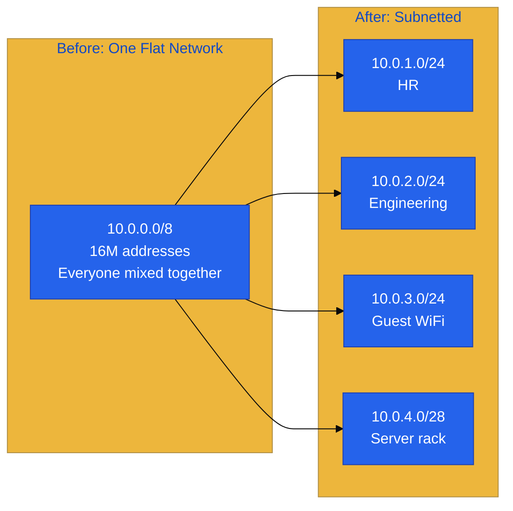

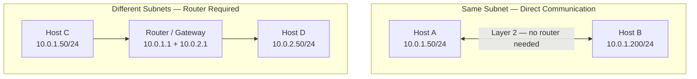

**When you'll use this:**

| Situation | What you do |
|-----------|-------------|
| CCNA / AWS / Azure exams | Calculate network, broadcast, usable range |
| Cloud [VPC](#v) design | Split `10.0.0.0/16` into public/private/db [subnets](#s) |
| Office network | Assign right-sized subnets per department |
| Troubleshooting | "Is this IP in the same subnet as the [gateway](#g)?" |
| [Firewall](#f) rules | "Allow traffic from 10.0.2.0/24 to 10.0.3.0/24" |

---

## 2. IP Addresses — The 30-Second Version

An **IPv4 address** is 32 bits, written as **four numbers** (octets) from 0–255:

```
192.168.10.45
|   |   |  |
octet1 ... octet4
```

Each octet = 8 bits. Total = 32 bits.

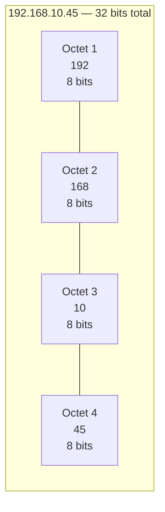

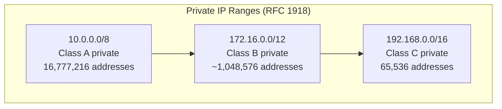

**Private ranges** (safe to use inside your company/home — not routed on the public internet):

| Range | CIDR | How big |
|-------|------|---------|
| `10.0.0.0` – `10.255.255.255` | `10.0.0.0/8` | 16 million addresses |
| `172.16.0.0` – `172.31.255.255` | `172.16.0.0/12` | ~1 million addresses |
| `192.168.0.0` – `192.168.255.255` | `192.168.0.0/16` | 65,536 addresses |

**Key terms you'll use constantly** *(full definitions in [Glossary](#glossary--every-technical-term-explained))*:

| Term | Plain English |
|------|---------------|
| **Network address** | The "name" of the subnet — first address, all host bits = 0 |
| **Broadcast address** | Message to everyone on subnet — last address, all host bits = 1 |
| **Usable host range** | Everything between network and broadcast |
| **Gateway (default gateway)** | The router's IP on that subnet — usually `.1` |
| **Prefix / CIDR** | How many bits belong to the network (e.g. `/24`) — defines where network part ends and host part begins. See [§5.2–5.3](#52-network-part--what-it-means-and-why-its-called-network). |
| **Subnet mask** | Same info as prefix, written as `255.255.255.0` — the `1`s cover the network part, the `0`s cover the host part. See [§5.1](#51-what-is-a-subnet-mask-and-what-does-it-do). |
| **Host** | Any device with an IP: laptop, server, printer, router interface |
| **Octet** | One of the four numbers in an IP (0–255); 8 bits each |
| **Private IP range** | Internal-only addresses (`10.x`, `172.16–31.x`, `192.168.x`) — not on public internet |

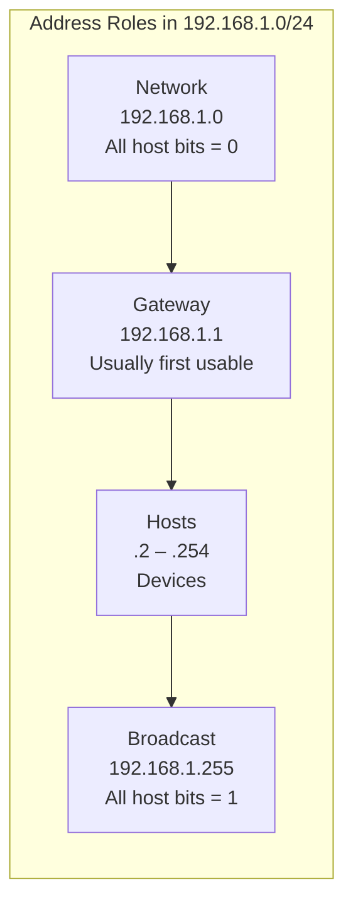

---

## 3. The Neighborhood Analogy (Your Mental Model)

**Always think of an IP address like a street address:**

```
192.168.10.45/24

192.168.10  =  Which neighborhood (network)
45          =  Which house (host)
/24         =  How big the neighborhood is
```

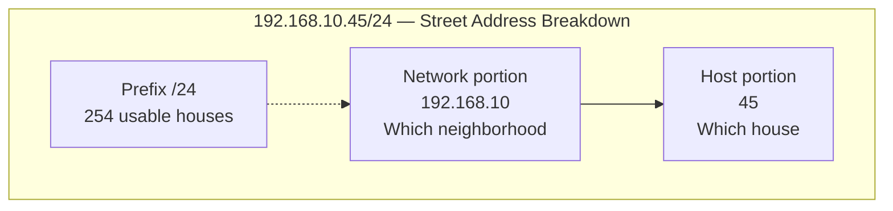

| Networking | Analogy |
|------------|---------|
| Network portion | City + street name |
| Host portion | House number |
| Subnet mask / prefix | City planning rules (how many houses allowed) |
| Default gateway | The mail depot at the neighborhood entrance |
| Broadcast | Loudspeaker announcement heard by every house on the block |
| Router | Connects one neighborhood to another |

**The rule that makes /24 easy:**

> `/24` = first **3 numbers** are the neighborhood, last number is the house.
> So `192.168.10.0/24` means houses `.1` through `.254` (`.0` = neighborhood sign, `.255` = loudspeaker).

**Smaller neighborhoods = bigger prefix number:**

```
/24  →  254 houses       (normal office floor)
/26  →  62 houses        (small department)
/28  →  14 houses        (server rack)
/30  →  2 houses         (router-to-router link)
```

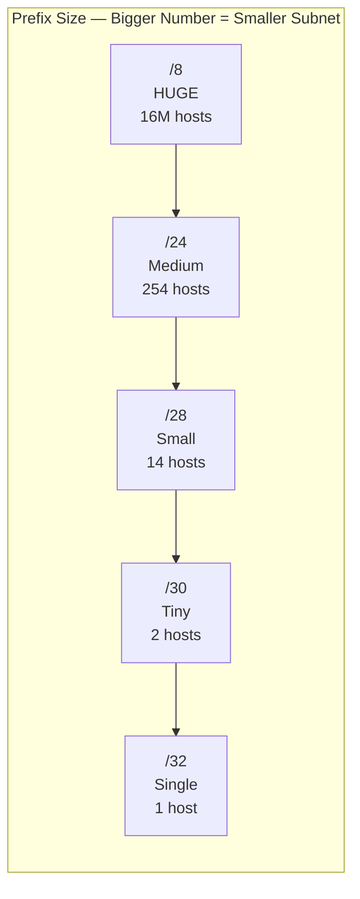

**Bigger prefix number = smaller subnet.** This trips up beginners. Remember:

> **/32 is tiny (1 address). /8 is huge (millions).** The slash number counts *network* bits, not houses.

> **Want the full story?** Read [§5.1–5.7](#51-what-is-a-subnet-mask-and-what-does-it-do) for a deep dive on what the network part and host part mean, why they're named that way, and how the subnet mask draws the line between them.

---

## 4. Binary — Just Enough to Never Get Stuck

You do **not** need to love binary. You need to recognize patterns.

### 4.1 Each Bit Has a Weight

```
Bit value:   128   64   32   16    8    4    2    1
Example 192:  1    1    0    0    0    0    0    0   → 128+64 = 192
Example 10:   0    0    0    0    1    0    1    0   → 8+2 = 10
Example 255:  1    1    1    1    1    1    1    1   → sum of all = 255
```

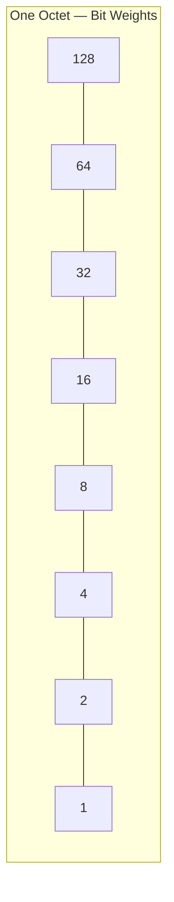

**Example: 192 = 128 + 64**

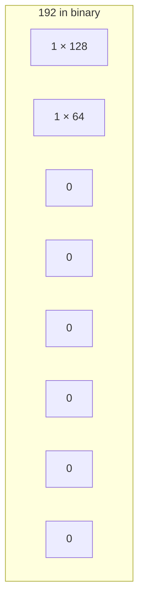

### 4.2 Subnet Mask Octets to Memorize

When you see these in the last octet of a mask, **memorize the block size** (next section):

| Mask octet | Binary (last 8 bits) | Block size |
|------------|----------------------|------------|
| 128 | `10000000` | 128 |
| 192 | `11000000` | 64 |
| 224 | `11100000` | 32 |
| 240 | `11110000` | 16 |
| 248 | `11111000` | 8 |
| 252 | `11111100` | 4 |
| 254 | `11111110` | 2 |
| 255 | `11111111` | 1 |

**Pattern:** Each step adds another `1` on the left. Block size halves each time.

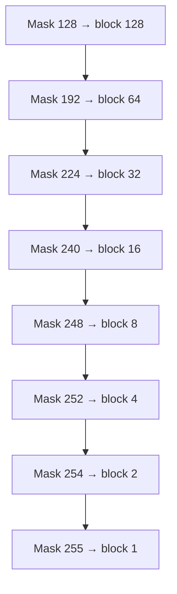

### 4.3 Powers of 2 (Memorize Through 2^16)

| Power | Value | Subnet use |
|-------|-------|------------|
| 2^0 | 1 | /32 |
| 2^1 | 2 | /31 |
| 2^2 | 4 | /30 |
| 2^3 | 8 | /29 |
| 2^4 | 16 | /28 |
| 2^5 | 32 | /27 |
| 2^6 | 64 | /26 |
| 2^7 | 128 | /25 |
| 2^8 | 256 | /24 |
| 2^10 | 1,024 | |
| 2^12 | 4,096 | /20 has 4096 addresses |
| 2^16 | 65,536 | /16 |

### 4.4 Quick Binary Practice

| Decimal | Binary |
|---------|--------|
| 0 | 00000000 |
| 1 | 00000001 |
| 127 | 01111111 |
| 128 | 10000000 |
| 192 | 11000000 |
| 224 | 11100000 |
| 240 | 11110000 |
| 255 | 11111111 |

---

## 5. Subnet Mask & CIDR Notation

Two ways to say the same thing:

```
192.168.1.0/24  =  192.168.1.0 with subnet mask 255.255.255.0
```

Before the prefix table, you need to understand **what a subnet mask actually does** — and why we talk about a **network part** and a **host part**. This is the foundation everything else builds on.

---

### 5.1 What Is a Subnet Mask, and What Does It Do?

An IP address by itself is just 32 bits. The problem: **those 32 bits don't come with instructions.** The same address `192.168.1.45` could belong to a tiny subnet of 4 addresses or a giant subnet of 16 million — the number alone doesn't tell you.

The **subnet mask** (or CIDR prefix) answers one question:

> **"Where does the subnet name end, and where does the device number begin?"**

Think of it like a ruler laid over the 32 bits:

```
IP address:    192 . 168 .  1  .  45     ← 32 bits total
Subnet mask:   255 . 255 . 255 .  0     ← tells you the split
               |←—— network part ——→|← host →|
```

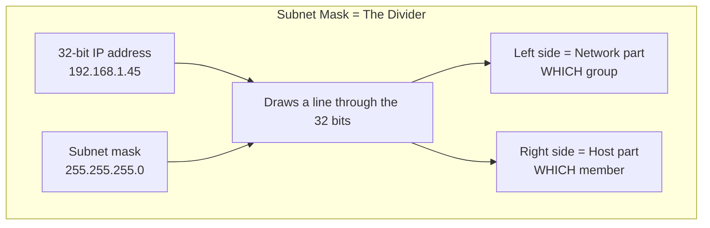

**Three things the mask tells every device on the network:**

| Question | How the mask answers it |
|----------|-------------------------|
| Am I on the same subnet as `192.168.1.200`? | Compare network parts — if they match, yes |
| Is `192.168.1.255` on my subnet? | Check if its network part matches mine |
| To reach `10.0.5.1`, do I need my gateway? | If network parts differ → send to router |

Without a mask, your laptop wouldn't know whether to send traffic directly (same subnet) or through the router (different subnet).

---

### 5.2 Network Part — What It Means and Why It's Called "Network"

#### What it means

The **network part** (also called **network portion** or **network bits**) is the prefix of the IP address that identifies **which subnet** — which group of devices — an address belongs to.

```
192.168.1.45/24

Network part:  192.168.1     ← "I am in the 192.168.1.x group"
Host part:              45     ← "I am device #45 in that group"
```

Every device with network part `192.168.1` and mask `/24` belongs to the **same subnet**. They share:

- The same **network address** (`192.168.1.0`)
- The same **broadcast address** (`192.168.1.255`)
- The same **default gateway** (usually `192.168.1.1`)
- The same **switch/VLAN** (Layer 2 domain)

#### Why it's called "network"

The word **network** here means **a group of devices that can talk directly at Layer 2** — one logical LAN segment. It's not "the internet" and it's not "the whole company network."

Historical reason: early internet design treated each IP range as a separate **network** in routing tables. Routers didn't care about individual laptops — they only needed to know **which network** (`192.168.1.0/24`) to forward packets toward. The network part is literally the part routers use to make forwarding decisions.

```
Router's view:

"I need to send a packet to 192.168.1.45"
 → I only look at the network part: 192.168.1.0/24
 → My routing table says: "192.168.1.0/24 → send out interface Eth0"
 → Done. I don't care that it's .45 specifically."
```

#### Analogy

| Real world | Network part |
|------------|--------------|
| "Oak Street" in "45 Oak Street, Springfield" | `192.168.1` in `192.168.1.45` |
| All houses on Oak Street share one mail route | All `.x` hosts on `192.168.1.0/24` share one subnet |
| Post office sorts by **street name first** | Router sorts by **network part first** |

#### In binary — network bits are where the mask has `1`s

```
IP:    192.168.1.45  =  11000000.10101000.00000001.00101101
Mask:  /24 (255.255.255.0) =  11111111.11111111.11111111.00000000
                               |←—— 1s = network part ——→|← 0s = host →|
```

Wherever the subnet mask has a **`1`**, the corresponding bit in the IP belongs to the **network part**. Those bits must be **identical** for two devices to be on the same subnet.

---

### 5.3 Host Part — What It Means and Why It's Called "Host"

#### What it means

The **host part** (also called **host portion** or **host bits**) is the remaining bits that identify **which specific device** within that subnet.

```
192.168.1.45/24  →  host part = 45  (the last octet)
192.168.1.1/24   →  host part = 1    (the router)
192.168.1.254/24 →  host part = 254  (some server)
```

All three share the **same network part** (`192.168.1`) but have **different host parts** (45, 1, 254). That's how one subnet holds hundreds of unique devices.

#### Why it's called "host"

**Host** is networking jargon for **any end device** — laptop, phone, printer, server, or a router's interface. The host part answers: *"Which host (device) on this network is this?"*

The name comes from the client/server model: a **host** is a machine that **hosts** an IP address and sends/receives its own traffic (as opposed to a router, which forwards other people's traffic — though router interfaces get host addresses too).

```
Same subnet, different hosts:

  192.168.1.1    →  host part .1   →  Router (gateway)
  192.168.1.45   →  host part .45  →  Your laptop
  192.168.1.100  →  host part .100 →  Printer
  192.168.1.254  →  host part .254 →  File server

  Network part: 192.168.1 (same for all)
  Host part:    different for each device
```

#### Analogy

| Real world | Host part |
|------------|-----------|
| House number "45" in "45 Oak Street" | `.45` in `192.168.1.45` |
| Two houses on the same street have different numbers | Two devices on the same subnet have different host parts |
| The house number identifies **which building** | The host part identifies **which device** |

#### In binary — host bits are where the mask has `0`s

```
IP:    192.168.1.45  =  11000000.10101000.00000001.00101101
Mask:  /24             =  11111111.11111111.11111111.00000000
                                                      ^^^^^^^^
                                                      host part
                                                      (8 bits → 256 values: 0–255)
```

Wherever the mask has a **`0`**, that bit is part of the **host part** and can vary from device to device.

**How many devices can one subnet hold?** Count the host bits:

```
Host bits = 32 − prefix
Addresses = 2^(host bits)
Usable    = 2^(host bits) − 2   (subtract network + broadcast)
```

---

### 5.4 How the Mask Draws the Line — Same IP, Different Masks

Here is the critical insight beginners miss: **the IP number doesn't change — the mask changes what the parts mean.**

Take the address `192.168.1.45`:

| Mask | Network part | Host part | What it means |
|------|--------------|-----------|---------------|
| `/24` | `192.168.1` (24 bits) | `.45` (8 bits) | One of 254 devices on `192.168.1.0/24` |
| `/26` | `192.168.1.0–63` block (26 bits) | `.45` (6 bits) | One of 62 devices in the `.0/26` subnet |
| `/28` | `192.168.1.32–47` block (28 bits) | `.45` (4 bits) | Wait — `.45` isn't even in a `/28` starting at `.32`... |

That last row shows why the mask matters: **`192.168.1.45/28`** actually belongs to the **`192.168.1.32/28`** subnet (network part is `.32–.47`), not `.0/24`.

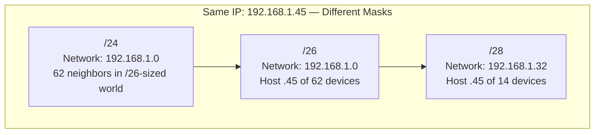

**As the prefix gets bigger (more network bits), the host part shrinks:**

```
/24:  |← 24 network bits →|← 8 host bits →|   254 usable hosts
/26:  |← 26 network bits →|← 6 host bits →|    62 usable hosts
/28:  |← 28 network bits →|← 4 host bits →|    14 usable hosts
/30:  |← 30 network bits →|← 2 host bits →|     2 usable hosts
```

More network bits = more precise group identification = fewer devices per group.

---

### 5.5 Subnet Mask Parts — The `1`s and `0`s Explained

The subnet mask itself has two parts that mirror the IP split:

```
Subnet mask 255.255.255.192  (/26):

  255  .  255  .  255  .  192
   ↓      ↓      ↓      ↓
 11111111.11111111.11111111.11000000

|←—— all 1s = network portion of mask ——→|← 0s = host portion of mask →|
```

| Mask bit | Value | Meaning for the IP |
|----------|-------|---------------------|
| **`1`** | Locked | This bit is part of the **network part** — must match for same-subnet |
| **`0`** | Variable | This bit is part of the **host part** — can differ per device |

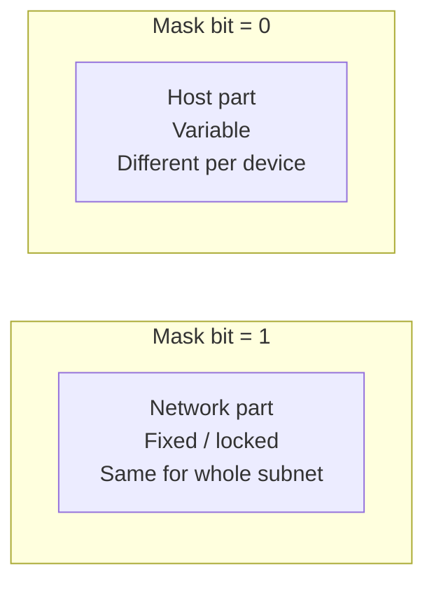

**Why mask octets are only specific values (128, 192, 224, 240…):**

A valid subnet mask must be **all 1s then all 0s** — no mixing in the middle. That's why you never see mask `255.255.255.137` — it would be `10001001` in binary (1s and 0s mixed), which doesn't define a clean network/host boundary.

```
Valid:   255.255.255.192  =  11111111.11111111.11111111.11000000  ✓
Invalid: 255.255.255.137  =  11111111.11111111.11111111.10001001  ✗ (messy split)
```

---

### 5.6 Worked Example — Label the Parts

**Given:** `10.10.10.130/26`

**Step 1 — Write the mask:** `/26` = `255.255.255.192`

**Step 2 — Identify the split:**

```
IP:    10  .  10  .  10  .  130
Mask:  255 .  255 .  255 .  192

Binary last octet:
  IP:   130 = 10000010
  Mask: 192 = 11000000
              ^^
              these 2 bits are still network (part of /26)
                    ^^^^^^
                    these 6 bits are host part

Network part:  10.10.10.128  (first 26 bits — round down)
Host part:     .130 is host #2 in the .128–.191 block (130 − 128 = 2)
```

**Step 3 — What each part tells us:**

| Part | Value | Meaning |
|------|-------|---------|
| Network part | `10.10.10.128/26` | "I belong to the subnet starting at .128" |
| Host part | `.130` | "I am the device at position 130 in the last octet" |
| Same subnet as `10.10.10.190`? | Yes | Both have network part `10.10.10.128` |
| Same subnet as `10.10.10.50`? | No | `.50` is in the `.0/26` block, different network part |
| Need router for `10.10.11.1`? | Yes | Third octet differs → different network part |

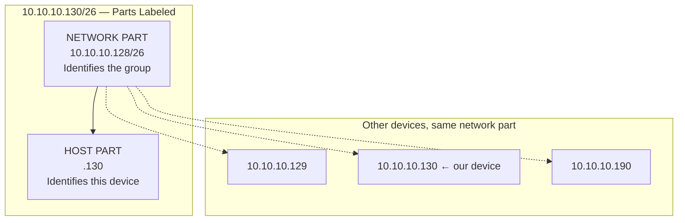

---

### 5.7 Quick Comparison — Network Part vs Host Part

| | **Network part** | **Host part** |
|---|------------------|---------------|
| **Answers** | *Which subnet?* | *Which device on that subnet?* |
| **Analogy** | Street name | House number |
| **Mask bits** | Where mask = `1` | Where mask = `0` |
| **Same for all devices on subnet?** | Yes | No — unique per device |
| **Used by routers?** | Yes — for forwarding | No — routers ignore host part |
| **Used by switches?** | Indirectly (same subnet = same VLAN) | Yes — via MAC address lookup |
| **Changes when you subnet more?** | Gets longer (more bits) | Gets shorter (fewer bits) |
| **Example in `/24`** | `192.168.1` (3 octets) | `.45` (last octet) |
| **Example in `/26`** | `192.168.1.128` (includes part of 4th octet) | `.45` within that block |

**Memory trick:**

> **Network** = **N**ame of the group (shared)  
> **Host** = **H**ardware/device identity (unique)

---

### 5.8 CIDR Prefix Table

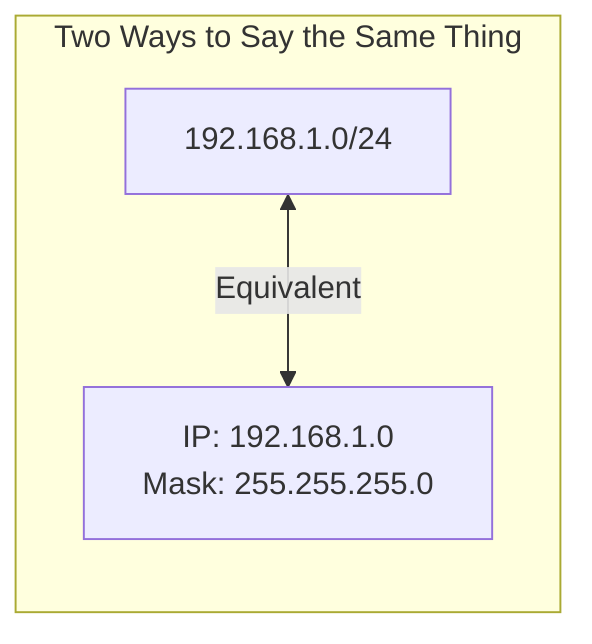

**Visual: /26 splits the last octet**

```
192.168.1.45/26 — 32-bit address:

|←—— 26 network bits ——→|← 6 host bits →|
 192 . 168 .  1  .   45
|←—— octet 1-3 ——→|←— octet 4 —→|

Subnet mask 255.255.255.192:
255 . 255 . 255 . 192
|← fixed network →|← host →|
```

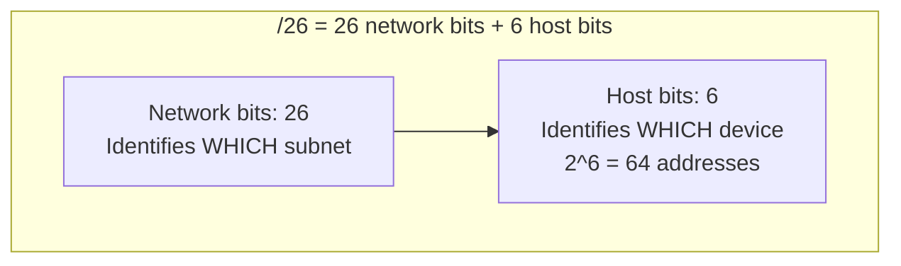

| CIDR | Subnet Mask | Network bits | Host bits | Total addresses | Usable hosts |
|------|-------------|--------------|-----------|-----------------|--------------|
| /8 | 255.0.0.0 | 8 | 24 | 16,777,216 | 16,777,214 |
| /16 | 255.255.0.0 | 16 | 16 | 65,536 | 65,534 |
| /24 | 255.255.255.0 | 24 | 8 | 256 | 254 |
| /25 | 255.255.255.128 | 25 | 7 | 128 | 126 |
| /26 | 255.255.255.192 | 26 | 6 | 64 | 62 |
| /27 | 255.255.255.224 | 27 | 5 | 32 | 30 |
| /28 | 255.255.255.240 | 28 | 4 | 16 | 14 |
| /29 | 255.255.255.248 | 29 | 3 | 8 | 6 |
| /30 | 255.255.255.252 | 30 | 2 | 4 | 2 |
| /31 | 255.255.255.254 | 31 | 1 | 2 | 2* |
| /32 | 255.255.255.255 | 32 | 0 | 1 | 1 |

*Usable hosts formula: `2^host_bits - 2` (subtract network + broadcast). Exception: `/31` and `/32` have special rules (see [Section 15](#15-special-cases-you-must-know)).

**How to read `/26`:**

- 26 bits for network → 6 bits for hosts
- 2^6 = 64 total addresses
- 64 - 2 = **62 usable hosts**

---

## 6. The One Method That Solves Everything

Every subnetting problem — exam, interview, or real design — uses these **5 steps**:

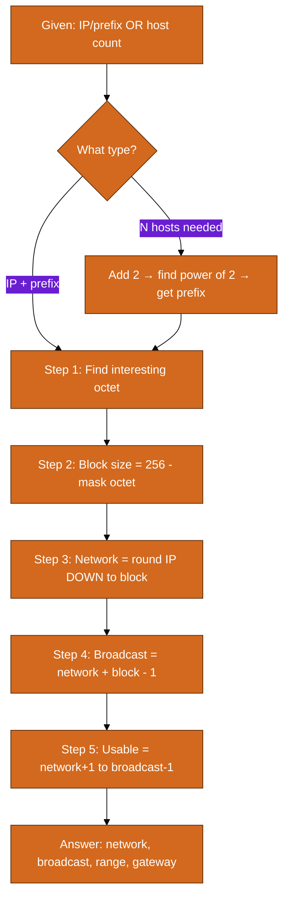

```
┌─────────────────────────────────────────────────────────────┐
│  1. Identify the "interesting octet" (where subnet bits end) │
│  2. Calculate block size                                     │
│  3. Find network address (round IP DOWN to block boundary)   │
│  4. Find broadcast (network + block size - 1)                │
│  5. Usable hosts = network + 1  through  broadcast - 1     │
└─────────────────────────────────────────────────────────────┘
```

### Step 1: Find the Interesting Octet

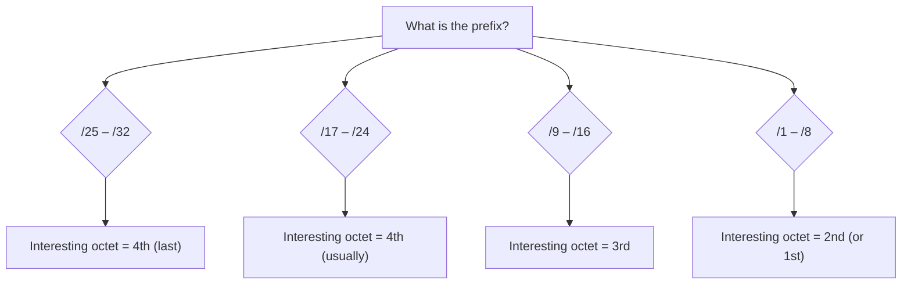

| Prefix range | Interesting octet | Example |
|--------------|-------------------|---------|
| /25 – /32 | 4th octet (last number) | /26 → look at last octet |
| /17 – /24 | 4th octet | /24 → last octet |
| /9 – /16 | 3rd octet | /20 → third octet |
| /1 – /8 | 2nd octet (or 1st for /8) | /16 → third octet for boundaries |

**Simple rule:** Find which octet the prefix "cuts through." For most exam questions (/24–/30), it's the **last octet**.

### Step 2: Block Size

```
Block size = 256 - (mask value in interesting octet)
           OR
Block size = 2^(host bits in that octet)
```

### Step 3: Network Address

Divide the IP's interesting octet by block size, **round down**, multiply back:

```
IP last octet = 130, block size = 64
130 ÷ 64 = 2.something → floor = 2 → 2 × 64 = 128
Network = x.x.x.128
```

Or list blocks: 0, 64, 128, 192... and find which range contains your IP.

### Step 4: Broadcast

```
Broadcast = network + block size - 1
Example: 128 + 64 - 1 = 191 → x.x.x.191
```

### Step 5: Usable Range

```
First usable = network + 1
Last usable  = broadcast - 1
Gateway      = usually first usable (.1 or network+1)
```

---

## 7. The Block Size Trick (Speed Mode)

For `/24` through `/32`, all action is in the **last octet**:

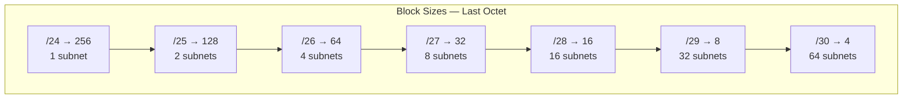

```
/24  →  block 256  →  only ONE subnet: .0-.255
/25  →  block 128  →  .0, .128
/26  →  block 64   →  .0, .64, .128, .192
/27  →  block 32   →  .0, .32, .64, .96, .128, .160, .192, .224
/28  →  block 16   →  .0, .16, .32, .48, .64, .80, .96, .112 ...
/29  →  block 8    →  .0, .8, .16, .24, .32 ...
/30  →  block 4    →  .0, .4, .8, .12, .16 ...
```

**Fast block size lookup:**

```
/25 → 128     /26 → 64      /27 → 32      /28 → 16
/29 → 8       /30 → 4       /31 → 2       /32 → 1
```

For **third octet** subnetting (/17–/23):

```
/23 → third octet block = 2    (pairs: 0-1, 2-3, 4-5...)
/22 → block = 4
/21 → block = 8
/20 → block = 16
/19 → block = 32
/18 → block = 64
/17 → block = 128
```

**Example: /20 in third octet**

```
Mask: 255.255.240.0
Block in 3rd octet = 256 - 240 = 16
Networks: 10.0.0.0, 10.0.16.0, 10.0.32.0, 10.0.48.0 ...
Each spans .0 through .15 in third octet, all of 4th octet
```

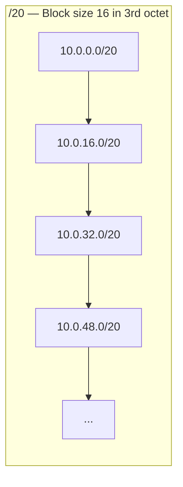

---

## 8. Visual Number-Line Reference (/24–/32)

These number lines show **every subnet boundary in the last octet**. Print this section and keep it beside you while practicing.

### 8.1 /24 — One Subnet (256 addresses)

```
0        64       128      192      255
|---------|---------|---------|---------|
[=========== 192.168.1.0/24 ===========]
 NET .0                              BC .255
      ↑ Usable: .1 – .254 ↑
```

### 8.2 /25 — Two Subnets (128 each)

```
0        64       128      192      255
|---------|---------|---------|---------|
[== .0/25 ==][== .128/25 ==]
 NET .0  BC .127  NET .128 BC .255
```

### 8.3 /26 — Four Subnets (64 each)

```
0    64   128  192  255
|----|----|----|----|
[.0 ][.64][.128[.192]
 /26  /26  /26  /26
```

| Network | Range | Broadcast | Usable hosts |
|---------|-------|-----------|--------------|
| x.x.x.0/26 | .0 – .63 | .63 | .1 – .62 (62) |
| x.x.x.64/26 | .64 – .127 | .127 | .65 – .126 (62) |
| x.x.x.128/26 | .128 – .191 | .191 | .129 – .190 (62) |
| x.x.x.192/26 | .192 – .255 | .255 | .193 – .254 (62) |

```mermaid
flowchart LR
    subgraph S26["/26 — 4 subnets in last octet"]
        A[".0/26<br/>62 hosts"]
        B[".64/26<br/>62 hosts"]
        C[".128/26<br/>62 hosts"]
        D[".192/26<br/>62 hosts"]
    end
    A --- B --- C --- D
```

### 8.4 /27 — Eight Subnets (32 each)

```
0  32  64  96  128 160 192 224 255
|--|--|--|--|--|--|--|--|
 .0 .32 .64 .96 .128 ...
```

Valid network addresses: `.0, .32, .64, .96, .128, .160, .192, .224`

### 8.5 /28 — Sixteen Subnets (16 each)

```
0  16  32  48  64  80  96  112 128 ... 240 255
|  |   |   |   |   |   |   |   |         |   |
```

Valid networks: `.0, .16, .32, .48, .64, .80, .96, .112, .128, .144, .160, .176, .192, .208, .224, .240`

### 8.6 /29 — Thirty-Two Subnets (8 each)

Block size = 8. Networks: `.0, .8, .16, .24, .32, .40, .48, .56, .64 ... .248`

### 8.7 /30 — Sixty-Four Subnets (4 each)

Block size = 4. Networks: `.0, .4, .8, .12, .16, .20 ... .252`

```mermaid
flowchart LR
    subgraph P2P["/30 Point-to-Point Block (4 addresses)"]
        NET["Network<br/>.4"]
        H1["Router A<br/>.5"]
        H2["Router B<br/>.6"]
        BC["Broadcast<br/>.7"]
    end
    NET --> H1 --> H2 --> BC
```

### 8.8 Quick Lookup: Prefix → Subnets in a /24

| If you split /24 into... | New prefix | # of subnets | Hosts each |
|---------------------------|------------|--------------|------------|
| 2 subnets | /25 | 2 | 126 |
| 4 subnets | /26 | 4 | 62 |
| 8 subnets | /27 | 8 | 30 |
| 16 subnets | /28 | 16 | 14 |
| 32 subnets | /29 | 32 | 6 |
| 64 subnets | /30 | 64 | 2 |

**Formula:** To get N subnets from a /24, borrow `log2(N)` bits → new prefix = 24 + log2(N).

---

## 9. Worked Examples — Given an IP and Prefix

### Example 1: Classic /24

**Question:** What is the network, broadcast, and usable range for `192.168.1.45/24`?

| Step | Work |
|------|------|
| Block size | 256 (entire last octet) |
| Network | 192.168.1.**0** |
| Broadcast | 192.168.1.**255** |
| Usable | 192.168.1.**1** – 192.168.1.**254** |
| Gateway | 192.168.1.1 (typical) |
| Hosts | 254 |

```mermaid
flowchart LR
    subgraph S24["192.168.1.0/24 — Full Last Octet"]
        NET2[".0 Network"]
        US2[".1 – .254<br/>254 usable hosts"]
        BC2[".255 Broadcast"]
    end
    NET2 --> US2 --> BC2
```

---

### Example 2: /26 — The Most Common Exam Trick

**Question:** `10.10.10.130/26` — find everything.

| Step | Work |
|------|------|
| Mask last octet | 192 → block = 256 - 192 = **64** |
| Block boundaries | 0–63, **64–127**, **128–191**, 192–255 |
| 130 is in | 128–191 block |
| Network | 10.10.10.**128** |
| Broadcast | 10.10.10.**191** (128 + 64 - 1) |
| First usable | 10.10.10.**129** |
| Last usable | 10.10.10.**190** |
| Hosts | 62 |

**Sanity check:** Is 130 between 128 and 191? Yes. Is 130 a network address? No (128 is). Good.

```
Last octet number line (/26, block = 64):

0        64       128      192      255
|---------|---------|---------|---------|
         ↑        [==130==>]  ← IP is HERE
                  NET .128  BC .191
                  Usable: .129 – .190
```

---

### Example 3: /28 — Small Subnet

**Question:** `172.16.5.17/28`

| Step | Work |
|------|------|
| Block | 16 |
| Blocks | 0-15, **16-31**, 32-47... |
| 17 is in | 16-31 |
| Network | 172.16.5.**16** |
| Broadcast | 172.16.5.**31** |
| Usable | 172.16.5.**17** – 172.16.5.**30** |
| Hosts | 14 |

---

### Example 4: /30 — Router-to-Router Link

**Question:** `203.0.113.6/30`

| Step | Work |
|------|------|
| Block | 4 |
| Blocks | 0-3, **4-7**, 8-11... |
| Network | 203.0.113.**4** |
| Broadcast | 203.0.113.**7** |
| Usable | 203.0.113.**5** and 203.0.113.**6** (only 2!) |
| Use case | WAN link between two routers |

```mermaid
flowchart LR
    RA["Router A<br/>203.0.113.5/30"] <-->|"WAN Link<br/>203.0.113.4/30"| RB["Router B<br/>203.0.113.6/30"]
```

```
Router A: 203.0.113.5/30
Router B: 203.0.113.6/30
Network:  203.0.113.4
Broadcast:203.0.113.7
```

---

### Example 5: /27

**Question:** `192.168.50.200/27`

| Step | Work |
|------|------|
| Block | 32 |
| Blocks | ..., 160-191, **192-223**, 224-255 |
| 200 is in | 192-223 |
| Network | 192.168.50.**192** |
| Broadcast | 192.168.50.**223** |
| Usable | 192.168.50.**193** – 192.168.50.**222** |
| Hosts | 30 |

---

### Example 6: /25 — Splitting a /24 in Half

**Question:** `10.1.1.100/25`

| Step | Work |
|------|------|
| Block | 128 |
| Blocks | **0-127**, 128-255 |
| 100 is in | 0-127 |
| Network | 10.1.1.**0** |
| Broadcast | 10.1.1.**127** |
| Usable | 10.1.1.**1** – 10.1.1.**126** |
| Hosts | 126 |

**Bonus:** The other half would be `10.1.1.128/25` with usable .129–.254.

---

### Example 7: /29 — Tiny Server Group

**Question:** `10.20.30.9/29`

| Step | Work |
|------|------|
| Block | 8 |
| Blocks | 0-7, **8-15**, 16-23... |
| Network | 10.20.30.**8** |
| Broadcast | 10.20.30.**15** |
| Usable | 10.20.30.**9** – 10.20.30.**14** |
| Hosts | 6 |

---

### Example 8: /23 — Subnet Spans Two Third-Octet Values

**Question:** `10.10.1.200/23`

| Step | Work |
|------|------|
| Mask | 255.255.**254**.0 |
| Block in 3rd octet | 256 - 254 = **2** |
| Pairs | 10.10.**0**.x + 10.10.**1**.x, then 10.10.**2**.x + 10.10.**3**.x |
| 10.10.1.200 is in | 10.10.0.0 – 10.10.1.255 block |
| Network | 10.10.**0.0** |
| Broadcast | 10.10.**1.255** |
| Usable | 10.10.0.1 – 10.10.1.254 |
| Hosts | 510 |

**Key insight:** /23 makes the subnet **twice as wide** in the third octet — it eats two consecutive `.x` values.

```mermaid
flowchart TB
    subgraph S23["10.10.0.0/23 spans TWO third-octet values"]
        O0["10.10.0.x<br/>all of 4th octet"]
        O1["10.10.1.x<br/>all of 4th octet"]
    end
    O0 --- O1
    NET["Network: 10.10.0.0"] --> O0
    O1 --> BC["Broadcast: 10.10.1.255"]
```

---

### Example 9: /20 — Corporate VLAN

**Question:** `172.16.45.100/20`

| Step | Work |
|------|------|
| Mask | 255.255.**240**.0 |
| Block in 3rd octet | 16 |
| Ranges | 0-15, 16-31, **32-47**, 48-63... |
| 45 is in | 32-47 |
| Network | 172.16.**32.0** |
| Broadcast | 172.16.**47.255** |
| Usable | 172.16.32.1 – 172.16.47.254 |
| Hosts | 4094 |

---

### Example 10: /19

**Question:** `172.16.100.50/19`

| Step | Work |
|------|------|
| Mask | 255.255.**224**.0 |
| Block | 32 |
| Ranges | 0-31, 32-63, 64-95, **96-127**... |
| 100 is in | 96-127 |
| Network | 172.16.**96.0** |
| Broadcast | 172.16.**127.255** |
| Usable | 172.16.96.1 – 172.16.127.254 |
| Hosts | 8190 |

---

### Example 11: /22

**Question:** `10.5.130.10/22`

| Step | Work |
|------|------|
| Mask | 255.255.**252**.0 |
| Block in 3rd octet | 4 |
| Ranges | 0-3, 4-7, ..., **128-131**... |
| 130 is in | 128-131 |
| Network | 10.5.**128.0** |
| Broadcast | 10.5.**131.255** |
| Usable | 10.5.128.1 – 10.5.131.254 |
| Hosts | 1022 |

---

### Example 12: Is This a Valid Network Address?

**Question:** Can `192.168.1.64/26` be a network address?

| Step | Work |
|------|------|
| Block size | 64 |
| Valid networks | .0, .64, .128, .192 |
| 192.168.1.64 | **Yes** — lands on block boundary |

```mermaid
flowchart TB
    subgraph VALID["Valid /26 Network Addresses"]
        V0[".0 ✓"]
        V64[".64 ✓"]
        V128[".128 ✓"]
        V192[".192 ✓"]
    end
    subgraph INVALID["NOT Valid Networks"]
        I65[".65 ✗ host"]
        I100[".100 ✗ host"]
        I200[".200 ✗ host"]
    end
```

**Question:** Can `192.168.1.65/26` be a network address?

| Step | Work |
|------|------|
| 65 | **No** — it's a host inside 192.168.1.64/26 |

---

### Example 13: Which Subnet Contains This Host?

**Question:** Host `10.0.5.77` — which /26 network does it belong to?

| Step | Work |
|------|------|
| Block | 64 |
| Blocks | 0-63, **64-127**... |
| 77 is in | 64-127 |
| Answer | **10.0.5.64/26** |

---

### Example 14: /17 — Large Split

**Question:** `10.50.200.10/17`

| Step | Work |
|------|------|
| Mask | 255.**128**.0.0 |
| Block in 2nd octet | 128 |
| Ranges | 10.**0**.x.x – 10.**127**.x.x, 10.**128**.x.x – 10.**255**.x.x |
| 10.50.x.x is in | 10.0.0.0 – 10.127.255.255 |
| Network | 10.**0.0.0** |
| Broadcast | 10.**127.255.255** |
| Hosts | 32,766 |

---

## 10. Worked Examples — Given a Host Count

**The question:** "You need a subnet for **N hosts**. What prefix do you use?"

### The Algorithm

```mermaid
flowchart TD
    N["Need N hosts"] --> ADD["Step 1: need = N + 2"]
    ADD --> POW["Step 2: smallest power of 2 ≥ need"]
    POW --> BLOCK["Step 3: block size = that power of 2"]
    BLOCK --> HB["Step 4: host bits = log2(block)"]
    HB --> PREFIX["Step 5: prefix = 32 - host bits"]
```

```
1. Add 2 for network + broadcast:  need = N + 2
2. Find smallest power of 2 that is >= need
3. That power of 2 = total addresses = block size
4. Host bits = log2(block size)
5. Prefix = 32 - host bits
```

**Quick reference:**

| Hosts needed | Need (+2) | Block size | Prefix | Usable |
|--------------|-----------|------------|--------|--------|
| 1–2 | 4 | 4 | /30 | 2 |
| 3–6 | 8 | 8 | /29 | 6 |
| 7–14 | 16 | 16 | /28 | 14 |
| 15–30 | 32 | 32 | /27 | 30 |
| 31–62 | 64 | 64 | /26 | 62 |
| 63–126 | 128 | 128 | /25 | 126 |
| 127–254 | 256 | 256 | /24 | 254 |
| 255–510 | 512 | 512 | /23 | 510 |
| 511–1022 | 1024 | 1024 | /22 | 1022 |
| 1023–4094 | 4096 | 4096 | /20 | 4094 |
| 4095–8190 | 8192 | 8192 | /19 | 8190 |

---

### Example A: 50 Hosts

```
Need: 50 + 2 = 52
Smallest power of 2 >= 52 → 64
Prefix: 32 - 6 = /26
Usable: 62 hosts ✓ (50 fits)
```

**Answer: /26**

---

### Example B: 100 Hosts

```
Need: 102
Smallest power of 2 >= 102 → 128
Prefix: /25
Usable: 126 hosts ✓
```

**Answer: /25**

---

### Example C: 300 Hosts

```
Need: 302
Smallest power of 2 >= 302 → 512
Prefix: /23
Usable: 510 hosts ✓
```

**Answer: /23**

---

### Example D: 1000 Hosts

```
Need: 1002
Smallest power of 2 >= 1002 → 1024
Prefix: /22
Usable: 1022 hosts ✓
```

**Answer: /22**

---

### Example E: 7 Hosts (Exact Fit)

```
Need: 9
Block: 16 → /28
Usable: 14 ✓
```

**Answer: /28** (not /29 which only gives 6 usable)

---

### Example F: "Minimum Subnet for 14 Hosts"

```
Need: 16
Block: 16 → /28
Usable: exactly 14 ✓
```

**Answer: /28**

---

## 11. Borrowing Bits — Splitting a Network Step by Step

When an exam asks *"How many subnets?"* or *"Split this /24 into 8 equal pieces"*, you **borrow host bits** and turn them into network bits.

### 11.1 The Borrowing Rule

```
Original prefix:     /24  (24 network bits, 8 host bits)
Want 4 subnets:      4 = 2^2 → borrow 2 host bits
New prefix:          /24 + 2 = /26
Subnets created:     2^2 = 4
Hosts per subnet:    2^(8-2) - 2 = 62
```

```mermaid
flowchart LR
    subgraph BEFORE["/24 — Before Borrowing"]
        BN["24 network bits"]
        BH["8 host bits<br/>256 addresses"]
    end
    subgraph AFTER["/26 — After Borrowing 2 Bits"]
        AN["26 network bits<br/>+2 borrowed"]
        AH["6 host bits<br/>64 addresses each"]
    end
    BEFORE -->|"Borrow 2 bits"| AFTER
```

### 11.2 Visual: Splitting 192.168.10.0/24 into 4 Subnets

**Question:** Divide `192.168.10.0/24` into 4 equal subnets.

```
Step 1: 4 = 2^2 → borrow 2 bits → /26
Step 2: Block size in last octet = 64
Step 3: List subnets:

0        64       128      192      255
|---------|---------|---------|---------|
[Subnet 1 ][Subnet 2 ][Subnet 3 ][Subnet 4 ]
 .0/26      .64/26     .128/26    .192/26
```

| Subnet | Network | Broadcast | Usable range | Hosts |
|--------|---------|-----------|--------------|-------|
| 1 | 192.168.10.0/26 | 192.168.10.63 | .1 – .62 | 62 |
| 2 | 192.168.10.64/26 | 192.168.10.127 | .65 – .126 | 62 |
| 3 | 192.168.10.128/26 | 192.168.10.191 | .129 – .190 | 62 |
| 4 | 192.168.10.192/26 | 192.168.10.255 | .193 – .254 | 62 |

### 11.3 How Many Subnets Can You Create?

| From | Borrow n bits | New prefix | # Subnets |
|------|---------------|------------|-----------|
| /24 | 1 bit | /25 | 2 |
| /24 | 2 bits | /26 | 4 |
| /24 | 3 bits | /27 | 8 |
| /24 | 4 bits | /28 | 16 |
| /24 | 5 bits | /29 | 32 |
| /24 | 6 bits | /30 | 64 |
| /16 | 4 bits | /20 | 16 |
| /16 | 8 bits | /24 | 256 |

**Formula:** `# subnets = 2^(borrowed bits)` where `borrowed bits = new prefix - old prefix`

### 11.4 Worked Example: Split /24 into 8 Subnets

```
8 = 2^3 → borrow 3 → /27, block = 32

192.168.10.0/27    → .0 – .31
192.168.10.32/27   → .32 – .63
192.168.10.64/27   → .64 – .95
192.168.10.96/27   → .96 – .127
192.168.10.128/27  → .128 – .159
192.168.10.160/27  → .160 – .191
192.168.10.192/27  → .192 – .223
192.168.10.224/27  → .224 – .255
```

---

## 12. VLSM — Partition Any Network

**VLSM = Variable Length Subnet Masking** = slicing one network into **different-sized** pieces without wasting addresses. See [VLSM in Glossary](#v).

This is the skill that makes you a **subnetting hero**.

### The VLSM Recipe

```mermaid
flowchart TD
    V1["1. List all subnets needed"] --> V2["2. Sort LARGEST first"]
    V2 --> V3["3. Assign from base network"]
    V3 --> V4["4. Next starts at broadcast + 1"]
    V4 --> V5["5. Repeat until done"]
    V5 --> V6["6. Verify no overlap"]
```

```
1. List all subnets needed, largest first
2. Start from the base network
3. Assign the first subnet (biggest need)
4. Next subnet starts at previous broadcast + 1
5. Repeat until done
6. Verify no overlap
```

### Case Study 1: Small Office

**Given:** Network `192.168.1.0/24`. You need:

| Department | Hosts needed |
|------------|--------------|
| Sales | 60 |
| Engineering | 30 |
| Management | 12 |
| Point-to-point link | 2 |

**Step 1 — Sort largest first:**

| Dept | Hosts | Prefix | Block |
|------|-------|--------|-------|
| Sales | 60 | /26 | 64 |
| Engineering | 30 | /27 | 32 |
| Management | 12 | /28 | 16 |
| P2P link | 2 | /30 | 4 |

**Step 2 — Assign sequentially:**

```
192.168.1.0/26      Sales
  Network:   192.168.1.0
  Broadcast: 192.168.1.63
  Usable:    192.168.1.1 – 192.168.1.62
  Gateway:   192.168.1.1

192.168.1.64/27     Engineering
  Network:   192.168.1.64
  Broadcast: 192.168.1.95
  Usable:    192.168.1.65 – 192.168.1.94
  Gateway:   192.168.1.65

192.168.1.96/28     Management
  Network:   192.168.1.96
  Broadcast: 192.168.1.111
  Usable:    192.168.1.97 – 192.168.1.110
  Gateway:   192.168.1.97

192.168.1.112/30    P2P Link
  Network:   192.168.1.112
  Broadcast: 192.168.1.115
  Usable:    192.168.1.113 – 192.168.1.114

Remaining: 192.168.1.116 – 192.168.1.255 (free for future)
```

**Visual map:**

```mermaid
flowchart TB
    subgraph VLSM["192.168.1.0/24 — VLSM Layout"]
        direction LR
        S1[".0–.63<br/>Sales /26<br/>60 hosts"]
        S2[".64–.95<br/>Eng /27<br/>30 hosts"]
        S3[".96–.111<br/>Mgmt /28<br/>12 hosts"]
        S4[".112–.115<br/>P2P /30<br/>2 hosts"]
        S5[".116–.255<br/>Unused<br/>140 spare"]
    end
    S1 --> S2 --> S3 --> S4 --> S5
```

```
192.168.1.0/24
├── [0───────63]     Sales /26
├── [64──────95]     Engineering /27
├── [96─────111]     Management /28
├── [112────115]     P2P /30
└── [116────255]     Unused (140 addresses spare)
```

---

### Case Study 2: AWS-Style VPC

**Given:** `10.0.0.0/16` (65,536 addresses). Design:

| Subnet purpose | Hosts | AZ |
|----------------|-------|-----|
| Public web (AZ-a) | 500 | a |
| Public web (AZ-b) | 500 | b |
| Private app (AZ-a) | 1000 | a |
| Private app (AZ-b) | 1000 | b |
| Database (AZ-a) | 100 | a |
| Database (AZ-b) | 100 | b |

**Prefix choices:**

| Need | Prefix | Block |
|------|--------|-------|
| 500 | /23 | 512 |
| 1000 | /22 | 1024 |
| 100 | /25 | 128 |

**Assignment:**

```
10.0.0.0/22      Public AZ-a     (1024 addrs — use /23 or /22 for growth)
10.0.4.0/22      Public AZ-b
10.0.8.0/22      Private app AZ-a
10.0.12.0/22     Private app AZ-b
10.0.16.0/25     Database AZ-a
10.0.16.128/25   Database AZ-b
...
Remaining: 10.0.17.0 – 10.0.255.255 for future
```

**AWS tip:** AWS reserves **5 IPs per subnet** (first 4 + last 1), so a /24 gives you **251 usable**, not 254. Plan accordingly in cloud designs.

```mermaid
flowchart TB
    subgraph VPC["AWS VPC 10.0.0.0/16"]
        subgraph AZA["Availability Zone A"]
            PUBA["Public 10.0.0.0/22"]
            APPA["Private App 10.0.8.0/22"]
            DBA["Database 10.0.16.0/25"]
        end
        subgraph AZB["Availability Zone B"]
            PUBB["Public 10.0.4.0/22"]
            APPB["Private App 10.0.12.0/22"]
            DBB["Database 10.0.16.128/25"]
        end
        IGW["Internet Gateway"]
        NAT["NAT Gateway"]
    end
    IGW --> PUBA
    IGW --> PUBB
    PUBA --> NAT
    NAT --> APPA
    NAT --> APPB
    APPA --> DBA
    APPB --> DBB
```

---

### Case Study 3: Exam-Style VLSM

**Given:** `172.16.0.0/22`. Create subnets for:

- LAN A: 100 hosts
- LAN B: 50 hosts
- LAN C: 25 hosts
- WAN link: 2 hosts

**Solution:**

| Subnet | Prefix | Network | Broadcast | Usable |
|--------|--------|---------|-----------|--------|
| LAN A | /25 | 172.16.0.0 | 172.16.0.127 | .1 – .126 |
| LAN B | /26 | 172.16.0.128 | 172.16.0.191 | .129 – .190 |
| LAN C | /27 | 172.16.0.192 | 172.16.0.223 | .193 – .222 |
| WAN | /30 | 172.16.0.224 | 172.16.0.227 | .225 – .226 |

Remaining: 172.16.0.228 – 172.16.3.255

---

### VLSM Sanity Checks

Before you submit an answer, verify:

- [ ] Every network address falls on a valid block boundary
- [ ] No two subnets overlap
- [ ] Each subnet has enough usable hosts (hosts + 2 ≤ block size)
- [ ] All subnets fit inside the parent network
- [ ] Next subnet starts at previous broadcast + 1

---

## 13. Supernetting & Route Summarization

**Supernetting = combining small networks into one bigger announcement.** See [Supernetting in Glossary](#s).

Opposite of subnetting. Used in [routing](#r) to reduce [route table](#r) size.

### Example: Summarize These Networks

```
192.168.0.0/24
192.168.1.0/24
192.168.2.0/24
192.168.3.0/24
```

**Find common bits:**

```
192.168.00000000.00000000  /24
192.168.00000001.00000000  /24
192.168.00000010.00000000  /24
192.168.00000011.00000000  /24
         ^^^^^^
         6 bits match in 3rd octet + all of 1st and 2nd
```

**Answer: `192.168.0.0/22`** (covers .0, .1, .2, .3)

```mermaid
flowchart TB
    subgraph SUM["Supernetting: 4 /24s → 1 /22"]
        N0["192.168.0.0/24"]
        N1["192.168.1.0/24"]
        N2["192.168.2.0/24"]
        N3["192.168.3.0/24"]
        SUPER["192.168.0.0/22<br/>One route entry"]
    end
    N0 --> SUPER
    N1 --> SUPER
    N2 --> SUPER
    N3 --> SUPER
```

**Binary alignment visual:**

```
192.168.00000000.00000000  /24  ─┐
192.168.00000001.00000000  /24   │
192.168.00000010.00000000  /24   ├─ Common prefix: 22 bits → /22
192.168.00000011.00000000  /24  ─┘
        ^^^^^^
        These 2 bits differ → summarized by /22
```

### Supernetting Steps

```
1. Write all networks in binary
2. Find how many leftmost bits are identical for ALL networks
3. That count = new prefix length
4. The common portion = summarized network
```

### Example 2

```
10.10.0.0/24 through 10.10.15.0/24  (16 networks)
```

16 = 2^4 → borrow 4 bits from host portion → /24 - 4 = **/20**

**Answer: `10.10.0.0/20`**

---

## 14. Binary Subnetting Walkthrough

When the block trick feels shaky — or the prefix is unusual — go to binary. This always works.

### 14.1 The AND Operation (Find Network Address)

**Rule:** Network address = IP **AND** Subnet Mask (bit by bit)

```
IP:    10.10.10.130  =  00001010.00001010.00001010.10000010
Mask:  /26            =  11111111.11111111.11111111.11000000
                         ─────────────────────────────────────
Network (AND):           00001010.00001010.00001010.10000000  =  10.10.10.128
```

```mermaid
flowchart LR
    IP["IP Address"] --> AND["Bitwise AND"]
    MASK["Subnet Mask"] --> AND
    AND --> NET["Network Address"]
```

**AND truth table:**

| Bit from IP | Bit from Mask | Result |
|-------------|---------------|--------|
| 0 | 0 | 0 |
| 0 | 1 | 0 |
| 1 | 0 | 0 |
| 1 | 1 | 1 |

**Plain English:** Where the mask has a `1`, keep the IP bit. Where the mask has a `0`, force `0`.

### 14.2 Find Broadcast in Binary

Set all **host bits** to `1`:

```
Network:  10.10.10.128  =  ...10000000  (/26, last 6 bits are host)
Broadcast:                 ...10111111  =  10.10.10.191
```

### 14.3 Full Binary Example: 172.16.45.200/26

```
Step 1 — Write IP and mask:
  IP:   172.16.45.200  →  10101100.00010000.00101101.11001000
  Mask: /26             →  11111111.11111111.11111111.11000000

Step 2 — AND to get network:
  Network:               10101100.00010000.00101101.11000000  =  172.16.45.192

Step 3 — Set host bits to 1 for broadcast:
  Broadcast:             10101100.00010000.00101101.11111111  =  172.16.45.255

Step 4 — Usable range:
  First: 172.16.45.193
  Last:  172.16.45.254
```

### 14.4 When to Use Binary vs Block Trick

| Situation | Use |
|-----------|-----|
| /24 – /30, last octet | Block trick (faster) |
| /17 – /23, third octet | Block trick in 3rd octet |
| Unusual prefixes (/13, /11) | Binary |
| "Is this a valid network?" | Check if host bits are all 0 |
| Verifying your answer | Binary as sanity check |

---

## 15. Special Cases You Must Know

### /31 — Point-to-Point (RFC 3021)

- 2 addresses, **both usable** (no traditional network/broadcast)
- Used on modern router links
- Example: `10.0.0.0/31` → usable: 10.0.0.0 and 10.0.0.1

### /32 — Single Host

- One address only
- Used for loopback, BGP peering, host routes
- Example: `192.0.2.1/32` identifies exactly one host

### AWS / Cloud Reserved IPs

In AWS (and similar clouds), each subnet reserves:

| Address | Purpose |
|---------|---------|
| 1st (.0) | Network |
| 2nd (.1) | VPC router |
| 3rd (.2) | DNS (AWS) |
| 4th (.3) | Reserved for future |
| Last (.255) | Broadcast (not used but reserved) |

**Effective usable in AWS /24: 251 addresses** (not 254).

```mermaid
flowchart LR
    subgraph AWS24["AWS /24 Subnet — Reserved Addresses"]
        R0[".0 Network"]
        R1[".1 VPC Router"]
        R2[".2 DNS"]
        R3[".3 Future"]
        R4[".4 – .254 Usable"]
        R5[".255 Broadcast reserved"]
    end
    R0 --> R1 --> R2 --> R3 --> R4 --> R5
```

### Loopback

`127.0.0.1/32` — always refers to "this machine."

### Link-Local

`169.254.0.0/16` — auto-assigned when DHCP fails. Not routable.

---

## 16. Real-World Scenarios

### Scenario 1: Home Network

Your router says: `192.168.0.1`, mask `255.255.255.0`

```
Network:   192.168.0.0/24
Your laptop: 192.168.0.105  ← same subnet, can ping router directly
Gateway:   192.168.0.1
Usable:    192.168.0.2 – 192.168.0.254 (often .1 is router)
```

```mermaid
flowchart TB
    subgraph HOME["Home Network 192.168.0.0/24"]
        R["Router/Gateway<br/>192.168.0.1"]
        L["Laptop<br/>192.168.0.105"]
        P["Phone<br/>192.168.0.110"]
        TV["Smart TV<br/>192.168.0.50"]
    end
    R --- L
    R --- P
    R --- TV
```

### Scenario 2: "Can These Two Hosts Talk Without a Router?"

```
Host A: 10.0.1.50/24  → network 10.0.1.0
Host B: 10.0.1.200/24 → network 10.0.1.0
Same subnet? YES → direct communication OK

Host C: 10.0.2.50/24  → network 10.0.2.0
Host A and Host C? NO → need router at 10.0.1.1 (or similar)
```

```mermaid
flowchart TB
    subgraph S24A["10.0.1.0/24 — Same Subnet"]
        HA["Host A: 10.0.1.50"]
        HB["Host B: 10.0.1.200"]
        HA <-->|"Direct OK"| HB
    end
    subgraph S24B["Different Subnets"]
        HC["Host C: 10.0.2.50/24"]
        RT["Router<br/>10.0.1.1 ↔ 10.0.2.1"]
        HA --> RT --> HC
    end
```

### Scenario 3: Wrong Subnet Mask

```
Host:    10.0.0.50/24  (mask 255.255.255.0)
Gateway: 10.0.1.1/24

Host thinks its network is 10.0.0.0/24
Gateway is in 10.0.1.0/24
→ Host sends to gateway via router, but gateway isn't reachable
→ Fix: change host mask OR fix gateway IP to 10.0.0.1
```

```mermaid
flowchart LR
    H["Host 10.0.0.50/24<br/>Thinks network is 10.0.0.0"]
    G["Gateway 10.0.1.1/24<br/>On network 10.0.1.0"]
    H -.->|"Thinks gateway is remote<br/>but can't reach it!"| G
```

### Scenario 4: Docker Network

```
docker0: 172.17.0.1/16

All containers on 172.17.x.x/16 share one big subnet
Container gets 172.17.0.2, 172.17.0.3, etc.
```

### Scenario 5: Split a /24 into 4 Equal Subnets

**Question:** Divide `192.168.10.0/24` into 4 equal subnets.

```
4 = 2^2 → borrow 2 bits → /24 + 2 = /26

192.168.10.0/26     usable .1 – .62
192.168.10.64/26    usable .65 – .126
192.168.10.128/26   usable .129 – .190
192.168.10.192/26   usable .193 – .254
```

---

## 17. Cloud Subnet Design (AWS, Azure, GCP)

Subnetting skills directly translate to cloud VPC design. The math is identical; only reserved IPs and naming differ.

### 17.1 AWS VPC Subnet Planning

```mermaid
flowchart TB
    subgraph AWS["AWS VPC Best Practice"]
        VPC["VPC 10.0.0.0/16"]
        VPC --> PUB["Public Subnets<br/>/24 or /22 per AZ<br/>Route: 0.0.0.0/0 → IGW"]
        VPC --> PRIV["Private Subnets<br/>/24 or /22 per AZ<br/>Route: 0.0.0.0/0 → NAT"]
        VPC --> ISO["Isolated Subnets<br/>/25 or /24<br/>Route: local only"]
    end
```

| AWS concept | Subnetting equivalent |
|-------------|----------------------|
| VPC CIDR | Parent network (e.g. `10.0.0.0/16`) |
| Subnet CIDR | Child subnet from VLSM |
| Route table | Defines which router (IGW/NAT) handles traffic |
| Security Group | Host-level firewall (not subnet math) |
| NACL | Subnet-level firewall |

**AWS reserved IPs per subnet:**

| IP | Reserved for |
|----|--------------|
| 1st (.0) | Network address |
| 2nd (.1) | VPC router |
| 3rd (.2) | DNS server |
| 4th (.3) | Future use |
| Last (.255) | Broadcast (reserved) |

### 17.2 Azure VNet Subnet Planning

| Azure concept | Notes |
|---------------|-------|
| VNet | Like AWS VPC — one CIDR per VNet |
| Subnet | Must fit inside VNet; Azure reserves **5 IPs** per subnet (same pattern as AWS) |
| NSG | Network Security Group — applied to subnet or NIC |
| Minimum subnet | `/29` recommended minimum (Azure docs) |

### 17.3 GCP VPC Subnet Planning

| GCP concept | Notes |
|-------------|-------|
| VPC network | Can span regions (unlike AWS/Azure single-region default) |
| Subnet | Regional; each region gets its own subnet CIDR |
| Reserved IPs | GCP also reserves network, gateway, broadcast addresses |
| Secondary ranges | Pods (GKE) can have additional CIDR ranges on same subnet |

### 17.4 Cloud CIDR Planning Example

**Design a 3-tier app in `10.0.0.0/16`:**

```
10.0.0.0/18    Reserved for future expansion
10.0.64.0/20   Public tier (4 x /22 for multi-AZ)
10.0.80.0/20   Private app tier
10.0.96.0/20   Database tier
10.0.112.0/20  Management / bastion
10.0.128.0/17  Unused — growth buffer
```

```mermaid
flowchart LR
    subgraph CIDR["10.0.0.0/16 Cloud Allocation"]
        FUT["10.0.0.0/18<br/>Future"]
        PUB["10.0.64.0/20<br/>Public"]
        APP["10.0.80.0/20<br/>App"]
        DB["10.0.96.0/20<br/>Database"]
        MGT["10.0.112.0/20<br/>Mgmt"]
        GROW["10.0.128.0/17<br/>Growth"]
    end
    FUT --> PUB --> APP --> DB --> MGT --> GROW
```

---

## 18. IPv6 Subnetting Essentials

IPv6 addresses are **128 bits**, written as 8 groups of 4 hex digits:

```
2001:0db8:0000:0001:0000:0000:0000:0001
       = 2001:db8:0:1::1  (compressed)
```

**Good news:** IPv6 subnetting is **simpler** than IPv4 for most cases.

| Concept | IPv4 | IPv6 |
|---------|------|------|
| Typical subnet size | /24, /26, /28 (varies) | **Always /64 per subnet** |
| Address length | 32 bits | 128 bits |
| Host portion | Often calculated | **64 bits = auto (SLAAC/EUI-64)** |

**Rule of thumb:**

> Assign `/64` to every subnet. Always. No VLSM games.

For a company allocation `2001:db8:1234::/48`:

```
2001:db8:1234:0000::/64   Subnet 0
2001:db8:1234:0001::/64   Subnet 1
2001:db8:1234:0002::/64   Subnet 2
...
2001:db8:1234:ffff::/64   Subnet 65535 (16 bits of subnet ID)
```

A `/48` gives you **65,536 subnets**, each with **18 quintillion** host addresses. You will not run out.

```mermaid
flowchart TB
    subgraph IPV6["IPv6 Address Hierarchy — 2001:db8:1234::/48"]
        GLOBAL["Global Routing Prefix<br/>/48 from ISP"]
        SUBID["Subnet ID<br/>16 bits → 65,536 subnets"]
        HOST["Interface ID<br/>64 bits → auto-configured"]
    end
    GLOBAL --> SUBID --> HOST
    SUBID --> S0["...:0000::/64"]
    SUBID --> S1["...:0001::/64"]
    SUBID --> S2["...:0002::/64"]
    SUBID --> SN["...:ffff::/64"]
```

---

## 19. Troubleshooting Subnet Problems

When something "can't connect," subnetting tells you **where to look first**.

```mermaid
%%{init: {'theme': 'base', 'themeVariables': {'primaryColor': '#DC2626', 'primaryTextColor': '#ffffff', 'primaryBorderColor': '#991B1B'}}}%%
flowchart TD
    START["Device can't reach destination"] --> Q1{"Same subnet as<br/>destination?"}
    Q1 -->|Yes| L2["Check: ARP, switch, VLAN,<br/>local firewall, cable"]
    Q1 -->|No| Q2{"Same subnet as<br/>default gateway?"}
    Q2 -->|No| FIX1["FIX: Wrong IP, mask,<br/>or gateway on host"]
    Q2 -->|Yes| Q3{"Can you ping<br/>gateway?"}
    Q3 -->|No| FIX2["FIX: Gateway down,<br/>wrong VLAN, L2 issue"]
    Q3 -->|Yes| ROUTE["Check: routing table,<br/>ACL, destination subnet,<br/>return path"]
```

### 19.1 Common Troubleshooting Scenarios

| Symptom | Likely subnet issue | Fix |
|---------|----------------------|-----|
| Can ping same subnet, not others | Gateway wrong or router down | Verify gateway IP and mask |
| Can't ping anything | Wrong mask making gateway "remote" | Fix mask or gateway |
| Can reach some subnets, not all | Missing route or ACL | Check routing table |
| Intermittent connectivity | Overlapping subnets (VLSM error) | Redesign IP plan |
| Works in one VLAN, not another | Inter-VLAN routing missing | Add router/firewall rule |

### 19.2 The Subnet Sanity Checklist

Before closing any troubleshooting ticket, verify:

```
□ Host IP is within usable range (not network or broadcast)
□ Subnet mask matches the network design
□ Default gateway is in the SAME subnet as the host
□ Gateway IP is the first usable (or documented exception)
□ No overlapping subnets in the IP plan
□ Cloud: account for 5 reserved IPs per subnet
```

### 19.3 Quick Diagnostic Commands

```bash
# Linux — check your IP and mask
ip addr show

# Check if destination is same subnet (manual)
# Host: 10.0.1.50/24, Gateway: 10.0.1.1 → same /24 ✓
# Host: 10.0.1.50/24, Gateway: 10.0.2.1 → different subnet ✗

# Ping gateway first, then remote host
ping -c 3 10.0.1.1      # gateway
ping -c 3 10.0.2.50     # remote host

# View routing table
ip route show
```

---

## 20. Interview & Exam Questions (With Answers)

### Q1: What are the network, broadcast, first and last usable for 172.16.45.200/26?

```
Block: 64
45.200 → last octet 200 → block 192-255? Let's calculate:
Blocks: 128-191, 192-255
200 is in 192-255

Network:   172.16.45.192
Broadcast: 172.16.45.255
First:     172.16.45.193
Last:      172.16.45.254
```

### Q2: What prefix supports 500 hosts?

```
502 → 512 → /23 (510 usable... wait, 510 < 500? No, 510 >= 500 ✓)
Answer: /23
```

### Q3: Is 10.10.10.128/25 a valid network?

```
/25 block = 128
Valid: .0, .128
10.10.10.128 → YES, valid network address
```

### Q4: How many /28 subnets fit in a /24?

```
/28 block = 16 addresses
/24 block = 256 addresses
256 / 16 = 16 subnets
Or: borrow 4 bits (28-24=4), 2^4 = 16
```

### Q5: What's the broadcast of 10.0.0.1/8?

```
/8 → one giant subnet
Network: 10.0.0.0
Broadcast: 10.255.255.255
```

### Q6: Two hosts: 192.168.1.65/26 and 192.168.1.70/26 — same subnet?

```
Block 64: .64-.127
Both 65 and 70 in 64-127 → YES, same subnet (192.168.1.64/26)
```

### Q7: Minimum subnet for a /30 inside 192.168.1.0/24 starting at .200?

```
/30 block = 4
.200 is valid boundary (200/4=50, exact)
Network: 192.168.1.200/30
Broadcast: 192.168.1.203
Usable: .201, .202
```

### Q8: Summarize 10.1.0.0/24, 10.1.1.0/24, 10.1.2.0/24, 10.1.3.0/24

```
Answer: 10.1.0.0/22
```

### Q9: A company has 10.0.0.0/8. How many /24 subnets can it create?

```
/8 to /24 = borrow 16 bits
2^16 = 65,536 subnets
```

### Q10: Design subnets for 3 departments (40, 20, 10 hosts) from 192.168.5.0/24

```
Sort: 40 → /26 (62), 20 → /27 (30), 10 → /28 (14)

192.168.5.0/26     → .0 – .63
192.168.5.64/27    → .64 – .95
192.168.5.96/28    → .96 – .111
Remaining: .112 – .255
```

---

## 21. Practice Drills (Do These Without Looking)

### Set A — Find Network, Broadcast, Usable Range

1. `192.168.2.100/24`
2. `10.0.0.75/26`
3. `172.16.10.45/28`
4. `192.168.1.200/27`
5. `10.10.5.130/25`
6. `203.0.113.10/29`
7. `10.1.2.3/30`
8. `172.16.50.100/23`
9. `10.0.130.1/20`
10. `192.168.100.50/26`

### Set B — Find the Right Prefix

11. Subnet for 10 hosts
12. Subnet for 45 hosts
13. Subnet for 200 hosts
14. Subnet for 800 hosts
15. Subnet for 2 hosts (WAN link)

### Set C — VLSM

16. Given `192.168.10.0/24`, subnet for: 100 hosts, 50 hosts, 25 hosts, 2 hosts (WAN). List all networks.

17. Given `10.10.0.0/22`, subnet for: 200 hosts, 100 hosts, 50 hosts, 2 hosts.

### Set D — Quick Fire

18. How many usable hosts in a /28?
19. How many /30 subnets in a /24?
20. Is `172.16.32.64/26` a valid network address?
21. Which subnet contains `10.0.7.200/26`? (Give network address)
22. Broadcast of `10.0.0.50/28`?
23. Summarize: `172.16.0.0/24`, `172.16.1.0/24`, `172.16.2.0/24`, `172.16.3.0/24`
24. Split `10.0.0.0/24` into 8 equal subnets — list them all.
25. Gateway for `192.168.5.100/24` if network is .0?

### Set E — Borrowing & Splitting

26. How many /28 subnets fit in a /22?
27. Split `172.16.0.0/24` into 8 equal subnets — list all network addresses.
28. You have /24 — what prefix gives exactly 16 subnets?
29. Borrow 3 bits from /24 — new prefix and hosts per subnet?
30. How many host bits remain in a /20?

### Set F — VLSM & Design

31. From `10.1.0.0/23`, create subnets for: 200 hosts, 100 hosts, 50 hosts, WAN (2).
32. From `192.168.100.0/24`, fit: 80, 40, 20, 10 hosts + 1 WAN link.
33. Is `10.0.0.127/25` a valid network address?
34. Summarize: `10.0.0.0/24`, `10.0.4.0/24`, `10.0.8.0/24`, `10.0.12.0/24`
35. Maximum hosts in a /18 subnet?

---

## 22. Answer Key

### Set A

| # | Network | Broadcast | First usable | Last usable |
|---|---------|-----------|--------------|-------------|
| 1 | 192.168.2.0 | 192.168.2.255 | .1 | .254 |
| 2 | 10.0.0.64 | 10.0.0.127 | .65 | .126 |
| 3 | 172.16.10.32 | 172.16.10.47 | .33 | .46 |
| 4 | 192.168.1.192 | 192.168.1.223 | .193 | .222 |
| 5 | 10.10.5.128 | 10.10.5.255 | .129 | .254 |
| 6 | 203.0.113.8 | 203.0.113.15 | .9 | .14 |
| 7 | 10.1.2.0 | 10.1.2.3 | .1 | .2 |
| 8 | 172.16.50.0 | 172.16.51.255 | 172.16.50.1 | 172.16.51.254 |
| 9 | 10.0.128.0 | 10.0.143.255 | 10.0.128.1 | 10.0.143.254 |
| 10 | 192.168.100.0 | 192.168.100.63 | .1 | .62 |

### Set B

| # | Answer |
|---|--------|
| 11 | /28 (14 usable) |
| 12 | /26 (62 usable) |
| 13 | /24 (254 usable) |
| 14 | /22 (1022 usable) |
| 15 | /30 (2 usable) |

### Set C

**16.**

| Subnet | Network | Broadcast |
|--------|---------|-----------|
| 100 hosts /25 | 192.168.10.0 | 192.168.10.127 |
| 50 hosts /26 | 192.168.10.128 | 192.168.10.191 |
| 25 hosts /27 | 192.168.10.192 | 192.168.10.223 |
| WAN /30 | 192.168.10.224 | 192.168.10.227 |

**17.**

| Subnet | Network | Broadcast |
|--------|---------|-----------|
| 200 /24 | 10.10.0.0 | 10.10.0.255 |
| 100 /25 | 10.10.1.0 | 10.10.1.127 |
| 50 /26 | 10.10.1.128 | 10.10.1.191 |
| WAN /30 | 10.10.1.192 | 10.10.1.195 |

### Set D

| # | Answer |
|---|--------|
| 18 | 14 |
| 19 | 64 |
| 20 | Yes (64 is valid /26 boundary) |
| 21 | 10.0.7.192/26 |
| 22 | 10.0.0.63 |
| 23 | 172.16.0.0/22 |
| 24 | 10.0.0.0/27, .32/27, .64/27, .96/27, .128/27, .160/27, .192/27, .224/27 |
| 25 | 192.168.5.1 |

### Set E

| # | Answer |
|---|--------|
| 26 | 64 (/22 has 1024 addrs, /28 has 16 → 1024/16 = 64) |
| 27 | .0/27, .32/27, .64/27, .96/27, .128/27, .160/27, .192/27, .224/27 |
| 28 | /28 (borrow 4 bits: 2^4 = 16) |
| 29 | /27, 30 usable hosts each |
| 30 | 12 host bits (32 - 20 = 12) |

### Set F

| # | Answer |
|---|--------|
| 31 | 200: 10.1.0.0/24; 100: 10.1.1.0/25; 50: 10.1.1.128/26; WAN: 10.1.1.192/30 |
| 32 | 80: .0/25; 40: .128/26; 20: .192/27; 10: .224/28; WAN: .240/30 |
| 33 | No (.127 is the **broadcast** of 10.0.0.0/25, not a network — valid /25 networks are .0 and .128) |
| 34 | 10.0.0.0/22 |
| 35 | 16,382 usable (2^14 - 2) |

---

## 23. Cheat Sheets (Print These)

### The 5-Step Method (One Page)

```
┌──────────────────────────────────────────┐
│ SUBNETTING IN 5 STEPS                    │
├──────────────────────────────────────────┤
│ 1. Interesting octet (where prefix ends) │
│ 2. Block = 256 - mask octet value        │
│ 3. Network = round IP down to block      │
│ 4. Broadcast = network + block - 1       │
│ 5. Usable = network+1 to broadcast-1     │
└──────────────────────────────────────────┘
```

### Block Size Table (/25–/32)

```
/25 = 128    /26 = 64     /27 = 32     /28 = 16
/29 = 8      /30 = 4      /31 = 2      /32 = 1
```

### Host Count → Prefix

```
2   → /30     6   → /29     14  → /28     30  → /27
62  → /26     126 → /25     254 → /24     510 → /23
1022→ /22     4094→ /20     8190→ /19
```

### Valid /26 Network Addresses (Last Octet)

```
.0, .64, .128, .192
```

### Valid /28 Network Addresses (Last Octet)

```
.0, .16, .32, .48, .64, .80, .96, .112, .128, .144, .160, .176, .192, .208, .224, .240
```

### Decision Tree

```mermaid
flowchart TD
    Q["Subnetting question"] --> T1{"IP + prefix<br/>given?"}
    Q --> T2{"Host count<br/>given?"}
    Q --> T3{"Split / partition<br/>network?"}
    Q --> T4{"Combine<br/>networks?"}
    T1 --> M1["5-step method<br/>Section 6"]
    T2 --> M2["N+2 → power of 2<br/>Section 10"]
    T3 --> M3["VLSM: sort big→small<br/>Section 12"]
    T4 --> M4["Supernetting: common bits<br/>Section 13"]
```

---

## 24. Common Mistakes & How to Avoid Them

| Mistake | Why it's wrong | Fix |
|---------|----------------|-----|
| Using IP as network address | 192.168.1.65/26 is a **host**, not network | Network = 192.168.1.64 |
| Forgetting +2 for host count | Network and broadcast eat 2 addresses | Always: need = hosts + 2 |
| Confusing bigger prefix with bigger subnet | /28 is **smaller** than /24 | Bigger number = smaller subnet |
| Wrong block boundaries | /26 blocks are 0,64,128,192 not 0,62,124 | Use 256 - mask octet |
| Overlapping VLSM subnets | Next subnet before previous ends | Start at broadcast + 1 |
| Using /29 for 7 hosts | /29 only gives 6 usable | Need /28 for 7 |
| Broadcast = network + block | Off by one | Broadcast = network + block **- 1** |
| Ignoring cloud reserved IPs | AWS /24 ≠ 254 usable | Plan for 251 in AWS |

```mermaid
flowchart LR
    subgraph MISTAKES["Top 3 Beginner Traps"]
        M1["/28 smaller than /24<br/>Bigger number = smaller subnet"]
        M2["Forgot +2 for hosts<br/>Network + broadcast"]
        M3["Wrong block boundaries<br/>/26 = 0,64,128,192"]
    end
```

---

## 25. Diagram Index

Quick reference to every diagram in this guide:

| # | Diagram | Section | Purpose |
|---|---------|---------|---------|
| 1 | Before/after subnetting | §1 | Why subnetting exists |
| 2 | Same vs different subnet | §1 | When router is needed |
| 3 | 32-bit octet breakdown | §2 | IP address structure |
| 4 | Private IP ranges | §2 | RFC 1918 ranges |
| 5 | Address roles (net/gw/host/bc) | §2 | Key address types |
| 6 | Neighborhood analogy | §3 | Mental model |
| 7 | Prefix size scale | §3 | /8 vs /32 |
| 8 | Bit weights | §4 | Binary basics |
| 9 | Mask → block size chain | §4 | Memorization aid |
| 10 | CIDR vs mask equivalence | §5 | Two notations |
| 11 | Mask as divider | §5.1 | Network vs host split |
| 12 | Network vs host parts | §5.2–5.3 | Meaning and naming |
| 13 | Mask 1s and 0s | §5.5 | What mask bits mean |
| 14 | /26 parts labeled | §5.6 | Worked example |
| 15 | /26 network vs host bits | §5.8 | Bit split visual |
| 16 | 5-step algorithm flowchart | §6 | Master method |
| 17 | Interesting octet tree | §6 | Which octet to use |
| 18 | /20 third-octet blocks | §7 | Beyond last octet |
| 19 | /26 four-subnet bar | §8 | Number-line reference |
| 20 | /30 P2P block | §8 | Router link layout |
| 21 | /26 number line (Example 2) | §9 | Worked example visual |
| 22 | /30 router link | §9 | WAN topology |
| 23 | /23 spanning two octets | §9 | Wide subnet |
| 24 | Host count algorithm | §10 | N hosts → prefix |
| 25 | Bit borrowing before/after | §11 | Splitting networks |
| 26 | VLSM recipe flow | §12 | Partition steps |
| 27 | VLSM office layout bar | §12 | Sequential assignment |
| 28 | AWS VPC 3-tier | §12 | Cloud design |
| 29 | Supernetting collapse | §13 | Route summarization |
| 30 | Binary AND operation | §14 | Network address math |
| 31 | AWS reserved IPs | §15 | Cloud gotcha |
| 32 | Home network topology | §16 | Real-world |
| 33 | Same/different subnet comms | §16 | Connectivity |
| 34 | Wrong mask failure | §16 | Troubleshooting |
| 35 | Cloud CIDR allocation | §17 | AWS/Azure/GCP |
| 36 | IPv6 hierarchy | §18 | /48 → /64 subnets |
| 37 | Troubleshooting flowchart | §19 | Diagnostic path |
| 38 | Master decision tree | §23 | Which method to use |
| 39 | Common mistakes | §24 | Beginner traps |
| 40 | /24 full octet roles | §9 Ex.1 | Classic /24 layout |
| 41 | Valid vs invalid /26 nets | §9 Ex.12 | Network address check |
| 42 | Block size chain /24–/30 | §7 | Speed reference |
| — | **Glossary** | §0 | All technical terms defined |

---

## How to Make This Stick

**Do not just read.** Follow this 7-day plan:

| Day | Activity |
|-----|----------|
| 0 | Read the [Glossary](#glossary--every-technical-term-explained) and [§5.1–5.7](#51-what-is-a-subnet-mask-and-what-does-it-do) (network vs host parts) — 30 min. |
| 1 | Read Sections 1–5. Study Section 8 number lines. Do Examples 1–6. |
| 2 | Work through Section 9 (all 14 examples). Draw number lines yourself. |
| 3 | Sections 10–11 + Set B and Set E drills. Must get 8/10. |
| 4 | Sections 12–14 VLSM + binary. Draw the bar diagrams from memory. |
| 5 | Set A + Set C + Set F drills without looking. Check Section 22. |
| 6 | Set D quick fire + Section 20 interview Qs. Target: under 2 min each. |
| 7 | Explain subnetting out loud using Section 3 analogy. Teach = mastery. |

**The hero test:** Given any `x.x.x.x/yy` or "subnet for N hosts" or "partition this /24," you should answer in under 60 seconds without a calculator. Draw the number line for any /24–/30 subnet without hesitation.

You now have **42 diagrams**, one method, 14+ worked examples, **35 drills**, cloud design patterns, troubleshooting flowcharts, and binary walkthroughs. Run the drills until they're boring — that's when you're ready.

---

*Last updated: July 2026*
