# 12 System Design Patterns — Simplified Master Guide

> **Goal:** Name the pattern, explain the analogy, and say where it fits — in 30 seconds per pattern.  
> **Audience:** System design interviews (Google, Microsoft, Meta, Amazon) and production microservices.  
> **Companion:** [DESIGN-PATTERNS-MASTER-GUIDE.md](DESIGN-PATTERNS-MASTER-GUIDE.md) covers GoF/OOP patterns; this guide covers **architectural resilience and data patterns**.

---

## How to Use This Guide

For each pattern read in order:

1. **Never Forget** — the real-world analogy that sticks  
2. **Simple explanation** — one sentence definition  
3. **Why / How / Where** — interview answers  
4. **Java sketch** — minimal production-shaped example  
5. **Interview signal** — when the interviewer wants this pattern  

**Study order (dependencies flow downward):**

```
Timeout → Retry → Circuit Breaker → Bulkhead → Rate Limiter
Cache Aside / Write-Through → Pub/Sub → Event Sourcing → CQRS → Saga
Strangler Fig (migration — standalone)
```

---

## Pattern Map (Memorize)

| # | Pattern | Simple explanation | Real-world analogy | Typical use |
|---|---------|-------------------|-------------------|-------------|
| 1 | **Circuit Breaker** | Stop calling a failing service temporarily | Fuse box cutting power | Netflix, payment deps |
| 2 | **Rate Limiter** | Cap requests per user/time window | Toll booth on a bridge | API gateways |
| 3 | **Bulkhead** | Isolate failures so one part can't sink the ship | Ship compartments | Microservice pools |
| 4 | **Retry** | Retry failed calls with backoff | Redialing a busy line | HTTP clients, queues |
| 5 | **Timeout** | Don't wait forever for a response | Hanging up after 30s | Every RPC call |
| 6 | **Cache Aside** | App loads cache on read; app updates cache on write | Check fridge when hungry | Redis + DB |
| 7 | **Write-Through** | Write to cache and DB together | Diary + sticky note synced | Strong cache consistency |
| 8 | **Publish-Subscribe** | One publisher, many async subscribers | Radio broadcast | Kafka, SNS |
| 9 | **Event Sourcing** | Store changes as events, rebuild state | Financial transaction journal | Ledger, audit |
| 10 | **CQRS** | Separate read and write models | Cashier vs refunds clerk | High read:write ratio |
| 11 | **Strangler Fig** | Replace legacy incrementally | Vine over old tree | Monolith → microservices |
| 12 | **Saga** | Distributed txn via local steps + compensation | Book flight/hotel/car | Booking, payments |

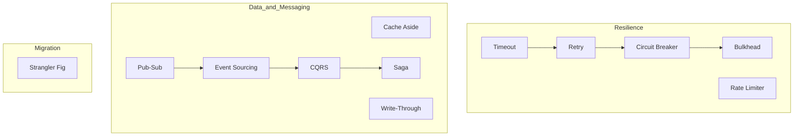

---

# RESILIENCE PATTERNS

---

## 1. Circuit Breaker

### Never Forget
**The fuse box.** When a circuit overloads, the fuse trips — power stops flowing before the whole house burns. After a cooldown, you reset and test one appliance.

### Simple explanation
Stop calling a failing downstream service for a period so threads, connections, and users aren't blocked by repeated timeouts — preventing **cascade failures**.

### Why
- One slow/dead dependency (Payment Service) can exhaust all threads in Order Service  
- Fail fast (< 1 ms) beats hang (30 s × 100 threads)  
- Gives downstream time to recover  

### How

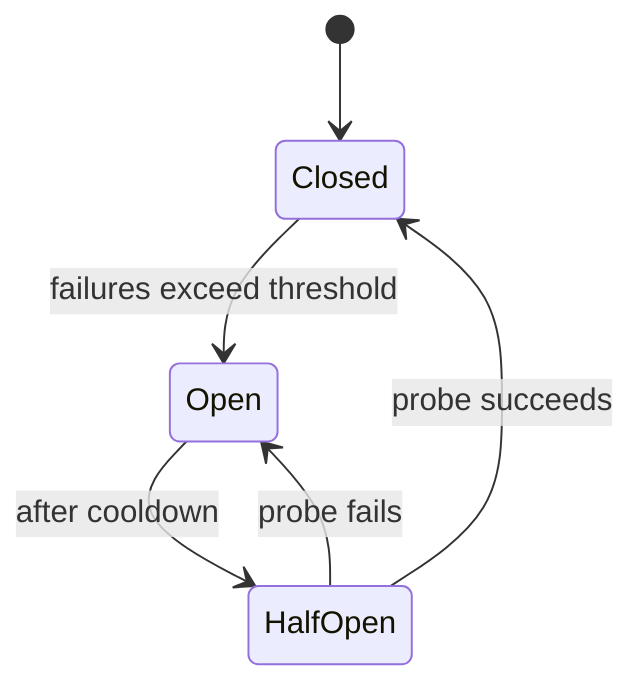

| State | Behavior |
|-------|----------|
| **Closed** | All requests pass through; count failures |
| **Open** | Fail immediately (503); no downstream call |
| **Half-Open** | Allow one probe request; decide next state |

### Where
- Netflix Hystrix / Resilience4j  
- Istio Envoy `outlierDetection`  
- AWS App Mesh, Spring Cloud Circuit Breaker  

### Interview signal
> "If Payment Service is down, Order Service should fail fast — not queue 10,000 blocked threads."

```java
// Resilience4j-style usage
CircuitBreaker cb = CircuitBreaker.of("payment", CircuitBreakerConfig.custom()
    .failureRateThreshold(50)
    .waitDurationInOpenState(Duration.ofSeconds(30))
    .slidingWindowSize(10)
    .build());

Supplier<PaymentResult> guarded = CircuitBreaker.decorateSupplier(cb,
    () -> paymentClient.charge(orderId));

try {
    return guarded.get();
} catch (CallNotPermittedException ex) {
    return PaymentResult.degraded("Payment temporarily unavailable");
}
```

**Deep dive:** [34-api-gateway-service-mesh.md](09-infrastructure/34-api-gateway-service-mesh.md) §7.2

---

## 2. Rate Limiter

### Never Forget
**The toll booth.** Only N cars cross the bridge per minute. Everyone else waits or takes another route — the bridge doesn't collapse under traffic.

### Simple explanation
Control how many requests a client (user, API key, IP) or the whole system can make in a time window. Return **429 Too Many Requests** + `Retry-After` when exceeded.

### Why
- Protect downstream databases and third-party APIs  
- Fair usage across tenants  
- DDoS and abuse mitigation (with CDN edge limits)  

### How
- **Token bucket** — allows bursts  
- **Sliding window counter** — production sweet spot (Stripe)  
- **Distributed:** Redis Lua for atomic increment across pods  

### Where
- API gateways (Kong, AWS API Gateway, Cloudflare)  
- GitHub/Stripe public APIs (`X-RateLimit-*` headers)  
- Notification anti-spam (max 10 marketing/user/day)  

### Interview signal
> "1000 req/min per API key; global cap 500K RPS; sub-5 ms decision at gateway."

```java
RateLimitResult result = limiter.allow("user:" + userId);
if (!result.allowed()) {
    return Response.status(429)
        .header("Retry-After", secondsUntil(result.resetAt()))
        .build();
}
```

**Deep dive:** [17-design-rate-limiter.md](06-platform-building-blocks/17-design-rate-limiter.md)

---

## 3. Bulkhead

### Never Forget
**Ship compartments.** If one hull section floods, watertight doors keep the rest afloat. One engine room fire doesn't sink the entire vessel.

### Simple explanation
**Isolate resources** (thread pools, connection pools, process pools) so failure or overload in one dependency cannot exhaust shared resources for the entire application.

### Why
- Shared thread pool: slow Payment calls block Search calls  
- Bulkhead: Payment gets 20 threads max; Search keeps 80  

### How

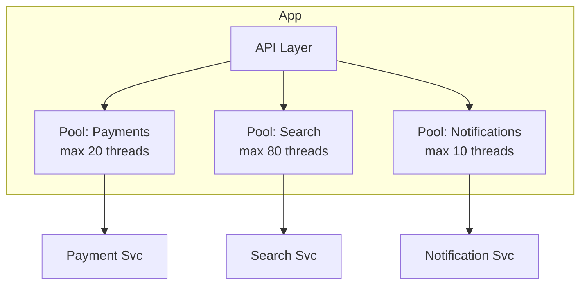

| Bulkhead type | Isolation unit |
|---------------|----------------|
| **Thread pool** | Per dependency (Hystrix command groups) |
| **Connection pool** | Per database / service |
| **Process / container** | Microservice boundary |
| **Cell architecture** | Shard by tenant/region (advanced) |

### Where
- Netflix Hystrix thread pool per dependency  
- Kubernetes: separate Deployments per service  
- Database: read replicas vs write primary  

### Interview signal
> "Payment timeouts must not starve the product catalog read path — separate pools."

```java
ExecutorService paymentPool = Executors.newFixedThreadPool(20);
ExecutorService searchPool = Executors.newFixedThreadPool(80);

CompletableFuture.supplyAsync(() -> paymentClient.charge(id), paymentPool);
CompletableFuture.supplyAsync(() -> searchClient.query(q), searchPool);
```

---

## 4. Retry Pattern

### Never Forget
**Redialing a busy line.** The line was busy — wait a few seconds, try again. Don't call 100 times in one second (that's harassment).

### Simple explanation
Automatically retry transient failures (network blip, 503, timeout) with **backoff**, **jitter**, and a **max attempt** cap.

### Why
- Transient errors are common at scale (≈0.1–1% of calls)  
- Idempotent operations safe to retry (GET, PUT with idempotency key)  

### How

```
Attempt 1 → fail (503)
Wait 1s ± jitter
Attempt 2 → fail
Wait 2s ± jitter
Attempt 3 → success OR give up → circuit breaker / DLQ
```

| Retry on | Do NOT retry |
|----------|--------------|
| 429, 502, 503, 504 | 400, 401, 403, 404 |
| Timeout | Non-idempotent POST without key |
| Connection reset | Business validation errors |

### Where
- AWS SDK default retry  
- gRPC retry policy  
- Message queue consumers (SQS visibility timeout)  

### Interview signal
> "Retry with exponential backoff and jitter; only if idempotent; max 3 attempts."

```java
public <T> T withRetry(Supplier<T> action, int maxAttempts) {
    int delayMs = 500;
    for (int attempt = 1; attempt <= maxAttempts; attempt++) {
        try {
            return action.get();
        } catch (TransientException ex) {
            if (attempt == maxAttempts) throw ex;
            sleep(delayMs + randomJitter(200));
            delayMs *= 2;
        }
    }
    throw new IllegalStateException("unreachable");
}
```

**Pair with:** Timeout (per attempt), Circuit Breaker (stop retrying when open)

---

## 5. Timeout Pattern

### Never Forget
**Hanging up after 30 seconds.** If nobody answers, you don't hold the line forever — you move on.

### Simple explanation
Set a **maximum wait** for every outbound call. When exceeded, fail the call and free the thread/connection.

### Why
- Without timeouts, one hung dependency blocks threads indefinitely  
- User-facing SLA (3 s checkout) requires aggressive downstream budgets  

### How

```
Total user budget:     3000 ms
  - Gateway overhead:   100 ms
  - Order service:      800 ms
    - Payment call:     500 ms (nested timeout)
    - Inventory call:   300 ms
  - Buffer:             200 ms
```

**Rule:** Child timeout < parent timeout. Always set connect + read timeouts.

### Where
- HTTP clients (`connectTimeout`, `readTimeout`)  
- gRPC deadlines  
- DB `statement_timeout`  
- Kafka `max.poll.interval.ms`  

### Interview signal
> "Every RPC gets a deadline; cascade timeouts from user SLA downward."

```java
HttpClient client = HttpClient.newBuilder()
    .connectTimeout(Duration.ofMillis(500))
    .build();

HttpRequest req = HttpRequest.newBuilder(uri)
    .timeout(Duration.ofMillis(2000))
    .GET()
    .build();
```

---

# CACHING PATTERNS

---

## 6. Cache Aside (Lazy Loading)

### Never Forget
**Check the fridge when you're hungry.** You don't stock the fridge until you know you want food. On miss, go to the store (DB), then put leftovers in the fridge.

### Simple explanation
Application manages cache: **read** → check cache → on miss load DB → populate cache. **Write** → update DB → invalidate or update cache.

### Why
- Only hot data in cache (memory efficient)  
- Cache failure doesn't break app (degrade to DB)  
- Most common pattern in production  

### How

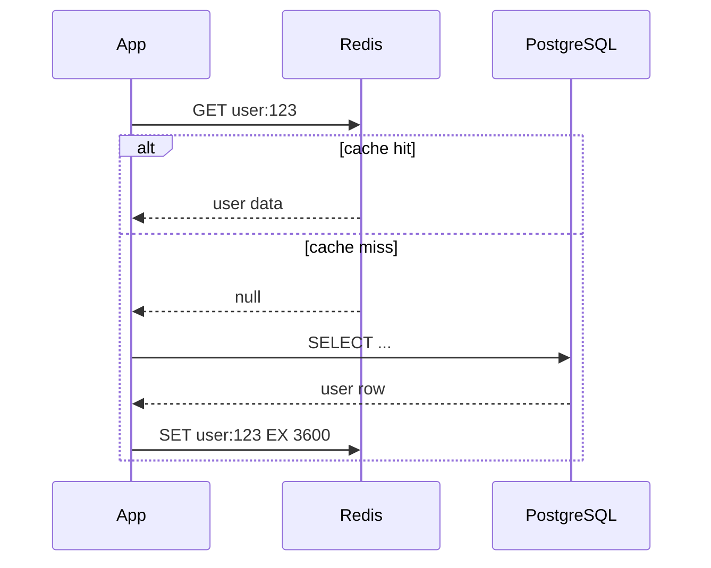

| Write strategy | Behavior |
|----------------|----------|
| **Invalidate** | Delete cache key after DB write (simplest) |
| **Update** | Write new value to cache (risk: race) |

### Where
- Redis + PostgreSQL (default stack)  
- CDN for static assets (variant of cache aside)  

### Interview signal
> "Read-through lazy load; invalidate on write; TTL for eventual freshness."

```java
public User getUser(String id) {
    User cached = redis.get("user:" + id);
    if (cached != null) return cached;
    User user = userRepo.findById(id);
    if (user != null) redis.setex("user:" + id, 3600, user);
    return user;
}

public void updateUser(User user) {
    userRepo.save(user);
    redis.del("user:" + user.getId());  // invalidate
}
```

**Deep dive:** [23-scaling-cap-caching-load-balancing-sharding-indexing.md](08-fundamentals/23-scaling-cap-caching-load-balancing-sharding-indexing.md) §4

---

## 7. Write-Through Cache

### Never Forget
**Diary and sticky note always match.** Every time you write in the diary, you update the sticky note at the same time — both always agree.

### Simple explanation
Writes go to **cache and database synchronously** (often cache delegates to DB). Reads usually hit cache first.

### Why
- Strong consistency between cache and DB on writes  
- No stale read immediately after write  
- Simpler read path (cache always warm for written keys)  

### How

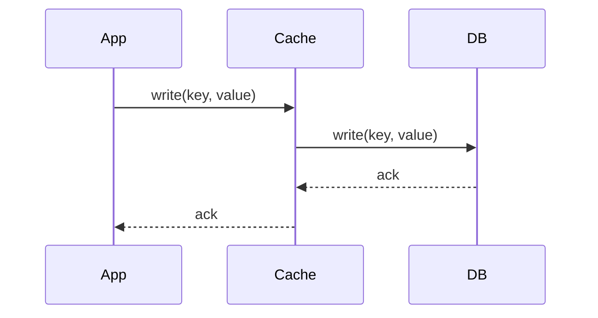

| vs Cache Aside | Write-Through | Cache Aside |
|----------------|---------------|-------------|
| Write path | Sync through cache | App writes DB, invalidates cache |
| Consistency | Stronger | Eventual (invalidation lag) |
| Complexity | Cache layer smarter | App owns orchestration |

### Where
- Hibernate second-level cache (some configs)  
- Write-through SSD caches  
- When read-after-write correctness is mandatory  

### Interview signal
> "User updates profile and immediately sees change — write-through or read-your-writes consistency."

```java
public void saveUser(User user) {
    userRepo.save(user);           // DB first or cache coordinates both
    redis.setex(key(user), ttl, user);
}

// Alternative: cache module owns both
cache.writeThrough(key, user, () -> userRepo.save(user));
```

---

# MESSAGING & DATA PATTERNS

---

## 8. Publish-Subscribe (Pub/Sub)

### Never Forget
**Radio broadcast.** One DJ transmits; every listener tuned to the frequency hears the same message. Listeners don't know about each other.

### Simple explanation
Publishers send messages to a **topic** without knowing subscribers. Subscribers receive copies **asynchronously**. Producers and consumers are decoupled.

### Why
- Fan-out: one `OrderCreated` event → inventory, shipping, analytics, email  
- Temporal decoupling: subscriber can be offline (queue retains messages)  
- Scale consumers independently  

### How

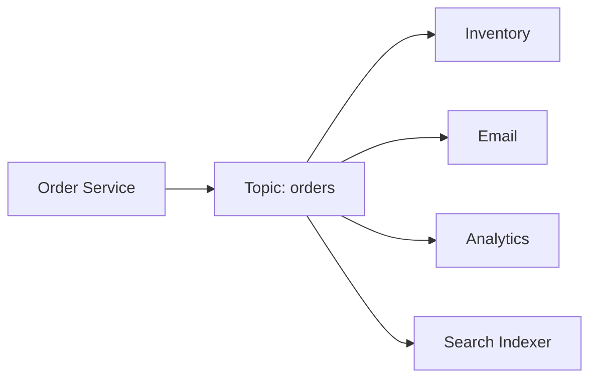

| System | Model |
|--------|-------|
| **Kafka** | Durable log; consumer groups |
| **RabbitMQ** | Exchange → bindings → queues |
| **AWS SNS** | Topic → SQS/Lambda/HTTP |
| **Redis Pub/Sub** | Fire-and-forget (no persistence) |

### Where
- Event-driven microservices  
- Notification fan-out  
- Real-time analytics pipelines  

### Interview signal
> "Order service publishes event; five downstream services consume independently."

```java
// Kafka producer sketch
kafkaTemplate.send("orders", orderId, new OrderCreatedEvent(orderId, items));

// Consumer group — each service its own group
@KafkaListener(topics = "orders", groupId = "inventory-service")
void onOrderCreated(OrderCreatedEvent event) {
    inventoryService.reserve(event.items());
}
```

**Deep dive:** [29-message-queues-patterns-comparison.md](08-fundamentals/29-message-queues-patterns-comparison.md)

---

## 9. Event Sourcing

### Never Forget
**Financial transaction journal.** You don't overwrite your bank balance — you append every deposit and withdrawal. Balance = sum of all events.

### Simple explanation
Store **state changes as an immutable sequence of events** instead of overwriting current state. Rebuild any point-in-time view by replaying events.

### Why
- Complete audit trail (regulatory, debugging)  
- Temporal queries: "What was inventory at 3 PM?"  
- Natural fit for event-driven architectures  

### How

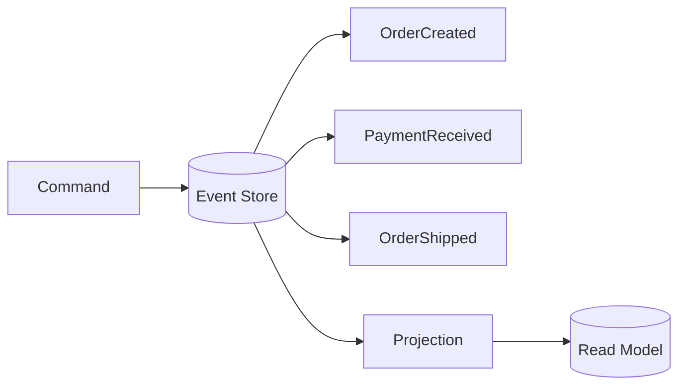

| Event store | Examples |
|-------------|----------|
| Kafka (compacted topic) | High throughput |
| EventStoreDB, Marten | Native event sourcing |
| PostgreSQL `events` table | Simple start |

### Where
- Banking / ledger systems  
- Collaborative editing (operational transform / CRDT alternative)  
- Domain-heavy systems (DDD aggregates)  

### Interview signal
> "Never update — only append. Current state = fold(events)."

```java
// Event append
eventStore.append(orderId, List.of(new PaymentReceived(orderId, amount, Instant.now())));

// Rebuild aggregate
Order order = new Order();
for (DomainEvent e : eventStore.load(orderId)) {
    order = order.apply(e);
}
```

**Trade-off:** Schema evolution (upcasting), storage growth, learning curve.

---

## 10. CQRS (Command Query Responsibility Segregation)

### Never Forget
**Cashier vs refunds clerk.** One desk handles sales (writes); another handles lookups and reports (reads). Each optimized for its job.

### Simple explanation
**Separate models** for writes (commands) and reads (queries). Write side normalized; read side denormalized for fast queries.

### Why
- Read:write ratio 1000:1 (Instagram feeds, product catalogs)  
- Different stores: PostgreSQL for writes, Elasticsearch for search reads  
- Independent scaling of read replicas / projections  

### How

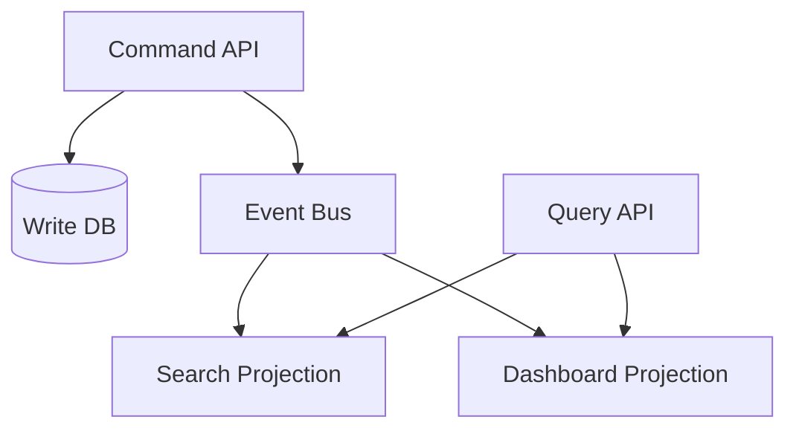

**CQRS ≠ Event Sourcing.** You can CQRS with simple DB → cache invalidation. Event sourcing often pairs with CQRS but is optional.

### Where
- High-traffic e-commerce (write order, read catalog)  
- Social feeds (write post, read timeline)  
- Reporting dashboards  

### Interview signal
> "Writes go to normalized DB; async projection builds Elasticsearch read model."

```java
// Command side
@PostMapping("/orders")
void createOrder(CreateOrderCommand cmd) {
    Order order = orderService.create(cmd);
    eventBus.publish(new OrderCreated(order));
}

// Query side — separate service, denormalized store
@GetMapping("/orders/{id}/summary")
OrderSummary getSummary(@PathVariable UUID id) {
    return readModelRepo.findSummary(id);  // Elasticsearch / Redis
}
```

**Deep dive:** [29-message-queues-patterns-comparison.md](08-fundamentals/29-message-queues-patterns-comparison.md) §13

---

## 11. Strangler Fig Pattern

### Never Forget
**The vine over the old tree.** A strangler fig grows around a host tree, eventually replacing it — without chopping the tree down on day one.

### Simple explanation
**Incrementally migrate** from a legacy system by routing traffic feature-by-feature to new services, until the legacy system can be decommissioned.

### Why
- Big-bang rewrite fails (years, no value)  
- Reduce risk: migrate highest-value paths first  
- Rollback per route if new service fails  

### How

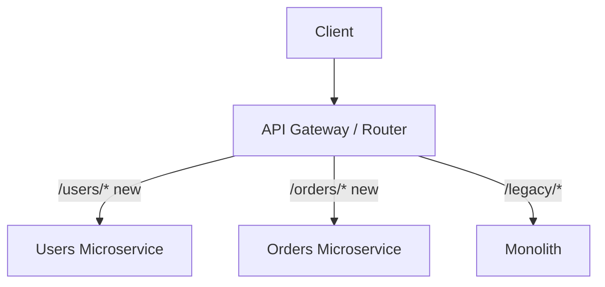

**Steps:**
1. Place facade/router in front of monolith  
2. Implement new service for one bounded context  
3. Route matching requests to new service (feature flag %)  
4. Repeat until monolith is empty shell  
5. Retire monolith  

### Where
- Enterprise monolith → microservices  
- Mainframe migration  
- Database extraction (strangle by table ownership)  

### Interview signal
> "Don't rewrite Uber in one year — route `/payments` to new service first; monolith handles the rest."

```java
// Gateway routing pseudocode
if (featureFlags.isEnabled("new-checkout", userId)) {
    return newCheckoutService.checkout(request);
}
return legacyMonolith.checkout(request);
```

---

## 12. Saga Pattern

### Never Forget
**Book flight, hotel, and car.** If the hotel booking fails after the flight is booked, you **cancel the flight** — compensating actions undo prior steps.

### Simple explanation
Manage a **distributed transaction** as a sequence of **local transactions**, each with a **compensating transaction** if a later step fails. No two-phase commit (2PC) across services.

### Why
- Microservices own their DB — no distributed locks  
- 2PC doesn't scale; many SaaS APIs don't support XA  
- Long-running flows (minutes) need async coordination  

### How

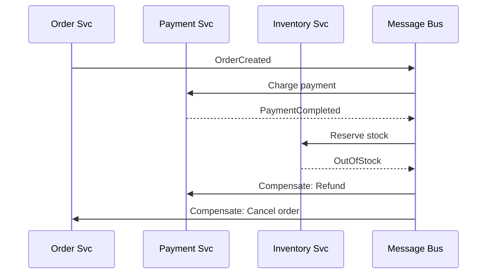

| Style | Orchestration | Choreography |
|-------|---------------|--------------|
| **Coordinator** | Central saga orchestrator | None — services react to events |
| **Pros** | Easier to trace | Looser coupling |
| **Cons** | Single point of logic | Harder to debug |

### Where
- Travel booking (flight + hotel + car)  
- E-commerce (order + payment + inventory + shipping)  
- Payment gateway capture + ledger + notification  

### Interview signal
> "Each step idempotent; on failure run compensating transactions; saga state table tracks progress."

```java
// Orchestrator sketch
void runOrderSaga(Order order) {
    sagaState.start(order.id());
    try {
        paymentService.charge(order);      // step 1
        sagaState.completeStep("payment");
        inventoryService.reserve(order);   // step 2
        sagaState.completeStep("inventory");
        shippingService.schedule(order);   // step 3
        sagaState.complete("success");
    } catch (InventoryException ex) {
        paymentService.refund(order);      // compensate step 1
        sagaState.complete("compensated");
    }
}
```

**Deep dive:** [29-message-queues-patterns-comparison.md](08-fundamentals/29-message-queues-patterns-comparison.md) §14 · [18-design-payment-gateway.md](06-platform-building-blocks/18-design-payment-gateway.md)

---

# COMBINING PATTERNS (Interview Gold)

| Scenario | Patterns together |
|----------|-------------------|
| **Public API** | Rate Limiter → Timeout → Retry → Circuit Breaker |
| **Checkout** | Saga + Idempotency + Circuit Breaker on payment |
| **Product page** | Cache Aside + Bulkhead (search vs cart pools) |
| **Order pipeline** | Pub/Sub → Event Sourcing → CQRS projections |
| **Legacy migration** | Strangler Fig + Saga for dual-write period |
| **Notification burst** | Pub/Sub + Rate Limiter + Bulkhead per channel |

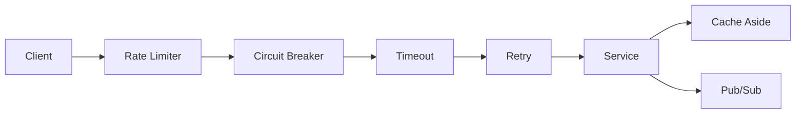

---

# Interview Cheat Sheet

| Pattern | One-line answer |
|---------|-----------------|
| Circuit Breaker | Fail fast when dependency unhealthy; Closed → Open → Half-Open |
| Rate Limiter | Token bucket / sliding window; 429 + Retry-After |
| Bulkhead | Separate thread pools per dependency |
| Retry | Exponential backoff + jitter; idempotent only |
| Timeout | Connect + read timeout; child < parent budget |
| Cache Aside | Lazy load; invalidate on write |
| Write-Through | Sync write cache + DB |
| Pub/Sub | Async fan-out; Kafka consumer groups |
| Event Sourcing | Append events; rebuild state by replay |
| CQRS | Split read/write models; optional event sourcing |
| Strangler Fig | Route feature-by-feature off monolith |
| Saga | Local txs + compensating actions; no 2PC |

### Common mistakes

| Mistake | Fix |
|---------|-----|
| Retry without idempotency | Idempotency-Key on all mutating retries |
| Retry without timeout | Each attempt bounded |
| Cache aside stale reads | Invalidate or TTL + read-your-writes |
| Saga without compensation | Every forward step needs undo |
| CQRS everywhere | Only when read/write needs diverge |
| Strangler big-bang | Feature flags + % traffic ramp |

### Follow-up questions

1. **Circuit breaker vs retry?** — Retry handles transients; breaker stops calling when dependency is persistently down.  
2. **Saga vs 2PC?** — Saga = availability + eventual consistency; 2PC = strong consistency, poor scale.  
3. **Event sourcing without CQRS?** — Possible but rare; usually paired.  
4. **Cache aside vs write-through for Instagram feed?** — Cache aside for user profiles; CDN for media; feed is precomputed (different pattern).  
5. **Bulkhead vs circuit breaker?** — Bulkhead limits resource sharing; breaker limits calls to unhealthy deps. Use both.

---

## Related Guides in This Repo

| Topic | Guide |
|-------|-------|
| GoF / OOP patterns | [DESIGN-PATTERNS-MASTER-GUIDE.md](DESIGN-PATTERNS-MASTER-GUIDE.md) |
| Rate limiter deep dive | [17-design-rate-limiter.md](06-platform-building-blocks/17-design-rate-limiter.md) |
| Caching, LB, sharding | [23-scaling-cap-caching-load-balancing-sharding-indexing.md](08-fundamentals/23-scaling-cap-caching-load-balancing-sharding-indexing.md) |
| Saga, CQRS, event sourcing | [29-message-queues-patterns-comparison.md](08-fundamentals/29-message-queues-patterns-comparison.md) |
| Circuit breaker at mesh | [34-api-gateway-service-mesh.md](09-infrastructure/34-api-gateway-service-mesh.md) |
| Payment saga | [18-design-payment-gateway.md](06-platform-building-blocks/18-design-payment-gateway.md) |

---

*Last updated: August 2026*
