# Networking Master Guide — Zero to World-Class (Including AWS, Azure, GCP)

> **Goal:** From zero to **world-class** network engineer — subnetting you never forget, systematic troubleshooting, enterprise security, and multi-cloud VPC design at big tech bar.

---

## Table of Contents

1. [Part 0: How to Use + Study Path](#part-0-how-to-use--study-path)
2. [Part 1: Never Forget Subnetting (THE MEMORABLE METHOD)](#part-1-never-forget-subnetting-the-memorable-method)
3. [Part 2: OSI & TCP/IP Models](#part-2-osi--tcpip-models)
4. [Part 3: Ethernet, Switching, VLANs](#part-3-ethernet-switching-vlans)
5. [Part 4: IP Routing](#part-4-ip-routing)
6. [Part 5: Core Protocols Deep Dive](#part-5-core-protocols-deep-dive)
7. [Part 6: Network Troubleshooting Toolkit](#part-6-network-troubleshooting-toolkit)
8. [Part 7: WAN, VPN, Load Balancing](#part-7-wan-vpn-load-balancing)
9. [Part 8: AWS Networking (THOROUGH)](#part-8-aws-networking-thorough--major-section)
10. [Part 9: Data Center & Modern Networking](#part-9-data-center--modern-networking)
11. [Part 10: Big Tech & Cert Path](#part-10-big-tech--cert-path)
12. [Part 11: Master Cheat Sheets](#part-11-master-cheat-sheets)
13. [Part 12: Network Security Engineering](#part-12-network-security-engineering)
14. [Part 13: Wireless & Remote Access](#part-13-wireless--remote-access)
15. [Part 14: Azure & GCP Networking](#part-14-azure--gcp-networking)
16. [Part 15: BGP & Internet Routing](#part-15-bgp--internet-routing)
17. [Part 16: Performance, QoS & Elite Troubleshooting](#part-16-performance-qos--elite-troubleshooting)

---

# Part 0: How to Use + Study Path

## 0.1 How to Use This Guide

This guide is designed for **sequential study** with **deliberate practice**. Reading alone will not make you a networking engineer — you must do the worked examples, draw diagrams, and explain concepts out loud.

**Recommended study flow:**

```
Week 1-2:  Part 1 (Subnetting) — do ALL examples without looking at answers
Week 3:    Part 2-3 (Models, L2 switching)
Week 4:    Part 4-5 (Routing, TCP/DNS/HTTP)
Week 5:    Part 6 (Troubleshooting — practice on real systems)
Week 6-7:  Part 8 (AWS — build labs in free tier)
Week 8:    Part 7, 9, 10 (WAN, modern DC, interview prep)
Ongoing:   Part 11 cheat sheets — review before interviews
```

## 0.2 Prerequisites

| Prerequisite | Why You Need It | If Missing |
|-------------|-----------------|------------|
| Basic computer literacy | Navigate OS, run commands | Any intro CS course |
| Command line comfort | Troubleshooting tools live in terminal | Practice `bash` basics |
| Binary/hex familiarity | Subnetting uses binary | Part 1 covers a 10-min refresher |
| AWS account (free tier) | Hands-on VPC labs | Create one before Part 8 |

## 0.3 Study Paths by Goal

### Path A: Network Engineer (CCNA → CCNP)

Focus: Parts 1-7 deeply, Part 3 (STP/VLANs), Part 4 (OSPF/BGP), Part 9 (spine-leaf). AWS Part 8 sections on hybrid connectivity.

### Path B: Cloud / DevOps Engineer (AWS)

Focus: Part 1 (subnetting for VPC design), Part 5 (DNS/TLS), Part 6 (troubleshooting), **Part 8 entirely**, Part 9 (Terraform snippet).

### Path C: Backend / SRE at Big Tech

Focus: Part 2, Part 5 (TCP/DNS/HTTP deep), Part 6, Part 7 (load balancing), Part 8 (VPC + ALB/NLB), Part 10 (interview subnetting).

### Path D: Security Engineer

Focus: Part 1, Part 5 (TLS), Part 6, Part 7 (VPN/IPSec), Part 8 (SG/NACL/Firewall/WAF), Part 3 (VLAN segmentation).

## 0.4 Lab Environment Setup

```bash
# Minimal lab toolkit
sudo apt install -y iproute2 iputils-ping traceroute mtr-tiny dnsutils net-tools ethtool tcpdump nmap

# AWS CLI for Part 8
curl -fsSL https://aws.amazon.com/cli/ | bash  # or: pip install awscli
aws configure  # use a dedicated lab account
```

**Virtual lab options:**

| Tool | Use Case | Cost |
|------|----------|------|
| GNS3 / EVE-NG | Cisco routing/switching labs | Free (bring your own images) |
| AWS Free Tier | VPC, ALB, Route 53 labs | Free for 12 months (limits apply) |
| Docker networks | Container networking basics | Free |
| Mininet | SDN / OpenFlow experiments | Free |

## 0.5 How Experts Think About Networks

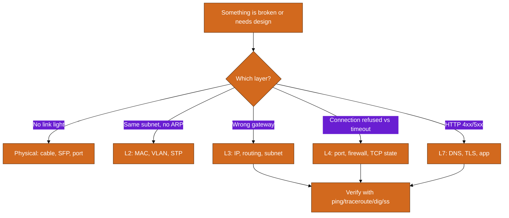

**The three questions every networking engineer asks:**

1. **Can bits physically flow?** (link up, correct VLAN, correct interface)
2. **Can packets reach the destination IP?** (routing, NAT, security policy)
3. **Can the application connect on the right port?** (firewall, service listening, DNS)

## World-Class Network Engineer Path (24 months)

This roadmap assumes **10–15 hours per week** of deliberate study and lab work. It builds on Parts 1–11 and extends through Parts 12–16. Adjust pace if you are full-time; compress if you already have CCNA-level foundations.

### Months 1–3: Foundations (Parts 1–3)

| Week | Focus | Deliverable |
|------|-------|-------------|
| 1–2 | Subnetting (Part 1) | Solve 50 subnet problems without notes |
| 3 | OSI/TCP-IP (Part 2) | Draw packet flow for HTTP request from scratch |
| 4–6 | L2 switching, VLANs, STP (Part 3) | GNS3/EVE-NG lab: 3 VLANs, inter-VLAN routing |
| 7–8 | ARP, routing basics (Part 4 start) | Configure static routes on 2 routers |
| 9–12 | OSPF, ACLs (Part 4) | Multi-area OSPF lab; document LSA types |

**Milestone:** Pass CCNA-level subnetting mock exam (90%+). Explain STP root election without notes.

### Months 4–6: Protocols & Troubleshooting (Parts 5–6)

| Week | Focus | Deliverable |
|------|-------|-------------|
| 13–15 | TCP, DNS, TLS, HTTP (Part 5) | Wireshark capture: full TLS handshake annotated |
| 16–18 | Troubleshooting toolkit (Part 6) | Resolve 10 simulated break/fix scenarios |
| 19–20 | MTU, asymmetric routing (Part 6) | Document MTU black hole reproduction and fix |
| 21–24 | WAN, VPN, load balancing (Part 7) | Site-to-site IPSec lab (on-prem sim + cloud) |

**Milestone:** Diagnose a broken connection in under 15 minutes using layered methodology.

### Months 7–9: Cloud Networking (Parts 8, 14)

| Week | Focus | Deliverable |
|------|-------|-------------|
| 25–28 | AWS VPC deep dive (Part 8) | Build 3-tier VPC with ALB, NAT, RDS |
| 29–30 | AWS hybrid (Part 8) | VPN or TGW hub-spoke architecture diagram |
| 31–34 | Azure VNet, NSG, Firewall (Part 14) | Mirror AWS 3-tier in Azure |
| 35–36 | GCP VPC, Shared VPC, Cloud Armor (Part 14) | Multi-cloud comparison doc you wrote |

**Milestone:** Design equivalent 3-tier app on AWS, Azure, and GCP with correct CIDR and security boundaries.

### Months 10–12: Security & Wireless (Parts 12–13)

| Week | Focus | Deliverable |
|------|-------|-------------|
| 37–39 | Firewalls, IDS/IPS, segmentation (Part 12) | Design 3-zone network with rule matrix |
| 40–41 | DDoS mitigation, WAF (Part 12) | Write runbook for SYN flood + WAF rule set |
| 42–44 | WiFi, 802.1X, WPA3 (Part 13) | Corporate WiFi design with guest isolation |
| 45–48 | VPN deep dive, ZTNA vs VPN (Part 13) | Compare IPSec vs SSL VPN for remote workforce |

**Milestone:** Present secure 3-zone architecture to a peer; defend every firewall rule.

### Months 13–18: Internet Routing & Performance (Parts 15–16)

| Week | Focus | Deliverable |
|------|-------|-------------|
| 49–52 | BGP fundamentals (Part 15) | Lab eBGP between 2 AS; explain path selection |
| 53–54 | Route hijacking, anycast, CDN (Part 15) | Trace CDN request path; explain anycast routing |
| 55–58 | QoS, DiffServ, queuing (Part 16) | Mark and queue traffic on a router or switch |
| 59–60 | MTU/MSS, bufferbloat, TCP tuning (Part 16) | Fix simulated PMTUD black hole |
| 61–72 | War stories + automation (Part 16) | Ansible NETCONF playbook for VLAN push |

**Milestone:** Troubleshoot simulated internet reachability failure using BGP tools (whois, bgp.tools, traceroute).

### Months 19–24: Data Center, Certs & Interview (Parts 9–10, review)

| Week | Focus | Deliverable |
|------|-------|-------------|
| 73–76 | Spine-leaf, VXLAN, EVPN (Part 9) | Draw modern DC fabric; explain VNI |
| 77–80 | Terraform networking (Part 9) | IaC module for VPC/VNet with tests |
| 81–84 | Cert prep (Part 10) | CCNP ENCOR or AWS Advanced Networking Specialty |
| 85–96 | Interview drills, cheat sheets (Part 11) | 20 whiteboard designs; 50 rapid-fire questions |

**Milestone:** Earn target certification OR pass mock panel interview at big-tech bar.

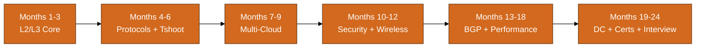

**Weekly habits that separate good from world-class:**

1. **One packet trace per week** — even a 5-minute tcpdump teaches something
2. **One architecture diagram per week** — draw, then defend it aloud
3. **One break/fix scenario** — break your lab intentionally, fix with Part 6 methodology
4. **Read one RFC abstract or vendor doc section** — builds depth beyond exam trivia

---

# Part 1: Never Forget Subnetting (THE MEMORABLE METHOD)

Subnetting is the single most tested networking skill in interviews and on CCNA/AWS exams. This section gives you a **memorable mental model** and enough numeric practice that you never forget again.

## 1.1 The Apartment Building Analogy

Think of an IP address as a **street address for an apartment building:**

```
  192.168.10.45/24
  |________|  |
  Building    Apartment number
  (Network)   (Host)
```

| Concept | Apartment Analogy | Networking Term |
|---------|--------------------|-----------------|
| The street | Which building on the block | **Network portion** |
| Apartment number | Which unit inside | **Host portion** |
| Building manager rules | How many units exist | **Subnet mask / prefix** |
| Mailroom for the block | Default gateway | **Router interface on subnet** |
| Locked front door | Cannot reach other buildings directly | **Need router to cross subnets** |

**The /24 rule you will use constantly:** `/24` means the first **3 octets** (24 bits) identify the building; the last octet (8 bits) identifies the apartment.

```
192.168.10.0/24  →  Building: 192.168.10.x   →  Apartments: .1 through .254
10.0.0.0/8       →  Building: 10.x.x.x        →  Huge campus (16M hosts)
172.16.5.0/28    →  Building: 172.16.5.0-15   →  Tiny office (14 hosts)
```

## 1.2 Binary Refresher in 10 Minutes

IPv4 addresses are **32 bits**, written as **four octets** (8 bits each), separated by dots.

### 1.2.1 Powers of 2 (Memorize Through 2^16)

| Power | Value | Use in Subnetting |
|-------|-------|-------------------|
| 2^0 | 1 | Last bit |
| 2^1 | 2 | /31, /30 P2P links |
| 2^2 | 4 | /30 block size |
| 2^3 | 8 | /29 block size |
| 2^4 | 16 | /28 block size |
| 2^5 | 32 | /27 block size |
| 2^6 | 64 | /26 block size |
| 2^7 | 128 | /25 block size |
| 2^8 | 256 | /24 block size |
| 2^16 | 65,536 | /16 block size |

### 1.2.2 Binary ↔ Decimal Conversion

Each octet position has a weight:

```
Bit position:  128  64  32  16   8   4   2   1
Example 192:   1    1   0   0   0   0   0   0  = 128+64 = 192
Example 10:    0    0   0   0   1   0   1   0  = 8+2 = 10
Example 255:   1    1   1   1   1   1   1   1  = 128+64+32+16+8+4+2+1
```

**Quick method for exam speed:**

1. Memorize: 128, 192, 224, 240, 248, 252, 254, 255 (increment by halving the gap)
2. For any octet, subtract from 255 to get wildcard inverse
3. AND operation: both 1 → 1, else → 0

### 1.2.3 Practice Conversions

| Decimal | Binary | Hex |
|---------|--------|-----|
| 0 | 00000000 | 0x00 |
| 10 | 00001010 | 0x0A |
| 127 | 01111111 | 0x7F |
| 192 | 11000000 | 0xC0 |
| 255 | 11111111 | 0xFF |

## 1.3 Magic Numbers Table

### 1.3.1 Common Prefixes

| CIDR | Subnet Mask | Wildcard | Total Addresses | Usable Hosts | Block Size (last octet) |
|------|-------------|----------|-----------------|--------------|-------------------------|
| /8 | 255.0.0.0 | 0.255.255.255 | 16,777,216 | 16,777,214 | 256.256.256 (classful A) |
| /16 | 255.255.0.0 | 0.0.255.255 | 65,536 | 65,534 | 256.256 (classful B) |
| /24 | 255.255.255.0 | 0.0.0.255 | 256 | 254 | 256 |
| /25 | 255.255.255.128 | 0.0.0.127 | 128 | 126 | 128 |
| /26 | 255.255.255.192 | 0.0.0.63 | 64 | 62 | 64 |
| /27 | 255.255.255.224 | 0.0.0.31 | 32 | 30 | 32 |
| /28 | 255.255.255.240 | 0.0.0.15 | 16 | 14 | 16 |
| /29 | 255.255.255.248 | 0.0.0.7 | 8 | 6 | 8 |
| /30 | 255.255.255.252 | 0.0.0.3 | 4 | 2 | 4 |
| /31 | 255.255.255.254 | 0.0.0.1 | 2 | 2* | 2 |
| /32 | 255.255.255.255 | 0.0.0.0 | 1 | 1 | 1 |

*RFC 3021: /31 valid for point-to-point links on modern routers.

### 1.3.2 The Block Size Trick

For subnets in the **last octet** ( /24 through /32 ):

```
Block size = 256 - (interesting octet of subnet mask)

Example /26: mask last octet = 192
Block size = 256 - 192 = 64
Networks: .0, .64, .128, .192
```

For subnets in the **third octet** ( /16 through /23 ):

```
Block size in third octet = 256 - (third octet of mask)

Example /20: mask = 255.255.240.0, third octet = 240
Block size = 256 - 240 = 16
Networks: 10.0.0.0, 10.0.16.0, 10.0.32.0, ...
```

## 1.4 Step-by-Step Subnetting Algorithm

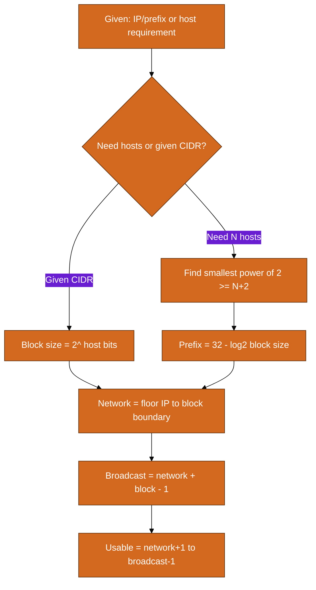

**The 5-step method (never forget):**

1. **Convert prefix to subnet mask** (or vice versa)
2. **Calculate block size** in the interesting octet
3. **Find network address** — round IP DOWN to block boundary
4. **Find broadcast** — network + block size - 1
5. **Usable range** — network + 1 through broadcast - 1; gateway usually .1

## 1.5 Worked Examples (Classless Subnetting)

### Example 1: Basic /24

**Given:** `192.168.1.45/24`

| Step | Result |
|------|--------|
| Subnet mask | 255.255.255.0 |
| Block size | 256 (only one subnet in last octet) |
| Network | 192.168.1.0 |
| Broadcast | 192.168.1.255 |
| First usable | 192.168.1.1 |
| Last usable | 192.168.1.254 |
| Host count | 254 |

### Example 2: /26 subnet

**Given:** `10.10.10.130/26`

| Step | Result |
|------|--------|
| Mask last octet | 192 → block size = 256-192 = 64 |
| Which block? | 130 is in 128-191 range → network 10.10.10.128 |
| Network | 10.10.10.128 |
| Broadcast | 10.10.10.191 |
| First usable | 10.10.10.129 |
| Last usable | 10.10.10.190 |
| Usable hosts | 62 |

### Example 3: /28 subnet

**Given:** `172.16.5.17/28`

| Step | Result |
|------|--------|
| Mask last octet | 240 → block = 16 |
| 17 falls in | 16-31 block → network 172.16.5.16 |
| Network | 172.16.5.16 |
| Broadcast | 172.16.5.31 |
| First usable | 172.16.5.17 |
| Last usable | 172.16.5.30 |
| Usable hosts | 14 |

### Example 4: /30 point-to-point

**Given:** `203.0.113.6/30`

| Step | Result |
|------|--------|
| Block size | 4 |
| Network | 203.0.113.4 |
| Broadcast | 203.0.113.7 |
| Usable (2) | 203.0.113.5 and 203.0.113.6 |
| Typical use | Router-to-router WAN link |

### Example 5: /27 subnet

**Given:** `192.168.50.200/27`

| Step | Result |
|------|--------|
| Block size | 32 |
| 200 in block | 192-223 → network 192.168.50.192 |
| Network | 192.168.50.192 |
| Broadcast | 192.168.50.223 |
| First usable | 192.168.50.193 |
| Last usable | 192.168.50.222 |
| Usable hosts | 30 |

### Example 6: /25 subnet

**Given:** `10.1.1.100/25`

| Step | Result |
|------|--------|
| Block size | 128 |
| 100 in | 0-127 block → network 10.1.1.0 |
| Network | 10.1.1.0 |
| Broadcast | 10.1.1.127 |
| First usable | 10.1.1.1 |
| Last usable | 10.1.1.126 |
| Usable hosts | 126 |

### Example 7: /29 for small server farm

**Given:** `10.20.30.9/29`

| Step | Result |
|------|--------|
| Block size | 8 |
| Network | 10.20.30.8 |
| Broadcast | 10.20.30.15 |
| Usable | 10.20.30.9 - 10.20.30.14 (6 hosts) |
| Gateway | 10.20.30.9 (typical) |

### Example 8: /23 (subnet in third octet)

**Given:** `10.10.1.200/23`

| Step | Result |
|------|--------|
| Mask third octet | 254? No — /23 = 255.255.254.0 |
| Block in 3rd octet | 256-254=2 → pairs: 0.0/1.0, 2.0/3.0... |
| Network | 10.10.0.0 |
| Broadcast | 10.10.1.255 |
| Usable range | 10.10.0.1 - 10.10.1.254 |
| Host count | 510 |

### Example 9: /20 corporate VLAN

**Given:** `172.16.45.100/20`

| Step | Result |
|------|--------|
| Mask | 255.255.240.0, block in 3rd = 16 |
| 45 in block | 32-47 → network 172.16.32.0 |
| Network | 172.16.32.0 |
| Broadcast | 172.16.47.255 |
| First usable | 172.16.32.1 |
| Last usable | 172.16.47.254 |
| Host count | 4094 |

### Example 10: Find prefix for 50 hosts

**Given:** `Requirement: subnet for 50 hosts`

| Step | Result |
|------|--------|
| Need addresses | 50 + 2 = 52 (network + broadcast) |
| Smallest power of 2 | 64 (2^6) |
| Host bits | 6 → prefix = 32-6 = /26 |
| Mask | 255.255.255.192 |
| If starting 10.5.5.0 | 10.5.5.0/26, next subnet 10.5.5.64/26 |

### Example 11: Find prefix for 1000 hosts

**Given:** `Requirement: 1000 hosts`

| Step | Result |
|------|--------|
| Need | 1002 addresses |
| Power of 2 | 1024 = 2^10 |
| Host bits | 10 → prefix = /22 |
| Mask | 255.255.252.0 |
| Block in 3rd octet | 4 |

### Example 12: /19 subnet

**Given:** `10.100.200.50/19`

| Step | Result |
|------|--------|
| Mask | 255.255.224.0, block=32 in 3rd octet |
| 200 in block | 192-223 → network 10.100.192.0 |
| Network | 10.100.192.0 |
| Broadcast | 10.100.223.255 |
| Usable hosts | 8190 |

### Example 13: AWS-style /28

**Given:** `10.0.1.17/28 (AWS reserves 5 IPs)`

| Step | Result |
|------|--------|
| Network | 10.0.1.16 |
| Broadcast | 10.0.1.31 |
| AWS reserved | .16 network, .17 VPC router, .18-.19 AWS, .31 broadcast |
| Usable for EC2 | 10.0.1.20 - 10.0.1.30 (11 addresses) |

### Example 14: Invalid network address

**Given:** `192.168.1.65/26 — is 65 a valid network?`

| Step | Result |
|------|--------|
| Block size | 64 |
| Valid networks | .0, .64, .128, .192 |
| 65 is NOT network | Correct network: 192.168.1.64 |
| Lesson | Always round DOWN to block boundary |

### Example 15: /17 large subnet

**Given:** `10.0.128.50/17`

| Step | Result |
|------|--------|
| Block in 2nd octet | 128 |
| 128.50 in | 128.0.0 - 255.255.255 block |
| Network | 10.0.128.0 |
| Broadcast | 10.0.255.255 |
| Usable hosts | 32766 |

## 1.6 VLSM Case Study: Office Network Design

**Scenario:** Design subnets for a company office using `192.168.0.0/24`.

| Department | Hosts Needed | Assigned Subnet | Usable Range | Gateway |
|------------|--------------|-----------------|--------------|---------|
| DMZ (web servers) | 14 | 192.168.0.0/28 | .1-.14 | .1 |
| Server room | 30 | 192.168.0.16/27 | .17-.46 | .17 |
| Users (Floor 1) | 62 | 192.168.0.64/26 | .65-.126 | .65 |
| Users (Floor 2) | 62 | 192.168.0.128/26 | .129-.190 | .129 |
| Point-to-point (Router-Switch) | 2 | 192.168.0.192/30 | .193-.194 | .193 |
| Point-to-point (Router-FW) | 2 | 192.168.0.196/30 | .197-.198 | .197 |
| Management | 6 | 192.168.0.200/29 | .201-.206 | .201 |
| **Remaining** | — | 192.168.0.208/28 | spare | — |

**VLSM design process:**

1. Sort departments by size (largest first) — actually for VLSM, sort **largest first** to avoid fragmentation
2. Assign largest block first from the bottom of the address space OR top — be consistent
3. Next subnet starts at previous network + block size
4. Verify no overlap

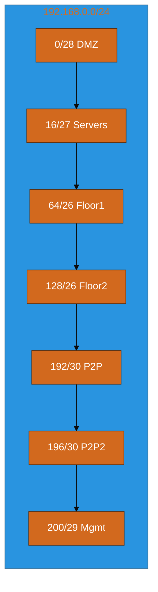

## 1.7 Supernetting / CIDR Aggregation

**Supernetting** combines multiple contiguous networks into one larger route advertisement.

**Example:** Aggregate these networks:

```
192.168.0.0/24
192.168.1.0/24
192.168.2.0/24
192.168.3.0/24
```

| Step | Action | Result |
|------|--------|--------|
| 1 | Write networks in binary (last octet) | .0, .1, .2, .3 differ in last 2 bits |
| 2 | Find common prefix | 192.168.0.0 — first 22 bits match |
| 3 | Aggregate route | **192.168.0.0/22** (1024 addresses) |

**Why it matters:** BGP tables would be enormous without aggregation. AWS VPC route summarization uses the same principle.

## 1.8 IPv6 Addressing Essentials

| Concept | IPv4 | IPv6 |
|---------|------|------|
| Address length | 32 bits | 128 bits |
| Notation | 192.168.1.1 | 2001:db8::1 |
| Typical subnet | /24 | **/64** (always for LANs) |
| Broadcast | Explicit | No broadcast — uses multicast |
| Config | DHCP | SLAAC + DHCPv6 optional |

**SLAAC (Stateless Address Autoconfiguration):**

1. Host sends Router Solicitation (RS)
2. Router advertises prefix (e.g., `2001:db8:1::/64`)
3. Host combines prefix + interface ID (often EUI-64 from MAC)
4. Host is configured without DHCP server

**AWS IPv6:** VPC gets a /56; each subnet gets a /64. Use Egress-Only Internet Gateway for outbound-only IPv6.

## 1.9 Never Forget Quick Decision Tree

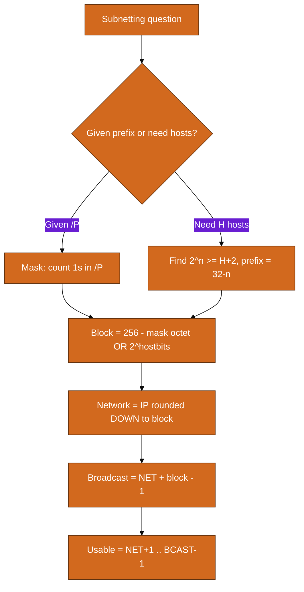

**Interview speed tip:** For /24-/32, always use **256 - mask octet = block size**. Write block boundaries vertically on scratch paper.

---


## 1.10 Additional Subnetting Drills

Work these until you can finish each in under 60 seconds.

| Drill | Given | Answer |
|-------|-------|--------|
| Drill 1 | `172.16.88.200/21` | Block=8 in 3rd octet; 88 in 88-95; net 172.16.88.0; bcast 172.16.95.255; 2046 hosts |
| Drill 2 | `192.168.100.45/29` | Block=8; net 192.168.100.40; bcast 192.168.100.47; usable .41-.46 |
| Drill 3 | `10.255.255.254/32` | Single host address; /32 host route |
| Drill 4 | `Need 500 hosts in 10.8.0.0/16` | /23 (510 hosts); first subnet 10.8.0.0/23 |
| Drill 5 | `203.0.113.77/27` | Block=32; net 203.0.113.64; bcast 203.0.113.95 |
| Drill 6 | `Split 192.168.50.0/24 into 4 equal subnets` | Each /26: .0, .64, .128, .192 |
| Drill 7 | `10.10.10.10/24 gateway?` | Typically 10.10.10.1 — not .0 or .255 |
| Drill 8 | `172.16.0.50/23` | Net 172.16.0.0; spans .0.0-.1.255 |
| Drill 9 | `Minimum prefix for 2 hosts (P2P)` | /30 (or /31 on modern gear) |
| Drill 10 | `Aggregate 10.4.0.0/24 through 10.7.0.0/24` | 10.4.0.0/22 |


## 1.11 Subnetting Mistakes That Fail Interviews

| Mistake | Wrong | Correct |
|---------|-------|---------|
| Using .0 as host in /24 | 'Host address 192.168.1.0' | .0 is network address |
| Using .255 as host | 'Gateway 192.168.1.255' | .255 is broadcast |
| Wrong block boundary | /26 network 192.168.1.65 | Network is 192.168.1.64 |
| Forgetting AWS reserves 5 | /28 has 14 usable | AWS /28 has 11 usable for ENIs |
| Confusing mask and wildcard | Wildcard 255.255.255.0 | Wildcard for /24 is 0.0.0.255 |


## 1.12 Binary Subnetting (When Block Trick Fails)

Use full binary when subnet boundary is NOT in a single octet boundary you memorized.

**Example:** `10.17.130.45/20`

```
/20 = 255.255.240.0 → first 20 bits are network
Third octet 130 = 10000010
Mask third octet 240 = 11110000 → keep first 4 bits of third octet
130 AND 240 = 128 → network third octet is 128
Network: 10.17.128.0/20
Broadcast: 10.17.143.255
```


# Part 2: OSI & TCP/IP Models

Understanding layers is how you troubleshoot systematically. When something breaks, identify the layer first.

## 2.1 OSI Model — All 7 Layers

| Layer | Name | PDU | Key Protocols | Devices | Troubleshooting Clues |
|-------|------|-----|---------------|---------|----------------------|
| 7 | Application | Data | HTTP, DNS, SMTP, FTP | Proxy, WAF | Wrong URL, 404, auth failure |
| 6 | Presentation | Data | TLS, JPEG, ASCII | — | Cert errors, encoding |
| 5 | Session | Data | NetBIOS, RPC | — | Session timeout |
| 4 | Transport | Segment/Datagram | TCP, UDP | Firewall (L4) | Connection refused, timeout |
| 3 | Network | Packet | IP, ICMP, OSPF, BGP | Router | No route, TTL exceeded |
| 2 | Data Link | Frame | Ethernet, ARP, STP | Switch | No ARP, VLAN mismatch |
| 1 | Physical | Bits | 1000BASE-T, fiber | Hub, cable | Link down, errors |

## 2.2 TCP/IP Model — 4 Layers

| TCP/IP Layer | Maps to OSI | Protocols |
|--------------|-------------|-----------|
| Application | 5-7 | HTTP, DNS, TLS, SSH |
| Transport | 4 | TCP, UDP |
| Internet | 3 | IP, ICMP |
| Network Access | 1-2 | Ethernet, WiFi, ARP |

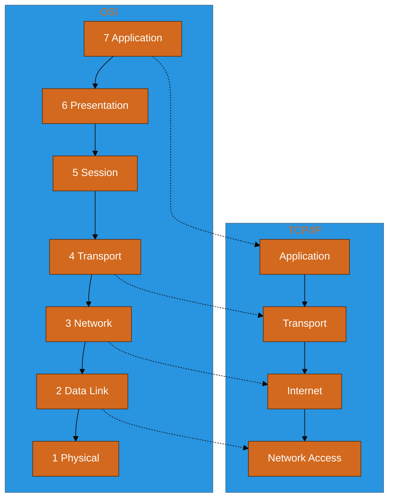

## 2.3 Layer-by-Layer Deep Dive

### Layer 1 — Physical

- **Function:** Transmit raw bits over physical medium
- **Examples:** Cat6 cable, fiber optic, SFP modules, WiFi radio
- **Troubleshoot:** `ethtool eth0`, check link lights, swap cable, verify speed/duplex

### Layer 2 — Data Link

- **Function:** Node-to-node delivery on same LAN using MAC addresses
- **Key concepts:** MAC (48-bit), ARP, VLANs (802.1Q), STP
- **Troubleshoot:** `arp -a`, check VLAN assignment, `show mac address-table`

### Layer 3 — Network

- **Function:** End-to-end delivery across networks using IP addresses
- **Key concepts:** Routing, subnetting, ICMP (ping), TTL
- **Troubleshoot:** `ip route`, `ping`, `traceroute`, verify routing tables

### Layer 4 — Transport

- **Function:** Host-to-host communication using ports; reliability (TCP) or speed (UDP)
- **Key concepts:** TCP 3-way handshake, flow control, congestion control
- **Troubleshoot:** `ss -tlnp`, `netstat`, check firewalls for port blocks

### Layers 5-7 — Application Stack

- **Function:** User-facing services and data formatting
- **Key concepts:** DNS resolution, TLS encryption, HTTP semantics
- **Troubleshoot:** `dig`, `curl -v`, browser dev tools, certificate inspection

## 2.4 Encapsulation Walkthrough

**Scenario:** Browser fetches `https://example.com/index.html`

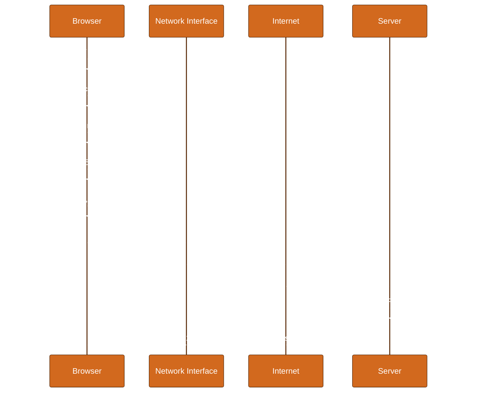

**Encapsulation table for outbound packet:**

| Step | Header Added | Example Values |
|------|--------------|----------------|
| 1 | Application data | `GET /index.html HTTP/1.1` |
| 2 | TLS record | Encrypted blob |
| 3 | TCP | src:54321, dst:443, seq, ack, flags |
| 4 | IP | src:192.168.1.50, dst:93.184.216.34, TTL:64 |
| 5 | Ethernet | src:aa:bb:cc:dd:ee:01, dst:gw MAC, type:0x0800 |

## 2.5 Troubleshooting Order by Layer

```
Bottom-up (most reliable for connectivity issues):
  L1: Link up? Errors on interface?
  L2: ARP working? Correct VLAN?
  L3: Can ping gateway? Can ping remote IP?
  L4: Can telnet/nc to port?
  L7: Does curl return expected HTTP response?

Top-down (best for application-reported issues):
  L7: App logs, HTTP status, DNS resolution
  L4: Port listening? Connection state?
  L3: Routing correct?
  L2/L1: Only if upper layers fail
```

---


## 2.6 PDU Summary Table

| Layer | PDU Name | Key Header Fields |
|-------|----------|-------------------|
| L2 | Frame | Src MAC, Dst MAC, VLAN tag |
| L3 | Packet | Src IP, Dst IP, TTL, protocol |
| L4 | Segment (TCP) / Datagram (UDP) | Src port, Dst port, seq/ack |
| L5-7 | Data | Application payload |


## 2.7 Common Protocol Port and Layer Map

| Protocol | Layer | Port/Proto |
|----------|-------|------------|
| Ethernet | L2 | EtherType |
| ARP | L2 | — |
| IP | L3 | Protocol field (6=TCP, 17=UDP, 1=ICMP) |
| ICMP | L3 | Inside IP |
| TCP | L4 | Port |
| UDP | L4 | Port |
| HTTP | L7 | 80/TCP |
| HTTPS | L7 | 443/TCP |


---

# Part 3: Ethernet, Switching, VLANs

## 3.1 Ethernet Fundamentals

| Field | Size | Purpose |
|-------|------|---------|
| Preamble | 7 bytes | Sync |
| SFD | 1 byte | Start frame delimiter |
| Dest MAC | 6 bytes | Destination hardware address |
| Src MAC | 6 bytes | Source hardware address |
| EtherType/Length | 2 bytes | Protocol (0x0800=IPv4, 0x0806=ARP) |
| Payload | 46-1500 bytes | Data |
| FCS | 4 bytes | CRC error detection |

**MTU:** Default 1500 bytes. Jumbo frames (9000) in data centers reduce overhead.

## 3.2 MAC Addresses

- **Format:** 48 bits, written as `AA:BB:CC:DD:EE:FF`
- **OUI:** First 3 octets identify vendor
- **Unicast vs Broadcast:** `FF:FF:FF:FF:FF:FF` = broadcast (all hosts on LAN)
- **Learning:** Switches build MAC table by observing source MAC on incoming frames

## 3.3 ARP (Address Resolution Protocol)

Maps IP address to MAC address on local subnet.

```
Host wants to send to 192.168.1.1 (same subnet):
  1. Check ARP cache
  2. If miss: broadcast ARP Request 'Who has 192.168.1.1?'
  3. Gateway replies: '192.168.1.1 is at MAC aa:bb:cc:dd:ee:ff'
  4. Host sends frame to that MAC

Host wants to send to 8.8.8.8 (different subnet):
  1. ARP for DEFAULT GATEWAY IP, not 8.8.8.8
  2. Frame destined to gateway MAC; router forwards
```

## 3.4 Switch Operation

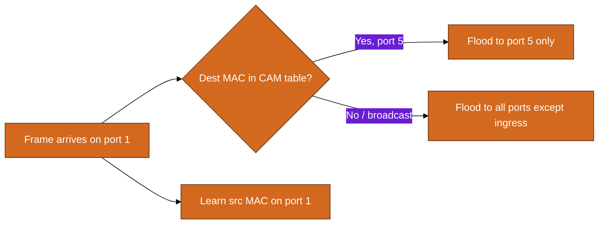

**CAM table aging:** Entries expire (default 300s on Cisco) if not refreshed.

## 3.5 VLANs (802.1Q)

| Port Type | Behavior | Use Case |
|-----------|----------|----------|
| Access | Single untagged VLAN | End devices (PCs, servers) |
| Trunk | Multiple tagged VLANs | Switch-to-switch, switch-to-router |
| Native VLAN | Untagged on trunk | Legacy; keep consistent both ends |

**802.1Q tag:** 4 bytes inserted in frame — VLAN ID (12 bits = 4094 VLANs).

## 3.6 STP Overview (Spanning Tree Protocol)

Prevents loops in L2 networks by blocking redundant paths.

| Term | Meaning |
|------|---------|
| Root Bridge | Reference point; all paths calculated toward it |
| BPDU | Bridge Protocol Data Unit — hello messages |
| Port states | Blocking → Listening → Learning → Forwarding |
| RSTP (802.1w) | Faster convergence (~seconds vs 30-50s) |

## 3.7 Case Study: Campus Network Design

**Requirements:** 3 buildings, separate VLANs for users/guests/servers, inter-building fiber.

```
Building A (Core switch)
  VLAN 10 Users     10.10.10.0/24
  VLAN 20 Servers   10.10.20.0/24
  VLAN 30 Guest     10.10.30.0/24  (ACL: internet only)
  VLAN 99 Mgmt      10.10.99.0/24

Trunks (802.1Q) over fiber to Buildings B and C
Distribution switches: access ports for end devices
Core: L3 routing between VLANs (SVI interfaces)
Default route to firewall for internet
```

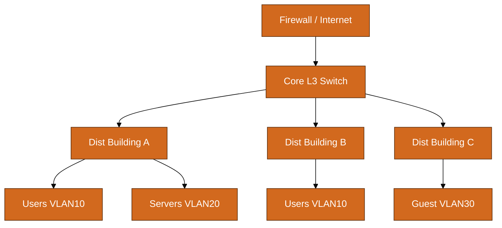

---


## 3.8 Switch Security Basics

| Attack/Feature | Mitigation |
|----------------|------------|
| MAC flooding | Port security — limit MACs per port |
| DHCP spoofing | DHCP snooping |
| ARP spoofing | Dynamic ARP inspection (DAI) |
| VLAN hopping | Disable DTP; explicit trunk config |


## 3.9 Inter-VLAN Routing Options

| Method | How | Scale |
|--------|-----|-------|
| Router-on-a-stick | Trunk to router; subinterfaces per VLAN | Small |
| L3 switch (SVI) | `interface Vlan10` with IP | Campus standard |
| Distributed routing | SVIs on each distribution switch | Large campus |


---

# Part 4: IP Routing

## 4.1 Routing Fundamentals

A **router** forwards packets between networks based on its **routing table**.

| Route Type | Admin Distance | Source | Use Case |
|------------|----------------|--------|----------|
| Connected | 0 | Directly attached | Interface subnets |
| Static | 1 | Manual config | Small networks, default routes |
| OSPF | 110 | Dynamic (link-state) | Enterprise internal |
| BGP | 20 (eBGP) / 200 (iBGP) | Dynamic (path-vector) | Internet, multi-site |
| DHCP | — | Dynamic host config | Not routing — IP assignment |

## 4.2 Route Table Anatomy

```
Destination     Gateway         Genmask         Flags Metric Iface
0.0.0.0         192.168.1.1     0.0.0.0         UG    100    eth0
192.168.1.0     0.0.0.0         255.255.255.0   U     0      eth0
10.0.0.0        192.168.1.1     255.0.0.0       UG    100    eth0
```

**Longest Prefix Match (LPM):** When multiple routes match, the most specific (longest prefix) wins.

**Example:** Packet to `10.5.5.5`

| Route | Match? | Prefix Length |
|-------|--------|---------------|
| 10.0.0.0/8 | Yes | /8 |
| 10.5.0.0/16 | Yes | /16 |
| 10.5.5.0/24 | Yes | **/24 wins** |

## 4.3 Static vs Dynamic Routing

### Static Routing

```bash
# Linux example
ip route add 10.20.0.0/16 via 192.168.1.254 dev eth0
ip route add default via 192.168.1.1
```

**Pros:** Simple, predictable, no routing protocol overhead
**Cons:** Does not adapt to failures, painful at scale

### OSPF (Open Shortest Path First) — Interview Level

- **Type:** Link-state IGP (Interior Gateway Protocol)
- **Metric:** Cost based on bandwidth
- **Areas:** Hierarchical design (Area 0 = backbone)
- **Hello protocol:** Discovers neighbors on shared links
- **When to mention:** Enterprise campus, data center underlay

### BGP (Border Gateway Protocol) — Interview Level

- **Type:** Path-vector EGP — the protocol of the Internet
- **AS Number:** Each autonomous system has an ASN
- **Attributes:** AS-PATH, NEXT-HOP, LOCAL_PREF, MED
- **Use cases:** Multi-homed internet, AWS Direct Connect, hybrid cloud
- **Interview tip:** 'BGP chooses paths based on policies, not just shortest path'

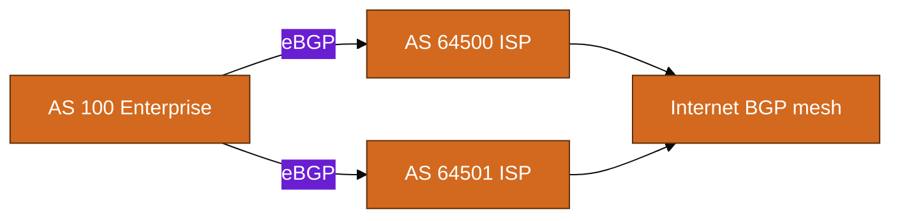

## 4.4 NAT and PAT

| Type | What It Does | Example |
|------|--------------|---------|
| Static NAT | 1 private ↔ 1 public | Server in DMZ |
| Dynamic NAT | Pool of public IPs | Legacy |
| PAT (NAT overload) | Many private → 1 public IP | Home router, office internet |

## 4.5 Case: Home Router NAT/PAT

```
Home LAN:     192.168.1.0/24
Router LAN IP: 192.168.1.1
Router WAN IP: 203.0.113.50 (public, from ISP)

PC (192.168.1.100) visits google.com (142.250.80.46):
  1. PC sends packet: src 192.168.1.100:54321, dst 142.250.80.46:443
  2. Router PAT: replaces src with 203.0.113.50:60001
  3. Router maintains translation table
  4. Return packet to 203.0.113.50:60001 → router reverses → 192.168.1.100:54321
```

## 4.6 PAT Overload Worked Example

**Translation table snapshot:**

| Inside Local | Inside Global | Outside Global | Outside Local |
|--------------|---------------|----------------|---------------|
| 192.168.1.10:5001 | 203.0.113.50:60001 | 142.250.80.46:443 | 142.250.80.46:443 |
| 192.168.1.11:5002 | 203.0.113.50:60002 | 142.250.80.46:443 | 142.250.80.46:443 |
| 192.168.1.10:5003 | 203.0.113.50:60003 | 1.1.1.1:53 | 1.1.1.1:53 |

**Key insight:** Return traffic is distinguished by **unique source port** on the public IP.

**AWS equivalent:** NAT Gateway performs PAT for private subnets. Each AZ should have its own NAT GW for HA.

---


## 4.7 Administrative Distance vs Metric

- **Administrative distance:** Trustworthiness of route source (lower wins between protocols)
- **Metric:** Best path within same protocol (OSPF cost, BGP AS-PATH length + policies)


## 4.8 Equal-Cost Multi-Path (ECMP)

When multiple routes to same destination have **equal metric**, router load-balances.

```
10.0.0.0/8 via 192.168.1.1 (metric 10)
10.0.0.0/8 via 192.168.2.1 (metric 10)
→ Traffic may use both paths (hash-based per flow)
```

**AWS:** ALB cross-zone, TGW ECMP across attachments in some designs.


## 4.9 Default Route (0.0.0.0/0)

The **default route** catches all traffic with no more-specific match.

- Home router: `0.0.0.0/0 → ISP gateway`
- Private AWS subnet: `0.0.0.0/0 → nat-gateway`
- Public AWS subnet: `0.0.0.0/0 → internet-gateway`


---

# Part 5: Core Protocols Deep Dive

## 5.1 TCP — Transmission Control Protocol

### 5.1.1 Three-Way Handshake

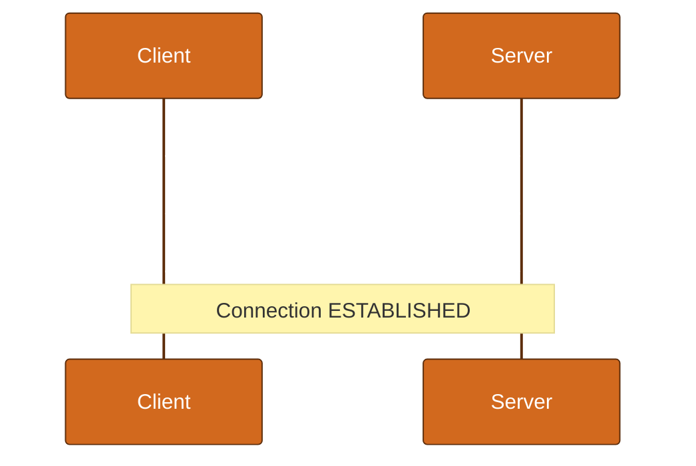

### 5.1.2 TCP Header Flags

| Flag | Name | Purpose |
|------|------|---------|
| SYN | Synchronize | Start connection |
| ACK | Acknowledgment | Confirm received bytes |
| FIN | Finish | Graceful close |
| RST | Reset | Abort connection immediately |
| PSH | Push | Deliver to app immediately |
| URG | Urgent | Rarely used |

### 5.1.3 Connection Termination (Four-Way)

```
Client → Server: FIN
Server → Client: ACK
Server → Client: FIN
Client → Server: ACK
```

### 5.1.4 TCP vs Symptoms

| Symptom | Likely TCP Issue |
|---------|-------------------|
| Connection timeout | SYN not reaching server (firewall/routing) |
| Connection refused | RST received — nothing listening on port |
| Hung connection | Middlebox dropped state; no FIN/RST |
| Slow transfer | Window size, congestion, packet loss |

### 5.1.5 TCP Troubleshooting Commands

```bash
# See connection states
ss -tan | head -20

# Capture handshake
sudo tcpdump -i any host server_ip and port 443 -n

# States: SYN-SENT, ESTABLISHED, TIME-WAIT, CLOSE-WAIT
```

## 5.2 UDP — User Datagram Protocol

| Property | TCP | UDP |
|----------|-----|-----|
| Connection | Connection-oriented | Connectionless |
| Reliability | Retransmits, ordering | Best effort |
| Overhead | Higher (headers, state) | Lower |
| Use cases | HTTP, SSH, DB | DNS, VoIP, video, QUIC base |

## 5.3 DNS — Domain Name System

### 5.3.1 Resolution Process

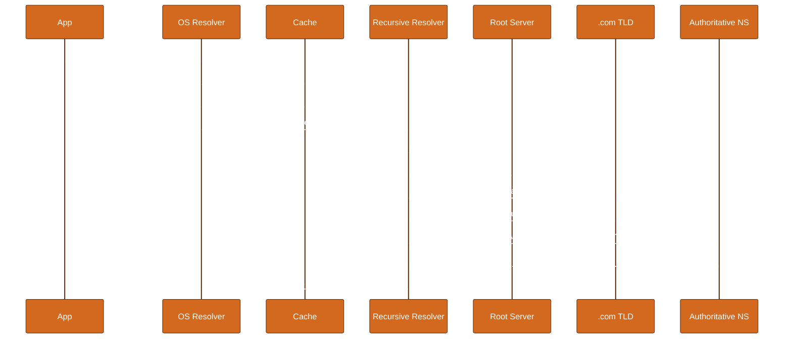

### 5.3.2 Record Types

| Record | Purpose | Example |
|--------|---------|---------|
| A | IPv4 address | api.example.com → 203.0.113.10 |
| AAAA | IPv6 address | api.example.com → 2001:db8::1 |
| CNAME | Alias | www → example.com |
| MX | Mail server | example.com → mail.example.com |
| TXT | Text (SPF, DKIM, verification) | v=spf1 ... |
| NS | Nameserver | example.com → ns1.example.com |
| SOA | Start of authority | Zone metadata |
| SRV | Service location | _http._tcp.example.com |
| PTR | Reverse DNS | 10.113.0.203.in-addr.arpa |

### 5.3.3 DNS in AWS Route 53

- **Public hosted zone:** Internet-facing DNS
- **Private hosted zone:** VPC-internal names (split-horizon)
- **Resolver:** Route 53 Resolver for hybrid DNS forwarding
- **Health checks:** Failover routing based on endpoint health

## 5.4 DHCP — Dynamic Host Configuration Protocol

**DORA Process:**

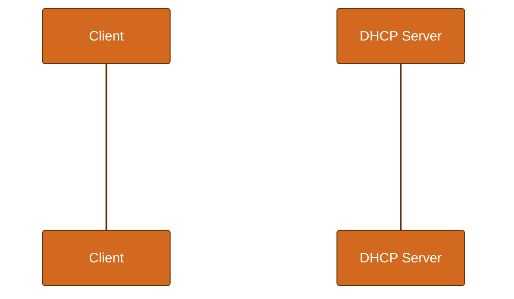

| Message | Direction | Purpose |
|---------|-----------|---------|
| Discover | Client → broadcast | 'I need an IP' |
| Offer | Server → client | 'Here's an IP' |
| Request | Client → server | 'I'll take that IP' |
| Ack | Server → client | 'Confirmed, lease = 86400s' |

**AWS equivalent:** DHCP option sets in VPC provide DNS and domain name to EC2 instances.

## 5.5 HTTP/HTTPS/TLS

### 5.5.1 HTTP Request/Response

```http
GET /api/users HTTP/1.1
Host: api.example.com
Accept: application/json
Authorization: Bearer eyJ...

HTTP/1.1 200 OK
Content-Type: application/json
Content-Length: 42

{"users":[{"id":1,"name":"Alice"}]}
```

### 5.5.2 TLS Handshake (Simplified)

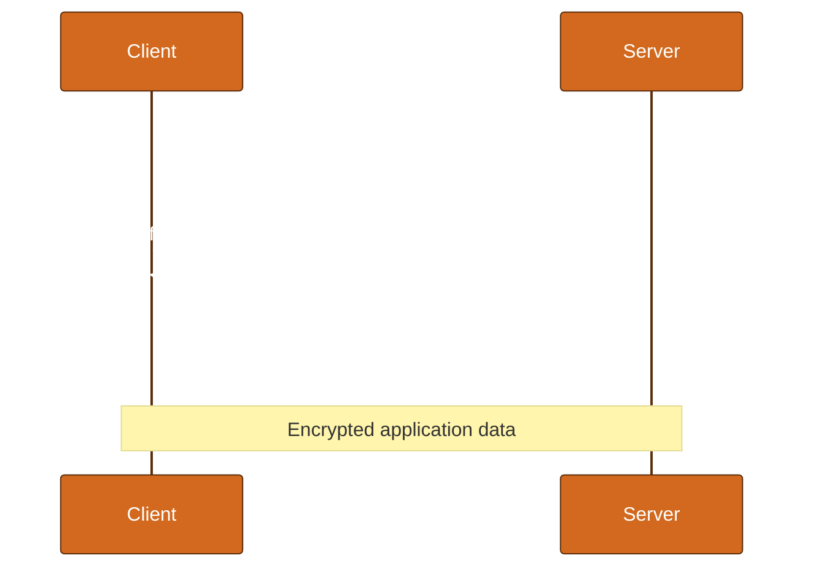

### 5.5.3 TLS and Networking Tie-In

| Layer | TLS Role |
|-------|----------|
| L7 | HTTP semantics unchanged |
| L6 | TLS encrypts application data |
| L4 | Still TCP port 443 |
| L3 | Same IP routing |
| Inspection | L7 ALB terminates TLS; NLB passes through |

**Common TLS errors:**

| Error | Cause |
|-------|-------|
| CERTIFICATE_VERIFY_FAILED | Self-signed, wrong hostname, expired |
| SSL_ERROR_SYSCALL | Connection reset mid-handshake |
| TLSV1_ALERT_PROTOCOL_VERSION | Client/server version mismatch |

---


## 5.6 TCP Window, Retransmission, and Congestion

| Mechanism | Purpose |
|-----------|---------|
| Sliding window | Flow control — receiver tells sender how much buffer available |
| ACK numbers | Confirm bytes received cumulatively |
| Retransmission timeout (RTO) | Resend unacked segments after timeout |
| Congestion window (cwnd) | Slow start, congestion avoidance — network capacity |
| Fast retransmit | 3 duplicate ACKs trigger resend without waiting for RTO |

**Interview one-liner:** 'TCP guarantees delivery and ordering using sequence numbers, ACKs, and retransmission; UDP does not.'


## 5.7 DNS TTL and Caching Implications

| TTL | Effect |
|-----|--------|
| 60s | Fast failover; more DNS load |
| 300s | Common balance |
| 86400s | Stable; slow propagation of changes |

**During migrations:** Lower TTL days before cutover, then raise after stable.


## 5.8 HTTP Status Codes (Network-Relevant)

| Code | Meaning | Network Layer Clue |
|------|---------|-------------------|
| 502 Bad Gateway | LB got invalid response from backend | Target unhealthy or app crash |
| 503 Service Unavailable | Server overloaded or draining | Scale or health check |
| 504 Gateway Timeout | LB timed out waiting for backend | App slow; SG/NACL unlikely |
| 408 Request Timeout | Server timed out waiting for client | Client or network stall |


## 5.9 TLS Certificate Chain Validation

```
Browser trusts Root CA in trust store
  → validates Intermediate CA signed by Root
    → validates Server cert signed by Intermediate
      → validates cert CN/SAN matches hostname
```

```bash
openssl s_client -connect example.com:443 -servername example.com </dev/null 2>/dev/null | openssl x509 -noout -dates -subject
```


---

# Part 6: Network Troubleshooting Toolkit

## 6.1 Essential Commands

### ping

```bash
ping -c 4 8.8.8.8              # Basic connectivity (ICMP)
ping -c 4 google.com           # DNS + connectivity
ping -M do -s 1472 8.8.8.8     # MTU test (1472+28=1500)
```

**Interpreting results:**

| Result | Meaning |
|--------|---------|
| Reply from X | L3 path works to X |
| Request timeout | Firewall blocking ICMP, routing black hole, or host down |
| Destination unreachable | Router says no route or host unreachable |

### traceroute / mtr

```bash
traceroute 8.8.8.8
traceroute -n google.com       # Skip reverse DNS
mtr -rwzc 100 8.8.8.8          # Continuous with stats
```

Uses TTL increment to reveal each hop. `* * *` often means ICMP blocked at that hop (not necessarily a problem).

### dig / nslookup

```bash
dig example.com A
dig example.com MX
dig @8.8.8.8 example.com       # Specific resolver
dig +trace example.com         # Full resolution path
nslookup example.com
```

### ip route / ip addr

```bash
ip addr show
ip route show
ip route get 8.8.8.8           # Which route would kernel use?
ip neigh show                  # ARP table
```

### ss / netstat

```bash
ss -tlnp                         # Listening TCP ports
ss -tan state established        # Active connections
ss -tan state time-wait | wc -l  # TIME-WAIT count
```

### ethtool

```bash
ethtool eth0                     # Link speed, duplex
ethtool -S eth0                  # Error counters
```

## 6.2 Troubleshooting Methodologies

| Method | Start Point | Best For |
|--------|-------------|----------|
| Bottom-up | Physical layer | New deployments, 'no connectivity' |
| Top-down | Application | 'Website slow', HTTP errors |
| Divide-and-conquer | Middle (ping gateway) | Large networks, unknown scope |

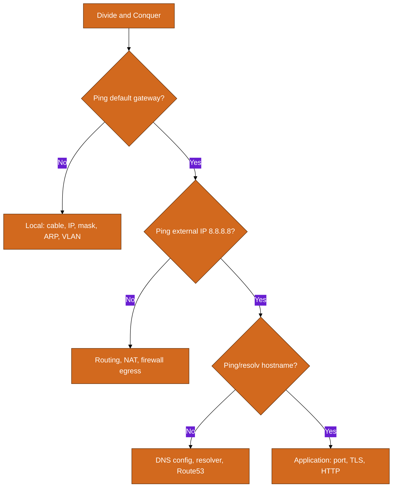

## 6.3 Case Study 1: Cannot Reach Internet

**Symptoms:** User on 192.168.10.50 cannot browse web. Can ping 192.168.10.1 (gateway).

**Diagnosis path:**

```bash
ping 8.8.8.8          # FAIL
ping 192.168.10.1     # OK
ip route              # default via 192.168.10.1
traceroute 8.8.8.8    # dies at 192.168.10.1
```

**Diagnosis:** Gateway receives packets but does not NAT/forward. Router NAT disabled or ACL blocking egress.

**Fix:** Enable NAT overload on router; verify WAN interface up; check ACL permits 192.168.10.0/24 → any.

## 6.4 Case Study 2: Intermittent Application Timeouts

**Symptoms:** API returns 504 Gateway Timeout 5% of requests. Direct server curl works.

**Diagnosis:**

```bash
mtr -rwzc 100 api.internal    # 3% loss at hop 4
ss -tan | grep TIME-WAIT | wc -l   # 45000 (port exhaustion?)
```

**Diagnosis:** Load balancer idle timeout (60s) shorter than app processing; connection pool not reusing; plus packet loss on one switch.

**Fix:** Align LB timeout with app; enable keep-alive; replace faulty SFP on hop 4 switch.

## 6.5 Case Study 3: DNS Works Sometimes

**Symptoms:** `curl https://api.example.com` fails; `curl https://203.0.113.10 -H 'Host: api.example.com'` works.

```bash
dig api.example.com           # NXDOMAIN intermittently
dig @8.8.8.8 api.example.com  # Always works
cat /etc/resolv.conf          # nameserver 10.0.0.2 (internal DNS)
```

**Diagnosis:** Internal DNS server stale cache or split-horizon misconfiguration.

**Fix:** Flush BIND cache; verify Route 53 private zone associated with VPC; check conditional forwarding.

## 6.6 Case Study 4: SSH Connection Refused vs Timeout

| Symptom | Meaning | Check |
|---------|---------|-------|
| Connection refused | Packet arrived; nothing on port 22 | sshd running? iptables? SG? |
| Connection timed out | Packet never got response | SG/NACL drop? Wrong IP? routing? |

```bash
nc -zv 10.0.1.50 22           # Test port
sudo tcpdump -i any host 10.0.1.50 and port 22
# Refused: SYN → RST
# Timeout: SYN retransmits, no reply
```

## 6.7 Case Study 5: AWS EC2 Cannot Reach S3

**Symptoms:** Private subnet EC2, `curl https://mybucket.s3.amazonaws.com` times out.

**Checklist:**

1. Route table: `0.0.0.0/0 → nat-xxxxx` (not IGW for private subnet)
2. NAT Gateway in public subnet with route to IGW
3. Security group: egress 443 allowed
4. NACL: ephemeral ports return traffic allowed
5. Consider VPC Gateway Endpoint for S3 (no NAT needed)

**Fix:** Add S3 VPC endpoint; update route table with prefix list route.

---


## 6.8 tcpdump Quick Reference

```bash
# All traffic on interface
sudo tcpdump -i eth0 -nn

# Specific host and port
sudo tcpdump -i any host 10.0.1.5 and port 443 -w capture.pcap

# See TCP flags
sudo tcpdump -i any 'tcp[tcpflags] & tcp-syn != 0' -nn

# DNS queries
sudo tcpdump -i any port 53 -nn
```


## 6.9 nmap for Port Discovery

```bash
nmap -sT -p 22,80,443 10.0.1.50        # TCP connect scan
nmap -sU -p 53 10.0.1.50               # UDP (DNS)
nmap -Pn 10.0.1.50                     # Skip ping (if ICMP blocked)
```

**Ethics:** Only scan networks you own or have written permission to test.


## 6.10 Case Study 6: MTU / Fragmentation Issues

**Symptoms:** SSH works for small commands; SCP hangs; VPN connects but RDP black screens.

```bash
ping -M do -s 1472 10.0.1.50   # Works
ping -M do -s 8972 10.0.1.50   # Fails if path MTU < 9000
```

**Diagnosis:** MTU mismatch — jumbo frames on one side, 1500 on VPN tunnel.

**Fix:** Set MSS clamping on VPN gateway; align MTU end-to-end (often 1400 for IPSec overhead).


## 6.11 Case Study 7: Asymmetric Routing

**Symptoms:** Intermittent TCP failures; HTTP works one way; stateful firewall drops.

**Diagnosis:** Request goes path A, return goes path B; middle firewall has no session state.

**Fix:** Ensure symmetric routing or deploy stateless ACLs; fix routing to same path both directions.


---

# Part 7: WAN, VPN, Load Balancing

## 7.1 WAN Technologies

| Technology | Speed | Use Case |
|------------|-------|----------|
| MPLS | 10Mbps-10Gbps | Enterprise WAN (legacy) |
| Internet VPN | Variable | Site-to-site over public internet |
| Direct Connect | 1Gbps-100Gbps | Dedicated AWS/on-prem link |
| SD-WAN | Overlay | Policy-based multi-link |

## 7.2 IPSec Site-to-Site VPN

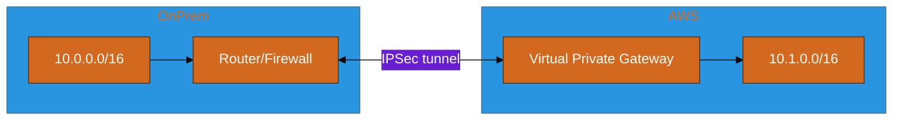

**IPSec phases:**

| Phase | Purpose |
|-------|---------|
| IKE Phase 1 | Authenticate peers, establish ISAKMP SA |
| IKE Phase 2 | Negotiate IPSec SA (ESP/AH), interesting traffic |

**AWS VPN components:** Virtual Private Gateway (or Transit Gateway), Customer Gateway, two tunnels for redundancy.

## 7.3 SSL VPN

- **Client-based:** Full tunnel VPN client (AnyConnect, OpenVPN)
- **Clientless:** Browser access to internal web apps
- **Use case:** Remote workers; AWS Client VPN is managed SSL VPN into VPC

## 7.4 Load Balancing

### Layer 4 vs Layer 7

| Property | L4 (NLB) | L7 (ALB) |
|----------|----------|----------|
| OSI Layer | Transport | Application |
| Decisions | IP, port, TCP/UDP | HTTP headers, path, host, cookies |
| TLS termination | Pass-through or TLS | Native termination |
| Performance | Millions RPS, ultra-low latency | Rich routing, slower than NLB |
| Use case | TCP gaming, IoT, gRPC TLS pass | Microservices, REST APIs |

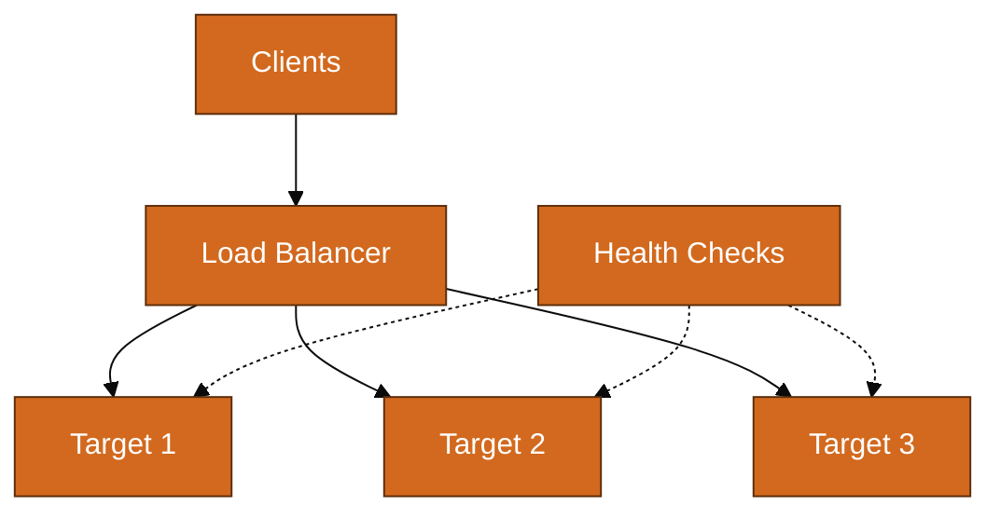

## 7.5 Anycast and CDN

**Anycast:** Same IP announced from multiple locations; BGP routes to nearest PoP.

**CDN networking:**

- Origin pull vs push
- Edge caching reduces latency
- Route 53 latency routing + CloudFront = global low-latency

---


## 7.6 Health Check Design

| Check Type | Validates | Misses |
|------------|-----------|--------|
| TCP port open | Process listening | App deadlock |
| HTTP 200 on /health | App logic | Database connectivity |
| Deep check with DB ping | Full stack | Slower; more load |

**Best practice:** ALB health check path hits lightweight endpoint that verifies critical dependencies.


## 7.7 Session Persistence (Stickiness)

| Method | Use Case |
|--------|----------|
| LB cookie | Shopping cart on legacy app |
| Source IP hash | NLB default behavior |
| Consistent hash | Minimal disruption on scale |

**Caution:** Stickiness breaks even load; prefer stateless apps + shared session store (Redis).


## 7.8 CDN Request Flow

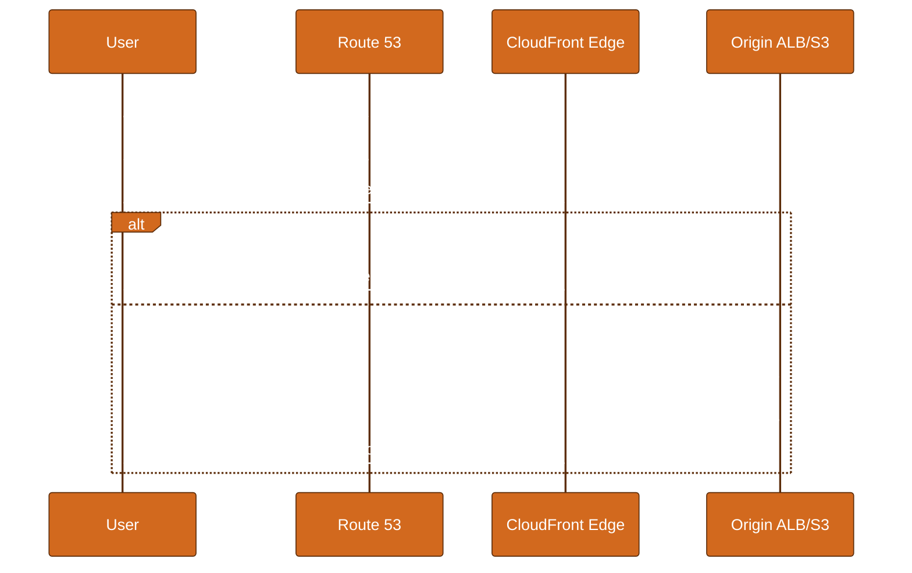


---

# Part 8: AWS Networking (THOROUGH — Major Section)

AWS networking is VPC-centric. Master VPC and everything else (ALB, TGW, Direct Connect) builds on it.

## 8.1 VPC Fundamentals

A **Virtual Private Cloud (VPC)** is your isolated network in AWS.

| Component | Description |
|-----------|-------------|
| VPC | /16 to /28 CIDR block (e.g., 10.0.0.0/16) |
| Subnet | Subdivision of VPC CIDR, tied to one AZ |
| Route table | Controls traffic leaving subnet |
| IGW | Internet Gateway — VPC attachment to internet |
| ENI | Elastic Network Interface — virtual NIC |

**Hard limits to know (interview):**

| Resource | Default Limit |
|----------|---------------|
| VPCs per region | 5 (soft) |
| Subnets per VPC | 200 |
| Security groups per ENI | 5 |
| Rules per SG | 60 inbound + 60 outbound |
| NACL rules | 20 inbound + 20 outbound per NACL |

## 8.2 CIDR Planning for Multi-Account

**Best practice:** Use AWS IPAM or a central RFC1918 plan before launching workloads.

```
Organization CIDR: 10.0.0.0/8

Production account:    10.0.0.0/11   (10.0.0.0 - 10.31.255.255)
Staging account:         10.32.0.0/11  (10.32.0.0 - 10.63.255.255)
Development account:     10.64.0.0/11
Shared services account: 10.96.0.0/12
Legacy/on-prem:          172.16.0.0/12 (non-overlapping!)
```

**Per-VPC template (prod, region us-east-1):**

| Subnet | CIDR | AZ | Type |
|--------|------|-----|------|
| public-1a | 10.0.0.0/24 | us-east-1a | Public |
| public-1b | 10.0.1.0/24 | us-east-1b | Public |
| private-app-1a | 10.0.10.0/24 | us-east-1a | Private |
| private-app-1b | 10.0.11.0/24 | us-east-1b | Private |
| private-db-1a | 10.0.20.0/24 | us-east-1a | Private |
| private-db-1b | 10.0.21.0/24 | us-east-1b | Private |

## 8.3 Public vs Private Subnets

```mermaid
%%{init: {'theme': 'base', 'themeVariables': {'primaryColor': '#D2691E', 'primaryTextColor': '#ffffff', 'primaryBorderColor': '#5D2E0C'}}}%%
flowchart TB
    IGW[Internet Gateway]
    subgraph VPC 10.0.0.0/16
        subgraph Public Subnet
            ALB[ALB]
            NAT[NAT Gateway]
            BASTION[Bastion optional]
        end
        subgraph Private Subnet
            APP[EC2 / ECS]
            RDS[(RDS)]
        end
    end
    INTERNET[Internet] <--> IGW
    IGW --> Public Subnet
    APP -->|egress via NAT| NAT
    NAT --> IGW
    ALB --> APP
```

**Definition:**

- **Public subnet:** Route table has `0.0.0.0/0 → igw-xxxxx`
- **Private subnet:** No direct IGW route; egress via NAT Gateway or VPC endpoints

## 8.4 Internet Gateway, NAT Gateway, NAT Instance, Egress-Only IGW

| Component | Direction | Use |
|-----------|-----------|-----|
| Internet Gateway | Bidirectional IPv4 | Public subnet internet access |
| NAT Gateway | Outbound only (private → internet) | Managed, per-AZ, scalable |
| NAT Instance | Outbound (legacy) | Self-managed EC2, not recommended |
| Egress-Only IGW | Outbound IPv6 only | IPv6 private subnets |

**NAT Gateway details:**

- Lives in **public** subnet
- Uses Elastic IP
- AZ-specific — create one per AZ for HA
- Charges: hourly + per-GB processed
- **Asymmetric routing:** Return traffic must enter same NAT GW

## 8.5 Route Tables — 5 Worked Examples

### Route Table Example 1: Public Subnet

| Destination | Target | Purpose |
|-------------|--------|---------|
| 10.0.0.0/16 | local | VPC internal |
| 0.0.0.0/0 | igw-abc123 | Internet access |
| pl-63a5400a (S3 prefix list) | vpce-s3-xyz | S3 via gateway endpoint |

### Route Table Example 2: Private App Subnet

| Destination | Target | Purpose |
|-------------|--------|---------|
| 10.0.0.0/16 | local | VPC internal |
| 0.0.0.0/0 | nat-0def456 | Outbound internet via NAT |
| pl-63a5400a | vpce-s3-xyz | S3 without NAT |

### Route Table Example 3: Private DB Subnet (Isolated)

| Destination | Target | Purpose |
|-------------|--------|---------|
| 10.0.0.0/16 | local | VPC only — no internet |
| (no 0.0.0.0/0) | — | DB cannot reach internet |

### Route Table Example 4: VPC Peering

VPC A (10.0.0.0/16) peers with VPC B (10.1.0.0/16):

**VPC A route table:**

| Destination | Target |
|-------------|--------|
| 10.0.0.0/16 | local |
| 10.1.0.0/16 | pcx-peering123 |
| 0.0.0.0/0 | nat-xxx |

**VPC B route table:**

| Destination | Target |
|-------------|--------|
| 10.1.0.0/16 | local |
| 10.0.0.0/16 | pcx-peering123 |

**Important:** Peering is non-transitive. VPC A cannot reach VPC C through B.

### Route Table Example 5: Transit Gateway Hub

| Destination | Target |
|-------------|--------|
| 10.0.0.0/16 | local |
| 10.1.0.0/16 | tgw-attach-spoke1 |
| 10.2.0.0/16 | tgw-attach-spoke2 |
| 172.16.0.0/12 | tgw-attach-onprem |
| 0.0.0.0/0 | nat-xxx |

TGW route table (separate): controls which attachments can talk to which.

## 8.6 Security Groups vs NACLs

| Property | Security Group | NACL |
|----------|----------------|------|
| Level | Instance ENI | Subnet |
| Stateful | Yes — return traffic auto-allowed | No — must allow both directions |
| Rules | Allow only | Allow and deny |
| Evaluation | All rules | Ordered by rule number |
| Default | Deny inbound, allow outbound | Allow all |

### SG vs NACL Case Table

**Case 1: Web server in public subnet**

| Layer | Rule |
|-------|------|
| SG | Inbound 443 from 0.0.0.0/0; outbound all |
| NACL | Inbound 443, ephemeral return 1024-65535; outbound all |

**Case 2: App server in private subnet (ALB fronted)**

| Layer | Rule |
|-------|------|
| SG | Inbound 8080 from ALB-SG only |
| NACL | Inbound 8080 from public subnet CIDR; outbound ephemeral to public CIDR |

**Case 3: Block specific IP at subnet edge**

| Layer | Rule |
|-------|------|
| SG | Cannot deny specific IP |
| NACL | Deny rule 50: inbound from 203.0.113.99/32 |

**Case 4: RDS in private subnet**

| Layer | Rule |
|-------|------|
| SG | Inbound 5432 from App-SG only |
| NACL | Inbound 5432 from app subnet CIDR |

**Case 5: SSH bastion**

| Layer | Rule |
|-------|------|
| SG | Inbound 22 from corp IP range only |
| NACL | Inbound 22 from corp CIDR; deny all other 22 |

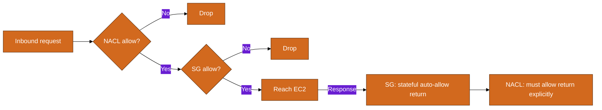

## 8.7 Elastic IP, ENI, Secondary IPs

| Resource | Purpose |
|----------|---------|
| Elastic IP | Static public IPv4 (limited per region) |
| ENI | Attachable virtual NIC with MAC, SG, IP |
| Secondary private IP | Multiple IPs on one ENI (multi-IP on same instance) |

**Use cases:**

- EIP on NAT Gateway (required)
- Secondary ENI for network appliance licensing
- Multiple IPs for hosting many SSL sites (legacy; use SNI now)

## 8.8 VPC Peering vs Transit Gateway vs PrivateLink

| Feature | VPC Peering | Transit Gateway | PrivateLink |
|---------|-------------|-----------------|-------------|
| Scope | 1:1 VPC pairs | Hub-spoke many VPCs | Service consumer → provider |
| Transitive | No | Yes (with route tables) | N/A |
| Overlap CIDR | No | No (per attachment) | No IP overlap needed |
| Use case | 2 VPCs talk | Enterprise mesh | SaaS, shared services |
| Pricing | Free (data xfer) | TGW hourly + data | Interface endpoint hourly |

**PrivateLink:** Consumer creates interface endpoint in their VPC; traffic stays on AWS backbone to provider service.

## 8.9 ALB / NLB / GLB

| LB Type | Layer | Best For |
|---------|-------|----------|
| ALB | L7 | HTTP/HTTPS, path routing, host routing |
| NLB | L4 | TCP/UDP, static IP, extreme performance |
| GLB | L3 Gateway | Ingress/egress to/from VPC (not classic LB) |

**Target groups:**

- EC2 instances, IP addresses, Lambda, ALB (chaining)
- Health checks: HTTP, HTTPS, TCP, custom path
- Deregistration delay (connection draining)

**ALB routing example:**

| Priority | Condition | Target Group |
|----------|-----------|--------------|
| 1 | Host = api.example.com | api-tg |
| 2 | Path = /admin/* | admin-tg |
| 3 | Default | web-tg |

## 8.10 Route 53 Routing Policies

| Policy | Behavior | Use Case |
|--------|----------|----------|
| Simple | Single record, all traffic | Basic DNS |
| Weighted | Split by weight (10, 20, 70) | Canary, blue-green |
| Latency | Route to lowest-latency region | Global apps |
| Failover | Primary + standby + health check | DR |
| Geolocation | Route by user geography | Content licensing |
| Geoproximity | Route by resource location + bias | DR with geographic control |
| Multi-value | Return multiple healthy records | Simple load spread |

**Failover example:**

```
Primary:   api-primary.example.com → ALB us-east-1 (health check: /health)
Secondary: api-secondary.example.com → ALB us-west-2 (standby)
Route 53 fails over when primary health check fails 3 consecutive intervals
```

## 8.11 Direct Connect and Hybrid VPN

```mermaid
%%{init: {'theme': 'base', 'themeVariables': {'primaryColor': '#D2691E', 'primaryTextColor': '#ffffff', 'primaryBorderColor': '#5D2E0C'}}}%%
flowchart TB
    DC[On-Prem Data Center]
    DX[Direct Connect Location]
    VGW[Virtual Private Gateway / TGW
    VPC[VPC]
    DC -->|Dedicated fiber| DX
    DX --> VGW
    VGW --> VPC
    DC -.->|Backup IPSec VPN| VGW
```

| Connection | Bandwidth | Latency | Use |
|------------|-----------|---------|-----|
| Site-to-Site VPN | Up to 1.25 Gbps | Variable (internet) | Backup, small hybrid |
| Direct Connect | 1G / 10G / 100G | Consistent low | Production hybrid |

## 8.12 AWS Network Firewall and WAF

| Service | Layer | Scope |
|---------|-------|-------|
| AWS WAF | L7 | CloudFront, ALB, API Gateway |
| AWS Network Firewall | L3-L4 (stateful) | VPC subnets via firewall endpoints |
| SG / NACL | L3-L4 | Instance / subnet |

**Defense in depth:** WAF blocks SQLi/XSS at edge; Network Firewall inspects east-west; SG restricts instance-level.

## 8.13 Architecture Case Study 1: 3-Tier Web App

```
Internet → Route 53 → CloudFront (static) / ALB (dynamic)
ALB in public subnets (10.0.0.0/24, 10.0.1.0/24)
App tier EC2/ECS in private subnets (10.0.10.0/24, 10.0.11.0/24)
RDS Multi-AZ in DB subnets (10.0.20.0/24, 10.0.21.0/24)
NAT GW in each public subnet for app outbound updates
```

```mermaid
%%{init: {'theme': 'base', 'themeVariables': {'primaryColor': '#D2691E', 'primaryTextColor': '#ffffff', 'primaryBorderColor': '#5D2E0C'}}}%%
flowchart TB
    R53[Route 53] --> CF[CloudFront]
    R53 --> ALB[ALB Public]
    CF --> S3[S3 Static]
    ALB --> APP1[App AZ-a]
    ALB --> APP2[App AZ-b]
    APP1 --> RDS[(RDS Multi-AZ)]
    APP2 --> RDS
    APP1 --> NAT1[NAT GW]
    APP2 --> NAT2[NAT GW]
```

**Security:** ALB-SG allows 443 from internet. App-SG allows 8080 from ALB-SG. RDS-SG allows 5432 from App-SG.

## 8.14 Architecture Case Study 2: Multi-AZ HA

**Requirements:** 99.99% availability, auto-healing, no single AZ dependency.

| Component | HA Strategy |
|-----------|-------------|
| ALB | Cross-zone load balancing |
| EC2/ASG | Min 2 instances across 2+ AZs |
| RDS | Multi-AZ synchronous standby |
| NAT GW | One per AZ (avoid cross-AZ NAT) |
| Route 53 | Health checks + failover record optional |

**Failure scenario:** AZ-a fails.

1. ASG launches replacements in AZ-b
2. ALB stops sending to unhealthy targets
3. RDS fails over to standby in AZ-b (~60-120s)
4. NAT in AZ-a unavailable — instances in AZ-a fail; design avoids relying on cross-AZ NAT

## 8.15 Architecture Case Study 3: Hub-Spoke with Transit Gateway

```
Hub VPC (10.0.0.0/16): Shared services — DNS, logging, inspection
Spoke Prod (10.1.0.0/16): Production workloads
Spoke Dev (10.2.0.0/16): Development
Spoke Security (10.3.0.0/16): Network Firewall inspection VPC

TGW route table:
  Prod → Security VPC → Shared (forced inspection)
  Dev → Shared (direct, less inspection)
  On-prem → All spokes via DX + TGW
```

```mermaid
%%{init: {'theme': 'base', 'themeVariables': {'primaryColor': '#D2691E', 'primaryTextColor': '#ffffff', 'primaryBorderColor': '#5D2E0C'}}}%%
graph TB
    TGW[Transit Gateway]
    HUB[Hub Shared 10.0.0.0/16]
    PROD[Prod 10.1.0.0/16]
    DEV[Dev 10.2.0.0/16]
    SEC[Inspection 10.3.0.0/16]
    ONPREM[On-Prem 172.16.0.0/12]
    PROD --> TGW
    DEV --> TGW
    HUB --> TGW
    SEC --> TGW
    ONPREM --> TGW
    TGW --> SEC
```

## 8.16 Architecture Case Study 4: Hybrid Cloud On-Prem + AWS

**Requirements:** Extend Active Directory, private API access, backup over dedicated link.

| Component | Implementation |
|-----------|----------------|
| Connectivity | Direct Connect primary + VPN backup |
| DNS | Route 53 Resolver inbound/outbound endpoints |
| AD | AD connectors or domain controllers in AWS |
| Routing | BGP over DX advertises on-prem 172.16.0.0/12; AWS advertises 10.0.0.0/8 |
| Security | Network Firewall + on-prem firewall policies |

**Split-horizon DNS:**

- `internal.corp.com` resolves to on-prem IP from office
- Same name resolves to AWS private IP from VPC via Route 53 private zone + Resolver rules

## 8.17 VPC Endpoints (Gateway vs Interface)

| Type | Services | Cost | Route |
|------|----------|------|-------|
| Gateway | S3, DynamoDB | Free | Route table prefix list |
| Interface | Most AWS APIs | Hourly + data | DNS in VPC |

**Why endpoints matter:** Keep traffic off NAT (cost + security); S3/DynamoDB gateway endpoints are free.

## 8.18 AWS Networking Interview Checklist

When designing on a whiteboard, always mention:

1. CIDR non-overlap across VPCs and on-prem
2. Subnet per AZ minimum for HA
3. Public vs private subnet routing
4. SG stateful vs NACL stateless
5. NAT per AZ or VPC endpoints to reduce NAT dependency
6. How DNS resolves (public vs private hosted zones)
7. Cross-AZ data transfer cost ($0.01/GB each direction)

---


## 8.19 AWS IP Address Types

| Type | Scope | Charges |
|------|-------|---------|
| Private RFC1918 | VPC internal | Free |
| Public IPv4 | Internet-routable | Charge since 2024 |
| Elastic IP | Static public, attached | Free when attached to running resource |
| IPv6 | Global unicast | Free |


## 8.20 Flow Logs and Network Monitoring

**VPC Flow Logs:** Capture accepted/rejected IP traffic metadata (not payload).

| Field | Use |
|-------|-----|
| srcaddr / dstaddr | Who talked to whom |
| action | ACCEPT or REJECT — find SG/NACL blocks |
| bytes | Data transfer analysis |

```bash
# Query flow logs in CloudWatch Logs Insights
# filter action = 'REJECT' and dstport = 443
```

**Other tools:** AWS Network Manager, CloudWatch metrics for NAT GW, Transit Gateway Network Manager.


## 8.21 AWS Global Accelerator vs CloudFront

| Service | Layer | Best For |
|---------|-------|----------|
| CloudFront | L7 HTTP cache | Static/dynamic web content |
| Global Accelerator | L4 Anycast | Non-HTTP TCP/UDP, gaming, IoT |


## 8.22 Cross-Region VPC Connectivity

| Method | Use |
|--------|-----|
| VPC Peering (inter-region) | 1:1 cross-region |
| Transit Gateway peering | Multi-VPC cross-region hub |
| PrivateLink cross-region | Service consumer in region A, provider in B |


## 8.23 AWS DHCP Option Sets

| Option | Typical Value |
|--------|---------------|
| domain-name-servers | AmazonProvidedDNS (VPC+2) or custom |
| domain-name | ec2.internal or custom |
| ntp-servers | Amazon Time Sync Service |

**AmazonProvidedDNS:** Base VPC CIDR + 2 (e.g., 10.0.0.2 for 10.0.0.0/16) resolves Route 53 private zones.


## 8.24 Detailed SG Rule Examples for 3-Tier App

**alb-sg:**

| Direction | Protocol | Port | Source | Purpose |
|-----------|----------|------|--------|---------|
| Inbound | TCP | 443 | 0.0.0.0/0 | HTTPS from internet |
| Outbound | TCP | 8080 | app-sg | Forward to app tier |

**app-sg:**

| Direction | Protocol | Port | Source | Purpose |
|-----------|----------|------|--------|---------|
| Inbound | TCP | 8080 | alb-sg | From load balancer only |
| Outbound | TCP | 5432 | db-sg | PostgreSQL to RDS |
| Outbound | TCP | 443 | 0.0.0.0/0 | External APIs via NAT |

**db-sg:**

| Direction | Protocol | Port | Source | Purpose |
|-----------|----------|------|--------|---------|
| Inbound | TCP | 5432 | app-sg | App tier only |
| Outbound | — | — | — | Default deny not needed (stateful) |


## 8.25 NACL Rules for Same 3-Tier App

**Public subnet NACL (alb):**

| Rule # | Type | Protocol | Port | Source | Action |
|--------|------|----------|------|--------|--------|
| 100 | Inbound | TCP | 443 | 0.0.0.0/0 | ALLOW |
| 110 | Inbound | TCP | 1024-65535 | 0.0.0.0/0 | ALLOW |
| 120 | Outbound | TCP | 8080 | 10.0.10.0/24 | ALLOW |
| 130 | Outbound | TCP | 8080 | 10.0.11.0/24 | ALLOW |
| * | Inbound | All | All | 0.0.0.0/0 | DENY |


## 8.26 Route 53 Weighted Routing Lab Scenario

```
Deploy v1 and v2 of API in same region
Weighted record: v1 weight=90, v2 weight=10
Monitor error rates on v2
Shift weights: 50/50 → 0/100
No DNS TTL change needed mid-shift (weights update at resolver cache expiry)
```


## 8.27 Site-to-Site VPN Configuration Checklist

1. Create Customer Gateway (on-prem public IP)
2. Create Virtual Private Gateway, attach to VPC
3. Create VPN Connection — download configuration for your device
4. Configure on-prem firewall: Phase 1/2 proposals, interesting traffic ACLs
5. Add VPC route table entries for on-prem CIDR → vgw
6. Add on-prem routes for VPC CIDR → VPN tunnel
7. Test: ping from EC2 to on-prem server; verify BGP routes if dynamic


## 8.28 Direct Connect vs VPN Decision Matrix

| Factor | VPN | Direct Connect |
|--------|-----|----------------|
| Setup time | Hours | Weeks/months |
| Bandwidth | Up to ~1.25 Gbps | 1/10/100 Gbps |
| Latency | Internet variable | Consistent private |
| Cost | Low | Higher (port hours + data) |
| Best for | Backup, dev/test hybrid | Production hybrid at scale |


## 8.29 AWS Client VPN

- Managed SSL VPN for **individual users** (not site-to-site)
- Integrates with AD, SAML, certificate auth
- Associates with subnets; SG controls access to VPC resources


## 8.30 VPC Lattice (Modern Service Mesh Networking)

AWS VPC Lattice provides application-layer service networking across VPCs and accounts:

- Service network with auth policies
- HTTP/HTTPS routing to targets
- Alternative to complex TGW + ALB mesh for internal services

Know it exists for senior interviews; details evolve — check current AWS docs.


---

# Part 9: Data Center & Modern Networking

## 9.1 Traditional vs Spine-Leaf

**Traditional 3-tier:** Access → Distribution → Core (STP limitations, north-south focus)

**Spine-leaf (Clos fabric):**

```
Every leaf switch connects to every spine switch
Predictable latency (same hop count)
East-west traffic optimized (server-to-server)
No STP loops — ECMP forwarding
```

```mermaid
%%{init: {'theme': 'base', 'themeVariables': {'primaryColor': '#D2691E', 'primaryTextColor': '#ffffff', 'primaryBorderColor': '#5D2E0C'}}}%%
graph TB
    S1[Spine 1] --- S2[Spine 2]
    L1[Leaf 1] --- S1
    L1 --- S2
    L2[Leaf 2] --- S1
    L2 --- S2
    L3[Leaf 3] --- S1
    L3 --- S2
    L1 --- SRV1[Servers]
    L2 --- SRV2[Servers]
    L3 --- SRV3[Servers]
```

## 9.2 Overlay Networks (VXLAN Brief)

| Concept | Underlay | Overlay |
|---------|----------|---------|
| Purpose | Physical connectivity | Virtual L2 over L3 |
| Protocol | OSPF/BGP between racks | VXLAN (UDP port 4789) |
| Identifier | VLAN (4094 max) | VNI (16M segments) |

**VXLAN packet:** Original L2 frame wrapped in UDP/IP, sent over IP fabric.

## 9.3 SDN Introduction

- **Control plane separated from data plane**
- Central controller programs flow rules on switches
- **OpenFlow:** Protocol between controller and switches
- **AWS equivalent mindset:** API-driven VPC, not OpenFlow but same automation principle

## 9.4 Network Automation — Terraform AWS VPC Snippet

```hcl
resource "aws_vpc" "main" {
  cidr_block           = "10.0.0.0/16"
  enable_dns_hostnames = true
  enable_dns_support   = true

  tags = { Name = "prod-vpc" }
}

resource "aws_subnet" "public" {
  count                   = 2
  vpc_id                  = aws_vpc.main.id
  cidr_block              = cidrsubnet(aws_vpc.main.cidr_block, 8, count.index)
  availability_zone       = data.aws_availability_zones.available.names[count.index]
  map_public_ip_on_launch = true

  tags = { Name = "public-${count.index}" }
}

resource "aws_internet_gateway" "igw" {
  vpc_id = aws_vpc.main.id
}

resource "aws_route_table" "public" {
  vpc_id = aws_vpc.main.id

  route {
    cidr_block = "0.0.0.0/0"
    gateway_id = aws_internet_gateway.igw.id
  }
}
```

---


## 9.5 Data Center Cabling and optics

| Speed | Medium | Distance |
|-------|--------|----------|
| 1 Gbps | Cat6 copper | 100m |
| 10 Gbps | SFP+ fiber/copper | 300m (SR) |
| 40/100 Gbps | QSFP28 | Rack-to-spine |


## 9.6 Network Automation Best Practices

1. **Infrastructure as Code** — Terraform/CloudFormation for VPC
2. **GitOps** — PR review for network changes
3. **Drift detection** — Compare live AWS to Terraform state
4. **Modular design** — vpc module, subnet module, reusable across accounts


## 9.7 Complete Terraform VPC Module Outline

```hcl
module "vpc" {
  source = "terraform-aws-modules/vpc/aws"

  name = "production"
  cidr = "10.0.0.0/16"

  azs             = ["us-east-1a", "us-east-1b", "us-east-1c"]
  private_subnets = ["10.0.1.0/24", "10.0.2.0/24", "10.0.3.0/24"]
  public_subnets  = ["10.0.101.0/24", "10.0.102.0/24", "10.0.103.0/24"]

  enable_nat_gateway = true
  single_nat_gateway = false  # one per AZ for HA

  enable_dns_hostnames = true
  enable_flow_log      = true
}
```


---

# Part 10: Big Tech & Cert Path

## 10.1 Certification Roadmap

```mermaid
%%{init: {'theme': 'base', 'themeVariables': {'primaryColor': '#D2691E', 'primaryTextColor': '#ffffff', 'primaryBorderColor': '#5D2E0C'}}}%%
flowchart LR
    CCNA[CCNA] --> CCNP[CCNP Enterprise]
    CCNA --> AWS_SAA[AWS SAA]
    AWS_SAA --> AWS_NET[AWS Adv Networking Specialty]
    CCNP --> CCIE[CCIE optional]
    AWS_NET --> PRO[Cloud Network Architect]
```

| Certification | Focus | When to Pursue |
|---------------|-------|----------------|
| CCNA | Routing, switching, subnetting | Foundation for network roles |
| CCNP Enterprise | OSPF, BGP, advanced switching | ISP/enterprise network engineer |
| AWS SAA | Broad AWS including VPC basics | Cloud engineers first AWS cert |
| AWS Advanced Networking | TGW, DX, VPN, hybrid, LB deep | After SAA + VPC hands-on |

## 10.2 Big Tech Interview Expectations

| Level | Networking Expectations |
|-------|------------------------|
| L3/L4 SWE | TCP vs UDP, DNS, HTTP, basic debugging |
| L5 SRE | Above + load balancing, CDN, latency, incident triage |
| L6+ | VPC design, multi-region, capacity, failure modes |
| Network Engineer | Subnetting under pressure, BGP, OSPF, design cases |

## 10.3 Subnetting Under Pressure — Interview Tricks

**Trick 1: Memorize /25-/30 block sizes**

```
/25 = 128    /26 = 64    /27 = 32    /28 = 16
/29 = 8      /30 = 4
```

**Trick 2: For 'network address of X/Y' — always round DOWN**

Write multiples of block size: 0, 64, 128, 192. Which is X >= to?

**Trick 3: Hosts needed → add 2 → next power of 2 → subtract from 32**

```
60 hosts → 62 → 64 → /26
300 hosts → 302 → 512 → /23
```

**Trick 4: AWS /28 — remember 11 usable (5 reserved by AWS)**

**Trick 5: Verbalize your steps** — interviewers credit partial work

## 10.4 Common Interview Questions

| Question | Strong Answer Outline |
|----------|----------------------|
| What happens when you type URL in browser? | DNS → TCP → TLS → HTTP → render |
| TCP vs UDP? | Reliability vs speed; examples |
| How does NAT work? | PAT table, inside/outside local/global |
| Design VPC for 3-tier app | Part 8 case study 1 |
| SG vs NACL? | Stateful vs stateless, deny capability |
| Why BGP? | Policy routing, multi-homing, internet scale |

---


## 10.5 Study Resources

| Resource | Type | Best For |
|----------|------|----------|
| Cisco CCNA Official Cert Guide | Book | Foundation |
| AWS Skill Builder | Free courses | AWS networking |
| Packet Life subnet cheat sheet | Reference | Quick review |
| Jeremy's IT Lab (YouTube) | Video | CCNA free course |
| Adrian Cantrill AWS courses | Video | AWS deep dive |


## 10.6 Lab Project Ideas

1. **Build 3-tier VPC** from scratch without wizard — document every route and SG
2. **Break and fix** — delete NAT route, misconfigure SG, wrong NACL; practice Part 6
3. **Hub-spoke TGW** — 3 VPCs with centralized egress
4. **Hybrid sim** — VPN from home router or strongSwan to AWS
5. **Subnetting drill** — 20 random problems nightly for 2 weeks


## 10.7 Whiteboard Network Design Template

```
1. Requirements: users, HA, regions, on-prem, compliance
2. CIDR plan (draw table)
3. Subnet per AZ diagram
4. Route tables (public, private, isolated)
5. Security: SG references (not CIDR where possible)
6. DNS: public vs private zones
7. Egress: NAT vs endpoints
8. Cross-VPC/on-prem: TGW/peering/DX
9. Monitoring: flow logs, health checks
10. Failure modes: AZ loss, NAT loss, DX fail (VPN backup)
```


---

# Part 11: Master Cheat Sheets

## 11.1 Subnet Reference Table

| CIDR | Mask | Hosts | Block (last octet) |
|------|------|-------|-------------------|
| /8 | 255.0.0.0 | 16,777,214 | — |
| /16 | 255.255.0.0 | 65,534 | — |
| /17 | 255.255.128.0 | 32,766 | 128 (2nd octet) |
| /18 | 255.255.192.0 | 16,382 | 64 |
| /19 | 255.255.224.0 | 8,190 | 32 |
| /20 | 255.255.240.0 | 4,094 | 16 |
| /21 | 255.255.248.0 | 2,046 | 8 |
| /22 | 255.255.252.0 | 1,022 | 4 |
| /23 | 255.255.254.0 | 510 | 2 |
| /24 | 255.255.255.0 | 254 | 256 |
| /25 | 255.255.255.128 | 126 | 128 |
| /26 | 255.255.255.192 | 62 | 64 |
| /27 | 255.255.255.224 | 30 | 32 |
| /28 | 255.255.255.240 | 14 | 16 |
| /29 | 255.255.255.248 | 6 | 8 |
| /30 | 255.255.255.252 | 2 | 4 |
| /31 | 255.255.255.254 | 2* | 2 |
| /32 | 255.255.255.255 | 1 | 1 |

## 11.2 Well-Known Port Numbers

| Port | Protocol | Service |
|------|----------|---------|
| 20/21 | TCP | FTP data/control |
| 22 | TCP | SSH |
| 23 | TCP | Telnet |
| 25 | TCP | SMTP |
| 53 | TCP/UDP | DNS |
| 67/68 | UDP | DHCP server/client |
| 80 | TCP | HTTP |
| 110 | TCP | POP3 |
| 143 | TCP | IMAP |
| 443 | TCP | HTTPS |
| 465 | TCP | SMTPS |
| 587 | TCP | SMTP submission |
| 993 | TCP | IMAPS |
| 995 | TCP | POP3S |
| 3306 | TCP | MySQL |
| 3389 | TCP | RDP |
| 5432 | TCP | PostgreSQL |
| 6379 | TCP | Redis |
| 8080 | TCP | HTTP alternate |
| 8443 | TCP | HTTPS alternate |
| 4789 | UDP | VXLAN |

## 11.3 AWS Networking Quick Reference

| Need | AWS Service |
|------|-------------|
| Isolated network | VPC |
| Internet access (public) | Internet Gateway |
| Outbound from private | NAT Gateway |
| Filter instance traffic | Security Group |
| Filter subnet traffic | NACL |
| HTTP routing | ALB |
| TCP/UDP performance | NLB |
| DNS | Route 53 |
| Connect 2 VPCs | VPC Peering / TGW |
| Private SaaS access | PrivateLink |
| On-prem connection | Direct Connect + VPN |
| Block web attacks | WAF |
| VPC traffic inspection | Network Firewall |
| S3 without NAT | Gateway Endpoint |
| Other AWS APIs private | Interface Endpoint |

## 11.4 ICMP Types (Troubleshooting)

| Type | Code | Meaning |
|------|------|---------|
| 0 | 0 | Echo reply (ping response) |
| 3 | 0 | Network unreachable |
| 3 | 1 | Host unreachable |
| 3 | 3 | Port unreachable |
| 8 | 0 | Echo request (ping) |
| 11 | 0 | TTL exceeded in transit |

## 11.5 TCP Connection States

```
CLOSED → SYN-SENT → ESTABLISHED → FIN-WAIT → TIME-WAIT → CLOSED
                 ↘ SYN-RECEIVED ↗
```

## 11.6 Private IP Ranges (RFC 1918)

| Range | CIDR |
|-------|------|
| 10.0.0.0 – 10.255.255.255 | 10.0.0.0/8 |
| 172.16.0.0 – 172.31.255.255 | 172.16.0.0/12 |
| 192.168.0.0 – 192.168.255.255 | 192.168.0.0/16 |

## 11.7 Troubleshooting One-Liner Commands

```bash
# Am I reachable?
ping -c 3 GATEWAY && ping -c 3 8.8.8.8 && dig +short google.com

# What's listening?
ss -tlnp

# Where does this IP route?
ip route get DST_IP

# Capture traffic
sudo tcpdump -i any host DST and port PORT -nn

# Path to destination
mtr -rwzc 20 DST
```

## 11.8 AWS VPC Subnet Sizing Guide

| Subnet Size | Usable (AWS) | Good For |
|-------------|--------------|----------|
| /28 | 11 | NAT GW, small LB |
| /27 | 27 | Small app tier |
| /26 | 59 | Medium app tier |
| /25 | 123 | Large app tier / EKS |
| /24 | 251 | Standard per-AZ subnet |

## 11.9 OSI Quick Troubleshooting Map

| Symptom | Layer | First Command |
|---------|-------|---------------|
| Link light off | L1 | Check cable/SFP |
| Wrong VLAN | L2 | `show vlan` / switchport |
| No ping to gateway | L3 | `ip route`, ARP |
| Connection refused | L4 | `ss -tlnp` on server |
| HTTP 502/504 | L7 | Check LB target health |
| Cert error | L6/7 | `openssl s_client -connect host:443` |

---

## 11.10 IPv6 AWS Quick Reference

| Component | IPv4 | IPv6 |
|-----------|------|------|
| Internet access | IGW | IGW (dual-stack) |
| Private egress | NAT GW | Egress-Only IGW |
| Public IP on instance | Auto public IPv4 | Optional /128 |


## 11.11 OSPF LSA Types (CCNP Touch)

| LSA | Name | Purpose |
|-----|------|---------|
| Type 1 | Router | Router links within area |
| Type 2 | Network | DR on multi-access segment |
| Type 3 | Summary | Inter-area routes |
| Type 5 | External | Routes from other AS (redistributed) |


## 11.12 BGP Path Selection (Simplified)

```
1. Highest LOCAL_PREF (iBGP)
2. Shortest AS_PATH
3. Lowest ORIGIN type (IGP < EGP < incomplete)
4. Lowest MED (if same AS)
5. eBGP over iBGP
6. Lowest IGP metric to NEXT_HOP
7. Oldest route (EBGP stability)
8. Lowest router ID
```


## 11.13 Cable and Connector Reference

| Name | Use |
|------|-----|
| RJ-45 | Cat5e/Cat6 Ethernet |
| SFP/SFP+ | 1G/10G fiber or copper |
| LC | Fiber connector type |
| MMF vs SMF | Multi-mode (short) vs single-mode (long) |


## 11.14 Quick AWS Troubleshooting Matrix

| Symptom | Check First | Common Fix |
|---------|-------------|------------|
| No internet from private EC2 | Route to NAT? NAT in public subnet? | Fix route table |
| Works in AZ-a not AZ-b | Subnet-specific route/NAT | NAT per AZ |
| SG looks correct, still blocked | NACL ephemeral ports | Add NACL return rules |
| Cannot resolve internal DNS | VPC+2 resolver? Private zone associated? | Associate PHZ |
| Peering works one direction | Routes on BOTH sides | Add return routes |
| LB 502 | Target health check failing | Fix app or health path |

---


---

---

# Part 12: Network Security Engineering

Network security engineering sits at the intersection of routing, switching, and policy. You are not just blocking ports — you are designing **trust boundaries**, detecting anomalies, and ensuring that a compromise in one zone cannot silently pivot to crown jewels.

## 12.1 Defense in Depth at the Network Layer

```mermaid
%%{init: {'theme': 'base', 'themeVariables': {'primaryColor': '#D2691E', 'primaryTextColor': '#ffffff', 'primaryBorderColor': '#5D2E0C'}}}%%
flowchart TB
    subgraph Perimeter
        WAF[WAF / Reverse Proxy]
        FW1[Edge Firewall]
    end
    subgraph DMZ
        WEB[Web Tier]
    end
    subgraph Internal
        APP[App Tier]
        DB[(Database)]
    end
    INTERNET[Internet] --> WAF --> FW1 --> WEB
    FW1 --> APP
    APP --> DB
```

| Layer | Control | What It Stops |
|-------|---------|---------------|
| Perimeter | NGFW, DDoS scrubbing | Unwanted ingress, volumetric floods |
| DMZ | Segmented VLAN/subnet | Direct DB access from internet |
| Internal | Microsegmentation, east-west FW | Lateral movement after breach |
| Detection | IDS/IPS, flow analytics | Scanning, C2, exfiltration patterns |

**Principle:** Every rule should answer *who*, *what*, *where*, and *why*. Default deny at boundaries; explicit allow with logging.

## 12.2 Firewall Types

### 12.2.1 Stateless vs Stateful

| Type | Tracks Sessions | Example | Limitation |
|------|-----------------|---------|------------|
| Stateless (ACL) | No | Router ACL, NACL | Must manually allow return traffic |
| Stateful | Yes | ASA, Palo Alto, iptables conntrack | CPU/memory for session table |

**Stateful inspection** remembers that an internal host initiated TCP to `203.0.113.10:443` and automatically permits the return SYN-ACK without a separate inbound rule.

```bash
# Linux iptables stateful example (conceptual)
iptables -A INPUT -m state --state ESTABLISHED,RELATED -j ACCEPT
iptables -A INPUT -p tcp --dport 443 -m state --state NEW -j ACCEPT
```

### 12.2.2 Next-Generation Firewall (NGFW)

NGFW adds **application awareness** beyond IP/port:

| Capability | Traditional FW | NGFW |
|------------|----------------|------|
| Block TCP/443 | Yes | Yes |
| Block Facebook but allow GitHub on 443 | No | Yes (App-ID) |
| User identity in policy | No | Yes (AD/LDAP integration) |
| IPS integrated | Separate box | Built-in |
| SSL/TLS inspection | Rare | Common (with caveats) |

**SSL inspection trade-off:** You terminate TLS at the firewall to inspect content. Requires corporate CA trust on endpoints; breaks certificate pinning in some apps; privacy and compliance implications.

### 12.2.3 Application-Aware Firewalls

Application-aware firewalls classify traffic using **signatures**, **behavior**, and **protocol decoding** — not just port numbers.

**Example policy intent:**

```
Allow: Slack (identified app) from user-group "Engineering" to internet
Deny:  BitTorrent from all users
Allow: HTTPS to *.github.com (custom app signature + SNI match)
```

**Why port-based rules fail:** SSH tunnel over 443, DNS exfiltration, malware using HTTPS to cloud storage.

## 12.3 IDS vs IPS

| Property | IDS (Detection) | IPS (Prevention) |
|----------|-------------------|------------------|
| Placement | Usually span/tap (passive) | Inline (traffic flows through) |
| Action | Alert, log, SIEM correlation | Drop, reset, rate-limit |
| Risk | No false-positive impact on traffic | False positive = outage |
| Latency | Minimal (out of band) | Adds processing delay |

```mermaid
%%{init: {'theme': 'base', 'themeVariables': {'primaryColor': '#D2691E', 'primaryTextColor': '#ffffff', 'primaryBorderColor': '#5D2E0C'}}}%%
flowchart LR
    subgraph IDS_Mode
        SW1[Switch] -->|copy| IDS[Snort/Suricata IDS]
        SW1 --> SERVER[Server]
    end
    subgraph IPS_Mode
        CLIENT[Client] --> IPS[Suricata IPS] --> SERVER2[Server]
    end
```

### 12.3.1 Snort Rule Examples

Snort rules follow: `action protocol src_ip src_port -> dst_ip dst_port (options)`

```
# Alert on ICMP echo request (ping) to internal server
alert icmp $EXTERNAL_NET any -> $HOME_NET any (msg:"ICMP ping detected"; icode:0; itype:8; sid:1000001; rev:1;)

# Detect SQL injection attempt in HTTP URI
alert tcp $EXTERNAL_NET any -> $HOME_NET $HTTP_PORTS (msg:"SQLi - UNION SELECT"; flow:to_server,established; content:"UNION"; content:"SELECT"; http_uri; sid:1000002; rev:1;)

# Alert on outbound connection to known bad IP (example)
alert tcp $HOME_NET any -> [203.0.113.50] any (msg:"Outbound to blocklisted C2"; sid:1000003; rev:1;)
```

**Key options:** `msg` (human readable), `sid` (unique signature ID), `flow` (direction/state), `content` (pattern match), `http_uri` (HTTP buffer).

### 12.3.2 Suricata Rule Examples

Suricata uses similar syntax with multi-threading and EVE JSON logging.

```
# Detect DNS query for suspicious domain
alert dns $HOME_NET any -> any any (msg:"Suspicious DGA domain"; dns.query; content:".evil-c2.example"; nocase; sid:2000001; rev:1;)

# TLS SNI inspection — alert on self-signed cert pattern in JA3 context
alert tls $HOME_NET any -> $EXTERNAL_NET any (msg:"TLS to rare SNI"; tls.sni; content:"pastebin.com"; sid:2000002; rev:1;)

# Rate-based scan detection (requires threshold config)
alert tcp $EXTERNAL_NET any -> $HOME_NET any (msg:"Possible port scan"; flags:S; threshold:type threshold, track by_src, count 20, seconds 10; sid:2000003; rev:1;)
```

**Deployment tips:**

| Mode | Best For |
|------|----------|
| IDS on SPAN port | High-risk segments; no inline failure risk |
| IPS inline | Perimeter; start in alert-only, tune, then block |
| Host-based (HIDS) | Servers with sensitive data |

**Tuning is 80% of the job:** Start with ET Open / Emerging Threats ruleset; disable noisy signatures; whitelist known-good automation.

## 12.4 Network Segmentation

### 12.4.1 Classic Three-Zone Model

| Zone | Trust Level | Typical Assets | Inbound From | Outbound To |
|------|-------------|----------------|--------------|-------------|
| Internet | Untrusted | — | — | — |
| DMZ | Low | Web servers, reverse proxies, mail gateways | Internet (filtered) | Internal (restricted) |
| Internal | Medium | App servers, file shares | DMZ (app ports only) | DMZ + limited internet |
| Restricted / Data | High | Databases, AD, HSM | Internal app tier only | Nothing external |

```mermaid
%%{init: {'theme': 'base', 'themeVariables': {'primaryColor': '#D2691E', 'primaryTextColor': '#ffffff', 'primaryBorderColor': '#5D2E0C'}}}%%
flowchart TB
    INT[Internet]
    subgraph Edge
        PF[Perimeter Firewall]
    end
    subgraph DMZ_Zone["DMZ 10.10.10.0/24"]
        WEB[Web Servers]
    end
    subgraph INT_Zone["Internal 10.10.20.0/24"]
        APP[Application Servers]
    end
    subgraph DATA_Zone["Restricted 10.10.30.0/24"]
        DB[(Database)]
    end
    INT --> PF
    PF -->|443 only| WEB
    PF -->|deny direct| DATA_Zone
    WEB -->|8080 from DMZ IP| APP
    APP -->|3306 from APP subnet| DB
```

### 12.4.2 DMZ Design Patterns

**Single firewall (3-interface):**

- Outside (WAN), DMZ, Inside
- ACL: Internet → DMZ web ports; DMZ → Internal app ports; deny DMZ → DB

**Dual firewall (more common in enterprise):**

- External FW: Internet ↔ DMZ
- Internal FW: DMZ ↔ Internal
- **Advantage:** Compromise of external FW does not expose internal routing table

### 12.4.3 Microsegmentation

Microsegmentation applies **fine-grained policy between individual workloads** — often in data centers or cloud VPCs.

| Approach | Technology | Granularity |
|----------|------------|-------------|
| VLAN + ACL | Traditional | Subnet-level |
| VXLAN + distributed FW | VMware NSX, Cisco ACI | VM/pod-level |
| Host-based SG | AWS SG, Azure NSG | ENI/NIC-level |
| Identity-based | ZTNA, SDP | User + device + app |

**Zero Trust alignment:** "Never trust, always verify" — even east-west traffic inside the data center gets inspected and authorized.

**Example microsegmentation policy:**

```
Role: payment-api pod
  Allow inbound: 443 from api-gateway pods only
  Allow outbound: 5432 to postgres-payment cluster only
  Deny: all other east-west
```

## 12.5 DDoS Types and Mitigation

### 12.5.1 Attack Taxonomy

| Type | Layer | Mechanism | Symptom |
|------|-------|-----------|---------|
| Volumetric | L3/L4 | UDP/ICMP floods, amplification (DNS, NTP) | Bandwidth saturation |
| Protocol | L3/L4 | SYN flood, fragmented packets | Firewall/state table exhaustion |
| Application | L7 | HTTP GET/POST flood, Slowloris | Web server CPU/thread exhaustion |

### 12.5.2 SYN Flood

**Attack:** Attacker sends SYN packets with spoofed source IPs; server allocates half-open connections; legitimate clients cannot connect.

**Mitigation:**

| Technique | How It Works |
|-----------|--------------|
| SYN cookies | Server encodes state in SYN-ACK seq; no half-open table until ACK |
| Rate limiting | Per-source SYN rate cap at edge |
| DDoS scrubbing | Traffic diverted to Cloudflare, AWS Shield, Akamai |
| Larger SYN backlog | `net.ipv4.tcp_max_syn_backlog` — helps but not sufficient alone |

```bash
# Verify half-open connections on Linux server under attack
ss -tan state syn-recv | wc -l
netstat -n | grep SYN_RECV | wc -l
```

### 12.5.3 Volumetric Attacks

**Amplification example (DNS):** Small query → large response to victim IP (spoofed).

**Mitigation:**

- BCP38/RTBH: ISP drops spoofed source traffic
- Anycast scrubbing centers absorb and filter
- Rate limits on authoritative DNS if you run public resolvers

### 12.5.4 Application Layer Attacks

**HTTP flood:** Looks like legitimate traffic — hard to distinguish without behavioral analysis.

**Mitigation:**

- WAF rate limiting + bot management
- Challenge (CAPTCHA, JS challenge) under attack mode
- Auto-scaling with cost awareness (attack + scale = bill shock — use scrubbing first)

### 12.5.5 DDoS Response Runbook (Summary)

```
1. Detect: NetFlow anomaly, latency spike, scrubbing center alert
2. Classify: volumetric vs application vs protocol
3. Activate: BGP redirect to scrubber OR enable CDN "Under Attack" mode
4. Communicate: status page, NOC bridge
5. Post-incident: capture pcaps, tune thresholds, document IoCs
```

## 12.6 WAF at the Network Edge

A **Web Application Firewall** operates at Layer 7, inspecting HTTP/HTTPS for OWASP Top 10 patterns.

| WAF Feature | Purpose |
|-------------|---------|
| SQLi / XSS signatures | Block injection in query/body/headers |
| Rate limiting | Slow brute force on /login |
| Geo blocking | Deny countries with no legitimate users |
| Custom rules | Block known bad User-Agents, path traversal |
| Managed rule groups | AWS WAF AWSManagedRules, Cloudflare OWASP |

**Placement options:**

```mermaid
%%{init: {'theme': 'base', 'themeVariables': {'primaryColor': '#D2691E', 'primaryTextColor': '#ffffff', 'primaryBorderColor': '#5D2E0C'}}}%%
flowchart LR
    U[Users] --> CDN[CDN + WAF Edge]
    CDN --> ALB[Load Balancer]
    ALB --> APP[App Servers]
    U -->|alternative| ALB2[ALB with WAF attached]
    ALB2 --> APP2[App Servers]
```

| Placement | Pros | Cons |
|-----------|------|------|
| CDN edge (CloudFront, Cloudflare) | Blocks attack before origin | TLS termination at edge |
| ALB-integrated (AWS WAF) | Simple for AWS apps | Region-specific |
| Self-hosted (ModSecurity) | Full control | You operate and tune |

**Example AWS WAF rule (conceptual SQLi on query string):**

```json
{
  "Name": "BlockSQLiQueryString",
  "Priority": 10,
  "Statement": {
    "SqliMatchStatement": {
      "FieldToMatch": { "QueryString": {} },
      "TextTransformations": [{ "Priority": 0, "Type": "URL_DECODE" }]
    }
  },
  "Action": { "Block": {} }
}
```

**WAF is not a silver bullet:** Zero-day bypasses, API abuse requiring schema validation, and encrypted traffic you choose not to inspect all require layered controls.

## 12.7 Case Study: Design a Secure 3-Zone Network

**Requirements:**

- Public web app (HTTPS)
- Internal API and admin portal (VPN or ZTNA only)
- PostgreSQL database — no internet path
- PCI scope minimized (card data only on isolated segment)
- DDoS and WAF protection for public tier

### 12.7.1 IP Address Plan

| Zone | CIDR | Purpose |
|------|------|---------|
| DMZ | 10.50.10.0/24 | Web servers, WAF, reverse proxy |
| Internal App | 10.50.20.0/24 | API servers, workers |
| Restricted Data | 10.50.30.0/24 | PostgreSQL primary/replica |
| PCI Cardholder | 10.50.40.0/27 | Payment microservice only |
| Management | 10.50.250.0/24 | Jump hosts, monitoring (no internet inbound) |

### 12.7.2 Firewall Rule Matrix (Simplified)

| # | Source | Destination | Port | Action | Log |
|---|--------|-------------|------|--------|-----|
| 1 | Internet | DMZ WAF VIP | 443 | Allow | Yes |
| 2 | Internet | Any internal | Any | Deny | Yes |
| 3 | DMZ web | Internal API | 8443 | Allow | Yes |
| 4 | DMZ | Restricted Data | Any | Deny | Yes |
| 5 | Internal API | Restricted DB | 5432 | Allow | Yes |
| 6 | Internal API | PCI segment | 8443 | Allow | Yes |
| 7 | PCI | Restricted DB | 5432 | Allow | Yes |
| 8 | Management | All zones | 22/443 admin | Allow | Yes |
| 9 | Any | Internet | 443 outbound | Allow (via proxy) | Yes |
| 10 | Any | Any | Any | Deny | Yes |

### 12.7.3 Architecture Diagram

```mermaid
%%{init: {'theme': 'base', 'themeVariables': {'primaryColor': '#D2691E', 'primaryTextColor': '#ffffff', 'primaryBorderColor': '#5D2E0C'}}}%%
flowchart TB
    USERS[Internet Users]
    SCRUB[DDoS Scrubbing / CDN]
    WAF[WAF]
    EXT_FW[External Firewall]
    subgraph DMZ
        RP[Reverse Proxy / Web]
    end
    INT_FW[Internal Firewall]
    subgraph APP_Zone
        API[API Tier]
    end
    subgraph DATA_Zone
        PG[(PostgreSQL)]
    end
    subgraph PCI_Zone
        PAY[Payment Service]
    end
    USERS --> SCRUB --> WAF --> EXT_FW --> RP
    EXT_FW --> INT_FW
    RP --> API
    API --> PG
    API --> PAY
    PAY --> PG
```

### 12.7.4 Additional Controls

| Control | Implementation |
|---------|------------------|
| IDS | Suricata IDS on span port monitoring DMZ ↔ Internal |
| IPS | Optional inline IPS on external FW (tuned ruleset) |
| Logging | All FW deny + allow to SIEM; NetFlow for anomaly |
| Admin access | Jump host in management zone; no SSH from internet |
| Secrets | DB credentials in vault; PCI keys in HSM |
| Patching | Separate patch window per zone; DMZ patched first |

### 12.7.5 Validation Checklist

```
[ ] Nmap from internet shows only 443 on WAF IP
[ ] Direct connection attempt DMZ → DB port 5432 fails
[ ] IDS generates alert on deliberate SQLi test (staging)
[ ] Failover: remove one web server; traffic still flows
[ ] DDoS playbooks documented and tested quarterly
[ ] Pen test confirms no path Internet → DB
```

---

# Part 13: Wireless & Remote Access

Wireless networks are the most exposed segment in most organizations — your packets leave the building through walls. Remote access extends the corporate network to coffee shops and home offices. Both require **strong authentication**, **encryption**, and **segmentation**.

## 13.1 WiFi Standards Overview

| Standard | IEEE | Frequency | Max Theoretical | Notes |
|----------|------|-----------|-----------------|-------|
| WiFi 4 | 802.11n | 2.4 + 5 GHz | 600 Mbps | MIMO introduced |
| WiFi 5 | 802.11ac | 5 GHz primarily | ~3.5 Gbps | Wave 2: MU-MIMO |
| WiFi 6 | 802.11ax | 2.4 + 5 (+6E) | ~9.6 Gbps | OFDMA, better density |
| WiFi 6E | 802.11ax | 6 GHz band | Same as WiFi 6 | More clean spectrum (where licensed) |
| WiFi 7 | 802.11be | Multi-band | ~46 Gbps | MLO, 320 MHz channels |

**Key concepts:**

| Term | Meaning |
|------|---------|
| SSID | Network name broadcast (or hidden — security through obscurity is weak) |
| BSSID | MAC address of access point radio |
| Channel | Frequency slice; overlap causes interference on 2.4 GHz |
| MIMO | Multiple antennas for parallel streams |
| OFDMA (WiFi 6) | Split channel among multiple clients — better for dense offices |

**2.4 GHz vs 5 GHz vs 6 GHz:**

| Band | Range | Penetration | Interference | Use Case |
|------|-------|-------------|--------------|----------|
| 2.4 GHz | Longer | Better through walls | Microwaves, Bluetooth | IoT, legacy devices |
| 5 GHz | Shorter | Less wall penetration | Less crowded | Office laptops, throughput |
| 6 GHz | Shortest | Limited range | Cleanest (WiFi 6E) | High density, low latency apps |

## 13.2 WPA2 and WPA3

### 13.2.1 WPA2 (802.11i)

| Mode | Authentication | Use Case | Weakness |
|------|----------------|----------|----------|
| WPA2-Personal (PSK) | Pre-shared key | Home, small office | Shared password; offline dictionary attack on 4-way handshake capture |
| WPA2-Enterprise | 802.1X + RADIUS | Corporate | Misconfigured RADIUS; deprecated EAP methods |

**4-way handshake (conceptual):** Proves both client and AP know the PMK without transmitting it; generates session keys (PTK) for encryption.

### 13.2.2 WPA3 Improvements

| Feature | Benefit |
|---------|---------|
| SAE (Dragonfly) | Replaces PSK 4-way with PAKE — resistant to offline dictionary attacks |
| 192-bit security mode | Suite B crypto for enterprise/government |
| OWE (Opportunistic Wireless Encryption) | Encrypted open networks (no password, per-session keys) |
| Protected Management Frames | Prevents deauth/disassoc spoofing attacks |

**Recommendation:** WPA3-Enterprise with 802.1X for corporate; WPA3-Personal minimum for SOHO; **never** WEP or WPA (TKIP).

## 13.3 802.1X and EAP

**802.1X** is port-based Network Access Control (NAC):

```mermaid
%%{init: {'theme': 'base', 'themeVariables': {'primaryColor': '#D2691E', 'primaryTextColor': '#ffffff', 'primaryBorderColor': '#5D2E0C'}}}%%
sequenceDiagram
    participant C as Supplicant (Client)
    participant A as Authenticator (AP/Switch)
    participant R as RADIUS Server
    C->>A: EAPOL-Start
    A->>R: Access-Request (EAP identity)
    R->>A: Access-Challenge (EAP method)
    A->>C: Forward challenge
    C->>A: EAP response (creds/cert)
    A->>R: Access-Request
    R->>A: Access-Accept + VLAN/ACL attributes
    A->>C: EAP-Success — port authorized
```

| Role | Device | Function |
|------|--------|----------|
| Supplicant | Laptop, phone | Runs 802.1X client (Windows built-in, wpa_supplicant) |
| Authenticator | AP, switch | Blocks traffic until RADIUS accepts |
| Authentication Server | RADIUS (NPS, FreeRADIUS, Cisco ISE) | Validates credentials/certs |

### 13.3.1 Common EAP Methods

| EAP Method | Transport | Security | Notes |
|------------|-----------|----------|-------|
| PEAP | TLS tunnel + MS-CHAPv2 | Good if strong password policy | Most common Windows corporate |
| EAP-TLS | Client + server certificates | Strongest | Requires PKI on every device |
| EAP-TTLS | TLS tunnel + inner auth | Flexible | Less common than PEAP |
| EAP-FAST | Cisco proprietary | Legacy Cisco shops | Being replaced by TLS |

**Best practice:** EAP-TLS with device certificates for high-security environments; PEAP-MSCHAPv2 acceptable with MFA at RADIUS and strong passwords.

### 13.3.2 Dynamic VLAN Assignment

RADIUS can return VLAN ID in Access-Accept:

```
# FreeRADIUS reply attribute example
Tunnel-Type = VLAN
Tunnel-Medium-Type = IEEE-802
Tunnel-Private-Group-Id = "20"
```

Employee → VLAN 20 (corporate); Guest → VLAN 99 (internet only); IoT → VLAN 50 (restricted).

## 13.4 Wireless Attack Awareness (Defensive)

Understanding attacks helps you **design defenses** — not perform unauthorized testing.

### 13.4.1 Evil Twin

**Attack:** Rogue AP broadcasts same SSID as corporate network; users connect; attacker intercepts traffic or captures credentials.

**Defenses:**

| Control | How |
|---------|-----|
| 802.1X + EAP-TLS | Client validates server cert — won't join rogue AP without valid cert |
| WIPS/WIDS | Wireless IDS detects rogue APs by RSSI, wired-side correlation |
| Certificate pinning in supplicant | Only trust specific CA |
| User education | Report duplicate SSIDs with wrong cert warnings |

### 13.4.2 Deauthentication Attacks

**Attack:** Attacker sends forged 802.11 deauth/disassoc frames; clients disconnect; may capture WPA2 handshake on reconnect or force evil twin.

**Defenses:**

- **WPA3 Protected Management Frames (PMF)** — required for 802.11w
- Monitor mode WIDS alerting on abnormal deauth rates
- Enterprise: 802.1X limits impact of brief disconnects

### 13.4.3 Other Threats (Awareness)

| Threat | Description | Mitigation |
|--------|-------------|------------|
| KRACK (historical WPA2) | Nonce reuse in 4-way — patch clients/APs | Patch; migrate WPA3 |
| Pass-the-hash on WiFi | After MS-CHAPv2 capture | Use EAP-TLS; not PEAP with weak passwords |
| Pineapple / karma | AP responds to all probe requests | Disable aggressive probing; 802.1X |
| Rogue AP on wired port | Employee plugs consumer router | 802.1X on wired ports; NAC |

## 13.5 VPN Deep Dive

VPNs extend private network reach over untrusted paths (internet). Two dominant families: **IPSec** and **SSL/TLS VPN**.

### 13.5.1 IPSec Architecture

| Component | Role |
|-----------|------|
| IKE (Internet Key Exchange) | Negotiates SAs, authenticates peers |
| ESP (Encapsulating Security Payload) | Encrypts payload (most common) |
| AH (Authentication Header) | Integrity only — rarely used alone |
| SA (Security Association) | Agreement on keys, algorithms, SPI |

```mermaid
%%{init: {'theme': 'base', 'themeVariables': {'primaryColor': '#D2691E', 'primaryTextColor': '#ffffff', 'primaryBorderColor': '#5D2E0C'}}}%%
flowchart LR
    subgraph Phase1["IKE Phase 1 — ISAKMP SA"]
        P1[Peer authentication<br/>Diffie-Hellman key exchange<br/>Encryption for Phase 2]
    end
    subgraph Phase2["IKE Phase 2 — IPSec SAs"]
        P2[Negotiate ESP/AH<br/>Define interesting traffic<br/>IPSec tunnel or transport]
    end
    Phase1 --> Phase2
    Phase2 --> TUN[Encrypted tunnel traffic]
```

### 13.5.2 IKE Phase 1 Details

**Purpose:** Establish secure channel for Phase 2 negotiation.

| Mode | Exchanges | Use Case |
|------|-----------|----------|
| Main Mode | 6 messages | More secure; hides identities initially |
| Aggressive Mode | 3 messages | Faster; exposes identities — avoid on internet |
| IKEv2 | 4 messages typically | Modern default; built-in NAT traversal |

**Phase 1 parameters negotiated:**

- Encryption: AES-256
- Integrity: SHA-256
- DH Group: 14+ (2048-bit minimum; prefer 19/20 for ECDH)
- Authentication: Pre-shared key (lab only), RSA signatures, EAP

### 13.5.3 IKE Phase 2 Details

**Purpose:** Create IPSec SAs for actual data.

| Concept | Description |
|---------|-------------|
| Interesting traffic | ACL defining what gets encrypted (e.g., 10.0.0.0/8 ↔ 192.168.0.0/16) |
| PFS (Perfect Forward Secrecy) | New DH exchange per Phase 2 — past capture cannot decrypt future |
| Mode | Tunnel (full IP packet encapsulated) vs Transport (payload only) |

**Typical site-to-site:** Tunnel mode ESP, AES-256-GCM, PFS enabled, dual tunnels for redundancy.

### 13.5.4 SSL VPN (TLS VPN)

| Type | How It Works | Examples |
|------|--------------|----------|
| Clientless | Browser to HTTPS portal; reverse proxy internal apps | Legacy SSL portals |
| Full tunnel client | Installs client; all traffic or split tunnel via TLS | OpenVPN, WireGuard (not SSL but similar role), AnyConnect, AWS Client VPN |

**SSL VPN vs IPSec:**

| Property | IPSec | SSL VPN |
|----------|-------|---------|
| OSI layer | L3 | L4/L7 (TLS) |
| NAT traversal | Sometimes painful (NAT-T) | Usually easier (HTTPS 443) |
| Client | Often built into routers | App or OS client |
| Granularity | Network-level | Can be app-level (split tunnel policies) |
| Performance | Often lower overhead with hardware accel | TLS overhead; fine for remote users |

### 13.5.5 Split Tunnel vs Full Tunnel

| Mode | Traffic Path | Pros | Cons |
|------|--------------|------|------|
| Full tunnel | All traffic via corporate | Full inspection, consistent policy | Hairpin latency; corporate bandwidth cost |
| Split tunnel | Corporate prefixes via VPN; internet direct | Better UX for SaaS | Bypasses corporate security for direct internet |
| Reverse split (rare) | Only specific apps via tunnel | Surgical | Complex to manage |

**Security debate:** Split tunnel reduces load but allows uninspected internet from corporate device — many orgs require full tunnel + cloud SWG or ZTNA instead.

## 13.6 Zero Trust Network Access (ZTNA) vs VPN

| Aspect | Traditional VPN | ZTNA |
|--------|-----------------|------|
| Trust model | Connect to network = broad access | Verify user/device/app each session |
| Visibility | IP-level on network | App-level micro-tunnels |
| Lateral movement | High once on VPN | Limited to authorized apps |
| Implementation | Concentrator + routing | Identity proxy (Zscaler, Cloudflare Access, Palo Alto Prisma) |
| User experience | "Connected to VPN" icon | Invisible per-app access |

```mermaid
%%{init: {'theme': 'base', 'themeVariables': {'primaryColor': '#D2691E', 'primaryTextColor': '#ffffff', 'primaryBorderColor': '#5D2E0C'}}}%%
flowchart TB
    subgraph VPN_Model
        U1[Remote User] -->|full network| VPN1[VPN Gateway]
        VPN1 --> CORP1[Entire Corp Network]
    end
    subgraph ZTNA_Model
        U2[Remote User] --> IDP[Identity Provider + MFA]
        ID2 --> ZTNA[ZTNA Broker]
        ZTNA --> APP2[Specific App Only]
    end
```

**When to use VPN:** Legacy apps requiring L3 reachability, site-to-site, admin access to infrastructure.

**When to use ZTNA:** SaaS-heavy workforce, contractor access to single app, replacing broad VPN blast radius.

**Hybrid (common 2025+):** ZTNA for users + site-to-site IPSec for branch offices + privileged access jump for admins.

## 13.7 Case Study: Secure Corporate WiFi Design

**Requirements:**

- 500 employees across 3 floors
- Guest WiFi isolated from corporate
- IoT devices (printers, sensors) on restricted segment
- WPA3-Enterprise with certificate or PEAP + MFA
- No wireless access to data center VLAN without jump

### 13.7.1 SSID Design

| SSID | Auth | VLAN | Purpose |
|------|------|------|---------|
| CorpSecure | WPA3-Enterprise 802.1X | 10 | Employee laptops |
| CorpMobile | WPA3-Enterprise | 10 | Phones/tablets (same policies) |
| GuestWiFi | WPA3-Personal or captive portal | 99 | Internet only |
| IoT-Net | WPA3-Personal per-device PSK or MAC auth | 50 | Printers, badge readers |

**Do not:** Use single PSK for 500 employees (one leak = full compromise).

### 13.7.2 Physical and Logical Architecture

```mermaid
%%{init: {'theme': 'base', 'themeVariables': {'primaryColor': '#D2691E', 'primaryTextColor': '#ffffff', 'primaryBorderColor': '#5D2E0C'}}}%%
flowchart TB
    subgraph WiFi_Infra
        AP1[Access Points<br/>802.11ax]
    end
    subgraph Switching
        SW[PoE Switches<br/>802.1Q trunks]
    end
    subgraph Security
        RADIUS[RADIUS / ISE]
        FW[Firewall]
    end
    subgraph VLANs
        V10[VLAN 10 Corp]
        V50[VLAN 50 IoT]
        V99[VLAN 99 Guest]
    end
    AP1 --> SW
    SW --> RADIUS
    V10 --> FW
    V50 --> FW
    V99 --> FW
    FW --> INTERNET[Internet]
    FW --> DC[Data Center<br/>restricted]
```

### 13.7.3 Firewall Rules per VLAN

| Source VLAN | Destination | Action |
|-------------|-------------|--------|
| 10 (Corp) | DC app subnets | Allow specific ports |
| 10 | Internet | Allow via proxy/SWG |
| 50 (IoT) | Internet | Allow (printer updates) |
| 50 | 10, DC | Deny |
| 99 (Guest) | Internet | Allow |
| 99 | 10, 50, DC | Deny |

### 13.7.4 RF Design Notes

| Practice | Reason |
|----------|--------|
| Site survey | Avoid co-channel interference |
| Minimum RSSI -67 dBm for voice areas | Consistent roaming |
| Disable legacy rates (802.11b) | Reduces management frame overhead |
| Enable PMF (802.11w) | Deauth protection |
| Separate 2.4 GHz SSID if needed | Legacy IoT only |

### 13.7.5 Operational Checklist

```
[ ] RADIUS high availability (primary + secondary)
[ ] Cert lifecycle automation for EAP-TLS
[ ] WIPS deployed — rogue AP alerting to SOC
[ ] Guest portal with terms + bandwidth limit
[ ] Quarterly wireless penetration test
[ ] AP firmware on staged rollout schedule
[ ] Documented process for lost device cert revocation
```

---

# Part 14: Azure & GCP Networking

Parts 8 covered AWS in depth. Azure and GCP use the same fundamentals — isolated virtual networks, subnets, route tables, security policies, load balancers, hybrid connectivity — with different names and behavioral quirks. Master all three for multi-cloud roles.

## 14.1 Azure Virtual Network (VNet) Fundamentals

A **Virtual Network** is Azure's equivalent of AWS VPC.

| Azure | AWS | Description |
|-------|-----|-------------|
| VNet | VPC | Regional isolated network |
| Subnet | Subnet | Subdivision within VNet |
| Network Security Group (NSG) | Security Group | Stateful L4 filter on NIC/subnet |
| Route table (UDR) | Route table | Custom routing |
| VNet peering | VPC peering | Connect VNets |
| Azure Firewall | Network Firewall / NFW | Managed stateful FW |
| VPN Gateway | VGW / Site-to-Site VPN | IPSec to on-prem |
| ExpressRoute | Direct Connect | Private dedicated circuit |
| Application Gateway | ALB (L7) | HTTP(S) load balancer + WAF option |
| Front Door | CloudFront + Global LB | Global anycast entry |
| NAT Gateway | NAT Gateway | Managed outbound SNAT |
| Private Endpoint | Interface VPC Endpoint | Private PaaS access |

**Azure VNet constraints (interview):**

| Resource | Limit (typical) |
|----------|-----------------|
| VNets per region | 1000 |
| Subnets per VNet | 3000 |
| NSG rules per NSG | 1000 |
| Private IP prefixes | Must not overlap within peering/transit |
| DNS | Azure-provided (168.63.129.16) or custom |

### 14.1.1 VNet Address Planning

```
Organization: 10.0.0.0/8

Production VNet (eastus):     10.10.0.0/16
  snet-public-1:              10.10.0.0/24
  snet-app-1:                 10.10.10.0/24
  snet-data-1:                10.10.20.0/24
  AzureBastionSubnet:         10.10.250.0/27  (required name/min size)

Staging VNet (eastus):        10.20.0.0/16
Hub VNet (shared services):   10.100.0.0/16
```

**AzureBastionSubnet:** Mandatory dedicated subnet name for Azure Bastion — no other resources allowed.

### 14.1.2 Public vs Private Subnets in Azure

Unlike AWS, Azure does not label subnets "public" or "private" — behavior comes from:

| Mechanism | Effect |
|-----------|--------|
| Public IP on NIC | Direct inbound from internet (if NSG allows) |
| Default outbound access | Being phased out — use explicit NAT Gateway |
| NAT Gateway on subnet | Outbound internet with static SNAT pool |
| Load balancer frontend | Inbound without public IP on backend |

```mermaid
%%{init: {'theme': 'base', 'themeVariables': {'primaryColor': '#D2691E', 'primaryTextColor': '#ffffff', 'primaryBorderColor': '#5D2E0C'}}}%%
flowchart TB
    subgraph VNet["VNet 10.10.0.0/16"]
        subgraph Public_Subnet
            AGW[Application Gateway]
            NAT[NAT Gateway]
        end
        subgraph Private_Subnet
            VM[VM Scale Set / AKS]
            PE[Private Endpoints]
        end
    end
    INTERNET[Internet] <--> AGW
    VM --> NAT --> INTERNET
    PE --> PaaS[Azure PaaS<br/>Storage, SQL]
```

## 14.2 Azure NSG vs AWS Security Groups

| Property | Azure NSG | AWS SG |
|----------|-----------|--------|
| Stateful | Yes | Yes |
| Attachment | Subnet and/or NIC | ENI only |
| Default deny inbound | Yes | Yes |
| Deny rules | Not in NSG (use Azure Firewall/NVA) | Not in SG (use NACL) |
| Priority | 100-4096, lower = higher priority | All rules evaluated |
| Service tags | `VirtualNetwork`, `AzureLoadBalancer`, `Internet` | Prefix lists, less rich |
| Application security groups | ASG groups VMs for rule targets | SG references SG by ID |

### 14.2.1 NSG Rule Examples (3-Tier App)

**NSG on app subnet:**

| Priority | Name | Direction | Source | Dest | Port | Action |
|----------|------|-----------|--------|------|------|--------|
| 100 | Allow-AGW | Inbound | AppGatewaySubnet | AppSubnet | 8080 | Allow |
| 110 | Deny-Internet | Inbound | Internet | * | * | Deny |
| 100 | Allow-HTTPS-Out | Outbound | AppSubnet | SqlSubnet | 1433 | Allow |

**Key difference from NACL:** NSG is stateful — return traffic auto-permitted. No ephemeral port gymnastics like AWS NACL.

### 14.2.2 Application Security Groups (ASG)

```
Rule: Allow inbound 443 from ASG "web-tier" to ASG "app-tier"
```

VMs tagged into ASGs; rules follow workload role — cleaner than IP-based rules in dynamic environments.

## 14.3 Azure Firewall

**Azure Firewall** is a managed, stateful, cloud-native NGFW with FQDN filtering and threat intelligence.

| Feature | Azure Firewall | NSG |
|---------|----------------|-----|
| FQDN rules | Yes (`*.github.com`) | No (IP only) |
| IDS/IPS | Premium SKU | No |
| TLS inspection | Premium | No |
| NAT rules | DNAT for inbound | No |
| Cost | Higher — hub use | Free (policy only) |

**Typical hub-spoke:** Spokes peer to hub VNet; all egress/ingress through Azure Firewall in hub; UDR `0.0.0.0/0 → Azure Firewall private IP`.

```mermaid
%%{init: {'theme': 'base', 'themeVariables': {'primaryColor': '#D2691E', 'primaryTextColor': '#ffffff', 'primaryBorderColor': '#5D2E0C'}}}%%
flowchart TB
    ONPREM[On-Premises] --> ER[ExpressRoute / VPN]
    ER --> HUB[Hub VNet]
    subgraph HUB
        AZFW[Azure Firewall]
        DNS[Private DNS Resolver]
    end
    HUB --> SPOKE1[Spoke Prod]
    HUB --> SPOKE2[Spoke Dev]
    SPOKE1 --> AZFW
    SPOKE2 --> AZFW
    AZFW --> INTERNET[Internet]
```

## 14.4 Azure VPN Gateway and ExpressRoute

### 14.4.1 VPN Gateway

| SKU tier | Throughput | Use |
|----------|------------|-----|
| Basic | ~100 Mbps | Dev only — no AZ |
| VpnGw1/2/3 | 650 Mbps - 1.25 Gbps | Production site-to-site |
| VpnGw4/5 | Multi-Gbps | Large hybrid |

**Deployment:** GatewaySubnet (minimum /27, dedicated name) in hub VNet.

**Redundancy:** Active-active gateways with two public IPs; dual tunnels from on-prem device.

### 14.4.2 ExpressRoute

| Property | ExpressRoute | VPN |
|----------|--------------|-----|
| Path | Private peering via carrier | Encrypted over internet |
| Latency | Lower, consistent | Variable |
| Bandwidth | 50 Mbps - 100 Gbps | Limited by VPN GW SKU |
| Use case | Production hybrid, data migration | Backup, small sites, quick start |

**Peering types:**

| Type | Connects |
|------|----------|
| Private | VNets to on-prem |
| Microsoft | Microsoft 365, Dynamics (not Azure VNet) |
| Public | Deprecated pattern |

**ExpressRoute + VPN:** Use VPN as backup when ExpressRoute fails (BGP failover design).

## 14.5 Application Gateway and Front Door

### 14.5.1 Application Gateway (Regional L7)

| Feature | Details |
|---------|---------|
| Listeners | HTTP/HTTPS multi-site |
| Backend pools | VMSS, IP, FQDN |
| WAF | OWASP CRS managed rules |
| SSL | Termination, end-to-end |
| Path routing | `/api/*` → API pool |
| Autoscale | v2 SKU |

**vs AWS ALB:** Similar role; Application Gateway can integrate with WAF on same resource; ALB + WAF separate but attachable.

### 14.5.2 Azure Front Door (Global)

| Feature | Details |
|---------|---------|
| Anycast edge | Global entry point |
| SSL offload | At edge |
| WAF | Global policy |
| Routing | Latency, geo, weighted |
| Origin | App Gateway, App Service, storage, any public origin |

**Front Door vs Application Gateway:**

| Use Front Door | Use App Gateway |
|----------------|-----------------|
| Global users | Single region |
| CDN + WAF at edge | VNet integration required |
| Multi-cloud origins | Private backend in VNet |

```mermaid
%%{init: {'theme': 'base', 'themeVariables': {'primaryColor': '#D2691E', 'primaryTextColor': '#ffffff', 'primaryBorderColor': '#5D2E0C'}}}%%
flowchart LR
    USER[Global Users] --> AFD[Azure Front Door]
    AFD --> AGW1[App Gateway US]
    AFD --> AGW2[App Gateway EU]
    AGW1 --> APP1[Backend Pool]
    AGW2 --> APP2[Backend Pool]
```

## 14.6 GCP VPC Fundamentals

Google Cloud VPC is **global** by default (subnets are regional) — a major difference from AWS/Azure regional VPCs.

| GCP | AWS | Azure |
|-----|-----|-------|
| VPC (global) | VPC (regional) | VNet (regional) |
| Subnet (regional) | Subnet (AZ) | Subnet |
| Firewall rules | SG + NACL split | NSG |
| Cloud NAT | NAT Gateway | NAT Gateway |
| Cloud Load Balancing | ALB/NLB/GLB | App Gateway / Front Door |
| Cloud Armor | WAF / Shield | Front Door WAF / App GW WAF |
| Cloud Interconnect | Direct Connect | ExpressRoute |
| Cloud VPN | Site-to-Site VPN | VPN Gateway |
| Shared VPC | (multi-account via RAM/TGW patterns) | Hub-spoke VNet peering |

### 14.6.1 VPC and Subnet Design

```
VPC: prod-network (global)
  subnet-us-east1:     10.20.0.0/20   region us-east1
  subnet-us-central1:  10.20.16.0/20  region us-central1
  subnet-europe-west1: 10.20.32.0/20  region europe-west1
  proxy-only subnet:   10.20.250.0/23  (required for regional L7 LB)
```

**Auto mode vs custom mode:**

| Mode | Behavior | Recommendation |
|------|----------|----------------|
| Auto | One subnet per region with predefined CIDR | Avoid in production |
| Custom | You define subnets | Always use custom |

### 14.6.2 GCP Firewall Rules

GCP firewall rules are **VPC-level**, stateful, and use **priority** (0-65535, lower first).

```hcl
# Conceptual Terraform-style representation
resource "google_compute_firewall" "allow_app" {
  name    = "allow-lb-to-app"
  network = "prod-network"
  direction = "INGRESS"
  priority  = 1000
  source_ranges = ["130.211.0.0/22", "35.191.0.0/16"]  # GCP health check ranges
  target_tags   = ["app-tier"]
  allow {
    protocol = "tcp"
    ports    = ["8080"]
  }
}
```

| Concept | GCP | AWS |
|---------|-----|-----|
| Targeting | Tags or service accounts | Security group on ENI |
| Default | Implicit deny ingress | SG default deny in |
| Egress | Default allow egress (customize!) | SG default allow out |
| Deny rules | Supported (priority matters) | NACL only at subnet edge |

**Best practice:** Use **service account-based** firewall rules — IAM identity follows the VM, cleaner than IP tags alone.

## 14.7 Shared VPC

**Shared VPC** lets one host project share VPC subnets with service projects — centralizes network admin.

```mermaid
%%{init: {'theme': 'base', 'themeVariables': {'primaryColor': '#D2691E', 'primaryTextColor': '#ffffff', 'primaryBorderColor': '#5D2E0C'}}}%%
flowchart TB
    subgraph Host_Project
        VPC[Shared VPC<br/>prod-network]
        NAT[Cloud NAT]
        FW[Firewall Rules]
    end
    subgraph Service_Project_A
        GKE1[GKE Cluster]
    end
    subgraph Service_Project_B
        GCE1[Compute VMs]
    end
    VPC --> GKE1
    VPC --> GCE1
    GKE1 --> NAT
    GCE1 --> NAT
```

| Role | Responsibility |
|------|----------------|
| Host project admin | Subnets, NAT, firewall, Shared VPC attachment |
| Service project admin | Deploy compute into shared subnets |
| IAM | `compute.networkUser` on subnet for service project |

**Equivalent patterns:** AWS multi-account with Transit Gateway; Azure hub-spoke with peering.

## 14.8 Cloud NAT

**Cloud NAT** provides outbound internet for private VMs without public IPs.

| Property | GCP Cloud NAT | AWS NAT GW |
|----------|---------------|------------|
| Scope | Regional | Per-AZ |
| IP allocation | Manual or auto NAT IPs | Elastic IP |
| Subnet selection | List of subnets or all | Route table association |
| Logging | NAT logging to Cloud Logging | VPC Flow Logs |

**Critical:** Cloud NAT does not apply to packets destined to **Private Google Access** ranges — use for Google APIs without public IP.

## 14.9 Cloud Load Balancing

GCP load balancing is split by **scope** and **layer**:

| Product | Scope | Layer | Use |
|---------|-------|-------|-----|
| External HTTP(S) LB | Global | L7 | Internet-facing web |
| Internal HTTP(S) LB | Regional | L7 | Private microservices |
| External Network LB | Regional | L4 | TCP/UDP pass-through |
| Internal TCP/UDP LB | Regional | L4 | Private L4 |
| SSL Proxy | Global | L4 TLS | Non-HTTP TLS |
| TCP Proxy | Global | L4 | TCP with any payload |

```mermaid
%%{init: {'theme': 'base', 'themeVariables': {'primaryColor': '#D2691E', 'primaryTextColor': '#ffffff', 'primaryBorderColor': '#5D2E0C'}}}%%
flowchart TB
    USER[Users] --> GLB[Global HTTP(S) LB]
    GLB --> BE1[Backend MIG us-east1]
    GLB --> BE2[Backend MIG us-central1]
    BE1 --> HC[Health Checks]
    BE2 --> HC
```

**Backend types:** Managed instance groups (MIG), NEG (network endpoint groups for GKE/containers), buckets (limited).

**Proxy-only subnet:** Required for regional/internal HTTP(S) LB — dedicated subnet for Envoy proxies.

## 14.10 Cloud Armor

**Cloud Armor** is GCP's WAF and DDoS protection for load balancers.

| Feature | Description |
|---------|-------------|
| Security policies | Attach to backend service |
| OWASP rules | Preconfigured WAF rules |
| Rate limiting | Per-IP request limits |
| Geo restrictions | Allow/deny by country |
| Adaptive protection | ML-based L7 DDoS (Enterprise) |
| Preview mode | Log-only before enforce |

**Example policy rule (conceptual):**

```yaml
# Priority 1000 — block XSS in query
expression: "evaluatePreconfiguredExpr('xss-v33-stable')"
action: deny(403)

# Priority 2000 — rate limit
expression: "true"
action: rate_based_ban
rate_limit_options:
  conform_action: allow
  exceed_action: deny(429)
  rate_limit_threshold:
    count: 100
    interval_sec: 60
```

## 14.11 Cloud Interconnect

| Product | AWS Equivalent | Azure Equivalent |
|---------|----------------|------------------|
| Dedicated Interconnect | Direct Connect | ExpressRoute |
| Partner Interconnect | Direct Connect via partner | ExpressRoute via partner |

**Capacity:** 10 Gbps or 100 Gbps per link; VLAN attachments map to VPC.

**Hybrid connectivity decision:**

| Requirement | Choose |
|-------------|--------|
| Quick start, low cost | Cloud VPN |
| Production SLA, high bandwidth | Interconnect / ExpressRoute / Direct Connect |
| Backup path | VPN + dedicated (BGP priority) |

## 14.12 AWS vs Azure vs GCP Comparison Table

| Capability | AWS | Azure | GCP |
|------------|-----|-------|-----|
| Virtual network scope | Regional | Regional | Global VPC |
| Subnet scope | AZ | Any in region | Region |
| Stateful edge ACL | SG | NSG | Firewall rules |
| Stateless subnet ACL | NACL | Not native (use NVAs) | Implicit + deny rules |
| Managed NAT | NAT Gateway | NAT Gateway | Cloud NAT |
| Internet gateway | IGW | Implicit + public IP | Routes + external IP |
| Private PaaS access | PrivateLink / Endpoints | Private Endpoint | Private Service Connect |
| Global L7 LB | CloudFront + ALB | Front Door + App GW | Global HTTP(S) LB |
| Regional L7 LB | ALB | Application Gateway | Regional HTTP(S) LB |
| L4 LB | NLB, GLB | Load Balancer (Standard) | Network LB |
| WAF | AWS WAF | App GW WAF, Front Door WAF | Cloud Armor |
| DDoS | Shield Standard/Advanced | DDoS Protection | Cloud Armor + Google infrastructure |
| Site-to-site VPN | VGW / TGW | VPN Gateway | Cloud VPN |
| Dedicated circuit | Direct Connect | ExpressRoute | Cloud Interconnect |
| Hub-spoke | Transit Gateway | VNet peering + Azure Firewall | Shared VPC + Cloud Router |
| DNS | Route 53 | Azure DNS / Private Resolver | Cloud DNS |
| Flow logs | VPC Flow Logs | NSG flow logs, Traffic Analytics | VPC Flow Logs |
| IP address management | IPAM | IPAM (preview/GA varies) | External IP management |

## 14.13 Architecture Case Study 1: Multi-Cloud Hybrid (AWS + Azure)

**Scenario:** US-based fintech runs primary workloads on AWS us-east-1; disaster recovery warm standby on Azure eastus; on-prem trading floor connects to both.

### 14.13.1 Requirements

| Requirement | Design Choice |
|-------------|---------------|
| Primary app on AWS | 3-tier VPC (Part 8 pattern) |
| DR on Azure | Equivalent VNet, async DB replication |
| On-prem connectivity | AWS Direct Connect + Azure ExpressRoute |
| Consistent security | WAF on both clouds; shared SIEM |
| No overlapping IP | AWS 10.0.0.0/16, Azure 10.10.0.0/16, on-prem 172.16.0.0/12 |

### 14.13.2 Architecture

```mermaid
%%{init: {'theme': 'base', 'themeVariables': {'primaryColor': '#D2691E', 'primaryTextColor': '#ffffff', 'primaryBorderColor': '#5D2E0C'}}}%%
flowchart TB
    subgraph OnPrem
        TRADE[Trading Floor<br/>172.16.0.0/12]
    end
    subgraph AWS_Primary
        DX[Direct Connect]
        VPC_AWS[VPC 10.0.0.0/16]
        ALB_A[ALB + WAF]
        RDS_A[(RDS Primary)]
    end
    subgraph Azure_DR
        ER[ExpressRoute]
        VNET_AZ[VNet 10.10.0.0/16]
        AGW[App Gateway + WAF]
        SQL_DR[(SQL Replica)]
    end
    TRADE --> DX --> VPC_AWS
    TRADE --> ER --> VNET_AZ
    RDS_A -.->|async replication| SQL_DR
    ALB_A --> VPC_AWS
    AGW --> VNET_AZ
```

### 14.13.3 Routing and Failover

| Path | Mechanism |
|------|-----------|
| On-prem → AWS primary | BGP over Direct Connect; prefer primary prefix |
| On-prem → Azure DR | BGP over ExpressRoute; higher AS path or local pref |
| DNS failover | Route 53 health check fails → update to Azure Front Door CNAME |
| Database | RDS cross-region read replica OR logical replication to Azure SQL |

### 14.13.4 Security Alignment

| Control | AWS | Azure |
|---------|-----|-------|
| Edge WAF | AWS WAF on ALB | WAF on App Gateway |
| Egress filtering | Network Firewall or NAT + SG | Azure Firewall in DR hub |
| Secrets | Secrets Manager | Key Vault |
| Logging | Flow Logs → S3 → SIEM | NSG flow → Log Analytics |

## 14.14 Architecture Case Study 2: Multi-Cloud Hybrid (GCP + AWS Analytics)

**Scenario:** Product engineering on GCP (GKE); data platform on AWS (Redshift, S3); corporate on-prem AD and ERP.

### 14.14.1 Design

```mermaid
%%{init: {'theme': 'base', 'themeVariables': {'primaryColor': '#D2691E', 'primaryTextColor': '#ffffff', 'primaryBorderColor': '#5D2E0C'}}}%%
flowchart TB
    subgraph GCP_Prod
        GKE[GKE Autopilot]
        GCLB[Global HTTP(S) LB]
        ARMOR[Cloud Armor]
        NAT_GCP[Cloud NAT]
    end
    subgraph AWS_Analytics
        S3[(S3 Data Lake)]
        RS[(Redshift)]
        GLUE[Glue ETL]
    end
    subgraph OnPrem
        AD[Active Directory]
        ERP[ERP System]
    end
    USERS[Users] --> ARMOR --> GCLB --> GKE
    GKE -->|Private connectivity| S3
    GKE --> NAT_GCP
    GLUE --> S3 --> RS
    OnPrem -->|Interconnect + DX| GCP_Prod
    OnPrem -->|Direct Connect| AWS_Analytics
    AD -.->|LDAP sync| GKE
```

### 14.14.2 Connectivity Options (GCP ↔ AWS)

| Method | Pros | Cons |
|--------|------|------|
| Public internet + TLS | Simple | Latency, data egress cost |
| VPN between clouds | Encrypted | Bandwidth limits |
| Partner exchange (Equinix) | Private cross-connect | Cost, complexity |
| Dedicated + third-party NVA | Full control | You operate appliances |

**Recommended for production data sync:** Private connectivity via colocation — GCP Interconnect and AWS Direct Connect to same facility; BGP between Cloud Router and AWS TGW.

### 14.14.3 Identity and Security

| Layer | Implementation |
|-------|----------------|
| GKE ingress | Cloud Armor + Identity-Aware Proxy for admin |
| GCP → S3 | IAM roles with workload identity federation |
| Encryption | TLS in transit; CMK on both clouds |
| Audit | Cloud Audit Logs + CloudTrail to central SIEM |

### 14.14.4 Cost and Egress Awareness

| Traffic | Charge |
|---------|--------|
| GKE → internet | GCP egress |
| GKE → S3 (public) | GCP egress + possible AWS ingress |
| GKE → S3 (private interconnect) | Interconnect port + reduced egress |
| Cross-cloud analytics | Model in architecture review — often surprise bill |

## 14.15 Azure & GCP Interview Checklist

```
[ ] Explain why GCP VPC is global but subnets are regional
[ ] NSG vs AWS SG — stateful behavior, attachment points
[ ] When Azure Firewall vs NSG alone
[ ] ExpressRoute vs VPN — failover design
[ ] Front Door vs Application Gateway selection
[ ] Shared VPC host vs service project IAM
[ ] Cloud NAT vs assigning external IPs
[ ] Cloud Armor attachment point (backend service)
[ ] Design hybrid without overlapping RFC1918
[ ] Compare hub-spoke across three clouds
```

---

# Part 15: BGP & Internet Routing

The internet is not one network — it is **~75,000 Autonomous Systems** exchanging reachability via the Border Gateway Protocol (BGP). Cloud load balancers, CDNs, and anycast IPs all depend on BGP decisions you may never see until something breaks at 2 AM.

## 15.1 BGP Fundamentals

### 15.1.1 Autonomous Systems (AS)

| Term | Definition |
|------|------------|
| AS | Network under single administrative control with unified routing policy |
| ASN | 16-bit (64512-65534 private) or 32-bit number identifying AS |
| eBGP | BGP between different AS — internet routing |
| iBGP | BGP within same AS — distributes external routes internally |

**Private ASN range (lab/on-prem):** 64512–65534

**Well-known ASNs (awareness):**

| ASN | Organization |
|-----|--------------|
| 15169 | Google |
| 16509 | Amazon |
| 8075 | Microsoft |
| 13335 | Cloudflare |
| 32934 | Meta |

### 15.1.2 BGP Session Basics

```mermaid
%%{init: {'theme': 'base', 'themeVariables': {'primaryColor': '#D2691E', 'primaryTextColor': '#ffffff', 'primaryBorderColor': '#5D2E0C'}}}%%
flowchart LR
    subgraph AS65001
        R1[Router R1<br/>AS 65001]
    end
    subgraph AS65002
        R2[Router R2<br/>AS 65002]
    end
    R1 <-->|eBGP TCP 179| R2
```

**BGP facts:**

- Runs over **TCP port 179**
- Does not carry traffic — only **prefix advertisements**
- Path-vector protocol — AS_PATH attribute lists traversed ASNs
- Policy-based — you choose what to advertise and accept

### 15.1.3 BGP Messages

| Message | Purpose |
|---------|---------|
| OPEN | Establish session, negotiate parameters |
| UPDATE | Advertise or withdraw prefixes |
| KEEPALIVE | Session liveness |
| NOTIFICATION | Error; session teardown |

## 15.2 Path Attributes

BGP routes are distinguished by **attributes**, not just prefix.

| Attribute | Type | Purpose |
|-----------|------|---------|
| AS_PATH | Well-known mandatory | Loop detection; path selection |
| NEXT_HOP | Well-known mandatory | Router to send traffic toward |
| LOCAL_PREF | Well-known discretionary | iBGP preference (higher wins) |
| ORIGIN | Well-known mandatory | IGP < EGP < incomplete |
| MED | Optional non-transitive | Hint to neighbor AS (lower preferred) |
| COMMUNITY | Optional transitive | Tag routes for policy (e.g., no-export) |
| AGGREGATOR | Optional | Route summarization metadata |

### 15.2.1 AS_PATH in Action

```
Prefix: 203.0.113.0/24
AS_PATH: 65001 65002 65003

Meaning: To reach 203.0.113.0/24, traffic passes AS65001 → AS65002 → AS65003
Loop prevention: Router in AS65002 will reject advertisement if its own ASN already in path
```

### 15.2.2 LOCAL_PREF (iBGP only)

Enterprise receives two paths to same prefix from two upstream ISPs:

| Path | LOCAL_PREF | Selected |
|------|------------|----------|
| Via ISP A | 200 | Yes (preferred) |
| Via ISP B | 100 | Backup |

Set on iBGP route reflectors; not sent to eBGP peers.

## 15.3 eBGP vs iBGP

| Aspect | eBGP | iBGP |
|--------|------|------|
| Peers | Different AS | Same AS |
| TTL | Often 1 (directly connected) | Can be multi-hop |
| NEXT_HOP | Usually set to self | Preserved from eBGP — may need `next-hop-self` |
| Route propagation | To iBGP peers via full mesh or route reflector | Does not re-advertise to other iBGP peers by default |
| AS_PATH | Prepends own ASN | AS_PATH unchanged |

```mermaid
%%{init: {'theme': 'base', 'themeVariables': {'primaryColor': '#D2691E', 'primaryTextColor': '#ffffff', 'primaryBorderColor': '#5D2E0C'}}}%%
flowchart TB
    ISP[ISP AS 64500] -->|eBGP| EDGE[Edge Router]
    EDGE -->|iBGP| RR[Route Reflector]
    RR -->|iBGP| CORE1[Core Router 1]
    RR -->|iBGP| CORE2[Core Router 2]
```

**Full mesh problem:** n routers need n(n-1)/2 iBGP sessions — solved by **route reflectors** or **confederations**.

## 15.4 BGP Path Selection (Detailed)

When multiple paths to same prefix exist, router applies decision process (Cisco order shown in Part 11.12):

```
1. Highest WEIGHT (Cisco-local)
2. Highest LOCAL_PREF
3. Locally originated routes
4. Shortest AS_PATH
5. Lowest ORIGIN type
6. Lowest MED (if same neighboring AS)
7. eBGP over iBGP
8. Lowest IGP metric to NEXT_HOP
9. Oldest route
10. Lowest router ID
11. Shortest cluster list / originator ID
12. Lowest neighbor IP
```

**Interview tip:** "Shortest AS_PATH" is early but not first — LOCAL_PREF beats AS_PATH in enterprise.

## 15.5 Route Advertisement Control

### 15.5.1 What You Advertise to Internet

| Advertise | Do Not Advertise |
|-----------|------------------|
| Your public IP aggregates | RFC1918 private ranges |
| Customer routes you host | More specific than assigned unless needed |
| Aggregates when possible | Default route unless agreed with peer |

**BCP 38:** Ingress filtering — do not accept routes with spoofed source (separate from BGP but related hygiene).

### 15.5.2 Prefix Filtering Example (Conceptual)

```
# Accept only specific prefix from customer
neighbor 198.51.100.1 route-map CUSTOMER-IN in

route-map CUSTOMER-IN permit 10
 match ip address prefix-list CUSTOMER-ONLY

ip prefix-list CUSTOMER-ONLY permit 203.0.113.0/24 le 32
```

## 15.6 Route Hijacking Awareness

**Route hijacking:** AS advertises prefixes it does not own; traffic misdirected — passive interception or black hole.

### 15.6.1 Famous Patterns

| Incident Type | Mechanism |
|---------------|-----------|
| Accidental leak | Misconfigured filter advertises upstream's routes |
| Prefix hijack | Malicious AS announces victim prefix with shorter or equal path |
| Route leak | Provider re-advertises customer routes incorrectly |

### 15.6.2 Detection and Mitigation

| Control | Description |
|---------|-------------|
| RPKI ROV | Cryptographically validate origin AS for prefix |
| IRR objects | Route registry filters (legacy, incomplete) |
| Monitoring | BGPStream, RIPE RIS, Kentik, ThousandEyes |
| Prefix limits | ISP enforces max prefixes on customer session |
| AS-SET filtering | Only accept expected origin ASNs |

```mermaid
%%{init: {'theme': 'base', 'themeVariables': {'primaryColor': '#D2691E', 'primaryTextColor': '#ffffff', 'primaryBorderColor': '#5D2E0C'}}}%%
flowchart LR
    ADV[BGP Advertisement] --> RPKI{RPKI Valid?}
    RPKI -->|Valid| ACCEPT[Accept Route]
    RPKI -->|Invalid| REJECT[Reject / Depref]
    RPKI -->|Unknown| MONITOR[Accept + Alert]
```

**RPKI states:**

| State | Meaning |
|-------|---------|
| Valid | Prefix announced by authorized ASN |
| Invalid | Wrong origin — drop at ROV-enabled routers |
| Not found | No ROA — accept but monitor |

### 15.6.3 What Network Engineers Should Do

```
[ ] Register ROAs for your public prefixes
[ ] Enable RPKI ROV on edge if your platform supports it
[ ] Monitor BGP for your prefixes (free: bgp.tools, RIPEstat)
[ ] Document expected upstreams and prefix counts
[ ] Run tabletop: "What if our /24 is hijacked?"
```

## 15.7 Anycast

**Anycast:** Same IP prefix announced from **multiple geographic locations**; BGP routes each user to **nearest** (by AS path/metric) PoP.

```mermaid
%%{init: {'theme': 'base', 'themeVariables': {'primaryColor': '#D2691E', 'primaryTextColor': '#ffffff', 'primaryBorderColor': '#5D2E0C'}}}%%
flowchart TB
    USER_EU[User Europe] -->|short AS_PATH| POP_EU[PoP Frankfurt]
    USER_US[User USA] -->|short AS_PATH| POP_US[PoP Virginia]
    POP_EU --> SVC[Same IP: 192.0.2.100]
    POP_US --> SVC
```

| Use Case | Examples |
|----------|----------|
| DNS | Google 8.8.8.8, Cloudflare 1.1.1.1 |
| CDN | CloudFront, Cloudflare, Akamai edges |
| DDoS scrubbing | Absorb attack near source |
| Global load balancing | AWS Global Accelerator |

**Caveats:**

- State must be **local or replicated** — TCP sessions don't migrate mid-flight if BGP reconverges
- Uneven traffic if BGP topology asymmetric
- Troubleshooting harder — `traceroute` may hit different PoPs than user's path

## 15.8 CDN Routing

CDN combines **DNS**, **anycast**, and **caching** for low latency.

### 15.8.1 Request Flow

```mermaid
%%{init: {'theme': 'base', 'themeVariables': {'primaryColor': '#D2691E', 'primaryTextColor': '#ffffff', 'primaryBorderColor': '#5D2E0C'}}}%%
sequenceDiagram
    participant U as User
    participant DNS as Authoritative DNS
    participant EDGE as CDN Edge PoP
    participant ORIGIN as Origin Server
    U->>DNS: Resolve www.example.com
    DNS-->>U: CNAME to CDN edge (geo/latency logic)
    U->>EDGE: GET /page (Anycast IP)
    alt Cache HIT
        EDGE-->>U: 200 from cache
    else Cache MISS
        EDGE->>ORIGIN: Fetch content
        ORIGIN-->>EDGE: Object + Cache-Control
        EDGE-->>U: 200 + store at edge
    end
```

### 15.8.2 DNS Routing Policies (CDN Context)

| Policy | Behavior |
|--------|----------|
| Geo DNS | Return PoP IP based on user country |
| Latency-based | Route 53 / Azure Traffic Manager measure RTT |
| Weighted | Canary release 5% to new origin |
| Failover | Primary unhealthy → secondary origin |

### 15.8.3 Cache Key and Origin Pull

| Header | Effect on CDN |
|--------|---------------|
| Cache-Control: max-age | TTL at edge |
| Vary: Accept-Encoding | Separate cache per encoding |
| Set-Cookie | Often busts cache — configure carefully |
| Custom cache key | Path + query string rules |

**Origin shield:** Secondary cache layer between edge and origin — reduces origin load during viral traffic.

## 15.9 BGP in Cloud Context

| Cloud | BGP Use |
|-------|---------|
| AWS | Direct Connect, VPN, Global Accelerator (internal) |
| Azure | ExpressRoute, VPN Gateway, Route Server |
| GCP | Cloud Router on Cloud Interconnect and VPN |

**Example:** On-prem router eBGP peering with AWS Direct Connect — on-prem advertises 172.16.0.0/12; AWS advertises VPC CIDR 10.0.0.0/16.

## 15.10 Case Study: Troubleshooting Internet Reachability

**Symptoms:** Customers in Europe report `app.example.com` unreachable; US users fine. Started 30 minutes ago after ISP maintenance.

### 15.10.1 Initial Triage

```bash
# From affected region (VPN simulating EU) and US control
dig +trace app.example.com
curl -v --connect-timeout 5 https://app.example.com
mtr -rwzc 50 app.example.com
traceroute -T -p 443 app.example.com

# Check BGP from public looking glasses
# bgp.tools — search prefix and ASN
# RIPEstat — routing status for your prefix
```

### 15.10.2 Data Collected

| Observation | Interpretation |
|-------------|----------------|
| DNS resolves to 203.0.113.50 | A record correct globally |
| US traceroute reaches 203.0.113.50 in 12 hops | Path exists from US |
| EU traceroute dies at AS64500 (transit ISP) hop 8 | Break in EU path |
| bgp.tools shows EU peers missing route to 203.0.113.0/24 | Withdrawal or filter |
| RPKI status Valid | Not hijack — likely leak/filter |

### 15.10.3 Root Cause

Transit ISP maintenance **accidentally filtered** customer prefix on European route reflectors. Prefix still advertised in US peering sessions. AS_PATH incomplete in EU — traffic black-holed at ISP core.

### 15.10.4 Remediation Steps

```
1. Open P1 ticket with transit ISP — provide prefix, ASN, affected peers
2. Temporarily announce more-specific /25 via secondary ISP (if prepared)
3. Enable backup transit path — increase LOCAL_PREF on secondary link
4. Update status page — "Routing issue with upstream provider"
5. Post-incident: verify ISP prefix filters; add BGP monitoring alerts
```

### 15.10.5 Diagnostic Commands Reference

| Tool | Use |
|------|-----|
| `mtr` | Continuous path + loss per hop |
| `dig +trace` | DNS delegation chain |
| `whois 203.0.113.0` | Prefix ownership |
| bgp.tools / RIPEstat | Global BGP view |
| Cloud provider health | AWS/Azure/GCP status dashboard |
| `tcptraceroute -p 443` | Path using TCP (ICMP blocked) |

### 15.10.6 Prevention Architecture

```mermaid
%%{init: {'theme': 'base', 'themeVariables': {'primaryColor': '#D2691E', 'primaryTextColor': '#ffffff', 'primaryBorderColor': '#5D2E0C'}}}%%
flowchart TB
    ORIGIN[Origin / Cloud]
    subgraph Multi_Homed
        ISP1[Primary ISP]
        ISP2[Secondary ISP]
    end
    MON[BGP Monitoring<br/>BGPStream alerts]
    ORIGIN --> ISP1
    ORIGIN --> ISP2
    MON -.-> ISP1
    MON -.-> ISP2
```

| Best Practice | Detail |
|---------------|--------|
| Dual ISP | Different ASNs, diverse fiber paths |
| RPKI ROAs | Prevent accidental acceptance of wrong origin |
| More-specific backup | Controversial — coordinate with providers |
| CDN front | Shields origin; absorbs regional routing blips |
| Runbooks | Document contacts for each ISP NOC |

---

# Part 16: Performance, QoS & Elite Troubleshooting

Speed and reliability are not abstract — they are measurable properties of queues, buffers, and windows. Elite engineers combine **theory** (how TCP and QoS work) with **war stories** (pattern recognition under pressure).

## 16.1 Bandwidth vs Latency vs Jitter

| Metric | Definition | Analogy | Typical Symptom |
|--------|------------|---------|-----------------|
| Bandwidth | Max data rate (bps) | Highway lane count | Slow bulk download |
| Latency (RTT) | Time for packet round trip | Distance + toll booths | Sluggish interactive apps |
| Jitter | Variation in delay | Stop-and-go traffic | VoIP chop, video freeze |
| Packet loss | Dropped packets | Cars falling off road | TCP retransmits, garbled calls |

**Bandwidth-delay product (BDP):**

```
BDP (bits) = Bandwidth (bps) × RTT (seconds)
```

Required TCP window ≥ BDP for full utilization on high-latency links.

**Example:** 1 Gbps × 100 ms RTT = 100 Mbit in flight = **12.5 MB** window needed.

```mermaid
%%{init: {'theme': 'base', 'themeVariables': {'primaryColor': '#D2691E', 'primaryTextColor': '#ffffff', 'primaryBorderColor': '#5D2E0C'}}}%%
flowchart LR
    subgraph High_Bandwidth_Low_Latency
        A1[1 Gbps LAN<br/>RTT 0.5ms]
    end
    subgraph Moderate_Bandwidth_High_Latency
        A2[100 Mbps satellite<br/>RTT 600ms]
    end
    A1 -->|needs small window| OK1[Fast transfers]
    A2 -->|needs huge window| BAD[Underutilized without tuning]
```

## 16.2 MTU and MSS — The Black Hole Problem

### 16.2.1 Definitions

| Term | Layer | Meaning |
|------|-------|---------|
| MTU | L2/L3 | Maximum frame/packet size on link (often 1500 bytes Ethernet) |
| MSS | L4 TCP | Max TCP segment data — typically MTU - 40 (IP+TCP headers) |
| PMTUD | L3 | Path MTU Discovery — learn minimum MTU end-to-end via ICMP |

### 16.2.2 The Black Hole (Memorable Explanation)

Imagine sending trucks through a tunnel:

```
Your truck: 1500 cm wide (standard Ethernet MTU)
Tunnel 3:     1500 cm — fits fine
Tunnel 4:     1400 cm (IPSec VPN overhead) — TRUCK STUCK
Tunnel operator: sends "too big" note (ICMP Fragmentation Needed)
Your dispatcher: IGNORES notes (ICMP blocked by firewall)
Your driver: keeps trying same size truck — nothing arrives
From outside: looks like connection "hangs" on large transfers; small packets work
```

**That is a PMTUD black hole.** Small packets (SSH keystrokes) work; large packets (SCP, HTTPS bulk, DB sync) hang or timeout.

### 16.2.3 Diagnosis

```bash
# Find largest ping without fragmentation (Linux)
ping -M do -s 1472 10.0.1.50    # 1472 + 28 headers = 1500 — works
ping -M do -s 1372 10.0.1.50    # through VPN — may fail

# Windows
ping -f -l 1472 10.0.1.50

# Trace MTU path
tracepath 10.0.1.50
```

| Symptom | Likely MTU Issue |
|---------|------------------|
| SSH works, SCP stalls | Classic black hole |
| HTTP small pages OK, large JSON fails | PMTUD broken |
| Works on LAN, breaks over VPN | Tunnel overhead not accounted |

### 16.2.4 Fixes

| Fix | Where |
|-----|-------|
| MSS clamping | VPN gateway, router `tcp adjust-mss 1360` |
| Lower interface MTU | End host or tunnel interface (e.g., 1400) |
| Allow ICMP Type 3 Code 4 | Firewalls — "Fragmentation Needed" |
| TCP MSS negotiation | Middlebox rewrites SYN MSS option |
| jumbo frames end-to-end | Only if **every** hop supports (9000) |

```bash
# Linux iptables MSS clamp example (conceptual)
iptables -t mangle -A FORWARD -p tcp --tcp-flags SYN,RST SYN -j TCPMSS --clamp-mss-to-pmtu

# Cisco IOS style
# ip tcp adjust-mss 1360
```

**AWS-specific:** VPN and some overlay networks use MTU 1500 minus encapsulation — set EC2 MTU or enable TCP MSS clamp on CGW.

## 16.3 Quality of Service (QoS)

QoS prioritizes **time-sensitive** traffic when congestion occurs — you cannot create bandwidth, only allocate it.

### 16.3.1 DiffServ Model

| PHB (Per-Hop Behavior) | DSCP name | Decimal | Use |
|------------------------|-----------|---------|-----|
| EF (Expedited Forwarding) | EF | 46 | VoIP bearer |
| AF (Assured Forwarding) | AF41 | 34 | Video |
| CS (Class Selector) | CS0 | 0 | Best effort default |
| CS5 | CS5 | 40 | Voice signaling |

**Marking happens at trust boundary** — edge router classifies; core trusts DSCP bits.

```mermaid
%%{init: {'theme': 'base', 'themeVariables': {'primaryColor': '#D2691E', 'primaryTextColor': '#ffffff', 'primaryBorderColor': '#5D2E0C'}}}%%
flowchart LR
    PHONE[IP Phone] -->|EF mark| EDGE[Edge Switch/Router]
    PC[Desktop] -->|Best effort| EDGE
    EDGE --> QUEUE[Queuing]
    QUEUE --> WAN[WAN Link]
```

### 16.3.2 Queuing Mechanisms

| Algorithm | Behavior | Use |
|-----------|----------|-----|
| FIFO | First in first out — no priority | Default |
| Priority queue (PQ) | Strict priority — starvation risk for lower classes | Voice on top |
| Weighted Fair Queue (WFQ) | Fair share by flow | General purpose |
| CBWFQ | Class-based weights | Enterprise standard |
| LLQ | Priority + CBWFQ | Voice priority with bandwidth guarantees |

**Congestion management:** WRED (Weighted Random Early Detection) drops probabilistically before queue full — avoids TCP global sync.

### 16.3.3 QoS Design Example (Branch Office)

| Class | DSCP | Bandwidth guarantee | Priority |
|-------|------|---------------------|----------|
| Voice | EF (46) | 200 kbps per call | Strict priority |
| Video | AF41 (34) | 30% of link | Weighted |
| Business data | AF31 (26) | 50% | Weighted |
| Scavenger | CS1 (8) | Remaining | Low |

**End-to-end requirement:** QoS only works if **every hop** honors markings — ISP may re-mark unless you buy COS on MPLS/DIA.

## 16.4 TCP Window Scaling and Bufferbloat

### 16.4.1 TCP Window Scaling

Standard TCP window field is 16 bits (max 65535 bytes). **Window scaling option** (RFC 7323) multiplies window for high BDP links.

```bash
# Linux — check current buffer limits
sysctl net.ipv4.tcp_rmem
sysctl net.ipv4.tcp_wmem
sysctl net.core.rmem_max
sysctl net.core.wmem_max
```

**Tuning guideline for 10 Gbps × 50 ms RTT:**

```
BDP = 10e9 × 0.05 = 500 Mbit = 62.5 MB in flight
Ensure rmem_max/wmem_max ≥ 64 MB on servers doing bulk transfer
```

### 16.4.2 Bufferbloat

**Bufferbloat:** Oversized router buffers cause **high latency under load** — interactive traffic suffers while buffers fill with bulk TCP.

| Sign | Cause |
|------|-------|
| Ping spikes when someone downloads | Large FIFO queue |
| VoIP fine idle, terrible under load | No QoS + bufferbloat |
| Speedtest maxes but gaming lags | Buffer absorbing congestion |

**Mitigation:**

| Solution | Mechanism |
|----------|-----------|
| FQ-CoDel / CAKE | Smart queue management — drop early, fair scheduling |
| QoS shaping | Cap bulk class at 95% of link |
| BBR congestion control | Google BBR — model RTT not just loss |
| Right-size buffers | Buffer ≈ BDP, not "as big as possible" |

```bash
# Linux fq_codel on WAN interface (conceptual)
tc qdisc add dev eth0 root fq_codel
```

## 16.5 Advanced Troubleshooting War Stories

Five real-world patterns with systematic diagnosis.

### 16.5.1 War Story 1: The Phantom Firewall Rule

**Symptoms:** New microservice cannot reach Redis on port 6379; `telnet` times out; other services on same subnet reach Redis fine.

**Investigation:**

```bash
# Source (app pod IP 10.0.10.45)
nc -zv 10.0.20.30 6379          # timeout
traceroute 10.0.20.30           # reaches host
sudo tcpdump -i any host 10.0.20.30 and port 6379 -nn
# Sees SYN leave, no SYN-ACK return

# On Redis host
sudo ss -tlnp | grep 6379       # listening 127.0.0.1:6379 only!
```

**Root cause:** Redis bound to localhost, not `0.0.0.0` — not a firewall issue at all. SYN reaches host; kernel has no listener on that IP; **timeout** (not refused).

**Lesson:** Timeout vs refused tells a story — refused = reached host, nothing listening; timeout = dropped in path or no response.

### 16.5.2 War Story 2: DNS Works Everywhere Except One AZ

**Symptoms:** EC2 in us-east-1b cannot resolve internal `db.internal`; same query works in us-east-1a.

**Investigation:**

```bash
dig db.internal @169.254.169.253   # fails in 1b
dig db.internal @10.0.0.2          # VPC resolver — fails in 1b
# Route table for subnet in 1b missing route to VPC resolver
ip route get 10.0.0.2              # via wrong gateway
```

**Root cause:** Subnet in 1b associated with **wrong route table** (copy-paste error during scaling) — traffic for VPC DNS IP routed to NAT instead of `local`.

**Fix:** Associate correct route table; add `10.0.0.0/16 → local` route.

**Lesson:** When failure is **AZ-specific**, suspect subnet-level config (route table, NACL, NAT placement) before global services.

### 16.5.3 War Story 3: Intermittent HTTPS — The Half-Open Proxy

**Symptoms:** 1–2% of API requests fail with 504; correlates with deploys; no pattern by client IP.

**Investigation:**

```bash
# Load balancer logs — 504 when upstream timeout
# tcpdump on app server during deploy
# Old connections reset mid-request; new health checks pass
# PreStop hook missing — K8s kills pod before drain completes
```

**Root cause:** Pods terminated without **connection draining**; ALB still sends traffic to terminating endpoints for ~30 seconds.

**Fix:** Add `preStop` sleep + deregistration delay; implement graceful shutdown in app.

**Lesson:** Performance and reliability failures often live at **lifecycle boundaries** — deploys, scale-down, cert rotation.

### 16.5.4 War Story 4: Mystery 40% Packet Loss — Asymmetric Routing

**Symptoms:** Site-to-site VPN; ping shows 40% loss; applications unreliable; both sides swear configs match.

**Investigation:**

```bash
mtr -rwzc 100 remote-host       # loss only in one direction
tcpdump on both VPN endpoints simultaneously
# Request: on-prem → AWS via Tunnel 1
# Return: AWS → on-prem via Tunnel 2 (different SPI/state)
```

**Root cause:** **Asymmetric routing** across dual VPN tunnels; stateful firewall on one path has no session for return traffic — drops packets.

**Fix:** Ensure symmetric routing — same tunnel both directions via BGP local pref or policy-based routing; or use stateless ACLs on VPN termination.

**Lesson:** Always capture **both directions on both ends** for VPN issues.

### 16.5.5 War Story 5: "Network Is Slow" — Bufferbloat on Cheap Router

**Symptoms:** 500 Mbps circuit; speedtest hits 480 Mbps; video calls unusable when anyone streams; latency jumps 20 ms → 800 ms under load.

**Investigation:**

```bash
# Continuous ping during iperf transfer
ping -i 0.2 gateway             # latency spikes to 500+ ms
iperf3 -c remote -P 4           # fills queue

# Router: giant FIFO, no QoS, no SQM
```

**Root cause:** **Bufferbloat** on edge router — default config optimized for speedtest, not latency.

**Fix:** Enable SQM/fq_codel on edge; shape bulk traffic to 90% of line rate; prioritize UDP/RTP for voice.

**Lesson:** Users say "slow network" — measure **latency under load**, not idle bandwidth.

## 16.6 Elite Troubleshooting Methodology

```mermaid
%%{init: {'theme': 'base', 'themeVariables': {'primaryColor': '#D2691E', 'primaryTextColor': '#ffffff', 'primaryBorderColor': '#5D2E0C'}}}%%
flowchart TB
    START[Problem reported] --> REPRO[Reproduce / quantify]
    REPRO --> LAYER{Layer?}
    LAYER --> PHYS[Physical / L1]
    LAYER --> L2[L2 / VLAN / ARP]
    LAYER --> L3[L3 / routing / MTU]
    LAYER --> L4[L4 / firewall / port]
    LAYER --> L7[L7 / DNS / TLS / app]
    PHYS --> FIX[Fix + verify]
    L2 --> FIX
    L3 --> FIX
    L4 --> FIX
    L7 --> FIX
    FIX --> DOC[Document + monitor]
```

| Phase | Actions |
|-------|---------|
| Quantify | Who affected? When started? % failure? One direction? |
| Bisect | Test gateway, then remote, then app |
| Capture | tcpdump both ends; compare SYN/SYN-ACK/RST |
| Diff | What changed? Deploy, ACL, route, cert expiry |
| Verify | Fix + regression test + add alert |

## 16.7 Network Automation — Ansible NETCONF Brief

Part 9 covered Terraform for cloud IaC. For **device configuration**, Ansible with **NETCONF** (or vendor APIs) automates push at scale.

### 16.7.1 Why NETCONF

| Method | Pros | Cons |
|--------|------|------|
| SSH CLI scraping | Simple | Fragile; no rollback |
| NETCONF/YANG | Structured; transactional | Learning curve |
| RESTCONF | HTTP-based YANG | Vendor support varies |

**NETCONF** uses XML over SSH (port 830 typically); operations: `<get>`, `<edit-config>`, `<commit>`.

### 16.7.2 Ansible Example (Conceptual VLAN Push)

```yaml
# inventory: network devices
# group_vars/ios.yml — ansible_connection: ansible.netcommon.netconf

- name: Configure VLAN on switches
  hosts: access_switches
  gather_facts: no
  tasks:
    - name: Ensure VLAN 20 exists
      ansible.netcommon.netconf_config:
        content: |
          <config>
            <network xmlns="urn:ietf:params:xml:ns:yang:ietf-network">
              <node>
                <name>{{ inventory_hostname }}</name>
              </node>
            </network>
          </config>
      register: result

    - name: Push Cisco IOS-XE VLAN via native module (more common)
      cisco.ios.ios_vlans:
        config:
          - vlan_id: 20
            name: CORP_WIFI
        state: merged
      when: ansible_network_os == 'ios'
```

**Practical approach today:**

| Layer | Tool |
|-------|------|
| Cloud VPC/VNet | Terraform (Part 9) |
| Firewalls (Panorama, FortiManager) | Vendor API + Ansible |
| Switches/routers | Ansible collections (cisco.ios, junipernetworks.junos) |
| Policy validation | Batfish, forward networks |

### 16.7.3 Automation Guardrails

```
[ ] Always dry-run / check mode first
[ ] Git-versioned configs with PR review
[ ] Rollback plan (config archive, commit confirmed)
[ ] Limit blast radius — canary device before fleet
[ ] Post-change validation (pytest + connectivity checks)
```

## 16.8 Performance Testing Toolkit

| Tool | Measures |
|------|----------|
| iperf3 | TCP/UDP throughput |
| mtr | Path + per-hop loss/latency |
| fping | Bulk ping statistics |
| wrk / hey | HTTP RPS and latency distribution |
| tcpdump / Wireshark | Retransmits, window size, RTT |

```bash
# Baseline throughput test
iperf3 -c server.example.com -P 4 -t 30

# UDP jitter test (VoIP simulation)
iperf3 -c server -u -b 1M -t 30

# HTTP latency percentiles
hey -z 30s -c 50 https://app.example.com/health
```

## 16.9 Part 16 Summary Checklist

```
[ ] Calculate BDP for a given bandwidth and RTT
[ ] Explain PMTUD black hole and three fixes
[ ] Mark DSCP EF for voice; explain why end-to-end matters
[ ] Describe bufferbloat and fq_codel mitigation
[ ] Distinguish timeout vs connection refused diagnostically
[ ] Walk through one war story using layered methodology
[ ] Name when Terraform vs Ansible NETCONF applies
```

---

*End of Parts 12–16. Return to Part 11 cheat sheets before interviews. Build every multi-cloud architecture from Part 14 in lab accounts when possible.*

## Appendix A: Practice Problems (Self-Test)

Solve without looking at Part 1:

1. Network and broadcast for `10.50.100.75/26`
2. Minimum prefix for 120 hosts
3. Is `172.16.40.0/22` a valid network address?
4. Aggregate `10.1.0.0/24`, `10.1.1.0/24`, `10.1.2.0/24`, `10.1.3.0/24`
5. Usable AWS addresses in `10.0.5.0/28`

**Answers:**

1. Network `10.50.100.64`, broadcast `10.50.100.127`
2. /25 (126 usable)
3. Yes — block size 4 in third octet, 40 is multiple of 4 in that position... Actually /22 block=4 in 3rd octet: networks 0,4,8...40. Yes valid.
4. `10.1.0.0/22`
5. `10.0.5.4` through `10.0.5.14` (11 addresses; .0 network, .1-.3 AWS, .15 broadcast)

## Appendix B: Glossary

| Term | Definition |
|------|------------|
| ASN | Autonomous System Number for BGP |
| AZ | AWS Availability Zone — isolated data center within region |
| CAM table | MAC address table on a switch |
| CIDR | Classless Inter-Domain Routing |
| ECMP | Equal-Cost Multi-Path routing |
| ENI | Elastic Network Interface (AWS) |
| IGP | Interior Gateway Protocol (OSPF, IS-IS) |
| LPM | Longest Prefix Match |
| PAT | Port Address Translation (NAT overload) |
| PoP | Point of Presence (CDN edge) |
| RTO | Recovery Time Objective |
| RPO | Recovery Point Objective |
| SLAAC | Stateless Address Autoconfiguration (IPv6) |
| SVI | Switched Virtual Interface (L3 VLAN interface) |
| TGW | AWS Transit Gateway |
| VNI | VXLAN Network Identifier |
| VLSM | Variable Length Subnet Masking |

---

*End of Networking Master Guide (Parts 0–16). Review Part 1 weekly until subnetting is automatic. Build every Part 8 and Part 14 architecture in lab accounts when possible.*
